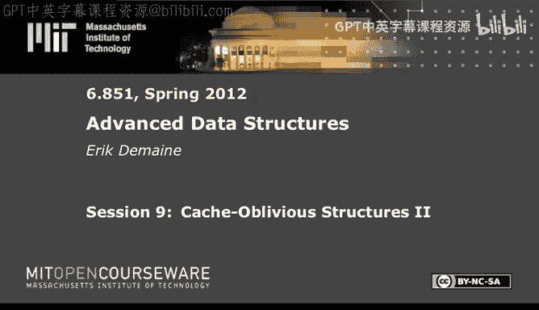

# 《高级数据结构｜6.851 Advanced Data Structures, Spring 2012》中英字幕（deepseek - P9：-09-9. Cache-Oblivious Structures II.zh_en - GPT中英字幕课程资源 - BV1FDFVzdEBA

The following content is provided under a creative Commons license。

 Your support will help M I T Open Coseware continue to offer high quality educational resources for free。

To make a donation or view additional materials from hundreds of MI T courses。

 visit Mi T OpenCourseware at O C W dot M I T dot E Du。

Alright， today， we're going do some crossover between two kinds of data structures。

 memory hierarchy data structures and geometric data structures。

 And this will be the final lecture in the memory hierarchy series at the end of Ca oblivius。

So we're going to look at two dimensional geometric data structure problems， both offline and online。

So our good friend， orthogonal 2D range searching， which we spent a lot of time in a few lectures ago。

We will come back to and try to get our bounds good， even cashably。And so instead of log n。

 we want log base B of n， make things interesting。 and the batched version is where you're given a whole bunch of rectangles and a whole bunch of points up front。

 and you want to find all the points that live in all the rectangles So that's an easier version of the problem and then we'll go we'll start with that and then we'll go to our usual the usual online version where you have queries coming one at a time。

 rectangles coming one at a time， the points are preprocessed。Will'll be static。

 And to do the batched， we're going to introduce a new technique called distribution sweep。

 which is a combination of the sweep line technique we saw back as we use persistence to make a sweep line thing into a data structure thing。

 but we're just going to use the algorithmic version of that plus a cache allivvious sorting algorithm。

 So we'll finally do cache allivvious sorting and optimal n over B log based M over B of n over B using a particular algorithm called lazy funnel sort。

Which you can actually also use to make another kind of cash alllivious priority queue。

 but we won't get into that。And so by combining those two things。

 we'll get a kind of divide and conquer technique for geometric problems that lets us solve the batched thing。

 and then we'll use completely different techniques for the online thing。So for starters。

 let's finally do cache oblivius optimal sorting。I'm not going to analyze this algorithm， because。

It's just an algorithm， not a data structure。 And also because the analysis is pretty close to。

The analysis for priority cues we did last class。So funnel sort。Is basically a merge sort。

I mentioned last time that in external memory， the right way to do or a right way to do optimal external memory sorting is an M over B way merge sort。

Cash obliviously， you don't know what M and B are。 So it's hard to do M over B way merge。 So instead。

 you basically do N merge。 not quite N way。 I can't afford that。

 but it's gonna be n to the one third way merge sort。 And the big question then becomes。

 how do you do a merge。 And the answer is with a funnel。

 And so the heart of the algorithm is a funnel。So if you have k sorted lists。That are big。

Size K cubed。Then。You can merge them。And basically， the optimal bound。So， K funnel。Kase sorted list。

 total size。K cubes。Number of memory transfers to merge them is k cubed over B times log base M over B of K cubed over B。

 There's a plus K term。And when you plug this into an actual sorting algorithm。

 you need to think about that。 But it's not a big deal as long as usually this term will dominate。

Okay， so let me show you how funnel works。We're just going to go through the algorithmic part。

 and I won't analyze the number of memory transfers。I'm try this here。

So we're going to have the inputs down at the bottom。Of this funnel。They have some data in them。

There's K inputs down here。Total size。All these is theta。K cubed。啊。And then， at the。The top here。

 we have our output buffer。This is where we're going to put the results。And this will have size。

Kay cute。Maybe it's already。 we've already done some work， and we filled some of it。Okay。

 the question is， what do you put in this triangle to do the merge。

And the obvious thing is recursive triangles as the recursion is like the one technique we know in cache levius。

Data structures。 So we're gonna take square root of K funnels。

And just join them together in the obvious way。Just like Venon Debos layout。Except。

You can quite leave enough room here。In between the levels。Are buffers。It's a buffer here。Between。

Those two， between the nodes of this funnel and the nodes of this funnel。Okay。

 these buffers may have some stuff in them。At any moment。Okay， and the big question is。

 how do you set the buffer size， This is the key step。And the claim is each buffer。

 we set to a size of K to the three/ halves。Because the number of buffers is about square root of K。

 because there's one per leaf of this funnel。AndA K funnel has k inputs。

 So root K funnel is gonna have root K inputs here。And so， the total size。Of all the buffers。

Is k squared。Which is not too big。 I'm not gonna go through the recurrence。

 but if you add up the total size of this thing， it is linear size in the output， K cubed。

I think also， if you don't count the output buffer， it's linear and k squared。I recall correctly。

We're not too concerned with that here， just overall。Once we have K funnels， funnel sort。

Is just going to be n to the one third way merge sort。With。呃。And enter the one third funnel。

Has the merger。We can only afford up to end to the one third because of this， this cubic thing。

 we can only merge， if we want。The sorting bound， n over B， log base M over B of n over B。

 we can only afford K being up to n to the one third。 So that's the biggest we can do。

So it's a recursive algorithm where each of the merging steps is this recursive data structure。 Now。

 this is really just about layout。 I haven't told you what the actual algorithm is yet。

But it's a recursive layout， right， you store the entire upper triangle， then each of the triangles。

 somewhere you put the buffers doesn't really matter where the buffers are as long as each triangle is stored as a consecutive array of memory will be okay。

And now， let me tell you about the。Actual algorithm to do this。 It's a very simple， lazy algorithm。

So there's a whole bunch of buffers if you want to。Do this merge。 Really。

 what you'd like to do is fill this output buffer。So you call this subrtine called fill on the output buffer and say。

 I would like to fill this entire buffer with elements。Precondition。

 If you're gonna do a fill right now， the buffer is empty。And then at the end of the fill。

 you'd like this to be completely full。And how do you do it。Well， if you look at any buffer。

Partially filled， whatever。 And you look right below it， there's a node in this tree。

You recurse all the way down， in the end， this is just a binary tree。With buffers in it。

So it's going to be there's a buffer。 Then there's a node。 Then there's two children。

 each of which is a buffer。And then there's a node below that， whatever。Okay。

 so how do I fill this thing， I just read the first item or the， you know， the the beginning。The。

 the smallest item for each of these， compare them， whichever smaller， I stick it here。

It's just a regular binary merge。It's kind of cool。 You've got two arrays。 You want to merge them。

 St the results here。So that's how we do fill。Binary merge。Of the two。Children buffers。Until。Or full。

But there's one thing that can happen， which is that one of the child buffers might empty。

What do we do then。Recursively fill it。That's the algorithm。Very simple。

 The obvious lazy thing to do。Do a binary merge。 This is gonna be nice because it's like two scans。

Until one of these guys empties。 and then you pause this merge and then say， okay。

 I'm going to fill this entire buffer。And wish well recursively do stuff。Toe it's completely full。

Or I run out of input elements。Tever comes first and then resume this mergech question。

Should only be two children buffers， because I question are there more than two。

This recursion of the root k and root Kate child triangles of size root k is exactly the recursion we did in a binary tree。

 I didn't say， But underlying this is a binary tree。

 the only difference between this and a ven of debos Latoos were adding these buffers。So this。

 I intended to draw this as binary。 It's a little hard to tellcause I didn't draw the base case， but。

It is indeed， binary a tree in the end。Okay， other questions。So that's the algorithm。 And as I said。

 I'm not going to analyze it， but it's the same kind of analysis。

You look at the threshold where things fit in cash or don't。And argue accordingly。

It's pretty hand wavy。I， what I want to get to is how we use this to solve more interesting problems than sorting。

 Soing is a little bit boring。So let's go to batched orthogonal range searching。And in general。

This technique called distribution sweep。It idea with distribution sweeppe。

Is that not only can we use this cool funnel sort algorithm to sort。

 but we can think of it as doing a divided conquer。On the key value。And in this case。

 we have two coordinates。 we're going to use the divide and conquer on one of the coordinates。And。

Where we have some flexibility is in this binary merge step。We're doing this binary emerge。

 And normally， it's just， you take the man， you spit it out here， you take the man。

 you spit it out here。 But if there's。That's the mean of one particular coordinate。 Now。

 you've got to deal with some auxiliary information about the other coordinates。 So in general。

 you're merging two sorted things。 If there's other geometric information。

 you can try to preserve it during the merge。 As long as you can do that。

 This is sort of the conquer part or the combined step of divide and conquer。 You can do a lot。

It's a powerful technique， turns out。It's by。Brotal and Fagerberg。

 in the in the early days of Ca oblivius。 It's the first geometric paper。呃。Fine。So replace or。Say。

 augment。The binary merge。Which is， in the end， the only part of the algorithm other than the recursion。

So it's the only thing you need to do。To maintain。Auxiliary information。

 that's the generic idea of distribution suite。And distribution sweep has been applied to solve lots of different problems。

 Battrogonal rangequeries is one of them。Generally， you've got a bunch of orthogonal segments。

 rectangles points。 So you want to compute how they intersect the sorts of problems that can be solved here。

Also， weird things like I give you a bunch of points， and I want to know for every point。

 what's its nearest neighbor。In Euclidean sense， that can be solved。

 But I like orthogonal range searchingca it's the closest to data structure problem。

 That's a problem we've seen。So the actual batched orthogonal rain searching is your're given。And。

Points。And and rectangles。And you want to know which points are in which rectangles。Okay。

 that's the general problem。 So normally， we're given the points。First。

 and then we're given the rectangles one at a time。 That's what we've solved in the past。

 That's what we will solve later。 That's the online version。 The batch version is。

 I give you a whole bunch of queries I want to know simultaneously。

 and we're going to achieve the sorting bound。N over B log base， M over B。And over B。Plus。

 size of the output over B。And this is generally the optimal bound you could hope for。

 It's not obvious you need the log， but I think for most problems in external memory。

 you need this log， you need， it's hard to beat the sorting bound。 And then once you're pay。

 the sorting bound， this is the optimal linear time to just write down the output。Now。

 this problem can be solved。 Give me all the point rectangle pairs。That， that results。

 I'm not gonna solve it here， exactly。We're gonna solve a slightly different version， or in general。

 yeah。Whatever。Let me tell you about another version of this problem， which is a little bit easier。

Then I'll sketch how we solve that problem。So remember， we've talked about range reporting and also。

Range counting。you just want to know the number of answers。 Here's something in between。

 you want to know for every point。How many rectangles contain it。Okay， in particular。

 this will tell you for each point， does it appear in any of the rectangles in the set。

It'll tell you how many。 And this is actually necessary as a first step because one of the hard parts in solving these kinds of problems。

 reporting problems is that the output could be big。 We know that's always an issue。

 But with cash obliivs， it's a big issue literally。

 because space is important you can't afford to put space anywhere， if I want to put if if in here。

 if these buffers have to get much bigger in order to store those answers。

Then life is kind of tough because then this data structure gets too big。

 And then my analysis goes out the window because things that used to fit in cache no longer fit in cash。

The analysis I didn't show you。 So it's an issue。So for starter， so the first step of this algorithm。

Is to first figure out how big those buffers have to be so that we don't have to allocate them too large。

 And to do that， we need to basically count how many answers there are。 And this is what we'll do。

 And to do this， to compute these values， the answers aren't very big。

 And these answers are just single numbers per point。 So it's no big deal。Okay， so here's what we do。

Sort the points。And the corners of the rectangles。By x coordinate。Using lazy funnel sort。

 nothing fancy here。 no augmentation， regular old sort。Then。😊，This will be useful later。

Then we're gonna divide and conquer。On why。via distribution sweep。And。Here。Our binary merger。

Is going to be an upward。Sweep line algorithm。So let's talk about that sweep line algorithm。Okay。

To pre sort points by x。And now if you think about the merging step。What this means。It confusing。

We're trying to sort by why we were in， in a certain sense。But we were。

 we're always going be sorted by X because we did that up front。

So the picture is gonna be something like this。 We're in a slab。 There's gonna be the left slab。

 So here's the。Here's the binary merger。There's the L points and the R points。

 The L points are going to be in a particular X interval。

 The R points are going to be in another X an adjacent X interval corresponding to this tree picture。

And then。We have these points。Which， you know， they， they overlap and why。

cause the whole points were trying to merge by why。Okay， we also have some rectangles。

And their corners are what we have represented。Probably should have used colour here。u。

Thing like this。Okay。And now we， so we're given essentially， we。

 we have whatever we want on the points and corners in here。

 We have whatever we want in the points and corners in this lab。Let me add a little bit of colour。

These lines。And now we want to merge these two things。

And merging here is all about counting how many rectangles contain each point。 Now。

 we already know how many points over here are contained in rectangles that are over here。

So we've presumably already found that this point lies in this rectangle。We've already found。

 I guess there's no points here。 already found that this point is contained in this rectangle。Okay。

Because these corners were in this slab。 And so let's say every corner knows the entire rectangle。

 So when you were processing R， you saw these corners， you saw this point。

 somehowhow you figured that out。What we're missing。Are things like this rectangle。

Where none of the corners are inside R。 So R knew nothing about this rectangle。

 And yet it has points that are contained in it。 Similarly。

 there are these rectangles that completely span L。They go。 and so therefore。

 none of the corners are inside out， but we need to know that these points are in there。

Those are the only things that will'll be missing at this level。Now， there might be， I mean。

 there might be other rectangles that completely span L and R。

 Those will be discovered at higher levels， not here。

It's a little bit awkward to check that this will actually find everything。But it will。So to find。

 to figure this out， we have to when we're merging L and R see L knows about this rectangle because it sees these points。

 we want to keep track as we sweep upwards， we want to realize that these points are in a big rectangle here。

 whereas they weren't discovered in L， they weren't discovered in R。To do that， we maintain。A。

 a number， as we we have a horizontal line， we're souping up。

We want to maintain the number of active。Rectangles。Active means。

That it's currently being sliced by the sweep line。That have。Left corners。In L。And。Completely span R。

So， that's。These guys。 So that's easy to do as we're， as we're， we're merging these points。 So they。

 they each of them has been sorted by y。 Now we're doing a merge。

 So we're considering all the corners and all the points in increasing y coordinate as we do that binary merge。

So whenever we visit a left corner of a rectangle， a lower left corner， we say， oh。

 does this rectangle go all the way across。 This one does not。 By the time we get to here。

 this one goes all the way across R。 And so we increment C L。

 And when we get to the upper left corner， we decrement C L。 say， oh， that rectangles over。

 So it's very easy to do constant time or constant time。

 but it's only going to be one over B memory transfers per one of these because it's a nice。

 cheap merge。😊，And then， symmetrically。We do C， R is the number of number of active rectangles with the right corners in R that span L。

 So that's。This guy。LetSee。C， R， I guess。 And this guy is C， L。In general。

 there might be a lot of them， so you count them。And then only thing we need to do。

When we encounter a point as opposed to a corner， we're storing them all together。We add。

 I got this right， CR R。2。It's counter。We want to know how many rectangles contain that point。And so。

 for example， when we see this point and C R is currently one。

 then we know that this point appeared in some rectangle that spanned L。

So we increment this points's counter。 Similarlyly， when we see these points， C L is positive。

 So we increment these guys counters by whatever C L is。So this' is a symmetric version。In R。

 we add C。Probably should have called them the other names。 But anyway， CLCR doesn't matter。CLRS。

Question。Bottom is the Xx。This is the X axis， yeah。

It does look like we're divided and conquering on X。 I think you're right。Sorry。ForSome reason。

 I thought it was why。You're right。So it's a funny thing。 We're， we're pre sorting by X。 Yeah。

 which is what's getting us。 Thank you。 That's much clearer Now。 my mind is like。

 there's something weird here。 We're pre sorting on X。

 And then we're just sticking these guys down here。 Its like evenly dividing them into， into lists。😊。

Or I guess actually， we're doing our or is it funnel sort， the merge sort。

 things have already been sorted by X。 But now we're merge sort， merge sorting again。 And this time。

 when we merge， we carry along this information。So they're both in terms of X。

 which is kind of funny。 Sos another another question。Is it important that really upward？啊。

The upward sweep。Yeah， we have to do the points in order by y。So confused now。We're， we're to。Yeah。

 I know in the notes， it says Y， it used to say X， I believe。We're dividing and conquering on X。

 but we're sorting by y。 And that's the confusion。I'll， I'll double check this。But in order。

 in order for this sweep to work。So it's like， you first sort by x。You throw we are， in some sense。

 doing divide and conquer by X because we did this sort by X。But the merge short is on why。It's。

 right， it makes more sense If you're already in ex order， sorting isn't gonna learn。

 isn't gonna learn you much。 isn't gonna teach you much。So first， you start by x。

 Things are nicely ordered by X。 So we get these nice horizontal slabs in the decomposition。But now。

 when we merge， now we're gonna sort by why。 So we're gonna reorder the points。

 And that's what lets us do the sweep。And we are， in the end。

 merging all these points together in y order。And as we do it。

 then we get the information we want about rectangles and points， okay。

This is why I wanted this to be both X and y。But really， the divide conquers happening on X。

 But we are doing a merge sort on y。Finally， clear。Thanks for helping me。

 this is a new lecture you may have guessed。So still working out some kinks。 But I。

 I really wanted to introduce this lecture， because。The next thing we're gonna cover。

 which is a way to do orthogonal 2D range search cache obviously， is super cool。 It's。

 it's like one of the craziest things。😊，There is so。At least in the cash bolivious world。

 Any other questions before， oh， I should say a little bit more about this。 This is， we。

 we've now solved this first step。 So speak， which is figuring out the output size。

Counting helpp for each point。 How many rectangles contain it。

Which is an interesting problem by itself， that's the range counting problem。

You can also use it to figure out at this level， at this merging step。

 how many things will be output here。How many new outputs are there。

 How many points and rectangles are there。 It's essentially just the sum of all those things。Okay。

So you can count the number of outputs per merge。 And so then there's a a natural strategy。

 which is you build a new funnel。Structure where these buffers have the right size。

You've pre computeutd what all the sizes need to be at every merge。

 You know how many things are going to get spit out here。So you could allocate that much space。

And that will be。Kind of decent。M because I haven't done the analysis。

 It's hard to get into detail about this， but it will not be optimal， unfortunately。

To actually make it work， you end up having to take this tree， carving it into subtes of linear size。

So normally， the whole thing is linear size， everything's fine。

And where the analysis breaks essentially， is if you have a giant buffer because one of the outputs。

 potentially the output size here is quadratic。 And so you might。

 the overall thing might be super linear。And so when you have a super linear buffer or a bunch of very large buffers that sum to linear size。

 essentially need to carve that tree， which you do by a recursive carving of the tree so that each of the trees has linear size。

 Then you apply the analysis to each of the trees separately。

 You store them consecutively separately。Each of them has good optimal running time。

 and then the combination does。 That's the hand wavy version of how to do actual。

Range reporting with endpoint and end rectangles。 If you're interested in the details。

 read the paper。 It's just a little bit messy。And especially when you don't know the analysis。

I wanna move on to online orthogonal 2D range searching，cause it's。It's the hardest and coolest。

Of them all， unless there are more questions。系right。Do range。いを？因为。Exactly， if， at this point。

 if you believe in funnel sort， you should believe that range counting is easy to do。

And I' just hand wave the range reporting part。Are you scbing why you ask。That's where we stand。嗯。

The next thing we're gonna do is， is regular range reporting， regular online stuff。

 So this is orthogonal。2D range search。And we spent a couple of lectures on 2D and 3D range search。

 All this crazy stuff with。Fraactional cascading and so on。 And the layered range trees。

 We're gonna use some of those techniques that we， we built there。 And in particular。

 you may recall there was this idea that if we have a bunch of points。

Regular 2D range searching is I give you a rectangle。 Give me all the points in the rectangle。 Fine。

 Our goal is to achieve log base B of N。Plus， output size over B。That's the new optimal bound。

 This is how long it takes to do a regular search in one dimension。So。If you have output size。

 whatever。 and we we'll probably be able to do range counting， but I won't worry about it here。

 We'll just think about range reporting if there's this many points。

Output them all in that much overbe。This is what。We call a regular range search。

 but I'm gonna distinguish it and call it a four sided range search。

 because a rectangle has four sides。啊。But you could think of the other versions。

 and we actually did this when we were doing the 3D problem。So， if these are。2 rays and an edge。

 this you might call a three sided rectangle。And you can go all the way down to two sides。

 Hard to go down to one side。呃。Here is a two sided rectangle。 just has two rays。Okay。

 as you might expect， this is easier than that。And if I recall in 3D。

 we ended up doing this thing in linear space with this fancy first you do a search on the left coordinate。

 and then you just walk， we'd subdividideed with fractional cascading so that every face had constant size。

 and so you could just walk and each step you'd report a new point。

 if you may recall for this kind of two sided thing first you search for this。

 and then youd basically just follow this line。Till you found this point。This corner。

So in this we could achieve in linear space。Larithmic time。This one， we needed。N log n space。

 actually， the best known is N log n divided by log log n。Those。

 but we could do n log n using range trees。And we got down to log n time using log n query time and log n space using layered range trees。

Okay that what that was the internal memory， regular algorithms。Am I missing an M over B， No。

 this is log based B of n， not log based M over B of N。 Yeah， it's good to ask when we're sorting。

This kind of thing， we get log base M over B。But when you're searching。

 the best you can do is log base B。 We actually proved a lower bound about this in the first memory hierarchy lecture。

 because if you're looking at B thing， I mean， when you read in a block。Becauseuse this is online。

 You read it in a block。 You can only learn where you fit among B items。

 And so the best you can hope to achieve is log based B N for search in one dimension。

 So this is a lower bound for search。When you're doing batch operations。

 then you can hope to achieve this stuff。Which is a lot faster。

Then it's like one over B times log the same over B of n over B。Okay， so in a certain sense。

 this is slower than the batched operations。 but it's more online。 So it's a trade off。Okay。

 so for all of these problems， we can achieve log based B of n plus out over B。

 The issue is with space。Maybe I'll do sort of。Regular Ram algorithms。Versus Ca oblivious。

So we've got two sided， three sided， four sided。And for two sided。呃。

Believe these are the right answers。Login over log log n。We haven't actually seen this one。

And cache oblivious。Here's what we can do。This is with optimal query times。And this is all static。

Okay， and if there's time， I'll cover all of these。So they're not， not perfect。

 These two were off by log factor。But， not bad。Pretty good orthogonal 2D range queries。 And really。

 the coolest  one is this one。 This one blows my mind。 And every time I see it。 So let's do it。😊。

We'll start with two sided。 And then we， we have existing techniques Once you have two sided to add on more sides。

 you may recall from the 3D range searching lecture。

 So we're gonna use those techniques and refine them a little bit。To get that log， log factor。

But you may recall way back when。That lecture 6 or so that we had a technique once it was two sided。

 every time we added a log factor in space， we could add another side。

 The hard part was getting up the number of dimensions。

 Then the easy part was turning half infinite inter intervals into regular intervals。

So it's once we have this， it's easy to add a log， add another log just with a bit of sophistication。

 we can save a log log factor。But， let's do。2o sided。 This will be the bulk of。The lecture。

This is a paper by。Arga and Z in 2006。Alright， so we wanna do。

 I'm gonna assume that they are this kind of quarter plane  queryries。 So less than or equal to x。

Less than or equal to。Some y coordinate。 we want to know all the points in that quarter plane。So。

Here's what we're going to do。It's all static。We're going to have a venom de layout。So binary tree。

On。The Y coordinate。So this just stores all the points sorted by y。Okay。

 so if you if you want to do this query， you search for that value of y。Then each of these。

Positions in between two keys in here， has a pointer。To an array。The array is not sorted by x or Y。

 It's a weird， very weird thing。And then here's the algorithm you follow。When you。

 you follow this pointer， you go here， you walk to the right。Until you find a point。

Whose X coordinate is too big。Bigger than x， I should probably call this x 2， Y 2。

So first you search for Y2 here。In this thing keyed by y。 follow the pointer。

 you look at all the points that have x coordinate less than or equal to x2。

 Those are the ones you want。 Once you find a point whose x coordinate is bigger than x2， you stop。

 and then you report these points。And it's not quite so simple because some of these points might be duplicates。

 You have to remove duplicates。 That is your answer。To me， this is an insane idea。

I would never imagine this to work。But the claim is， you can make this array have linear size。

 That's the hard part。Make this， the amount of stuff that you have to traverse here， be linear in。

Out in the number of points that are actually in this range。So you don't have you。

 you are going do a little bit more work because there are duplicates in here。

 but only a constant factor more work。And yet， somehow。

 you've taken this two dimensional problem and squashed it onto a line。

You did one search at the beginning， which costs you log base B event。 then you do this linear scan。

And you get the right answer， magically。I don't know how they thought this would be possible。

 but magically， it turns out it is possible。It was kind of a breakthrough in。

Cash oblivious range searching。 It was known how to do this of external memory。A lot easier。

For example， you can do it with persistence。But。This is a much cooler way to two sided rangequeries。

Alright， so I've explained the query algorithm。呃。Well the big thing I haven't explained is how to build this array。

And yeah， maybe， maybe I'll write down the things we need to prove as well。

Before we get there so you can think about them as we're writing down the algorithm。

First claim is that this algorithm， which just decides to stop whenever it gets an x coordinate that's too big。

 actually finds the right answer。Finds all points。And。The range that we care about。

Second thing is that。The number of scanned points， the length of that step here。Is order。

The size of the output。The number of actual output points。 So there isn't。

We don't waste time doing the scan。And the other thing is that the。Aray。Has size order。

 And that's sort of the。Biggest surprise to me。So those are the three things we need to prove。

About the algorithm。Which I will now tell you。Okay， before I can define how this array works。

 I need to define a concept called density。So。IfWe look at a query。呃。

There's sort of two things that could happen。The good thing for us would be， if。呃。Get this right。

The number of points。And less or equal to x star。Is at most alpha times。The number of points。

And the answer。Okay， star means no restriction on y minus infinity to infinity。

This would be good for us， because。It says， I mean， ultimately。

 what we're trying to do here is do a scan in X。So， if。Yeah， what's the right。Right thing to do here。

 Then for the， for this particular y coordinate， we could just basically start at the beginning of the array。

 start scanning。And just report all the points that are actually in our range。 Sorry， I need。

 I need to also here， potentially throw away。Points that are not。Not low enough。So the answer is。

 is contained in here。I should say to throw away duplicates。

 you have to throw away points that are not in the range less equal to x comma， less equal to y。

 Still， we claim the number of scan points is proportional to the output size。That's what we need。So。

If this held for every query， we'd be happy to start at the beginning， scan。😊。

And as long as this alpha is some constant， it's going to be a constant bigger than one。

Then the number points in the answer is proportional。Or sorry。

 the number of points we had to scan through is proportional to the number of points in the answer。

 And so we're done。Okay， so this is the easy case。 We need to distinguish it。Otherwise。We call。

This range。Query。Spare。And those are the interesting cases。So， nothing deep here。

But we're going to use this concept a lot。Okay， so we're gonna actually try to solve this problem twice。

 The first try isn't gonna be quite successful。But it gets a lot of the right ideas。

So I'm gonna to let S 0。Be all the points。sortred by x。Is gonna be sorted by x。Put things down here。

And just to give you an idea where we're going， the array。We're imagining heres first。

 we'll write down all the points。 Then we'll write down some subset of the points。 S1。

 then some subset of that subset and so on until we。Get down to a constant size structure。Okay。

 first， we write down all the points。 Why， Because for dense queries， that's what we want。

 We want all the points to sit in there。 So then you can just read through all the points。

And dense queries will be happy。 So for。If we detect a Y coordinate where it the query is gonna be dense。

 I don't know how we detect that， but let's not worry about it right now。

 then you could just look through S 0。 that's fine。But some queries are gonna be sparse。

 And for that， we're gonna use S 1， S 2， and so on。The intuition is the following。If in your query。

 the Y coordinate is very large， like， say， infinity。Then your query is guaranteed to be dense。

 It doesn't matter what x is。Okay， and in general， if if， if y is near the top。

 like it's at the topmost point or maybe the next to topmost point or maybe a little bit farther down。

 depends on the points that。Then a lot of queries are going to be dense。So that's good news。

 Let's consider the first time when there's a sparse query。😊，So， we're gonna to let。Why I。Bi。😔。

The largest Y coordinate。Where。Some query。some x coordinate。That Y coordinate。

So to be less than equal to x comma less than equal to Y， I。Is sparse。In S。I-1。Okay， so initially。

 we have S 0， all points。 Y 1 is the largest y coordinate where there'。

 So we work our way down until there's some sparse query in S 0。 That's why I。So。Then。

 we just filter。Based on that。So throw away all the points above why， above Y I。

So we're going to say take S I -1， intersect it with the range query。Star less or equal to y， I。Okay。

 so the picture is we have some， some point set。And。Here。And， at some， up here。

 every possible query along this line is going be dense becauseuse everything to the left of the X coordinate will be in the output。

At some point， we're going to decide， oh， this is too scary。 There's a query here。 maybe this one。

 or maybe it's this query。😰，That's sparse。 And so we say， okay， let's throw away these points。

 redo the data structure from here down， ignoring all these points。Repeat。Write down these things。

So the idea is that if you look at a particular query， it will be dense。In one of these sis。

And you can tell that just according to your Y coordinate。Becauseuse he said， oh， well。

 if you're up here in Y coordinate， you're guaranteed safe。So， just。Do that search。In your York K。

 in general， we continue this process。Until we get to some S I that has constant size。At that point。

 we're done。 Then we can afford to look through all the points。Unfortunately。

 this is not on a very good strategy， but it's a first， first cut。 and it's close to what works。

Here's a problem with it。Suppose you have this point set。Okay， what happens is start at the top。

 everything looks fine。 at some point， you decide， ohh， there's a query here。Ily， this one。

 which has an empty answer。And yet， there are points to the left。Of this X coordinate。 right。

 So that's bad。Because zero， it's very hard to get within a constant factor of zero。

So pretty much immediately， you've gotta draw a line here and say， okay， S 0 is all points。

S1 is these points。S2 is gonna be these points。In general， they're suffixes of the points。

 And so the total space will be quadratic。So the first two properties will be correct because you're just looking in S 0 or S1 or whatever。

Everything looks fine， but your array does not have linear size。So， no good。First， try failed。

Second time a charm。So。a little more sophistication。And how we do this partitioning。

And we build our array。And we'll get it。I have written here。 I didn't read this before。 This one。

 one line that says maximizeim。Common。Suffix。I have no idea what this means。

 but maybe it will mean something by the end。 Let's see。Okay。Here this is the part I've read。So， X I。

Is going to be。So we had a Y eye。That's going to be the same as before。

 This is why I did the first attempt。 This definition remains the same。

 So largest y where we have some sparse query in S I -1。Okay。

 I want to look at what that X coordinate is。ItJust said here it says there's some X。What is that X？

Let's just look at the maximum possible X that it could be。This will turn out to be really useful。

 maximumum x coordinate。Where less than equal to X I comma， less than equal to Y， I。Is sparse。

And S I -1。Okay， we know there's something we can put in here that makes Y I sparse， so。

Look at the largest possible such x。 So that means any query。So we have this new point。

It's not an actual point in our problem， but it's a query， X， I， Y I。And it's dense。Or sorry。

 it's sparse。 It's bad。We know that。Any query up here。Is dense。 That was the definition of Y I。

And now we also know that any query。Over here， I guess， not saying a lot。

But these queries are also dense because again， if you're far enough to the right。

 that's gonna be basically everything。So's let's get rid of that as well。And this is a problem。

queries over here are also potentially a problem。 We don't know。K， it doesn't seem like much。

 but it will be enough。We're going redefine S I， as well。So here's the fun part。If we have。

Some S I -1。We're going to define a new thing， which is P -1。Wch is this。Okay， this is a funny thing。

But， it is。This part。Of the point set， this is P -1。So the points we care about are kind of here。

 But let's just take everything to the left of this X coordinate。 Why not？ It's a thing。Okay。

 that is PI-1。 So S I -1 is everything in this picture。And now just first， let's restrict to x。

 Then the next step is we're going to restrict to y。But it's in a funny way。So this is the S I。

 the next S set。Take the previous set。we intersect it with。A funny thing。嗯。

It's harder to write algebraically than it is to draw the picture。So it's intersected with a union。

 which is basically。Theyre I draw on the same picture。Its my red。诶。

It's gonna be less than or equal to y。This thing is gonna be S I。Okay。

 we'll see why eventually this works。 I still don't know what maximizeim common suffix means， but。

We get there， so。We're looking at the points below the line。 That's what we did before。

 We used to say S I is just the intersection with less than equal to Y I。

 But things are just a little bit messier because of。This restriction， do I really not have a P here。

Okay， here's the difference。The reason we have to go through this business。

 the array that we're going to store is not the Ss。 Ss are still too big， potentially。

What we're going to store are the PIs。To P Im-1。 And then in the end， we're gonna store S I。

 S I again， has constant size。The final S I has constant size。

 probably should use a different letter， S K or whatever。We do。

 we keep doing this until we get down to something constant size。 Then we store it。 That's easy case。

Until then， we just started P I because really， I， we know that all the queries up here and over here are okay。

They're nice and dense。 We sort of only care about the points to the left of the line。Okay。

 but that essentially， S I has to pick up the slack。

And we have to include these points in the next SI， whereas before we did not。

 before we just took things below the line。 Now we have to take things that are below the line or to the right of the of the vertical line。

Okay。This is essentially necessary for correctness。So we kind of win some， we lose some。

But it turns out。All is well。So I know this is weird。啊。But， let's jump to。The analysis， these claims。

 in particular， that the array has linear size。Think about that。

 And it will become clear why the heck weve made these choices。Let' see you have a question first。

 Is there any relationship between the SI here and the S。Now。

 this definition of S I is no longer in effect。 S 0 is correct。

 and all the S Is are still sorted by x。 But yeah， this is， we're no longer doing this。

 instead of this rule， we're doing this rule。 So it has， this part is the same。

 But we have this extra union， which contradicts the previous rule。So the Y I definition is the same。

 Sorry， it's a little weird。 X I is new。 P I is new， and S I is new。Okay。At this point。

 it's this algebraic weird thing。But here's the cool thing。For the space bound。Cim is。P I -1。

 intersect S I。Is less than or equal to one over alpha。Times。P I，-1。Okay。

 this is hard to even interpret what it means， but it's good news。So remember。

 alpha is a number bigger than one。 It's the， we， what we use in the definition of density。

 And you can set this parameter， whatever you want， say 2。Okay。

So then we're gonna get that this thing， whatever it is。

 is at most half the size of the previous one。Okay。I claim this is good news。

I claim it means that these Ps， centrally。Are geometrically decreasing in size， which is how we get。

It's not。 that's not quite right。 but， this will give us a charging scheme。

Which will prove that the whole thing has linear size。Okay， first， why is this true？

Could really only be true for sparsity from the alpha。 right， So we said， oh， density is good。

 If we have dense。😊，There's nothing to do。 Just put the points in X order。 We're done。Sparrse is bad。

 but actually， Sprse tells us something。It tells us there are a lot of points that are not in the answer。

So we're looking at this query， X I， Y I。Right， we'd like to just say， oh。

 start it negative infffinity and just take all the points up to here。If we're dense。

 that is within a constant factor of the number of points that are actually in the answer。

 which is down here。If we're sparse， that means there are a lot of points up here。

Most of the points have to be up here in order to be sparse。Okay。

 and that's actually what this is saying。 If you expand the definitions。 So P I-1。

 that was all the stuff to the left。Okay， so that's this thing。

 This is what we would get if we just did a linear scan from left to right。

Versus we're considering the points in P -1， which just restricts to X。

 And then we're looking at S I。S I does， you know， this business。

 But if we restrict to the S I points that are to the left of the line。

So we're looking at basically this left portion， which was this white rectangle。

 intersected with this funny red rectangle。Which was kind of awkward。

 but the intersection is just this。 that's the answer for this query， X， I， Y， I。Okay。

 so this is the size of the。Size of the answer。um。For。X， I， Y， I。And this was number points。left。Of。

A number of points in less or equal to X I star。We wanted to just do a linear scan like this。

But this is the correct answer。 And because we know that this point is sparse。

 that was the definition of X， I and Y。 I was the maximum sparse point。 So it's a sparse point。

 Therefore， we know that this does not hold。So the number of points。

 let's say equal to X comma star is greater than alpha times number points in the correct range。

 And if I got it right。That should be this。 put alpha over here without the one over。

 And I guess this is strictly greater。有 big deal。Okay， so that's the definition of sparsity。

So this is the cool thing we know now。We're going to use this。 This is now a numbered less than one。

Question。The first one you have that is the number of points less an exciting star。Yes。

 that's the definition here。Right， for after we restrict the SI， yeah。

 we've thrown away all of these points。 So if you think the next P， it's not gonna be the points。

It's true。 I don't。 when I say points， I don't mean all points。 I mean， points in S I M1。 In fact。

 I'm dropping that'cause it gets awkward to keep talking abouts long So that's a correctness issue。

Essential， you have to argue that we can throw away these points and it's safe。Once we do。

 then you just for ignore their existence。 And because， I mean。

 you can ignore their existence because you already solved all the。

 you already solved all the dense queries which are over here or over here。

 which involve those points。And so we， we now know that we're only gonna be twin queries from here down。

And so otherwise， you look at P0。So forget about those， forget about those points。

 Now you're gonna be searching in one of these structures so you can forget about all the points over here。

 So that's that argument。Now， once， once you've restricted to S I -1 and you don't have to look at any other points。

 Among those points， this is gonna be all the points less than equal to X I。

But that's how we were defining sparse， right， We said sparse in S I -1。 So it's among those points。

 We have sparsity。 So this is the definition of what we have。Okay， the claim is it's a good thing。

 here's a charging scheme。So this is by sparsity。So， I'm gonna charge。Storing。P I -1。two。P I-1 S I。

Its algebra。have to interpret every single time。 But that's fine。 Let's look at the picture。 Okay。

 P I -1， remember， was this white rectangle here。Everything to the left of the line。So now we。

 we have to store P I。 So we wantna， we want that the sum of the sizes of the P Is is good。

 And so here's my charging scheme。 We have to store P I -1。I'm going to charge it to these points。

 What are those points。Those are the points that are inside the white rectangle， but outside the red。

T the， the red L shape。So that's these points。 This is P-1 minus S I。

Those are the points that I'm throwing away。That's good。 because if I charge them now。

 I will never charge them in the future。Becauseuse I just threw them away。

 are no longer they're not in the next S I。So。Each point overall in the point set。

 only gets charged once。Okay， how much does it get charged。

 How do the these things relate to each other in size？ That's where we use this thing。

It's confusing to think about intersection versus difference。 But the point is。

 we look at the P minus- ones that are in S I。 That's a small fraction。 Think of alpha as 100。

 So then the P I-1。 So this part down here， that's in S I。

 this is only 100th of the whole white rectangle。So that means this part is 99 hundreds。Of the PI。

So if we charge the storing of the entire rectangle to these guys。

 we're only losing a very small factor， like 10 over 99 or something。

It is actually exactly 10 over 99， I believe I worked it out。And the， the factor of charging。

 assuming I did it correctly is  one over 1-1 over alpha， which works out to alpha over alpha -1。

 It doesn't really matter。 It's， But the point is， it's constant。I think that's easy to believe。

Maybe it's actually easiest to think about when alpha is 2。So， then。At most。

 half the points are here。 At least half the points are here。 And so we're charging。

 storing the entire points set to these points， which will never get charged again。

 So we're only charging with a factor of  two。That's all we need。 constant factor。Okay， therefore。

 this thing has linear size。That's the cool thing。 We get more， though。

 We also get the query bound we want。Let's think about the query bound。So。This is fun。

Think about where the query is。 It used to be over here。 We do a search in S 0。

 or we do a search in S1， or we do a search in S2。 We'd never do we'd never look at multiple Ss because there'd be no point。

Either Eerro was dense and we're fine。 Just do it， or you have to jump to S1。 S some guys up top。

Do the search in there。 fineine。 We no longer have that luxury over here because we're using P instead of S Is。

 So it actually may be a search starts in P1， but then has to go through P2 and has to go through P3。

But it's okay because the farther we go right。We have this sparsity condition that tells us basically the points we're looking at。

Our。 the number of points we're looking at are getting smaller and smaller。

So I'll wave my hands a little bit here， but。Claim is it's a geometric series。

This sne a formal proof， then。Won't go through it here。Decreasing。So。So this is the query bound。

 the number of scan points is order。Output size。 So you have to check that no matter where you start in PI。

 that's a little bit tricky part。 We're not looking at all of P。 We're looking at some of PI。

And then we're going to the right from there。Actually， is that true。

 Maybe we always look at all of PI。Think about this。I think we do， actually so' right。We。

That's what we did before。So， you know， we basically figure out where we are in Y coordinate。

 That was the overall structure。 We had a phom debo search tree on Y。

 So all we know at this point is the Y coordinate of our search。

And so we use that to determine which of the Ps we go to。

Based on sort of where the Y I becomes no longer dense。

And then we're gonna have to search for that entire PI and potentially more of them。Because。Yeah。

 because this is no longer an SI， it's just doing the things to the left。And so， you know。

 if we're lucky。The PI we're looking at or the query we're doing。Is not to the right of this point。

Okay， maybe it's right here。 That would be great。 Then all our answers are done。

We know our our queries here， that would have been dense。

 so we would have done it in an earlier stage。Our query might be down here， though。Okay。

When the query is down here， we need to do we need to report on these points。

 then we're gonna to have to do more。 That's going to be P plus one。So we'll do more and more。

PIs until we get to our actual query。Here。Okay， but in any case。

 the claim is that this is geometrically decreasing by the same charging scheme。Okay。

 that's two out of the three claims。 There's one more。Which is closely related。

 still about the query problem。 What we haven't shown is that we actually find all the points。

 This is what you might call correctness。To prove this， what we need to say what we。

 what we claim is that after you do the P1s and now you do the， say， now you do the P2s。Well， I'll。

 I'll， I'll tell you the claim is that。And you visited some X coordinates here。

 The Ps were all the things up to some X coordinate claimed that the very next point in here in P2。

Has a smaller X coordinate than what you just did。Okay， I think that should be clear。 I mean。

'cause presumably there are some points in here。AndSo the very next P is， it's。

 it's restricted within this red thing， but it's gonna be up to some X coordinate。

 So you're basically starting over every time you go to the P I is， you're starting over in X。

Go back to minus infinity and x。So the idea is， is the picture will look something like this。

 You start at minus infinity。 You read some points。 at some point， you run out of the P Is。

 Then you start over again， you read some smaller set of the points。 Maybe you get a little farther。

 start over again， read a little farther。 At some point， you're gonna reach your threshold X。

 That's when you stop。So， that's correctness。Soundbelievable。

 I feel like I need another sentence there。Right， once， once your P I encompasses your X range。

 you are that's gonna have your answer。 Then you're done。 So that's this moment。

And so the only worry is that an early P basically or or you know， maybe the next P does this。

 and then we do this or something like this。 That never happens basically because you're always resetting X range。

 And so your x will always start over to something less than what you had。

And so the termination condition， which I probably didn't write down here， but which is， yeah。

 stop when your x coordinate is bigger than what you want， never terminates early。Therefore。

 we get all the points we care about。Okay，A little bit hand wavy， but that is。

Why this structure works。 It's kinda， it's a very weird setup。

But linear your size and you just jump into the right point in the array， start reading。

Throw away the points that aren't in your range because they just happen to be there。

 Those would be these points up here。Throw away。Duplicates。Just output the points in your range。

And it gives you magically all the points in here by a linear scan。 I still find this so weird。

But it's true。Truth is stranger than fiction， I guess。There fun facts。

 You can actually compute this thing in the sorting bound。 So pre processingcess is just sort。😊，嗯。

And won't prove that here。So this was two sided。 Let me briefly tell you how to solve3 sided and four sided。

 I mean， we basically already did this one。Which was， I'll remind you。What it looks like。

So you have a binary tree。And in each node， you store two augmented structures。

 one which can do range queries like this and one which can do inverted range queries like this。

This should look familiar。And so you do your， you do a search on， let's say we wan to do。

This thing have x1， x 2， Y 2。You search for x1， you search for x2， find the LCA。And then in。

 let's see in this subte， you do a search。Right， in this sub。

 you already know that you're less than X2。 And so you do the X1。呃。Why to search。In this node。

And then in the right subte， you do the。X 2。Yhy to search， you take the union of those two results。

And that is your。This query。Right， that's how we did it before no。No difficulty here。

 And the point is， in this world， you can build this， put in a van em debo layout。

 You do this search， you do this search。 you find the LC A in log base B of N to check that everything works cacheliviously。

 Then these structures are just structures which we already built。And so， yes。

 we lose a log factor because every point appears in log data structures。But。That's it。

Everything else works the same。 So we get N log N space， log base B of n plus output over B。Query。

 because we now we just have to do two queries instead of one。 We don't lose a lot factor。That's the。

That's the trick we did before。Okay， that's easy。啊。One more。That was three sided。Next is foresighted。

Foresight， of course， we could do exactly the same thing。 It was another log factor in space。

Maintain log base B of N plus output over B query time。But I want to do slightly better。

 And this is a trick we could have done in， in internal memory as well。 but I have。

2 minutes to show it to you。 So here。Her bonus。And didn't have to do an external memory context。

 but we can。Foresightd。So we're going to do the same thing。But not on a binary tree。

Take this binary tree。 This is sorted by X， I suppose。This is key on x。Instead of making a binary。

Make it root log and airy。So imagine taking the binary tree。

 taking little chunks which have size square root log n。Is capital N。

And imagine contracting those chunks into single nodes。

 So we have a single node which has square root log n。Children， another known。

 has square root log n children。And this is all static。And so on。 Otherwise the same。

The augmentation is gonna be a little bit different。Okay， if we look at a node。

Were going to store same things we had before， which was this kind of query。And this kind of query。

We're going to store a little bit more。Namely， for any interval of children。

Like here you have some start child and some end child。

I want to store for all the points that are down there。For this thing。

 store a regular binary search tree on y for those points。Why， because if we do a search， okay。

 same deal。We find the LC C A。Of x 1。Ex1。I don't know。Let's say it's on X。Let's do it again on why。

 whatever。啊。So here's the LCA， let's say there's a lot of children。Okay， maybe。Here is X1。

And here is x2。Okay， so in this subte。We do this sorry， we do this range query。Cause that it。

 we want to go from X1 to infinity。Over in this subt。

 we want to do this range query because we want to go from infinity， negative infinity to x2。

But then there's all this stuff in the middle。 I don't want to have to do a query for every single tree。

Instead， I have this augmentation that says for this interval， here all the points sorted by。

Excord it， I guess。We're doing it this way。啊。Fine， so then it is a range query。 I mean。

 I I want to know， what are all the points。Wow， this is confusing。Like， I've missed something here。

No， this is on why， sorry。Mh。😊，These points， I've got sorted by Y。 So I should draw it the other way。

RightThese points we already know are in between x1 and x2 and x。

 We've already solved the x problem here。 So now I just need to restrict to the Y range from y1 to y2。

Though in these trees， these already match in X。 I just need to make sure they match in Y。

So I do a regular 1 D range tree。 I search for Y 1， search for Y 2， Take all the points in between。

 This is cheap。If I just have a regular old binary search tree， now， this thing has linear size。

This thing has， sorry。I think， I actually need。I should have a three sided range query， thanks。

These should be three sided。Cause here， I know that I've got the right side covered already in this tree。

 I've got the left side covered already in this tree， but I still need the remaining three sides。

 In here， I only need these two sides because I've already got x 1 and X2 covered。Okay。

 so this is cheap。 I only need the linear space data structure。 This thing is not so cheap。

 I'm using the previous data structure。This thing， which has n log n size。

 These are three sided range queries。Sorry for drawing it wrong。 so I need two。

 three sided structures。 Then I need actually a whole bunch of these structures because this was for every interval。

 But conveniently， there are only log n intervals because there's root log n children。

 So root log n squared is log n。 So there's root n。 but then we need log n of them。

And so that's what these things balance out， as you see。So normally， this would be n log squared n。

Because every point would appear in log n trees。 But now the height of my tree is merely log n over log log n with a。

Factor 2 out here， because I have a square root here。Okay， so tree has height log n over log log n。

 So each point only appears in log n over log log n structures。

 Each of them needs a structure size n log n。 So we end up with n log squared n over log log n space kind of crazy。

 But this is how you get that last little bit of log log n space improvement by contracting nodes doing a simpler data structure。

😊，For these middle children and just focusing on the the left child and the right child。

 you have to do one three sided call。 But then the middle is a very simple two sided call。

 It's just a 1 D structure。And so， it's really cheap。啊，这。

