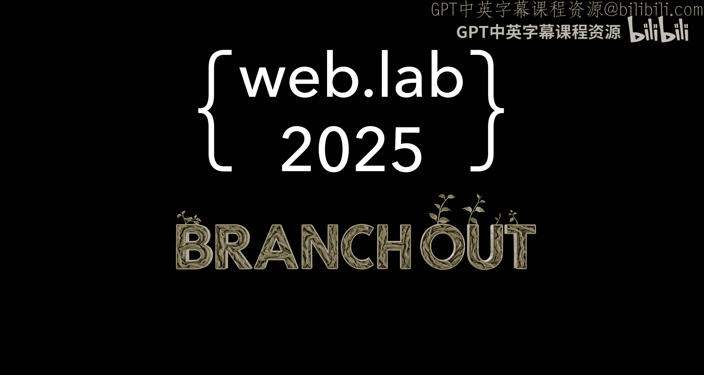

# 001：课程主题揭晓 🎬

在本节课中，我们将了解MIT 6.962 Web开发速成课程（IAP 2025）的核心主题与目标。课程旨在通过实践项目，带领大家快速掌握现代Web开发的基础技能。

课程的核心是构建一个功能完整的Web应用程序。这不仅仅是学习孤立的语法，而是将前端、后端和数据库知识融合起来，解决实际问题。

---

## 课程核心：项目驱动学习

上一节我们了解了课程的整体目标，本节中我们来看看其核心教学方法——项目驱动学习。

这意味着所有理论知识都将围绕一个具体的、可交付的最终项目展开。你将亲自动手，从零开始搭建一个网站。

以下是项目驱动学习的几个关键优势：

*   **目标明确**：所有学习都指向一个具体的成果，动力更足。
*   **实践出真知**：在编码中理解概念，记忆更深刻。
*   **技能整合**：学会如何让前端界面、后端逻辑和数据库协同工作。

---

## 技术栈概览

了解了学习方法后，我们来看看构建现代Web应用需要哪些关键技术。一个典型的应用就像一座房子，需要不同的“建材”和“工种”。

我们将学习三大核心组成部分：

1.  **前端（Front-end）**：用户直接看到和交互的部分。就像房子的装修和门窗。
    *   使用 **HTML** 搭建页面结构。
    *   使用 **CSS** 美化页面样式。
    *   使用 **JavaScript** 让页面产生动态交互。

2.  **后端（Back-end）**：在服务器上运行的逻辑，处理数据、验证身份。就像房子的地基、承重墙和管线。
    *   使用 **Node.js** 或 **Python (Flask/Django)** 等语言和框架编写服务器端程序。
    *   核心任务是处理HTTP请求（`GET`, `POST`）并返回响应。

3.  **数据库（Database）**：持久化存储所有数据的地方。就像房子的仓库。
    *   使用如 **SQLite**, **PostgreSQL** 或 **MongoDB** 等系统。
    *   通过SQL语句（如 `SELECT * FROM users;`）或ORM（对象关系映射）来操作数据。

这三者通过HTTP协议通信，共同构成一个完整的Web应用。

---

## 你将能构建什么？

掌握了这些技术栈后，你的能力边界在哪里？本节我们通过一些例子来展望你能实现的成果。

课程结束时，你将有能力独立开发出具有实用价值的Web应用。例如：

*   **个人博客系统**：发布文章，管理评论。
*   **任务管理工具**：类似Todo List，可以创建、更新、删除任务。
*   **简单的社交功能**：用户注册、登录、发布状态。

这些项目都涵盖了用户输入、数据存储、动态内容展示等核心Web开发模式。

---

## 总结

本节课中，我们一起学习了MIT Web开发速成课程的主题与路径。我们明确了课程采用**项目驱动**的学习方式，概述了构建Web应用必需的**前端、后端、数据库**技术栈，并预览了通过学习能够实现的**项目类型**。

准备好迎接挑战，开始你的Web开发之旅吧。下一节，我们将深入第一个技术模块。