# 005：Catbook 个人资料页构建

在本节课中，我们将学习如何使用HTML和CSS构建一个名为“Catbook”的个人资料页面。我们将从零开始，逐步添加内容、样式和布局，最终完成一个结构清晰、样式美观的网页。

## 准备工作

首先，我们需要设置开发环境并获取项目文件。

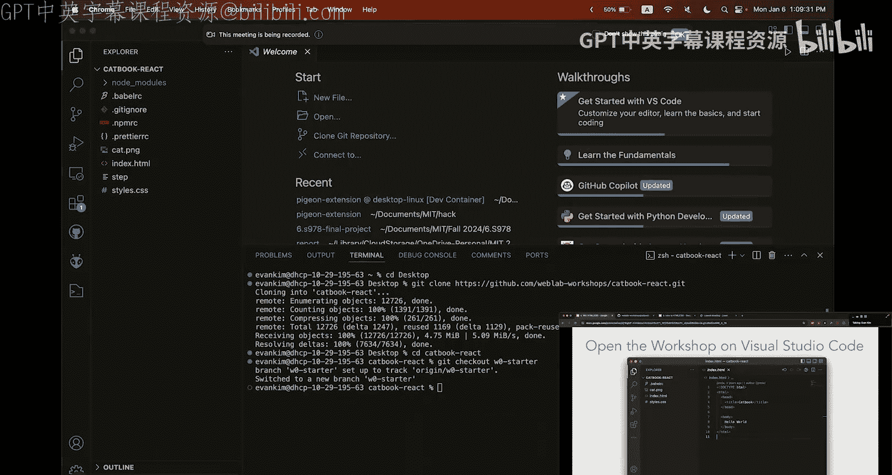

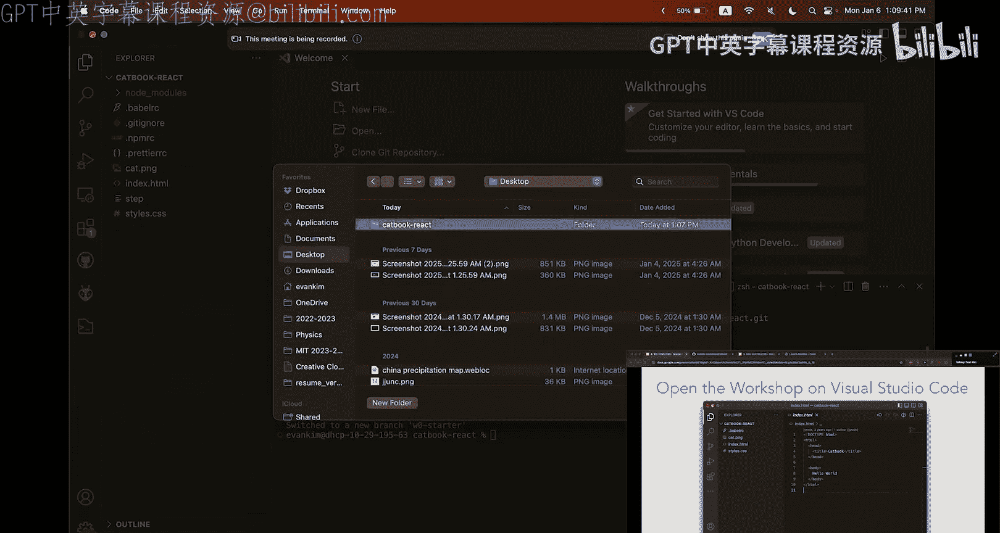

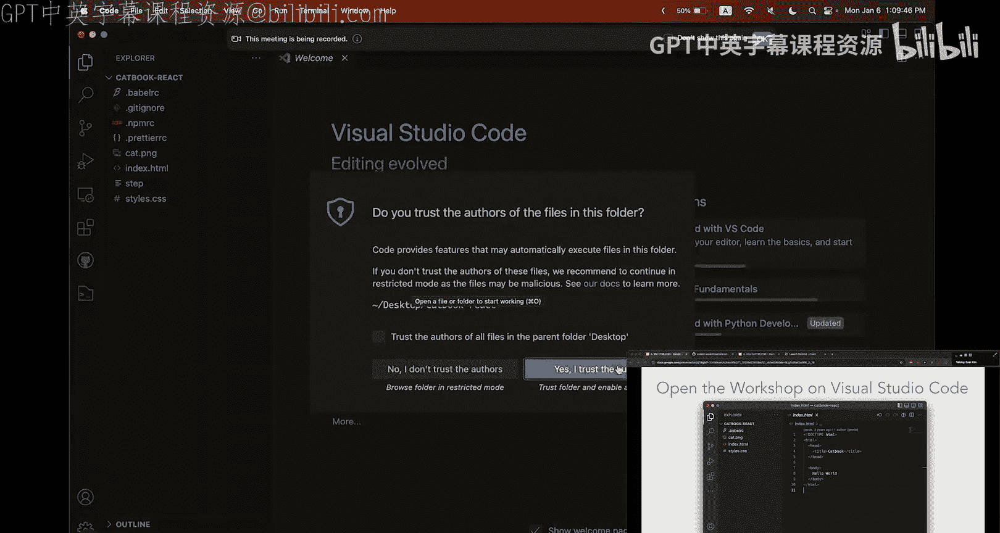

我们将使用VS Code作为代码编辑器，并使用终端来执行命令。请确保你已经打开了这两个工具。

以下是设置步骤：

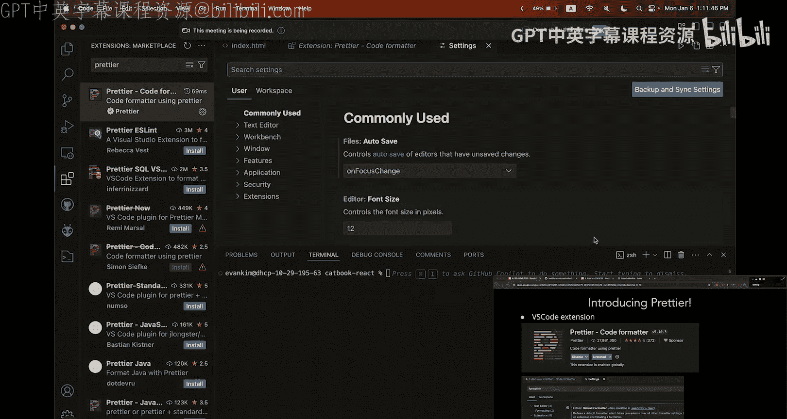

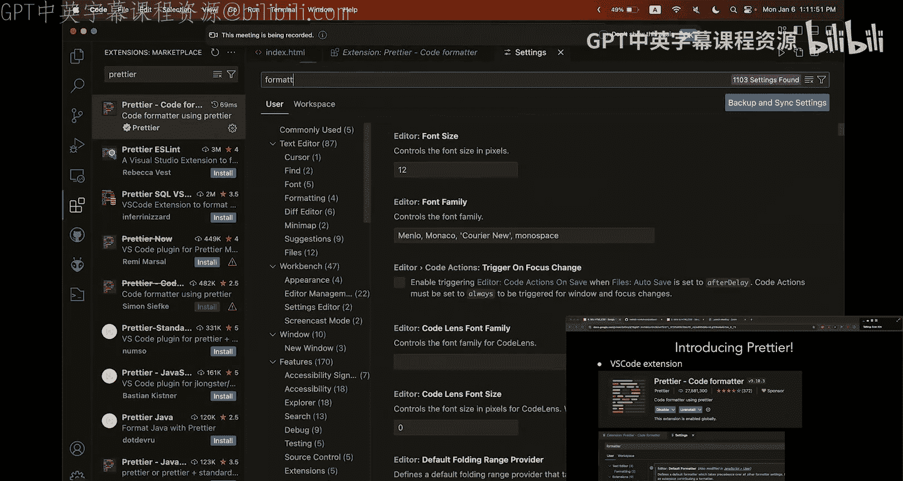

*   **克隆仓库**：访问 `weblab.is/catbook`，点击绿色的“Code”按钮，复制仓库链接。在终端中，使用 `git clone` 命令加上你复制的链接来克隆项目。
*   **切换分支**：克隆完成后，使用 `cd catbook-react` 命令进入项目目录。然后，运行 `git checkout w0-starter` 命令切换到本课程的起始分支。
*   **打开项目**：在VS Code中打开 `catbook-react` 文件夹。然后，你可以将 `index.html` 文件拖拽到编辑区查看初始代码。
*   **安装代码格式化工具**：为了保持代码整洁，我们安装一个名为“Prettier”的扩展。在VS Code的扩展面板中搜索并安装它。安装后，进入设置，搜索“formatter”并将其设置为“Prettier”。接着，搜索“format on save”并勾选该选项，这样每次保存文件时代码都会自动格式化。
*   **在浏览器中预览网页**：要查看网页效果，只需在文件管理器（如Finder或资源管理器）中找到 `index.html` 文件，并将其拖拽到浏览器窗口中即可。之后，每次修改代码并保存后，在浏览器中刷新页面就能看到最新效果。

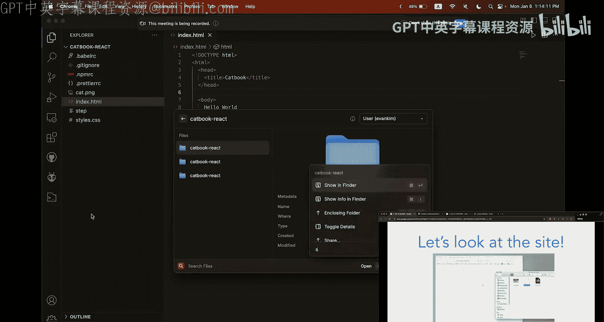

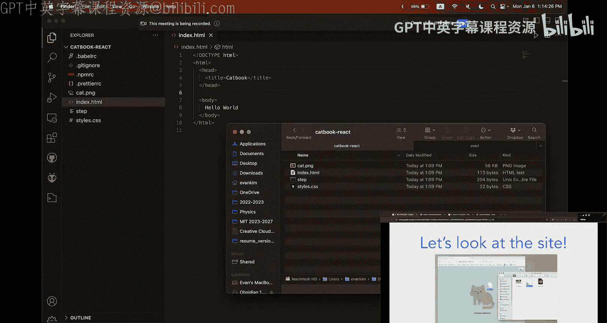

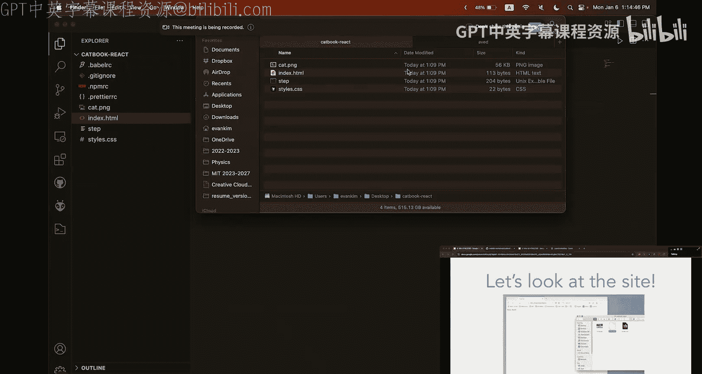

我们的最终目标是构建一个如下图所示的个人资料页面。


## 第一步：添加基础HTML内容

上一节我们完成了环境设置，本节中我们来看看如何为网页添加基础内容。

首先，我们将在HTML文档中添加一些文本内容，并使用合适的语义化标签。我们的目标是让页面初步具备“关于我”和“最喜欢的猫”两个部分。

以下是需要添加的内容和对应的HTML标签：

*   **主标题**：使用 `<h1>` 标签添加一个“Bucabuca”的大标题。
*   **水平分割线**：使用自闭合标签 `<hr>` 在主标题下方添加一条横线。
*   **“关于我”部分**：使用 `<section>` 标签创建一个区域，内部使用 `<h4>` 作为小标题，`<p>` 标签添加段落文本。
*   **“最喜欢的猫”部分**：同样使用 `<section>` 标签创建另一个区域，结构同上。

完成后，你的页面应该会显示出结构化的文本内容。如果你在过程中遇到困难，可以随时使用以下命令将代码重置到本步骤的完成状态：
```bash
git reset --hard
git checkout w0-step1
```

## 第二步：添加图片

现在我们的页面有了文字，接下来让它更生动一些，添加一张图片。

我们将在主标题上方添加一张已经存在于项目文件夹中的猫咪图片（`cat.png`）。我们需要使用 `` 标签，并为其设置 `src`（图片路径）和 `alt`（替代文本）属性。

尝试自己实现一下，让图片显示出来。完成后，可以使用以下命令核对答案：
```bash
git reset --hard
git checkout w0-step2
```

## 第三步：链接CSS并实现居中

为了让页面更好看，我们需要引入CSS。首先，我们要将CSS文件链接到HTML。

在HTML文档的 `<head>` 部分，添加一个 `<link>` 标签来链接外部的 `styles.css` 样式表。这是一个自闭合标签。

链接好样式表后，我们就可以开始添加样式了。首先，我们尝试让主标题居中显示。

1.  在 `styles.css` 文件中，我们创建一个名为 `.ut-center` 的CSS类（类选择器以点号开头），并为其添加 `text-align: center;` 属性。
2.  然后，在HTML中，为 `<h1>` 标签添加 `class="ut-center"` 属性。

这样，主标题就应该居中了。这种只负责单一功能（如居中）的类，我们通常称为“工具类”（utility class）。

完成后，使用以下命令进入下一步：
```bash
git reset --hard
git checkout w0-step3
```

## 第四步：应用居中样式

我们已经学会了如何创建并使用工具类，现在来发挥它的复用能力。

我们希望“关于我”和“最喜欢的猫”这两个部分的内容也能居中。由于我们之前已经定义了 `.ut-center` 类，现在只需将这个类分别添加到这两个 `<section>` 标签上即可。

一个技巧是：将类应用在容器元素（如 `<section>`）上，其内部的所有子元素通常也会继承相关的样式效果，这比给每个内部元素单独加类要高效得多。

完成后，使用以下命令重置并进入字体学习环节：
```bash
git reset --hard
git checkout w0-step4
```

## 第五步：引入自定义字体

默认字体可能有些单调，现在我们来为网页添加一个更美观的字体。

我们将使用 Google Fonts 网站来寻找并引入字体。以“Open Sans”字体为例：

1.  访问 `fonts.google.com`，搜索并选择你喜欢的字体。
2.  点击“Get font”按钮，在弹出页面中选择“@import”方式。
3.  复制 `@import` 语句后面的CSS代码（不包含 `<style>` 标签）。
4.  将这段代码粘贴到你的 `styles.css` 文件的最顶部。
5.  最后，在CSS中为 `body` 选择器添加 `font-family` 属性，将其值设置为你引入的字体名，例如 `‘Open Sans‘`。为了兼容性，可以在后面添加备用字体，如 `sans-serif`。

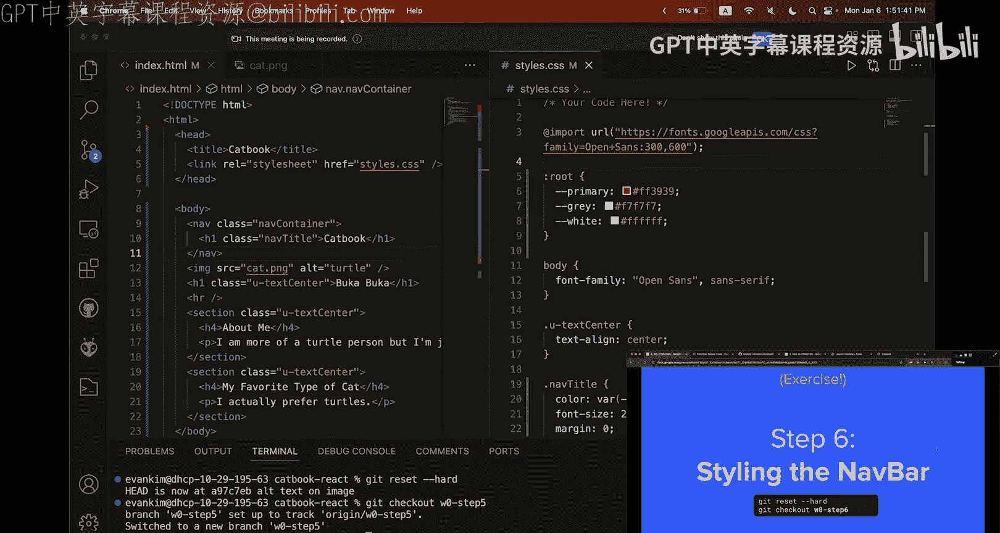

刷新页面，你会发现整个页面的字体都发生了变化。

## 第六步：创建导航栏并引入CSS变量

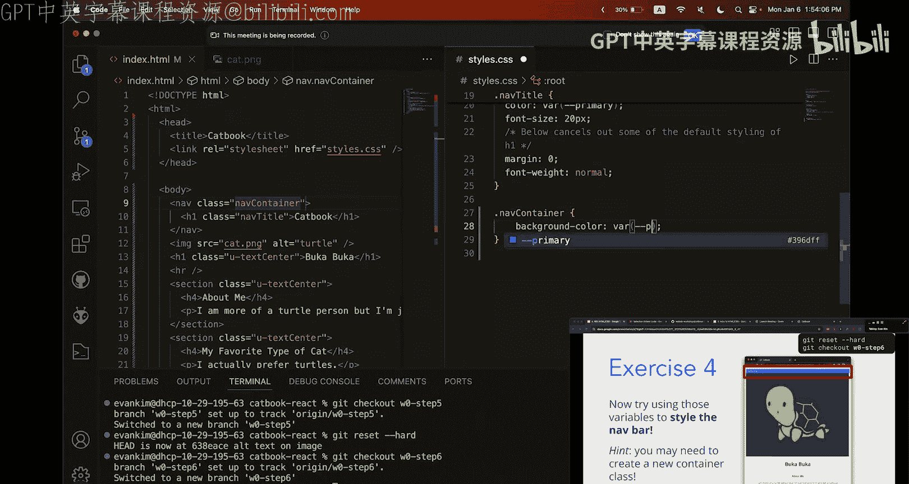

接下来，我们为页面添加一个顶部的导航栏。

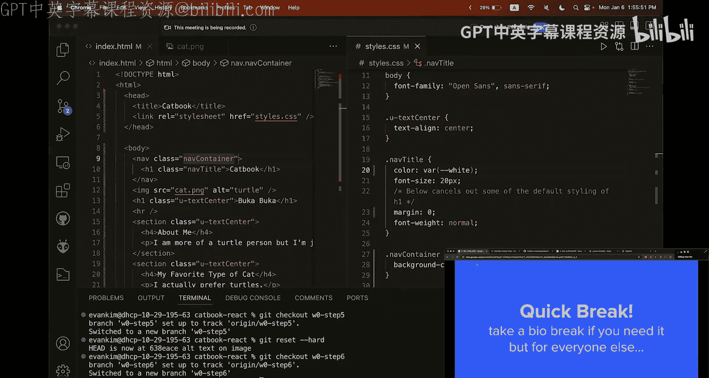

在HTML文档的 `<body>` 标签内的最顶部，添加一个 `<nav>` 元素，并在其中放入一个包含“Catbook”文字的 `<h1>` 标题。为了后续样式化，我们可以预先为这些元素添加一些类名，例如 `class=“nav-container“` 和 `class=“nav-title“`。

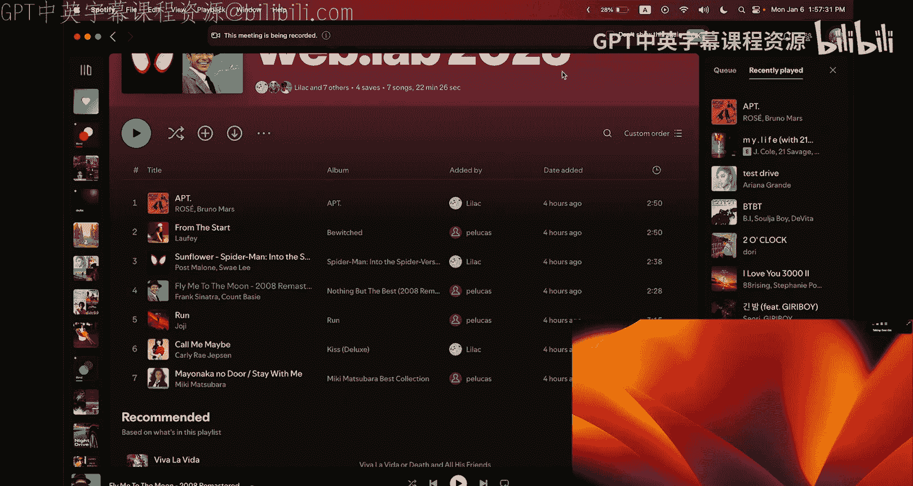

在开始样式化导航栏之前，我们先学习一个有用的CSS功能：变量。CSS变量允许你定义可重复使用的值（如颜色、尺寸）。

在 `styles.css` 文件的 `:root` 选择器内（这代表整个文档的根元素），我们可以定义变量。语法是 `--变量名: 值;`。例如，定义主色和白色：
```css
:root {
  --primary: #007bff;
  --white: #ffffff;
}
```
定义好变量后，我们就可以在样式表中使用 `var(--变量名)` 来引用它们。现在，让我们用变量来为导航栏标题添加样式：设置颜色和字体大小，并清除一些默认的边距。

## 第七步：完善导航栏样式与盒模型

现在我们的导航栏有了基本样式，但看起来还不太理想。本节我们将深入CSS盒模型，调整边距（margin）和内边距（padding），让导航栏更美观。

首先，我们希望导航栏有蓝色的背景和白色的文字。这可以通过为我们之前添加的 `.nav-container` 类设置 `background-color` 和 `color` 属性来实现，并使用我们定义好的CSS变量。

接着，你可能注意到页面整体与浏览器边缘有空白。这是因为 `<body>` 元素有默认的 `margin`。我们可以通过开发者工具（在页面右键点击“检查”）来查看这个“盒模型”。选中 `<body>` 元素，你会看到表示外边距（margin）的区域。

为了消除这个空白，我们可以在CSS中为 `body` 选择器设置 `margin: 0;`。`margin` 属性可以接受1到4个值，分别代表上、右、下、左四个方向（顺时针顺序）。

然后，我们发现导航栏内的文字紧贴边缘也不好看。这时需要使用 `padding`（内边距）在容器内部创建空间。我们为 `.nav-container` 添加 `padding: 8px 16px;`，这会在上下方向添加8像素，左右方向添加16像素的内边距。这里遵循了“8点网格系统”的设计规范，即使用8的倍数作为间距单位，以使设计更协调。我们可以将这些常用间距也定义为CSS变量以便复用。

最后，我们来给头像图片添加圆角。首先给图片 `` 标签添加一个类，例如 `class=“avatar“`。然后在CSS中创建 `.avatar` 选择器，使用 `border-radius` 属性设置圆角半径，例如 `border-radius: var(--medium);`（假设 `--medium` 是16px）。

一个有趣的练习是尝试将头像变成完美的圆形，你可以课后尝试一下。

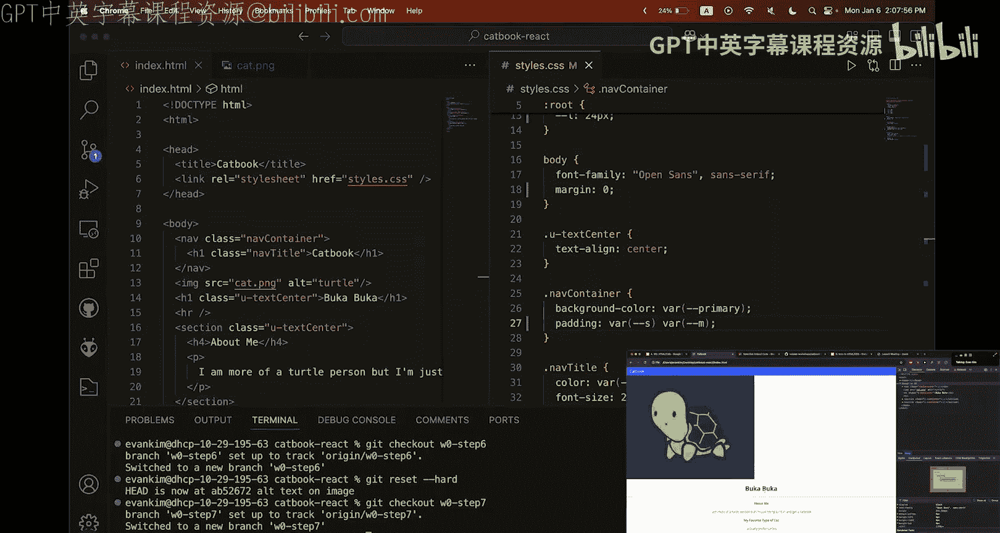

## 第八步：使用Flexbox进行布局

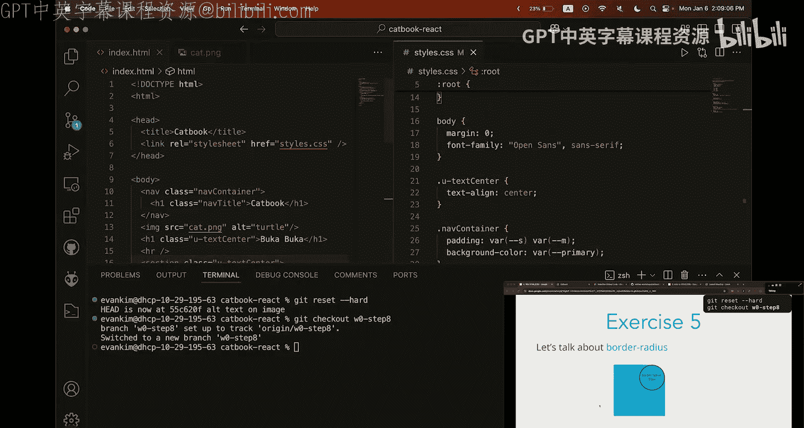

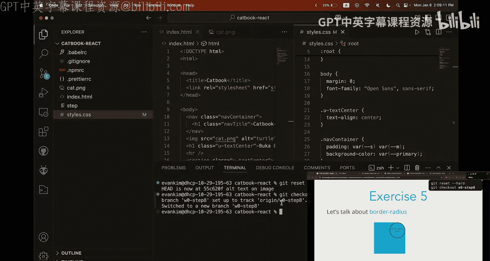

目前，我们的“关于我”和“最喜欢的猫”两部分是上下堆叠的。最终效果中，它们应该是并排显示的。本节我们将学习使用Flexbox来实现这种布局。

Flexbox是一种现代的CSS布局模型，可以轻松控制子元素的排列、对齐和尺寸。

首先，我们需要一个容器来包裹这两个 `<section>`。在它们外面添加一个 `<div>`，并为其添加一个工具类，例如 `class=“flex-container“`。

然后，在CSS中为 `.flex-container` 设置 `display: flex;`。默认情况下，Flexbox会将子元素水平排列成一行（`flex-direction: row`），所以这两个部分就会并排显示了。你可以尝试将 `flex-direction` 改为 `column`，看看它们如何变回垂直排列。

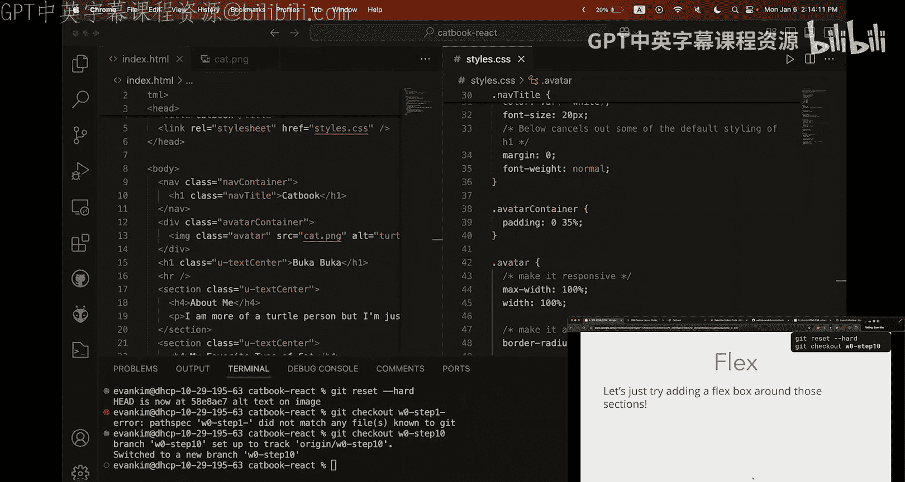

## 第九步：控制Flex子项尺寸

现在两个部分并排了，但它们的宽度并不相等，也没有占满可用空间。本节我们学习如何使用Flexbox属性控制子元素的尺寸。

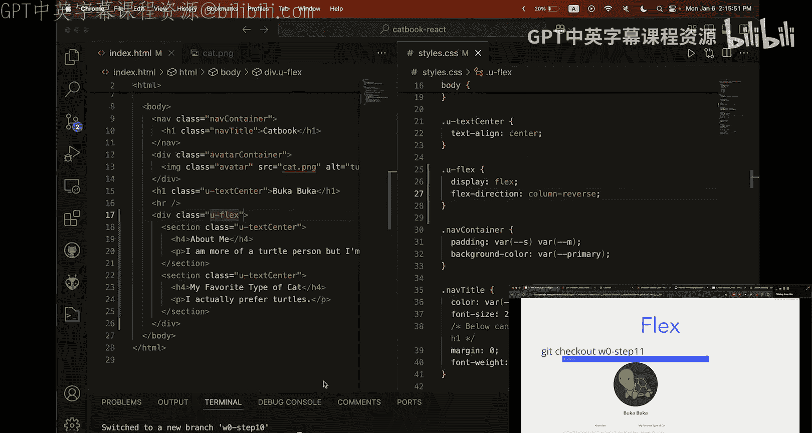

Flexbox提供了 `flex-grow` 和 `flex-basis` 等属性来控制子项的伸缩性。
*   `flex-grow` 定义子项的放大比例，所有子项默认值为0（不放大）。如果其中一个设为2，它将获得其他子项两倍的剩余空间。
*   `flex-basis` 定义了在分配多余空间之前，子项占据的主轴空间。

为了让两个部分宽度相等并填满容器，我们可以创建一个新的类（例如 `.flex-item`），并为其设置 `flex-grow: 1;` 和 `flex-basis: 0;`。然后将这个类同时应用到两个 `<section>` 上。这样，它们就会以相同的比例增长，从而获得相等的宽度。

## 总结与扩展

本节课中我们一起学习了构建一个完整个人资料页面的全过程。我们从创建基础的HTML结构开始，逐步添加图片、链接CSS、使用工具类、引入外部字体、创建导航栏、运用CSS变量、理解盒模型（margin和padding），最后使用强大的Flexbox模型实现了复杂的水平布局。

你可以在 `w0-complete` 分支查看最终完整的代码。此外，这里有一些有用的资源供你深入学习：
*   **Flexbox详解**：`weblab.is/flex` (CSS-Tricks指南)
*   **交互式学习游戏**：Flexbox Froggy, Grid Garden

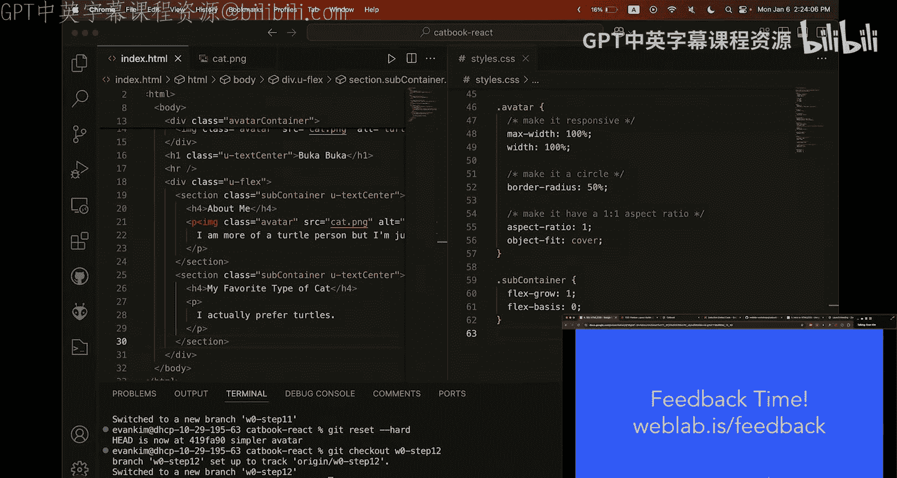

通过本课的学习，你已经掌握了前端开发的核心基础。下周我们将进入更高级的CSS主题。