# 006：JavaScript基础入门

在本节课中，我们将要学习JavaScript的基础语法和核心概念。JavaScript是Web开发的“肌肉”，它能让静态的网页变得动态和可交互。我们将从基本数据类型开始，逐步介绍变量、运算符、控制流、数组、对象和函数。

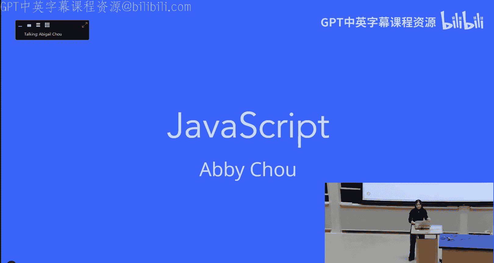

## 概述

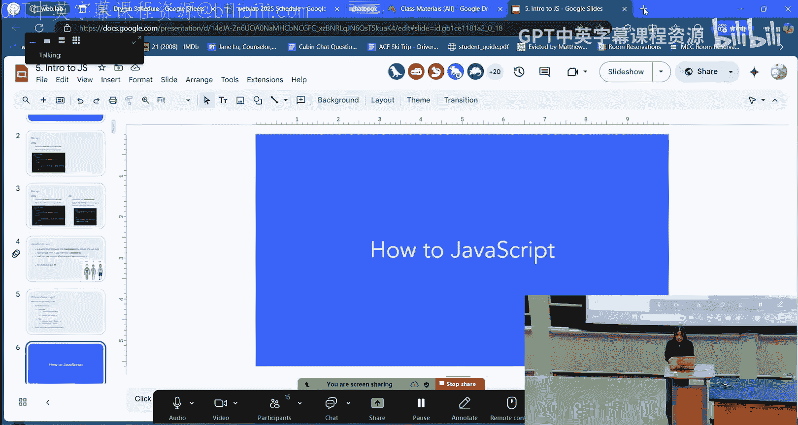

JavaScript是一种编程语言，用于操作网页内容，使其能够响应用户交互。它与Java无关。本节课将快速介绍JavaScript的基本语法，假设你已有类似Python的编程基础。如果你完全没有编程经验，建议课后参考课程网站上的补充资源。

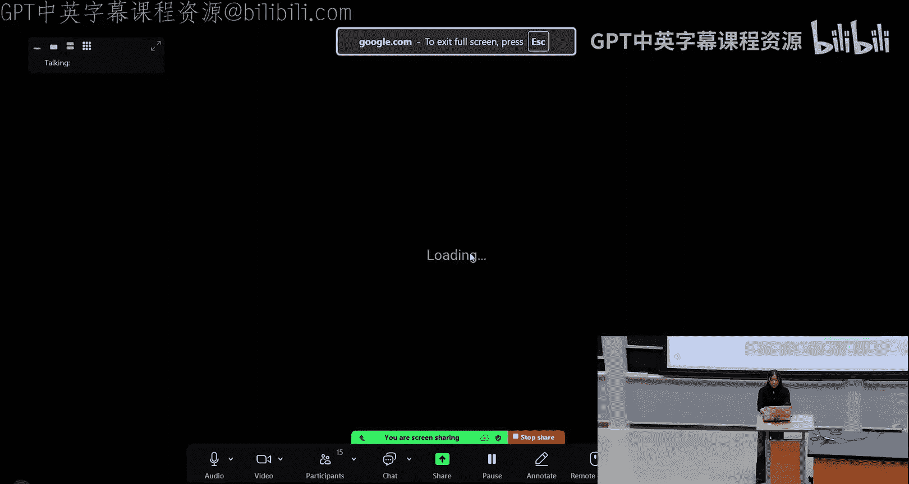

## 基本语法与数据类型

上一节我们介绍了JavaScript在Web开发中的角色，本节中我们来看看它的基本语法和数据类型。

JavaScript有五种原始数据类型：
*   **数字**：包括整数和浮点数，例如 `42` 或 `3.14`。
*   **布尔值**：`true` 或 `false`。
*   **字符串**：文本数据，例如 `"Hello"`。
*   **Undefined**：表示变量已声明但尚未赋值。
*   **Null**：表示变量被显式地设置为“无值”。

定义变量使用 `let` 关键字，常量使用 `const` 关键字。请避免使用旧的 `var` 关键字。

```javascript
let count = 10; // 变量
const PI = 3.14159; // 常量
```

每个语句以分号结尾。代码块使用花括号 `{}` 界定。注释使用双斜杠 `//`。

## 运算符与比较

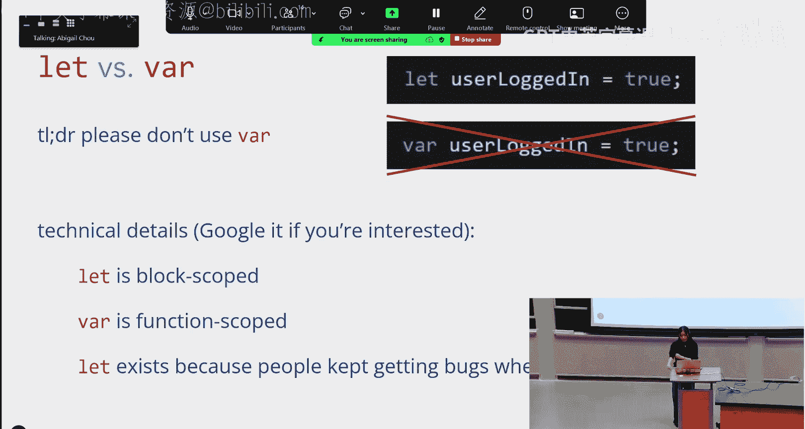

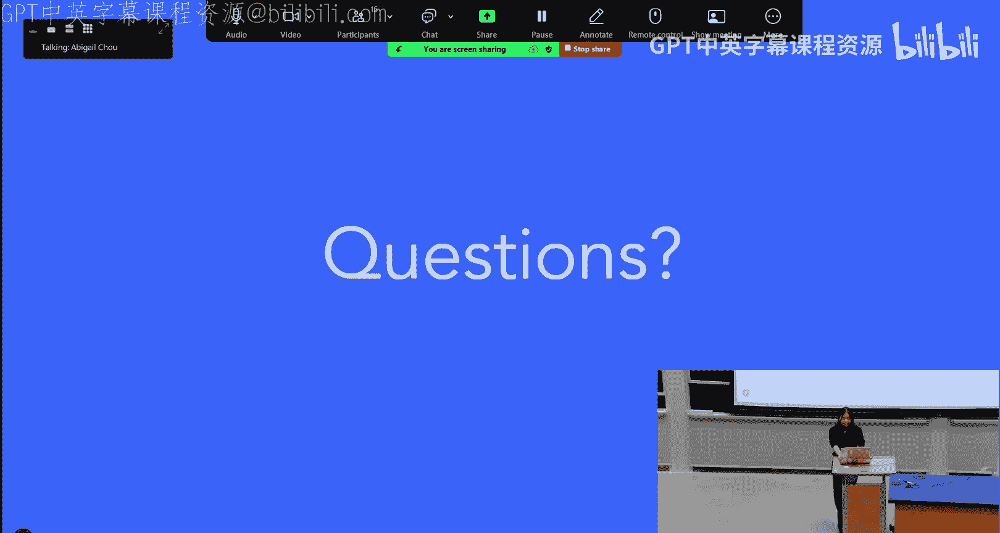

了解了如何存储数据后，我们来看看如何操作和比较它们。

算术运算符（`+`, `-`, `*`, `/`, `**`）和字符串拼接（`+`）的行为符合预期。

然而，比较运算符需要特别注意。在JavaScript中，我们使用**三重等号** `===` 来严格比较两个值是否相等（包括类型和值）。使用**双重等号** `==` 进行比较时，JavaScript会进行类型转换，这可能导致意想不到的结果，因此通常避免使用。

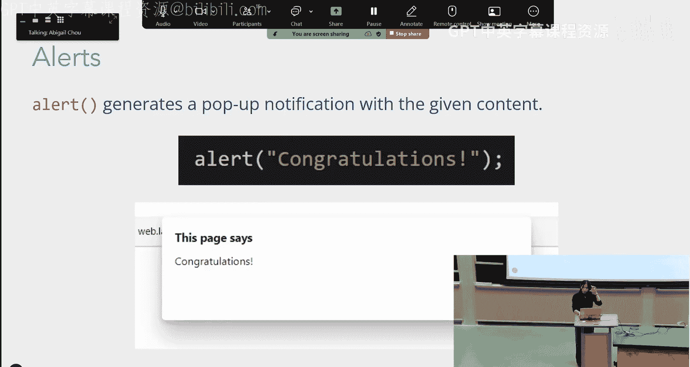

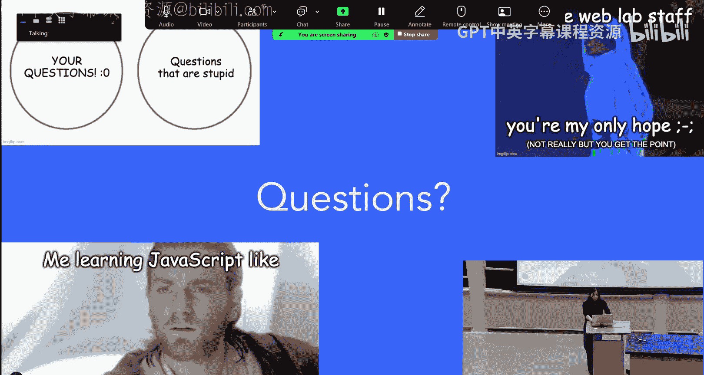

```javascript
console.log(2 == "2"); // true (类型转换后相等)
console.log(2 === "2"); // false (类型不同)
```

不等于的比较使用 `!==`。

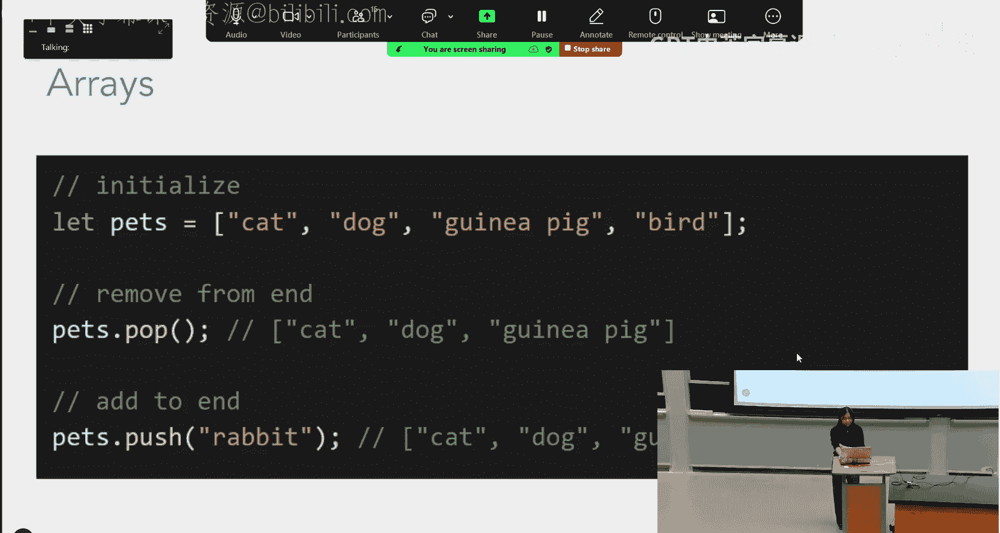

## 控制流：条件与循环

掌握了数据操作，接下来我们学习如何控制程序的执行流程。

条件语句（`if`, `else if`, `else`）和循环语句（`while`, `for`）的逻辑与其他语言类似。

以下是条件语句的示例：
```javascript
if (hour < 12) {
    console.log("Good morning!");
} else if (hour < 18) {
    console.log("Good afternoon!");
} else {
    console.log("Good evening!");
}
```

以下是遍历数组的两种常见 `for` 循环方式：
```javascript
// 方式一：通过索引遍历
for (let i = 0; i < pets.length; i++) {
    console.log(pets[i]);
}

// 方式二：直接遍历元素 (for...of)
for (const animal of pets) {
    console.log(animal);
}
```

## 数组与对象

控制流让我们能处理复杂逻辑，而数组和对象则让我们能组织更复杂的数据。

数组类似于Python中的列表，可以存储一系列值。它们是零索引的。

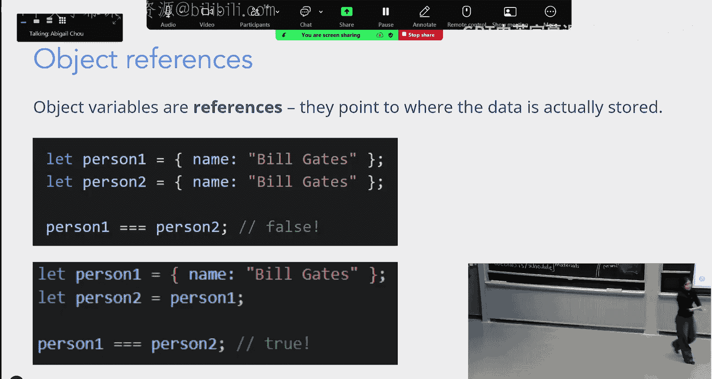

```javascript
let pets = ["cat", "dog", "guinea pig", "bird"];
console.log(pets[0]); // 输出 "cat"
pets.push("rabbit"); // 在末尾添加元素
let lastPet = pets.pop(); // 移除并返回最后一个元素
```

JavaScript对象类似于Python的字典，是键值对的集合。

```javascript
let car = {
    make: "Toyota",
    model: "Camry",
    year: 2020
};
// 访问属性
console.log(car["make"]); // 方式一
console.log(car.model); // 方式二
```

可以使用**展开运算符** `...` 来复制数组或对象，以避免引用同一内存地址的问题。

```javascript
let originalArray = [1, 2, 3];
let copiedArray = [...originalArray]; // 创建新数组
```

## 函数

最后，我们将学习如何将代码封装成可重用的模块——函数。

在JavaScript中，函数是一等公民，可以像其他值一样被赋值、传递。我们主要使用箭头函数语法。

```javascript
// 定义一个函数并将其赋值给一个常量
const celsiusToFahrenheit = (celsius) => {
    return (celsius * 9/5) + 32;
};

// 调用函数
let roomTemp = celsiusToFahrenheit(26);
console.log(roomTemp); // 输出 78.8
```

函数可以作为参数传递给另一个函数，这种函数被称为**回调函数**。

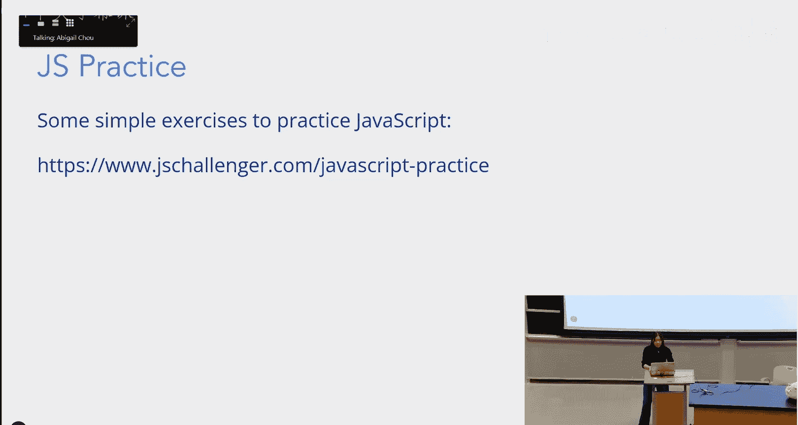

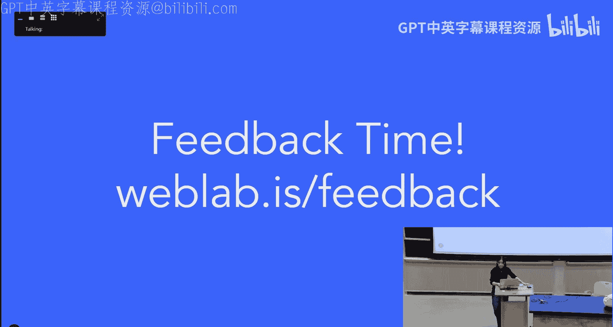

```javascript
// 定义一个简单的函数
const printSomething = () => {
    console.log("Hello after 5 seconds!");
};

// 将函数本身（而不是调用结果）传递给 setTimeout
setTimeout(printSomething, 5000);
```

## 总结

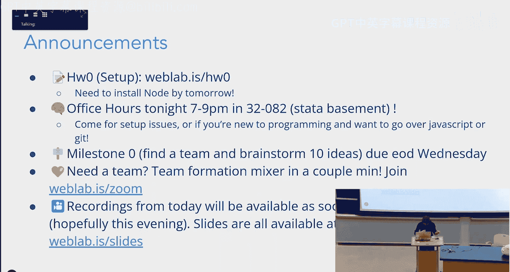

本节课中我们一起学习了JavaScript的核心基础。我们了解了它的基本数据类型、变量声明、运算符（特别是严格相等 `===`）、控制流语句、数组与对象的使用，以及如何定义和调用函数。理解这些概念是进行后续Web交互开发的关键。请务必完成课后设置，安装Node.js，为明天的课程做好准备。