# 008：React 入门 🚀

在本节课中，我们将要学习 React，这是一个在现代 Web 开发中无处不在的前端框架。我们将了解 React 的核心概念——组件，以及如何使用它们来构建更清晰、更模块化的用户界面。

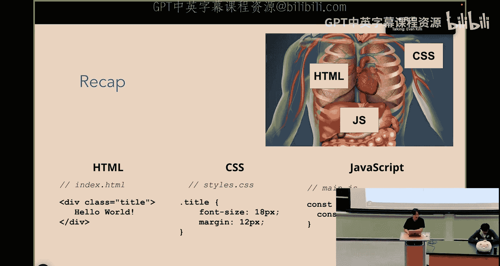

## 课程概述

React 是另一个前端框架，它与 HTML、CSS 和 JavaScript 并非完全不同。你将使用相同的概念，但 React 是我们最终项目将使用的框架，也是 Web 开发领域广泛采用的框架。

为了回顾，让我们再次讨论 HTML、CSS 和 JavaScript。如果你还记得这个类比：HTML 是骨架，CSS 是样式，而 JavaScript 让一切运作起来。

例如，我们可以再次以 Facebook 网站为例。网站的第一个部分可能看起来像这样，其中有一个好友区域，包含许多带有不同类的 `div`，样式也包括图片等元素。

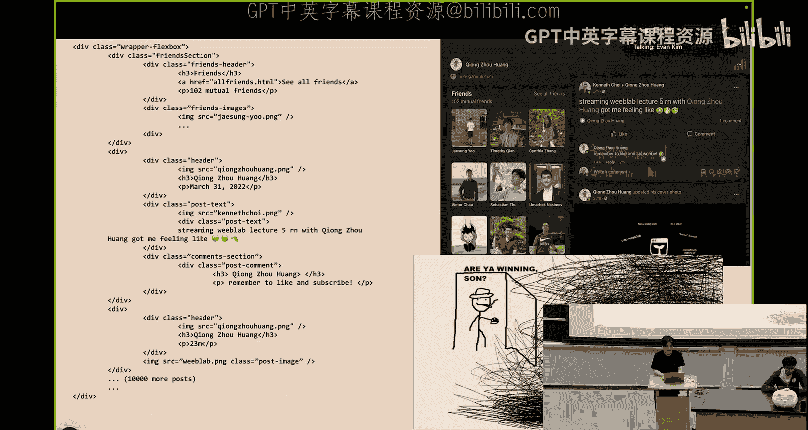

作为热身，请与你旁边的人讨论一下，主信息流在 HTML 结构上可能是什么样子。它可能看起来像这样。我们这里有很多不同的嵌套盒子。我们需要为所有不同的标题和样式设置许多不同的类。

本质上，这非常混乱。如果你在任何网站上打开开发者工具，你会注意到里面有很多 `div`。如果你想找到你要找的东西，那将是一团糟。

因此，如果我们可以不用编写所有这些代码，而是只写一行代码说“构建 Facebook”，那将非常好。但这当然没有意义，因为我们实际上必须写下我们希望 Facebook 看起来是什么样子。

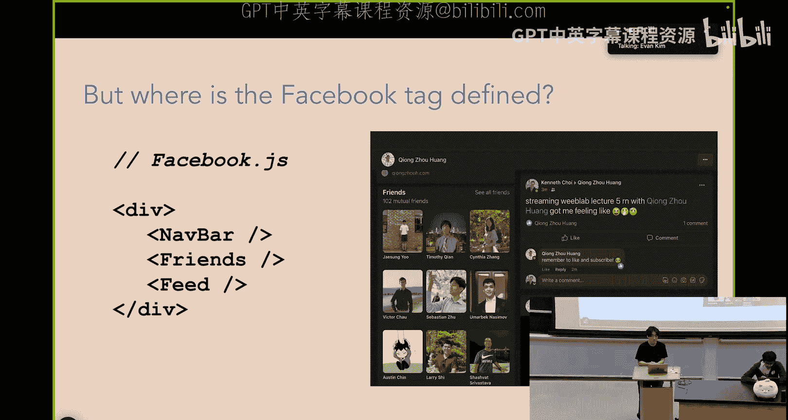

所以，这里的想法是我们希望拥有某种模块化框架，通过只写下 `Facebook` 标签来构建 Facebook。但要写下 `Facebook` 标签，我们可以用其他标签来定义它，比如导航栏、好友信息流、好友和帖子。如果我们有某种框架可以进行这种抽象，能够调用一些新的自定义 HTML 标签，然后用它来渲染信息流的一部分，那么我们就可以让代码变得更好，因为我们可以模块化地构建它。如果我们有重复的不同模块，例如信息流中反复出现的帖子，这也有助于提高可读性。

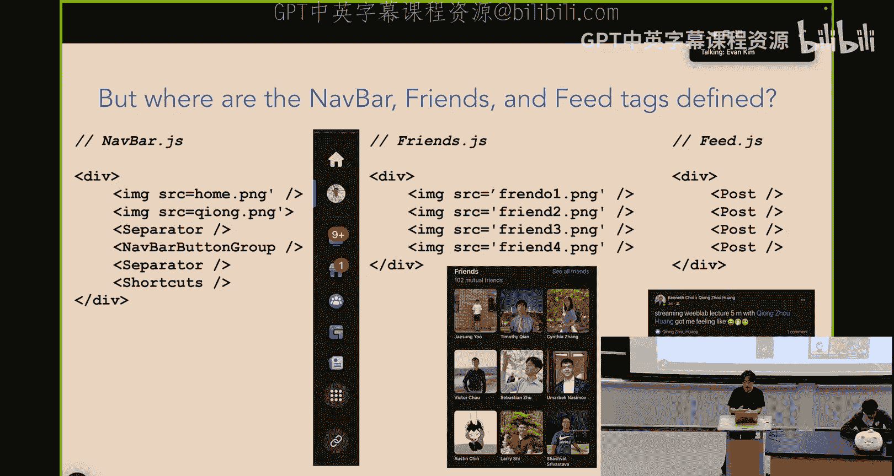

这种结构会沿着树继续向下延伸。你将用其他“伪”HTML 标签或原始 HTML 来定义这些新的伪 HTML 标签，如导航栏、好友和信息流。

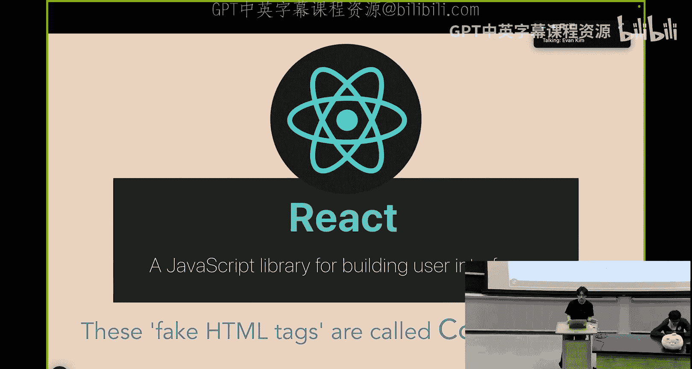

这就是 React 背后的核心理念，它是一个用于构建前端的、无处不在的库。我刚才提到的这些伪 HTML 标签被称为**组件**。这些是 React 的构建模块。

## 什么是组件？🧩

组件是你自己命名的东西。它们可以看起来像任何东西，比如 `Facebook`、`Navbar`、`Post` 或 `Feed`，但可以是任何你想要的名称。不过，通常你会希望给它起一个有意义的名字。

那么，组件到底是什么？它是一种抽象，告诉你如何渲染网站的某个部分。它非常通用，你可以用它做任何你想要的前端功能，因为在一个组件内，你可以同时渲染所有的 HTML、CSS 和 JavaScript。你可以定义按钮点击时发生的操作，定义它的外观，定义实际的 HTML 结构。所有这些都被整齐地打包成一个组件，你可以重复使用并调用来构建网站的一部分。

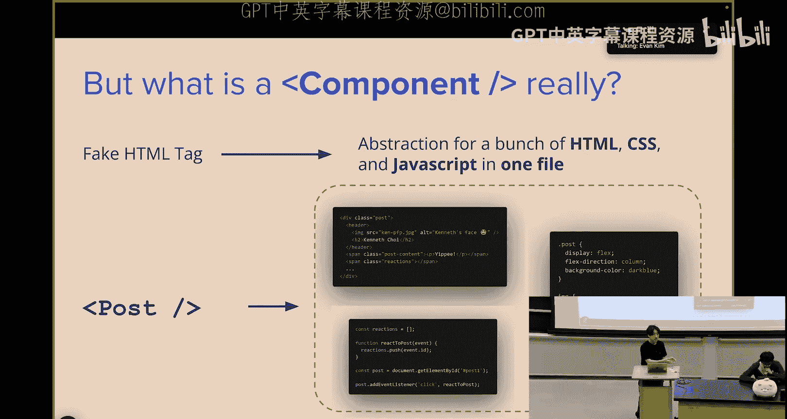

它有点像 JavaScript 中的函数。正如 Abby 在前两节课中谈到的，你调用这个组件，然后它为你返回网站的一部分。

以 Facebook 为例，我们可以讨论组件可能是什么样子。根级组件叫做 `App`。这只是你网站中的所有内容。

在这个总的 React 组件中，将有许多不同的组件，比如导航栏、信息栏（包含你的所有好友等）以及你的信息流（包含你的所有帖子）。

这些组件还可以进一步分解。例如，`Feed` 组件可以分解成你构建的更小组件，比如 `Post` 组件。这些 `Post` 组件可以分解成更小的组件，比如帖子的实际内容、帖子正文和出现在下方的评论。

你可以看到这里存在一种依赖关系。每个组件都依赖于构成它的其他组件。这种结构有点像一棵树，我们称之为**组件树**。所以 `App` 组件被称为根是有道理的，因为它是树的根。箭头表示依赖关系。`App` 依赖于三个组件：`Navbar`、`Feed` 和 `InfoBar`，因为这是构建它所需的东西。`Feed` 依赖于 `Post`，而 `Post` 依赖于 `Content` 和 `Comments`。

基本上，总结来说，React 的主要思想是拥有这些依赖于其他组件且可重复使用的组件。这些就像函数调用。你调用函数来构建网站的一部分。这非常好，因为现在你在编写网站时可以看到网站的样子，而不是有一堆 `div`，而是有由帖子和评论组成的 `PostBody`，以及由 `PostBody`（由帖子和类似内容组成）组成的 `Feed`。

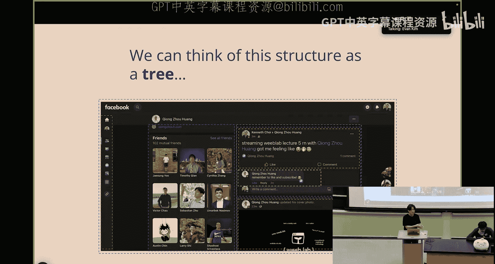

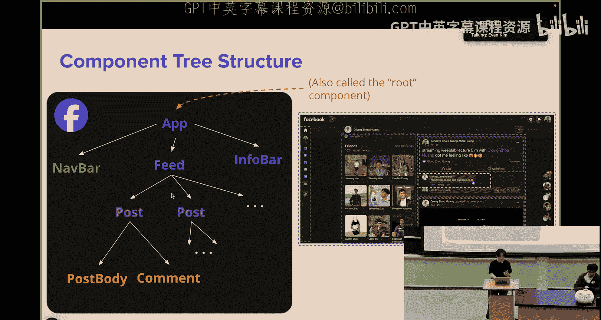

在每个组件内部，你可以放置任何你需要的 HTML、CSS、JavaScript，以实现任何你需要的任何前端功能。

这就是 React 中组件工作原理的总结。但要实际让它们工作，我们需要了解几个关键特性。

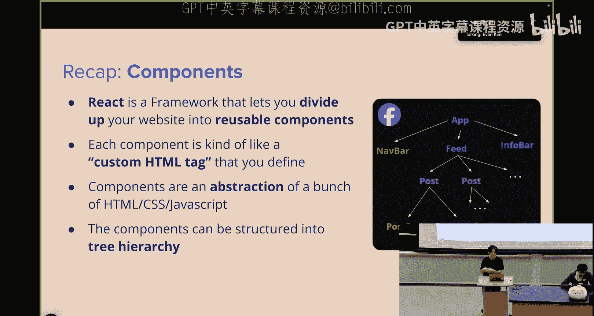

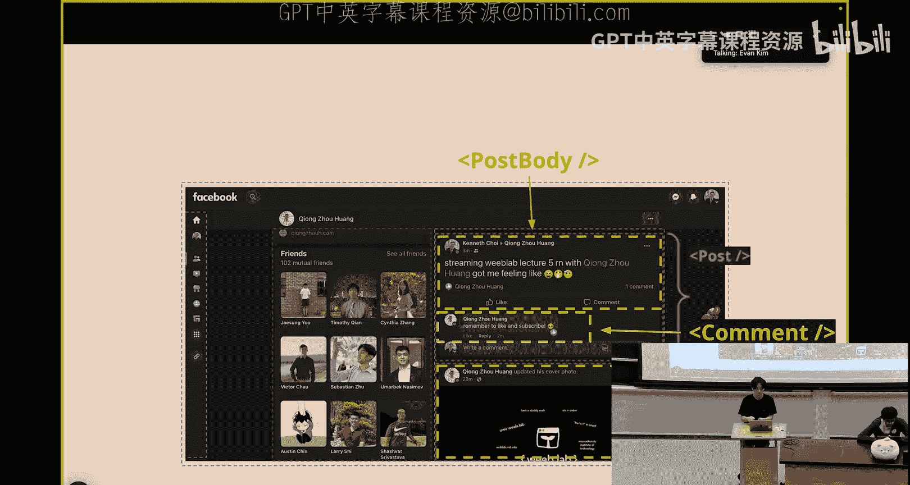

## 使用 Props 实现通用化 🎯

例如，如果我们有一个 `Comment` 组件，即使我们想重复使用它，即使有许多大致相同但又不完全相同的评论，它们并不具有完全相同的 HTML。所以我们需要能够将其通用化。

我们实现这一点的方式是，评论之间可能不同的地方包括评论的实际内容、评论作者、发布时间，甚至个人资料图片。但其一般结构，即 HTML 元素相对于彼此的排列顺序，是相同的。为了能够重复使用这个结构，我们使用一个骨架，其中结构相同，比如点赞和回复按钮是相同的。我们希望我们的评论有一些输入。这些被称为 **props**。

就像函数有输入一样，你的组件也可以接收输入，然后根据这些输入渲染网站的一部分。对于我们的评论组件，由于我们希望作者姓名、评论的实际内容、个人资料图片和发布日期在评论之间变化，我们可以将这些 props（输入）传递给评论组件，然后得到我们想要的评论。

这种我们拥有依赖于评论的帖子的结构，我们称箭头起始的组件为**父组件**，箭头结束的组件为**子组件**。props 从父组件传递给子组件，指示父组件希望子组件记住什么。

当你传入 `Kenny Choy`、评论内容和 `一分钟前发布` 这些 props 时，你就可以渲染你想要的评论。

需要注意的一点是，当你传入 prop 时，你不能在子组件端改变这个 prop。你可以对 props 进行操作，就像在一个函数中，你传入一个数字，你可以对该数字进行计算，但不能改变数字本身。这些 props 是在父组件中确定的，并传递给子组件，它们不能被**子组件**改变。

另外，你也不能将 props 从子组件传递给父组件。

props 的主要作用是让我们能够通用化这些 React 组件。如果一个组件有可变的部分，那么我们可以传入这些变量来决定我们希望它如何渲染。

## 使用 State 管理动态内容 🔄

但这就是我们实际渲染随时间变化的内容的方式吗？这些 props 是不可变的。所以如果我们的网站随时间更新，比如说有更多评论涌入，那么我们需要一种方法来跟踪我们想在网站上渲染什么。

为此，我们将使用一种叫做 **state** 的东西。这是 React 组件的第二个重要部分。实际上，主要就是这两个：props 和 state。

state 是组件维护的某种信息。它不是组件接收的东西，并且与 props 不同，它是可变的。它是你可以用 JavaScript 中的任何逻辑更新的东西。

例如，在我们发布评论的例子中。在 `Post` 组件内部，我们可以维护一个包含评论列表的 state。我们可以有一个数组，包含第一个评论，然后当另一个评论添加时，只需维护一个可以随时间变化的评论 state。

我们使用这个 state 将 props 传递给评论的子组件。一旦我们传递下去，评论组件就可以渲染我们在 state 中拥有的评论。

为什么我们将评论数据保存在 `Post` 的 state 中，而不是 `Comment` 的 state 中？`Post` 的 state 是更大的组件，它包含所有评论。我们想知道在 `Post` 的 state 中要渲染哪些评论。如果我们把这些保存在 `Comment` 的 state 中，我们就不知道需要有多少个评论。例如，如果我们添加另一个评论，那么我们没有另一个可以存储该 state 的评论组件。

所以我们需要在 `Post` 的 state 中保存，这样我们才能实际渲染我们需要的 X 条评论。在这个例子中，如果我们添加另一个评论，我们需要能够渲染那个额外的评论。但如果我们没有在 `Post` 中保存 state，我们就无法做到这一点。

我们可以看另一个使用 state 和 props 的例子。Facebook 上有一个功能，你可以点击“查看回复”。你与评论互动，点击按钮，网站需要通过渲染这些评论回复来调整。

与旁边的人讨论一下，哪个选项最适合显示评论回复。在这种情况下，最好的做法是在 `Comment` 组件内部存储 `showReplies` 的 state。这与之前的结构相同，只是现在我们的 `Comment` 组件是父组件，它需要维护是否渲染回复（其子组件）。

如果我们在 `Comment` 组件中维护这个 `showReplies` state，我们可以将其切换为 `true` 或 `false`。如果它是 `true`，那么我们将渲染其子组件，即回复。

作为另一个回顾，state 是你在组件中存储的一些信息，它就是它本身。它存储组件的状态，这决定了它如何渲染事物以及如何渲染其子组件。它是可变的。你可以使用 state 并将其作为 props 传递给子组件，以决定渲染什么。

这里有一个关于正在发生的事情的总体回顾。我们有 state 和 props。state 被传递给子组件，然后进行渲染。

## 在代码中实践 React 💻

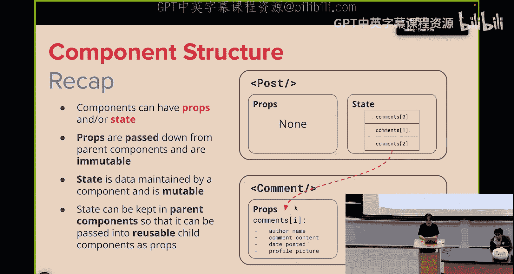

好了，以上就是 React 和 React 组件的基本结构。到目前为止有什么问题吗？

如果没有，那么我们将转向一些实际应用。我们已经看到了 React 如何通过组件帮助你进行抽象和可重用性，使你的网站代码更加清晰。

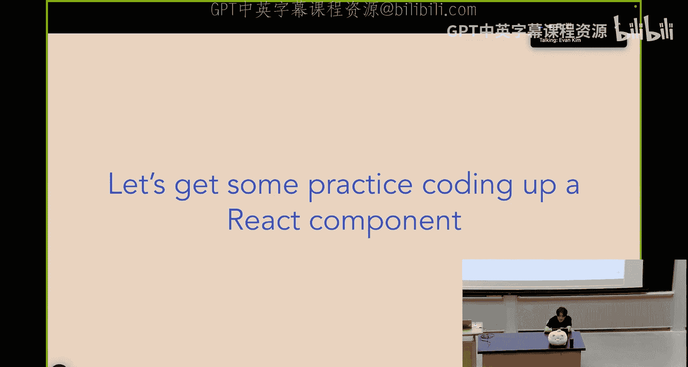

那么让我们看看这在代码中实际上是什么样子。我的工作流程将是从硬编码版本开始，我们直接写入渲染某物所需的所有信息，然后慢慢地将其抽象出来。

让我们从这个非常简单的组件开始。它只是一个评论回复，信息不多。关键的是，它只有名字和内容。

让我们看看一个通用 React 组件的代码。在你编写的每个文件中，你需要三样东西。首先，你需要导入 React。React 是一个库，它不是 JavaScript 内置的，所以你需要先导入 React。我们还将导入 `useState` 这个东西，它将帮助我们维护 state，稍后会详细介绍。

接下来，我们必须实际定义我们的组件。我希望你开始将这些组件视为函数。函数只是对具有输入和输出的东西的一个花哨名称。在这种情况下，我们的输入将是从父组件传递给我们的任何 props。我们的输出将只是我们在实际页面上渲染的内容。

最后，我们必须导出组件，这将允许我们在顶级组件中重复使用它。

再次强调，我希望你开始将组件视为接收 props 然后输出要渲染内容的函数。

正如 Evan 之前提到的，一个 React 组件将一堆 JavaScript 逻辑、HTML 渲染以及 CSS 捆绑在一起。回到函数类比，你可以将函数的逻辑视为所有的 JavaScript，然后你想要渲染的东西叫做 **JSX**。它有点类似于 HTML，我会稍作解释。但这是基本思想。

让我们尝试渲染这个评论回复。如你所见，它看起来与我们之前所做的非常相似。我们将创建一个 `div`。同样，我们现在是硬编码。所以我们只添加标题和一些文本。但这当然不是我们最终想要的目标。我们希望能够为任何任意的名字或评论文本重复使用这个组件。

这就是我们使用 props 的地方。如果你还记得，props 就像一个传递给函数的对象。在 JavaScript 中，我们从对象中提取信息的方式是使用点符号。

所以我们将执行 `props.name`、`props.content`。现在我们已经完成了这个，我们移除了所有的硬编码。我们可以轻松地重复使用这个组件来至少渲染名字和内容。

那么，JSX 是什么？我提到它非常类似于 HTML，确实如此。但有一些区别。一个区别是，在 JSX 中，你实际上也可以“转义”到 JavaScript，如果你想在组件内做一些逻辑的话。例如，你可以在这里看到，在花括号内，里面的内容实际上不是 HTML，它是 JavaScript，因为我们正在从一个对象中解包东西。

所以，任何时候我们想从 props 中提取某些东西，我们都必须使用这些花括号。

还要注意，我们使用的是 `className`，而不是我们通常想用 CSS 样式化某物时会使用的 `class`。这是因为 `class` 在 JavaScript 中已经是一个关键字，所以我们不能直接使用相同的东西。但对于大多数目的，你可以把它们看作是相同的东西。只需记住关于转义以便使用 JavaScript 和 `className` 这两点。

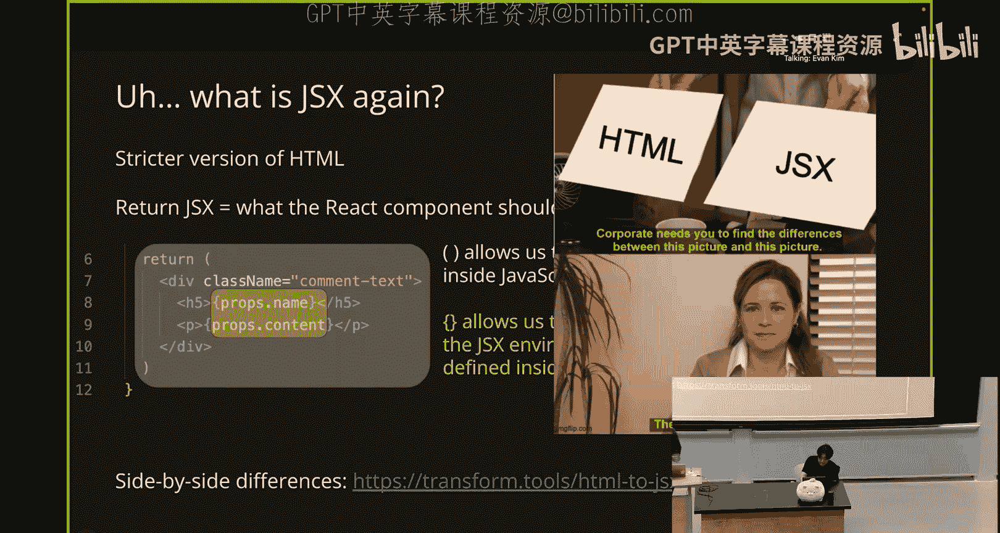

## 实现 State：点赞按钮示例 👍

好了，我们已经稍微讨论了 props。让我们继续讨论 state。在我们的组件中，有两样东西可以很容易地从父组件传递到这个组件。但像点赞按钮这样的东西，将其存储在父组件中并不合理，因为我们可以在每个模块化的评论回复中完成这个操作。

那么，我们让这个组件自己维护 state 怎么样？维护 state 的语法如下所示，你会得到更多这方面的练习，所以一开始不理解也不用担心。但思想是初始化一个 state。

你将使用 `const`，然后你必须放置状态变量以及状态设置函数。状态变量就像 state 本身，而设置函数是一个可以改变 state 的函数。然后你将其设置为等于 `useState` 并初始化它。括号里面是初始值。所以这就像将 `isLiked` 初始化为 `false`，同时也给了我们一个可以改变它的函数。

让我们使用我们的 state 来渲染点赞功能。这里缺少一些样式，但基本思想是，我们只想：如果 `isLiked` 为 `true`，那么我们显示“已点赞”；如果不是，那么我们显示“点赞”，以便你可以点赞它。

这里的语法对你们中的一些人来说可能是新的。同样，我们把它放在花括号里，因为它是 JavaScript 逻辑。这个语句叫做三元运算符。它就像一个 `if-else` 语句，但写得更简洁（或者不简洁，取决于你的喜好）。

你把条件放在这里，然后是一个问号。如果条件为真，那么它将返回这个；如果不是，那么它将返回那个。所以，如果 `isLiked` 为真，那么我们将按我们想要的那样显示“已点赞”。如果不是，那么我们将显示“点赞”。

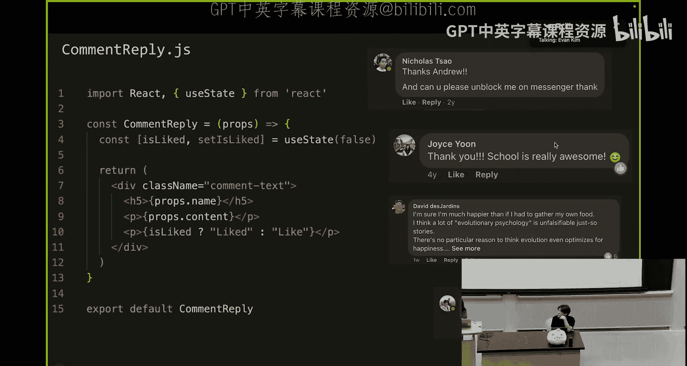

现在，跳过一些小细节，我们有了一个可以重复使用的漂亮组件。是的，名字或消息是什么并不重要，我们可以将其用于基本上任何东西。

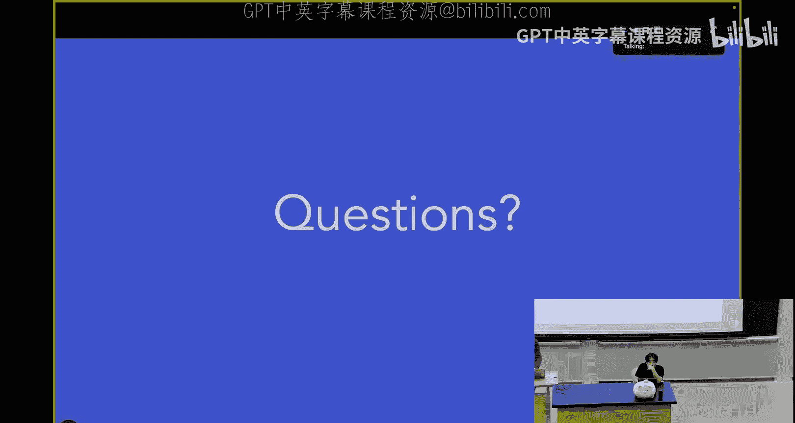

## 构建完整页面：组件树分析 🌳

好了，现在我们已经编写了第一个组件，让我们尝试构建一个完整的网页。

我们需要做的第一件事是理解这个东西的结构。所以让我们尝试生成 Evan 之前谈到的组件树。

在任何网页中，根都将是这个 `App` 组件，它将包含所有内容。让我们尝试在这里寻找一些其他组件。我们可以想到的一些东西首先是导航栏。这看起来相当模块化，我们可能想在其中抽象一些东西。介绍部分也可以组合成一个特定的组件。将其抽象出来会很好。然后帖子肯定是我们要重复使用很多次的东西。这是一个很好的组件候选。

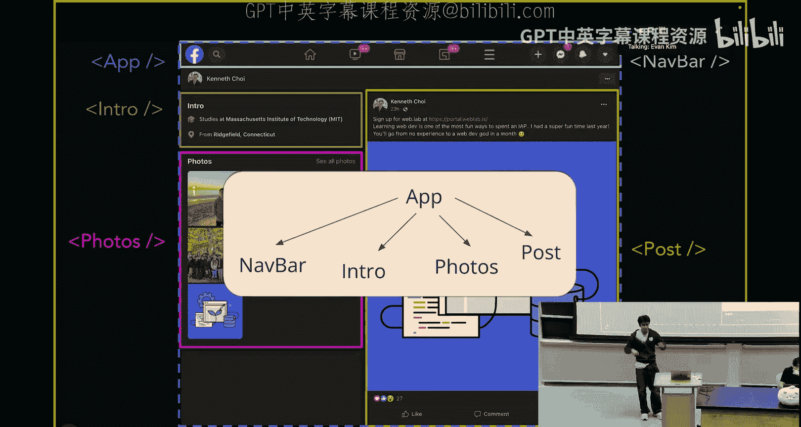

这就是一棵树的样子。我们在顶层有 `App`，它依赖于这里所有这些不同的组件。

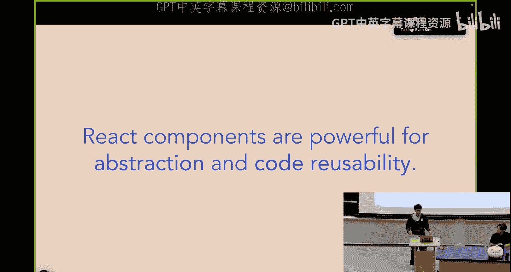

重申一下，React 组件之所以强大，是因为它们可以帮助我们进行抽象和重用。抽象意味着将一堆东西放入一个黑盒中，你不需要查看细节，但你可以通过导入它然后写下它的名字来重复使用它。可重用性，我认为很清楚。是的，导航栏、介绍和照片，它们都很好作为组件保留，因为你可以抽象掉那些你每次查看网页时不想看到的混乱代码。帖子对抽象和可重用性都有帮助，因为我们会在一个页面上有很多帖子。

## 编写组件代码 🖋️

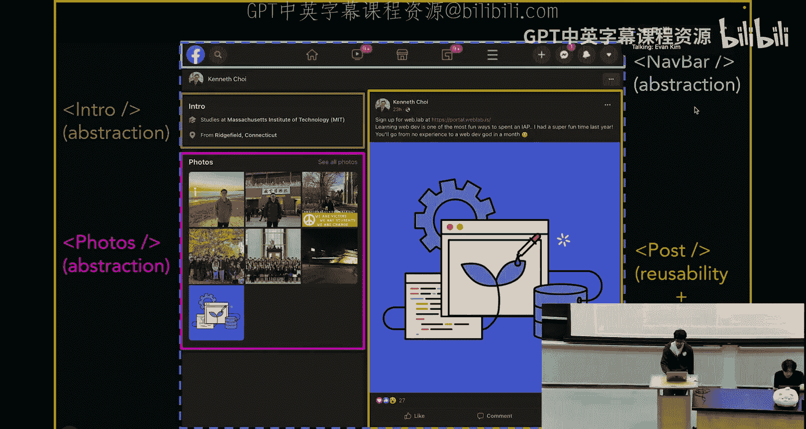

同样，我的工作流程将从硬编码版本开始，然后将其回退到更抽象和合理的模块。让我们从 `App` 开始。这个，我将从一个完全模块化的版本开始。但你可以看到这个 `App` 非常简单。它所做的就是实例化所有这些不同的组件，除此之外真的没有太多内容。

我们缺少的一样东西是 props。如果你回想一下组件树，所有这些不同的组件都是 `App` 组件的直接子组件，这意味着 `App` 负责将 props 传递给它们。

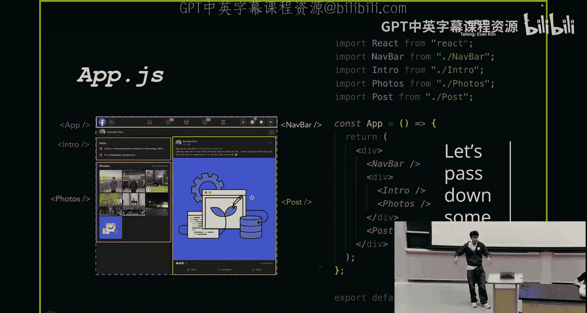

在 React 中传递 props 的语法与 HTML 中的属性非常相似。你可以通过做这种 `变量=值` 的事情来设置 props 对象中的一个变量。

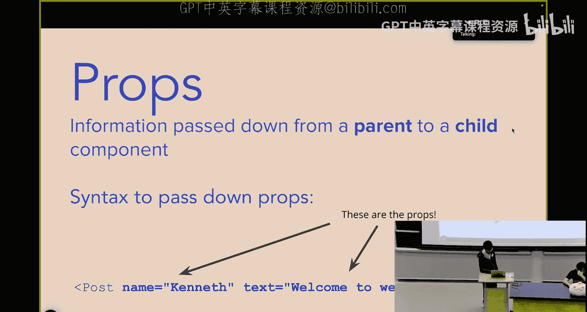

如果我们想将 props 添加到我们的组件中，这就是它的样子。例如，在 `Intro` 中，我们想知道这个个人资料所属的人的教育背景和城市。所以我们传递下去。`Photos` 我们想传递下去，也许是我们数据库中所有照片的路径。然后对于 `Post`，显然，我们需要名字和内容。

让我们看看其中一些子组件。同样，我们从硬编码开始，然后回退。这里的 `Intro` 非常简单。它只有两条信息：你在哪里学习以及你来自哪里。

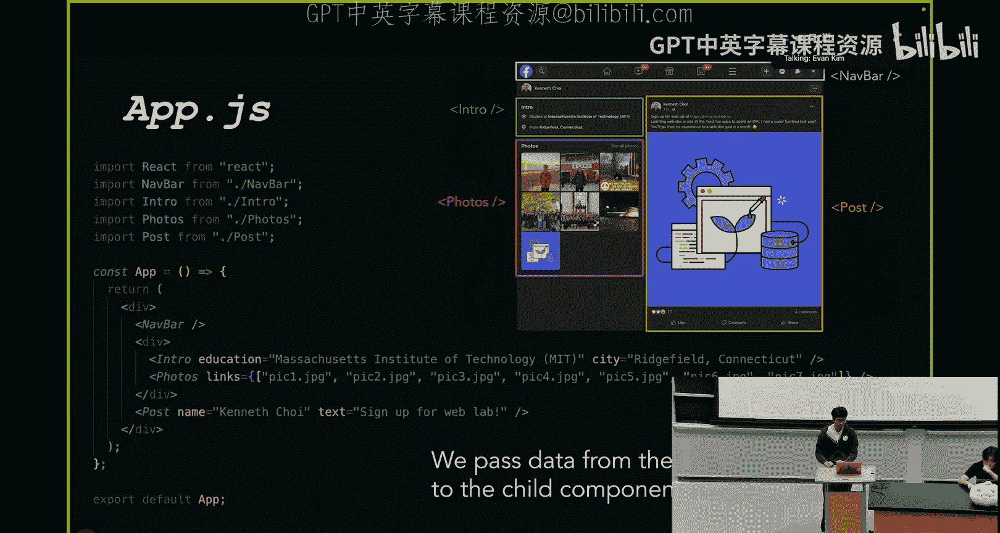

让我们尝试使用 props 将其回退。再次记住，每个 React 组件只是一个接收 props 并将其转换为要渲染内容的函数。所以假设我们提供了 props，我们需要做的就是访问 props 的这些属性。所以使用花括号，然后 `props.education`，对于城市，使用 `props.city`。

让我们看看 `Photos`。`Photos` 稍微复杂一点。为了渲染这个组件，我们希望访问这里将使用的所有图片。我们有大约 7 张 Kenny Facebook 页面上的图片。

让我解释一下这个。这里的东西是将每张照片映射到 JSX 中的一个图像元素。其语法是使用这个 `map` 函数。`.map` 接收一个函数，并将该函数应用于数组的每个元素。例如，我们有一个照片数组。然后因为我们使用了 `.map`，它会将每个不同的图像转换为 JSX 元素。这就是为什么我们可以将所有图片排列在一起。

我认为你稍后会得到更多这方面的练习。但是的，知道这个很好。

如果我们想将其“React 化”，那么我们可以用 props 替换所有这些图片链接，这些 props 将从 `App` 传递下来。所以与之前相比，我们只是用 `props.links` 替换了硬编码的链接数组。它看起来整洁多了。

接下来，让我们看看 `Post`。`Post` 同样非常简单。我们有名字和内容。我们还有点赞按钮，它可能使用 props 以外的东西。但让我们先看看 props 相关的东西。

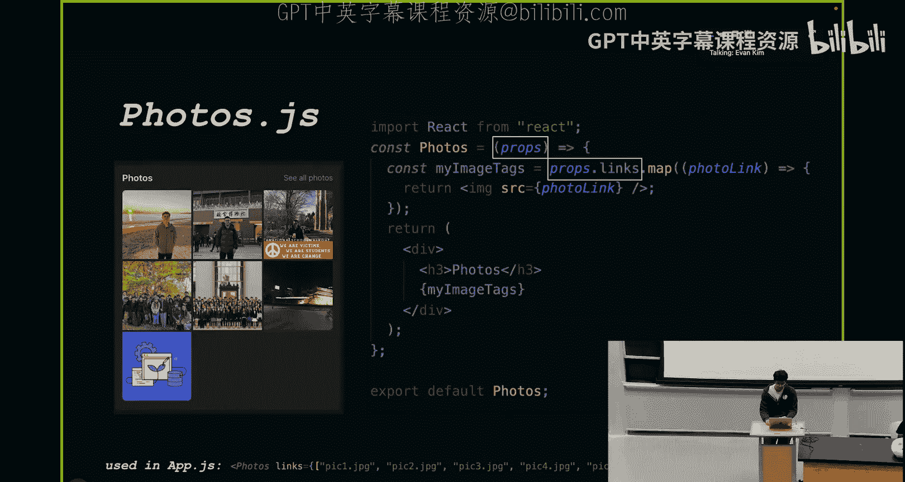

与 `Intro` 非常相似。我们将使用 JavaScript 访问那些东西。好了，让我们谈谈点赞按钮。对于点赞按钮，我们可能不会传递一个 prop 来表示它是否被点赞，因为这是组件内部非常固有的东西。这不是 Evan 之前提到的那种情况，即你希望它处于高层级的东西中。

所以让我们再次使用 state 来实现点赞按钮。我们还希望实现当按钮被点击时，点赞按钮会改变状态的功能。这使其成为 state 的一个非常好的候选者。

所以我们将使用与之前相同的语法。这就是我们将使用我们导入的 `useState` 的地方。同样，我们将有 `const`，然后我们有一个数组，定义为 `[isLiked, setIsLiked]`。第一个是状态，下一个是状态设置函数，然后我们用 `useState` 初始化默认值。

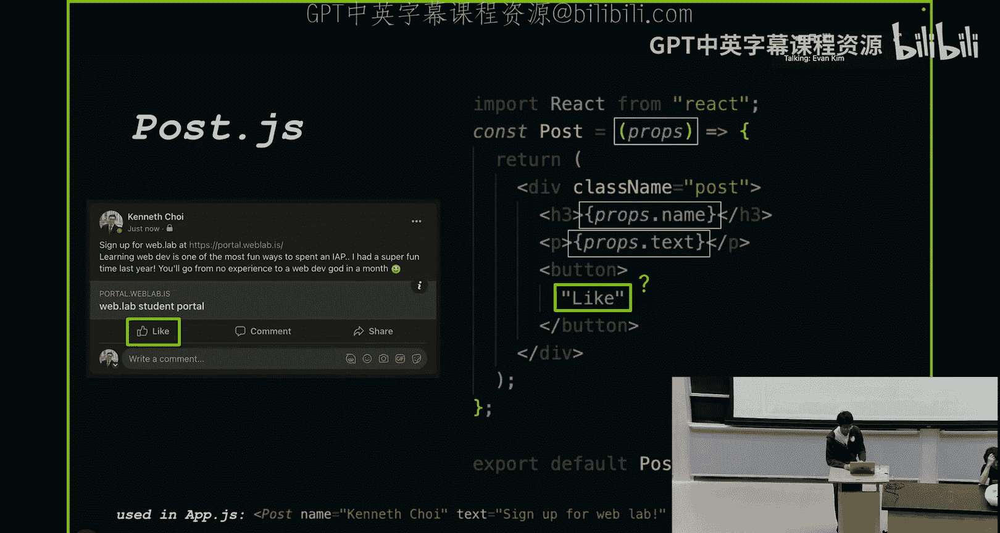

在这里，实际上有一个叫做 `onClick` 的属性。所以，每当你渲染一个按钮时，都有一个属性用于按钮被点击时，那就是 `onClick`。`onClick` 将被设置为你希望每次按钮被点击时调用的函数。

例如，这里的 `onClick` 被设置为这个回调函数（或者说不是回调，而是一个函数），它将 `isLiked` 设置为它之前值的相反值，你可以看到他们使用了一个感叹号。这基本上会在每次点击按钮时切换 `isLiked`。

然后，在其中，我们渲染与之前评论回复相同的条件语句。所以，如果 `isLiked` 为真，那么我们将显示“已点赞”；如果不是，我们将显示“点赞”。

如果这对你现在有点困惑，请不要担心。我们涵盖了很多内容，节奏很快。在今天的研讨会和稍后的课程中，你会得到更多练习。

重申一下，这个 `setIsLiked` 函数，括号内的值会将其设置为该值。所以每次 `onClick` 被触发时，我们将把 `isLiked` 设置为它之前值的相反值。

## 课程总结 📚

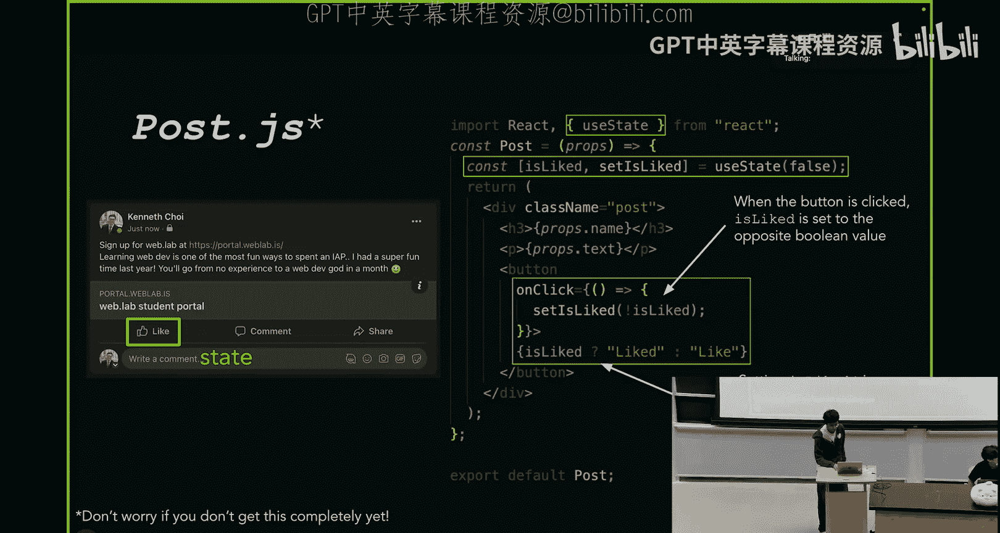

好了，以上就是关于 React 的很多内容。如果你没有完全理解我讲的所有内容，绝对不用担心。我们有一个指南供你复习，非常有帮助，随时可以回看。网址是 `bla.dot.is/slash/rack-guide`。

总结一下，React 很有用，因为我们可以进行抽象和重用。我们希望将我们的应用划分为一堆组件。每个组件放在一个文件中，然后每个组件将捆绑一些 JSX 或一些 JavaScript 逻辑，然后输出一些 JSX。

实现这一点的语法如下。Props 和 state 是 React 的核心。我们将使用类似属性的语法传入 props，然后通过作为 JavaScript 对象访问来读取这些 props。对于 state，我们将声明状态，语法如我所展示的。我们总是可以通过调用设置函数并传入我们决定的值来设置我们的状态。

哦，对了，每当你进行样式设计时，请确保使用 `className` 而不是 `class`。

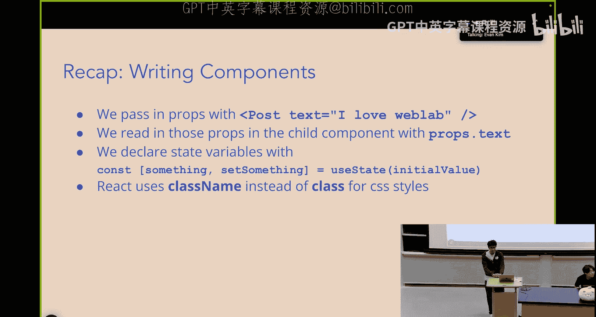

在本节课中，我们一起学习了 React 的基本概念，包括组件、props 和 state。我们了解了如何通过组件化来构建模块化、可重用的前端界面，并初步接触了 JSX 语法和状态管理。这些是构建现代交互式 Web 应用的基础。