# 011：工作坊2（动态信息流与路由）🚀

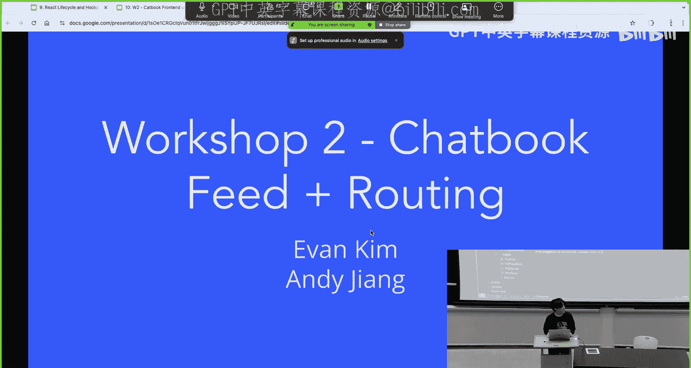

在本节课中，我们将基于工作坊1构建的页面，创建一个类似Facebook的动态信息流页面，包含帖子和评论功能。我们将学习如何使用React状态管理动态内容，并实现页面间的路由导航。

---

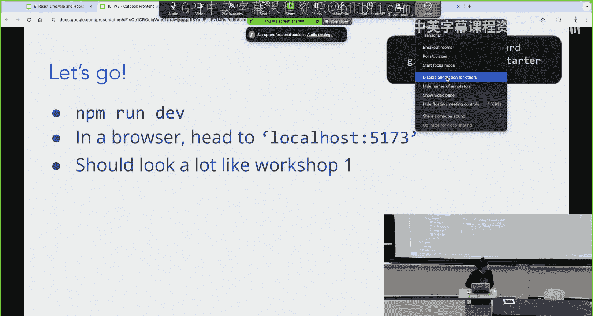

## 概述 📋


今天的工作坊将分为几个主要部分：
1.  渲染单个帖子组件。
2.  使用状态管理帖子列表。
3.  实现添加新帖子的功能。
4.  学习并实现React Router进行页面导航。
5.  为帖子添加评论功能。

我们将从基础开始，逐步构建一个功能完整的动态信息流页面。

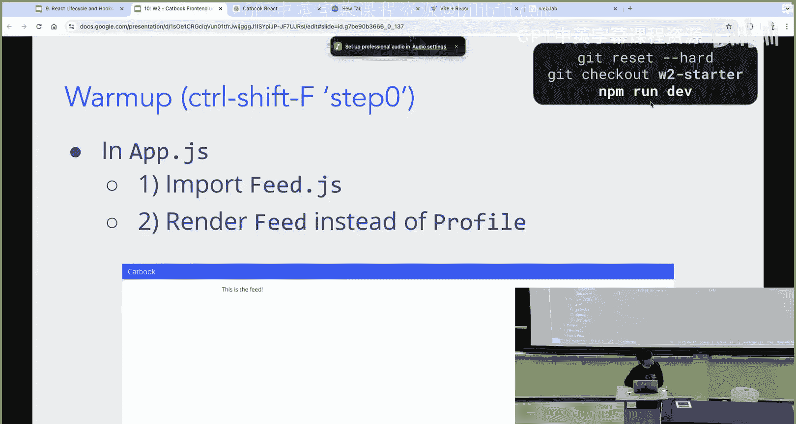

---


## 步骤0：导入Feed页面 🏁

首先，我们需要将应用的主页从个人资料页面切换到信息流页面。

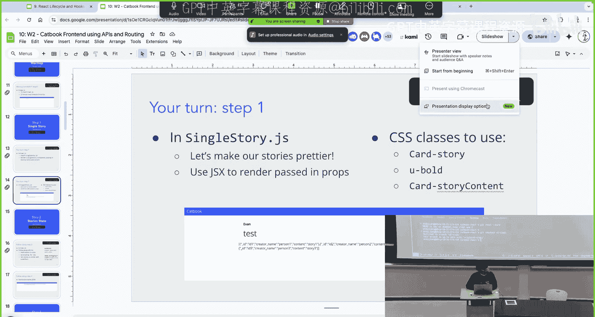

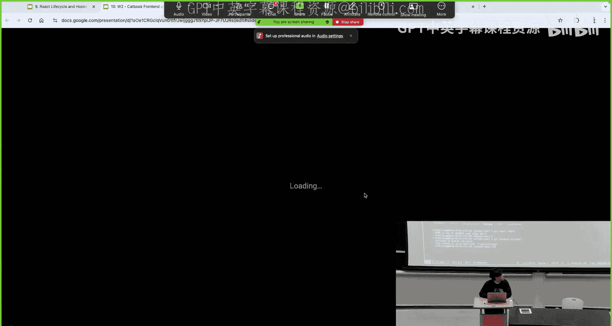

在 `App.jsx` 文件中，找到导入 `Profile` 组件的地方，将其替换为导入 `Feed` 组件。

```jsx
// 在 App.jsx 中
import Feed from './pages/Feed';
```

然后，在渲染部分，将 `<Profile />` 组件替换为 `<Feed />` 组件。

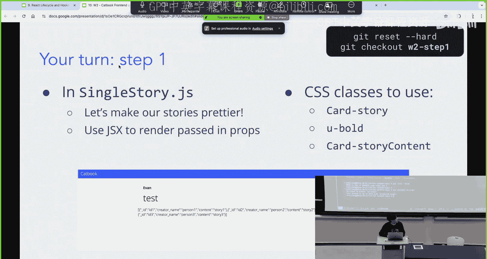

```jsx
// 在 App.jsx 的渲染部分
<Feed />
```


完成此步骤后，访问应用将看到“This is the feed”的占位文本，表明我们已成功切换到信息流页面。

---

## 步骤1：渲染单个帖子组件 📝

上一节我们设置了Feed页面，本节中我们来看看如何渲染一个帖子。

我们的目标是创建一个 `SingleStory` 组件，用于显示帖子的发布者名称和内容。这个组件将接收 `creatorName` 和 `content` 作为属性（props）。

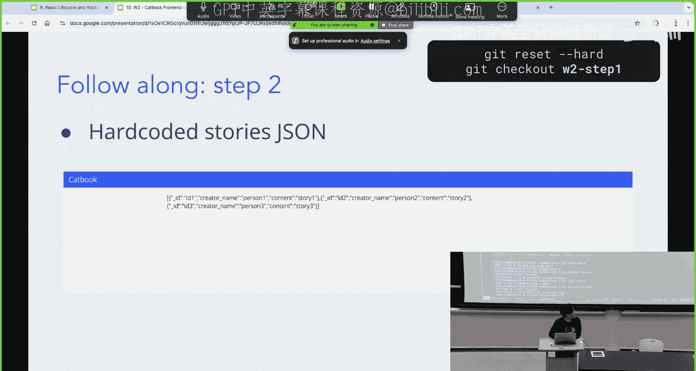


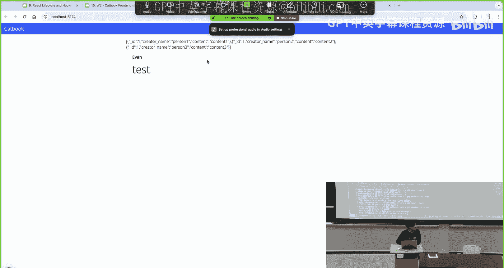


以下是创建 `SingleStory` 组件的步骤：

1.  在 `modules/SingleStory.jsx` 文件中，导入必要的CSS样式。
2.  在组件函数中，使用 `props.creatorName` 和 `props.content` 来接收数据。
3.  在JSX中，使用一个 `<div>` 包裹内容，并为其添加 `card-story` 类名。
4.  在 `<div>` 内部，使用一个 `<h1>` 标签来加粗显示 `creatorName`。
5.  在 `<h1>` 下方，使用另一个 `<div>` 并添加 `card-story-content` 类名来显示 `content`。

完成后的 `SingleStory` 组件代码大致如下：

```jsx
import './Card.css';

function SingleStory(props) {
  return (
    <div className="card-story">
      <h1>{props.creatorName}</h1>
      <div className="card-story-content">{props.content}</div>
    </div>
  );
}

export default SingleStory;
```

现在，在 `Feed.jsx` 中导入并使用 `<SingleStory />` 组件，并传入一些测试数据，你就能在页面上看到一个格式化的帖子了。

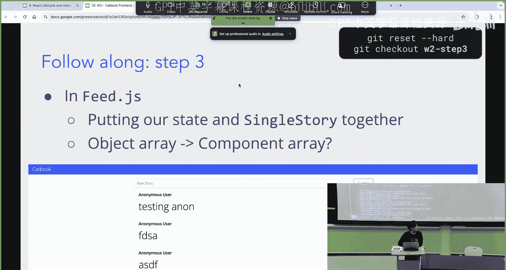

---

## 步骤2：创建帖子状态管理 🗂️

我们已经可以渲染单个帖子，但一个信息流需要显示多个帖子。本节我们将学习如何使用React的 `useState` 钩子来管理一个帖子列表的状态。

在 `Feed.jsx` 组件中，我们首先需要导入 `useState`。

```jsx
import { useState } from 'react';
```

然后，在 `Feed` 组件函数内部，声明一个状态变量来存储帖子列表。初始状态可以设为一个空数组。

```jsx
const [stories, setStories] = useState([]);
```

接下来，我们使用 `useEffect` 钩子在组件首次加载时，向状态中填充一些硬编码的初始数据。这模拟了从服务器获取数据的过程。

```jsx
import { useState, useEffect } from 'react';

function Feed() {
  const [stories, setStories] = useState([]);

  useEffect(() => {
    // 创建一些初始帖子对象
    const story1 = { id: ‘id1‘， creatorName: ‘Person One‘， content: ‘First post content‘ };
    const story2 = { id: ‘id2‘， creatorName: ‘Person Two‘， content: ‘Second post content‘ };
    // 使用 setStories 更新状态
    setStories([story1， story2]);
  }, []); // 空依赖数组确保只在组件挂载时运行一次

  // ... 其余渲染代码
}
```

现在，`stories` 状态中就包含了我们的帖子数据，为下一步渲染列表做好了准备。

---

## 步骤3：渲染帖子列表 📜

有了帖子数据的状态，我们现在需要将数组中的每个帖子对象渲染成 `SingleStory` 组件。我们将使用JavaScript数组的 `map` 方法来实现。

在 `Feed.jsx` 的渲染部分，我们可以根据 `stories` 数组的长度来决定渲染内容。

以下是渲染逻辑：

1.  检查 `stories` 数组是否为空。
2.  如果为空，则显示“暂无帖子”之类的提示。
3.  如果不为空，则使用 `map` 方法遍历 `stories` 数组，为每个帖子对象生成一个 `<SingleStory />` 组件。

具体实现代码如下：

```jsx
function Feed() {
  // ... 之前的 useState 和 useEffect 代码

  let storiesList;
  if (stories.length === 0) {
    storiesList = <div>No stories yet.</div>;
  } else {
    storiesList = stories.map((story) => (
      <SingleStory
        key={story.id}
        id={story.id}
        creatorName={story.creatorName}
        content={story.content}
      />
    ));
  }

  return (
    <div>
      {/* 其他内容，比如添加新帖子的输入框 */}
      {storiesList}
    </div>
  );
}
```

注意：我们为每个 `SingleStory` 组件添加了一个唯一的 `key` 属性（使用 `story.id`），这有助于React高效地更新列表。


现在，页面上应该会显示我们硬编码的两个帖子了。

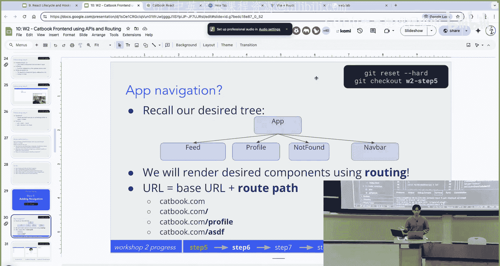

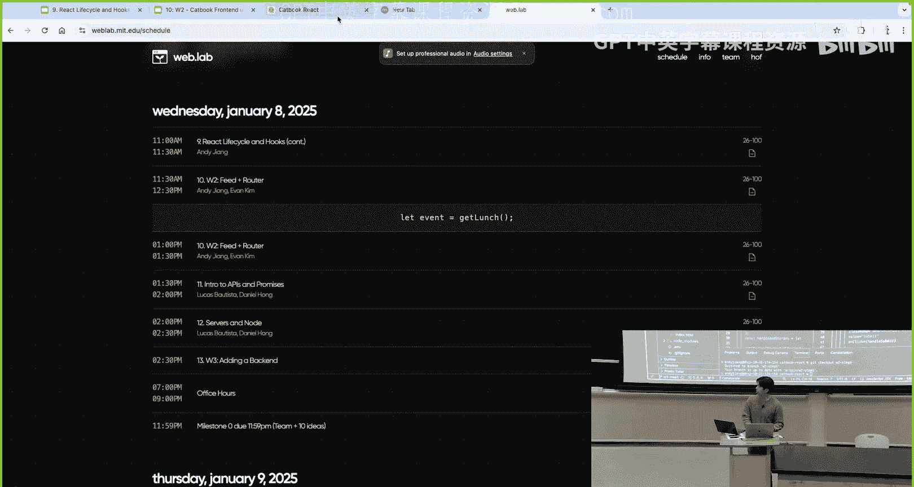

---

## 步骤4：实现添加新帖子功能 ➕

一个动态的信息流需要允许用户创建新内容。本节我们将构建一个表单，让用户可以提交新帖子，并实时更新到帖子列表中。

这个功能涉及几个组件协作：
*   `NewPostInput`: 一个通用的输入框组件，包含文本框和提交按钮。
*   `NewStory`: 一个特定于发布帖子的组件，它使用 `NewPostInput` 并定义提交后的行为。
*   `Feed`: 顶层组件，持有 `stories` 状态和更新该状态的函数。

首先，在 `Feed` 组件中创建一个函数，用于向 `stories` 状态添加新帖子。

```jsx
function Feed() {
  const [stories， setStories] = useState([]);

  const addNewStory = (content) => {
    const newStory = {
      id: `story-${Date.now()}`, // 生成一个简易唯一ID
      creatorName: ‘Anonymous‘， // 目前默认为匿名
      content: content，
    };
    setStories([...stories， newStory]); // 将新帖子添加到列表末尾
  };

  // ... 其余代码
}
```

接着，我们创建 `NewStory` 组件（在 `modules/NewPostInput/NewStory.jsx` 中）。这个组件会渲染 `NewPostInput`，并将 `addNewStory` 函数作为回调传递给它。

```jsx
import NewPostInput from ‘./NewPostInput‘;

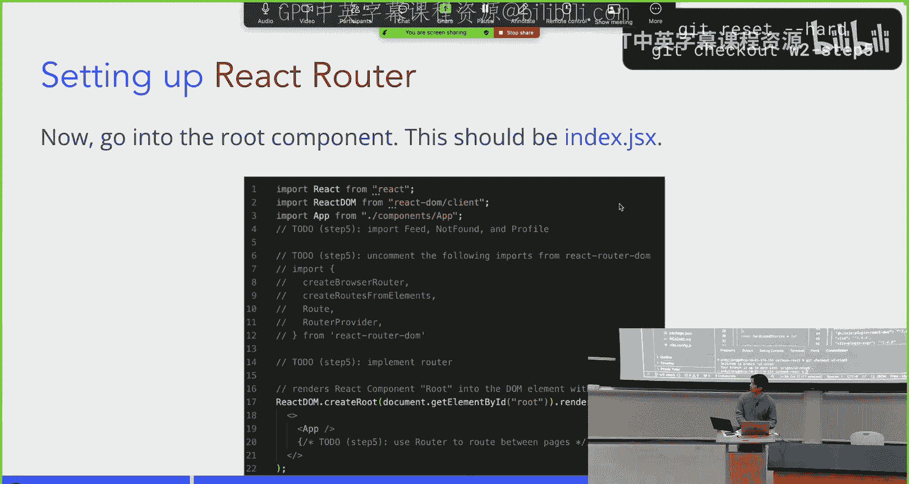

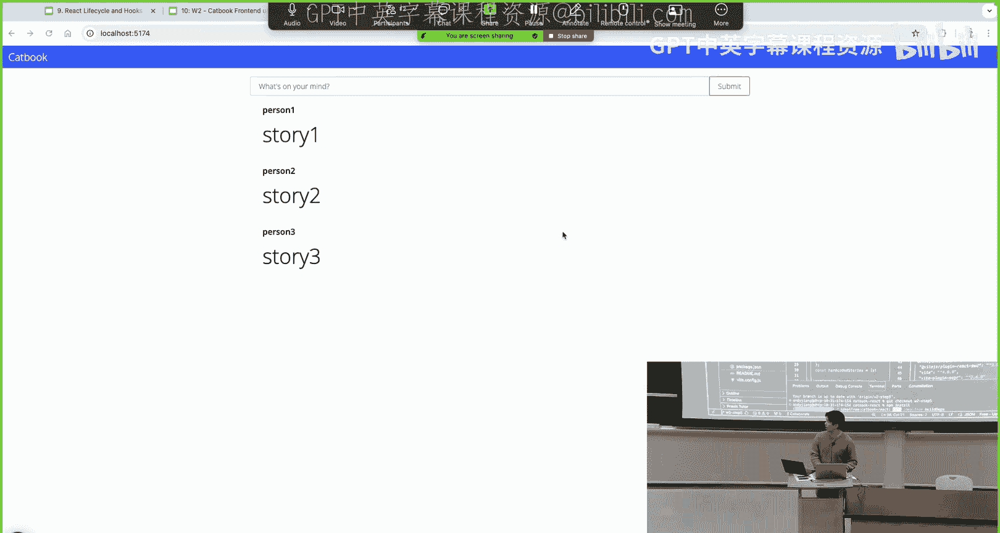

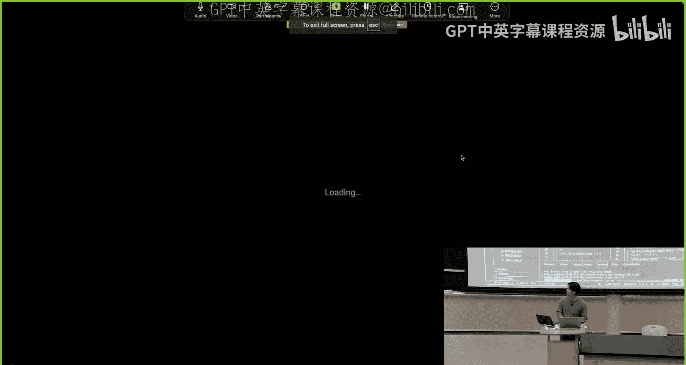

function NewStory(props) {
  // 这个函数会被 NewPostInput 在提交时调用
  const addStory = (value) => {
    props.addNewStory(value); // 调用从 Feed 传入的函数
  };

  return (
    <NewPostInput
      defaultText=“Enter your story here...“
      onSubmit={addStory} // 传递回调函数
    />
  );
}

export default NewStory;
```

最后，在 `Feed` 组件中导入并使用 `NewStory` 组件，并将 `addNewStory` 函数作为属性传递给它。

```jsx
import NewStory from ‘./modules/NewPostInput/NewStory‘;

function Feed() {
  // ... addNewStory 函数定义

  return (
    <div>
      <NewStory addNewStory={addNewStory} />
      {/* 渲染 storiesList */}
      {storiesList}
    </div>
  );
}
```

现在，页面顶部会出现一个输入框。输入文字并点击提交后，新的帖子就会立刻出现在信息流列表中。

---

## 步骤5：实现页面路由导航 🧭

目前我们的应用只有一个页面。为了在“信息流”和“个人资料”页面间切换，我们需要引入路由功能。本节将使用 `react-router-dom` 库来实现客户端路由。

首先，确保 `package.json` 中已包含 `react-router-dom` 依赖，并运行 `npm install` 安装。

路由配置通常在应用的入口文件进行。我们打开 `index.jsx`。

以下是配置路由的步骤：

1.  从 `react-router-dom` 导入必要的组件。
2.  使用 `createBrowserRouter` 函数创建路由配置。
3.  定义路径（`path`）与组件（`element`）的对应关系。
4.  用 `<RouterProvider>` 替换之前直接渲染 `<App>` 的代码。

具体代码如下：

```jsx
// index.jsx
import { createBrowserRouter， RouterProvider } from ‘react-router-dom‘;
import App from ‘./App‘;
import Feed from ‘./pages/Feed‘;
import Profile from ‘./pages/Profile‘;
import NotFound from ‘./pages/NotFound‘;

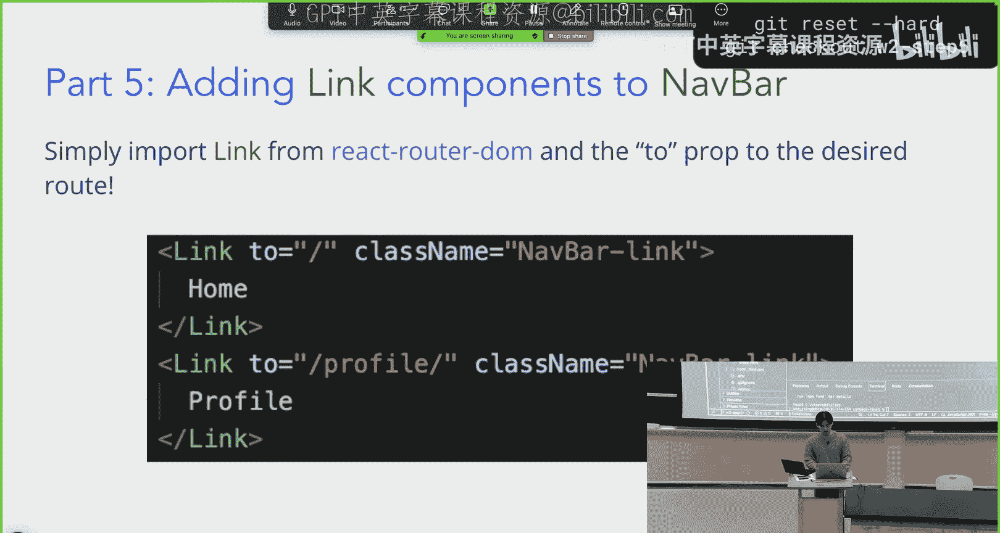

// 1. 创建路由配置
const router = createBrowserRouter([
  {
    path: ‘/‘，
    element: <App />，
    errorElement: <NotFound />， // 用于匹配未定义路径
    children: [
      // 定义子路由，这些组件将在 App 组件的 <Outlet /> 位置渲染
      {
        index: true， // 当路径为 ‘/‘ 时渲染 Feed
        element: <Feed />，
      }，
      {
        path: ‘profile‘，
        element: <Profile />，
      }，
    ]，
  }，
]);


// 2. 使用 RouterProvider 并提供路由配置
const root = ReactDOM.createRoot(document.getElementById(‘root‘));
root.render(
  <RouterProvider router={router} />
);
```

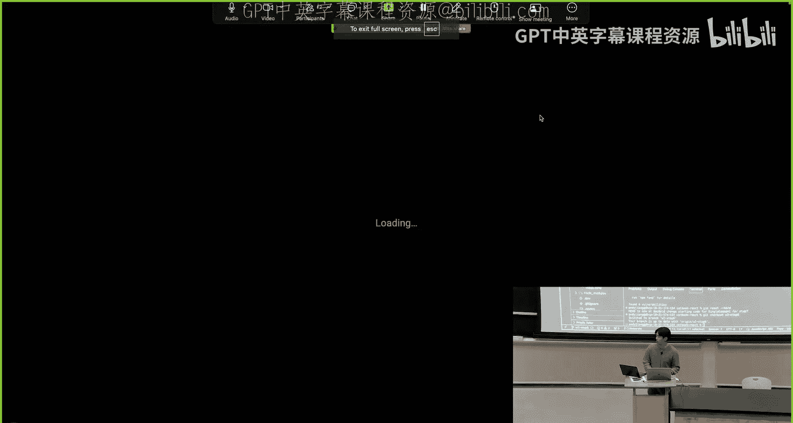

然后，我们需要修改 `App.jsx`，使其能根据当前路由渲染不同的子页面。我们使用 `<Outlet />` 组件。

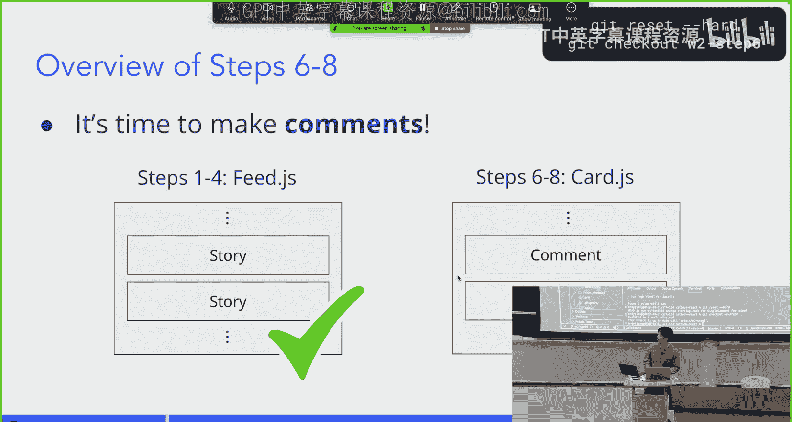


```jsx
// App.jsx
import { Outlet } from ‘react-router-dom‘;
import NavBar from ‘./modules/NavBar‘;

function App() {
  return (
    <div>
      <NavBar />
      {/* Outlet 是子路由组件渲染的位置 */}
      <Outlet />
    </div>
  );
}
```

最后，更新导航栏 `NavBar.jsx`，使用 `<Link>` 组件替代普通的 `<a>` 标签，以实现无页面刷新的导航。

```jsx
import { Link } from ‘react-router-dom‘;

function NavBar() {
  return (
    <div className=“nav-bar“>
      <div className=“nav-bar-link-container“>
        <Link to=“/“ className=“nav-bar-link“>Home</Link>
        <Link to=“/profile“ className=“nav-bar-link“>Profile</Link>
      </div>
    </div>
  );
}
```

现在，点击导航栏的链接，URL会变化，主内容区也会在信息流和个人资料页面之间切换，而不会重新加载整个页面。

---

## 步骤6：创建帖子卡片组件 🃏

为了让单个帖子包含其下方的评论，我们需要创建一个新的 `Card` 组件作为容器。本节我们将把 `SingleStory` 和未来的评论列表包裹进这个 `Card` 组件。

首先，修改 `Feed.jsx`，不再直接映射 `stories` 到 `SingleStory`，而是映射到 `Card` 组件，并将整个帖子对象作为属性传递。

```jsx
// Feed.jsx
import Card from ‘./modules/Card‘;

// ... 在映射 stories 的地方
storiesList = stories.map((story) => (
  <Card
    key={story.id}
    id={story.id}
    creatorName={story.creatorName}
    content={story.content}
  />
));
```

然后，在 `Card.jsx` 组件中，我们接收这些属性，并首先渲染 `SingleStory` 组件。

```jsx
// Card.jsx
import SingleStory from ‘./SingleStory‘;

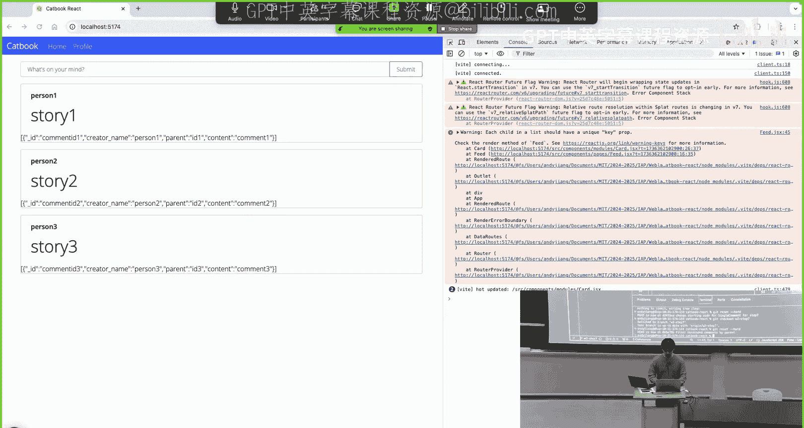


function Card(props) {
  return (
    <div className=“card“>
      <SingleStory
        id={props.id}
        creatorName={props.creatorName}
        content={props.content}
      />
      {/* 评论区域将在这里渲染 */}
    </div>
  );
}
```

这样，我们就为每个帖子创建了一个卡片容器，为下一步添加评论打下了基础。

---

## 步骤7：渲染帖子评论 💬

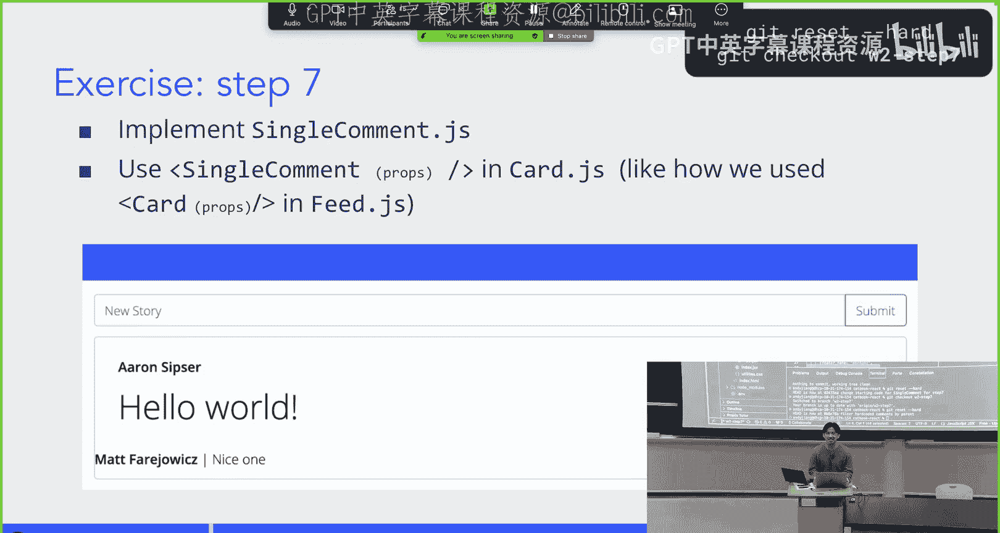

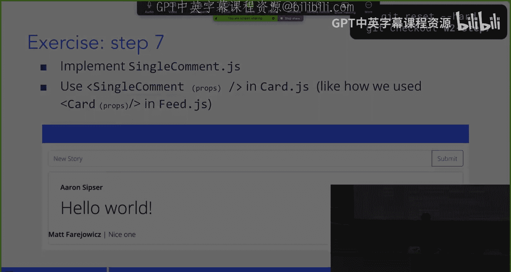

现在，我们让每个帖子卡片能够显示其关联的评论。思路与渲染帖子列表类似：在 `Card` 组件中管理评论状态，并映射渲染。

首先，在 `Card` 组件中为评论创建状态。

```jsx
import { useState， useEffect } from ‘react‘;

function Card(props) {
  const [comments， setComments] = useState([]);

  // 模拟组件加载时获取该帖子的评论
  useEffect(() => {
    // 假设有一个所有评论的硬编码列表
    const allComments = [
      { id: ‘c1‘， parentId: ‘id1‘， creatorName: ‘UserA‘， content: ‘Great post!‘ }，
      { id: ‘c2‘， parentId: ‘id2‘， creatorName: ‘UserB‘， content: ‘Thanks for sharing.‘ }，
      // ... 更多评论
    ];
    // 过滤出属于当前帖子的评论
    const postComments = allComments.filter(comment => comment.parentId === props.id);
    setComments(postComments);
  }, [props.id]); // 依赖项包含 props.id，当帖子ID变化时重新获取

  // ... 渲染 SingleStory
}
```

接着，我们创建一个 `SingleComment` 组件来显示单条评论（类似于 `SingleStory`），然后在 `Card` 组件中映射 `comments` 状态来渲染评论列表。

```jsx
// 在 Card.jsx 的渲染部分
<div className=“comments-section“>
  <h3>Comments</h3>
  {comments.length === 0 ? (
    <div>No comments yet.</div>
  ) : (
    comments.map((comment) => (
      <SingleComment
        key={comment.id}
        creatorName={comment.creatorName}
        content={comment.content}
      />
    ))
  )}
</div>
```

现在，每个帖子卡片下方都会显示其对应的评论了。

---

## 步骤8：实现添加新评论功能 🗨️

最后一步是允许用户在每个帖子下添加评论。这需要我们在 `Card` 组件中创建一个类似添加帖子的功能。

我们创建一个 `NewComment` 组件（它内部也使用通用的 `NewPostInput`）。在 `Card` 组件中，定义添加评论的函数，并将其传递给 `NewComment`。

首先，在 `Card` 组件中定义添加评论的函数：

```jsx
function Card(props) {
  const [comments， setComments] = useState([]);

  const addNewComment = (commentText) => {
    const newComment = {
      id: `comment-${Date.now()}`，
      parentId: props.id， // 关联到当前帖子
      creatorName: ‘Anonymous‘，
      content: commentText，
    };
    setComments([...comments， newComment]); // 更新评论状态
  };

  // ... 其余代码
}
```

然后，创建并渲染 `NewComment` 组件，将 `addNewComment` 函数和当前帖子的 `id` 传递给它。

```jsx
import NewComment from ‘./modules/NewPostInput/NewComment‘;

// ... 在 Card 组件的渲染部分，放在评论列表之后
<NewComment storyId={props.id} addNewComment={addNewComment} />
```

在 `NewComment` 组件内部，它会调用 `NewPostInput`，并在提交时，将输入框的值和接收到的 `storyId` 一起，通过 `addNewComment` 回调函数传回给 `Card` 组件。

完成这一步后，每个帖子卡片底部都会有一个输入框，用户可以输入并提交评论，新评论会立即显示在该帖子下方。

---

## 总结 🎉

本节课中我们一起学习了如何构建一个动态的Web应用信息流页面。我们涵盖了以下核心概念：

1.  **组件化与Props**：通过 `SingleStory`、`SingleComment` 等组件复用UI。
2.  **状态管理**：使用 `useState` 钩子管理 `stories` 和 `comments` 等动态数据。
    ```jsx
    const [state， setState] = useState(initialValue);
    ```
3.  **列表渲染**：使用数组的 `map` 方法将数据数组渲染为组件列表。
4.  **事件处理与状态更新**：通过表单提交事件触发回调函数，更新父组件的状态。
5.  **客户端路由**：使用 `react-router-dom` 库实现基于URL的页面导航，主要涉及 `<RouterProvider>`、`createBrowserRouter` 和 `<Link>`。
6.  **组件层次结构与数据流**：理解了数据如何通过props从父组件流向子组件，以及回调函数如何将子组件的数据传回父组件。

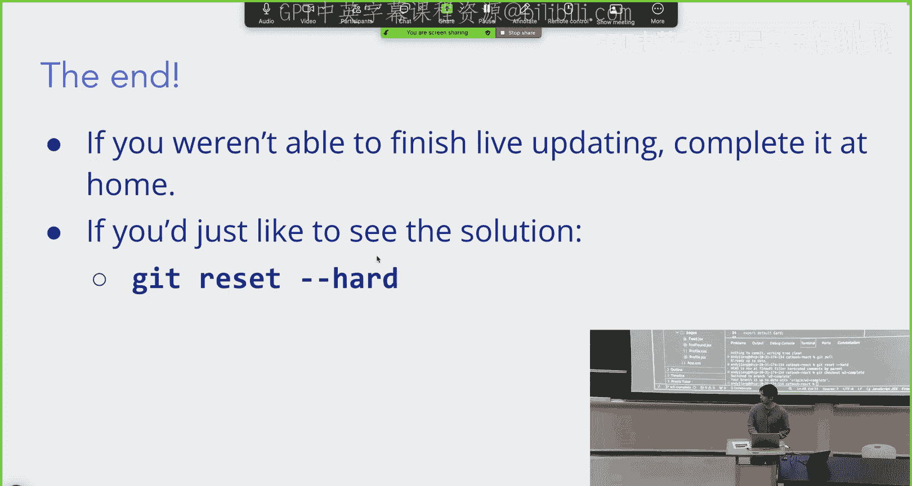


通过这些练习，你已经掌握了构建具有交互性和多页面视图的现代React应用的基础。在接下来的课程中，我们将为这个前端应用连接后端服务器，实现数据的持久化存储。