# 019：调试Catbook第三部分答案


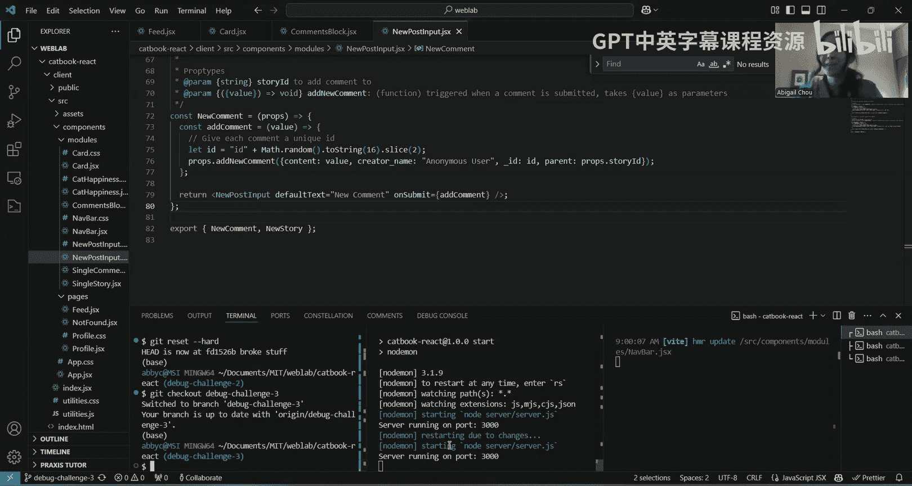

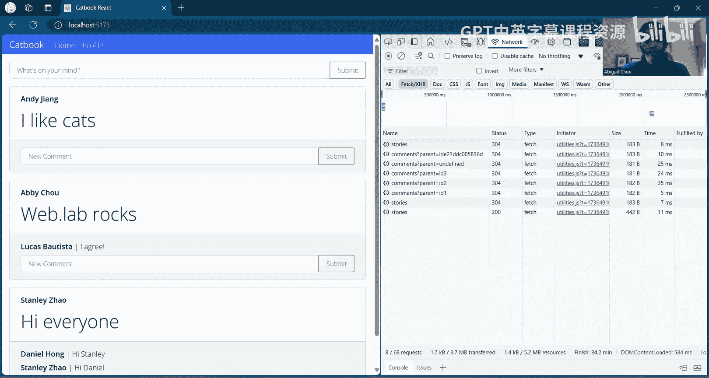

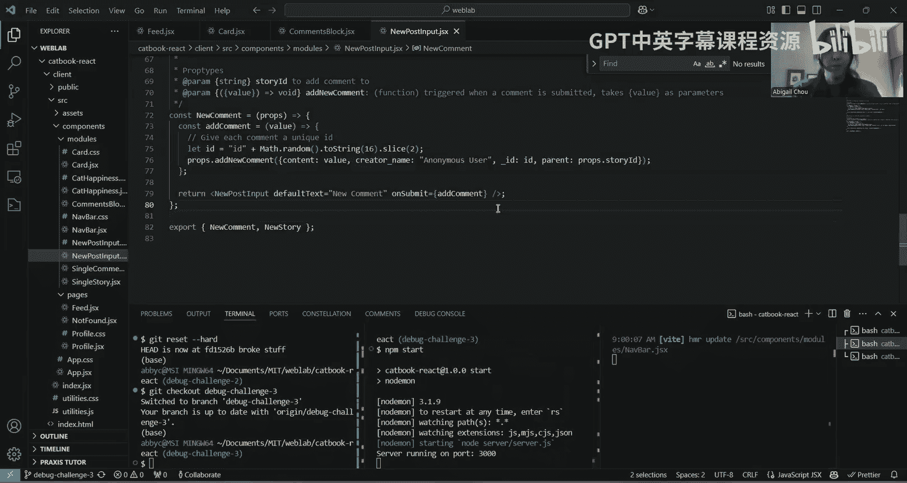

在本节课中，我们将一起回顾并解决调试挑战三中的问题。我们将学习如何使用浏览器开发者工具的网络面板来诊断前端与后端之间的通信问题，并修复导致评论不显示、故事发布失败以及评论无法持久保存的代码错误。

## 检查评论显示问题

上一节我们介绍了调试的基本思路。本节中我们来看看如何定位评论不显示的问题。

首先，我们注意到主页上的评论没有正确显示。这通常意味着从服务器获取评论的GET请求可能存在问题。我们知道正常情况下应该有一些评论存在。

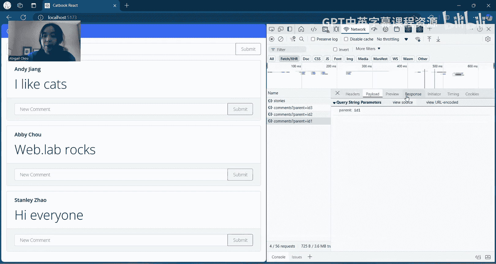

以下是检查网络请求的步骤：
1.  打开浏览器开发者工具，切换到“网络”面板。
2.  刷新页面，观察发出的请求。
3.  找到向`/comments`端点发出的GET请求并检查其详情。

通过检查，我们发现请求URL是正确的（例如`/comments?parent=ID1`），并且服务器返回了成功的状态码（如200）。然而，响应体是空的。这表明问题很可能出在服务器端，它没有返回预期的评论数据。

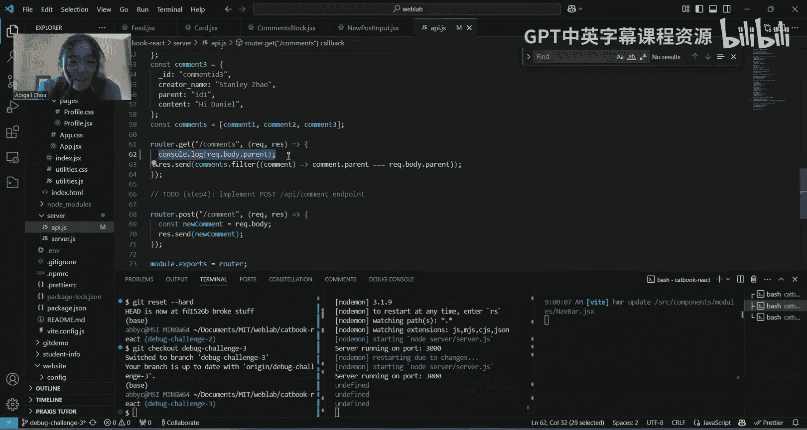

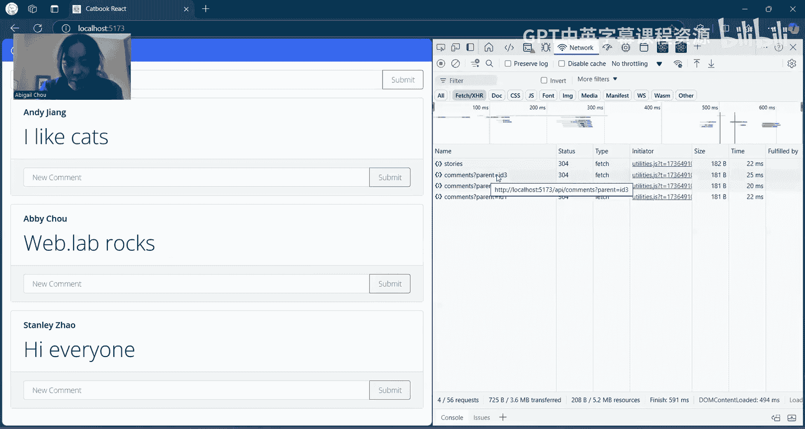

## 诊断后端API错误

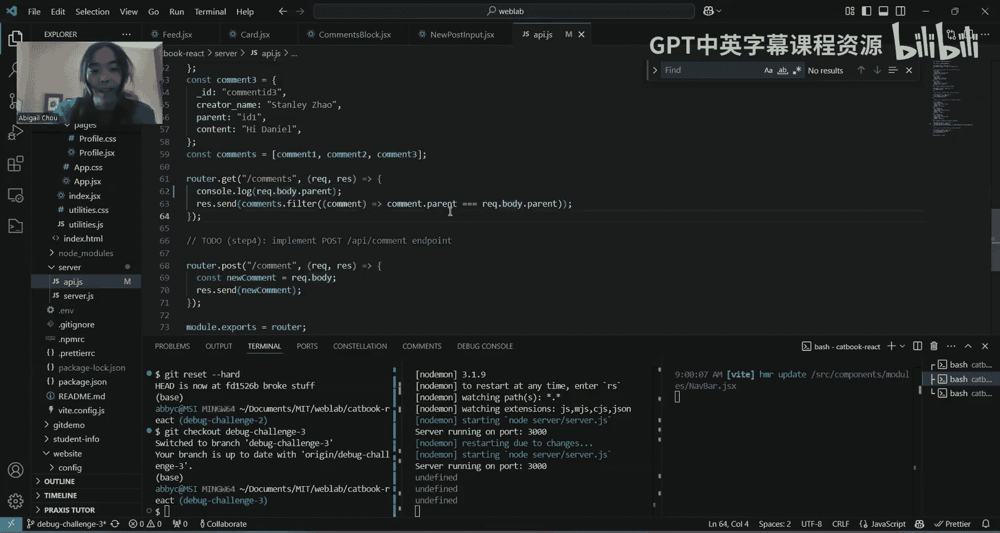

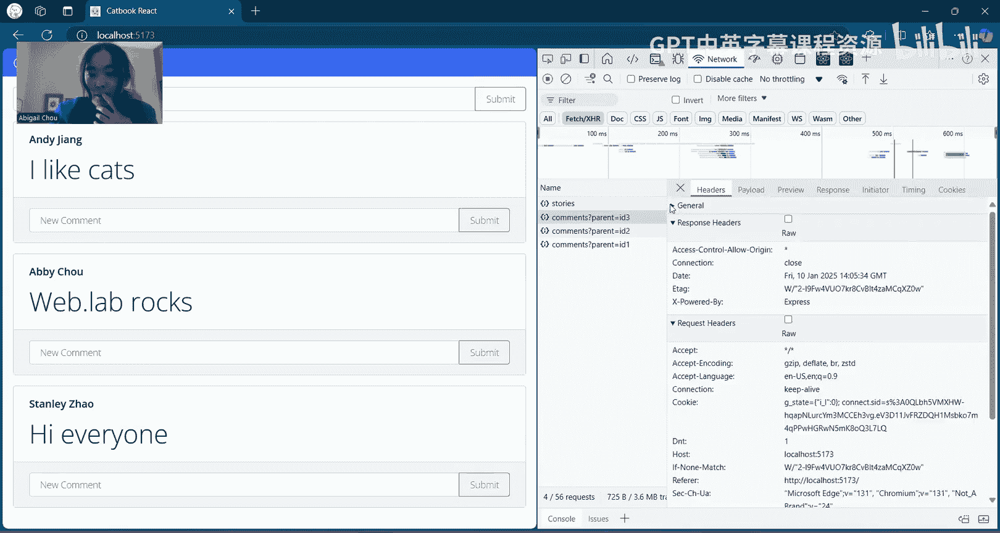

既然前端请求看起来正常，那么问题可能出在后端处理逻辑上。让我们检查服务器端的API代码。

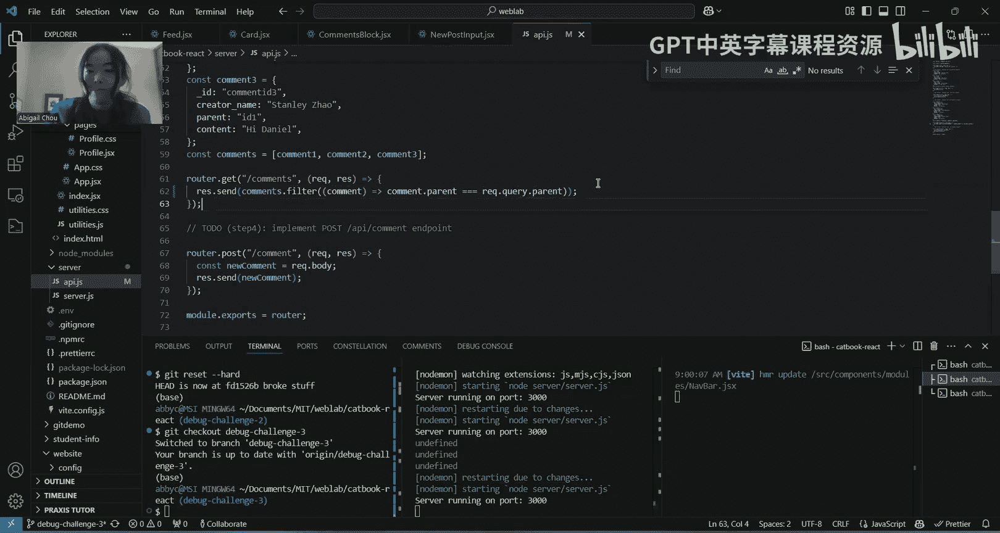

在`api.js`文件中，处理`/comments` GET请求的代码如下：
```javascript
app.get("/comments", (req, res) => {
  const parent = req.body.parent; // 这里使用了错误的属性
  const matchingComments = comments.filter(c => c.parent === parent);
  res.send(matchingComments);
});
```
这里存在一个关键错误：我们试图从`req.body`中获取`parent`参数。然而，对于GET请求，参数是通过查询字符串（URL中`?`后面的部分）传递的，应该使用`req.query`来访问。

为了验证这一点，我们可以在服务器代码中添加调试语句：
```javascript
console.log("Received parent:", req.body.parent);
```
这个`console.log`的输出会显示在运行服务器的终端中，而不是浏览器的控制台。通过观察，我们发现`req.body.parent`的值是`undefined`，这证实了我们的猜测。

修复方法是将`req.body.parent`改为`req.query.parent`。

## 修复故事发布功能

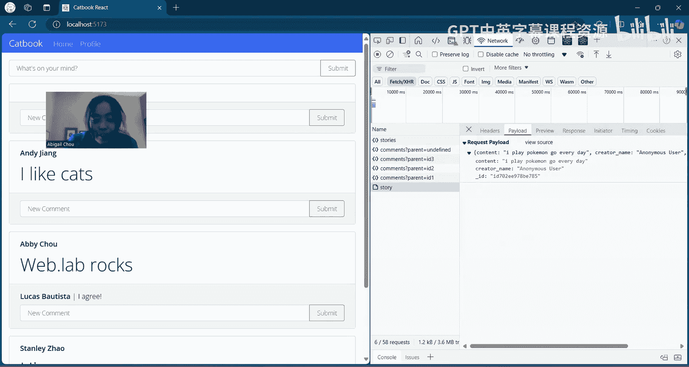

解决了评论显示问题后，我们接下来看看发布新故事的功能为何失效。

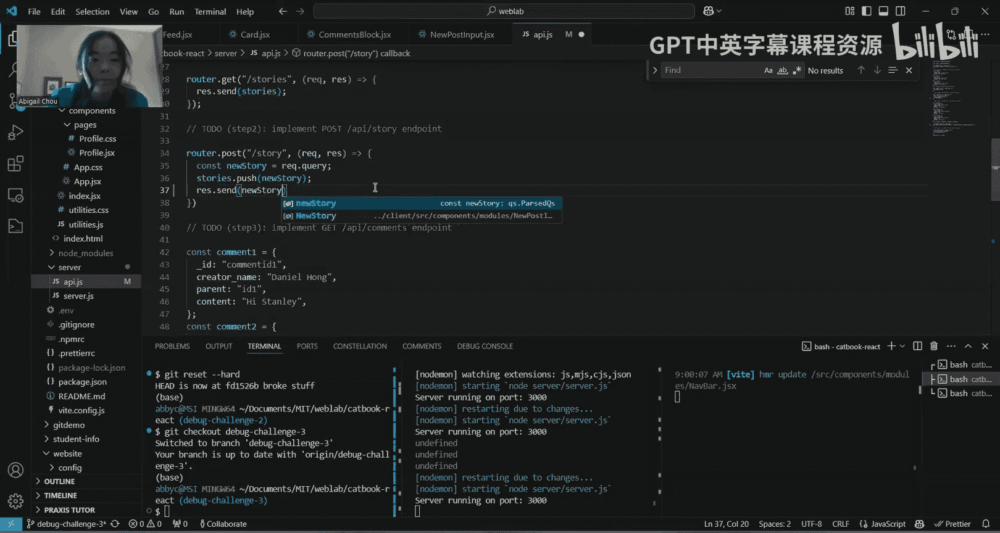

当我们尝试发布一个新故事时，故事会出现在列表中，但没有内容。我们需要检查发布故事的POST请求。

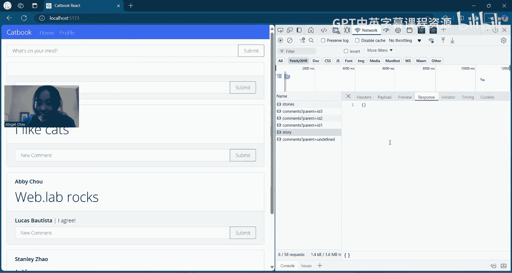

在网络面板中，我们找到向`/api/story`发出的POST请求。检查其“载荷”标签页，可以看到前端发送的数据包含`content`、`creator`、`name`和`_id`字段，这看起来是正确的。

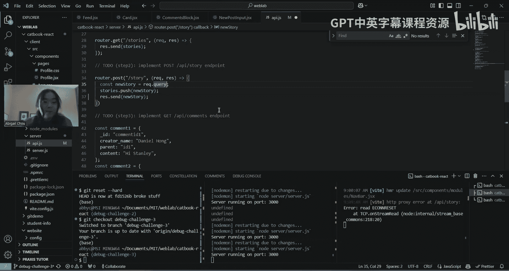

然而，服务器没有返回任何响应。通常，成功创建资源后，服务器应该将新创建的故事对象返回给前端。

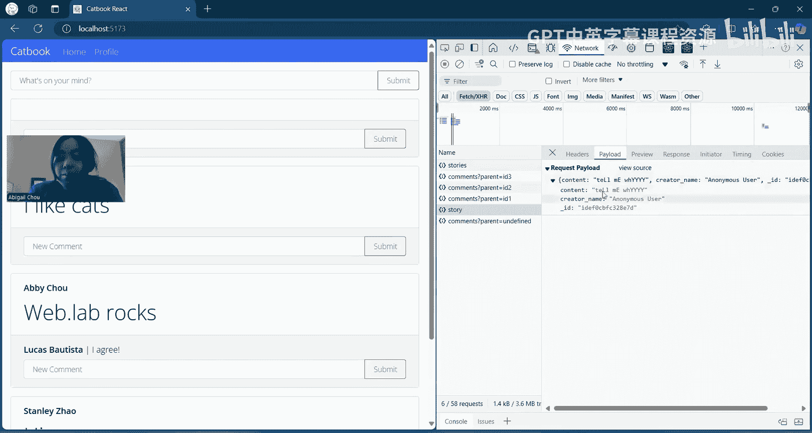

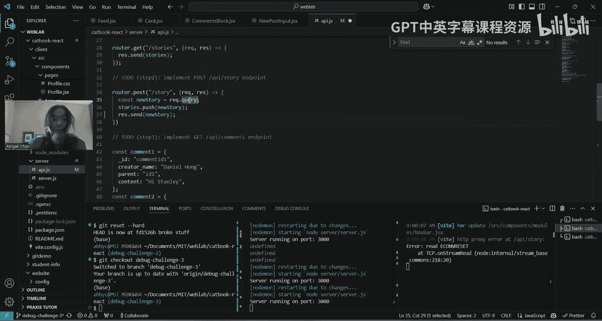

检查`api.js`中处理`POST /story`的代码：
```javascript
app.post("/story", (req, res) => {
  const newStory = req.query; // 错误：使用了req.query
  stories.push(newStory);
  // 缺少 res.send(...) 语句
});
```
这里有两个问题：
1.  我们错误地从`req.query`中获取数据，但POST请求的数据在请求体`req.body`中。
2.  我们在`stories`数组中添加了新故事，但没有使用`res.send`将新故事对象返回给前端。

修复方法是：
1.  将`req.query`改为`req.body`。
2.  在函数末尾添加`res.send(newStory);`。

## 确保评论被持久保存

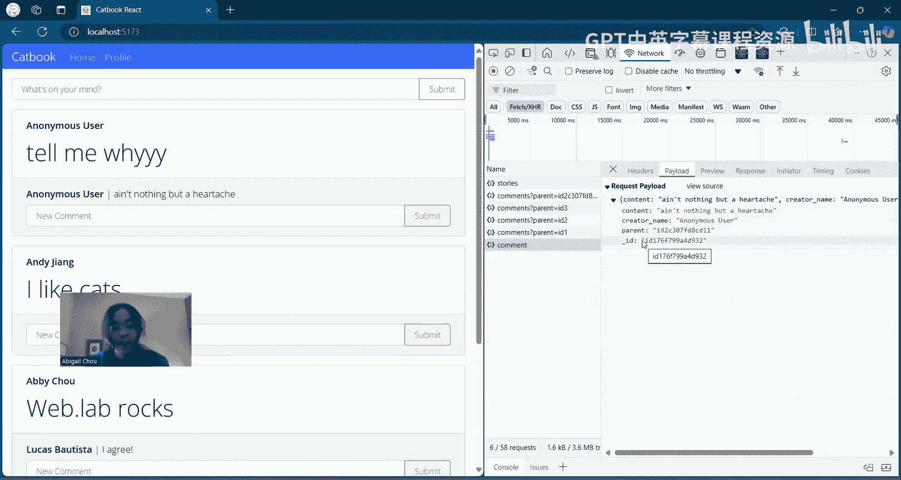

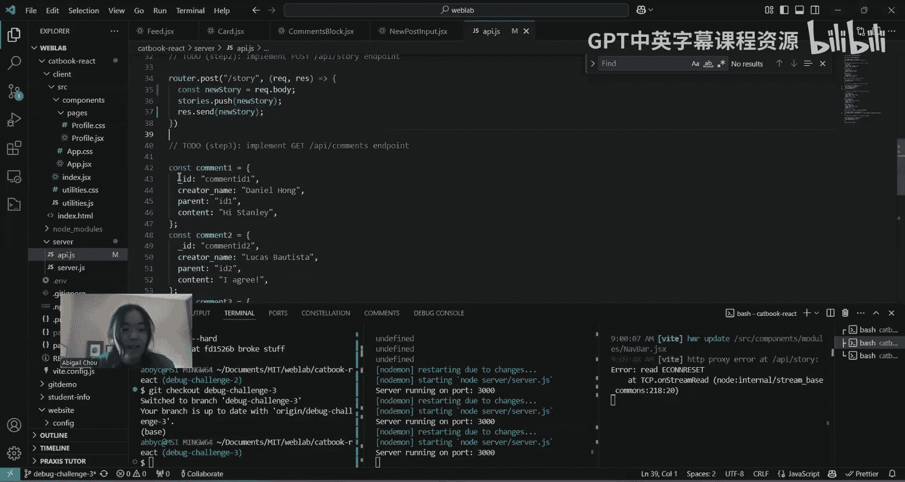

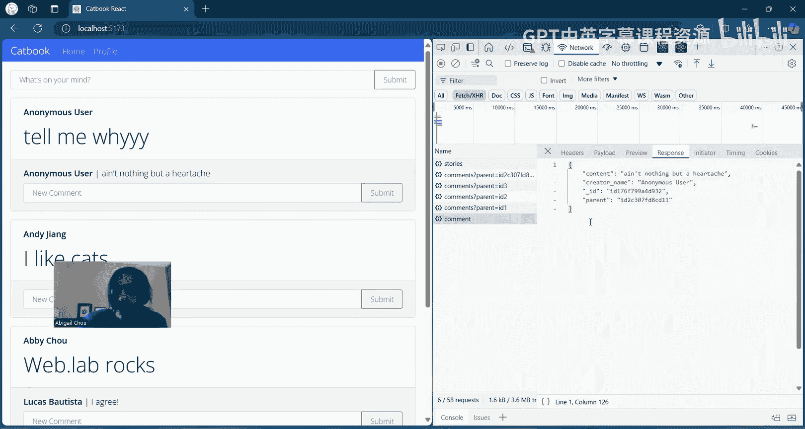

最后一个问题是：新发布的评论在页面刷新后会消失。虽然提交评论后能立即显示，说明前端接收和显示响应是正常的，但刷新后数据丢失，说明服务器没有将评论正确保存到内存中。

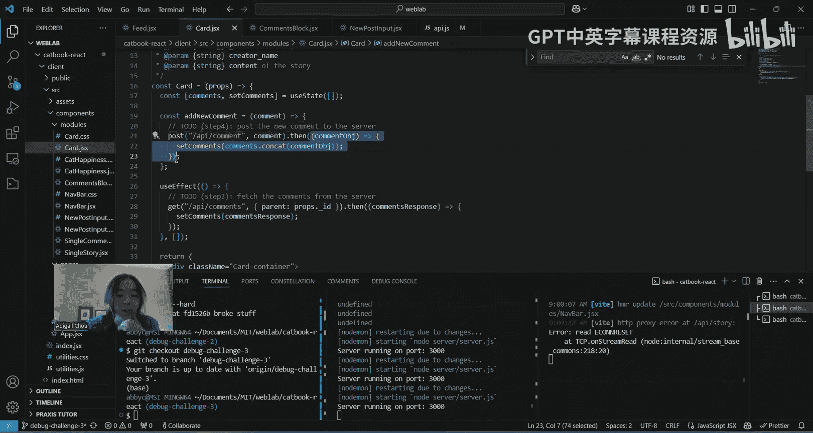

检查处理`POST /comment`的代码：
```javascript
app.post("/comment", (req, res) => {
  const newComment = req.body;
  res.send(newComment);
  // 缺少将评论保存到数组的步骤
});
```
代码接收了评论数据并返回给了前端，但没有将其存入`comments`数组。因此，当服务器重启或新的GET请求到来时，这些数据就丢失了。

修复方法是在发送响应之前，将新评论添加到数组中：
```javascript
app.post("/comment", (req, res) => {
  const newComment = req.body;
  comments.push(newComment); // 保存评论
  res.send(newComment);
});
```


## 总结

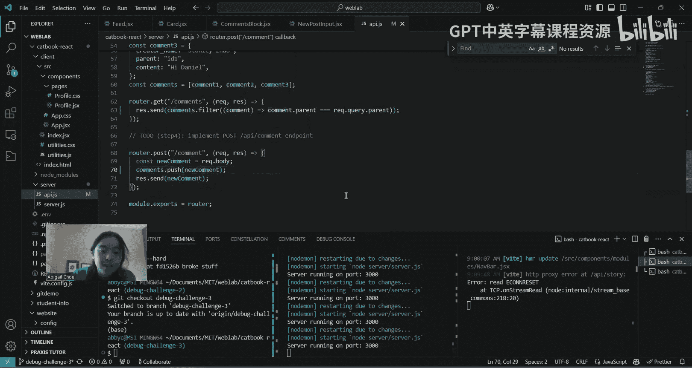

本节课中我们一起学习了如何系统性地调试一个全栈Web应用。
1.  **利用网络面板**：通过检查请求和响应的具体内容，我们可以快速定位问题是发生在前端（请求格式错误）还是后端（响应错误或缺失）。
2.  **理解请求类型**：我们明确了GET请求的参数通过`req.query`访问，而POST请求的数据通过`req.body`访问。
3.  **完整的CRUD操作**：对于创建（POST）操作，后端除了处理数据，通常还需要将创建的资源返回给前端，并确保数据被持久保存（例如，推入内存数组）。
4.  **添加调试日志**：在服务器代码中使用`console.log`可以帮助我们理解数据的流动和变量的实际值。

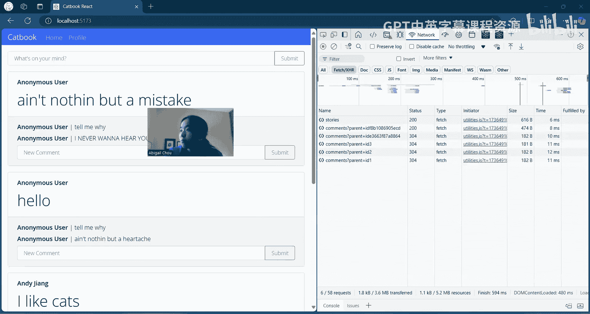

通过修复这三个bug——评论获取、故事发布和评论保存——我们巩固了对于前后端交互和数据流管理的理解。