# 021：数据库 🗄️

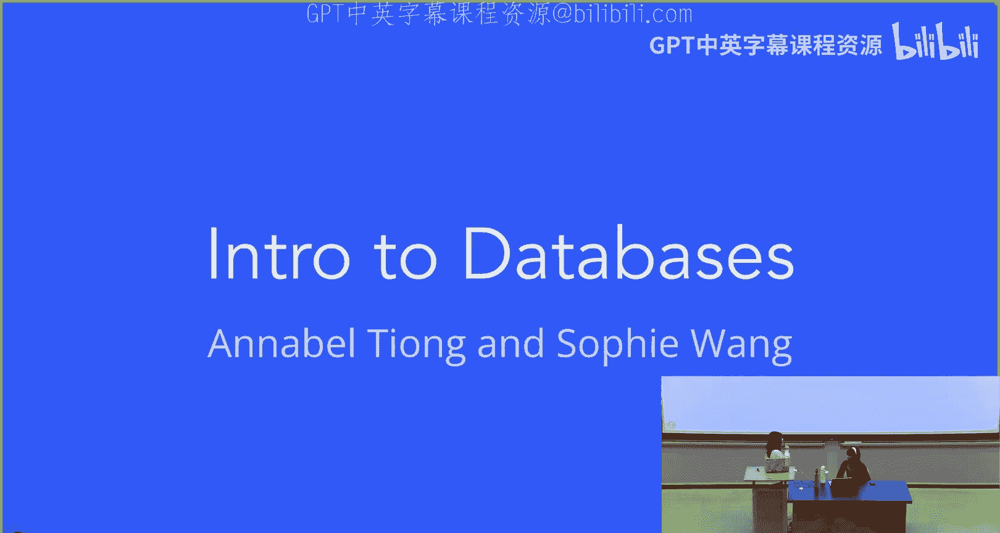

在本节课中，我们将要学习数据库的基础知识，了解为什么在Web应用中需要数据库，并初步认识我们将要使用的MongoDB。

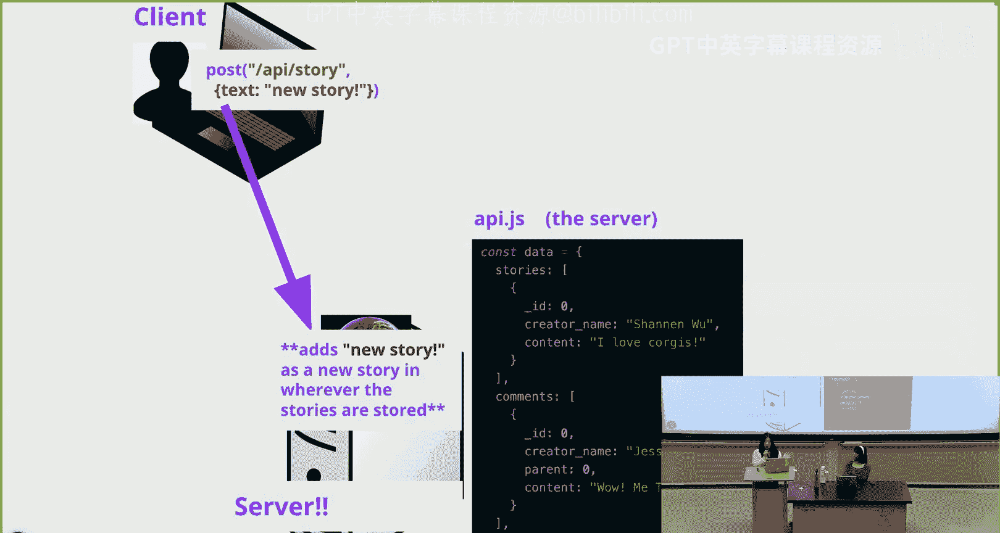

## 概述

目前，我们在Catbook中存储数据的方式是将数据直接保存在服务器的一个变量（如 `stories` 数组）中。然而，这种方式存在一些问题。本节我们将探讨这些问题，并介绍数据库作为更优的解决方案。

## 当前数据存储方式的问题

上一节我们介绍了将数据存储在服务器变量中的方式。本节中我们来看看这种方式存在哪些主要缺陷。

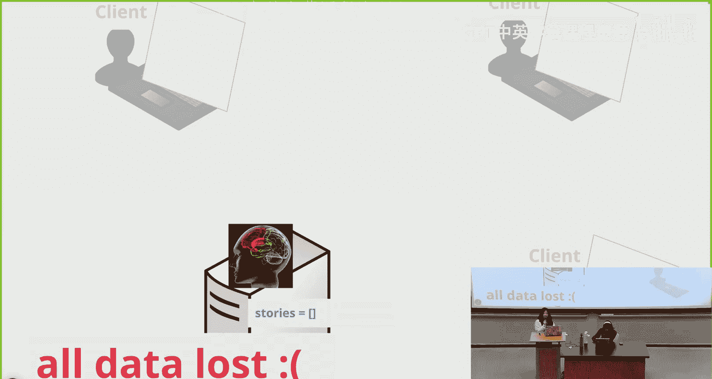

当客户端发送请求（例如向 `/api/story` 端点提交新故事）时，数据被添加到服务器上的 `stories` 数组中。代码如下：
```javascript
// 在 api.js 中
const data = {
  stories: [
    { id: 1, creator: ‘Alice‘, content: ‘Hello‘ },
    // ... 更多故事
  ]
};
```

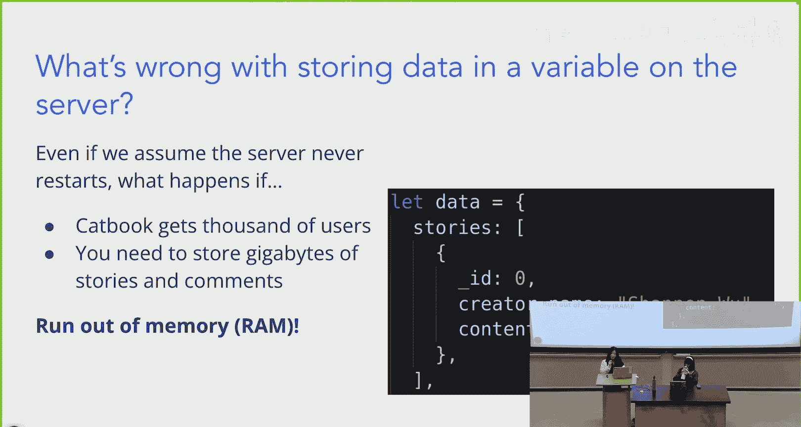

然而，这种方式有几个严重问题：

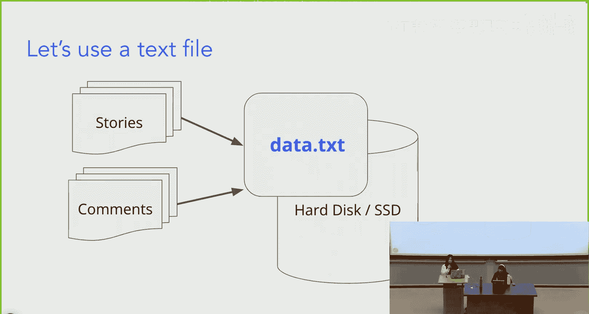

1.  **数据易失性**：如果服务器崩溃、终端关闭或电脑断电，存储在内存变量中的所有数据都会丢失。
2.  **内存限制**：随着用户和故事数量增长，大量数据存储在服务器的RAM中，可能导致内存不足。
3.  **性能问题**：随着数据量增大，直接在内存中管理和查询数据会变得低效。

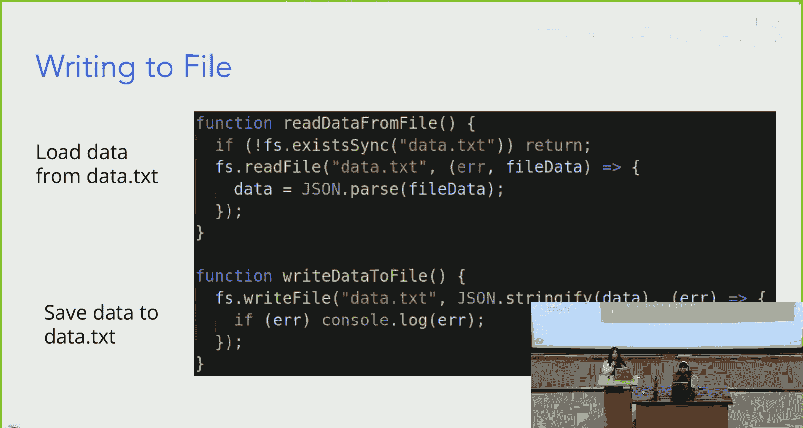

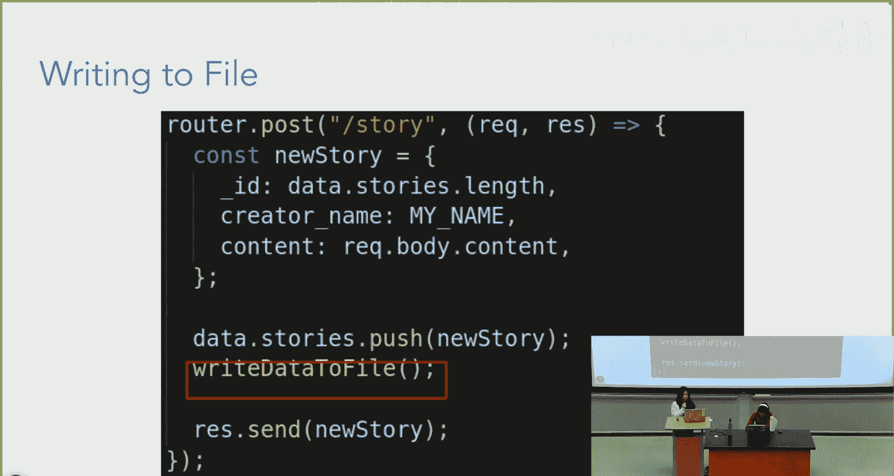

## 尝试改进：使用文本文件

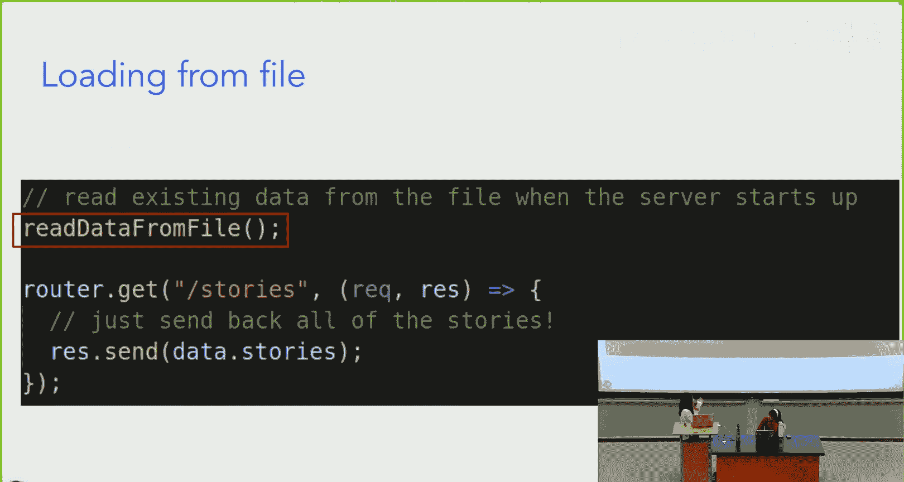

为了解决数据持久化的问题，我们可能会考虑将数据存储到硬盘的文本文件（如 `data.txt`）中。我们可以使用读写文件的函数。

以下是读写文件函数的伪代码示例：
```javascript
function readDataFromFile() {
  // 从 data.txt 读取数据
}
function writeDataToFile(data) {
  // 将数据写入 data.txt
}
```

在API端点中，我们可能会这样实现：
```javascript
// 加载数据
const stories = readDataFromFile();
// 保存数据
writeDataToFile(updatedStories);
```

虽然这解决了数据持久化的问题，但仍有其他弊端：

1.  **读写速度慢**：每次读写都需要进行文件I/O操作，非常耗时。
2.  **查询效率低**：要查找特定用户的故事，需要线性遍历整个文件内容。
3.  **硬盘仍会损坏**：存储文件的硬盘本身并非绝对可靠。
4.  **并发问题**：如果两个用户同时写入，无法确定最终哪个数据被保存，可能导致数据覆盖或丢失。

## 解决方案：数据库

那么，如何解决上述所有问题呢？答案是使用数据库。

数据库是一个高度组织化的数据集合，用于以结构化的方式存储应用中的所有数据。数据库管理系统（DBMS）则是一组函数的集合，允许你对数据库中的数据进行检索、添加、修改和删除等操作。

数据库有很多类型，例如：
*   **关系型数据库（如SQL）**：擅长处理结构化的关系数据。
*   **文档数据库（如MongoDB）**：以类似JSON的文档形式存储数据，更加灵活。
*   **图数据库**：强调数据之间的关系。
*   **时序数据库（如InfluxDB）**：专门处理带时间戳的数据。
*   **层次数据库（如IBM IMS）**：以树形结构组织数据。

在我们的Web开发课程中，我们将使用MongoDB，因为它更适合我们应用的灵活需求。

## 数据库如何工作

我们刚刚讨论了用数据库替代文本文件，用DBMS替代读写函数。现在让我们更深入地了解通过DBMS进行读写操作的过程。

### 读取数据的过程

1.  前端向服务器发送GET请求（例如 `/api/comments`）。
2.  后端服务器接收到请求。
3.  服务器通过DBMS调用一个“读”函数。
4.  DBMS访问数据库，获取所有评论数据。
5.  数据库将数据返回给DBMS，再传回服务器。
6.  服务器最终将数据发送回前端客户端。

### 写入数据的过程

1.  前端向服务器发送POST请求（例如 `/api/comments`）。
2.  后端服务器接收到请求和新数据。
3.  服务器通过DBMS调用一个“写”函数。
4.  DBMS将新数据添加到数据库中。

以下是DBMS操作的一些伪代码示例：
```javascript
// 导入DBMS包
const dbms = require(‘some-dbms-package‘);

// 读取所有故事
const allStories = dbms.read(‘stories‘);

// 带查询地读取（例如查找id为4的故事）
const storyWithId4 = dbms.read(‘stories‘, { id: 4 });

// 写入新故事
dbms.write(‘stories‘, newStory);

// 删除数据（例如删除用户Joyce的所有故事）
dbms.delete(‘stories‘, { author: ‘Joyce‘ });

// 更新数据（例如更新作者为Jay的故事）
dbms.update(‘stories‘, { author: ‘Jay‘ }, { content: ‘Updated content‘ });
```
*请注意，以上并非真实代码，仅为示意。*

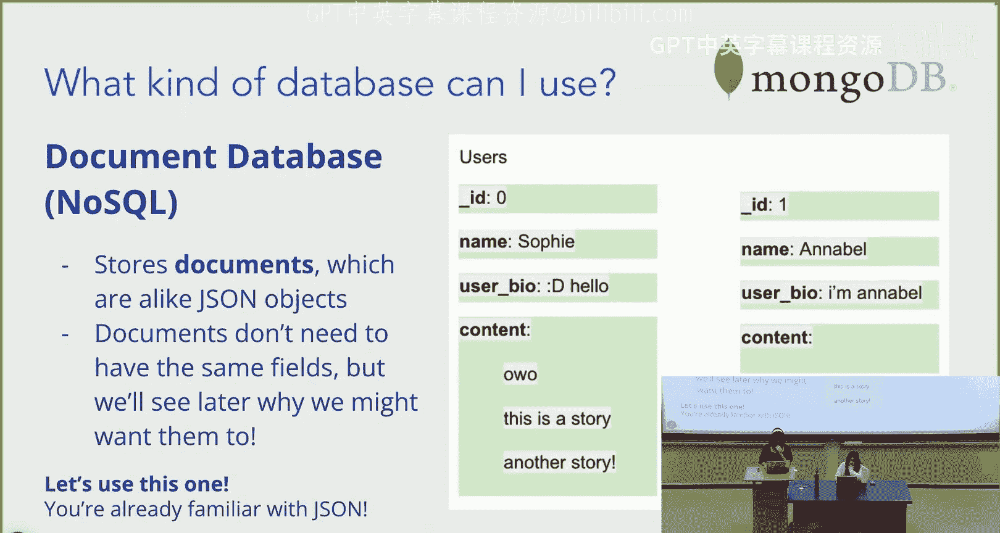

## 关系型数据库 vs 文档数据库

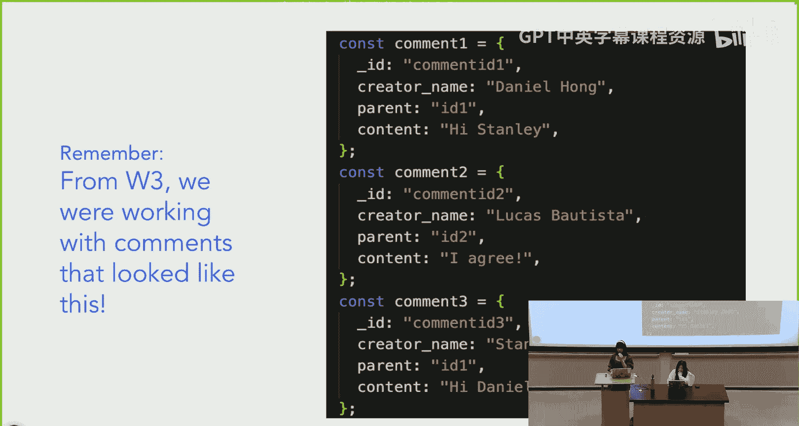

接下来，我们比较一下两种主要的数据库类型。

### 关系型数据库（如SQL）

关系型数据库将数据存储在具有行和列的表格中，类似于Excel或Google Sheets。
*   每个电子表格称为一个“表”。
*   例如，你可能有一个 `users` 表和一个 `stories` 表。
*   表之间通过关系连接（例如，`stories` 表中有一个 `user_id` 字段指向 `users` 表）。

**存在的问题：**
*   一个用户的数据可能分散在多个表中。
*   随着应用增长，表之间的关系会变得非常复杂，需要编写大量代码来维护这些关系。
*   这增加了代码的理解难度和添加新功能的困难。
*   数据库结构不够灵活，需要程序员编写代码去适应它。

### 文档数据库（如MongoDB）

文档数据库将数据存储为“文档”，这非常类似于我们熟悉的JavaScript对象。
*   每个文档是一个对象，包含所有相关字段。
*   文档不需要拥有完全相同的字段，这提供了极大的灵活性。
*   例如，一个用户文档可以包含 `name`、`age`、`hobbies` 等字段。

这种以对象为导向的方式对程序员来说更加直观和自然。在Catbook中，我们的评论对象结构如下，这与文档数据库的存储方式完美契合：
```json
{
  “id“: 123,
  “creator“: “Sophie“,
  “content“: “Great workshop!“
}
```

## 深入MongoDB

我们将要使用的具体文档数据库是MongoDB。它直接以类似JSON的文档形式存储数据。

### 为什么选择MongoDB？

1.  **高效写入**：MongoDB（名称源于“Humongous”，意为巨大）擅长处理海量数据写入。
2.  **结构灵活**：数据模型容易变化，可以轻松添加或修改文档中的字段。
3.  **易于使用**：其面向对象的特性对程序员非常直观。

### MongoDB的结构

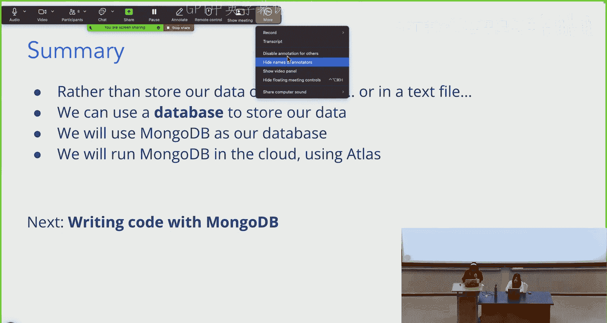

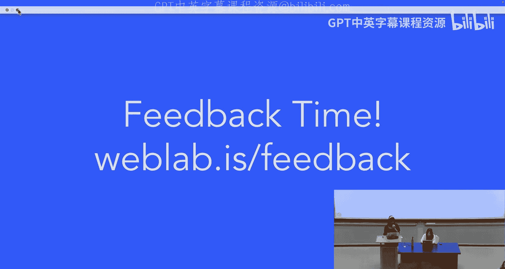

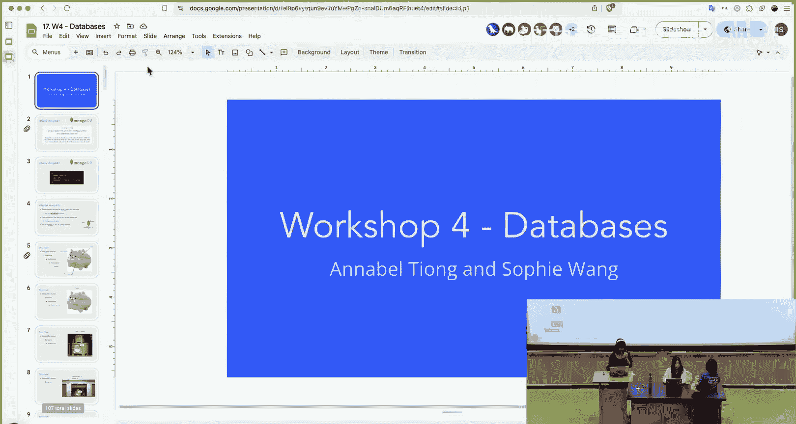

MongoDB的数据组织方式可以类比为一个仓库：
*   **文档**：相当于一个具体的物品（例如，一只柯基犬的信息）。它是一个JSON对象。
    ```json
    { “name“: “Sophie“, “age“: 3, “color“: “brown“ }
    ```
*   **集合**：相当于一个装有同类物品的板条箱（例如，一箱柯基犬）。它是文档的集合。
*   **数据库**：相当于一个仓库，里面存放着许多不同的板条箱（集合）。它通常对应一个完整的应用程序。
*   **MongoDB实例**：相当于一个数据中心，里面运行着一组数据库。

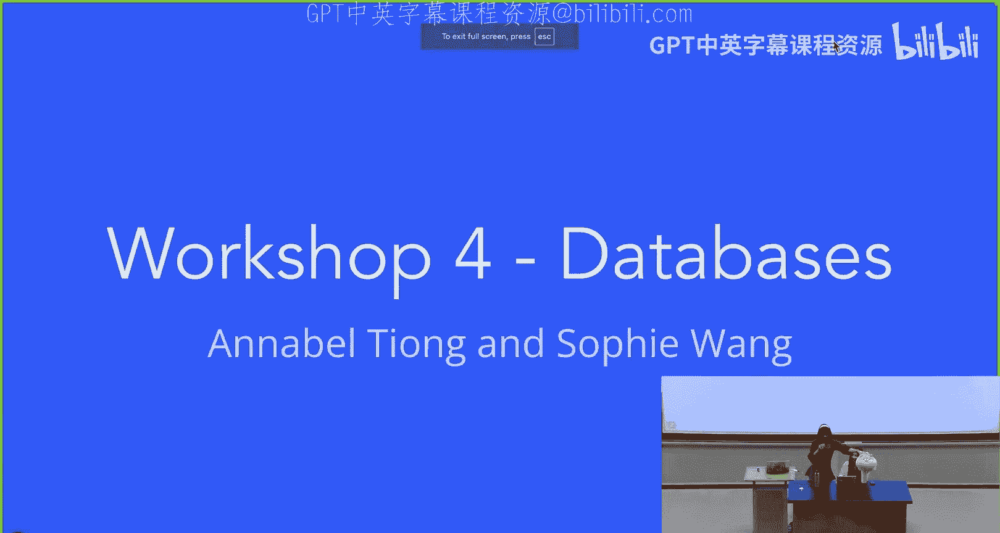

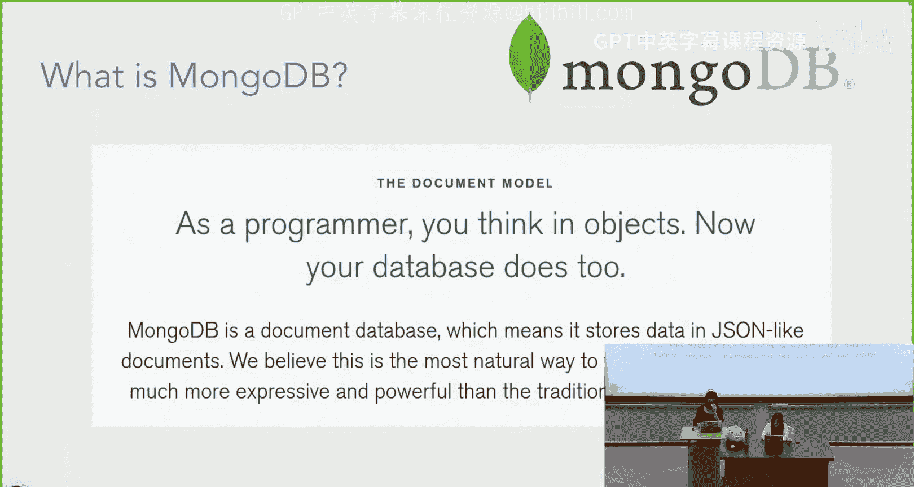

**层级关系总结：** MongoDB实例 > 数据库 > 集合 > 文档。


### 实现容错：MongoDB Atlas

即使使用数据库，如果硬盘损坏，数据仍然会丢失。如何使数据库存储具有容错性？

答案是**冗余**。MongoDB Atlas（MongoDB的云服务）通过在不同硬盘上复制数据来实现这一点。如果主硬盘发生故障，系统可以自动访问存有相同数据的副本硬盘。

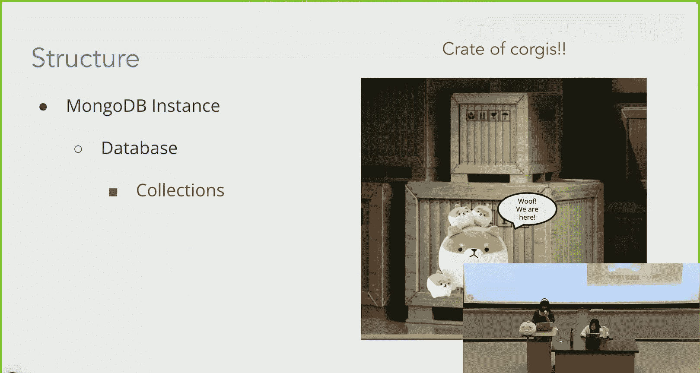

**这样做的好处：**
*   **高可靠性**：数据在云端被复制，远比个人电脑硬盘可靠。
*   **易于管理**：无需在本地运行和维护数据库。
*   **便于协作**：团队成员可以轻松共享和访问同一份云数据。

## 使用Mongoose规范结构

虽然MongoDB的灵活性是优势，但在实际开发中，我们通常希望一个集合内的文档具有一致的结构（相同的字段和类型）。为此，我们将使用 **Mongoose**。

Mongoose是一个用于MongoDB的对象数据建模（ODM）JavaScript库。

**Mongoose的作用：**
1.  **连接数据库**：提供代码连接MongoDB集群。
2.  **强制模式**：通过定义“模式”和“模型”，来规定集合中文档的结构。
3.  **提供操作方法**：提供创建、读取、更新、删除（CRUD）等函数，让我们能方便地与数据库交互。

通过Mongoose，我们可以确保所有“故事”文档都具有 `id`、`creator`、`content` 等字段，从而使数据处理更加可控和 predictable。

## 总结

本节课中我们一起学习了：
1.  **问题**：在服务器变量或本地文件中存储数据存在易失性、性能差和可靠性低等问题。
2.  **解决方案**：使用**数据库**进行持久化、高效的数据管理。
3.  **数据库类型**：重点了解了**文档数据库**（如MongoDB）相对于关系型数据库的灵活性优势。
4.  **MongoDB结构**：理解了文档、集合、数据库和实例的层级概念。
5.  **容错与云服务**：通过**MongoDB Atlas**实现数据冗余和云端存储，提升可靠性。
6.  **模式规范**：引入**Mongoose**库来为MongoDB文档定义和强制执行一致的数据结构。

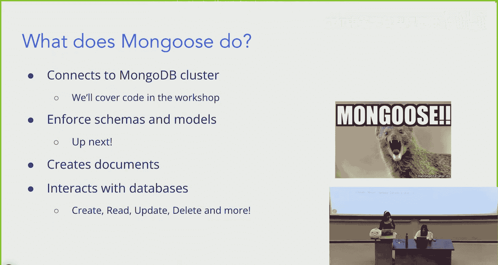

通过引入数据库，我们为Web应用构建了坚实、可靠且高效的数据存储基础。在接下来的实践中，你将学习如何具体连接和操作MongoDB数据库。