# 023：第5天 - Promise与async/await 🚀

在本节课中，我们将要学习JavaScript中处理异步操作的两个核心概念：Promise（承诺）和async/await（异步/等待）。我们将通过一个简单的比喻来理解它们的工作原理，并学习如何在代码中有效地使用它们，以提高程序的效率和响应速度。

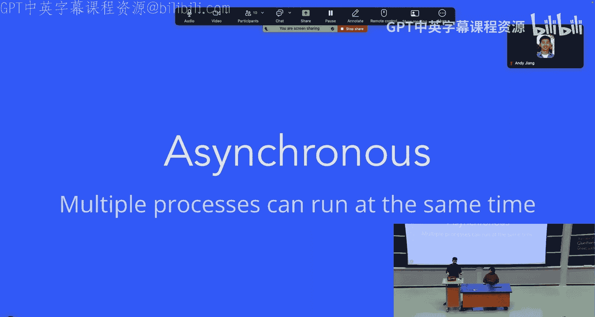

## 同步与异步：基本概念 🔄

在深入Promise之前，我们需要理解两个基础术语：同步（Synchronous）和异步（Asynchronous）。

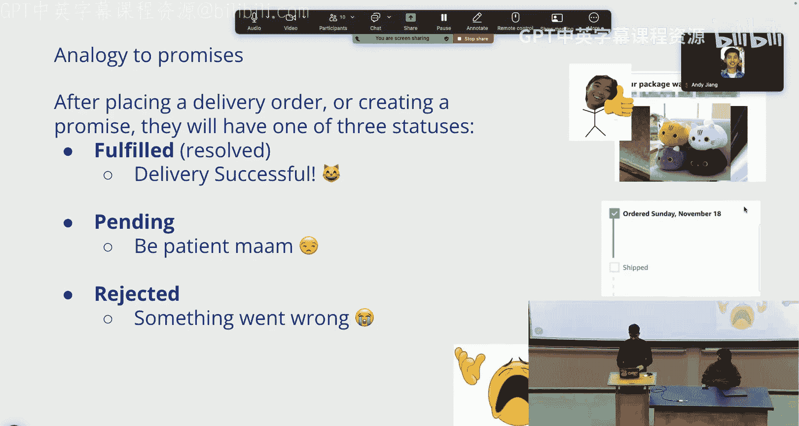

上一节我们介绍了课程概述，本节中我们来看看同步与异步的核心区别。

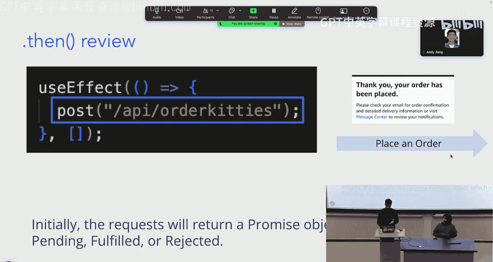

*   **同步**：指一个按顺序发生的过程，即一件事必须在前一件事完成后才能开始。这就像大学选课，你必须先修完6.100A（前提课程），才能选修6.101。
*   **异步**：指多个过程可以同时运行。这就像你可以同时选修6.100A和6.101（如果它们没有冲突的前提要求）。

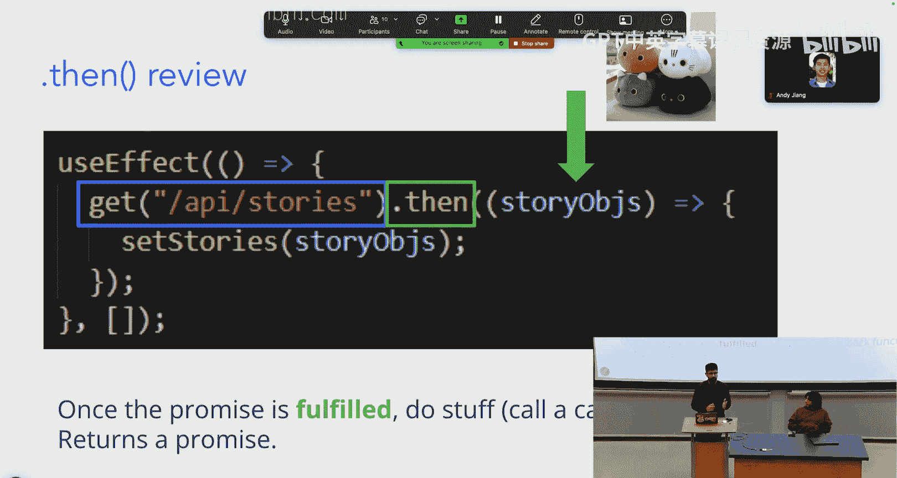

## Promise：一个生动的比喻 📦

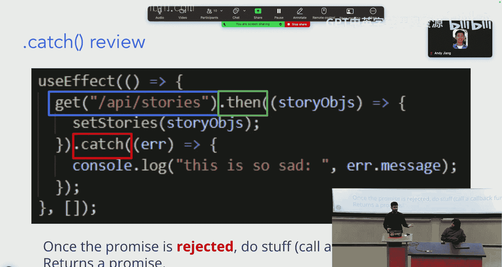

为了理解Promise，我们引入一个比喻：假设有一位爱猫人士Abby，她想从网上购买猫咪。

以下是Abby下单后可能发生的三种情况：
1.  **履行/解决（Fulfilled/Resolved）**：订单一切顺利，包裹成功送达。Abby很开心。
2.  **待定（Pending）**：订单正在处理中，包裹被延迟了。Abby在焦急等待。
3.  **拒绝（Rejected）**：订单出了问题，包裹丢失了。Abby很伤心。

这个比喻完美地对应了Promise的三种状态。创建一个Promise就像下一个订单，之后它可能进入“履行”、“待定”或“拒绝”状态。

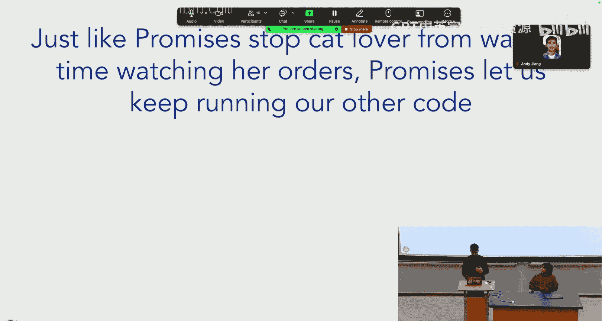

## 使用 `.then` 和 `.catch` 处理Promise

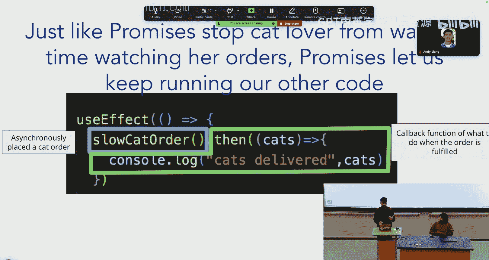

现在，我们将比喻转化为代码。`.then` 方法用于处理成功的Promise，而 `.catch` 方法用于处理失败的Promise。

以下是一个使用 `.then` 和 `.catch` 处理异步请求的代码示例：
```javascript
// 模拟一个下单（发起请求）的Promise
placeOrderForCats()
  .then((deliveredCats) => {
    // 如果Promise履行（包裹送达），执行此函数
    hugCats(deliveredCats); // 例如：拥抱送达的猫咪
  })
  .catch((error) => {
    // 如果Promise被拒绝（包裹丢失），执行此函数
    console.log("Oh no, something went wrong:", error);
  });
```
在上面的代码中，`deliveredCats` 参数代表从成功Promise中获取的数据（比如猫咪），而 `error` 参数则包含了失败的原因。

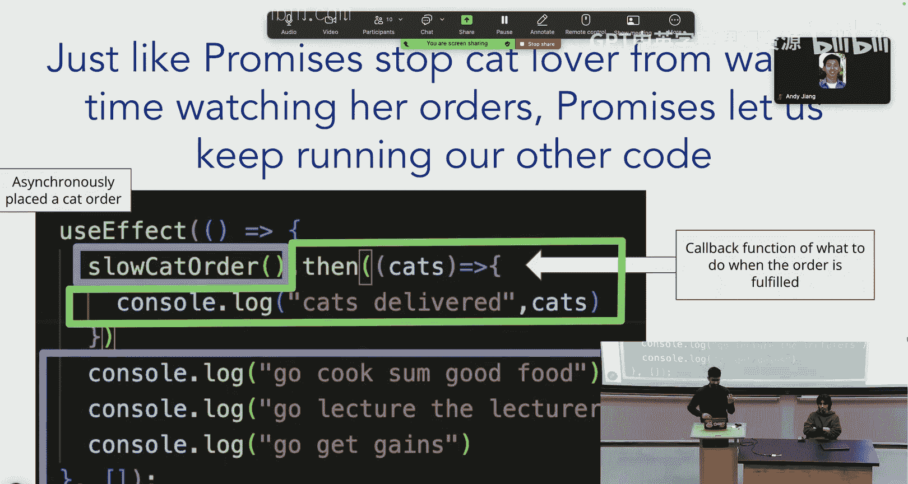

## 同步 vs 异步：效率对比 ⏱️

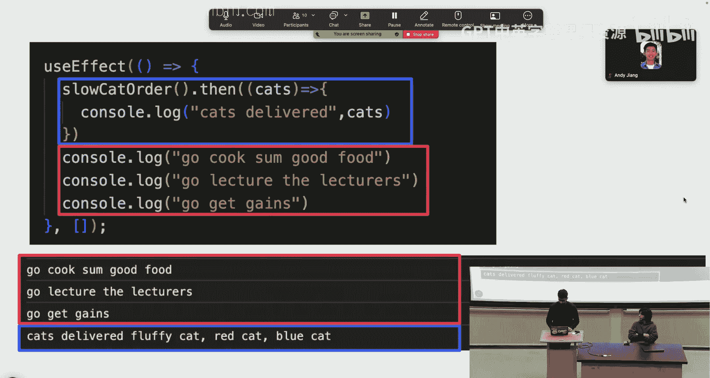

让我们从效率角度比较同步和异步。

在**同步**过程中，Abby下单后必须干等着，直到包裹送达，期间不能做饭、讲课或健身。这非常浪费时间。

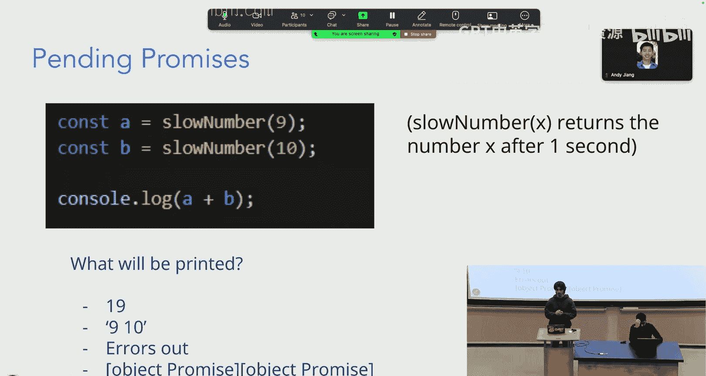

在**异步**过程中，Abby下单后，包裹会在后台派送。与此同时，她可以自由地去做饭、讲课或健身。这大大提高了效率。

Promise的作用正是如此：它允许我们在等待一个耗时操作（如网络请求）完成的同时，继续执行其他代码，从而避免程序“阻塞”。

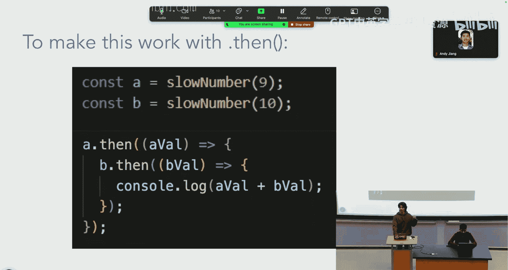

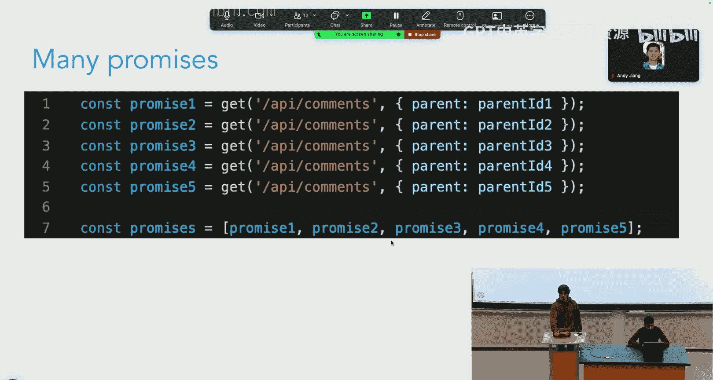

## 异步代码的执行顺序

在代码中，异步操作不会阻塞后续代码的执行。即使一个异步函数写在前面，它后面的代码也可能先执行完毕。

考虑以下代码：
```javascript
useEffect(() => {
  // 一个耗时的异步函数（蓝色区域）
  slowCatOrder().then((cats) => {
    console.log("Cats delivered:", cats);
  });

  // 后续的同步代码（红色区域）
  console.log("Cooking some food");
  console.log("Lecturing lectures");
  console.log("Getting gains");
}, []);
```
运行结果很可能是先打印出“Cooking some food”等三条日志，然后才打印“Cats delivered”。这证明了 `slowCatOrder()` 在后台运行，而其他代码继续执行。

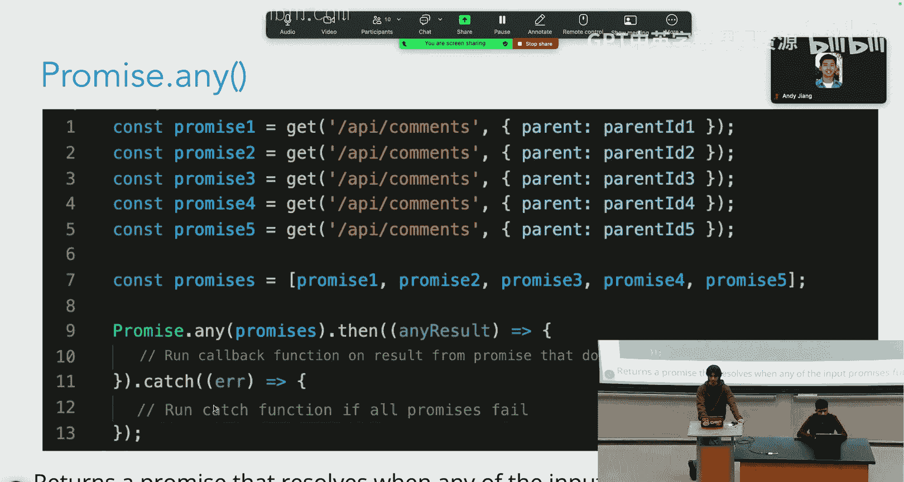

## 处理多个Promise

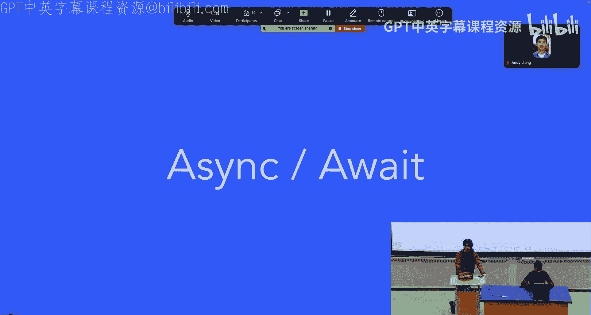

当我们需要处理多个Promise时，有几种有用的方法。

假设我们有两个返回数字的异步函数 `slowNumber(9)` 和 `slowNumber(10)`，每个都需要1秒。直接 `console.log(a + b)` 会输出 `[object Promise][object Promise]`，因为 `a` 和 `b` 是Promise对象本身，而不是它们内部的值。

为了得到数字之和，我们必须等待Promise解决：
```javascript
slowNumber(9).then((aVal) => {
  slowNumber(10).then((bVal) => {
    console.log(aVal + bVal); // 输出 19
  });
});
```
但嵌套的 `.then` 会形成“回调地狱”，代码难以阅读。为此，JavaScript提供了 `Promise.all`、`Promise.race` 和 `Promise.any` 等静态方法来更好地处理多个Promise。

以下是这些方法的简要说明：
*   **`Promise.all([promise1, promise2, ...])`**：等待**所有**传入的Promise都解决，或者其中任何一个被拒绝。
*   **`Promise.race([promise1, promise2, ...])`**：等待**第一个**解决或拒绝的Promise，并采用其结果。
*   **`Promise.any([promise1, promise2, ...])`**：等待**第一个**解决的Promise。只有当所有Promise都被拒绝时，它才返回拒绝。

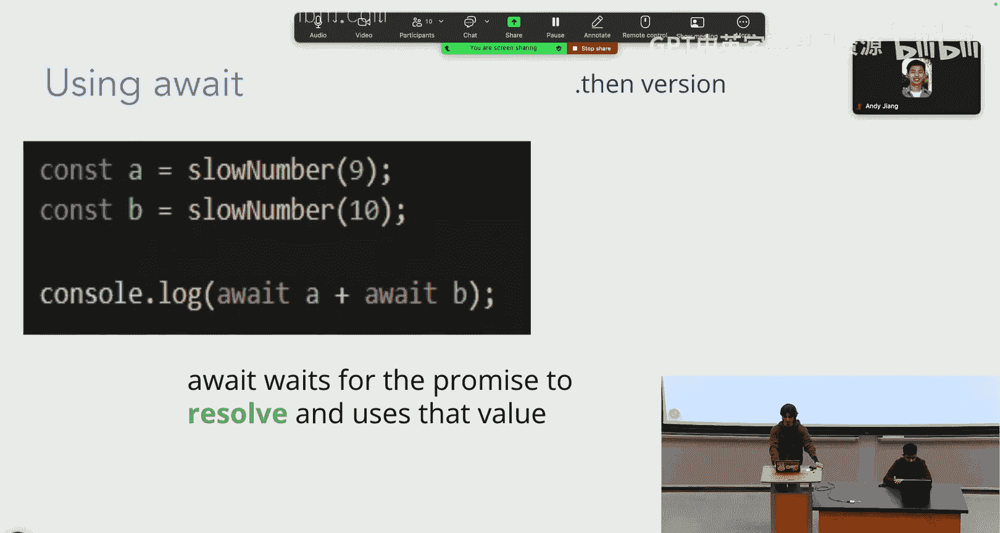

## 使用 async/await 简化代码 ✨

`async` 和 `await` 关键字提供了一种更简洁、更同步化的方式来编写异步代码。

`await` 会暂停其所在函数的执行，直到后面的Promise解决，并返回结果。但 `await` 只能在被 `async` 关键字标记的函数内部使用。

定义一个异步函数很简单：
```javascript
async function myAsyncFunction() {
  // 可以在这里使用 await
}
```
让我们比较一下使用 `.then` 和 `async/await` 的代码。假设我们已经有了两个Promise：`promiseA` 和 `promiseB`。

使用 **`async/await`** 的代码清晰直观：
```javascript
async function getSum() {
  const a = await promiseA;
  const b = await promiseB;
  console.log(a + b);
}
```
使用 **`.then`** 的代码则有多层嵌套：
```javascript
promiseA.then((a) => {
  promiseB.then((b) => {
    console.log(a + b);
  });
});
```
显然，`async/await` 的写法更接近同步代码的思维模式，易于理解和维护。

## 在React的 `useEffect` 中使用 async/await

在React中，`useEffect` 的回调函数不能直接是 `async` 函数。我们需要在内部定义一个 `async` 函数并调用它。

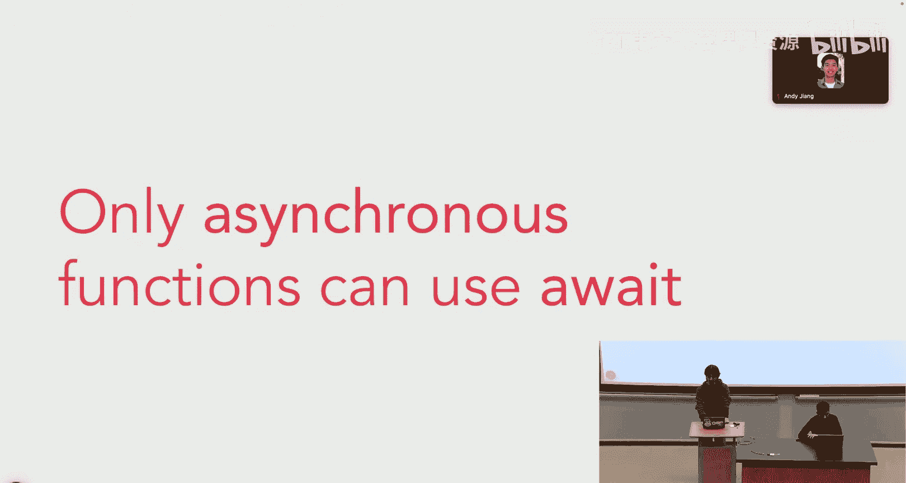

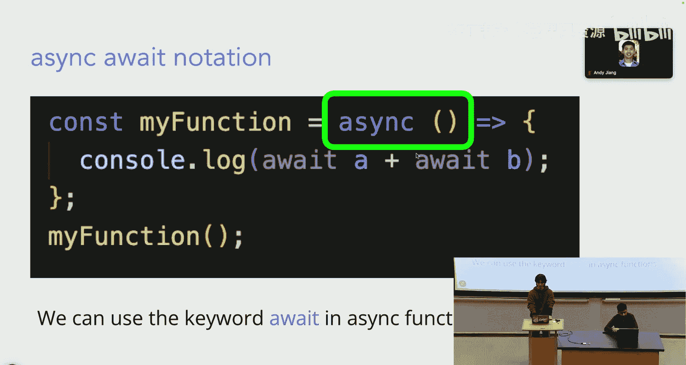

以下是正确的做法：
```javascript
useEffect(() => {
  // 在 useEffect 内部定义一个 async 函数
  const fetchData = async () => {
    const data = await fetch('/api/stories');
    // ... 处理 data
  };

  // 调用这个 async 函数
  fetchData();
}, []);
```

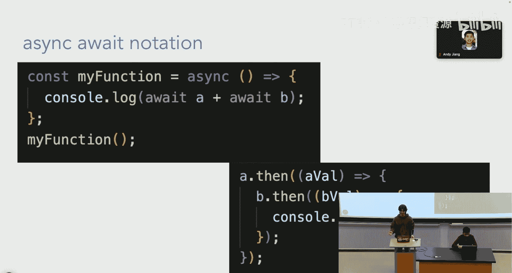

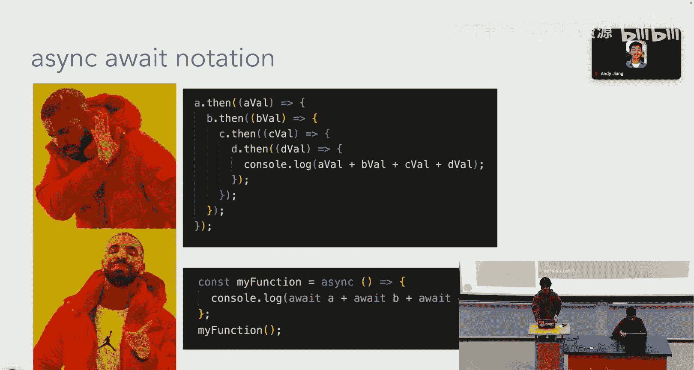

## 何时使用异步函数？

我们主要在以下场景使用异步函数（Promise）：
*   **网络请求**：如从API获取数据（`fetch`）。
*   **文件操作**：如上传或下载大文件。
*   **定时任务**：如 `setTimeout`。

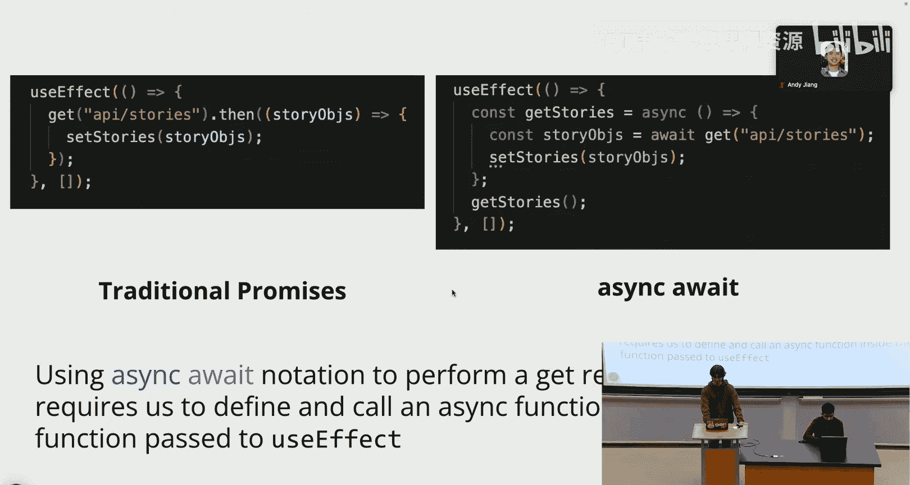

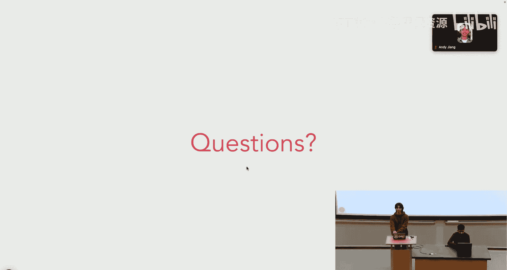

异步编程对于保持Web应用的**交互性**至关重要。例如，在YouTube页面加载时，视频、评论等数据在后台异步获取，用户无需等待所有内容加载完毕就可以滚动页面或进行其他操作。如果全部采用同步方式，用户就必须等待所有数据加载完成后才能与页面交互，体验会非常糟糕。

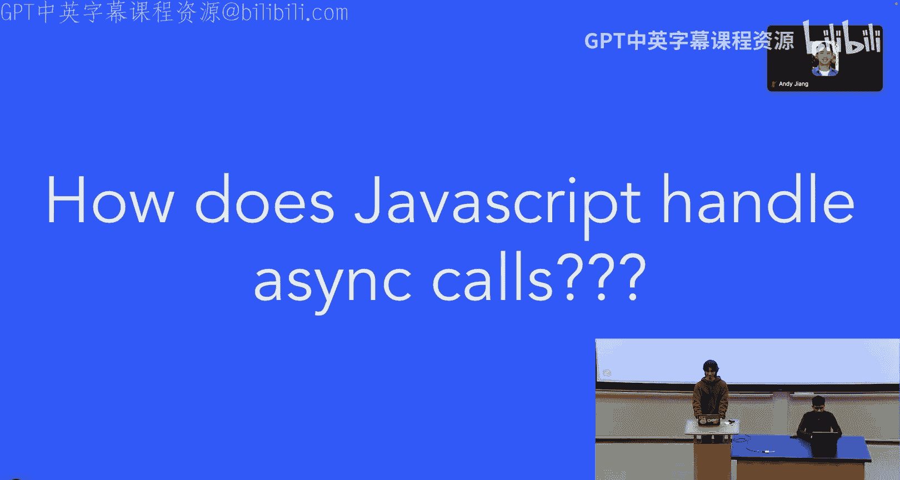

## 总结 📝

本节课中我们一起学习了JavaScript异步编程的核心。
1.  我们理解了**同步**（顺序执行）和**异步**（并发执行）的根本区别。
2.  我们通过“网购猫咪”的比喻，掌握了**Promise**的三种状态：待定（Pending）、履行（Fulfilled）和拒绝（Rejected）。
3.  我们学会了使用 **`.then()`** 处理成功Promise，使用 **`.catch()`** 处理失败Promise。
4.  我们探讨了 `Promise.all`、`Promise.race` 和 `Promise.any` 来处理多个Promise。
5.  我们重点学习了 **`async/await`** 语法，它用更清晰、更类似同步代码的方式编写异步逻辑，避免了“回调地狱”。
6.  我们了解了在React的 `useEffect` 钩子中正确使用 `async/await` 的方法。
7.  最后，我们明确了异步编程对于构建高效、响应式用户体验的重要性。

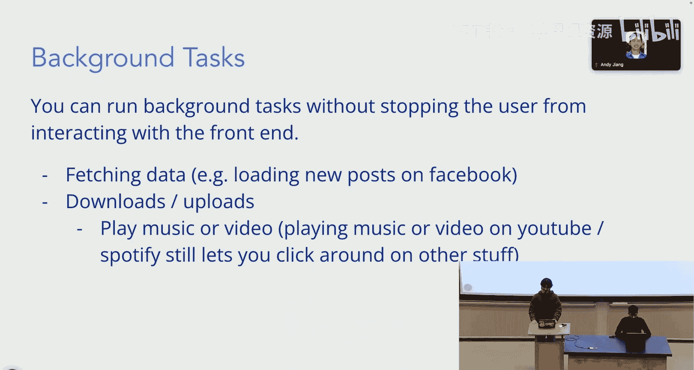

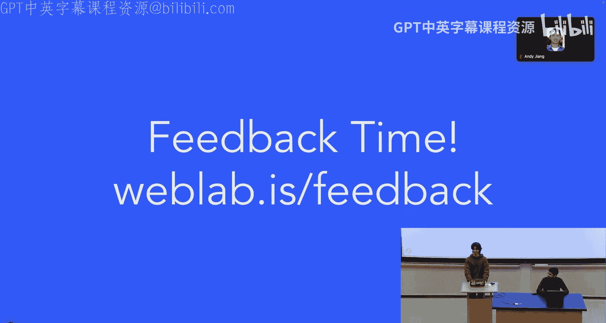

掌握Promise和async/await是现代JavaScript开发的必备技能，它们能帮助你写出更干净、更强大、更易于维护的代码。