# 025：高级React（Context与Router）🚀


在本节课中，我们将学习React中两个强大的功能：**Context API** 和 **React Router**。我们将了解如何使用Context来简化组件间的状态传递，以及如何利用Router构建具有多个页面的单页应用。


---

## 状态管理回顾

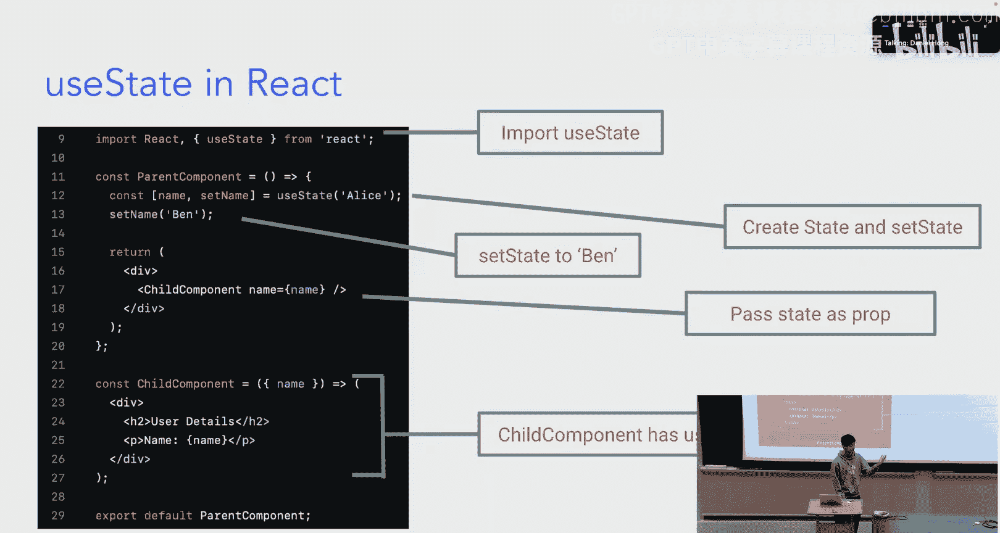

上一节我们介绍了React的基础状态管理。本节中我们来看看当状态需要在组件树中深层传递时可能遇到的问题。

React中管理状态的主要工具是 `useState` Hook。其基本用法如下：

```javascript
import { useState } from 'react';

function ParentComponent() {
  const [name, setName] = useState('初始值');
  // ... 其他逻辑
}
```

如果我们需要在子组件中使用这个状态，通常的做法是将其作为属性（prop）传递下去：

```javascript
<ChildComponent name={name} />
```

然而，当组件树变得很深时，这种“逐层传递”的方式会变得繁琐且难以维护。

---

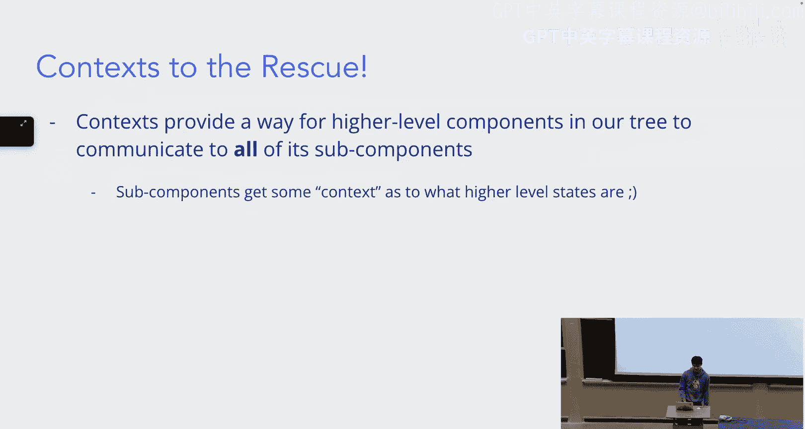


## 引入Context API 🧩

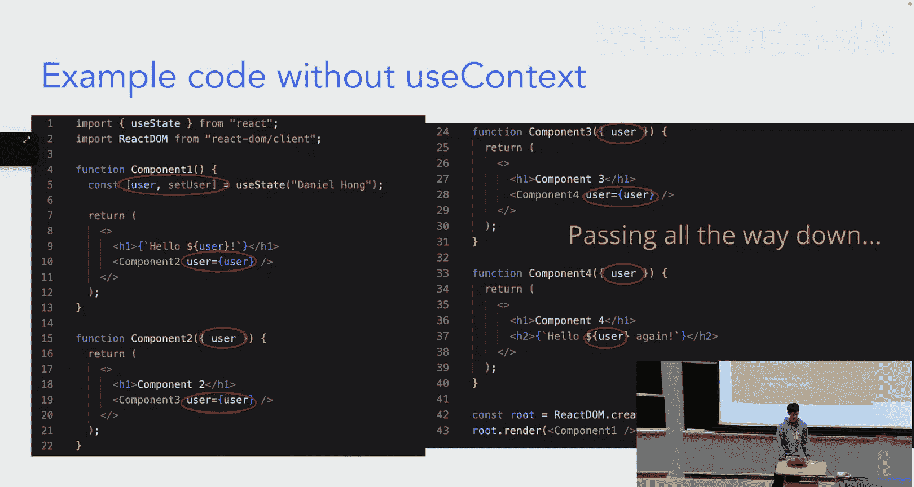

为了解决上述问题，React提供了Context API。它允许父组件向其下**所有**子组件“广播”数据，而无需显式地通过每一层传递props。

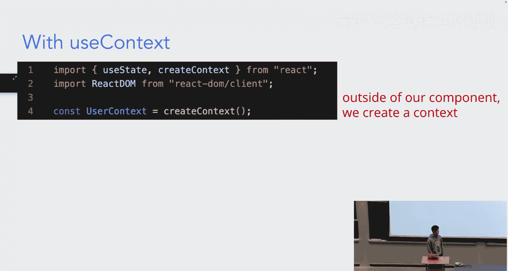

你可以将Context想象成一个共享的“信息簿”，任何在“图书馆”（Provider）内的组件都可以查阅它。

以下是使用Context的基本步骤：

1.  **创建Context**：使用 `createContext` 函数创建一个Context对象。
2.  **提供Context**：在父组件中使用Context的 `Provider` 组件包裹其子组件，并通过 `value` 属性提供数据。
3.  **消费Context**：在任何子组件中使用 `useContext` Hook来获取Context中的数据。

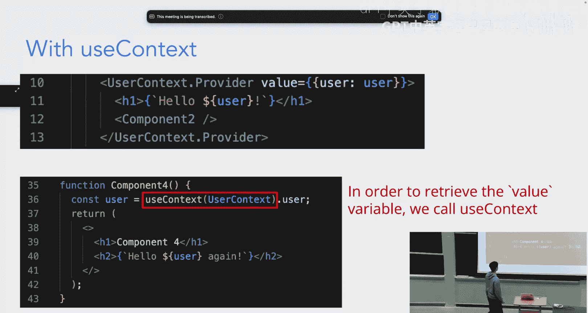

### 代码示例对比

**不使用Context（Prop Drilling）:**

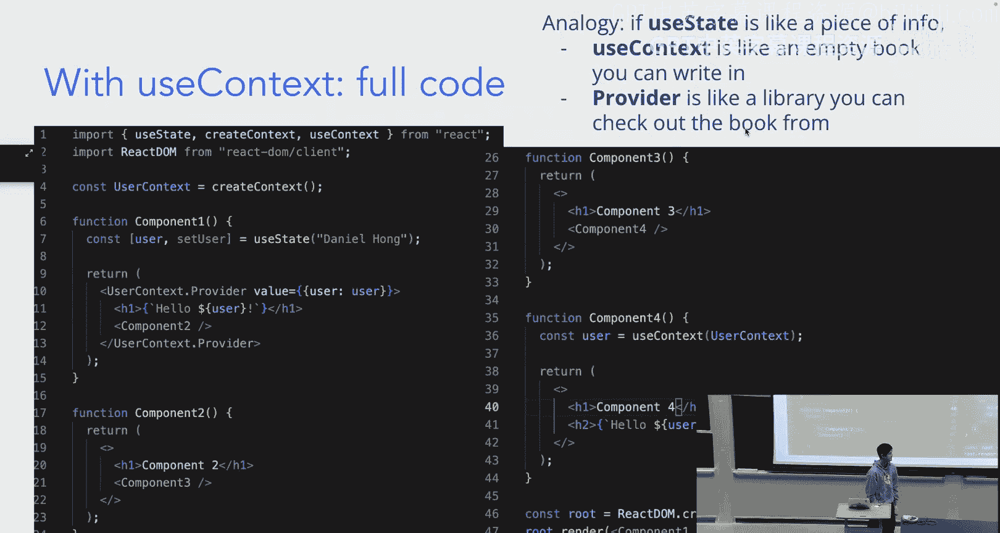

```javascript
// Component1.jsx
function Component1() {
  const [user, setUser] = useState('Daniel');
  return <Component2 user={user} />;
}
// Component2.jsx -> Component3.jsx -> Component4.jsx 需要逐层传递 `user` prop
```


**使用Context:**

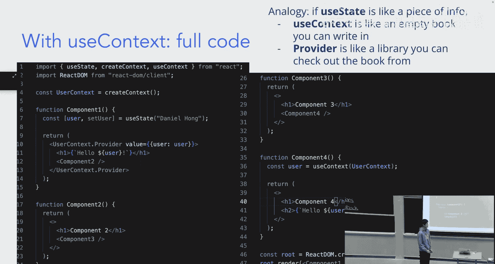


```javascript
// 1. 创建Context (例如在 userContext.js 文件中)
import { createContext } from 'react';
export const UserContext = createContext();

// 2. 在顶层组件提供Context
import { UserContext } from './userContext';
function Component1() {
  const [user, setUser] = useState('Daniel');
  return (
    <UserContext.Provider value={{ user, setUser }}>
      <Component2 /> {/* 不再需要传递user prop */}
    </UserContext.Provider>
  );
}

// 3. 在深层子组件消费Context
import { useContext } from 'react';
import { UserContext } from './userContext';
function Component4() {
  const { user } = useContext(UserContext); // 直接获取user
  return <div>Hello, {user}!</div>;
}
```

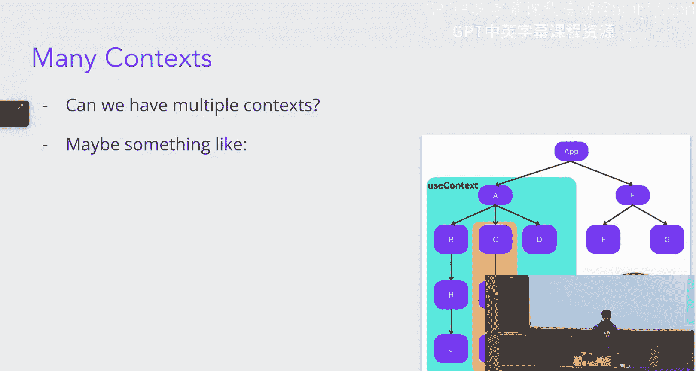


通过使用Context，`Component2`、`Component3` 等中间组件无需关心 `user` 状态，代码变得更加清晰。

---

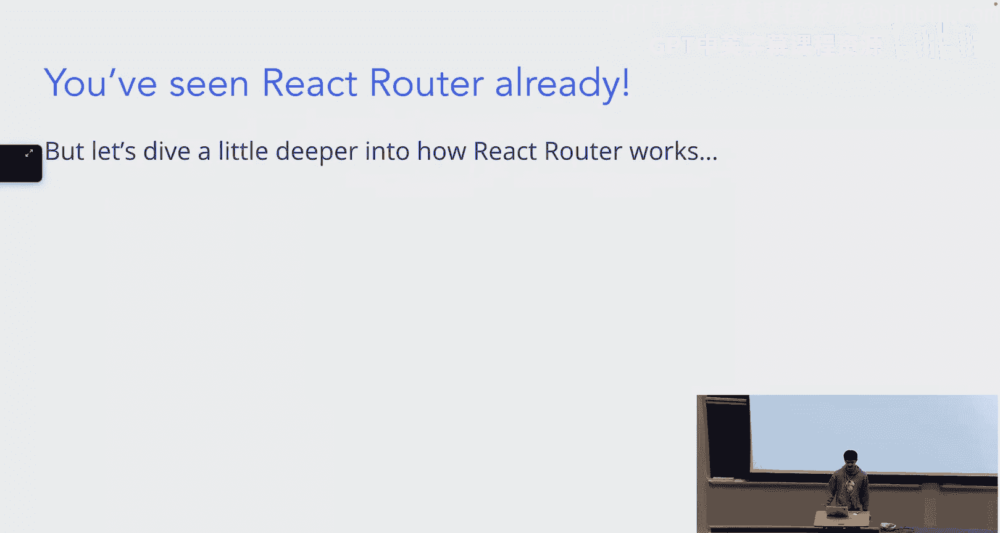

## 深入React Router 🌳

上一节我们介绍了Context来管理状态，本节中我们来看看如何使用React Router来管理应用的不同视图（页面）。

React Router是一个库，它帮助我们在单页应用（SPA）中模拟多页面的体验，根据URL的变化渲染不同的组件。

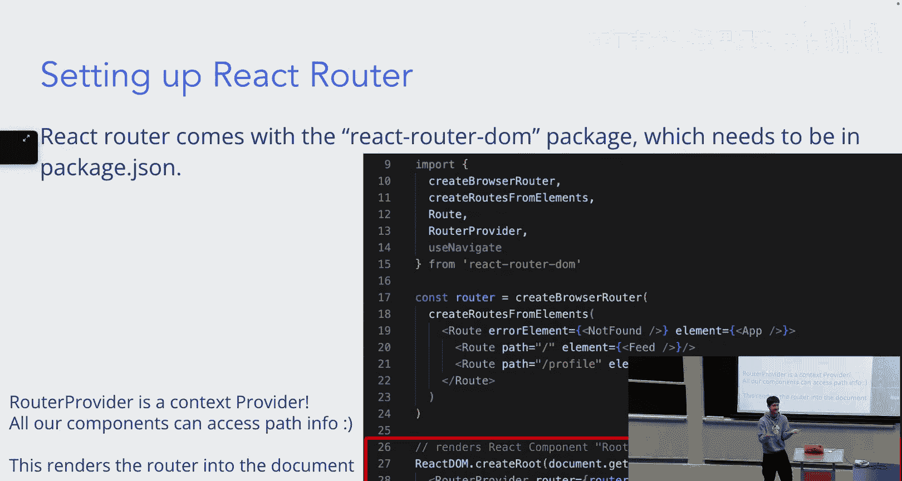

### 路由基础结构

一个典型的React Router设置包含以下部分：

```javascript
import { createBrowserRouter, RouterProvider } from 'react-router-dom';

// 定义路由配置
const router = createBrowserRouter([
  {
    path: "/",
    element: <App />, // 根布局组件
    children: [ // 子路由
      { path: "feed", element: <Feed /> },
      { path: "profile", element: <Profile /> },
    ],
    errorElement: <NotFound />, // 404页面
  },
]);

// 渲染路由
ReactDOM.createRoot(document.getElementById('root')).render(
  <React.StrictMode>
    <RouterProvider router={router} />
  </React.StrictMode>
);
```

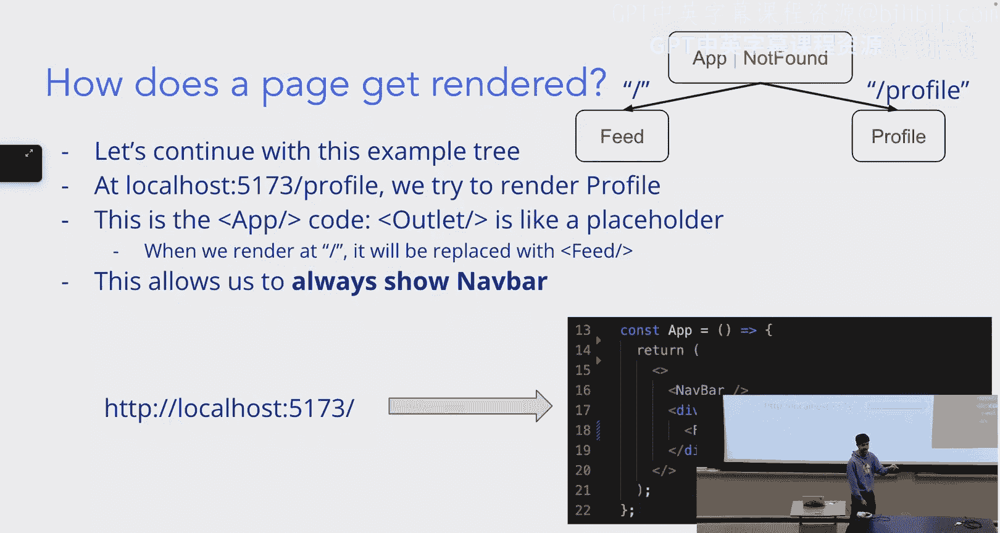

`RouterProvider` 本身就是一个Context Provider，它向整个应用提供路由信息。

### 路由嵌套与Outlet

`<Outlet />` 是一个占位符组件，用于在父路由组件中渲染其子路由。

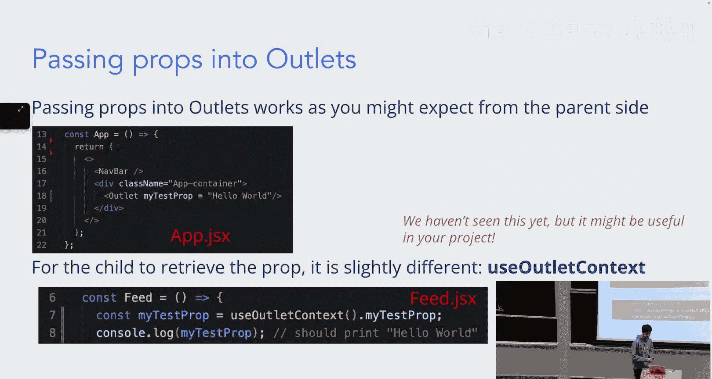


例如，在 `App` 组件中：

```javascript
function App() {
  return (
    <div>
      <NavBar /> {/* 导航栏，在所有子页面都会显示 */}
      <Outlet /> {/* 此处会根据URL渲染 Feed 或 Profile */}
    </div>
  );
}
```
- 访问 `/feed` 时，`<Outlet />` 渲染 `<Feed />`。
- 访问 `/profile` 时，`<Outlet />` 渲染 `<Profile />`。
这样，`<NavBar />` 就成为了一个共享的布局。

### 向子路由传递数据

如果父路由需要向所有子路由传递数据，可以使用 `useOutletContext`。

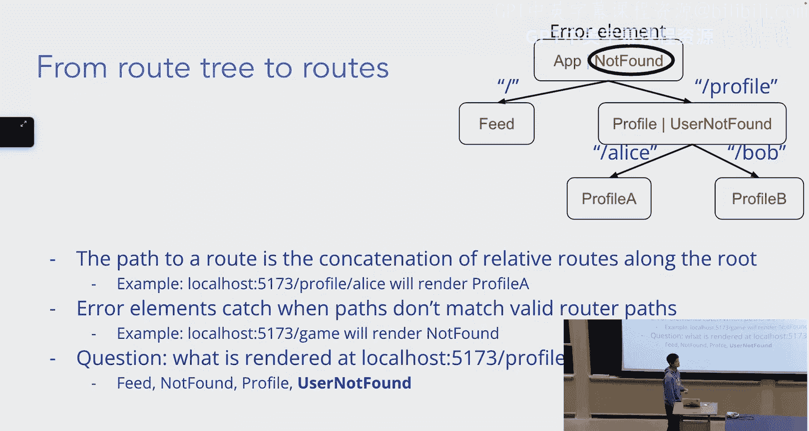

**在父路由（App）中提供上下文：**
```javascript
<Outlet context={{ myTestProp: “来自App的数据” }} />
```

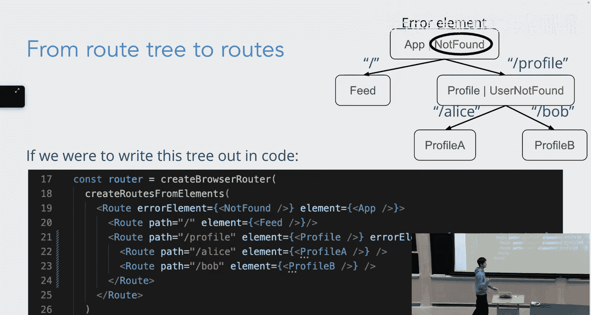

**在子路由组件（如Feed）中获取：**
```javascript
import { useOutletContext } from 'react-router-dom';
function Feed() {
  const { myTestProp } = useOutletContext();
  console.log(myTestProp); // 输出：“来自App的数据”
}
```

### 动态路由与参数

我们经常需要根据URL中的一部分（如用户ID）来渲染内容。React Router支持动态路由参数。

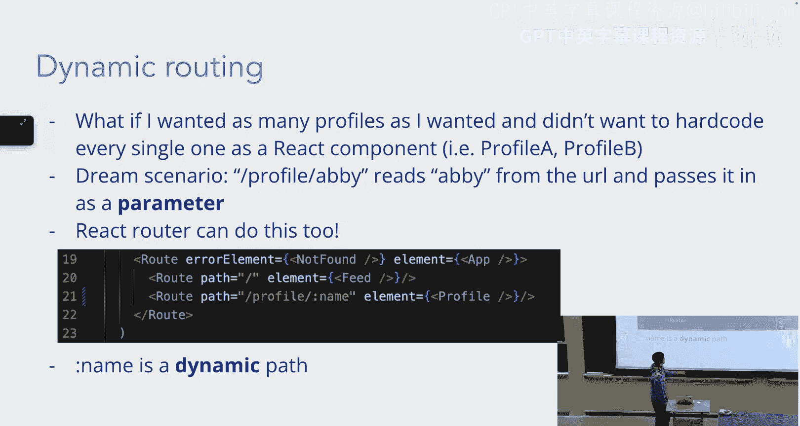

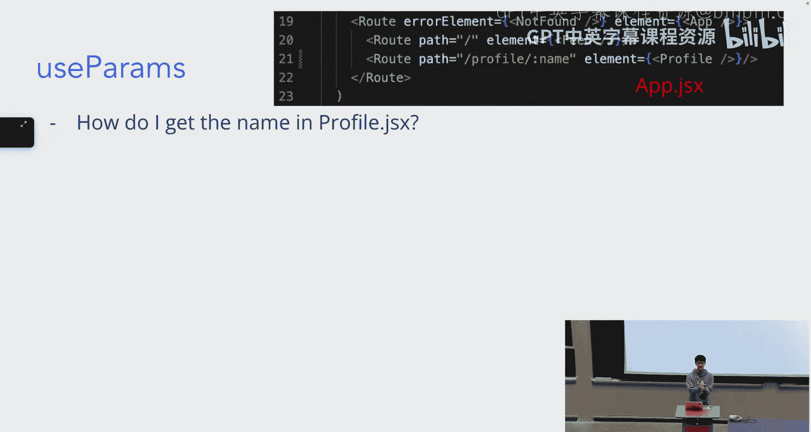

**定义动态路由：**
在路径中使用冒号 (`:`) 前缀来定义参数。
```javascript
{
  path: "profile/:username", // :username 是动态参数
  element: <ProfilePage />,
}
```

**在组件中获取参数：**
使用 `useParams` Hook。
```javascript
import { useParams } from 'react-router-dom';
function ProfilePage() {
  const { username } = useParams(); // 获取URL中的 `username` 值
  return <h1>{username}的个人主页</h1>;
}
```
访问 `/profile/alice`，页面将显示 “alice的个人主页”。

---

## 总结与资源 📚

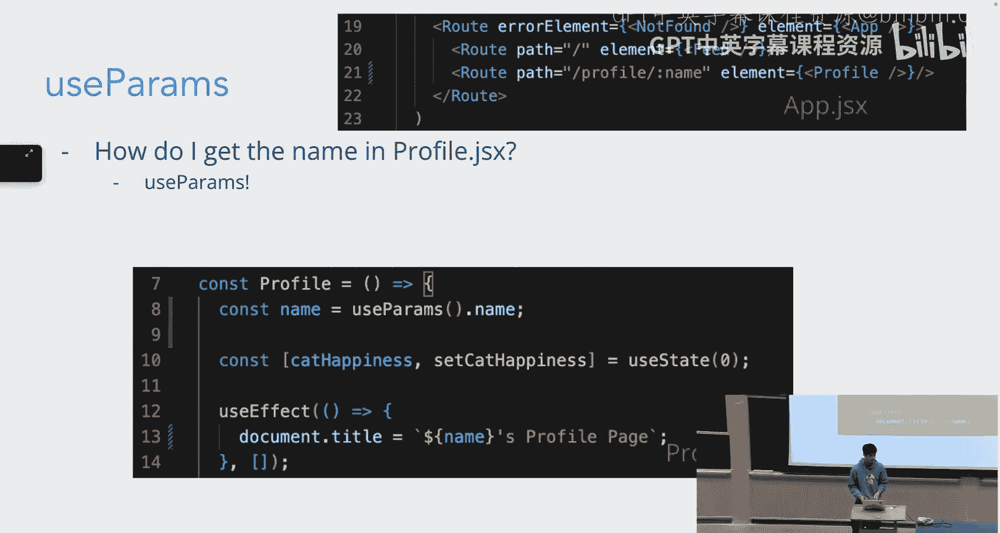

本节课中我们一起学习了：
1.  **React Context**：用于跨组件树共享状态的机制，避免了“Prop Drilling”，通过 `createContext`, `Provider` 和 `useContext` 来使用。
2.  **React Router**：用于构建单页应用路由的库。我们学习了如何设置路由 (`createBrowserRouter`)、使用嵌套路由和 `<Outlet />`、以及如何通过动态路由参数 (`useParams`) 和上下文 (`useOutletContext`) 传递数据。

这些工具能极大地提升前端项目的开发效率和代码可维护性。要深入了解，请查阅官方文档：
- [React Context 官方文档](https://reactjs.org/docs/context.html)
- [React Router 官方文档](https://reactrouter.com/)

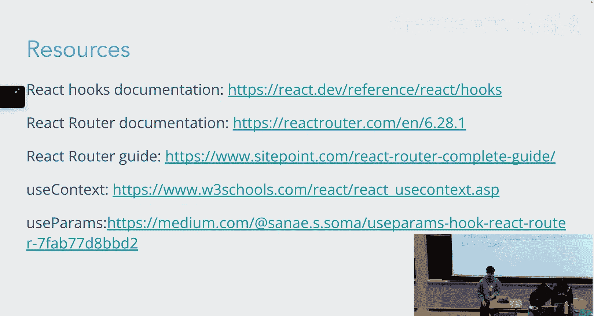

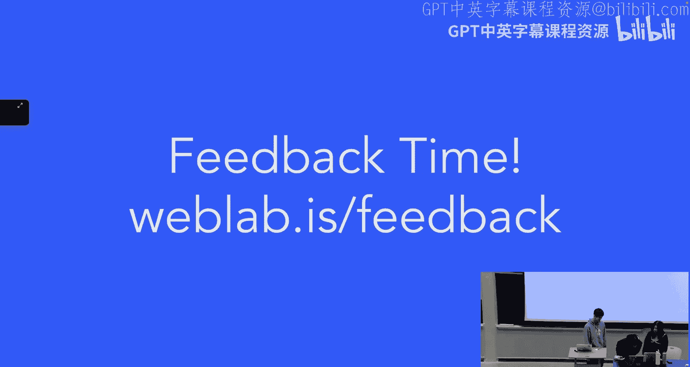

当你构建项目时，善用官方文档和社区资源（如Stack Overflow）是解决问题的关键。