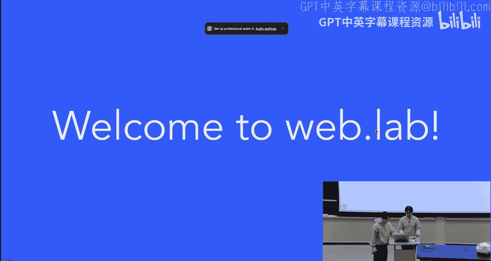
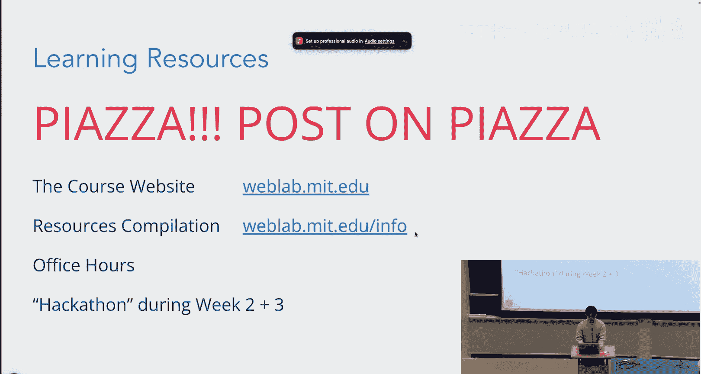
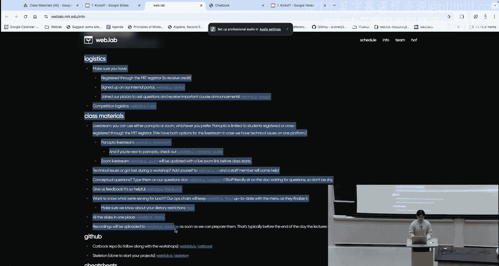
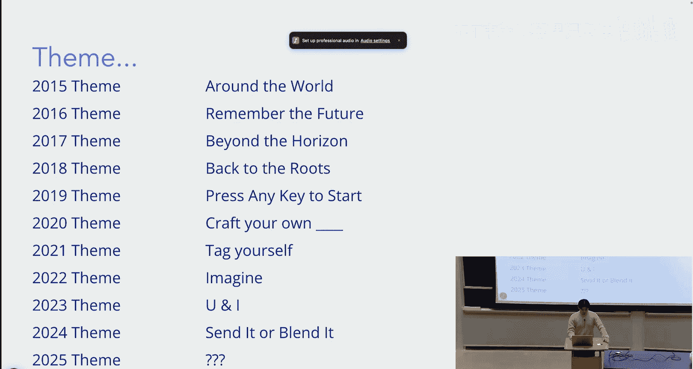

# 《Web开发快速入门｜6.962 Web Development Crash Course IAP 2025》中英字幕 p02 -02-MIT web.lab (6.962) - Day 1_ Kickoff.zh_en -BV12Ux5zTE9p_p2-

Hello。Hi， okay， welcome to Weblab 2025。 My name is Stanley， I'm one of the co presidents。

My name's Andy， I'm also a co president。Just some few things to go over really quickly while we go over like sort of our introbuel make sure you have done this setup because we have workshops today so you'll be following along and you won't be able to do that if you haven't gotten your stuff set up。

 So if you haven't go to weblab do is slash homework zero and just make sure you finish this setup if you already have it done then good job。

Okay， let's talk about what Weblab is So Weblab is essentially a web development class。

 we teach front end to backend full stack web development。 we have free lunch every day of lecture。

 We also run a competition for the second half of the class throughout IP and there's a lot of cash prizes for you to win。

And if you register on Webis， we are graded PDF， and we give you guys six units of unrestricted elective credit。

So this is this year's course staff。 They're sitting over there。

 They'll be the ones helping you throughout this class。 and yeah。So some more reminders。

 make sure you're registered on the portal， the portal is also where we send email communications and it's also where you guys are going to be submitting your milestones so make sure you have that done。

Also join the piazza， we're going to be posting a bunch of important info on Piazza and also it's a great place to ask questions so make sure you have that done as well。

The lectures will also be live streamed and recorded to YouTube and you can join the live stream at webla。

 is/lash live stream The lectures are not mandatory and we don't take attendance。

 This is just purely what you put into the class is what you get out of the class。 and yeah。

 you can also join the zoom directly if you just want to watch。The lecture being streamed。

We'll go over some logistics now。 So the competition is not mandatory。 It's a second half。

 and it's completely optional， but we'd highly encourage you to submit your website anyways。

'cause who knows maybe you'll win some cash。We'll also have live help during the workshops and the lectures。

And you can go to webla。/q， and then you can just create a ticket and we'll be walking around。

 helping you answer questions and stuff like that。You can also go to the questions doc at webbllabel/questions and here you could just ask questions anonymously。

There's also an old doc with questions that were asked in previous years。

 so you can also check there to see if your question has been asked before。

And then we also have webla。 slash info so you can go here to find a bunch of， you know。

 useful short linkss， resources， stuff like that。And we'll also have a team finding mixer at the end of lectures today。

 So if you don't have a team yet， don't worry， you can stay after a class and find some people。

So here's a little course overview， this is our know general schedule。

 so week one we're going to be sort of laying the groundworks。

 learning the basics and building an app from scratch together。Week  two。

 we're going to start getting a little more complicated。 we're going to add some cool features。

 going to some advanced topics and also get some sponsor lectures。

And then week three is where we're done with class and now we're entering the competition phase。

 so now you're going be working， you can either submit your website to the competition or just simply for the milestone for credit。

And then week four， you finalize your projects， you make your final submissions。

 we you're going to judge them， and then we go to the award ceremony。

And you can check the schedule on the website if you need any specifics。So we take you end to end。

 and what that means is we take you from front end to back end。 the world of websites is really big。

 There's a lot that goes on with something like Facebook。Club Penguin， Cha UBT。

So how does it all work？Yeah， so this is just a bit of like an intro so that you'll be seeing this week and sort of next week。

Anytime we access the website， were。Going to Chrome， and then entering a URL。But what really happens。

 you know， So you are the client。 Think of yourself as a computer。

And think of the server as just another computer， let's say。

 like Facebook's computer where you once to send a request to。

 to get like the website that you're that you put into your URL into like the into Chrome。

 So essentially， you're sending a get request to Facebook。To get the website that you want。

And this computer responds。嗯。Because it stores and serves a website that you're actually requesting。

So it responds with the Webp page files， which。Are then taken by the browser that you're using。

 probably Chrome， which is then used to view the website。

 So that's how we see everything on the Internet。 We have URLs。

 and then we request websites from servers。 We get back those webage files。

 and then we see whatever we see on the screen。SoThat's a pretty oversimplified view of the client server architecture。

And then these actual web page files that we're receiving are HTMLM files。

 which display content like the basic building blocks。C， S， S files， which style the HTML TM L。

Javascript， which lets these files， I guess， have like。A。And then assets like images， gs， etc cetera。

Yeah。So what exactly are we gonna be building in this first week and leading into next week。

I'll open up this website just for you guys to see it really quickly。Essentially。

 we're going to be building this entire website from the ground up。It's going to be called catbook。

 and you can also visit it by going to this link。But it's， it's gonna have like a home page。

 a profile， live chats， a game， and then other aspects as well， such as authentication。

So more about the course now， there's gonna be four milestone for everyone to complete if you're taking this class for credit。

Mile than  zero is going to be due this Wednesday。And this is gonna to be ideation。 Essentially。

 you're just gonna be creating a list of topics or project ideas on a Google form and then submitting that Google form。

 It's pretty simple。 and it should really only take like an hour or even less。嗯。But yeah。

 we'll be sending out information soon for that。Next is project pitches。

 It's going to be this weekend。You're gonna have to sign up for a time slot for some slot either Saturday or Sunday from 1 to 5 PM。

 It's gonna be around， I think，30 minutes or maybe less。But at this point。

 you would have like a project idea and you would be pitching your project to some of the staff members and we'll give feedback about it and hopefully give some helpful advice about like how to get started。

 what pitfalls you might fall into and how to like， I guess navigate the entire course。

Mson 2 is pretty long after it's going to be Wednesday， January 22， and this is your MVP。

 So some sort of working prototype for your project。We're not expecting the whole thing。

 but we want to see like a lot of functionality already figured out by then。

And then the final website， Mies in3， is due January 29。 That's around the end of IE P during week 4。

Any questions about these milestone。And as a reminder。

 passing the class just requires you to do all four of these milestones。

 So it's not too hard as long as you put in effort and it's clear that you have。

 then you'll be on your way to passing the class。So more about like the actual websites that you will be building。

So you'll be building some dynamic website supported by backend。

 So not just like a front end that you might be able to build through like some website builders。

 you're gonna be creating pretty much the whole thing yourselves。 So front end backend database。

 everything is going be built by you。We want the website to have personalized experience based on user accounts。

 So some sort of like authentication like you saw on the example website。

We want it to be different based on， like。Who's logged in。Minimum security requirements fulfilled。

 This isn't that big of a deal。 but yeah， we don't want your website to be like。

Of vulnerability or whatever。We want you to be creative and have your own original design for website and implementation。

 A lot of the code is going to be given to you from the skeleton code that we'll provide。

 but past that we'd like you to you know， implement as much as possible yourself。

 All of the code should be your own。And then if you do use any other outside code to just like。

 you know， cite it properly and I guess limit that use if possible。

And then everyone should have a Github repo by now。 or if you haven't already， that's okay。

 You should have received instructions from an email to set up the Github repo。

 And this should be shared between your teammates。 it's only private to you guys。

And we can also like， check out this repository so that we can help you on our end。

Some cannotnots for the website。You cannot create a website using preexisting like website builduls like word space。

 a Wordpress or Squarespace。You cannot use any part of a previous project just so that the playing field is level for everyone。

You cannot outsource your development。 You can't tell your friends who are really good at web development who are not taking a class to do the website for you。

 We hope that this class is more or is mostly just like。

An opportunity for you to learn by actually creating。嗯。Yeah。So for judging， there's four categories。

The first is functionality。 So just like whether or not your Web website works as intended。

These are like the technical components。 and we'll just be like playing around with your website to make sure that it's working fine。

Usability is more about like the user experience， making sure that the website is easy to use。

Aesthetics， self explanatory， and then concept execution。

We want your website to sort of have a purpose， you know， like the。

The main use of web development is really to just create products that are actually useful or achieve some goal。

 So we want your website to， you know， do something or solve some problem that you have come up with with like a good solution。

Okay， so how do you get help throughout this entire course？Number one tool is piazza。

 If you haven't already， please join Webblb dot is slash piazza。 Ask questions at any time。

 I think our average response time is like 5 minutes during the course。

We're constantly on it answering questions as fast as we can。

Go to the course website if you have more in questions about like the course logistics。

 if you want to visit the schedule， if you want to like read the rules about the competition more。

Visit the course website s infofo or weblab。/ info for resources。

It has all of like the link shorten links that you can。I'll actually， just open it。

At the bottom， you can find all of the things that we're pretty much going over in these slides。

As well as more information about the the contest here then FAQ。

And then please show up to office hours， too。 I think in person。

 feedback and help is a lot more useful than Piazza actually。 Yeah。

 so office hours are usually 7 to 9。 and you can find them on the schedule。So yeah。

 today we should have office hours from7 to 9 PM。 if you need help with homework 0 setting stuff up。

 please show up or if you have other questions from lecture， also please show up。

Office hours are going to be in 32，0，82， so in status center。And then finally。

 we have extended office hours called hackathons。 They basically run from 7 PM to 1 AM。

So our sponsors are going be there as well to sort of see how everyone's doing。 But yeah。

 these are during week  two and three， there's going to be two of them。 there'll be food provided。

 drinks， etctera。 It's pretty fun and very helpful。😊，呃，O， yeah。So what else is there to what， up。

Besides just like building the website from scratch， you'll， you'll learn a lot about U I design。

Learning version control， which is really helpful in all the MIT classes you take in the future。

 This is what I was referring to earlier Git。If you're not a Co 6，3 or some Co 6。

 this is sort of a taste of Co 6，3 at MIT。Hopefully you enjoy it and take more CS classes in the future。

And then if this is your first time learning web development。

 hopefully this is a great first experience for you to create something。

 create your own thing from the ground up。😊，And much more。So most importantly。

Weblab is not a classic IC class。 It is rendering IEP， and we are on the P DF scale。

 So you're only graded pass fail pretty much as long as you or do all the milestones。

 you'll be good and you'll receive a pass。Make sure that you're also in the portal once again so that we can actually like mark down the milestones for you。

嗯。It's also all student run。 So everyone who's A T A or a staff for Web labb is here so that your experience in this class is as good as possible。

We want to help as much as possible。 That's why we're Ting this class。And at any time。

 if you have questions during class， please visit weblab dot slash questions or weblab dot is slash Q。

 Q lets you ask a question on a ticket。 And then a staff member will actually go and visit you to help answer your question in person。

Well Webb is also just a great opportunity for you to meet new people during lecture。

 during office hours and hackathons。😊，Hopefully， you'll spend a lot of time with your team to create website you guys all love。

 and then you'll have a great time。😊，Okay， so the last part is every year we have a theme。

In past years， the themes have been around the world。 Remember the future。 and then two years ago。

 was you and I Last year， it was send it or blend it。 They're pretty open ended。

 But this theme is essentially like what like your。

 your website is gonna be sort of some take on this theme。Hopefully。

 it's like open ended enough to the point where you can just do whatever you want。嗯。

And adapt it like sort of related to the theme。

And as this tradition， we have like a theme reveal video。

