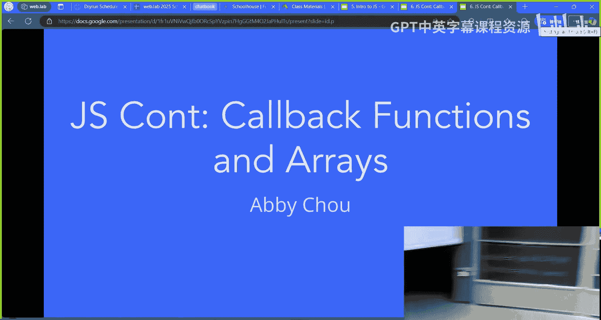
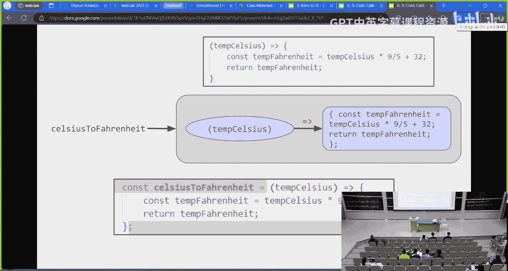
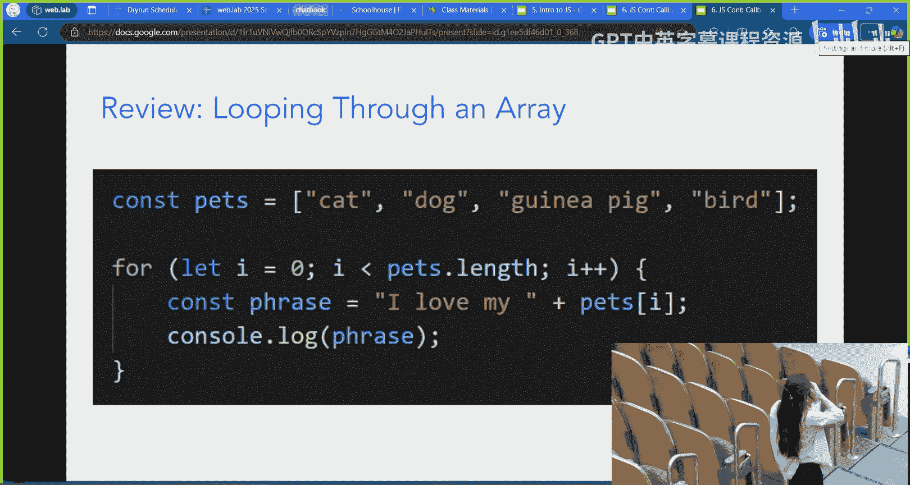
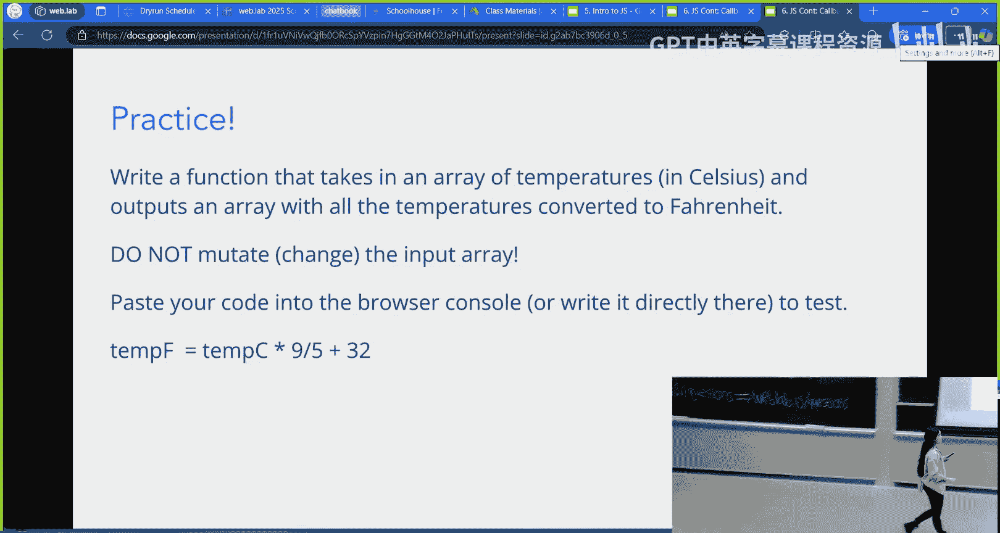
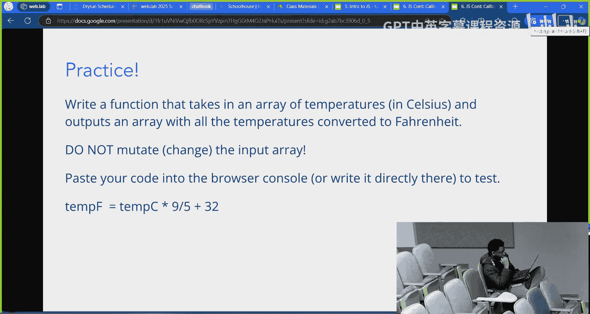
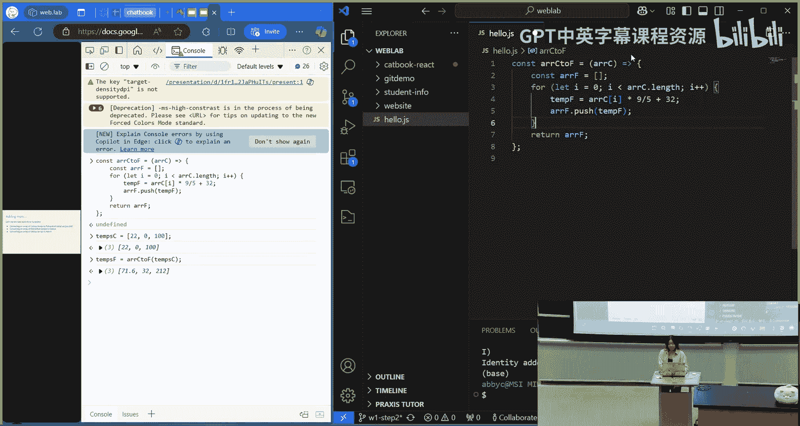
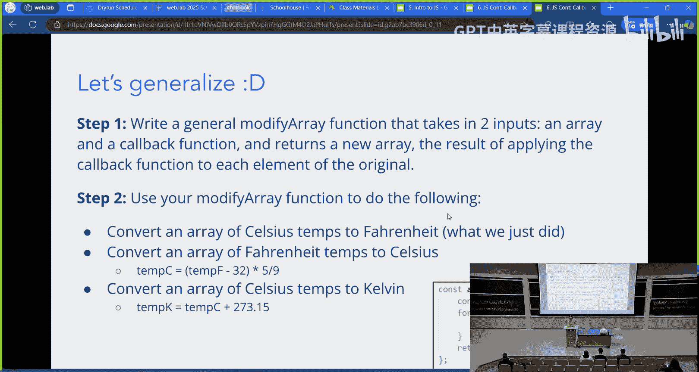
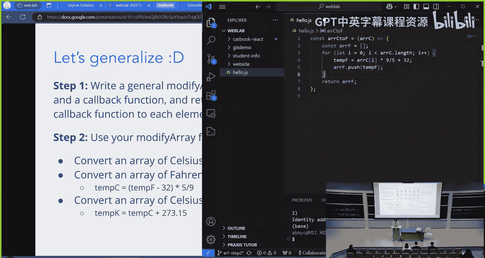
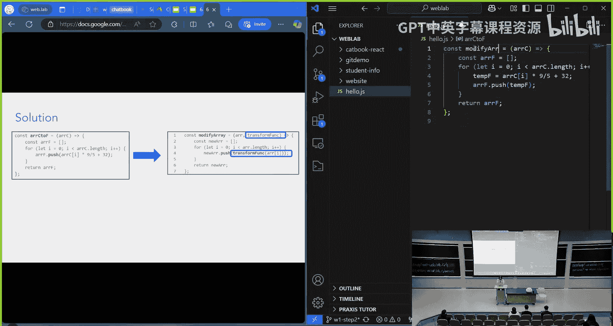
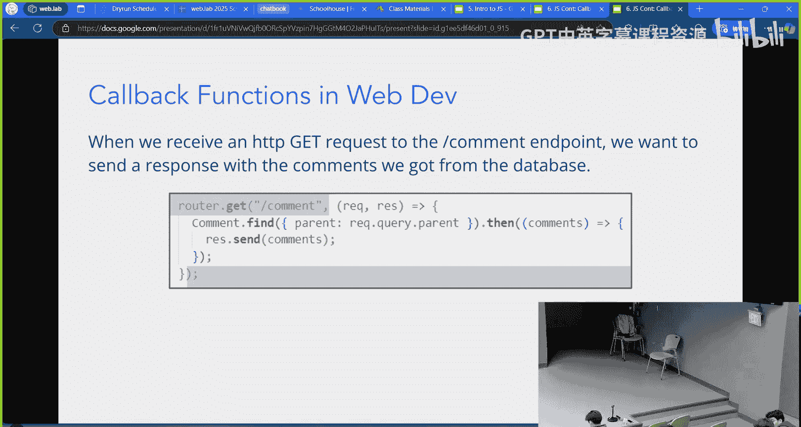

# 《Web开发快速入门｜6.962 Web Development Crash Course IAP 2025》中英字幕 p07 -07-MIT web.lab (6.962) - Day 2_ Advanced JS.zh_en -BV12Ux5zTE9p_p7-

So a few important announcements before we start， as you guys probably have already seen。

 hopefully have already seen。 Home 0 has our setup。

 And you should check that out either today or tomorrow because by Thursday。

 we're going to need to set up have Mongo D B set up for our workshop on Thursday。😊，Also。

 if you're on Zoom， our Panopta live stream is hopefully working now。

 If you go to Webla do is slash livestream， you should be able to go to Panopto where you can easily toggle like you have multiple screens between the video。

 which will have the whole lecture hall and the different slides。

 whatever all the computers that we have plugged in。 So if that's easier for you。

 feel free to use that。 But， of course， we'll still always have the Zoom room。😊。

No office hours today， but milestone 0， where you form your team， lock it on the portal and。

Subit a Google form with 10 ideas for your website is due on the end of day on Wednesday。

 And reminder that you need to complete all of the milestones in order to get credit for the class。

 You be a team by yourself。 That's fine。 We just need to submit your milestones。

And if you still need a team， even after our mixer yesterday。

 feel free to check out there's a place on Piazza we can post about it。😊，And then finally。

 recordings for day1 are up on YouTube。 I think Sunvi are the recordings from day 1 up on YouTube。😊。

Okay， So of it is working on recording， getting the recordings from yesterday up on YouTube and。😊。

We will try and get quicker in our turnaround time to get all of the recordings up on YouTube。

 So hopefully the。They。Day of or worst case day after we'll have all of the videos up。 But。

 of course， you can always access the slides on the schedule page on our website。

 the schedule tab or on our Google calendar。 If you add it to your decal。

 That's probably one of the easiest ways to get access to all of the slides and videos as soon as they're up。

😊，Alright， welcome， everyone。 Everyone looks a little bit sleepy。

 So hopefully coding will wake you up。 Question mark anyway。😊。

So the topic of today is we're doing a little bit more jascript。 yesterdayter。

 we just blaze through a ton of syntax for all the basic javascript stuff that you might need to know。

 But today， we're actually going to be talking about some things that are going to be very important for what we're doing in react。

 We're gonna be talking about callback functions and array。

 You are going to see this pretty soon later today as we start talking about react in our lectures。

 So let's dive in。😊。

So yesterday， we talked about how you can define a function in jascript。

 We have this example of a function that takes the temperature in Celsius and converts it to Fahrenheit。

 And we， we noted that a function is just an input。 and then you feed it into the body of a function。

 and it produces some kind of output。 And so the input is in the parentheses。

 The arrow represents feeding it in。 And then the output is the body of the function。

 which is wrapped in curly braces。😊，So this is what a function represents and is stored in memory。

 kind of like that gray little box。But then if we want to give that function a name so we can call it so we can do things with it。

 we need to create a variable and set it equal to that function。And so this is the syntax to do that。

 We saw this yesterday where we have the variable。 we're setting the variable constants Celsius to Fahrenheit equal to。

😊，Just that exact same function。 And the highlighted part is the same as the function definition at the top of the slide。

Any questions on this before I move on。

Cool， this is all just review from yesterday。And another thing we're gonna review from yesterday becauseuse you'll need it in a sec is push and pop for arrays。

 If you have an array， you can pop off the end or push a new element to the end of the array。

 So given these things， and if you need the slides to reference the syntax， feel free to pull it up。

 it's linked on the scheduled page of our website。😊，Oh。

 the other thing we needed to review was looping through an array。 So this is the syntax for it。

 It's basically just creating an。😊，A variable I that will keep track of the index of our array。

 And then we increment that every single time we go through the loop and we stop when I is equal to because that's strictly less than pet stop length。

 So we go through every single element of our array。

Okay， so what I'm going to ask you guys to do is write a function that takes in not just one temperature。

 but a whole array of temperatures。 and outputs another array that has all of those temperatures but converted to Fahrenheit。

And you should not be mutating or changing the array that is passed into the function。

 You should be creating a new one and returning that new array。

And so you can the ways that you could do this。you could honestly write your code directly in the browser console if you wanted。

 or you could just open up your VS code， create a new empty file that ends in dot Js。

 write your code there， and then just paste it into your browser console and run it if you want to test it。

So I'll give you guys like。4our minutes to attempt that。Again。

 these slides are linked on the schedule。 If you need a reference this syntax from the previous slides。

As always， add yourself to the queue if you get confused。Or just flag me down。

Zoom people， have you guys been able to hear me， okay。

呃。Yes， okay。 thank you。Give me a show of fingers，1，2，3，4， etc cetera。

 How many more minutes you think you need。Okay， cool。 I will give you guys two more minutes。

walk in circles around the lecture hall because I have nothing else to do。

 So flag me down if you get confused about anything。Alright， for the sake of time。

 I'm gonna pull everyone back together and start coding this up。 But if you did not finish。

 no worries， you can just follow along with me。

So I'm just gonna go to my V， S code， and。Create， I'll just put this on the side。

And I'll create a new， empty JavaScript file。And I'm going to define my function。

 Let's give it a name。 Actually， no， I won't give it a name right now。

So we'll take in an array of temperatures in Celsius。 And then we're going to。Do something with it。

So first， we want to iterate through our array of temperatures in Celsius and how we do that is we use a for loop。

 So let's say let I equals 0。I is less than array Celsius dot length。And increment I。

 every time we go through the loop。And so now we're going to do something with array Celsius at index I。

But what are we going to do with that， Well， we want to convert it to Fahrenheit and then add it to a new array that we're gonna build。

 So we'll say temp F， that's a singular temperature。Is going to be what is a formula。

 The temperature in Celsius， which is the element of the。

Arayse Celsius at that index times 9 fifth plus 32。And then we w to add this1 F to。

Some kind of array。And in order to do that， we can just create a new array。

 an empty array that we'll just call array F。And then every time we go through the loop。

 we'll just do。Aray F dot push。Temp F。I think that syntax is right。 If it's wrong。

 someone can raise their hand and correct me。And so， we go through。

Why don't you need the let in front of a arrayF。 I do。 actually， Actually， I'll call it const。

Because we're not going to change the。Rough the place in memory where array F points to。

 So we'll just use constant。Thank you for the correction。And so now。

 once we're done constructing our array F， we are going to return it。And I will。Now。

 give this function a name。I'll say con array， Celsius to Fahrenheit equals that。

And then let's paste this into a browser console and see if it works。

So we can go something like that。And then that will define the function。 And then we'll say， temp。

C equals。I don't know。 Let's do like 20 degrees，2，22 around room temperature，0。

100 or something like that。And say times F equals。 And then we'll pass in。

This array into our function。And we get around room temperature， around freezing， around boiling。

 amazing。😊，So I'll leave this code out for a second。

 does anyone have any questions on the code that we just wrote？Alright， let's move on then。

Okay， and this is where the formula comes in。So now let's say that we want to。Add some more。

 I have some more operations I want to do on my temperatures。

 Let's say I want to also convert an array of Fahrenheit temperatures to Celsius。

 Or maybe I'm scientific。 and I want to convert my array of Celsius temperatures a Kelvin。😊。

How would we do that？Well， you could just。Take this code and copy and paste it three times and just change a little bit。

 But if you copy and paste this code three times， notice that the only part that we're changing is that part that I highlighted in orange。

 The code， the rest of the code will be exactly the same。😊，So ideally。

 we would want to have some way where we can reuse that 90% of the code， everything。

 except the part it highlighted in orange。Turn and talk to someone near you。

 how you think you might do that。Okay， I'm gonna pull us back together。

 I'm not sure if many people knew the answer because it's kind of quick tricky。 So okay。

 if you didn't， but。We use callback functions。So how are we gonna use a callback function， well。

What we're going to do is we're going to write a function that is the general version of what we just saw。

 And so what I want you to do is write a function that's called modify array。

 and it'll take in two inputs。 It'll take in an array。 But it also take in a callback function。

 And then it will return a new array， The result of applying the callback function to every element of our original array。

 So what the heck does that mean。 That was a lot of words。😊。

If I have my modify array function and it takes in my array and this callback function called transform funk。

 then it will apply this function to all the elements of the array。

 So if I have call modify array on this array of cats and I pass in a function that is called hatify that will take in a cat as input and output a cat with a hat。

😊，Then what my modify array function will do is it will call Hadify on every single one of my cats。

And spit out this array at the bottom of the slide， which has all of my cats， but now hadified。

So now I'm going to ask you guys to code this function， this modify array function。

Mostly focus on step 1。 But if you have extra time。

 you are free to use your modify array function and play around with it。

 And on the bottom right of the slide， that's the syntax reference for the arrays Celsiust to Fahrenheit function that I just wrote earlier。

😊，So I will give you guys。A few minutes to attend this and then。Talk to someone next to you。

 if you get stuck。啊。All right。Hopefully that was enough time， if not， no worries。

The main point of having you guys cut these things is just to get you thinking about them。

 So if you were thinking about it， then that's what we want。

All right。So， basically， to。

Make this general modify array function。 All we need to do is take this， and we'll rename it。

Oh， I have it on the slides。I'll just do that。 It is easier than coding it。

So all of the changes that I made were just adding in another parameter for the transform function。

 And then instead of doing this very specific calculation to convert from Celsius to Fahrenheit。 Now。

 I just apply the transform function to whatever element of the array that I'm looking at。😊。

So this is the things that I've changed。And then。If I were to actually call this modify array function。

 then I would define a function that takes in one temperature in Celsius and outputs one temperature in Fahrenheit。

 That's the C to F function there。And then I call modify array with my C to F function。

Any questions on this code。All right。Just as a side note。

 one thing that we can do is write functions in a slightly shorthand notation。In the bottom half。

 in the， the bottom section of the code， that's more similar to the functions that we've been writing so far。

 But we can also， if there's the only thing in our function is just a single return statement。

 then we can shorten it by just having the input and parentheses。

 the arrow and then the output and parentheses。 So it's very much like input feeds into your output kind of notation。

And this is just the more general。Way of thinking about this。

Of the two different notations that we can use to write functions of jascripts。Okay， well。

 it turns out that there's a function that is modify array because some very smart jascript people recognize that this is a thing that we might have to do all the time。

 And so the map function is almost exactly the same as the modify array function that we just wrote。

 But the only difference is that you need to take the array and do the array。

 the name of the variable that holds your array and a dot map instead of having that array as a parameter to your map function。

😊，I'll give you a sec to look at this code。 Make sure you understand what map does。O呃。

Since we are pretty short on time， I'm actually not going to do this map practice。

 but the basic idea is that we want to， we have rectangles， which is an array of JavaScript objects。

And then we want to use map to create an array that contains the areas of those rectangles。

So why don't I ask you to just turn to someone next to you and just talk out verbally how you would implement this。

 because we don't have much time to code it。Alright， I'll pull us back together and。

Show the solution， Nope， Nope， there's no solution， okay。That works。you know。

 I'm gonna just put the solution on a slide after this and you guys can look at it and try this practice afterwards if you have time as an extra little homework thing。

 because I need to make sure that the next group has enough time to do their lecture。😊。

So the next concept we're introducing is filter。 It's very similar in a map。

 but it just does a different thing。 So if we have an array， then we can do filter。

 and then that filter takes in a function。 But this function takes in a single element of the array and outputs a Boolean。

 true or false。😊，And so basically， we feed。 So in this example， we have this array of numbers。

 positive and negative in the values array。 And then we have a function that takes in a single number and outputs true if x is positive or that particular element of the array is positive and false。

 if that is0 or negative。😊，And so then filter， what filter will do is it'll go through every element of the array。

 Fe it into our function。 And if that function outputs true， it'll keep that element。

 If the function outputs false， it won't keep that element。And then， for example。

 on the bottom code section of the slide， we have our staff names。

 And let's say I just really don't like Annabel。 And so I want to filter out。

I I want this function to return false only if the staff name is Annabel。And so that way， I can。

Have a new array that contains everyone except Annabelle in it， sad。Okay。

 this is also going to be extra practice for after you can view these slides and try it out yourself。

😊，So question， why in， in a very general sense， why do we use callback functions。Well。

 one is for reusability。 for map and filter， we don't want to have to rewrite the code to iterate through the array。

 pass the elements through this function every single time。 And so we use callback functions。

But another way。Another reason we use callback functions is abstraction。 What does that mean。

It means sometimes I want to write code that says， when this happens， do something else， do this。

And what callback functions allows us to do is write the code for the do this。

 write the code for what I should be doing。And let other smart people。

 also known as the writers of the ja libraries， write the code for when X happens。So， for example。

Let's say we have a function called update animation。 And we want to call that every 10 milliseconds。

 Maybe we're making a game or something。 and we need to update the display。 and we know how to。

 how we want to update the display According to the game we're making。 And so we have this function。

 update animation that we wrote。😊，However。We don't want to write code to manage timers interfacing with the computer clock or something with the browser or I don't know。

 it's just a lot of low levelvel code that is kind of complicated and we don't want to write it ourselves。

 So the JavaScript authors did it for us。 And so they wrote this JavaScriptscript library function called set interval。

 And that interval will call whatever callback function is passed into it。

 which in this case is our update animation。Every 10 milliseconds。

And so we wrote the code for update animation。 The jascript authors wrote the code for set interval that allows us to。

 that allows this function to be called every 10 milliseconds。

 And we're happy because all we had to worry about was updating our animation。😊，Okay， so next up。

 I'm just gonna flash up a few slides。 You probably won't recognize any of this code。

 You probably won't fully understand what it means， but I'm just gonna show you。

And we'll see this later in Weblab。 And so I want you to just mark this down in your head and remember。

 oh， this is a callback function。 And so when you see it later in Weblab， you can note， oh。

 that's a callback function and think about it in terms of callback functions。😊。

So this is one example where we want to get something from a database。And then we。

 once we receive that thing。 That's what the dot then means。

 Once we receive the thing back from the database， then do this。

And so the reason we use a callback function is because。

We don't know how to write the code that detects whether the thing has been received from the database。

 but we do know what we want to do once we get that information back。We want to send it。

 in this case， we're sending it back to the front end。And then similarly to this。

 in our back end code， you're gonna see code like this that says when we receive an H TDP request to this particular endpoint。

 we want to do this。Do something。And so。Allright， my clicker isn't working now， but basically。

We don't want to write the code that detects whether we get it。

 whether we've received an H TP request or not， that's some kind of weird low level stuff with ports and everything。

 But we know that as soon as we get an H T TP requests that follows this particular form。

 we want to do some stuff with it。And so。In general。

 whenever you see this syntax for callback functions。

With the parentheses and the input and the arrow。Being passes a parameter into another function。

 I want you to think， like， what is the when this happens and what is the do this， Like。

 why are we using a callback function here。And if you can think about it in those terms。

 that will serve you well for the rest of Webweb。And this is just highlighting the particular。The。

 the area that is itself the callback function。Okay， I think that was the end of my slides。

So thank you all for bearing with me and take a couple minute break as we transition into our Intro to reactact lecture。

😊。

