# Web开发快速入门：09：React 实战工作坊

在本节课中，我们将通过一个实战工作坊，将之前学到的React核心概念应用到CatBook项目中。我们将学习如何将静态页面转换为React组件，并实现一个具有交互性的功能。

## 概述

上一节我们介绍了React的核心概念，如组件、Props和State。本节中，我们将通过构建CatBook的导航栏和实现一个“猫咪快乐值”计数器，来实践这些概念。我们将学习如何创建组件、管理状态以及处理用户交互。

## 组件树回顾

首先，让我们回顾一下React的核心理念。React允许你将用户界面分解为可复用的模块化组件。每个组件可以接收Props，并管理自己的State。组件之间通过父子关系进行交互，Props从父组件传递给子组件，形成一个树状结构。

对于CatBook项目，我们的组件树结构如下：
*   **根组件**：`App`
*   **直接子组件**：`Navbar`（导航栏）和 `Profile`（个人资料页）
*   **Profile的子组件**：`CatHappiness`（猫咪快乐值计数器）

我们的目标是构建这个结构并实现交互。

## 环境设置与项目启动

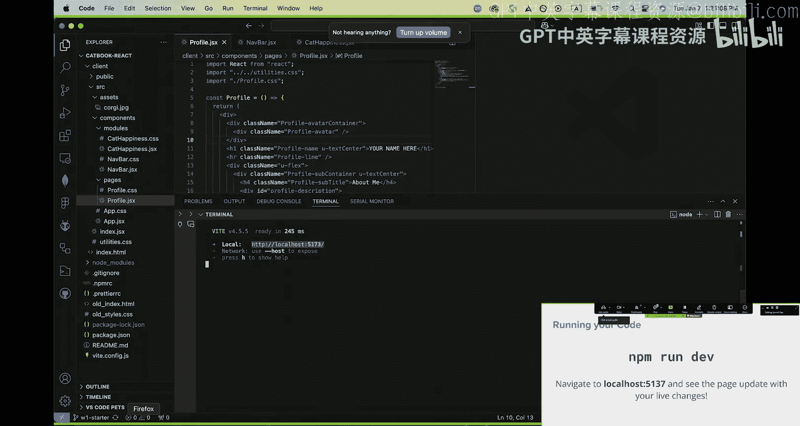

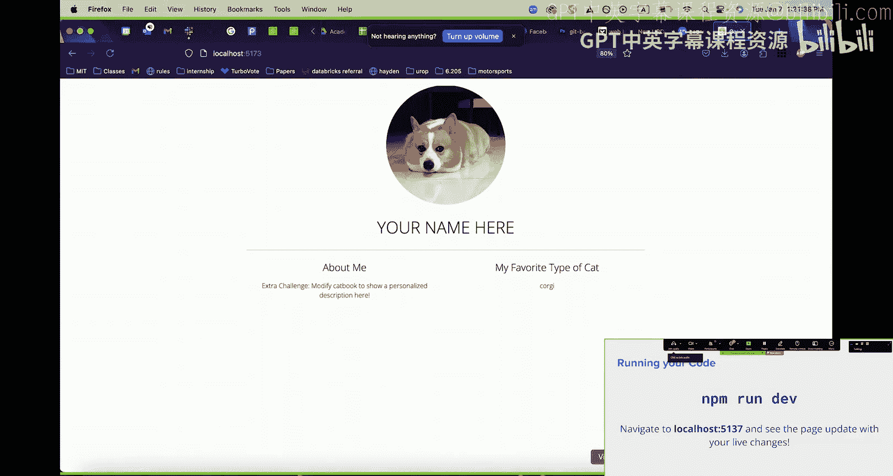

在开始编码之前，我们需要确保开发环境已就绪。请按以下步骤操作：

1.  **检查Node.js**：在终端中运行 `node -v`，确保版本在18以上。
2.  **进入项目目录**：打开终端，导航到 `catbook-react` 文件夹。
3.  **安装依赖并启动**：在项目根目录下运行以下命令：
    ```bash
    npm install
    npm run dev
    ```
4.  **访问项目**：命令执行后，终端会输出一个本地服务器地址（通常是 `http://localhost:5173`）。在浏览器中打开此地址即可查看项目。

如果遇到任何问题，请随时向助教寻求帮助。

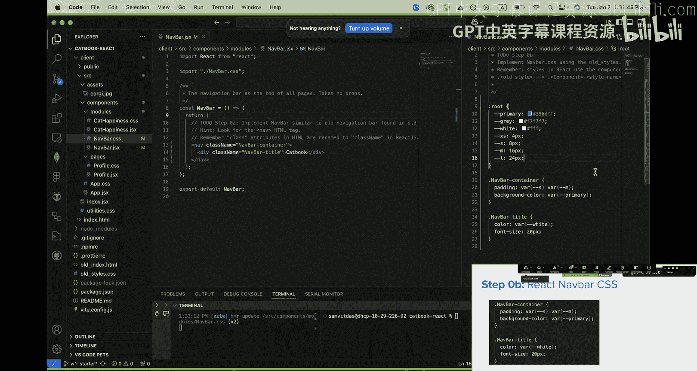

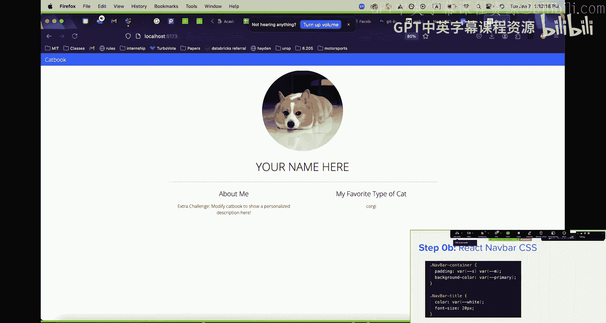

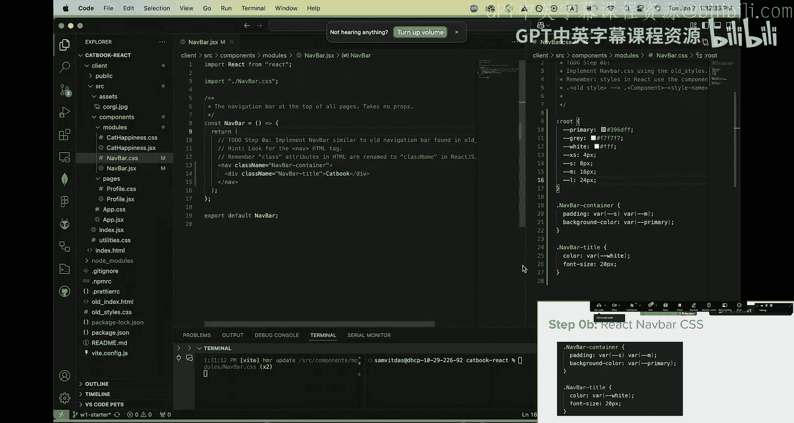

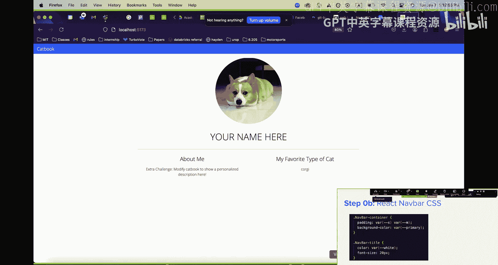

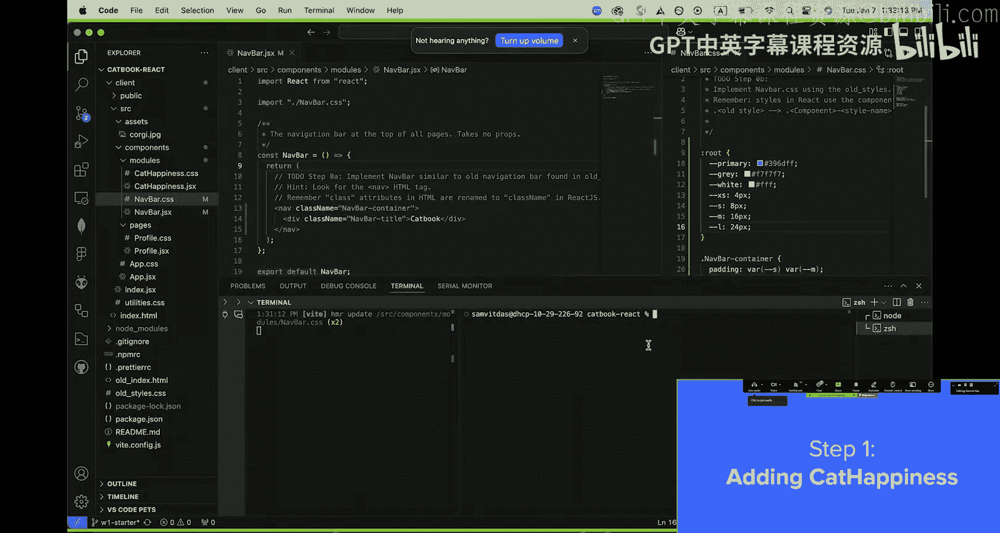

## 第一步：实现导航栏组件

现在，我们开始实现第一个组件——导航栏。这与我们在第一个工作坊中创建的导航栏类似，但这次我们将使用React的语法。

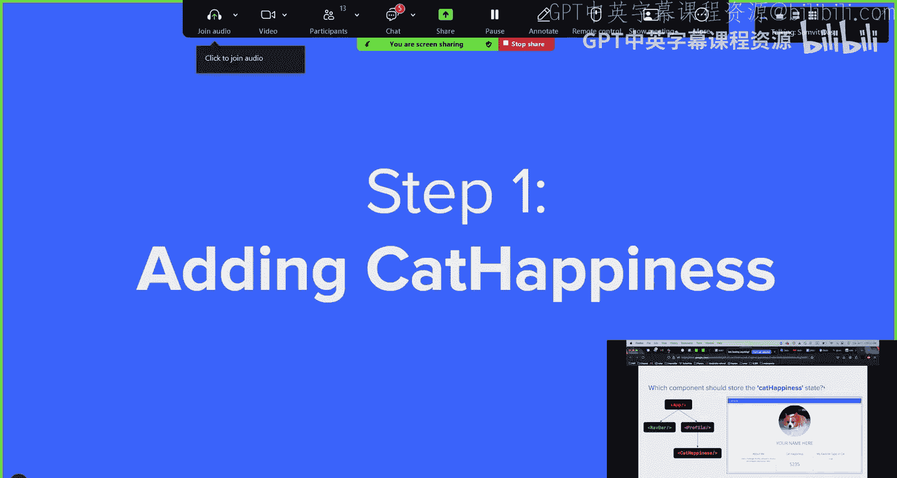

导航栏组件的基本结构是一个包含标题的容器。在React中，我们使用 `return` 语句来定义组件渲染的HTML内容。

以下是实现步骤：

1.  **编写JSX结构**：在 `Navbar.jsx` 文件的 `return` 语句中，构建导航栏的HTML结构。
2.  **添加样式类名**：使用 `className` 属性（而非 `class`）为元素添加CSS类名。良好的实践是使用组件名作为前缀，例如 `navbar-container`。
3.  **导入并编写CSS**：在文件顶部使用 `import ‘./Navbar.css‘;` 导入样式表。然后，在 `Navbar.css` 文件中，为你定义的类名编写样式。

完成后的导航栏应显示在页面顶部。

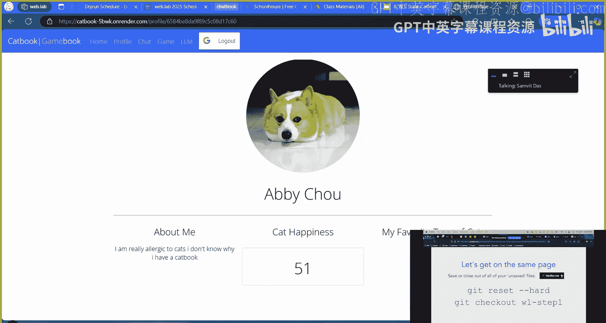

## 第二步：添加猫咪快乐值组件与状态

接下来，我们将在个人资料页中添加一个有趣的 `CatHappiness` 组件。这是一个计数器，点击个人资料头像时，数值会增加。

这里引出一个关键问题：**状态（State）应该存放在哪个组件中？**

选项有：`App`、`Navbar`、`Profile` 或 `CatHappiness` 自身。正确答案是 `Profile`。原因如下：
*   点击事件发生在 `Profile` 组件内的头像上，因此 `Profile` 能直接响应该事件。
*   `CatHappiness` 组件仅负责**显示**这个数值。
*   我们将状态存储在 `Profile` 中，然后通过 **Props** 将其传递给 `CatHappiness` 组件用于显示。

以下是具体步骤：

1.  **在Profile中添加状态**：在 `Profile.jsx` 中，使用 `useState` Hook 创建一个状态变量，例如 `catHappiness`，初始值设为0。
    ```javascript
    import { useState } from 'react';
    // ... 在组件函数内部
    const [catHappiness, setCatHappiness] = useState(0);
    ```
2.  **导入并放置CatHappiness组件**：在 `Profile.jsx` 顶部导入 `CatHappiness` 组件，并在JSX中希望它出现的位置（例如“关于我”和“我最爱的猫”部分之间）添加 `<CatHappiness />`。
3.  **传递状态作为Prop**：将 `Profile` 中的 `catHappiness` 状态作为prop传递给 `CatHappiness` 组件。
    ```jsx
    <CatHappiness catHappiness={catHappiness} />
    ```
4.  **在CatHappiness中接收并显示Prop**：在 `CatHappiness.jsx` 组件函数中，接收 `props` 参数，并在JSX中使用 `{props.catHappiness}` 来显示传递过来的数值。

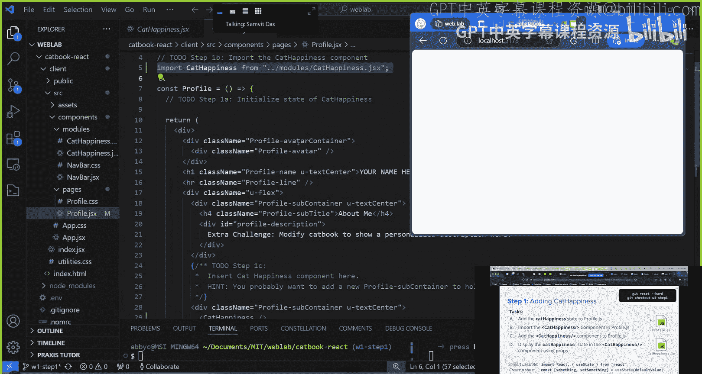

完成此步骤后，页面应能显示猫咪快乐值，但点击头像还不会改变它。

## 第三步：实现点击交互功能

最后，我们需要实现点击头像时，`catHappiness` 状态递增的功能。

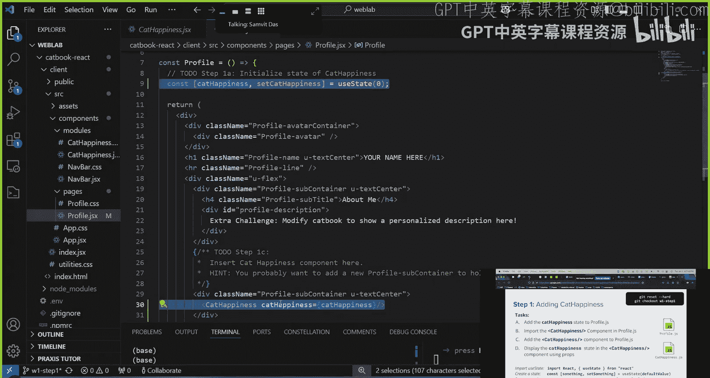

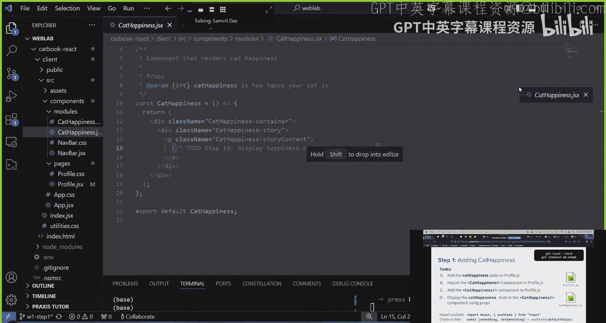

这需要两个步骤：

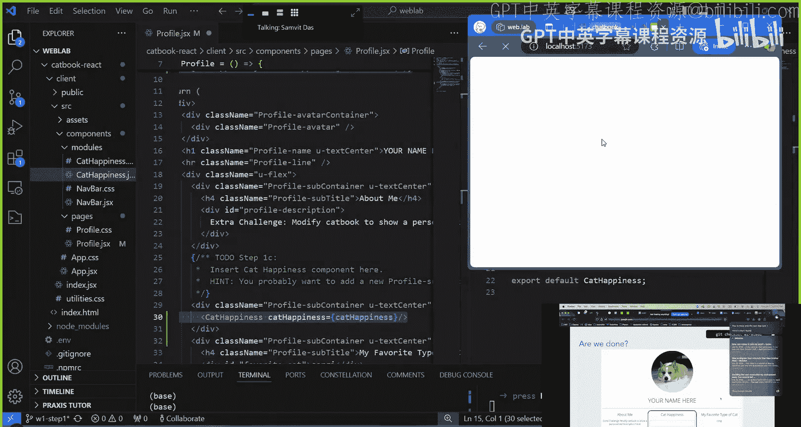

1.  **定义更新函数**：在 `Profile` 组件中，定义一个函数（例如 `incrementCatHappiness`），其内部调用 `setCatHappiness` 来更新状态。
    ```javascript
    const incrementCatHappiness = () => {
        setCatHappiness(catHappiness + 1);
    };
    ```
2.  **绑定点击事件**：在 `Profile` 组件中包裹头像的 `div` 元素上，添加 `onClick` 事件处理器，并将其值设置为 `incrementCatHappiness` 函数。
    ```jsx
    <div className=“profile-avatar-container” onClick={incrementCatHappiness}>
        {/* 头像图片 */}
    </div>
    ```

**重要提示**：传递给 `onClick` 的应该是一个**函数引用**（如 `incrementCatHappiness`），而不是一个函数调用（如 `incrementCatHappiness()`）。后者会在渲染时立即执行，而非点击时。

现在，点击猫咪头像，你应该能看到猫咪快乐值计数器随之增加！

## 总结

本节课中，我们一起完成了一个完整的React功能实现：
1.  **创建了可复用组件**（`Navbar`）。
2.  **理解了状态提升**，将需要跨组件共享或由父组件控制的状态（`catHappiness`）放在了共同的父组件（`Profile`）中。
3.  **使用Props进行父子通信**，将父组件的状态传递给子组件（`CatHappiness`）进行显示。
4.  **处理了用户交互**，通过 `onClick` 事件和状态更新函数来改变应用状态。

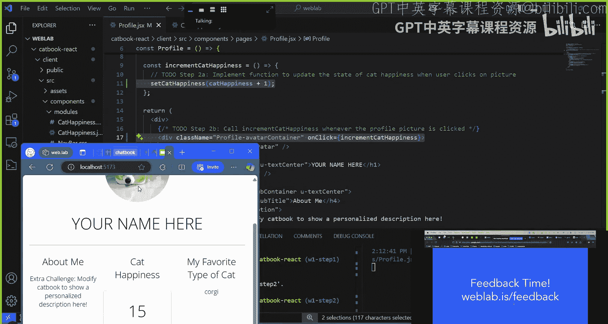

你已成功将静态页面转换为了一个具有动态交互的React应用。这些构建块——组件、Props、State和事件处理——是构建所有React应用的基础。请继续练习以巩固这些概念。