# 《Web开发快速入门｜6.962 Web Development Crash Course IAP 2025》中英字幕 p10 -10-MIT web.lab (6.962) - Day 2_3_ React Lifecycle.zh_en -BV12Ux5zTE9p_p10-

OK。嗯。And we get it started。 This is a pretty intense lecture。

 There's gonna be quite a few important things that you'll learn that you'll see pretty much throughout the next two weeks。

 So hopefully， you stick along with me。Essentially。

 this lecture is gonna be about like the react lifecycl。 So how components are created。

 how they're like updated， and then how they're dismounted， as well as hooks。

 And I'll get more into hooks。 Well， you've actually seen them before。

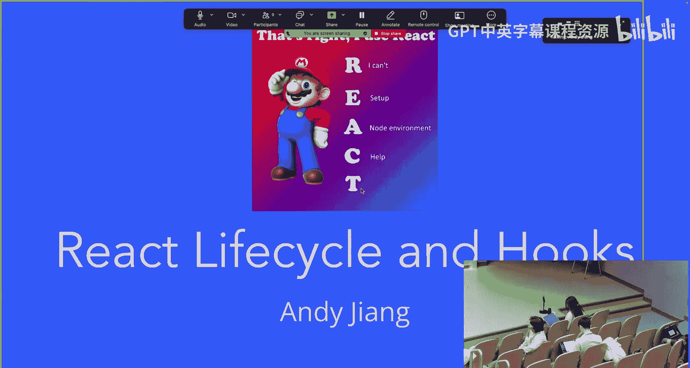

不。Yeah， so just as a quicker review。When you're working with a component tree。

 there's three main motivations for when you want to break it down into like smaller components or break a component into smaller components。

So the first is if it's like getting too long， too hard to read。

The code that you saw in the previous workshop could all theoretically be in the same component。

 but that's just not ideal when you're working on a large code base。

 you want everything to have its like own purpose。 So you want to split up components that or you want to split up like large files into smaller ones so that you can work on files one at a time and like track your changes better。

And an analog is like when you're building a house。

 you have specific plans for each of the rooms that you're building。

And in react in the previous workshop， you don't want to add the nav bar to your app component because it serves a different purpose。

The second reason， I mean， all these users are pretty related。

 but the second reason is that these parts or sections have different functionalities。

So like in a shopping mall， different stores have their different like purposes。

 So you don't want all the sources would be in the same component。 you want like。

A store component so that you can like treat each of them sort of like differently。And in react。

 comments， even though they like could be stored inside of a post component。

 should reside in their own component。Because it's more reasonable and Commons have their own functionality。

And the third is if you're components like handling too many responsibilities。

To make your code more readable you want each components like do its own thing。So again。

 it's easier to track your changes。 so like in react。

 if your button does a lot of like backcked things like sends or send something to your server or it has a lot of complicated logic。

 You want that component to be maybe separate in a different file。

 and then you can just like call a component inside the form。嗯。At the end of at the end of the day。

 it's really your choice， how to design your component tree。Once you go through our workshops。

 you'll get a better understanding of like or a better idea of like when you want to break up a component into smaller components or when you want to merge components together。

 this just takes time and practice and looking at examples of good code。

So a bit of practice that I'll sort of speed through because we're running out of time。Again。

 state is maintained by a component， and it's a bit of memory that this a component maintains like even after it's rendered multiple times。

 So think of this as something that's persisting。It's also mutable。

 We can mutate it using the set functions that we defined when we call the use state function。

And it's updated either by us when we're interacting with the website or via computers or like when we're interacting with different computers。

And states essentially give us control over displaying different things in the application and actually storing that somewhere in the in our code。

So props are a lot more surface level in that they're just passed down between components。

Think of them as like arguments to functions。 If our components are functions。

And they're not mutable。 And they only change when we update， like， for example。

 a state and a parent component。 and it's passed down again back into a child component。

That's the only time like a problem would change。 if it's being changed somewhere up there。

You guys just saw this。 This is how we create a state。 We have the value。

 and then the set for that value。We call U state， which is imported from react。

 And then we create we give it an initial value。You guys have seen this already。

So here are some examples of using our state。We want to have different states for each of the things that we care about。

 So persons， I guess， or people is an array。 Pes is also going be a separate array， a separate state。

 and then exists is going to be a billion。So in general， these states can take on any values。

 and usually our components are going to have lots of different states。So again。

 we never want to modify the state directly。 We always want to use the set。

 the set for the state that we define when we call use state。

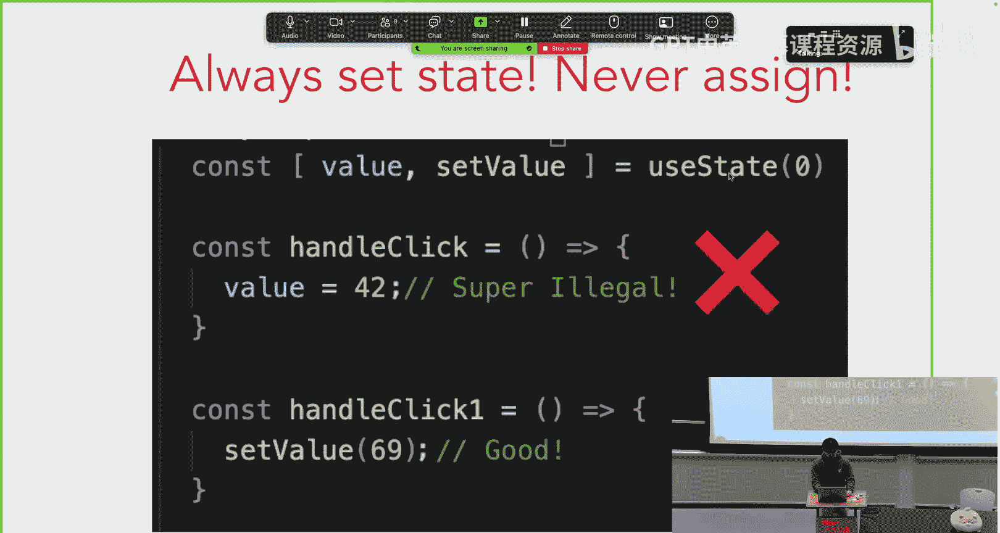

O。嗯。Another thing is when we're setting an array， we usually want to。

Do it in this way where we destructure the initial value。

 So let's say pets was like an array that had like three values。

All this is doing is sort of like flattening that array array or taking away those like brackets。

 And then once we do like this dot dot， dot pets， this becomes like three elements within。

This new area， so。Might be confusing， but we'll see an example later tomorrow。

And then here's a bit of a discussion about like where we actually want to store our states inside the component tree。

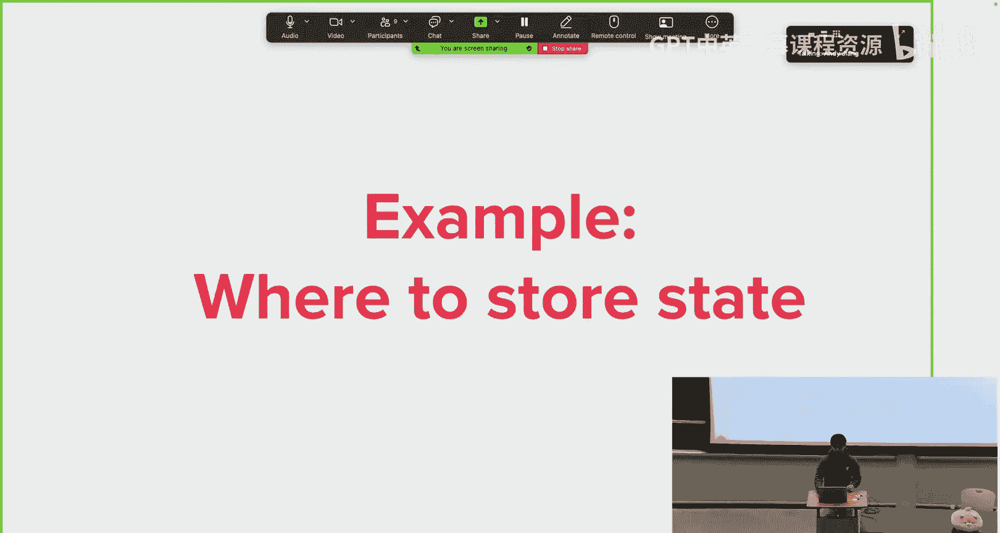

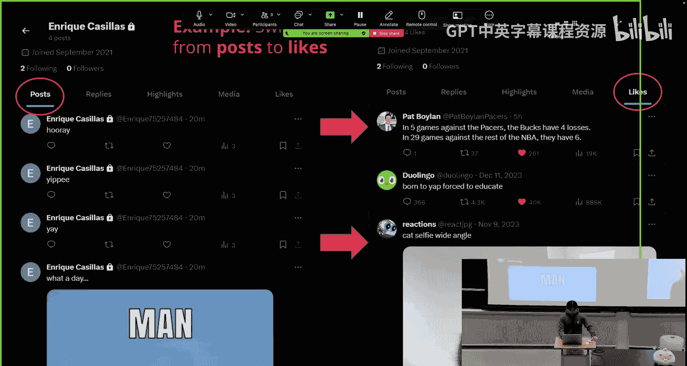

If we're looking at a website， we see that there are a few common components between these different pages that we might view。

 So this is our feed。The feed has both a tabs component and a sweet tweet panel component。

And notice that these components are pretty much the same between different。

Different views of the website， except。On the left， we have the posts highlighted on the right。

 we have the likes highlighted。 and then on the on the left， we have the tweets or the posts。

 And then on the right， we have like， I guess the liked posts。So。

What this would probably look like is in the tabs component on the top。

 we have some state that specifies what the selected tab is。 So maybe selected tab on the left is 0。

 which corresponds to the zeroth index in this in this array of the tabs。 So posts。

And then in the right likes is or the selected tab is probably set to four。

 which would correspond to the likes element in the tabs。下面3次。And then in the tweet panel， we。

 we'd probably have like a state that stores the content type。So on the left， it would be the posts。

 and on the right， it would be like the liked posts。

The problem is that there's no coordination between the states that I just described if we just store the state within tabs and then store the state within tweet panel。

 when I make a change in tabs， like when I press a different tab。

 how does the tweet panel know that I want to update what type of tab I've selected？

And the answer is， I have to move the state from the tabs in the tweet panel up to the parent component。

So that the parent component can then propag get the changes down to the children components because these states are related。

 right。So instead of having two separate states， I would just put one state。

 the selected tab up into the feed。

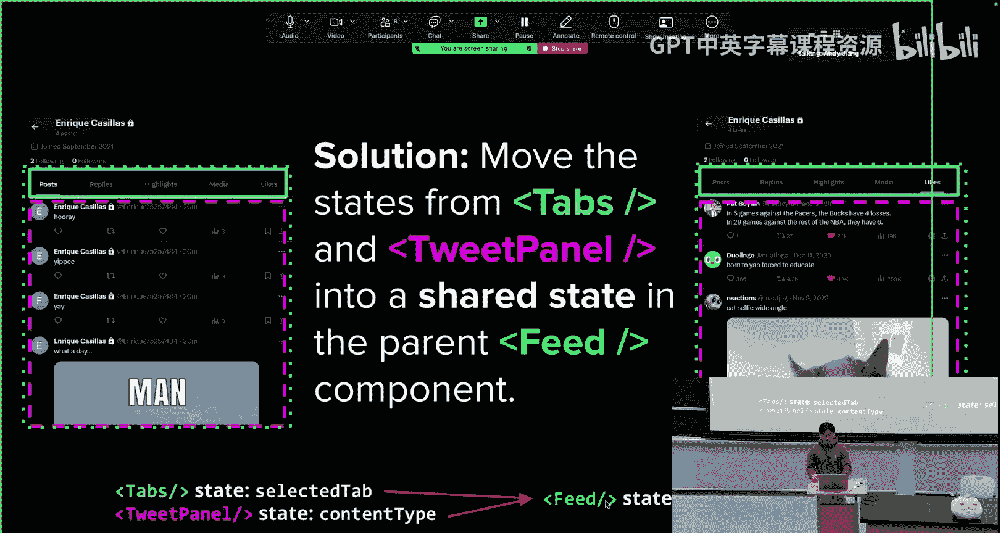

So before。In code， I would probably see like a state that's content type in the sweet panel and then a state that select the tab and the。

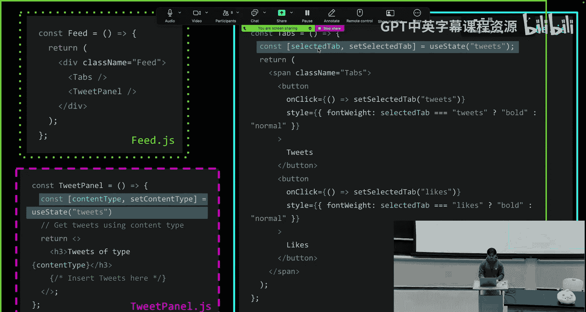

The tabs component。And afterwards。I would put sort of a combined state up into the feed。

 called selected tab。Now I can then pass down into each of the children components using props。

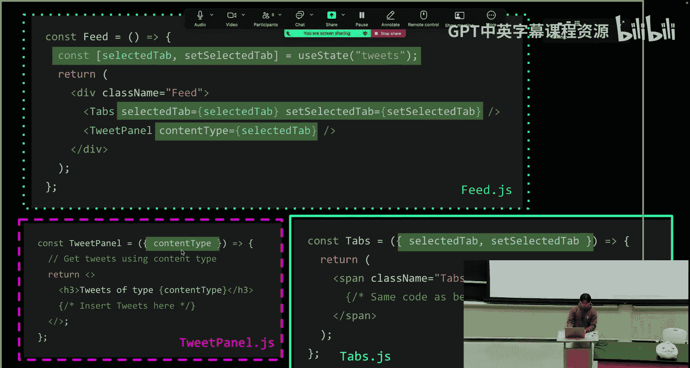

So。In general， if you see that you want to have states that are sort of like connected or like interacting with each other and children and components。

 move them up to the。The parent that's like the some parent that's， I guess。

 in common for both of them。But you don't want to move it up all the way。

 Move it to like the least common ancestor。 if you've like。Learn some algorithms before。

And then once you've moved up states to the parents。

 you pass back or you pass down that state value as props to the children。

 and you might have to pass down the same state as props from like one child to another child to another child。

If there's like a large nested structure in your component tree。

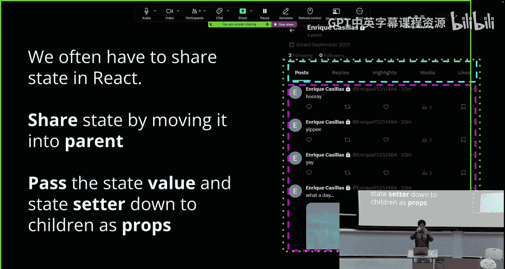

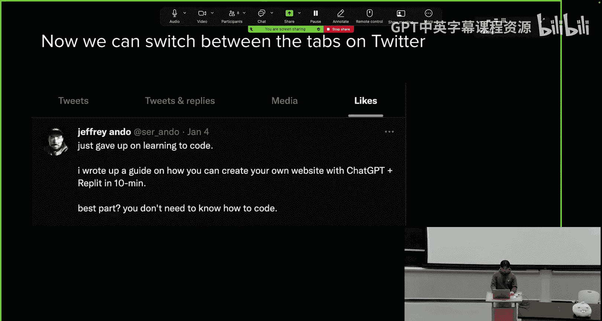

受。Another， I guess like to emphasize the point again。

 you can't share states between children components directly。

 You have to go through and go up to a parent component and then pass it down。

I guess this is this is just like reiterating the point。

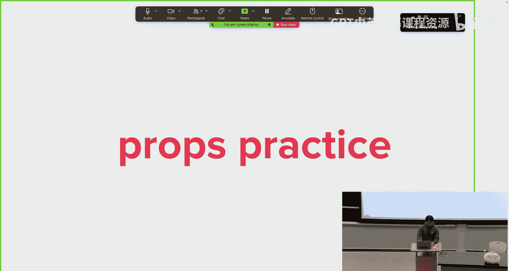

But yeah， like， let's take a look again at this Twitter page breakdown。We have lots of components。

 The app is the outer component。 And then within the app， we have a nav bar。A feed。

A trending page and a profile component。And then within the feed， we have tweets。And within the。

 sorry， I guess。It suggestions not profile within the suggestions component。

 we have profile components。

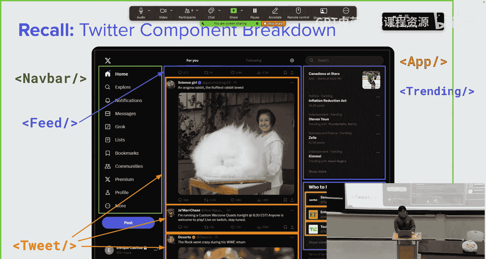

And hopefully this tree makes a bit more sense。This is the react component tree。 We have the app。

 which has these four children components。And then the tweet is a child of feed。

 profile is a child of。Suggestions。So take a moment。

 answer this question with the neighbors around you。

 What of the following should app pass down as props to these components。Okay， bringing it back in。

So。The answer is we should pass down anything that might be used in like multiple components。

Are multiple children components。 So this includes blocked users， following and followers。And here。

 like on these arrows， we see like which sort of props the app might want to pass down into their children so。

Into the feed， we'd probably want to know like what users were following。

 which users we have blocks and a list of the tweets。Into trending。

 we want to know our following followers。And then in suggestions。

 we'd probably want to know following followers， as well as block users because we don't want to see them。

So。The reason that we don't want lists of tweets to be a prop inside or prop that's passed from app to feed is because it's really only used in one place。

 It's only it's only used in the feed component。AndThat means that we can actually just store state or store the list of tweets as a state in feed instead of having a state and app that's passed down a feed because none of the other children components of app need the list need the list of tweets。

Whereas for the other three。We would want to pass it or we。

 we would want to store an app and then pass the same values down。To the children components。

I'll skip past this。Any questions so far。about that。

So let's talk more about the component life cycle。And this is how like state is managed inside of react。

So you can sort of think of component rendering as a process where。

That's sort of like what we see in restaurants where。There's a trigger。

The trigger happens when a customer order something or when we first want to or the first time。

 like a component is called。Or a trigger is when one of the states in the component is changed。

So after this trigger， we have the render step， which actually runs the ja code and the component。

So that's all the stuff like before the return statement in the component。

And then it calls all the sub components as well that you see in the return statement。

And then commit is the last step， which takes all of that JS X that we just created or that we just obtained from the return statement。

And then converts it into H T M L or adds it to like the Dom， which is the document object model。

And then this is actually just sent to the front end or like the browser where we can actually see the end results or the H Tl。

So there's three steps， trigger， render and commit。

Friers like when a customer orders something render is when the restaurant returns。

 like what they want to be rendered。And then commit is when we actually serve it to the client。

So I have an example website。 and you guys can also follow along。If you visit Weblab。Restaurant。

Dotheroku app dot com。I guess this website has been around for a long time。

 This example has been around for a long time。You can see this sort of like a very。

 very plain react app that has a button called order stake。When you click order stick。

It presents this stake。And you're now given an option to send it back to the kitchen。 Right now。

 it's a raw steak。 I want it cooked。So I can send it back。And then it gives me a rare stick。

 And then I can send it back。Send it back。And keep on going。

And Im I'm actually going run it locally as well。 just so you guys can see the code。嗯。So。

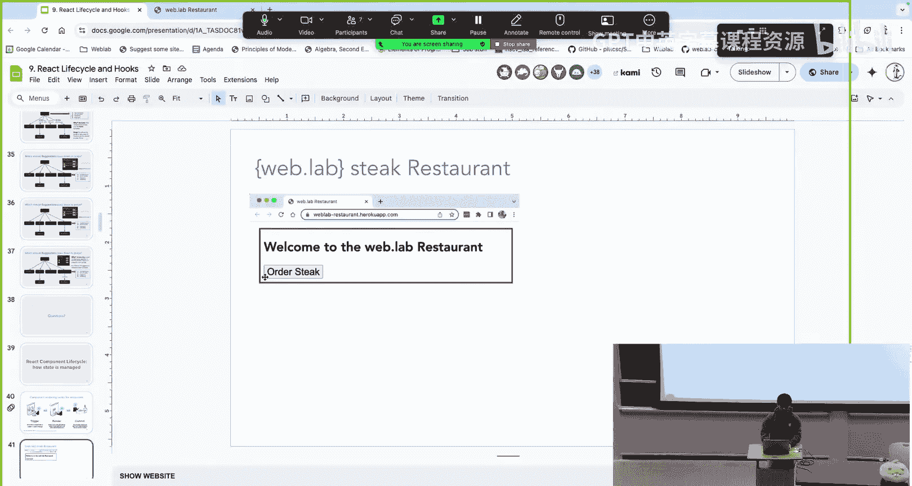

The code looks like this。 I have。哎。I have a stake component。It has a state called Dunness。Initially。

 it's gonna be 0。 and done this is like some value that's gonna be 0，1，2，3 or 5，4 or 5。

And then I essentially take the steak， and then render。

A different photo based on what the value of the state is so。嗯。I'd like a list of these sticks。

 a list of images。And then， yeah， I just render it。 I have a button， I have an image。

All of this is actually available to you on a branch of the。Skeleton code。

 I don't know if you have access to that yet。

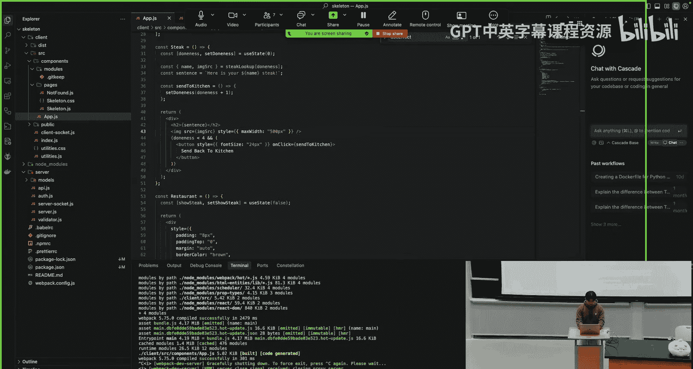

But嗯。I'll add a link to the slides。Yeah， so what happens when we initially press the order stick button。

So when we press it。This is the first time that we see the state component。嗯。

Before there's no state component here afterwards。This is only like this is the first step is。嗯。

The trigger， or like when we press the button， the trigger happens。

 And this first step is called mounting， so。Mouning is when it first appears for when it appears for the first time。

Afterwards。

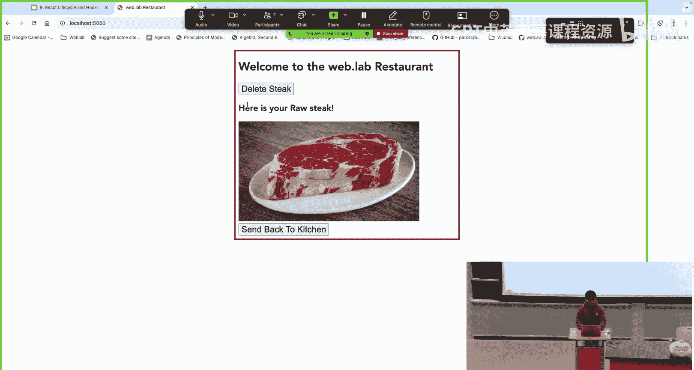

第。Code in the state component is run。So all of this JavaScriptscript is run。And then we get the JSX。

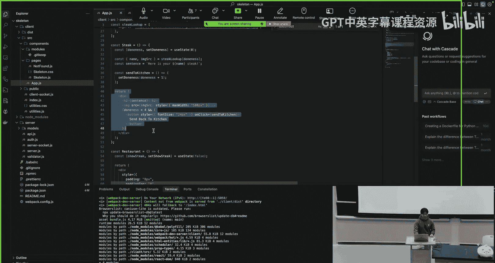

And then afterwards， for the committing， the HD L Dom is updated based on the JS that we created。

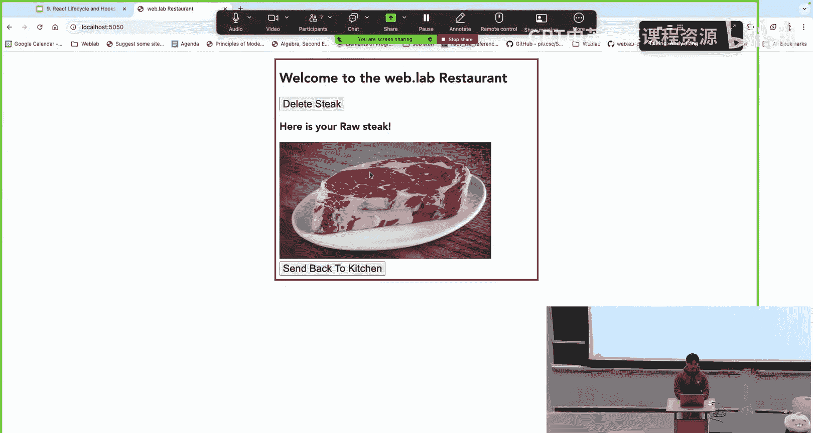

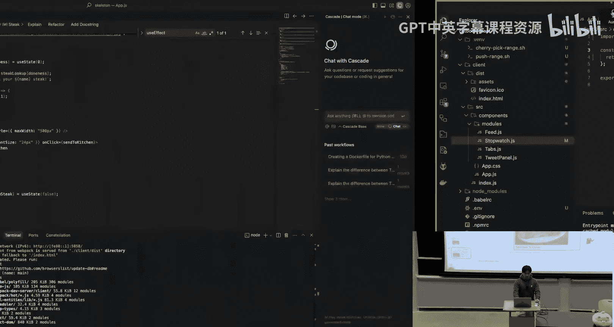

And then this is actually displayed to us。On the website。So yeah， these are the different steps。

And you might have noticed that we had this button send back to kitchen that probably looks a lot like a lot like the cat happiness button where we just had a callback function send to kitchen that takes the previous state。

Adds one and then sets the state to that newly incremented value。

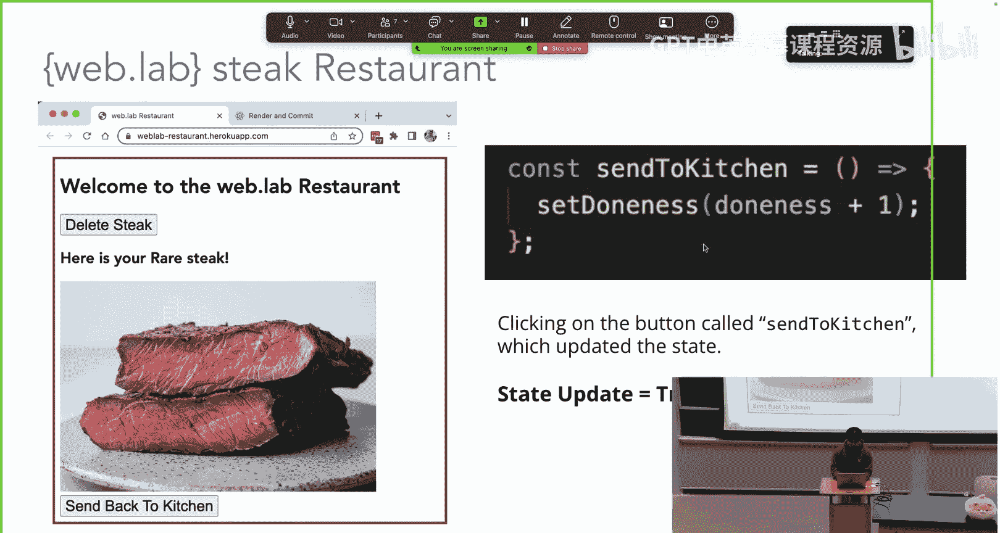

Now， every time the state changes。 So every time doneness changes。This triggers a re。

And we cycle again through the steps， so。This set function actually is a trigger。

 which leads back into the render step and then the commit step。

 which means that every time we click the button and we change the state。

 we see the updated value or an updated component。

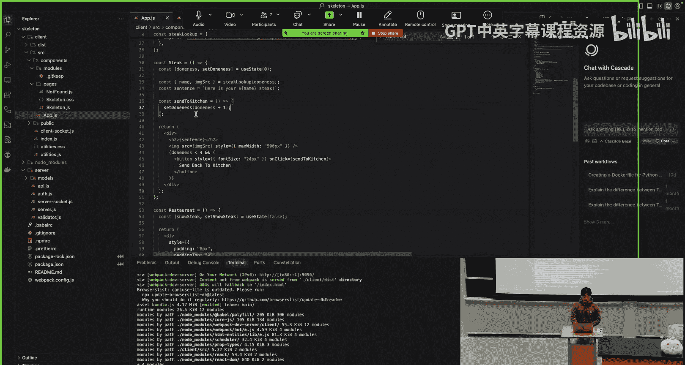

Rather than the old component。So this is just how react works。 Every time we change a state。

 the components re rendered。

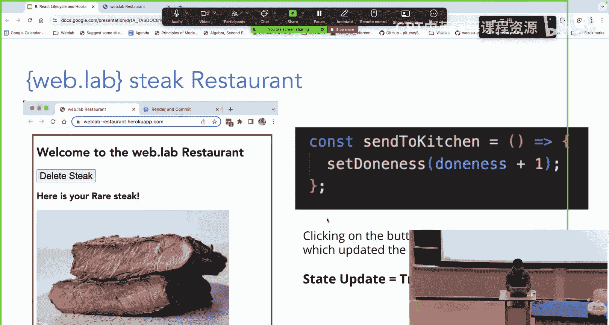

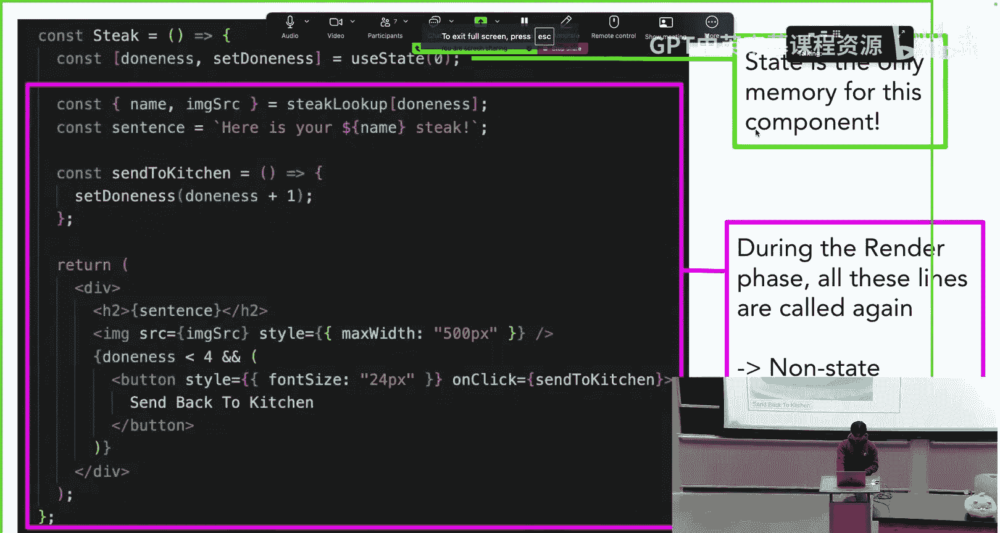

Okay， so。What happens when we delete the stake？Well。When we press delete stake。

 the component goes away and this is the part of a life cycle called dismounting。

 So the opposite of mounting is dismounting， essentially when we remove it from the document object model so that the HTML no longer displays that component。

嗯。So that's the end of life cycle。 Essentially， a component will go through three main phases。

 The first is mounting， where we have these trigger render and commit steps。

Then a state change happens。 And then we have another trigger， which is a state update。

 then the render， then the commit。And then we keep going through these state changes， and eventually。

The component is dismounted。

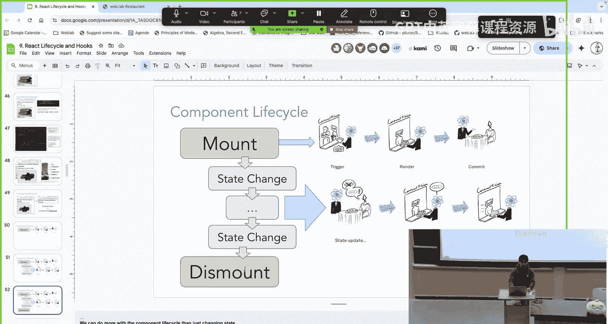

At which point were。We're no longer going to view the component。

Okay， so this is a really important hook that we're going to discuss now。

 It's called the use effect hook。You've seen the use state hook and use effect is probably the second most popular hook that you're gonna see。

So。Hooks allow us to like access different parts of the component lifecycle。

 We've seen that use state can update states which trigger re rendernders of our components。

But sometimes you say isn't enough for us。So here's an example of， here's a piece of。

 here's a piece of code。 And I'll give you a minute to read through it and。At the end。

 I'll ask you what this console is going to print。So person starts as empty。Essential。

 we're setting persons to be the array。 That's one element me。Who thinks that it's a。S fence。

Who thinks it's B。More hands。So the answer is actually a。

 And this is really undesired behavior because we really want it so that we can access the new value of persons after we've done a set state。

So it's kind of counter counterintuitive， right， Like we've just set the persons we've just set the value of persons to be the array me。

But once we log the value of that state， we're left with the old value and not the new value。

And this is where。This is where we want to use the use effects hook。And essentially。

 use effect is useful because we can do some behavior after a state has changed。

And this is just one use of the use effect hook。So， yeah， we run it after。

 we run some function after a specific variable changes。

 And this variable is usually like a state in our component。And。And you'll see a bit of this later。

 But commonly， this is used to like do some complicated functionality that's external to react。

Whenever some state changes。And the syntax is this。

 We have use effects that takes into two arguments。The first is a function。

This can be like a callback function。And the second is a depend theory。

It's going to be literally an array。And this is optional。

 So we can either have a dependency array or just have one argument being the function。

And if we do have the dependency array， then this use effect tells us that whenever anything inside this array changes。

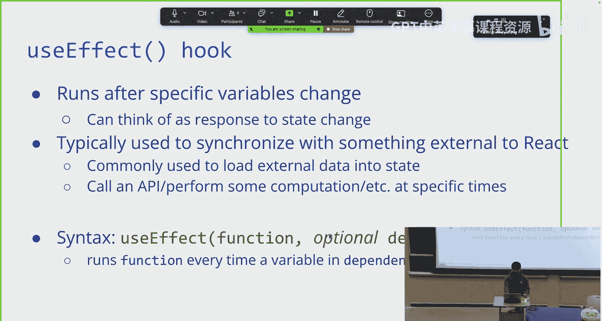

We call this function。Okay， so for example， we have this callback function or we have this function by function that does something。

And then we have three effects here that all look sort of different based on because of the depend theory。

So。This first use effects。And let's assume that V 1 and V2 are states。

My function is called both after the initial render。And after either var 1 or vr 2 is changed。

And this is a pretty common use of use effect。 I think this is probably the first or second most common case of use effect that you might be using。

If this dependency array is empty。My function is only going to be called on the first render。

 or upon mounting。So notice whenever a dependency array is specified。This my function will be called。

Upon mounts。And then if you do have something within the dependency array。

 my function will also be called whenever one of those values changes。

And then the third case is if we have no dependency array。

And this actually changes or this calls my function at every single rerender。So the first time。

 as well as when any other state changes。 So this is just like， it always changes。 Usually。

 you won't see it a lot because。Usually want some functionality or some function to call。

Only when you change some a specific state。So you're only going to see like the first two cases the most often。

Okay， any questions about these three uses of use effect。

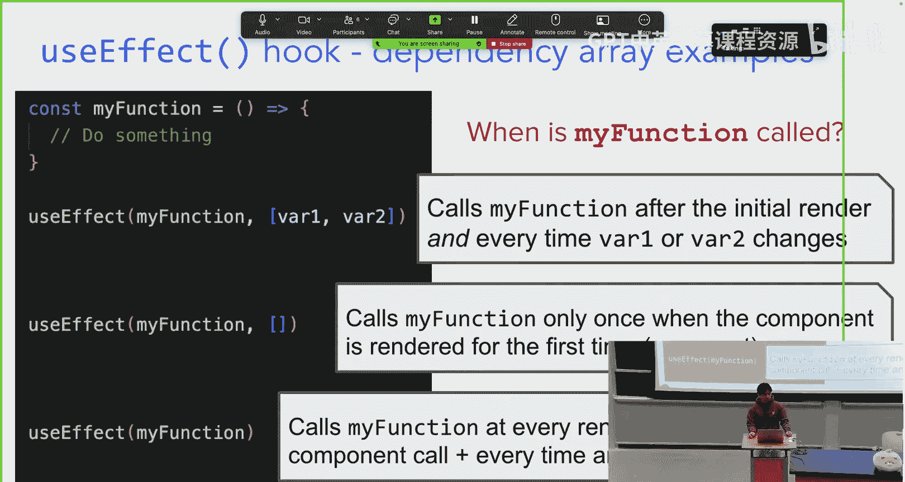

All right， so now。Instead of having the code from before。

 where we try to console log persons right after we do this set。

We can have a use effect that takes in persons， the state as a dependency。

So that anytime persons changes。The function， that's the first argument of the use effects。

 which is this callback function is called。So。If we called the function testing stuff。

It would change persons because it adds me to the end of it。And then it would。

 the use effect would run because it sees that persons has changed。

 and then the console dot log function would be called。at this point。

 because it has the updated value of persons because it knows that it has changed。

Cosilt log persons is going to print the new value， which is the the array with me at the end。

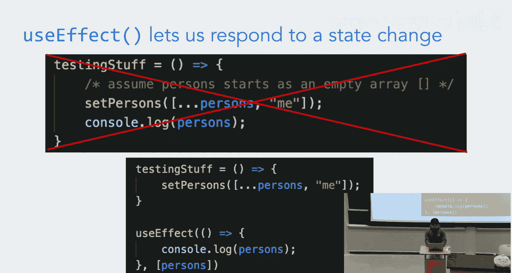

嗯。

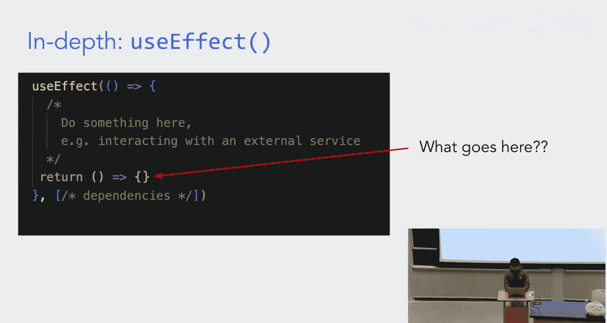

And then one more thing with the callback function that you passed into use effects。My computer died。

Yeah。It's weird。嗯。Like 30 something。

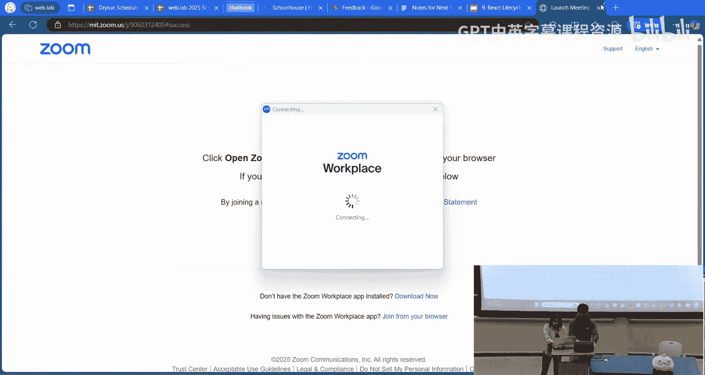

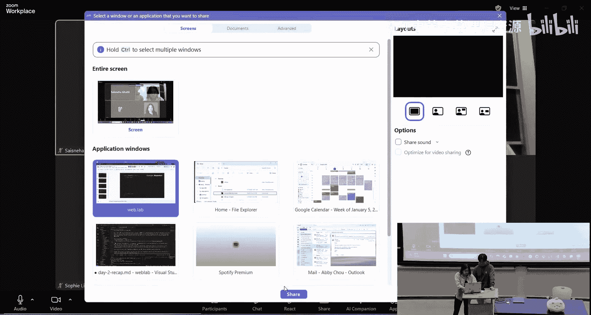

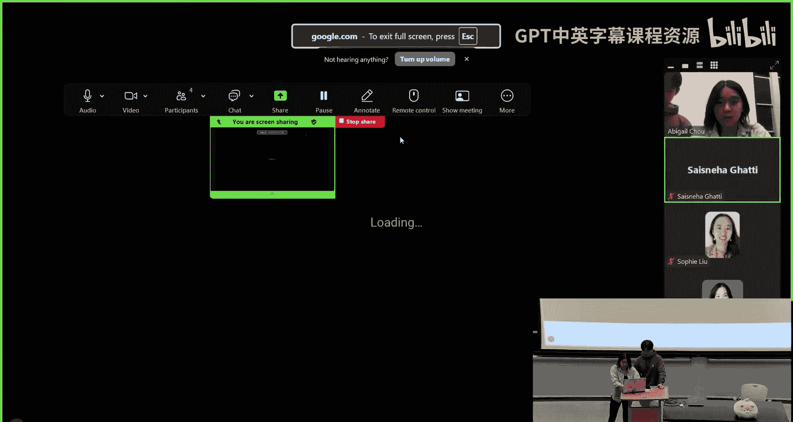

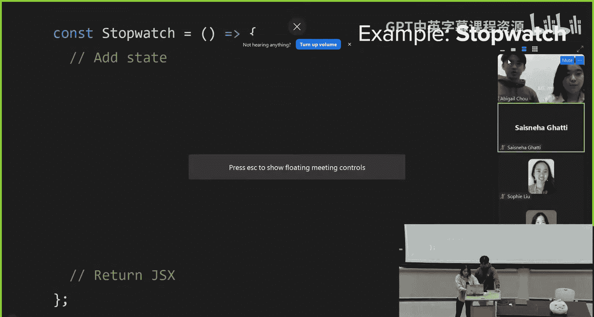

Sorry about that。

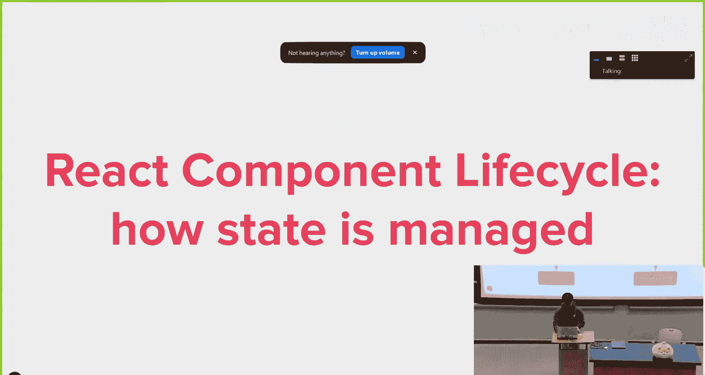

So if you pass a function that has a return statement at the end。

The function at the ends is actually going to be run whenever the content dismounts。

So you can think of it as a cleanup function。Usually。

 it's gonna do something like disconnect from an external service。 if at the beginning of the。

 or at the beginning of the render， when you first mounted， you did connect to it。嗯。

We'll see an example of this。Return callback function being used in a bit。

And this step deals with the dismount part of the life cycle。

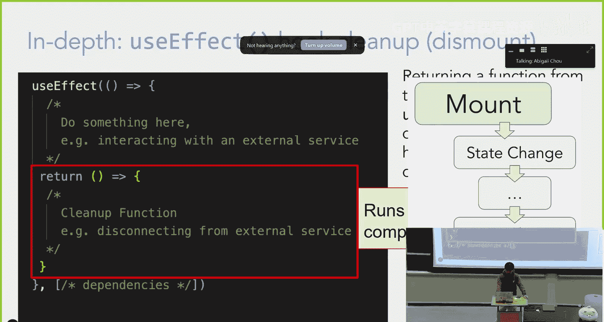

Okay， any questions， I know this is pretty fast。Any questions about like how user effect works。OK。

Here' are some common patterns in react that you might see。That's just， oh， yeah。

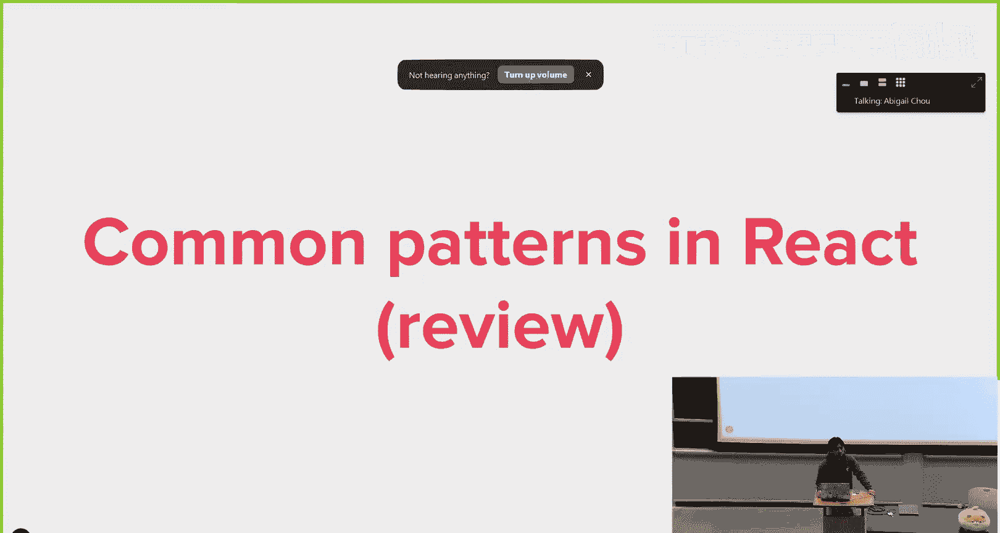

Yeah， so the question is like。How did use effects solve the problem where like。After we set persons。

 like we couldn't see the updated value。Yeah， essentially， like set persons。Is kind of has like。

You're not exactly sure like how long it'll take slash it doesn't run immediately。

 And because of that， like， when we call set persons and then immediately after try to log like the。

The thing that we supposedly just updated， it's not going to have the most updated version。

Whereas if we call set persons and then have a use effect that specifically looks at like whenever the person's state changes。

Then this is going to recognize， oh， once it changes。

I'll have the new value so then I can log the new value here。对。Oh， yeah。

 So dots that persons sort of just like flattens or like takes the elements of persons and like。

Removes like the array around it， sort of。嗯。Yeah， so， so like the end result is gonna be like still。

 a full array of like all the people。 It's not gonna be like one array and then a string or something。

OK嗯。Yeah， so， so one thing that you might see a lot is conditional rendering。嗯。So in JSX。

 we're pretty much like using quote unquote， HTML tags to render stuff。And we can。

Sort of put these elements or reference these elements using these curly braces to escape out of like JSX。

So if we're returning this div and we want to have like both the header header and the content show up。

Even though these are JS X elements， we can still like。

Sort of insert them into this div by using these curly braces。对。So。Take a minute to guess or sort of。

 you've， I think you guys have seen this conditional rendering， but。

Just take a minute to talk to the person around you。 what is this code doing？Like。

Based on the value of loading， which is either true or false， what will it display。

Hopefully you know it when loading is true， it's going to display the first part。

 so everything between these two parentheses。And then when loading is false。

 it'll display everything between the next set of parentheses。

And this is a common structure that you'll see a lot。 We'll have this， like。

Conditional rendering that uses a terernary statement。

Where we have a condition that's gonna to evaluate either true or false。And then a question mark。

And between this question mark and the colon is gonna be what we want to render or return if the result is true。

 if if this condition is true。And then what we want to render if the condition is false after the colon。

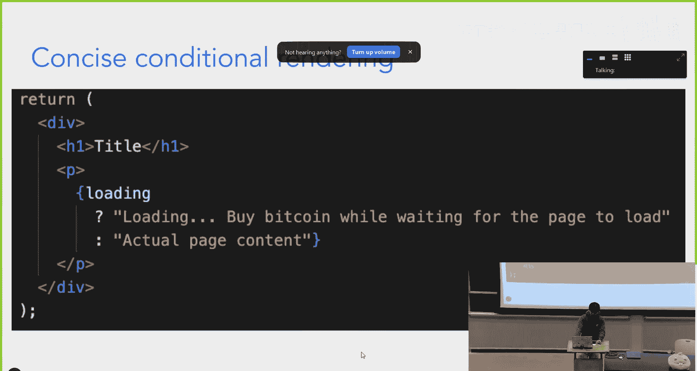

Let's get past that。Another thing you might want to do a lot is render an array of data。嗯。

A lot of the time， you'll be like， you'll have a state that has， that's like an array of data。

 perhaps like a drop on menu， like selections for that or a list of data items in a database。嗯。

You can use the map function that we talked about in the morning， to。

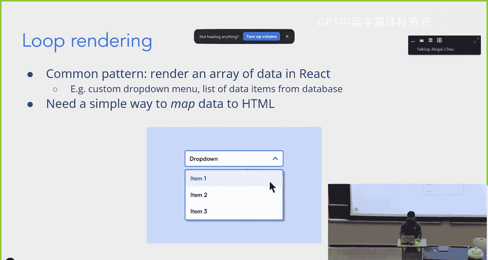

Map elements and arrays。To。嗯。I guess a quick review of map。

 map like takes an element and array or it takes an array and then receives the callback function that takes an element of the array and then returns something else。

 so。We saw in the morning that we could do like Celsius to Fahrenheit and then map all of these Celsius values to Fahrenheit values by passing in a callback function that takes a Celsius value and returns to the Fahrenheit value。

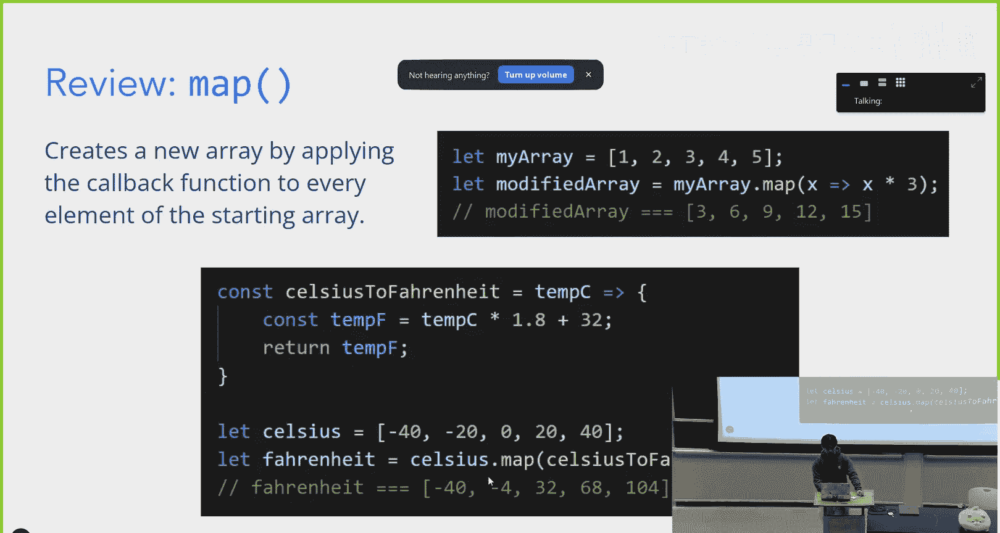

So we can do the same thing or use the same idea。To。Map arrays。That might not。Be like。

 renderable and react。To things that are actually render and react。

 essentially JSX elements like divs。So if we create a callback function that takes like an element of an array like this。

 that's sort of an object。And puts the item name in a div。

And I guess returns like a div with the name inside。

Then we can map the entire array to this array of like divs。

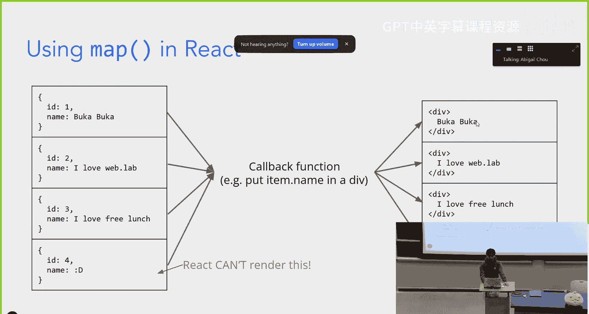

Using the map function。So this would look like。Something like this where we have data。

 which is an array of objects。And then we have this callback function that takes an element of this array and maps it to our returns。

A div that had， that uses like the。The items inside the object。

And we passed that callback function into this map function。

And we call data dot map with the callback function as the argument。嗯。

All this code is essentially the same thing as if we just returned two divs。That looked like this。

And the top code is just a lot more concise， and。Yeah， easy to understand slash。

 You can update the data and then don't have， you don't have to change like the return here。

All you need to do is like add elements to the actual data state。

And that makes that you don't have to like actually create new divs every time your data array changes。

And a quick note about this key。

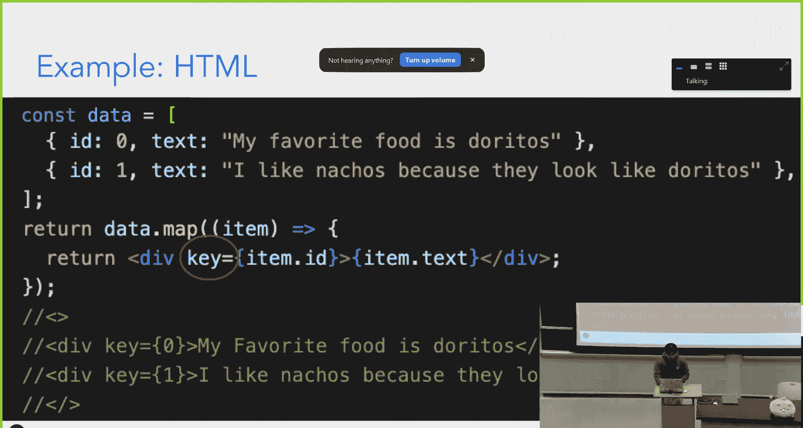

The key is used。

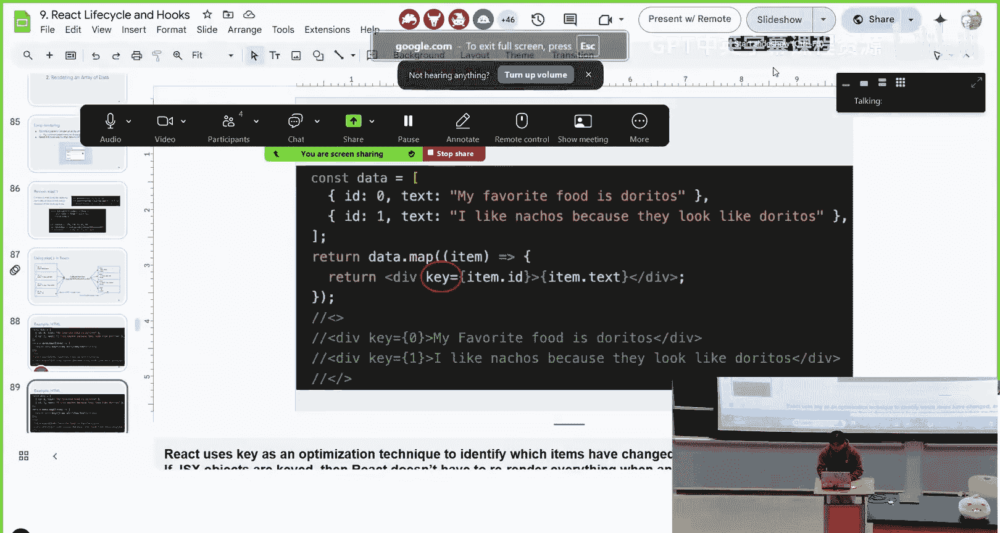

Maybe it's not here， but the key makes it so that if you have like a unique key。嗯。React， recognizes。

 it helps react like prevent unnecessary reruns。I guess you don't have to worry about it so much。

 but you might see it in future workshops。 Try to make it so that all your components inside。

All your J elements inside a component have different keys。

Especially when there are like very similar elements， like comments or like divs and stuff。嗯。So yeah。

 as a quick exercise， like。What would this code look like if we tried to write it without the map？

It's pretty much the same thing as before or the previous slide。

It would essentially look the same as if we had two item components with。The text passed into here。

But instead， we use map so that we can reuse the same， like logic。And that way。

 we don't have to write out each of these different components。 We can just。Take an array with like。

Values that we might more commonly use and then map it to these JX components。

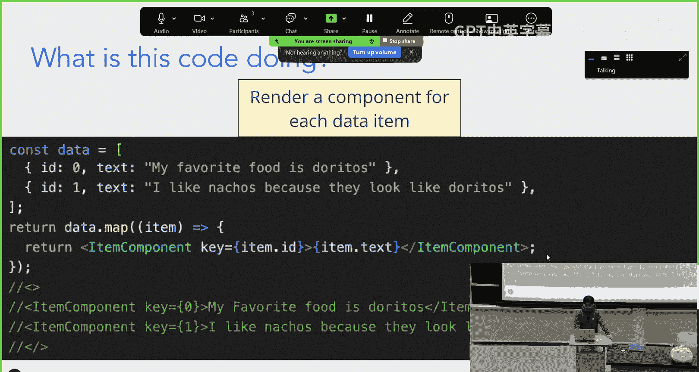

嗯。And then， finally。You might see a lot of like fetching and sending data from a server。

 but we'll see more of this tomorrow。And a few minutes just for questions。

 I think we're running out of time。 So the rest of this lecture will be moved to tomorrow morning。

Any questions about。Maybe those last two parts。Conditional rendering slash mapping。

In JavaScriptscript。If not。I'd be able to give some announcements。

So today is really going to be a lot of recap about react。

 We're going to start with components looking at like the use date hook。

Then we're going to talk about a new concept called the React virtual Dom。

And that leads us into the component life cycle。 I think I referenced the dom yesterday while explaining the component lifecycle。

 I realized I probably should have talked about it before because it's quite important to know in order to have the proper context for the component life cyclee。

And then finally， we'll look one more time about use effects。

And then to combine all of the knowledge that we learn。

 we're gonna walk through an example of creating a react app from scratch and we'll implement a simple timer that uses use state use effects and then has like nestA components。

 everything， everything that。You might see in a standard app will be in that。An app that we create。

 hopefully。So quick recap about react components。Essentially。

 at a very surface level component is a very powerful HTML L element。

You've seen H elements before in day one， we can have like buttons and closes the text click me。

 and it's gonna look something like that。And and react to create。A button in our U Y。

 It's gonna be very similar。The way we do it is we create a function called whatever we want。

 like button that at the end returns some element。And this eventually renders into the same thing that we would see if we did it in HML。

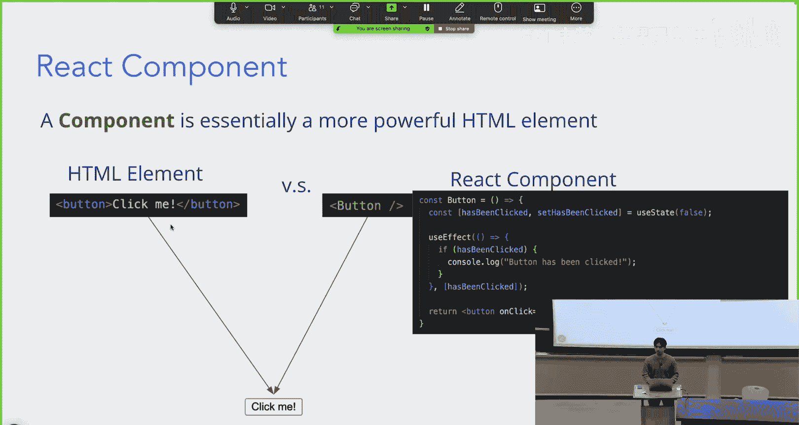

So let's analyze the components of of a component again。First。

 I really want to emphasize that components are JavaScriptscript functions。 They're not classes。

If you ever search up react documentation online， you're probably going to get a lot of conflicting feedback about what components are supposed to look like。

And old react components used to be defined as classes。

 So it would be like class button extends react component or something like that。Nowadays。

 components are always going to be functions， and it just makes react much faster。

 And it's really just the standard now。And it doesn't matter if you use like a callback in the way that youre this is being defined。

 or if you do something like function button with the open and closed parentheses。

 it's gonna mean the same thing。And then the other key part is that components use JSX。

 which is similar to HTMLl， but it's not exactly HTMLl。

One key difference that you might have seen before was that instead of class， you use class name。

And then also inside JX， you can escape and have JavaScript code， whereas in HTML。

 you can't really do the exact same thing。And the components are powerful because within the component between declaring it and then。

Telling you what's a render， we can have a lot of complex logic。

The most common piece of logic that we'll see is storing state。

State is like a piece of memory that resides within a component， and。After renderers， state persists。

 So that makes it so that we can have like a consistent piece of memory。

That we can do other stuff with， for example， using the use effects hook that we saw yesterday。

And this is something that H T L just like， really struggles to do。 It's very。

 very complicated to like， have state and H TM L。嗯。And yeah。

 this is one of the main reasons why react is so powerful。

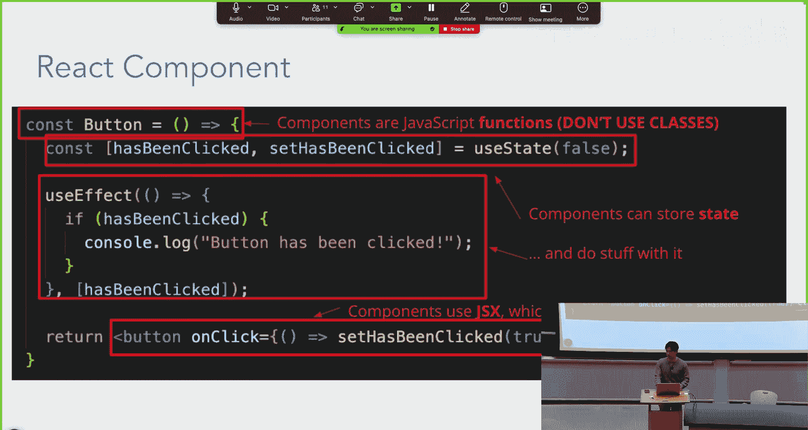

So looking at the use state hook。Hopefully you're familiar with this by now。

 We have the state declared here。 We have the state' set function declared here。

This is an array with two elements。And you state with an initial value with whatever you want it to be。

 evaluates to an array with two elements where the first ones to stay。

 the second one is to set function。 So this is how you create a state and react。

And now let's take a look at the bottom of the component where we return。

So components are always going to be made up of JSX elements。

 which are pretty much like the HTML elements， as well as other components， only these two types。

So what this means is that if you sort of think of like a component。Being a parent。

 And then its children are all of the elements that are rendered by it。

All of its children are either going to be JSX elements and components。So recursively。

 if you go all the way down a tree。Eventually， all the leaves should be JS X elements。

 You shouldn't have any components in the leaves。And yeah。

 so react is really powerful because you can nest components within other components。

In this simple example， we have like the button that we saw before being nested inside a form。

And to render the form。What we do is we first render this JSX element， which is a header。

That just looks like that。And then we recursively render any components inside this component。

 So we recursedively render button。And button renders as just the JSX element。 That's button。

So it looks like that。And the the key things to remember is these components are all functions。

When we render something， essentially， all we're doing is running the function that defines the component。

 So when we render form， we're running this entire function。 And at the end， we're returning a value。

 But to determine like what this value actually is。We have to resolve what the value of button is。

 And then。Going to the definition for button， we have another function that we run or call。

 and then we get a return value for that。And then we get that return value and place it where this is。

And then we keep propagating up until we can get a full return value that's not consisting of any components and only JSX elements。

Any questions so far。O。So。Remembering this nesting structure， let's now visit the react virtual dom。

Previously， we've seen react component trees， which is like a tree structure that shows the relationships between parent and children components。

And notice that this tree doesn't have any JSX elements。

 And that's just because we usually only care about the relationships between components because between components。

 we're passing down props。 And that's where a lot of our like logic and the app is gonna to be in。

We don't care a lot about passing down props or。Or I guess passing down values into like JSX elements because usually that's a lot more surface level。

So our component trees are going to be all components。Whereas react。

 virtual doms are going be different where it's going to be all JSX elements。

 And we'll see that in a bit。Let me first explain what a dom is。 It's a document object model。So。

The way to remember is it's a model that shows or represents the objects that comprise of a document。

So what is a document， Well， a document in the context that we're speaking in is just like the website that you see or the web page that you see。

 So this is probably like an H TM L like。If I open Google， for example。

This is a website and all these HTMLM L elements。Can be represented using a Dom format。

At the very top， we have the document， and then we have the H TM L root element。

 and then we have head and body。As we saw before， and then had his title and so on。

And we can sort of。More cleanly represent this as a tree like this。

The Zm isn't exactly the same as H T L。 Z is just， I think， like a more general。

Sort of data structure。 But you can use dom to like represent H TM L。And。Similarly。

 you can use Dom to represent your react components。So react creates a virtual dom。

Of all of your components， whenever it renders to the website or to the browser。

So virtual Dom is virtual because react uses it internally。

It's not exactly the same Dom that gets displayed on the browser。 The browser has its own Dom。

But we'll see why react wants to keep track of its own dumb or its own virtual do and。3 sections。So。

 to create the virtual dom， essentially just recursively renders each component from the root。

And then。Like， let's say component X has these JSX elements。

 but then also calls or has this component A nested in it。

Then component A probably resolves into these five JX elements。

 And that's how we get this virtual dumb for the component X。Okay。

 so hopefully that's enough context now for us to talk about the component lifecycl。

There are three steps or three phases。The first is mounting。 The second is updating。

 and then the third is dismounting。 So think of it sort of as like。

The first and third third steps are like opposites of each other。

 And then the second step is like a phase where we're just sort of in a limbo and like repeating。

Sometimes you'll see thismounting called unmounting online。But， yeah。

 so mounting is the process of adding a component to the dumb or the virtual dumb。

So let's say our virtual do initially looks like this。Mouning is a phase where we add a component。

 let's say component A to the virtual dom that it now looks like。This。

And then updating is whenever we still have the component。It's not gone yet from a virtual dumb。

 but we changed parts of it。嗯。And these are caused by triggers which cause re rendernders。

 which cause the virtual dom to change for that component。

 which causes the entire virtual do to change。So this is usually when or the phase that our components usually stand。

Oftentimes， we have like a state that changes within a component。 And every time we change the state。

 it's not like the components dismounted and then mounted again。 It's just updated。And react is that。

 So it doesn't have to like do all the work of dismounting， mounting， dismounting。

 mounting every time a state or prop changes。And then the last step is dismounting。

 which is when it actually like is removed from the react virtual dome。O。

So I want you to take a minute to visit this website again， weblab restaurantrantacku app。com。

And I'll pull it up。And see if you can like identify the places where componentss being mounted where it's in the updating phase and then where it's being dismounted。

So for the second of time， I'll just go through it。就就后尾。

I guess provide evidence that it's actually being mounted， slash just mounted。

I'm going to right click and then press inspects and then go to El。

This shows us the browsers HTML that it's rendering。

And I'm going to expand the steps so that we can see all the inner components。A the inner elements？

Okay， so now I'm going to press the order S button。And notice that this div appeared。

 The div wasn't here earlier， and this is probably indicative that the component that this is being rendered by just got mounted。

 and it just got added to the Dom， which is why it's showing up in the HTMLL file。

So pressing this button triggered。The mounting phase。

And then now when I press this new button inside the component。

My guess is that state is changing within the component， which is causing。

The the component to be in the update phase。So it's rendering every time I press this button。

And then finally， when I press delete steak， notice that this st is going to disappear。

And this is pretty good evidence that now that component was just dismounted。And。Actually， yeah。

 I'll just leave it at that。 Any questions about that。O。So I have a question。

There's a word that I'm looking for， but。Does anyone know what causes a component to enter a different phase？

Theres a word that was brought up yesterday。Yes。Yeah， exactly。

 So the term that we use to like describe all the events that cause the component to enter a phases triggers。

And these are the most common triggers that you're going to see。

So the first is whenever you open up a website。React is going tell you to like render the root element。

 which is usually like app or something。 And then it renders all of its children。

 which renders So like all the components render in the very beginning。

And that's called the initial render。And that's when a trigger is going to happen。

 because a lot of these components are being mounted。

And then another case is when one of its ancestors rerenders。 and we saw this with form。

 a form and button where button was a child of form。Whenever one of your ancestor rerenders。

 all its children are gonna rerender， and then all of their children are gonna rerender。

 So eventually， if it's your ancestor， then you're gonna to also rerender。Now。

 there are ways of avoiding this。嗯。As you might suspect， this is pretty expensive。

 if we just wanted to change like a state inside the app component。

 that would mean that we would have to like change all the children components。

 which seems pretty expensive， not good for responsiveness and stuff。So in the future。

 we'll see different callback functions or sorry， not callback functions。

 different hooks that can be used so that we don't have to re every time an ancestor changes。

And the two most common things that you'll see， at least in the scope of like an individual component is that when one of its states changes。

 it's going to rerender。This is going to be a trigger。For rereing。

As well as when a prop that's passed from a parent to the child changes。

Or from a parent to itself changes， then it's also going to render。

A lot of the times these cases are the same。A lot of the times from parents。

 you're passing down states of the parent as props so。When the state of a parent changes。

 that causes the parent to rerender， which causes you to rerender。Which is the same thing as when。

 or it happens at the same time as the prop changing because the prop was a state that was being passed on。

O。So what's the term for creating the virtual do each phase， Does anyone know this。

I've said it a lot of times in the lecture。对。Yeah， yeah。 like rerendering or rendering。

 I guess the question wasn't too clear， but yeah。Like rendering is just essentially。

Running the functions or running the components and creating all the JS X elements that。

It's comprised of。So。We've looked at rendering before， but just again， if we have this sort of。

 this is like a component tree。If we suppose that a state and inspiration generator。

 this component changes。That's a trigger that causes this component to render。Specifically。

 we look at the state where or we look at the component where the state resides。

 We don't go up all the way into the tree to rerender the entire app。 That's too expensive。

 So react looks at where the state resides so that we can render or rerender as little as possible。

So we look， we see that the state resides in inspiration generator。

And then because its children are here， they need to be rerendered as well。

 So that's a trigger for them to rerender。嗯。哎，你啊。I think we've seen this a lot。And last question。

 there's one more keyword for when react transfers the virtual dom to our browser。

Does anyone know what this is？Close or serving， yeah。It's similar to that。

I think it's like the same meaning。 It's anonymousonymous。Anyway， it's committing。Yeah。

 so committing is just like。Essentially， it's taking the diff。And hopefully this diagram helps。

It looks at the real Dom， which is owned by the browser。So Chrome owns like its own dom。

 which it uses to like。Show the HTML L， or create the HTMLl。And then react has its virtual dumb。

And these are like the JSX elements or whatever。 But you can see them side by side and compare them。

And during the commit step， react will look at the difference between these two doms。

And then identify the difference or the places where they're different。And。

All of the places where they're different is called the diff。And then react is pretty smart。

 It knows that all it has to do is only modify the parts where it's different。

It it's only going to modify the real dom objects inside the diff。To have the new updated values。

So if if this was the old real dom， the new real dom will just reflect whatever the virtual dom is。

And this concludes the last step of， like， react。Sending stuff to the browser， like rendering stuff。

And then once the real dom changes， there's a last step called painting， which the browser does。

 which converts this real dom to HTMLML。 but that's not too important。So the takeaway is that。

We can sort of look at the component。 the components's lifecycl is three phases。Mouning。

 updating and dismounting。And then these transitions are marked by three steps。Something happens。

 which is the trigger。Which causes the render。Which creates the react on。And then。

React takes the react dom， compares it with the real dumb。

 and then commits the changes essentially to the real dumb。So between every transition。

 we see a trigger render and commit。But at a broader level， we have these three phases。

Does that clear up some confusions about。The life cycle from yesterday。Any questions。OK。

And then really quick recap of views effects。嗯。Use effect takes into arguments， or use of effects。

In broad terms iss a hook that does something when an event occurs。

And we usually place it at the top of an element underneath U state， but above everything else。

But yeah， a use effect takes two arguments。 The first being a callback function。

And the second being a dependency array， that's optional。

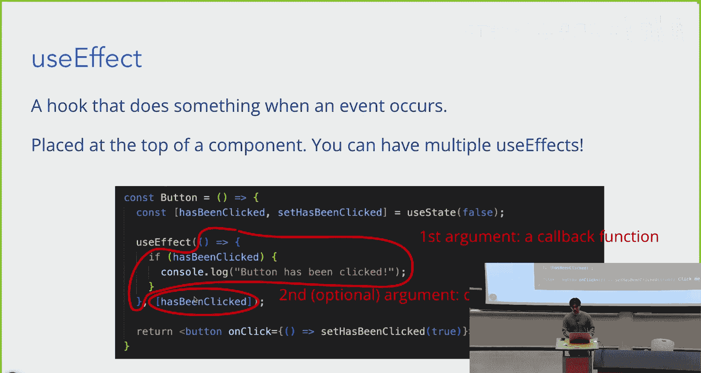

And。I've changed these， like。The， the terminology is here。

 But hopefully this makes more sense now that we know the life cycle， but。

For this use effect where we have a dependency array of two states， v 1 and var 2。

This callback function， my function is called on the mounts of the component。

As well as every time the states var 1 and var 2 change。

 essentially on every render or render where var 1 and var 2 have changed。

And the second use of use effects where we only want it to happen on mounts。

Is just passing in an empty dependency array。Which means that this function is only called once at the very first surrender。

And then if we don't pass in any dependency array， this means that this function。

 by function is going to be called every time the component renderries。Okay。

 any questions about use effect。And we'll play around with it。

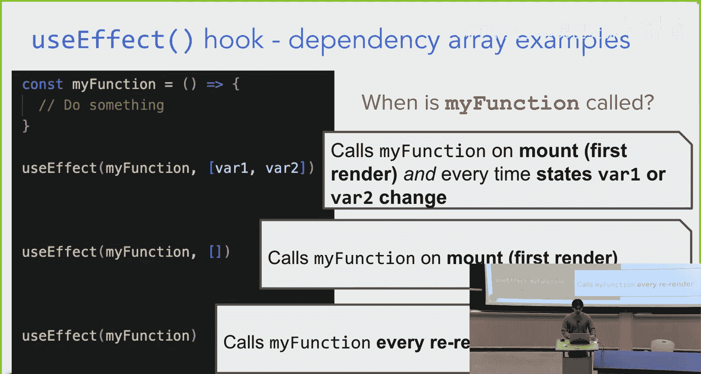

I will skip past thisEssential use effect is。Quite useful， because。

Suppose that we have like a lot of complex code that we want to execute only once once a component is mounted。

Like the first time。We could just use use effects。 And then what type of dependency array would we want to pass it if we want it to only happen once upon mountain。

还有问。对。Yeah， exactly。 We would use an empty dependency array so that all the hard work is done done only on the first mount。

And another reason why it's useful is because， as we saw in the example from yesterday。

 like set functions First states aren't exactly like intuitive because they don't happen right after they're called。

So if we do this。Where we like append values to the end of an array。

The state's not actually going to be updated。 It's not going to have me at the end。

So the better way to do it is have a use effect that takes。Persons as a dependency， and then do some。

Functionality with that。Okay， I think I can run through this in 10 minutes。O。Hopefully。

 this is helpful。But I w to show you guys how to create a blank react app。

 because you guys have like the you guys have seen the workshop code， but you don't。

You might not know exactly where it came from。And。One second。I'm just going to change the screens。

Okay， so。I'm just gonna do it on my ends。 You don't need to follow along。

 It's probably better if you don't follow along so you can actually see what's going on。

But I'm gonna create a blank react app and then implement a stopwatch that looks like this where we can topgg all the clock。

 And then the time just runs every one second， it increments。

And this will state use effect everything that we learn。So in my terminal， I'm just going to create。

Or runy commands。嗯。Sorry， one second。

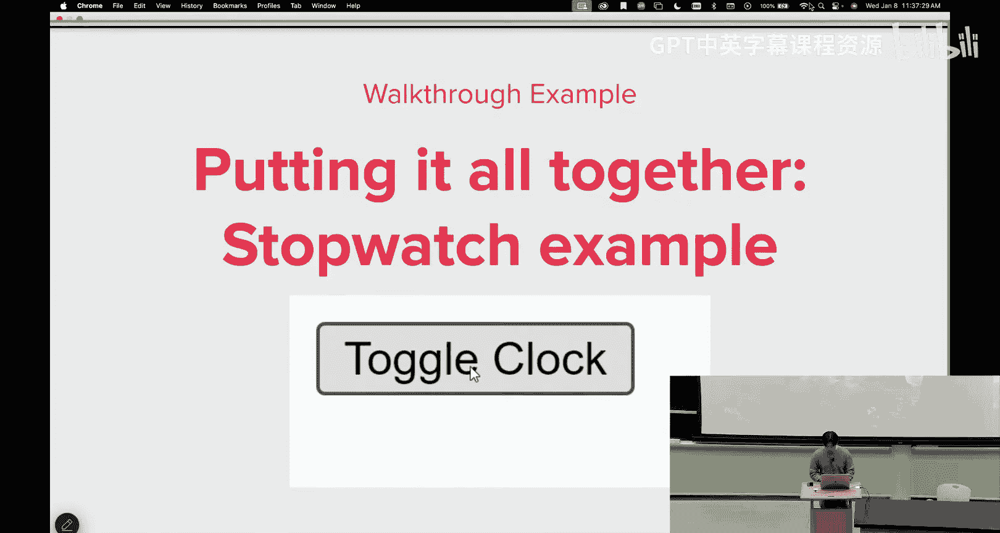

二个。Here。Okay， there we go。So in my terminal， I'm going to run NP PMM creates Vs at latest。2。嗯。

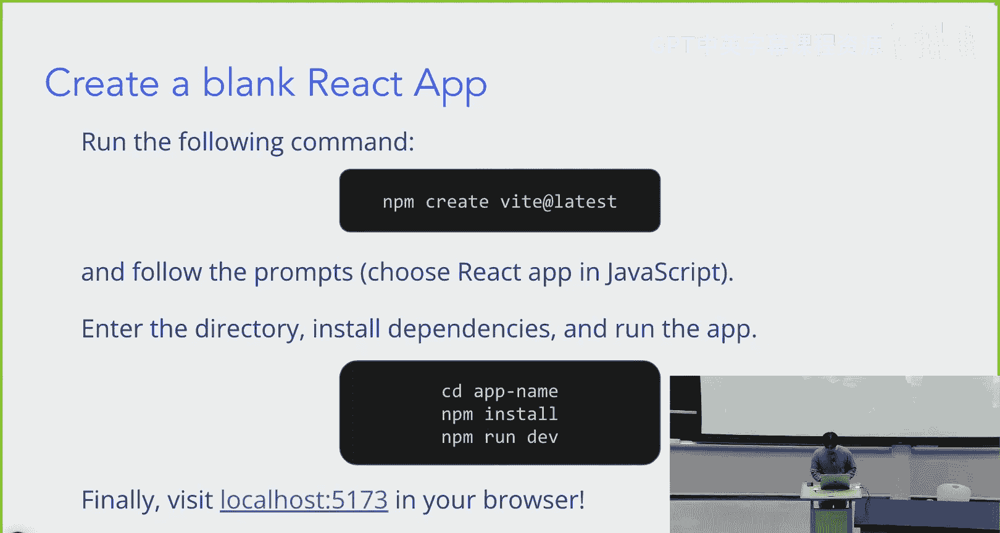

Okay， you guess。Okay， so in some random directory， I'm running NPM create V at latest。

VIt helps us create react appss。Project Da， I'm just going to call it test2。Select a framework。

 I want to use React。I'll use a standard JavaScript React project。

And then now if I look at my directory， I see test 2， so I'm going to change directory into it。

I see that it's populated with a lot of files， it's great。And then。I'm just going to open up， up the。

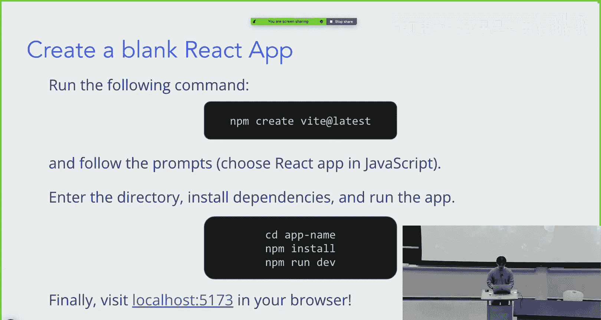

The code no。

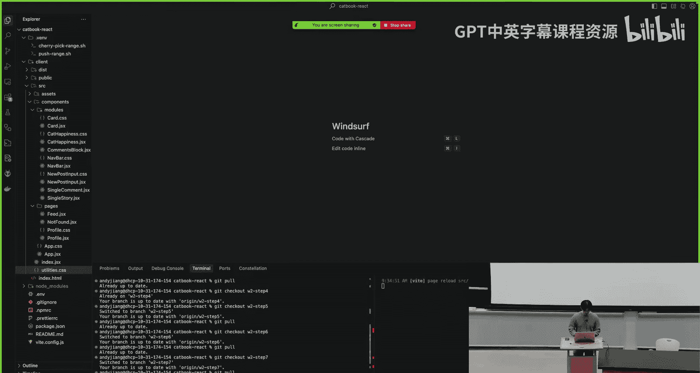

应该 see that。Okay， so I'll open up a terminal。First step。

 whenever you create a new project is to run MPM install。You guys already did that with Kabook。

 so you probably don't need to for a long time。In the meantime。I'm going to open up app。jsX。

And main dot Jx。嗯。And what's really important to see is that in Maine。Actually。Even higher up。

 I'm gonna go to index by Htl。So anytime you like create a react app， essentially。

 it's serving an HTML file， as well as lots of JavaScriptvascript files to define like how to let like manipulate that HTML file。

And it's so abstracted that the only JavaScript file we're passing is main do JSX into this HTMLl file。

Now that I have installed， I'm going to run NPM run dev。And then in my。Local host 5173。

 I should be able to see。This blank react up。嗯。Yeah， so if I right click here。

And then look at the H L。I can actually see that this is the same exact index to HTML all that I'm sending over that I have in my code base here。

And it has the same source equals source， maybe not JSX。

So this tells us that all the react logic is being。嗯。

Somehow taken from main dot JSX and then put into。This HTML file。So how exactly is it doing it？

It's taking or react takes the document。And then finds the the I D or the element with the I D root。

And if we look here in the HTML here。The div。That's like the innermostive for body。

Is actually the one with I D root。So what that means is。嗯。React is creating a root within that div。

By finding the div。And then rendering。The app component。

So this is the connection point between react and H TMl。

You don't actually have to deal with this a lot or actually ever。 Once you know this。

 you can comfortably。Understand like， okay。I know that my app is being rendered。

 So all I have to do is change how app is implemented。

 and then I can render whatever whatever I want on the website。So that's what's happening right now。

 We have all this。Code here that I'm just going to get rid of。I'm also going to get rid of the CSS。

I'm going to create a very simple timer。And I'll just put it inside app。

First step is going to be having a time state。嗯。So， maybe I shouldn't do this。

Let me create a new file called stopwatch。jSX。Inside here， to define a component， I just say cont。

 stopwatch。Equals。A callback function。Inside this callback function， I'm going to have some JSX。

And then at the end of the file， I have to export defaults。Stop watch。Sorry， this is so fast。

But here to render stopwatch， I'm just going to go import stopwatch。From。The same directory。

 and then I'm going to return stopwatch。OK。So if I refresh this page now I see high， which is great。

Let me get rid of this。This yes， is inside main。不。嗯。Yeah， what I eventually want is this。

I won't implement the toggle for now。 I'm just going implement the stopwatch。

And the first step is to create a state for the time， because this time is gonna be displayed to。

呃The UI。So constant time， set time。Equals u state。And then the initial value is 0。 So I put a0 here。

It's yelling at me because it doesn't know what you state is， so import you state。

And then I always just press the first option because it usually does it fine。

So what I want to happen is on the first render， it starts incrementing the time。Now。

 there's two ways to do this。 and I'll show you the fast way to do it。嗯。

I'm going to use the use effects or first off， let me。Just like render your time。If you。Yeah。

 you see here， it's just always gonna be0 because we're not actually setting it。

But now let's create a use effect。So the first argument is a callback function。

And the second argument is a depend theory。I'll import use effects。Oh， thanks， yeah。

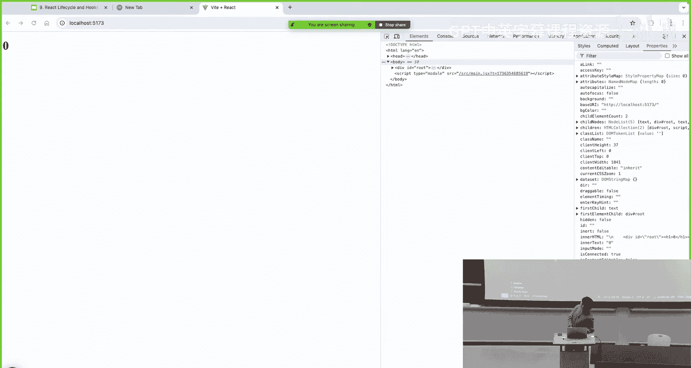

O。So， yeah， I set， I have a use effects。 and I'm gonna use time as the dependency。

And this is a function that you haven't seen before， but it's， or you probably haven't seen before。

 It's set anderval。And it takes in a callback。As well as a time。

And essentially all it does is like it runs this callback after this number of milliseconds。

So inside here， if I did like console。 log higher or whatever。

 it would like print this after 100 milliseconds or one second。But yeah， inside of the set interval。

 I want to。Somehow update my time or increment my time。And to do that， I have to use my set time。

 I can't just do time plus， plus or something。I do set time and then time plus one。

Because I take the old value。Add one to it。And then set that to be the new state value。

If I do this now。The timer is working fine。Let's explain what this is doing again。

I have a state that's initialized as zero。So when I refresh the page， it's going to start at  zero。

And then every time time has changed， as well as on the first mount or the first render。

This callback function is run。And this callback function runs or calls set interval。Which。

After one second。Runs this callback function。Which sets the time to one more than it used to be。

So on the first render， time is going to be 0。It's going to run this callback function immediately。

 because it just mounted。And then it's gonna wait one second and then set time to 0 plus  one or one。

And at that point， because time has changed to one now。

The component is going to rerender because one of its states has changed。And。

The use effect sees that one of its dependencies time has changed from 0 to 1。Which then。

Runs his callback function again。And then it sets time to2。

And then it see the time has changed again。 So it sets time to 3 and so on every time with 1000 milliseconds between it。

Which is why。Yeah， which is why we see the timer commencing by one every one second。对。

I've run over any questions about this though。OK。Cool。嗯。I guess I don't have a slide for it， but。

You can look at the completed code here。This uses a different implementation。

And you can also read the recap。 I， I guess this entire lecture was a recap。 Yeah。

 if you want to fill out what b dot is slash feedback， that'd be great。

 And then we'll get started with workshop too。

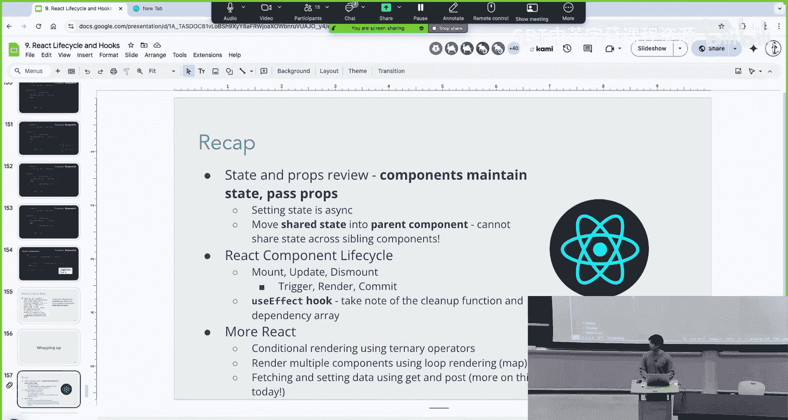