# 《Web开发快速入门｜6.962 Web Development Crash Course IAP 2025》中英字幕 p12 -12-MIT web.lab (6.962) - Day 3_ APIs_Promises.zh_en -BV12Ux5zTE9p_p12-

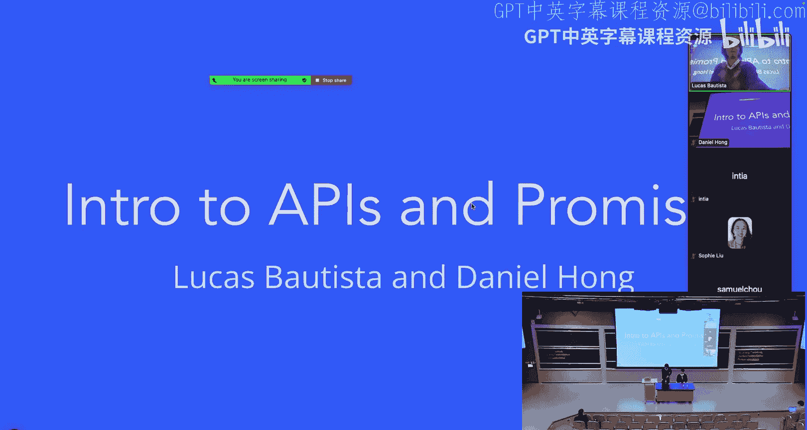

Now we're going to get into APIs and promises。So currently our techbook is static。

 there isn't any information showing or using the fact that we're different users， so I mean。

 unless you hard coded it， I don't think it says your name， it says like Shannon Wu or something。

And also like every time you click， you get like some number。 but then whenever you refresh。

 it just resets back to zero。 And if you look to our posts， they're all the same for us。

 and maybe we'd want some kind of data that is specific to each user。

And so that's where the backend comes in。Backend is used for data storage and data manipulation。

 So our front end would send requests to our backend。

 and our backend would send whatever we findd information that our front end wants。And so。

We're going to be using the client server architecture， so currently you guys are the clients。

 the browsers， and you guys will be sending requests to some server and after the server receives your request。

 it's going to send back a response back to you the client。And basically。

 the server is just where we have all of our information。And so right now。

 whenever we're doing NPM run dev， the front end is being served to you。 So all the H T M L。

 CS and Javascript it takes to render your website is all sent from currently a server， but。

It's not necessarily sending any data back to you guys yet。So we'll be working on that。For that。

 how do we actually send requests to a server。There has to be some standardized way we can't just send an email to a server asking for data。

 we can't like telepathically ask a server to send us information。

 So there has to be some standardized way of sending information or rather sending requests from a client to a server and then receiving a response that we can access。

うん。And so。The protocol that we'll be using is HTTP and basically what HTP stands for is Hypertext transfer protocol。

 and you've actually been using HTTP requests and responses every time you request a website or I don't know。

 you want to like load a specific video from YouTube。

The way that you get all that information is through H TP requests。And H TPS， S is just H TP。

 but secure。 So all the information that's being sent back and forth is。Is encrypted in some way。

 And so people who are in between you and the server can won't be able to actually decipher what your request has。

 So it's safe from anybody trying to。I don't know。 modifyify your request in some way or receive information in a malicious way。

So right now， we're going to be going over the structure of an HTTP request。

So we have the request target， plus parameters， HTV method， headers and body。

And to give you guys like， some kind of motivation to like， why we care about this structure。

 I'll give you guys an example。So。If we were to， let's see if I can。

If we were to send a request to YouTube to show us any videos that have weblab in its description or in the video。

 then we would be sending this URL into our browser and I'll talk about them many ways to send HTTP requests later。

 but just putting a URL into a browser is one of them。So here we have。A YouTube request。

 It's going to be a get request since we want to get data。

 We aren't posting data to a YouTube server。 So that'd be like。I don't know。

 Uping a video to YouTube， which would be a post request。 We have some metadata， and then。

Our body of HTP request would be empty because it's a get request。

 And so now we're going go into the nitty gritty of an HTP request。So first。

 the target URL and query parameters。So HtTPS just tells us that well。

 the protocol that we're using to send a request is HtTPS。Next。

 we have W W W dot YouTube dot com slash results。 And that's the URL of a server。

 So this is where we're sending our request to。Generally。

 YouTube would have like some kind of megacomputer with like a bunch of data storage and。

We are you sending it to the computer with that I P address。

And then slash results just tells us that。So so the YouTube。

 the computer or YouTube is gonna have like some kind of endpoint where we would send requests specifically for searching specific YouTube videos。

 So here in this case， we have the videos with the search query being web web labb so。

If we just sent a request without any query parameters， we wouldn't receive any YouTube videos。

 but this search query helps us refine what data we want to receive from our server。

 our YouTube server。Wai， any questions for move on？Now， okay。So H TP methods。

 So there are many types of requests to send to a server。Of them， their get requests。

 which gets data。 We have the post request， which sends data。We have the put request。

 which places data and the delete request， which deletes data。For this class and。Mostly in general。

 you'll be using get and post requests for sending and posting data。 I mean。

 receiving and posting data。嗯。Yeah。Questions。Alright。

 so now we're gonna look into the request body and request headers。

So the request headers for H an HTTP request is all the fancy stuff that comes with the information that we want or information that we're sending to our server。

For example， if。We're sending some data to a server， and we want specify O。

What's the time step of this request？Like， what language is this request in。

 All that metadata about our request is stored in our request headers。Then， our request body。

Is where we put any data associated with a poster request。 So， for example。

 like if we want to post a YouTube video into servers， YouTube server。

 we'd be sending a YouTube video through the request body， however。For get requests， again。

 like four。We put whatever parameters we want in our target URL。

So an example of a request body would would look like this。So a request body uses a Json format。

 And basically what a Json format is， is just。Like。Key value pairs。So。Sorry。

You can see that for a name or a name， a key of name。

 we'd have a value that's actually a name and language， specific language。

 so this is how most of our data is going to be organized and that is how the request body is organized。

So now that we've covered how request is structured。

 we're going to look at how a response is structured。 so let's get into that。So。Status codes。

So whenever we send a request to a server， the server is going respond in some way and。

An example would be the dreaded 404。 so this means that the resource that you were looking for could not be found。

 and this can happen if I't know you put in the wrong URL or maybe the resource you were looking for was move to a different endpoint so you'd have to look through the website's documentation to see where you could find the information that you're looking for。

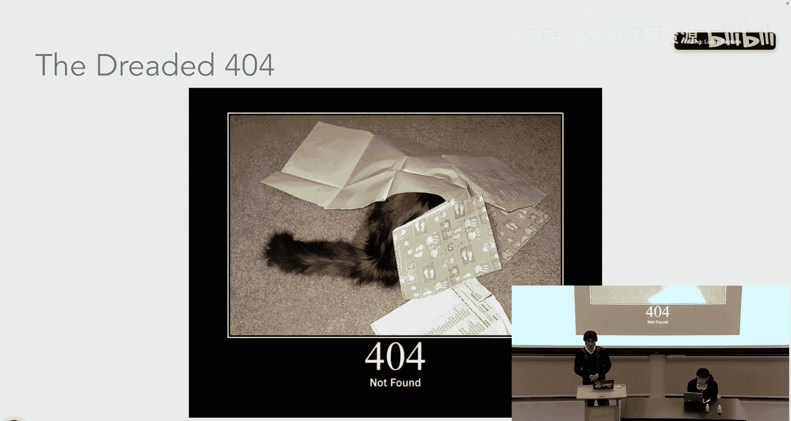

Another common error is 400。A bad request。And this could happen if， I don't know。

 you malform your query parameters， so。Put a query promote that maybe doesn't exist for the data that you're looking for。

Or， yeah。And then。Another common one is 500， and 500 means that。I dont know。

 the server aired out in some way。Yeah， so it's not your fault。 it's the server's fault。And then。

You have a 200，200。 It's good。 You your request reached the server， and it was handled correctly。

And so generally， like the hundreds place of your error code signifies like what kind of code error code it is。

 If it starts with a one， it's informational。It starts with the two， you succeeded。

 such as the three， you got redirected， such as the four， you do something wrong。

 and then start with the five， server does something wrong。And usually you'll be seeing2，4 and 5。

 and maybe some threes if your website uses caching。That's the response body。 Any questions。阔。2。

I mean， sorry， that's status codes。 So now let's look at response headers and response body。

So the response headers like request headers， just a bunch of metadata about a request。

 and usually you don't have to worry about that stuff， just content type， content length。

 boring stuff that we don't care about。Then we have the response body。

 So the response body is going to hold all the information that we requested from our server if we sent a get request to server。

 unusual。Whenever we have a post request， like if we're posting a comment onto catbook or something。

 we'll probably send it back just to confirm that this comment was actually posted on our website。

And again， this is also in JSON format。So， that's the response。哎。Questions。

And so I mentioned earlier that there are many types to， I mean， many ways to send requests and。

well actually just like go into a Ke example to see like how these requests are sent from a website。

 So you guys don't have to do anything， but。Letsay。Excellent。

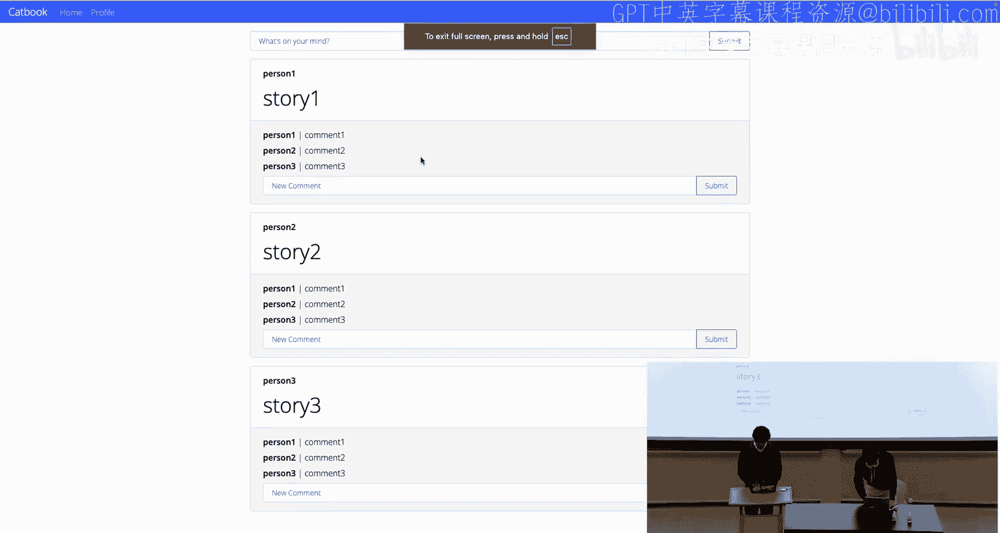

It's go to Catholic。Capbook dot example， or actually weblab is slash example。

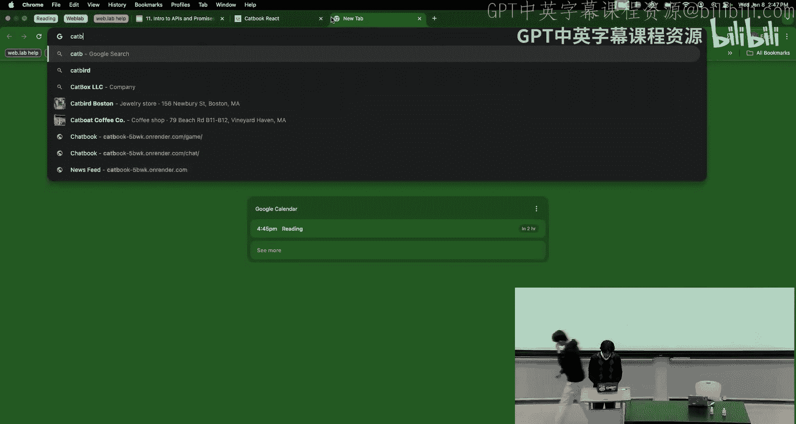

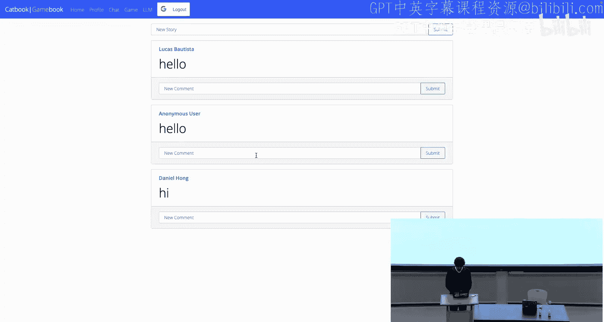

Let's see if I can screen share this。

Okay。I'm sorry for the Zoom people who can't see this。O。

So if we open up inspect tab and then go to network。

Network is where we see all the requests that our website makes if we request。

YouSee all these requests， requests to P And Gs， requests to the comments， requests stories。And。

If we actually click on one of these， let's click click the one that represents our stories。

You can see that it's a G request because we want to get our stories。

 the URL is going to be the server that we're using。

 This is not the capbook that we're implementing right now， so it's a different server。

And we can go to response。 you can see that this is all in JOM format。

So that's just a cool way if you guys want to mess around in the network tab too。

See more about requests。O。Let's see。 I need a screen share。嗯。Now， another way to send requests。

 like usually you're sending requests through your browser。 can just type a URL。 Well those are all。

 those types of requests are all get requests since you don't have any space to put。

All the information you would like in a post request。We put stuff in the。The request body。

 but there's like no place to put stuff in the request body for a URL。

 So there are other ways to actually send post requests and。

I think like an interesting example of another way to send a request is through your terminal。

 like you can do it independent of your browser。 So if you guys like。

 you guys can open up your terminal。And just run curl， H T TPS。WWW dot Google。Dot com。

 and you'll end up getting a bunch of H TM L， C S and ja that represent the website for WW dot Google dot com。

 And you can see， we have some H T L up here。 And then like this is badly formatted。 It's all ja。

And so that's just another way to send H TTP requests。And then， finally。

The way that you guys will be sending H TTP requests will be through JavaScript。

 So I'll give you guys like a second to parse all this。

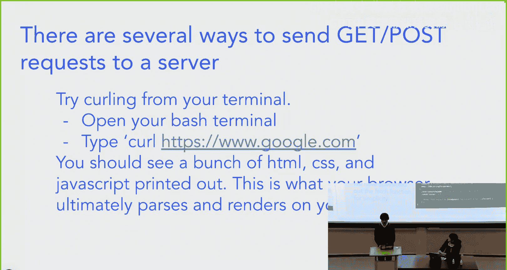

But essentially what we're doing is we're using the fetch function in JavaScript to send a request to some server and we abstracted out the fetch function so that you can just put an endpoint and the parameters for get request and。

For post for both the get and post requests。And this is how you'll be requesting s modifying most of your data。

 and you'll be using it in workshop 3。So I'm going to pass it on to Daniel so they can go over APIs。

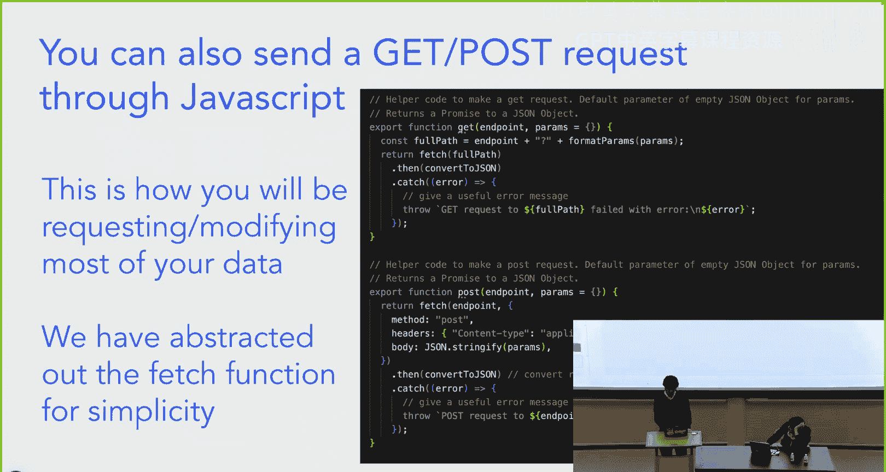

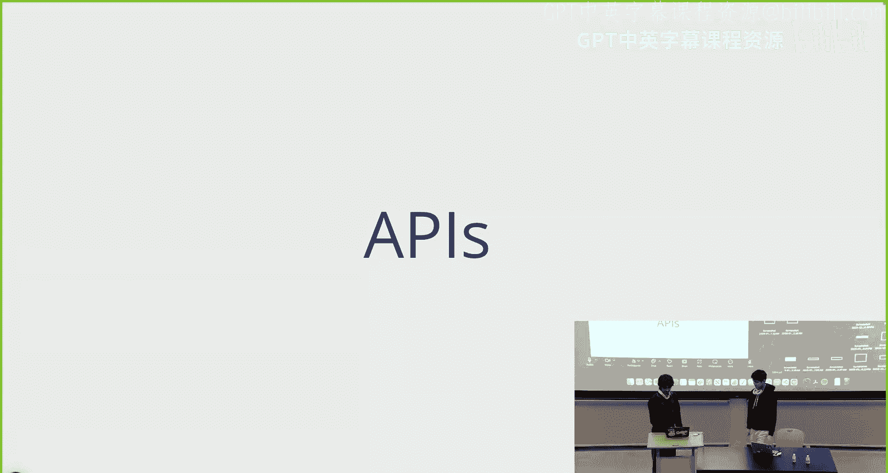

way。Second。In just in。

Because' okay。有完了就是。Yeah。Hi， everybody。Hi， I'm Daniel， and I'll be talking about APIs。

So API stands for applicationplication program interface。And in summary。

 it's basically a set of endpoints that some service provides that allows you to make requests to that service in order to perform a function that might sound confusing to you。

 but I'll give a few examples right here。 And then like it I think it'll make a lot more sense after I like explain the examples。

 So a lot of companies provide APIs that you can use to。

Essentially incorporate into your own website。 So just as an example， the Google Calendar API。

Our Web blog website。At Weblab do M T dot ED actually uses the Google Calendar API to display all of our lectures。

On the on our on our course calendar。 So we just have a Google calendar that we update and then the website automatically pulls from that Google calendar and updates our website。

 So the way that we do that is by using a Google calendarendar API that Google provides that our website is then able to use。

To display our calendar， another example is the Amazon selling partner API。

Let's say you wanted to incorporate into your website a way for you to essentially buy a product on Amazon。

嗯。Then you could do that by using the like Amazon API to incorporate like like some sort of Amazon interactive portion of your website so that if you're selling some product。

 you're able to click some buttons on your your website and it kind of like shoots off some Amazon order for your website。

 And then lastly is maybe an open AI L M API。 So open AI provides a bunch of APIs that you can use online where essentially you can send it some request and it'll respond with some data So maybe you send it some random request for like help me with my math homework and then it responds with like some。

OfResponse with。That like answers your question basically。 And there's thousands of APIs online。

 Some free， some cost money。 Like， I think the open AI1 may might cost like some amount of money per query that you have。

 But like in general， like。They are there to help you be able to do things that maybe are really difficult to do or impossible for you to do on your own。

Yeah。So the purpose of an API， you're going to need to access data or something or like do something things that maybe your website doesn't have access to。

 and the servers won't just let you like for example， Google。

 they won't just let you look directly into like their servers and be like oh what's going on over here like oh。

 and then you'd be able to just kind of look at every single user。

 potentially in their database and that would potentially be a security nightmare because you could maybe just like look at everybody's password and be like。

 oh， great， I can just like log into my friend's account now and do whatever I want。

But what they do provide is a way for you to interact with that data by doing predefined functions that they give you。

So yeah， so that's what APIs essentially are。 And now you can basically do whatever you want or not whatever you want。

 But kind of a lot of things just by asking the right people and in the right way。Yeah。

 so as Lucas talked about already。We are working in kind of a client server model。 So far。

 we've only coded our client in workshop 2， but we're going to be coding our server in workshop 3。

 which will respond to our client using。Using HTP responses and sorry requesting responses。

 So you might imagine that your client sends a get or a post request to your server and then your server responds with an HTP response。

That server is eventually going to be connected to a database which will store data that your server needs。

 and so that that data will persist forever。 even if your server crashes。

 it'll able to be able to retrieve that data still because the data will still reside in that database。

Now， let's imagine that you wanted to connect like some APIs to your website。 Let's say。

 like Google Calendar and， open AI。 and you want to interact with both of these。What。

 what your what the essentially。Like the things， the I don't know。

Responses and requests will look like is that your client will send。

These responses through your server， and then your server will forward those responses to the APIs。

Which will then be able to like， respond。Back to your server and your server can then respond back to your client with like the response that it needs basically being like。

 hey， you ask for this from the API。I got that from the API and now here， I'll give it back to you。

 Yeah， And so your code is basically responsible for everything in the client。

 the server and database in workshop 3， we'll basically be talking about how to get this client and server interaction going。

And。Yeah。So what is the purpose of the server， You might ask。

 why can't this client just directly interact with the database and directly interact with the APIs。

 Well， in our model， the client is kind of like the browser。

So if your client was able to directly interact with the database or the other APIs。

 then that would mean that like when you inspect element in your browser。

 you would be able to see everything that is going on。

Which is kind of a problem because then like maybe you will be able to see like， oh。

 here's my API key for this API。 And like if you're writing a website。

 you don't want users of your website to be able to see all of like the potential like keys and like database passwords and stuff like that that you're using。

 So you kind of want this server that you manage and then clients are able to like request and respond to your server basically。

 So the server is kind of your code that you control whereas the client is kind of like。

The client is going to be users of your website that you might not be able to control exactly what they're doing over there。

Yeah， so the easiest way that you can think of is just like going in an inspect element and like changing some stuff around on your website。

 Like， that's not changing what's going on in the server。

 but it's changing on what's going on with a client。Yeah， so as Lucas already mentioned。

 whenever we access a URL， you're making a request to an end point。 So just some examples。

 these are from our example website。 We have a get request for all the stories。

 a post request for a story， etc cea， etc cetera。 I think I'm just gonna skip past this part。嗯。Yeah。

 so。We're going just look at one quick example。 How much time do I have left okay。嗯。他们是他们。No， okay。

Okay， no。Okay， so here's the YouTube API。Ba， okay， I won't go over the example。

 but I think in the slides， you can just kind of look over it and I think it's decently hopefully kind of self explanatory。

嗯。When you have an endpoint in query parameters， those query parameters will get formatted after the question mark each following。

Like key value pairs。 So yeah， the colors are just mapped to the same color。

 Hopefully that makes sense。Yeah， here's an here's some examples of some really cool APIs that you could think about incorporating into your own website。

 I already went over a few of these， but。😊，You know， like the dog API。

 you can just like query for like cute examples of random dogs。 Yeah， I I。

 I would encourage you guys to look over these and maybe some other online API lists to like an example for maybe things that you can incorporate into your own website。

Okay， yeah。 so we've gone over how， like。嗯。These。API request work in if you just like write it out into your URL。

 but you can also do these in JavaScript。The way that we do this is using the get and post functions that Lucas talked about。

Basically， whenever we。嗯。Instead of。Sorry， the first。

 the first parameter of the get or the post function is generally just the end point that we want to query。

 And then it's followed by whatever parameters that we want to use。

 And then the get and post functions will actually just。Do all the work for you。

 It'll send a fetch request for that URL。 So basically you can think of it as these functions are doing the dirty work of actually filling in the URL and filling in the body of it for you so you can just fill in the fill in the URL and fill in the parameters and that's all you need to worry about。

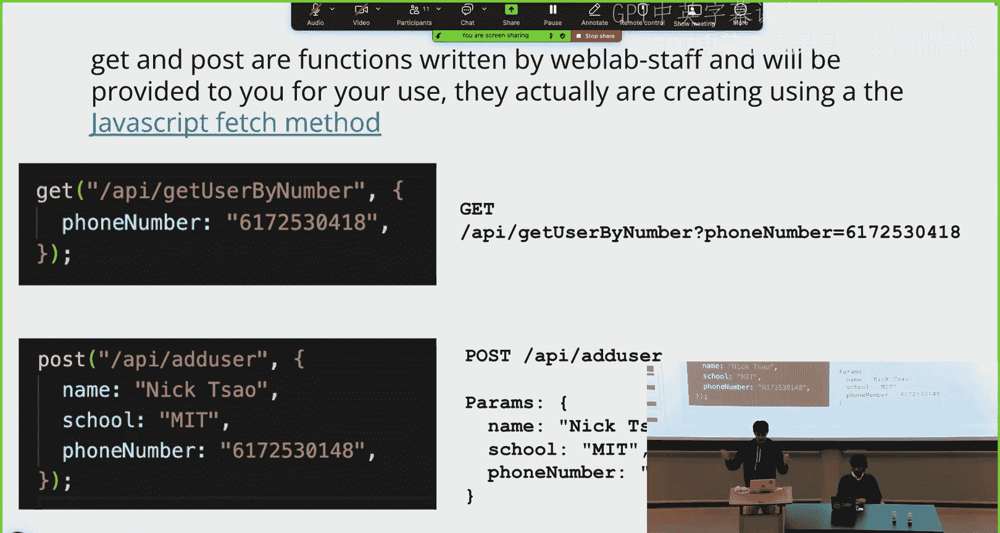

O。

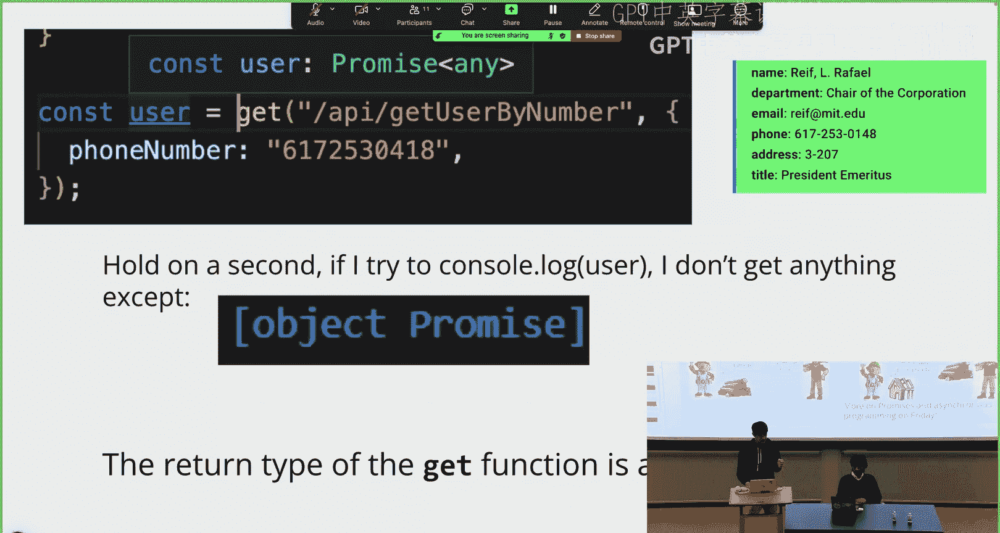

也是。

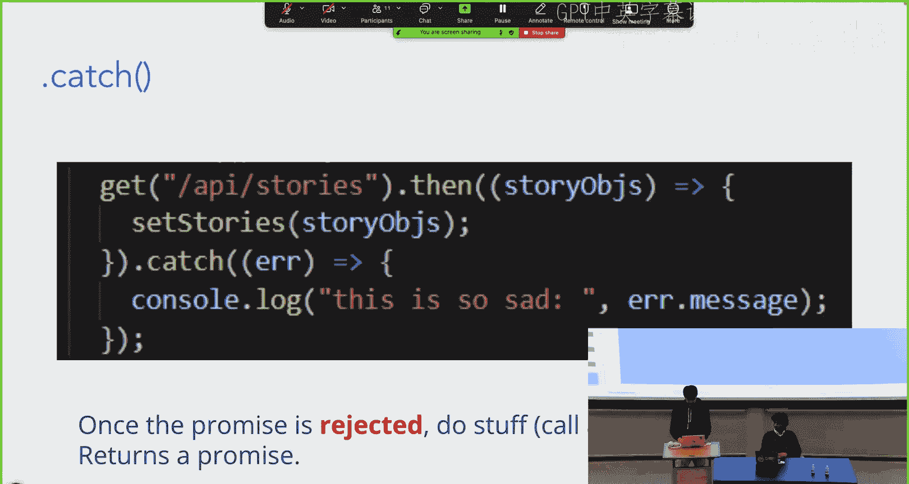

Okay， can you go to the announcement slide？Wheres that？Alright。

 could you guys open up the feedback link and give us feedback。

 We'll give you like one minute to do that。没有事。

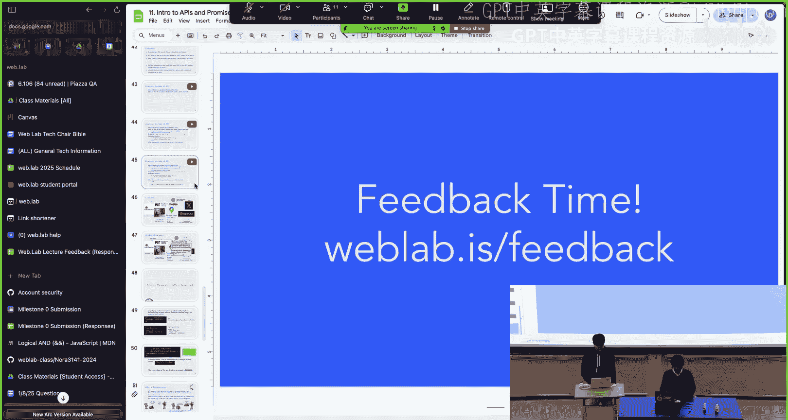

Yeah， while you're doing that， I can show you guys something cool from the example。

If you look at the answer here。It should work if you copy paste into your own browser。So if you like。

 just do it here， you'll get the response that。Let me zoom in a bit。

You'll get the response from the YouTube server that tells you that is essentially listing out all the playlists that we that we requested and we use the Webla。

 YouTube for the request。 So if we just take this I D here， for example。

 and then we go to YouTube dot com。Slash playlist。And then list equals。

 and then we've copy paste this in here。We'll get the I P 2025 playlist from Webla。 So yeah。

 that's pretty cool。 I think， yeah， this should work on your own computers， too。

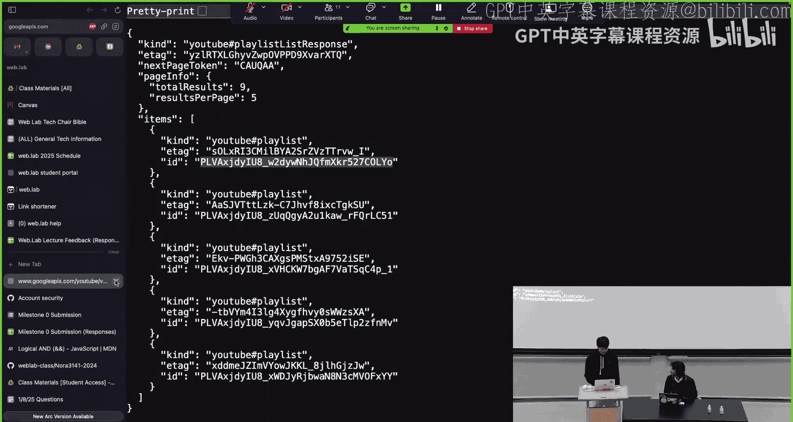

O。