# 《Web开发快速入门｜6.962 Web Development Crash Course IAP 2025》中英字幕 p13 -13-MIT web.lab (6.962) - Day 4_ Servers & Node.zh_en -BV12Ux5zTE9p_p13-

Great， hi， everybody。Hope you had a wonderful night's sleep and are ready to start the day with some。

Apis。And promises， yeah。So we're gonna continue with the slides from yesterday。

 and we're gonna start with。Making requests to APIs and JavaScript。

 we briefly talked about this yesterday， but I just want to go over it because I think the end of like lecture yesterday probably went kind of quickly because I was trying to get through like as much as possible。

So。Yeah， so basically。Once we hop into the code in workshop 3， we're gonna be writing get requests。

 not from get post requests， not from like， like URLs， but rather from。

Using these get in post functions that we have written for you。In ja。

And what that will look like is you feed in an end point。And then， a set of parameters。

And forget requests。Your parameters will be put into the URL。For you so that it will request。

The endpoint using those query parameters， which are put in the URL。呃。And then for post request。

 it will also do the intended thing， which is put your parameters into into the body of the post request。

So it'll post to that endpoint using the parameters， which are like in the body， basically， yeah。

And we'll， we'll like review this a little more。 but basically get and post requests have like these two different formattings。

 which is why。You， when you call these functions， don't actually worry。

 have to worry about these two different formatting。 But you should know that under the hood。

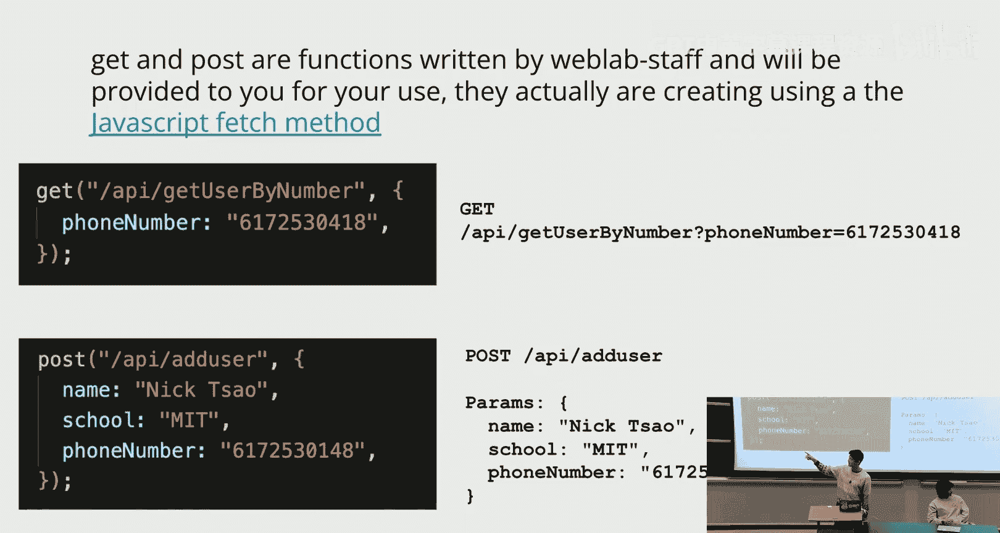

Like some slightly different things are happening， basically。嗯。Yeah。Okay， so。

Once you like get into the code and then you like try typing out like something like this where you get from an endpoint。

And maybe like generally， you can hover over like any variable and figure out what type it is。

 You'll see that like this user variable that you get back from like the the get request is a promise anything。

 And you might wonder like， you like， what is a promise And like。

 let's say you try to console log user you， you would just get like this object promise thing。

 which doesn't actually mean anything。Yeah， it turns out like these get functions return a promise。

 And so what actually is a promise。嗯。Basically， these API requests。嗯。Might take a while to resolve。

 And so if like the API request had to return the result。

 and the client had to wait for the the entire time。

let's say the API request took a second to an entire second to resolve。

 Then the client would just be sitting there for like one second， like not being able to do anything。

 waiting for this function to complete。So the promises allow the clients to do things while the server is like taking its time fulfilling the request。

For example， maybe they want to render the rest of the front end and then like put a loading icon there。

 like some circularrcly thing that's spinning until， oh， I got the data。 Now I can just put it in。

Yeah， let's say Bob， the builder is like trying to build a house。 And then he's like。

 needs more wood。 He asked the lumberja， can I get more wood and like。

The lumberja comes back with some wood。 He like had to go chop down some trees。

 So it took him a while。 But in the meantime， like like Bob did not have to like wait the entire time。

 just like sitting there doing nothing， right， Like the promise allows the lumberja to be like， okay。

 I'm going to， I'm going to work on it rather than Bob being like， okay。

 I have to wait for like the lumberja while I do like nothing basically。😊，Yeah， and were。

 we'll talk more about this on Friday。Yeah， okay， but for now。

 let's see some examples of how to use promises in JavaScript。So the first way that you kind of。呃。

 process。Coode with promises is you use something called dot then。

 And so what this does is it takes a promise。Or more like you use dot than on a promise and。It takes。

A callback function， which takes whatever the result of that promise is and does something with that result。

So what this will do is basically get API slash stories。 It returns a promise。

 but that promise is going to eventually resolve into some story object， basically。And once that。

 once those， once that resolve into like those story objects。

 then you can set like set stories to story objects。

 Imagine set stories is like some like use state thing that we have。

 We can now like set our state to like story objects， basically。嗯。Yeah。Any questions here。够。嗯。Okay。

 yeah， and then the second。The second way that we have to deal with promises is using a dot catch。

Sometimes the promise is not going to resolve into。呃。Like， it's not going to result successfully。

 Maybe slash API slash stories is not actually implemented in the API。

Then like if you tried to like get slash API slash stories。

 you're gonna get back like eventually an error。 First， you're gonna get back a promise。

 And then that promise is going to resolve into like， hey， like。

 I wasn't able to do this because I just simply do not have the resources or like maybe I just like messed up in the meantime。

 and like I air it out whatever reason it is， like the promise can reject。 And in that case。

 you like the dot cash will will basically catch what happens in that case。 So。

And then you're able to feed in a callback function。

 which takes in whatever error it does and does something with it。 So here， if the promise rejects。

 then it'll print out this is so sad in the message of the error。Yeah， so you can see generally。

 we use a dot then and then potentially a dot catch to catch whatever errors might occur。有。过。呃。Yeah。

I think I'll skip this example。

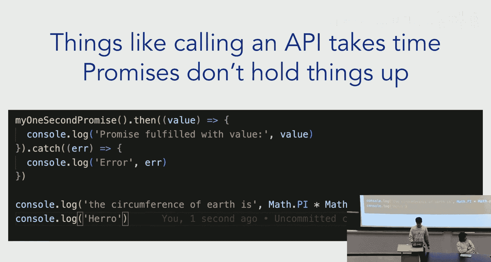

OK。Oh。And not honest。Great point。为有。

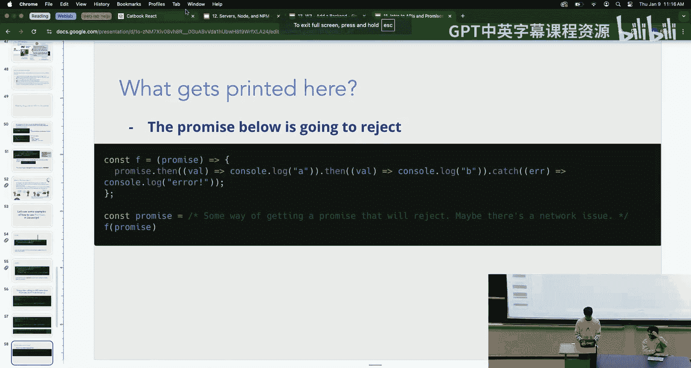

什么样子？O。

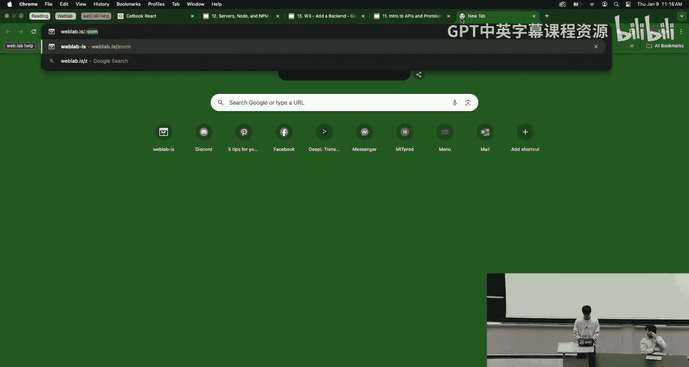

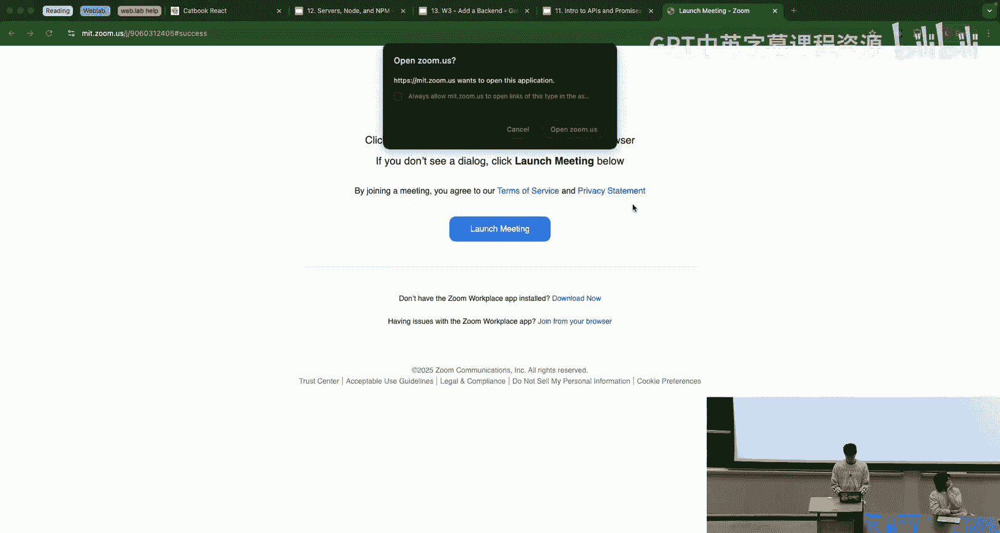

Hi， Zoom people。 I'm very sorry。H。Yes。Just a quick summary of what we just talked about。

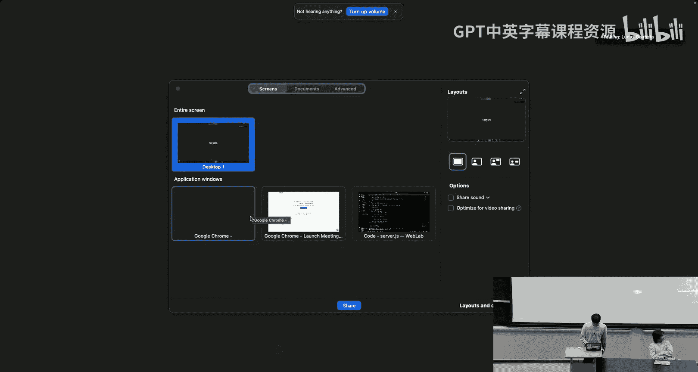

嗯。So， we went over。The basics of making， making。

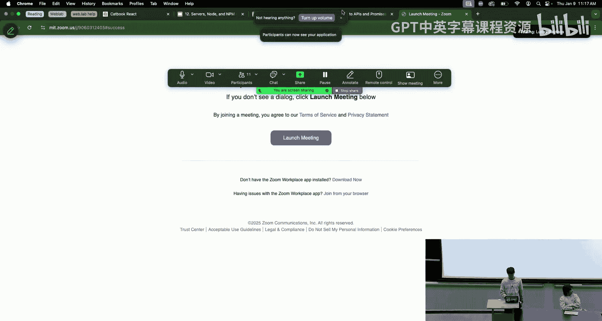

AI requests in jascript。 And then we talked about promises。

 which is essentially what API requests will resolve to。

 And you need to wrap promises around these like we talked about how you need to wrap promises around these like dot then and。

Dot catch。Keywords so that you can either process what the result of the promise eventually resolve to in the case that the promise does resolve。

 or you can catch and do something with whatever error or the promise。

Happens to give if the promise fails。嗯Yeah。呃。Hopefully， the slides are。

 if you have any questions about it， like feel free to ask in the questions talk。

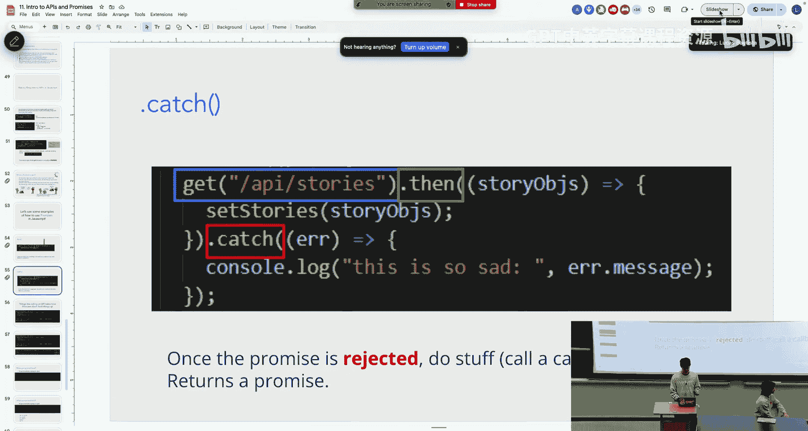

Okay。

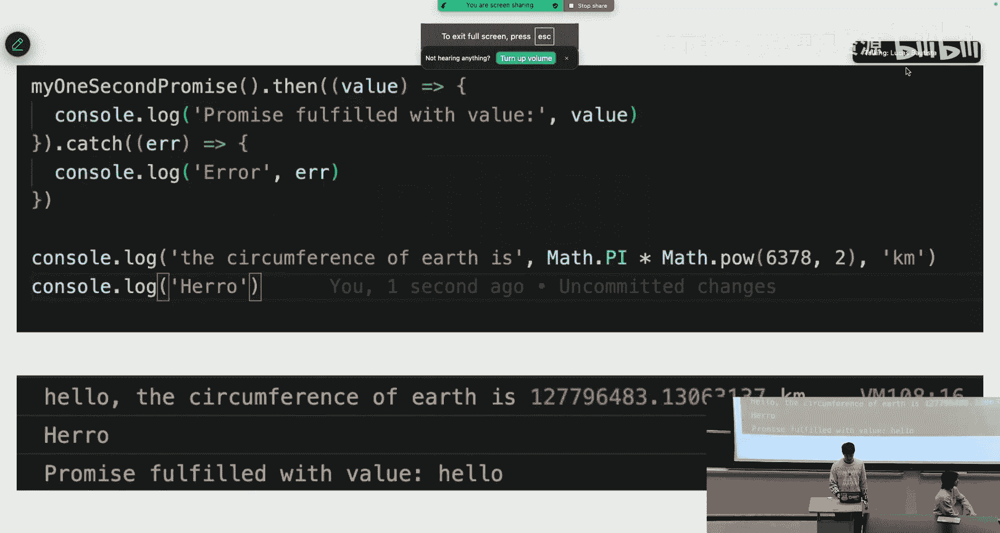

Oh， shoot， sorry。 I I accidentally just like gave the answer if my bad， okay。Yeah， so。

Let's go over this example。I realized that the code in on the slides is like kind of hard to read because the color scheme is like kind of bad。

 but。If you need to pull up the slides on your own computer， feel free to do that。嗯。But yeah。

 what gets printed here。 Let's say the promise below is going to reject。

Where we have like this constant promise， and then。Yeah， this is like really hard to read， actually。

 But let's say we define this con promise。 and we， we know that it will reject。

 Maybe there's a network issue or something like that then。Hold your hands up like finger， like 1，2。

3，4， or 5。 if you think like。You are going to get the first answer printed out。Then you raise up one。

 if you think here， we've get the second answer printed out， then  two， etc cetera， 3，4，5。Which。

When do you guys think it will be put it up。I'll give you guys a second。呃，O给呀。Do people have like。嗯。

An answer。I see a few fours。Yeah。O。Yeah， so we are going to get。The fourth one。

 we're just going get the error because。When the problem is resolves。嗯。It's going to reject。

So we're not going to be able to process any of the dot ends。

 which will only process if the promise succeeds。And therefore。

 we'll skip straight to the dot catch at the end， which console logs an error， basically， yeah。嗯。

Yeah， so。Let's look at this example now。 Let's say the promise below where we define Kant's promise is some with getting a promise where we know that it's going to resolve after a little while。

 Let's say that the promise results after。One second or something like that。

Then when we write this code。嗯。Which ones which one of these choices are we going to get。

I'll give you guys like again， like a little bit to think about it。Yeah。

So basically like the code here。Promise not then will cons log。If we get a value。

 then we'll con log A， and then from there。If， if we were able to successfully do that。

 then we console log B。And。嗯。In the process， if we call any error， then we will console error。

 basically。Really。哦。Is it working now。这个呢。O。Okay， yeah， if people want to。

If you've have some guesses。Hold up one for if you think the first one' is gonna be printed out。

2 for the second one，3，4， and 5。 Go on。I see some。A few different answers。 I think I see like2 and 5。

 the most。呃。Let's look at the code。So。What， what exactly is going to happen。 We'll run F of promise。

嗯。And。When we run F for promise， we're not going to wait for this promise to resolve necessarily。

 We're kind of just gonna send it off and wait for， And whenever the promise resolves。

 then like the rest of the body of F is going to run， basically。So。While we， after we call F promise。

 we can immediately move on to the next line， which prints high there。And then。

If the promise was always after like maybe a second or something like that。

 then we'll get the rest of the output from F。So。Yeah， we're going to get the second output。

 which is high there and then A and then B。

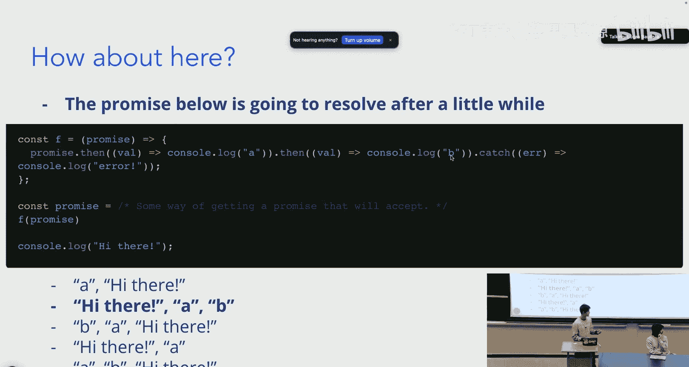

过。Okay， yeah。 so that'， that's it for this lecture。

 I think we were just finishing up slides for yesterday， so。

We'll just move on to the next lecture now， wherever that is。Co， yeah， in the meantime。

 you guys can take one minute to do web love do slash feedback if you want。

 if you didn't already do it yesterday or if you wanted to like give more feedback， yeah。

While will you transition to slides。All right， can you guys hear me。Gs hear me in the back。Okay。

 cool。 Alright。 So now we're gonna go into servers and node so。

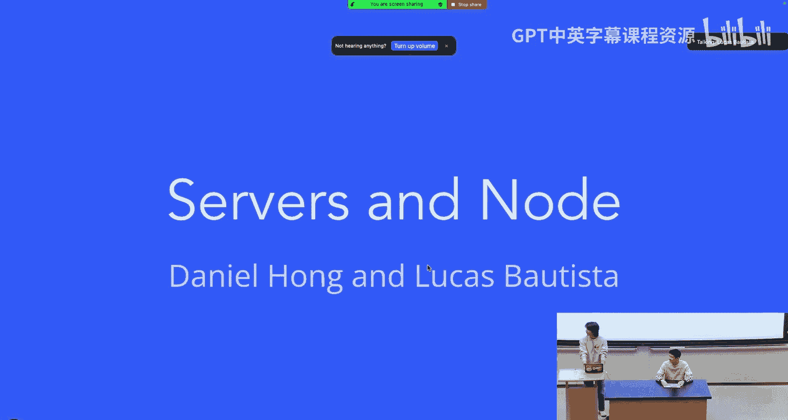

What is a server。Well， a server is just some computer that our client requests data from。

So we request we're gonna send a request to the server and gave us back data。

And a server can actually handle many requests from multiple clients。 So this allows for scalability。

 We don't want every， we don't want a server for every client because it would just be like too many computers。

 and it would just be like a waste of money。And so why do we need a server？ Well， first off。

 it's because we want to request the data from a central point。

 So we want all our clients to know that at this website or at this URL。

 we can get the data that we want。We also want a server for centralization。

We want some ground truth to represent the data that we have in our server。 We like。

 an example would be like， imagine you're playing fortnite and like you shoot somebody。

 you want there to be some kind of true game state that both players can refer to if they want to see like。

 or if they want to like render something on their screen。

And then the final need for a server is security。 We don't want our client to be able to access our database and send any kind of query to requests。

 maybe data that shouldn't be accessible to them。 We want them to go send those requests to the server。

 and the server deals with the logic necessary to retrieve， refined data to the client。

But how do requests actually reach our server？ Like right now。

 we've telling you that we send requests to a server， but like。How。

 how do these requests actually reach our server。So I。

 I lied a little bit when I said that like a server was a computer was like a computer。 In reality。

 a server is a program。 It's called a process。 And like on your computer， you can run。

 run multiple applications， multiple processes。 like you can run Spotify。

 and then you can run Chrome and like some other applications at the same time。

 the same is true for a server computer。😊，On a server computer。

 we have multiple ports and a server just binds to a port。

 So a server will be an application that binds to a certain port。 And on that port。

 that server will be listening for requests from some other computer。So an example for like a port。

 like address and a URL would be H TP example dot com and then 5，1，7，3。

 And this is indicates that we're sending a request to the computer associated with the domain name example dot com And it's going to the port 5。

1，7，3 because that is where our data is gonna be served。

Another example would be example dot com 3000。 And we use these port names because whenever you run NP PMM run dev。

 you're actually like hosting a server on your computer。

 which is just sending you the react files that your browser will render。And so here's like。

 the general。Like structure for like an address to a server。

And why do we need to specify ports on most websites？ Well， actuality。

 most websites actually have like a default port。 So， for example， YouTube。

 the YouTube dot com servers， like if you wanna request the website from them。

 they will be using port 4，4，3 to send you。The website through the protocol， H， T T， P， S。

If you're requesting a website from YouTube do com using HTTP， you'd probably use like 4 80。

And then there are other things that use different ports as well。

 So a Minecraft server would use port 25，5，6，5。 And then if you want to send an email to somebody else。

 the email is like， if you send an email to your friend。

 it's gonna go to your friend's computer on port 25。

 because that is where their email application is listening for emails from other people。

So what your well ideas are gonna be developing websites。

 you're gonna be interested in like how you can use your own machine as a server。

And any computer can run server code。But what does it mean to run server code。Well。

 that just means that， oh my God。 Well， that just means that you will run a program that is designed to actively listen for requests。

And from other computers on a network and then actually respond to this request， so。Your domain。

 your computer has a special domain called local hosts。 And local host is just like。😊，Like a。

 like a word that represents your I P address。 So whenever you type it into your browser。

 you actually just send your request to your own computer through a certain port。

 depending on like what you put after your local host。And so like。

 this would be an example of connecting to a server on port 3000。How do we write a server？

So I've told you how like a process can listen for requests on a port and then like actually respond to requests。

 But you as developers， you guys w to be worrying about how to create your website。 You don't。

 You don't really care about how your computer is handling these requests and then sending back responses。

And so this is where frameworks come in。Basically， what frameworks do is they have like boiler plate code for like low level like request handling。

 And they just like， make it really nice so that you can use it easily。

 And so some examples of this would be flask， Apache， Express dot J S， Django。

 and all of these frameworks。😊，The only like difference between them is like。

 you'll use flash if you're coding in Python for your backend， use aphe using Java。

 Express the G S using Javascript。 So it's just a way to like abstract out all that like low level communication stuff that you don't really care about。

😊，What framework will be using， We're gonna be using express dot J S。 And later。

 Daniel will show you how you'll be able to write API end points on your back end so on your server。

But we also need a tool to run jascript code。And like， you might be asking yourself， like。

What do you mean。We already run JavaScript code on the browser， right？嗯。Yeah， that's true， but like。

We're not going to be running our server on a browser。

The jascript that we run for like on the browser is for the client。 It's used to， like。

Render the H T L， C， S， S and jascript that some server sends to us that represents our website。嗯。

So like， I'll give you guys like a little refresher。So， basically。

Whenever you send a request to some website like YouTube dot com in order to actually render the website。

 you're gonna be asking the server for Hl， C， S S and jascript。The server returns it。

 and your client， the browser， is gonna be interpreting the H T L， C， S S and jascript so that the。

 the website is actually rendered in front of you。嗯But。

What about the code that actually like handles these requests like。

This jascript code is gonna be on the server。 And so like I have a little meme here。 It's like。

 what if I told you that your computer does not know what jascript is， And this is because like。

 if you gave your your computer， your machine， like a file of jascript。

 it won't be able to interpret it unless it has some packages that are installed to actually interpret jascript。

And so essentially， your browser， like even though it's on your computer， it， it。

 it knows how to interpret a jascript， but your computer， like。Your terminal， everything else。

 It doesn't know how to like， read javascript。And so that's why we have no dot J S。

 and No just basically just runs javascript on your machine。

 And we've actually been using it to download any dependencies we need for our project。

And I'll talk about that right now。So before that， any questions， I know that was like a lot。

 And it's like。A little bit confusing， like connecting the front end and back end。So。

Anybody have questions about anything。2库。So node package manager。

 this is just gonna to give you some context on like how we've been using NPM。 So obviously。

 we've been using it to download packages that our project needs using NPM install。

 And then we've also been using it to run our server in the background or rather running our server to service the react files on front end that we need to actually display on the browser using NPM run dev。

So， importing packages。So if you guys look into capbook， your， your folder for capbook。

 you'll see that we have a package do Json file。 And this file just has a lot of metadata about our project。

 So it has a name description， probably some scripts that you'll be running like N PM Revev。

And dependencies。 And we'll be looking at the dependency section。So whenever we run NP PMM install。

 we download dependencies and those dependencies will be shown in package Json。

 And the actual packages that we download will be going into node modules。

 And whenever we push our project to。The Github， like Git repo。

 We don't want to include our node modules or whatever modules we download。

 That's why we always like NP PMM install whenever we pull from a gate repo。

 because if we like pushed all those packages up to the Git repo， it' be like very slow。

 And we don't want to do that。So let's look at the big picture。What are our files actually doing？

So for Capicle react， we're gonna have a client folder and a server folder。

 And it might be a little bit confusing， like having both of these folders in the same folder on our computer and then like running the server and having like a front end server as well。

 But because our computer has multiple ports， we can run multiple servers。

And so our clients gonna deal with all of our react code components， pages， utilities， etctera。

And our server is gonna have all our back back end code。

And then all these other files are just set up by staff to configure react。 Feel free to ask any。

 any questions about the these files in office hours or maybe after these lectures。😊。

If you want to learn more。嗯。And let's see if I have enough time。呃。Okay。

 I'll go through this just to clarify a little bit more about endpoints。

So an example for understanding endpoints。 So we've been talking about like sending requests to endpoints like。

 like YouTube dot com slash results， slash whatever， right， like the。

 the slash result is an endpoint for the YouTube server。

 And whenever we send requests those endpoints are kind of like addresses because。

At those specific URLs or specific endpoints， we have separate functionality。

 So whenever we send a request to specific URL， that functionality is gonna be ran。

 and we hopefully get the data that we want。 So an example would be like。Suppose we're import 3000 L。

 suppose I'm sending a request to local host 3000。 And that request is gonna be towards the endpoint API slash comment。

 So I want to post a comment onto my Tbook。Well， imagine where the request and we're walking down port 3000 land。

 And we see one house that's addressed as API slash videos。

 We know that that's not the endpoint that we're looking for。 So we go on to the next house。

And the next lesson is， we get API comments。Which is not what we're looking for。

 We want to post comment。And then we find the URL that we're looking for。

 And so we go inside that house。 We own whatever functionality we need。 We get the data that we。

 that we want。 And then we get out of there。 And we're now a response object。

 and we go back to the client server。😊，And then like the rest of the houses are whatever URLs we're using。

So after that， we're gonna create our first API endpoint。 and I'll pass it on to Daniel。

I realized that out is spelled this correctly here or R okay well。Anyways。Yeah， so。嗯。

Our server R J S file that we mentioned earlier。We can start off by thinking of it as kind of。嗯。

These two lines， and these two lines is enough to like essentially create an API endpoint for our front end to access。

The first line。Is constant app outt express and expresses like。

Some sort of object like some sort of imported package that。为。Have from package dot Json。

 And then when we call express。We're going to get this app object that we can then use to create API endpoints whenever we call app dot get。

 this creates essentially a get request or sorry a get endpoint that is able to be queried by any client at that endpoint Similarlyly。

 app dot post will create a post endpoint。嗯So。App dot get takes two arguments。

 It takes the first argument， which is the end point。 And secondly， it takes a callback function。

 which is called whenever that endpoint is ping to basically。

 And here we have set up this get request so that whenever that endpoint is pinged。

 it will return back to whoever sent that request。While I made my first API。Yeah。

So this is the HTP method。 So if we set this as post， then we would get a post method。

This is the route that express sets。 So essentially the endpoint。

 whatever this will be tagged onto whatever base URL we have。 for example， local host 3000。

And finally， we have the function handler， which takes in the function that we feed in should always take in two parameters。

 the request and the response object。I don't know。Yeah， so this request and response object。

Request is basically the incoming request that we get and we're able to do things here。

 like look at what the request body is or the request parameter is or things like that so we can find out whatever we want to know about what the original request was。

 And then Res is the way that your server sends the response back to the client。

 So this res do send thing is basically the syntax for the server sending back whatever information it needs to the client。

Yeah。And then， yeah， this syntax is basically just the way that express。Is set up， but。

The main thing that you need to know is this redo send， you can put whatever you need inside of it。

 and it's basically like a return statement。Cool， any questions here。All right。

 we're going to talk a little bit about middleware now。

So now that we've kind of have like a baseline understanding of like， what an endpoint is。

Middleware is basically what we can do between receiving a request and running the endpoint code so you can imagine we get we get the request somewhere over here and then maybe before we want to like call the endpoint code。

 we want to do some extra stuff and we'll like give a few examples on the next slide basically but like you can imagine they're like workers in the assembly line which might like do part of like what we need to do and then and then pass it on to the next worker which will do something else and then et ceter。

 until we get to the endpoint， which finally completes our request with what needs to actually be done essentially。

Middlewares are called an order of definition， and we'll see what maybe what that means in a little bit。

有。So a few examples of middleware。Maybe for every request coming in， we want to log the request。

And it would be pretty tedious to put at every single endpoint that we ever write。

Before we do that endpoint to console log the request right so what we can do is we can just define a middleware in front of all of our in front of all of our endpoints to console log whatever is coming in and what that will do is no matter what endpoint is being pinged。

 it'll always console log whatever that request is so that code will always be run and you don't have to put it in every single endpoint。

Yeah， maybe we want to make sure that whenever the user makes any new request。

 check that they're logged in first。 So maybe the user is like feeding in like some sort of credentials or something like that for whenever they make a request。

 we want to check that those credentials match what is on our server so we would write a middleware to check that these credentials match what is actually on our server。

Yeah， and then finally。We， if we can write some middleware so that if any request ever results in an error。

 then we can log that error to the server。And one thing to note is that whenever you console log。

On your server， it'll print to the terminal that your running NPM runs start in。

 And we'll talk a little bit more about what that means， but。Basically。

 it's not going to print to your browser。That's like the main differentiation here。

 which is that you should not like whatever server code that you have that is running console log。

 you should not look to your browser， but rather to your terminal。对。O。Yeah。

 so the way that we add middleware is by using this app dot use function。

 So we've talked about app dot get which creates a get request and similarly you can do app dot post。

 which creates a post request Appdot use is another functionality of Express that allows you to register middleware。

So the way that Up use works。Is it takes an optional path in a middleware object。

And we won't talk about the path for now。 but basically， if you just feed in one parameter。

This parameter will be treated as a callback function。

 which is which will be called whenever the request comes in， it takes three parameters。

 Re resin next。嗯。So the next thing， which is optional。

Is just the next it represents like the next middleware function that needs to be called。

 So if you don't have any if you only have one middleware passed in。

 then you don't actually need this next like parameter but otherwise the rec and the res are pretty similar to what Re and res are for like app dot get。

 for example， like the rec represents the incoming request and then the res represents how you send that result back to the server here we're not using either we're not using any of the parameters。

 we're just going to log the time whenever any request comes in。

So maybe like turn and talk to to somebody near you for like。

Like 3 seconds a minute and like try to understand like what exactly this code is doing。Yeah。Yeah。

 okay， cool。Do people need more time are people good。I don't see anything。 Okay， yeah， cool。

Basically， what this code is doing。Is whenever we have like any endpoint called。

 no matter what that endpoint is。We're going to basically just that log the current time to the console。

 so if， for example， slash API slash test is called。

 what will happen is we'll log time and then we'll do whatever is defined in slash API slash test。

Yeah。Okay。Now we'll talk about erroreromi list for a little bit。

So error middlewares are slightly different from middlewares in the sense that they're kind of。

A catch to what happens if whatever endpoint code or whatever middleware code that we run somehow errors in the process of like those processing。

It takes in four arguments。嗯。Error， rez， and next， and。嗯。

The error thing is basically just an object which which tells us a lot about what is going on in that error。

 So just for as an example， if you。If you type an errordot status。

 that will just represent the status code of the error that is coming in。

 and then all the other arguments represent the same thing that we just talked about for normal middlewares。

Unlike unlike normal middlewares， which are defined before endpoints so that they're processed before the endpoint actually processes。

 our error middleware is defined after all her endpoints so that if any of the endpoints are the middleware like。

Arrors out。 then it like kind of。嗯。It defaults into like what is going on in our error middleware。

 basically。So when we call app use with error rec resin next。

 we can put in any error handling code inside。 For example。

 maybe we like print out the error to the console。过。Finally。😊，We'll talk about catch all endpoints。

And catch all endpoints are defined。This is like kind of taking a step back from middleers and going back to endpoints。

Hl endpoints are defined using app dot get and this star symbol。So all endpoints。

 which are not concretely defined。We'll hit the star endpoint。嗯。So， just an example。嗯。

What will we get。When we get slash API slash test in the code below。we get。

 I love Weblab or are we gonna to get us 404 not found， maybe like。Open hand for I love Web labb。

 close hand for not found。What do you think。O， I saw a mix。

So we're actually going to get the 404 not found。Because。嗯。

We misspelled slash API slash test here so。If you're making a request to an end point and then you misspell the endpoint。

 then it's not going to hit the endpoint that you think you're hitting。

 So here we're gonna get back 4 or4 because we like use the wrong endpoint， basically。Yeah。

 so what happens is basically it'll miss the slash API slash test endpoint。

 and then it'll hit the catch all endpoint， which is defined to kind of catch anything that is not already caught by things that we already did find。

Yeah， so we'll get this44 founder。过。Any questions there。Okay， yeah。

 so now I've written the exact same code， but I've switched the ordering of the two so that the app doc get star comes first and then the app dot get。

 sorry Yeah， App dot get slash API slash test is coming afterwards。So how is this code different？

Basically， what happens here is kind of something weird。Even though slash API slash test。Like。

 is defined。When we when when a frontend or when a client tries to query the slash API slash test endpoint。

 it'll still return4 or4 or not found because in express， it kind of goes like top down in your file。

 So what happens is like it'll check each one in order。And then see， oh。

 this one is like a catch all endpoint。 And so I should be returning for for not found here。

 And it doesn't even see like what's happening below。Where like it won't even like get to I love bh。

 blah， but it'll just like it'll， it'll see the catch all endpoint。

 which is catching slash API slash test， and then it'll return the 404。In general。

 we don't want to do things like this。Because it's just like not the behavior that we want。

 So we generally define your casual endpoints after。All of our normal end。

All of our like actual defined endpoints so that those catch all endpoints should only catch what happens in the case that we missed the endpoints that we actually wanted to define。

对。Cool， yeah。 So we're gonna check out a little bit of template code in workshop  three starter。😊。

Yeah， so first， we'll。

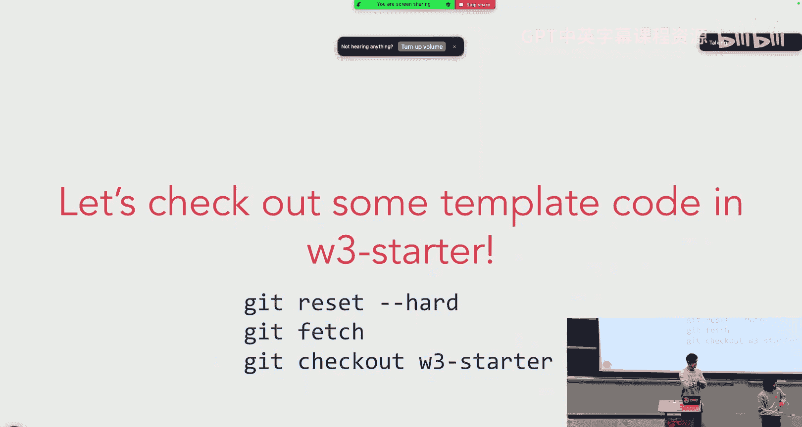

嗯。Get， is that hard。Get check out workshop3 starter。Looks like we're a little to the hunt。So。

And then。我坐上。Okay， cool。 Yeah， so you'll notice。As are。Our folder is set up。Similarly to how。

 how what is mentioned in the sense that we have a client folder here。

Which has all of our source code in it。Similar to what basically。

 this is what we worked on in Work 2。 And then we have a server folder which currently just has one file in it。

 server Js。

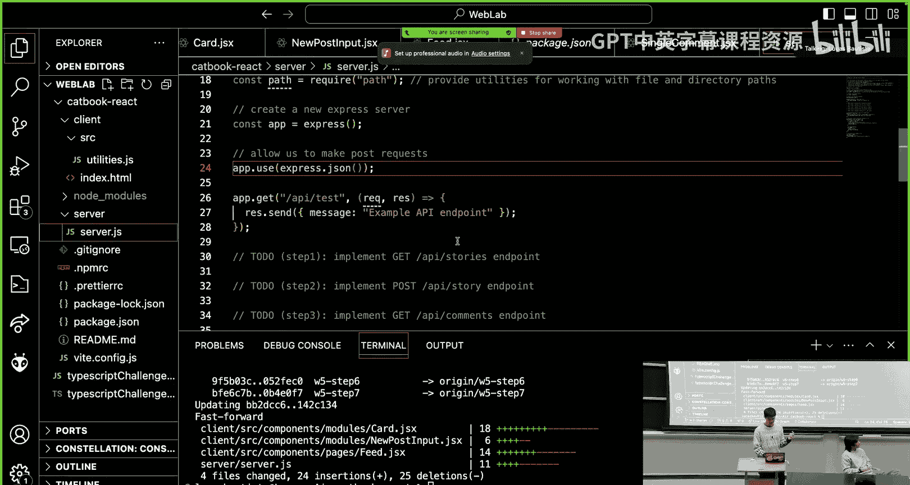

Yeah， so you can like take a look through this。

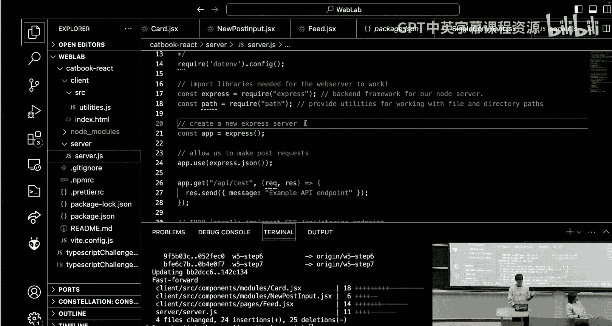

And Ill， I'll be doing the rest of this on the slides。 So if you're in magic， what is in your code。

But I think the slide are a little more clear， basically。So how do you run the code？ So far。

 we've been using MPM run dev to run our front end。

 which runs our frontron end code on local hostst 5，1，7，3。 But now we will have a backend as well。

 So in order to run that， we will be using MPM start to run our backend。

 which will run our backend on local hostst 3000。😊，嗯。Yeah， what's nice about this is that both of。

 both the front end and the back end will auto refresh whenever you update a file。

 So you can just keep them like basically running in the background whenever you're like。😊。

Like making changes to your files or doing development so that and like whenever you save a file。

 it should be automatically reflected so you don't have to like rerun these commands ever。

 you can kind of just keep them running and make changes to your files as necessary。呃。

 any questions here。够。OK。Yeah， so。At the top of our express code， we have these two。

These two libraries， and。Basically， when we have this constant express equals require express thing。

 you can think of this basically as an import。 It's just a different syntax for importing。

 But generally on the back end， we use this requires syntax because that's just like。That ex like。

 that's just like the preferred syntax for like。Express in backend， in general。

But it means the same thing as like a similar import expression， basically。So yeah。

 these two lines import libraries。Might use in our backend。 And then the next line。

 which is constant to app dot express。Creates an app object。

That allows us to define any middlewares or endpoints that we use。

The first thing that we define is this app use express dot Json。

 which is a middleware that converts our request bodies to Json。

Request bodies generally come as strings。 so it'll just be like a string that probably like has like a list or an array or like some jascript object in it and like。

Our， our server won't know how to handle like just like a string that's coming in。

 So you need to be able to parse that string into like a Json object。

 So this app I use expressed our Json kind of converts whatever's coming in into like like a Json format so that we can actually like process it basically。

Finally， we have this app dot get slash API slash test， which is our first API endpoint。

 as we talked about earlier， This essentially just sets up an API endpoint at this end point at this at this URL to handle。

😊，Sorry to output， sorry， to return。This message， whenever it's pinged， yeah。过。嗯。Yeah呃。

The next thing that we have in our code is this catch all error handler。Which嗯。Uses。で。Uses like the。

Like。Catch all stars syn text so you can turn and talk for a bit and like discuss with somebody next to you。

 like， what is this code doing？Yeah。I'll give you guys like a minute or something。Yeah。O。哭。

Do people need a little bit more time or。I'll give a。 I'll give a few more moments。有。Okay。

 I think I heard some like。A few like correct things like being said around the room。So， yeah。

 if we get like some， basically whatever we get a request that is not。

 that is not something that we've already defined， then this app all is going to catch it and print out both the method and the URL and app all is。

It'sNot something that we've talked about yet already。 but if you guessed correctly。

 then good for you， basically what it does is it processes all types of endpoints or sorry。

 all types of methods。 So get post and any other like any other like methods that our request might have。

 So it kind of。It finds it。For both get and post and maybe like delete or whatever other things。

 right yeah。And then once we catch the route， we'll console log the route to the terminal。

 So we see it on the server side and then the Res dot status 40，4 sets the status to 4，0，4。

 And then we send it back to the the client so。The idea here is the first line helps us see it on the server side。

 And then the second line helps us see it on the client side。Yeah。

 so when we send it back to the client， then the client will also see that there's an error。

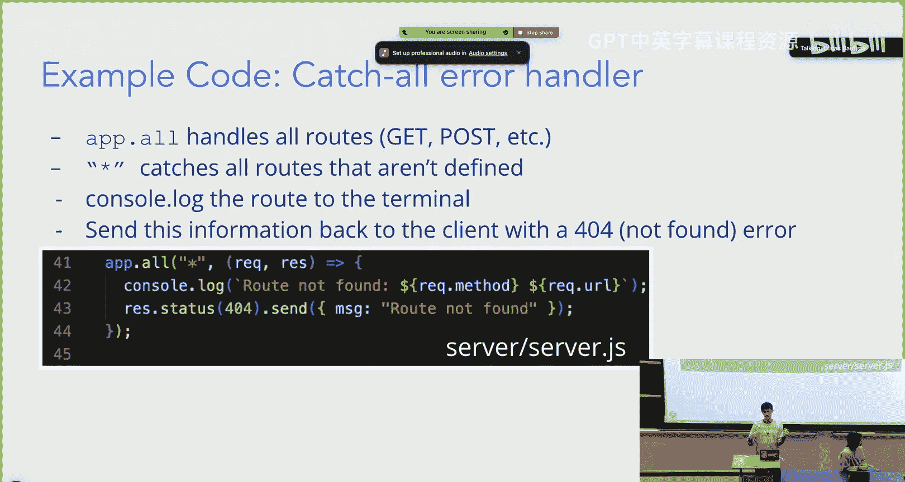

过呃。I think I will probably like skim past this part。 Basically。

 this last part is server error handling middleware， which is。A handling middleware。

 which basically whenever we get an error from the server， we will log the error。

 which will be seen in terminal， and then we will send that error back to the browser。

 and if we have a status code。That is already passed to us。 Then we will keep that status code。

 And otherwise， the default status code will be 500， which is basically。

Something we went wrong on the server side。And we apologize， but。

We have to log that the server error， and we also have to tell。The client， the server error。

 basically。

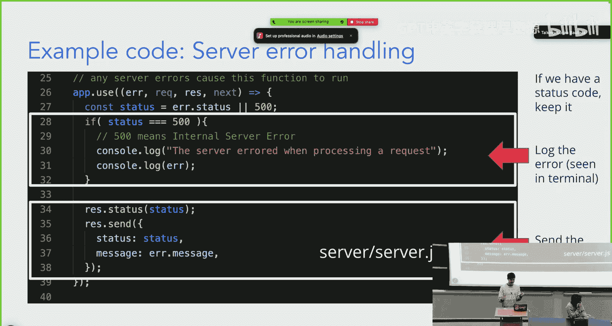

Yeah。过。Okay， I think that's it for this lecture。嗯。Yeah。

 so the next thing that's coming up is workshop 3 for now， while we transition to that。

Take a few moments and fill out the feedback form。Web do slash feedback。And yeah。

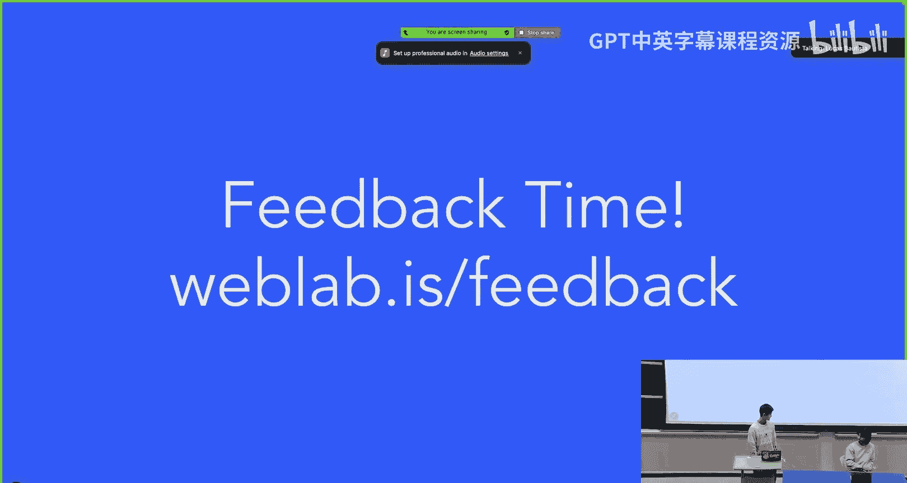