# Web开发快速入门：4：UI与Figma 🎨

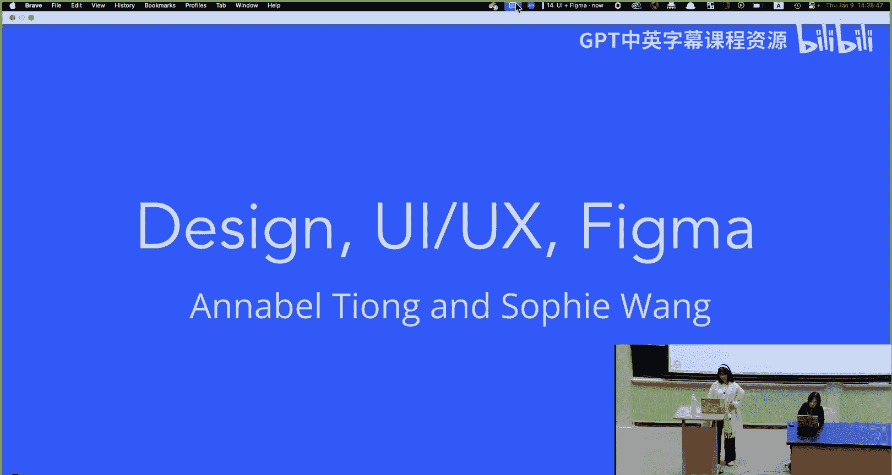

在本节课中，我们将要学习网站设计的核心概念：用户界面（UI）和用户体验（UX）。我们将探讨如何通过字体、颜色和布局来设计一个美观且易用的网站，并介绍如何使用Figma工具来创建网站原型。

---

## 网站设计的核心：UI与UX

上一节我们介绍了网站开发的基础，本节中我们来看看如何设计网站。网站设计的中心是我们的用户。我们设计网站是为了服务用户，我们希望网站是**可用**的。

需要考虑的两个核心概念是**UI**和**UX**。
*   **UI**（用户界面）决定了网站的视觉效果。它是用户访问网站并与之互动时的第一印象。
*   **UX**（用户体验）更多地描述了用户从一个页面到另一个页面、与网站互动时的流程。

一个好的UI/UX设计能够将网站的内容和功能有效地传递给用户。但这可以有很多不同的形式，没有一个固定的“好”的配方。

---

## 用户界面设计

首先，我们来看看用户界面。你的UI应该由一个**设计指南**来引导。这个指南规定了你在网站中使用的字体、配色方案、间距布局以及前端可能使用的可复用组件。

以下是一个设计指南的例子，它曾用于Web.lab网站多年（虽然最近网站UI已更新）：
*   **字体**：为网站中不同的标签（如标题、正文）指定了使用的字体。
*   **配色方案**：规定了整个网站使用的颜色。

你使用的字体和颜色会给用户留下非常强烈的第一印象，因此它们非常重要。在设计网站时，你应该花时间思考为UI指南选择什么样的字体和颜色。

### 字体选择

如果你是一名麻省理工学院的学生，你可以访问Adobe Creative Cloud，从而使用Adobe Fonts。这是一个寻找网站字体的绝佳工具。你可以按标签筛选，寻找不同类型的字体。

不同的字体已经能传达出非常不同的印象。例如：
*   **Ivy Style**：一种非常现代、简洁的字体，适合用于现代的用户界面。
*   **Mini Arcade** 或 **Limon**：可能不适合用作网站正文，但更适合用作标题。

### 颜色选择

颜色同样能给用户留下强烈的第一印象。你可以使用像Coolors这样的工具来挑选和编辑配色方案。

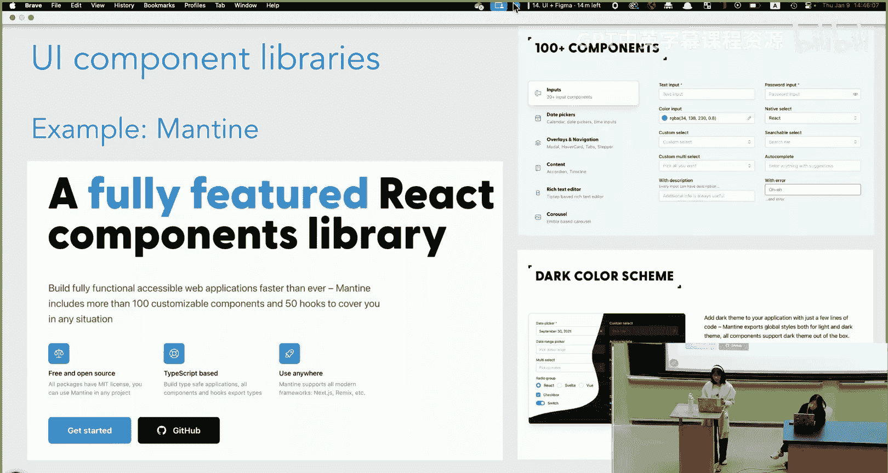

另一个需要考虑的是**色彩心理学**，你可以自行深入研究。

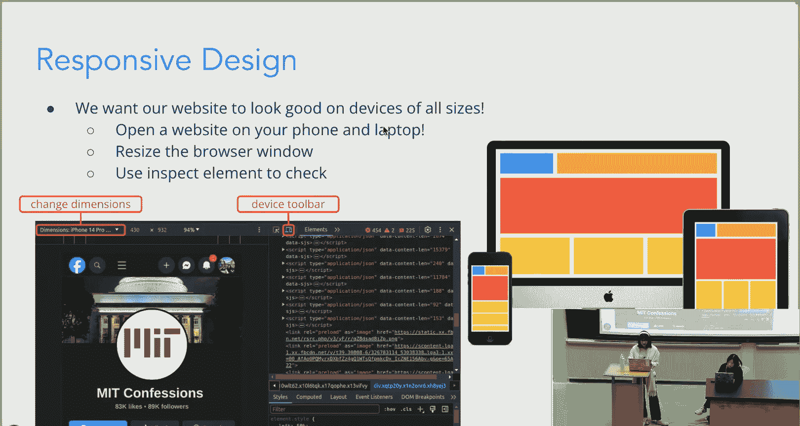

### UI趋势与文化差异

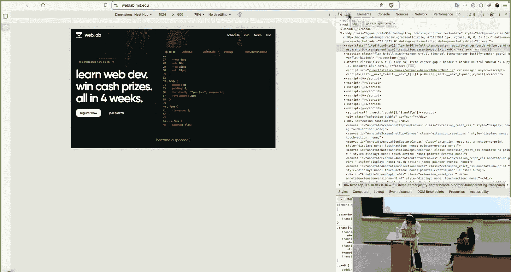

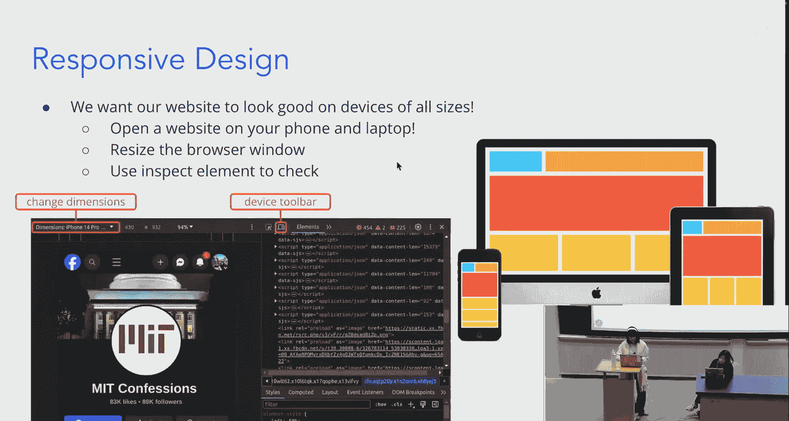

正如我们所见，UI可以通过字体和颜色给用户留下深刻印象，但这在很大程度上取决于你的用户群体。用户会随着时间和文化而变化。

UI趋势会随时间改变，并因文化而异。例如，麻省理工学院的网站在2003年和现在的对比显示，它已转向更**极简**的UI：白色背景取代了茶绿色背景，文字间距更大，布局更空灵，并尽可能用图标代替文字。

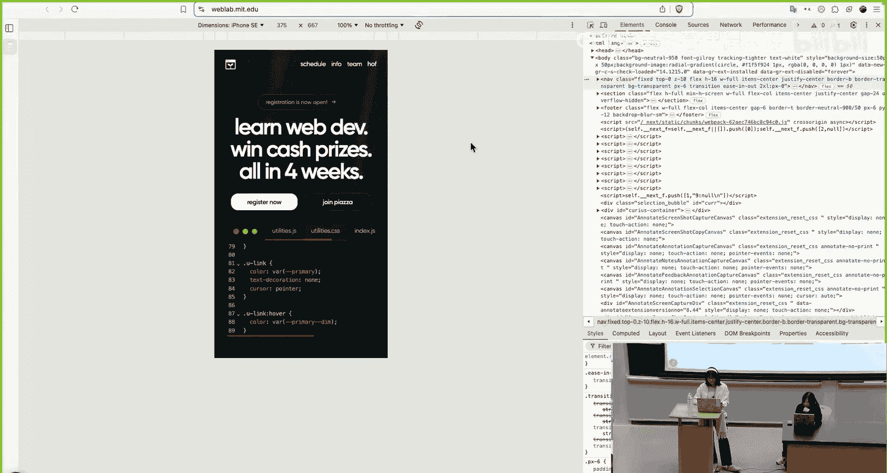

过去十年，我们看到了向更极简UI发展的趋势。观察图标随时间的变化是一个很好的例子：
*   **早期**：非常原始和像素化的图标。
*   **90年代末至21世纪初**：拟物化图标，模仿现实生活中的物品。
*   **2010年代至今**：更极简、扁平的UI图标布局（尽管最近开始出现更多阴影和立体感的趋势）。

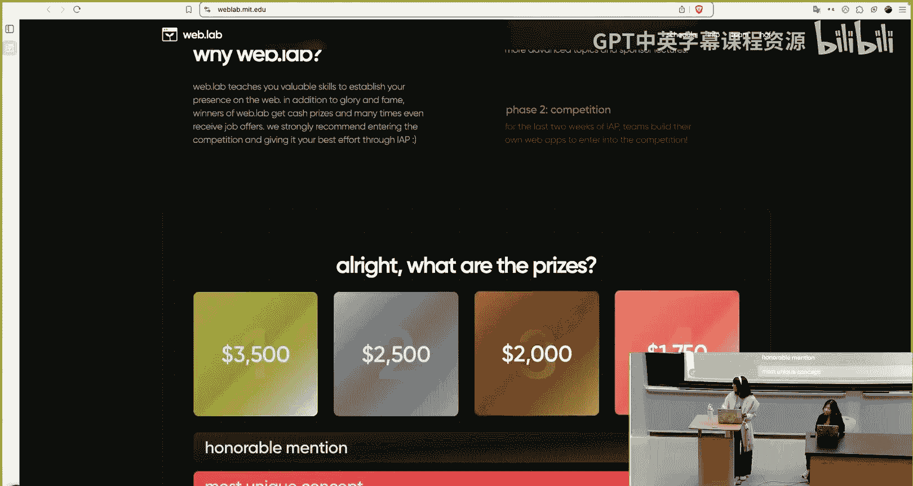

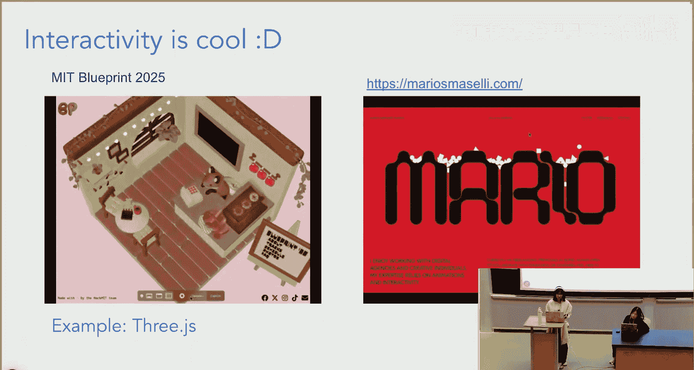

你可以通过“网页设计博物馆”网站查看你喜欢的网站是如何随时间变化的。

极简UI并非在所有文化中都受欢迎。一个例子是西方网站和东亚（如日本）网站在UI设计上的差异。日本雅虎的首页更类似于西方在互联网泡沫时期的网站，信息更密集，没有明确的视觉焦点，远不如西方网站极简。这是因为在不同文化中，用户有不同的需求：西方用户偏好简洁、有重点的布局；而东亚文化属于高语境文化，偏好能提供更多信息的网站。

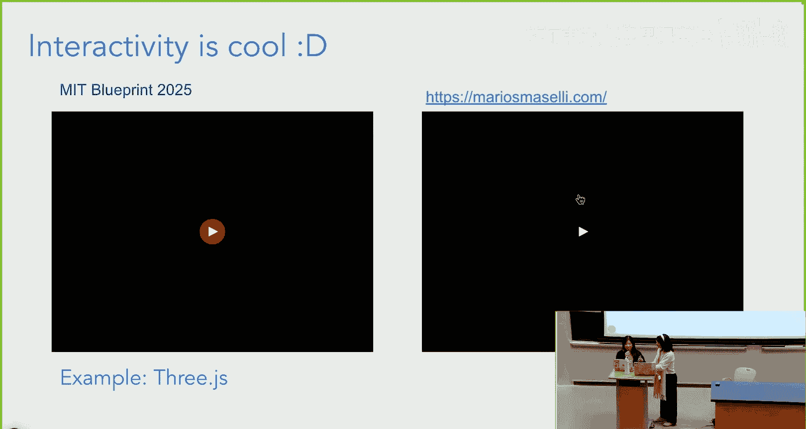

这充分说明，在设计网站时，你真的需要考虑你的用户群体。

### 如何让UI看起来更好

如前所述，你应该使用**UI指南**，因为它能确保整个网站的一致性。以下是一些挑选颜色和字体的工具。

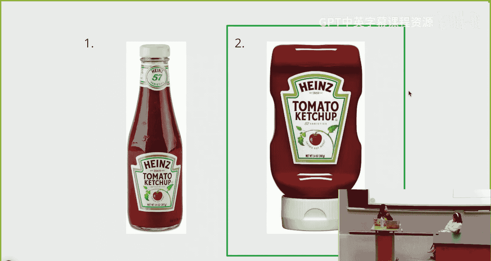

另一个重点是**复用组件**。你可以使用**UI组件库**，例如Mantine，它允许你自定义组件并在整个网站中复用它们。

让UI看起来好的另一个重要部分是**响应式设计**。这意味着你的网站在不同尺寸的设备上都能良好显示。你可以使用浏览器的“检查元素”功能，并切换设备工具栏来查看网站在不同屏幕尺寸下的效果。

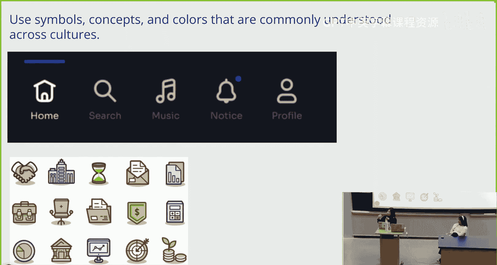

### 交互性

交互性也非常酷。当用户可以与网站互动时，例如悬停或点击某物会得到反馈，这能让网站更吸引眼球。但交互性也有缺点，它可能影响可用性，或对浏览器造成较大的资源负担。

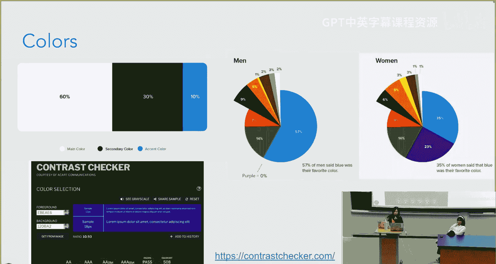

---

## 用户体验设计

上一节我们介绍了UI，本节中我们来看看UX。UX需要考虑诸如导航对用户来说有多直观、用户在网站上可以使用哪些线索、我们想要突出的基本元素有多明显，以及我们呈现的信息是否以逻辑清晰、易于理解的方式组织。

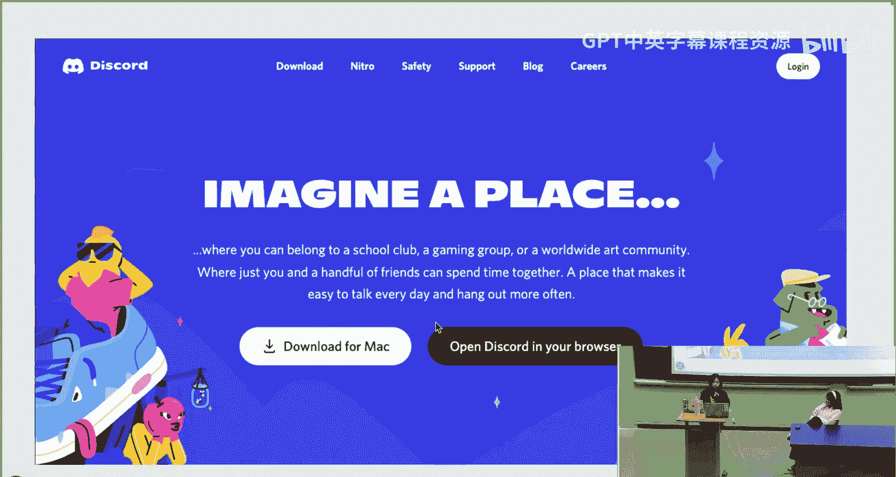

我们希望使用在不同文化中普遍理解的符号、概念和颜色。图标几乎是通用的，我们可以使用大多数人都能理解的特定符号来表示某些事物。例如，房子图标代表主页，放大镜图标代表搜索栏。颜色也有其象征意义，例如绿色通常象征金钱或财富。

关于色彩心理学，一个好的配色比例是：60%主色，30%次要色，10%强调色。有研究表明不同性别对颜色的偏好。此外，像“对比度检查器”这样的网站对于确保网站的可访问性非常有用，你可以检查网站在灰度模式下是否仍然可见，以及是否有足够的对比度供视力障碍人士使用。

以Discord的UI为例，它通过将按钮集中放置且易于点击来优化UX，让用户一进入页面就清楚自己的选项。相比之下，Facebook的旧UI就不太直观，因为“创建账户”的输入框非常大，而用户更常用的“登录”选项却很小，放在顶部。因此，Facebook切换到了新UI，将登录框放在中心位置，创建新账户放在下方，这样更加直观。

---

## 线框图与原型设计

现在我们来谈谈线框图。这对于你们的项目来说超级重要。线框图本质上就是为你的Web应用创建一个非常粗略的草图。它非常有帮助，因为一旦你开始硬编码，再想改变会比在开始编码前就清楚应用的样子要困难得多。

你需要关注应用的整体结构以及关键元素的位置。线框图可以非常草率，不需要很正式，可以把它看作是你网站外观的粗略草稿。

制作线框图有几种不同的选择：我们可以使用Figma（我们稍后会讨论），你也可以在Google Slides上制作（便于展示页面间的过渡），或者直接画在纸上，或使用其他线框图软件如Photoshop或Sketch。我们将使用Figma，因为它有一个非常有用的功能叫做**原型设计**。

原型设计基本上就是让你的线框图“活”起来。你将为线框图添加交互，展示页面之间的跳转关系。这有助于改进你的UI，因为你确切地知道了编码所需的技术要求以及用户应该被重定向到哪里。原型可以非常接近真实的产品。

我们将使用Figma，因为它具有非常好的实时协作功能，以及为线框图添加交互和制作原型的选项，这对我们的目的非常有帮助，而且对初学者来说也很直观。

---

## Figma 基础演示

我们将快速过渡到一个Figma演示。我将概述关键功能的位置，然后你们将有一些时间自己动手尝试。

首先，在 `figma.com` 创建一个Figma账户。创建新文件时，选择“设计文件”。

Figma的基础是，所有内容都将包含在一个**框架**中。框架是元素的容器，它将容纳我们应用页面上的所有内容。框架非常强大，比简单的“组合”对象功能更强大，因为你可以独立调整框架内所有内容的尺寸，可以利用溢出内容选项（如裁剪文本），并且更容易为所有内容应用一致的样式。

例如，要制作Catbook的主页导航栏，你可以先创建一个框架，然后更改其填充颜色。接着，你可以使用文本工具在框架内添加文字，如“Catbook”，并在右侧面板调整字体大小、样式等。

Figma一个非常棒的功能是**组件**。假设我们想制作一个个人资料页面，我们不需要重新制作或复制粘贴导航栏，而是可以将其创建为**组件**。组件是可复用元素的实例。创建后，你可以在“资源”面板中找到它，并将其作为“实例”插入到其他页面中。当你编辑主组件时，所有实例都会自动更新。

---

## 总结

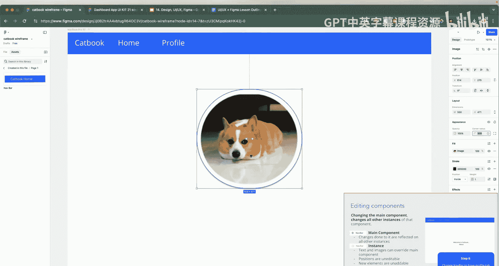

本节课中我们一起学习了网站设计的两个核心支柱：UI和UX。我们探讨了如何通过字体、颜色和布局来塑造用户的第一印象和整体体验，并了解了设计趋势会随文化和时间变化。最后，我们介绍了使用Figma进行线框图和原型设计的基本方法，这是规划和组织网站结构的强大工具。记住，好的设计始终以用户为中心。