# Web开发快速入门：4：UI与Figma 🎨

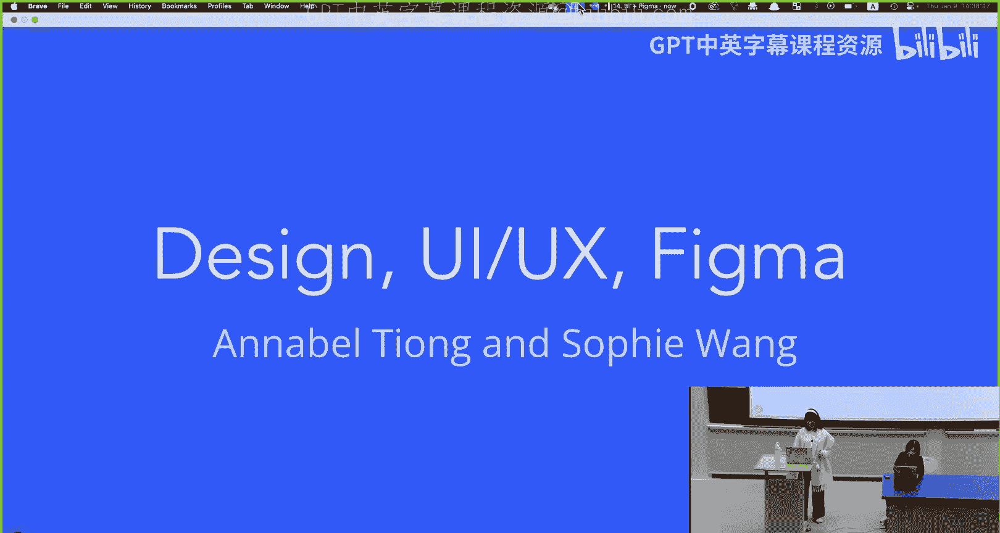

在本节课中，我们将学习网站设计的两个核心概念：用户界面（UI）和用户体验（UX）。我们将探讨如何通过字体、颜色和布局来设计UI，以及如何优化用户与网站的交互流程。最后，我们将介绍一个强大的设计工具——Figma，并学习如何用它来创建网站线框图和原型。

## 网站设计的目的与核心概念

我们设计网站是为了服务用户。任何网站设计的中心都是用户。我们希望网站易于使用。

网站设计师需要考虑的两个核心概念是 **UI** 和 **UX**。

*   **UI** 决定了网站的视觉效果。它是用户访问网站并与之互动时获得的第一印象。
*   **UX** 更多地描述了用户从页面到页面、与网站互动时的用户流程。

一个好的UI/UX设计能够将网站的内容和功能有效地传递给用户。但这可以有很多不同的形式，没有一个固定的“好”的配方。

## 深入理解用户界面（UI）

上一节我们介绍了UI和UX的基本概念，本节中我们来看看如何构建一个优秀的用户界面。

你的UI应该由一个设计指南来引导。这个指南规定了你在网站中使用的字体、配色方案、间距布局以及前端可能使用的可复用组件。

以下是Web.lab网站和我们的幻灯片多年来使用的设计指南。最近，我们的网站进行了UI更新，所以你可能在网站上已经看不到这个UI格式了。但你可以看到，在这个UI指南中，我们规定了整个网站中不同标签使用的字体和配色方案。

你使用的字体和颜色能给用户留下非常强烈的第一印象，因此它们非常重要。在设计网站时，你应该花时间思考为UI指南选择什么样的字体和颜色。

### 字体选择

首先，我们从字体开始。如果你是麻省理工学院的学生，你可以访问Adobe Creative Cloud，这允许你使用Adobe字体。

这是Adobe字体的网站，你可以将任何字体家族添加到你的Web应用程序中或下载任何字体。我强烈推荐它，它是一个为网站寻找字体的绝佳工具。你可以按标签过滤，寻找不同的字体。

这是Adobe字体的首页。正如你所见，这些不同的字体已经给人留下了非常不同的印象。我写下了我对这些字体的初步印象。我相信你对这些字体也有不同的印象。例如，Ivy Style是一种非常现代和简洁的字体，你可能想把它用于非常现代的用户界面。而对于Mini Arcade或Limon，你可能不想将它们用于任何网站的正文文本，它们可能更适合网站的标题。

### 颜色选择

颜色也是如此。这是Coolors.co网站，它允许你选择和编辑配色方案。同样，颜色也会给用户留下非常强烈的第一印象。

我也浏览了这个网站并写下了我的初步印象，你可能也有类似的初步印象，也可能没有。这是需要考虑的一点。

以下是你在Coolors上可以使用的一些工具。你可以选择调色板并调整它们。

另一件需要考虑的事情是色彩心理学，你可以自行查阅相关资料。

### UI趋势与文化差异

正如我们刚刚看到的，UI可以通过字体和颜色给用户留下非常深刻的印象，但这在很大程度上取决于你的用户群体。你的用户会随着时间和文化而变化。

UI趋势会随着时间变化，并因文化而异。现在我们将看一些例子，看看它是如何变化的。

这是2003年的麻省理工学院网站与现在的对比。正如你所见，麻省理工学院网站转向了更简约的UI。我们现在有了白色背景，而不是茶绿色背景；文字之间有更多间距，因此布局更加简约和空旷。我们还尽可能用图标替换了文字。

总的来说，在过去十年中，我们看到了向更简约UI发展的趋势。一个很好的例子是观察图标如何随时间变化。这是垃圾桶图标。图标最初是在1973年施乐公司引入图形用户界面时出现的。

在最初阶段，我们有非常原始和像素化的图标。随着我们经历90年代末和21世纪初的互联网泡沫，我们转向了拟物化图标，这些图标最初设计得非常用户友好，因为它们模仿了这些图标在现实生活中的样子。但随着我们进入2010年代及过去十年，我们有了更简约和平坦的UI图标布局。

但最近，我认为我们开始远离极简UI，因为现在很多图标有了更多阴影，可能还增加了一些维度感。

这是一个很酷的网站，你可以在自己的时间查看。你可能想看看你最喜欢的网站是如何随时间变化的。这是Web设计博物馆。

### 文化差异对UI的影响

正如我们刚刚看到的，我们一直在朝着更简约的UI发展，但在当今数字时代，并非所有用户都喜欢简约UI。

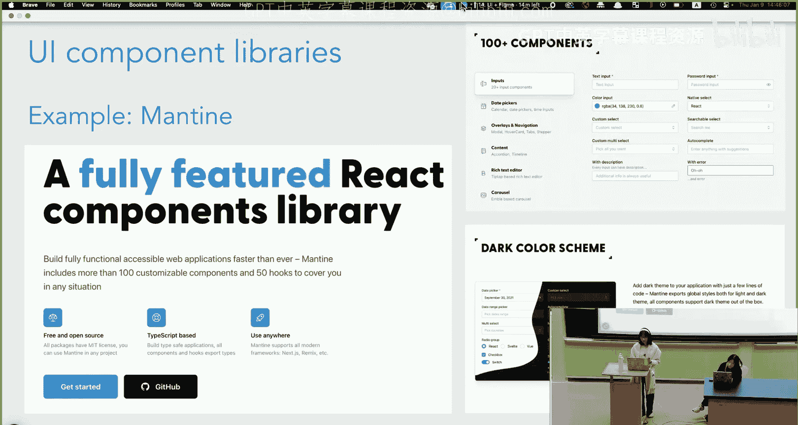

一个例子是网页设计在西方文化和东亚文化网站之间的UI差异。这是雅虎首页。左边是你在美国可以登录的英文雅虎网页，右边是日本雅虎首页。

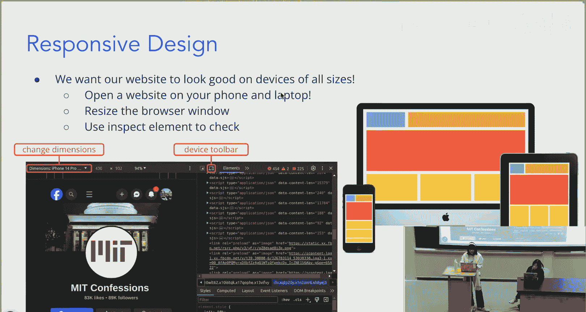

一个非常有趣的现象是，日本的UI更类似于西方在互联网泡沫时期的网站外观，而且更加杂乱。没有中心焦点，也远没有那么简约。这是因为在不同文化中，用户有不同的需求。在西方，用户更喜欢具有主要焦点、能总结信息的更简化布局。而在东亚文化中，这是一种高语境文化，用户更喜欢能告诉他们更多关于网站的信息。

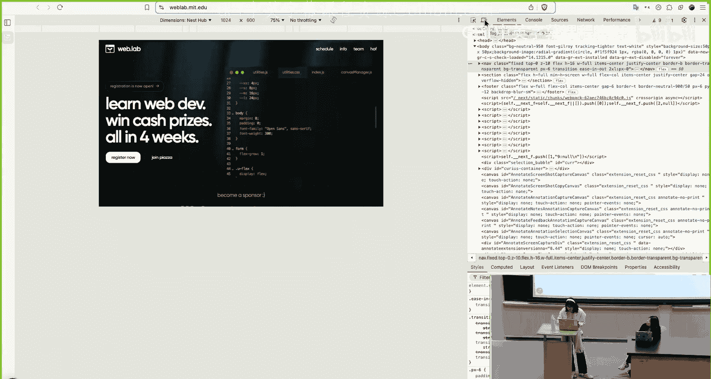

这确实强调了在设计网站时，你真的需要考虑你的用户群体。

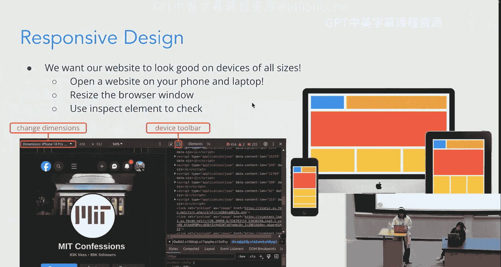

### 如何让网站UI看起来更好

正如前面提到的，你应该使用UI指南，因为这能为你的网站提供一致性。

以下是一些供你选择颜色和排版风格的工具。

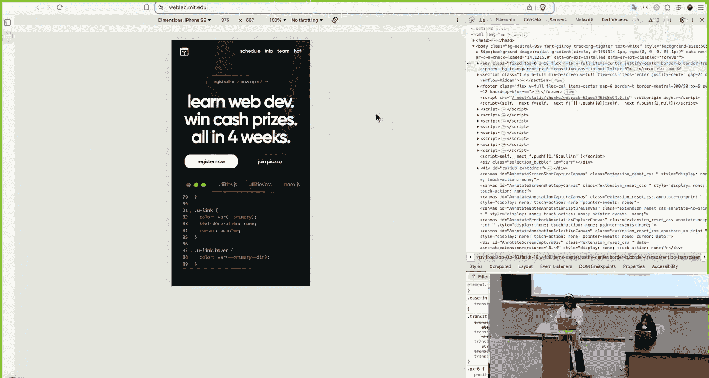

另一个重要的点是复用组件。你可以使用UI组件库。以下是一个我喜欢的组件库示例，它叫做Mantine。它允许你自定义组件并在整个网站中复用它们。

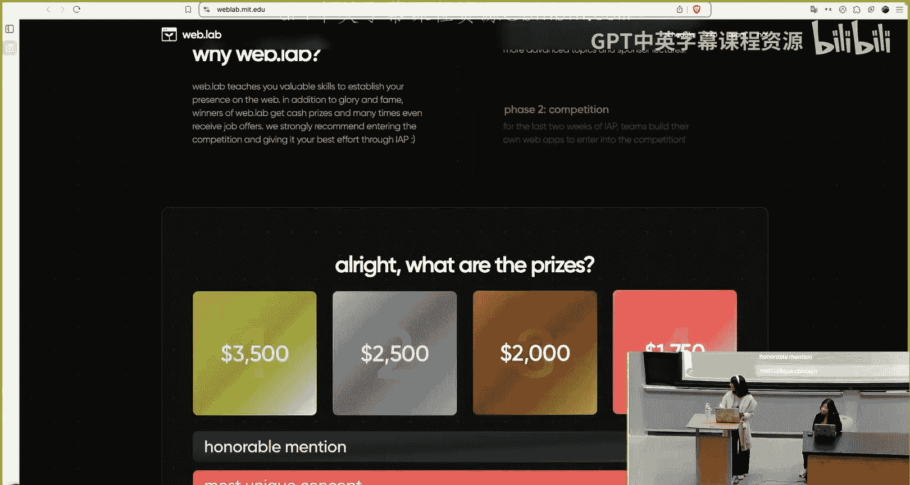

让你的UI看起来好的另一个重要部分是响应式设计。这意味着你的网站在不同尺寸的所有设备上都能看起来很好。

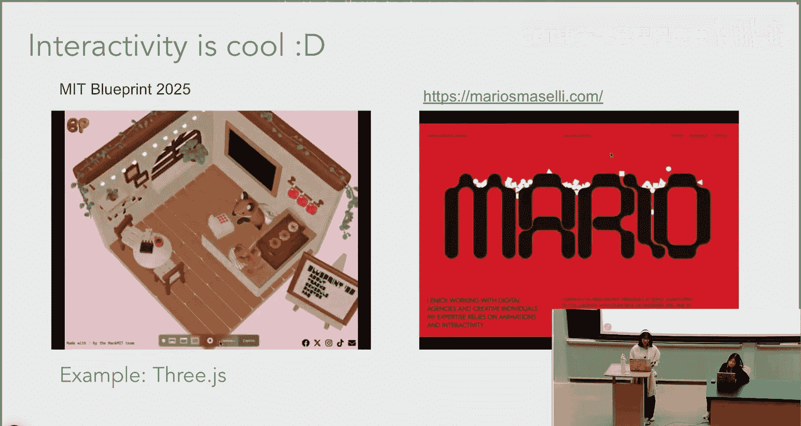

你可以使用检查元素并更改网站的尺寸来检查你的网站在不同尺寸屏幕上的显示效果。例如，这是Web.lab网站。

我们可以进入检查模式。在右侧面板的左上角，你可以切换设备工具栏并选择尺寸。这是它在iPhone SE上的显示效果。正如你所见，所有内容都重新调整了大小，在小屏幕上仍然看起来很好。这就是我们所说的响应式设计。

### 交互性

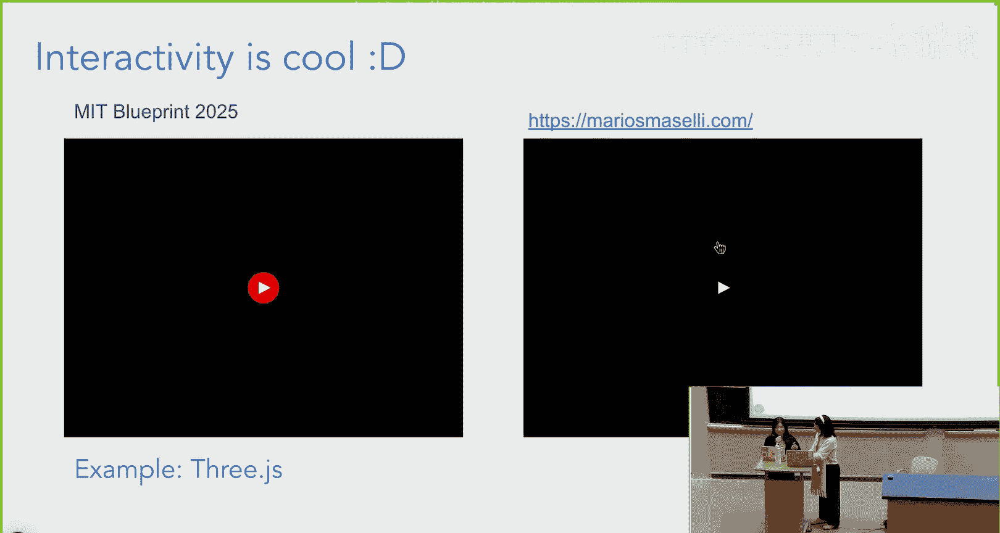

顺便提一下，交互性也很酷。交互性是指用户可以与网站互动。当你悬停或点击某些东西时，你会得到反馈。这很酷，它能让你的网站吸引眼球。但也有缺点，它可能会影响可用性，或者对浏览器资源消耗很大。

以下是由我们的助教Stanley设计的一个交互式网站示例。

正如你所见，我们最近进行了UI更改，新的UI更具交互性。你可以悬停在物体上，它们会改变颜色或不透明度。或者你有一个表情符号。

我们的旧网站没有任何用户交互性。所以新网站更加吸引眼球。交互性的另一个例子是，对于HackMIT，我们正在为我们即将举办的高中黑客马拉松Blueprint制作一个Three.js网站。

我们使用了一个3D建模网络应用程序来制作这个酷炫的房间。它允许用户与房间互动并点击房间里的不同物品。右边只是一个我找到的很酷的作品集页面，你可以在网站上与不同的物体互动。

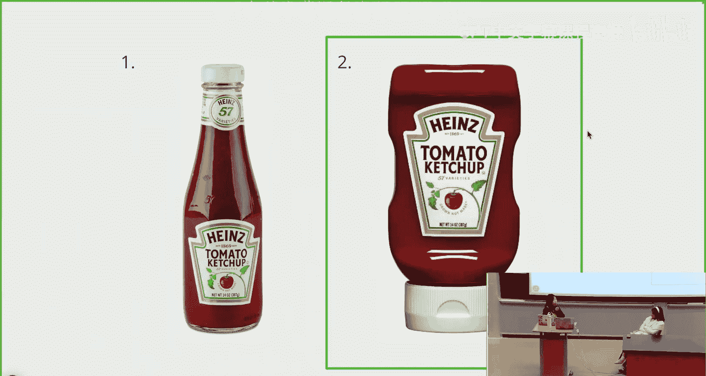

## 深入理解用户体验（UX）

现在我们将转向UX。我会讲得快一点，因为我认为Sophie在她的UI部分涵盖了很多非常重要的点。

但简单来说，对于UX，我们需要考虑诸如导航对用户来说有多直观、他们可以在网站上使用什么线索、我们真正想要在网页上突出显示的基本元素有多明显，以及我们呈现的信息是否以逻辑方式组织，使用户能够轻松理解信息流。

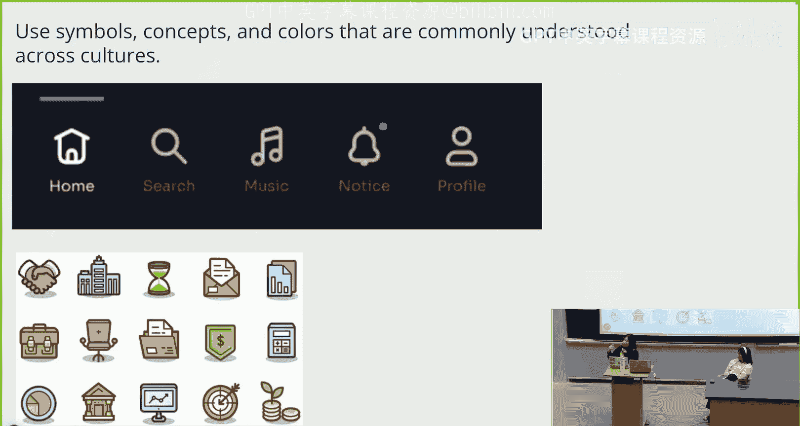

让我们快速在这两个番茄酱瓶1和2之间进行一个投票。你认为哪一个更好地优化了用户体验？

是的，我只看到选2的。这是正确的，因为基本上，在旧的亨氏番茄酱瓶设计中，使用起来非常不直观，因为如果有剩余的番茄酱，你需要挖瓶子才能把剩余的弄出来。而在这里，你可以更容易地挤压它。所以它非常优先考虑用户体验。我们希望我们的Web应用程序也能做到同样的事情。

我们希望使用在不同文化中普遍理解的符号、概念和颜色。Sophie谈到了西方和东亚应用程序之间的差异，但图标是通用的。我们可以使用大多数人能理解的特定符号来表示某些事物。例如，你可以看这里的图标栏，看到主页用一个房子表示，搜索栏用一个放大镜表示，等等。还有很多颜色，比如绿色通常象征金钱或与财富相关的事物。

### 色彩心理学与可访问性

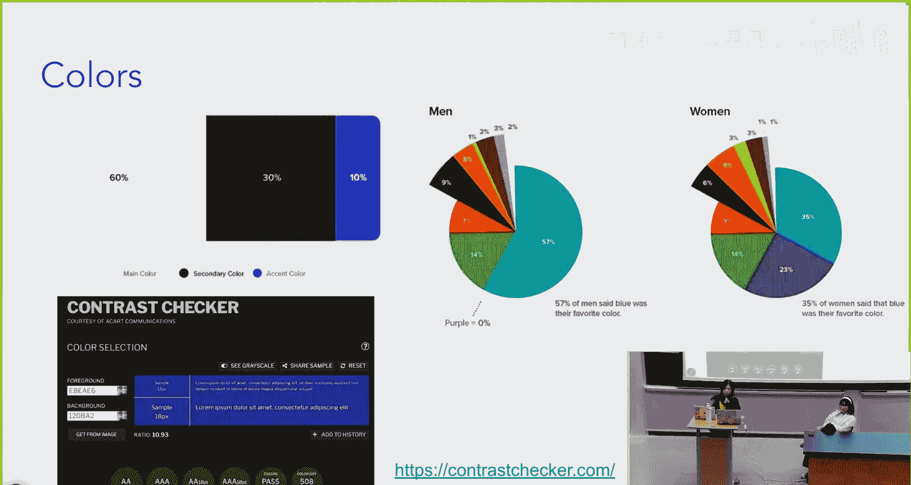

关于Sophie之前提到的色彩心理学，这是一个很好的理想比例：60%的主色，30%的次要色和10%的强调色。也有研究表明不同性别更喜欢哪些颜色。此外，下面的网站对比度检查器对于使你的网站具有可访问性非常有用，因为你可以检查以确保你的网站在灰度模式下仍然对红绿色盲用户可见，并且你有足够的对比度，让有视力问题的人能够适当地看到所有颜色。

### 优化UX的实例

我相信你们都熟悉Discord的UI，但Discord优化其UX的方式之一是将按钮真正集中且非常易于点击。所以进入网页时，你确切地知道你的选项是什么。

这是Facebook的旧UI。正如你所见，它相当不直观，因为创建账户的框非常大，这不太好，因为大多数时候用户不会创建新账户，而是可能会登录，而登录框在顶部这里非常小。所以这非常不直观，对吧？

我们希望信息流对用户来说非常容易消化和理解。这就是为什么Facebook切换到他们的新UI，这非常好，登录框位于前面和中心，然后创建新账户在下面，这更加直观，因为我们可能不会每次都创建新账户。

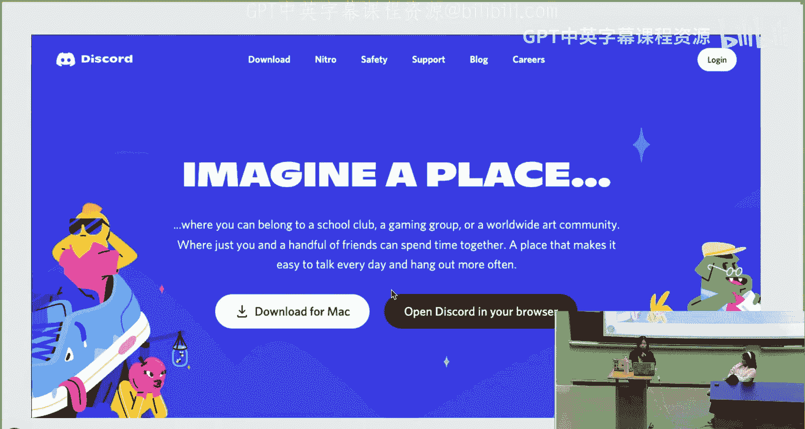

## 线框图与Figma入门

现在让我们谈谈线框图。这对你们的项目来说超级重要。如果你之前走神了，现在应该注意了。

基本上，线框图就是为你的Web应用程序创建一个超级粗略的草图。但它非常有帮助，因为一旦你硬编码了东西，改变起来会比你在实际开始编码之前对应用程序的外观有一个清晰的想法要困难得多。

所以你要专注于应用程序的整体结构以及关键元素将放在哪里。你可以在这里的这个例子中看到，他们有侧边栏，他们知道导航栏会是什么样子，他们知道应用程序上想要什么样的标签和页面。

它可以非常草稿化，不需要任何正式的东西。就把它想象成你的网站可能看起来的粗略草图。

### 制作线框图的工具

要制作线框图，我们有几种不同的选择。我们可以使用Figma，这是我们稍后要讨论的。你也可以在Google幻灯片上制作一个，这很好，因为你可以显示不同页面之间的过渡。你可以用笔和纸画出来，或者使用任何其他线框图软件，如Photoshop或Sketch。但我们将使用Figma，因为它有一个非常有用的功能叫做原型设计。

原型设计基本上是将你的线框图变为现实。所以你将为你的线框图添加交互，并显示哪些页面通向哪里。这基本上有助于改进你的UI，因为你确切地知道编码所需的技术要求，以及用户应该被重定向到哪里。

它可以非常类似于真实的东西。正如你所见，这是一个非常好的原型，包含了所有交互，如滚动、重定向等。

### 为什么选择Figma

我们将使用Figma，因为它具有非常好的实时协作功能，以及为线框图添加交互和原型设计的选项。所以它对我们来说非常有帮助。而且，我认为它对初学者来说非常直观。

好的，现在我们将过渡到Figma演示或小型研讨会。基本上，我将介绍关键功能的位置步骤，然后你们将有一些时间自己动手操作。我知道我们没有很多时间，但希望我能快速讲解，然后你们将有时间自己尝试。

### Figma基础演示

是的，你可以等一下。还有幻灯片。我想...这个可以吗？PC1上可以。好的，很酷。

基本上，我们都记得Catbook，如果我们要为Catbook创建一个线框图会是什么样子。所以我们将快速过一遍。你们现在可以跟着这个步骤操作。

基本上，你只需要在Figma.com创建一个Figma账户。正如你所见，我已经有了我的账户。我们要做的是，一旦你进入Figma首页，你想创建一个新文件。你只需点击这里的“创建文件”或“新建”。然后你将选择设计文件。我将使用我已经创建的Catbook线框图。

但在创建新文件时，哦，如果你需要任何帮助或在某些地方卡住了，你也可以打开这个速查表作为参考：weblab.is/figma-cheatsheet。

### Figma界面基础

只是一些快速的基础知识，Figma中的所有内容都组织成图层。所以你会在侧边栏看到你有不同的页面，然后你的所有元素都会显示在那里。画布，这个中心部分，是你所有东西将要显示的地方。工具在底部。所以这显示的是Figma的旧UI。现在工具被重新定位到了底部。然后在右侧，你有选择其他东西的选项，我们稍后会介绍。

但我认为这些工具很直观，所以我不打算深入介绍，但基本上你有移动和缩放选项，你可以创建框架，你可以创建形状，你可以用钢笔和铅笔绘图，你也可以做文本，你还可以留下评论，这就是为什么它非常适合协作。

### 创建框架与组件

好的，Figma的基础是一切都将包含在一个框架中。让我们从创建一个框架开始。我只是点击这里，然后你可以看到你可以为你的框架选择不同的设备。我只是选择，比如，桌面。然后我们选择MacBook Pro 14英寸。这是我们的框架。

框架是元素的容器，所以这将容纳我们应用程序页面上的一切，对吧？

框架非常强大。如果你们以前使用过任何图像创建软件，即使是PowerPoint或Google Slides，我相信你可能熟悉对项目或对象进行分组。但对于Figma，与其对对象进行分组，我建议你每次想要对对象进行分组时都创建一个框架，因为它比分组对象更强大，因为你可以独立调整框架内所有内容的大小。你还可以有很酷的溢出内容选项。这允许你利用文本裁剪。总的来说，如果你想对所有内容应用一致的样式，它会更好。

让我们制作Catbook主页，对于Catbook导航栏，我将在这里创建一个框架。

然后你可以在这里更改填充颜色。所以你可以看到我正在更改颜色。十六进制代码是#2B73FF。

这将是我们的导航栏框架，对吧？然后我们可以将文本拖到里面。文本在底部的工具这里。我们只想写“catbook”。是的，然后你可以根据需要在侧面调整大小，比如你想要多大的文本，什么字体等等。我现在不会全部介绍，因为我认为你们可以自己动手尝试。

但Figma的一个关键优点是，假设我们想制作一个个人资料页面，对吧？我们会把导航栏复制粘贴到我们的个人资料页面吗？如果是，请竖起大拇指；如果不是，请竖起小拇指。

是的，如果答案是肯定的，我可能不会问这个问题，对吧？所以我们将复用它作为一个组件。你可以看到这里，我已经方便地做好了。但基本上，如果我转到我们刚才所在的框架，我点击它，我可以右键点击，然后我可以选择“创建组件”，这基本上会为我创建这个导航栏元素的可复用实例。

所以如果我转到我的资源，我已经在这里制作了一个更好看的导航栏组件。所以这个就是我们将要使用的。但基本上，你可以创建组件，这些是你想要在多个页面（比如你的导航栏）上复用的东西的可复用实例。

所以现在，如果我们想制作一个个人资料页面，而不是重新制作导航栏或复制粘贴它，我们可以转到资源。然后我们可以在这里插入实例。这样我们就可以得到另一个导航栏。是的，这就是我们复用组件的方式。

这些东西也很直观。你基本上只是复制粘贴图像。你可以通过到这里来塑造形状，你可以更改半径。我就是这样让它变圆的。

你可以在自己的时间更多地复习幻灯片，但基本上，当你编辑组件时，当你编辑主组件时，它会改变所有其他实例。

---

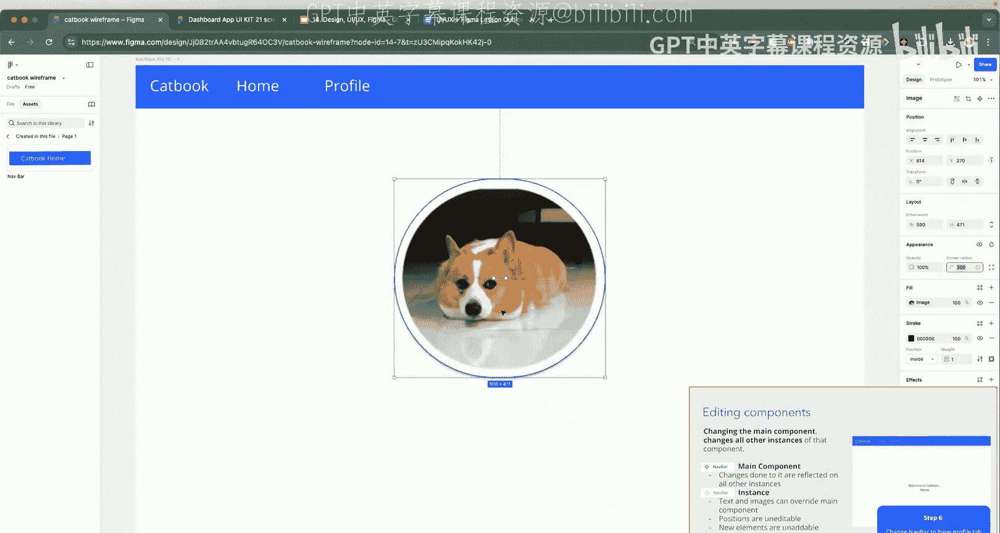

在本节课中，我们一起学习了网站设计的核心——UI与UX。我们探讨了如何通过字体、颜色和布局来塑造UI给用户的第一印象，以及如何从用户流程、直观性和可访问性角度优化UX。最后，我们初步掌握了使用Figma进行线框图和原型设计的基本方法，这是将设计想法可视化和测试的重要工具。记住，好的设计始终以用户为中心。