# Web开发快速入门：17：Catbook调试挑战第一部分解答 🐛


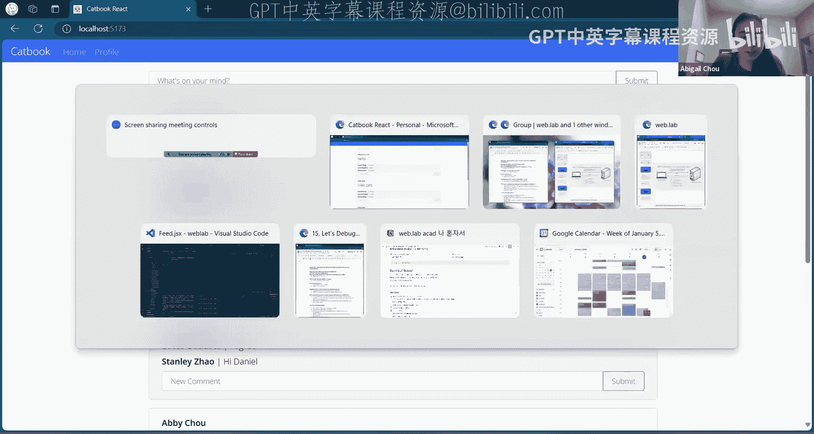

在本节课中，我们将一起解决Catbook应用的第一部分调试挑战。我们将逐步分析代码中的错误，理解错误信息，并学习如何定位和修复这些常见的Web开发问题。

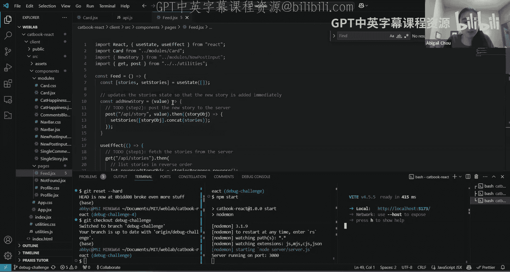

---

## 准备工作


在开始调试之前，我们需要确保开发环境处于一个干净的状态。首先，我们重置本地仓库，然后检出`debug-challenge`分支。

```bash
git reset
git checkout debug-challenge
```

接下来，启动开发服务器。

```bash
npm start
npm run dev
```

确保服务器正常运行后，我们打开浏览器查看应用。

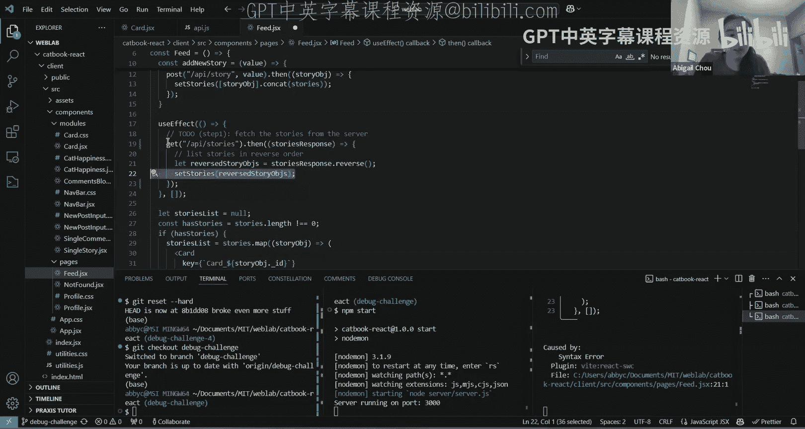

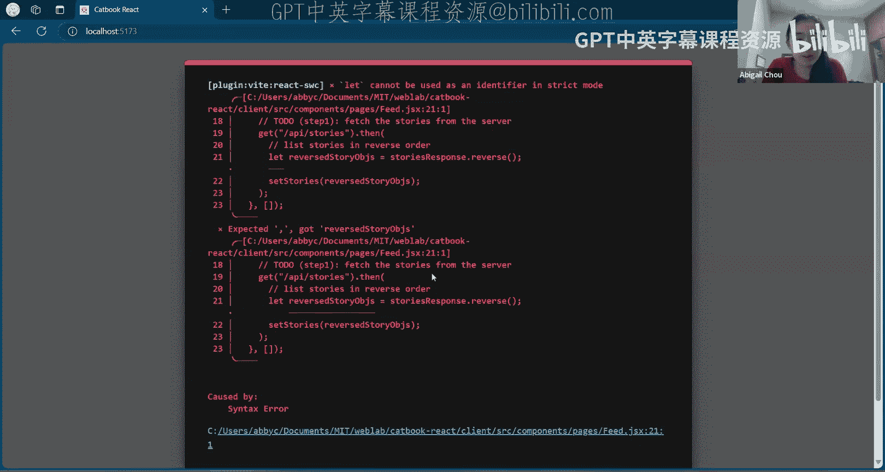

---

## 第一个错误：语法错误

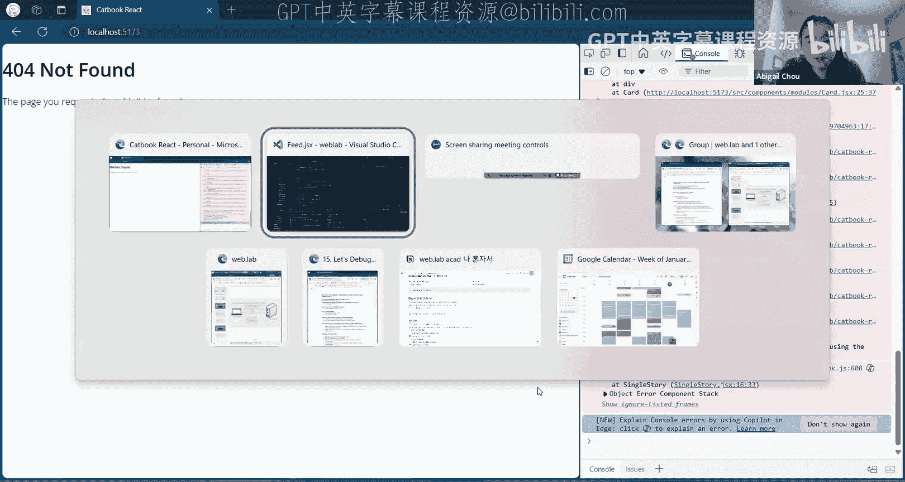

打开应用后，浏览器控制台立即显示了一个错误。

> “let cannot be used as the identifier in strict mode.”

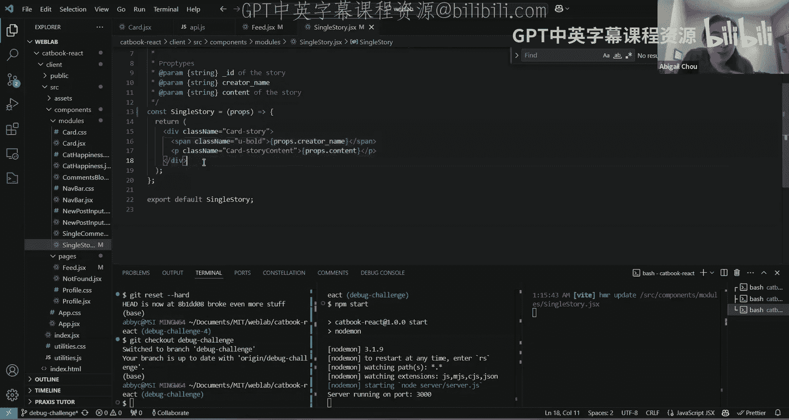

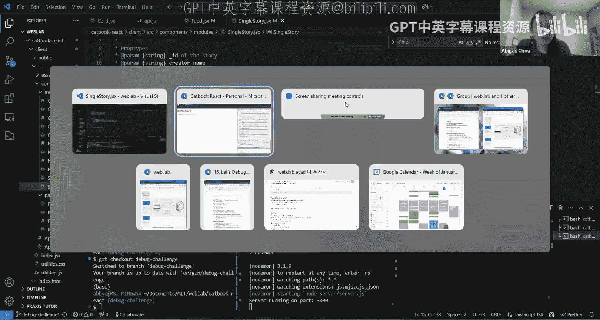

这个错误信息本身可能有些令人困惑，但它指出了错误发生在`feed.jsx`文件中。我们点击错误链接，或者直接打开该文件进行查看。

在`feed.jsx`文件中，VS Code编辑器已经用红色波浪线标出了一个语法错误：“reverse story objects, comma expected.”。这表明代码结构存在问题。

具体来看，问题出在`fetch`请求的`.then()`方法处理上。`.then()`方法期望接收一个回调函数作为参数。然而，当前的代码并不是一个标准的函数定义。

一个标准的箭头函数定义应该包含括号（用于参数）、箭头符号`=>`以及花括号`{}`来包裹函数体。我们需要修正这个结构。

此外，代码中使用了`storiesResponse`变量。这个变量应该是从`fetch`请求的响应中获取的数据，并作为参数传递给回调函数。我们需要确保它被正确定义。

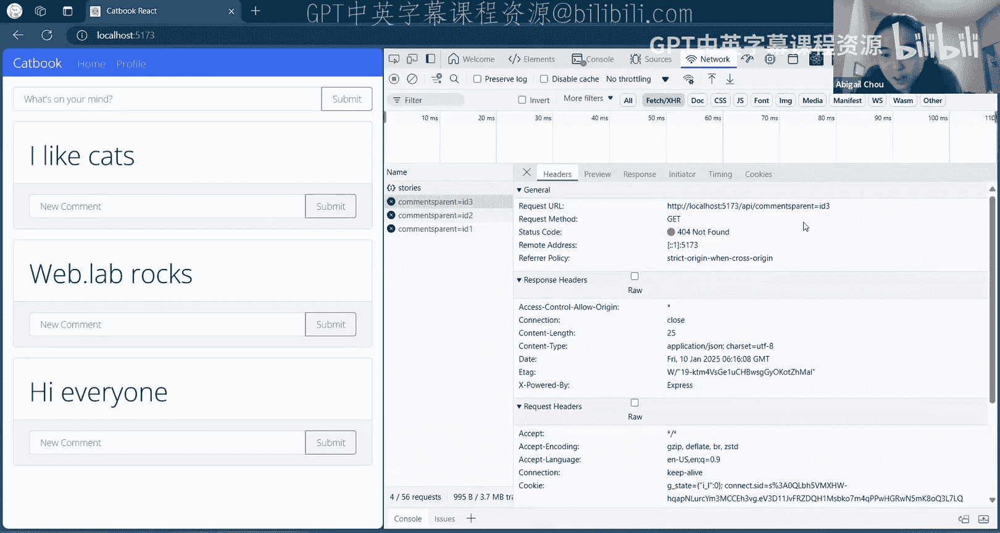

修正后的代码逻辑是：向`/api/stories`发送GET请求，将返回的`storiesResponse`（一个故事列表）传递给回调函数，在回调函数中将其反转，然后使用React的`setState`方法更新状态。

```javascript
// 修正前
fetch("/api/stories").then(storiesResponse => storiesResponse.reverse())

// 修正后
fetch("/api/stories").then((storiesResponse) => {
    setStories(storiesResponse.reverse());
})
```

保存文件并刷新页面，我们来看看是否解决了第一个问题。

---

## 第二个错误：Props未定义

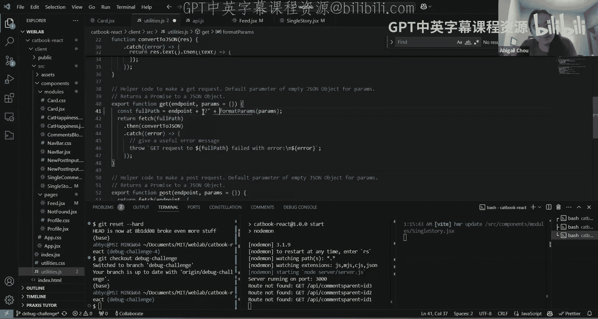

页面刷新后，我们看到了一个不同的错误。

> “ReferenceError: props is not defined at SingleStory”

这个错误指向`SingleStory`组件。我们打开`singlestory.jsx`文件进行查看。

在文件中，代码试图访问`props.creator_name`和`props.content`。然而，`SingleStory`组件函数目前并没有将`props`作为参数接收。

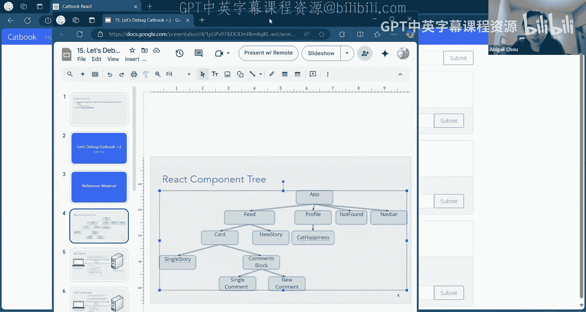

在React中，一个组件本质上是一个接收`props`（属性）作为输入的函数，它根据这些`props`返回JSX（类似于HTML的React元素）。因此，我们需要修改函数签名，使其接收`props`参数。

```javascript
// 修正前
export default function SingleStory() {
    return (
        <div>
            <h3>{props.creator_name}</h3>
            <p>{props.content}</p>
        </div>
    );
}

// 修正后
export default function SingleStory(props) {
    return (
        <div>
            <h3>{props.creator_name}</h3>
            <p>{props.content}</p>
        </div>
    );
}
```

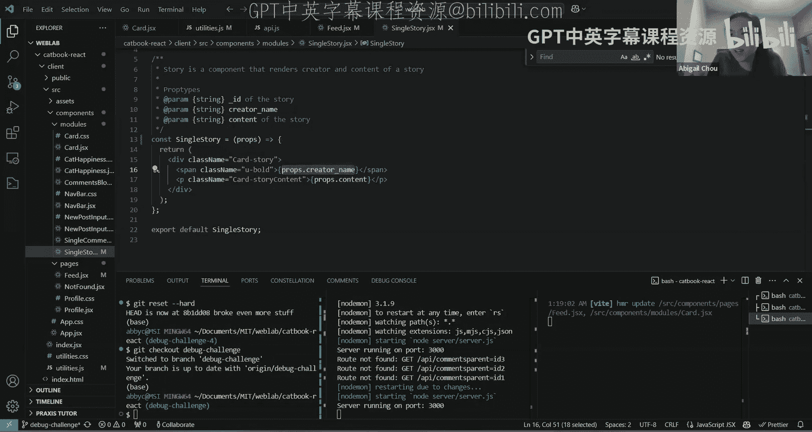

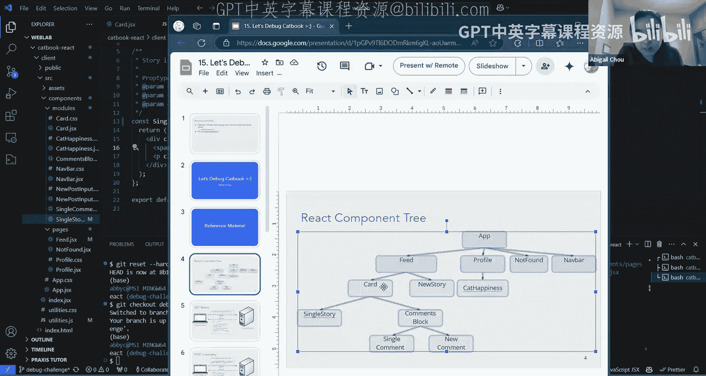

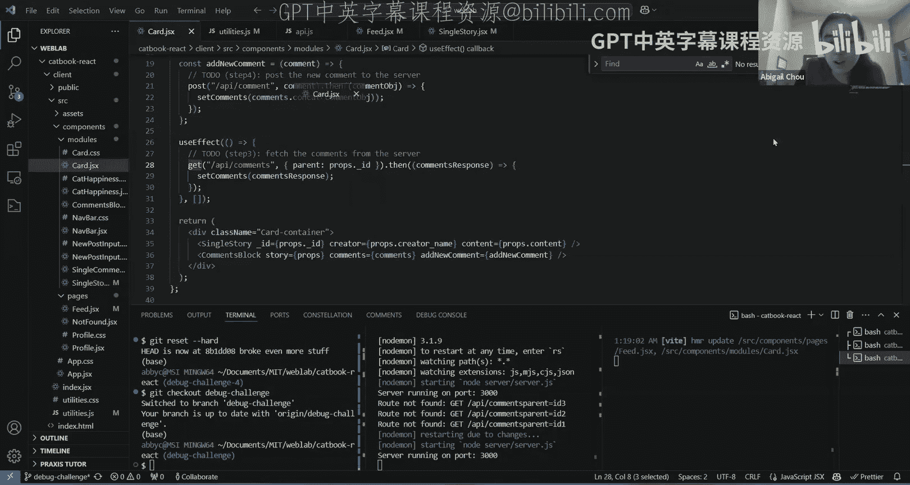

保存修改并再次刷新页面。

---

## 第三个错误：API请求URL构造错误

页面现在看起来好一些了，但浏览器控制台仍然有错误，并且评论没有显示出来。

错误信息显示：“GET .../api/commentsParentID=3 404 (Not Found)”。同时，在浏览器的“网络”(Network)标签页中，我们可以看到这个失败请求的详细信息。

关键问题在于请求的URL格式不正确。一个标准的GET请求URL应该使用问号`?`来分隔路径和查询参数。当前的URL是`/api/commentsParentID=3`，缺少了问号，导致服务器无法正确解析。

我们需要找到构造这个URL的代码。根据经验，这个请求很可能是在`Card`组件中发起的。我们打开`card.jsx`文件。

在文件中，我们看到了一个`get`函数的调用：`get("/api/comments", { parent: props.id })`。这表明URL的拼接逻辑被封装在了这个`get`函数内部。

我们通过右键点击`get`函数并选择“转到定义”，跳转到`utilities.js`文件。在这里，我们找到了构造完整URL的代码。

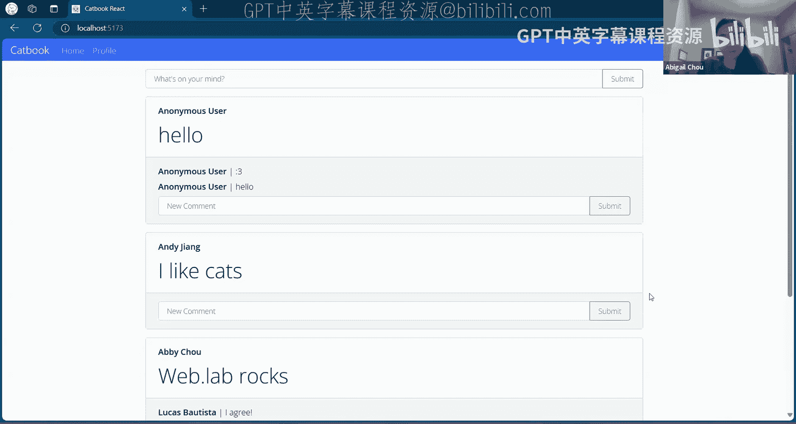

问题在于，代码直接将端点（endpoint）和参数字符串拼接在一起，中间缺少了问号`?`。我们需要添加这个问号。

```javascript
// 修正前
const fullPath = endpoint + paramsString;

// 修正后
const fullPath = endpoint + '?' + paramsString;
```

保存修改并刷新页面。现在，评论应该能够正确加载并显示了。

---

## 第四个错误：Prop命名不匹配

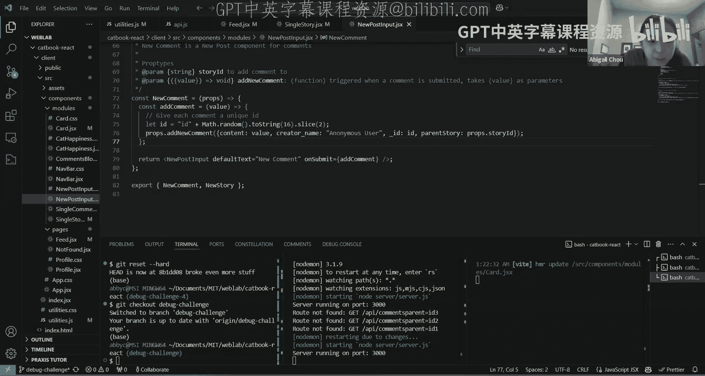

现在应用的基本功能已经正常，但我们发现故事的作者名显示为空白。没有错误信息，但显然有数据没有正确传递。

我们需要检查负责显示作者名的组件。根据React组件树，故事内容由`SingleStory`组件渲染，而它的父组件是`Card`。

首先检查`SingleStory`组件，它从`props`中读取`creator_name`并显示，这部分代码看起来是正确的。

问题可能出在父组件`Card`向子组件`SingleStory`传递`props`的时候。我们回到`card.jsx`文件。

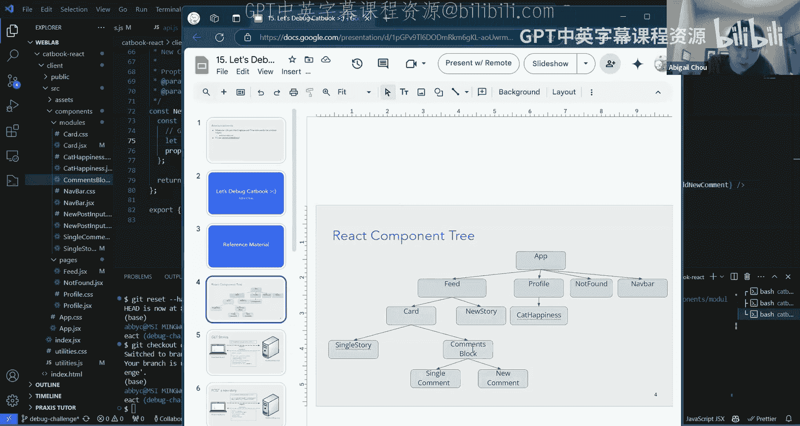

在`Card`组件中，渲染`SingleStory`组件时，传递了一个名为`creator`的属性：`<SingleStory creator={props.creator_name} ... />`。

然而，在`SingleStory`组件内部，它期望接收的属性名是`creator_name`。这个命名上的不匹配导致了数据无法正确传递。

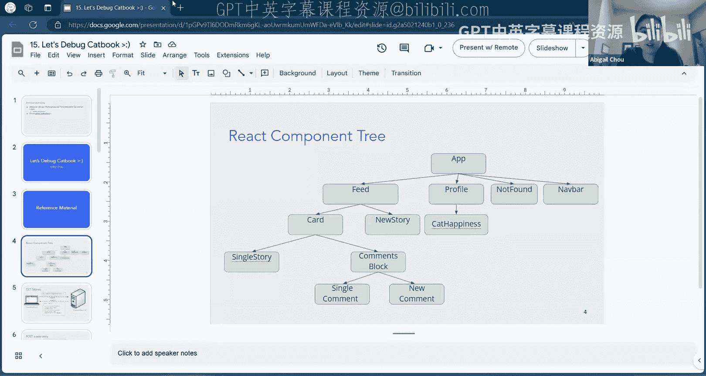

我们需要将传递属性时的名称与子组件期望的名称保持一致。

```javascript
// 修正前（在Card组件中）
<SingleStory creator={props.creator_name} ... />

// 修正后
<SingleStory creator_name={props.creator_name} ... />
```

保存并刷新后，故事的作者名现在可以正确显示了。

---

## 第五个错误：评论无法持久化

最后，我们来测试交互功能。发布新故事工作正常。但是，当我们发布一条新评论并刷新页面后，评论消失了。这表明评论没有被成功保存到后端。

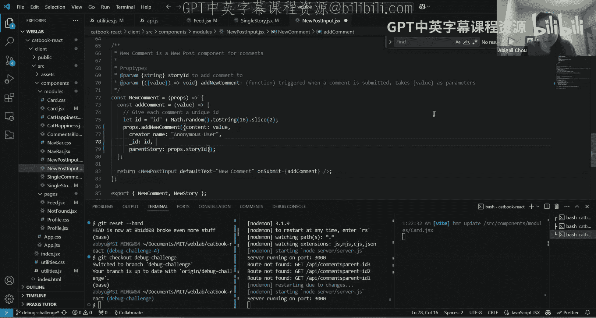

由于评论在发布后能立即在前端显示，说明前端的状态更新是正常的。问题可能出在将数据发送到后端，或者后端存储数据的过程中。

我们需要追踪一条评论从提交到发送的完整链路。

1.  **起点**：评论的提交发生在`NewComment`组件中（位于`newpostinput.jsx`）。当点击提交按钮时，会触发一个名为`addComment`的函数。
2.  **传递**：`addComment`函数内部调用了从父组件传递下来的`addNewComment`函数。为了找到这个函数的定义，我们沿着组件树向上查找。
3.  **溯源**：`NewComment`的父组件是`CommentsBlock`，而`CommentsBlock`的父组件是`Card`。最终，我们在`Card`组件中找到了`addNewComment`函数的定义。
4.  **分析**：这个函数的作用是向`/api/comments`发送一个POST请求，请求体就是调用时传入的参数。
5.  **对比**：现在，我们需要对比前端发送的数据格式和后端期望接收的格式。我们查看后端API文件`api.js`中的`postComment`端点。
    后端期望接收一个具有特定字段的评论对象。为了确认格式，我们可以查看现有评论的数据结构。
    通过对比发现，前端在构造新评论对象时，使用了`parent_story`作为字段名，但后端期望的字段名是`parent`。这个不一致导致后端无法正确识别和处理新评论，因此评论没有被保存。

我们需要将前端代码中的字段名`parent_story`改为`parent`。

```javascript
// 修正前（在NewComment组件中）
addComment: (text) => {
    addNewComment({
        "_id": String(Math.random()),
        "creator_name": "placeholder",
        "content": text,
        "parent_story": props.parentId // 错误的字段名
    });
}

// 修正后
addComment: (text) => {
    addNewComment({
        "_id": String(Math.random()),
        "creator_name": "placeholder",
        "content": text,
        "parent": props.parentId // 修正为正确的字段名
    });
}
```

保存修改后，发布一条新评论并刷新页面，评论现在可以持久化保存了。

---

## 总结

在本节课中，我们一起完成了Catbook应用第一部分的调试挑战。我们学习了：

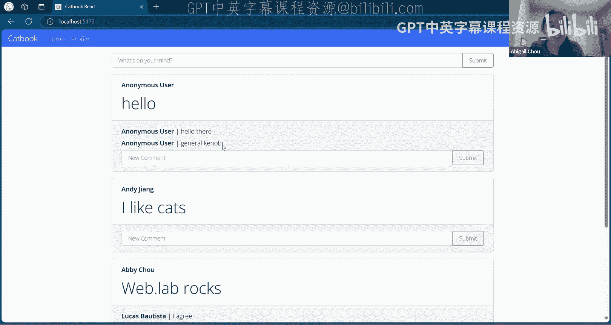

1.  **阅读错误信息**：如何从浏览器控制台和编辑器提示中理解错误来源。
2.  **理解React组件通信**：修复了因未接收`props`参数和`props`命名不匹配导致的数据传递问题。
3.  **调试网络请求**：通过浏览器“网络”标签页检查API请求，并修正了URL构造错误。
4.  **追踪数据流**：从前端表单提交开始，沿着组件层级和函数调用链，一直追踪到后端API，定位了数据格式不匹配的根源问题。

调试是开发过程中至关重要的技能，需要耐心、细致的观察和对系统工作原理的理解。希望这次调试练习能帮助你建立解决实际问题的信心和方法。