# 《Web开发快速入门｜6.962 Web Development Crash Course IAP 2025》中英字幕 p18 -18-Lets Debug Catbook Part 2 Answers (debug-challenge-2).zh_en -BV12Ux5zTE9p_p18-

I decided to be YouTubeber it was just like what's up guys。

 welcome to my channel today we're going to be going over react catbook debg challenge too。Okay。

Sorry， that was very random。It's 130 a。m。 and so I am。Mybra's local right。Okay。

 we're going to get checkout。Debug challenge 2。It says I have。Uncommitted changes。

 I could commit them， but I don't want to do that because I don't actually care about them。

 I could stash them or I could get reset dash dash hard because I don't care about my changes。

All right， so now I will actually get checkout debug challengeenge too。

And let's see what's going on here。 so I don't really care about these this was from before。

 Let's see how cat look looks and i'm going to make sure to。Andd command C。

 my NPm start and restart it just to make sure that no stuff that was like from the previous step is。

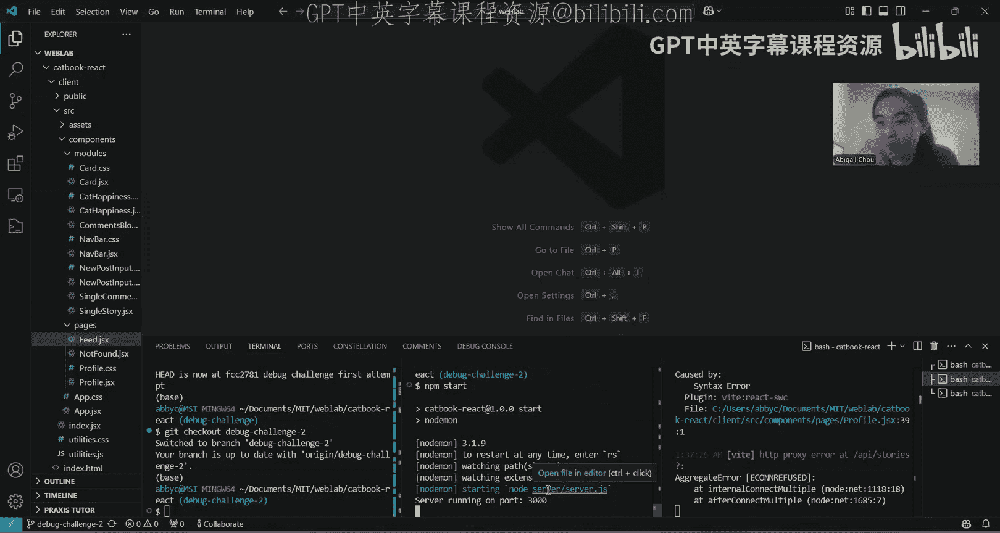

Persisting and messing up my new backend server for this step， Oh， okay。

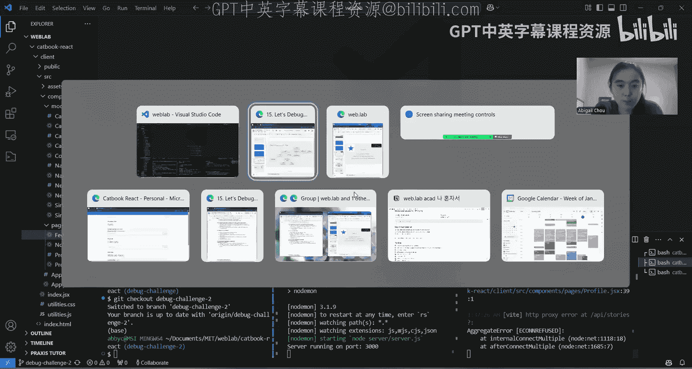

We're diving into it， we already have a bug。What is this JSX value should be either an expression or quote a JSX text。

In profile dot JsX， okay， here it says it underlines the thing where it says cat happiness here。

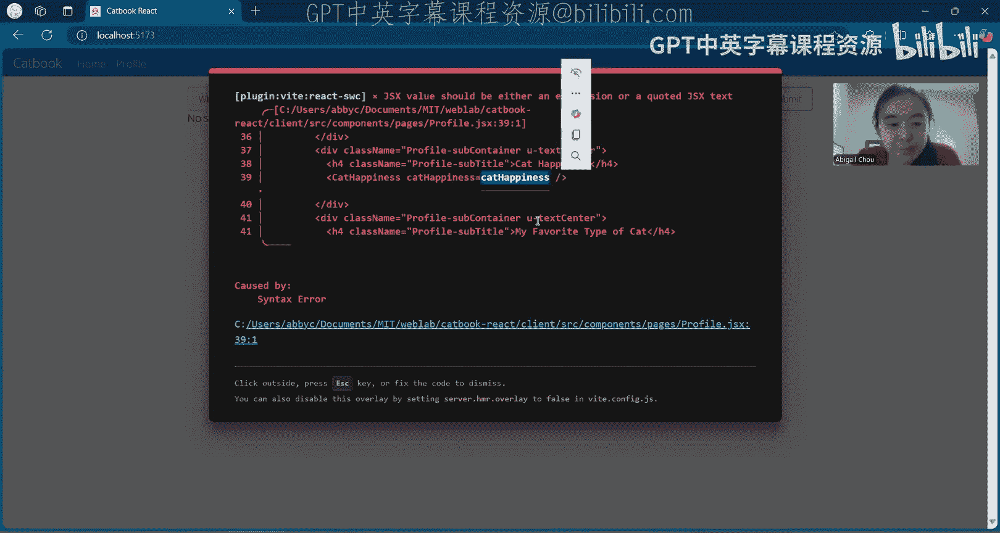

All right， let's open up profile。jsX and see what the heck is going on。Ah。

 syntax are right right here。Basically， what's going on here is we have the cat happiness。

 which is the react component。And then this is the name of the prop that we're passing into the react component。

 it's also called cat happiness。And then here we're going to pass in the value that we want to set the set as the value of the cat happiness prop。

Which should be a number。 That should be like 0，1，2，3， et cetera， for whatever our cat happiness is。

And so here， HTML doesn't know what this is。 And so we need to wrap it in。

Curly braceston denote that we're escaping into JavaScript。

And the reason we're doing this is because cat happiness in JavaScript is。😊。

The state that we defined inside the profile component。

And so this JavaScript state evaluates to whatever the state is， which is a number，01，2，3， etc。😊。

And so that number gets inserted into the HTML and then the cat Hiness component will know what to render。

😊。

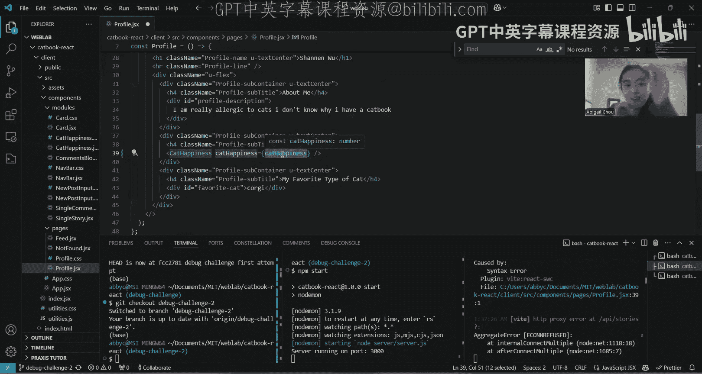

All right， let's reopen this up Okay， that should not be there。

 but let's just make sure cat happiness works properly Oh， we can't go to the profile page。

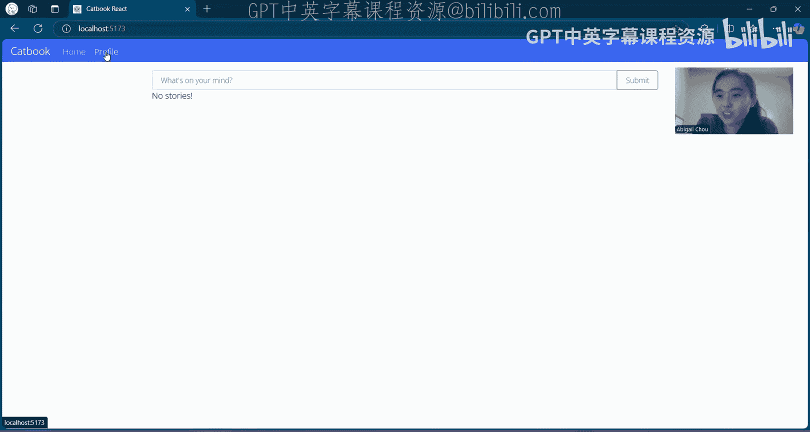

That's odd。So let's figure out why we can't go to the profile page I was just trying to go to profile page by clicking on the nav bar and the link in the nav bar so let's open up that and see if there's anything wrong there。

😊，Hm。😊，Here we have link to slash。And that says home。Here we have link and it says profile。

 but it's not linking to anything。We need to。Link to oh， not just regular slash。

 but we want to link to slash profile。Okay。😊，Let's see what happens and now recall that the。

Actual routing。Happens in index dot JSX。 so this index dot JsX is where。😊。

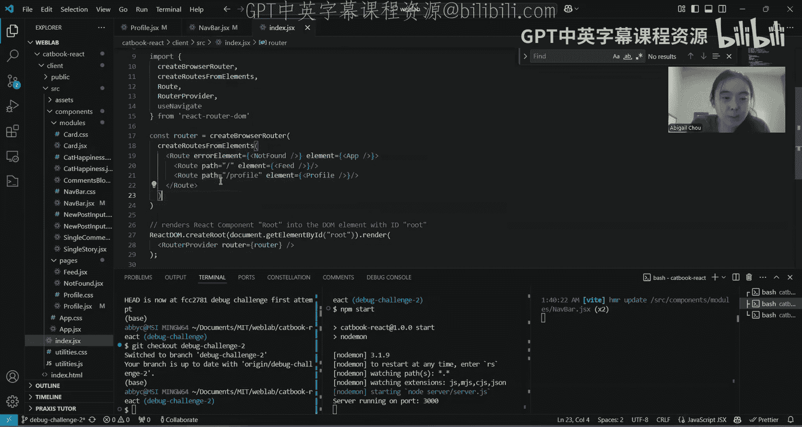

If we go to Local Hose 5173 s profile， this code is what determines that we should be rendering the profile component。

But this code is in the nowv bar that sends us to the profile URL。When we click on that link。

 so this will send us to the profile URL and then this code in index。

jSX reads the URL and determines， oh， I should be rendering the profile component。😊。

If I go into profile now， yeah， it works and I can click the chat happiness， amazing。Alright。

 what's up next。Well， one pro。One problem is clearly that we can't see the content of our stories。

 we can see who wrote it， but we can't see the content。😊，So it seems like the problem is。

Probably just that the content isn't getting passed down into whatever component needs to display it properly。

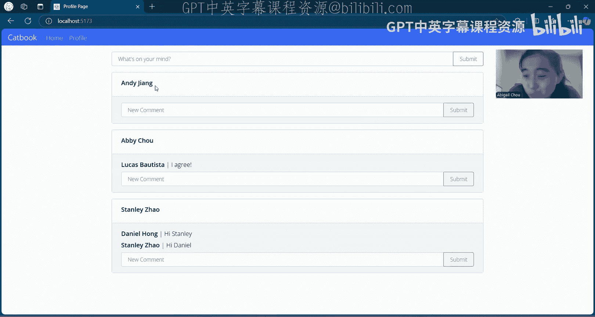

In that case， let's figure out what component is actually going to be displaying this content that we care about。

The content of our story。

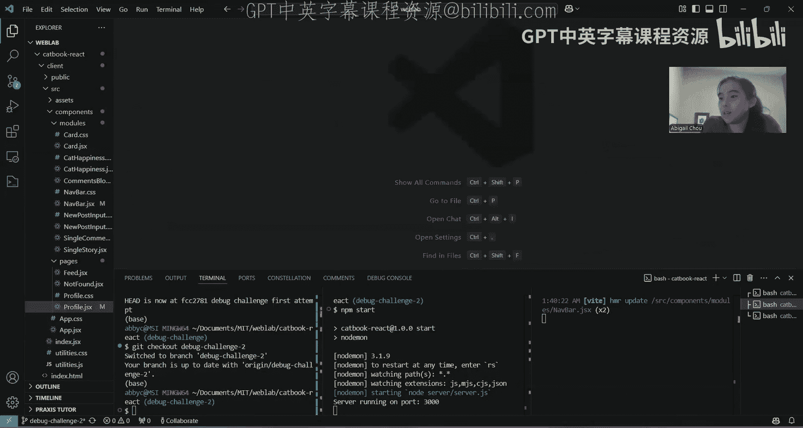

So if we look at our component tree。Here we're inside feed。 and then there's card。

 and then there's single story。 So the problem is probably in card or single story。

Whichever one is supposed to be displaying the content。

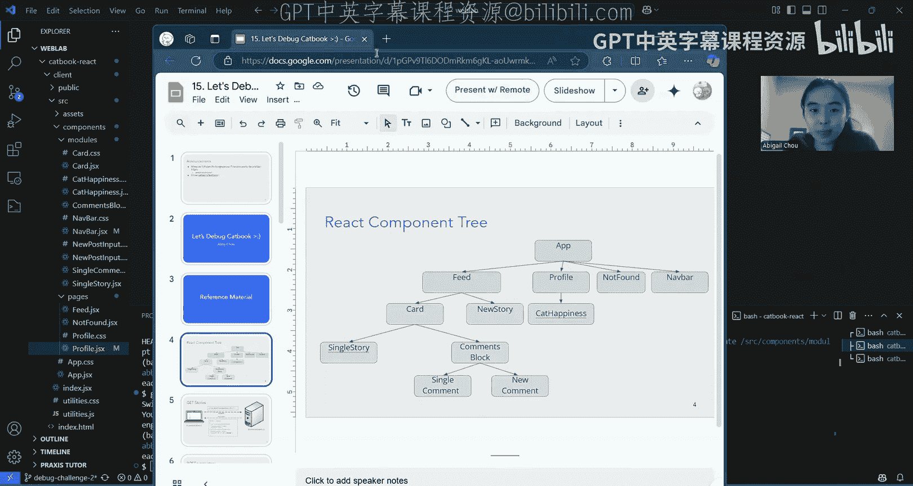

Okay， let's open up oops。Let's open up Car。jsx。It looks like。Card。

jss has a single story component within it that has a creator name prop。😊，And a content prop。Okay。

 interesting。So。Here， the interesting thing that is going on。Is。

It seems like Car is receiving creator name and content of the story as props as well。Card。

Is currently。Oops， okay。Card is currently receiving， oh my godness。

 as far as my computers travelinging。Receiving the creator name and content props from feeded。

 it parent。And passing them into single story it's child。

 So so it seems like create a name of content， start a feed， go into a card。

 then go into single story。 So we're going to have to trace that a whole line of how these props are getting passed。

对。So if we open up feed。jsx， we can see。😊，That here。Into Car。

 we're passing in a key ID and a creator name。

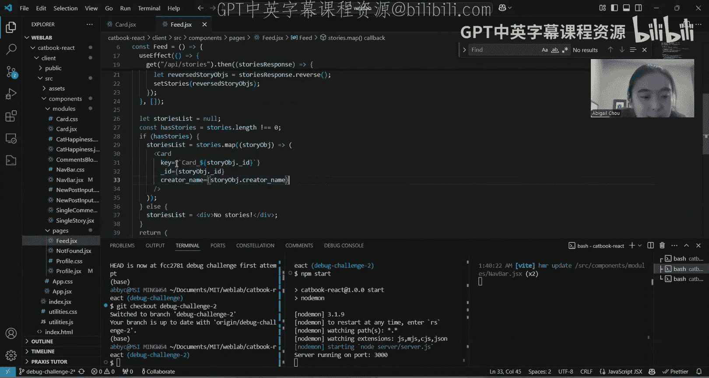

And then， in card。We should be receiving。Here， the comment tells us what we should be receiving because it's good documentation。

😊，Oh， we should be receiving an ID， a creator name and a content， by the way。

 the key is just something that Re uses to differentiate different elements。

 even if they look the same or look similar。😊，So we don't need to worry about that， but。

I P creator name O， We're not even passing content into card from feed。B okay。

 well let's just do that content equals and then what should we do it。

 what should we set it as well right now we're taking in using the map function on a list of stories。

 taking in the object and converting it into a card component so we're taking in the story object which is a JavaScriptscript object converting that into a card component So here content。

😊，Should be just story object。Dot content。So that will pass down into feed。

 which will pass down into card or sorry that feed will pass these props into card。

 which will pass it into single story， which will render it。😊，Let's see if this works。

 yeah it pops up， amazing。😊，Okay， let's see if there are any other bugs。That。

We need to deal with a lo。 Oh， that's delightful。 I tried to post a new story。 Anna did not work。

So here's the interesting thing is that it did post a new story but this new story has no content in it so clearly we're sending something to the server we're sending some kind of request but。

That content， somehow the content is not getting transferred properly。

So let's figure out where we'll figure out where we're receiving the request on the server side and where we're sending the request on the client side。

😊。

The place where we're going to send this post request to create a new story is going to be in feeded。

asx， you could find it， but I just know it。

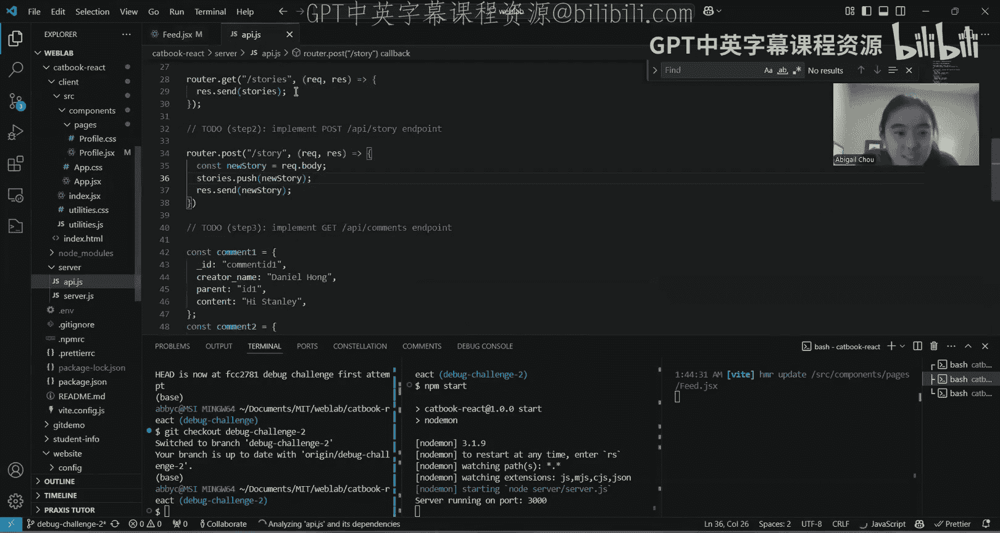

And then where we're going to be receiving that request is on the server side and APIpi。

js so feed is front end API is backend。😊，All right， let's find where this request is。Okay， here。

 when we want to add a new story， we're sending a post request to slash APIpi/lashtory with a certain value。

😊，Okay， that's cool， but。We don't know what that value is。

Because we haven't called this add new story function， we've just defined it。

 we're defining a function here。So we need to figure out where this add new story function is being called。

I am going to see ah， it's passed into the new story component。As a prop。

 let's open up the new story component that'll be in new post input。jsex。

So here in the new story component， we're taking in a prop。The Prof has add new story。

And here in New storyory， we're calling it。Okay。So， in。Feed。We're defining a new story。

And then actually， I'm going to let's screen this guy。So on feed here， we're defining our new story。

 we take in a value and we send that value as the post request to as the body of the post request。

Two slash API slash story。But then here。When we actually call this add new story function。

 we're calling it with nothing。That seems like it might be wrong because I'm pretty sure we want to send some value to the server。

As you might have remembered， when we want to post a new story， typically， we want to send in。

In the request body。The information about the story， the ID， the creator name。Parent。Oops。

That should not be there， just content。ID the creator nameman the content of the story。Yes。

I think I copied and pasted that slide wrong。

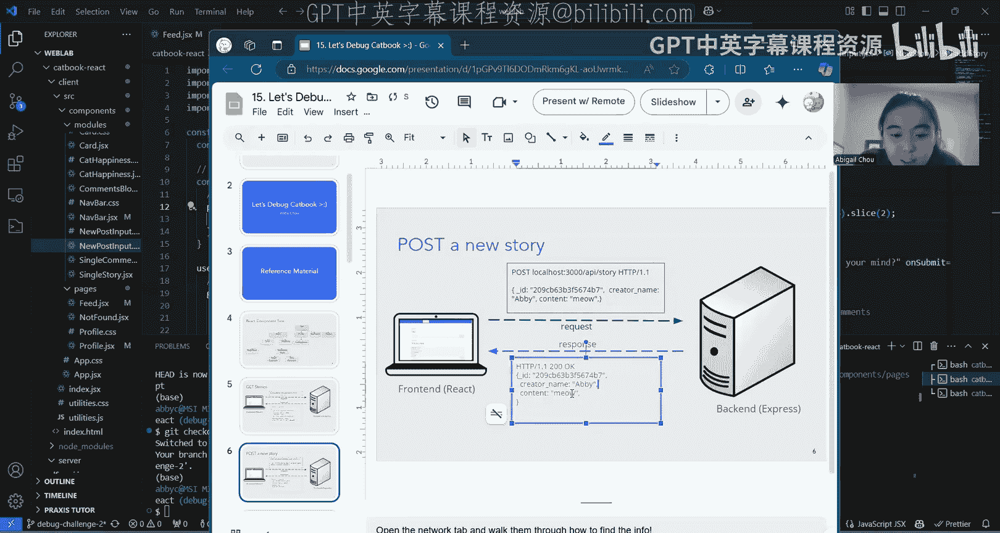

Yeah。All right， so it seems like we need to actually be putting something in here so that that's something。

😊，Actually gets passed to sent to the back end inside the post request。

So let's see what we're going to put， we'll put underscore ID。Is。

This ID variable that we have defined here for us very nicely。

And then we're going to put the creator name。Oh， and how I know。What this should be。

 what this should look like is because in the back end， we have these sample stories defined。I mean。

 I could like look through the code and see what attributes are being used in the rest of the code。

 but that's the shortcut is just to look at how these these guys are defined in in the back end because we know that this will be consistent with however we get the stories and things。

So here。We are going to have an ID creator name will just be anonymous user for now。And then content。

What is the content going to be Well here this add story function takes in a value this value。😊。

Is actually getting past to it from wherever this add story function is called。🤢。

This ad story function。Is called when on the onemmit。Whenever we hit that submit button。

Inside new post input so inside new post input， it takes in this on function。

And we use that on function here。And we pass in the value in this case。

 the value is the state of new post input。And that value is holding whatever I'm typing into the new post input like input box。

I'm just going to tell you that we can dive into the code。

 but for the sake of time you can dive into the code or ask chatTP what's going on yourself。

 and I will just tell you that value is whatever you've typed in it's just a string。So here。

The content of our story will be value because it'll be whatever we just typed into the input box。

Okay， now we have successfully。Written this code to call add new story。

 which is passing a new story as a prop with all of this information about the story。

And recall that a new story is defined in speed。To take in that value， which in this case。

 confusing names， unfortunately， which in this case is the JSON object or the JavaScript object that contains the information about the story。

😊，It'll take that， send it across the internet to the server as part of the post request you created a new story。

And so hopefully that will work now。Okay， hello。嗯。Just to get some ridiculous tu in your head。

It worked if I repress the page， it's still there， amazing。Okay。Next up。

Let's see what happened when I try and。Post a comment。Oh， that's not fun。

 it doesn't post whatever could be wrong。

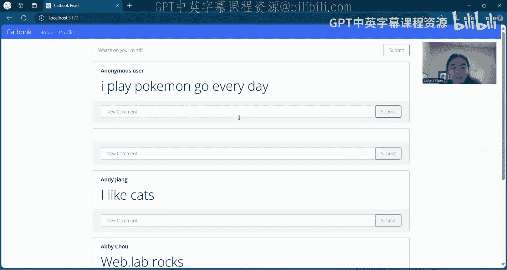

So let's find out where。Typically， since I know that the comment didn't post didn't go through。Well。

 there's two possible places it can be can be in the front end or the back end and I think i'll just start off with looking at the code where the post request to create a new comment is being sent I could look in all sorts of different places to start。

 but I'll stay there。So where is the post request being to create a new comment stored that's in card。

jsx？So here let's find here， we're going to post a comment inside the An comment function。

And then take that comment that we receive back from the server， add it to。

Our front end comments state。 So that seemed right。嗯。🤢。

I guess we need to make sure that this post request to slash API scomment is being sent properly。

Most importantly， I know that it's being sent to/ APIpi/com。

 but I don't really know like what is being sent as the body of this post request。

Now two ways to find that out one is find the code where the post request is being sent two is to look in my network tab。

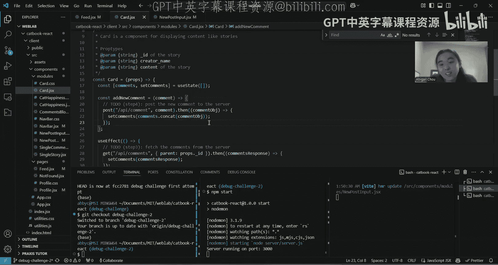

I'm going to open up the network tab and I'm going to try。Sending this， oh。

 no post request is being sent， that's odd， that's how we know that the error is in our front end。

 not in our back。

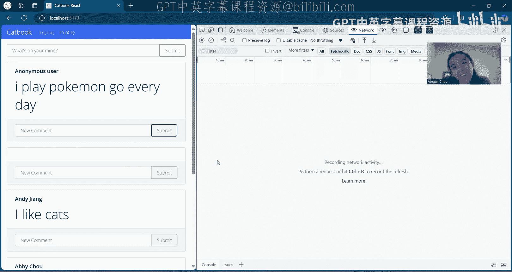

Okay， so we need to figure out why this post request is not being sent。

We need to figure out if if this add new comment function is even being called because if it's not being called。

 then that would make sense why the post request isn't being sent。

 so where is this supposed to be called？I hear。We're passing add new comment into our comments block。

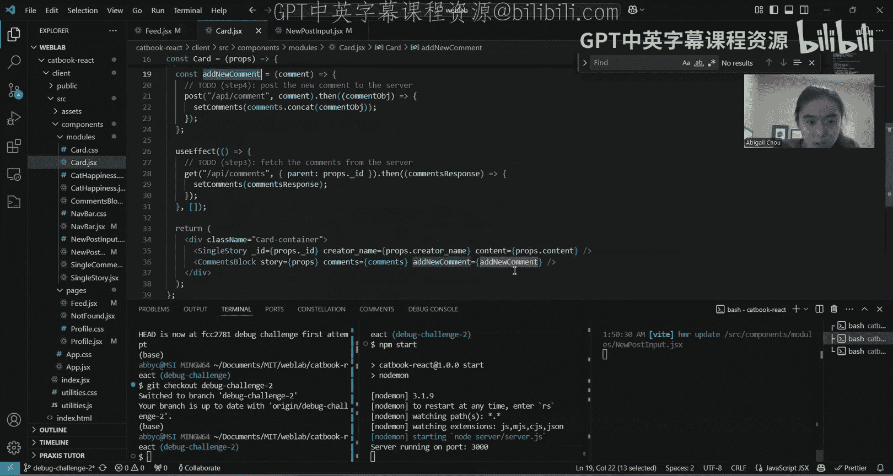

Interesting， okay， so let's。And if we look at our。Where's our react pot？Here's our react poetry。

Here we are currently in Car do Js and our。Sorry， our add new comment function gets passed into comments block。

And then from there， it's probably going to get pass into new comment because single comment does really have much to do with this。

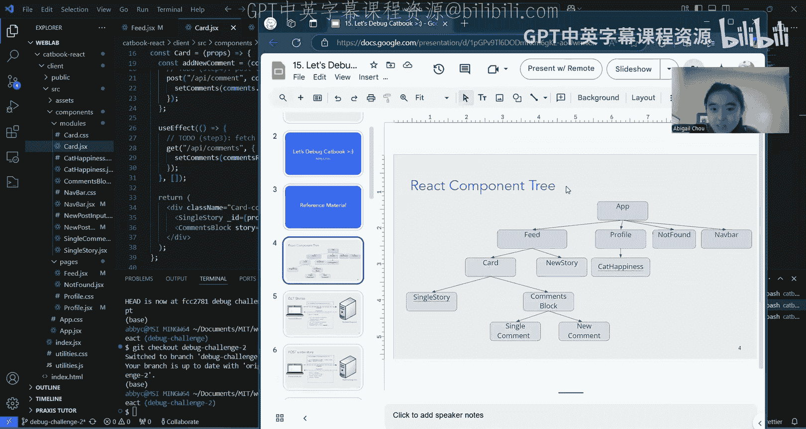

So let's go to。Comments book。And sure enough。Comments block。诶。Yes， Thomas Va takes in a prop。

Add new comment and passes it into the new comment component as another Pro also named add new comment so let's go into new comment oops sorry that should be a new post input。

And find the new comment component。And here we will。Here we notice。That。

We've taken a prop at new comment。And we call this， yes， yes， we call the function。

 this prop add new comment here with all of the information about our story。

 great that should be exactly as it's supposed to be， right？

Butum I noticed that this is grayed out and oh， well， that's odd。This add new comment。

 this add comment method is never actually called。What's it supposed to be？Well。

 it seems like this is supposed to be passing a new post input as the onsum。

 It seems like here in new post input， we don't pass it in onsum， which。

Is kind of important for a new post input we need a function in order for a new post input to actually do anything when we hit the submit button。

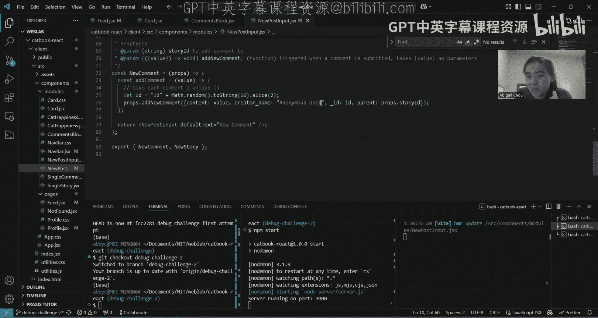

And I guess that makes sense because I type in whatever I want。

 I hit submit and it's almost like nothing happens， I mean the box empties out but nothing happens。

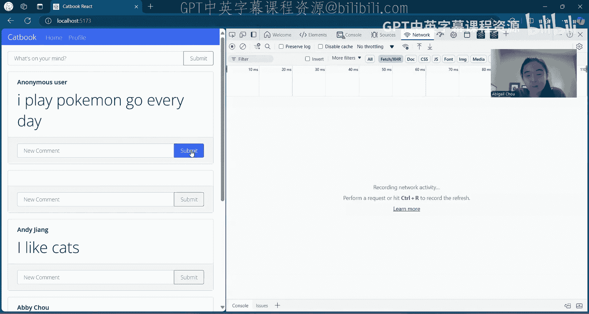

So let's pass that in as the ultimate。Then we're going to pass in our add comment function that we defined here。

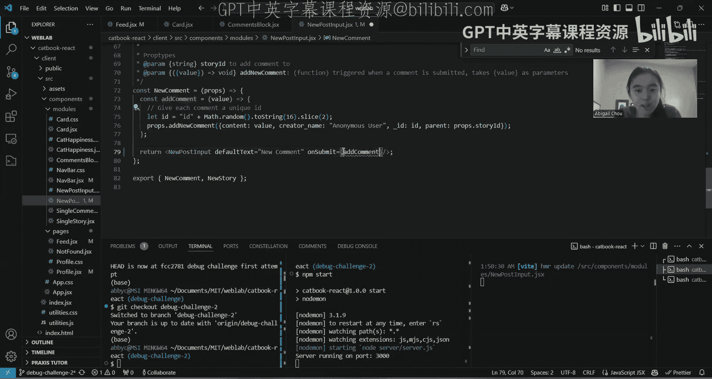

Now， if we go back。Let's try adding a comment。And okay， that looks good。

Just some nice brain rock for you guys and I refresh a page and the comments are still there amazing。

Are there anything left in this step？All right， I think that is all for this step。Step two。

 congrats you guys made it through most of the hard stuff。

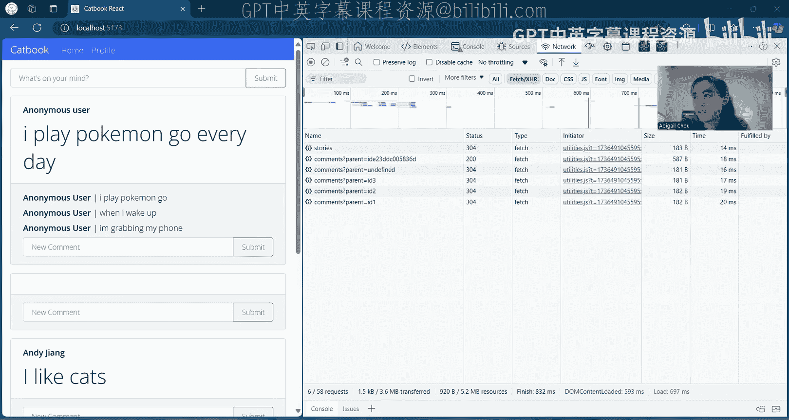