# 《Web开发快速入门｜6.962 Web Development Crash Course IAP 2025》中英字幕 p20 -20-Lets Debug Catbook Part 4 Answers (debug-challenge-4).zh_en -BV12Ux5zTE9p_p20-

Welcome back guys for the last video of our let's debug Catholic challenge answer key videos of sorts so I have already done get checkout debug challenge4 and closed out and reran my MPM start terminal here。

So now let's go and see what the heck is wrong with catbook。

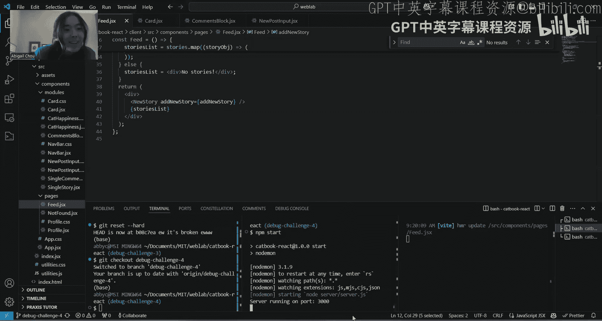

Oh， whitescreen， that's delightful。Parter tip， anytime you see a white screen like this。

 always go to the JavaScript console， typically you'll get a more detailed error message here。😊。

Uncon syntax error， the requested module b b new post input does not provide an export name default Well what the heck does that mean？

😊，It has something to do with the exporting and importing of components。Okay。And。

Something to do with feed and new post input， so let's just look at what's going on in new post input。

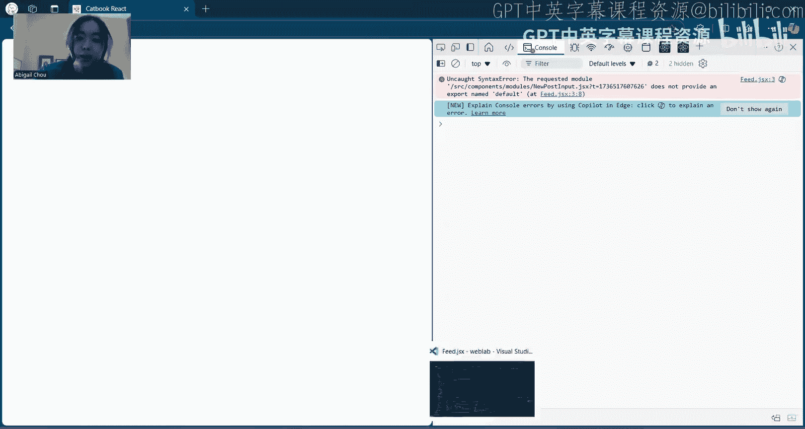

So feed， we're importing stuff from new post input。And then in new post input we exporting stuff。

Okay， so a basic primer on exporting and importing things， which if you see that I put on the slides。

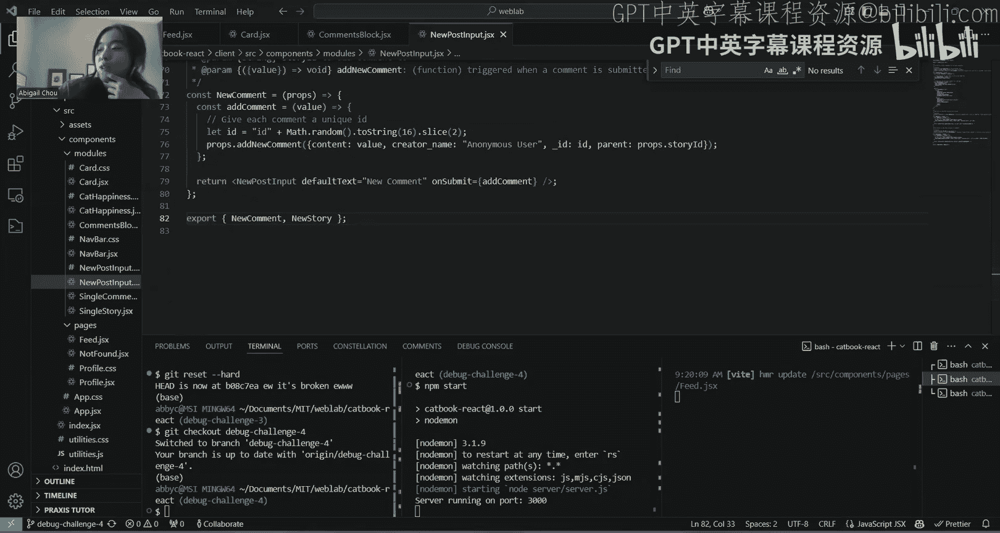

A little guide here， if you open this up， you should be able to read about everything that I'm about to say。

 but I'll say it right now because I don't want to just scroll through stuff and make you read it。

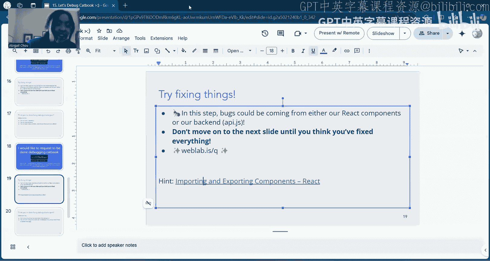

So typically when we want to use a component in another component， let's open up a single comment。

We have one component in a file， we define it in the form of a JavaScript function。

 but this is a special thing， a react component， and then at the bottom of the file we do export。

 default， and then whatever our component is。And that means that is the default export for this particular file。

 And so what I want to import single comment in its parent。Its parent componentent comments block。

Then so I can like use it inside of my parent component。Then I need to import it。

And so this export statement down here is what allows me to import it in any other component。

And what makes this special？😊，Is that word exporting as a default。

 which means that it's the standard， I don't know， the only export that we want from this file。

 and so when we import it， we can just import it like this。

But import if we export multiple react components out of the same file， for example。

 in new post input， we have the new post input component which does not get exported。

But then because that's we're not actually putting a new post input on our site。

 We're just using the new post input to create new story and new comment components。 But anyway。

 we define a new story component here， a new comment component here and we want to be able to use both of them in。

😊，Our other react files， our other react components and so here we're just going to we just export multiple things。

 we export new comment and new story and we surround them with these curly braces。😊。

I note here that this does not have a default export。

 it just has both of these two exports and then wrapped in the curly braces。

And so if we want if we're in a different component and we want to import either new comment or new story。

😊，Then。We have to surround it with the curly braces here we surround it with the curly braces because new comment is not the default export or new post input dot Js and so if we just。

And so these curly braces basically tell reactact， go in and select the import that is named new comment。

 basically。If you want more details on how that works。

 feel free to ask us at office hours or something like that， but that's the gist of it。

So with that said。We had our issue somewhere with regard to new post input。

 that export here and feed。 So I'm guessing that error could be in either one of there。

 So we're exporting， new comment， new story。

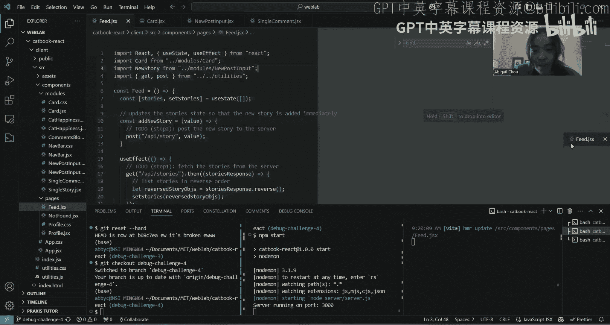

And then here we're importing news story a well， here's the problem news story。😊。

Doesn't have these brackets around it。And you'll notice。That what we're getting here。

 the error that we're getting is it says new post input does not provide an export names default。

Well， the reason why that makes sense is because here， since we don't have brackets。

 it's assuming it's just saying okay， take the default export from New Post input and import that into this file and call it New storyory。

But there is no default export from new post inputput。jsX。So。😊。

This gets confused like where is the default import or export out of the post input competitive？

So here we just need to surround this guy with our nice little troley braces。

 the spaces are optional。😊，And let's see if that Eric goes away。Yeahay it oh。

 there's a new error now the requested module feed does not provide an export name default。Okay。

 so feed is imported into index。And exported from fees。

 let's book at both those places and see if we can find where the area is。

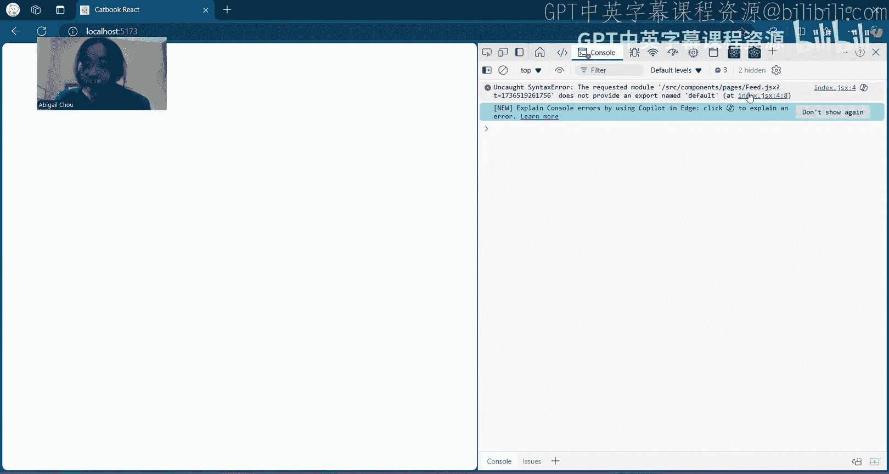

It's probably either where feed is being exported in feed。jsx or where it's being imported in index。

jsX， so we'll open up both of those。

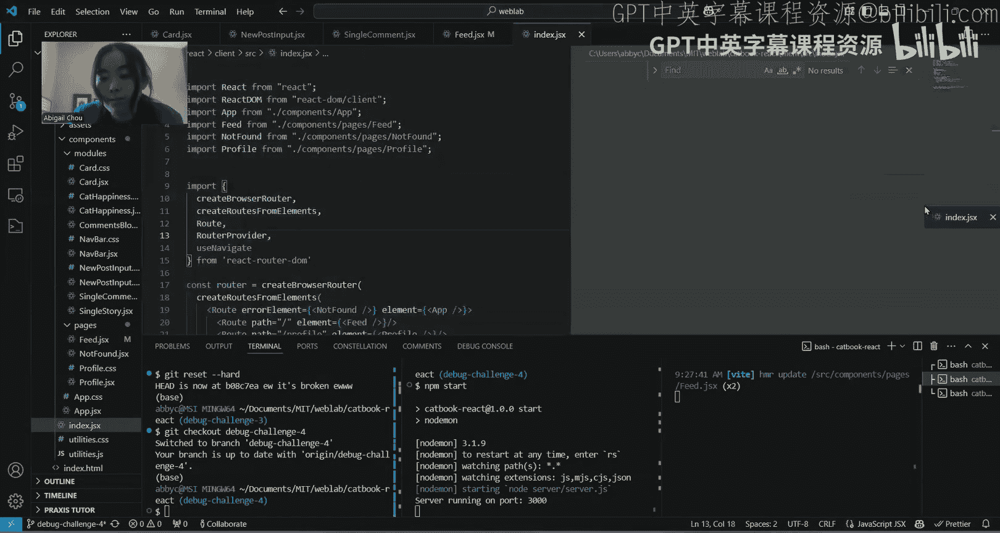

Okay， so here we're importing feed from feed。And this path looks right。 We're importing。

And it should be the default export here if this is going to work。But in the bottom of feet， oh。

 we're not exporting feed at all。Tragic export default feed。

This is the only component defined in this file so we can just call it as the default export。

Easy money， let's see if that worked。Yeah， it shows up amazing and we don't need to worry about these warnings。

Okay。😊，So now let's try and at oh。This seems to be odd。

I think there were only supposed to be like two comments under this one and two comments under this one。

 but all of the comments are showing up under every single post。That seems to be problematic。

So there's probably some kind of。Problem with how we're getting our comments from the back end。

 Let's open up the network tab， as we always do。Refreshshed page and。

Take a look at the request that we're sending here， so we have comments， parentent ID equals three。

This looks exactly right we're sending a get request to our local host server/ APIpi scom with a query parameter of parent ID3。

Get request we received back something from the server。Okay。H string parameters。

 parent ID3 looks good。And let's see what we get back is the response we get back all three comments。

Better appearing here。So it seems like the front end is doing what it's supposed to be doing。

 it's sending a get request to slashAPpi/comments with a parent and then taking the response it gets back from the server and displaying it。

😊，ok。That's。Fine， so that means that the air is probably somewhere in the server。

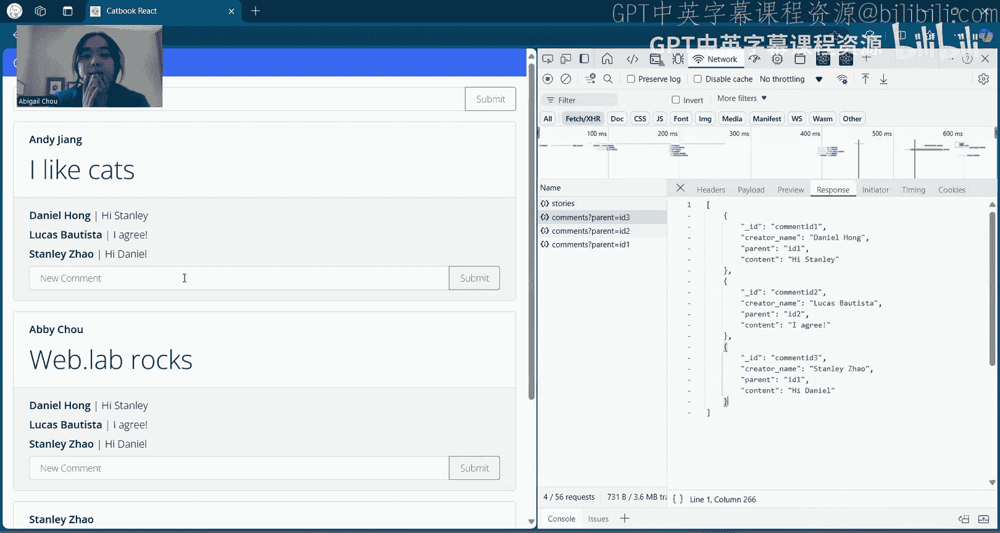

Then were in APIpi。js， let's look there。嗯。Okay， here。Rtor。/comments res。send。

 so we're taking comment。 parent storyory and rec。tquery。 parent storyory okay。嗯。

Let's just puzzle log what these things are。Let's log parent comment。 parent storyory。And console。lo。

Rect docqueried dot parent story。Because it seems like the error't filtering since。These things。

 like。Since we're displaying all of the comments under every post seems like we're not filtering things properly。

 so I'm just going to see。Whatum。Oh， well， I suppose we need to。All right。

 you know what I'm going to do， I'm going to put this inside of the callback on。Or actually。

 you know what， for the sake of debugging to make my life easier。

 I'm just going to do like comments at index zero， I'm just going to take the first comment。

 print the parent story and maybe we'll notice a pattern if we don't I'll just print more of the comments parent stories。

So we'll print these guys out。

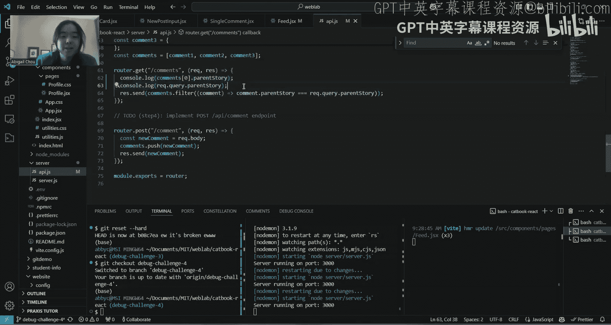

See what's going on here。So I'll refresh the page again to make that request these requests again。

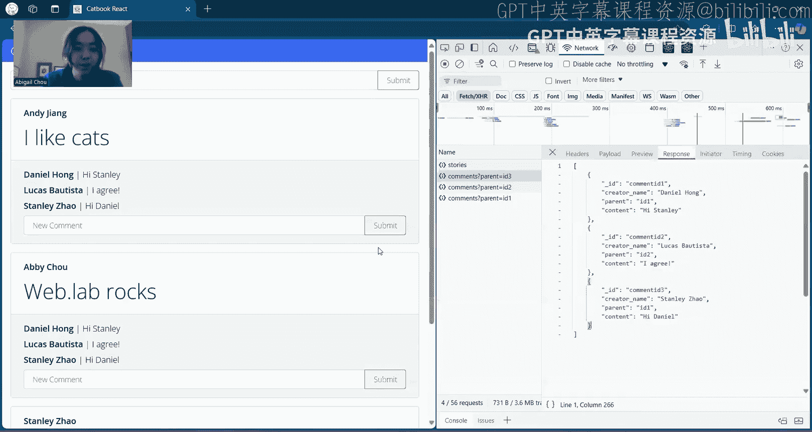

Go back， and。All of our console。 log since we're in api。

js should have been sent to the terminal where we're running our server。

 also known as the terminal where we're running MPm start。And here we are logging， ah。

 we're logging undefined。So it's saying both comments at an next0。

 parent story is undefined and Re query。 parent story is undefined。

I guess that would make sense if every single comment has。

Unfined as its parent story and undefined as the recdot query coming in， then this like comment。

par storyory equals recdo queryry。par story is always going to be true。😊，So basically。

 this is always going to be true and every single comment is going to display。😊。

But that's kind of not what we want， let's make sure that these are correct because these should not be undefined。

So comment dot parent story。Let's look at our comment objects here and oh。

 there's no field called pair storyory， supposed to be called parent。Well， that's an easy fix。😊。

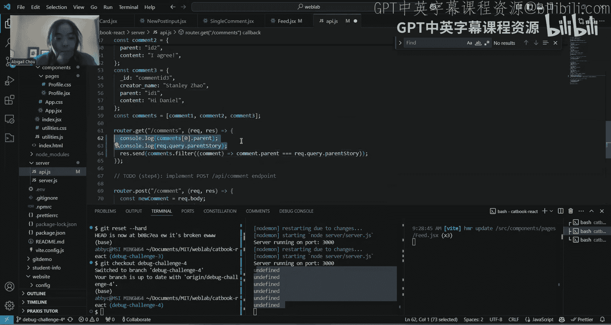

I'll leave that there for now， actually。Let's try this again。 Oh， now。

 no comments show up under any story。

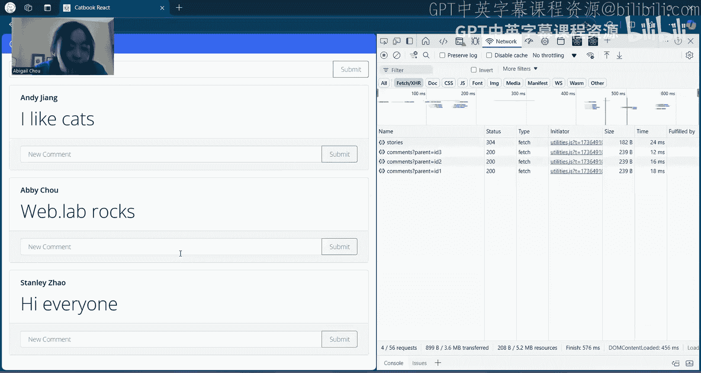

Ah， because here。Rec dotquery。 parent story， there's no。A query parameter called parent story。

 a query parameter is called parent。😊，So again， delete that。😊。

And then now I know that this is fixed because I'm the one bracket。

 so I'm just going to delete these console logs。And then we'll go back。

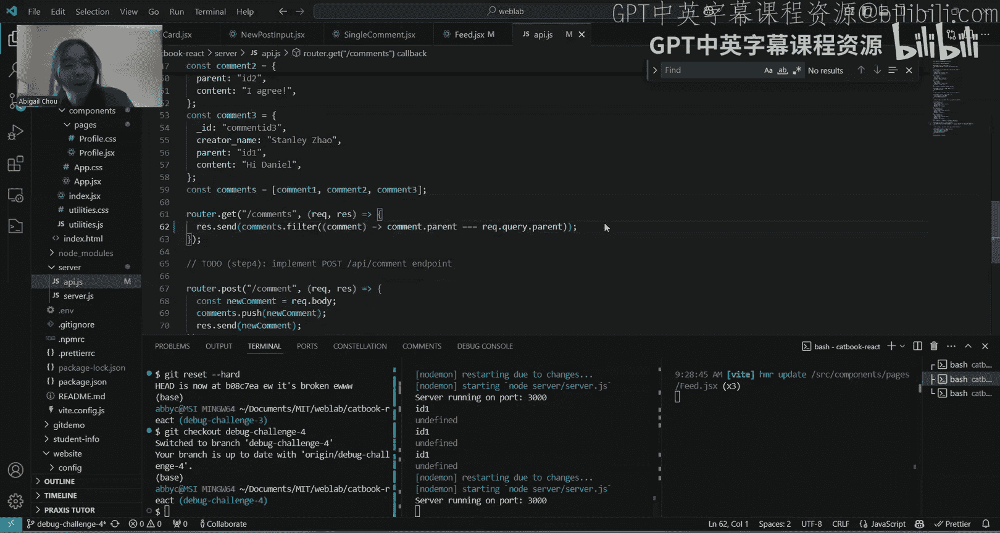

Yeah， it works now。And then if we wanted， we could test out adding stories， adding comments。

 et ceter， actually I'll just test out real quick。Hm， that's odd。 I just posted a new story。But。

I didn't render the story on the front end。That's odd， okay， well let's see。😊。

If the request went through， okay， so I made a request to story。To localhost/APtory。唔，系。

Response headers， No response headers。 All right， odd。

But it seems like back what I sent to the server is correct， is just the content creator name and ID。

Let's see what I got back from the server。And again， just as a reminder， if you want to。

Like check what's going on。In the request and response， you can look at the slides to reference。

Let's look at what we're getting back from this， oh， oh， literally nothing。All right， well。

 that explained something because when we post， remember how we defined our post request that we we should send back from the server exactly what it got from the front end。

😊，The story that we just posted。

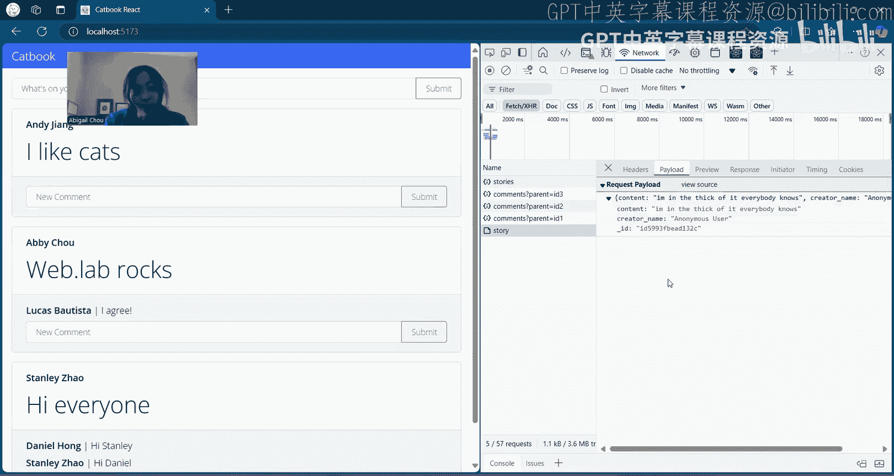

So let's find that in APIpi。s and make sure we're setting back what we should be。

Here's our post request for slash story。And ah， so we're adding stories to the list。

 but we're not sending it back to the front end。

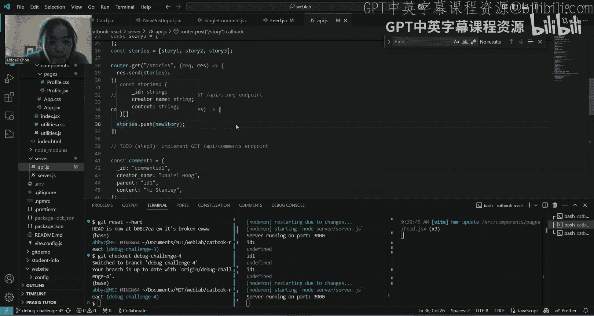

Well， let me just refresh the page and see if it appears when I refresh a it does appear when I refresh。

😊，That tracks with the fact that we're adding it onto the array of stories and so next time we call a game request we're going to get that back because it's in the stories array。

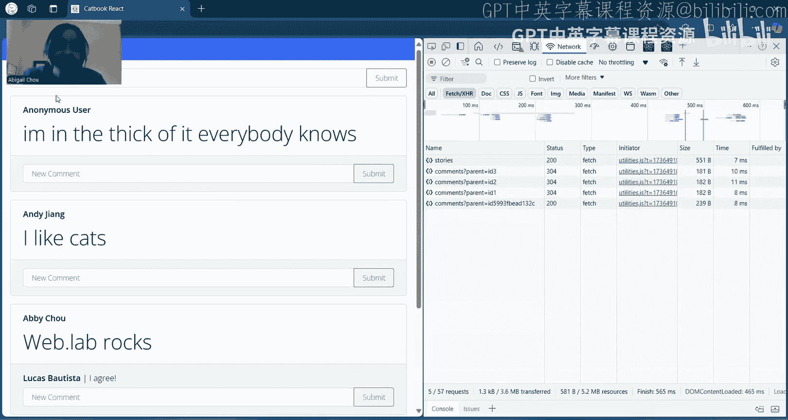

But we're not sending it back to the front end， so that's an easy fix res dot send。

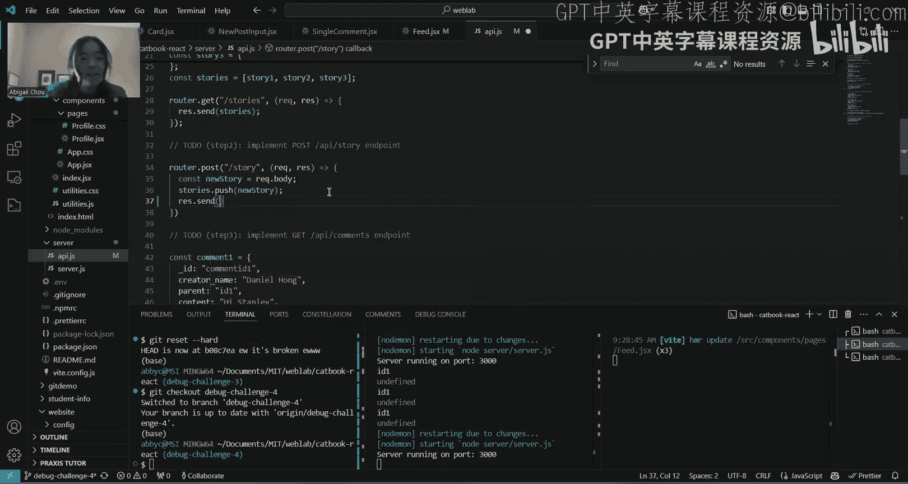

News story。Now let's check to see if that worked。All right， still didn't work。

But let's take a look at the request。But if I refresh page it shows up yeah amazing oh no my request is coming because I can refresh the page from the network tab。

 all right。😊，Okay， I look at the request。Here's what I said。The request looks all right。

 it's a post request I got a response back with 200 okay。

 that's promising before I didn't even get a response。😊，And。Okay， the response looks great。

 it's just the story that I just created。But it's still not showing up when I。

When I when I hit the submit button， so maybe there's some kind of problem on the front end now because the requester respond look exactly as they should be。

 maybe there's a problem with how the front end is displaying what it gets back from the server。

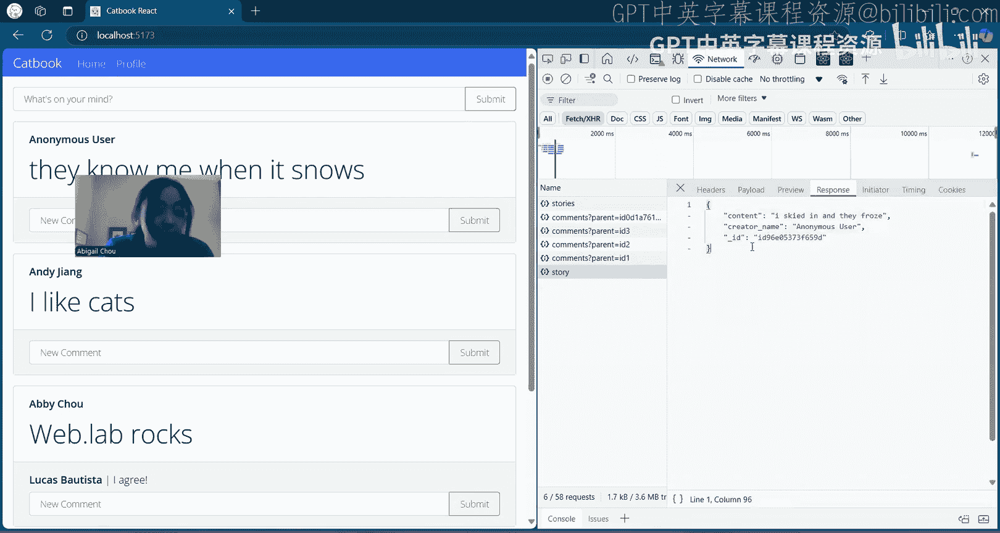

So where is this request being made， it's made in feed。jX。Inside of the add new story method。

So inside the Add new story method， we take in a value。

 which is that JavaScript object representing the story with the creator ID， the content， etc。

And then here， what we're doing is we're going to。😊。

Post make a post request to slash API slash story with the value and we looked earlier in the network tab it looked like that request was being made okay。

 so it doesn't seem like there's a problem with this。But oh。

 we're not doing anything on the front end， we're not updating the front end at all。

 we're just sending a post request to the server。😡。

That would make sense why we didn't see any immediate change on the front end when we posted a new story。

So what we need to do is that as soon as we get back a response from the server。😊，We。

Take that response， pass it into a function that will update the front end。

And recall that this is a callback function， we're passing a callback function into the dot then that says when I receive a response。

Or let's say story response。Then。When I receive a response back from the server， then do something。

 do something with that response。So what I'm going to do here is i'm going to change the react state that holds the stories now recall that there's an array that holds the stories on the back end。

 but there's also an array that holds the stories on the front end and that's what is。😊。

Displaying the stories all the point。So I'm going to use the set Story state center method here。

And I'm going to set it to the old stories and adding this new story。😡，But。

I am going to make sure that the new story is at the top because it's the most recent one。

 so I'll do story response。Not concat。A storiesies。

So this is what stories used to be and I'm just adding the new story response at the beginning。

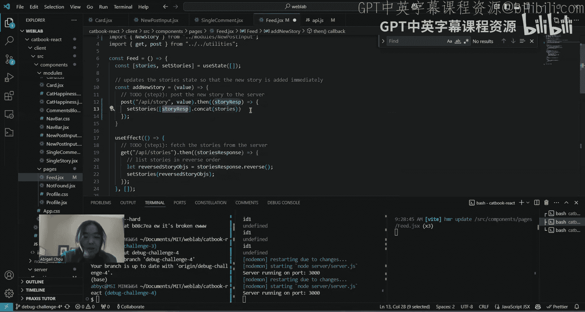

All right， let's see if that works。Hey， it works and immediately updated。

And now we could test it out some more but because I'm the one who broke this I know that this is all of the bugs for debug challenge for if this video was too fast for you or don't worry feel free to take as much time as you need to go through it go through the code really dive into it and come to office hours if you have any questions Thank you。

😊。

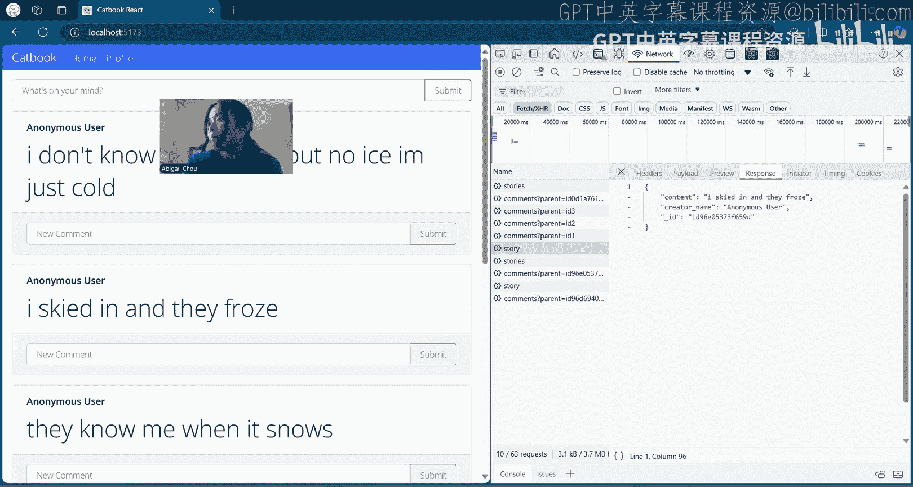