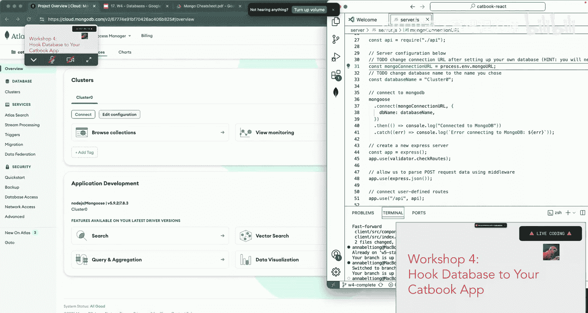
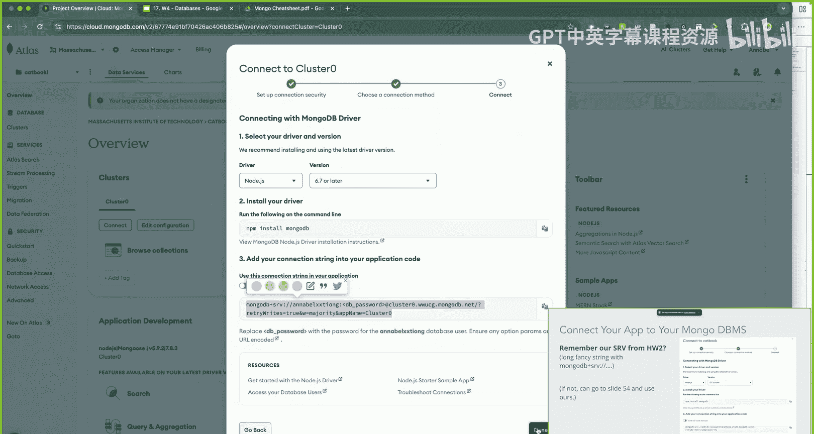
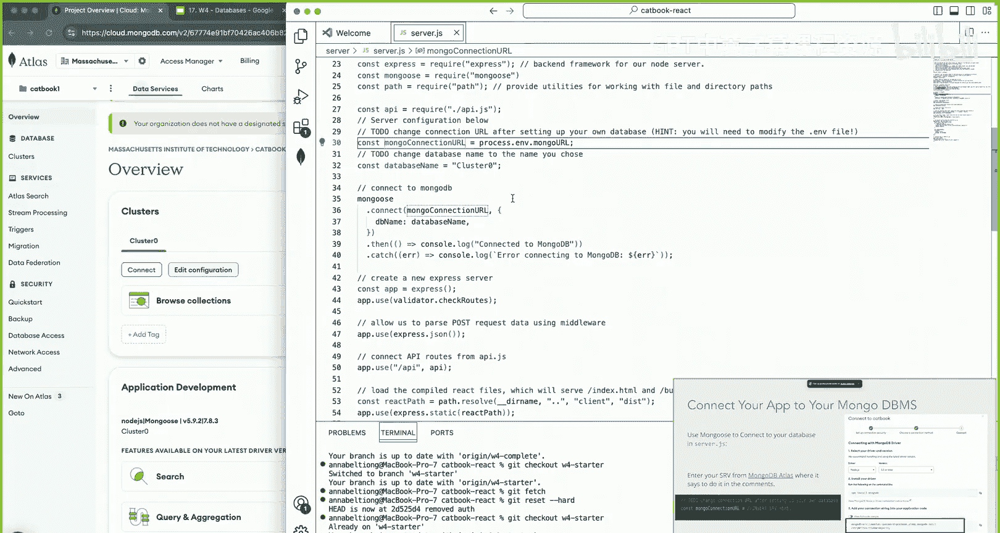
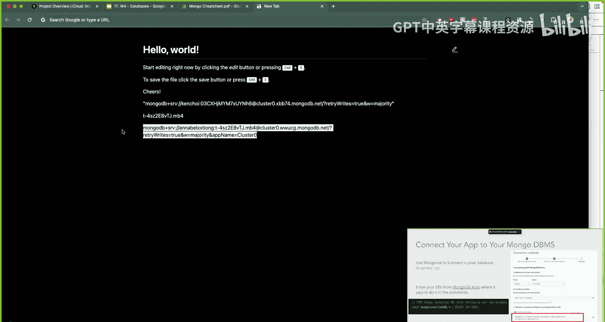
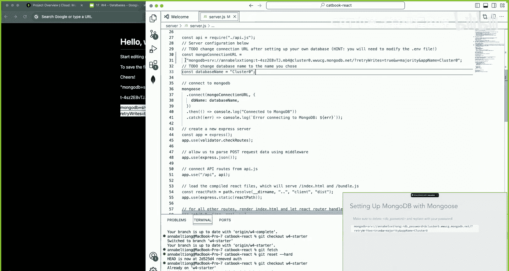
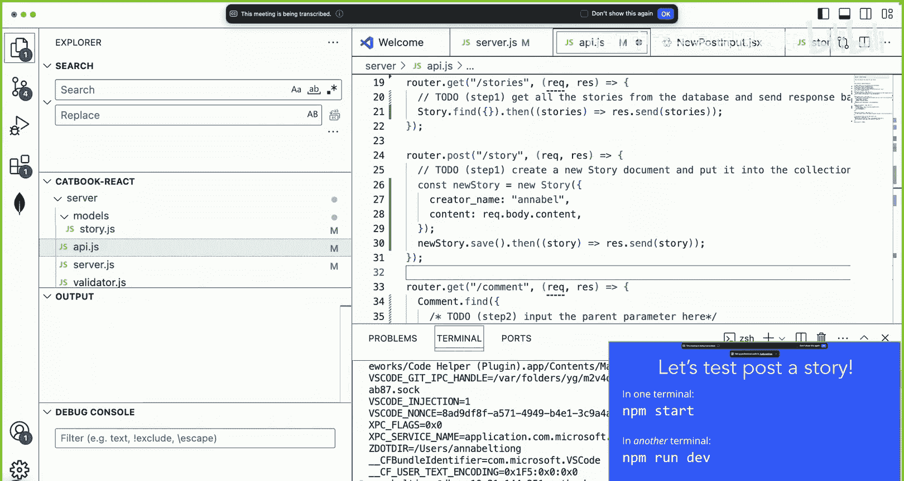
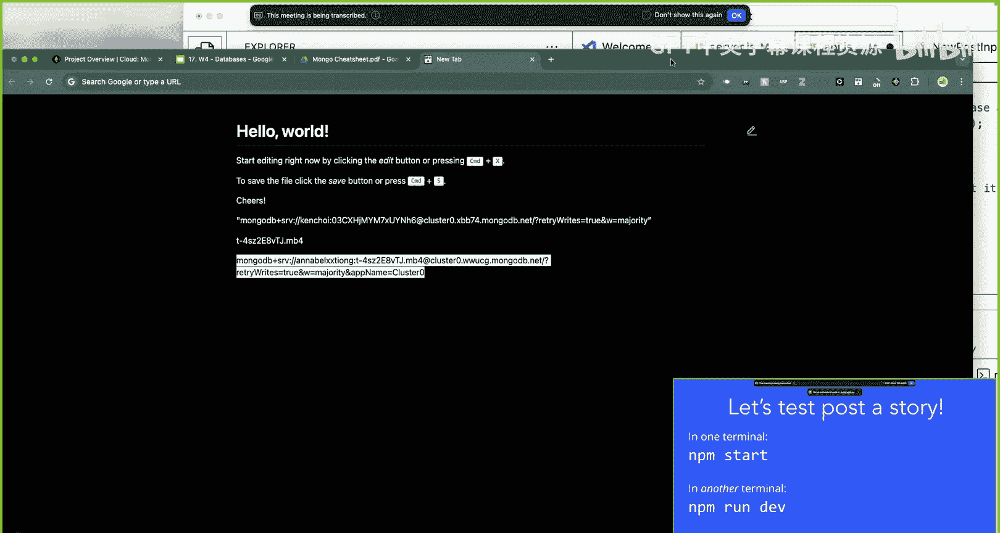
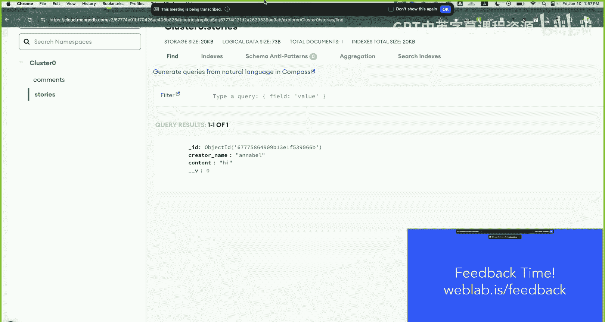

# 《Web开发快速入门｜6.962 Web Development Crash Course IAP 2025》中英字幕 p22 -22-MIT web.lab (6.962) - Day 5_ Workshop 4 (Databases).zh_en -BV12Ux5zTE9p_p22-

So now we'll start workshop4， where we'll hook the database to your cat app so you'll end up storing all your user information。

 story information and comment information in Mongo DB。Be good。

Okay。So now we're going to move on to the live coding portion。 So get ready for some。Workshopping。

 So in today's workshop， we're going to hook our backend server with our Mongo database。

 We're going to create models for comments and stories。

 and then we're going to modify API endpoints to use the Mongos models that we create。😊。

If you want sample code to follow along with， you can go to webla。

s/mongo and it should have a lot of helpful code snippets there to get you started。Okay， so first。

 we're gonna connect our app to Mongo Db using Mongos。

 so you guys should have already gotten your connection string in homework 0。

 But if you need some help or like with getting it right now。

 feel free to hop on the Q and as staff can come help you to start， we're gonna get fetch。

 get reset dash hard and get check out W4 starter。😊，Okay， cool。So if you guys were sorry。

 it's actually homework too。 But if you guys remember your S RV， which is this long。

 fancy string that should start with Mongo DB plus S RV。😊，So you wanna get that。

 and then you wanna copy and paste it into server do J S。

 So if you go to Mongo D B and you should have like a database for your project or whatever。

 you can click this connect you。 and then you should get your。Connection string right here。

So I'll give you some time to find that。

And then once you have that， you just want to go to server。 JS and under。Oops， if we go to。嗯。This。

Const Mongo connectionion URL， where it says process do E V dot Mongo URL。

 You want to copy and paste your connection string into there and replace this。

So， I'm gonna copy mine。

K， and let's paste that right here。Okay， raise your hand if you need more time with this step。

Okay cool， everyone's good。Oh oh。Oh， okay， okay。 yeah， if you're having issues。

 make sure you delete the bracket a database underscore password and put your own password there。

And if it's still not working for you， feel free to go to slide 54 and use the R connection string。

 If yours is not set up yet， you just won't be able to see things that are posted in the database。

 but it should work for following along with the workshop。

Yeah。Okay， so now if you do MPM install and MPM start。

 you should see a message that says server running on port 3000 and connect it to Mongo DB so。I do。😔。

Oh wait， I have another terminal running， oops。Yeah， there we go。

 So you should see this server running on port 3000 connected to Mongo D B message。

Hopefully everyone is able to see that。Okay， cool。 so now on the actual workshop。

 So first thing we're going to do is create comment and story mongos models。

 Feel free to get check out W4 starter if you haven't already。😊。

So if you remember the Mongo Db hierarchy that Sophie was talking about earlier。

 we have our overarching capbook database， and within that database， we should have two collections。

 the stories collection and the comments collection and within each collection in our database。

 then we have our individual documents， which are like the stories and the comments that people will be posting。

 Each of these documents should have fields like I content， etc。😊，So in models Js。

 we want to sorry in the models directory， we want to open storyory do js。

 So you want to open the story dos file。 And what we're going to do is we're going to try to enforce a structure to our stories that get posted。

 We want each story to have a creator name， content and we want both of these fields to be type strict。

 So if you remember from what Sophie just talked about the way that we can accomplish this is by using schemas and Mongos models。

 So if you go to the webla is slash Mongo， you can see both of these which are helpful snippets for creating schemas and models。

😊，Remember that schemas are to help us structure our MongoDB documents。

 and models are going to be constructors that we define from our schema to apply it to our collection。

So let's start by importing mangos。 So if we go to the to do step0， we want to just type this in。

So cons mongos equals cho。Ons。And this is just importing in our mans。Okay。

 so now let's write a model for our stories。 So what we're going to do is we're going to define a new story schema for the database。

😊，Equals new。Ts。And then we want to add in the two fields that we talked about earlier。

 so creator name。😊，Which is type string。And also content， which is。A text you。

raiseise your hand if you need more time with this step。 I'll give like a couple more seconds。Okay。

 cool。 And then the last step is exporting our model， right， So we're gonna use module dot exports。😊。

And then we're just gonna pass in our story model。哦。So now you guys should be all set。

 You just wrote a mangos model for the story and you exported it。

 So now we basically want to do the exact same thing for comments。

 right because remember we had our stories and our comments collection。

 So you want to repeat everything we just did for comments。 So open up comment do js under models。

 and you can see the steps are the exact same。 So now try to follow the steps that we just did importing mongos creating the schema for comments and then also exporting it using module exports。

 I'll give you guys like two minutes to try it out on your own。

 And feel free to join Q if you have any questions or need help。😊，Yeah。As a hint。

 one of the differences with comment is just that we need a parent field。

So this is like one additional field that you should add into your schema。あらか？喂你给。When it。

So I don't want to check out the most lazy to rement。不是的。Or I mean， but I'll just write it。Okay。

 so I'm gonna be writing the solution now， so feel free like don't look at it if you don't want to see it。

P，s like pe。我。It commandship。ビ見に行けない。对更。喂。我。没有别人。I think。I think that's good。Okay。是。Think。Okay。

 so the solution is on the screen now， if you want to take a look and make sure that yours matches up with it。

 everything looks good。It's also here on the slides。 So just make sure that everything looks good。

 If you have any questions， feel free to hop on the question stock or join the queue。😊，Okay。

 so now we're gonna be moving on to step  one。 So here we're going to be linking the back end with our newly implemented Mongo D B database。

Feel free to get reset dash hard， get checkout w4 step1 to get caught up and also in server。

js your connection string will probably have disappeared so you're going to need to recopy and paste it probably into where we pasted it before so here like you're gonna to probably need to put it back。

T。Okay， so you guys want to open up APIpi。js from the server directory？

And what we're going to do is we're going to access the mon Goose models that we just created。

So within api。js， you want to go to the part where it says to do step one。

 get all the stories from the database， and send response back to the client。Okay。

 so what we're going to do is we're going to try to import the story bottle。So here， oh， sorry。

 this is up here。 oops。 Yeah， So I should read there。

 But what we're gonna do is we're gonna import the comment model now。

 So you guys can follow the same format that was used to import the story model。

 And you just wan to do the exact same thing with the comment model that you just wrote。

 So I'll give you guys like one second or like a couple seconds to。Do that。So like right here。

 just want to import the comment model。Okay， cool。 raise your hand if you need more time with that。

 it should be pretty chill。 Yeah， so you guys just wanna follow the exact same format that you use for story。

 K's comment equals require。 And this is the require function allows us to use the mo models that we just exported in the previous step。

😊，Okay， so now for part two， we are going to try to get all the stories via our router。

tge API endpoint。😊，This endpoint will ask the server to return all of the stories that we currently have saved in the database。

 Now， how can we get all the stories that we have saved。Oh， wait， I don't wan to show this solution。

 try to find the relevant code in Webla do is slash Mongo by yourselve first and see if you can find what function we would use to return all of the stories in the database。

😊，Do you guys like one minute。哦。Yes。喂喂。Oh yeah， wait。 There's one here there go。Wite。Oh。

 there's something here。Okay， so hopefully you guys had enough time to try to find the relevant code yourself。

 but here's the solution for get stories。😊，So basically what this does is we're using the dot find function and this is going to send a Mongos query to find all of the documents in our database and the dot find function will return a promise。

 So we're going to use the dot then to handle the asynchronous request。

 And if our query is successful and we are able to find documents in our database。

 what's going to happen is the stories array is now going to contain all of the matching documents that we just found in our database and then we want to send the array of stories to our clients So we're going to do resdot send stories。

😊，Okay， so now let's try implementing post slash story。

 So we're gonna try creating a new story document and inputting it into our collection。

 So we're still in API dot Js。 And now we're under the router dot post endpoint。

 And what we're going to do is we're going to try to create a new story document and put it into the collection using our model。

😊，So where do we get the content for posting our story， Basically。

 we have this content parameter that we want to access。 And in order to access that。

 we can go to new post input dot JS X so you can take a look at it under。Or。Compons。I think it's an。

So here you should be able to see like we have this cons a story and the con body has content with value。

 So this is the content we're going to try to be accessing in our API endpoint。

So we can use the rec dot body dot content to get this content from our new post input dot Js X。

 Let's do a quick recap of get versus post requests first， though。

 So remember that get requests are what we use to request data from our server。

 and in our get request， we should have our query parameters in the URL。😊。

And this data is also saved in the browser heading。 But for post request。

 this is sending data from the server back to the client。 And you can see here oops in the body。

 we have the data that we are sending。 And this data does not persist and is not stored on the browser head。

So for requests， we want to use rec dot query because this is going to contain the query parameters of our request。

 So， for example， if we have this URL sample do com and we're querying for this。

 our rec dot query would contain the information， Sophie and the value Y。And then for post request。

 we want to use rec dot body， and this is going to send anything that's contained inside the request body。

 So if we send a post， if we want to send a post to sample do com with the body of Sofiie Yy。

 Re dot body would contain this Soie Y。Okay， so now that we've reviewed get in post request。

 how would we implement the slash story endpoint if we want to create a new story and post this。Yeah。

 so try to find the relevant code in weblab。 is/mongo once more。But we're going go over it。

So basically， what we want to do is first， we're going to create a new story object。

And we're going to have creator name。And you guys probably will need to create a variable like my name or something and put your own name there。

是。And then for content， remember， we just talked about how we're gonna access the content for a post request is we're gonna use Re dot body dot content。

 and the content is coming from the new post input dot JS X file。

And then now that we've created that， we want to save our stories， so let's do new storyory。 save。

we have it。Okay， does anyone need a minute to get caught up with that。Give like a couple seconds。

Okay， so now we have just successfully created a new story document and put it into our collection。

Let's try test posting a story， so in one terminal you want to run NPM install and then NPM start and then in another terminal you want to do NPM run dev and then we can check our local host。

哦。what happened。是。哦哦。I that wrong。Is it comments？哦。屁过。😔，Okay。

 so now you should be able to test post a story and see it on the feed page。

Does anyone need more time with this。未扩。Okay， so now for step 2。

 we're going to do the thing the exact same thing we just did。

 except we're going to repeat it for comments。 So we're just linking our comments backend with Mongo Db。

😊，So if you want to get caught up， you can get check out W4 step 2 and then make sure to re copypy and paste your connection string if it disappeared in server。

js。Okay， so remember that in the get request， we included the parent stories I D prop when we made the get request from the front end and。

哦， yeah。Okay， hopefully everyone is caught up。 But if you remember in our get request。

 we included the parent stories ID D prop。 So we want to access this ID D prop from the back end and so。

You guys can try and think for yourselves for like a second about how we would do this。 And as a hit。

 we're gonna use the wreck again。so this time we're gonna be using Re dot query dot parent， right。

 because we are trying to access the I D prop from the parent field。Okay， so now it's your turn。

 so try to implement get the get endpoint in API。 Js。 so if you go to step 2 you should see router。

 get scom and what you want to do is do the to do step 2 where you want to input the parent parameter。

Basically， we're trying to find the comments that match the parent parameter。

 So give you guys some time to try that out for yoursel。Okay。

 raise your hand if you'd like a little more time to try this out。Okay。

 so just to kind of like recap and clarify where we are at。

 what we just did is we hooked up our backend to Mongo DB for the stories model， right。

 we modified our router dot get and router dot post endpoints for the story to find all of the stories in our database and then send an array of stories back to the front end。

😊，And then for post， we created a new story document， input it into our collection。

 And then we wanted to save that within our database。

 We're doing the exact same thing for comments now。

 except this time with comments we want to only return the documents in our database that match the parent story。

 So we're not gonna have an empty query parameter like we did for stories for story do find。

 it was just empty， right for comments， we want to put something into our query parameter。

 So we're only returning the comments that match their parent story。 So what we want to do is。😊。

And we're going to use Re dot query。Dot parent。Because if you remember， this is for get requests。

 right？So now it's only going to find the comments on our database that match this recdot query dot parent parameter。

Give everyone a minute to copy that down。Okay， now it's your turn。 So you're going to， oh wait。

 sorry this is。Yeah， but here's the solution also， if you need it。Okay。

 so now we're going to try and do the exact same thing we did for comments that we did for stories where we want to edit the router dot post end point as well for comments。

Basically， we're going to create a new comment document and put it into the collection just like we did before。

 so you can use the story， what we just wrote for story to as a reference for what we're going to try to do with comment。

So remember that we're getting the content from new post input。jSX。

And now we just want to save a new comment into our database。

 but we want to contain the parent and the content from the request。

 So you're going to need to modify the story end point a little bit or modify what we did in the story endpoint a little bit。

But check out Webla dot is slash Mongo if you need help。

And I'll be putting the solution on the screen， but feel free to not look at it and try for yourself first。

Okay， so hopefully guys were able to try creating a new comment document。

 So we just followed the exact same format that we did for the new story New story document。

 except this time we have an extra field right， We have the parent field where we're gonna do rec do body dot parent because remember this is a post request。

 We want to use rec dot body and we're accessing the information。

 which is the I that was passed as a prop to the parent parameter And the rest is the same。

 So you have content Re dot body do content。😊，And so this is creating a new comment document。

 but now we want to insert that into our collection， so we're going to do new comment。 save。😊。

And then thought then， right， because remember， the save will also return to promise。

And then rest that send。We'll send our comments array to our collection。那不行啊。Cool。

 so now we have just successfully created a new comment document and saved it to our comments collection。

 So here's the solution。 Feel free to copy that down to make sure you're caught up。😊。

If you could put on your finger， oh， I think there's a question， yes。Oh， sorry， this。

 this is comment。 That's my bad。 Yeah， it should be comment。 I'm sorry。Yes， it is common。 Good catch。

 Thank you。Yeah， could people show on their fingers like how many more minutes they think they need。

就。😔，Two minutes。Oh， okay， cool。 then let's keep going。

 So now we're going to try test posting a comment。 So you just wanna do the same thing we did before。

 right and go to your。Local host。 And now you should be able to post a comment and it should。

 you should see the comment as well。 So I'll give people some time to play around with it。Yeah。

 and just make sure that everything is working good。Okay。

 hopefully guys got to try out test posting comments， but now we are basically done。

 so you just want to get reset dash hardt， get checkout W4 complete for any of the code snippets that you might have missed。

And what we can do is we can actually navigate to our Mongo DB and basically inside of your database that you created。

 you should be able to see the comments and the stories。

 So if we go to collections and then we look at the comments collection notice these are all of the comments that I just test posted right so it has the content it has the parent parameter with the type string which represents the parent ID。

😊，嗯。And then if we go to the stories collection， we can see the story that I just posted has a creator name and has content。

 So you guys should be able to navigate to your own Mongo Db and go to the cluster for the for the database that you created and be able to see all these collections of stories and comments that you just test posted。

 So it's pretty cool。 And this is a good way to like debug and your own application because you can make sure that the information is being sent to the database and being stored there accordingly。

 So if you don't see your like the documents populating the collection。

 That means that something is wrong with sending the information to your database。😊，Okay。

 so just to recap what we accomplished today， we learned how to understand database structure。

 schemas and models， and we were also able to hook our MongoDB instances to our app。😊。

We interacted with our database using our API endpoints。

 and then we were able to use those endpoints to also display the information from our database on our front end。

😊，That's it。Okay， so if you want more readings or documentations。

 feel free to check out these links on the slides for today's lecture and fill out webla。

 slash feedback to give me and Sophie feedback。 we would very much appreciate。😊。

Itll take one to two minutes to do that。 And then once you're done filling out the feedback form。

 feel free to come down to the stage because we're gonna do a limbo challenge for a bio break today。

😊。

😀嗯。😊。