# Web开发快速入门：5：Git协作指南 🚀

在本节课中，我们将学习如何在团队项目中使用Git进行高效协作。我们将回顾提交和分支的基础知识，深入探讨合并与合并冲突，并详细讲解远程仓库的工作流程。

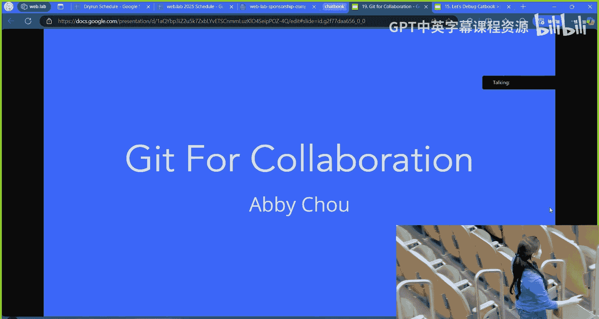

## 提交与分支回顾 📝

上一节我们介绍了Git的基本概念，本节中我们来看看如何创建提交和分支。

### 提交的工作原理

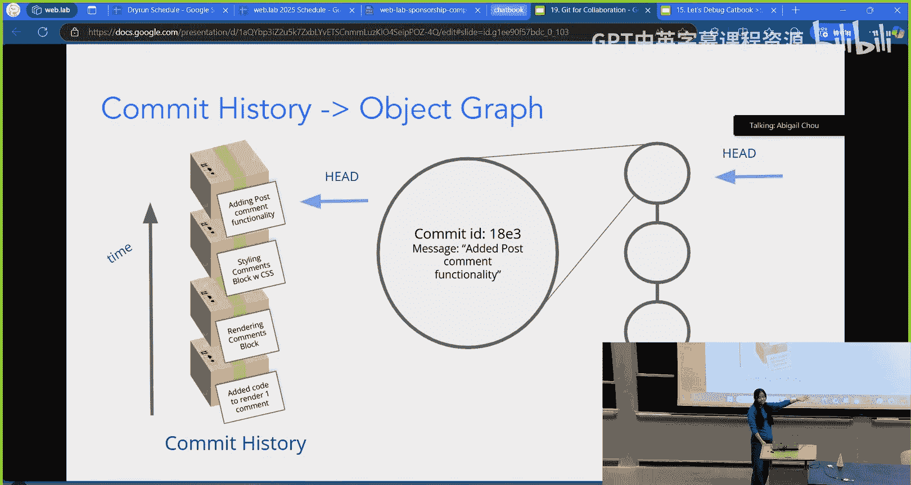

一个**提交**代表一组代码变更，被打包并贴上标签，通常与某个功能或修复相关。我们可以将其视为代码的版本历史。**HEAD指针**则指向当前工作目录（例如VS Code中打开的文件）所代表的版本。

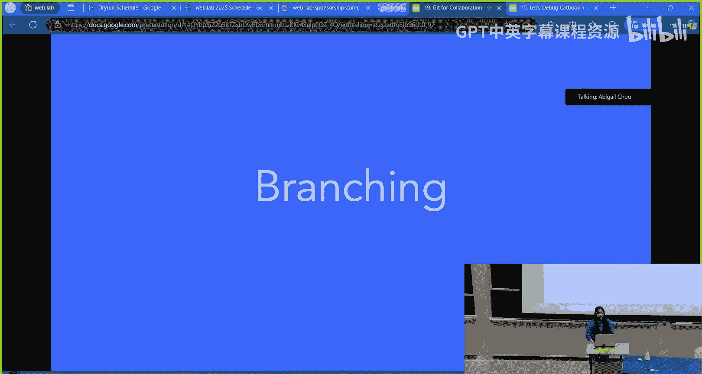

创建新提交的步骤如下：

1.  在文件中进行代码修改。
2.  使用 `git add <文件路径>` 将变更添加到暂存区。
3.  使用 `git commit -m "提交信息"` 将暂存区的变更打包成一个新的提交，并添加到提交历史中。

每个提交在Git中都是一个对象，拥有一个唯一的ID（长字符串）和一条提交信息。

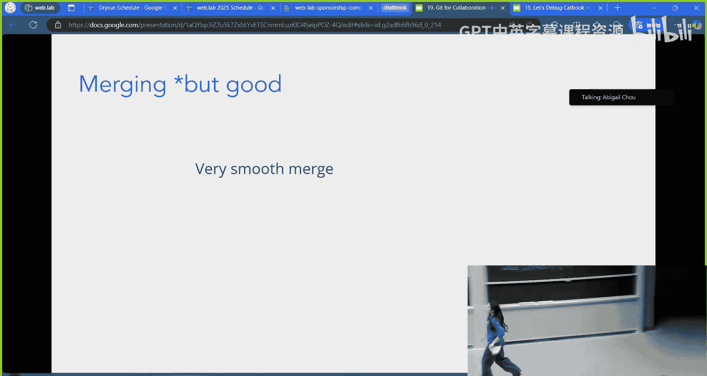

### 为什么需要分支？

假设开发者Tony需要同时处理多个任务（功能A、Bug B、功能C）。如果没有分支，他所有的提交都会混杂在一条主线上，难以区分和管理。当需要定位某个Bug的引入点时，排查会非常困难。

分支的作用就是**隔离不同任务的开发工作**。每个任务可以在独立的分支上进行，完成后，再将稳定的代码合并回主分支。

## 合并与合并冲突 🤝

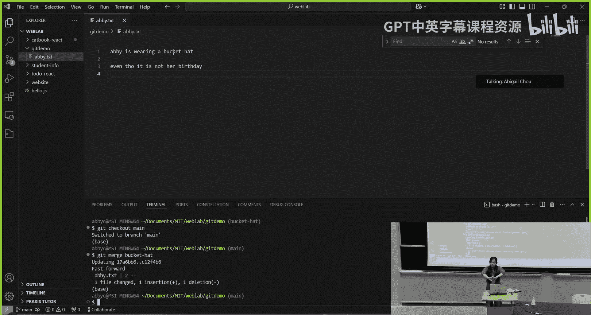

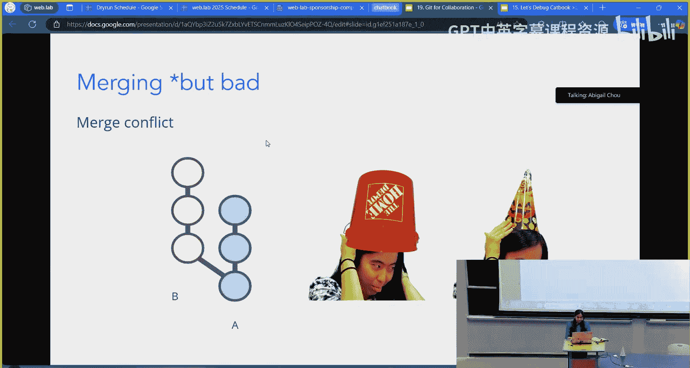

上一节我们了解了分支的用途，本节中我们来看看如何将分支合并，以及如何处理合并冲突。

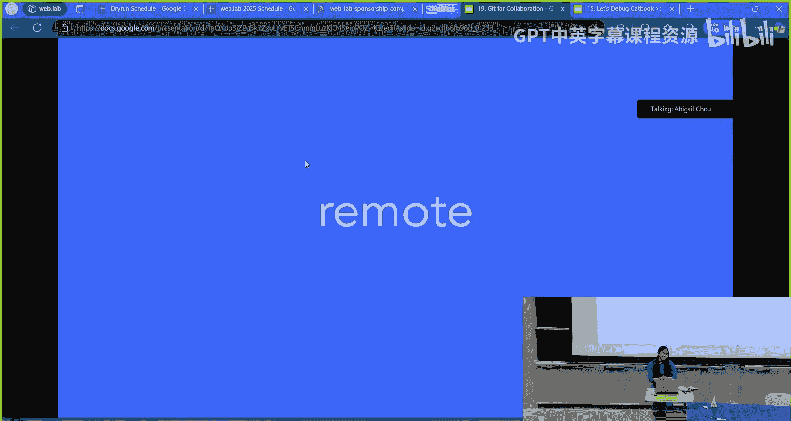

### 顺利合并

以下是顺利合并的示例流程：

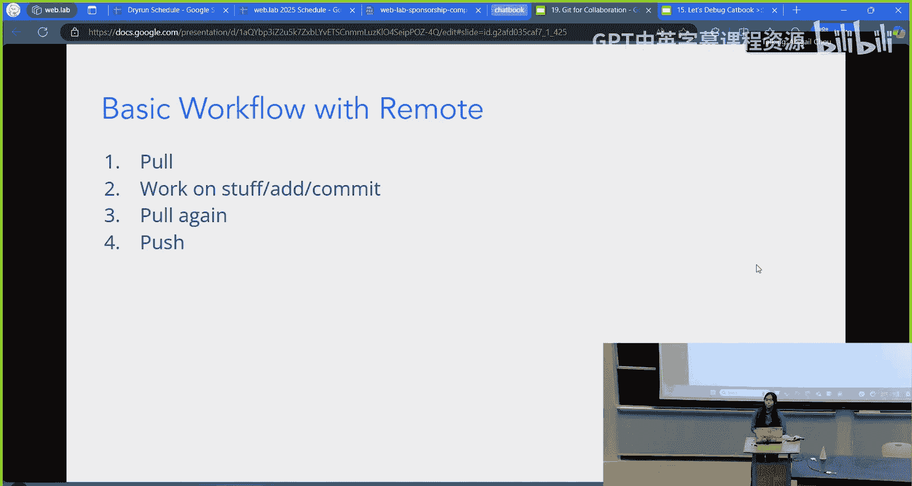

1.  创建并切换到一个新分支：`git checkout -b new-hat`
2.  在新分支上修改代码并提交。
3.  切换回主分支：`git checkout main`
4.  将新分支合并到主分支：`git merge new-hat`

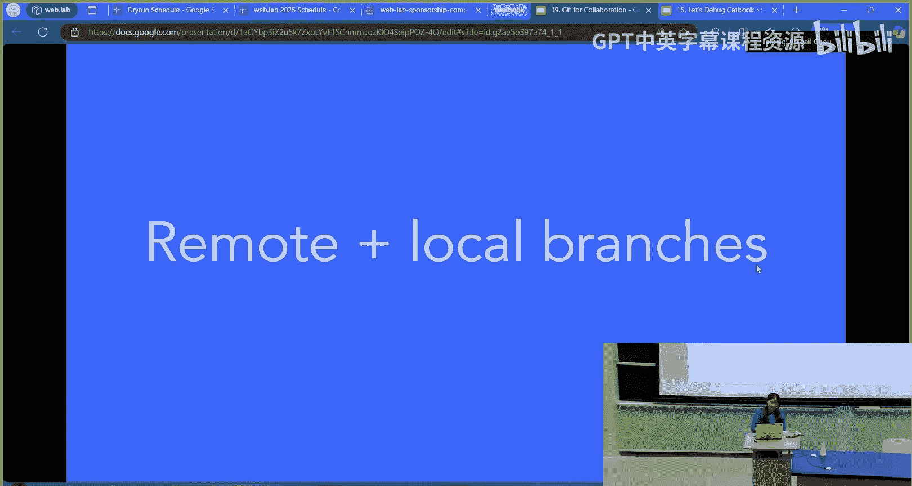

如果两个分支的修改没有冲突，合并会自动完成。

### 处理合并冲突

当两个分支对同一文件的同一部分进行了不同的修改时，就会发生**合并冲突**。执行 `git merge` 命令后，Git会提示冲突信息。

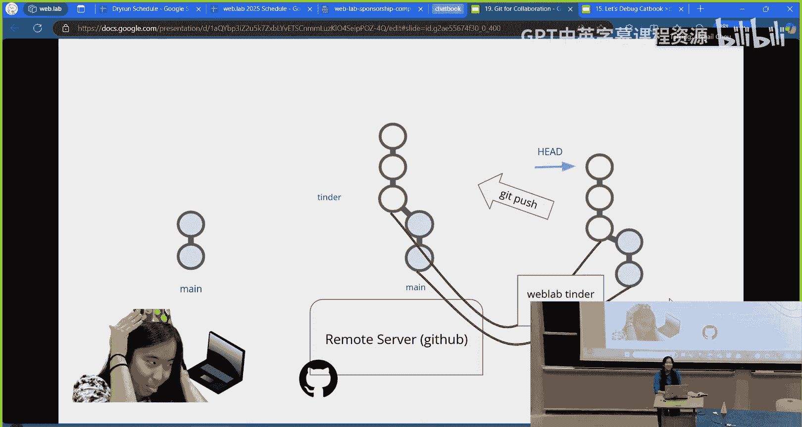

此时，你需要：
1.  打开冲突文件，手动选择保留哪个分支的修改（或进行整合）。
2.  解决冲突后，使用 `git add` 标记冲突已解决。
3.  使用 `git commit` 完成合并提交。

## 远程协作工作流 🌐

前面我们讨论了本地操作，本节中我们来看看如何与远程仓库（如GitHub）协作。

### 基础远程工作流

在简单的单分支协作中，基本流程如下：

1.  **拉取**：开始工作前，使用 `git pull` 获取远程最新代码。
2.  **工作**：进行修改，使用 `git add` 和 `git commit`。
3.  **再次拉取**：推送前，再次使用 `git pull` 确保合并了他人在此期间推送的更改。
4.  **推送**：使用 `git push` 将本地提交推送到远程仓库。

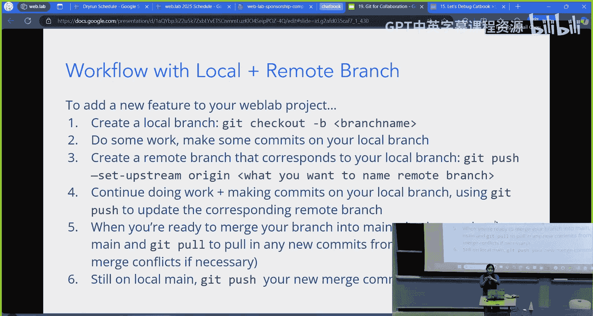

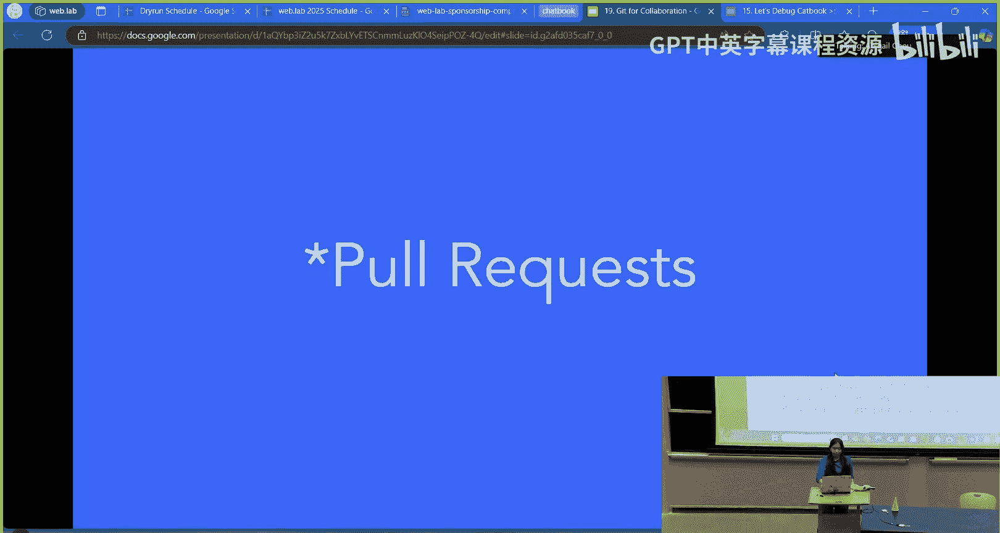

### 基于分支的协作工作流（推荐）

对于团队项目，更推荐使用基于分支的工作流：

1.  **创建本地分支**：基于最新的 `main` 分支创建功能分支：`git checkout -b weblab-tinder`
2.  **建立远程关联**：首次推送本地分支时，需建立与远程分支的链接：`git push --set-upstream origin weblab-tinder`
3.  **开发与提交**：在分支上进行开发并提交。
4.  **合并到主分支**：
    *   切换回 `main` 分支：`git checkout main`
    *   拉取最新代码：`git pull origin main`
    *   合并功能分支：`git merge weblab-tinder`（解决可能出现的冲突）
    *   推送合并结果：`git push origin main`
5.  **清理分支**：合并完成后，可以删除本地和远程的功能分支。

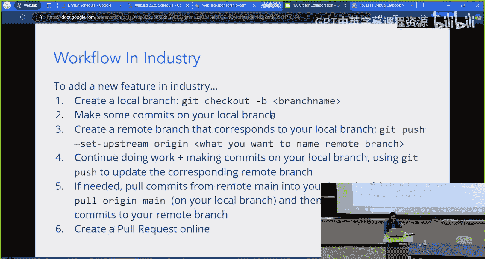

### 行业实践：Pull Request

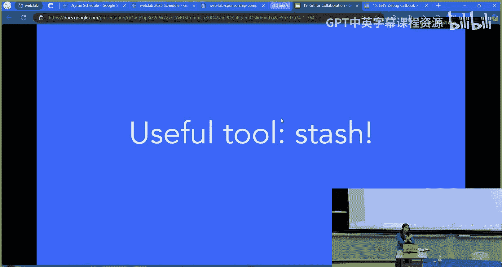

在企业环境中，开发者通常没有直接向主分支推送的权限。标准的做法是：
1.  将功能分支推送到远程。
2.  在GitHub等平台上创建 **Pull Request**。
3.  邀请团队成员审查代码。
4.  审查通过后，由有权限的人在平台上完成合并。
5.  本地拉取最新的 `main` 分支，并删除已合并的本地功能分支。

## 实用工具：Git Stash 💾

当你修改了文件但尚未提交，又需要切换分支时，Git会阻止你，以免未保存的更改丢失。这时可以使用 `git stash`。

**Git Stash 工作流**：
1.  **储藏更改**：`git stash` 将未提交的修改临时保存起来。
2.  **自由切换**：现在可以安全地切换到其他分支（如 `git checkout main`）。
3.  **恢复更改**：切换回来后，使用 `git stash pop` 将储藏的修改重新应用到当前工作区。

## 总结与资源 📚

本节课中我们一起学习了Git团队协作的核心知识。我们回顾了提交与分支，探讨了合并冲突的解决方法，详细讲解了本地与远程仓库的协作流程，并介绍了 `git stash` 这个实用工具。

对于初学者，以下资源很有帮助：
*   **Learn Git Branching**：一个游戏化的Git学习网站。
*   **Git Cheat Sheet**：命令速查表。
*   **Stack Overflow**：遇到具体问题时搜索解决方案的好地方。

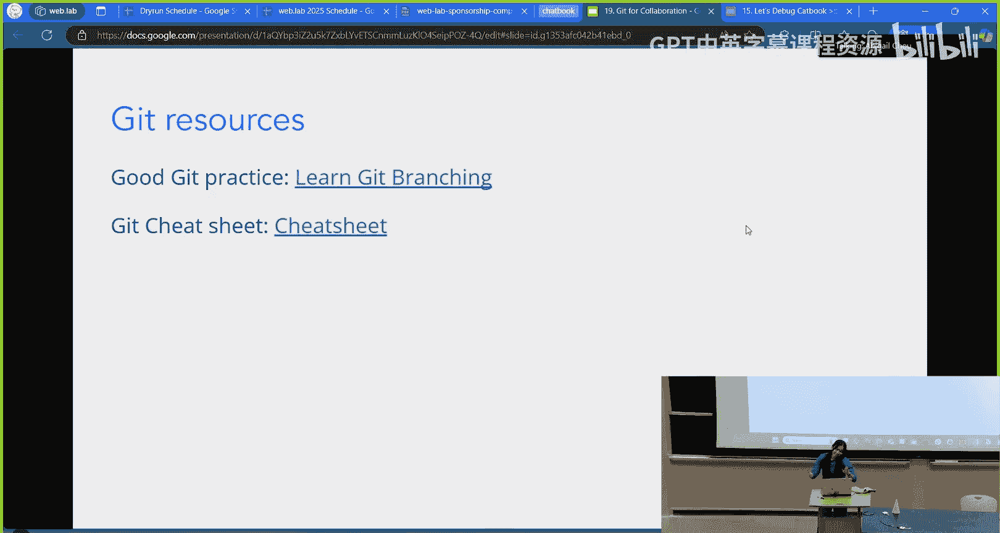

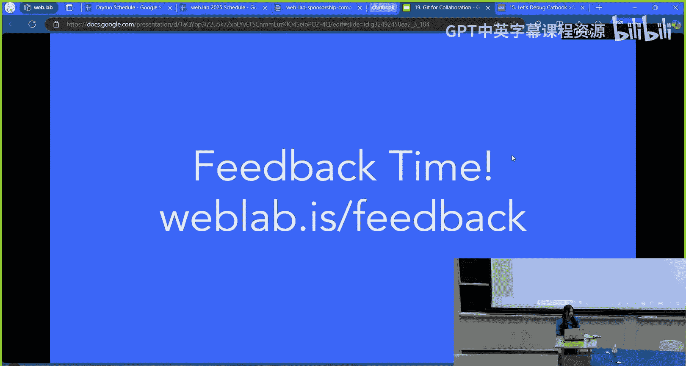

记住，协作的关键是**频繁沟通**和**遵循团队约定的工作流程**。祝你在项目开发中协作顺利！