# 《Web开发快速入门｜6.962 Web Development Crash Course IAP 2025》中英字幕 p26 -26-MIT web.lab (6.962) - Day 6_ Auth..zh_en -BV12Ux5zTE9p_p26-

Okay， hi everyone。 Hope you're having a great Monday。

 So me and Sophie are going to be talking about off today。

 And it's kind of a really meaty lesson and workshop。

 So don't worry if you guys feel a little okay mut mind。😊。

Don't worry if you guys feel a little confused。I use。But yeah。

 so I'm going talk about some intro first before we actually get into the workshop so hopefully you guys can understand things conceptually a little better when we refer to o。

 we are going to be talking about both authorization and authentication and we're going talk about like what the differences between those are as well in the introduction。

😊。

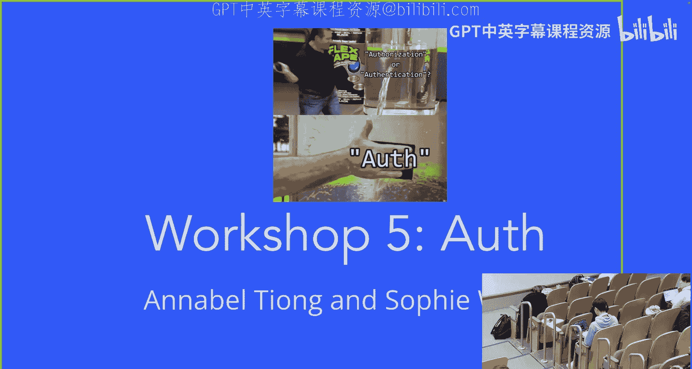

So you can see here on Abby's Facebook right if we're having like like our catbook for example。

 we want users to be able to know who they are when they're logged in and also like what stories and comments correspond to their profile specifically so with Facebook how do we know that like Kaylee Mary posted this meme for example and like Abby it's on Abby's profile and she's the one currently logged in？

😊。

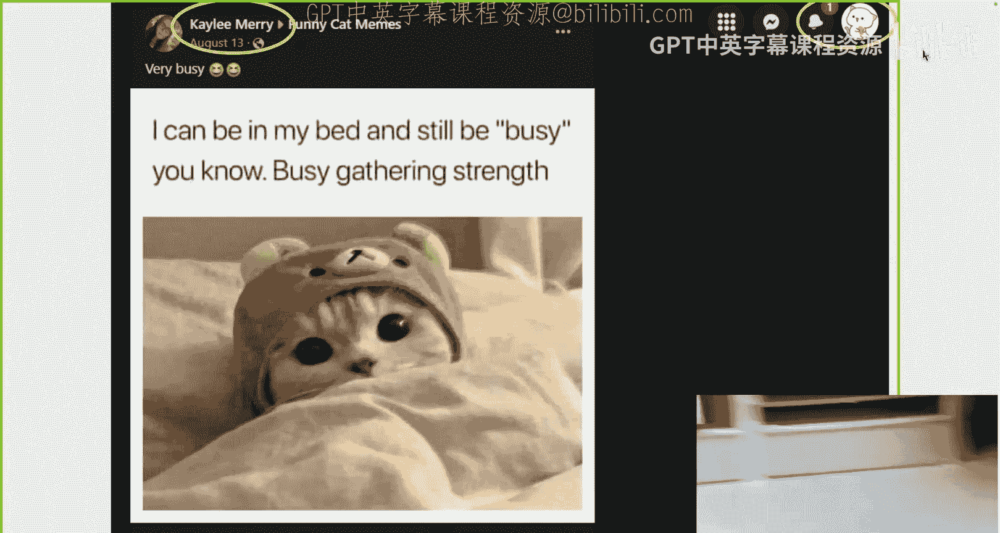

So authentication deals with how we are proving our identity to a website。

 it's basically the website saying like hey， this user is who they claim to be and like this is all the information that falls under that user's log stuff。

So when the client is sending a poster request and peing the login API endpoint。

 our server needs to be able to find the user's information within MongoDB in a stored database of users。

By checking if it has the credentials that the user is claiming to have。

So one way that we can store username and password information is by just creating a user schema in our database。

 So if you guys remember from the database lecture that Sophie and I gave。

 we talked about how schemas are ways that we can enforce structures onto documents So do you think that it's feasible for us to just create a user schema like this with fields like name email password and store them as strings within our database。

😊，Give me a thumbs up if you think this is a good proposal and thumbs down if you think no。Okay。

 I'm seeing some mixed。 but yeah， the majority is thumbs down and you'd be exactly correct because the password is not encrypted at all。

 right， So having developer access to all of the passwords of users for a platform like this is extremely bad because it can very easily get leaked and then hackers can very easily access it。

 And most of the time， you guys probably use like the same password across multiple different applications。

 So you're not just like leaking the password for this one application。

 you're leaking the password for like， probably like， I don't know。

 your entires a word I'm looking for。😊，Net worth。Yeah， okay， so we have one potential solution。

 which is using hash functions。 hash functions basically just take in a string like this。

 and they'll use a mathematical function to generate like a cry encrypted string as an output。😊。

Haash functions are one way。 So our output hash doesn't tell us anything about what we actually input it to the function。

 And they're also deterministic， which means the same input gives you the same output hash values。

 which is nice， right， You might think like， wow， now we can just saw our passwords after running them through this hash function because now they're like these encrypted strings。

 So this might be better， right， What do you guys think。

 like thumbs up for better solution or thumbs down for no。😊，Okay。

 I'm still seeing some thumbs down and you would be correct again because one of the things we actually have is like online。

 you can just look up the hashes that correspond to some of the really common passwords that people use。

 So you can like very easily kind of like guess a lot of different passwords and see the corresponding hash functions that already exist and like if someone's testing like a million passwords a minute。

 they can like probably get it within like a few hours， right。😊，So it's still not that secure。 Okay。

 so we have like another option is we can do something called patch hash salting。

 where we add a salt to our hash function， which is just like another kind of like it's just like more data that we're adding to our initial input to the hash function。

 So it makes it like a little more secure because these salt are pretty hard to decrypt And like it makes it more difficult for hackers to decrypt it。

 But I'm gonna go into the details of what like salting actually looks like。

 but it's basically just adding a lot of like random data to our strength to begin with。

 So it becomes a little more secure。 But this is still not that secure because。😊，Again。

 like we talked about before， right， the passwords are like are not rate limited。

 so someone can just be testing like as many passwords as they can possibly test in a given time frame。

 and at some point， they're most likely going to be able to get the correct password right so。

The conclusion for all of this long tangent was just that storing passwords is really difficult。

 So instead of like having to store passwords by ourselves on our Web applications。

 we're just gonna make it easier for us and use Google。

 So Google has this really nice authentication setup up that they have already created。

 And we are just gonna take advantage of this for our own purposes。😊。

So you guys probably are very familiar with the login with Google button that's on like probably like most pages these days。

And so， for example， if I'm trying to sign into Mongo D B， right， I can choose an account to log in。

 but you might be thinking like this is pretty interesting， right。

 because we're signing into Mongo D B， but we're seeing like the， the Google。😊，URL。

 but Mongo D B has nothing to do with Google。 So how does Mongo D B get the information from Google that we've successfully logged in and prove that we are who we say we are。

So how does a website know that we've logged into Google？So for example， right like on Piazza。

 this is like another kind of issue that we need to take into consideration is that like if I do log in and say that I'm like me right。

 the other thing is like I'm logged in as an instructor， So I should have instructor permissions。

 which means I should be able to like post things as an instructor。

 So besides just proving to the website that we are who we say we are we also should get specific permissions or things granted to us if we have different roles on that website So like a student dashboard should look different from an instructor dashboard。

 This is also like a pub to fill out the food thoughts post because no one responded。😊，Yeah。

 so currently right， like basically what we're looking at is we have like a user sending a post request to our login API endpoint with their username and password information。

😊，But let's， and then the server should send back the information that the user should see on their front end。

But let's say we have like a lot of different machines sending this request at once。

 and they're all ping the API login endpoint。How do we know that like Sophie's ping the API login endpoint and like sending a get request to fetch all of her stories is different than like Aranddo ping the same endpoint。

 like how does the server tell who like who's making that get request？Well。

 one of the things we can try is， let's say we just send the username of the person that's logged in in the query parameters of the gett request。

Do you guys think that this would work for the server to be able to differentiate who is logged in and like accurately recognize them。

 thumbs up for yes， thumbs down for no。Yeah， I'm seeing a lot of thumbs down， which is correct。

 because query parameters like this can very， very easily be changed， right， Like。

 you can just literally go into the query parameters and like delete it。

 So I can just write like user name equals Sophie。 And then I would like， be Soie。

 But that's not what we want， right。😊，So let's modify this proposal bit。

 What if instead of looking at the query parameters， we look at the I address of who's sending it。

 So we say like， oh， Sophie is sending this get request and then the R is sending the other get request。

 Can we use that to differentiate who is actually logged in， thumbs up for yes， thumbs down for no。

Yeah， I'm still seeing a lot of thumbs down， which is correct because IP addresses are not secure because they can very easily be spoofed by hackers。

 so we can't use the IP address to differentiate who is logged in either。

The conclusion of this second long tangent is that we can never really trust the client。

 So no matter what the client says， it's very easy for them to just lie about who they say they are by either faking the query parameters or spoofing their I address。

 So we can have like this normal mongos saying they' Sophie。

 We can also have like a malicious mongos hacker saying they're Sophie。

 And there's no way to really differentiate these if we trust the client。😊。

So to recap what we've talked about so far， if we log into a website with Google or using some other third party authentication service。

 you guys have probably heard of other authentication platforms like MIT uses OCta。

How are we proving to this website that we've logged into Google or this other authentication platform。

 and once we've actually logged in and we continue making like get requests， for example。

 how does the website know that we've already logged in and like can show us like different permissions based on who we say we are？

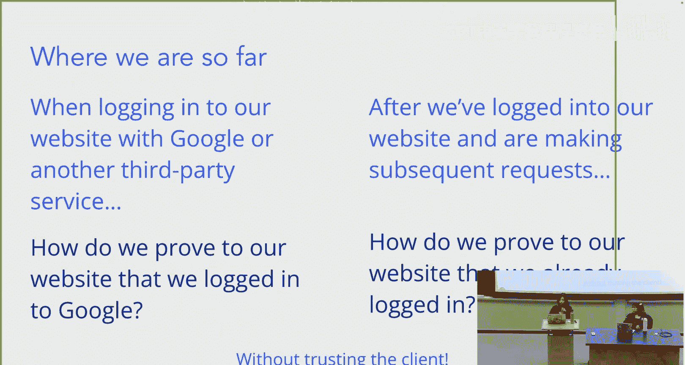

All of， and we want to do all of this without trusting the client。

 because we all saw like how that turned out。 Not great， right。

So we have these really cool things called Session and tokens。😊，Okay。

 so let's talk about sessions first。So what sessions do essentially。

 is now when a user is logging in， they're going to send their credentials over to the server and the server is going to store all of the user' information in something called like a global session lookup table essentially is just this table that is globally accessible and it'll have information with a session ID corresponding to all of the user' information。

 So like here you see like my username and my user ID。 And I have this uniquely generated session ID。

😊，Now， what the server is going to do is it's going to send a response to the client with the uniquely generated session ID D for that specific client。

And the client is going to use that session ID and send it back to the session when making future session。

 send it back to the server when making future requests。

 So any time the client pings the like makes a get request in the future。

 they're going to send this session I back in the form of a cookie。

 and then the server is going to be able to send a response back corresponding to that user specific。

 unique session ID。

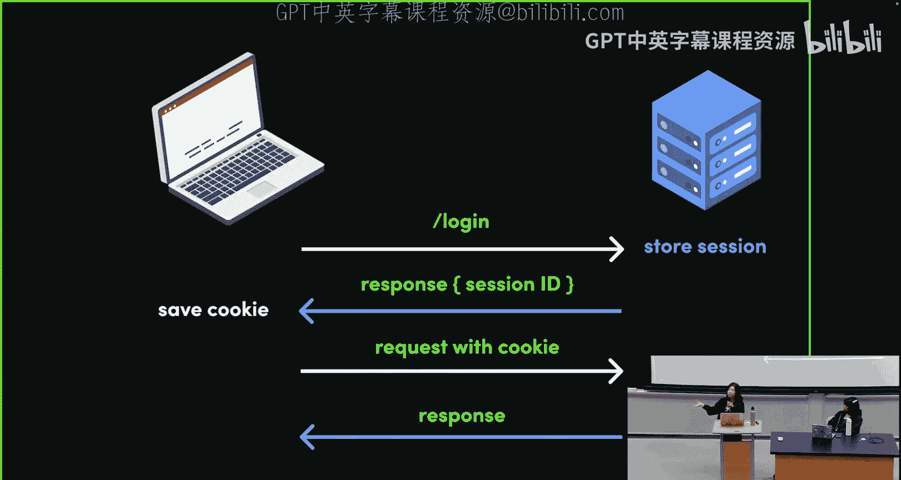

Okay， why do you guys think that sessionsession can solve the problem of verifying that we're actually logged in。

 Turn and talk to a neighbor。Now how does this solve all the dilemmas that we just talked about earlier。

 What do you guys think。G you like。30 seconds。知道。平会说 talking lot谁给么。

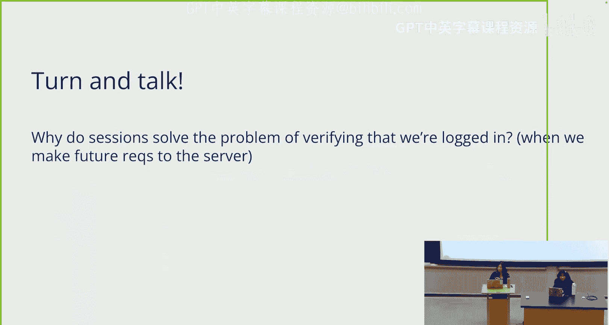

I go back to this slide so I can。Okay， hopefully you guys had time to think about it。

 but does anyone want to take a stab at how sessions solve the problem for us。

Okay， it's okay。I understand。But basically， right， so sessions。

 remember when we like were looking at the diagram previously。

 we saw that the server was storing all of the user' information on the server side， right。

 So all of the user information is being stored securely by the server like stuff like username right user I D。

 And the only thing that the client is actually getting is the session I D that was generated by the server and they're just sending it back in the form of a cookie on future requests。

😊。

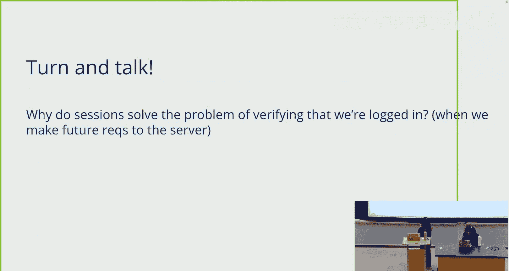

So now all the sensitive information is stored securely on the server instead of having the client send their information and their credentials back to the server。

So this is more secure right， because we can see that instead of the scenarios we were describing previously where the client can just modify their query parameters or modify their IP address。

 now the server is securely storing all of the information about a user and the only thing that the user is getting is the session ID。

 which they're going to send back in the form of a cookie on feature requests。😊。

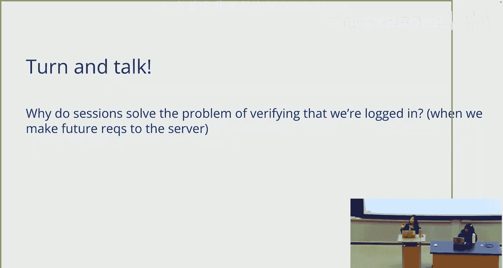

So our session is stored on server on our server。 This is kind of like the key point of sessions。

 but there's a couple of issues with this too。Let's say we have multiple different servers， right？

 Can you guys like， think for like 20 seconds about like。

 what's one potential problem that we might have if we use sessions and we're running like multiple different servers。

Feel free to talk with each other， also。I promise I won't go until my job。哎，是呀。

When storing data on multiple different servers， you can imagine that each server now needs to store its own global lookup table for the session Is。

 right， And so this can get kind of messy because now we have like five different servers with five different global lookup tables and like so many users using our platform。

 it can get kind of messy。 So S run into the issue of scalability。

 And it can be kind of difficult to translate when you're trying to run multiple servers at once。

 But besides that， S are still useful。 So we're not saying sessions are bad。

 We're just saying like this is one of the cons of sessions to take into consideration。😊。

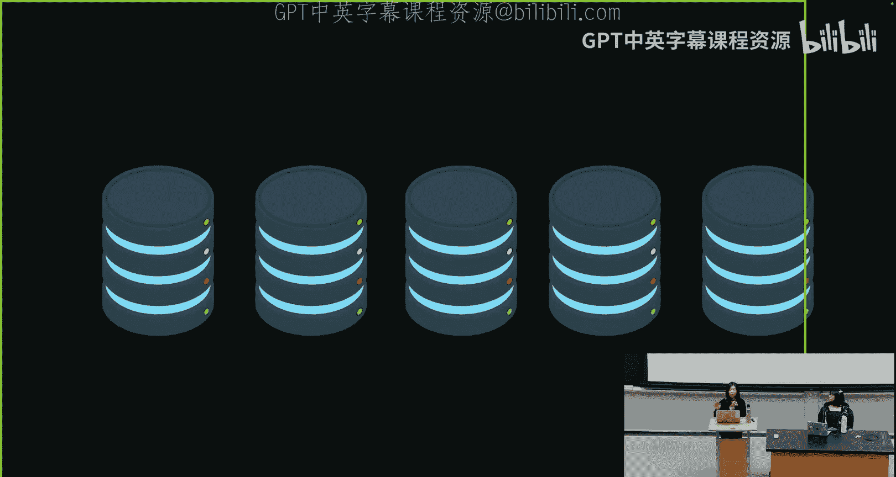

So another thing we have are tokens， right， So tokens are able to solve this problem of scalability that we previously saw with sessions。

😊。

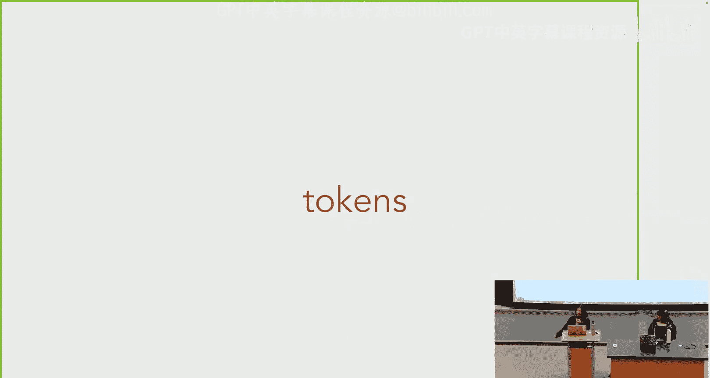

The way that tokens work is that a user is going to submit their login form。

 so they're sending the post request to the server， ping the API login endpoint。

And the server is going to take in the user's credentials and create a unique Json web token object for the client。

Now， the client is going to put this token in their local storage。

And upon sorry in making future requests， the client is going to send this token back to the server with the signed header。

That is going to get decrypted by the server and validated upon feature requests。

 So the token actually carries the user' credentials。

 but very securely because you can't spoof a token。

 so it's going to carry the user's credentials and the server is going to be able to decrypt this token and use it to basically give the user all of its information that it should have access to。

And so。Let's contrast this with sessions， right。 Remember sessions we had this global lookup table it stores all the user information on the server side。

 and with tokens instead。😊，The user information or sorry。

 the user credentials are stored in this token object。

 but this token object is encrypted very securely。 And so the server is decrypting this token using the tokens header that gets sent back when the client makes feature requests。

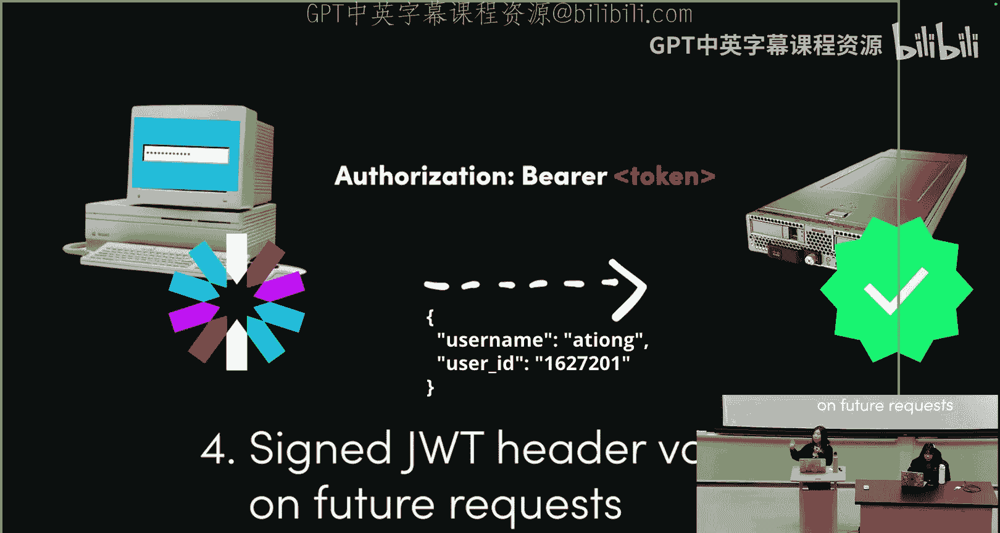

So turn in talk to your neighbor again。 Why do you think tokens solve the problem of verifying that we're logged in securely upon making future requests。

 How's this different than the dilemmas we described before， How's it different than Session。

 I'll give you guys like 30 seconds to talk about it。怎么回。Okay。

 so hopefully you guys had some time to discuss it once again。 Now， would anyone like to。

I don't know，er an answer。Okay it's okay。 But basically。

 tokens solved the problem for us because tokens can't be sofed So I mentioned this before， right。

 we can spoof our IP addresses。 We can very easily change or delete our URL query parameters。

 but tokens cannot be sofed because they are like these securely created Json objects that then send back the signature that gets decrypted by the server。

 So only the server can decrypt the tokens for us and a user cannot forge a token。

 which is why we're not really trusting the client。

 even though it might seem like the client is sending the token back We're not trusting the client because the client cannot forge this token。

 This token was securely generated by the server and the client is simply sending it back。😊。

Let's do a quick review of the difference between sessions and tokens。

 So with sessions the authentication details are stored on the server side with tokens。

 the user itself is storing their authentication details in the form of the token itself。😊。

When making future requests， the user is going to send back a cookie with sessions to have the request authorized。

 but with tokens， the user sends back the token itself。

Now what the server does in the case of sessions is it's going to go to its database and find the session thanks to the ID that was sent with the cookie and once it finds the session in the global lookup table。

 it can send back all of the user information and verify that the user credentials are correct。

With tokens， the server is going to decrypt the token， verify its signature。

 and check that this is like an actual valid token that was generated by the server previously。

So let's pose a question do you guys think that the server can perform security actions in the case of sessions。

 thumbs up for yes， thumbs down for no。I like thumbs down， thumbs kind of like a mix。

 But for sessions， the answer is actually， yes， because all of the authentication details are stored on the server side。

 right， So this means the server can actually perform all of the security actions it needs to。

 because all of the details are stored on the server side。 How about for tokens。

 Do you guys think thumbs up， the server can perform security actions。 Ts down for no。😊，Yeah。

 exactly thumbs down right because this time the authentication details are stored on the user side。

 so the server doesn't actually have access to the sorry not access。

 but the server is not storing the authentication details。 So on the server side。

 we can't really perform much security actions because the user is storing their details themselves。

One thing to note， though， is that。Actually， it's fine。Okay， does anyone have any questions。

And pause here to give you guys some time to process what we just talked about。Okay。

So now let's talk about catbook。 How are we incorporating all of this information that we just learned into catbook。

So CAbook's way of managing login is what we're going to do is we're going to have a separate off server and a resource server。

 We talked about before how storing passwords is like really difficult。

 So we're just going to let Google do it for us。 They're going to handle all the authentication details and we're hopefully not going to have to deal with it。

😊，So when users initially sign into catbook， what they're going to do is they're going to sign in using Google。

 and what Google is going to do is Google is going to generate a token for the user and be like， hey。

 here's your token。 The user is going to take this token and send it to the server。

 The server is going to verify this token。And then in order for the user to stay logged in。

 the server is going to generate sessions for the user。

Remember remember we talked about with sessions and tokens， sessions。

 scalability is kind of hard because we're storing all of these global lookup tables。

 so if we have multiple servers， it's difficult。Luckily we only have one server so our server can use these sessions to manage login and persist login information。

Tokens don't have the issue of scalability， so even though Google has like millions millions of users in this super large platform。

These tokens make it really easy because the server itself doesn't have to store the user's information。

So here's our sign in flow proposal， right， So I'm gonna sign in to the Google off server。

And let's say it was a success。 Now I'm going to tell my server that I logged in。

 The server is going check the user database to see if I'm actually a user。😊，But let's say， like。

 I type in the wrong password， right， I could still theoretically tell the server that I've already successfully authenticated with Google。

 And then there's nothing stopping me from like as a malicious hacker just saying that I already successfully authenticated with Google。

😊，So this goes back to a point of never trusting the client。

Because the front end can very easily be modified。So that's why we're gonna use the tokens， right。

 So Google is going to generate a token for us， which remember， tokens are securely generated。

 cannot be spoofed by the user。 So now we take this token and we give our token to the server and say。

 yeah， I did actually log in with Google and my token is proof that I've successfully authenticated with Google because I can't like forge this token。

😊，So now the server is going to make sure this is a legit token by checking in the Google Oth library that is very conveniently set up for us。

And then once it verifies that it's a legit token， it's going to check the user database。

It's not going to work if you're a hacker because the hacker is not gonna get a token。

 So this sininflow is not going to work。Even if you like spoofa token。

 the server is going to check in the Google O library and see that this is a forged token。

 so you're not going be able to get your information。Okay， so now let's demo this。

You guys can also take like a two minute break while we get set up。show themです。Thank挺。

I still need this slides， though。Good。Okay， so now let's take a quick look at how we can actually see our tokens and cookies being sent。

So let's navigate to catbook。 if you guys want to follow along you can go to。Get check out W5 Compte。

And basically， what I'm going to do is I'm going to log into Google。

 So now we have like this sign in option， right， So I'm gonna log in。Ill logize myself。

And we'll see that once I've logged in， right。I should be able to go to inspect。

And I can go to my network tab。Its refresh。Oops。Doわ again。Let's sign out， sign in again。

We should see this login。If we go to our network tab right and so this is us ping the login endpoint on our CAbook server。

And if we go to the， if we click on the request， right。

 we can see like the request URL is being sent to our API login endpoint is a post request。

 And we can also see that。If we go to the payload， we have our token here。

 So this is the token that Google is actually giving to us upon authorizing with the Google O library。

 And so what we can do is we can actually take this token。

It's pretty cool because you can take this token and you can go to this website called。😊，JWT。I O。

And you can actually try and follow along and paste the token that you get into JWT do I O。

 And you can see that we have our encoded token here。 And once we decode it。

 we actually have a lot of information that is stored in this token。

 so we can see things like my email address， my name。

And also like all the other user credentials that are actually being stored within this token。

 but the header and the payload of this token are not actually secure is just like base 64 encoded。

 so it's very easily decrypttable， but what actually makes it secure is the signature part of the token。

 which I've like deleted just first like security purposes。

 but basically the signature is what actually makes the token secure。😊，So yeah。

 you guys can see like if you check the login post request and you go to the request payload。

 you should be able to see the token that Google is sending to you to the client to prove that they have logged it。

Okay， so now let's talk about our cookies。 So we got our token， right， So if we go back to catbook。

Now， let's take a look at our cookies。 So then go to the cookies tab and we noticed that we have like this connect dot SID cookie。

 which is also shown like if we go to the headers of the login request。

 we should also see like we have this cookie， right。Right here， or is it starts with like G enabled。

And so this cookie is actually enabling us to stay logged in。

 So once we've pingned the login endpoint and Google has given us a token， we then take that token。

 give it to the server， and the server will generate this cookie for us to ensure that we can stay logged in。

 even if I refresh the page。 So you see that like even if I refresh capbook right。

 I'm still logged in like the sign out button is still there， which means I haven't been signed out。

😊。

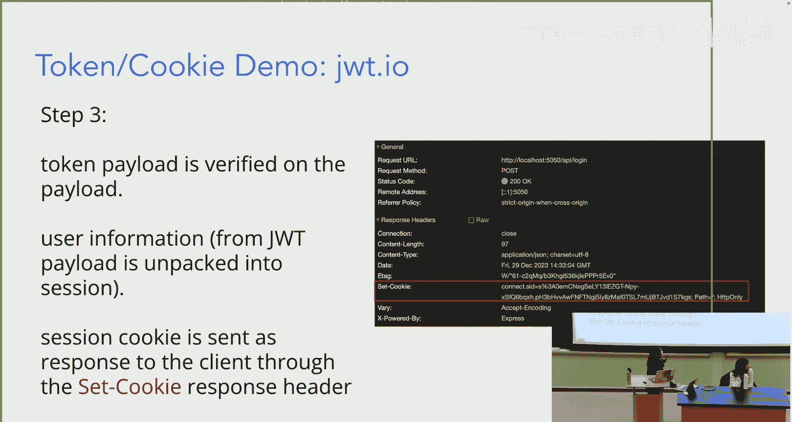

And what we can try is， we can try it to look at is， let's say we like， go back。

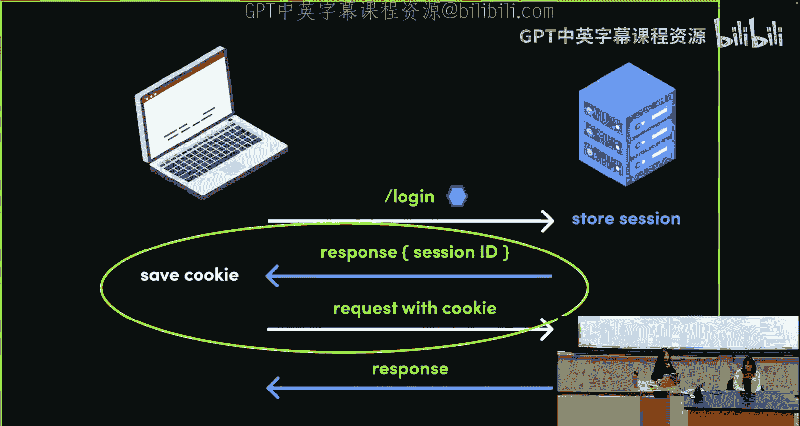

To the cookie。OrLet me log in again。Let's go back to it。 and let's like try like。嗯。

Going to our headers。It's like。嗯。Application， and let's like delete the cookie。 Okay。

 so I'm just gonna like manually delete this cookie。And you should notice now that if I refresh。

 I'll automatically be signed out。So if you delete the cookie just like manually。

 you're no longer going to be signed into catbook right because you're no longer going to be able to send requests back with the cookie to the server to prove that you've already logged in。

 So this is how our catbook server is able to manage users and persist their sessions。

So it's kind of talked about how if we manually delete the cookie， we automatically get logged out。

And remember that when we make future requests and we ping like other endpoints。

 we are actually sending the cookie back as identity verification so we can see that like if I just like sign in again。

I should be able to see， like in my network tab that I have like other requests， right。

 So I'm like making other requests。 So I should have like。嗯嗯。Like when I make comment requests。

 you can notice that I'm like sending the cookie in the request each time I make a get request to our server。

Okay， so that was kind of like a lot of information。

 So let's recap really quickly before we dive into the workshop。

Let's talk about the difference between authentication and authorization。

 So authentication is a process of verifying our users' credentials。 So this is like。

 if Sophie is visiting my house， authentication would be like me saying Sophie。

 I recognize Sophie and Sophie can enter my house。 authorization is the process of actually verifying the user's permissions and rendering different things conditionally depending on what permissions that user might have。

 So if Sophie comes over to my house， like yes， I recognize her。

 but do I give her the permission or the authorization to enter my bathroom or like enter certain rooms inside of my house。

😊，We saw that it's really hard to trust the client。

 We can't trust things that the user is saying because URL query parameters。

 you can like delete these， change these IP addresses。 you can spoof them。

 So we need to use something that's a little bit more secure。

 So we're gonna to use sessions and tokens。So for us。

 what happens is Google Oth is taking in the user's credentials。

 it's generating this secure token and sending it back to the client。

 and this token is verified via the privately generated signature that we saw。

And then what's happening is now the user has this token。

 it can make a request to the login API endpoint in our server。jS file of catbook。

The server can check if the token is valid by checking in the Google Oth library， and if it is。

 then the server can go check Mongo DB or it can store the user's information within Mongo DB。

 And this is like the cookie that we saw here where if we deleted it， the user no longer logged in。

Now， the user is going to send the cookie back that was generated by the server。

With its unique ID D on subsequent requests to prove that the user has already been authenticated。

 And then now the server will give authorization and like display your like catbook stories and comments。

 And as we're gonna see tomorrow in the sockets lecture， real time messages also。

Does anyone have any questions。Okay， cool。 That was all for the intro to off。 Now。

 Sophie is going to take you to the very meaty workshop。😊。

