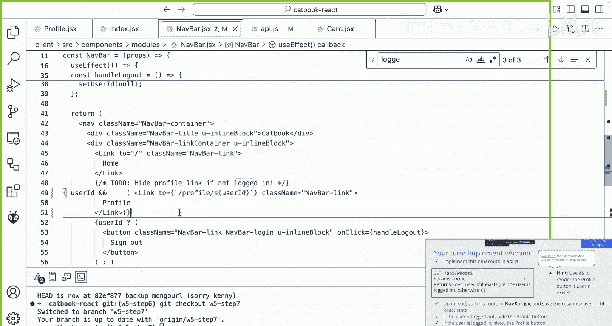
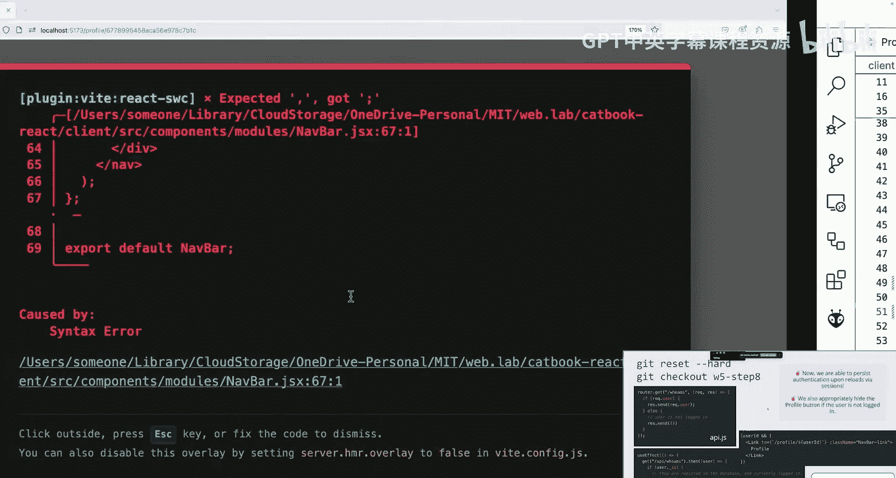
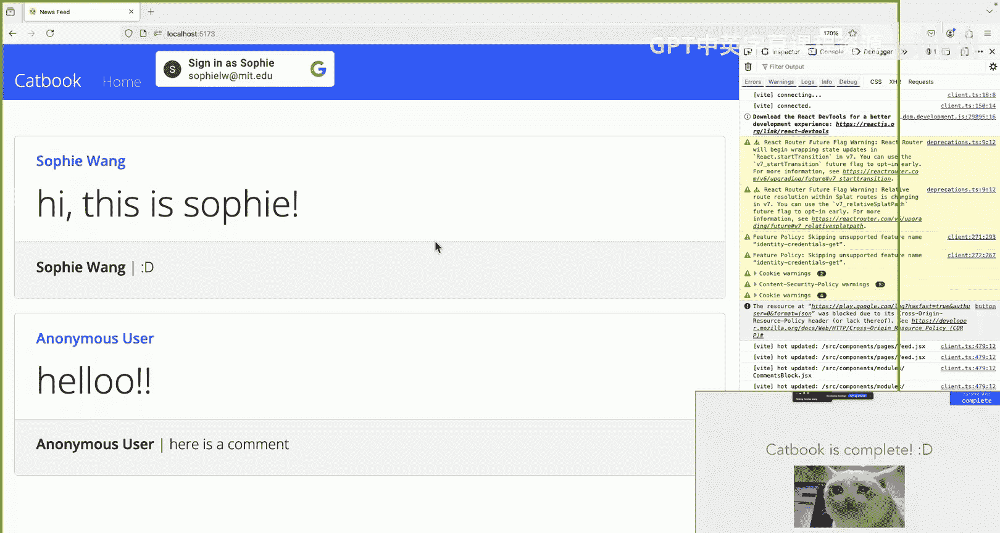

# 《Web开发快速入门｜6.962 Web Development Crash Course IAP 2025》中英字幕 p27 -27-MIT web.lab (6.962) - Day 6_ Workshop 5 (Accounts_Auth).zh_en -BV12Ux5zTE9p_p27-

， I think it's good。Okay， so now we'll start workshop 5 and we'll implement the whole Google sign in process flow that Annabel just showed and we'll also add some changes to our front end and backend to support the login flow。

Here's all the stuffs of the workshop。 It's very meaty， but we'll slowly go through it together。😊。

So open up your code I D and。We'll start by git resetting hard。

Let's fetch all the new changes made in the remote branch。Let's check out to branch W 5 dash starter。

And we'll doop NP PMM install。And in two separate terminals。Let's run impPium start。

And NP PMM render。Okay， and once you've done that， let's open up navbar dot JS X。

Look at some changes we've made for this workshop。So the first thing you'll notice is that we have a new sign in button in our Na bar that we didn't have before。

In a nap bar， thought JS X。You'll see that this is from a Google login component that's provided to us by the react Oak Google Library。

And this is a login component that Google provides for us in their library that will handle the login process for us。

So upon a successful login， we'll also call the handle login function。

 which we have a skeleton for here， and we haven't filled it out yet。

 So all we have is a console log of the response that the Google A server sends to us。

So another change that we've made is an index do JSX。

To be able to send these requests to the Google O server。

 the Google Os server has to recognize us as a valid user。

 And that's done through the Google client I D。So anyone can make a Google client I D for their web application。

 and this is like a username for our web app， and it allows the Google server to recognize our application as a valid user so that we can make these requests to the server and get responses back。

So what we've done with the Google client I D。Is that we've wrapped our entire web application。

 which is in the router provider with a Google OO provider。

 and we pass in the client I D so that every time we make a request to the server of the Google sorry。

 the Google server， itll pass this Google client I D through。😊，So what does this look like？

So before we have our client and servers any requests and responses back to each other。

But when we think of this in terms of the Google client。Oh， sorry， the Google server。

 we can think of our entire web application of client as a client。 And instead。

 our entire web application is now sending requests to the Google Oos server。Okay， so to recap。

 the Google client I D allows us to access the Google O API in the Google server。

It tells us what our app is called in its URL。 And later on。

 you'll see that both the front end and backend will need the client I D because if you remember。

 the front end will handle the login process through the Google server endpoint。

 But in our server backend， we'll also need to verify the token once it gets sent back to us。

 So we'll need the client I D again in the back end。And this isn't secret information。

 So it's okay to commit it to Gi。So for now， in index do JS X will all share the same Google client ID D。

 but later on， you'll have to make your own for your own Web lab project and we'll go over how to do that in our deployment lecture。

O。So let's look at what logging in looks like so far。If I go back to my web， sorry。

 with my catbook application， I can sign in with Google。Once I'm signed in。

I see the same sign in button， which is not what we want。

We want thenob bar to show the login button when we're logged out and the log out button when we're logged in。

 So take a moment to think about how we can do this。And feel free to talk to your neighbors。Okay。

Does anyone want to try answering the question？No， that's okay， too。

 What we can do is we can keep a react state in our nav bar to keep track of when we're logged in。

 So what we'll do is we'll create a react state called logged in。

So let's implement our handle login function。The first， let's keep track of a login state using。

Call Logged in。 So navigate back to nav bar JS X。And at the very top。

 well want to use the use state hook so that we can create a login state。So， do you can't。Logged in。

Set logged in。Well， have this be a use state。And we want to start the login。 Stay as false， because。

Otherwise authenticated the user should be logged out。

So we now have a logged in state that is initialized to false。

So now what we' want to do is once the Google login component returns on success。

 then our front end should know， oh， now we're logged in。So it calls the handle login function。

 And what we want to do now is in the handle login function。 What we want to call set logged in。

And now we want to set logged into true。That's what you should have so far。

Ths up if you need more time。Alright， so now we'll move on to the next step。So now our web。

 our front end knows once we're loggged in because we once handle login is called。

 we'll set the login react state to true。Oh， I just gave you the answer。 Yeah， just to reiterate。

 once the Google login component returns in on success， it'll call the handle login function。

 which now sets logged in tro。So we want to do some， something similar for the log out function。

Here for the login， we already have a Google login component that renders a button for us。

 but unfortunately， Google's library doesn't have a log out function。

 So we'll just use the button property。And instead of having an on success attribute that calls the handle login function。

 you'll want to write an on click attribute that calls the handle logout function。

So for this part of the workshop， you'll want to add a log out button using button。On click。

 it should call a handle logout function。And you'll want to define a handle logout function that performs an analogous task to handle login。

 But instead， instead of setting logged into false， sorry， instead of setting logged into true。

 it should set it back to false。So get that a try and feel free to hop on the queue if you need any help。

没。How much time do you think Amy。哎。😔，喂。Raise your hand if you need another minute or two。

Give it another 30 seconds。Okay， let's go over how we can do that。So first。

 we'll start off by adding a new button for log out under the Google login component。

I'll just make a button component here。You just call it log out。And on click。

 let's have it called our handle logout function。Which we need to define。

 And we'll do that right here。哎。So let's define a handle logout function。嗯。We can console log。

Logged out。And then we'll want to set logged in back to false。So now。

 if we go back to our local host。Yeah， if you go back to our local host。

 we have both a login function and a log out function。So。That what we want to do。

Is we'll want to conditionally render the login and log out buttons。

So we wanted to make a show Google login when the user isn't logged in。

 and we wanted to show the logout button when the user is logged in。So here's a hint。

 Here's a template for how you can do conditional rendering in the return。So give that a try。

Let us know if you have any questions。O。 just to clarify the notation for the conditional rendering is this first line。

 And what it's doing is saying that if the condition is true， then render X， Otherwise render why。

But you want to use this notation。对明。Very good。Okay。

 now let's go over how we can conditionally render the login logout buttons。So here in the return。

 we have two buttons side by side。 but what we we want to do is we want to check if logged in our logged in state is true。

So let's wrap these in brackets。 You want to check the condition is logged in troop。

 So we'll do logged in question mark。And then we'll have two。2 things that can render。

 So if logged in is true。We're going want to render the log out button。

So we can paste that into the first argument。And the second thing renders if logged in is false。

 So if we're logged out， we want to render the log in component。it looks like that。Okay。

So you didn't cache that， here's the solution。I'll give you some time to copy that。Okay。

 let's take a look at what we have now on local host 51，73。So now I have a sign in button。

And if I'm signed in。It'll now show the logout button。 So with this step。

 we now have a working log in and logout button， and they'll conditionally render depending on the new react state that we've added in now Bar do JS X called Lo in。

And I think we'll break for lunch。So just to recap in our starter step。

 we implemented working login log out buttons and we define a login state so that we can keep track in the front end of whether we're logged in or not。

So now once we're logged in， you should be able to see a log out button。 and if we're logged out。

 you should be able to see a log in button。So now that users can log in。

 let's store data about the users that use catbook。take 10 seconds to think about how we can do that。

Does anyone want to take a stab at it？No， and that's okay， too。

 Let's add a user collection into our Mongo database to keep track of all the users that use catbook。

😊，So as we went over in the database lecture， we wanted to find a user model and schema in our backend。

 So now on if you're checked out to step1， you should see a new file in the models folder in server called user dot JS。

You can copy and paste the template from Story。 Js and what you want to modify is the names and collections being passed in and for this schema。

 we'll want to have two fields let's keep track of a name field and a Google ID field for each user so take a few minutes to implement the model in schema and user。

 Js。Raise your hand if you need more time。Okay， let's go through how we can add our user model in schema to the back end。

So first， I'll go into story do J S because we already wrote a story schema and exported it there。

 So I'll use that as a template。So what I'm doing is I' copy pasting that into user dot Js。

So in our first line， we're requiring mongoose。 And instead of a story schema。

You want to define a user schema。And we want to have two fields。

 Let's have a name filled with type string。In a Google I D field with type stream。And instead of。

Structuring the story collection， we're using this to structure the user collection。

 So you should replace this with user。And we want this user collection to have structure user schema。

So now we have。We should have a structured user collection that follows the schema。

So I have the solution right here。And feel free to check out to step 2， if you missed any of that。

Should I give it a few minutes if。I don't know。 raise your hand if you need more time。No， okay。

 let's move on to step 2， then。So。I'll check out to step 2。

 and we'll all want to do this because from our side。

 we've made a few changes that you didn't have originally in step 1。So go to your terminal。

And you want to check out。W5ash， step 2。If you made any changes， you'll want to reset hard first。

 and we can check out to W 5， step 2。哦。嗯。If it says that you're behind by a commit。

 you just want to get pull。Let's talk about some changes we've made to the workshop。

First is to survey dot J S。 As in Annabelle's lecture。

 we're now using a session to persist authentication。 So once the user logged in。

Outt dot Js will set up a session for us， which is persisted by Express dot J S。

 And this will allow the user to stay logged in even after we refresh。

Another change we've made is that now we have a file called O Js。

And this is a library that the Web lab staff have written for you。

 And we've provided a few functions。 So let's go through them。First， we have a log in function。

The login function is in the backend server。 And once the front end gets its token from the Google O server。

 it can send this token to the back end， and the back end will take this token。

In this login function， itll take the token from the request body。

 Itll verify with Google to see if this is a legit token。If it is a good allegit token。

 it'll create a new user。If it's the user's first time logging in。And if it's an invalid token。

 it'll give us an error and tell us that we fail to log in。

Weve also written for you a log out function。Oh， sorry。 in the login function， If it's a valid token。

 we also set the session user to this user so that the user can be persisted in the session and we can stay logged in even after we reload。

And what the layoutout function does is that it'll set this Rata session user to null so that if the user clicks the logout button。

 now the session doesn't have a user field in it， so authentication is no longer persisted and a new user can log in。

And you'll also see that。We have a new field calledaw user and later on we'll see how we can use this to access the user information from any API route。

😊，Let's look at a diagram of what's happening。 So remember， on our front end。

 we had our Google login component， which。Allows you to access the Google A server。

 which will return to success token if you've logged in through Google。And in the back end。

 we've just written a login function that will take a token and check with the Google Oth library to verify if this is a valid token。

 So take a few minutes to turn and talk and think about how we can get this token from the front end all the way to the back end so that we can actually use our off login function。

😊，Okay， does anyone want to take a stab at it？Feel free to raise your hand。Feel free to not。

 What we can do is we can make a post request so we can define a new endpoint in our server called API log in。

 And what the friend end can do is make a post request and send the token all the way to our back end。

😊，So similar for our logout function。On our front end。

 the user can now click a log out button and itll。Change the front end to have a log in button now。

 And what we want to do is also tell the back end that we want to log out。 So in the server。

 we can get rid of the session user。And this is done by calling the off liup function。So similarly。

 you can make another post request and tell the back end that we want to log out。

So that's what you'll be doing next。 We want to connect the front end to the back end using two post routes。

 We'll make a login post route and a log out post route。So for the first part， we can go to API。jS。

And you'll want to add these two routes， which we've already written for you on this slide。

 And once you've added that to API P I dot J S， go to Nafbar do J S X on the front end and you want to call。

 you want to post these routes。And for the login route， you want to pass a token parameter。

 which you can get by calling reddot credential。 And for the logout function。

 you'll just need to call the post route and you won't need to pass anything through。

So take a few minutes and give that a try and feel free to hop on the queue if you have any questions。

Or raise your hand， and someone will come。Raise your hand if you need more time。O。

Let's go through how we can do that。 So in API dot J S。

 you should have just added two new post endpoints route that post。

 And this is to the login endpoint。And what this will do is call the off login function that we've already written for you。

And we'll do something similar for log out。So this isnt our backend server。

And now we want to call these endpoints from the front end。 And we want to do that in Nabar dot JS X。

 when handle login and handle log out our call。So first， in handle login。

 we can call the post endpoint to log in， and we'll do that by calling post to slash API slash log in。

And okay， wait， first， let me define a variable called user token。

 And we get this by getting in the response of the Google server。

And getting the credential parameter of that response。So after we have our user token。

 we can pass it to our back end。呃。Were a token parameter。

And remember that a post request is a promise， so。We wanna just。

Or we were trying to send the user back to the friend end。 So let's。Council log。I there。All right。

You I'll post the solutions up so you can also follow along there。And for handle log out。

 we don't have to pass anything to the back end because we just want to call the endpoint and tell the back end that we're logged out now。

 So all we have to do is call post。And call that to a log out。And points。

So take a second to copy that if you miss anything。Otherwise。

 our sign and flow should now be complete because now in our front end。

 we have this Google login component which will allow us to log in through Google's interface。

 Google should send us a token back to the front end and now that we have a post endpoint to slash API s a login。

 we can pass this token to the back end， which well call opt login and do some stuff in the server to help us persist the authentication in a session。

And once we click the logout function， we'll call the API logout endpoint。

 which we'll call author logout so that we can remove the user from this session。

And now we'll move on to step 3。哦。Take a second to breathe， this workshop is very long。

And we'll take another break in the middle at some point。Okay， so if we go back to our catbook。

Let's sign in。I go ahead and make a story， hello。You make a comment as well。 Here is a comment。Now。

 you'll see that we're logged in， but it still says that we're anonymous user。

That's cause in our API dot J S。We set a variable called my name to anonymous user。

 So every time we're posting a story， we're just passing the string， anonymous user to the database。

 But now that we're logged in。 it'd be great if we could log the actual user's name that's logging in so that we can see who's posting these stories and comments。

😊，So let's keep track of the creators of all our stories and comments。 Turn and talk or take some。

 take a minute to think about how you might want to implement this。

For reference before in our story field， we have creator name and content。

 and now we're keeping track of the users that use our website through a user ID D。Okay。

 so what we can do is we can add a creator I D feel to all our stories and common schemas so that in our database。

 we can keep track of this user information。😊，So your turn。

 now we want to know the user ID associated with every story in comment。

 So you'll first want to start by modifying the story schema and common schema by adding a creator ID stream。

😊，And then you'll also want to update the post route in API dot J S so that for when we're making a new story or comment。

 we're also specifying the I D of the user that made that story in comment。

And remember that right now， we're just passing anonymous user to all the creator names。

 So instead of that， youll want to pass the actual user's name。

 And you can get this by calling Re do user。Raise your hand if you need more time for this。

Let's go through how we can implement these two steps， then。So first。

 we're gonna modify the story schema and common schema。So let's add a creator I D field。

And this will be of type string。And in comment， that JS will do the same thing。And now in API dot Js。

When we make a post request for a story。We're going want to update creator I D。

 and we can get that from Rado user。Rc dot user dot underscore I D。

And well replace creator name with Re dot user do。And willll do something similar for comment。

Or replace creator name with Re dot。User dot name。And now we want to insert a new field corresponding to the unique user that posted that comment。

 and we'll get that via rec dot user do underscore I D。And here's the solution up on the slide。

So let's revisit catbook。 Now， if I post a story。able to see my name。 Oh。

 we didn wantan to reload it。You like。Okay， hi， this is Sophie。Yep。

 and now you should be able to see a name field whenever you make a story。AndAlso。

 if you make a comment。 so give that a try on your cat interface and。

Feel free to raise your hand if you don't see this。嗯。喂喂。Yeah， let me do that。嗯嗯。应该是乱了嘛的。😔，W。😔，为啥。😔。

Is that better。O。Okay。So now let's check out the step 4。If in case you missed anything。

Just to reiterate what we just did was we added a creator ID D field for both the story and comment。

 We also replaced creator name with the name of the user that made the comment in story。

 and that should be reflected in your catbook interface。

And if you want to learn a bit more about where recaw user came from。

 you can check out the hidden slides in the slideshow。

So we just saw that now we can see a name corresponding to every new story or a comment that's posted。

 It'd be great if we could click these names and it would take us to a profile corresponding to the user。

😊，So what we want to do now is let's add a link so that we can click on a poster's name and view their profile。

So right now， if we go to slash profile。We only have one link for this。

 and you can get it by going to your k nav bar。What we want to do is we want to create a unique URL for every user of catbook。

 and we want this to have the URL slash profile slash user I D。

 which we just went over in Daniel's lecture。So remember that we can do this by passing in a user I D parameter into the。

React router path for profile。 So let's do just that。

Go back to VS code and you'll want to go to index do JSX， where our react router is defined。

So here we have the route for a path profile。 And right now。

 it's a static route that only takes us to slash profile。

 So what we want to do is we want to add slash colon user ID。

 and this becomes a dynamic route so that the profile component now accepts a user ID after the slash profile in the URL。

So go ahead and do that。对。So just to recap before， we had the static route。That slash profile。

 And now we no longer have a path that slash profile。 So if you try to go to local hostt 5，1，7。

3 slash profile， you should get an error。And instead。

 we'll now have profile pages that will generate for a slash profile slash user I D。

SoNow that we have that link， let's make it。 So when clicking a name for each story。

 itll take us to slash profile slash creator ID D。Okay， turn and talk。

 Where does creator I D come from and how can we get it in single story so that clicking on a name will take us。

To this link。 And we're able to pass creator I D into that link in single story。Okay。

 did anyone figure out where we get creator I D from。Or where we can get it from。ItNot yet defined。

OK嗯我。So how the creator information is passed is in feed。

Remember that we make a get request to slash API slash stories。

 And what this API endpoint does is that it sends all the stories to from the back end in the database all the way to our front end。

 And remember that in the previous step， we just added a new field to each story。

 and that's the creator I field。 So once we get all these stories。

 we're setting the stories array object and feed to all the story objects that get returned from the database。

 And now all of these story objects now have a new field called creator ID。

So when we're actually rendering the components on feed。

 we're passing in all of the fields of the story object into a card component。

And now we also have a creator I D component。So we。

 what we want to do is we want to pass creator I D from field， sorry。

 from feed into card so that card can pass the creator I D down a single story。O。Yeah。

 so creator ID lives in field， and we got this by making a post request to the stories。

And we can pass this as a prop to card and pass that as a prop to single story。So give that a try。

First you'll want to grab the creator ID and pass it in as a field to card。

 and then you want to pass it to single storyory and once you've passed that all the way down in single story。

 you can change the link so that you can change the user's name from text to link so that clicking it takes us to slash profile slash creator ID。

Raise your hand if you need a bit more time to finish this。Okay， are we all good now。嗯。Okay。

 I'll go through how we can implement these two steps now。So if you recall。

 we just went over that in V dot JSX， we made a get request to the backend so that it sends all the story objects back to our front end。

 And when we're rendering， we're taking this entire stories list and passing in the fields of the stories into the card component。

So now。Now that we've added a creator I D field in our story schema。

 let's put that in the creator I D field in the card so we can get that by grabbing story objectject dot creator I D。

So now the creator I D should be passed into card。We just added that line here in3。t JSX。

So after we pass that into card。Well， end up needing creator I D and single story。

 So we need to go to card dot JS X。And pass the creator I D all the way down a single story。

So now that creator I D prop lives here and we can go to single story。

We can add a new prop called creator I D and set it equal to prop do creator I D。

So we just added this line into card dot JS X so that we can pass dec creator I D from feed to card to a single story。

So now that we have the creator I D prop in a single story。

We can replace this prop dot creator name span component with a link component that takes us to slash profile slash creator I D。

So let's replace this with a link component。So instead of span， we'll replace this with a link。

And with link， we have a two parameter， which will pass in a link to。

So let's have this take us to slash profile slash。Prorop stock creator， I D。

And this should make the creator name now a link in our front end interface。So to reiterate。

 we just passed the props down to single story and we modify this line to be a link so that clicking it should take us to slash profile slashpro creator ID。

 which is a dynamic route that we just defined in the previous step in index do JSX。

So I'll put this solution up on this slide and let's take a look at Catholic now。

So remember that slash profile is now 404 not found because we no longer have a path for it in our react router。

 but instead we have dynamic paths taking us to slash profile slash user I D。

 So if we go back to local host。You'll see that all the names are now links。 So if I click my name。

 it takes me to a profile while it's not my profile。 it's still a profile page。 And in the next step。

 we'll go over how we can modify this page。So if everyone's ready。

 you can reset hard in case you missed any steps， and we can check out to workshop 5， step 5。

So I'll do get reset， dash， dash hard。And I'll check out to workshop 5 step 5。O。

Here's some hints for testing in case you're getting any bugs first you want to make sure that you're loggged in before posting because you remember when you post we're passing on user information and if you're not logged in that user information is null in。

 it'll get mad at you and。You，If you're trying to test the features for the links and the username。

 make sure that you're making new posts with the new changes to test this feature。

 because previously， we didn't have user names for the stories and comments。And if your code works。

 clicking on a username should take you to a link that goes to s profile， slash some user ID。嗯。

The name on the profile page should currently be wrong。

 but that's okay because we'll tackle that in the next step。So feel free to test that out。

 and now we'll move on to step 5。Okay， so remember that we just click the link and it took us to Shannon Wu's profile page。

 But we don't know who Shannon Wu is。 And we want that to take us to the profile page for the user we clicked。

So that means that we need to access user dot name from the profile that JS X component。

 But how do we do that。So remember， on profile do JS X。

 we have access to the user I D parameter that was passed in through the URL in the react router。😊。

So with this user ID D， how can we get the name of the user from profile do JS X take a few minutes to turn and talk with a neighbor and think about how we can use the user ID in the profile page to grab the name of the user。

I guess does anyone want to raise their hand and take a stab at this question？Yeah， exactly。

 Good job。So what we can do is we can make a get request by passing in the user ID as a parameter to our backend server。

 and if you remember from the databases lecture， we're using a library in our backend called Mongoose and Mongoose has query functions that allow us to search in the user database by ID D or by certain queries So what we're gonna do now is we'll pass the user ID into a get request to the backend server and we'll have this user endpoint that will find the user by ID from the database and it'll pass all of this user information along to the front end after the get request returns。

😊，But。Okay， so what we want to do is write an API route that gives us information about a user。

We kind of already talked about this， but。Just to reiterate。We're now working on or yeah。

 turn and talk which part of the diagram are we going to work on to give us information about a user and what does this API right route have to do。

I of already gave away the answer， but I think it's just good to think about and talk through again with a partner。

Okay， yeah。 So just to recap。We're going to be working we're going to first be working on this part of the diagram。

Because we want to grab information about the user from our Mongo Db database。

So what's going to happen is the API route defined in API dot J S。

 It's going to use a mon goose query to find the user by the user I D。

So let's start by implementing the API route in API do JS。

 and this is going to be a get and point that's going to use a Mongoose query to find the user document of the user given the user ID D。

And as a hint， you can use the user dot find by I D function。And passing the user I D there。As a he。

Where it says insert I D here， we want to be pasting in the user I D as a parameter。

 and how we can get that parameter is by getting by entering rec dot query do user I D。😊。

Another hint is that a mongers query is a promise。 So after you should use a dotin and send the user back to the front end by using res dot send。

 So those are two hints I have for you and now take another minute or two to finish writing your code。

😊，Raise your hand if you need another minute。Okay， let's go through how we can implement this API route to grab information about the user by passing in the user I D through a parameter。

So this is a get end point that we're calling in our front end。

 So we'll want to start by using router dot get。And we want this endpoint to live in slash user。

 So in the first argument passed in a string called slash user。

You want to take the wreck and re objects。And now in the body of the function or。

You should use the find by ID D Mongos function。So we'll take a user object which connects to the user collection in the database。

 So user dot find by I D。And in the argument of this function， we want to pass in the user I D。

 And remember that this is a get request so we can get it from the front end by entering Re dot query dot user I D。

So now this function will go through your Mongo database， look through the user's collection。

 and find the user that has this user ID。Remember that mango's queries are promises。

 So we're gonna want to make this a do thin。And we're also going want to send this user back to the front end。

 So we'll take the user as the parameter。And we'll send this in the response back to the front end by doing res do send。

And in the send， well want to pass in the user。So this is a user object with all the user fields that we define in our user sche up in an earlier step。

 And now we have a get and point to slash user。 Here's the solution， by the way， the slash user and。

😊，It'll go through the database， find the user that has this ID D and send the entire user object back to your front end。

So take a minute to copy that down。And now that we have this user endpoint。

 as our friend mentioned earlier here， we're gonna w to call this get end point from nav。

 sorry from the profile page so that we can pass the user name into that。And render it on the friend。

Enterface。Okay， so hopefully you guys have this get end point copy down now。If you don't。

 you can refer back to the slides。And now that we have this end point。

 our next step is to update profile at JSX。What we want to do。

Is we want to update the name to show user dot name instead of Shannon Luu。

So remember that as we covered in Daniel's lecture earlier。

 the react router will pass in the user ID D parameter of the URL and to use PR dot user I D。

 so you can use that when you're making an API call to API slash user by passing that as your argument to the endpoint。

😊，So what we want to do now is we want to make an API call in profile JS X to slash API slash user。

 and you want to pass the user I D to the back end。

 and you can get the user I D by using use pras do user I D。😊，Don't worry about the loading step。

 for now。 we can go over that together after you implement the first check mark step。

 which is to make an API call。And pass that back to the front end。As a hint。

 you want to make this API call in a use effect。And you want this user effect to be called upon the render of profile do JS X。

Raise your hand if you need a bit more time to complete the first step of this。Side。Okay。

 so let's go through how we can call the user get and point in the back end from profile do JS X。

So if we call this endpoint， we're gonna need to save this information somewhere。

 So what we can do is start by defining a user state。So let's do con user set user。

 and let's use the use state hook。 And initially， we won't know what the user is。

 So we'll just initialize the user state to know。Now that we have this user state。

 we can make a get request and this should happen in a use effect hook and the use effect hook should have a dependency of an empty array because we want this use effect to be called at the initial rendering a profile at JSX。

So， let's start。By making a use effect。And what we want to happen in this use effect is we want to make a get request to slash API slash user。

And we want to pass in a user I D。嗯。So let's define the user I D really quickly above the use effect。

 And remember that we're gonna use use parameterss do user I D。

 So let's do let user I D equal use parameterss。Dot user I D。

 but this I D is capitalize because that's just how we defined it as a parameter in the URL。

So be aware of how the capitalization is here。It's just a notation we're using。

So we just defined a user ID variable on line 18。 and now on line 20。

 let's pass that in when we're making a get request。诶。So we're making a get request。

 And this is a promise。 So we wantan to send。And remember that our get request returns the user object。

 So once we have that user object， let's set our user state in profile to user。

So what just happened here was we define a user state that can be stored on the profile page。

We're making a get request in this use effect that's called at the rendering a profile of the profile page。

 We're passing the user ID D from the URL parameter to the backend。

 The backend is taking this user I and querying the database for the user corresponding to this ID D and it's being sent back so that we can set our variable now to user。

So one thing we want to do now is we want to show a loading component or page if the user hasn't load yet。

 or else this error might occur that like you， the name doesn't yet exist。

 so you'll get a type error that you can't read this name property so we can use a conditional operator again。

So my next step for you is to check if you should check if the user object is null。

 if the user object is null， you should just show like a text element that says loading。 Otherwise。

 you should render everything else on this page。 So get that a try。嗯。In case you missed it。

 this is what I just wrote。Let's go through the conditional rendering now。

Similar to the earlier step。We can wrap everything in brackets。We'll check if user。Is no or not。

 So if it's， if not easier。We're going want to have a loading component。

So let's just put it between dev div brackets and say like， oh， loading。Otherwise。

 we want to render everything else。So we can copy， paste everything else。

And rapid in these parentheses。呃。嗯。嗯谁。ある。Annottation wrong。对嗯。I think I just have a typo somewhere。

我在哪呢。😔，喂。嗯。I just pasted everything into the second argument of the conditional rendering。

 and I wrapped everything in a parent element。So you can do that by using these empty angular brackets。

So once you have that， it should conditionly render loading if users undefined And if you're getting any problems with this。

 just don't worry about it。 and you can get check out in the next step。

And one thing we didn't do is right now， it still says Shannon Wu。

 we're gonna w to pass our new user element。And we want to grab the name parameter of the user object。

And remember that user was defined earlier as a react state above here。

So what we should have now is in local host。If you click on a profile。够。啊， great。哦。어디새？对。Oh。

 use prams is not defined。 Oh， o， we have to import it。

So we want to import use prams from react here。 and it should work now， maybe。台po哦哦。Wait。

 I don't remember where used prams is imported from。OK。Sorry， you guys。

 You wna import for use prams from。React， router dawn。嗯。And we also wanna import get from。Utilities。

Alright， so don't worry about importing all of this。

 You guys can just watch and check out the next step after this。

If you import the get so that we can make the get request and import the use parameters。

 you should be able to see your name if you click on。A story。And the user of that story。

 So let's just get check out to the next step。If you made any changes。

 you want to reset dash dash hard first。And then check out to step 6。So now on step 6。

 you should check by going to your feed and clicking on one of the user names and see that it takes you to the profile page with that user's name。

So just a recap of all the changes that were made in step 5。

We now have a dynamic URL at slash profile slash user ID that takes in this user ID parameter。

And now we make a get request to our backend so that we can get the user object corresponding to this user ID D。

 and if we get that user object onto the profile page。

 we can grab the name parameter of this user object and pass it in and render that instead of Shannon Wu。

O。So now let's move on with step 6。You might notice that if you click the profile page of your nav bar。

 you'll see that the profile link is broken。And this is because earlier， in index of JS X。

 we changed our profile route so that we have a dynamic route that renders at slash profile slash user I D。

And we no longer have a route in our router that goes to slash profile。

So what we want to do is we want this profile page to take us to the profile corresponding to the logged in user。

Oh oh yeah， just as I explained， we now have a dynamic route as slash profile slash user ID D。

 so slash profile should be not found out。So we want to go to slash profile slash user ID if we click on the profile once we're logged in。

But what is your user I D。So now we also want to maintain a user ID react state in our app bar。

So the next step is in nav bar dot JS X， we want to set a user I D state once we call a post request to log in。

And we want to remove this user I D from the state once we call post slash log out。

 and this will be replacing our earlier react state of Logged in。

So let's go through how we can do that together。Let's go to Nvbar。 JSX。

And we want to replace this logged in state now with a user I D state。

We can also use the user ID state to keep track of whether we're logged in or not。

 because the user ID state should be null if we're logged out。So let's replace this with user I D。

Set user I。 and we want to initialize the user I to null because initially we won't know if we're logged in or not and we should be logged out so there should be no user corresponding to the user I。

So once we have that react state。In handle login， we should now update the user ID state。

Let's get rid of the line that sets logged in a true cause we no longer have that state。

And now let's update the user I state。So， let's set user。Set user set user I D to user dot slash I D。

 And remember that user is an object that the login endpoint is sending back to us that contains information about the user。

And we can grab the I D parameter from that。So。Similarly， in handle logout。

Let's get rid of the set logged in becauseuse as you remember。

 we just got rid of that state and we now have a user ID D state replacing that。

And I will want to set user I D to no。So what we just did was we updated the logic and handle login and handle logouts so that we're setting user ID accordingly based on whether we're logged in or not。

And now that we have the user I D， we want to link to slash profile slash user I D instead of slash profile。

SoLet's go to line this line where our profile link is defined。Right now， it links to slash profile。

But instead of slash profile， let's have it link to slash profile slash user I D。

So I'll paste the solution up on the slides and you can copy that。哦。We actually did this step after。

So。So once you have the logic for setting the user I D。We want to move on to the next step。

 which is linking it to slash profile slash user ID D， which I accidentally just showed。

But in case you missed it， like， I'll give you a few minutes to give it a try on your own。

 and we can go over it again。啊，这个。别谈。I don't。 We sell three steps。呀。Okay， so。To do this。

 we just modified the slash profile link to slash profile slash user ID D。

And the solutions are up on the slides。So now our profile link should take us。

So if we go back to our home page， oh。保险一次。哦。So， instead of。

When we're conditionally rendering sign out， instead of checking whether logged in is nu。

 we should be checking whether user ID。Is no。Okay， so now。嗯。

What should happen is if you're logged in。And if you click the profile page。

 it should take you to your own profile。So get that a try。And we'll move on to step 7。We can。

Let's do gi reset dash dash hard and go to Git check out W5 step 7。 and once you're on step 7。

 you should be able to do what we just shown and if you're logged in and click the profile page on that bar。

 it should take you to your own profile page so make sure that works while you're on step 7。

And note that if I'm logged in。If I refresh the page。It takes me back to a out state。

So that means once you refresh， user your ID D is reset because it's stored in a state。

But remember in the back end， we already stored the user information into a session。

 This means that the backend remembers if you're logged in or not because it keeps rack dot user filled with the users information in your session。

 but the friend un forgotgot because user ID is now stored as a state。

So every time that nav bar dot JS X renders， we need to ask the server， are we still logged in。

 And if so， what's my user I D， So take 20 seconds to think about how we can check if we're still logged in or not。

Yeah， okay， so remember that our user information is persisted in the back end in your session。

 So we want to make another get request to the back end。

 and we want to check if Ra dot user is still filled in because that means that the user information is still in our session and you should be good to stay logged in So we're going implement a new get and point called who am I。

😊，And you're gonna implement this new route in API dot J S。It looks up no parameters。

 And all it'll do is return if itll return rack do user if it exists。 and if it doesn't。

 it'll return empty brackets。So we can start with the first step and implement this route in API dot JS。

And let's go ahead and write that together， so。Open up API dot JS。

 and let's set up the get get route to who am I。So we'll do router doc get。

 and we want this endpoint to live in slash who am I。We'll take the brick and res objects。

And if this get end point is called， we want to check if Raaw user exists。

So what we can do is use an if statement。 if Ra do user。If it exists。

 then we'll want to send this re dot user back to our front end。

 So we'll want to do res dot send Re do user。This will send the user at in the response。Otherwise。

 well have else。And we wan to send empty brackets。So this is a get end point at who am I。

 which will send record dot user if it exists， and otherwise itll send nothing。

So copy that down in API。 JS。 And once you have this API endpoint。

 we want to call this route in Navbar so that every time Navbar loads。

 it's going to ask the back end， oh， are we still logged in and if so。

 it's going to fill in the user ID state that we defined in NaFbar。

Fill it in so that every time you reload your authentications should be persisted。

Let's go to not bar do gS X， and let's make a get request。So in the top of the Nabbar component。

 we'll called who am I inside a use effect。So let's do use effect。

And we want the dependency rate to be empty because we want this to be called every time that。

Your not bar page loads。So here's the skeleton for the use effect。 inside the use effect。

 let's make our get request。So we'll make a get request to slash API slash Who am I。

And this is a promise that's going to return with the user object from the back end。

 So well want to do that then。Well take the user。嗯。Just to be robust。

 we'll check again if user I D exists。Or sorry。 we'll check if user I D exists。 and if so。

 we'll set our user I D state to user dot slash I D。Oh we need to put this inside。嗯。Isn't it here。O。

没我。对。So just to reiterate。Now we're using the use effect hooked to call the get and point at who am I to get the user ID D if it's still in the session。

 and this should set our user ID state to user do slash ID D。So that's the。Second step。

And what we want to do now is that if the user is logged out。

 we'll want to hide the profile button because there will not be a user using the application so we don't want a profile button。

So let's go down to where profile is being rendered。And we'll want to do conditional rendering again。

And we can wrap this all in brackets。And we'll check if user I is nu。

 So we can do this by saying if both user I D， sorry， if user I D is true。

 we'll render this profile link。So you can write that here。I think you want to put this in parent。

So I'll post the solution on the slides。

呃。

是。反正学习。😔，游戏的。I think it's here。哦。O。嗯。哦。嗯。If it's not working。

 you want to make sure to import use effect in the top line。O。So after all those changes are made。

What should happen now is if we sign in。And if we refresh。好。I have a ty of there， okay。

Let me reiterate all the changes we just made to NAFbar。

 So first we imported use effect on the first line so that we can call this hook when we're making our get request。

Upon the loading， we'll use this use effect to call the get request and if the user ID exists。

 we're going to set user ID to the user dot slash ID which we get from our backend。

And then we'll conditionally render the profile button to only show if user ID is not null。

So after all those changes are made and you're logged in。

 you should be able to refresh and it will persist your authentication。If you miss any of the steps。

 feel free to get reset dash dash hard and check out to W 5 step 8。So will do that get。

 reset said dash， dash hard。 get check out Work 5 step 8。Okay。

 so now what happens upon refresh Every time that we reload now by do JS X。

 the use effect we'll call the API endpoint。So who am I。

 Who am I will check if the user still exists in the session and it'll send the user object if it does empty brackets if it doesn't。

We have one last problem。If we go back to cat。And if we're sign out。

 you'll notice that we're able to make news stories and new commentss， even if we're not logged in。

 and this is bad because when we're making these stories in commons。

 we have a field called user dot name， but because there's no user logged in。

 it will be noll and you'll have a you'll have a failure in making these post requests。

So what we want to do is if we're not logged in， we'll want to hide the input fields for both the news story and new comment。

Let's hide the input fields if the user is not logged in。So let's revisit the Ri hierarchy of feed。😊。

So here's what how the react components are nested within each other。

 And what we want to do is we want to hide the new story and new common components if we're not logged in。

And remember that the new story and new common components are。Called in the parent component。

 So both feed and comments block will need to know whether we're logged in or not so that they can conditionally render their child component depending on that state。

So one solution is to call the who am I get end point in both feed and comments block to check whether we're logged in or not。

That's bad because remember that these who am I get endpoints will be called at each time we render the app。

 So every time we reload the app， we're gonna get not just two， but three。Get requests made。

 And that is really unnecessary。 And it calls API slash who in my way many times。

So one solution we can do is we can call this who am I endpoint once at the rendering of app。

 which encapsulates everything。And we can take the user I D returned by who am I and pass it all the way down to all these components using props。

This is a better solution than what we just offered with making three calls to who am I。

 because this only calls who am I once， and itll pass everything down as props。

This is bad because we're prop drilling， and that means that we're passing props unnecessarily through many components to get to a child component。

 And as mentioned in Daniel's lecture， this can get really complicated and we don't want that。

So what's another way to maintain just one API call an app dot J， JS X。

 Think back to what we covered in the lecture this morning， yeah。Yeah， exactly。

So what we can do is we can wrap everything in context and what we'll do is we'll make a get request in the app。

 This will give us a user ID and this user ID will live in a context that wraps everything。😊，哦。

And because all of these child components are wrapped in the context。

 they'll also be able to access user ID。Remember that stage changes in your context rerenders the components consuming the context。

 So this means。We we're storing one object in our context。 And that's user I D。

 If user I D was to change at all， everything would get re renderndered。

So is this a good scenario to use context thumbhumbs up if yes， and thumbs down if no。

 I'm seeing some thumbs up。 And yeah， does someone w to tell me why， yeah。Yeah， exactly。

 So we're only changing user I D if we log in and log out。

 which you don't expect to happen that many times over the course of the user using the application。

 there might be like other scenarios where you have an。Variable in your context。

 that might change a lot throughout the course of。The app existing。 and that's bad。 But yeah。

 this would be a good use case of context because。User I D will only change upon login and log out。

So we don't have repeated， unnecessary rendering。 So this is a great use case for context。

 So let's do just that。Earth， let's。If you're not on step8 already。

 make sure to reset dash dash hard and check out to W5 step 8。We have a new file called contextt。

 which now lives in a components folder。Sorry， in the context folder in components。

 this is called user context。So let's go through the process of creating a context。

We want this context to live in a file outside of all of our components。

 and we want to import the create context from react。And we want to export a user context element。

Export con user context。 And we want to use create context and initialize our user context。

 and we'll initialize it to knowll because we don't know what our user value is going be。

So this should be in user context at GSX。 and all we've done is added these two lines to define a user context element。

So remember that we said we would make one API call now in app。 JSX。

 and we'll store this user ID information and app and pass it into the user context and app。

But because handle login and handle logout will modify user ID D and user ID is now handled an app。

 we'll want to move not only the who am I call up from navbar to app。

 will also want to move handle login and handle logout up to app do JSX。

So let's go through how we can do that together。So first， let's go to Nabbar dot JS X。

Here we have the get request of who am I， a handle login function and a handle log out function。

 So let's copy paste all three of these。诶。Oh， copy paste everything。

 including the user I D definition， because we'll want to move these up to app dot JS X。

 So everything between these slash dividers。copy it。And let's go to app dot JSX。

And let's paste it above the return。Now we've moved the user ID state， the get request to who am I。

 handle login function and handle logout function all to app dot JS X。

But remember that nav bar do JSX directly calls handle login and handle log out if we click the buttons。

 so we want to pass handle login and handle log out down as props。

So what we can do is let's go to where nav bar is defined。 Let's pass and handle login as a prop。

This passes the whole function down and willll also want to pass handle log out as a prop。

So just to reiterate we we move the Who am I handle login handle logout and user ID up to app。

 and now we've passed handle login and handle log out down to Navbar。

 but what we need to do in Navbar is now we want to reference Hand login as a prop because it no longer is defined in Navbar。

So， here。Where we have the logout button on click， we should call Pro handle logout。Similarly。

 for the Google login component， on success should call prop star handle login。 Remember。

 because handle login and handle logout are no longer defined in Navbar。What I just changed was。

Modifying these as fields of a prop。 sorry parameters of the prop。嗯。

Here's the code if you missed that。OK。So now that we have our user ID now defined an app。

 we want to wrap all the components inside our app inside a context provider。

 and this context provider will have one value and that value will be our user ID。

We're wrapping everything inside our app inside the context provider because we want anything inside our app to be able to access this value。

 which is the user I D。😊，So let's go to the return statement of app dot JSX。

So we want to wrap these four lines in the context provider。 So above navbar。

 let's go ahead and take user context dot provider and set its value。To user I D。

And we want to take the closing。嗯没。Tag and place it under those four lines。

So now we've wrapped the nav bar and the outlet inside the context provider。

 and it will pass in the value of user ID D， which is set in the rendering of app。哦。

And remember that we defined user context in a different file。 So what we wna do is import that。

 And you can do that by uncommenting。Up here。So you want to un that line。

 So we have we're able to access this user context in the other file。And do the same thing in Navbar。

SoOnce we've wrapped everything in the provider， we still have to access the user ID in Nvbar in some way。

 and just now in NVbar， we uncommented the import of user context and we can consume user ID from the context。

So let's go through how we can do that。We can use the simple line， we'll set a variable user ID。

 we'll use context and pass in user context。 and right now user context has a singular value so itll take the singular value of user context and put it in our user ID variables that lives in NAVbar。

We'll also want to import use context on the first line of Navbar dot JS X。Oh， no， sorry。

 We wan to import that in react router dom。I think。Let me check。

Oh guess guess we'll see if it works or not， okay。嗯。Sorry， oh okay。

so in nav bar you want to import use context，Also， I think。就是 wrong。Where is。嗯。哦。Okay。

 in app dot JS X also import a user context wrong。 It should be slash components， slash context。我。

And we also w to import get。 So copy the get and post import line from navbar and paste it into app dot jS x。

嗯。I is that。O。just to reiterate， we imported get and so this is app dot JS X。

 And we're now making the get request and app。 So we need to import get into app。

 And this is done via line 3。And we are also using the user context object。

 which we define in user context GS X。 So we have to import that into apps， as in line 5。So。

We have two new import statements。After we import those， remember that we copy pasted user ID D。

 the get request， handle login and handle log out from Labar。

And we're passing the handle login and handle logout functions down to navbar。

 and what we've changed in Navbar is instead of getting user ID via the Who am I endpoint。

 we're just taking it from our context by importing user context from the user context file we defined earlier。

And then we're setting that to the value inside the user context。So hopefully。

 everything still works。Hopefully， you can log in。everything should still persist。And remember。

 our motivation for using context is so that we can hide the。

And put fields for story and comments by looking at the value of user ID D。

And instead of making the who am I get requests everywhere。

 we're going to store that information in the context。Well also need to access the context from。

Some other components。 So we'll go over that in the final step。Okay， so that was a loss。

 So just to reiterate， we rearranged our code so that we now store user I D in a global context。

 And that' so that we can now access user I D from any component in app dot JS X。😊。

So now feel free to get reset hard， dash， dash hard。Get check out step 9。And our last step。

We'll be hiding the input boxes if we're logged out。 So remember that in Naavbar dot JS X。

 we just went over how we can consume the context and set user ID D to the value of user context。

 So you want to do something very similar in feedt JS X in comments block。

So what you'll want to do is you'll want to import the user context and you'll just want to set user ID to the value of that context。

 and you'll want to conditionally render new story and new comment if user ID exists。啊。😮，OK。Okay。

 so let's go over how we can do that together。 Let's start by going to feed。

we've already imported user context for you。 So all we need to do is consume it。

 So let's do user ID D and set this equal to use context user context。

Now you want to conditionally render news story。So let's put this in bracket。

 And if user ID D exists， we'll render new story as well。Let's just check。

 and you'll see that if we go back to。The input fields。You no longer see the input field for story。

SoI'll post the solution up for that。And you can do the same thing in。

You can do the same thing in commons block。We already imported user contexts。

 So you just need to consume the context and place into user I D variable。

And then we'll want to conditionally render the new comment component。Okay。

 and now you should see that the input fields should disappear for both comments and stories。

And that's the end of cat book。Yeah。Good job guys， that was a lot。

 and now we'll hand it over to Daniel。

