# 《Web开发快速入门｜6.962 Web Development Crash Course IAP 2025》中英字幕 p28 -28-MIT web.lab (6.962) - Closing Ceremony.zh_en -BV12Ux5zTE9p_p28-

Welcome to the Web Web 2025 closing ceremony。 This concludes a very long month of over 200 students working on their web apps。

 learning a lot about web development and all of us staff really enjoyed the process as well。😊。

So for those of you who heard you who haven't heard of Webl before。

We teach front end of backends everything that you need for full sec web development in the span of two weeks。

 So the first two weeks of I P。😊，Every day for those first two weeks we have free lunch。

 a lot of it is pretty good like pizza， also bome Subway， so yeah。

 we love giving free lunch letting students stay and then for the two weeks after those first two weeks of classes。

 we run a competition with multiple cash prizes as many of you are aware of those cash prizes as well as everything else that's free in this course amounts to over 20 k。

😊，And of course， getting credit for the class is pretty simple。 And we are like a normal MIT class。

 We'd give credit six units， and it is graded on a P F skill。

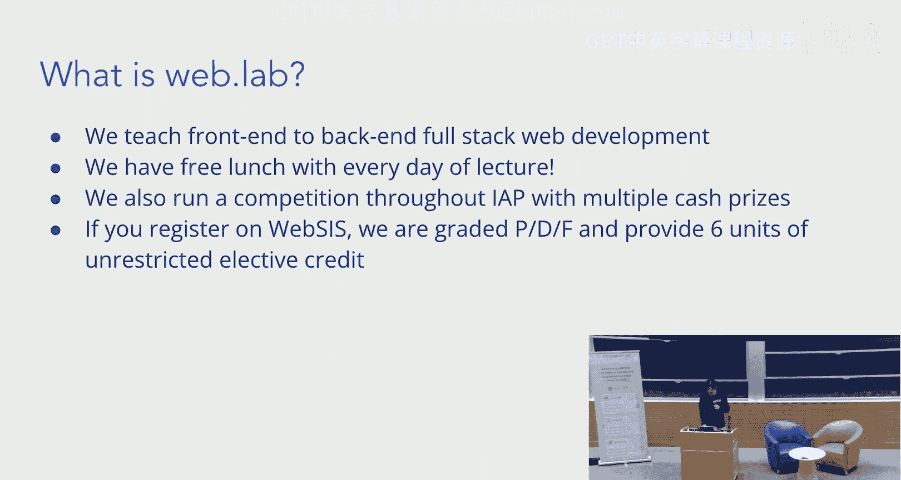

So for everyone in Web labb， it's really been a long journey， as well as for staff。

With over 370 students enrolled on the portal。25 days of teaching， grinding on websites。

 office hours， hackathons。Hundred 55 public and private piazza posts。

386 help queue tickets that we resolved during office hours and hackathons。

A 10 minute average response time on piazza， as well as a four minute average response time for the queue。

And over 48 hours of office hours， including Hoathons， as well as many， many more after office hours。

 where we just stick around and help the help the teams that， you know， stay past 9。😊，But all in all。

 we had 60 wonderful， wonderful web apps that 60 amazing teams created。😊，And today。

 we're gonna see the best of the best of these teams。

 We'll have 10 semi finalalists displaying their websites。

 And hopefully you'll be inspired to also learn web development because these websites are really。

 really amazing。😊。

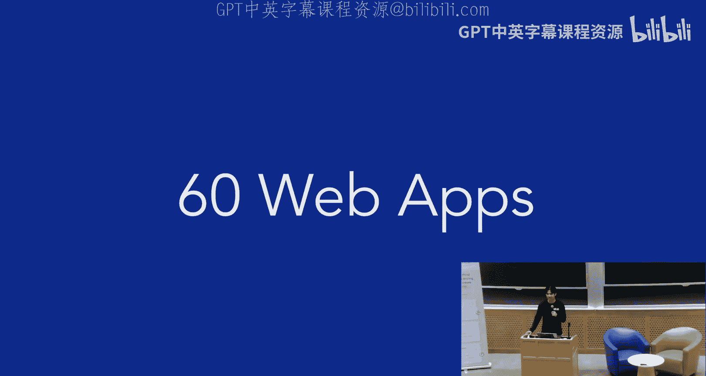

If you wantan to check out all of them， go to Weblab dot is slash Webby。

 which links to our Instagram account。And a bit more about levy and a future slide。

So students really had to learn a lot in this class。

 One of the first common misconceptions about Web labb is that it's just all front ends， but in fact。

Even though we start off with front ends like HM， LC S and JS。

Students very quickly dive deep into react JS， which is a very powerful front end framework。

And then they go into the back end working with node and express servers。

They link their websites to databases using Mongo and then also work with real time connections using sockets。

 as well as many other things that they learn throughout the class。

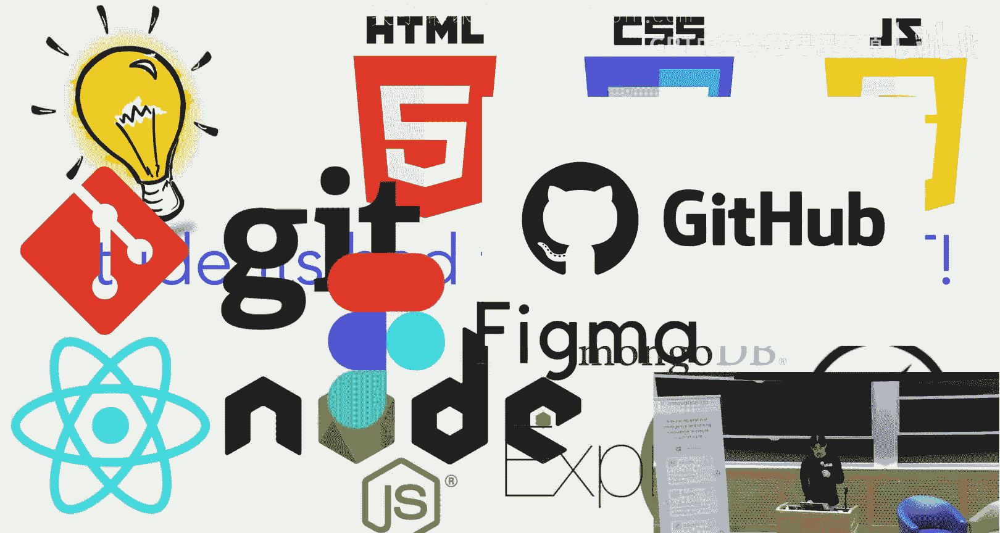

So as a tradition， we have a few funny gi commits of the teams that worked on projects。

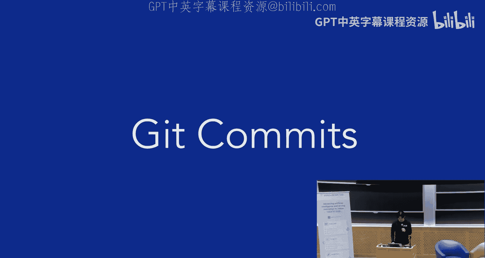

So we saw a lot of gay commits that were successes。We had some more successes。

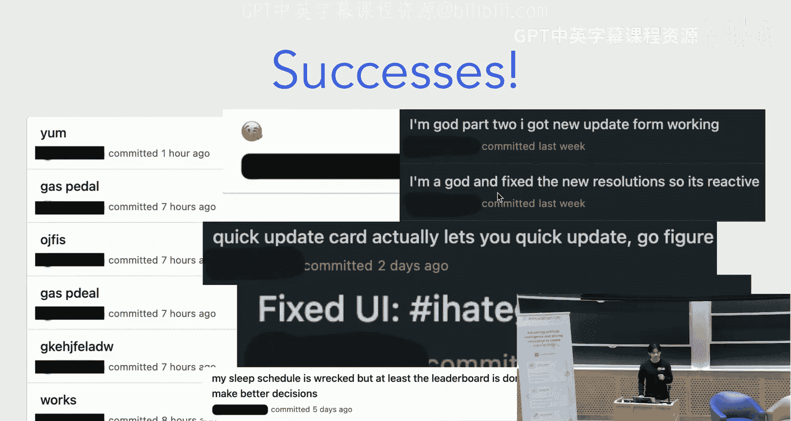

We had some frustrations， of course。I feel bad for the same。

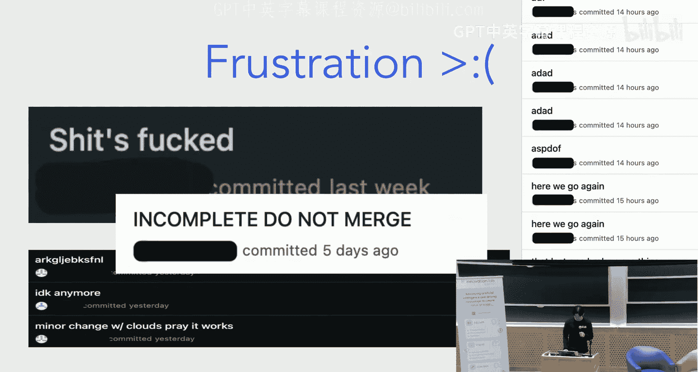

And we just had some straight up confusion。If we showed your team and you're mad at us。

 we're very sorry of it， hopefully。Yeah， hopefully it's not traceable too， but all in all。

 you guys all made it。And we really want to give some thanks to the people who made b， blah possible。

All right， first of all， big shout out to Ellen Reed， Li Bella， Arvin Saya Or Ryan。

 and the whole of Eeks and Cose 6。

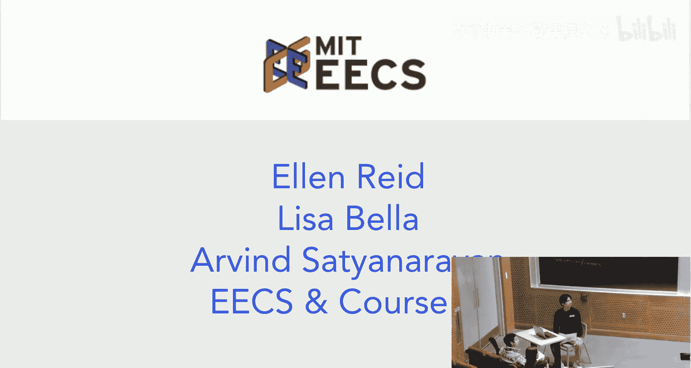

And please give a big round of applause for your amazing course staff without them。

 this would not be possible。All right。Also， we have a lot of sponsors and supporters that also make this class possible。

 so first I'd like to introduce Fech。

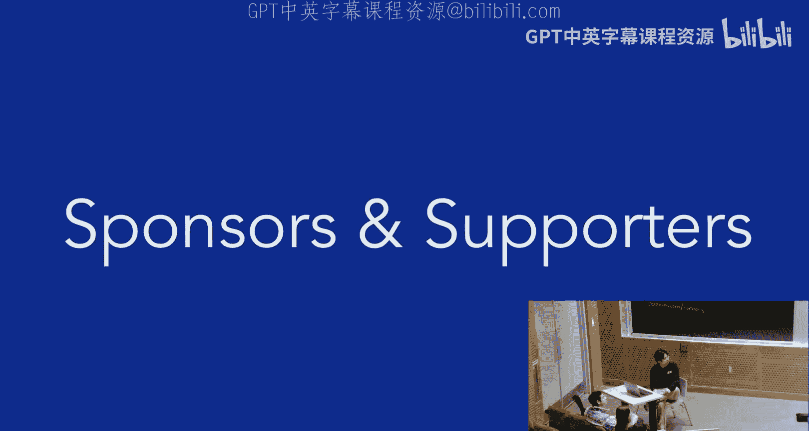

Hi guys， so I am an AI engineer at Fech AI so to give you a brief intro of what Fech AI does so I'm sure you heard about the latest buzzword of in AI that is AI agents so we are a platform where we develop communication protocols between agents so that agents can discover communicate and transact between each other and we have our own Uag framework and also our platform is called agent words where you can find all the agents it's like the Google for AI agents。

And we also have our internship program and we recently launched our Aated program where people who are building the latest any other technology can come to us and we give mentorship and guidance and we take your project from the idea to startup stage。

呃，Thank you，没am。Next， we have Akamai。Hi， everyone。 I'm Dgne， and I'm a campus。

 a recruiter over at Akamai， which is just around the corner from here in Kendall Square。

 Akamai has a number of different things that we focus on。 So we originally started 26 years ago。

 actually co-founded by an MIT professor and student and originally started as a content delivery networking service。

 So helping to make the Internet more speedy， reliable and secure since then。

 as you can imagine the Internet has evolved a lot。

 And while we do still handle about a third of the world's Internet traffic today。

 we've also really diversified our product offerings in 2017， we started our cybersecurity division。

 which is now our biggest revenue driver and a few years ago， we acquired a company called Leode。

 and we've been building out our cloud computing services with them ever since So a lot going on over here。

 a lot of evolution at the company which is really exciting to be a part of and just on the culture side。

 we're very global company。 we have about 11000 people working with us all around the world and over 60 countries。

😊，So a lot of different cultures represented ability to really collaborate with colleagues all around the world。

 which is great。 So if anyone is interested in opportunities at Akamai。

 if anybody is looking for full-time positions， we do post those on our Akamaai career site on a rolling basis so you can go on there。

 set up job alerts， keep an eye out for what you're looking for on the internship side。

 I can share more information with Aby too， we do have a emerging talent at Akamai page and we also post internships on a rolling basis and are expecting a few more to be posted in the next couple weeks。

 so feel free to look out there and if anyone would like to connect with me Dgney Bellak on LinkedIn Thank you。

😊，Next up， we have Codedium。嗯。Hey everybody， my name is Cooper Price。

 I'm a current senior here at MIT。I worked at Codedium as an intern last summer and I'm going to be going back to work on the product team。

 so a little bit about Codedium， it was founded by2 MIT class of 2018 graduates， Veron and Douglas。

 we're based in Mountain View， California， which is in Silicon Valley and right now our flagship product is called Winsurf AI。

 It is an agentic IDE， and it really makes coding quite fun and very， very fast。I think right now。

 like courses generally prohibit the use of AI， but we're gonna give it to you for free anyway。

 with that code right there， MI I T IP Web labb，2025， that is one month of free windsurf。

Also we have internships and full time positions where we are looking to hire new talent if you want to apply go to codedium。

com/caers thank you。We also wanted to give a big thank you to Sno and in Harton。

Reendnder for being our technical sponsor and providing our students with hosting。

And we also want to thank Versll for partnering with Weblab to provide an exclusive opportunity to Weblab students Guerma Rauch is the creator of Socket Iio Versll and NjS and the Verll team have created a shared Slack channel with weblab to allow students to show off what you've built ask any questions about nextjS or the verll product roadmap and it's also a great place for future internship and fulltime opportunities。

 so if you are interested please fill out the form at weblab。

/vercell to be added to the channel also remember to drop your resumes at webla。/ resume drop。

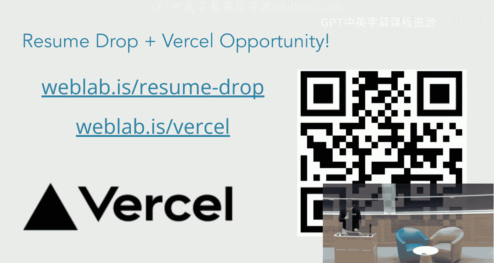

All right， now it's time for the semifinalists to demo their projects。

So we had 10 semifinals and first one is chain reaction。Testing。Hello， everyone。 I'm Kara。 I'm Ryan。

 I'm Neha。 And this is our website chain reaction， which is a word game that tested your intuition in what is the most trendy phrase on Google。

 So I'm gonna continue as guests， but you'll also have an option to log in if you want to save your stats。

 And I'm just gonna go into a game。😊，And so the goal of the game is to get the most points。

 And you get points by entering inquiries that have the most results。

 So you're given the first word and the first letter of the next word。

 And you can fill it in with whatever you think would make this phrase make most sense。

 Anybody know what to put。Anything， okay， I'll just say jump。 That's really bad， but it's okay。

 And so I get 2000 results for jump。 And my score goes up to 2000 points。 I'll try。Not。

Which is kind of sad。 But I get more points that time。 And then once time runs out。

 then you can see all of your different queries here and your different results in your score summary page。

 Now， you have the option to either press this button and go back into the single player start game star game page。

 and then you can play another game， or you can go to our leader board。

 and you can see everyone's results。 so。

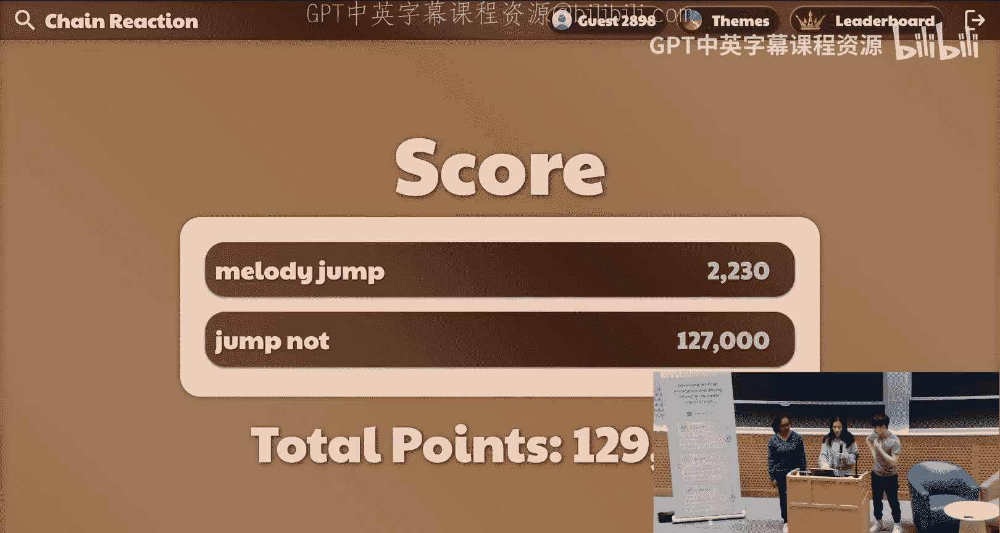

If you look at me， I'm all the way down at 31 because I did not do very well。

 But you can see everyone else's results。 And also， this is only temporary since you're a guest。

 it only saves locally， but you can see where you would be if you did sign in。

 And you can also see everyone's results。 You can see Sophie had a lot of points for saying for the make sense。

😊，And then you can look at the different settings。 So if we say minimum letters for the word has to be six letters。

 you can see I'm kind of doing really well here because of the United States， very popular。 And yeah。

 I'm gonna hand it off to Ryan to talk about multicler。Yeah， so I'm going to join a room right now。

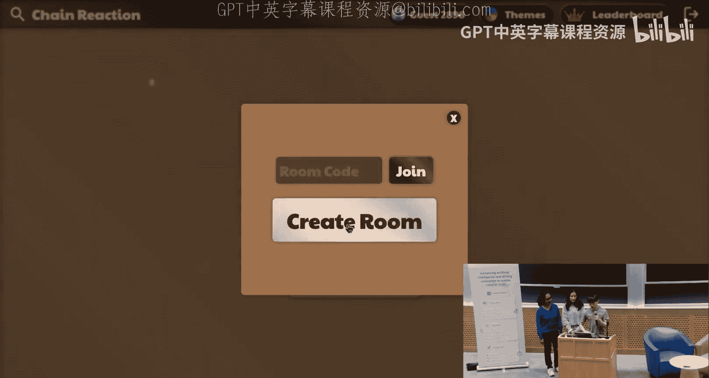

So I joined the room as a host， and I have the abilities to modify game settings and also start the game。

 So while players are able to trickle in， you can also read the game manual and read more about the game。

😊，受押。

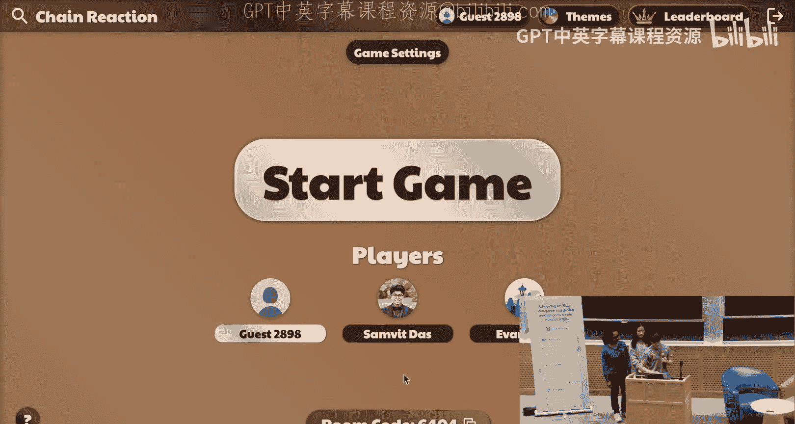

Yeah， so we have four game settings that you can toggle with。

 And I'm going to make the minimum letter 5 words， so we don't spam。

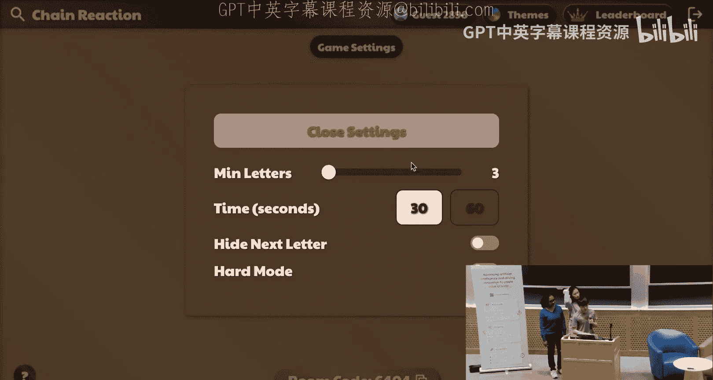

Yeah。Alright。So the game mechanics and U I of multiplayer is almost identical to single player。

 but there is a live scoreboard component of the game。😊，哦哦。

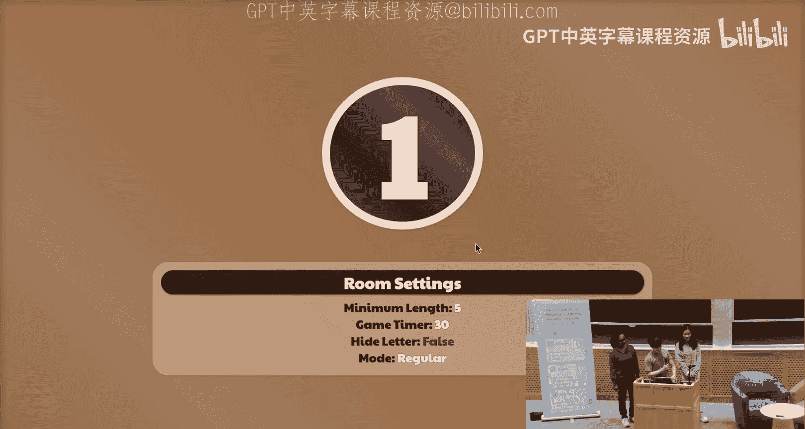

哦。嗯。Well be right back。OK。Yeah， so just a live scoreboard。 And every time a user enters a query。

 it the scoreboard live updates and every player is given the same starting word and chain of letters。

 So， yeah， so you're basically graded by how well you change these words。😊。

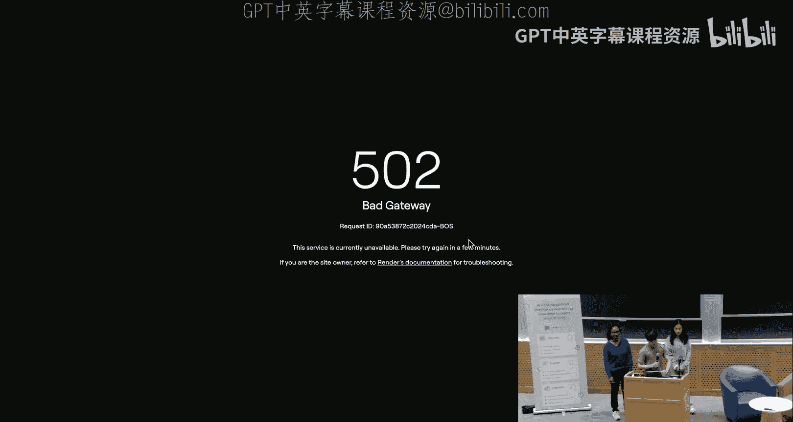

Thank you to chain reaction Also a quick reminder for you guys I know it's probably tempting to go on and try these apps we encourage you to do so but please don't do it during the presentation because we're not sure if it can handle everyone so please be mindful of that and wait till the ceremony is over before you try it。

All right， next up we have chill deck。Hi， everyone。 My name is Alex。I'm Sean。 And I'm Catherine。

Guess how much this board costs。Give me a number。 Shot it out，12 k。Hundred dollars cheap。Thousand。

Will， they be completely honest， I have no idea how much this board costs。 Luckily。

 I've never had to purchase one because I've always had chillilde， just one click away。Yeah。

Our goal is to make DJing accessible to everyone， no matter how experienced or talented they are。

 Use can toggle the chillildeck theme music。😊，And also rain down music notes in the background。

Let's explore the profile page first。

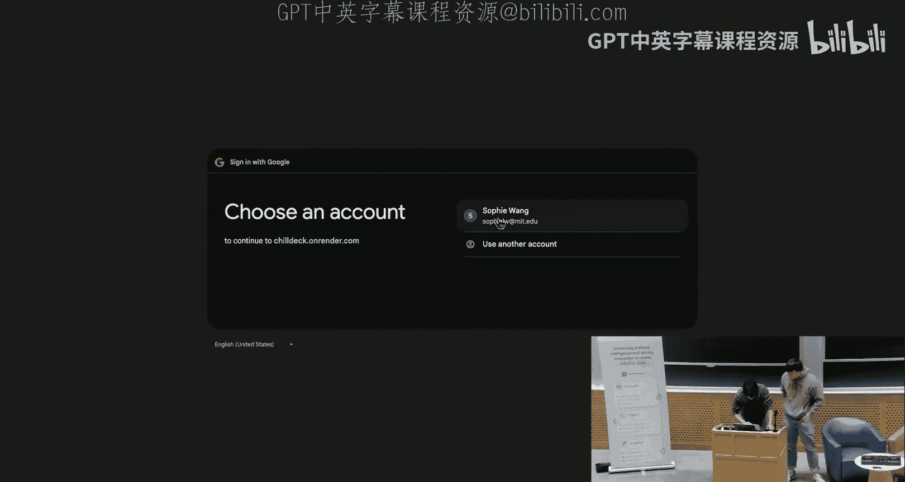

Through Mongo DV user schema， we tailor the profile to match users' expectations。

Users can choose their profile picture and the background。

 Don't to be a chill guy walking through the forest。 You got it。😊。

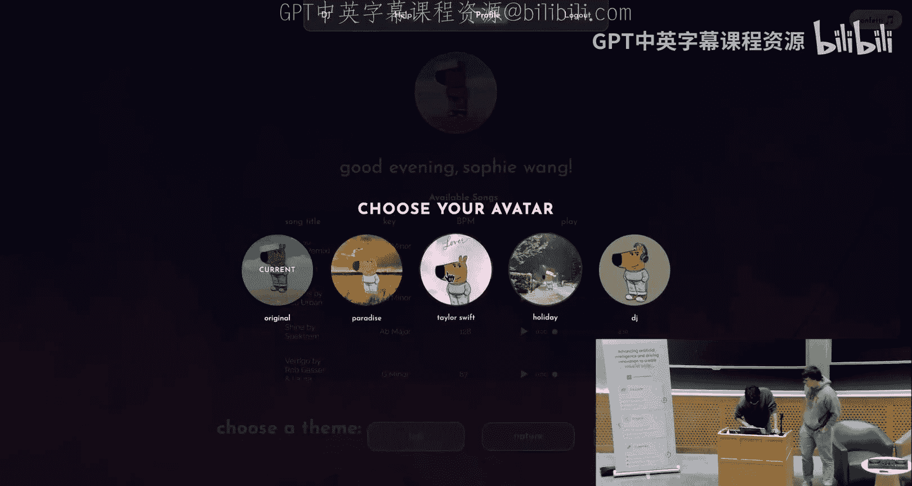

And also， the Confets fills out Weblob。嗯。Now， withll chill that customized to the user's likings。

 We're ready to DJ。 Wait， wait， wait。😊，Chat。Does the user even know how to use the board yet。Not yet。

We thought given that Childeck is supposed to be a user friendly introduction to DJing that the help page is an absolute necessity。

 and we reached out to users to find out what features would be most convenient and most intuitive。

 And as you can see on the help page， we have a walkthrough option that will highlight each box or each component and tell you what it does。

 And this is great for new users who who have never interacted with the board before。

 And then there's also a hover feature just to tell you what individual components do。

 just if you need a quick reminder。 someone that spent a lot of time on the help page is Alex。

 And it really does show in his work。😊，Al right， so I'm going to go over some of the features real quick on the tutorial page here in the walkthrough。

 you can import your songs in the left or right corresponding to the left or the right track。😊。

In the middle of the page， this is where the audio visualizations will appear。

And the top one corresponds to the left track while the bottom one corresponds to the right track。

 we have different features and controls across the screen here you can see we have the BPM where you can change the speed and tempo of each track。

You have the turntable， which spins and synchronizes with the audio visualizations。

 as well as the volume controls。 And we also have a cube button。

 which you can more accurately seek through the audio while it's playing。

 and this will help you sync the two songs together， which I'll show in a demo in just a few seconds。

😊，Here we can split the stems of each audio into bass drum's， melody and vocals。

 this will also help with the audio mixing and just some pretty cool effects you can see。😊，So。Yeah。

 now we can just hop into a demo real quick。

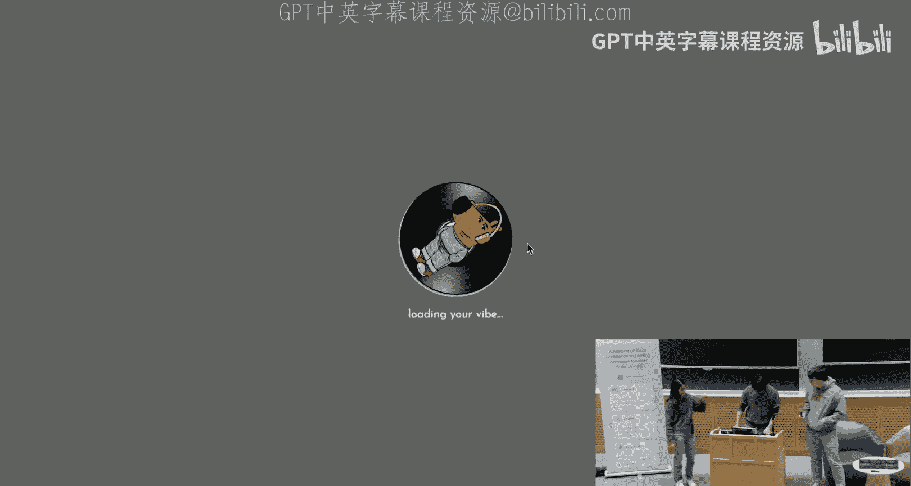

不要。Thank you。不家不要紧。And that was Childeck。Next up， we have Battlelingo。O。Oh。就死。Hi， y'all。

 My name is Joscelyn。Hi， my name is Tina。Hi， I'm Angeline。Oh。

 and this is our game called Battlelingo。 We were mostly inspired by our passion for learning different languages。

 and we made this type foreign language typing battle game where you could cast different spells like freeze。

 attack， heal， multiplier and a bunch of other different effects。

 and you could do you could play games against your family， your friends or practice against a lot。😊。

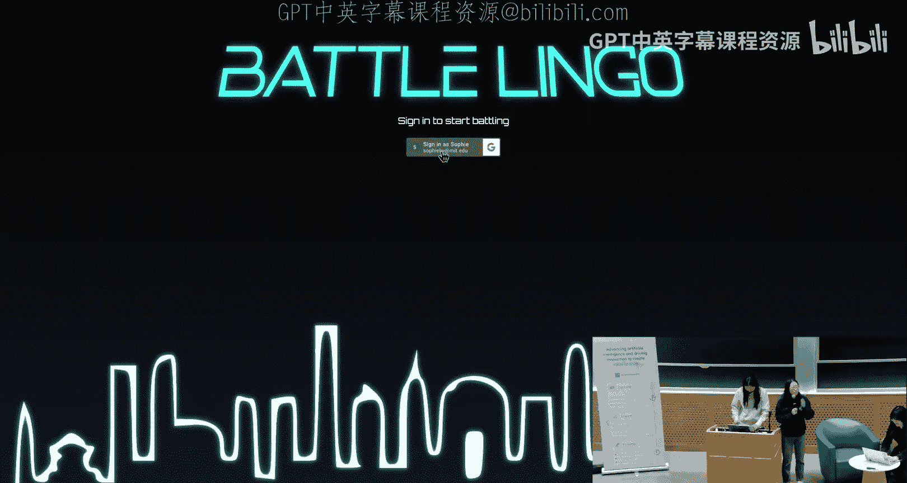

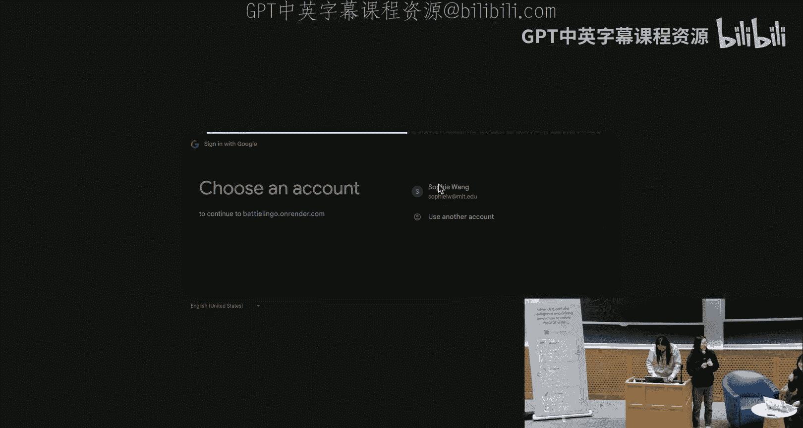

So now we'll be demonstrating player versus players。 So we'll have。

 we'll have Angeline go against Jocelyn。

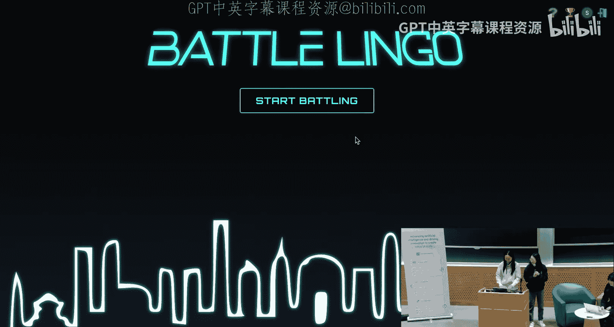

Alright， so once you start， we're gonna create a PVP lobby。 you can also create a bot lobby。

 but we think PVP is a little more fun。😊，All right。I'm going select a language。O。Closer， okay。

Did Chinese create a lobby。Now I'm going to wait for Angela to join me。

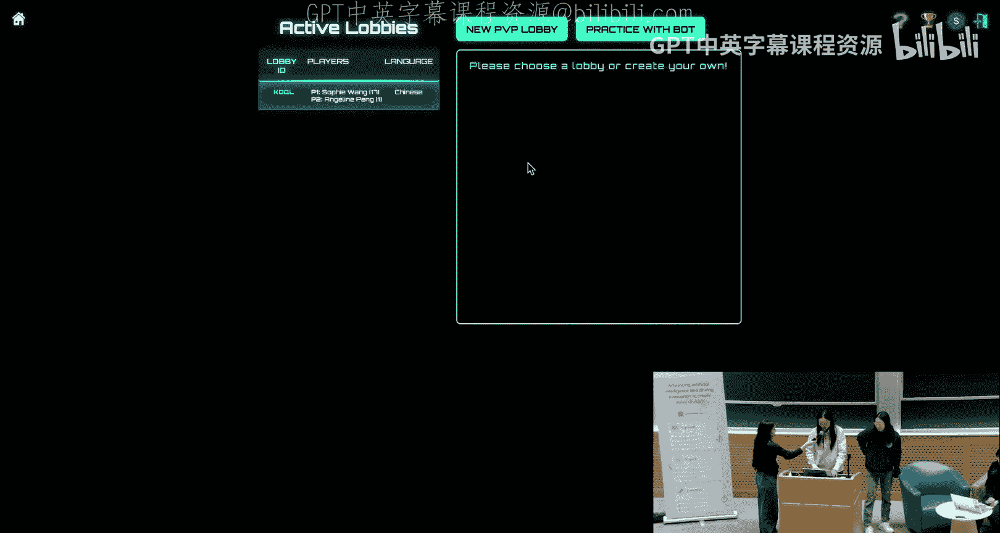

Good， I wanna looks like Angeline's ready。 I'm ready。Alright， let's bottle and go。Oh no。

 I got a froze。好了对。Oh， I mean， I wanted to just clarify the life still means you get。

 you do both heal and attack at the same time。Anyone speak Chinese， or're not the great。可关系吧。Bre。

Gray。连接啊。Wait， wait， what's that word over there？我。

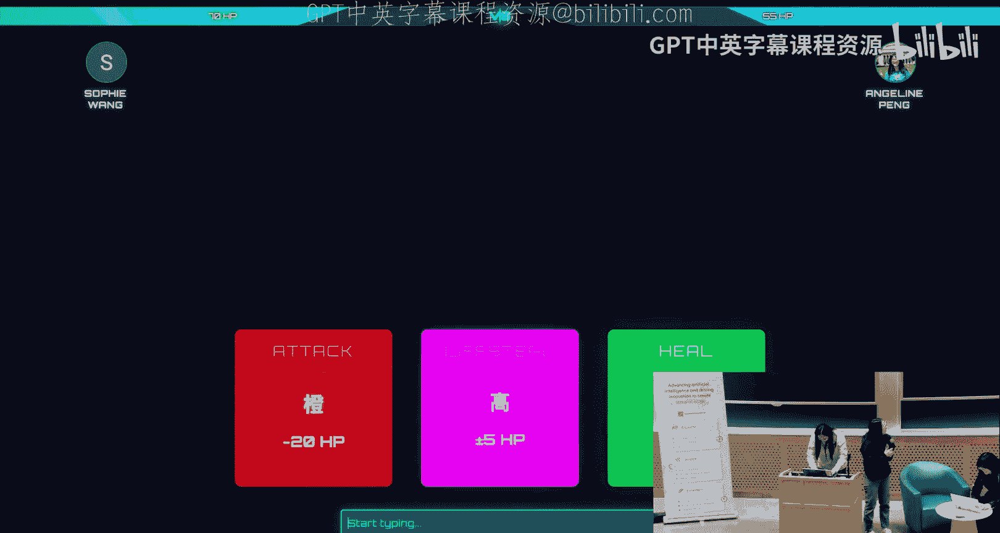

我。This is the profile page that you re， you get redirected to after you finish a game。

 It shows your game history， your language breakdown of what languages you do。 Wait。

 do you want to show the theater board and the wait whats。😊。

There's also the pie chart breakdown of the languages that you did plus the number of games。

 And here're at Elo。Yeah。We also have a leader board with all the players who have ever， I guess。

 played the game。 Yeah， so grind away。But you also have a quick how to play just for players who may not actually know how to play the game in case it's unintuitive。

 Oh， I didn't explain this， but to take a card， you type it。Yeah。Yeah， and I think that's it。

Thank you。

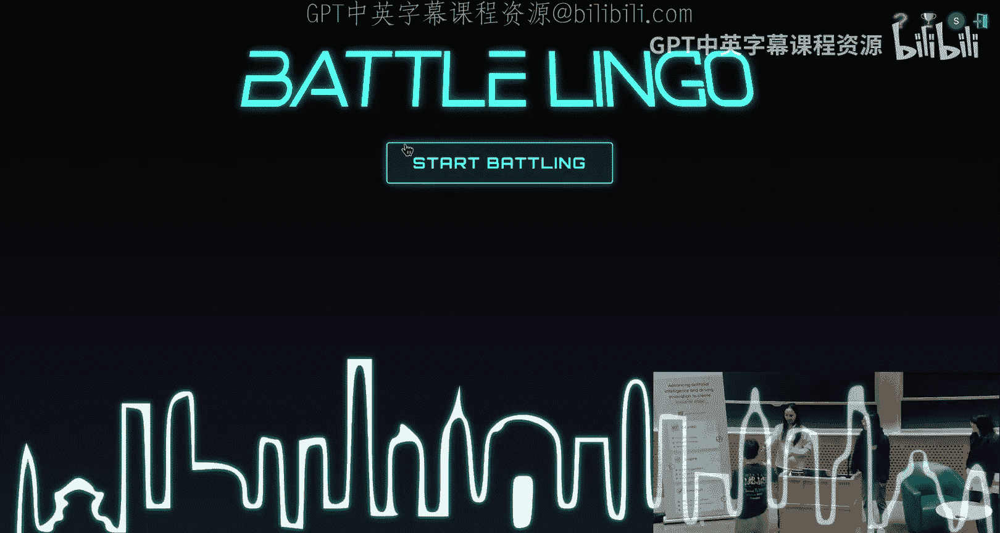

That was Baolingo， also a quick heads up for a semifinalist when the like team before you guys is like wrapping up and finishing。

 please make sure you are ready to come up just to speed things up。All right。Next up。

 we have Routeseter。Hello， everybody。 This is my project routeseter。 It's about rock climbing。

 and specifically， it's about setting and rock climbing。

 which is when people put up holes on the wall to create climbing roots。😊，So I'll start。

 This is the login screen。 You can read some more about it if you scroll down。

 but I will just log in with an account。

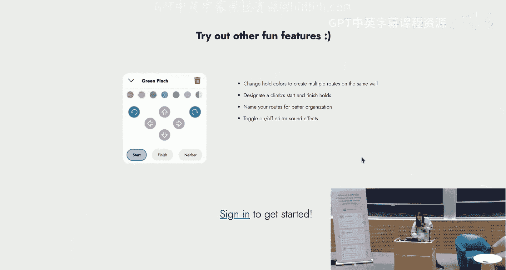

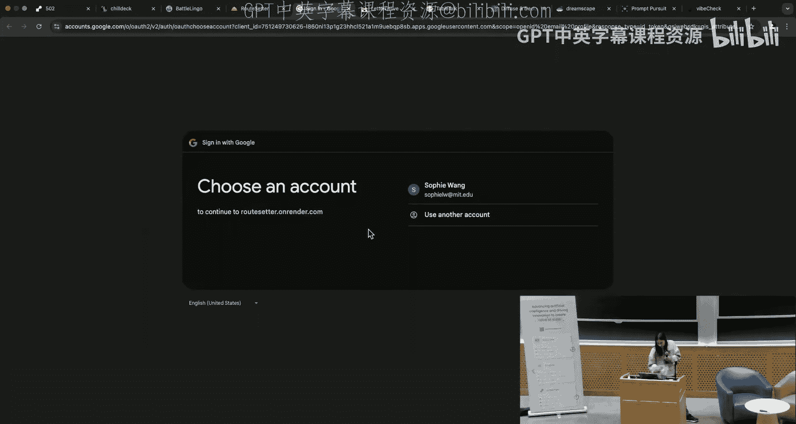

Okay， so now this is the my roots page。 So every time you create a climbing route。

 it'll get saved here。 And when you make an account for the first time。

 it will create these two example files you can look at first if you want to。

 So I'll go into one of them。 This is example 1。😊。

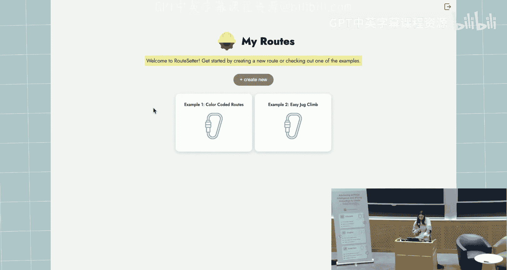

And dresss Hoer is this 3D editor tool where you can put holds up on the wall to plan out the roads you wan to make。

So you can see we can move around the editor。 We can pan。 You can zoom in and out。

We can move the holds around on the wall， if we select them。We can use the arrows to drag it around。

 and they'll snap to the bullet holes on the wall。Yes。

 there's a bunch of different other tools we can use， like changing the colours of the roots。

Or some other controls， like rotation。Our setting holds is to be the start or finish holds。And yeah。

 there's a few other features like we can change the wall angle。So this right now is the corner wall。

 but I can set it to just a vertical wall here。And yeah， once I create a route。

Im putting up some holds。I can move them around。 Maybe this will be the start。 This can be the end。

And I can save my root。And now if I go back。It'll be still saved here if I reopen it。

 We'll see the route that I made。And yeah， that's my project。Awesome。That was Roseter。

 Next up is Let Grove。Okay。Hey everybody， our project is called Let Grove， which is。

 it's a word game。 Let me just sign in here。

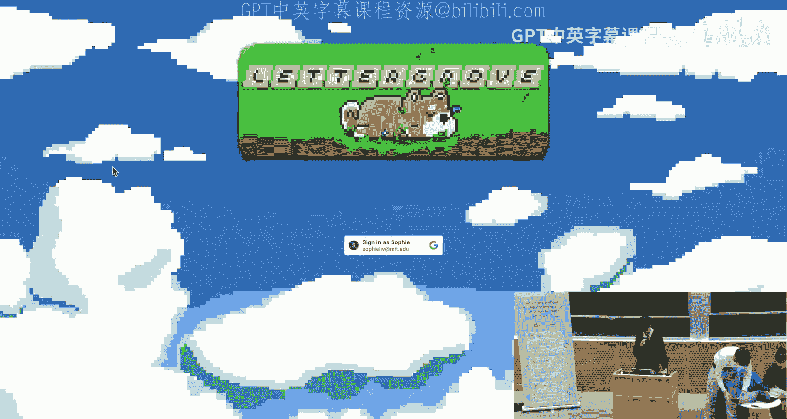

Pter's no fault。

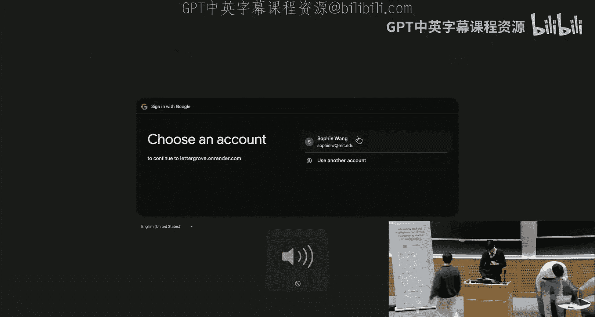

Okay， so Leon here， I'll just go through the tutorial and he'll explain how everything works。

 And then we'll demo a game after。Okay， so let's jump right into our playable tutorial。

So the main objective of the game is to collect the fruits and letters on the field and trying to get more points than all of your friends。

So you may notice that the L here is a golden tile and that's because you can only start words from golden tiles。

 so let's try and type in letter to form our first word。Now let's place it by clicking the R。

And now you can see we collected eight points that's because two of them came from the cherries and three came from the grapes。

 but two and three don't add up to eight right that's because we got three points from the three grade default letters。

 the E T and the E which have their points associated with them up on the top right。

So now let's try this again and type inRang。🎼Yeah。And now let's place it。

And so we just got 17 points， five of them were from the oranges。

 10 were from the fruit crates and two were from the G Now instead of moving vertically and horizontally。

 let's try and move diagonally so let's collect these power ups right here。

Let's place it and now you can see more fruits have appeared on the field that's because of the watering can power up and then you can also see that we just got four points rather than two that we're supposed to get from the O and the E and that's because of the golden shovel power up that we just got This doubles the points of the word that you just placed。

And now let's try and move around the field a bit， going to a different golden tile。

 and let's type in game。Place it。And we just got more points。

 and let's go back to the E and end the tutorial。🎼So yeah。

 the tutorial just gives everyone like a basic idea of how the mechanics work。

 but the real game itself is actually much more complicated slash interesting。

 We're running two different modes so there's same board where everyone plays on a board like cap up to four people and you can sort of interfere and take turns putting down words on the board and then different boards where everyone gets the same randomly generated board and it's just a competition to see who can play the best rather than sort of like as much strategy as same board So we'll demo same board now just to show off the functionality of like board synchronization across users So I'll create a lobby let me just set my username。

And we'll play just for the sake of time， let's just play words， we'll play three words each。

 set the default minimum where length is three， and mostlyll play it on easy mode。

So once I start this， Leon and Steve here will join。It's。응。So you can see here Steve's joining。

 Leons joined， and we'll start the game。🎼Alright， so since I'm the lobby owner。

 I'll start with the game so I can put down any word。 and in the tutorial， you could only go。

 you know， in the set direction。 But here you actually can move omni directionally and let me choose De and go this way。

 And now it'll sync up on Steve's board and it'll be Steve's turn。So you can see in the background。

 his board has been updated and it's been updated for everyone。And then now it's back to my turn。

 Let's see。So there's solace， and you can see on the top right。

 we have our current rankings for how many points each person has and a log that contains the what everyone's collected thus far。

🎼So let's see we go here， little typo。So my game is completed。

 now we're just waiting for them to finish up their words。🎼Yeah。And so these are the final rankings。

 I did the worst and you can click through each person's stats to see exactly how they played。

 your score per word， just to give a more general idea of the game they played。And then on this page。

 if you want to see exactly what someone else played or placed on the board in that game。

 you can actually click on their username here and it takes you to their profile page。Oh。

 actually I clicked on the wrong one， but let me click on my own。Yeah。

 and then we can see the most recent game next to every single player's username。

 there's like a little board icon which you can click into and see exactly what they played in the game。

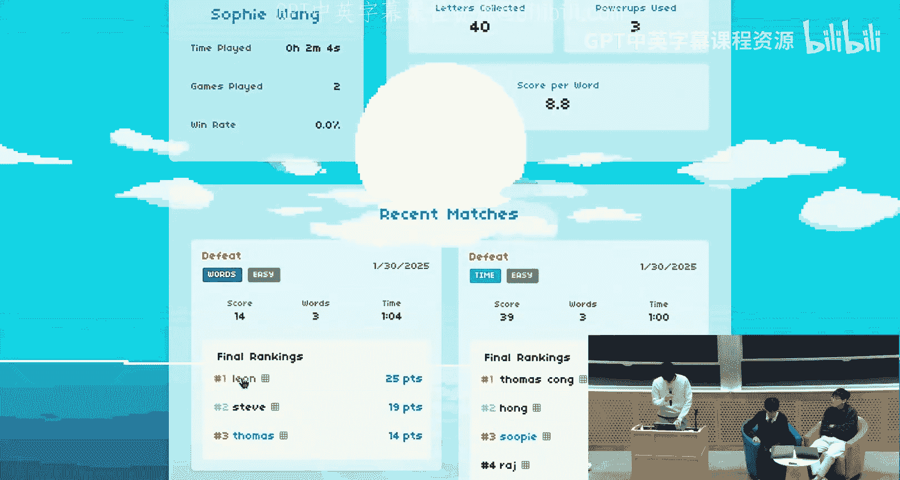

Oh yeah， I guess it doesn't really matter here because they're playing on the same board。

 but even if we're playing on different boards， you can see like the different words that people played。

 So yeah， these are all different。🎼。Y， thank you。All right， that was Let her Gro。 Next up。

 we have table talk。M， I T I P， a time court exploring。

 taking interesting classes and for many of us， getting off the meal plan and trying to become a real adult。

 This is a problem that many of us have faced going from socializing in dining halls to isolated meal prep in your dorm alone and sad。

 Table talk aims to solve this。 We try to connect people to both cook food together and share food with each other。

 Let's get into it。😊，Alright， and before we get into it。

 we're just gonna introduce ourselves because I forgot to。 So this is I'm Z。 and I'm Peter。

 Basically， table talk starts with this landing screen where we can scroll up and down to see what different features are functional or functional here。

😊。

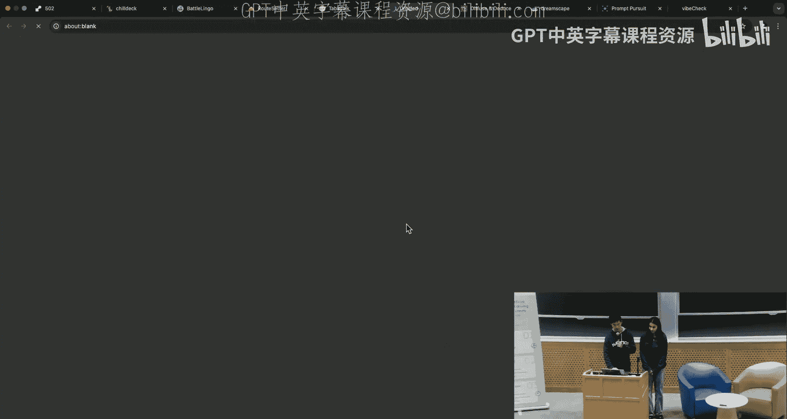

And if we sign in， we instantly get rejected into a map page where we can hover over different icons of different events that are coming on。

 These events are color coded。 So blue for group events。

 green for public events and red for private events。

 since I don't think Sophie has any friends right now。 We can't see any red events。 but that is okay。

😊，Anyway， from these， you can get to the feed page。

Which will show us essentially a list of all the events that are being held at the moment。

 that's so fe。Because different friend groups might want to invite different people to cook at different times or at different places。

 we've added a filter feature so we can see public。

 private events or custom groups we'll be showing later。

 and we can filter based on time and also upcoming and what you've joined。

So clicking on one of these cards， we get directed to the event chat and this is essentially where we can keep all the information for it。

 we can add a recipe， we can see all the event details。

 see all the participants to decide whether we actually want to go or not。

 and then see the event chat which is filled with messages right now。😊。

Let's move on to the group's page。 I don't think Sophie is any， in any groups right now。Luckily。

 she has an invitation from Aby。 Thank you， Avi， if we accept this。And we reload。

 You can see that Sophie is now in the Web lab staff group。

 We can see all members of the group check out their profiles。😊，Hi， Sovit， we can see his friends。

 hi Lucas。😊，And if we go to our own profile， you can see that we can edit our bio。

And we can mark our dietary preferences so everybody can see， as this is a cooking website。

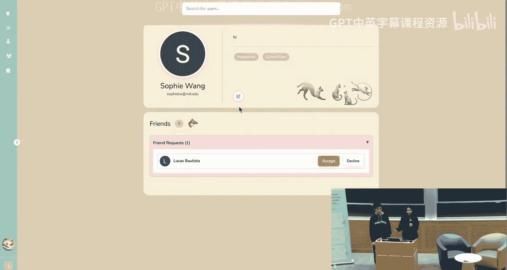

Back to groups， you can also make your own。 Let's make a big web labb group。I'll create the group。

 And because I made it， I feel like I should invite myself。So we go to this button， finds me。

 Oh there I am。

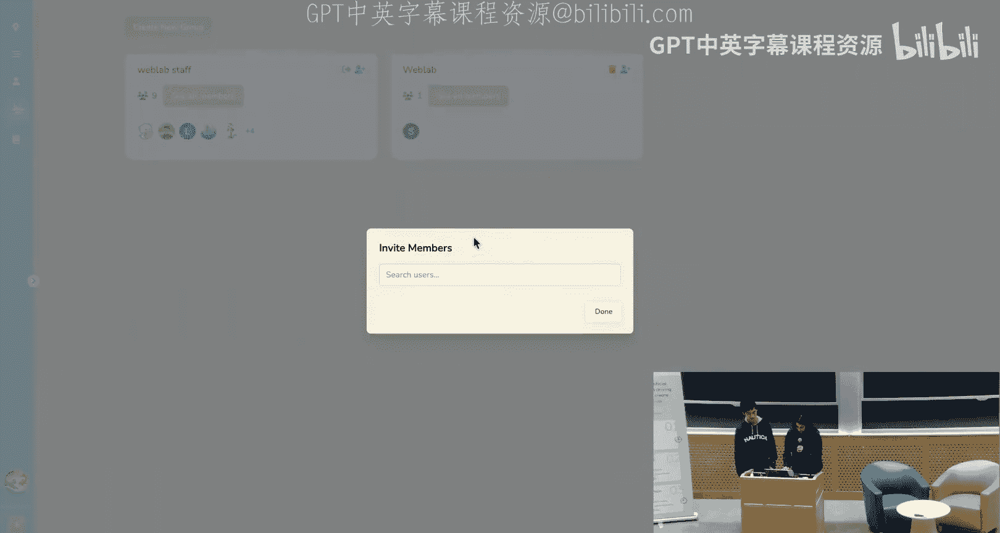

And send an invitation。Lastly， we have a recipe book。 Many of us can't cook。

 so I won't even bother trying to add a recipe， even though I could potentially。 Instead。

 I think I'll generate a recipe。

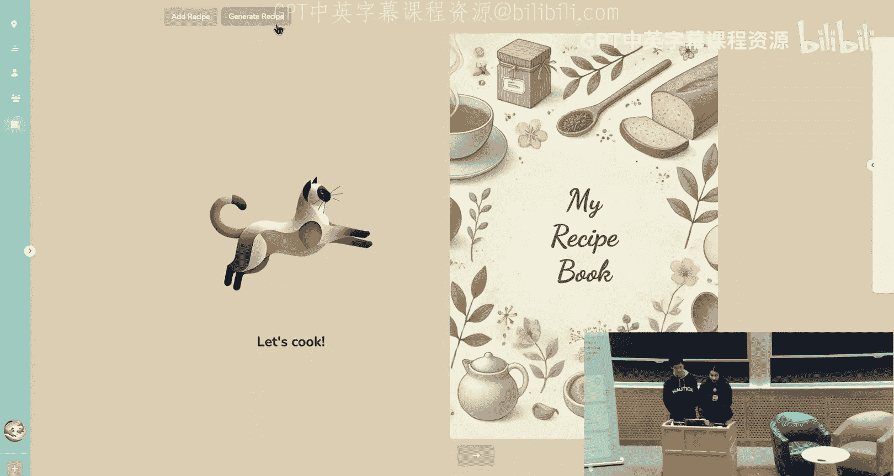

What do we feel like eating？ Any ideas。Mck and cheese。We have many dietary restrictions available。

 Let's make it vegan and paleo。Just out of curiosity。 I want to see what happens。

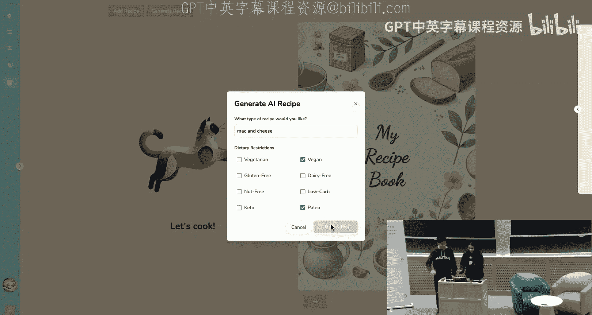

So a recipe has been generated。 We can open our book because there's only one entry。

 So I click and go to mac and cheese。 But hypothetically， if I had more recipes。

 I could click and it would scroll to that page in the book。😊。

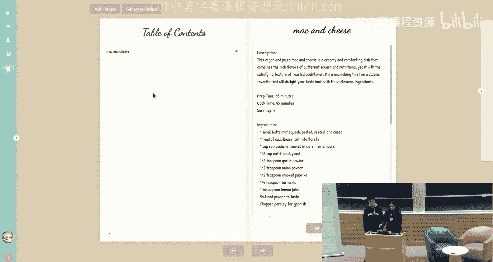

Let's see what it has。 Vegan and paleo mac and cheese。 Good job。 A I。

 I can also edit the recipe if I don't like how much time it takes or any of the steps。

And we can save this。 upside down。 What's upside down is upside down in this computer Oh。

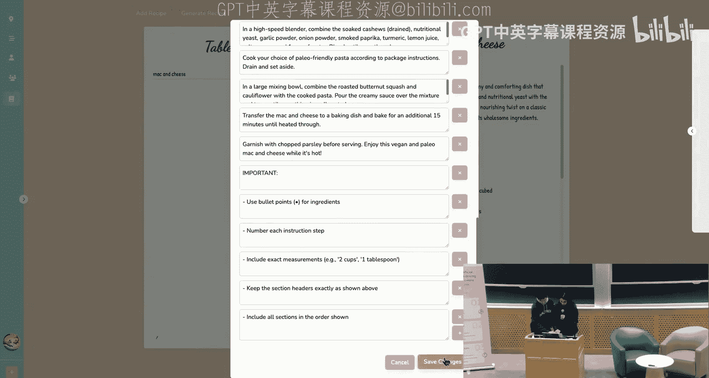

Good to know。 And lastly， if I want any cooking general tips。

 I can type it into our recipe assistance。Help with。Cheese。Maybe that wasn't a very good prompt。

But yeah， overall， table talk aims to connect people over not only。

Our idea was to connect people in college because that is the challenge that we personally are facing。

 but this can be generalized to anybody in the workplace or anybody in life。

 trying to connect with your neighbors， with families， with the people around you。

 trying to branch out， so to speak。 Thank you。😊。

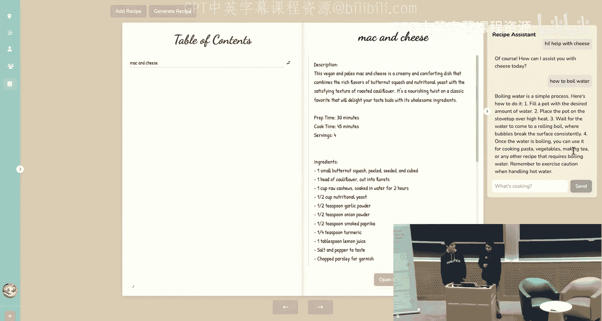

That was table talk。 Next up， we have diffuse and deduce。Hello， everyone。 My name is Daria。

 and this is Peter。 Our website is called diiffffus and deduce。

 and it was inspired by how diffusion models work in AI。

 They start with a completely noisy image and gradually denoise it towards a meaningful image。

 And we decided to incorporate this idea into a quiz game where our participants are presented with a noisy image that gradually dennos itself。

 And their goal is to guess the image as soon as possible before it becomes clear。😊。

And we also have images related to different visual concepts。

 so playing the game can help you broaden your knowledge and learn more about the world。

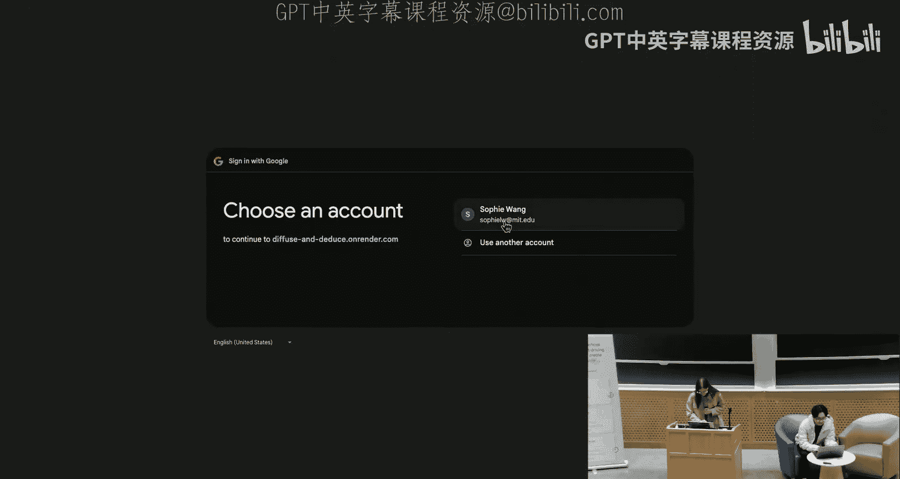

So we have single player， as well as multiplayer game modes。 Oh let's try multiplayer for now。

We have the option to create a new game room or join an existing room using a room code。

 So let's create a new room。And we also have music that you can either enable or disable。

The code is W GTY 3。And so now the host can proceed to the game settings。

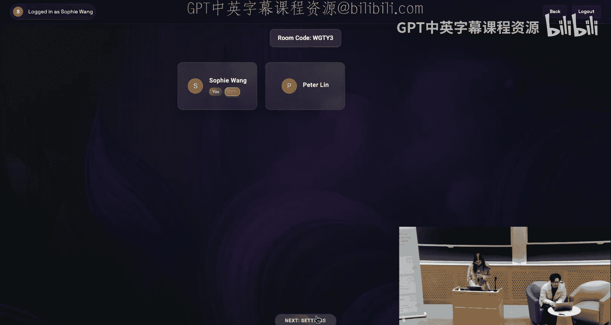

And we can， choose the topic， for example， animals。 we can choose how many rounds we want to play。

 say we want to play two rounds。 We can choose the duration of round。 say，30 seconds is fine。

 We also have the option to sabotage another player。 And we also have the option to receive hints。

 if we make a mistake。 And we also have to reveal modes， which is diffusion where a noisy image。

 the noises itself or random reveal where we start with an image covered with a blank canvas and random portions of that canvas are revealed。

And also， if we have at least two players， we can import custom images。 In this case。

 the host who imported the images。 Clearly， the host knows what the images are。

 so they will be able to manage the round， but won't be able to submit guesses。

 but the other players will be able to submit guesses。And also， in the case。

 you got confused what all those settings mean， you can go to a tutorial and see explanations and then return back to the settings page。

 But let's start the game for now。

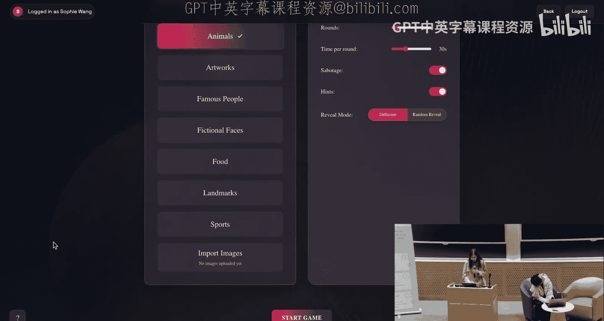

。So we can type our guests into this box and suppose I guess incorrectly in that case。

 I will receive a notification that the guess was wrong。 And the first letter of the correct guess。

 So now that the image den noises a bit， I can see that it represents a lemur and also our guess is are case in sensitiveitive。

 So even if you type a weird combination of uppercase and lowercase characters， it will be accepted。

So you see a leaderboard on the like intermediate stage between the rounds。

 And the host has the option to determine when the next round should begin。

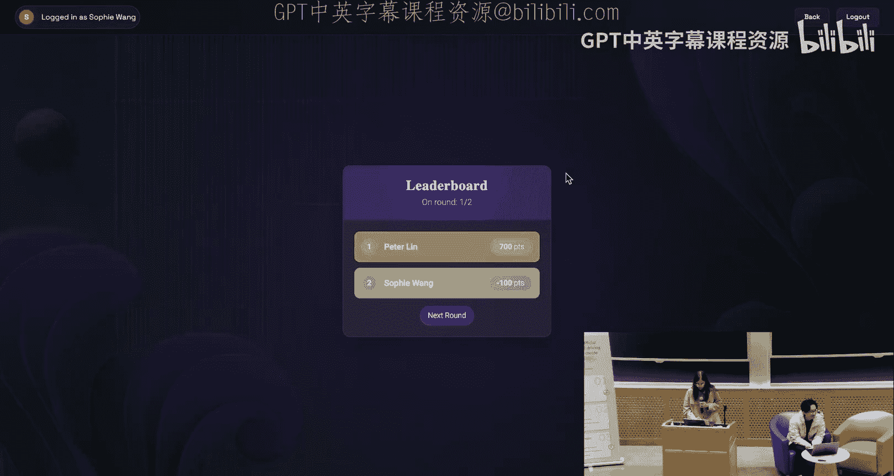

And let me show you how to sabotage other participants so I can select an opponent here， and I can。

 for example， add more noise to the opponent's image。

So I can do so by pressing the button on the screen or also by pressing the A key on the keyboard。

And the opponent's image will become noisier。

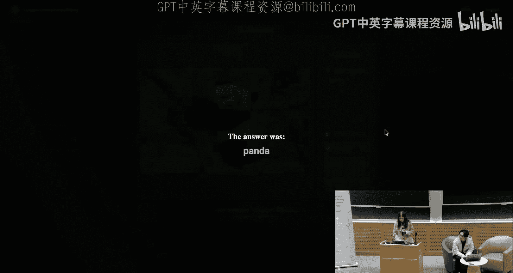

So after this， we are redirected to the final results page。

 which shows the a podium with the top three players or top two in this case。

 because we don't have a third player。

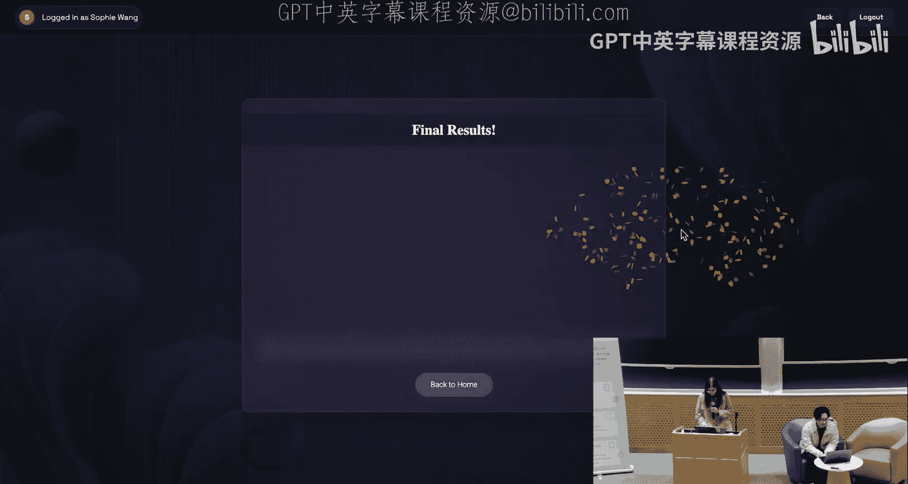

And after the game finishes， we can go back to the home page and we can start a new game if we want。

That was diffuse and deduce。 Next up， we have dreamscape。女的。

So I want everyone to take a moment and think back to last night and what they dreamed about。

 So people probably would have different answers to this question。

 Some of you might remember the crazy dream you had， but most of you probably forgot。

 But have you ever had the time where you wanted to share your crazy dream with your friend。 And。

 but you just forget about it during lunch break。 Well， welcome to Dream Spe。

 which is going to solve that problem。😊。