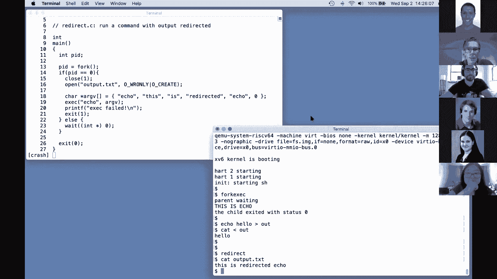

# P1：Lecture 1 - Introduction and Examples 中文版 - MCATIN-麦可汀留学 - BV1rS4y1n7y1

欢迎来到六，零，八一操作系统，我是罗伯特，我将和弗朗兹和大卫一起讲课，尼古拉斯是助教，请在这些变焦讲座中，提问，你可以用音频打断我，也可以在聊天窗口中输入一些东西，一个工作人员会看到并问你一个问题。

顺便说一句，我们会把这些讲座录下来，我们稍后会把录音贴出来，这样你就可以复习了，或者对于那些不能让这个时间的人，所以他们仍然可以看到讲座，但我想先提出一些课程的目标，所以说，操作系统的设计与实现。

设计是一种高级结构，实现实际上是关于代码的样子，我们会花很多时间和两者在一起，为了深入了解发生了什么，你会得到一个小的经验，用一个小操作系统，XVSix操作系统，除了实际查看现有的操作系统之外。

你会在实验室里获得大量扩展操作系统的经验，修改，改善它的行为，并编写系统软件，如果它工作在一个应用程序中，它将使用操作系统接口，所以说，嗯，这就是你们在课程中要做的，嗯。

我们还对操作系统本身的用途感兴趣，以及课程，因此，我有一个清单，上面有几件事，尽管有很多操作系统，不同的操作系统，它们通常有一套共同的目的，其中之一是抽象硬件，那就是，你知道吗，你得到的。

通常作为一种起点，你买一台电脑，作为内存CPU的计算机，但这是一个非常低的资源集，有更高的水平真是太棒了，应用程序可以使用的接口和抽象，例如进程或文件系统，既方便又便于携带。

操作系统的另一个非常重要的任务是多路复用硬件，在众多应用中，您可能正在运行文本编辑器和编译器，或者是操作系统上的多个不同的数据库服务器或其他东西，能够让操作系统运行真是太棒了，他们两个同时。

或者在没有它们干扰的情况下同时发生的所有事情，所以这通常被称为多路复用，嗯，因为操作系统中可能同时发生了很多事情，关键是他们不能无意间干涉，即使他们有虫子，这是一项叫做隔离的任务，这种想法。

不应允许不同的活动干扰，另一方面，有时不同的活动想干涉，我们希望互动或合作，例如，如果我用文本编辑器创建文件，我想让我的编译器读取文件，我们肯定想允许这种分享，所以我们想允许剪切，当它是用户的想法时。

但在许多情况下，用户不想分享，也许你像雅典娜一样登录了分时机，你不想让别人读你的文件，所以我们也需要分享，当我们不想分享的时候，我们不想分享，我们可以称之为安全，或权限系统或访问控制系统。

人们在操作系统中重视的另一件事是，如果你在电脑硬件上花了很多钱，您希望您的应用程序能够获得，硬件应该能够提供的全面性能，其中很多只是应用程序编程，但不可避免的不幸。

其中一部分是操作系统必须确保它提供的任何服务，不要妨碍应用程序获得高性能，所以你至少要敲门，甚至可能帮助应用程序实现良好的性能，必须支持广泛的不同应用程序，也许是一台运行文本编辑器的笔记本电脑。

也许是在运行游戏，也许您的操作系统需要支持数据库服务器或云计算，通常是因为操作系统的设计和构建成本相当高，人们使用相同的操作系统来完成许多不同的任务，像Linux，比如说，那个。

我相信你们中的许多人都在跑步，在我提到的所有情况下都使用，所以说，同样的操作系统必须能够支持一系列通常完全不同的用途，所以我们希望能够同时支持所有这些不同的目标，我们将在课程中听到更多关于他们的信息。

所有权利，操作系统，在过去的几十年里，一些人提出了一套设计想法，这些想法非常有效，组织事物的方式，嗯，我会为你安排，这种经典，组织是这门课的标准，和，对于许多操作系统来说实际上是很常见的。

所以这是OS的内部组织，我认为这是一场平局，放电脑的盒子，计算机附带了一堆硬件资源，我会把它放在底部，也许有CPU和RAM，和一个用于存储的磁盘，也许还有一个网络接口，这种硬件是最底层的，所以在顶部。

我们想运行各种应用程序，也许是文本编辑器，我碰巧用VI作为文本编辑器，如果要运行C编译器CC，也许你经营很多其他的事情，我们今天要讲很多关于贝壳的事情，也就是命令行界面。

所以我们有所有这些不同的程序在运行，这就是应用程序运行的世界通常被称为用户空间，与此不同的是，有一个单一的程序，一个特殊的程序，它总是在运行，叫做内核，内核是计算机资源的守护者，这是第一次靴子。

你打开电脑，只有一个，它维护数据以帮助它管理这些过程中的每一个，内核还维护了大量的数据结构来帮助它接口，以及这些用户程序需要使用的所有不同种类的硬件，内核还内置了一系列服务，所以，比如说。

内核中通常有一个文件系统实现，它实现了文件名、文件内容和目录等功能，并了解如何将文件存储在磁盘中，因此，您的程序将与内核中的文件对话，快速和实现将与磁盘对话，在这门课中。

我们主要关注的是内核内部必须发生的所有事情，以及用户程序与内核之间的接口，以及软件内部的结构，所以我们非常关心内核中的这些服务，其中之一是文件系统，我提到过，还有一个过程管理。

这些正在运行的程序中的每一个都称为进程，它有自己的记忆，比如说，以及一部分CPU时间，因此内核将进程作为内核服务进行管理，嗯，的，内核管理内存的分配，不同的进程需要不同数量的内存，内核。

多路复用和分割内存，分配内存，在所有不同的过程中，内核，正如我提到的，影响文件系统，文件系统实际上有两三个逻辑部分或一堆逻辑部分，但现在我们可以从管理文件内容的角度来考虑它，那就是里面的东西，档案。

找出磁盘上的位置，每个文件的内容都应该是活的，文件系统还在某种程度上单独管理名称空间，每个文件都有一个名称，有一个目录的层次结构，每个目录都有一堆文件，那是由文件系统管理的，通常会有某种安全安排。

也许我们可以称之为访问控制，通过它内核决定，你知道，当给定进程想要读取，使用一些资源，也许从磁盘上读到一些东西，或者用一些内存，内核内部的访问控制机制决定，是呀，允许的是不允许的，如果我们谈论分时系统。

这可能会变得非常复杂，就像雅典娜系统，哪里有，你知道的，这些进程中的每一个都可以由不同的用户运行，并对允许访问的内容应用不同的访问控制规则，在一个真正成熟的操作系统中，原来有很多，许多其他服务。

你知道的，不同的进程通常有某种方式相互交谈，称为内部进程通信，通常有一大堆与网络相关的软件，比如与网络通信的TCP IP协议，通常支持声卡，可能有数百个不同磁盘和数百个不同网卡的驱动程序。

所以在一个成熟的操作系统中，这里有大量的东西，这可能会在内核中运行数百万行代码，这是对内核内部内容的快速概述，嗯，我们还对应用程序如何与内核交互感兴趣，那个界面是什么样子的，这是内核的API。

应用程序如何进入内核，通常，这是用所谓的系统调用来完成的，这些看起来像是程序可以进行的函数调用，但实际上跳到内核中，在内核中执行一个名为实现的系统，我将在这节课的后半部分详细讨论这个问题，嗯。

就目前而言，只是为了给你一个味道，或者在应用程序的源代码中几个不同的系统调用可能是什么样子，一个可能是如果你想，如果应用程序希望打开文件并使其调用开放系统调用，并告诉名为文件名的开放系统。

所以它可能想打开一个文件来写，喊了出来，这将是一个额外的论点，在这种情况下说一个说我想写那个文件，所以这个看起来像函数调用的东西打开了，系统调用，实际上是跳入内核的特殊代码，内核可以检索这些参数。

执行一些实现开放的内核代码，可能会与磁盘对话，然后返回值，这是这个文件描述符，因为fd代表文件描述符，这个程序可以用作句柄来引用这个打开的文件，如果要写入文件，被调用来做的A系统，那叫写，你必须通过它。

其中一个文件描述符，与打开返回的相同，嗯，这些现在是在系统中传递的参数，从程序调用内核，给它一个指向字符缓冲区的指针，所以一个简单的方法，在编写这些示例的c编程语言中，是双引号，然后这个弦。

字符串的字节，这种反弹是一条新的路线，第三个参数是要写的字符数，所以这真的让我们忘记了记忆中的地址，所以你告诉内核看，请将此地址中的六个字节写入，这个文件描述符引用了您遇到的一个更令人兴奋的系统调用。

是fork系统调用，fork是创建新进程的系统调用，return实际上创建了一个与调用者和fork相同的进程，返回A标识符，进程标识符，或者新过程的一个P，实际上比那要复杂一点。

我们会听到更多关于这个的，所以再一次，这些看起来都像函数调用，但是系统调用是特殊的，因为它们跳入内核，那只是一种味道，我们稍后会看到更多，这是一种快速的概述，嗯，我只想提一下为什么。

我发现操作操作系统的研究既具有挑战性又很有趣，为什么你知道为什么它可能值得，在智力上值得参加这方面的课程，所以很难的一个原因是环境是无情的，内核内部的编程环境是无情的，因为你的，当你在编程的时候。

当您修改内核或扩展内核时，或者编写一个新的操作系统内核，你提供了其他人认为的基础设施，已经在场正确地运行他们的程序，其他人在他们的程序下得到一个操作系统，当他们编写普通应用程序时。

但是当我们构建操作系统时，我们得到的是操作系统下面的硬件，结果是更难处理，在本课程中，我们可以使用一个叫做Q MU的硬件模拟器，模拟CPU和计算机，这让生活变得更好，但这仍然是一个很难编程的环境。

它又难又有趣的另一个原因是因为，如果你在设计一个操作系统，你必须满足一堆需要真正设计思想的紧张关系，因此，一个是您希望您的操作系统既高效，这通常意味着它在低水平上运行，靠近硬件，但为了便于使用。

因为现实生活中的人必须用你的操作系统编写程序，我们也希望它是正确的，抽象，高级便携接口，提供简单的抽象接口是一个巧妙的技巧，便携式，但也很有效，另一个紧张是，我们希望提供一个非常强大的操作系统服务。

这样操作系统就可以承担运行程序的大量负担，我们想要强大的操作系统服务，嗯，我们也希望有简单的接口，那就是，我们不想要极其复杂的，很难理解程序员使用的接口，因为我不会理解他们，他们可能会发现很难使用。

所以这是一个非常简单的API，所以这是可能的，提供一个简单的接口，内部有强大的机器，所以我们总是在寻找简单的接口，提供强大的服务，嘿嘿，罗伯特，我们在聊天中有一个问题，什么是独特的。

斜杠不同的说系统调用跳转到内核，与跳转到另一个函数的标准函数调用相反，嗯，内核有内核，是一段始终驻留的代码，有特权的，那是因为它启动了机器，引导内核，嗯，内核有特权可以直接访问各种硬件。

就像普通用户程序无法获得的磁盘设备，所以如果你做一个普通的函数调用，您调用的函数，不明白，只是在硬件方面没有任何特权，而如果您对内核进行系统调用，我们将讨论这是如何工作的，但最终还是这样，当它跳进。

当系统调用跳转到内核时，内核中的系统调用实现，然后获得所有这些特权，它可以修改各种敏感和受保护的硬件资源，如，比如说，直接对着硬盘，我们很快就会看到更多的细节，好的，所以最后一个张力。

我们希望所有操作系统都需要满足，你想给程序尽可能多的灵活性，你不想约束他们，所以你想有非常灵活的，接口，但您确实需要在一定程度上约束程序，因为你必须有一些安全的概念，你不能我们喜欢节目，程序完全自由。

但它不可能是完整的，不可能真正完整，因为我们不希望程序直接到达硬件，或者干扰其他程序，或者能够干扰操作系统本身的操作，所以这些都是，你知道的，做好工作是可能的，我们会谈论很多，但提供这两者总是有点困惑。

这两列中的属性，使OS设计变得困难和有趣的另一件事，操作系统提供了很多功能和服务，但它们实际上倾向于相互作用，有时以奇怪的方式需要大量的思考，所以说，即使在简单的例子中，我给了，用开叉。

这两个实际上是相互作用的，如果程序使用开放系统调用分配文件描述符，然后同样的程序，fork的语义结果是，创建一个新进程，那是当前进程的副本，您打开的这个文件描述符，如果那真的是复制品。

此文件描述符仍然必须在子文件中存在并可用，你知道，所以这必须考虑清楚，那是文件，打开和文件描述符以这种有趣的方式与fork交互，总得有人弄清楚，孩子应该能得到，调用fork之前创建的文件描述符。

答案碰巧是肯定的，我们将要研究的操作系统，所有的权利，还有其他有趣的事情，我已经提到过操作系统必须满足各种各样的用途，数据库服务器和智能手机都使用相同的操作系统，比如说，和操作系统随着时间的推移。

您运行的硬件，典型计算机的硬件会发生变化，也许你会得到超快的SSD存储而不是机械硬盘，比如说，大约十五年前，多核计算机从稀有，对无处不在的好奇心，最近我们看到，你知道的，数量级，加速和网络运行的速度。

所以所有这些都需要，重新思考，操作系统现在是如何设计的，所以这些就是你为什么要选修这门课的原因，还有一些更实际的原因，为什么你会很高兴选修这门课，一个是如果你对计算机内部发生的事情感兴趣。

引擎盖下发生了什么，当你打开电脑的时候，这是一个很好的课程，同样地，如果你喜欢基础设施，那就是，如果你喜欢构建其他程序可以使用的服务，嗯，当然，这基本上都是关于基础设施的，因为操作系统就是这样。

如果您需要花大量时间跟踪应用程序代码中的bug，或者追踪安全问题，这通常涉及到理解操作系统内部发生了什么，因为最终是操作系统强制要求大量的安全性，当事情出错时，它有点像操作系统，必须收拾残局。

所以这经常涉及到追踪bug，最后是的，聊天中还有两个问题，所以第一个是，对于应用程序开发人员来说，真正深入地理解他们正在开发的操作系统有多重要，它们的应用，因为他们一定需要成为专家吗，你不必是专家。

但是如果您花大量时间开发、维护和调试应用程序，你最终会对操作系统有很多了解，不管你是不是有意的，只是，它就这么上来了，你经常被迫明白，第二个问题是像python这样的高级编程语言是否直接使用系统调用。

为了方便起见，是否内置了斜杠包装，很多高级语言都是从系统调用中删除的，这是千真万确的，但部分原因是许多语言希望提供可移植的，在许多不同操作系统上工作的可移植环境，因此。

它们不一定要提交到任何一个操作系统的特定系统调用，所以我就是答案，我想问题是，如果你使用Python，你在某种程度上与，不是系统调用接口，你知道内部，当然Python让它必须进行系统调用来完成它的工作。

当然在Python和许多其他语言中，通常有一种方法可以直接访问，不管你运行的是什么操作系统，和人们的问题，你可以自由地跳进去问问题，你不需要通过聊天，现在我要花几分钟讨论班级结构。

在切换回实际技术内容之前，所以有一个课程的网站，我刚才不想写出来，但你可以通过找6的零找到它，谷歌上的八一，日程表上有作业，它有实验室作业，它有关于课程结构的信息，喜欢上面的评分政策。

另一个你需要跟踪的大资源是广场，我想这里的每个人都是从广场来的，但同样如此，我们使用广场主要有两个目的，一个是人们能够就实验室作业提出问题的一种方式，课程工作人员会试着回答这些问题。

但你们也应该完全自由地回答对方的问题，广场上发生的另一件大事，如果有公告，课程有什么通知吗？嗯，我们会在广场上发布公告，所以你应该留意广场的公告，即使嗯，你不用它，寻求实验室帮助，的，呃。

课程的一个重要部分是这些讲座，讲座将涵盖操作系统的基本思想，一些讲座将专门详细研究十六中的代码，也就是我们的小型教学操作系统，所以我们将讨论它是如何工作的，我们会看代码，并在讲座中展示执行的代码，此外。

在许多讲座之前，会有作业，阅读一本书中的作业，这本书描述了XV是如何操作的，为什么它是这样设计的，所以你应该在上课前做阅读，这样你就能理解课堂上的讨论了，有些讲座是关于背景的，以帮助你做实验。

关于风险五是如何工作的，这是我们将要使用的微处理器，你会发现这对理解如何做实验室很有帮助，课程快结束时，我们将用一些讲座来讨论一些操作系统论文，研究论文和该领域的一些经典论文，你知道的。

我们会要求你在上课前阅读，然后我们会在课上讨论论文，所有的讲座，或者几乎所有的讲座，我们要求你提交一个关于讲座阅读的问题，在实际上课时间之前，你们很多人或所有人在这节课中都做了，为此谢谢你。

我们将阅读这些问题来帮助我们指导我们谈论什么，我们会试着回答尽可能多的问题，不幸的是，尽管我们很少有时间回答所有的问题，实验室课程的下一个重要部分，有一个编程实验室，做，嗯，几乎每周。

实验室的目的是帮助你获得，下周要做的实验实际上是关于，编写进行调用的应用程序，我们将要讨论的系统调用，嗯，而之后的大多数实验室都涉及，您要么实现基本的操作系统特性，要么向x v six添加内核扩展。

最后一个实验室，其中你实际上添加了一个网络堆栈和一个网络驱动程序，这样你就可以通过网络连接了，到您运行的操作系统，你应该，如果你在实验室有问题，呃，助教们会有办公时间，此外，你可以在广场上发布问题。

通常你会得到有用的答案，从广场比从办公时间更快，我们欢迎你讨论实验室，谈论实验室，谈如何设计实验室解决方案，但我们要求你，请不要看别人的解决方案为实验室，拜托了，你写的所有代码都应该是你自己的。

您不应该共享代码或，课程，将主要由今年的实验室确定，所以70%的成绩都是，嗯，基于你的实验室是否，你提交的实验室，通过测试，我们为了评分，我们做同样的测试，嗯，我们提供给你的。

所以如果你的实验室通过了我们给你的所有测试，那么你有可能得到实验室的全部荣誉，嗯，百分之二十的分数将来自实验室检查会议，对你们每个人来说，我们将随机选择几个实验室，其中一个助教会和你谈谈。

问你关于你的实现的问题，只是为了确保你真的明白发生了什么，这是实验室检查结果，有，嗯，剩下10%，有一个问题，很多关闭，就像一个是，或者没有一个或零类型的东西，还是会像，有人能不能。

如果他们回答对了一些问题，但不是所有的问题都对，他们会因为成绩而介于两者之间吗，你知道，这件事我还没有想清楚，当然有部分信贷的余地，但它不是一个，它不会是二进制的，一定会是，您可以获得部分信贷。

最后10%是家庭作业和课堂参与，然后是广场，不会有考试或测验，今年，所以这意味着大多数，你知道的，百分之九十的成绩是由实验室驱动的，所以你应该花很多时间在实验室里，确保你早点开始，有足够的时间完成它们。

并解决bug以获得全额学分，你知道，结果呢，这将是一门非常亲力亲为的面向软件的课程，或任何关于课程机制的问题，呃，我们在聊天中有几个问题，所以第一个是后勤问题，目前。

八分之六的一个没有被列为可用于系统的浓度，在M中有计划以后把它添加到类列表中吗，我想是因为这个，因为它不是AA，这是一个美国，它不能用来满足要求，因为这不是研究生级别的课程，但是呃，嗯。

然后我们有唯一的家庭作业提交问题，看着似乎是这样的日历，除非我忘了什么，我想是这样，是呀，呃，成绩会有像x%得到a这样的界限吗，y百分比得到a b，等，否，否，你知道吗，我们将尝试免费学生估计。

我们对你对材料理解得有多好的印象，并在此基础上分配一个等级，所以没有预先确定的切割，还有什么，所有的权利，对聊天中的人来说很快，呃，询问，我不是百分之百肯定，呃，但是六分之一不是，就像一个临时号码。

在正式上课之前，所以它肯定不会在任何地方上市，如果你需要它来完成一个集中，我想你最好的办法可能是填写一份请愿书，或者给卡特里娜·劳尔茨这样的人发邮件，看看状态如何，我们无法控制，你知道吗。

什么类满足这些要求，不幸的是，以及将使用什么语言，全班将在，c，在讲座的其余部分，我想谈谈房子，系统调用对应用程序的外观，你知道的，因为系统调用是操作系统提供的服务的接口。

这些系统调用看起来像什么实际上是非常重要的，应用程序对系统调用的期望，以及他们的行为，所以值得了解界面是什么样子的，你将使用我们在第一个实验室讨论过的系统调用，并扩大和改进执行。

这些系统调用在后续实验室的内部实现，我们要做的是展示一些小程序的简单示例，那个呼叫系统呼叫，然后我下次把它们送进去，V6给你，要运行它们，十六是一个，这是一个Unix，类似UNIX的简化操作系统。

UNIX是一个旧的操作系统，这至少是当今许多操作系统的智力基础，例如Linux和OSX，所以它的用途很普遍，xv6，我们的教学操作系统要简单得多，它的灵感来自UNIX，具有相同的整体结构。

但比任何真正的UNIX操作系统都要简单得多，很简单，希望你知道这将是相对简单的，你要阅读所有的源代码以及阅读这本书，嗯，几周后，当然是在学期里，为了了解XV内部发生的一切。

在Risk 5处理器上运行x 2 6，风险五微处理器，这就是最近六个焦点的微处理器，双O四，你们中的许多人可能对风险五指令集有相当多的了解，嗯，理论上你可以在风险五的电脑上运行XV6，人们已经这样做了。

但我们要在Q MU机器模拟器下运行它，所以把这个写下来，我们的操作系统是xv6，它运行在风险五微处理器上，而不仅仅是风险五微处理器，但我们假设周围有一定数量的硬件，比如，你知道的。

内存、磁盘和控制台接口，让我们与它交谈，我们实际上是在Q穆下面运行的，所以在Linux下运行的，这样你们所有人都可以，在没有硬件的情况下运行XV Six，好的，所以有点切换到，呃，向您展示代码。

第一件事是我在笔记本电脑上设置了XV6，我要运行它，键入make q mu，你会发现自己在实验室里做了很多，它编译了十六，它是用c写的，所以它是用C编译器编译的，也许我会为你澄清。

这样您就可以看到实际的编译，我可能会键入make q mu，它具有编译和构建x v six内核的效果，以及所有用户进程，然后在Q MU模拟器下运行它们，运行编译需要一点时间，现在我们启动并运行XV。

你看到的美元符号提示是外壳，也就是命令行界面，模仿UNIX上的shell的文本V 6，也就是说，如果你登录雅典娜组织，它是，就像雅典娜给你看的贝壳，嗯，x p 6本身很小，它附带了少量的实用程序，包括。

比如说，我即将运行的LS程序，跑LS，它给了我XT 6中所有文件的列表，其中只有二十多个，包括grep、kill和make，鹿和RN，您可能对UNIX实用程序很熟悉，好的。

我要向你们展示的第一个演示系统调用的程序是，称为复制的程序，这里的来源只是一页，你现在看到的是一个从第8行开始的程序，在缅因州是C程序的一种约定，它坐在第12行的循环中，一遍又一遍地。

它读取一些数据作为输入，在第13行，然后写入数据，只要读到它在第16行的输出，所以如果我运行复制，在XV 6中等待读取输入，如果我输入一些输入，然后读它，然后把它吐出来给我，所以这是一个非常简单的程序。

只是做IO，正如我提到的，它是用c写的，嗯，如果你还不知道C，这是值得的，kernahan和ritchie编写的标准c编程语言书，我想课程网站上有更完整的参考资料。

它以非常简单的方式向您解释了如何用C编程，正如我之前提到的，阅读和写作，这个程序可以读取两个实际上是三个系统调用，写入并退出我们的系统调用，嗯，如果你看13行的电话阅读，需要三个论点。

第一个参数是文件描述符，这实际上是对以前打开的文件的引用，shell确保当程序默认启动时，它的文件描述符零连接到控制台输入，并且它的文件描述符1连接到控制台输出。

这就是为什么我能够键入这个复制程序并看到输出，当然啦，你知道的，这些文件描述符是必需的，预期的节目，这些文件描述符以前已经打开并由shell为其设置，这个零一文件描述符是一个普遍的UNIX约定。

许多UNIX程序期望读取和文件描述符一，以及读取和文件描述符零，并写入文件描述符一，嗯，第二个要读取的参数是指向某个内存的指针，程序要求操作系统将数据读入该地址和内存，所以这就是buff。

论点和第10行，在堆栈上分配64字节的内存以供读入，第三个要读的论点，是程序要读取的最大字节数，上面的大小说只有60个最多64个字节，因此，召回从，连接到文件脚本或零的任何内容，那是我的终点站。

在本例中，读取它的返回值，它可能返回红色字节数，也就是六个，在我输入x y z z y的情况下，read可能是从文件中读取，如果它到了文件的末尾，没有更多的字节，read将返回零，然后发生了其他错误。

就像文件描述符不存在一样，read可能返回减一，所以在许多这样的例子中，就像16号线，在那里我不，我的示例代码不检查，系统调用返回错误，嗯，但你应该比我更小心，您应该弄清楚系统调用是如何反映的。

错误通常是负1，返回值，检查所有系统调用的返回是否有错误，如果您想知道系统调用参数和返回值是什么，有一张桌子，我想，书中的第二章解释了，所有xv六个系统调用参数和返回值，关于读取系统调用的问题。

如果我们将buff的最大读取字节设置为1呢，加大小的buff或更大，如果我们试着读比大小更多的东西呢，是啊，是啊，那么如果有65个字节要读，那么操作系统会很高兴，将把这65个字节复制到您提供的内存中。

上面还有别的东西，也许返回程序计数器，或者争吵什么的，所以如果你超过65岁，那么您就邀请内核编写垃圾，到堆栈中意想不到的地方，所以这是一个bug，它可能会导致你的大脑崩溃或做其他意想不到的事情。

所以作为一个程序员，你是，你在这里要小心，没有人用这种接口用C编写，这是非常，非常容易编写编译器满意并将运行的代码，但绝对做了错误的事情，那太糟糕了，但事情就是这样，好的，有一点要注意的是。

这个复制程序，实际上，读写系统调用，他们不关心他们正在读或写的数据格式，他们只是读它们，在这个复制程序中读写只需处理8位字节，有八位字节的尖叫声，如何解释它们完全取决于应用程序，因此。

应用程序可以将这些解析为数据记录或C源代码，或者谁知道操作系统是什么，就8位字节流而言，这是唯一的东西，好的，所以复制，假设此代码，我给他们的副本，假设文件描述符已经设置好，但我们需要。

我们需要有一种方法来创建文件描述符，最直接的方法，那是嗯，使用开放系统调用，这是一个名为Open的程序的源代码，使用开放系统从聊天中调用问题，你说的字节流是什么意思，我的意思是如果一个文件包含一堆字节。

然后读，然后连续溢出一个堆包含一百万字节，如果你做了一系列的回忆，每个为100字节，你刚刚读了前一百个字节，然后第二个一百字节，然后第三个三百字节，仅此而已，i，所有的权利，所以这个程序嗯叫开放第一。

我帮你查一下，它所做的是打开，创建一个名为output dot txt的新文件，然后给它写一些字节，它完成了它，所以我们什么也看不见，因为它打破了这个文件的数据打开。

但我们可以查看它创建的输出点TXT文件，看到哦，对了，写在那里，所以节目中的一个11是，进行开放系统调用，给它一个文件名，输出该文本，和O下划线的东西，在要打开的第二个参数中。

或者告诉内核中开放系统调用实现的标志，我们想用它的名字创建一个文件，我们要写它，打开返回一个新分配的文件描述符，文件脚本只是一小部分，可能是两三个四个什么的，然后我们传递相同的文件描述符来写入。

以及一个缓冲区和一些要写的字节，它将数据写入文件，文件描述符引用该文件描述符实际在做什么，索引到内核中的一个小表中，内核维护每个正在运行的进程的状态，您运行的每个程序，和，除其他外。

内核为每个运行的进程记住一个表，由文件描述符索引，该表告诉内核每个文件描述符引用什么，一个关键点是每个进程都有自己的文件描述符空间，所以在运行两个不同的进程之前，两个不同的程序和不同的过程。

他们都打开了一个文件，它们实际上可能会得到与文件描述符相同的数字，但是因为内核为每个进程维护一个单独的文件描述符，相同的文件描述符号可能引用不同进程中的不同文件，关于这个小程序的任何问题。

我们在聊天中提出了一个问题，不熟悉C的人提出的问题，这些文件的描述与普通的C程序有何不同，是因为我们只使用内核调用吗，我是，我们不能也用Python打开或写入一个文件吗，我不认为，我知道这是一个C程序。

它打开和写入一个文件，我想我会继续前进，所有的权利，所以嗯，你可能会问，当，也许有人在C中做这件事的问题，与用Python做没有什么不同，减去语法，嗯，是啊，是啊，它是，它是，呃不是真的，嗯。

当然有办法，嗯，python为打开和执行所有这些事情或打开文件提供了很好的函数调用，比如说，在读写文件中，有一层他们更高的，较高级别的职能，通常不是，你知道的，指针，记忆，比如说。

Python为您做更多的错误检查，但是当你用Python打开一个文件或用Python写一个文件时，您进行的Python调用归结为系统调用，就像这些，这是个好答案吗？我是这么想的，所有的权利，嗯好吧。

我一直在这里和，xv六是UNIX，像贝壳和贝壳，人们通常所说的命令行界面，而不是一些更图形化的用户界面，外壳转动，如果你没有用过外壳，shell是一个非常有用的接口，UNIX系统的类系统管理。

它为处理文件和编程开发提供了许多实用程序，写脚本来做所有这些事情，所以你在逃跑前看到了我，我只是想演示一些shell功能，当你打字的时候，嗯，你在告诉shell运行一个程序，所以当我键入LS时。

这意味着，我要求shell运行这个程序，他的名字是，这实际上意味着文件系统中有一个名为LS的文件，其中包含一些说明，一些机器指令，我要求外壳运行指令，在名为ls的文件中运行ls现在ls。

它实际上做的是获取当前目录中的文件列表，你可以在第四行看到，在ls表示存在于此列表中的其他文件中，有一个名为ls的文件，它实际上是包含指令的文件，我只是跑了，外壳为您做了其他一些事情，除了运行程序。

它允许你重定向IO，例如，如果我说比出去更伟大，这意味着，我要求shell运行ls命令，但它的输出重定向到文件，喊了出来，我跑LS，我们没有看到任何输出，因为输出都出去了，嗯。

现在我可以出去包含一堆数据，我们可以，cat命令读取文件并显示文件的内容，所以我说，猫出去，现在就去看看，现在这是LS的相同输出，您还可以运行像grep这样的命令，我可以给它一个论点。

x和什么grep x是grep命令再次搜索模式，如果我运行grep x，它将搜索输入行，包含x，我可以重定向，告诉shell将其输入从文件重定向出去，以便查找x的实例，并保存LS输出。

结果发现有三个文件名包含X，我们会花很多时间和贝壳在一起，shell是UNIX最传统和最基本的接口，因为UNIX刚开发出来的时候，嗯，否则与简单的终端接口，如我们正在使用的。

UNIX最初的主要用途是分时，一群人登录同一台机器，很像雅典娜，和贝壳说话，关于系统调用和编译器的问题，编译器如何处理系统调用，生成的程序集，对操作系统定义的某个代码段进行过程调用，有一个特殊的风险。

程序可以调用的五条指令，将控制权转移到内核中，所以确实，当你编写C代码时，使系统像打开或写一样被调用，嗯，我是说，从技术上讲，实际发生的事情是开放的，是C库中的C函数。

但这个函数中的指令实际上是机器指令，它不是，你知道的，打开我们正在调用的打开函数，不是C函数吗，它是在汇编程序中实现的，和程序集代码，包括这个特殊的指令，它实际上被称为风险五呼叫。

将控制权转移到内核的特殊指令，然后内核查看进程，记忆，和寄存器来计算参数，我想看的下一个示例是调用创建一个新进程的示例程序，这是叉子在第12行的简单用法，我们叫叉子，叉子的作用是。

创建调用进程的指令和数据存储器的副本，现在我们有两个具有相同内存fork的进程，fork系统调用在原始进程中的两个进程中返回，fork系统调用返回进程ID，对于原始进程，这是一个大于零的整数。

fork返回新创建进程的进程ID，以及在新创建的进程中，fork返回零，所以我们打破了，即使进程具有相同的内存，嗯，我们打破了新旧过程的对称性，根据fork的返回值，在第16行，你可以看到代码检查。

并说，如果进程ID相等，零必须是您现在必须在子级中运行的子级，当然啦，有两个过程，在另一个过程中，在调用过程中，通常称为父，进程ID大于零，因此子级将打印子级和父级的父级，然后我们都会这样，当我为。

这是我们得到的，所以它可能看起来像垃圾，但实际上发生的是，在叉子之后，这两个进程都在运行，他们同时在跑，Humiu实际上是在模仿一个，我的多核微处理器，所以他们真的在同一时间运行，所以当它们产生产出时。

他们同时产生输出的每个字节，当另一个进程产生其输出的相应字节时，所以输出和两个过程是交织的，你可以看到他们都在键入F，他们都将键入fork返回，所以你可以看到他们两个的f和他们两个的o。

和R代表他们两个，以此类推，其中一个你可以看到第一行末尾的零，在返回零的子级中，我猜父母是十九岁，那是孩子的过程，id在xsix下是十九，这基本上意味着自引导以来创建的19个进程，然后其中一个打印孩子。

你可以看到孩子和交织在一起，那是另一个漂亮的父母，所以这是一种愚蠢的叉子使用，但我们可以在这个输出中生动地看到，它创建了两个进程，它们都在运行以返回两个进程，它们都在运行，还要注意。

一个打印的子文件和另一个父文件，所以fork以不同的方式返回是很重要的，这两个进程，问题是作为fork结果的子进程总是与父进程相同，还是会有所不同，除了fork的返回值，你知道，所以说明是一样的。

数据是一样的，堆栈是一样的，而且这两个过程，你知道，过程是副本，它们都有自己独立的地址空间，也就是，你知道的，他们都有，他们都认为他们的记忆从零开始，然后从零开始，但这是不同的，这是不同的。

在一个更复杂的操作系统中与他们两个不同的内存，有些细节我们绝对不关心，它们偶尔会导致父母和孩子的不同，但在xpsix中，除了返回值之外，它们是相同的，嗯，所以记忆是一样的，此外，那个呃。

复制文件描述符表，所以如果父级打开了一些文件，然后子文件看到相同的文件描述符集，尽管孩子在文件描述符信息表的副本中看到它们，所以我们一会儿就会看到，分叉复制打开的文件描述符表是非常重要的，还有记忆。

好的，所以猪肉创造了一个新的过程，但是当我们在壳里运行东西的时候，嗯，shell确实创建了一个新进程来运行您键入的每个命令，但它需要在其中运行命令，所以你知道，如果我键入ls。

我们需要shell fork来创建一个运行ls的进程，但是需要有一些方法来实现这个新的过程，实际运行ls程序中的指令，并从名为ls的文件中加载这些指令，以及示例编程，我一会儿就给你看，使用回声，回声。

是一个非常简单的命令，只需接受传递给它的任何参数，并将它们写入输出，我为你准备了一个叫做Exec的程序，进行精确的系统调用，它用从特定的，从您指定的文件中，并在当前进程上加载来自该文件的指令。

有点被丢弃了，丢弃其当前内存，然后开始执行这些指令，所以对exec系统的调用在第12行调用exec，它将产生操作系统从文件中加载指令的效果，调用Echo到当前进程中。

替换当前进程的内存然后开始执行这些指令，此外，您还可以传递参数，命令行参数，回声，exec允许您传递命令行参数数组，它只是一个指针数组，在C行中，十设置字符指针数组，本质上是字符串。

并将该数组初始化为包含字符串，回声，这是回声，这相当于调用用三个参数的命令运行act，这是回声，所以当我想要执行，我看到这个输出，这是回声，但是即使我运行了exec命令exec程序。

Exec程序所做的是调用它，用echo替换自己的exec系统调用，所以实际上是回声程序产生了这个输出，关于确切的系统调用，这对我们很重要，是那个嗯，it exec保留当前的文件描述符表。

所以不管文件描述符，零，一个，两个，等在执行前被提及，他们在这个新节目中提到了同样的事情，嗯，我们已经加载了他的指令，另一点是，通常Exec不会返回，因为exec完全替换了当前进程是内存，嗯。

高管没有什么可以回去的，所以精确读取该文件中的指令并执行它们，然后就这样了，Exec唯一返回的时间是，如果发生错误，阻止操作系统为您运行该程序，所以说，比如说，如果程序根本不存在。

exec找不到名为echo的文件，比如说，一个高管会返回负的一个，以表明出了问题，它找不到文件，所以通常执行不会回来，只有当内核不能为您实际运行该文件时，它才会返回，关于高管的问题。

聊天中的一个问题是弧V中的最后一个零是什么，它标记数组的结束，c水平太低了，代码没有办法找出数组的长度，所以告诉内核，你知道的，我们的意思是数组包含回声，这是回声，仅此而已，我们把一个零作为最后一条。

作为最后一个指针，双引号中的每一个字符串实际上都是指向某个内存的指针，包含这些字节，数组的第五个元素是值为零的指针，约定是值为零的指针，或者所谓的空指针，嗯，它没有什么意义，我们就大功告成了。

所以内核中的代码实际上已经遍历了这个数组，直到找到值为零的元素，好的，嗯对，这就是一个程序如何用文件中的另一个程序替换自己，但实际上当我们在壳里运行东西时，像回声，ABC或LS或其他任何东西，嗯。

我们不想更换外壳，我们不想有贝壳，打电话给执行，因为这将用echo命令替换shell，然后当回声退出时，就是这样，你知道吗，我们不想让回声代替外壳，所以贝壳实际上是叉，然后孩子叫exec。

这是一个非常常见的UNIX习惯用法，想要运行程序的程序，但重新控制，他们所做的就是叫叉子，让孩子准确地打电话，这里有一个简单的例子，打12号线，孩子是第14行，我们叫EXEC很像以前，所以子进程。

必须用回声来代替自己，命令和回声做这件事，然后退出，然后父进程重新获得控制权，因为当fork在父进程中返回大于零值时，因此，父进程在19时继续执行，UNIX提供了一个名为第20行的权重系统。

对于等待其中一个，对于一个有四个孩子的孩子来说，因为当我运行命令时，嗯，在命令行上，我们想要，在它打印提示符之前，再次，在它打印这个美元符号提示符之前，要求我提供更多的投入，所以这是等待系统调用。

它允许进程等待它的任何子进程返回，这个地位争论是，退出子级通信一个整数的方法，从退出的子级到等待的父级的三个两位值，所以在17行，退出那个论点的论点，这就是退出的理由，操作系统。

把那个从离开的孩子那里传递给在20号线等待的呼叫，所以等待与号，权重是将状态变量的地址传递给内核，内核用子参数填充该地址以退出，UNIX中的约定是，如果程序成功完成，退出，状态为零的退出。

但如果它在第17行遇到错误，那么UNIX约定是传递一个以退出，所以如果你在乎，调用进程可以从权重查看状态，并决定孩子是否成功完成，莫里斯教授，快速问题，是呀，关于9点15分的确切电话，我们不久前提到过。

那个主管会完全进入回声程序，而不返回到fork exec，那么它会到达16行和17行吗，嗯，不是为了这个确切的代码，因为碰巧有一个叫Echo的程序，但是但是你知道，如果我修改了这里的代码。

我来帮你修改一下代码，好的，所以首先，我来分叉，精确，它实际上用这些参数执行Echo，我们看到输出，这是回声，我们看到孩子退出，以显示回声成功退出，父母等待着它，我来帮你修改程序而不是回声。

我要运行一个不存在的命令，我实际上得带着控制斧头离开Q亩，然后重建整个东西，为了重新编制修改后的四周，我在修改和编译后再次运行Exec，这一次是因为我们要求的程序，我们要求执行的程序不存在。

执行确实回来了，我们看到Exec失败的输出，你看到的出口，那里的一个被传达回父母，上面写着孩子离开了，状态一，当出现问题时返回调用函数，是呀，好的，好，所有的权利，呃一些呃，这里有什么要注意的，实际上。

我想你们中的许多人已经注意到，这是这里的一个常见成语，这个叉子后面跟着一个高管和一个孩子，这可能有点浪费，fork复制整个父进程，但是Exec扔掉了所有复制的内存，取而代之的是。

不管你运行的A文件里有什么，所以说，你知道的，如果你担心这种事情，叉子暗示的副本在某种意义上大部分是浪费的，因为所有复制的记忆都被扔掉了，取而代之的是，这种影响实际上对大型项目来说是显著的。

如果您有一个调用fork的多千兆字节程序，它确实复制了所有，记忆实际上需要相当长的一秒钟，也许是为了复印，但在课程的后期，您实际上会实现一些优化，特别是一个叫做右叉复制的东西。

这将消除几乎所有分叉复制的父级低效，只是为了有高管，把副本扔掉，结果是一堆涉及虚拟内存系统的把戏，您可以构建一个对复制懒惰的分叉，这在通常的fork紧跟exe的情况下是不行的，在那里你实际上不必做复制。

因为孩子实际上并没有使用大部分内存，我想你会发现这是一个有趣的实验室问题，为什么父进程，父母在孩子呼叫之前完全等待，exec，你知道吗，观察到的是，你知道父母的输出可能是交错的。

孩子的输出在我们以前看到的相同区域，使用更简单的fork示例，只是碰巧不是，不能保证这是我们会看到的输出，事实上，我们不应该感到惊讶，如果我们看到输出的行是以其他顺序或交错的，我怀疑这是怎么回事。

这需要一点时间和精力，确切的系统调用有点贵，因为它必须加载所有这些，它必须访问文件系统和磁盘，并读取一个名为Echo的文件的内容，在分配一些内存后从磁盘进入内存，即使从旧进程中释放了一些内存，因此。

在准确的系统调用中涉及到相当多的机械，显然，这需要足够长的时间，父级才能完成输出，在执行完成并开始运行之前，回声，这有道理吗，另一个问题是孩子不能等父母的约定，UNIX不可能没有办法为孩子。

没有简单的方法让孩子等待父母，等待系统调用有点像，唯一可用的机制，嗯，等待系统调用等待您的孩子，就是这样，那么重量是多少，重量的作用是，如果你有任何孩子，其中一个已经退出或确实退出了，然后体重就会回来。

但你知道，如果你没有孩子说，因为你是，在这个简单的例子中，只有父母和孩子，如果孩子叫等等，这孩子没有孩子，在这种情况下，体重会立即返回，返回负1个错误，说这个过程反正没有孩子。

简短的回答是孩子没有办法等待，让其父级退出，还有一个问题，当我们说子进程从父进程复制所有内存时，我什么，我们到底指的是什么，我以为他们要定义的孩子，再次定义变量，当你编译我们的时候，你知道的，嗯。

编译后，你的C程序只是内存中的一堆指令，这些指令存在于RAM中，所以这些可以被复制，因为它们只是生活在RAM中的字节，那些可以在其他地方复制的，用适当的技巧，与设置一种虚拟内存映射有关。

并使映射看起来相同，当子文件在父文件中时，您可以只将父内存映像复制到子内存中，并在子内存中执行，我是说，即使我们在看C程序，你应该把它们看作是一堆机器指令，它们只是内存中的字节，如果父级有多个。

孩子们会等第一个孩子一结束就回来，这意味着父母和未完成的孩子可能会有更多的交织，在那里需要多个独立的重量来确保所有的孩子都完成，是呀，如果你叫出不止一个，如果a，如果给定进程调用两次，它想等两个孩子。

不得不叫两次等，当其中一个孩子离开时，每个等待的电话都会返回，当等待回来的时候，你不会，你不一定知道哪个孩子退出了，权重返回子进程ID作为返回值，等我们回来你就知道了，你知道在展览上是哪一个吗。

最后一个例子，我想展示一下所有这些设施是如何结合在一起的，呃，执行i，o，重定向，所以如果你还记得shell为我们提供了这个方便的语法，x，我可以说回声你好比现在更伟大，并运行echo命令。

该参数发送其第一个，将此输出发送到文件输出，我们看着它，哦耶，在猫身上，并且它的输入从输出文件连接，我们可以看到从echo命令保存的输出，shell设置此设置的方式如下，所以说。

外壳首先像第13行一样分叉，然后在子文件中，shell改变了文件描述符的设置方式，以便子文件描述符一，按照惯例，大多数程序用于输出，shell将子文件描述符更改为，引用此输出文件。

然后运行您想要的任何命令，这使得父shell文件脚本1保持不变，所以分叉这个成语，在一个孩子中，改变文件描述符是你下一个通常的方法，对运行的命令的输入和输出进行重定向，但不影响调用程序的输入和输出。

因为我们不想重定向shell的输出，我们只想重定向子程序的输出，这种工作方式我们用通常的方式称之为叉子，第15行仅在子级中执行，第15行关闭的原因是在这个节目中，我们只重定向echo命令的输出。

所以当我运行这个重定向程序时，它本身不会产生输出，但它运行Echo，输出指向输出，点文本，所以当我看输出时，点文本，我看到这个预期的输出，15号线关闭的原因，嗯。

我们想要一个作为传统输出文件脚本来引用其他东西，它发生了，所以我们不从孩子那里，我们不想使用文件描述符一，外壳连接到控制台的，在16号线上打开的电话保证会返回一个。

因为open的语义是open返回最低的文件描述符号，调用进程中当前未使用的，因为我们刚刚关闭了一个，文件描述符零仍然连接到控制台，这意味着Open保证返回一个，所以在16号线之后。

文件描述符一连接到此文件，当我们执行回声，echo只是将它的输出写入文件脚本器1，现在它转到这个文件，很酷的是Echo不知道发生了什么，回声根本不需要知道IO方向，它只是写它的输出，文件描述符一。

只有shell知道IO重定向，这个例子也说明了，叉和执行之间的分离的一种整洁，fork和exec是作为单独函数的单独系统调用，意味着孩子有一段时间，在叉子之间，在fork返回之间，以及子级和执行级。

我们仍然在其中作为指令运行调用进程，所以调用过程，即使它在运行，即使它的指令在孩子身上运行，它仍然是调用过程，是正在执行的指令，所以调用过程仍然能够改变事情，在19号线之前仍在控制中。

fork和exec之间的这种间隔，使shell有机会更改文件描述符引用的内容，比如说，有关此重定向示例的任何问题，所有的权利，嗯，我们快没时间了，把它包起来，我们看了UNIX的一堆接口。

UNIX IO进程抽象，从这里得到的一点是接口相对简单，您只需来回传递整数，如文件描述符和进程ID，作为这些系统调用的参数，但是界面内部的功能相对复杂，比如创建新进程和复制当前进程，并进一步。

我展示了一些简单的抽象以有用的方式组合在一起的方法的例子，例如，产生IO重定向，下周末有一个实验室，这个实验室包括编写更简单的实用程序，就像我展示的那些使用系统的，我们讨论的电话。

所以在实验室里玩得开心点，下周课堂上见。

就是这样，因为是我在录音，嗯，我如何结束第一次录音在课堂上，我想我们可以出去了，好吧，没什么特别的，我可以退出，它会被保存在某个地方，是呀，太厉害了，缩放将创建一些目录，并将文件粘贴在该目录中。

在这之后还有办公时间，对呀，是呀，完美好的。

谢谢，下周见。