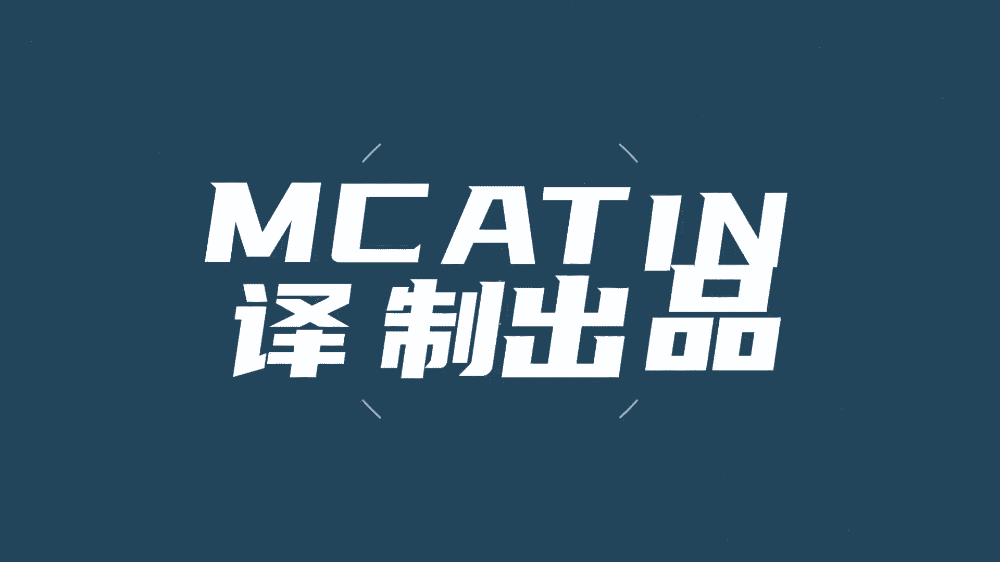
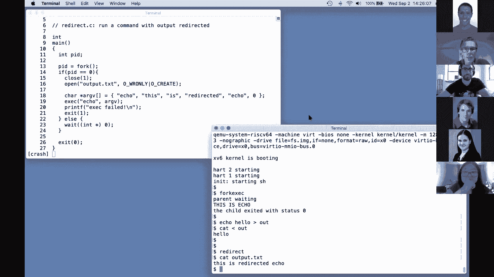

# 课程 P1：操作系统导论与示例 🖥️

在本节课中，我们将要学习操作系统的基本概念、目标以及其核心组成部分。我们将通过一个名为XV6的教学操作系统，了解操作系统如何为应用程序提供硬件抽象、资源复用和隔离等服务。课程将重点介绍内核的作用、系统调用的概念，并通过简单的代码示例展示应用程序如何与操作系统交互。

## 概述

操作系统是管理计算机硬件与软件资源的系统软件。它的核心目标包括抽象硬件、在多个应用程序间复用资源、提供隔离与安全，并支持高性能和广泛的应用程序。本节课将介绍这些目标，并概述操作系统的经典内部结构。

## 操作系统的主要目标 🎯

尽管存在多种不同的操作系统，但它们通常共享一套共同的核心目标。以下是操作系统需要完成的主要任务：

*   **抽象硬件**：操作系统在底层硬件（如CPU、内存）之上，为应用程序提供高级、便捷且可移植的接口，例如进程和文件系统。
*   **复用硬件**：操作系统允许多个应用程序同时运行，共享CPU、内存等硬件资源，而不会相互干扰。
*   **提供隔离**：操作系统确保同时运行的多个活动（进程）不会无意间相互干扰，即使某个程序存在缺陷。
*   **控制共享**：操作系统在允许进程间按需协作和共享（如读写文件）的同时，也能在用户不希望共享时（如保护个人文件）实施安全或访问控制。
*   **实现高性能**：操作系统必须确保其提供的服务不会妨碍应用程序充分利用硬件性能，甚至需要帮助应用程序获得良好性能。
*   **支持广泛的应用**：同一个操作系统（如Linux）需要能够支持从文本处理、游戏到数据库服务器、云计算等完全不同的任务。

## 操作系统的经典结构 🏗️

上一节我们介绍了操作系统的目标，本节中我们来看看操作系统内部是如何组织以实现这些目标的。一种经典且常见的组织方式如下图所示：


计算机系统可以划分为两个主要部分：

1.  **用户空间**：这是各种应用程序（如文本编辑器、编译器、Shell）运行的世界。
2.  **内核**：这是一个特殊的、始终运行的程序，作为计算机资源的守护者。内核维护管理进程、内存、硬件接口所需的数据结构，并提供核心服务。

内核提供的核心服务包括：

*   **进程管理**：管理每个正在运行的程序（称为进程），包括其内存和CPU时间。
*   **内存管理**：在多进程间复用、分割和分配内存。
*   **文件系统**：管理文件名、目录结构和文件内容在磁盘上的存储位置。
*   **访问控制**：决定进程是否有权访问特定资源（如文件、内存）。

在一个成熟的操作系统中，内核还包含许多其他服务，如进程间通信、网络协议栈（如TCP/IP）以及大量硬件设备的驱动程序。

## 系统调用：应用程序与内核的桥梁 🌉

我们了解了内核提供的服务，那么应用程序如何请求这些服务呢？这是通过**系统调用**实现的。系统调用看起来像是普通的函数调用，但实际上会跳转到内核中执行特定的代码。

以下是几个系统调用的示例：

*   **打开文件**：`fd = open("output.txt", O_WRONLY|O_CREATE);`
    *   这个调用请求内核打开（或创建）名为“output.txt”的文件用于写入。`open` 是系统调用名，它返回一个称为**文件描述符**的整数句柄（`fd`），用于在后续操作中引用这个打开的文件。
*   **写入文件**：`write(fd, "hello\n", 6);`
    *   这个调用请求内核将缓冲区中的6个字节（字符串“hello\n”）写入到文件描述符 `fd` 所引用的文件中。
*   **创建新进程**：`pid = fork();`
    *   这个调用创建当前进程的一个副本（称为子进程）。在父进程中，`fork()` 返回新创建子进程的ID；在子进程中，`fork()` 返回0。这使得父进程和子进程可以根据返回值执行不同的代码路径。

系统调用是特殊的，因为当执行系统调用时，代码会从无特权的用户模式跳转到有特权的内核模式，使得内核代码能够直接访问和操作受保护的硬件资源。

## 课程结构与示例程序演示 📚

本课程将结合理论讲解和动手实践。我们将深入研究XV6这个小型教学操作系统的代码，并通过一系列实验来扩展和修改它。课程成绩主要基于实验完成情况。

现在，让我们回到技术内容，通过一些运行在XV6上的简单程序，具体看看系统调用是如何被使用的。

### 示例1：文件复制程序

以下是一个简单的程序，它从标准输入读取数据并写入标准输出。

```c
// copy.c 简化示例
char buf[64];
int n;
while((n = read(0, buf, sizeof(buf))) > 0) {
    write(1, buf, n);
}
```

*   `read(0, buf, n)`：系统调用，从文件描述符0（标准输入）读取最多n字节数据到缓冲区 `buf`。返回实际读取的字节数。
*   `write(1, buf, n)`：系统调用，将缓冲区 `buf` 中的n字节数据写入文件描述符1（标准输出）。
*   当 `read` 返回0时，表示到达输入末尾，循环结束。

### 示例2：创建新进程（fork）

下面的程序演示了如何使用 `fork` 系统调用创建新进程。

```c
// fork.c 简化示例
int pid = fork();
if(pid == 0) {
    printf("child\n");
} else {
    printf("parent\n");
}
```
运行此程序，由于父进程和子进程同时运行，它们的输出“child”和“parent”可能会交织在一起，这直观地展示了并发执行。

### 示例3：执行新程序（exec）

`fork` 创建的是当前进程的副本。如果我们想运行一个全新的程序，需要使用 `exec` 系统调用。

```c
// exec.c 简化示例
char *argv[] = { "echo", "this", "is", "echo", 0 };
exec("echo", argv);
printf("exec failed!\n");
```
`exec` 会用指定文件（如“echo”）中的指令和数据**替换**当前进程的内存，然后开始执行新程序的指令。如果 `exec` 成功，它不会返回（因为原进程的代码已被替换）；只有失败时（如找不到文件）才会返回。

### 示例4：Shell的经典组合（fork + exec + wait）

Shell（命令行解释器）运行命令的典型模式是：**fork** 一个子进程，在子进程中调用 **exec** 来执行目标命令，而父进程则调用 **wait** 等待子进程结束。

```c
// forkexecwait.c 简化示例
int pid = fork();
if(pid == 0) {
    // 子进程
    char *argv[] = { "echo", "hello", 0 };
    exec("echo", argv);
    printf("exec failed!\n");
    exit(1);
} else {
    // 父进程
    wait(0); // 等待子进程结束
    printf("child finished\n");
}
```
这种模式使得Shell在运行命令后，能重新获得控制权并等待用户输入下一条命令。

### 示例5：I/O重定向的实现

Shell支持像 `echo hello > output.txt` 这样的I/O重定向。这是通过在 `fork` 和 `exec` 之间，修改子进程的文件描述符来实现的。

```c
// redirect.c 简化示例
int pid = fork();
if(pid == 0) {
    // 子进程
    close(1); // 关闭标准输出
    open("output.txt", O_WRONLY|O_CREATE); // 打开文件，由于fd 1空闲，新文件会获得fd 1
    char *argv[] = { "echo", "hello", 0 };
    exec("echo", argv);
}
```
在子进程中，我们先关闭文件描述符1（标准输出），然后打开文件“output.txt”。根据规则，`open` 会返回当前最小的未使用文件描述符，即1。随后，当 `exec` 执行 `echo` 时，`echo` 程序照常向文件描述符1写入，但其输出就被重定向到了文件中，而 `echo` 程序本身对此一无所知。

## 总结




本节课中我们一起学习了操作系统的基本目标和经典结构。我们了解到内核是系统的核心，通过**系统调用**为应用程序提供服务。我们通过XV6操作系统的示例，探索了几个关键的系统调用：`read`/`write` 用于I/O，`fork` 用于创建进程，`exec` 用于执行新程序，`wait` 用于进程同步，以及如何组合它们来实现像Shell和I/O重定向这样的强大功能。这些接口虽然看起来简单（主要传递整数和指针），但其内部机制却非常精妙，能够有效地管理硬件资源并支持复杂的应用协作。在接下来的实验和课程中，我们将深入这些机制的内部实现。