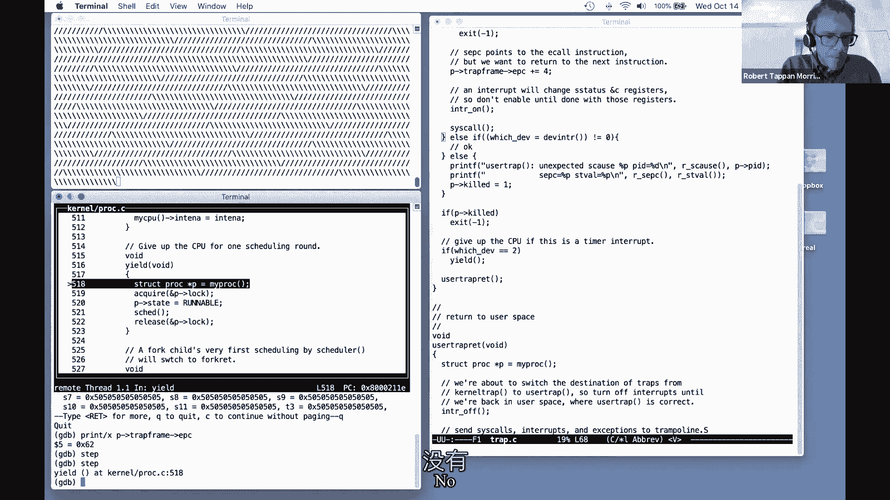
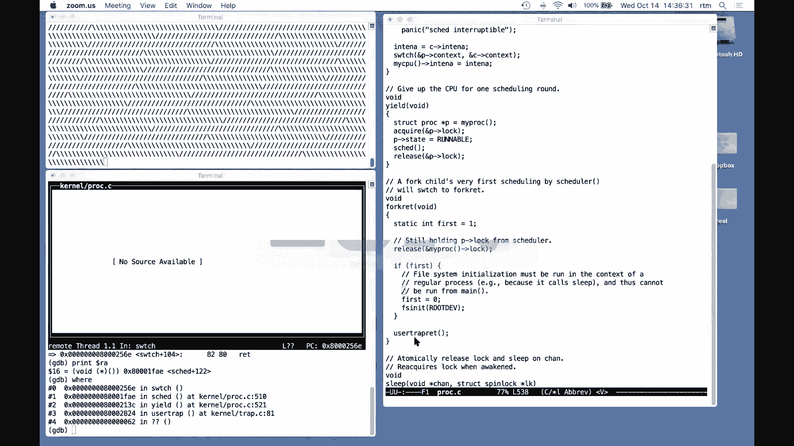

# 【操作系统工程】精译【MIT 公开课 MIT6.S081】 - P10：Lecture 11 - Thread Switching 中文版 - MCATIN-麦可汀留学 - BV1rS4y1n7y1

听得到谢谢 好的，我想在今天的课上谈谈线程，以及 xv 6如何进行线程切换，这是我们的一个秘密讲座，中断，页表和锁工作，嗯，今天我们要讲的是，它是现在不同进程中的六个开关，嗯，究其原因，最高级别。

究其原因，人们喜欢他们的电脑，能够同时完成多项任务，所以原因可能是你支持时间共享，像雅典娜允许很多用户同时登录，然后你知道他们都可以运行过程，甚至在单用户机器上，甚至你的 iphone，嗯。

您可以运行许多不同的进程，你指望电脑做所有的事情，你要求它，不仅仅是一件事，我是人们喜欢支持多项任务的另一个原因，是因为它可以简化程序结构，线程，尤其是，今天的话题有时被用来帮助人们。

帮助程序员把一个简单的程序组合在一起，减少复杂性的优雅方法，你在第一个实验室里看到过这样的例子 用质数筛子，它并没有完全使用线程，但是使用多个过程来帮助构建这个你的素数筛选软件，而且可以说。

更方便更优雅，或者更简单的软件编写方法，人们使用线程的最后一个原因是，所以中断你的程序是很常见的，在某种程度上利用线程，允许同一程序的不同部分在不同的核心上运行，你也知道，如果可以的话，如果你幸运的话。

如果你能把程序分成4个线程 在4个内核上运行，你可能会得到四倍的速度 和它跑得有多快，嗯，实际上，你可以把xt six内核看作是一个多核并行程序，所以什么是线程 是简化编程的抽象，当你有很多任务。

当你要处理很多任务时，所以线是指，您可以将线程看作是单个串行执行，如果你只是写一个程序 一个接一个地做一件事，你运行那个程序，嗯，你知道你可以把这个程序看作是一个单一的控制线程，所以。

这是一个松散的定义，因为有很多不同的口味，人们所说的线是什么意思，但是嗯，我们会说这是一个连续的处决，所以这是你得到的 如果你，嗯，启动一台电脑，你知道只要执行一个又一个指令，以平常的方式，嗯。

我们经常谈论线的状态，因为结果会是，我们将希望保存线程状态，并在以后恢复它，所以在大多数情况下，思考线程状态的正确方法，线程状态最重要的部分可能是它的程序计数器，因为这是一次处决，我们很关心。

它在执行中处于什么位置，执行指令的地址是什么，但我们也关心微处理器状态的其余部分，为了支持这次执行，所以这意味着，嗯，因为编译器生成代码的方式，所以典型的，每个线程都有自己的栈 专门用于执行该线程。

堆栈记录了函数调用的记录，嗯，反映出，执行该线程的当前点，所以 xv6的线程系统，你知道它里面有一个穿线系统，线程系统的作用是，管理这个交错自动化系统，多个线程的交织，我们希望能够，或者四百或一千条线。

并让线程系统找出如何处理所有这些线程，让他们都进步，让他们都执行，嗯，实际上有两种主要的策略，所以我们要交错，嗯，这将是一个很大的话题，以下是如何交织线程，多线，嗯，一种交错的方法。

许多线程的执行需要有多个 cpus，嗯，可能是在多核处理器上，然后每个 CPU都可以运行自己的线程，所以如果你有四个 CPU，有一个明显的方法来运行，所以4个线程就是每个 cpu运行一个线程。

然后每个线程自动获得自己的程序计数器和寄存器，它是运行与 cpu相关的程序计数器和寄存器，但是如果你有四个cpus，你有一千个线程，然后嗯我你知道，如何使用一个公司线程是不够的答案。

所以我们将看到的另一个主要策略，的确，这堂课的大部分主题是每个 cpu如何在不同的 cpu之间切换，嗯线，所以如果我有一个 cpu和一千个线程，我们要去，我们要看看 xix6是如何建造的。

一种转换系统允许66比1，一根线 一会儿，然后切换到一边，保存那个线程的状态 然后切换，暂时执行第二个线程，然后是第三条线等等，在每个线程执行之前，然后返回并执行更多的第一个线程，等等，嗯。

我做了xp6，像大多数操作系统组合一样，xv 6将在所有可用的核心上运行线程，每个核心会在线程间切换，因为通常情况下，尽管并不总是这样，线程通常比 cpus多得多，嗯，不同的线程系统。

或者线程系统实例的不同之处在于它们是否共享内存，所以这是一个永久的，呃点，嗯，一种可能是您可以有一个单一的地址空间，有很多线程在那个地址空间中执行，然后他们看到彼此的变化。

如果一个共享内存的线程修改了一个变量，然后共享内存的另一个线程将看到修改，所以它是在线程运行和共享内存的上下文中，我们需要一些东西，比如你在上节课上看到的锁，嗯六，内核是共享内存，所以 xv 6。

有一个 x y z有一个支撑，内核线程的概念，有，为每个进程执行系统调用的一个内核线程，所有这些内核线程共享内核内存，所以 x vx内核线程共享内存，嗯，和，另一方面，六号线表示这是另一种线。

每个用户进程本质上都有一个控制线程，执行该进程的用户指令，嗯事实上，很多的 x，五，六个内核线程机制最终支持能够支持和切换，在许多用户进程中，每个用户进程都有一个内存和一个运行在该内存中的线程。

所以 xv六个用户进程，每个进程都有一个线程，因此线程之间不会共享内存，嗯，在单个 x6个用户进程中，当然你会得到多个进程，但是每个进程都是一个地址空间，只有一个线程，这个过程是 xv6，例如。

Linux，用户级的 um linux，嗯，在一个进程中允许多个线程，进程和线程共享单个进程的内存，嗯这很酷，如果你想写用户级的程序，你知道的并行程序从多个核心获得速度，更好的是需要另一种用途。

你知道很多我们今天要讲的基本技巧，但是在 linux中有一些更复杂的东西，为了让它跟踪每个进程的多个线程，而不是只有一个，好的，嗯，在某种程度上，我只想说。

还有其他方法可以支持在一台计算机上交织多个任务，嗯，我们不打算谈论他们，但如果你好奇，您可以查找诸如事件驱动 编程或状态机之类的东西，嗯，结果你知道，以及支持计算机上多个任务的不同方案的光谱。

线程效率不高，这些是更有效的计划，嗯，但线程通常是最方便的方法，支持许多不同任务的最方便程序员的方法，好的，嗯，有几个挑战 我们必须咬紧牙关，如果我们要实现一个线程系统，嗯，呃，所以这只是高水平的挑战。

嗯，一个是我之前提到的，如何实际实现中间媒介的转换，允许我们交错执行多个威胁的切换，这种转换过程的广义名称是决定，哦，我要离开一个线程，开始另一个线程，它通常被称为日程安排。

我们会看到 xp六次和 d次，这是一段真正的代码，那是调度器，事实上，它有多个调度器，每个核心一个，嗯，但是一般的想法是你如何决定从一个人切换到另一个人，如何选择下一个线程运行，这叫做日程安排。

另一个问题是 如果你真的想实现从一个线程到另一个线程的切换，您需要保存和恢复，所以我们需要决定什么需要保存，嗯，我们要拯救它，需要保存的东西，当我们停止执行一个线程。

当我们想在以后的某个时候继续执行那个线程时，最后一个问题是如何计算绑定线程，嗯，很多选择，嗯，许多最简单的线程切换选项，好吧，我要把我的州保存起来，经营另一个州，你知道吗，让另一个线程运行。

但是我们有什么用户程序，它在做一些长期的计算，可能需要几个小时，嗯，它不会特别考虑，哦现在，是时候让其他东西运行了，所以嗯，最方便的是，一种自动撤销长时间运行的控制的方法，计算绑定进程，把它放在一边。

也许以后再运行，嗯，好吧，所以我要谈谈这些，我实际上要讲的是处理计算约束的机器，线程优先，嗯和计划，这是你以前提出的问题，那是计时器中断，这里的想法是每个 cpu上都有一个真正的硬件。

在每个核心上产生周期性中断，xp6或者任何操作系统，你知道吗，将这些中断传递到内核，所以即使我们在用户级别上运行在某个循环中，那是，你知道吗，计算圆周率的前10亿位，然而，计时器在某个时候会中断。

可能每10毫秒，并将控制权从用户级代码转移到内核中的中断处理程序，这就是内核获得控制权的第一步，在不同用户级别的进程之间进行切换，用户级线程，即使这些用户级线程不合作，最基本的方案是在中断处理程序中。

所以我们要，你知道吗，这些中断的内核处理程序，我们会看到内核处理程序，这就是它的名字，它产生它，嗯，内核处理程序自动地将 cpu返回给调度程序，告诉时间表，你现在可以让别的东西运行了，嗯。

这种弯曲实际上是线的一种形式，保存当前线程状态的开关，因此可以在以后恢复，嗯，你知道吗，我们将看到，你知道这里的全部故事，实际上你已经在这里看到了很多完整的故事，因为它涉及到一个中断。

你已经知道了 整个故事有些复杂，但其基本思想是，计时器中断将控制权交给内核，内核会自动生成 cpu，嗯，这被称为一个术语，抢先调度，嗯，这意味着先发制人的意思是，即使运行的代码，不是，你知道不想。

你知道不会产生明显的 cpu，定时器中断会把控制权夺走，我们将为此屈服，与抢先调度相反的可能被称为，可能是自愿安排的，有趣的是，你知道吗，x中的实现，五，六，和其他操作系统的抢先调度是这个时候中断的。

强行拿走 CPU，然后果仁基本上会产生一个自愿的产量，嗯，现在，这里提到的另一个术语是当线程运行时，有一个，我们需要区分，系统需要区分当前实际运行在某些 cpu上的线程，相对于想要运行的线程。

但目前没有运行在任何 cpu上，但你知道如果电脑免费运行，相对于那些不想运行的线程，因为他们在等待爱或等待一些事件，嗯，不幸的是，这种区别通常被称为状态，尽管线程的完整状态实际上要复杂得多，嗯。

既然这件事，我只想列出几个我们将看到的州，这些状态是，六个实际上保持，有一种状态叫奔跑，也就是说，啊，它实际上是在某个核心上执行，在电脑上，现在，有可运行的，这意味着目前不在任何地方执行。

而只是一个保存的状态，但想尽快跑路，结果发现有一个州今天不会出现太多，但下周会出现，称为睡眠，只是表示线程在等待一些 iO事件，他只想在宫内节后跑 所以今天，我们主要关注正在运行和可运行的线程。

这个先发制人的开关做了什么，这个计时器中断的作用，产量基本上是转换一个正在运行的线程，不管哪个线程被计时器打断 成了一个可运行的线程，那就是，通过屈服的线，或者把那条线变成一条现在不运行的线。

但实际上想清楚，因为在计时器中断的时候 它正在运行，好的，所以嗯，运行线程，它的程序计数器和寄存器实际上在 cpu中，在 cpu的硬件寄存器中执行它，嗯，一条可运行的线，虽然没有，你知道这不是。

没有与之相关的 cpu，因此我们需要为每个可运行的状态保存，我们需要挽救所有 cpu状态，不管线程运行时 cpu处于什么状态，所以我们需要复制 cpu的内容，你知道哪个不是拉姆。

但只是真正地从 cpu记录到内存中，把它们留给我，把一根线从跑动变成可跑动，再一次，这基本上是我们必须明确保存你的状态，只是国家，执行状态，还有 CPU，哪个是程序计数器，因此。

当我们将线程转换为可运行线程时，这些都需要保存，当某个调度器最终决定运行一个可运行的线程时，然后作为让线程重新运行的许多步骤的一部分，并恢复它，嗯，我们将看到程序计数。

保存的程序计数器寄存器被复制到 cpus中，调度程序决定在 cpu上运行的实际寄存器，对这些术语有什么问题吗？好吧，我现在要讲的是，六面向物的观点，嗯，我要画两幅画，真的是线。

六是一种简化的图片和更详细的图片，像往常一样，我们有用户，嗯，东西在这里，内核在这里，嗯，我们可能会跑，您知道在用户级别上有多个进程，也许你知道c编译器，ls和shell，嗯。

你知道他们可能会也可能不会同时想跑，嗯，在用户一级，每个过程都有一个，你知道它有记忆，我们特别感兴趣的是，每个进程都有一个用户堆栈，当它运行的时候，它有风险记录，五金，所以电脑加寄存器，好吧。

所以当程序运行的时候，你知道本质上有一条控制线，在用户级别上运行，嗯，我要说的是，就好像有一个用户线程由用户堆栈组成，用户内存，用户程序计数器，用户登记册，如果程序使系统调用中断并进入内核，嗯。

然后这些东西被保存在这个程序的陷阱框架和一个内核中，此程序的内核线程被激活，所以这是陷阱框架保存，嗯，用户资料，在我们把用户程序存起来之后，计数器寄存器，然后我们将 cpu切换到使用内核堆栈。

你也知道我们不需要，因为它们是进程没有真正运行的内核线程，并且在用户线程运行时没有真正的保存状态，相反，它的内核线程在它的堆栈上被激活了，第一次在蹦床和用户陷阱代码，嗯，然后内核运行一段时间。

也许你知道，运行系统调用或中断处理程序 或不管它是什么，嗯，有时如果是系统调用，会简单地从这里返回到相同的过程，并返回到用户空间或还原此程序的程序计数器和寄存器。

但也有可能是因为这样或那样的原因 而不是简单地返回，可能是计时器打断了，我们实际上要切换到另一个过程，如果 vc调度程序决定从这个进程切换到另一个进程，真正发生的第一件事是，我们要切换内核线程。

从这个进程内核线程到其他进程内核线程，其他进程的内核，它会回到用户空间，假设 c编译器需要读取光盘，所以它会产生 cpu，当它睡着的时候 等待离散完成，可能 ls想要执行并且处于可运行状态。

xv six调度程序可以做的就是，嗯，如果 ls处于可运行状态，这意味着它在某个地方停止了，它的状态被保存了下来，可能是被计时器打断了，所以 ls实际上会有一个保存的陷阱框架。

有用户寄存器和它自己的内核堆栈，结果发现，一套种子，内核寄存器是带有内核线程的 lucy，这将被称为上下文，所以如果 xsix从编译器内核线程切换到 is内核线程，嗯。

xv6将把内核寄存器保存在 um座位的上下文中，编译器的内核线程，嗯，切换到 ls线程到一个复杂的方案，我稍后会描述，或从先前保存的上下文状态恢复 ls的内核线程寄存器，从上次结束的时候开始。

可能 ls会完成它执行的任何系统调用，你知道吗，在内核线程堆栈上，再回到 ls系统，在回归用户空间的路上 叫好，这将为 ls um还原这些先前保存的用户寄存器，然后继续执行死刑，所以嗯，这里有很多细节。

我们以后再谈，但也许这里的重点是 我们从来没有在 xv6中，参见直接用户到用户上下文切换，当我们从一个过程切换到另一个过程时，总是，一种策略是 xv 6从，将一个进程执行到另一个进程，你跳入内核。

保存进程状态，将此进程作为内核线程运行，切换到另一个挂起自己的进程的内核线程，然后返回并恢复用户寄存器，所以它总是一种间接的策略，实际上比这更间接的威胁转换。

其中的净效果是从一个用户进程切换到另一个用户进程，啊，关于这张图表或任何事情的问题，在这两者之间切换到调度程序，是的，好吧，让我来谈谈日程安排，所以真实的画面实际上要比这复杂得多，嗯，这是一个更多的我。

会有更完整的图表，假设我们有程序一，嗯，它正在执行和处理二，它是可运行的，但目前不运行，额外的一层细节，我们实际上在 xv6中有多个核心，假设我们有两个核心，所以这意味着在硬件层面上，嗯。

我们有 cpu零度，其中一个核心是，假设。

关于我们如何从执行用户空间中获得更完整的故事，在一个过程中，在另一个可运行但尚未运行的进程中的用户空间中执行，第一部分和我说的差不多，可以说，计时器中断迫使将控制权从用户进程转移到内核。

蹦床代码嗯保存用户注册陷阱框架的过程一，嗯，然后执行一个用户陷阱，它知道如何处理这个陷阱或中断，你知道吗，系统调用，假设有一段时间是这样，我们在进程一的内核堆栈上执行普通的内核 c代码，假设第一步骤。

内核代码进程一旦决定要生成 cpu，嗯，它做了很多事情，我们会在调用这个常规开关时看到细节，只是这个故事的中心部分之一，省去了这个上下文，在上下文中运行的内核线程的寄存器需要，所以有两组寄存器。

用户在陷阱框架中注册，内核线程在上下文中注册，嗯，开关实际上并不开关，从一个内容切换，从一个线程到另一个线程，但实际上 x的设计方式，唯一一个用户线程，对不起，运行在 cpu上的内核线程可以切换到。

是 cpu的调度线程，嗯，所以我们甚至不能直接切换到另一个过程，我们只能切换到调度线程，所以有一个嗯，专用于 cpu零调度程序的完成线程设备，因为我们用的是 cpus。

这个开关将切换到先前为调度程序线程保存的寄存器，假设它是零号调度器，嗯，在cpu的调度器中，零开关将通过恢复这些寄存器，从开关返回，我们将会看到，返回到调度程序函数，在 cpu零上。

这个调度器函数会做一些清理工作，以完成让进程一进入休眠状态的工作，然后，它将在进程表中查找运行可运行进程的另一个进程，嗯，如果它找到了，所以我们在这里进入了调度程序，如果调度程序找到要运行的另一个进程。

甚至发现进程1是可运行的 并且仍然希望运行，它可能会找到第一个过程，没别的了，没有其他人想跑，但是在任何情况下，调度程序都会再次调用switch来切换上下文，表示进程二。

在此过程中它将再次保存自己的寄存器，在其自身背景下，也会有一个以前保存的上下文，不管什么时候 进程二停止了 那些，这套登记册将会被修复，嗯，过程二之前会呼叫切换，嗯，切换到调度程序线程。

就像过程一停止的时候叫开关一样，返回到任何系统调用或中断，当它完成时，第二个过程已经开始了，将有一个先前保存的陷阱帧用于进程二，这将保持用户注册表，那些，将被恢复或更多返回到用户空间，嗯。

所以他们也会得救，cpu one调度程序线程的 um上下文，不管你知道什么过程，进程三或什么运行在 cpu 1上，它会变成，嗯，它的 cpu的调度程序线程，好吧，有一个问题是上下文存储在哪里，事实证明。

对于手术，我一直在谈论拯救，其实线开关的污垢，嗯，这些背景，这些为内核线程保存的寄存器集位于进程结构中，所以任何给定的内核线程只能有一组保存的内核寄存器，因为每个线程只在一个地方执行。

它的上下文反映了它在上面执行的地方，停止，线程是一个控制线，所以一个线程只需要一个充满寄存器的上下文，所以它在过程结构中，是 p箭，MMP上下文，以及调度程序，每个调度程序线程都有自己的上下文。

实际上不在，没有与此调度程序线程关联的进程，所以实际上有日程安排者，联系人存储在该核心的结构 cpu中，每个核心有一个这样的 cpu结构数组，每一个都有一个上下文，一个问题，那就是，呃，你知道吗。

实际上这些寄存器可以存储在陷阱框架中，它是由，因为每个进程只保存一组内核线程寄存器，我们可以把它们保存在任何数据结构中，为此，有一个，你知道吗，每个进程数据结构的元素实例，你知道吗。

有一个 struct proc过程，有一个陷阱框架的过程，我们可以把寄存器存放在陷阱里，但我的意思是，我是说，只是为了代码的简单或清晰，陷阱框架，我认为完全由进入和离开内核时所需的数据组成。

被击中的上下文是由需要保存和恢复的东西组成的，当切换到，从中间，内核线程，和，调度器，线，好的问题是产量，内核的用户调用的东西，由内核调用，所以用户线程，没有直接的入口，XP六用户线程谈，嗯。

产生 cpu或切换，它是由内核完成的，你知道当内核觉得它需要发生的时候，有线程，嗯，有时候你可以猜到，可能某个系统调用会导致收益率，比如一个进程在管道上进行读取。

它知道在那个管道里 真的没有什么东西等着被读懂，读取器会阻挡，你可以预测读出会阻塞，内核会运行其他进程，当我们等待数据出现在管道中的时候，嗯，所以产量在内核中被调用的时间，有两个主要的时间。

一种是如果计时器中断，内核总是产生，你知道吗，只是在理论上我们应该交错，希望在计时器中断期间运行的所有进程的执行，所以汤姆，雷纳也总是叫产量，每当一个过程，系统调用等待 io，就像等你敲下一个键。

看一下控制台，你还没有输入密钥，然后等待指令的机器就会发出指令，它从睡眠中召唤，一些我们下周要讨论的事情，好吧，嗯好吧，所以你再问一个问题，是的，哦，如果它睡着了，它会做同样的事情吗，大致是这样，嗯。

系统调用将保存陷阱帧，嗯，然后基本上相同的图片，但只是，使进程进入内核的东西 不是计时器的兴趣，但是过程自己决定，是啊，所以如果这个过程，有一个读取系统调用，这就是为什么它在内核中。

而读取需要等待磁盘完成的进程来完成读取，或者等待数据出现在管道上，实际上这个图和这个完全一样，那个，你知道吗，好吧，拿着保存用户寄存器会执行系统调用孔 就像啊，我需要等磁盘看完一些东西。

系统调用代码会调用睡眠，最后调用开关，你也知道，保存进程上下文中的内核线程寄存器，切换到当前的cpu调度程序，让其他线程运行，当这个线程在等待离散完成时，所以我们现在要谈的，除了计时器中断。

嗯几乎是一样的，如果发生的事情是，我们在一个系统呼叫中，系统调用需要等待一些 i o，放弃 CPU，嗯，为了今天讨论的目的，这两种情况几乎相同，好的，所以问题是每个 cpu调度程序都有自己的堆栈吗。

是的，有一堆，嗯，对于调度程序，嗯，是啊，事实上，这家伙的书库刚刚搭建好，事实上，所有这些东西，你知道吗，上下文，带有调度程序线程的堆栈是以不同的方式设置的，高于用户进程，嗯，它们是在开机时间设置的。

如果你四处寻找开始开始或开始，可能吧，您将看到每个核心的调度程序 线程的一些设置，在引导期间，在程序集代码的早期，有一个地方有一个堆栈，为每个 cpu设置堆栈的地方，就在那堆电脑上。

然后运行它的调度程序，线，好的，嗯，一句行话，当人们谈论上下文切换时，他们说的通常是，嗯，从一个线程切换到另一个线程的行为，通过为旧线程保存一组寄存器集，为我们要切换到的线程 恢复先前保存的寄存器。

所以这通常也是上下文切换的意思，尽管有时它适用于完整的舞蹈，从一个用户进程切换到另一个用户进程时，偶尔你会看到上下文，它适用于我们在用户和内核之间的切换，我们主要指的是从一个内核线程切换。

一般是对调度程序的威胁，嗯，只是一些信息，嗯，容易记住的东西，嗯，每个核心每次只做一件事，每个核心，你知道的 要么是在给定的时间运行一个线程，它要么运行某些进程，用户线程，一些进程内核线程。

或者核心调度程序线程，所以在任何时候 走廊都不会做很多事情，只是做一件事，就是这种转换，这就产生了多个线程在不同时间运行的错觉，在那个核心上，同样，嗯，每个线程都在运行，它要么运行在一个核心上。

或者它的状态已经被保存了 状态已经被保存了，我们已经摆脱了它，原来如此，你知道吗，线只是为了明确，线程从不在一个以上的核心上运行，线程要么只在一个核心上运行，或者根本不运行，它有。

它在某个地方拯救了国家，嗯，关于 xv的另一个有趣之处，六个设置是这些保存保存的内核线程寄存器的上下文，它们总是由一个切换的呼叫产生的，嗯，所以这些上下文基本上都是指线程的状态，当它在呼叫中执行切换时。

嗯，你也知道，我们会看到这一点，当我们从三个线程切换到另一个 并恢复目标线程上下文时，它将做的第一件事是从以前的调用返回到切换，所以这些联系人总是保存状态，就像它在开关中一样，好的，嗯。

关于图表级别的情况 还有什么问题吗，我有一个问题，所以我们一直在使用线程这个术语，但在我看来 我们对 xv 6的实现，一个过程是如果只有一个线程，因此一个进程可能有多个线程，还是我错了，好了。

一定有让人困惑的地方，我们在 xv6中使用这个词，一个过程，嗯，一个进程要么执行指令，用户一级，或者它在内核中执行指令，或者根本不执行，它的状态被保存在这种背景和陷阱框架的结合中，嗯。

所以这就是现在的实际情况，你想叫它什么，嗯，你想叫什么就叫什么，我不知道对这种结构有什么简单的解释，嗯，我们一直称之为，我把它叫做，我一直在说每个过程都有两个线程，用户级线程和内核级线程，这是一个过程。

有这个限制，进程只能在用户空间的内核中执行，或者在内核中执行中断您的系统调用，但从来没有两者兼而有之，是啊，好的，有道理，是啊，很抱歉这么复杂，嗯，好的，好的，所以让我切换到代码，嗯对，所以首先。

我只是想展示一些我们一直在谈论的东西，我要看看这个过程的结构，我们可以在过程结构中看到，我们谈的很多事情，嗯，只是为了审查，有一个，这里有一个保存内核线程寄存器的上下文，当我们切换到调度程序线程时。

这个进程的指针是内核堆栈，所以你知道，当我们在内核中执行时，函数调用被保存，嗯，有一个状态变量，记录此进程是否正在运行、可运行或休眠，或者根本不分配，嗯，最后还有一把锁 可以保护各种各样的东西，嗯，嗯。

现在我们可以观察到 至少保护了对状态变量的更改，所以，例如，两个调度程序威胁不会尝试抓取一个可运行的进程，同时运行，这个锁的作用之一是防止这种情况发生，我给你运行一个简单的演示程序，自旋程序。

我大部分时间都在用，只是为了创造一个可以预见的局面，我们从一个线程切换到另一个线程，这就是这个程序自旋程序创建两个进程，两个过程都会永远计算，你知道在这里叫叉子，我生了一个孩子，然后永远两个孩子。

两个孩子都坐在这个圈子里，每隔一段时间他们就会打印一个角色，只是为了让我们看到他们正在取得进展，嗯，但他们不经常打印字符，他们不会故意放弃 CPU，所以我们这里有两个本质上是两个计算绑定的过程。

为了让他们两个都能跑，我要在一个 cpu上运行它们，嗯六，这只是一个核心，所以为了让他们两个都执行，或者你知道，在这两个过程之间切换是必要的，让我启动 gdb下的自旋程序，嗯运行旋转程序。

你可以看到它在打印，两个进程中的一个打印正向斜杠，另一个指纹是反斜线，你可以看到每隔一段时间，六号在它们之间切换，只有一个核心 就像我配置的那样，所以如果我们看到一堆向前的斜线。

然后很明显一个计时器打断了，大多数人都走了，把一个 cpu切换到另一个进程，然后打印另一种斜线 一段时间，所以我想观察的是计时器中断，所以我要放一个断点和陷阱，尤其是在7号线的2号线和陷阱，嗯，啊。

也就是说，嗯密码在，嗯，在开发中的陷阱 承认啊，我们被打断了，中断是由计时器中断引起的，嗯，所以我要在这里设一个断点，点 c 1 2 7 然后继续 砰的一声 陷阱灯立即触发，因为定时器地图很常见。

我们可以从哪里得知，我们陷入了用户陷阱，用户陷阱调用了 dev enter来处理这个中断，嗯，我想输入完成，以摆脱开发和回到用户陷阱，嗯，因为事实上我们不知道计时器的代码，几乎什么都没有，嗯，然而。

一旦我们回到，嗯在呃，用户陷阱，我们可以从这一行看到，我们刚刚从dev enter返回，嗯，有趣的是，我们要做的，我是说，期待，我们现在在这条线上，我们期待着这个叫产量，当股息返回，你看这个。

你回来是两个，那两个基本上就是设备号，我们很快就会看到，因为哪些设备太，用户陷阱将调用产量，所以我们一会儿就会看到，让我们看看当中断发生时，当前正在执行什么，所以我要打印 p。

变量 p持有指向当前进程的指针，struct proc，嗯好吧，我们有个问题，是什么使每个进程的内核线程不同，所以有两件事可以区分不同的过程，内核威胁，因为不止一个人可以在不同的核心上执行。

这就是 k堆栈所指向的，击中目标的元素，另一个是，嗯，早期，我们陷入了用户陷阱，也就是说，你知道吗，蹦床的 c代码，当中断发生时，我们可以通过这个来判断，任何内核代码都可以通过调用我的 proc来判断。

过程是什么，它运行在当前的 cpu上，这是另一个区别，允许内核代码告诉它是哪个进程的一部分，这是内核线程正在执行的进程，我的产品主要是使用 tp寄存器，心脏身份证，或核心数，它将其索引为一个结构数组。

表示每个核心，调度程序设置的，每当它切换进程以指示每个核心，哪个进程在那个核心上运行，这就是不同内核线程的区别，好的，所以我要用 p值，嗯，名称和p值，以找出什么进程正在运行，XP六记得这个名字。

旋转的过程和预期的一样吗，嗯，他们有两个人，我认为进程编号3和4，哎呀，我们现在又执行了3号程序，所以在转换之后，我们期望在另一个自旋过程中 处于进程 id中，我们如何查看陷阱帧中保存的用户寄存器。

这只是三个两个寄存器，蹦床代码保存了保存用户状态的方法，有一个用户地址寄存器，用户堆栈指针，嗯，六角六十二的用户程序计数器，这些都是我们看陷阱时熟悉的东西，你也知道，也许最有趣的是。

现在陷阱帧保存用户程序计数器，设定价值62，如果我们在乎，嗯，我们可以在装配代码中寻找旋转，点 c，我们就用这个时间去找62个，现在我们可以看到，哦，中断计时器，在自旋的无限循环中。

在这个添加指令中发生了中断，所以这并不奇怪，好的，所以回到嗯，他们输入的陷阱密码，刚回来，我要输入几个步骤，让我们到嗯，即将执行这个产量，产量是放弃 CPU的第一步，切换到调度程序。

让调度程序在进程中选择要运行的另一个内核线程，嗯好吧，所以让我们实际进入收益率，我们在收益率上，嗯，如果你有问题，否。

好的，我们要投降了，嗯，产量只是几件事，它为这个过程获取锁，因为它将对这个过程做出一系列改变，它不想要任何其他的，事实上，直到它放弃锁，这个过程的状态会有点不一致，嗯喜欢，例如，它是关于产量的。

即将改变过程的状态到可运行的，哪一个会，你知道吗，指示进程未运行，但我想，但这个过程运行正常，我是说我们现在正在进行这个过程，这就是执行的，是这个进程的内核线程。

所以在这把锁中获得的许多东西中的一个就是让它，所以，即使我们刚把州改为可运行，没有其他核心调度线程会查看此过程，因为锁，所以它是可以运行的，尝试运行它，当我们还在这个核心上运行它的时候，这将是一场灾难。

对吧，在两个不同的内核上运行相同的进程，现在压力机只有一个堆栈，所以这意味着两个不同的核心，你知道调用同一个堆栈上的子程序，这就是嗯，只是灾难的处方，嗯，我们放弃改变状态，嗯，这意味着你知道。

我们终于放弃了，嗯，当我们最终交出 cpu并放弃它 并切换到调度进程时，这个状态将保持在这个可运行状态，以便它将再次运行，因为在这一切之后 是一个计时器打断了，一个运行中的用户级进程。

它希望继续进行计算，所以我们要把它留在州内运行，好让它再次运行，尽快，因为调度人员决定，到，嗯然后，呃，唯一一件，呃，你好，是调用这个调度器函数，它将进入调度器函数，我将在这里展示这一切，嗯。

这个调度器，有些东西几乎什么都不做，它做了一堆检查，它做了一大堆理智检查和恐慌，原因其实是，嗯，这个代码用 x表示，五，在它多年的生命中，有六个是最容易感染的虫子之一，有最多的惊喜，嗯，论不愉快的惊喜。

所以这里有很多理智的检查和恐慌，因为，嗯，因为经常会有与这个代码相关的错误，好吧，我要去，嗯，跳过这些理智检查，继续进行，呼叫切换，这种切换的调用是真正行动发生的地方，这叫做开关。

它将保存当前的内核线程，专业背景下的登记册，它是当前进程保存的内核线程上下文，保存一组寄存器，箭头上下文 c是指向这个过程的指针，结构，CPU和结构 CPU，具有保存此核心调度程序线程的寄存器的上下文。

所以我们要从这个线索，保存这个线程状态，恢复话语调度程序的威胁状态，并继续执行这个分数，调度器，线，好的，所以让我们看看，让我们快速预览上下文，我们将切换到，我可以得到的结果是，它实际上不能打印上下文。

但我碰巧知道 c打印到 cpus 0，仅仅因为我们在零点上有核心，只有一个核心，嗯，我可以打印它的上下文，嗯，所以这是保存的寄存器从这个核心的调度威胁，嗯，尤其令人感兴趣的是。

因为寄存器是当前函数调用返回的地方，所以我们要切换到调度线程，它会返回到数组中，我们可以找到，通过在内核 asm中查找返回地址，其实，那是，如你所见这个 x斜线，I，你知道吗，打印指令在某个地址。

但它也会打印标签，联合国，那些指令所在的函数的名称，所以我们要回到计划中，或买买买，那只是，你知道吗，正如你所料，好的，嗯，我想看看开关实际上是做什么的，我们要打电话给开关，嗯，在开关上放一个断点。

我把一个断点，因为有很多这样的设置代码，从这些结构中提取上下文的值，让我们跳过它，好的，所以现在我们要切换断点，总局不给我们指示，不过，我们可以进去看看，切换到查看我们将要执行的指令。

如你所见 我们正在执行第一个指令，a到由零指向的地址的存储，你可能还记得在电话里，第一个参数是当前线程的上下文，第二个参数是我们要切换到的线程的上下文，两个参数分别为0和1。

所以我们通过收银机看到所有这些商店的原因，零是因为我们在储存，内存中的一堆寄存器，这是在我们要切换的线程的上下文中，从一个地址装载的货物，因为这是一个指向线程上下文的指针，我们要切换到，好的。

嗯所以一根线，你知道吗，呃，交换机保存寄存器，负载，寄存器来自目标线程，上下文，然后返回，这就是为什么助教很有趣，因为它会回到拉指向的地方，即进入调度程序 好吧，所以一个问题是，你可能会注意到。

虽然开关节省了刺耳的声音，一堆寄存器，它不能保存的一件事是程序计数器，这里没有提到程序计数器，为什么，是不是因为程序计数器被像函数调用一样更新了，是啊，是程序计数器，程序计数器中没有实际的信息值。

我们知道在我们执行正确的地方，现在是在开关右，所以没有必要保存程序计数器，因为它具有极其可预测的价值，就是这个指示，此指令和开关的地址，嗯，我们真正关心的是我们从哪里被召唤，因为当我们换回这条线的时候。

我们想继续执行任何点开关被调用 从，它的地址是用来保存调用交换机的指令的地址，所以它被保存在这里，而我们的 a是点会是啊，再次执行，让我们交换回报，所以我们甚至可以把它打印出来，我们可以打印。

我们可以打印我们的，然而，你还记得我们来这里是为了，如你所知，正如您所期望的，指针返回到schefunction，另一个问题是为什么，开关只保存14个寄存器，我数了一下，只保存和恢复了14个登记册。

即使风险五有三，两个登记册可供，或者作为代码使用，为什么只有一半的寄存器保存得很好，当 switch被调用时，它被称为正常功能，所以打电话给开关的人已经假设，开关可能会修改那些。

所以这个函数已经把它保存在它的堆栈上了，意思是当我们从一个跳到另一个，啊，那一个要去自我，恢复它的呼叫或保存的寄存器，完全正确，这个开关是从 c代码中调用的，我们知道 c编译器保存在当前堆栈上。

任何调用方保存的在方法中具有值的寄存器，编译器需要稍后，我想有18个，或者取决于你如何计算它们，有15到18个呼叫者保存了寄存器，所以我们看到的登记簿，以下是所有没有保存呼叫者的寄存器，编译器并不保证。

但尽管如此，调用函数需要的 um值，所以我们只需要保存被调用的寄存器，当我们切换线程时，好的，嗯，最后我想打印的是我们做的，我们会保存和还原堆栈指针，当前堆栈指针，从这个值很难判断这意味着什么。

但它是当前进程的内核堆栈，我不知道你记不记得，但被分配到，是由高内存的虚拟内存系统映射的，好的，所以嗯，好的，所以，我们要把当前的寄存器，并从调度程序线程上下文 um恢复寄存器，我不想喜欢。

执行这些装载和存储中的每一个，所以我要跨过所有的14个负载，14个仓库和14个货物将直接按照退货指示进行，好的，所以我们在开关中执行了所有的操作，除了回报，嗯，在我们返回之前。

我们再打印一次有趣的寄存器，看看我们在哪里，所以，堆栈指针，嗯，现在它有了不同的价值，堆栈指针现在指向这个堆栈，内存中的零区域，这实际上是把它放在引导序列的非常非常早的地方。

start s把堆栈放在哪里，所以它可以调用第一个 c函数，所以实际上回到这个 cpu的原始引导堆栈，刚好是调度程序运行的地方，嗯，好的，程序计数器不是很有趣，因为我们还没回来。

寄存器指向调度器 因为我们已经加载了，我们已经恢复了之前被调度器威胁保存的寄存器集，嗯，事实上，我们现在真的在日程安排中，对，如果我在哪里，现在看起来和上次完全不同，我们现在确实需要改变。

但现在我们接到了斯威夫特的电话，在过去的某个时刻，日程早就安排好了，在引导过程中被称为缅因 在引导过程中做的最后一件事，嗯，所以我要执行一条指令 从开关返回，现在进入调度程序。

所以现在我们在这个课程表里，让我们看看完整的代码，所以这是调度代码，嗯，这个函数叫做调度器，现在我们在 cpu的调度线程中执行，我们正处在，我们刚从之前的电话回来，调度员 刚才做的。

当它决定开始运行这个过程时，你知道 pi v 3，它的旋转过程被打断了，所以现在是这个开关，你知道过程编号3，旋转叫做开关，但它并不迅速，那个正在返回的开关，那个开关还没有恢复。

但它仍然在过程中被保存下来，身份证，三，堆栈和联系人，我们刚打完电话回来，好吧，所以在调度程序中发生的事情，我们已经停止了这个过程，所以你想忘记我们做的那些事，在这个过程中。

我们想忘记塞拉 proc等于零，基本上意味着我们忘记了，你知道吗，我们在这个课程中不再运行这个过程，所以我们不想，有人对此感到困惑吗，让我把每个核心的proc指针设置为零，而不是这个过程。

接下来发生的事情是，你记得产量获得了这个过程的锁，因为它不想让其他核心调度程序看到这个过程，也许运行它，直到过程完全进入睡眠状态，嗯，我们现在已经完成了从这个过程中的转换。

这样我们就可以释放刚刚产生的过程的锁，这就是在这一点上的释放，我们还在计划中，如果在这一点上有另一个核心，其他一些核心调度程序可以找到那个进程，因为它是可运行的，运行它，不过没关系。

因为我们已经完全保存了它的寄存器，我们不再在它的进程堆栈上执行，因为我们现在执行的是 on discord调度程序堆栈，因此，如果其他核心决定运行这个过程，实际上是可以的，好的，但是没有其他核心。

所以在这个演示中实际上不会发生，我其实想花一点时间多谈谈锁，嗯，公关锁实际上做了一些事情，嗯啊，从日程安排的角度来看，它实际上做了两件事，一个是生成 cpu涉及多个步骤，我们得让国家跑起来。

将状态从运行状态改为可运行状态，我们将寄存器保存在生成进程上下文中，我们必须停止使用生成过程堆栈，至少有三个步骤，你知道吗，这需要时间，嗯，为了完成所需的所有步 骤，所以正如我提到的，洛克所做的一件事。

阻止任何其他核心调度程序查看我们的进程，直到所有三个步骤都完成，所以锁基本上是使这些步骤原子化，从其他核心的角度来看，或者什么都没有发生，嗯，结果会是，还有，当我们开始运行一个进程。

公关锁会有类似的保护功能，嗯，我们将过程的状态设置为，当我们开始执行一个进程时运行，我们要把它的寄存器从它的过程中移走，风险五登记册的背景，但如果在这个过程中发生了中断。

中断将在一个奇怪的状态下看到过程，就像在马克跑的状态下，但是还没有完成从上下文中移动寄存器，进入风险五登记册，所以这将是一场灾难，如果计时器中断，因为我们可能会在它恢复寄存器之前 从这个过程中切换，嗯。

从这个过程中切换出去 现在可以节省，未初始化的风险 5个寄存器进入上下文流程 上下文，覆盖它的真实寄存器，因此，我们确实希望启动一个过程，也是有效的原子上，在这种情况下，拿着锁，保持专业锁定横跨。

切换到进程，同时防止其他核心看到这个过程，也在点火期间关闭中断，切换到那个线程，它可以防止计时器中断，那只是中途，被切换到，好，嗯，我们在时间表里，我们在调度程序中执行这个循环，在调度程序中循环。

它着眼于所有的过程，反过来找一个跑，在这种情况下 我们知道还有另一个过程，因为还有另一个旋转过程，嗯，但有很多过程，很多东西要检查，所以我想跳过实际的过程，工艺表扫描。

直接到达调度程序 找到下一个进程的点，所以我要把一个转折点，在四七四行，它实际上找到了一个新的进程来运行，但在这里，调度人员扫描进程表，找到了另一个要运行的进程，它将导致这个过程运行。

你看你可以看到68的一条线，它获得了进程的锁，所以现在它有权做不同的步骤来切换到这个过程，四七三行，它将状态过程设置为运行，现在是474，我们将记录在 cpu结构中，cpu正在执行哪个进程。

然后调用交换机来保存调度器 寄存器，恢复目标处理器寄存器，所以我们可以通过查看新进程的名称来查看它发现了什么进程，令人惊讶的是，它在旋转这个过程，身份证现在是四，以前跑三 现在跑四，嗯。

我们已经让国家运行，所以嗯，只是国家在运行，我们可以看到这个线会切换到，在四号线换机的电话里，七十五，在这方面，他保存了寄存器，那么我们称之为"开关"的过程在哪里呢，我们知道当它回来的时候就会回来。

它回到修复的雷亚，所以我们真正关心的是雷拉指的是哪里，我们可以通过，嗯使用 x斜线，我，它将返回到某一点，并害怕，所以这并不奇怪，因为另一个自旋过程可能是由于计时器中断而暂停的，哪一个。

我们知道这叫做害怕，哪个叫开关，好吧，所以我们要打电话给开关，我再把密码调出来，嗯，实际输入开关，我们还是，呃，显示我们仍然处于调度程序上下文中，嗯，我想再次执行所有的指令，这次。

从调度程序切换到新进程，所以我们跳过2个8个商店，嗯，只要让自己相信 我们真的要回到计划中了，所以现在，因为我们要回到计划中，我们现在必须在一个过程中，内核线程，不再，嗯，在调度威胁中，事实上。

如果我们看一下背面的痕迹，我们接到一个用户陷阱电话，一定是有个计时器中断了，你知道在过去的某个时候，正如我们所看到的，被称为屈服和害怕，但是计时器打断了，另一个过程，现在，不是在我们最初看到的过程中。

好的，有什么问题吗，我想在这一点上 我要停止通过代码，以及任何关于，我们看到的任何材料，对不起，如果是的话，呃，例如圆盘科尔，然后我们会看到它或者点阵在某个地方 像睡眠或类似的东西，对，嗯嗯是的，好吧。

当它发生的时候，一个睡眠的呼唤，我想我的意思是，这是这是这是一个，你基本上是在回答你的问题，是的，如果我们因为某种原因停止执行这个过程，除了计时器中断，嗯，switch基本上是返回到一些系统调用代码。

而不是小品，碰巧，我想睡觉可以叫短剧，所以来吧，从后面的痕迹来看，所以我选择了一种方式，你知道吗，只是在进程之间切换的一种方式，由于计时器中断，嗯，但你也有开关，等待用户 io。

或者等待其他进程执行诸如向管道写入之类的操作，好的，你可能注意到的一件事是 调度器叫做 switch，我们即将从这里返回，但我们真的是从一个不同的电话回来的，比他们在时间表上做的，我们刚接到电话回来。

很久之前这个过程，嗯，所以你知道这可能有点让人困惑，但你知道这就是线程开关的工作原理，另一件需要注意的事情是，我们看到的代码是开关代码，这真的是线程切换的核心，你所要做的就是。

切换线程是保存寄存器和恢复寄存器，现在线程的状态比寄存器多得多，他们在堆里有变量之类的东西，谁知道呢，但是嗯，所有其他的状态都在记忆中，不会被打扰，我们没有做任何事情来扰乱这些线堆，例如，或者堆值，嗯。

所以微处理器里的寄存器，唯一需要保存并恢复到，做一个线程开关，所有这些东西在内存堆栈，例如，仍然会在记忆中不被打扰，所以它不需要被明确地保存和恢复，现在我们只是保存和修复这个微处理器，cpu注册。

因为我们想重用 cpu中的寄存器，对于新线程，并覆盖它们所具有的任何值，所以我们在这里可以看到，旧线程注册，怎么样，嗯，其他处理器状态，所以我不知道，如果我们使用的风险5处理器有其他标志。

但我知道有些 x86的英特尔芯片，就像浮点单位状态，像这样的事情我们做，我们只是没有回应，对不起，你的观点很好地应用在其他微处理器上 比如 x8 6，切换的细节有点不一样。

因为你知道他们在不同的州有不同的寄存器，所以你知道的代码是非常非常危险的 五，依赖代码和其他处理器的切换例程可能看起来很不一样，实际上可能需要保存浮点寄存器，现在风险五实际上使用通用登记簿。

我不知道它对浮点有什么作用，但是内核没有使用浮点，所以它不必担心，但是是的，这完全依赖于微处理器，一个关于计时器的问题打断了，所以听起来像是，所有这些调度工作的核心，会有一个计时器中断，呃。

在发生故障的情况下，会有一个时间间隔，嗯，所以，我的意思是，所以好吧，因此，用户进程的抢先调度是如何工作的，在打开中断的情况下 执行用户进程，总是，你知道吗，XT 6只是确保在返回用户空间之前启用中断。

这意味着计时器可能会中断，如果在用户空间执行，所以没有用户进程，你知道吗，如果我们在用户空间，当时间到来时，计时器错误就会发生，内核有点棘手，内核有时会关闭中断，就像你得到一把锁，中断将被关闭。

直到你释放它，所以呃，所以如果内核里有什么缺陷，你知道，如果内核关闭了中断，再也不打开它们，内核中的代码从未放弃 cpu，你知道吗，从不叫睡眠，或者因为其他原因放弃 CPU，就不会发生计时器中断。

这意味着这个内核代码可能，你知道吗，不会给 cpu，但事实上，据我们所知，六号是，我们写了 xv6，所以它总是把中断重新打开，或者你知道，如果有代码在 x2 6关闭，中断它 要么让它们重新打开。

因此计时器中断会在内核中发生，我们可以从这个内核线程切换到，或者代码返回到用户空间，内核代码返回到用户空间，我们相信在任何情况下 内核代码都不会喜欢，带中断的循环永远关闭，我知道了。

我的问题更多的是关于，所以我假设中断实际上是来自某个硬件，比如如果那个硬件出了故障，否，现在，我的意思是，你的电脑坏了，你应该买一个新的，好的，我是说，我是说，这是一个有效的问题，我是说，有，你知道吗。

你的电脑里有一百亿个晶体管，事实上，有时硬件就像有缺陷一样，但那是我们无法企及的，我是说，如果你加上一个对一个，电脑说三个，那么，你只是有很深的问题，六号帮不上忙，所以我们假设只有当软件，我是说。

有时软件会试图补偿硬件级别的错误，你总是寄支票，所以如果网络硬件有点变化，有点故障和翻转，然后你就可以纠正电脑里的东西，人们往往不会，只是人们，基本上不要试图让软件补偿硬件错误，我有个问题。

为什么我觉得在蹦床资产在开关，我们在汇编中编写代码，是吗？为什么 因为我们想确保这件事，所以我们不能你可以写信看看，因为我们只需要这些事情发生 基本上，嗯是的，是啊，是的。

当然我们希望这个精确的序列发生在，很难谈论像这样的事情，当然，在c语言中没有办法谈论改变堆栈，指针或 ra寄存器，所以这些都是不可能的事情，你在普通情况下是看不到的，用 c表示的唯一方法是，有。

在 c中可以将程序集指令嵌入到 c代码中，所以我们可以把这些装配指令嵌入到 c函数中，不过，这和，我们基本上是在低于 c的水平上运行，所以我们不能在这里用 c，我有一个关于线程何时完成执行的问题。

我假设这发生在用户空间，当我们打电话给主管，对不起，出口系统呼叫，这也结束了线程中的过程，我假设在内核空间，但是如果线程在新的时间中断发生之前就结束了，它仍然喜欢，嗯。

这和那个线程还能得到的cpu一样吗？还是我们在新的时间中断之前结束那个线程，开始一个新的线程，哦耶，线，嗯，线程产生 cpu，出口会产生cpu吗？所以实际上有很多点，尽管我一直在用计时器打断这个讨论。

实际上几乎所有 xp6在线程间切换的情况下，不是因为计时器中断，因为，嗯，一些系统调用在等待一些东西，或者决定放弃 cpu，例如，出口做各种事情，再叫产量放弃 CPU，它做到了真的没有什么。

它做到了这一点，不管是否有计时器中断，是的，好吧，上课时间到了，我想下周我会继续讨论这个问题，但我现在很乐意回答更多的问题，如果人们有，假设操作系统实际上承担了线程实现，原来如此，例如。

您希望在多个 cpus上运行进程的多个线程，这必须由操作系统来处理，而操作系统不能只在用户空间中处理，对，这种转换是如何工作的，每个线程现在都变成了相同的过程，它总是会遍历所有现有的线程吗，或者你知道。

因为每个 CPU都会在，即使一个过程给了我八个核心，就像它仍然会切换，在这些进程和其他进程之间切换 每个 cpus，我们也不想真的改变，就像在同一个 cpu上的一个线程和另一个线程之间，还是我们。

我不知道，等等可以嗯，我不知道问题是什么，是啊，我想，我想你能解释一下，怎么会这样，怎么样喜欢对不起，怎么会发生，嗯，假设每个进程有多个线程，所以他们可以，它们可以在不同的 CPU上运行，就像。

我们该怎么办？怎么去那里，是啊，所以 linux，例如，支持每个进程多个线程，在 linux中实现是一个复杂的实现，但也许最简单的解释是，呃每个呃，就好像 linux中的每个线程都是一个完整的过程。

以及给定的线程，我们称之为，所以 linux在某种程度上分离了执行线程的概念，从地址空间，你知道你把它们分开，如果你在一个过程中制造两个线程，它基本上使两个进程共享一个地址空间。

从那以后的日程安排就不像，xv6对单个进程的作用，原来如此，有没有类似于，用户是否需要指定，就像还好，把每个线别在 cpu上，嗯，或者操作系统如何，确保，同一个进程的不同线程不在同一个核心上运行。

因为这有点违背了目的，我想我不知道，呃，其实就像，很像 xp6，即嗯，你知道有四个核心，linux会在这4个内核上找到4个可以运行的东西，他们可能是，你知道吗，如果没什么事。

然后可能会有四个线程相同的过程，或者如果有100个用户登录在雅典娜的机器上，也许是一根线，每一个都来自多个不同的过程，你知道没有任何一个答案，你知道吗，或者内核基本上找到每个核心要做的事情。

然后那个核心做了那个事情，好的，有道理，你可以的，你知道吗，如果你是，如果你想仔细测量，有一种方法可以把线钉在核心上，但人们只有在做一些奇怪的事情时才会这么做，所以确保这张桌子，你再说一遍，记忆。

所以他们说他们有相同的页表，没有线程，是啊，是啊，是啊，是啊，如果你在玩 linux，如果在一个进程中创建两个线程，那么你有这两条线，我不知道他们是否真的喜欢分享完全相同的页表，或者它们的页表是否相同。

非此即彼，他们为什么要分开，曾经，如果你手动映射内存，或者我不知道哪个 linux可以，好的，我还有一个问题，就像一个小细节，嗯，所以基本上就像从我的理解 当你调用开关，嗯。

你从一个电话切换到另一个电话，所以你第一次打电话给开关，你必须人为地创造另一个终点 才能回到正确的位置，是的，因为你不能随便跳进去写代码，是的，你想知道在哪里，哪里那个冒牌货，在那里上下文被编造出来。

可能是一些被避免的过程，呃创造了，我想我不知道，是啊，是啊，是啊，是啊，可能是那个用户，或者我们不要在异形中使用，Proc，哦不，我撞到了一个叫叉子陷阱人的东西，是啊，你看这个，是啊，是啊，好吧，是啊。

叉红，好的，所以一个异种产物，对于引导时的第一个进程来说，这两者都被调用，通过 fork alloc proc建立上下文的关键元素，对于新的过程，它建立新的过程上下文，实际上大多数寄存器是什么并不重要。

嗯，但 RA是什么并不重要，因为这就是开关，第一个开关，这个过程将回到我们的，这个过程需要使用它自己的堆栈，因此，设置了ra和sp，本质上是伪造的，因此，第一次切换到过程工作，所以如果我理解正确的话。

就像什么时候会发生转变，然后它就会开始执行第一条指令，在四个信誉中，好像红色刚刚打电话给开关，从，是啊，是啊，是啊，是啊，从switch返回将是一个跳跃到fork的开始。你很有趣，我们有没有叫过叉子红。

还是一直都是海，别以为总是这样，我不认为任何事情都需要真正的荣誉，我觉得是的，它只是以这种奇怪的方式执行，从第一次开始，进程运行，它的工作就是释放调度程序，然后再回来，然后这个用户陷阱 红色。

当然也是假的，因为它是它是，你知道吗，是啊，就像从陷阱中归来，只不过陷阱架是假的，也要喜欢，跳转到用户右码中的第一个指令，哦，但是陷阱架，又来了，就像你不需要初始化任何寄存器一样，因为这就像。

我们要从头开始，所以如果你不需要假设，是啊，程序计数器，我想是，呃，是啊，初始化为零很好，我不知道还有什么，我我我我我，我是说，也许如果我们打电话给他们，这是不对的，因为如果我们已经打电话了。

然后设置程序计数器，是啊是啊，所以这只发生在，哦，因为叉子副本，fork复制程序计数器，用户程序计数器，所以我们唯一不用叉子的时候，是在第一个过程中，它就像明显的欺骗性，哦，还有堆栈指针，哦耶。

还需要设置，哦耶，因为那是 epc，那不是电脑，就是那个要被陷阱换掉的，蹦床，是的，原来如此，因为真品会在陷阱里，就像里面的蹦床，但我们要把它切换到那里，是啊，有意思，我可以问一下，你能回到那个，嗯。

我想有一个，哦不，对不起 红色，会有一些事情发生，我认为对于第一个过程，只是这是给第一次打电话的，我不太确定发生了什么，让我们看看文件系统，文件系统需要初始化，尤其是有些东西需要从磁盘上读取。

为了让文件系统运行，嗯你喜欢，有一种东西叫做超级块，它描述了文件系统有多大，各种东西在文件系统中的位置，还有一个崩溃恢复日志需要重播，为了从之前的撞车事故中恢复过来，如果有的话，嗯。

但是为了在文件系统里做任何事情，您需要能够等待磁盘操作完成，但是 xv6的工作方式，实际上，您只能在进程的上下文中执行文件系统代码，嗯，为了喜欢，等等 木卫一，因此文件系统的初始化必须推迟。

直到我们第一次有一个进程在运行，这发生在 fork read的第一个过程中，我想，我猜，我们稍后会更多地了解这一点，是啊，不是关于这个可怕的烂摊子，关于文件系统是如何工作的，好的，好吧，谢谢。

很抱歉等了这么久。

