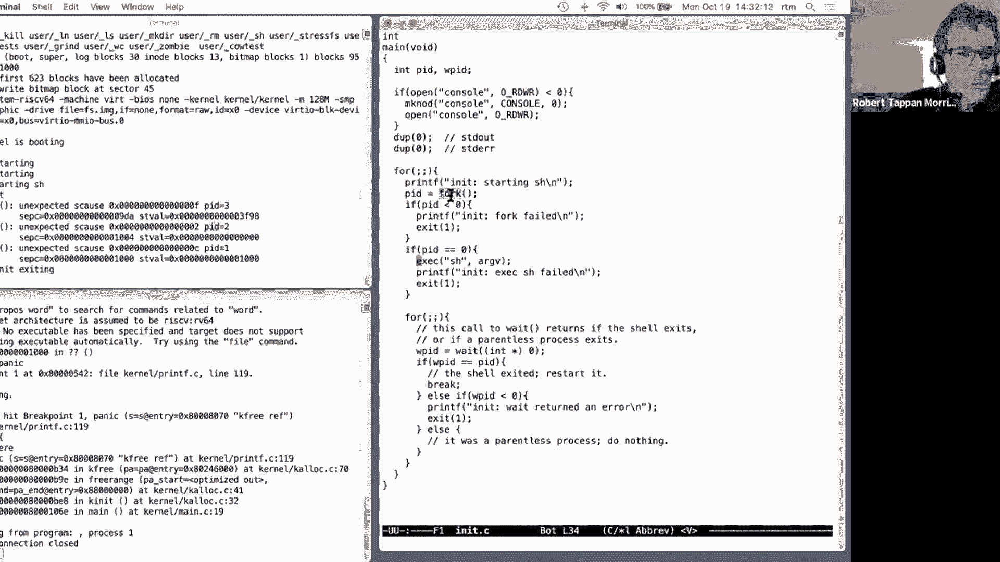

# 📚 课程 P11：第12讲 - 问答环节 #2 (COW 实验) 🐄

在本节课中，我们将一起探讨 xv6 操作系统中“写时复制”（Copy-on-Write, COW）实验的实现细节、遇到的常见问题以及调试策略。我们将跟随讲师的思路，从实验的初始状态开始，一步步修改代码，处理页面错误，管理引用计数，并最终使测试通过。

---


## 🎯 概述

“写时复制”的目的是避免在 `fork` 操作时立即复制父进程的所有内存页面，从而降低开销。其核心思想是：父子进程最初共享所有物理页面，并将它们标记为**只读**。当任一进程尝试写入某个共享页面时，会触发页面错误（page fault），内核此时再为该进程分配一个新的物理页面并复制数据，然后修改页表映射，最后恢复页面的可写权限。

本教程将详细拆解实现 COW 的步骤，包括修改 `fork` 逻辑、处理页面错误、管理页面引用计数以及调整 `copyout` 系统调用。

---

## 🔧 第一步：修改 `fork` 以避免立即复制内存

上一节我们介绍了 COW 的基本概念。本节中，我们来看看如何修改 `fork` 系统调用的实现。

在原始的 xv6 中，`fork` 通过 `uvmcopy` 函数为子进程复制父进程的每一个内存页面。为了实现 COW，我们需要改变这个行为：子进程不应获得父进程页面的新副本，而应直接映射到相同的物理页面，并将这些页面标记为只读。

以下是修改 `uvmcopy` 函数的关键步骤：

1.  删除分配新物理页面（`kalloc`）和复制内存内容（`memmove`）的代码。
2.  改为直接将父进程的页表条目（PTE）复制给子进程。
3.  清除父进程和子进程页表条目中的 `PTE_W`（可写）标志位，以启用写保护。

```c
// 在 uvmcopy 函数中，替换原有的分配和复制逻辑
// 删除以下代码：
// if((mem = kalloc()) == 0)
//   goto err;
// memmove(mem, (char*)pa, PGSIZE);

// 改为直接映射父进程的物理页面：
if(mappages(new, i, PGSIZE, pa, flags) != 0){
    goto err;
}
// 清除父进程和子进程 PTE 中的可写标志
*pte &= ~PTE_W;
// 设置一个标志（例如 PTE_COW）以标识这是一个 COW 页面（如果需要）
// flags 变量也需要相应调整，以便子进程映射时也使用只读权限
```

**注意**：我们需要同时修改父进程和子进程中对应页面的权限，确保双方都无法直接写入，从而在写入时触发页面错误。

---

## ⚠️ 第二步：处理写保护页面错误

当我们成功将共享页面设置为只读后，任何写入尝试都会导致页面错误。接下来，我们需要在内核中捕获并处理这种特定的错误。

在 xv6 中，页面错误会引发陷阱（trap），并在 `usertrap()` 函数中处理。我们需要在这里添加对 `scause` 寄存器值为 15（Store/AMO page fault）的检查。

以下是处理 COW 页面错误的核心步骤：

1.  在 `usertrap()` 中判断陷阱原因是否为存储页面错误。
2.  调用一个专门的处理函数（例如 `cowfault()`）。
3.  在 `cowfault()` 中：
    *   检查发生错误的虚拟地址是否合法（例如，在用户地址空间内，且具有有效的 PTE）。
    *   检查该 PTE 是否确实指向一个 COW 页面（例如，通过检查 `PTE_W` 为 0，并可能有一个自定义的 `PTE_COW` 标志）。
    *   为该进程分配一个新的物理页面（`kalloc`）。
    *   将旧页面的数据复制到新页面（`memmove`）。
    *   更新当前进程的页表，将虚拟地址映射到新的物理页面，并设置正确的权限（`PTE_W` 置位，`PTE_COW` 清除）。
    *   减少旧物理页面的引用计数（下一节详述）。
4.  如果处理成功，则返回并恢复用户进程执行；如果失败（例如内存不足），则终止该进程。

```c
// 在 usertrap() 函数中添加
if(r_scause() == 15) { // Store/AMO page fault
    uint64 va = r_stval(); // 获取出错的虚拟地址
    if(cowfault(p->pagetable, va) < 0) {
        p->killed = 1; // 处理失败，终止进程
    }
}
```

---

## 📊 第三步：管理物理页面的引用计数

由于一个物理页面可能被多个进程共享（通过它们的页表映射），我们需要跟踪每个页面的引用数量。只有当最后一个引用者释放该页面时，才能真正将其归还给空闲链表。

我们需要实现一个全局的引用计数数组 `ref_count[PHYSTOP / PGSIZE]`。

以下是管理引用计数的关键操作：

1.  **初始化**：在 `kalloc()` 分配页面时，将其引用计数设为 1。
2.  **增加计数**：在 `fork` 中，当子进程共享一个页面时，增加该页面的引用计数（`ref_count[PA2IDX(pa)]++`）。
3.  **减少计数**：在以下位置减少引用计数：
    *   `kfree()`：释放页面时，先减少计数。只有当计数降为 0 时，才执行实际的释放操作（将页面放回空闲链表）。
    *   `cowfault()`：当为一个 COW 页面创建副本后，减少原页面的引用计数。
    *   `proc_freepagetable()` 或 `uvmunmap()`：当进程退出或调用 `exec` 释放其所有内存映射时，需要遍历页表，减少每个映射到的物理页面的引用计数。
4.  **并发保护**：对引用计数数组的修改必须使用锁（例如 `kmem.lock`）来保护，防止多核同时操作导致数据竞争。

```c
// 示例：修改后的 kfree 函数
void
kfree(void *pa)
{
  struct run *r;
  if(((uint64)pa % PGSIZE) != 0 || (char*)pa < end || (uint64)pa >= PHYSTOP)
    panic("kfree");

  acquire(&kmem.lock);
  int idx = PA2IDX(pa);
  if(ref_count[idx] <= 0) panic("kfree: ref count <= 0");
  ref_count[idx]--; // 减少引用计数
  int ref = ref_count[idx];
  release(&kmem.lock);

  if(ref > 0) {
    return; // 还有其他引用，不实际释放
  }

  // 引用计数为 0，执行实际释放
  memset(pa, 1, PGSIZE);
  r = (struct run*)pa;
  acquire(&kmem.lock);
  r->next = kmem.freelist;
  kmem.freelist = r;
  release(&kmem.lock);
}
```

**注意**：在系统启动初期初始化空闲内存链表时（`freerange`），所有页面的引用计数应初始化为 0。

---

## 🔄 第四步：修改 `copyout` 系统调用

`copyout` 函数在内核态将数据复制到用户空间。它直接通过用户页表将虚拟地址转换为物理地址，然后进行内存拷贝。这个过程绕过了 MMU，因此不会触发我们设置的写保护页面错误。

为了解决这个问题，我们需要修改 `copyout`（以及类似的 `copyin`），让它在复制数据到用户空间时，也能检查目标页面是否是 COW 页面。如果是，则需要像处理页面错误一样，先执行复制操作。

修改思路如下：

1.  在 `copyout` 中，不是简单地将用户虚拟地址 `walk` 成物理地址，而是需要获取其 PTE。
2.  检查该 PTE 是否指向一个受写保护的 COW 页面。
3.  如果是，则调用与 `cowfault` 类似的逻辑，确保该进程拥有一个可写的私有副本。
4.  获取新的物理地址，然后进行数据复制。

```c
// 在 copyout 循环内部修改地址转换部分
pte_t *pte;
pa0 = walkaddr(pagetable, va0); // 原来的方式
// 改为：
pa0 = walkaddr_cow(pagetable, va0, &pte); // 自定义函数，返回物理地址和 PTE
if(pa0 == 0 || is_cow_page(*pte)) { // 检查是否是 COW 页
    if(cowfault(pagetable, va0) < 0) return -1;
    pa0 = walkaddr(pagetable, va0); // 重新获取新的物理地址
}
// 然后使用 pa0 进行 memmove
```

---

## 🐛 第五步：调试策略与常见问题

在实现 COW 的过程中，你可能会遇到各种错误。以下是一些有效的调试策略：

*   **小步前进**：每次只实现一小部分功能（例如 5-10 行代码），然后立即编译、运行测试，确保它能工作，再继续下一步。
*   **利用打印语句**：在关键位置（如 `kalloc`, `kfree`, `cowfault`, `uvmcopy`）添加 `printf` 语句，输出引用计数、物理地址、虚拟地址等信息，帮助理解程序状态和定位问题。
*   **理解测试输出**：仔细阅读测试失败的信息。例如，`cowtest` 中的 `simple` 测试失败，很可能是因为 `fork` 后内存不足，这提示我们 `uvmcopy` 的修改可能未生效。
*   **检查常见错误点**：
    *   **非法指令错误**：这通常意味着进程的指令页面被意外修改（例如，在 `exec` 中错误地释放了仍被共享的页面）。检查引用计数的减少逻辑，确保不会过早释放仍在使用的页面。
    *   **内存耗尽**：检查引用计数的增加逻辑是否遗漏。例如，在 `fork` 共享页面时，是否忘记了增加计数？
    *   **文件测试失败**：如 `filetest` 中读取失败，可能是因为 `copyout` 没有正确处理 COW 页面，导致数据写入到了其他进程共享的页面中。

---

## 📝 总结

本节课中，我们一起学习了 xv6 操作系统“写时复制”（COW）功能的完整实现流程：

1.  我们首先修改了 `fork` 系统调用，让子进程共享父进程的物理页面，并将它们标记为只读，从而避免了初始的内存复制开销。
2.  接着，我们修改了陷阱处理逻辑，以捕获因写入只读页面而引发的存储页面错误，并在错误处理程序中为进程分配和复制所需的私有页面。
3.  为了管理共享页面的生命周期，我们引入了物理页面引用计数机制，并修改了 `kalloc` 和 `kfree` 来维护这个计数。
4.  最后，我们调整了 `copyout` 系统调用，确保内核向用户空间复制数据时，也能正确处理 COW 页面。



实现 COW 是一个综合性的练习，它涉及进程管理、内存管理、中断处理和并发控制等多个操作系统核心概念。通过一步步地构建、测试和调试，我们不仅完成了实验功能，也加深了对这些核心机制协同工作的理解。