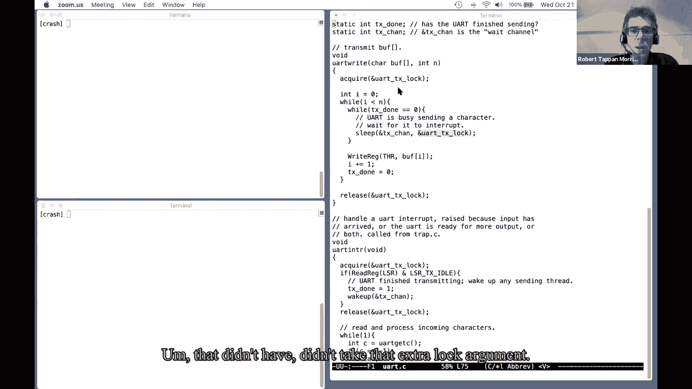
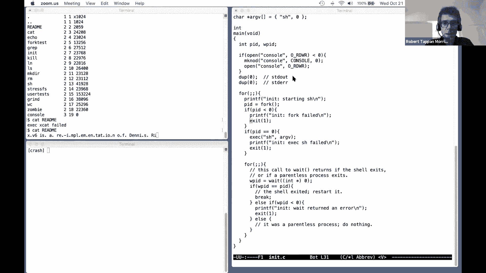

# P12：Lecture 13 - Sleep & Wakeup 英文版 - MCATIN-麦可汀留学 - BV1rS4y1n7y1

好吧，我想开始了，有人能听到我吗 是的，很清楚，好吧，所以今天我的计划是先，我想花几分钟，嗯，我们强调了上周关于线程切换的讲座中的一些要点，它们被证明是重要的点，然后我想把大部分时间花在谈论协调上，嗯。

6的更大的术语是睡眠和醒来机制，特别是我要讲的是"迷醒"问题，好吧，所以有一点我想再提一下，是你吗？是因为 xv 6，每当有什么召唤，从一个线程切换到另一个线程，通常从内核线程到调度程序线程。

在它之前总是有一个收购者，嗯，所以一个过程需要这个锁，叫做开关，它总是切换到调度程序，是调度器释放锁，事实上，几乎总是序列看起来更像这样，当一个过程，它想睡觉，出于某种原因。

它在产生 cpu或者在等待什么东西，嗯，它在自己身上获得了一把锁，它设定了自己的状态，我们看到许多不同的州，我们上周看到的是它的状态被设定为运行一个球，与其跑，然后呼叫开关或打滑，它本身叫做开关。

你也知道，这个开关基本上将线程切换到调度程序 线程，就像之前调用切换调度程序一样，然后是汗水，刚刚产生的过程锁，cpu，我再重复一遍，获取进程上的这个锁 可以防止不同核心上的调度程序在这个时间点上看到。

看到这一点，哦，这个线程是可运行的，并尝试运行它，因为其他核心可能都在运行调度程序 循环，它不断地在过程表上循环，寻找可运行线程，所以他们中的任何一个人都可能看到，如果我们没有获得进程锁。

这个线程是可以运行的，因此，我们获得进程锁的事实意味着其他调度程序在查看状态进程之前必须获得它的锁，所以我们知道在这次收购之后，没有其他线程会看到锁，我们不能放弃这里的锁。

尽管我们不能在呼叫开关之前放弃锁，那就是，这个线程获得锁，但它不能放弃，因为如果我们做了 就在我们放弃它之后，其他一些核心调度程序可能会开始运行这个进程，即使线程目前正在这个核心上运行，我是说。

让两个核心使用相同的堆栈运行相同的线程 会导致非常即时的崩溃，因此进程获取了锁 并没有释放它，呼叫开关和不同的线程，也就是说，在这个线程完全停止使用自己的堆栈之后，调度程序线程实际上释放了锁。

所以在这一点上，另一个，开始运行这个线程，因为线程现在不再运行，放弃了放弃了处理器，好的，所以这一点很重要，几分钟后就会出现，这是设计睡眠醒来协调方案的众多约束之一，有什么问题吗？是啊。

如果我们有多个核心，他们能够对锁有相同的视图的唯一原因是因为有一个单一的共享物理存储系统，对，是的，所以有什么像实现，有奇怪的文件系统不能保证这种原子性，所以我们可以锁定，如果你买两台电脑。

那他们就不共享记忆了，所以这是一种方法，他们就不会分享记忆，我们就不会有这些问题，只是现在处理器芯片的样子，单个处理器芯片上总是有多个核心，所以硬件只是被构建成多个核心共享同一个存储系统。

我知道了 谢谢，所以这是一个观点，我想我还没有提到的另一点是关于在 xv 6中，进程在调用 switch时不允许持有任何其他锁，嗯，需要一个过程来保持p箭头锁，当它调用开关，但当它调用开关时。

禁止持有任何其他锁，所以这是对许多东西的设计的另一个重要约束，嗯，睡眠是如何工作的，所以呃，我来解释一下，所以没有别的锁了，当你呼叫开关时，一个场景来说明为什么这个规则必须被强制执行，这是一个规则。

你知道，如果你延长，你知道，如果你是一个开发xv6的程序员，现在你必须遵循这个规则，以及许多其他规则，所以这个规则的理由，假设我们有第一个过程，或者您知道进程一的内核线程，它得到了一些锁，否，不是不是。

这是过程锁，但就像一些，可能是用磁盘或者，你得去控制台弄把锁，假设它做到了，同时还拿着这把锁，所以现在谁拿着一把锁，这把锁，但它不运行，想象一下 我们在一台只有一个核心的机器上，所以只有一个核心。

一个叫做开关的过程，它将调度程序，调度程序看到一个热进程2，所以内核线程正在等待运行，因此调度程序切换到，开始，将进程运行到两个开关 以处理两个，摆拍过程二，不管出于什么原因。

可能它也想用磁盘或者 UART什么的，它在同一把锁上呼叫获取，所以我们又得到了这把锁，对，都一样，同样的锁，当然锁已经被锁住了，所以这个收购者拿不到，这些是旋转锁。

所以这实际上导致的是过程二内部获取将坐在一个旋转的战利品中，等待解锁，收购不会回来，既然收购方不回来，过程二不能没有机会，即使它可能愿意提供 cpu，当它完成以后，它没有机会。

因为唱诗班在锁打开之前不会回来，但是释放锁的唯一方法是，如果进程一恢复执行，大概以后，如果它是正确的，如果里面没有可怕的虫子，它打算叫它打算释放这把锁对吧，但这还没有发生。

因为它调用了开关过程 二正在旋转 等待锁定，所以这是一个僵局，对，嗯，只会导致系统，呃，不许动，虽然我已经在一台只有一个 CPU的机器的上下文中描述了这一点，单一核心，您可以构建这样的场景。

即使用多个块将在具有多个核心的计算机上导致相同类型的死锁，结果就是，我们在xp6里有一个普遍的禁令，你不允许在开关上持有旋转锁，有什么问题吗？聊天中有个问题，罗伯特，哦，你不会有一个计时器打断。

切换到解决死锁的 pone，好的，所以嗯，是啊，结果是，所以我们都在运行 所有这些东西都在内核中运行，对，你知道吗，获取释放，哪一个，你知道吗，只是，都是内核代码，所以我们不是在用户空间里运行。

但确实会发生计时器中断，嗯，XP实际上是在运行内核代码时发生的备用计时器中断，系统呼叫代码，实际上，如果你看一下内核陷阱代码，或者其他什么东西，您将看到，如果在xp执行内核时发生了计时器中断。

它将称为收益率，所以如果我们在这里开唱诗班的时候 发生了计时器中断，那么实际上，呃，我们会得救，因为赎回收益率，产量会回到这里，希望 pone会恢复并最终释放锁，但是原因在上一节课中已经解释过了。

在它开始等待锁之前 获取关闭中断，因为我们，当然是出于其他原因，我们不能在锁的时候中断，因为如果中断处理程序，需要使用，需要获得锁，刚刚获得如此，如果你看一下获取 xv6的代码。

你会看到它做的第一件事就是关闭中断，然后旋转，你可能会想，天啊，为什么它不旋转 然后关闭中断，原因是这将允许在短时间内发生锁被持有的情况，但中断并没有被禁用，同时设备中断可能会导致死锁，所以很不幸。

另一个要求是我们在旋转时中断，等待锁可以防止计时器中断，从而防止进程二回到进程一，问得好，好的，另一个问题，我可以重复一下如何避免死锁吗？哦，在 xv6中通过禁止死锁来避免死锁，嗯。

XP六码不允许获取除 p箭头锁以外的任何锁，然后呼叫开关，如果你看一下开关的代码，实际上有一些检查和开关，相当于检查除了p箭头锁之外没有持有锁，所以问题是这个代码，如果它发生在xv6内核将是非法的。

很容易导致死锁，所以这是禁止的，好的，嗯好吧，所以保持这个规则和前面保持 p锁的需要，换位思考，因为它们会在我们讨论睡眠和醒来是如何工作的时候再次出现，好吧，新话题，嗯，通常意味着睡眠。

我们听说过很多关于锁的事情，对于不同线程不想注意到的情况，锁是非常棒的，不用担心它，也不用考虑其他线程在做什么，我们持有锁并共享数据，因为这意味着，我们就像永远不用担心其他锁的可能性。

或者也许不知道谁知道用这些数据，因为锁会导致一些事情发生，在编写线程代码时，一次一个，在某些情况下，您还需要明确地等待某个特定事件，你想让不同的线程，所以，例如，假设我们有管道。

我们有一个读者和一个作家，对，如果我正在读一个管道，而管道中目前没有什么可读的，我希望能够等待任何其他进程将数据写入管道，我想等这种管道不是空的，类似事件，如果我在读磁盘或写磁盘，如果我在读取磁盘。

然后我想告诉磁盘控制器看，请在磁盘上读取一个特定的块，可能需要很长时间，毫秒，在磁盘最终完成读取之前很长很长时间，尤其是当它必须寻找和旋转，这个过程正在进行读取 需要能够等待特定的事件。

我们要等待磁盘读取完成，同样地，你可能已经注意到，呃，当你在编程的时候，一个unix程序可以使等待系统调用，重量的作用是，它导致调用进程等待，直到它的任何子进程退出，因此。

我们让父进程有意地等待由另一个进程引起的某种事件，因此，这些都是流程需要等待特定事件的情况，不管是典型的 io还是其他的过程，似乎是在宣告某种特定的事情发生了。

协调是帮助我们解决这些问题或实现这些需求的工具，协调是至关重要的，就像锁一样，嗯，协调是编写线程程序的另一个基本工具，它总是出现好吧。

所以嗯，我们怎么能有一个过程或一个线程，等等这个，这类事件，嗯，所以有一种可能，很简单的说，一个只是为了忙，等待循环，所以你可以想象，我们马上就会放弃 这是个坏主意，但假设我们想从烟斗里读出来。

我们只需要在管道读取函数中编写一个循环，你知道吗，当你知道管道缓冲区是空的，好的 我们要坐在这个圈子里，在这个圈子里转啊转，直到另一个核心上的其他线程写入缓冲区，使其不空，然后这个循环就结束了。

然后我们就，你知道吗，返回数据，或者我们该怎么处理这些数据，所以你可以想象这样写代码，实际上可能有一点，你知道吗，像这样的少量代码，就像如果你知道你等待的事情极有可能发生，十分之一微秒。

假设这可能是等待它的最好方式，所以这通常是用一些设备硬件来完成的，你要求设备硬件做一些事情，你知道它总能在很短的时间内完成任务，只是坐在一个短循环中 可能是正确的答案，但如果这可能需要很长时间，毫秒。

或者你只是不知道多久，对，也许在写管子的过程之前需要十分钟，实际上什么都写，我们可不想在那里打转 浪费 CPU时间，它可以用来，你知道吗，找到更多圆周率的数字或其他有用的东西，我们想放弃 CPU。

只有我们想办法放弃 CPU之类的开关，但当我们关心的事情真的发生了，这种协调是关于放弃心肺复苏术的技术，直到这种情况发生，我们等待的事件真的发生了，再一次，呃，睡觉和醒来。

多年来人们发明了许多不同的协调 原语，嗯和 xv6与许多口味的 unix都使用一种叫做睡眠和醒来的东西，在这种背景下，我想切换到查看代码和 xp6，好吧，所以我刚刚分享了我的屏幕，如果屏幕共享不起作用。

请告诉我，嗯，好的，我准备这次演讲，嗯，在 uart驱动程序中重写了一些代码，这是 xpsix用来从控制台读写字符的串行驱动程序，所以我有这个功能，你说得对，哪一个。

当shell之类的程序打印提示符或产生任何其他输出时，就会进行写系统调用，嗯，在我稍微修改过的 xv6版本中，正确的系统调用最终会给你打电话，艺术就在艺术驱动程序中，它实际上写了这个循环中的字符，嗯。

一个接一个地给uart五金件，这是用一种经典的设备驱动程序风格写的，您会在许多设备驱动程序中看到这样的代码，好的，所以这里发生的一件事是 uart硬件只能接受，一个字一个字，所以这段代码看起来。

你知道通常你有很多角色，你想写，它可以写一个字符到你的艺术硬件，它需要等待 uart硬件的同意，我把那个角色，我准备好接受新的了，然后司机可以写一个新的，新角色，下一个要输出的字符。

因为这个硬件运行得很慢，可能每秒只有一千个字符，我们在字符之间等待的时间可能很长，就像一毫秒 在现代计算机上是很长很长的时间，你知道十亿个循环，一百万个循环，可能需要做大量的工作。

所以我们真的不希望只是旋转等待 uart完成发送 每个字符，嗯，我们希望，更好的方法，所以事实上，XP6有更好的方法，像大多数操作系统一 样，UART硬件将在发送完每个字符后升高并中断。

所以我们不仅有这个正确的套路，我们的司机也有一个中断程序，中断程序会检查，它读取一个内存映射寄存器 在 u艺术硬件中寻找标记，我发送完这个 lsrtx闲置标志了，如果那面旗子，然后呃。

中断例程实际上在内存中设置了这个标志，并发出这个唤醒调用，会导致，呃，你说得对，不管有什么威胁，你说得对，到嗯，从沉睡中归来，嗯，试图发送一个新的角色，所以游戏是如果一个线程需要等待一些东西，开始了。

我们需要等待 uart硬件愿意接受一个叫做睡眠的新角色，我在等一个特定的条件 通常，当这种情况，完成了，我们的代码实现了这个条件，我们会叫"醒来"，所以这些睡眠和醒来是配对的。

睡眠会在不久的将来看到它的实现，但是睡眠可以做很多事情，需要注意的一点是 醒来和睡眠必须联系在一起，不知何故，这就是我们叫醒来的时候，我们只想唤醒正在等待特定事件的线程，我们意识到这发生了，所以呃。

睡觉醒来，以这个论点为例，它被称为睡眠频道，所以醒来在这里提供了同样的价值，嗯，我们要睡着了，睡觉醒来，其实不是真的看，不管是什么，但是这些，他们只是在这里取64位的值，他们不在乎什么。

他们真的是唯一的事情是，嗯，如果我们睡在一个特定的睡眠频道上，这个特殊的重量通道，我们希望唤醒在这里传递相同的值，为了表明它想要哪个枕木，醒来，任何关于这个界面的问题，好的，所以有一个问题只是为了澄清。

过程没有被唤醒，每写一个角色，好的，让我们在这个驱动程序中看到我为了演示目的 专门黑了这个驱动程序，每个角色都有一个中断，所以你正确的方式起作用，在这个循环中的每个角色，对于缓冲区中的每个字符。

字符应该写，我们在这个循环中等待，直到你准备好接受另一个角色，我们再写一个字，我们把这个标记设为零 然后回去等，通常在睡眠中，直到完成标志是一个，当你完成后提升这个角色，它会中断，中断程序会设置为1。

然后做唤醒，所以实际上每个角色都有一个醒着睡着的醒着的循环，更多的是你实际上有能力发送，一些数字，比如一次4个或16个或更多的字符，因此。

一个更有效的驱动程序会在每次循环的迭代中将16个字符交给u art，每16个字符就会有一个中断和更高速的设备，你知道典型的以太网驱动程序，呃，通常接受比每个中断更多的字节，好吧，好的。

所以这只是一个例子，呃，界面是什么样子的，啊睡觉和醒来都很好 因为，或者他们很好的一个原因是，它们相对灵活，睡觉醒来，我不在乎，是什么，你准备好了，你知道你可以，你不必告诉睡眠，你在等什么。

你不必告诉醒来，发生了什么事，你只需要有这些匹配的睡眠通道 64位的值，睡眠界面有一个有趣的特性，我们得把它锁在这里，第二个论点是，这个锁定参数，为什么睡眠会引起第二个争论，这背后有一个很大的故事。

我要向你解释发生了什么，不是，似乎不可能设计出一种完全不知道你在等待什么的睡眠，很难写出一种通用的睡眠，只是为了等待一些特定的事件而睡觉，这就是危险，稍后我们将看到，叫做迷失的觉醒。

几乎每一个协调机制都必须以某种方式努力处理，在睡眠界面上，我们必须传递一个锁的事实 是一个有点丑陋的实现，以某种方式泄漏到界面上，我马上解释，是啊，我来解释，哦，有一个问题。

为什么我们需要完成标志和睡眠频道，我将坚持这个问题，我来解释，在5或10分钟内，好的，所以呃，在解释为什么睡眠与这把锁有关之前，嗯，我其实想，呃，谈谈会有什么影响，如果我们有一个简单的睡眠，嗯，那没有。

没有接受额外的锁论点。

嗯，所以，好吧，而且这里的话题已经丢失了，醒醒，这就是我现在要描述的问题，假设界面只是睡眠，在这个没有第二个参数的任意通道值上，你不能让这个工作，所以我想把这叫做睡眠中断，你可以想象。

如果我们不知道这样的睡眠，这种特殊的睡眠价值，这说明我不想再跑了，我在等一个特别的事件，嗯，如果你看一下 xp6对睡眠的实现，你会看到它这样做，除其他外，嗯，我们需要记录下这个特殊的睡眠通道值。

好让未来的召唤，会意识到我们其实是在等待唤醒我们的东西，为了，所以你可以想象一个睡眠，它会被打破，它真的做到了这一点，我想你得去唱诗班，这个过程是锁的，还有，然后相应的醒来，醒醒。

这就是"起床"的工作原理，我们希望用这个特定的通道值唤醒所有正在等待调用 sleep的线程，所以我们要说，你知道吗，对于每个 p和在过程表中，它睡在频道上，我们醒来，然后把状态设置为，实际上模数锁。

这几乎就是醒来所做的，嗯，好的，所以某个宇宙男孩，如果用这个简单的方法睡觉和醒来就好了，嗯，我来示范一下，虽然，嗯，我来示范一下，让我概述一下你将如何利用这种睡眠，并在uart驱动程序中醒来。

这是我们已经看到的。

但是使用这个稍微简单一点的界面，司机确实这样做了，你就会做这个，旗子，嗯，你是对的，你知道会说每一个，缓冲区中的字符，然后是检查这个完成的标志，只是说，而不是做，去睡觉，然后通过那个通道。

不管是什么都无所谓，好的，然后我们把c传给uart，done等于零，好的 然后中断小组，只需设置 done标志等于 true 并调用，醒醒，所以这就是我们如何利用，这个简化的破碎睡眠好吧。

所以这真的是一个破碎的睡眠，嗯，这个少了什么，尽管是锁定，所以实际上这两个动作，正确的程序和中断程序都必须锁定，原因之一是每当我们共享数据时 这个完成标记，我们真的需要锁定共享数据。

另一个原因是实际上我没有把它放在这里，但是中断例程和正确的例程都需要访问硬件，UART硬件本身，一般来说这是个错误，除非你非常非常聪明，嗯，同时拥有两个线程是错误的，尝试读写内存映射的硬件寄存器。

所以我们需要锁定这两个子程序，为了，赛车访问已经完成，赛车访问硬件，所以问题是，我们应该把锁放在哪里？中断程序很简单，我们一开始就锁门，不管锁是什么 我想是叫你 RTX，锁什么的，我们会在最后打开，对。

所以中断程序只是接受锁 然后释放它，难题是把锁放在哪里，你是例行公事，你是对的，可以在发送字符的整个过程中保持锁，每个角色 这样我们就能得到这里的锁，打开这里。

所以在开始和结束的时候 锁定和解锁处理每个字符，那么为什么这肯定不起作用呢，一个原因是我们能摆脱这个循环的唯一方法是 如果中断例程设置为，但如果我们在整个序列中保持这个锁，init，中断例程还需要锁。

所以它会坐在这里旋转，等待锁，因为我们拿着锁，在完成之前不会释放它，但只有当中断例程，它实际上可以把锁，所以我们不能简单地拿着锁，在发送每个字符的整个过程中，好吧，所以另一种可能。

你知道最棘手的问题是你是对的，在它期望中断例程执行的时候 持有锁，就在这里，我们真正需要中断例程执行的唯一时间是在这一点上，否则就可以拿着锁了，所以另一种可能是在一开始就获得锁。

因为我们需要保护我们对这个共享变量的访问，但释放它，在呼叫睡眠之前，这给了中断一个执行和设置完成的机会，我们会在睡眠恢复后重新获得它，所以当我们回到顶部再次检查时，我们又拿到锁了，好吧。

所以让我修改一下我的驱动程序，我们走着瞧，看看后果如何，好吧，所以我们说的睡眠，我们想去的地方，你可以看到，这段代码实际上在一开始就获得了锁，并在最后释放了它，中断例程也会获取并释放。

建议是我们做两件事，一是，我们要去 我们要探索的是为什么我的睡眠中断的想法，只需要一个论点 为什么这不起作用，所以这个想法是为了使锁定工作正确，我们要把睡眠中断叫做好吧，但我们要发布，把锁锁在这里。

在睡眠恢复后重新获得它，然后我在我的小白板上写的正是这种睡眠所做的，也就是说，它使状态进入睡眠状态，将频道设置为这个 tx chan，它调用 switch的参数，好吧，让我们看看会发生什么，呃，哦。

好吧，你看那个，它实际上做到了，所以它打印出了它的初始信息，它实际上写了几个字符，现在它似乎已经挂了，嗯，结果是如果我输入一个角色，我要输入一个句号，可能会有更多的产出，哎呀，LS也发出了几个字符。

然后停止了，但是如果我输入一些东西 然后输入 然后输入 x，我知道重启会继续下去，所以，你觉得这到底是怎么回事，所以你想提出一个理论，2。这个问题肯定与我刚刚修改的代码有关，所以发生了什么，好吧。

所以现在的情况是我的新代码释放了锁，此时释放此锁，就在这里，嗯，中断的发生是因为一旦你释放了锁，首先要启用中断，所以当 cpu中断的时候，这是一台多核机器，所以实际上打断是可以被接受的。

所以几乎可以肯定的是在这一点上发生了什么，我在代码中标记了，是在另一个核心上 uart中断正在执行，坐在唱诗班里，等待这把锁，在其他一些核心上，所以一旦我发布了其他核心，它会得到锁。

它将会看到 uart已经完成了发送角色，嗯，它将把这个传输完成的标志设置为一个很好的，它就会呼叫，在 tx chan上醒来，这也很好，除了因为在释放和中断睡眠之间的写入线程仍在执行，写作的线还没睡。

因此，中断例行呼叫的唤醒实际上并没有唤醒任何东西，因为在那个频道上还没有人睡觉，然后，嗯，写作的线索将继续呼唤它破碎的睡眠，哪个会，你知道吗，设置睡眠状态 设置睡眠通道，但是中断已经发生了。

已经被唤醒了，所以这睡眠没有什么能唤醒它，因为醒来已经发生了，这就是所谓的，失落的醒来道具，嗯，任何关于为什么或如何出现这种情况的问题，是啊，呃，一旦有东西丢失了，一旦我们醒来迷失了方向。

下一次所有被缓冲的东西都会被丢弃，好吧，这完全取决于发生了什么的细节，在，在这种情况下，它实际上只是一个，这是，有点意外，我输入了一些东西 导致输出恢复，所以我输入导致输出，嗯，去修理。

原因是 uart只有一种中断，它使它调用相同的中断程序，是否同时输入到信号 输入和信号完成输出，所以当我输入东西的时候，这个中断程序被称为，无人机认为这只是输入到达的信号，但实际上第六季的中断程序。

你知道吗，寻找，你知道吗，注意到呃，你知道吗，这段代码的编写方式是，如果uart准备传输另一个字符，它总是叫醒来，尽管已经是很久以前的事了，也许阿特已经叫了醒来，所以我输入字符导致它重新启动是偶然的。

所以有时候你知道，如果有失落的醒来，有时它们会用这种方式固定自己，如果你幸运的话，有时他们不喜欢，如果他们有单独的，接收，传输中断程序，那就无法摆脱这一切了，这回答了你的问题吗？是的，谢谢，所以是的。

请便，这个tx钻头有什么用呢？或者做了一点，或者你是说这个，这面旗子做好了，这只是中断小组与你交流的一种方式 是对的，先前传输的字符完成了，你可以继续传送下一个角色，所以这是一小块。

就像一个小小的交流标志，从中断程序到你是对的，所以这是有道理的，因为如果它喜欢，它会睡着，当它醒来的时候 就会知道，可能是那个突然袭击把它吵醒了，所以很可能就像人们说的那样，但如果我们没有，所以。

我想我的意思是，实际上醒来，它应该知道这是从你的艺术中断，好的，你问题的另一种措辞方式，怎么会有这样的循环，而不是只是还好，我想我已经回答了我的问题，有两个目的，好的，是啊，是啊，是啊，是啊。

一般情况下，你的问题的答案是一个更普遍的答案的具体例子，嗯，它只是被证明是不实际的，使睡眠和醒来精确，有保证，精准，如果睡眠恢复，你所等待的一切都已经发生了。

其中一个例子是假设我们有两个进程都在尝试写 u art，同时他们都在你是对的，它们可能是因为在一个人写了一个字符之后，它会睡着的，嗯和释放，事实证明，打开锁。

然后另一个就可以进入这个循环 并尝试等待 直到你，不忙，他们都可能最终都睡着了，当一个中断发生在，用户界面可以接受多一个字符，他们两个都会被吵醒，但只有一个人应该真正写这个角色，同时这个循环，事实上。

你会看到一段时间的循环，每晚睡在 xv 6，我相信，因为你的问题可能会被唤醒，但实际上有人拿走了你一直在等待的东西，所以你又要睡觉了，发生这种事，我有个问题，是的，嗯，看起来我们只看到最后一次醒来。

因为一旦我们像一个角色一样按下，其余的产出，整件衣服都出来了，我们不应该看到像多个失去的醒来，哪里，为什么不再发生，哦，它做到了，它做到了，让我让我让我运行这个，所以我要跑，读我，我有只猫，读我的权利。

也就是几千字节，所以哎呀，对不起，我已经打了一些东西，天啊，我们有一个角色，我要输入一个句号，我们又多了几个角色，然后它又挂了，我再来一次月经，另一对情侣角色，每次，输入一个句点，导致输入的中断。

唤醒整个过程，我可以做更多的权利字符，再被吊起来，你知道得到另一个迷失的醒来，是吗？是啊，我刚刚错过了，如果有道理的话，对，是啊，所以我在这里输入句号，我每次醒来都有几个角色。

因为你知道丢失的唤醒需要这个巧合中断已经发生，并等待获得锁，只是我们得到了这个巧合，很多时候，但不是所有的时间，好的，所以我们的目标。

然后通过某种方式消除 RTX锁释放之间的这个窗口 来解决这个丢失的唤醒问题，我们必须释放它 因为中断需要锁，所以我们得把锁打开，但不知何故，我们想消除这个窗口，当我们释放锁的时候。

当过程实际上标记自己为睡眠的时候，以便被打断的人醒来，我们会看到这个过程是在睡觉，实际上是在唤醒它，所以不要失去清醒，所以我们得想办法把窗户关上，为了做到这一点，我们得让睡眠界面更复杂一点。

所以我回到了，原始的工作睡眠和对工作睡眠的呼唤，人们解决这个问题的方法是，睡眠需要睡眠，即使睡眠并不真正知道你在等待什么，它要求你在等待什么，此外，还有一把锁可以保护你等待的东西。

所以它要求有一个睡眠状态，它并不真正知道，睡眠条件是 tx等于1，所以睡眠不知道睡眠状态是什么，但它确实需要有一把锁来保护睡眠状况，也就是这个 uart tx锁，锁是锁着的，当你检查你拿着锁的条件。

直到你叫睡眠，你通过锁睡觉，从本质上讲，睡眠在界面层面上承诺的是，它将原子般地让进程进入睡眠状态，并释放锁，作为一种，至少这是一对不可分割的行动，至少在醒来方面，醒醒，永远不会看到这种情况，是啊。

你把锁打开了，但是没有，过程还没睡着好吧，所以睡眠让锁的释放，推杆的过程是睡眠原子，规则是必须有，必须有个条件，必须有一把锁，为了保护这种状态，当你打电话睡觉的时候，锁必须被拿着，你必须通过锁才能睡觉。

此外，当你打电话叫醒时，锁必须拿着，调用时需要持有此条件锁，醒醒，醒醒，所以这些是程序员最好遵循的规则，如果他们想用睡眠和醒来来写正确的代码，所以让我们看看睡眠和醒来的情况。

试图发现他们实际上是如何使用这些额外的小信息和这些规则的，为了避免迷迷糊糊的醒来，所以首先我想看看"醒来"，嗯，醒来并不奇怪，它只是贯穿整个过程表，记住在它锁定一个进程之后，如果不锁定它。

你就不能真正地观察一个状态过程，如果进程处于休眠状态，它将锁定每个进程，它睡觉的通道和醒来的通道是一样的，然后醒来，标记着变化，进程处于可运行状态，然后释放过程，锁定，所以这里没有惊喜。

我们会忽略我破碎的睡眠，相反，看看睡眠本身，这就是睡眠的实现，现在这个新的锁参数，所以我们知道睡眠必须减少 必须释放条件 锁定它的第二个参数，我们知道它必须释放它，因为你知道中断程序必须能够获得它。

所以我们知道睡眠中的某个地方会释放锁，事实上，这是锁的释放，当然我们会担心在我们打开锁之后 在这个时候醒来，可能被调用并唤醒 这个过程，所以为了唤醒这个过程，但我们当然没有标记，睡得好吗。

所以我们不能醒来，执行，在此版本发布后 立即执行唤醒，即使我们正在释放，所以在释放条件锁之前，为了避免这种情况发生，睡眠获得了进入睡眠的过程的锁，如果你还记得，唤醒必须在保持条件锁的情况下被调用。

并获得它即将唤醒，进程首先必须等待获取 该进程是锁的，所以从你对的时候到你对的时候，检查了情况，当我们在这里打滑的时候，这个线程持有条件锁和皮耶罗锁中的一个或另一个，在任何时候。

回到你的问题上 我想强调这一点，你说得对，在这里获取条件锁，并将条件锁一直保持到它调用睡眠的地方，因此它获得了条件锁，用拿着的锁检查情况，在锁定状态下呼叫睡眠，所以醒醒吧，现在什么都做不了。

因为我们甚至不能打电话给，醒来直到我们，在调用方拥有条件之前，锁定或唤醒现在肯定不会执行，嗯，当我们叫睡眠时，我们仍然拿着锁，呃，睡眠释放条件锁，但首先获得的是进程锁，如果你还记得，醒醒。

唤醒是用条件锁调用的，在我们释放它之后，对不起，在我们释放条件锁之后，醒来可以叫，但是醒来不会看过程，直到它有了过程锁，我们持有，好的，所以"醒来"仍然没有执行，获取过程锁。

在保持过程锁的同时释放条件锁，把这个过程标记为在这个特定的通道上睡觉，然后叫刹车，它叫开关右，我们仍然有进程锁，所以醒醒吧，仍然什么也没做。

如果你还记得我们现在从这个线程切换到调度程序 线程和调度程序例程，在它被调用后，开关返回，释放最近运行的进程锁，所以在这一点上，当我们在时间表唤醒后，最终可以获得这个过程的 pr锁，注意它在睡觉。

在这个频道上，并设置它的状态为醒来，所以我们保证了规则的效果，当调用睡眠时，你必须保持条件锁，睡眠知道这把锁的事，只有在需要进程公关锁定和唤醒之后 才会释放它，需要握住两把锁，为了思考这个过程。

意味着我们不能再失去清醒，所以我们解决了这个迷失的觉醒问题，我意识到我有点卷入，关于这里发生的事 有任何问题吗，好吧，请随时提出问题，好吧，所以我们看到了一个，我们看过这个，在这个案例中 我们，嗯。

以避免迷失方向的方式使用睡眠和醒来，嗯，在第六区还有很多人，我们等待的东西，我们等待的条件是，是在一个中断发生了，这表明硬件已经准备好做下一件事了，也有一些时候，内核代码调用睡眠，为了等待分歧。

一些其他的线程做一些事情，实际上在概念上并不完全不同，但可能感觉有点不同，所以在管道密码里，例如，如果你看看管道，阅读，你知道吗，这里有一堆垃圾，你必须忽略，但是嗯，读取系统 调用管道。

最后调用管道读取，有把锁保护管道，结果就是，条件锁定管道需要等待，直到管道中实际上有数据缓冲，这个条件是你知道数据准备好了 是 n读还是 n写 大于 n读，写的字节比红色还多，虽然这不是真的。

管芦苇在睡眠中等待这种情况，并通过这个管锁，状态锁，保护状态进入睡眠，以防止丢失的醒来，你可能会迷失方向的原因是在另一个核心上，嗯，如果我们在另一个核心的文件中再往上走一点，可能有其他线程正在呼叫管道。

它会在管道缓冲器上增加咬痕，最后打电话给"醒来"，呃管道读取器正在等待，你知道吗，我们希望避免这样的风险，即在读者检查并注意到没有字节可读和调用sleep之间，我们不想让管子在另一个和弦上。

溜进去咬几口 然后在我们睡觉前叫醒我们，那将是一个迷失的觉醒，还有这把锁，基本上这把锁，睡眠会小心翼翼地释放它，防止作家在检查病情和睡觉之间溜走，因为编剧必须获得，对于那些，例如，这是管道读取的循环。

等待数据出现，等待健壮，管道缓冲区非空，原因是可能会有多个进程读取同一个管道，所以如果一个写手给管道写一个字节，所以只有一个字节，编剧要叫"醒醒"，会醒来的，我们读取管道的所有多个过程。

但管子里只有一口，其中一个过程会首先唤醒，对，它会先从睡梦中醒来，其实这让我想起，关于睡眠 还有一件重要的事 我忘了说，嗯，这就是睡眠所做的最后一件事，让我们看看，呃，抱歉，这里是睡眠的结束。

睡眠做的最后一件事就是获取条件锁，所以你必须保持睡眠状态，睡眠在它回来之前重新获得它，意思是如果有一群读者，如果有一个字节写在上面，只是写给烟斗，一群读者醒来后，他们中的一个会成功的。

其中一个线程的一个休眠将成功获得这个锁，其他人会等着睡觉，等待锁，一个幸运的过程，睡眠会回来，就会回到这张支票上，现在写的比读的大，所以有数据可读，会掉下去的，它会读取一个字节。

现在缓冲器里什么都没有了，解锁返回，接下来被唤醒的线索，它的睡眠将能够重新获得状态锁，它的睡眠会恢复，它会回来的，重新检查循环条件，但现在嗯和读等于对，所以那根线和其他等待的线都会回到睡眠状态。

再次强调为什么，几乎每一个，重新检查状况，关于睡眠管道使用睡眠方式的问题，好吧，嗯嗯，睡眠和醒来的界面和规则有点复杂，嗯，因为你必须透露一点睡眠 你在等待什么，你得告诉它锁定并遵守一些规则。

有时候很烦人，另一方面，睡眠和醒来相当灵活，部分原因是他们实际上不必了解病情本身，只要有一个条件，一把锁，还有其他一些水平较高的计划，还有其他的协调方案，比如你在今天的阅读中读到的信号量。

其中的界面稍微不那么复杂，就像信号灯一样 你不必告诉信号灯 关于锁，打电话给信号灯的人 不必担心内心的醒来，你在今天的阅读中看到的信号量的实现，信号量的内部实现 担心失去唤醒。

因为这个接口是专门针对这些上下计数器的，处理丢失的 唤醒的需要不会泄露到界面中，所以半长方形要简单一些，尽管如果你不这样做，它们就不那么普遍了，如果你不是，如果你没有计数，也没有等待计数。

那么信号量不一定对你很有帮助，所以这让我认为，睡眠和醒来更普遍一点，呃，所以在我们的皮带下睡觉和醒来，我想谈谈另一种挑战，六张脸，这实际上与睡眠和醒来有关，这就是如何关闭线程，每个线程系统，你知道吗。

线程最终需要退出，我们需要清理他们的状态，在 xv6上释放他们的堆栈，当进程退出时，我们需要释放它的用户内存和页表，把它的陷阱框放出来 标记整个过程，过程表中的槽，可重复使用，这是典型的清理要求。

一堆必须被释放的东西，当线程退出时，或者是这样被杀的，但是这里会出现两个大问题，一是线程退出，二是线程死机，一是我们不能随便伸手，我们通常不能单方面破坏另一条线索，问题是。

其他线程实际上可能正在另一个核心上执行，并使用它的堆栈，并且可能将其寄存器保存在其结构上 下文中，或者其他线索，如果它在内核里，嗯，也许拿着锁，它可能正在对内核数据结构进行一些复杂的更新。

如果我们只是以某种方式把线打下来，阻止它死在它的轨道上，它可能已经完成了对一些内核数据的微妙更新的一半，但我们在它完成之前就把它击落了，所以，呃，你知道吗，我们不能让这些事情发生，嗯，另一个问题是。

即使一个线程调用了exit，它也决定了，它不是被杀死的，但它自己决定退出，当它像它的堆栈一样执行时，它有它所使用的资源，例如，它在工艺表中的插槽里，当它还在执行它的时 候。

它可能无法释放它仍在使用的资源，嗯，所以我们需要一种方法来威胁，以某种方式释放对执行至关重要的最后几个资源，即使线程需要它们来执行任何代码，好的，所以记住这两个问题，嗯。

XP6实际上有两个与关闭线程或进程相关的东西，一个是出口，一个是杀，所以让我们先看看exit，看看proc中的exit代码，这是退出系统调用的，你也知道退出的后果，我们从外面知道。

从界面上看 它有一个自由的过程，内存和页表，它必须关闭打开的文件，我们也知道有这样的等待电话 父母可能正在醒来，这种出口最终会导致父母也被吵醒，所以我们要在出口代码中寻找所有这些东西。

所以你可以看到一些东西，比如退出，特别是关闭打开的文件，这可能是相当复杂的，因为这些文件，你知道吗，文件系统文件关闭它们实际上涉及到引用之类的东西，数数，我们还没到那一步。

但我们会看到这需要相当多的工作，但是当您调用exit时，一个过程会继续进行并关闭，关闭自己的文件，它也做了类似的事情，它，呃有当前工作目录的记录，当你叫它 cd的时候就变了。

它需要将引用释放到文件系统中，然后发生了一些其他可怕的事情，这与如果一个进程退出，但它有自己的孩子，嗯，这些子进程是通过 init进程继承的，因为，事实证明，我们将在几分钟后看到。

每个退出的进程都必须有来自父进程的相应权重，这实际上完成了退出的一些步骤，所以如果我离开我的孩子，他们需要等待，我是他们的父母，我不等他们了，因为我退出了，所以在出口这里有一段代码是重新养育。

退出的过程是儿童，所以他们的父母，是进程编号，一，最后一个进程唤醒了它自己的父进程，它可能在等待和睡觉，等待，把它的状态设置成僵尸状态，嗯，结果我们还没有 我们一会儿就知道了，但这个过程还没有完全结束。

释放所有资源，嗯，所以它还没有完全准备好重复使用，就像我们想在一个过程可以是，它的所有状态都可以被一个叉子重用，其他不相关的叉子，对，但我们还没有完全做到这一点，一会儿我们就会知道为什么。

但我们把状态设置成僵尸，嗯，我们还没完呢，对，我们还没有释放过程，我们只要进入调度程序，好的，所以故事还在继续，你知道吗，在这一点上，僵尸进程不会运行，调度程序只运行可运行的进程。

所以这个过程不是很自由，因为那将是状态等于未使用，但它肯定不会再跑了，因为它处于僵尸状态，所以我们切换到调度程序，调度器现在运行其他东西，嗯，我们从 unix中对出口和重量的描述中得知，如果进程退出。

如果它的父母调用 weight，这个重量将返回给父信号 它的一个孩子退出了，所以我们可以寻找权重的实现，这里还有一个大循环，这种重量的实现，但实际情况是当一个过程调用重量时，它扫描进程表。

寻找其父进程是当前进程的进程，尤其是，寻找其父进程是当前进程的进程，或者处于僵尸状态，他们已经走了那么远，退出或几乎退出，嗯，现在我们发现这个叫做等待系统调用的权重，发现一个已退出的子进程。

我不知道你是否记得出口可以返回这三个两个位的父母出口状态，所以下一组代码收集了，然后是父母，因为免费的，它执行释放进程资源的最后步骤，所以我们来看看免费的，这是最后一个关闭的东西，这将是相当尴尬的。

如果，如果正在执行的进程本身被释放，所以它释放了陷阱框架，它释放用户页表，如果我们释放内核堆栈，退出流程的流程，内核堆栈也将在这里被释放，但是因为，堆栈保护内核，堆栈栈保护页。

我从来没有释放过内核堆栈吗，嗯，但所有这些东西在出口释放时可能会很痛苦，当正在运行的进程被父进程释放时，嗯，这里需要注意的一点是重量，体重不仅仅是为了方便家长 他们想知道，当他们的孩子离开的时 候。

重量实际上是退出过程中的一个关键部分，你真的在 unix，这只是一个要求，有一个权重，对应于每一个退出的过程，这就是为什么当一个过程退出时，它的孩子被赠送给了 init，它们在它的孩子身上变成了。

init所做的就是在循环中调用权重，因为每一个过程都要等待，这样它的父进程就可以调用 free proc 并完成释放它的资源，当它完全完成的时候，它设置，如果父进程释放了所有退出进程的资源。

它将该子状态设置为"现在未使用"，叉子和你知道，一些未来，叫做叉子，可以重用那个进程槽，哦，我有个关于睡眠的问题，嗯，所以在睡眠中，我们在哪里，是啊，所以当我们，对不起，不睡觉，嗯出口，一旦我退出。

是啊，是啊，为什么我们，为什么我们在修复之前要抓住原来的父母，有必要吗？可怕的代码正在努力应对一个进程及其父进程可能同时退出的可能性，还有一些，你知道吗，尽管通常没有什么有趣的事情发生，流程退出。

它的父母在等着它，一切都很好，但可能是进程退出的父进程和它的父进程同时退出，所以当我们试图，叫醒我们的父母 告诉我们已经离开了，父母本身正在退出，这里有很多代码，我觉得一年前我就明白了，但 不再明白。

是关于处理这种罕见的父母和孩子同时退出的情况，如果不是因为那个，对父母来说 这一切都很简单，这个过程将有一个父母，它会在这时叫醒它的父母，我们不会，如果不是因为同时退出，父母和孩子，孩子刚醒的时候。

好的，原来如此，谢谢，对不起，很抱歉没有在这里解释，我有个小问题，嗯，那么我们为什么要将进程状态设置为zombie呢？在我们叫醒家长之后，我们以前难道不想这么做吗，哦耶，嗯，因为我们得到了。

退出的进程获得了自己的进程锁，家长不能看这个过程，嗯，我们已经得到了我们自己的锁在这里，然后我们会打电话给打滑，父母是父母，获得的重量，公关获得了孩子的锁，那是公关锁。

所以这意味着在获取和我们称之为滑动之间，然后调度线程释放这个 pr锁，父进程不能在这个代码块中查看这个进程，好的，所以这些东西的顺序并不重要，事实上，如果我们没有停摆，有可能，其他的或，在大多数情况下。

如果我们不把锁锁住，命令就不会起作用，无论如何，是啊，因为我们认为顺序并不重要，因为家长不能看，有道理，好的，所以这里的诀窍是我想强调的诀窍，是吗？在很大程度上，其实孩子没有，最后。

孩子没有释放所有的资源，因为它不能，因为它还在使用，取而代之的是一些其他的线，也就是说，父节点释放执行所需的精细资源，所以这是一个让我们，我最不想看到的是杀死嗯，所以。

你知道kill系统调用unix中的一个进程可以调用，让kill系统调用并传递它，另一个进程的进程标识，我们的目标是让另一个过程，停止执行的目标进程，如果我们不小心，你知道这很冒险。

尤其是当另一个进程在内核中执行时，这个风险这个问题我几分钟前提到过，天哪，你知道你试图杀死的过程的核心线程，可能正在更新什么东西，你知道吗，更新文件系统，创建文件，例如，我们不能当场杀死它。

因为这样会留下一些微妙的多步骤操作 只完成了一半，所以我们知道杀戮并不能阻止目标的进程，当然还有 xv6和其他 unix，呃，几乎什么都没杀，嗯，它扫描进程表，查找目标进程 id。

在流程结构中设置这个标志，如果它在睡觉，使其可运行，所以它会从睡梦中醒来，但它所做的只是把这面旗子，它不会阻止其他进程执行，或者类似的东西，游戏是目标进程在内核代码中的点。

在安全的情况下 停止执行其他进程 检查它自己的已死亡标志，如果它设置了另一个过程，就会自动退出，你知道调用这个退出函数，你可以在圆点 c中看到这些点，实际上你可以看到所有的点陷阱点 c。

所以如果我们在实际执行系统调用之前 遇到了系统调用中的用户陷阱，如果进程已经被扼杀，如果在这个过程中需要杀死，这是内核中的一个点，它不持有任何锁，它不在做任何事情的中间，因此。

这个过程完全安全地退出并调用退出，在用户陷阱的末端有一个类似的检查，所以在系统调用之后，一个过程还检查它是否被杀死，实际上这个代码，即使过程被中断，例如，如果计时器中断，然后这段代码将执行。

我们会看到进程被终止 然后进程会退出，所以这意味着杀戮 意味着杀戮，杀戮的意义或杀戮的效果并不完全是现在停止另一个过程，更像是，你知道吗，如果这个过程，其他进程在用户空间，下一次系统调用时，它会退出。

或者下一次在目标进程中执行用户代码时出现计时器中断，如果它被计时器中断或其他中断，然后它也会退出，因此，当一个进程调用kill时，可能会有很大的延迟，当另一个进程退出时，事情就是这样，有一个中间的问题。

但是如果进程不在它自己的用户空间中，但正在进行系统调用，它被杀死了，我们需要做什么特别的事吗？出现这种情况的原因是 假设进程正在从控制台读取数据，你知道吗，为下一个角色阅读，你打字很好。

你可能要到明天才能输入另一个字符，如果你能帮我，如果你终止了这个过程，它实际上在明天之前就消失了，因此，在xv6中的一些点，其中一个过程是呃，睡觉。

十五六实际上是这样安排的 如果它在内核中睡觉时被杀死了，它实际上会退出，所以让我来给你看看这个机器，首先要看的是在杀死自己，你可以看到 如果目标进程在睡觉，然后杀戮将其状态设置为可运行状态。

这意味着即使它叫睡眠，调度器现在将运行它，它会简单地从睡眠中返回，让我们看看在管道代码中真正重要的地方，如果一个过程处于睡眠状态，等着看烟斗，它被杀死了，杀死了就会让它跑起来，它会从睡眠中回来。

我们将回到这个循环的顶部，你可能知道，如果在管道中没有数据之前，管道中可能仍然没有数据，现在管道读取至少检查进程是否已被终止，如果它被杀死 而不是再次睡觉，管道读取将返回一个错误，其实并不重要。

但我们要回到的是这个调用，因为我们在一个系统调用中，管道真正返回的地方，最后是系统调用的返回，嗯，然后用户陷阱检查皮耶罗再次杀人，现在会离开 所以睡觉的时候我们知道可以离开，当进程被终止时。

这些环路检查了被杀死的旗帜，但也有一些睡眠是不允许一个过程退出的，如果它在睡梦中被杀死，例如，如果进程正在更新磁盘上的文件系统 以创建新文件，这是一个，即使它在睡觉等磁盘，这不是一个过程的好时机。

决定退出，因为它被杀死了，我们想完成完整的文件系统操作，只有这样进程才能退出，所以你可以看到这个，我们还没看过这个，但是，嗯，我给你看磁盘驱动程序，一个不检查的睡眠循环的例子，杀得很好，你看那个。

所以我们到了，这是进程等待磁盘完成读取磁盘块的睡眠，它绝对不检查，杀了嗯，因为它想完成，您可能正在创建一个涉及多个磁盘读写的文件，我们要完成整个文件系统操作，整个系统调用，只有检查皮耶罗，关闭出口。

关于任何事情的问题，我有个问题 为什么技术会妨碍，是的，为什么进程不杀死所有其他进程，这样它就可以运行，你知道你在麻省理工学院用雅典娜分时机做的，他们可能会把你赶出学校，对，但为什么允许。

我想在第六区是允许的，因为 xp6是一个玩具操作系统，就像任何与权限有关的东西，它只是不存在于 x中，v6在 linux或真正的操作系统中，每个进程都有一个用户ID。

它或多或少地对应于执行进程的人类用户，一些系统调用使用进程的用户 ID来检查进程允许做什么，所以在 linux中，您会在这里看到一个额外的检查，它说调用进程必须具有与进程试图杀死的相同的用户ID。

否则是不允许的，至少在时间共享环境中，我们有多个用户，我们不希望他们杀死彼此的进程，这或多或少足以阻止人们，使人们难以杀死其他人的过程，好的 你看，谢谢，是啊，init进程会退出吗，我查一下。

如果叉子坏了，它喜欢它，但是，你问题的真正答案是否定的，其目的是 init永远不会退出，他们只是坐在这个循环中，它所做的就是一遍又一遍地呼唤重量，如果 init退出，我认为这是一个致命的错误。

系统就会崩溃，在内核的某个地方有代码说，也许是出口，我们去查查，出口，是啊，是啊，这里我们在出口开始处的 x中，如果看起来当前进程是 init进程，是恐慌，如果没有排放，系统最终会停止，因为。

然后就什么都没有了，对这些正在退出的进程没有什么可称重的，没有任何东西来完成过程的释放，渐渐地我们用完了所有的流程，那么这将是一些其他的错误，但我们得有个 init，所以真正的答案是。

没有人真的不能被允许更好地退出，不退出，嗯，这是另一个问题，呃，所以我们在这堂课上还没怎么谈论它，但就像发生了什么或需要发生什么，关闭操作系统就得拔掉插头，好的，嗯是的，是啊，这就像非常复杂。

这取决于你在运行什么，如果你是，如果手术，如果机器现在什么都不做，好吧，这个问题的部分答案是，文件系统最终是因为文件系统是永久的，你知道吗，文件系统从重新启动一直延续到重新启动。

我们需要让文件系统保持良好的状态，所以如果我们正在更新文件系统，就像创建一个文件，然后我们想关闭系统或者停电什么的，我们绝对需要一个策略来确保，我们，你知道吗。

我们不会在磁盘上的文件系统结构中暴露任何破损的不变量，因为文件系统实际上只是一个存在于磁盘上的数据结构，所以只有像啊，很多这样的机器，比如确保如果你关机或电源故障 或者谁知道磁盘能做什么。

我们可以在磁盘上恢复文件系统的其余部分，不过，如果不是因为那个，然后，您是否必须做任何特殊的事情来关闭取决于您正在运行的流程，如果你在运行某个重要的服务器，你知道吗。

许多其他计算机所依赖并在网络上使用的数据库服务器，谁知道呢，你知道吗，答案可能是你不能被允许关闭，因为你提供的服务对很多其他的电脑来说都是至关重要的，如果你的电脑没什么用，你就可以把它关掉，会停止执行。

也没什么可做的，我是说，真的，也许你问题的答案是 如果你想关掉电脑，确保文件系统完好完好，停止执行指令，这很好，好的，有道理，是啊，谢谢，还有别的吗？对不起，我还有一个问题。

那么sema four接口是什么呢？关于 p和 v，所以这两个函数，嗯是的，是啊，XP6没有信号量，真的，但这本书的信号，我想这只是 p和 v，只有两个，那是两种方法，你知道你有一个信号量对象。

有两种方法，P和 V，好的，原来如此，谢谢，好的。

