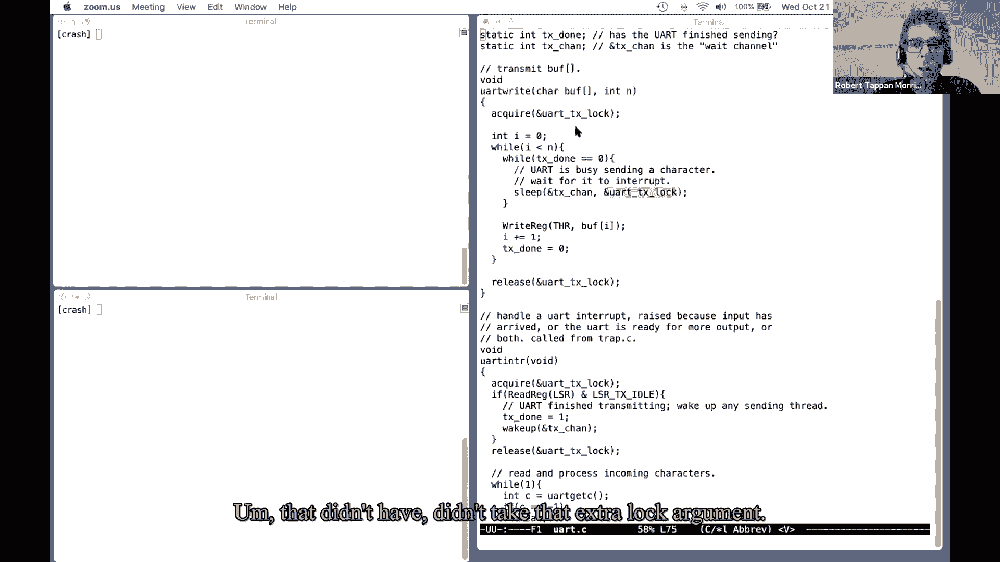

# 课程 P12：Lecture 13 - 睡眠与唤醒 🛌⏰

在本节课中，我们将要学习操作系统中的核心协调机制——睡眠与唤醒。我们将探讨为什么需要这种机制，如何实现它，以及如何避免一个常见但棘手的问题——“丢失的唤醒”。我们还会了解进程如何优雅地退出和被终止。

## 概述

上一节我们介绍了线程切换的机制和约束。本节中，我们来看看当线程需要等待特定事件（如I/O完成或数据可用）时，操作系统如何协调它们。睡眠与唤醒是解决此类协调问题的基本工具。

## 1. 线程切换的要点回顾

在深入睡眠与唤醒之前，有必要回顾一下线程切换的两个关键约束，它们对设计协调方案至关重要。

*   **持有进程锁**：在xv6中，当一个线程调用 `switch` 切换到调度器线程时，它必须持有自身的进程锁（`p->lock`）。调度器线程会在切换完成后释放这把锁。这确保了在切换过程中，其他核心上的调度器不会误认为此线程可运行并尝试执行它，从而避免两个核心使用同一个线程栈导致的崩溃。
*   **禁止持有其他自旋锁**：线程在调用 `switch` 时，除了自身的进程锁外，不允许持有任何其他自旋锁。这是为了防止死锁。例如，假设只有一个CPU核心，进程1持有锁A并调用 `switch` 让出CPU。调度器选择进程2运行，而进程2也试图获取锁A。由于锁A被进程1持有，进程2将在自旋等待中永远阻塞，无法让出CPU，而进程1也因无法被调度而无法释放锁A，系统就此死锁。即使在多核机器上，也可能构造出类似的死锁场景。

## 2. 为什么需要协调机制

锁非常适合保护共享数据，确保线程互斥访问。但在某些场景下，线程需要**主动等待某个特定事件发生**，而不仅仅是互斥访问。

以下是需要协调的例子：
*   **管道读写**：读进程在管道为空时需要等待写进程写入数据。
*   **磁盘I/O**：进程发起磁盘读请求后，需要等待磁盘操作完成（这可能需要毫秒级时间）。
*   **等待子进程**：父进程调用 `wait` 系统调用，需要等待其任意子进程退出。

在这些情况下，线程需要一种机制来**让出CPU**，直到它所等待的事件发生。简单地“忙等待”（循环检查条件）会浪费CPU资源，尤其是在等待时间较长或不确定时。

## 3. 睡眠与唤醒接口

xv6（以及许多Unix系统）使用 `sleep` 和 `wakeup` 这一对原语来实现协调。

*   `sleep(chan, lock)`: 使当前线程在通道 `chan` 上睡眠。`chan` 是一个任意值（如地址），用于标识等待的事件。调用者必须持有保护睡眠条件的锁 `lock`。
*   `wakeup(chan)`: 唤醒所有在通道 `chan` 上睡眠的线程。

其基本使用模式如下：
1.  线程检查它需要等待的条件（例如，`uart` 发送完成标志是否为1）。
2.  如果条件不满足，线程调用 `sleep`，并传入一个标识事件的 `chan` 和保护该条件的锁。
3.  当事件发生时（例如，在中断处理程序中），另一段代码设置条件（例如，将完成标志置1），并调用 `wakeup(chan)`。
4.  睡眠的线程被唤醒，重新检查条件，并继续执行。

## 4. “丢失的唤醒”问题

一个看似直接的 `sleep` 实现可能会引入一个严重问题：**丢失的唤醒**。

考虑以下有缺陷的流程：
1.  线程A检查条件（如 `done == 0`），条件不满足，**准备**调用 `sleep`。
2.  在线程A**即将调用 `sleep` 但尚未调用**的瞬间，中断发生。
3.  中断处理程序将条件置为真（`done = 1`），并调用 `wakeup`。
4.  由于此时线程A还未标记自己为睡眠状态，`wakeup` 找不到任何线程来唤醒。
5.  中断返回，线程A继续执行，调用 `sleep` 并进入睡眠。
6.  现在，条件已满足，但唤醒已经发生过了。线程A可能永远无人唤醒。

问题的关键在于：**释放保护条件的锁** 和 **将自身标记为睡眠状态** 这两个操作必须是原子的，不能被打断。

## 5. xv6的解决方案

xv6的 `sleep` 函数通过其接口设计巧妙地解决了这个问题。关键在于 `sleep` 要求调用者传递保护条件的锁。

以下是 `sleep` 函数内部的关键步骤：
1.  **获取进程锁**：`sleep` 首先获取当前进程的锁 (`p->lock`)。
2.  **释放条件锁**：然后，`sleep` 释放调用者传入的条件锁 (`lk`)。
3.  **设置睡眠状态**：接着，将进程状态设置为 `SLEEPING`，并记录睡眠通道 `chan`。
4.  **调用 `sched` 切换**：最后，调用 `sched` 让出CPU。此时，进程仍持有自身的进程锁 (`p->lock`)。
5.  **被唤醒后**：当 `wakeup` 发现此进程并试图唤醒它时，必须获得该进程的锁 (`p->lock`)。由于进程在睡眠时仍持有此锁，`wakeup` 会在此阻塞。
6.  **重新获取条件锁**：当睡眠进程被调度重新执行时，在 `sleep` 函数返回前，它会**重新获取**当初传入的条件锁 (`lk`)。

这个设计保证了从“检查条件”到“进入睡眠”的原子性：
*   在调用 `sleep` 时，调用者持有条件锁，因此 `wakeup` 不可能在此时执行。
*   `sleep` 在释放条件锁**之前**，已经获取了进程锁。因此，即使条件锁被释放，`wakeup` 可以执行，但在获取目标进程锁时也会被阻塞，直到该进程完全进入睡眠状态。
*   这样就关闭了“丢失的唤醒”可能发生的时间窗口。

## 6. 进程退出与终止

进程的生命周期结束涉及两个系统调用：`exit`（主动退出）和 `kill`（终止其他进程）。

### 6.1 进程退出 (`exit`)

进程调用 `exit` 时，并不能立即释放所有资源（如内核栈），因为它还在使用这些资源执行退出代码。因此，`exit` 的主要工作是：
*   关闭打开的文件。
*   将子进程过继给 `init` 进程。
*   将自身状态设置为 `ZOMBIE`，并唤醒可能在 `wait` 的父进程。
*   调用 `sched` 让出CPU，不再运行。

**父进程的 `wait` 调用是资源释放的关键环节**。`wait` 会查找处于 `ZOMBIE` 状态的子进程，并调用 `freeproc` 来最终释放该子进程的内核栈、页表等资源，将其状态置为 `UNUSED`，以便后续 `fork` 重用。因此，在Unix中，每个退出的进程都必须有一个对应的 `wait` 来“收尸”。

### 6.2 进程终止 (`kill`)

`kill` 系统调用并不会立即停止目标进程。因为强行停止一个正在内核中执行（可能持有锁或更新复杂数据结构）的进程是危险的。

`kill` 的实现相对温和：
1.  它只是设置目标进程的一个 `killed` 标志。
2.  如果目标进程正在睡眠，则将其状态设为 `RUNNABLE`，使其能被调度。

目标进程会在**安全的时机**检查自己的 `killed` 标志，然后主动调用 `exit`。这些安全时机包括：
*   从系统调用返回用户空间之前。
*   在陷入内核时（如处理中断）。
*   在某些 `sleep` 循环中醒来后（如管道读取），会检查 `killed` 标志。

对于某些不能中途退出的操作（如正在进行的文件系统磁盘操作），其 `sleep` 循环不会检查 `killed` 标志，以确保操作完整性。

## 总结

本节课中我们一起学习了操作系统中关键的线程协调机制。我们了解了为什么简单的忙等待不可行，以及 `sleep` 和 `wakeup` 如何提供一种让线程等待事件并让出CPU的方法。我们深入探讨了“丢失的唤醒”这一经典问题，并分析了xv6如何通过精巧的锁协议在 `sleep` 接口中解决它。最后，我们探讨了进程如何通过 `exit` 和 `kill` 结束其生命周期，理解了资源释放的协作过程以及安全终止的重要性。协调机制和锁一样，是编写正确并发代码的基础工具。