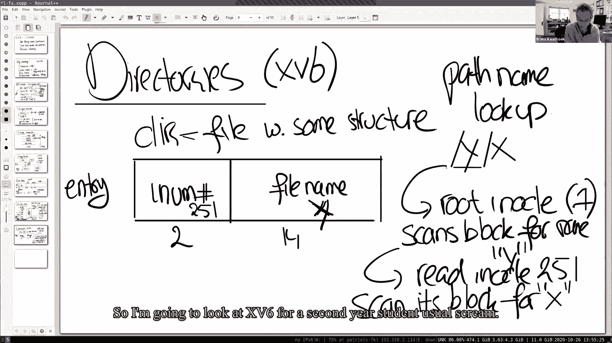
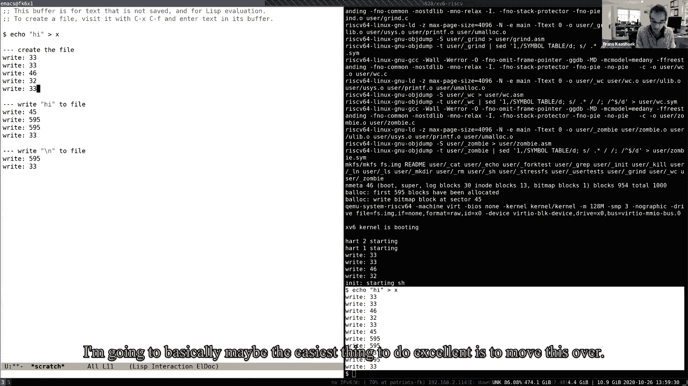
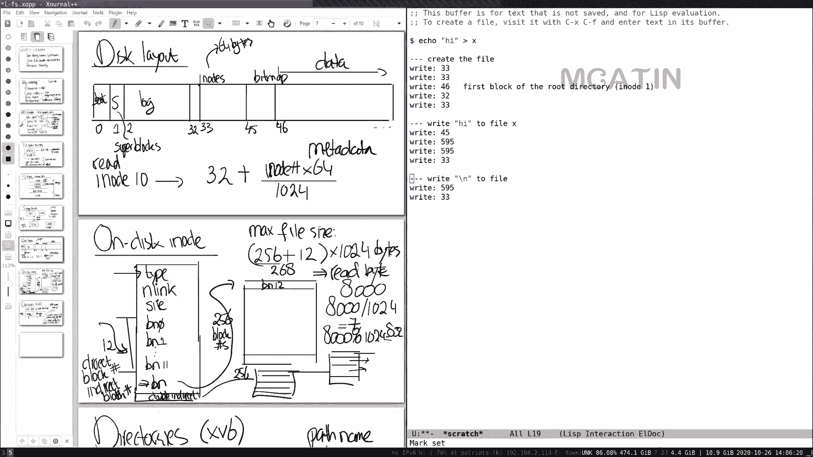
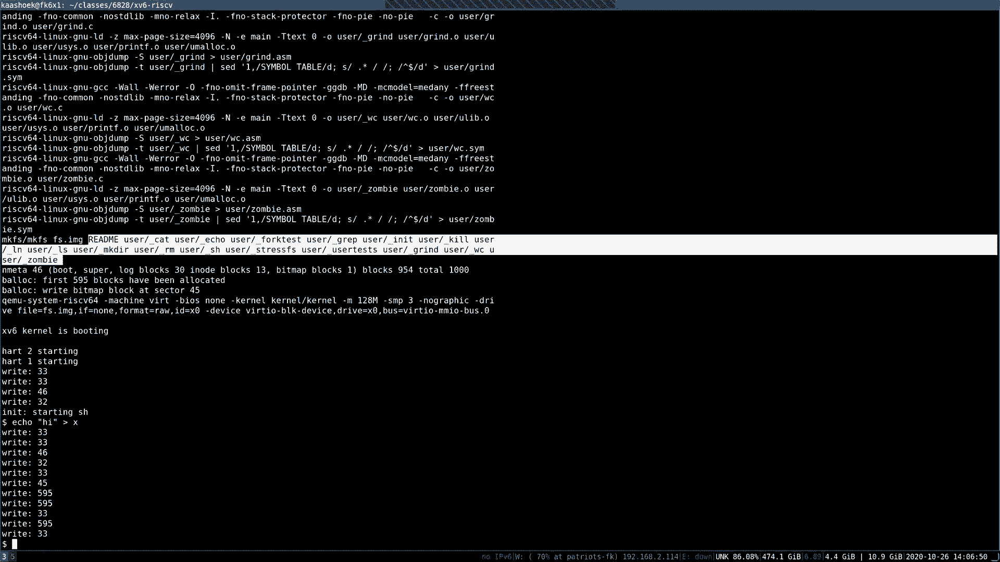
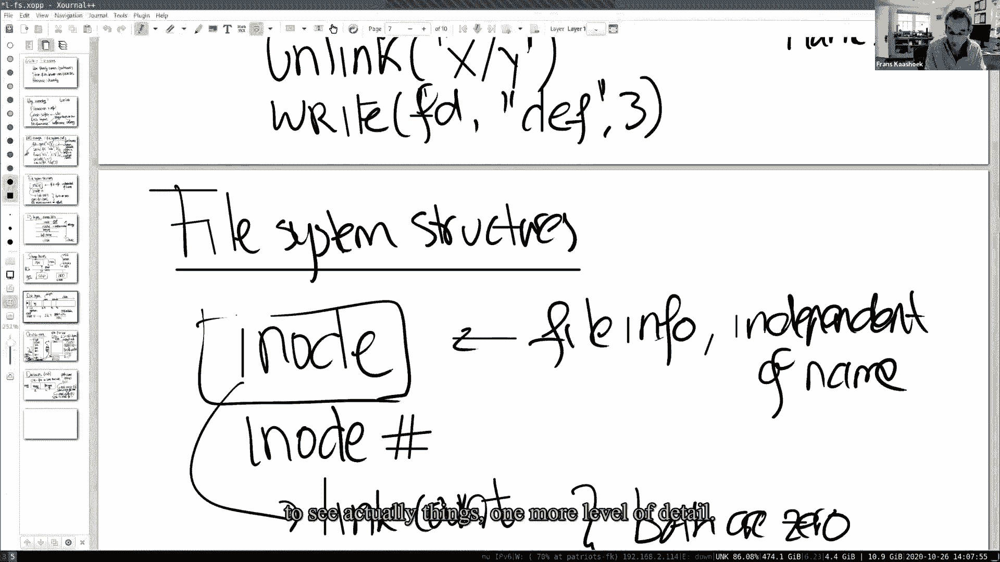
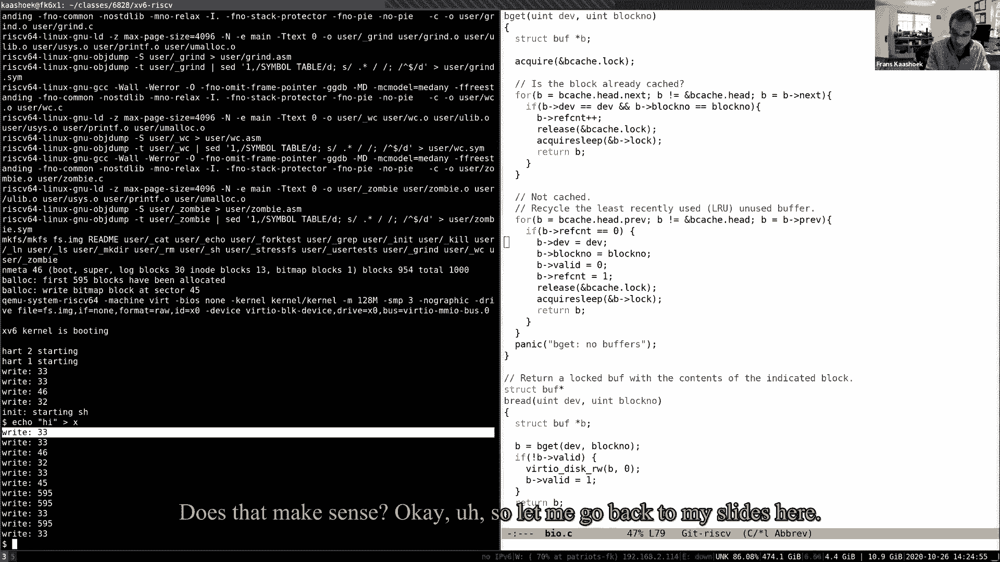
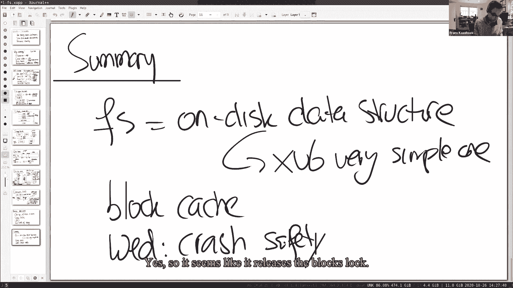
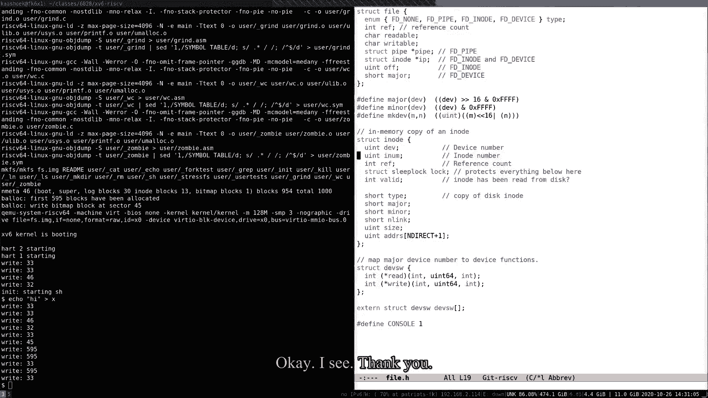

# P13：Lecture 14 - File Systems 英文版 - MCATIN-麦可汀留学 - BV1rS4y1n7y1

 started and everybody can see my screen that I shared and I hope everybody can hear me。

 Let me think we're good。 Yeah， okay。 So I'm going to talk about file systems today。

 It's going to be actually going to spend three lectures on file systems， two in the context of。

 xv6 and one in the context of Linux。 In fact， this is the last topic that we're covering。

 of xv6 after this week。 We're basically done with xv6。 So， you know， file systems， you all。

 know them， you use them。 They're one of the most sort of user-facing aspects of an operating system。

 in an industry into the shell and so we sort of want to understand now and the。

 detail of lectures actually what really happens on the do-hoots and how a file system is implemented。

 and that's sort of exciting because you use them all the time。 And maybe you're just。

 start off as a question before diving in any of the details。 In one way， you know， since you use。

 file systems almost daily， in one way is the xv6 file system different than the file system that。

 you're using in a day-to-day work。 Maybe I'll call out some people and see what they think。

 for example， Kendall with a Kendall Garner。 Did you notice anything particular about xv6 that is。

 different or similar？ I'm not sure we can hear your Kendall。 No， there we go。 Yeah， there we go。

 Okay。 So， one of the problems is size or at least like the size of。

 the files that xv6 uses for it are much less than a lot of other file systems。 Also the names for。

 some files are relatively short。 And another feature it's more to use because I use better first is。

 it doesn't， I don't think it has a copy on right for its file systems。 Very good。 In one way。

 it's similar。 It's similar in the general structure。 So， the idea of you have， file names。

 you have the i-nodes directories and all that。 Yeah， that seems good。 And how about， Adela and Yang。

 How are you？ I'll be comparing xv6 file system to the file system that you use。 Sorry。

 what was that？ The question is how would you compare the xv6 file system to the file。

 system that you might be using in daily life or find your laptop or whatever computer you're using？

 Similarities。 Yeah， like they're the file system path system like paths in the file system。

 are like hierarchical。 Yeah， that's a good point。 Okay， so， you know， so let me。

 sort of dive in a little bit and sort of talk a little bit about properties of file systems。

 that you know， sort of stand out。 And one， I think， you know， you just mentioned here。

 but now it's a user friendly names in particular path names， you know， hierarchy to help， you know。

 people to organize their files in directories or folders， whatever term you want to use。

 And it makes it easy for， you know， people to share files， between users and processes。

 You can name them with conveniently to remember names。 And then probably most importantly。

 compared at least for all the subsystems that we've looked so， far in xv6。

 and it provides persistence。 Or something called durability。 With that， I mean。

 like if you turn off your computer， you know， you did some work， you turn。

 off your computer and you're turning off your laptop。 And then， you know， a couple days later。

 you come back and turn your computer on。 The files are still there。

 And if you continue working with them， which is sort of different from like processes or the thing。

 the resources that we've seen so far， which are basically， you know， the computer reboots， you know。

 they're gone。 And you have to start it， again， but file systems can provide this persistence。

 And so there， you're， all of you are using them， and what we're going to be doing in the next couple lectures are actually understanding how to。

 actually work internally。 This is interesting for a number of reasons。 One， you know。

 the abstraction itself is just useful。 And so it's interesting to understand， like。

 under the words actually how the abstraction， is actually implemented。

 And it turns out there's sort of a couple key interesting aspects。 One， is crash safety。

 You would like it to be the case that， you know， if， for example， during the， file system operation。

 the computer crashes， that after reboot， you know， basically your file， system is still intact。

 You know， the， you know， all the variants of the file system still hold。

 and that you can actually get access to both of your files。 It would be a disaster if， like。

 the computer crash in the middle of file system operation， you reboot， and there's no file system。

 anymore， or， you know， the data structure on disk kept in garbled， and you lost it。

 So this is actually turned out to be a really important topic involved。 And so we're going。

 to talk about that on Wednesday。 This is basically the main topic for Wednesday's lecture。

 Then there's sort of the general question about， like， how to lay out the file system on disk。

 The files， the files， the directories， they all have to be represented in some way on the disk。

 because， like， after you shut down your computer， you can back up， you know， all the data still has。

 to be there。 And so there's some data structures to represent the structure of the file system。

 or the content of the file system。 In， in X86， of course， you know， that representation or that。

 data structures used are quite simple， you know， just do for pedagogical reasons， and real file。

 systems use more complex data structures。 But you just think about this as on this data structures。

 And so we'll see a lot of that in today's lecture。 And then finally， what makes it interesting is。

 performance。 The devices， typically in which， you know， file systems are stored， you know。

 storage devices are typically slow。 Meaning example， to read a write a block， you know， on an， uh。

 solid state disk， you know， SSD disk， and then I said， boy， I'm gonna order a millisecond。

 And so in the millisecond， you're gonna do a ton， of ton of work。 And so it's important that。

 you know， you try to avoid going to disk。 And you'll see， that in multiple ways。 So we see that。

 for example， all the file systems will have something of a buffer， cache or a block cache。

 And you'll see it in， you know， basically， additional forms or more， concurrency。 So for example。

 if you do a path named lookup， then that typically is an involved。

 operation required to sending the directory hierarchy， you know， looking up blocks in， or， you know。

 directory， find the file name in the directory， then go to the next directory， etc。

 And you want it to be the case that if like one process is doing path name lookup， another process。

 can sort of run concurrently or in parallel with the first process doing a path named lookup。

 And so we'll see that sort of concurrency， you know， shows up again as a big topic in the context。

 of file systems。 The other reason why it's interesting is it's going to be the topic of two labs。

 So we're going to have the next upcoming lab is completely focused on file systems。 And the。

 lab after that is a combination of virtual memory and file systems。 And even the lab for today or。

 this week， right， has a component trying to make the buffer cache more parallel。

 So that's why it's interesting。 And， you know， just to sort of get off the ground。

 to understand like what the file system must provide， just let's look again at the basic。

 file system system calls， right？ So the， API example， we're looking at that， you know。

 API or these file system calls， then we can sort of do there's a couple of interesting properties that must be true about the。

 implication。 And so the， you know， the file system calls， we've seen them early on in the semester。

 And， you know， we've looked at most other uni-system calls。

 how do we implement it like fork and exec， pipes， all that stuff。

 And basically this set of lectures， is really focusing on like how to implement the file system calls。

 So first of all， let's， start up， you know， this implication， let's look at a simple scenario。

 We have， you know， say， we create a file x， y， or a file y in the directory， x， you know。

 the way the problem we have to， it's not the right thing。 In the file x。

 we have to provide some flags， we don't really care about their flags， so I just can ignore them。

 So this will create a file， return a file descriptor， to the caller， and then the caller。

 the user application， can then actually， for example， write， you know， to that file descriptor。

 as we've seen many times before， there's a write， Fd， maybe A， B， C， you know， three characters。

 And one thing's actually， again， already a couple of things that we can point out， right。

 when these two calls is the first of all， the path names， that show up in the interface。

 and then we're going to have to implement， names are human readable， they're not numbers， you know。

 they get selected by the user。 Another interesting thing here is that in the write system call。

 there's no offset as an argument， so the offset is implicit。

 so the file system somewhere must store， you know， the offset， if you do a second call to write。

 correct， because we'll end up at， you know， the next set of bytes we'll read in that location four。

 You know， so maybe some more interesting calls that we haven't looked at much， but， you know。

 for example， you know， the XV6 and all unit file systems。

 basically support calls to create links to have multiple names for the same file， for the same file。

 so for example， you might call a call like link that basically creates a second。

 name for the original file， so for example creates a name Z for the file Y that we earlier created。

 So multiple names， the file system probably internally has to keep track， you know。

 in some way that multiple names， might be pointing to the same file， you know。

 we might actually remove or change names space， while the file is open， so for example。

 why we could call， you know， user might actually call， not a processor。

 the same processor might call a link， you know， to remove a particular file， and in fact， you know。

 that we'll remove the file X or Y that we actually opened earlier。

 but we still have a file descriptor open， and so in fact， you know， we can still write to it。

 So we can still write to FD， you know， for example， the character， whatever， D， E， and F。

 and that actually works out fine。 So basically while， you know， a file was in use， you know。

 the name space that sort of surrounds it， you know， could actually be changed。

 And so it has to be the case， you know， if you sort of look at， this， you know。

 instead of things that there are a bunch of interesting things going on internally in。

 the file system， for example， the file system， the file descriptor must be associated with some。

 you know， object that is independent of the name， right， you know， because， you know， even if the。

 name changes， you know， the file descriptor still points or， you know， references the same file。

 object itself。 And so in fact， you know， if you think about this， it has to be the case that。

 basically there has to be some internal representation of， you know。

 the file inside of your operating， system that's independent of the name itself。

 And so we're going to look at that in a second， but there's one other sort of point I wanted to make here is。

 you know， the goal of the file， system is to be implemented in API like the ones that we're looking here。

 which is a sort of， typical file system in API。 Now。

 this is of course not the only way to be able to store。

 a system or going to store the information on disk， you know， we could imagine completely different。

 APIs。 And， you know， for example， you know， maybe， you know， a database， right， you know。

 stores and data persistently， but access to the data in the。

 and provide a very different programming， or API or user API， then a file system does。

 And so it's important to keep in mind that， you know， you know。

 there are other ways of organizing a storage system。 So where our focus is going to be。

 on a file system， which is typically provided by an operating system。 And databases are typically。

 implemented in top of the file system or in almost to work around， you know， the file system。

 that can have direct access to to disk。 We have two questions in the chat。 Yeah。 Yeah。

 There's been asked any questions。 So link increments of reference to the underlying。

 file descriptor and link be correct。 That's correct。 We'll talk a little bit more about it later。

 Another question here is about soft links versus heart links。

 Probably not going to talk much about it today， but you won't be implementing soft。

 links in the next in the file system lab that is upcoming。 So xv6 by itself implements heart。

 links and then you will implement soft links in addition。 Any questions？ Other questions？

 Link operates on the i-nodes not on the file descriptors， right？ That's correct。

 Link and then we're going to work on the i-nodes。 So let me， since let's go there。

 So file system structures。 So what structures does the file system maintain to implement this API that you're。

 just talked about？ So first of all， you know， the most important part is the i-node。

 And so this is the object of represents a file independent of the name。 So file info。

 independent of the name。 And in fact， you know， the way， you know， you name actually an i-node is。

 by an i-node number， which is literally an integer。 So the process， mean， terminally。

 refers to i-node by a number instead of， like， by path names。 And we also know。

 this is based on the discussion， you know， the i-node must actually have a link count。

 to keep track of the number of names that are pointing to that particular i-node。

 And the files should only be deleted， you know， when the link count actually reaches zero and no。

 earlier。 It's actually slightly more complicated。 There must be also an open。

 fd count in a number of file descriptors that actually have the file open。 And a file can only。

 be deleted when both of these are zero。 We also know that they're basically based on， you know。

 the writes have no offset nor does reach， you know， that the file descriptor implicitly。

 must maintain an offset。 Okay。 And so basically the central wheelie data structure in a file system is the i-node and then。

 the file descriptor to actually interact， you know， with processes。 So， you know。

 like the file systems are very similar in terms of sort of their API， you know。

 they're all implemented differently。 But many of them have sort of a similar structure。

 And because the file systems are quite complex， you know， just helps to sort of organize them。

 and they're typically organized in a sort of set of layers。 And， you know， what I mean to think。

 about it is that at the very bottom there's the disk， you know， some storage device that actually。

 holds， you know， the data and actually provides the persistence and durability。 Typically， you。

 know， there's something like a buffer cache or block cache right above it。 So to avoid， you know。

 going to disk many times。 So we're going to cache basically data inside in memory。 So this。

 is going to be basically， you know， memory。 And this is， you know， the device。 For persistence。

 there's something typically involved with logging layer， you know， many files。

 system have a form of logging。 We're going to talk mostly about it Wednesday， so I can skip that。

 Then in the top of the largling， in our， in BCN-XV6， there's an eye cache or an eye node cache。

 This is mostly for synchronization。 That's what we'll talk about a little bit later。

 So an eye node is typically smaller than a disk block and then the eye nodes are packed into。

 a single disk block that's basically provides synchronization to those individual eye nodes。

 You know， actually six maintains an eye cache。 And then typically that， you know， we're going to。

 there's an eye node implementation itself， you know， that sort of ranges for region rights， bytes。

 And then， you know， on top of that， we have names， like path names， and file descriptor， operations。

 And whenever you file system， you slightly different organized and the layers may be slightly。

 different。 And maybe layering is not always that strict。 And even in actually six， it's not always。

 super strict。 But it's a good way to think about it。 And almost all file systems have。

 components in their file system。 There's correspond to the different pieces， you know。

 the buffer cache， the logging， to the eye nodes， and to path names。

 And so we're basically going to work my crew a little。

 bit through these different file system layers。 Let me talk a little bit of starting with。

 the bottom layer。 Yeah， okay， let's just looking at the chat。

 So let me start with the talk a little， bit about storage itself， storage devices。

 It turns out there are many， many， many different types of， storage devices。

 And the differences are in performance， you know， capacity， the degree of， durability。

 But two of the common ones are you're probably all familiar with， you know， SSD， and there may be。

 you know， some people may still need using hard disks or magnetic disks。

 And they provide a ton of storage， reasonable cost in the different performance。 So SSDs have。

 typically in the order of like hundreds of microseconds， milliseconds， access time。

 while magnetic disks tend to be more in the order of 10 milliseconds to individually read。

 or write a block。 The terminology is actually slightly confusing here， you know， the terms sector。

 are being used blocks。 And so in sectors is typically the historically the sort of。

 small-age unit that disk drives can read or write in。 And so you should be typically 5。

 and 12 bytes， which is the common number。 The block size is basically where a block is basically。

 an OS or a file system idea or defined by the file system。 And in actually six， for example。

 it's 524 bytes。 And so it's two sectors。 So typically the block size is one or more sectors。

 Sometimes， you know， people refer to the sectors on disk also as blocks。 And so， you know。

 the terminology is not particularly precise。 So these devices， you know， basically sit， you know。

 on some bus and other buses， you know， connected to CPU， right？ You know， there might be memory on。

 the side here。 There's maybe multiple CPUs。 And instead file system runs on， you know， the CPU。

 stores its internal data structures in memory and basically reads and writes， you know， to。

 to the SSD or to the hard disk to actually write a block or read a block。 And so we actually。

 the interface is quite simple。 So it's typically just read， you know， or write with block number。

 And there's a little bit of oversimplification， but like the core of the interface is roughly that。

 And internally， of course， the SSDs and the AMD hardware were completely differently。

 But the hardware， extracts are mostly away。 And typically。

 they're sort of a standard protocol like PCI or PCI extended。

 And the processor or the file system uses or the disk drivers used to actually talk to， disks。

 And often from the disk driver， you know， most disks sort of look the same。 And you can just。

 read and write them， you know， by providing a block number and some data and then， you know。

 send it， off or write it to the control of it or search， you know。

 the device and then the device actually， will do its job。 So this from a file system perspective。

 although， you know， the disk have， quite the storage device of quite different properties。

 they're actually from the driver， perspective， you know。

 they're sure you can program it in roughly the same way。 Any questions about that？

 I'm not going to talk much about the storage device。 So if you have any， questions， please。

 a really good time to ask them。 Yes， I have a question。

 Is the interface for calling read or write something that offers。

 synchronous and asynchronous options？ Yeah。 Often， there's the case of factors in generally， like。

 it's almost very similar to actually basically you think about the driver for a disk in the same way。

 as the console driver， where the CPU or the driver issues to command to the device。

 this will say start read or do write。 And then at some point later， when the device is done。

 it will generate an interrupt saying like， okay， I did the read or I did the write。 And then， you。

 know， that indicates the completion。 And， you know， of course， the driver， you know。

 since this device， is more complicated than the console， you know。

 it's quite a bit more complicated driver than， the console driver that we saw in the previous lectures。

 This is basically the same structure， you know， bottom half， top half， interrupts。

 and reading a write into controller addresses。 Okay， thanks。 Okay。

 so from the final system perspective， the way you to think about the disk is。

 pretty straightforward。 Since there's a read or write of walk or sectors。

 we could just think about the disk as this will be gigantic， you know， array of walks， you know。

 starting at， you know， whatever， zero， one， and going up to whatever decides what the disk is。

 And basically， the file system's job is to sort of lay out all the data structures on the disk in。

 the way that， you know， it can reconstruct， you know， the file systems and after reboot。 And so。

 you know， there are different ways of going about it。 XV6， so we'll see。

 uses a very simple layout structure， but， but not completely unusual， not pretty typical in。

 or prototypical for how a file systems operate。 So typically the block zero is generally not used or it's used actually for the boot sector。

 so to boot the operating system。 One is often what's called the super blog。

 And the super blog basically describes， you know， the file system。 And I may say like， oh。

 there are so many blocks on disk and that constitute the file system。

 And we'll see in a second that in XV6， there's a little bit more information in it， as is in。

 most out of file system。 So for example， in XV6， the log starts at block two and runs into block 32。

 Yeah， so these are the log。 And of course， the log could be different size。 And in fact。

 in the super blog， it just says like， the log is 30 blocks log。

 Then XV6 after that stores from 32 to basically block 45， if I remember correctly。

 And storage i-notes。 And I said before， multiple i-notes are packed into a single disk block。

 I think an i-note is， I believe， I actually remember at the top of my head， but I think it's。

 either 64 bytes， 128， 64。 And after that， you know， there's a bitmap block。

 It turns out in the detailed way we built the file system is an XV6 block is one block in size。

 And so these basically keep track of actually the data blocks， whether they're free or not。

 And after that， you know， it's all from basically here to there。 It's all data blocks。

 So data blocks that actually store contents or files or contents of directories。

 Often all the bitmap blocks and i-note blocks in the logging block are often sometimes referred。

 to as metadata blocks。 Yeah， they don't actually store actually data， but they help。 You know。

 they store meta information for the file system to do its job。 Like big maps and i-notes。

 Any questions so far about this？ I have a question about the boot block。

 Does it contain the code for the operating system to， boot or something else？ Yeah， exactly。

 It takes the contains， you know， one block of code enough for the。

 operating system to get going and then load maybe more of the operating system actually from the。

 file system itself。 Thank you。 So does that mean that the code for xv6 is actually stored on like the virtual disk or is it like how。

 to。 The way we do the QMU， you know， we cut some corners。 And QMU actually has a flag， you know。

 dash kernel that basically points to the， where it boots the kernel from and loads， you know。

 that at a particular address into physical memory， at 0， 0， 0， 0。

 And so basically when we're using QMU， the way we're using QMU， we don't really have to worry about。

 boot sectors and anything like that。 Okay， so basically like when you run QMU。

 you just pass in like the program， through the command line and then it'll just run that。

 It doesn't need to like read it from the， virtual disk and everything。 Exactly。 That makes sense。

 Okay， so like， you know， so assuming that i-notes are 64 bytes， you know。

 so example now if you want to read i-notes 10， what do you do？ How do you read i-note 10？ Anybody？

 When which block will i-note 10 be？ You need to add。

 you take the i-note number and add the offset into the disk， so 10 plus 32。 Yeah， so 32， correct。

 And is it literally plus 10 or something else？ Is it 10 divided by this size？ Yeah。

 it's going to be whatever。 It's going to be the i-note number， right？ i-note number。

 multiplied times， let me do it in bytes， you know， multiplied by 64， directly divided by 524。

 So i-note 0 will end up in walk 32。 i-note whatever， 524 divided by 64。 16。 Yeah， 16。

 that's about right。 So i-note 17， where will it end up？ Should be in i-note， should be in block 33。

 correct？ Does that make sense？ So given the i-note number。

 we can always find the byte on disk where the i-note actually stored。 Okay。

 so then let's look at the what actually is in an on disk i-note。 So as we know before， you know。

 we'll see there's a basically little data structure， you know， 64 bytes in size。 And you know。

 typically it has a type which we'll talk about a little bit later， but for example。

 the type is file or directory， end link， you know， the link count， you know。

 to track if multiple names are pointing to the same i-note， a size in bytes。 And then in xv6。

 you know， there can be slightly different and different file systems exactly how。

 the representation is， but in xv6， a little bit more space。 In xv6。

 it basically is followed by a number of block numbers。 And so it has a block number 0。

 block number 1， the factors are 12 of those guys。 It's called 12 direct block numbers。

 And those direct block numbers basically correspond to the first， you know， 12 blocks to。

 constitute that file。 So for example， if the file was only two bytes long， you know。

 there would be only one block number 0。 And that block number 0 is the block number of the disk block that contains。

 you know， the first， you know， few bytes of that file。 And then there's one indirect block number。

 And basically that's a block number that corresponds to a block， which then itself， you know。

 a block is 5 to 24 bytes， you know， which holds， two and the 56 block numbers。

 So if block number 0 for block number 11， are all direct block numbers。 And so then block number 12。

 you know， you store it in that， indirect block that basically is pointed to by， you know。

 the indirect block number。 And that is basically the layout of the file in xv6。

 And so what is the maximum file size in xv6 based on this？ Anybody？ It would be 268 times 1。

024 bytes， basically。 Yeah， right。 So it's just 256 plus 12， the 12 direct times 2024。

 And then we get the maximum file size in bytes， right？ How much is that？

 There's like another way of saying it's basically 268 kilobyte， correct？

 What can you store it in 268 kilobyte？ Can you store a video in it？ Where's song？

 If it's a short song， yes。 Very short song， correct？ So these are really， really small， file size。

 correct？ Like a real file size， much， much， much bigger file size。 So what would you。

 be able to do during file size and representation to make this to a lot of the file size than。

 being much， or file size to be much bigger？ Do you extend the indirect portions？ Yeah， for example。

 you could have another block sitting here below， correct？ Which is maybe double， indirect。

 Almost like， you know， the page table type data structures that we've seen before。

 And that double indirect points through 256 indirect block number， each which point to another。

 block number， right？ And so suddenly the file size is going to， the maximum file size is much。

 bigger。 And basically， just to start out to be just sort of an exercise in on this data structure。

 you could pick a like a structure like this， like a tree， but there's also possible to maybe。

 implement as a V tree or something other sophisticated。 Now， actually， six， though。

 something extremely， simple。 And basically， sort of model after the original version six units。

 you're next。 But you can implement more sophisticated schemes。 In fact， in the file system lab。

 you will， implement double indirect block number， so to support much bigger files。

 Any questions about this？ Sorry， so is it 256 blocks because it's like one block as a whole？ Well。

 this is an indirect block number， but it doesn't count。 So there's 256 sitting in this。

 indirect block was 12 direct block numbers that makes it two in the 68。 Oh， sorry。 My question was。

 why is it 256？ Oh， because it's a block number is four bytes， probably。 So。

 1024 divided by four is 256 entries。 Okay。 Thank you。 Which is also a little bit ridiculous。

 correct？ If a block number is only four bytes， how big， can this be？ Anybody？ Yeah。

 two to the power of 42， right？ Some things are bigger than that。 So， typically。

 people use larger sizes for block numbers than 32 bits。 Okay。 Any questions for the questions？

 For the max file size， could you could you help？ Could you explain that again？ Like， okay， sure。

 Could each block in the could each block in that's referenced by the indirect block。

 could that also， point to more blocks？ If that makes sense。 Well， in the default XV6 design。

 that's not the case。 Basically， there are 12 block numbers， 12 direct block numbers。

 and 256 indirect block numbers， and nothing more。 And in the next lap。

 you'll be adding a doubling direct block to the i-note。 So。

 you will take one of these B&L leavens and turn that into a double indirect。

 And that double indirect is going to point to， basically， has going to have two in the 56。

 indirect block numbers， which itself then point to blocks。 And that way。

 it can be substantially bigger。 Oh， okay。 Thanks。 Okay。 So now， let's say。

 we want to implement the read system call。 And basically， we start from the operating system boot。

 get once to read， say byte， read， byte， 8 thousand。 How would you， which block would you read？

 Which block will contain， basically， byte， 8 thousand？

 How would you compute or how would you look up， you know， giving this data structure。

 this extremely simple data structure？ How would you compute the actual block number that。

 or find the block number that contains byte， 8 thousand？ Anybody？ Do you just subtract。

 first of all， subtract the number of bytes in the first 12。

 direct blocks and then see what the offset is in the indirect blocks？ Yeah。 So， okay。 So。

 in case of 8 thousand， just what we will do， correct？ We'll divide it by。

 thousand 24 because that's the block size。 And that is seven， right？ And so， what that means。

 basically， the seventh block actually has the seventh entry in this， direct block number。

 has the block number that contains， you know， byte， 8 thousand， correct？ So， BNN seven。

 whatever number is there is the block number that contains with this particular file， byte。

 8 thousand。 And to actually find out exactly where that byte is inside of that block， you know。

 basically， we have to compute 8 thousand， microlow， about 24， which is probably， I think， is 832。

 Okay。 So， basically， to read， byte， 8 thousand， you know， the file system looks at the i-node， well。

 takes the byte number， divides it by thousand 24， indexes into， sees if it falls below 12。

 then there's a direct block number， and just picks up the direct block number from the i-node。

 reads that block， and then fishes out， you know， the 8 thousand byte by computing 8 thousand divided by。

 the byte， micro， 1024。 And so， it will give us an offset of 832， and that's the location for， byte。

 8 thousand， that's a file。 Okay。 So， basically， this is enough information， again。

 the thing to conclude from this is， like， there's enough information here now to actually。

 implement， you know， read and write system calls， at least to find out which disk walks need to be。

 written， written， written in response to a read or write system call。 Okay。 So。

 let me talk a little bit about directories。 One of the cool things about， you know， file systems。

 where you have a hierarchical name space， and you can store a store symbolic user-friendly names inside of a。

 inside of a， inside of the file system。 And the interesting aspect， actually。

 one of the cool design features of the， you know， multi-view unit file systems， actually。

 does a directory is basically a file， except a file with some structure。

 that the file system understands。 And the fact in xv6， you know， the structure is extremely simple。

 Every directory consists of directory entries。 And every entry has a fixed format， namely。

 it contains an i-note number in the first two bytes。 And it contains the file name。

 in the remaining 14 bytes。 And so the total thing is 16 bytes。 And this is enough information。

 you know， basically for， you know， to actually implement a path name lookup。 So for example。

 just to make it clear， let's say we want to look up， you know， the path name， y， x。

 how will you go about doing that？ So， well， you know。

 this path name indicates that we have to start at the root i-note。

 And it turns out that the root i-note basically has a fixed， you know， is a fixed i-note number。

 The root i-note number has a pre-agreed fixed i-note， a number， and in fact， in xv6。

 that number is one。 So how can we find the root i-note number？ You know。

 we go back to our earlier picture， correct？ If it's number one， you know， we know that， you know。

 i-note started at block 32， so it must be infinity block 32。 And so it's the， byte 16 to whatever。

 sorry， byte 64 to 128 in that first block that contains the， root i-note number。

 And so the file system can just read the root i-note number。 Okay。

 And then basically the way you path name lookups and works is just against the blocks。 [pause]， Now。

 before， you know， the name， why？ So the file system basically goes through。

 reads the blocks of the i-note file i-note 1， one by one， and just looks， can afford the data of。

 those blocks， whether the string y appears。 And how can it find all the blocks of the i-note 1？

 Well， just can look at the， it reads the bn0， the first block， you know， sees if x is in that。

 you know， if it's not， it will read the second block， etc， etc。 And so hopefully at some point。

 either it finds it or it doesn't find it。 And if it finds it， say let's， we find file x。

 in the directory， you know， it's going to have some i-note number， say， 251。 And then we can just。

 proceed from there， right？ We can say it's like， well， okay， we're going to now read， you know。

 block number， you know， read i-note 251 and scan its blocks for， okay， here's some。

 did my example wrong。 This was y and it's going to get its blocks for x。

 And that dream was going to find us， you know， so my note number again。

 then we'll return that as the result of the path name look up。 Any questions about this？

 What you saying， is this a house？ Yeah， go ahead。 Yeah。

 so this is the layout of the directory in the， disk。

 But is there some bits somewhere in the metadata blocks that indicates whether the current。

 thing is a directory or a file？ Yeah， it's actually in i-note。 So the type of the i-note says where。

 it's a directory or file。 So if you do look up on an i-note that actually happens to be a file。

 then actually the file system will return an error。 I see。 Thanks。 Okay。 Now。

 clearly this structure is not particularly efficient to actually find a directory name， you know。

 you have to scan。 And so a real file system， you know， probably would use more sophisticated。

 data structures to actually make these look much faster than xv6 does。 But again。

 it's sort of almost， you know， more design or question of data structures than that。

 is a question of operating system design。 And so you could plug in your favorite data structure。

 and turn it into an undist data structure， and then hopefully you're going to get better performance。

 But for simplicity and easy explanation， you know， xv6 uses a very simple structure。 Okay。 Okay。

 so what I want to do next is going to get a little bit more concrete feel for this。

 and just to see actually how things work out in practice in xv6。 And this will be helpful， you know。

 for the next lab。 So I'm going to look at xv6 for a second。 Here's the usual screen。

 So the first thing I'm going to boot xv6 again， as always， and I did make clean。

 And as you probably， remember， many of you have run into this， you know。

 if you want actually new file system， you have to run may clean。

 because then make you will build you a new clean file system。 So here we go。

 And we'll see that xv6 has started。 But the thing I want to point out first is here。

 here you'll see there's a call to basically make a file system。 So this makes a fresh。

 disk image and in a disk image， you know， contains， you know。

 a bunch of files that we specify in the， command line and make it as basically built to your new file system that contains those files as。

 the contents of the file system。 And you can see， you know， the xv6 always brings out a bit of。

 information about the file system。 So it basically says there are 46 meta blocks， you know， that。

 includes the boot block， the super block， the 30 block blocks， 39 out blocks， one big map block。

 and then followed by 954 data blocks。 So it's a tiny file system in total of only 1000 blocks。

 And one of the things you will do in the lab for support bigger files， you also will have to use。

 a much bigger file system。 Then I modified xv6 slightly to the right or print something whenever。

 right to a particular block。 So for example， we see a couple of file system call， the xv6 when。

 it starts up， does a bunch of files and calls， and apparently wrote， you know， block 33， 43， 46。

 or 32。 And now we're going to run basically command， and we're just going to see what block numbers。

 are being written by the command， or as a call as a document， and we're going to try to understand。

 where do those what where do those rights make sense， what we expect to see if that went to be。

 to see what is happening is what we actually expect。 So we're going to create a file， echo-hide。

 and I'm going to create a file x。 And let me actually， copy that a little bit over so it can。

 delineate this。 I'm going to delineate it in a couple of places just where it helped for。

 understanding probably right here， and then probably here。 Okay。

 so basically it turns out there's going to be， a couple of phases here。

 One is to phase to actually create the file。 Then there's write the file， namely your right high。

 the file， and then you know one more right， right， actually the new line。 I do the file。

 So you look at the echo program， that is basically what it does。 Okay， so we can pick it up。

 This is for completeness， right， for echo。 Look at the arguments。

 write the arguments to file the script to one， and then at the end it depends， a new line。 Okay。

 so these are the basically the sequences of disc writes， you know， involved in each， operation。

 And let's see， look at that one-on-one and start to understand what's going on。 I'm going to。

 basically maybe the easiest thing to do actually is to move this over。

 Okay， so it's convenient to understand what's going on instead of looking at the code。 We're going。

 to just look at this disk layout and try to figure out what might be going on in these。

 particular operations。 Okay， good。 So what do we think this write is？

 Any idea what this might actually be？ We're creating a file， so what we expect the。

 file system to do？ It writes the i-nodes entry。 Yeah， so first thing I got， there's two， so， okay。

 so it's 33。 So what do we know about block 33？ If we look at the disc layout picture。

 It contains a free i-node。 Yeah， you know， because we know that i-node one lives in 32， correct？

 And so we're whatever apparently the i-node that's being allocated is probably an i-node that lives。

 in block 33。 But whom， at the first write， might just be marking， you know。

 that this i-node actually， is now going to be used。 So I think the way you actually six-dossed this。

 it uses the type field， in the i-node to actually indicate where an i-node is free， the file。

 or a directory。 So， basically change it from 3 to a file and write it to the disc to market as in use。

 What do we think the next write for the free is？ Actually populating the i-node entry。

 what's like info？ Yeah， exactly。 It's indeed populating the， i-node in for， you know。

 i-node probably with entries like setting the link count to one， and things like that， right？ And。

 what is 46？ What do we expect 46 to be in 32， maybe that's it？ Is 46 the first data？ No。

 actually bitmap。 Bitmap？ No， it's just a data block。 And you're right， it's the first data block。

 Okay。 So whose data block do we think this is？ The root directory entry。 Yeah， correct。

 This is probably the first block， of the root directory。 There's i-node one， right？

 And where are we expecting it to， actually that to be written？

 What has been-- Because we're creating like x in， adding a new file x in the current directory。

 so we're adding it to the file hierarchy。 Yeah， exactly。

 So we're doing what we've done is like we just added an entry to the root directory。

 namely the entry x， whatever i-node we allocated in the stack two steps before。

 Does that make sense？ So what do we think this right to 32 is？ To block 32？ Well。

 the each thing to do is go back and look at the lake's layout picture。 And what is block 32？

 i-node one probably。 Yeah， well， it will include i-node one。 It includes all the other i-node。

 correct， because i-node is smaller than a block， but it will include i-node one。

 And why do we think， it's going to be written？ What might have changed in the i-node that requires that the i-node。

 have to be written to disk？ The size of the item？ Yeah， the size of change。 Exactly。

 The size of change， because when we grew the directory。

 it worked by 16 bytes to actually store the entry x。 And then there's one more right to 32。

 And I'll leave that hanging for a second。 But basically we're updating the i-node for x one more time。

 even though nothing actually， really was written yet。 Okay。 So that's the first phase。

 So let's now look at the second， so this is creation。

 Now let's look at the second phase or the first right， the right or high to file x。 Well。

 what do we think？ 45。 Bitmap？ Yeah， it's the bitmap。 So Zuma。

 what happened here is correct that the file system。

 scanned the bitmap block to find a block that was not used， so find bit 0。

 and then set that bit to 1 to indicate that that particular block now is in use。

 And so it wrote 45 to disk which updated the bitmap block。

 And what block do we think the bitmap allocator picked？ 195。 Yeah， most likely， right？

 Because right after it， we see your right to 595。 And of presumably the block that was allocated to the file x。

 And so basically in the i-node， correct of file x now in p and 0， we'll have the number 595。

 And basically what will be the first， byte， what's the value of the first byte of block 595？

 After this right？ H。 H。 Yeah。 And what do we think the second right is？ This one？ I。 Yeah。

 it's the i。 Because every echo， you know， does a character by character。 Okay。

 what do we think this right for the free is？ Obdating the size again？ Yeah。

 updating the size of the i-node of x because now it has two bytes in it。 Does it make sense？

 Question 595 seems very high up in the disk。 Is that because there's other stuff that's。

 currently living there like the kernel boot code and other things that have already been stored？

 Well， yeah， we can look at it。 We go back to the this screen and we can look at what MakeFS did。

 right？ So MakeFS stored a whole bunch of files there in the files that before we actually created。

 file x。 And in fact， we created all these guys。 And so presumably a good chunk of the disk has already。

 failed by the files before the blocks。 A good number of the blocks are already。

 used basically by a d set of files。 Good。 Good。 Good。

 Would it write down that block 595 is related to that i-node during the last。

 like during the right 32 that it's。 Yeah， exactly correct。 So this is very free。

 Probably a bunch of things happen。 Correct。 The size got updated。 And you know。

 bn0 and bn1 were updated or sorry， only bn0 is updated。 Correct to contain 595。

 Both piece of information are updated in the i-node and then written to the， disk by this right。

 All make sense？ Yeah。 Yeah。 Thank you。 Good。 So that's sort of the essence of sort of disc layout。

 And hopefully， you know， you have a pretty good understanding of what goes on to make this work。

 And so let's， we're going to look at a little bit more in detail now at the code to see actually。

 things in a more and more level of detail。

 Okay。 So the first thing since we allocated i-node， let's first look at actually， how that happened。

 So in sys file， let's see。 So you're all the calls related to file system calls。

 So the first thing that actually happens， correct。

 let's sys open because we're going to create a file。 Sys open will call create。 And here's create。

 Create。 We'll look at this later。 Resolves the path name to basically the last directory。

 walks the directory and then does look up。 And we really care about that just to see if the file already exists。

 And if the file exists， maybe you'll turn an error。 And then it calls i-node allocate。

 And so this is the call that is going to allocate this i-node for the file X。 So let's look at that。

 It's going to be in FS。C。 And here's i-i-alloc。 And like most xv6 code， you know。

 it's just very simple， but not particularly， efficient。 And so what it does。

 basically it goes from all the i-node numbers possible。

 from one to whatever the maximum number of i-notes that are possible in this particular。

 file system。 And then reach the block for that i-node number。 So， for example， it starts with one。

 Reach the block that contains i-node number one。 And then sees if that i-node number is free and if it's not。

 if it is free， then it says it to you， file and that way marks it as allocated and writes it to disk。

 And this log write， you know， actually the print statements i had， I put actually in log write。

 And so the log write was the first write that we've seen in that sequence of writes that we did。

 Or that the file system did。 Does this make sense？ So， and interesting。

 so this is basically sort of the sequence of events that get you to the first， you know。

 write to the disk。 And interesting question， of course， is what happens if like multiple。

 processes are calling created at the same time？ Because of a multiple core machine， you know。

 that could be running in parallel， you know， coming down and all get to iL。

 like roughly at the same， time。 And then all they're going to call all they're going to call be reach。

 And so that's， the some story or how these writes don't need a fear of each other。

 And this is really worthwhile， looking into because in some sense， you know。

 this is actually the part of the last part of this， lab that you're currently doing。

 So it gets us into the buffer cache。 So let's look at B-Read。 So B-Read。

 what the first thing it does actually is calls B-Get。

 And so basically B-Get gets us a slot in the buffer cache。 Let's look at the B-Get for a little。

 while because there's a reasonable tricky code。 And so what's going on in the first couple lines here？

 I imagine some of you already looked at this code quite a bit of detail as part of this lab。

 The locking lab。 So what's going on here？ It blocks the linked list and checks if any of the things in the cache are matching with what we're。

 looking for。 Yeah， right。 So basically this is the cache in action。 We're looking for whatever。

 the block number， like a block number through 33。 And we're basically seeing if the cache already。

 has block number 33。 And if that is the case， it bumps the ref count up and then releases the。

 B-cache lock because we're done looking in the cache itself。 We know it's there or we know that。

 there's a buffer for that particular block there。 And then the next step that actually happens。

 is sort of interesting。 The next step， the block cache basically tries to get a walk on the buffer。

 So what happens is like multiple processes at the same time called B-Get。 Well。

 one of them is going to get the B-cache lock。 It's going to scan the buffer cache。 And so。

 no one can actually modify the buffer cache in this particular point。 Find if the block number is。

 there。 And if the block number is there， it bumps the ref count indicating that basically it。

 as with reference to this particular block and then releases the B-cache lock。 So if there were。

 a second process waiting all through all of the scan the disk cache， it might not actually。

 acquire the walk right away。 In fact， there might be a second process scanning for one。

 also want to scan for this block through the tree。 And it will also get basically a reference to。

 the bump of the reference count to two or three or whatever it is。 And then， you know。

 Bopenen will try to call a query sleep on that particular buffer， buffer through the tree。

 And a query sleep is just basically another type of lock that we call them sleep locks。

 And we'll talk about it in a second。 But basically， the disk acquires the walk on the buffer。

 So one of， the two processes will get the walk of buffer 33 and will proceed。

 And that will be returned。 And it will come from through the motions， you know。

 like scanning that block 33 to see if there's， an I-node that exactly is free。

 And the other process will just be sitting in the acquired sleep。 You're， you know。

 waiting until the first process is done with all its operations。 Any questions about this？

 I have a question。 While the ref count of a block is not zero。

 can anything important about that block change？ Because something can happen between the release of the big cache and acquiring the lock of the block。

 Yeah， actually， the protocol， a couple points I want to make here， the protocol that basically。

 actually six follows is that， you know， for any modification to the big cache itself。

 you need to hold the big cache block。 For any modification to this block 33， you need to hold。

 the sleep lock on block 33。 And so at any particular point in time， so after the release。

 the B ref count is large and zero。 And there will be no modification to the buffer cache。

 The buffer， cache will only evict things that actually have the ref count of zero。

 never that has the， ref count of something bigger than zero。

 And so we know for sure that this block basically。

 this buffer won't be touched in the big cache itself。 You know， other processes might be looking up。

 might be looking up the entry in the big cache， but it won't be removed for the big cache。 Correct？

 Yeah， makes sense。 This lock， that second look， this sleep lock is really what。

 protects the content of the buffer， ensuring that only one process actually will be reading。

 a writing the buffer at any particular point in time。 And it's important， correct， that。

 can a saint， would it be bad if this， like， say it would be bad if block 33 ended up into cache twice。

 in different slots？ Yeah， because then you could have the correct information， right？ Yeah， correct。

 for example， let's say process one writes， I note 19 and the other process writes， I know 20。

 correct？ And so if they both get a handle on the buffer for that represents， you know， the block 33。

 one of the I note 18， the other one may be writes it， right， 18 back to the disk。

 then the guy that does modified 19 writes 19 back， the overwrite the changes that 18 make， correct。

 that were made for I note 18。 And so that's terrible。 So it has to be the case that a block。

 number only appears in the buffer cache only exactly once。 And this is an invariant， right。

 that you know， that you're sort of have to maintain while you're doing this block cache， lab。

 a locking lab in this week's lab。 Does that make sense？ That invariant？ Yeah。

 I guess 10 gential question to this。 There might be some blocks that have multiple references。

 to them。 And then maybe one of the processes that has is touching this block flushes the cache。

 by forcing it right to the disk。 What happens to what everyone else sees？ Well， if the right， okay。

 so the first process is done at some point， what we'll call release。

 so basically you can think about at the end when the first process is done with it's reading a。

 writing to that block 33， it will call be a release for that buffer。 And that will actually。

 decrease the reference count， what release is sleep lock。 And that means that if anybody was。

 waiting， any other process was waiting for that particular buffer， it will now be able to get the。

 sleep lock on the buffer and go read it and will observe the new main changes。

 So if the two processes were trying to maybe update I note 18 and I know 19 that all both live in。

 walk through the free， then if the first process is done， it changes if 18 are visible。 And so the。

 next and so the next guy will actually allocate I know 19 because actually 18 is marked as the。

 file now。 Anybody afterwards will observe the changes。 Make sense？ Yes。 Thanks。

 And this is exactly what we hope to be the case， correct？ You know。

 if one process creates a nine-note or cage a file and then， and later process those are reached。

 you know， it should observe that file。 Okay， then one more for smaller detail。

 As you can see here in the code， you know， the process actually takes a sleep lock on the buffer。

 And so the sleep lock is slightly different， than a regular or spin lock。

 So let's look at sleep lock for a second and you see what it is。 So we need to acquire sleep lock。

 And when it does require， you know， some field， basically requires a spin lock that is associated with the sleep lock。

 If the lock is actually held， okay， the spin lock is held then if the lock is actually held。

 so let me， see the H file。 So the H file contains a lock field and， and that's it。 And so basically。

 that was the spin lock。 Yeah， where's the spin lock？ Oh， yeah， there's a spin lock and。

 sorry about that。 And then if the lock is actually held。

 there's the sleep lock is held that actually， goes to sleep。 So the deschedule itself。

 And why do you think for these buffers are we using， sleep locks instead of spin locks？

 I guess indirectly we're using spin locks， the implemented sleep， locks。

 But why not just use regular， because just corporations take a long time？ Yeah。

 there's multiple reasons。 There are all kinds of， rules， correct restrictions on spin locks。

 Like one is one of the restrictions on spin locks。

 What do you think the interrupts have to peel off？ Yeah， the turn interrupts off， correct？

 And so we were we're we're we're starting a disc operation while holding a buffer while holding。

 a spin lock on the buffer。 And then we would never hear from the disc。 Now， maybe you know。

 the core will hear but like we had only one core and we would never hear from it， right？

 And for the same reasons， you know， you're not allowed to go to sleep while holding a spin lock。

 And so therefore we have these sleep locks that are sort of long-term locks， if you will。

 that for that particular use case。 So that we can hold。

 locks or one of the advantages of sleep locks is that we can hold them across interrupts。

 and we can hold them across disc operations and we can hold them for long periods of time。

 And we're not if we're if we're waiting on that lock， we're also not keeping the CPU busy or。

 spinning on the CPU。 We're basically releasing the CPU by calling sleep。 Does that make sense？

 Any questions about this？ Okay， let's look at one more thing which is， be a release。

 So we looked over really a little bit， you know， basically it would be a release， dust。

 If release is the sleep lock， then acquire the decash lock， decurrence reference count to。

 indicate that one process is not interested anymore in this particular buffer。 And then if。

 the ref count is zero， it manipulates the list of buffers a little bit。 What does it do here？

 It inserts the B into the position after B head inside of the like list。 Yeah。

 where does it basically go？ What does that mean？ But let's go back up， correct？

 And let's look at that。 It was the most recently used。 Yeah， you know。

 basically moves it into the position of the， most recently used buffer。 And this is important。

 correct？ Because when we cannot find the block， in the block hash。

 then we need to evict something to make space。 Right？ And so we're。

 going to go through the block and we basically start from the most。

 from the least recently used one， and evict that one first。

 And so we just used the buffer as very unlikely that it actually， would be evicted。

 Why is that a good policy？ Generally systems obey temporal locality。 Yeah， right。

 So if the block is recently used， it's probably a good indicator that it might。

 actually be used again quickly。 And so it's a good idea not to evict that you want to have。

 And generally， if you even have locality， a cashflow， then the block that is， you know， the least。

 recently used is probably the block that itself is most likely to be used in the future。 And so。

 that's the good one to evict。 Does that make sense？ Okay。 So let me just go back to my slides here。

 So this is a little bit of sort of a slight excursion in the。

 decash code with the block hash。 And there's a couple of interesting things to point to， you。

 correct？ You know， there's this invariant that there's only one copy of a block in memory。

 And as an important variant that must be maintained by the block hash， it has these sleep locks。

 different types of locks than the ones that we've seen before that can span IO operations。

 that implements， you know， LRU， the least recently catching replacement policy。

 that has sort of these two levels of locking to in its implementation， one level to basically。

 protect the decash internal data structures， and then one level of locking through sleep locks to。

 actually lock individual buffers。 Does that make sense？ Okay。

 So I'm going to go out there and go in at a time so that you just may stop here， you know。

 quickly summarize that we've seen so far and that we're doing Wednesday。

 we're going to focus really on crash safety。 So basically， you know， a file system is。

 on this data structure。 And basically， the motion of the lecture today， we're sort of focusing on。

 the layout of the on this data structure of the XV6， this data structure on this， and you know。

 we saw that XV6 has a very simple one。 But you can imagine， like， you know， implementing more。

 complicated one。 The other thing that we spend a bit of time looking at is this block hash。

 which is crucial for performance， because reading and writing typically to the disc is。

 actually expensive， you know， in order for， you know。

 hundreds of microseconds through the milliseconds， and the block hash basically ensures that。

 you know， if a block was recently read from the disc， you know。

 we're actually not reading it again from the disc。 Okay。 And then Wednesday。

 I'm going to talk about crash safety， which is a fascinating other aspect of file system design。

 In fact， we'll spend two lectures on crash safety。 We'll see a logging design on Wednesday that。

 slow。 And then next week， we'll look at how Linux， a XV3 does logging， which is a much more faster。

 scheme。 If you have any other questions， no peace for you to hang around。 I'm happy to answer them。

 otherwise， you know， see you Wednesday。 All right， thank you。 I have a question about B release。

 Yes。 So it seems like it releases the blocks。

 block。 And after that， it modifies the ref count。 Why is that okay？ Yeah， good question。

 So what do we know， you know， so let's say we do release the sleep lock。 So it's about a guy。

 as a mother process actually was waiting or was doing an acquiring sleep lock。 What does the mean。

 about the ref count？ That it was never up。 No， correct。 So if N processes are waiting for a buffer。

 Oh， okay。 That was at least one。 Yo， more than that one。 If 10 process you're waiting。

 the ref count we can't。 Yeah， okay。 And so basically， this only line of code。

 what it does is basically， updates the ref count for this one guy。

 which is one process that actually did the release and， releases the buffer ref count by one。

 And if other people were waiting， the ref count will definitely， not be here alone。

 We'll never execute this code。 Okay。 Okay， I see。 I think I see。 Okay。 And rather question was。

 why is， why is two bits too wide enough for a nine node number？ It's not。 It's a big， small， right？

 Because how many I notes can you have？ To the power of eight。 Yeah， whatever， two bytes。 16。 16。

 That's what I know it's for 90 sixties or the sixties and seventies， but certainly we'd。

 not be sufficient for today。 And so today's file system use a bigger number or more bits。 Okay。

 I see。 I guess my question was in the architecture that we have for xv six。

 the those two 16 bits for I know is like where else do they， where else can we see this number。

 show up？ Well， one of the two bytes， right， is really on disk that it is two bytes。 Any number。

 in one is compiled over and it's sort of sitting in a register or it's sitting in memory。

 This guy node is looking at it。 Let's see。 So the disk I note， yeah， three， seven。

 four actually the， use the directory entry， right， we say it's an inside short and others。

 there's two bytes， 16 bits。 The in-memory representation of an i-note。 Okay， that's in。

 You're the in-memory representation of an i-note。 That actually number is， integer and you know。

 the way we compile C code and integer happens to be four bytes。 Okay。 Okay， I see。 Thank you。

 Thank you so much。

