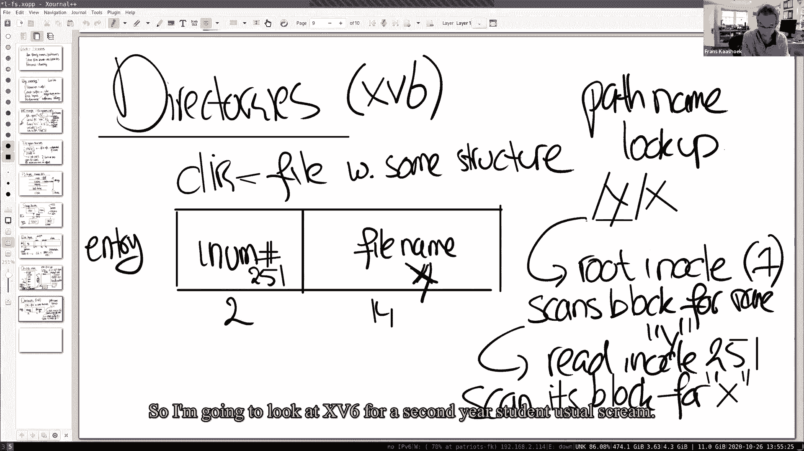
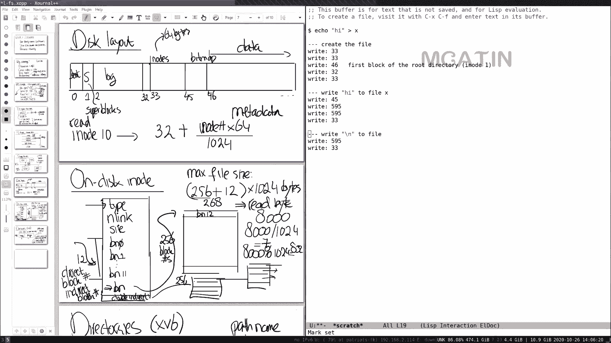
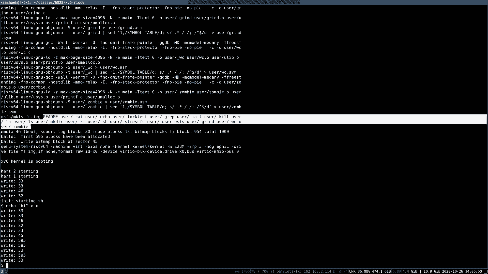
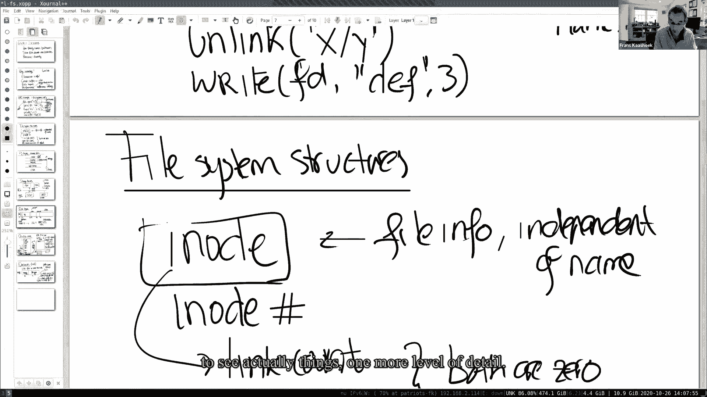

# 课程 P13：第14讲 - 文件系统 🗂️

在本节课中，我们将要学习文件系统的基础知识。文件系统是操作系统中最面向用户的组件之一，我们每天都在使用它。我们将深入探讨文件系统是如何实现的，包括其数据结构、磁盘布局以及性能优化等方面。

## 概述

文件系统为用户提供了持久化存储、友好的命名空间（如路径名）以及组织文件的能力。与之前学习的进程、内存等子系统不同，文件系统需要在计算机关闭后依然保留数据。我们将从XV6操作系统的简单文件系统入手，理解其核心概念和实现机制。

## 文件系统结构

上一节我们介绍了文件系统的基本概念，本节中我们来看看文件系统内部用于实现其API的核心数据结构。

最重要的结构是**i-node**。它代表一个独立于文件名的文件对象。进程内部通过一个整数（i-node号）来引用i-node，而不是路径名。

i-node必须维护一个**链接计数**，以跟踪指向该i-node的文件名数量。只有当链接计数和打开的文件描述符计数都为零时，文件才能被删除。

此外，由于读写系统调用中没有显式的偏移量参数，文件描述符必须隐式地维护一个当前偏移量。

因此，文件系统的核心数据结构是i-node，而文件描述符则是进程与文件系统交互的接口。

## 文件系统层次

由于文件系统相当复杂，通常将其组织成一系列层次来理解。这种分层有助于组织代码，尽管在具体实现中界限可能不那么严格。

以下是典型的文件系统层次：

*   **磁盘**：底层的存储设备，提供持久化能力。
*   **缓冲区缓存/块缓存**：位于磁盘之上，用于缓存内存中的数据，避免频繁访问慢速磁盘。
*   **日志层**：许多文件系统使用日志来保证崩溃安全性。
*   **i-node缓存**：主要用于同步。在XV6中，i-node通常小于磁盘块，多个i-node被打包进一个磁盘块，i-node缓存提供了对这些独立i-node的同步访问。
*   **i-node层**：实现文件读写等操作。
*   **路径名与文件描述符操作**：最上层，处理用户友好的路径名和文件描述符相关的系统调用。

几乎所有的文件系统都包含对应于这些不同层次的组件。

## 存储设备与磁盘布局

上一节我们了解了文件系统的逻辑层次，本节中我们来看看数据在物理磁盘上是如何组织和存储的。

存储设备（如SSD或机械硬盘）通过块号进行读写。文件系统的任务是将所有数据结构以一种能在重启后重建文件系统的方式布局在磁盘上。

XV6使用一种非常简单但典型的磁盘布局：

*   **块0**：通常不使用，或用于引导扇区。
*   **块1**：超级块，描述文件系统（如总块数、日志起始位置等）。
*   **块2-32**：日志区域。
*   **块32-45**：i-node区域。多个i-node被打包在一个磁盘块中。
*   **块46**：位图块，用于追踪数据块的空闲状态。
*   剩余块：数据块，用于存储文件内容或目录内容。

位图块、i-node块和日志块通常被称为**元数据块**，它们不存储实际数据，而是帮助文件系统管理数据。

给定一个i-node号，文件系统可以通过计算找到该i-node在磁盘上存储的确切字节位置。

## i-node与文件内容组织

现在我们已经知道i-node存储在磁盘的什么位置，本节中我们来看看i-node内部如何组织文件内容。

在XV6中，磁盘上的i-node是一个64字节的数据结构，包含以下信息：

*   类型（文件、目录或空闲）
*   链接计数
*   文件大小（字节）
*   12个直接块号
*   1个间接块号

直接块号对应文件的前12个数据块。间接块号指向一个磁盘块，该块本身存储了256个块号。因此，XV6中最大文件大小为 `(12 + 256) * 1024` 字节，即268KB，这对于现代应用来说非常小。

要读取文件中的某个字节（例如偏移8000处的字节），文件系统会：
1.  将字节偏移除以块大小（1024），得到块索引（7）。
2.  检查该索引是否小于12。如果是，则使用i-node中对应的直接块号。
3.  读取该数据块。
4.  在块内，通过 `字节偏移 % 1024` 计算具体位置（832），找到目标字节。

这种结构提供了实现读写系统调用所需的全部信息，以确定需要访问哪些磁盘块。

## 目录与路径名查找

文件系统的一个强大特性是层次化的命名空间。在类Unix系统（包括XV6）中，目录本质上是一种特殊类型的文件，其内容具有特定的结构。

在XV6中，目录由一系列目录项组成，每个条目固定为16字节：
*   前2字节：i-node号（`short`类型）。
*   后14字节：文件名。

路径名查找（例如查找路径 `/x/y`）的过程如下：
1.  从根目录开始（其i-node号固定为1）。
2.  读取根目录i-node，获取其数据块。
3.  遍历根目录的数据块，在目录项中查找名为 `x` 的条目，并获取其i-node号（例如251）。
4.  读取i-node 251，如果它是目录，则遍历其数据块，查找名为 `y` 的条目，并获取其i-node号。
5.  返回最终找到的i-node。

这种线性扫描的方式效率不高，实际的文件系统会使用更复杂的数据结构（如B树）来加速查找。

## 代码分析：文件创建与缓冲区缓存

为了更具体地理解这些概念，让我们通过XV6代码片段看看文件创建过程，并深入了解**缓冲区缓存**的工作原理。

当创建文件时，`sys_open` 会调用 `create` 函数，进而调用 `ialloc` 来分配一个i-node。`ialloc` 会遍历所有可能的i-node号，读取对应的磁盘块，检查i-node是否空闲，然后将其标记为“文件”类型并写回磁盘。

在这个过程中，会调用 `bread` 来读取磁盘块。`bread` 首先调用 `bget` 从缓冲区缓存中获取指定块号的缓冲区。

`bget` 的操作流程如下：
1.  获取缓冲区缓存的自旋锁，遍历缓存链表，查找请求的块是否已在缓存中。
2.  如果找到，增加该缓冲区的引用计数，释放缓存锁，然后尝试获取该缓冲区的**睡眠锁**。
3.  如果未找到，则需要分配一个新缓冲区（可能涉及替换最近最少使用的缓冲区），并读取磁盘数据。

**缓冲区缓存的关键不变量是：每个磁盘块在内存中只存在一个缓存副本。** 这避免了数据不一致的问题。

**睡眠锁** 用于保护缓冲区内容。与自旋锁不同，持有睡眠锁时允许进程休眠、进行I/O操作，并且不会禁用中断，适用于可能长时间持有的锁。

当进程使用完缓冲区后，调用 `brelse` 释放睡眠锁，减少引用计数。如果引用计数降为零，则将该缓冲区移动到“最近使用”的位置，以便在需要替换时优先保留最近使用过的块（利用时间局部性原理）。

## 总结

本节课中我们一起学习了文件系统的基础知识。我们了解到文件系统是一个提供持久化存储和友好命名空间的复杂子系统。我们探讨了其核心数据结构i-node，它独立于文件名标识文件。我们分析了XV6简单的磁盘布局，包括超级块、日志区、i-node区、位图和数据区。我们还了解了文件内容如何通过直接和间接块号组织，以及目录如何作为特殊文件实现路径名查找。最后，我们深入研究了缓冲区缓存，它是提升文件系统性能的关键组件，通过缓存磁盘块、使用睡眠锁保证同步，并采用LRU策略管理缓存。下节课我们将重点关注文件系统的另一个关键方面：崩溃安全性。