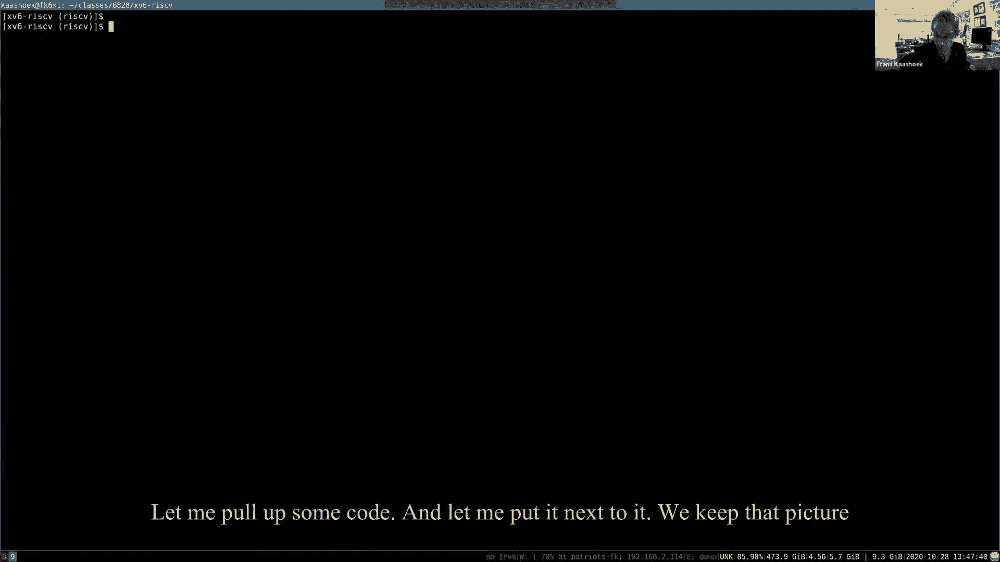
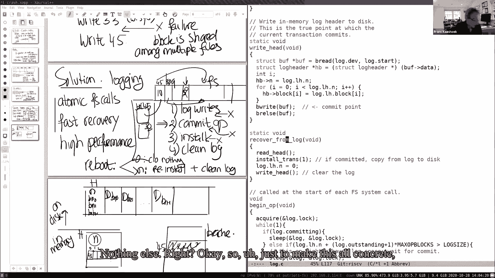
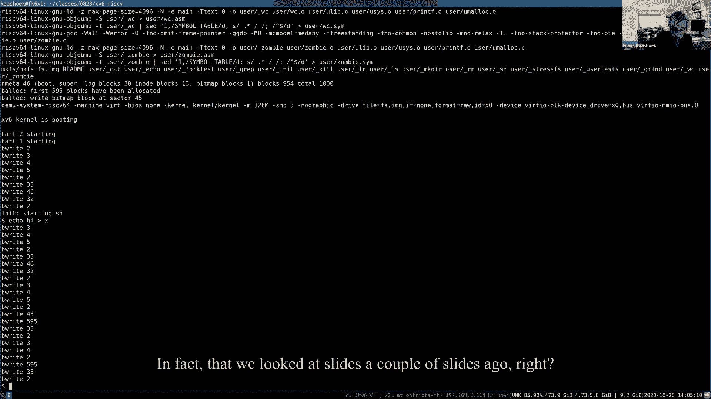
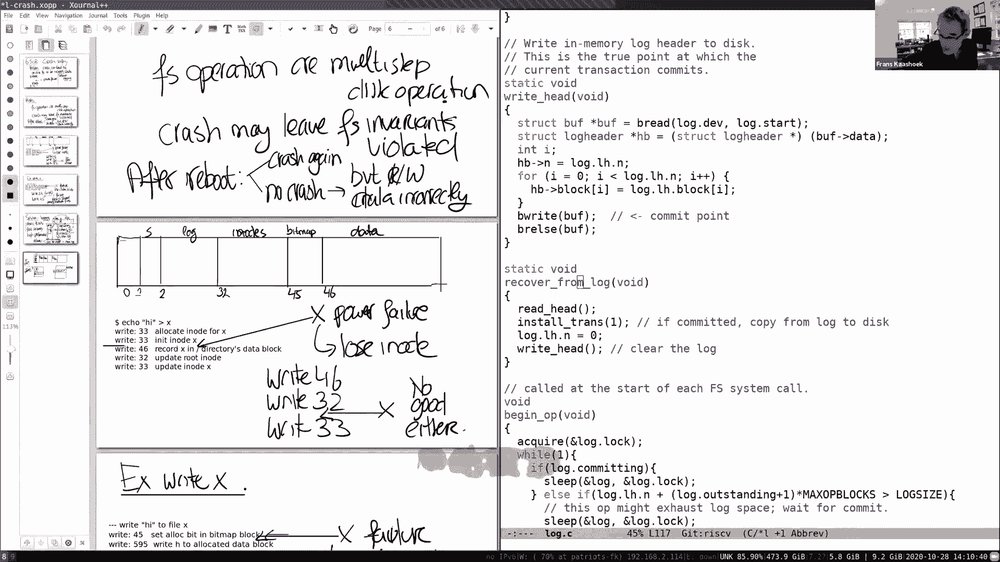
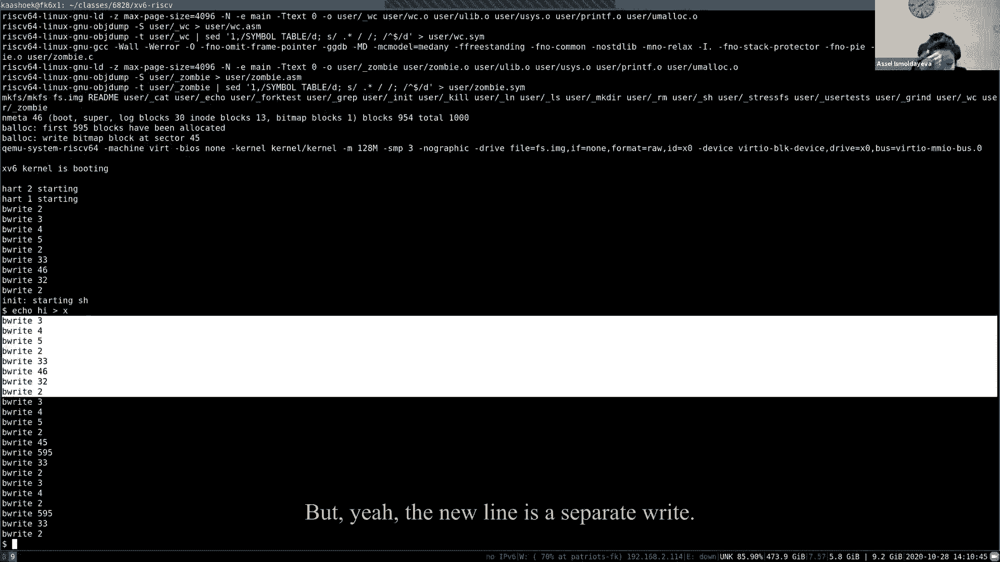
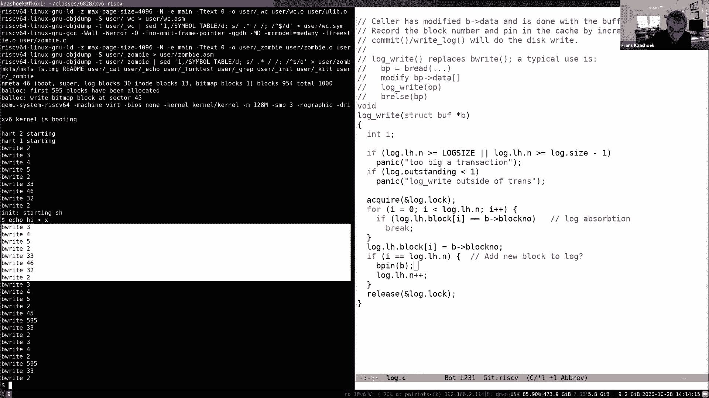
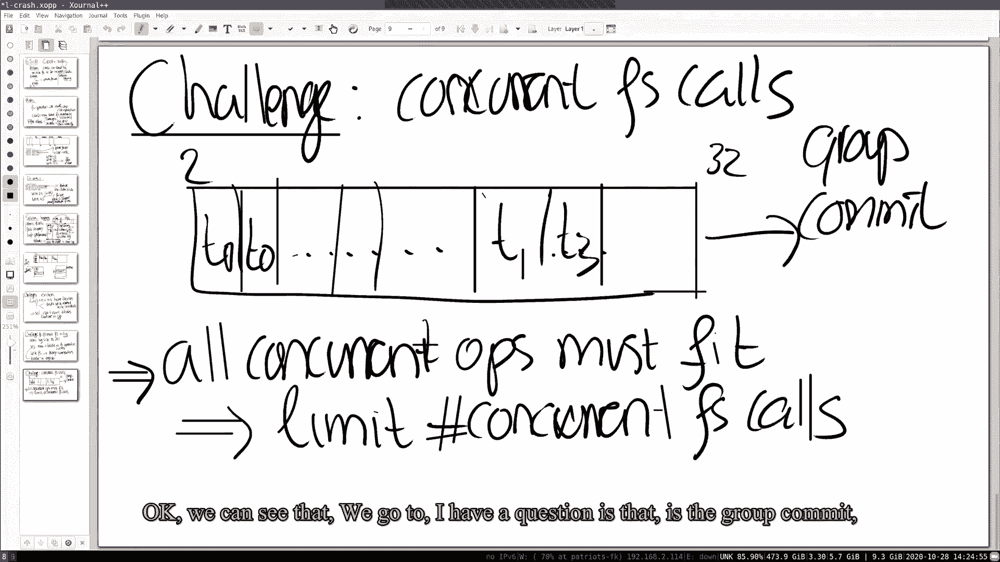
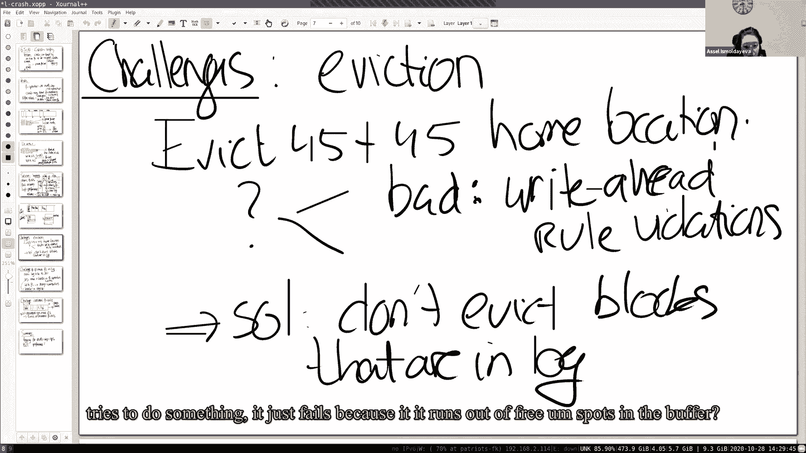
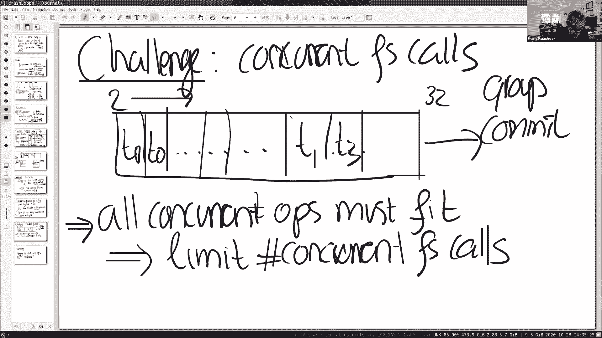

# 课程 P14：第15讲 - 崩溃恢复 🛡️

在本节课中，我们将学习文件系统如何应对崩溃或断电等故障，确保数据的一致性和安全性。我们将重点探讨一个核心问题：多步骤文件系统操作（如创建或写入文件）期间发生故障，可能导致磁盘状态不一致。为了解决这个问题，我们将深入研究一种名为“日志记录”的技术，它源自数据库领域，现已被许多现代文件系统采用。我们将以XV6操作系统中的简单日志实现作为案例，理解其基本原理、优势以及面临的挑战。

---

## 文件系统崩溃风险 🔍

上一节我们介绍了文件系统的基本操作。本节中，我们来看看这些操作在面临崩溃时的风险。

文件系统操作（如创建文件、写入文件）通常涉及对磁盘的多次写入。如果系统在多次写入之间崩溃（例如断电或内核恐慌），磁盘可能会处于不一致的状态。所谓“不一致”，指的是违反了文件系统本应维持的不变性，例如：
*   一个数据块被分配给两个不同的文件。
*   一个inode被标记为已分配，但未出现在任何目录中。

这种不一致状态在重启后可能导致数据丢失、安全漏洞或文件系统无法正常工作。

为了更具体地说明，让我们在XV6文件系统的上下文中看一个例子。

### 示例：创建文件时的崩溃

假设在XV6中创建一个文件涉及以下步骤：
1.  分配一个inode，并在磁盘上标记该inode为已使用（例如写入块33）。
2.  更新目录内容，将新文件名和其inode号加入目录（例如写入块46）。
3.  更新目录inode以反映大小变化（例如写入块32）。

**场景A：在步骤1之后、步骤2之前崩溃。**
*   重启后，磁盘上有一个inode被标记为已分配，但它不属于任何目录。这个inode被“泄露”了，无法被访问或释放。

**场景B：调整顺序，先执行步骤2和3，再执行步骤1。**
*   如果在更新目录之后、标记inode之前崩溃。
*   重启后，目录中包含一个指向“未分配”inode的条目。如果这个inode后来被分配给另一个文件，两个不同的文件将共享同一个inode，导致严重的安全问题。

这个例子表明，简单地调整操作顺序无法从根本上解决问题。核心风险在于，一组必须全部生效的写入，可能只有一部分被真正写入磁盘。

---

## 日志记录解决方案 📝

上一节我们看到了崩溃导致的不一致问题。本节中我们来看看日志记录如何作为一项有原则的解决方案。

日志记录的基本思想是将磁盘划分为两个区域：**日志区**和**主文件系统区**。文件系统更新时，不直接写入主区域，而是遵循一个“先写日志，再提交，最后应用”的三阶段过程。

### 日志记录工作流程

以下是日志记录的核心步骤：

1.  **日志写入阶段**：将本次事务（即一个文件系统操作）需要修改的所有数据块，先写入磁盘的**日志区域**。
2.  **提交阶段**：在确保所有数据块都已安全写入日志后，向日志区域写入一个特殊的**提交记录**（例如一个包含块数量的头块）。这个写入是原子的（整个扇区一起成功或失败）。
3.  **安装阶段**：将日志中的数据块**拷贝**到它们在主文件系统中的最终位置。
4.  **清理阶段**：将日志头中的提交记录清零，表示日志空间可复用。

**关键规则**：在写入提交记录之前，必须确保事务的所有数据块都已持久化在日志中。在提交记录写入之后，才能开始将数据块安装到主文件系统。

### 崩溃恢复流程

系统重启后，恢复过程非常简单：
1.  读取日志头。
2.  如果提交记录为0，则无事可做（事务未完成）。
3.  如果提交记录非0（例如数字5），则说明有一个已完成提交但可能未完成安装的事务。恢复过程会**重新执行安装阶段**，将日志中的5个块再次拷贝到主文件系统。
4.  清理日志。

这个方案保证了**原子性**：一个文件系统操作的所有效果要么全部生效，要么全部不生效。同时，它实现了**快速恢复**，无需扫描整个磁盘来检查一致性。

---




## XV6中的日志实现 🖥️

上一节我们介绍了日志记录的通用原理。本节中，我们具体看看XV6是如何实现一个简单日志系统的。

XV6的日志结构非常简单：
*   **磁盘上的日志**：第一个块是**日志头块**，包含提交记录（事务中的块数）和一个块号数组，指向日志中后续的数据块。之后是连续存放的数据块副本。
*   **内存中的日志**：维护着日志头的内存副本，以及指向块缓存中对应数据块的指针。

### 事务的生命周期

在XV6中，每个文件系统调用（如`create`, `write`）都被包装成一个事务。

以下是事务处理的关键函数调用流程：

```c
begin_op(); // 事务开始：检查日志空间和并发限制
// ... 文件系统操作代码，通过 log_write() 记录要修改的块 ...
end_op();   // 事务结束：执行提交和安装
```

**`log_write`函数**：它并不立即写入磁盘，而是：
1.  将要修改的块号记录到内存的日志头数组中。
2.  调用 `bp->pin()` **固定**该块在缓冲区缓存中，防止在事务提交前被换出并写回主文件系统位置（这违反了“先写日志”规则）。

**`end_op` -> `commit`函数**：这是事务的核心。
1.  `write_log()`：将内存中所有被`log_write`记录的块，从缓冲区缓存**写入到磁盘的日志区域**。
2.  `write_head()`：将包含块数量的日志头**写入磁盘**。这是**提交点**。在此之后，事务就必须完成。
3.  `install_trans()`：将日志区域中的数据块，**拷贝**到它们的主文件系统位置。
4.  `write_head()`（再次）：将日志头中的计数清零，**清理**日志。

### 恢复的实现



XV6在启动时（`main`函数中）会调用`recover_from_log()`函数。
1.  它读取磁盘上的日志头。
2.  如果计数>0，则调用`install_trans()`重放日志。
3.  调用`clear_log()`清理。




这种设计使得恢复过程快速且幂等（即使重复安装多次，结果也一样）。


---

## 挑战与折衷 ⚖️


上一节我们分析了XV6日志的基本运作。本节中我们来看看这种简单实现所面临的一些挑战和设计折衷。





即使是XV6的简单日志，也需要处理以下几个复杂问题：




### 1. 缓冲区缓存固定

**问题**：事务进行中，被修改的块缓存在内存中。如果缓冲区缓存满了，试图换出这些块会导致它们被写回主文件系统位置，从而破坏原子性。
**解决方案**：`log_write()`会调用`bp->pin()`增加块的引用计数，防止其被换出。在事务提交并安装后，再解除固定。

### 2. 日志大小限制


**问题**：XV6的日志只有固定大小（例如LOGSIZE个块）。一个文件系统操作写入的块数不能超过日志容量。
**解决方案**：
*   XV6确保所有文件系统操作（如创建、链接）本身修改的块数很少，不会超过限制。
*   对于**大文件写入**（`write`系统调用），XV6将其**拆分**为多个较小的事务。每个小事务独立保证原子性。虽然整个大写入不是原子的，但这符合UNIX语义，且能保证文件系统元数据（如分配新块）的原子性。


### 3. 并发操作与组提交

**问题**：多个进程可能同时执行文件系统调用。它们的总写入量可能超过日志容量。
**解决方案**：XV6在`begin_op()`中进行协调。
*   它跟踪当前并发的事务数以及已预留的日志块数。
*   如果新事务加入会导致超出日志容量，该进程会睡眠等待。
*   当一批并发事务都执行到`end_op()`时，它们会被**组提交**——它们的所有修改被作为一个大事务一起提交到日志。这保证了操作的提交顺序，同时提高了吞吐量。



### 性能折衷


XV6日志的主要性能缺点是**每个数据块被写了两次**：一次到日志，一次到主文件系统。这带来了显著的写入放大。高性能文件系统（如Linux的ext4）使用更复杂的日志模式（如元数据日志、延迟日志等）来缓解这个问题，这将是后续课程的内容。


---


## 总结 📚



本节课中，我们一起学习了操作系统如何实现崩溃恢复。

我们首先认识到，多步骤的文件系统操作在遭遇崩溃时，可能导致磁盘状态不一致，引发数据错误或丢失。接着，我们深入探讨了**日志记录**这一核心解决方案。日志记录通过“先写日志，再提交，最后应用”的三阶段协议，保证了文件系统操作的**原子性**和**快速恢复**能力。


我们以XV6操作系统为例，剖析了一个简单日志系统的具体实现，包括事务的封装（`begin_op`/`end_op`）、修改的记录（`log_write`）、提交点的确立以及崩溃后的恢复流程。同时，我们也分析了这种简单实现面临的挑战：如需要**固定缓存块**、受限于**日志大小**、以及如何通过**拆分大写入**和**组提交**来管理**并发操作**。



最后，我们指出了XV6日志在**性能**上的主要代价——写入放大。这为我们理解现代高性能文件系统的日志优化设计奠定了基础。