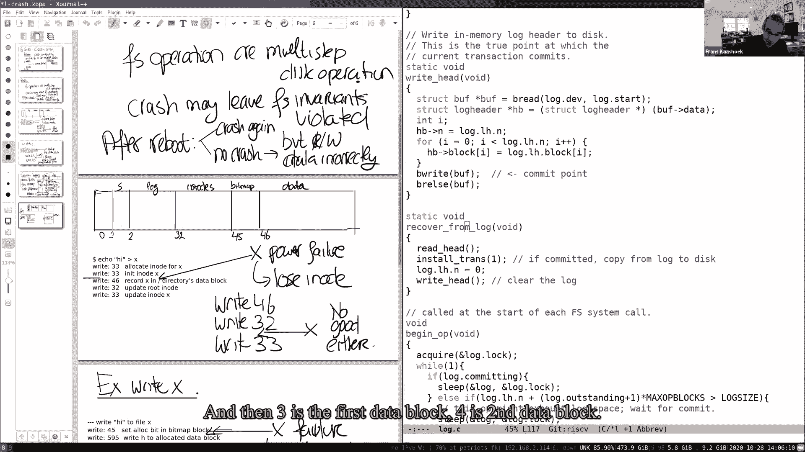

# 【操作系统工程】精译【MIT 公开课 MIT6.S081】 - P14：Lecture 15 - Crash Recovery 英文版 - MCATIN-麦可汀留学 - BV1rS4y1n7y1

每个人都能看到我的屏幕或我分享的白板吗，是啊，是啊，好的，好，人们对原木圈做得怎么样，让我从这里开始，问问进展如何，是不是更难，或者它在看，好的，到目前为止，任何想报告他们经验的人。

我希望很多人都开始了，哦耶，去吧，哦对不起，去吧，好的，哦好吧，酷，我去，我去，嗯锁实验室，我想第一部分，嗯，Klock调速器的手臂也没有那么糟糕，然后第二部分，嗯，有点难嗯，在我看来要困难得多，是啊。

是啊，嗯，你只需要弄清楚，我想最难的部分是想出一个解决方案，就像嘿，这不会导致死锁，但如果你认为有这样的情况可能会发生僵局，如果你再次获得一个水桶锁和所有这些东西，但如果你是的。

我只是觉得你必须考虑额外的病例和所有的东西，在那之后，我不应该那么坏，到目前为止，任何想分享他们经验的人，我想问，我们可以做实验室的任何部分吗，就像无锁一样，因为我知道他们是第一部分，比如说，很漂亮。

说明书上写得很清楚，就像，通过以下方式制作并行内存分配器，我们能做到吗？只要锁自由和水槽，你知道让它保持原样，你可以自由地做，呃，密码可能很棒的任何解决方案，呃没事，呃，无锁，我会，呃。

你当然可以自由地做这件事，我会犹豫是否从那里开始，如果我是你，我将首先从一个更细粒度的锁实现开始，然后移动到无锁实现，嗯，所以我从一个自由锁开始的原因，是因为如果你去一个很好的范围。

你需要做所有Perl的事情，但如果你直接去一个免费的，然后你可以把它保存在一个单独的免费列表中，你只需要，你只需要，呃，Autom是尺寸，自由和分配操作，所以其实没那么糟，是啊，是啊，我想可能在，呃。

如果在KL的情况下有一个列表，可能是这样，我想你知道，A无锁B Allois会更复杂一点，是啊，是啊，那个嗯害怕做，但这是正确的反应，我发现调试这些问题有点难，因为目前还不清楚发生了什么。

所以我们得去和广发坐在一起休息休息，是啊，是啊，我想你唯一知道的，我总是害怕得到这些锁定圈的一个原因是，你知道它们更难调试，你知道bug可能不会在每次运行中都出现，但希望它很有教育意义。

但这绝对是一个核心挑战，关于一件事，也许这是，的，我很受鼓舞，你知道下一个实验室实际上基本上不涉及任何并发，所以希望这会更简单，嗯，好的，我得到，我想你怎么，如何高效地调试并行程序。

就像所有这些多线程使用，我用非常基本的东西，我有使用打印语句，但我最依赖的是，我试着写下或断言不变量，我认为在每一点上都应该是真的，如果断言失败了，然后我就知道你知道我的想法或断言有问题。

然后我想了一会儿，我试着决定是什么，然后从那里，可以帮助你的到达探测器，一次又一次，你知道，基本上标记代码，看起来可能是，呃，有问题或容易出现种族条件，嗯，但那是一整套其他工具，呃，我们是，你知道不用。

它是它不是那么好，但要真正做到这一点还有很大的一步，都起来了，去了，跑了，这是人们使用种族探测器的另一种机制，并且基本上标记任何在没有实际持有锁的情况下更新或读取的共享变量，不，这对你的死锁没有帮助。

比如，比如说，在这个实验室的B现金锁里，你知道在你得到的锁，锁往往更容易做到，但正确，因为你可以，你得到恐慌，然后你可以看看GDB，你知道反向追踪，看看它在僵局中涉及到什么，这有道理吗，嗯嗯，谢谢。

好的，嗯，然后我建议，其实，某人，呃，发布在反馈上的是，你知道课程，出勤率比学期开始时低了一点，我想我们可能足够小，或者它的大小可能完全没有问题，实际上有相机，所以也许我想鼓励你。

如果你问一个问题打开你的相机，你知道这有望改善，你知道我们的经验，如果是在教室里，与虚拟会议相反，嗯，你不必看着我，好的，好的，今天的讲座，呃，所以今天的课将是关于碰撞安全的，呃，崩溃安全和文件系统。

这不是最一般形式的头饰，我其实，我真的把注意力集中在一个特定的问题上，或者一个具体的问题，即撞车或停电可能导致，在此文件系统上，处于不一致的状态或不正确的状态，我所说的不正确状态是知道，比如说。

一个数据块属于两个文件，或者i便笺被分配给两个不同的文件，嗯，所以这个问题可能出现的情况是，假设你知道你在跑步，制作一个漂亮的文件系统，你知道吗，与文件系统交互，重写文件，在某个你知道的地方。

在你知道那件事的时候，一个支点力量母马发生，你知道也许你的笔记本电脑没电了，你知道可能停电了或者你家停电了，你知道你重新启动，你的力量恢复了，在某个时候，你重新启动机器，她又回来了，然后你知道。

希望你能再次得到提示，你跑，您基本上希望您的文件系统处于良好状态，在它实际上仍然可以使用它的状态下，所以我们所关心的特定故障或崩溃，基本上是文件系统操作期间的电源故障，内核恐慌，你知道的。

在运行一些文件系统操作时，xp六是Panex，大多数内核都是恐慌，你知道的，也许有一些内核bug引起了恐慌，然后突然你的系统崩溃了，你想要的情况是，在那里重新启动后，你真的可以做点什么。

或者您仍然可以使用文件系统，这可能是你想得很好的地方，这怎么可能不对呢，因为您所知道的存储在持久存储介质上的文件系统，所以如果电源故障，你知道媒介应该很好，所以当机器恢复时。

你知道你写的所有块都应该在那里，我们会看到的，棘手的情况是，许多文件系统操作都有多步操作，在这些模式中，真正重要的是什么，如果我们在这些多步骤操作中撞错了地方，文件系统实际上可能最终在磁盘上不一致。

在那短短的一段时间里，如果力量只是发生在那里，你知道不好的事情可能会发生，这就是我们今天关注的问题，所以这与，比如说，不管你知道什么，停电了，你知道你的磁盘着火了，所以那里什么都没有了，所以你需要。

在这种情况下，你知道你需要，你需要有一个完全不同的问题有不同的解决方案，你知道的，比如说，您必须返回文件系统的备份，你知道重新安装你的文件系统，等等等等，所以这是我们不担心的问题。

我们真的很担心故障发生的具体问题，在多步骤操作中，好的，以及我们将要探索的特定问题的解决方案，呃，是一种叫做模式化的东西，这是一个非常受欢迎的，从数据库世界出来，但是现在很多使用日志记录的文件系统，嗯。

我们要去，这是它受欢迎的一个很好的原因，是因为这是一个非常有原则的解决方案，嗯，我们将在XT 6中看到日志的实例化，当然，XPSix有一个非常简单的实现，类似于日志记录的最小实现，只是为了演示关键思想。

实际上有一些微妙的问题，我们将讨论，这就是为什么它值得，我们正在研究它的一个缺点，我们将看到x 3 6的解是否因为简单，它的表现也不是很好，即使原则上锁定系统可以获得很好的性能，所以我们要做的，呃。

下周实际上是看，呃，如何实现高性能测井系统，通过研究Linux高清免费文件系统使用的日志系统，但那是下周，我今天想说的另一个可能很小的观点，这是我们最后一次xpsix讲座，从现在开始我们要改看报纸了。

因为在某些方面，我们所做的是我们覆盖了，你知道的，基本概念，我们可以通过阅读论文来开始研究更先进的操作系统ID，好的，到目前为止还有什么问题吗？我们都很好，好的，所以让我回顾一下，就像我们真的，呃。

我们在这节课中所关注的，所以呃，文件系统或文件系统操作，如创建文件，写文件，是多步磁盘操作，你知道我们上周或周一看到了，我们讨论了创建者是如何实现的，比如创建文件或写入文件，我们经常看到你知道。

事件的顺序是或步骤的顺序是，你知道的，分配了一个i节点或标记磁盘上分配的i节点，那你就知道，这就是我所说的Miltic步骤，如果我们在这两个步骤之间崩溃，呃，呃，可能离开可能离开文件系统不变，小提琴。

不变性，我说的是形式的不变性，你知道每个块要么是空闲的，要么分配给一个文件，而不是两个文件，你知道我们可能想确保这一切发生尽管你知道这些，你知道的，在这些操作之间的故障，风险是如果那些被侵犯的。

如果违反了这些不变量，的，你知道的，重启后可能会发生不好的事情，你知道你可能会立即再次崩溃，因为你知道文件有一些数据结构，现在和现在，在文件系统实际上无法处理这些数据结构的状态下，在这样一种状态下。

文件系统真的不能再处理它们了，或者你更有可能没有崩溃，没有撞车，但你知道数据可能会丢失，或者你读或写了不正确的数据，我们将看到几个例子，你知道的，让大家看的更清楚一点，但基本上我们担心的风险。

我不知道是否有人在个人生活中，或者在你使用电脑的日常生活中，实际经历过这个问题，在哪里，基本上啊，您的文件系统出现故障，或者你失败了，你停电了，你知道的，你的机器重新启动它，或者你的手机重新启动它。

这可能是不寻常的一个原因，因为实际上有文件系统，只是没有恢复正确，好的，所以为了更清楚，让我们看一个例子，呃，在上下文中，实际上我想把这个风险说得更具体一点，让我们看看XV Six上下文中的一个示例。

看看到底出了什么问题，所以请记住周一的XPSix文件系统，非常简单的文件系统，它有一个简单的磁盘布局，你知道超级方块，有超级日志，这是我们今天要谈论很多的日志，我们周一没有谈论的事情，他们的I笔记。

你知道的，位图块，你知道记录，哪些块是免费的，哪些不是免费的，然后是数据块，如果你还记得星期一的课，你在这里复制痕迹，你知道我们实际上看了，呃，如何创建文件，你知道我们看到创建一个文件，等我一下。

单个文件的创建由多个操作组成，因此，比如说，就像在我这里的这个特殊场景中，在上，在这张幻灯片上，你我都知道，你知道我们知道这一点，因为有一个33块正在写，嗯，我们看到该区域将被初始化，然后又写了块三三。

然后我们看到块四六写的，写这个理由大概是因为你知道，我知道x的数字被写到磁盘上，然后i节点根，i节点被更新以反映目录的大小已经增长，然后你知道我知道的更新了，所以我们现在想了解的是。

会发生什么可能会出什么问题，所有的权利，然后呃，所以假设你知道我们停电了，就像这里，所以这里有一个，那么停电后会发生什么，正确，所有的内存状态都丢失了，对呀，因为在内存状态或实际在RAM中的数据。

就像所有的过程一样，所有的文件描述符，所有的内存缓存都不见了，呃，因为你知道记忆不是持久的，我们唯一剩下的就是磁盘上的东西，所以只有数据结构，磁盘上的比特和字节在断电后幸存下来，呃。

因为那个媒介实际上是，你知道吗，持久性或具有持久性，所以我们想知道我们理解，所以说，如果我们在这里坠毁，我们没有额外的机制，或者我们没有伐木，正如我所说的，我们将讨论，但我们没有额外的机制，有多糟。

我们在冒什么险，所以基本上，你知道的，我们已经写了第三块三，以记录i音符已经分配，然后我们停电了，然后我们回来，去吧，布兰登，那是不是意味着，我们失去了嗯，把这个方块，就像，好像有很多人，但其实不是。

是啊，是啊，我想我们正在失去，我们不是整个街区，但是我们用i节点x对，分配的i节点x或x的i注释，或者分配的标记在磁盘上分配，但我们没有把它放在任何，我们还没有成功，正确，呃，把它放在任何目录中。

所以基本上在磁盘上，你知道有一个索引节点分配，但它没有出现在任何目录中，所以我们甚至不能移除它，所以基本上这会让我们付出什么代价，我们迷路了吗，我们输了，我注意到，这有道理吗，所以你可能会想。

也许我应该做的是，也许我应该重新排序权利，在某种程度上，你知道，希望你知道这一点，你知道我们不会失去眼睛的音符，所以说，比如说，我们可以试着做的另一件事是说好，我们要做的是，基本上更新，我知道。

更新目录，将目录右键，我注意到，你知道的，写三二，然后我们将i节点标记为磁盘上分配的节点，给你推销它，如所示，市场被分配，所以我们以稍微不同的顺序做同样的操作，呃。

希望我们能避免在i note问题上的失败，有了这项工作，我们应该做的是问自己，你知道的，让我们想想这个时间点，或者在更新目录之间发生电源故障，基本上，但是在我们在磁盘上分配i Note之前。

现在你知道我们停电了，机器恢复，我们查看文件系统，您知道文件系统将处于什么状态，你仍然会认为这是一个空闲的i节点，是的，是的，但如果，比如说，我们读到，你知道吗，目录中的文件X，在根目录中。

因为它现在正在纠正这个数据块，我们要读我的笔记，实际上甚至没有分配正确，有未分配的标记，甚至更糟，可能发生的事情是正确的，我知道可能会再次分配，或者它实际上可能真的被分配。

因为有一个标记实际上没有分配给，事实上是一个不同的文件，所以现在我们有两个文件，呃，实际上共享的两个文件，即使他们完全不同，他们有相同的我注意到，所以，比如说。

如果一个文件归用户1所有另一个归用户2所有，那么基本上用户2可以读取用户1的文件和数据权利，所以这也不好，对呀，这有道理吗，所以基本上切换，你知道，命令，你知道并不能真正解决我们的问题，呃。

你基本上会得到一个不同的问题，我们以前有，好的，让我们再看一个例子，这是，呃，写入文件X的示例，所以一旦我们分配了文件，假设所有人都成功了，现在我们正在执行正确的系统调用，正确的系统调用也会，呃。

多写操作，就像我们周一看到的那样，例如，它会分配一个块，在这种情况下，第45座，所以它在免费地图上设置了一点，好的，块四五是位图块，指示必须分配该块，呃，那个方块原来是猜测，五九十五，当我们写作的时候。

你知道H这个字，你知道到595，然后字符I，然后我们更新我的笔记，现在我们可以问自己同样的问题，好像你知道会发生什么，如果呃，我们撞车所以，比如说，假设我们分配崩溃，就像在这里之间，你知道，写入位图块。

但在我们分配之前，我们实际上写了我的笔记，所以在这里坠毁，所以我们重新启动，你知道，我们回来了，磁盘处于特定状态，你知道什么，风险有多大，我们使用一个数据块，但我们失去了它，是啊，是啊，我们又失去了它。

正确，因为块已分配，但它没有出现在任何文件中，因为它没有被写入任何i节点，所以我们丢失了一个数据块，所以你可能会想好吧，嗯，也许你知道只是因为我们写错了顺序，我们应该做的就是我们应该做的。

实际上是先把它写在我的笔记里，所以先用，你知道5点95分，就像在吃东西一样，间接块或直接块，然后你知道实际上我们会标记，我知道街区被分配了，然后我们就写，你知道四五对，所以我们改变顺序。

因为我们想避免这些法律，数据阻塞，我们用这种方式改变顺序，现在让我们考虑一下这个案子，如果这里有故障，风险有多大，嗯，文件的大小与，呃，实际分配了多少数据块，那可能是，虽然我认为在三个自由的权利。

实际更新，大小和，你知道，呃，块号右边，我们是这样的，那可能是，可能会成功，好的，法力会有问题，但这里有更大的问题，它是这样的文件有一个，所以它有数据块的东西，但是数据块被标记为未分配。

和其他UM文件也可以使用它，是啊，是啊，这才是真正的大问题，这是你知道的，我注意到的事情，街区有950英镑，属于属于那份文件，但实际上是在磁盘上，它仍然被标记为未分配，所以当后来创建另一个文件时。

你知道那个块实际上可能用于另一个文件，所以现在肯定有一份文件认为它拥有595，但实际上其他文件有，事实上，两个文件都有五个，95个在他们的A块数字为他们的眼睛节点，基本上你知道，如果一个用户拥有该文件。

而另一个用户通常在另一个文件上，连接就在那里读取到彼此的数据右，这显然不是我们想要的，你知道的，文件系统应该保证每个块只属于一个文件，没有其他文件，或者是免费的，好的，所以这可能会导致安全问题。

但基本上块是共享的，在多个文件中，这绝对是错误的，就可能出现的问题而言，这有意义吗，一次又一次，你知道这个，这里真正的问题不是看权利的排序，但这里真正的潜在问题是，我们只是在进行多次写入。

然后基本上必须出现在磁盘上，好的，然后呃，所以我们在这节课中要探索的幻觉是，你知道的，伐木，和，就像我之前说的，这是一个，文件系统中使用的常见解决方案，实际上源于数据库文献。

它实际上有几个凹槽特性之一是它将使，基本上是系统调用，因此，如果创建文件，或者你知道你叫创建，或者你叫写，基本上系统调用的所有效果都出现在一起或者没有，这样就避免了这种问题。

实际上只显示在磁盘上的权限的一些子集，它的第二个好特性是它允许快速恢复，所以重启之后，事实证明，我们实际上不必做很多工作，修复文件系统，实际上是非常少的工作量，这与我不是在说的其他解决方案形成鲜明对比。

基本上就是你去检查文件系统，也许你用文件系统读取了所有的块，或者阅读所有的i note块，读取所有位图块，因此，检查文件系统是否仍然处于正确的形状，也许修理东西，伐木，有这个，你知道的，很好的属性。

实际上恢复得很快，然后最后是原则上，呃，它实际上可以非常高的性能，虽然你认识的那个，我们要在X的上下文中寻找的，P6性能不高，所以我们要看看，下周，我们将看到如何构建一个具有原子类和调用的日志系统。

快速恢复高性能，今天我们将重点讨论前两个，好的，日志记录的基本思想实际上很简单，所以基本上你要做的就是把磁盘分成两块，一个是原木，一个是文件系统，文件系统可能比日志大得多，当您需要更新文件系统时。

请更新，假设球锁三三或更新位图块，我们其实不打算更新，你知道文件系统块，所以我们不打算直接更新位图块，取而代之的是，我们在右边唯一要做的就是，你知道的，记忆，我们在内存中有一个块，这是说45的位图块。

而不是跑到四五，我们通常会做的，我们要做的实际上是，我们要把它写进日志里，所以我们要把它粘在这里记住这应该是四五，我们我们不把它放在那里，我们也用所有其他权利这样做，例如，我们会把我们的，挡住那里。

你知道那就像，也许三个免费的，我想如果我没记错的话，我们把它插在里面，你知道，记住，它实际上必须去三D三，所以基本上我们所做的，右边是第一个走的，所以我们不会直接写到块的主位置。

但我们总是把它放在队伍里，然后在某个时候你知道，当文件系统操作完成时，你知道的，比如说，它已经，你知道的，我们在之前的幻灯片中看到的这四五个权利在日志中，我们实施行动，基本上它的意思是在日志的某个地方。

我们只是录一张唱片，你知道，在固定的位置上，基本上说好的，嗯，你知道木头里有五个街区，那就是，你知道长长的锁，权利，然后你知道，当我们在磁盘上稳定地拥有所有权限时，呃，我们实际上要安装它们。

所以这被称为安装阶段，这意味着，我们要搬家了，你知道吗，从步行到他们家的这些街区，所以我们知道这个必须到4-5，所以我们把它放在四五，这个要到三三，你知道我们经历了三三，等等等等，一旦我们做完，你知道。

基本上我们可以清理原木和清理原木，基本上是你在重写，你知道基本上把这个5到0，这是基本计划，为什么这个计划是好的，嗯，让我们考虑一下，假设我们在这里坠毁，会发生什么，所以让我保留这个问题。

在问这个问题之前，让我先说一件事，假设我们撞车了，呃，所以我们重新启动，在重新启动时，基本上是文件系统所做的，看起来提交记录看到提交记录的值是多少，如果它是零，你知道的，在我们的简单计划中什么都不做。

如果大于零，我们知道日志中基本上有一些块需要实际安装，我们显然没有完成安装，我们坠毁了，你知道的，提交之后，但在清理原木之前，所以基本上我们重新安装，我们重新安装后，我们把锁擦干净，好的，这个方案很好。

因为它实际上确保了无论崩溃发生在哪里，我们要么安装所有的权利块，或者我们一个都不安装，但我们从来没有在这里，呃，我们永远不会在这样的情况下结束，我们安装了一些权利，但不是全部，看看为什么这是真的。

让我们考虑几个事情可能崩溃的情况，所以事情可能会崩溃，在一到二之间会发生什么，我们在什么情况下结束，在恢复的情况下，我们什么也不做，这没关系，因为没有任何东西被写入文件系统，是啊，是啊，是啊，是啊。

正是如此，在这种情况下，基本上，呃，我们什么都不做，你知道的，好像被调用的系统基本上从不执行它，好像故障发生在文件系统调用开始之前，所以这是完全可以的，那是可以接受的，好的，如果我们撞车了怎么办，好吧。

在承诺之后，但在安装之前，然后你只需要重做所有的安装，所以你会恢复正确的状态，是啊，是啊，所以正是在这一点上，正确，我们所拥有的，我们知道那里，呃，所有的方块都在日志里，都写了，因为我们犯了，因此。

整个文件系统操作必须完成，所以我们基本上可以把它们放在它们的位置，他们应该在哪里，然后我们都有很好的状态，所以在这种情况下，你知道所有的文件，你知道在这种情况下，最终的结果是。

如果文件系统调用实际上完全在崩溃之前，就像没有区别一样，那么如果我们在重新安装过程中崩溃会发生什么，或者像在安装中或在安装过程中我们清洗之前，所以在这里坠毁，我们在这个案子里做了这个案子。

我会做第三个案例，我们将在安装过程中或安装前安装，安装后，但在清洁之前，什么什么发生了什么，然后呢，在，哦，对不起，呃，下次重启时，呃，就恢复过程而言，一切都没有真正改变，所以我们要重做日志，你知道吗。

我们要重做一次日志，我们将基本上再次复制内容，你知道到正确的位置，也许事实上我们可以做多次，可以吗，是呀，因为那些只是权利，他们要去一个特定的地方，我们不会改变，就像日志里写的那样。

所以我们知道每次应该写在哪里，是啊，是啊，基本上每次我们都会做同样的事情，正确，在四五区，你知道有值十，我们要写十个，你知道每次4-5的位置，这正是它应该是的，多次重复这句话并没有什么坏处，对的。

因为我们写的是相同的值，无论如何都应该在那里，所以一切都很好，你知道我们要多次重新安装，当然啦，在这个特定的时间点，我们不应该提供任何其他文件系统调用，我们应该在重新启动文件系统之前这样做。

但是在重新启动或恢复期间，你知道我们可以做得很好，另一种说法是安装基本上是项目盆栽，你可以执行很多，很多，很多次，最后也会有同样的效果，关于那个的问题，是的因为界面只是读和写，如果我们有一个附加它。

这不安全，对呀，是啊，是啊，你很清楚，你可以让笔安全地使用更花哨的伐木方案，但是对于这个特殊的日志记录方案，你知道我们不必担心这个，实际上，就像在某种意义上，追加是一个文件系统级的操作，在这个水平上。

我们可以把它做成原子，使用我们这里的日志记录方案，我明白了，谢谢。我也有个问题，是的，去吧，如果文件系统在提交时崩溃会发生什么，所以你想执行多个权限，然后你只犯了一半，是啊，是啊，好的。

所以你能再大声一点吗，因为你的音量很低，哦是的，对不起，所以如果你想一次提交多个权限，就像以原子的方式，但是你在提交过程中系统崩溃了，所以你只能承诺一半的权利，在那种情况下会发生什么，好的。

所以这是非常重要的一点，因为很高兴你问了这个问题，所以首先你所做的，你知道，在这里编写此提交操作，纠正这个，你知道，第二步，您只执行提交操作，在您已经登录之后，你计划执行的所有权利，所以在你承诺的时候。

所有的写都在日志中，所以提交器本身，你知道这是个有趣的问题，就像那里发生的事情，我在这张幻灯片上指出的方式，提交操作写入单个块，就像磁盘上的单个扇区，以及文件系统所做的标准假设。

单个块右或单个扇区右是原子操作，意思是如果你写出来，整个扇区都会写上，或者任何扇区都不会被写入，所以扇区永远不会被部分写入，所以你总是清楚地知道，你知道，该特定部门的有效数据。

所以基本上这个提交操作的操作，写入日志标头就是写入，提交记录是，真正的提交操作，比如如果成功了，在提交标头中基本上有一个5，你知道的，我们知道木头里有五个方块，我们必须重新安装这五个街区。

如果提交头没有到达磁盘，那么该值仍为零，我们就当跟踪从未发生过，谢谢。你暗示的关键规则，这必须是真的，这是所谓的右前规则，这意味着日志记录系统无法安装权限，直到所有的写都进入rn，都在日志里。

关于这种基本计划还有什么问题吗，所以我想要的是，有许多不同版本的日志记录方案，我在这里画了一个非常简单的，你知道这很好，你知道有一些计划基本上，原木的清洁被推迟了，安装推迟到以后。

但我要用这个非常简单的方案来运行，下周我们将看到更复杂的日志记录协议，但是所有这些日志协议都遵循这一点，在编写提交记录之前知道的规则，您必须确保所有的写都在日志中，但这里面有很多。

在设计特定的日志记录协议时仍然有很大的灵活性，因为他们通常被称为，好的，我要去看看一点点，呃，这是如何在十六中表现出来的，你知道的，作为一种案例研究，把事情变得具体，好的，所以在x2 6中，他们有点。

我们将研究两种状态，如果你愿意，实际上在磁盘上的东西，你知道的，记忆中的事情，和，内存中的内容会在途中消失，我们应该考虑一下，内存中的内容会在崩溃或断电时消失，xvsigg日志的结构一如既往地非常简单。

呃，实际上我们在开始的时候有一个街区，标头块，这基本上是我们的提交记录，这就像日志中的块数，然后对于每个块，块号，那个街区的家的位置，废话废话废话，所以会有N个，所以在日志本身，r基本上是它的数据。

你知道它属于那个，这是BN零的数据，这是bn 1等到n减1的数据，日志里就是这么写的，呃，就是这样，这是日志中唯一的东西，没有什么比这更多的了，然后在内存中，文件系统在一段时间内运行，呃。

有一个复制版本或内存版本的头，它基本上有n，它有一个块号数组，等等，呃，然后你知道这些块号指的是，呃，数据中的块，实际上与块相对应，在内存数据结构中的数字，它们位于块缓存中，你现在已经很熟悉了。

所以也许这就像被挡住了，是日志中的第一个块，或者让我举一个更具体的例子，它与我们之前的事情一致，所以也许这就像45，基本上你知道在块的缓存中的某个地方，因为有，当然你知道四块五的方块，这是数据，好的。

这就是结构，呃，那个呃，在磁盘上，呃，内存中的文件系统有和磁盘上的文件系统有，所以在这个X文件系统上只有日志，内存中有这些数据结构来编排这些多，写我们将要做的操作，好的，所以为了让这个更具体一点。

让我们看看一些代码，然后呃，这将有助于我们理解，呃，一切是如何运作的，所以让我，呃。

调出一些代码，让我把这个放在它旁边。

我们把那张照片，呃，这样我们就可以看它了，如果我们呃想，或者我可以指着它，嗯，每个人都能看到我的代码，是啊，是啊，有人证实他们认为索引窗口，是啊，是啊，我们可以看到它很好很好，够大吗，我觉得很好，好的。

看起来不错，谢谢。好的，所以让我们从，你知道我我谈到了交易，对呀，呃，你知道你知道我们不应该承诺直到，你知道我们不应该写一个提交写手，直到所有的权利都完成了，这意味着您的文件系统操作必须指示。

事务的开始是什么，特别是交易的结束是什么，在xv6中发生的方式，这里的每个文件系统调用都是打开的，对应于创建，基本上是从，开始，开始，基本上表示像，好的，我想开始一笔交易。

我想要开始和结束之间的所有块权限，它基本上是在事务的末尾是原子的，这意味着你知道它们都应该应用于，它们都不应该点燃，好的，所以x vsix中的每个文件系统调用都有这样的结构，这基本上必须开始。

然后是实现文件系统调用的代码，最后是，这基本上是提交操作发生的地方，呃，所以基本上是在初学者和结束之间，应更新磁盘上或内存中的数据结构，你知道吗，无论内存日志可能被更新，块缓存可能会更新。

但没有什么真正发生，直到结束，然后结束时间，我们基本上要把东西放进日志里，然后如果我们把所有的东西都放在日志里，实际上会，你知道吗，写入提交记录或日志头，那么有趣的是，当然啦。

然后发生的事情是每个写正确，每当这些文件系统调用中的一个磁盘写入，你知道吗，一定会有什么事情发生，所以如果我们回去，例如到FS C，你知道吗，看IELC，ioc，基本上它所说的并不直接正确地调用B。

但它实际上调用log right，所以我们要看看什么日志是对的，日志正确与否基本上是日志系统实现的功能，基本上一个文件系统调用我们的每一个速率，在初学者和结束之间总是通过日志，所以这里是对数权。

对数权实际上是合理的，呃，你知道直截了当，嗯是的，你知道我们已经在块缓存中写入了块，所以在某个地方，基本上你四五，也许这就像我们更新的四五的权利，你知道在方块灰里有四十五，在提交点的某个点。

我们需要把这个方块写进锁里，所以你知道，基本上你知道代码是，哎呀，代码相当简单，呃获得了头上的锁，基本上更新了标题，尤其是它的作用，它穿过，你知道呃和更新，它看到的第一件事是什么。

如果里面已经有四五的副本，如果四五已经被记录为必须读写，如果是这样的话，别的什么都不用做，因为四五会被写到，所以我们结束了，这有时被称为锁吸收，嗯，如果你知道四五块还不在数组中，或者不在。

需要写入磁盘的块列表或块射线，那么基本上你知道这个特定的代码唯一做的是，基本上是撞进去粘在一起，你知道需要写入下一个条目或该条目的块号，那么它唯一做的另一件事，我以后再谈这个。

它会把行走固定在缓冲区缓存中，让我推迟，为什么一会儿，但我稍后会回来的，这实际上就是log right所做的一切，所以说，现在需要更新块的每个文件系统调用，您知道更新块缓存中的块，然后它基本上把它，嗯。

在内存数据结构中，除非你知道它已经在那里了，在这种情况下你知道它只是吸收它是有道理的，那么这是否意味着B权根本不应该被自己使用呢，所以你是对的，不应该只被用作是，那是那是正确的，是啊，是啊，基本上。

所有的你，一种思考的方式，文件系统中的每个B右都被日志右替换，好的，现在让我们看看最后会发生什么，对，因为那是令人兴奋的部分发生的地方，有几件事，我只是想避免以后谈论的案例。

因为他们即使是这个简单的日志系统实际上也有一些微妙的复杂性，这段代码开头的大部分内容都处理这些微妙的复杂性，但我只想真正得到正常的情况，你知道有，或者有一个简单的案例，其中没有其他文件系统操作正在进行。

呃，我们执行，你知道的，创建文件，基本上我们已经到了我们想承诺的地步，所以代码很简单，呃，和调用提交，所以让我们看看提交，所以这里是承诺，呃太神奇了，向我们承诺基本步骤，基本上它写日志。

这基本上是在写所有这些坐着的块号，你知道在内存标头中，并将它们基本上全部写入磁盘上的头，所以让我们看看，这就是右脑所做的对不起，写日志，基本上写，你知道缓冲区缓存中的块，到他们各自到日志本身。

让我们看看上面的红色圆木是什么，你可以看到它是做什么的，你知道它穿过，你知道这个数组，你知道一次一个，基本上把它写到日志中的锁定位置，好的，所以上面写着，你知道圆木块，然后通过复制把它粘在里面。

然后把它写到磁盘上，所以这基本上可以确保在这里走四五英里，你知道，假设这是三二，最后会在那里，等等，等等，那么最后，所以在这一点上我们还没有承诺正确，我们所做的唯一一件事基本上就是把块放入日志中。

如果我们在这个特定的时间点坠毁，在你知道之前你就知道了，先叫右头再叫右头，海克成功了，基本上，如果拒绝根本没有执行，我们来看看右头，所以那个红头是我之前叫的，基本上提交点和提交点，基本上你知道。

基本上很简单，从磁盘到达头块，它可能位于缓冲区缓存中，呃它，你知道吗，把副本放在末尾，你知道从这头到那头，将数组中的所有块号放入该块中，然后基本上写那个特定的块，所以这是这个B对，那是提交点。

下面发生了什么，这不是我们对内存中的HP数据结构所做的唯一修改，所以它不是，一切都会好起来的，是啊，是啊，一切都会好起来的，因为基本上我们可能已经写了DB 1，零，dbn或日志中的其他内容。

但是我们还没有成功地编写日志头，所以我们什么都不做，什么都不会发生，如果在B之后发生撞车事故会发生什么，所以这里就像撞车一样，它不再是零，以便正确读取日志标头，它恢复了，是啊，是啊。

它会在某个时候恢复得很好，希望在康复期间，正如我们所料，你知道，我们期望恢复实际上会读取日志头，看到里面有一个5，比如说，然后把前五个街区复制到他们的家乡，所以这真的是这个，这这一条线，这一张对吧。

这一个扇区对吧，真的是提交点，在承诺点之前，轨迹是这样的，交易没有发生，在提交点之后，交易一定会完成的，假设你的恢复是正确的，好的，所以让我们，你知道，呃，回去承诺，所以在承诺之后再承诺。

它实际上安装事务，你知道这很简单，基本上你知道它需要街区，查看块所属的标头，然后基本上把它写到那个特定的位置，所以我们可以看看安装火车，看看，这就是它的作用，你知道它有日志头的副本。

它只需读取日志标头并到达目标块，家庭位置，将数据从日志块复制到目标，然后将缓冲区写入目标，所以基本上有效的是，基本上你知道，如果您回到上一张幻灯片，在这里它复制。

你知道它只是把这些副本从日志复制到家庭位置，或者实际上在文件系统中，当然你知道我们可能会在这个代码中的某个地方失败，或者在我们做这件事的时候，但你知道那应该没问题，因为希望在恢复中你能从头开始。

所以让我们来看看，呃，所以安装了，所以一旦安装完成，那么呃，基本上它设置你知道，内存中的标头，然后归零，然后写日志头，有效地使我们，清理日志，因为基本上现在它的问题为零，你之前参加的活动。

而从到或从得到，所以这就把，嗯，你会喜欢的街区，更新要更新到缓冲区中的日志块，嗯，你能不把它放进现金缓冲里让它更快吗，直接把它写到设备上，而是，让我，呃，我们说的是哪个函数，忘了它的名字，它是。

就是你复制的那个，你知道日志里的一切，好的，安装安装趋势，我想是的，是啊，是啊，否，否，否，可能是这个，所以我想可能是右头，但这是一回事，好了好了，唯一的原因，是啊，是啊，一个带啊，这些唯一的原因。

你知道，基本上我们的界面不是特别好，你可以直接注册，你知道，你在想你为什么要这么做，没有理由读，因为我们无论如何都要写，呃问题是，啊耶，你也在做，男人们向右移动，你在，是啊，是啊。

所以这实际上是一个代码序列，绝对可以优化，你可以保存，你知道，为了简单起见，一次或两次磁盘写入，我们不做这些，好的，谢谢。所以我想我们结束了，呃，提交，就像，我们回去吧，再次检查。

所以我们做了正确的日志，我们做对了头，基本上这个这个，这是我们抹去的清洁操作，你知道的，通过将其发送到零的事务，好的，所以唯一需要证明的是，恢复是如何工作的，所以恢复，当你知道，当xp6开始的时候，呃。

所以我们崩溃了或者系统故障了，呃，我们重新启动它，嗯，第一件事X，或者X研究在实现过程中所做的事情之一，它实际上调用日志，在日志中基本上调用这个函数，从日志恢复，所以让我们看看它有什么作用。

基本上恢复一次散步，你知道的，呼叫提前读取，呃基本上提取或阅读，让我看看我是否能在这里向下滚动一点，它基本上从磁盘和CIS读取头，如果n好，它并不真正看到n是否为零，但它只是调用安装转换。

你知道这在我们刚刚寻找的所有趋势中都是完全相同的，用于，呃，刚才看了又看，基本上你知道它看起来在这一端，并将日志中从零到n的所有块安装到它们的主位置，如果成功了，一旦成功了，你知道的。

然后实际上它调用clear log，所以这实际上是你所知道的恢复，回收基本上总是叫粉尘绝缘，如果我们在这里安装时崩溃了，又没什么特别的问题，正确，因为我们会撞车，将启动，登录，我们称之为恢复日志。

它基本上会重新安装或重播日志，有时又被称为，这可能会，如果我们每次都撞车，这可能就结束了，或者你认识很多，很多次，你知道它会重新安装，重播日志很多很多，很多次，直到希望在某个时候成功，实际上，你知道的。

写入整个日志或安装整个日志，你知道到家里的位置，有道理吗，我有个问题，如果一个进程只是正常运行，它把一些数据写到磁盘上，然后在提交和安装更改之前的某个时候，有一个故障，这个过程，过程的观点。

什么都没发生，只是像，我想失败发生在过程结束后，它正在这样做，这有什么不好的吗，不是百分之百你明白了吗，但简短的答案是，没什么不好的对吧，因为磁盘根本不会更新，就像您知道文件系统操作没有发生一样。

我想我是说这个过程也消失了，但你知道我们并不指望这个过程能在失败中幸存下来，对，或者我想好吧，我想这回答了我的问题，谢谢。是啊，是啊，重要的是要记住，基本上唯一能在失败中幸存下来的东西。

或者那就是跨越失败的坚持，是磁盘还是磁盘上的状态，没有别的了，对呀，好的。

所以呃，只是为了让这一切变得具体，再来一点点，让我写一份声明，呃，b对，所以实际上写到磁盘的东西，就像在块缓存中一样，您可以看到实际磁盘权限的跟踪，我有点，呃，我没有完全说实话。

因为基本上我把打印语句放在log右边而不是b右边，所以我们可以看到所有的块都在写，所以我们会做和以前一样的事情，你知道的，回声高x，看看实际的磁盘写入，看看它们是否有意义，所以首先要注意的是正确的。

这个痕迹比我们上次看到的痕迹长得多，事实上，我们看到了，呃，几张幻灯片前的幻灯片。

对因为如果你看，事实上只是为了证明这一点，呃，右上方也有同样的回声，我们在那里看到的就像，只有五个日志写操作。

但它变成了许多磁盘操作，所以让我们来看看，啊，所以我们认为正确的，三个，四五是，什么是B的权利，有人在写日志吗，然后是超级方块，不是超级方块。

但没有，真抱歉，原木头，是啊，是啊，所以只要看看，你答对了，你知道，再看看这张照片，更正日志结构a二，所以呃，那可能是头块，使用提交记录，如果你愿意，然后冻结是第二个数据块的第一个数据块。

五是第一个数据块，所以回去，你知道这是第一个权利，第二个右边，第三个右边，他们都进了日志，它们在散步时被写入磁盘，行走磁盘的一部分，然后这是提交记录，你知道头部，然后大概这张脸是什么。

这部分是位图设置否，那么我们认为在这个B中实际上存储了什么，更新目录的x的i节点，然后实际上也使文件本身，是啊，是啊，所以我们没有在这里做，正确，因为在这些B写中，这并没有发生，但现在我们正在做。

那又怎样，什么，事务的这一阶段是什么，安装更改，是啊，是啊，它正在安装更改，正确，我们在这里所做的是我们记录了权利，然后我们提交文件系统操作来创建操作，现在我们正在安装它，现在我们把街区放在他们的家乡。

现在和那时这是对的，清除日志，是啊，是啊，它完全清除了日志，基本上这个这个系统调用写了三三四六或三二，实际上做到这一点，使用日志系统，它基本上变成了这组，就在第一部分是安装法律的地方。

如果第一部分实际上是在记录权限，第二部分是安装日志，这是提交记录的两个权限，有道理吗，有可能推断从哪里开始和结束吗，会从这个痕迹井里跑出来，所以我们知道正确的，那么在哪里，呃，我们真的不知道从哪里开始。

但这是在任何文件系统调用以start up开始时，一定是提交记录正确的情况，写在最后，所以我们知道这是一些文件系统操作的结束操作，这有道理吗，好的，所以这基本上是x 2 6记录和记录在行动。

我想谈谈几个并发症，即使是这种肮脏的简单，有一件事要立即注意，当然啦，就是，你知道，这是一个性能非常好的实现吗，就看这个痕迹，好的，为什么不呢？我知道这基本上是一个太简单的问题，但是。

你把这东西写了两遍，对呀，是啊，是啊，你写你的东西两次，所以我为一个大文件写了一个文件f，我要把那个大文件f写两遍，当然不是特别高的性能，对呀，我是说基本上我们马上就把表演削减了两倍，只是为了崩溃。

安全，我们节目上见，你知道的，当你周一阅读高清免费报纸时，你知道有一件事你应该记住在你读的时候它说，了解如何，我怎么到处走，2的这个因子，那么你是把h和i分开写的吗，是啊，是啊，我想是的，好的，嗯。

我马上给你看，为什么，呃，那里发生了什么，或者可能，嗯。

让我不要对这个答案承诺太多，但我会回来的。

对不起，我的电话是空的吗，不是H I，但是是的，新线是一个单独的权利。

年龄和我是一体的，新线是一个单独的权利，好的，谢谢。不客气，好的，呃，有并发症，我想谈谈这些并发症，下面是我们的基本方案和基本数据结构，我想谈谈三个并发症，或者我会叫他们挑战者，随便你怎么叫他们。

首先是驱逐，问题如下，假设我们回到这里，整个B缓存都满了，嗯，所以交易是进展，呃，假设我们刚刚更新了45，现在四五块就完成了，所以它要写下一个块，缓存已满，假设你知道我们不知道。

我们还没有解决这个问题的办法，呃，但现金决定了它是，它想驱逐四五，正确，如果它想驱逐四五，但这将意味着我们必须写它，你知道它的家乡对吧，写方块会有多糟糕，你知道吗，你知道吗，驱逐四十五。

右四十五到家的位置，那是好是坏，如果我们那样做，会违反任何规则吗？我猜，如果崩溃发生在另一个写入同一事务之前，那么原子性基本上就被打破了，是啊，是啊，所以这是错误的正确，这基本上违反了我所说的提前规则。

您必须将所有块写入块，在将任何块写入其主位置之前，因此，缓存不驱逐的情况必须是正确的，日志中的任何块，这有道理吗，所以解决办法是不要驱逐，块在日志中，而这正是。

你知道你之前展示的是什么吗，说我不想谈，呃，只是想看看那里，你知道，向右记录，日志又对了，在这里我们看到这个对B pin的呼叫，你觉得呢，bp，这个名字有点表明它。

在缓存中弯曲块，是呀，它是怎么做到的，因为你一直在为你目前的圈速广泛地观察这个，你觉得它是怎么做的，我们有过，你知道的，我们可以用B针查找实现，但我们也可以猜到它是做什么的，从本质上来说。

这样它就不会因为增加裁判计数而被驱逐，是啊，是啊，确切地说，这是它唯一能做的事情，我们从B缓存代码中知道正确的驱逐，不会，呃，驱逐，任何块，我们有高于零的记录，所以大概在日志代码的后面，你知道吗。

一旦所有的东西都被锁上了，你知道我们实际上可以解开块，对呀，好的，所以这是一个复杂的问题，所以我们有这样的别针和解开别针，让我们看看另一个并发症，文件系统操作必须适合日志，你知道吗。

如果你看起来回到我们这里的照片，或者实际上，也许这是更好的照片，圆木有多大x2 6，块，是啊，是啊，三个街区和三个，二减二，呃，所以你知道最大尺寸，最大块大小是自由的，当然啦，我们可以把它抬高。

你知道的，真正的文件系统运行的日志要大得多，但这并不重要，不管是什么情况，更正文件系统操作必须适合30个块，因为如果一个文件系统操作试图写入30多个块，这意味着我们必须将一些东西泄漏到磁盘上的位置。

我们不允许这样做，因为这会再次违反右前方规则，因此，必须使每个文件系统操作都适合日志，这有道理吗，事实上，你知道吗，你觉得我们是怎么到三个的，两三个，不需要和实际容纳多少块做任何事情。

你是找到的另一种方式，因为基本上我们有多少块，文件系统操作可以写入的最大块正确数是多少，这就是这个数字30肯定比任何，你知道的，最大块数，文件系统操作，所以事实上，你知道你所知道的，罗伯特。

我这么做是因为我们检查了所有的文件系统操作，看着他们，你知道决定了什么，最大数目是多少，事实证明，最大数量比Ferdy低得多，但你知道我们马上就会看到，有几个有趣的并发症，嗯，就像，比如说。

我们到目前为止所看到的操作，比如创建一个正确的文件，只有几个街区，你知道文件系统操作就像五个街区，事实上大多数，你知道几个街区，没那么多，你能想到什么手术，我可能会写很多，很多，很多方块。

可以在一个巨大的文件上写字，是啊，是啊，写一个巨大的文件对吧，那又怎样，如果我们你知道调用正确的系统调用，我们把缓冲器传给它，如果我们有一兆字节的数据，像一千个街区，对，这会侵犯，你知道这个最大的群体。

所以呃，让我们来看看。

是对的调用文件是对的，所以让我们看看，是个文件对吧，这么大的文件对吧，好的，所以这里有一个，我注意到，文件描述符，我注意到，我要看到我的代码或我在显示器上的代码，请注意，这段代码是做什么的。

你可以阅读上面的评论，你知道这里，然后基本上解释它，但基本上发生的事情，右边分成许多较小的写，那么这里到底发生了什么，正确的是我们正在确保，整个权利作为一个整体不是，呃，原子，不过没关系，你知道的。

被称为语义的正确的UNIX系统不要求，其实，你所知道的我们兆字节的所有一千个块实际上都是原子式的，你知道在，在执行此操作时不要损坏文件系统，所以基本上我们得到了一个xp6分裂。

在许多较小的写入中的一个大右边，并将它们作为单独的事务写入，这个基本上保证了，在我们的示例中，如果事务分配块号，因为当我们需要一个新的方块，中间块，或者因为我们需要一个新的块，因为我们要写入它。

至少那部分是完全原子的，文件系统永远不会处于不正确的状态，违反任何文件系统不变量，所以权利是分成许多，很多，在许多较小的权利或许多交易中的许多系统，好的。

事实上，这是主要的一个实际上是，对此有什么问题吗，一个注释，因为您知道缓存中的内容是正确的，这也意味着块缓存是我比更大的加热器更大的锁大小，好的，呃，现在我想说的最后一个挑战，问题如下，你知道的。

让我先解释一下问题出在哪里，然后我们看看解决办法是什么，嗯，假设我们有了日志，然后呃，我们在写，可能有两个事务同时执行，想象一下，你知道，的，呃，他们读了很多块，所以基本上T 0正在执行，T零正在执行。

你知道它们都是假的，这是日志的开头，这是，呃，日志末尾，你知道吗，没有人执行死刑，你知道吗，一些方块之类的，等，当我们跑到日志的末尾时，两者都不完整，然而，你知道的，所以双方都有更多的权利，在这一点上。

我们可以提交两个事务中的任何一个，否，我们不能纠正，因为如果我们要做一个部分完成的动作，那我们又违反了提前写的规则，你知道登录这个工作的全部目的，呃，所以说，必须是这样，呃，事实上，所有并行操作，呃。

所以哎呀，很适合，所以，呃，在某种程度上，所以这是一个挑战，正确，我们有一个名为Start的文件系统，然后呃，你知道的，我们有个安排，基本上我们基本上做了一个入口，你知道的。

在我们真正放弃文件系统操作之前检查你知道，我们一定要检查它到底有没有足够的方块，你知道的，如果我们有N个文件系统操作或任何进展，我们必须确保，如果我们点赞，允许多一个人开始，实际上他们写的块的总数。

他们可以一起写作，它实际上适合日志，你知道的基本上是2 6，这基本上限制了并发文件系统调用的数量，它的基本工作方式是，一开始，你知道吗，我们只是看到有多少杰出的，呃，与振动并发的文件正在进行中。

如果正在进行的太多，我们只储存当前的文件系统操作，它就睡着了，它会等到所有其他人都完成并承诺，所有其他人都会一起承诺，事实上，就像，你知道的，在某个时候，t一二二，他们基本上完成了。

你可能不会在这两个地方冻僵，他们完成了，然后基本上在所有这些交易中，在一次，在一个单一的，基本上是一起犯的，这有时被称为组提交，因为您正在提交多个系统调用，你知道吗，所有同时在行动的。

你们一起做了一笔大交易，这样他们所有的更新都是可见的，这样他们所有的更新都到位了，所有的，呃，这样他们所有的更新都发生了，或者都没有发生，我们可以看到你知道。

如果你问一个快速的问题，是啊，是啊，就是组提交正在对所需的提交进行分组，就像你能保存一个系统调用吗，第一个完成，只是提交它是它的嗯事务。

后来我女儿，还是像必要的财产，啊，你得非常非常小心，因为你记得一件事，我一开始并没有明确地把这作为一个目标，我们基本上执行系统调用，仍然在正确的顺序，正确，如果我，如果写，或者如果阅读遵守了一项权利。

然后写，那么第二次写入必须晚于第一次写入，这是日志的原因，正确是因为这基本上反映了权利发生的顺序，所以你不能真的威利，Nilly更改了日志中写入的顺序，因为这让我实际上导致了奇怪的。

用户程序可以观察到的奇怪行为，所以基本上你必须承诺，你知道操作和事务按照它们发生的顺序，我们也按照权利发生的顺序执行权利，所以总的来说，你知道的，呃，呃，它是它是安全的，你知道。

基本上把它们都放在一起是安全的，你的身体总是很好，好的，我只想回到另一件事，看看开始。

我说了一点，我说像，哦没什么，我现在真的不想谈这件事，所以游戏结束了，呃，首先呢，如果我们已经在提交日志，我们只是要等到日志完成，因为你知道我们不能在锁实际安装时写入日志，并行操作。

基本上使我们跨越日志大小，我们可以去睡觉，等待，直到基本上完成前面所有的并发事务，如果呃，我们被允许进行，你知道的，基本上我们的入口，呃，是允许的，我们增加了一个停摆，因为它们反映了我们的事情。

然后我们基本上继续并开始进行文件系统操作，如果你现在再看一次，所以你看到最后，基本上减少了锁定，因为一个事务已经完成，这肯定是个错误，如果我们在创造状态，在那种情况下我们很恐慌。

我们实际上是那组并发事务中的最后一个，那么实际上呃，和停摆，归零，我们立即开始承诺，然后当我们做完，或者实际上，呃，呃，我们不是谎言，呃，是啊，是啊，是啊，是啊，我们承诺，如果有空间，你知道吗，左。

你知道吗，我们叫醒一个人，这样他们就可以开始跑步了，所以即使是这个肮脏简单的文件系统，或者只是污垢简单的测井系统，x，v，六号实际上有一堆并发症。

所以我开始没时间了，所以让我在这里结束，所以总而言之，我们，我们刚才说的，基本上是将日志记录作为，用于崩溃，安全，或者实际上用于多步文件系统操作，你知道到目前为止你看到了什么吗。

你知道它对碰撞安全很有效，但你知道性能，这将是星期一的主题，当你读到周一的HT三号文件系统论文时，你知道这是你应该考虑的事情，好的，还有最后的问题吗，事实上，任何必须离开的人，你知道请随意离开。

但如果你是，我想留下来问更多的问题，你知道，请这样做，我有一个关于缓存大小和日志大小的问题，所以您说缓存大小必须至少与日志大小一样大，但对于这个案子来说，它们的大小似乎是一样的。

那么这是否意味着如果日志引脚三个缓冲区，然后其他操作试图做一些事情，它只是失败了，因为它，它已经用完了，呃免费。

缓冲器中的斑点，否，呃，也许让我们，让我们看看，好的，所以说，让我先检查一件事，那实际上是第一次检查，高尔夫比，Maxbox的团队对球现金感到兴奋，好的，所以它被设置成一个大的东西，呃。

所以实际上发生了什么，如果我们找不到，开始并找到缓冲，实际上有一个前任，所以如果缓冲区缓存中没有空闲槽，你知道的，xp 6x，所以不是特别理想，事实上，这是可怕的，所以你希望永远不要处于这种情况。

希望我们选对了号码，基本上不太可能发生，但是为什么我们不能返回错误，因为这似乎是显而易见的事情，就像你知道的，将错误返回到颜色，然后颜色可能会返回到文件系统界面，只返回减去一个说，哦，这次行动失败了。

为什么这是个问题，所以要考虑的是，你知道许多文件系统操作都是多步骤操作，就像我们现在看到的，呃，在这次讲座和上一次讲座中，让我们说，呃，我们写了两篇，然后第三个右边，我们遇到这个案子。

我们实际上不能做正确的事情，因为您知道块缓存中没有位置，我们已经做了两个权利，对呀，我们能从文件系统调用中解脱出来吗，好的，我看对了，我们无法纠正，因为我们可能已经更新了，呃，目录中的，你知道。

的某个文件的目录块，我们可能要更新某个目录的目录块，如果我们想让这一切奏效，那么我们要做的就是基本上撤销这些更改，对呀，就像我们以前做的任何权利一样，作为系统调用的一部分，我们必须撤销，你知道那很痛苦。

对呀，这就是我们不做的，这有道理吗，好的，所以这不是问题，如果日志，日志钉一切，没有更多的现金空间，但它只会拍拍它，好的，是啊，是啊，当然，经理不会真的发生对吧，好像只有街角的案子，希望这发生在哪里。

我想如果你没事，是啊，是啊，那是有道理的，好的，谢谢。欢迎你再提问题，我有一个关于，嗯，我想取消我早期关于团队的演讲，提交。

是啊，是啊，嗯，我试着去想，我想我在很高的水平上理解了，我想确保的是，就像，我明白就像一种具体的例子，为什么提交很重要，这是一个例子吗，这就证明了这一点，就像，我想我在想一种情况，你说。

像这样可能会很复杂，就像一个过程产生一个类似的数字流，就像1到n，然后两个过程消耗它，也许他们在用同一根管子听，在偶数上说n个停止，嗯，一个过程是消耗和打印奇数，一个过程是用偶数来计算的，嗯。

如果你没有组提交这样的，正确的行为是，说他们正在印刷它，或者他们在写同样的文件，所以正确的行为是在，在这一切结束的时候，你会期望文件有一个偶数，就像最后一个数字，是的嗯，如果您没有组提交。

有可能倒数第二个进程实际上是在最后一个进程之后提交的，所以你实际上看到了9这就像一个正确的例子这很重要，我想我得再仔细考虑一下，但那绝对是味道，你可能会遇到的问题，如果重新排序系统调用。

我在课堂讲稿中有一个具体的例子，在课堂讲稿中，你知道如果你真的命令，你知道我们必须很奇怪，如果你不承诺，这不是真正的问题，在某种意义上，从组提交确实是一个问题，类似的事务需要按顺序提交，我看到和小组。

如果你没有小组，然后承诺是的，就像有些人可能会想哇哦，我应该做什么，如果我，基本上，你知道的，提交一些以后的事务，因为它已经完成了，但是第一个还没有完成，并创造空间，但这不是解决办法，好的。

那是有道理的，呃，我们在课堂讲稿里，这个例子，shell命令，其中，呃，这里说明了一个医生，排序很重要，好的，它没有，它不直接绑在，呃，组提交，但您基本上说明了订购系统调用很重要。

我明白了，这是在喜欢。