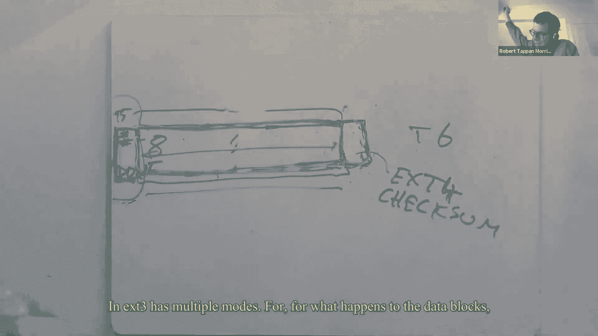

# P15：Lecture 16 - File System Performance and Fast Crash Recovery 英文版 - MCATIN-麦可汀留学 - BV1rS4y1n7y1

所有的权利，其实是时候开始了好吧，嗯好吧，就像弗兰兹说的自由，随时提问随时打开相机，这样我们就可以把对方看成人，这将是另一个关于日志记录的讲座，这一次，Linux EX中当前测井综合系统的案例研究。

应用极其广泛的T三文件系统，和，我们会试着蘸一下，一些现实世界的设计问题，高性能文件系统必须处理的问题，当它向文件系统添加登录名时，我只是要去，我要花几分钟基本上回顾一下，我们为什么要谈论日志记录。

我们觉得伐木很重要的原因是，这是一个非常成功和重要的想法，几乎就像，日志记录是一种神奇的方法，可以将崩溃恢复添加到任何，几乎任何现有的存储系统，在许多方面，它与任何东西都是正交的，你实际上是想储存，嗯。

因此，您可以看到日志记录应用于大量不同的存储情况，当然是数据库和文件系统，还有许多非常专门的系统需要存储东西和在崩溃后恢复，您还可以看到在分布式系统中大量使用日志记录，作为组织从失败中恢复的一种方式。

因为，除其他外，日志记录是一种结构化的方式，嗯，如果我们能理解他们，另外，还有大量有趣的东西要咀嚼，当您试图构建高性能时，um测井系统，和，正如我几分钟前提到的，当我们谈论日志时，作为一个术语。

它在谈论这个，和今天的读者读物所说的一模一样，当时它说，使用日记这个词，它们只是同义词，嗯，并进一步，今天的阅读谈到了在e x t 2上加一本日记，结果文件系统的现代名称是E x T 3。

这就是我要怎么称呼它，好的，嗯，所以我想用我将要谈论的方式，在某种程度上，通过将它与十五六进行对比，并解释ext 3修复某些性能问题的方法，um x v六测井有，在此过程中改变了，撞车时会发生什么。

所有的权利，所以这是一个日志回顾，如果你还记得，嗯，嗯，我们有一个磁盘，x v六的文件系统磁盘，你知道你可以把它想象成两个部分，上面有一个文件系统树，具有根目录，和根目录下，也许还有其他目录。

在这些目录中，这可能是目录一和目录二，我们可以想到这个，因为文件系统只是一个数据结构，它是一个树结构的数据结构，也许它有文件，我坐在目录里，每个文件都有一堆，方块，里面一堆块的数目。

还有其他一些数据不是真正的树结构，就像有一个位图指示每个块，那个方块是不是，你知道的，免费或已分配，um和i节点以及目录内容，和位图块，我们将称之为元数据，与保存文件内容的块形成鲜明对比。

我们称之为文件内容块，好的，所以除了文件系统，xpsix有一个日志，它靠近圆盘的开始，xpsix日志比较简单，它有这个头块，嗯，数据块和元数据块，在这个初始标头块中，在日志中这些块应该写到的地方有块号。

就像，也许第一个应该去17号然后是2号9号，谁知道是什么呢，然后在电脑里，编写或创建，或修改文件系统的其他系统调用，嗯，计算机里有块缓存，最初，权限只进入块缓存，这些只是磁盘上的块的副本。

所以最初编写更新和文件块或i节点，或者不管这些利率是多少，然后在手术结束时，这些块被复制到日志中，当我们把所有的块复制到日志中时，然后我们将块号写入头块，表示此事务的更新值已完成，在文件系统的代码中。

您将看到，每个修改文件系统的系统调用，在某个地方有一个开始，在我做完之前，请不要做任何一件事，所以我们有一个，然后有一堆阻塞的读写，然后最后，它告诉文件系统，测井系统，我已经完全做了所有的权利。

我要这么做，从开始到结束，权限只转到缓存，当系统调用进行此结束调用时，然后文件系统将修改后的块从缓存复制到日志中，在它将所有这些修改后的块写入日志后，那么文件系统是否以单个磁盘速率写入块号，到标头块。

嗯，这叫做提交点，这是文件系统将这些阻止的数字写入头块之前的点，如果发生了撞车事故，那么在崩溃和重新启动后，这些权利都不会被应用，在文件系统写入头块的这些块号后，在磁盘速率完成之后。

那么即使在这一点上发生了崩溃，也可以保证，恢复软件会查看日志，看到标题块中有块号，并将标题块中提到的所有这些块写入它们的主位置，在文件系统中，这里发生了什么，这是一种允许系统中发生的所有权利的技术。

开始操作和结束之间的调用相对于崩溃来说是原子的，这要么是所有这些都发生了，因为文件系统得到了评级，崩溃前的标头块，或者它们都没有发生，因为崩溃发生在文件系统写入头块之前，因此，在崩溃和重启后，重要的是。

有一些恢复软件可以读取日志，查看标头块，并决定标头块中是否有块号，如果它这样做了，它就写，可能会将所有这些块重写到它们的家乡位置，如果标头块是没有任何块号，那么恢复软件什么也不做。

关于这个快速回顾有什么问题吗，好的，嗯，有几个非常重要的观点，嗯，记住xv6，事实上，大多数测井系统，一个是xv6，所有测井系统基本上都遵守，所谓的提前写规则，那就是，每当某个操作完成一堆写操作时。

这些权利都需要是原子的，系统必须编写所有这些，将所有更新的数据更新到日志中，在允许将这些更新应用于家庭位置之前，在文件系统中，也就是说，我们需要，pre，声明我们想要的所有更新都是原子的，pre。

在日志中声明它们，在我们将其中任何一个应用到文件系统之前，这叫做提前写规则，这真的是，日志记录如何允许崩溃恢复，因此写入头规则允许此更新集合以原子形式显示，关于撞车，还有一个规则我没说，嗯。

那就是我们不能释放或重用日志，你知道吗，我们xpsix一遍又一遍地使用日志，每次系统调用一次，我们不能允许重用日志，直到，日志中的所有权限实际上都被写入了它们的主位置，在磁盘上。

所以还有一个我称之为释放的规则，它说我们不能覆盖或重用日志，直到，你知道的，日志中保存特定事务的部分，你知道的，需要原子的权利集，我们不能重用日志的那一部分，直到日志该部分中的所有权限。

所有这些都反映在，文件系统中的实际主位置，所以XV中的交易是，在endopdo实际上首先引发了大量的工作，和文件系统，你知道的，正如我提到的，将所有块写入日志，写入头日志写入头块。

然后文件系统将所有这些块写入它们的主位置，就是普通的情况，然后文件系统第二次写入，你知道的，所有这些块到磁盘上的主位置，然后在所有的家庭位置都更新后，那么文件系统是x v 6。

文件系统从头块中擦除这些块号，表示我们已经完成了这笔交易，我们可以重用日志，在向日志中写入任何新内容之前，删除块号是至关重要的，因为我们不想处于，其中标头中有前一个事务的一些块号。

来自日志中可能有不同块号的新事务，因为崩溃可能会将这些内容应用到陈旧的块上，标头块中剩余的数字，所以我们要先擦掉头块，所以有一个释放规则，这是在我们被允许从日志中删除事务之前。

我们必须将所有这些块写入文件系统，好的，所以这样做的净效果是，文件系统更新，这可能很复杂，需要多次写入，净效果是使每个系统调用本质上都是原子的，它的所有权利都不是关于撞车的，好的，所以嗯，因此。

连接Linux日志记录方案的桥梁是一个问题，XP 6日志记录有什么问题，你知道的，为什么Linux不使用与XV Six完全相同的方案，ds，答案基本上是它很慢，XV6游戏相当慢。

在像write或create这样的系统调用之前，每个系统调用都可以返回xv six，嗯，我刚才说的所有这些都必须完成，因此，在文件创建之前，系统调用可以返回用户空间，它必须完成所有最终做的事情。

这意味着每个块都对着日志，右键标头块，将所有这些块写到它们在这里的位置，然后擦除标头块，然后你可以回来，在这段时间里，嗯，不仅每个系统调用都需要很长时间，但文件系统中不会发生其他事情。

当任何系统调用正在提交时，然后把它的块写到它们的原址，所以系统调用真的一次一个地发生，每个系统调用都需要多次磁盘写入，和，每个系统调用的专业术语都必须等待其所有磁盘速率完成，被称为同步。

可能拼写和那个不同，十五六，系统调用相对于磁盘权限是同步的，所以他们非常，非常慢，非常慢，用机械硬盘，因为每一个权利，你知道的，基本上需要十毫秒，我们说的是系统调用的许多权限。

所以xpsix每秒只能做几个文件系统修改系统调用，我想知道如果我们在固态硬盘上运行XP 6会更快，但仍然没有达到应有的效率，另一个需要注意的更详细的事情是，每个块都在x中写入两次，五六方案。

它被写入日志一次，然后第二次写入磁盘，所以这也是你知道的，那是有充分理由的，但它是未来三个部分修复的东西，好的，所以嗯，在Linux上是在今天的阅读，这有点像我要谈谈这个前任，T三文件系统。

这就是几年后今天的阅读变成的，经过更多的发展，以前的日志文件系统，所以他们真的玩了这个游戏，把现有的存储系统，在上面进行分层伐木，以一种留下潜在E的方式，x，两个文件系统几乎未修改，虽然不是很。

所以在某种意义上，伐木很容易，你知道，至少在原则上，对他们来说很容易升级，EX T 3保存类似于，到xpsix在内存中，有一个块缓存，写回缓存，有一堆缓存块，其中一些是干净的。

因为它们从那以后就没有被修改过，你知道的，与磁盘上的内容相同，有些很脏，自从从磁盘上读取它们以来，它们被写入的感觉，他们中的一些人被钉在里面，它们不允许被写回磁盘，因为右后卫的规则，我是说。

因为释放规则，右手规则，它可以维护关于多个事务的信息，这些事务同时处于不同的执行阶段，所以可能会有许多不同的事务，T3系统跟踪每一个，每个事务都有一个序列号，事务系统是的块号集。

日志系统正在记住被该事务修改的块，所以这些是，一组块号，这实际上是指缓存块，因为任何修改，至少最初只发生在缓存中，然后一组所谓的句柄，哪些是有关当前仍在执行的系统调用的信息，作为事务的一部分。

读写缓存块，在光盘上，就像XV6一样在磁盘上，有通常的文件系统树，i节点、目录块和文件，什么的，您知道每个块是否是数据，块被分配或空闲，所以这些就是我所说的，文件系统块的主位置。

然后在磁盘的一个指定部分，有日志，到目前为止，这和xpsix很相似，主要的区别是E，x，同时跟踪多个事务的能力，在他们执行的不同阶段，现在我想更仔细地看看日志里有什么，和e x t 3。

它与xpsix日志中的有点不同，真正的日志格式，嗯，在日志的开头，有一种叫做超级块的东西，和超级方块，这是原木超级块，不同于文件系统超级块，嗯，日志中的第一个有效事务，所以它会有一个偏移量。

它只是日志中的字节号或块号，然后这个序列号，记得我说过每个事务都有自己的序列号吗，然后剩下的原木，日志只是磁盘上的一堆顺序块，已知大小的，每笔交易，法律的其余部分由交易组成，每个事务由描述符块组成。

就像在XV六中的头块一样，然后这个，你知道的，对于这些块号中的每一个，与该块号相对应的实际更新内容块，最后是一个实际完成并提交的事务，会有一个提交块，这是日志中的一个单独块，因为可以有不止一个。

日志的um事务，提交块之后可能会有下一个事务，描述符块，然后一些数据块，然后可能，所以我们可以有多个，所以我们可以想到它们之间的偏移量和序列号，呃，指向第一个，最早的最低编号的开始，日志中的有效事务。

这里有一个小细节，一会儿就会变得很重要，这些描述符块和提交块，嗯，以便能够帮助将它们与数据块区分开来，当他们在崩溃和恢复后扫描日志时，提交块上的描述以一个神奇的数字开始，这只是一个32位的数字。

不太可能出现在数据中，这有助于日志软件区分描述符和提交块与数据块，好吧嗯，考虑到这一点，考虑到这个结构，E的方式，x，c，三个得到良好的表现，真的有三个主要的，哒哒，是呀，一个问题，有没有可能。

至少在这个系统中，在提交块之前有一个描述符块，让我们说，正在进行的两笔交易，同时日志中可以有多个事务，在下一个事务开始之前，是否需要完成一个事务，是啊，是啊，但稍后再谈，但事实就是如此，是呀，那个嗯。

一次只有一个未完成的交易，这真的不是很合适的照片，因为当前打开的事务，当前打开的事务是，是系统调用正在对其执行权限的事务，因此当前打开的事务实际上只存在于内存中，因为当前的系统调用正在更新。

他们只是在更新，阻止内存中的缓存块文件系统块，当EX T 3系统决定完成当前打开的事务时，嗯，你知道的，在决定完成之后，我会做两件事，一个是它将开始一个新的开放交易，这将是下一笔交易。

然后它将写入刚刚完成的事务，它将开始将刚刚完成的事务写入磁盘，这可能需要相当长的时间，所以你知道，完整的故事是磁盘上有一堆旧的事务，都是封闭的，加上一个真正只存在于内存中的打开事务，至少在最初。

磁盘上的这些事务可能仅以日志记录的形式存在，至少最初没有被写到他们的家乡，然后在后台呆了一会儿，嗯，从最早的事务开始，测井系统会，你知道的，将日志中的这些更新块写入它们的主位置，然后。

一旦完成了每一个完整的交易，那么日志系统就可以释放和重用日志中的这个空间，所以当你到达圆木的末端时，这真的是一个圆形圆木，日志记录系统从一开始就开始使用这些块，你知道必须释放他们。

通过将这些块写入它们的家乡位置来释放它们，在它可以重复使用它们之前，好的，好的，所以有三种方法，系统得到EX，c，三个得到良好的表现，一个是它有异步系统调用，这是系统调用，在他们写完磁盘之前返回。

有一个系统叫做更新内存中的缓存块，然后返回，从来不用写磁盘，永远不必等待磁盘写入，虽然可能会等待阴险的人，性能的下一个大想法是批处理，如何将多个系统调用批处理到单个事务中，性能的最后一个重要思想是并发。

这些都是，这些基本上是三个，XP6不行吗，好的，所以我要谈谈这三种表演技巧中的每一种，哦对不起，我想问一下配料的事，是呀，xpsix允许启动多个系统调用，最终，嗯，有点同时，这样他们就会一起承诺，是啊。

是啊，那倒是真的，XP六是有限数量的批处理，好的，见，谢谢。好的，所以首先，这只是意味着系统调用返回，但它们在缓存中被修改了块，然后返回，并不特别，所以这有一个明显的优势，系统调用返回快，嗯。

它还允许IO并发，也就是，应用程序可以使一些文件系统，系统调用，这意味着文件系统应该执行一系列磁盘操作，磁盘写入，嗯，但是应用程序可以返回到计算中，呃，与文件系统并行，做那些系统调用所要求的任何权利。

所以这被称为没有异步系统调用的IO并发，很难获得IO并发并发，磁盘操作和应用程序计算之间很难重叠，如果应用程序总是必须等待磁盘写入完成，和，异步系统调用的另一个好处是。

它们允许它们更容易进行大量的批处理，所以它们有点帮助配料，异步系统调用的缺点是，这意味着仅仅因为系统调用返回并不意味着工作，嗯你，系统调用应该完成并且实际上已经完成，例如。

如果您编写一个创建文件并向其写入一些数据数据的程序，然后关闭文件，然后将控制台上的done打印给用户，然后在重新启动计算机后拔掉计算机的电源插头，您的数据可能不在那里，即使所有的系统调用都返回了。

即使节目只是说，你看，你知道的，我打了那些系统电话，他们回来了，嗯，这意味着在一个具有异步系统调用的世界中，申请必须写得更仔细，如果他们，如果他们关心他们在撞车方面的行为，这其实是件大事，在嗯，在十六。

如果返回费率，数据在磁盘上，在崩溃后会在那里，如果写返回，只是你不知道撞车后会发生什么，可能在也可能不在，所以有可能，尽管异步系统调用来编写仔细的程序，像数据库需要小心，文本编辑器需要小心。

我写了一个文件，你知道我不想，如果停电，当我在文本编辑器上写文件时，我不想，重新启动后查看垃圾或部分文件，我想看看旧文件或新文件，因此，文件系统还为仔细的应用程序提供了一些技术。

在崩溃的情况下获得可预测的行为，主要的工具叫做系统调用叫做f sync，你知道所有的UNIX系统都有，这基本上是说你给它一个文件描述符，它告诉文件系统看实际上做所有的权利，你知道，我可能打过电话。

写一堆叫做F同步的，我现在想让你真正写，并且在权限到达磁盘之前不要从系统调用返回，并且保证还在那里，如果发生撞车事故，因此，如果您查看数据库或文本编辑器的源代码，或者其他一些真正关心数据的程序。

你会看到一些精心放置的对f sync的调用，为了克服这一点，回击这些异步系统调用，大多数节目，虽然像你的编译器，你知道，如果编译器的输出消失了，这没什么大不了的，如果发生撞车事故，因此。

你知道的许多程序不调用f sync，很高兴获得异步系统调用的良好性能，也不担心自己的撞车行为，好的，这也是，呃也叫同花顺，有时因为我觉得那些话，这个词我听过很多次了，是啊，是啊，是啊，是啊。

你可以用一个合理的方法来解释F Sync的作用，它将以前对此文件的所有写入刷新到磁盘，并且只返回这样的同花顺是一个合理的词，刷新写入磁盘，好的，这是西格玛系统调用下一个，呃，技术，三种用途是配料。

这里的游戏是在任何一个时候，总有一个，x 3中的开放交易，e x t 3，EX T中的一笔交易实际上可以拥有许多不同的权利，许多不同的系统调用，所以XT 3的方式是说，嗯，我现在要开始一笔新的交易。

然后在接下来的几秒钟里，执行的所有系统调用，他们的权利，是那一笔大交易的一部分，我想默认情况下，E x T 3每五秒只创建一个新事务，所以每笔交易最多可以有五秒钟的时间。

价值的系统调用作为一个巨大的批量，然后在五秒钟结束时，EX T 3将进行这笔大交易，他们可能有数百个更新的块在里面，将此事务作为单个事务提交到磁盘，所以这是一场胜利的原因，首先呢。

它分散了一些固定的交易成本，在许多系统调用中摊销一些固定的事务成本，例如，您必须编写描述符块和提交块，你必须在机械驱动器上寻找，至少，你必须寻找并让驱动器旋转到日志所在的地方，这些都是很大的成本，嗯。

它们只需要批量完成一次，而不是每个系统调用一次，所以它降低了那些，这些费用，另一个重要的是，另一个重要的是，它允许正确的吸收，您有一个完整的系统调用序列，最终一遍又一遍地修改相同的块，例如。

如果我创建了一大堆文件，我需要分配一堆i节点，这意味着所有的iOS都很小，也许64字节，这么多我的笔记适合这个街区，因此，在一行中创建一堆文件将会很脏，几个块中的许多i节点，因为方块有很多我的笔记。

同样地，如果我在一个文件中写入一堆数据，我可能需要分配很多数据块，我可能会翻转无块地图中的许多位，如果我分配相邻的块，他们的部分将在同一个块中，所以我可能会在一个街区内翻转许多比特。

如此多的系统调用最终可能会一遍又一遍地操作相同的块，如果在系统中批量处理这些，相同块的许多方式只是很快地发生在C上，只是到缓存，块的副本，因为我们没有写磁盘，然后我们写磁盘的那些少量块。

只在事务结束时一次，单块直接进入ON，把它写进日志反映了很多，对同一块进行修改的多个系统调用，所以这个正确的吸收可以，与像X这样的同步系统相比，v，六，最后一个大胜利是磁盘调度。

假设我们必须向磁盘写入一千个块，结果效率要高得多，当然在机械驱动中，但即使在固态硬盘中，一次将一千个块写入顺序位置，就像你对木头做的那样，这样做比写一千个块快得多，一次一个，到不同的地点。

甚至一千个街区，你知道的，甚至在日志中写入相同的块一千次，通过把磁盘，大批量的权限做磁盘可以效率高得多，还有就是，不是，我们不仅从编写大量的块中获得了效率，在日志中依次，即使我们去写这个的家庭位置。

为了一批权利，在单个大交易中进行批量操作而产生的，即使我们能给驱动器大量的权限，即使他们在不同的地方，因为他们去了，你知道的，由许多不同的系统调用引用，如果我们允许磁盘调度大量不同的写。

它可以选择一个订单来做它们，这特别有效，在机械驱动中，这将，嗯，把它们分类，你知道，按驱动器上的轨道号对它们进行排序，呃，你知道，只是从一个到下一个的一点点寻找，他们可以这样做如果你同时给它所有的块。

但即使在固态硬盘上，事实证明，给圆盘带来的风更小，反正有很多工作要做，所以你只能得到这种磁盘调度，如果您有大量访问驱动器的权限，所以这是批处理的另一个胜利，最后一场大胜，EC3得到的是并发的。

它实际上有两种并发性，它从中受益，与xv6相比，一个是它可以允许多个系统调用同时执行，这样我们就可以并行地进行许多单独的系统调用，直到E X T 3决定关闭并提交，系统调用不必相互等待。

它们都可以修改作为当前事务一部分的块，所有这些，许多系统调用可以并行执行，并为当前事务贡献块，这在多核机器上尤其重要，我们不想有不同的课程，在十五六号等锁，我们经常，通常情况下，你不被允许。

一个名为无法进行的系统，因为，当前事务正忙于执行其他操作，大部分时间在XT三，许多系统调用可以修改当前事务，另一种方式，第三个并发是可以有多个事务，处于不同执行阶段的旧事务，所以系统调用是真的。

你知道吗，只有一个打开的事务可以接收系统调用，但是其他将东西写入磁盘的事务可以并行进行，所以说，事务生命中可以并行进行的不同阶段，首先，有一个未完成的交易，可能有一些最近的事务，文件系统正在提交它们。

但仍在将他们的块写入磁盘，所以我们有一些事务当前正在提交到日志中，我们不必等这些完成，也就是，我们可以在新的打开事务中继续进行系统调用，而上一个事务仍在写入日志，并且实际上还没有完成，我在承诺，当然啦。

当事务将其提交块写入磁盘时，此阶段结束，日志，可能会有更古老的事务，将其块从缓存写入修改块的主位置的事务，最后，这不需要太多的工作，但可能会有最古老的事务被释放，这并不真正需要工作本身。

工作是把交易写到他们家，他们家乡的街区，但不管怎样，在这些不同的阶段通常存在多个事务，所以特别是，我们的新系统调用可以执行，而无需等待旧的事务，完成对日志的提交或完成将它们的块写入它们的主位置。

与xv6形成对比，新的系统调用必须等待这个，为所有人完成，对于以前的一笔交易，我有个小问题，嗯，那么它是如何工作的，当有手术的时候，或者当某些东西写入缓存块时，块也被写入磁盘，好的，所以有，嗯，呃。

所以这确实是一个问题，呃和，呃，你知道，的，事务写入日志的内容，在该事务之后由系统调用进行的任何块更新，因为如果你这么做了，你会冒着承诺的风险，更新，所以我们负担不起交易，前三名处理这个问题的方式，嗯。

至少在名义上，它复制了，当它决定结束当前打开的事务时，它为该事务复制所有块，截至它结束这笔交易时，所以它可以复制所有的块，然后是块的副本，事务提交到其日志中，任何较新的事务都有该块的自己副本，他们修改。

从我们提交日志的那一刻起，这是一个不同的副本，为了提高效率，系统实际上使用了一种正确的复制方案来避免复制，直到它真正注意到一个较新的事务需要写那个块，那也有道理，好，所以。

并发性再次帮助性能的原因是它可以帮助我们，如果我们能并行运行系统调用，我们可以得到多核并行性，如果我们能在写磁盘的同时运行应用程序和系统调用，然后我们就可以得到我，o。

CPU和CPU执行与磁盘之间重叠的并发性，i，o，所有这些帮助都使用了硬件资源，机器效率更高，更密集地，所有的权利，关于并发性的任何问题，我只想给你一个实际的文件系统代码的味道。

如果您查看文件系统的Linux源代码，有点抽象，这是每个系统调用的外观，因此您可能有一个未链接的系统调用，这个是，你知道吗，从x v 6开始就很熟悉了，我们需要每个系统调用，需要说，这是写入序列的开始。

你知道我正要写一系列的文章，对于崩溃，它们需要是原子的，所以任何事务系统中的每个系统调用都很好，必须有一个明确的开始和结束，你知道，这两点之间的一切，呃需要原子，有一个开始，调用系统调用代码，事实证明。

前三名必须意识到，活动的不同系统调用，嗯，原因我一两分钟后解释，所以每次系统调用启动时，它实际上得到了所谓的手柄，这是这个特定系统调用的一种唯一标识符，它赋予我们的权限是文件系统跟踪的日志记录，哦耶。

这个权利是由这个特定的系统调用完成的，然后系统调用需要读写块，所以它可以抓住一个块或真正的缓冲区，块缓存缓冲区进行get调用，它告诉它把手，然后是它需要读取或写入的块号，如果你需要修改很多块。

我可能会做很多这些，然后会修改，所以它会修改缓存中的块，当它这样做的时候，完成此特定的系统调用，它就会叫停，这主要是为了通知日志系统，你知道的，一旦一个系统，一旦一个叫做Start的系统。

不允许提交事务，直到在该事务中启动的所有系统调用都完成，所以说，嗯，因为可以有多个事务，系统必须能够，所以把手的原因之一，所以系统，文件系统可以记住每个称为哪个事务的系统，它是哪个事务的一部分，嗯。

所以它知道，哦，这就结束了，嗯，这是特定事务之前等待的系统调用之一，它实际上可能会，我们把手柄传给离嗯更近的获取系统，如果每个系统，每个事务都有一堆与之关联的块，作为该事务的一部分修改的块。

所以我们在这里说的是，以及获得指向块的指针，我们在告诉测井系统看，此块号是此句柄引用的事务的一部分，这个停止呼叫实际上不会导致提交，它只是告诉日志系统看，您知道在此事务中活动的系统调用少了一个，嗯。

所以事务只能提交，如果在此事务中启动的所有系统调用都已调用stop，这笔交易必须做一些簿记。必须记住所有开始的手柄，这样它就可以检查它们，和，以这种心智结构，我只是要列出它所需要的完整序列，提交事务。

所以你知道在某个时候，你知道每五秒钟，文件系统会自己思考，您知道现在是提交当前打开的事务的好时机，所以当，下面是提交事务的文件系统所涉及的内容，所以这些就像台阶，所以首先，我们必须阻止任何新的系统调用。

对呀，我们需要我们的交易，呃，仅反映整个系统调用，所以我们真的不想让任何新的事情开始，当我们试图提交这笔交易时，因此您需要阻止新的系统调用，我要说的还有另一个原因，为什么我们需要阻止新的系统调用。

这实际上是一个性能缺陷，这里会有一段时间，当系统调用必须等待且不允许执行时，所以那太糟糕了，第二步是有一堆已经开始的系统调用，是此交易的一部分，那我们就等他们吃完，所以我们需要等待未完成的系统调用。

在此事务中，因为，当然啦，我们希望交易反映他们的所有权利，所以我们需要等待他们完成接下来发生的事情是，你知道的，一旦此事务的所有系统调用完成，我已经用他们的权利进入缓存，原来。

那么就可以启动一个新的事务，让这些被阻止的系统调用继续进行，所以现在我们将为这些打开一个新的事务，以便进行后续的系统调用，但现在我继续我们最初的交易，现在已经关闭了，所以你记得EX中接下来的日志，嗯。

所以现在我们知道了，被此事务中的所有系统调用修改的块，因为他们都叫它得到，有一个手柄，告诉我们他们是什么交易的一部分，所以我们知道这个事务的完整修改块集，所以现在我们可以把它写到描述符块。

它有所有的块号，对于此事务中弄脏的所有块，我们还将把实际修改过的块从磁盘缓存写入日志，事实上，某人，有人问如果下一个事务修改这个块会发生什么，我们在这个阶段实际上在写什么，是此事务块的保存副本的类型。

截至完成时，所以我们要写实际的，块到日志，现在我们要等这些权利完成，这些需要完成，然后我们才能进行，一次，描述符，数据块被保证在磁盘上，然后我们可以将提交记录写入日志，一旦写完，我们要等它完成。

我们正在等待提交率在这一点上完成，一旦提交率完成，这个事务的专业术语是这个事务已经到达了它的提交点，也就是，这是有保证的，在这一点上，牵引中的权利保证在撞车时幸存下来，如果在此之前发生了崩溃。

则在编写提交块之前，事务中的权限在崩溃和重新启动后不会出现，并运行恢复软件，如果现在发生崩溃，提交点之后，将提交块写入磁盘后，那么他们就得到了这些权利的保障，交易中的所有权限保证在崩溃后出现。

重新启动和恢复，好吧，现在，只有现在在背景中，所有这些都发生在背景中，现在我们可以将事务块写入它们的主位置，在文件系统中，然后呃，正如我将在所有这些权利完成后的几分钟内谈论的那样。

对于作为此事务一部分的所有块，只有这样，我们才能重用日志的那一部分，所以在一个非常繁忙的系统中，如果法律的头赶上了尾巴，实际上我们可能无法开始新的交易，直到最早的事务的所有这些权限都完成。

因为我们可能需要日志空间，所以我们，你知道的，我们可能需要重用最古老的事务，我们必须为其写入日志空间，写所有的猫，它的缓存块到他们的家庭位置，你们通常会把原木做得足够大，这种情况很少发生。

这样这些东西就可以在后台进行，关于这些步骤有什么问题吗，哦，对不起，那些来自哪里，适合做这个文件系统的东西，你能再说一遍吗？哦，所以你说没有一个过程是等待这些事情完成的，那么他们安排在哪里。

他们跑到哪里去了，哦，有一个背景线程，是一个背景线程，在内核中专用的凌乱，谢谢。有问题，实际上是关于重用部分日志，所以让我们，让我们说，最终我们开始使用日志的特定部分，和那个特定的。

我想刚才提到了日志的特定部分，实际上在我的新交易中，实际上最终使用了刚刚释放的整个日志部分，没有别的了，没有地方装锁了，用锁，然后就像用系统一样，只需等待日志的另一部分被释放，还是会对是做其他事情。

会等的，嗯嗯，让我让我，我先画张图，帮我确保我回答了正确的问题，这里，嗯，你知道我们可以想到日志，如你所知，只是圆盘的这个线性部分，在任何给定的时间，你知道吗，也许最古老的有效交易是，你知道吗。

这个地区没有七个，也没有八个，我们有九个，我们我们，你知道我们想开始，你知道我们想在这里放十个，让我们看看哪一个，你知道的，我们想办理一笔新交易，把它放在这儿，我们可能要等到七点。

将其所有块写入其家乡位置，这样我们就可以释放它，这可能意味着交易10中的交易可能不得不暂停，等待日志中的此空间释放，这就是你所说的吗？是啊，是啊，所以让我们说，所以一开始可能是这样。

我现在可以在实际的空闲空间里为交易10放入块，但最终如果锁足够大，它只是会耗尽可用的空间，在这一点上，它只需要等待交易7被记录，好的，是呀，是呀，当然，如果有足够的活动进行，圆木缠绕得足够快。

你可能最终不得不等待，我们甚至可能无法启动系统调用，因为我们，在我们可以释放日志中的空间之前，对于他们要修改的块，你知道吗，如果你关心这个细节，原来这里有一些潜在的死锁，要求，就是说，e x，t。

三端系统调用，必须预先声明他们需要多少块，这样日志系统就知道有多少，你知道的，我可以考虑是否有足够的空间来进行这笔交易，因为我们不想让交易开始，我们实际上无法进入锁，好的，让我们嗯，假设这是新的原木。

或者您试图进行的新交易，变成了8次交易所以你要等7次和8次，对呀，那么这是如何工作的呢，你的意思是，好的，至少在这个图中都完成了，或者所有的系统调用都已经完成，这些事务在日志中提交，因为这些是旧的事务。

所以在这张照片中，至少我们刚刚开始交易十，因此，新的系统调用将写入事务十，是的但你说过10号交易不够大，所以你需要嗯免费交易七，对是的，你需要等待它像提交到磁盘，是呀，但是如果你，如果10比7大的话。

就像它有八笔交易，那我们要等两个，是啊，是啊，我们有，我们可能要等，不管十大交易是什么，你知道吗，我们需要，我们在磁盘上需要足够的空间来容纳它，原木里没有足够的空间来容纳它，确实如此，如果交易十。

结果是大的，它可能需要强制多个事务，多个最古老的事务，写信给他们的家乡，解放自己，我想代码是如何工作的，喜欢吗喜欢吗，就跑过去看看它有多大，就像说嘿，这里有一笔交易，这里有一笔交易。

这就像我必须等待他们两个，文件系统知道，知道日志中的所有事务有多大，它记得，记得，我是说，实际上文件系统对这些旧事务的记忆相当多，它知道每一个，不管是写的，您知道，因为文件系统跟踪每个块，所有这些。

这些旧事务中的每一个，它是否已将该块写入主位置，这样它就能知道，哦，我已经写好了，它可以知道，是否认识到我们刚刚完成了所有事务7块的编写，或交易六个区块，所以这里有相当多的簿记工作。

以便文件系统详细了解每个旧事务的状态，好的，所以呃，的确，有一些关于如何重用日志空间的主题，这里有一个小细节需要说，如果你还记得在开始的时候让我让我写一个图表，其实有一个超级方块。

虽然日志开始的日志超级块，所以在任何给定的时间，你可能会有日志超级块，然后呢，啊，一组事务，你知道，也许有第四笔交易，这是最新的交易，然后是事务1和旧的事务，所以这意味着，当然圆木是绕着的，嗯，你知道。

是否可以重用日志的一部分的规则，你知道，我以前提到过，我只想再说一遍，我们可以重用日志，说我们可以重用日志的这一部分，交易二在，如果你犯了，嗯，T2的所有街区都被写到了他们的家乡，在文件系统中。

所以在崩溃后永远不需要重播这些块，如果事务2之前的所有事务也被释放，所以如果这些条件都是真的，然后我们就可以释放并重用T 2所在的日志部分，所以我们只能还原两个，第二个是之后。

没有一个完成了所有的提交和将其框写到日志中，到家庭位置，也是，然后这个超级块是为了方便崩溃后的恢复软件，如果我们决定我们可以，如果文件系统决定释放并重用日志的特定部分，它将超级块重写为超级块。

有一个指向第一个的指针，日志中的事务，因此，作为释放部分日志的一部分，文件系统修改超级块以指向新的，日志中现在最早的事务的开始，然后呢，当然啦，恢复软件读取超级块，找到日志的开头，好的。

所以如果发生撞车事故，当然，撞车会导致RAM中的所有东西蒸发，所以文件系统保存的所有簿记，哪些块被写入了他们的家乡位置，这一切都失去了，如果发生撞车或停电，然而。

所以其中一个假设是RAM上没有任何有用的东西，唯一能保存下来的东西，崩溃是磁盘上的任何东西，但我们绝对参与了所有这些关于伐木的讨论，假设磁盘完好无损，磁盘没有问题，所以也许你应该考虑的是，停电了。

一切都在嗡嗡作响，然后停电了，系统在某个时候停止了，光盘在恢复电源后，光盘上只有断电时的任何东西，所以我们绝对不考虑光盘，当然啦，可能会打断，你知道，在提交过程中的任何事务，或尚未承诺，嗯，要么。

事务的提交或事务块的写入其本地位置，这意味着磁盘上的日志，当电源恢复和恢复软件运行时，它会有一堆完整的，交易旧，完成交易，也许第一和第二，嗯，让我想一个新的例子，用于回收，呃，假设我们又有了，超级方块。

最古老的交易，六点钟，然后是七个，我们在撞车前一直绕到八点，嗯，有一个T五，啊，但是八个，让我们想象已经开始覆盖了T phi的第一部分，因为我是，但恢复软件不一定知道，让我们看看。

超级块指向T 6作为最古老的有效事务的开始，你知道所以五个，免费的，我们将用攻击盘重新启动，恢复软件读取超级块，这样它就知道日志的开头在哪里，然后恢复软件会在日志中向前扫描，试图找到日志的末尾。

但我们需要有一种方法让它真正弄清楚，哦，你知道的，那是日志的结尾，它的方式，也就是，我们知道每个事务都由一个描述符块组成，指示事务上有多少数据块，描述符块说，哦耶，有十七个数据块。

我们预计有17个数据块，最后是提交记录，然后另一个描述符记录，然后是描述符块所暗示的数据块的数量，然后另一个提交块，所以向前扫描中的日志Solis，也许六号和七号可以，然后它就会看到八英尺八英寸。

得到了一些描述符块，那么恢复软件将期待事务H的结束应该在哪里，寻找一个，提交块，所以，你知道的，这里可能发生了几件事，可能是，他们确实提交了事务，恢复软件找到了提交块，它就会寻找另一个。

你知道它不知道交易，一个Celester交易需要弄清楚这一点，所以它会看下一个街区，查看这是否是有效的描述符块，嗯，现在我们知道这个块实际上只是交易五中间的一个随机块，而根本不是描述符块。

问题是恢复软件如何可靠地区分，哦，这只是一个旧事务中间的一些数据块，也可能是事务九的描述符块，他猜到了一个可靠的方法，这是神奇的数字还是的，还是只保留了一点，确实有每一个，呃，描述符提交块从一些。

嗯幻数，只是一个32位的值，恢复软件正在寻找，我其实不知道是什么，嗯，游戏肯定是我们到了交易八的结尾，如果下一个方块以神奇的数字开始，嗯，那么恢复软件将假设，哦，这是一个有效的描述符块，对不起。

快速问题，嗯，试着喜欢会不会不可靠，将其解释为描述符块，尝试读取它指定的相似数据块的数量，然后就像，看看在块数之后的预期位置是否有提交块，如果好的话，当然，如果这个块看起来确实像描述符块。

然后它将向前跳过并尝试读取相应的提交块，和，如果提交块看起来不像提交块，用正确的神奇数字，它不会相信这笔交易，那是那是，这里剩下的一个小细节是，我们在这里看到的这个块，我们想知道，或者恢复软件在想。

如果是描述符块，这可能只是交易五中间的一个街区，它可能就像数据块一样，从一个碰巧以神奇数字开头的文件中，嗯，所以你知道，作为最后的细节，的，日志系统需要能够区分，在以这个幻数开头的有效描述符块之间。

只是一些以神奇数字开头的数据块，你知道，你可以想象各种各样的方法来做到这一点，事实上，什么E X，第三个做的是每当它要向日志中写入一个块时，这不是描述符块或提交块，如果那个方块以神奇的数字开始。

它用零代替了它，um设置与该事务描述符块中的该块相对应的位，这一点意味着这个特定的数据块以神奇的数字开始，我们用零代替了它，然后如果恢复软件需要重播那个块，所以让我们说。

事务8有一个最初以神奇数字开始的块，它会设置位，与该块和描述符块相对应的魔法标志，用零代替幻数，如果恢复必须重播此块，它会看到那面旗子，在将此块重播到自己的位置之前，将用神奇的数字代替零。

除描述符外没有块，或者提交块可以在这个日志记录系统中以神奇的数字开始，所以我们从来没有这种模糊性，如果提交块后的块以幻数开头，那么它必须是一个描述符块，好的，嗯好吧，所以恢复，我们在做恢复。

它从超级块所说的最古老事务的开始的块开始，它向前扫描，它会向前扫描直到嗯，你知道的，它查看描述符，是否有相应的提交块，它一看到就会停下来，哦，提交块后面的块根本不是描述符块，嗯，或者是的。

提交块后面的块是描述符块，但是应该是相应的提交块的不是，实际上是一个有效的提交块，它没有神奇的数字，所以在这一点上它会停止，恢复软件将宣布锁已结束，嗯，在最后一个有效提交块，它会忽略。

在这之后可能会有一个开始提交但没有完成的部分事务，但是恢复软件忽略了部分交易，你知道的，因为它没有所有的权利，所以它不能从原子上恢复它，然后恢复软件会通过，返回日志的开头并重播每个块。

将每个块重写到其主位置，从日志到最后到最后，有效提交块，然后它可以重新启动最好的操作系统，启动操作系统的其余部分，普通程序可以在恢复完成前运行，你不能，你知道你不能运行任何程序，因为文件系统。

我有个小问题，嗯，我想你以前提到过这个，但是这个日志事务方案缺少哪些部分，和xv6um，最主要的是，和解雇一个，xp six是在日志中有多个事务的能力，所以xv6日志中最多只有一个事务，所以你不能。

在XV中没有这种并发性，当我执行时，你知道这将与交易七并行，e x t 3可以将事务6提交到磁盘，嗯，那是不可用的，在e x t x v 6中不可能并发，因为日志只保存一个事务。

所以我们必须完全完成一笔交易的所有工作，在我们被允许开始下一笔交易之前，所以它是正确和简单的，但是你没有从X6中得到很多并行性，好的，谢谢。你是说它仍然可以有多个事务块，但它就是不能异步执行它们，对吗？

xp 6和x3 6是的，它只有一次，它决定，嗯，我是说画面有点混乱，因为可以允许对单个事务进行多个系统调用，所以x2 6实际上有一些并发性，还有一些这个批次，一次，S6决定开始提交事务。

它必须完全完成这笔交易，将其提交到磁盘，你知道的，写入标头块，将块写入主位置，然后从日志中擦除事务，在执行任何新的系统调用之前，它必须做所有这些事情，因为无处可去，你知道的。

没有地方可以放置新系统调用的修改，直到上一个事务完全完成，所以X VC有点，你知道，它可以运行几个系统调用，然后提交事务，然后再运行几个系统调用，但它们不能重叠这两个，XE三凸轮，谢谢。

所以这是前三名设计中相对简单的一部分，嗯，原来还有一堆棘手的细节，其中一些我想谈谈，所以我之前提到过，你知道有一个开放的交易，但是当EC 3决定关闭开放的交易时，它必须等待该事务中的所有系统调用完成。

然后才能，允许启动任何新事务，所以也许有一张照片是你知道我们有，原始旧交易T一，然后就有了，你知道的，多个系统调用，在事务一中执行，如果我们想关闭交易一，我们必须停止接受新的系统调用。

因为我们想等现有的完成后再提交，但是在这些系统调用完成之前，不允许在x t 3中启动新的系统调用，所以如果这里有第二个交易，交易二不允许发生任何事情，否，什么都不允许，允许启动系统调用。

直到这些系统调用完成，只有这样，事务才能开始接受系统调用，所以在这里有一段时间，新的系统调用都被阻止了，所以你知道这会降低性能，因为您可以执行系统调用，但我们不允许，问题是为什么E X。

t 3不允许在事务2中启动新的系统调用，直到事务1中的所有系统调用，这是个好问题，因为它限制了性能，所以让我给你举个例子，如果我们，如果不是三个人做的，可能会出现以下糟糕的情况。

所以让我们假设事务1只是说一个系统调用，这是一个创造，被调用来创建文件的系统，也许是一个名为X的文件，这个想法是在这个创作完成之前，呃，文件系统决定要启动一个新事务，打开新的交易，并且它将接受在。

在这个新的事务中，所以我们要说在一个结束之前有两个开始，我们现在在事务二中开始执行系统调用，也许事务T两个调用取消了其他文件的链接，那么取消链接将释放与y相关联的i节点，所以也许一个，所以我有时间。

在我的图表中这样走，也许在这个时间点上，事务标记i节点是空闲的，标记Y的离子是自由的，创建，当然必须为x分配一个i节点，也许它在这个时间点分配了一个i节点，因为信条是在解除链接后分配的。

它可能会重用相同的i节点，所以也许x得到的i节点和y的一样，也许我结点17是对的，然后你知道哪个好，因为取消免费设计说明的链接，所以看起来不像是问题，但你知道重点是我们正试图完成第一笔交易。

那么当创建完成时，我们结束第一笔交易，我们要写，假设事务一实际提交，我们将其所有修改写入磁盘，嗯，假设在未链接之后需要一段时间，还没结束呢，嗯，假设在此提交完成后，撞车了，当恢复软件运行时。

它将看到事务1提交，交易二没有，所以恢复软件会完全忽略交易二，所以这意味着解锁从未发生过，这是正确的，恢复软件不会对磁盘执行未链接的写操作，因此不会释放i节点不会删除y，在崩溃和恢复之后Y仍然存在。

它还是会使用碘十七，然而，创建事务确实完成了，因此x也将使用i ode 17，所以现在我们错误地得到了两个文件，它们碰巧使用了相同的，i节点，这意味着他们会分享内容或写信给一个。

会神秘地出现在另一个文件中，这完全是错误的对，关键是当我们想解开Y的链接时，并在x中使用释放的i节点，而不是a，我知道那已经在用了，所以这里出了大问题，你知道，一种思考的方式是，在运输中断开联系。

在本应进行的交易中，写了一个方块，修改了一个块，并且基本上该修改的块被早期的事务使用，因此，稍后的事务修改了一个块，并且修改后的块被早期的事务看到，和，对交易二的这一修改被纳入交易一，嗯。

但这意味着我们在这里失去了原子性，因为整个，你知道的，这样做的目标是所有针对不太可能发生的事情的修改都应该发生，或者他们中的任何一个不只是他们中的一些人，但这里发生的本质是，因为交易一没有这个，i节点。

这意味着事务2的一些修改修改实际上发生了，但其他人没有，你可以想象多种不同的处理方法，受教育权，你知道吗，也许创造可以注意到17个被一个，你知道吗，未来的交易，不要用那个，我注意到，事实上。

eXt3采用了一种非常简单的方法，嗯，它不允许启动任何系统调用，来自上一个事务的所有系统调用都已完成，因此不可能从事务进行系统调用的事务，一个看到修改的人，从我的系统中查看更新，调用未来事务。

基本上所有的解链接都被推了，被阻止，并且在没有人提交任何有关此的问题之前不允许启动，我有一个问题，当你完成一笔未完成的交易时，到底会发生什么，它像快照吗，喜欢现金的当前状态，是呀，完全正确。

所以当我们完成这笔交易时，至少在原则上，系统复制在此事务中被系统调用修改的所有块，日志记录系统在缓存中复制它们，只是为了这次交易的一种私人副本，只是为了让这个事务可以提交它们。

然后将来的事务在真正的缓存块上执行，然后当它完成了那些，它是那些块的私人副本到磁盘，你可以把那些副本扔掉，有，原来，这是大约一半的，一打或一打类似的小怪癖，c，有一大堆类似的点菜小麻烦。

这必须是那种特殊的情况，t，我们没有时间谈论，但是我想让人们记住的关于伐木的要点，首先是XT三，只是一般的观点，日志的全部内容是进行多步骤磁盘更新，关于崩溃的原子全有或全无。

就像这是记录日志要记住的主要事情一样，伐木，日志记录的正确性取决于这个右前规则，这不是他们要记住的重要事情，你会听到写在前面，记录在前面，规则在前面，在崩溃恢复业务中，写入头规则规定。

您必须将所有更改提交给日志，在您被允许对家庭位置进行任何修改之前，在文件系统中，恢复绝对依赖于这条规则，很大程度上，至少for文件系统，日志记录的很多要点是快速恢复，它的圆木可能有几百块在里面。

然后启动文件系统，即使是非常大的现在也适合使用，最后一点是关于XT 3的更详细的观点，它使用批处理和并发性来获得比x更好的性能，V6做，尽管在相当大的情况下，与XP Six相比。

支持并发性的复杂性要高得多，今天就到这里，我很乐意回答问题，呃嗨，我还有一个问题，是关于，所以你说，嗯，有一个像文件系统一样的文件，做所有这些事情的线，这些线程中必须只有一个，因为否则。

它基本上可以做你刚才说的，对呀，嗯，可能真的只有一个，我其实不知道有多少，一个当然是一个特别有吸引力的数字，因为您知道日志记录正确的许多基本原理，你知道以前的交易，或者您知道在较新的事务之前提交。

我不认为这是逻辑上的必然，只有一根线，虽然，你可以想象，以重叠方式提交的旧事务，你知道，本质上使用多种威胁，每笔交易一个，好的，我明白了，好的，我明白了，当你谈论撞车时，有一个问题，你有T8重写的图表。

五点钟，嗯，被释放的，嗯，因为可能有五个，如果它被释放，因为有东西需要重写它，那么可能存在来自T5的提交块，可能是T8预测到它存在的地方，难道这不能不准确地表示，第八个实际上已经犯了，好的。

所以让我试着画出场景，是啊，是啊，所以我们有一个古老的交易，五点钟，你知道，也许有六个关心，你知道吗，八现在从某个地方开始了，因为五号是免费的，T8开始吃光了，T是T的结束，T是溢出的，T5开头可以吗。

担心是可以的，当然如果TA真的犯了，然后它将在提交块中结束，一切看起来都很合理，如果恢复崩溃，你担心的情况是T没有正确地提交，和，哦，是啊，是啊，在写之前让我们看看，是啊，是啊，它的方块，好的。

所以这个多汁的，是啊，是啊，正是这样，第八个已经过去了，T8恰好会把它的提交块放在完全相同的地方，其中T 5将其提交块，但它在提交块中并不完全正确，一切都很好，除了这个，你知道我们有一个完全正确的T8。

但这不是五个提交块，你在想，天哪，看起来就像一个提交块，好的，答案是描述符块和提交块，以及其他一切都有事务的序列号，所以这个描述符块中有一个8，但是五个提交描述符并不重要。

但是T fi的提交块里有一个5，是啊，是啊，所以是的，它在找八个，还有神奇的数字，好问题，等一下，但在这种情况下，您不是也有t 5的描述符块吗，所以你真的不需要数字，在这种特殊情况下，所以是的。

T5以前有一个描述符块，里面有一个5，然而T这么大，T 8用它自己的一个数据块覆盖了这个描述符块，这样T五个描述符块现在就消失了，并被一个T8数据块所取代，所以是的，它曾经是交易五的证据，但现在是现在。

它不见了，在我们开始之前我们知道8号交易的规模吗，对不起，这是一个复杂的问题，那个呃，很可能是这样，好的，当T8作为系统调用写入的活动事务打开时，在那个时间点，系统不知道T8会有多大。

当系统开始提交T 8时，它确实知道，它没有，它确实知道怎么八，T8有多大，系统直到八点关闭后才开始提交，它的所有系统调用都完成了，在这一点上，系统知道我的意思是，它看到了所有已经完成的权利，你知道的。

已完成的所有权利，所有系统调用完成，所以系统知道它有多大，一个原因，为什么那一定是，描述符块保存该事务中块的完整列表，所以在写描述符块的时候，这是它的第一个，记录系统知道我们要去多少块，我们将在第八节。

是啊，是啊，好的，我明白了，我明白了，谢谢。我们为什么不，呃，避免这种问题，因为我知道我知道这不是很好我们必须回去，就像回到一个地方，喜欢不按顺序，但那不是有帮助吗，好的，所以建议是，与其有一个提交块。

我们基本上有描述符块，充当提交块，XPSix实际上很像这样，嗯，你知道你能做到，然后嗯，事实上，我认为你可以做到这一点，至少没有EXE三，在不牺牲效率的情况下，但是你必须玩同样的。

你必须用与xv6相同的方式来构造它，就是，你你如果有，你知道在描述符块中必须有一些东西，指示这是一个已提交的事务，我们不允许设置任何旗帜，直到写入所有数据块之后，所以例行公事必须是，我们不先写提交块。

相反，我们先写入事务h的所有数据块，然后我们返回并用块号编写提交块，或描述符块，不管现在是什么，和某种魔法，这确实是一个已提交的事务，这样我们就可以写入所有的数据块，然后返回并编写提交块，描述符。

提交块，随便啦，我不认识任何人，我不知道这有什么理由，它这个，我不这么认为，它没有，我不认为它真的消除了我们讨论过的任何问题，因为我们还有这个问题，你知道最初的计划是天哪，我们如何区分，你知道的。

这个提交，事务5中的这个陈旧的提交块，从事务8的真实提交块，我们可以在这里遇到同样的问题，你知道吗，这可能是坐在这里的东西，你知道，碰巧是事务5中的描述符块，所以你知道。

也许我们已经写好了第八笔交易的所有数据块，然后发生了撞车事故，恢复软件仍然需要能够区分，能够查看这个描述符块并说，等一下，你知道这里有点不对劲，即使这看起来像一个有效的描述符块，不是真的。

所以我们仍然必须有神奇的数字和交易号，序列号，哦耶，那是有道理的，是啊，是啊，我只是在想，就像我们，我们在描述块中有提交部分，但很明显，就像我们八点开始的时候，我们编写描述性锁，说它没有承诺。

然后我们写入数据块，那么我们说这是一个承诺的右50个街区，现在，在这里可以节省的是等待这些权利的费用，然后编写提交块，对呀，那个重量挺贵的，我们不允许启动提交块的速率，直到数据块在磁盘上。

我不认为我们以前必须有同样的体重，我们在这种新的单块方案中，我们必须有相同的比率重量之前，我们被允许编写这个新的描述符块，所以它节省了一个方块，但这并不能拯救一个，我不认为这会节省很多时间。

更高版本的Linux文件系统玩的把戏，那确实做了什么，我想你希望，你知道这是一种调查，你知道前四个，执行以下操作以提高编写提交块的效率，嗯，分机4会写出所有的数据块，和提交块同时，嗯，也就是说。

它不等待数据块速率完成，在写入提交块之前，所以它没有这么长的停顿，但还有一个可怕的问题，如果磁盘，你知道磁盘是免费的，写错了顺序，如果磁盘先写提交块怎么办，在它实际执行数据块的权限之前，然后就撞车了。

那么我们就有了一个提交块，而没有发现者写入数据块，EXT 4解决这个问题的方法，它在提交块中有一个校验和，在所有数据块上的校验和上，因此，如果在编写提交块后发生崩溃，但在写入数据块之前。

校验和不会成功的，恢复软件看看这个校验和，然后呢，它会计算校验和，日志中实际存在的数据块，如果他们不一样，它知道出了问题，所以通过这样做，XT 4基本上节省了机械驱动，保存整个旋转。

如果在提交之前必须等待数据框，就会发生这种情况，嗯，那很酷，我喜欢这东西，但这个很酷，嗯，我想问，也是关于数据块，只是内容块，所以我想我搞错了，但在我们谈论的台阶上，在你以前的一块板上。

在哪里可以做到这一点，在哪里这样做，不是元数据块，但是实际的文件内容，是啊，是啊，所有的权利，好的，这是一个，对此有多种答案，我是，x，对于数据块发生的事情，T3有多种模式。

我想有三个，其中两个我记得有日志数据，并在和您中订购数据，当您配置X时，c，三文件系统，你告诉Linux你想要哪个，然后文件内容就会直接进入日志，没什么特别的事，如果将数据写入文件，你知道。

这导致i节点被更新，你知道一切一切都被修改了，在日志中，这是日志数据，但当然，它比你希望的要慢或慢，因为，嗯，如果你写了一大堆数据，它必须被写入日志一次然后第二次写入主位置，因此日记数据方案很简单。

但很慢，然后是另一个有序数据方案，人民，它实际上是最流行的模式，嗯，在顺序数据方案中不将数据写入日志的板，只有像i节点和目录块这样的元数据被写入日志，文件内容块直接写入文件系统中的主位置。

所以它要快得多，因为您不必写两次文件内容，它确实导致了更多的复杂性，虽然因为，如果你，你不能随时写文件数据，因为那样就有风险，如果你不担心写i节点的顺序，与文件数据的对比，你有可能，嗯。

我将执行一个写操作，导致为文件分配一个新块，并将更新后的i ode写入日志并提交，然后撞车，在将实际文件内容写入磁盘之前发生，然后恢复后，您将看到的是带有新分配的数据块的i节点，但是那个数据块的旧内容。

从以前使用该数据块的任何文件，因此，如果您运行的系统有多个用户，就像雅典娜系统，从另一个用户删除的文件，如果我们不注意写入数据的顺序，与I音符的对比，a。

t三有序数据模式通过不提交修改后的i节点来解决这个问题，直到，文件内容写入磁盘后，所以如果你是一个应用程序，你写到一个文件，该权利导致分配一个新块，文件系统将把新的文件内容写入新分配的块，一旦写入完成。

它才会提交事务，导致i节点更新为具有新的块号，这意味着，嗯，撞车，如果发生撞车事故，这将发生在你写数据的时候，你知道的，在你写完数据之后，在你写i节点之前，因此不会泄露别人的旧。

已删除的数据块到新用户文件，好的，我明白了，好的，我明白了，但它仍然可以有数据，但不是i节点，是啊，是啊，你可能会喜欢，是啊，是啊，在您写入数据块之后，在您编写i节点之前，那么您已经更新了数据块。

但这并不重要，因为你不仅没有写i节点，您也没有编写更新的块，空闲位图块，所以这个块仍然是空闲的，可以分配给其他东西，所以你甚至不会失去一个街区，对如果是一个旧的vlog，那还是可以的，对呀，再说一遍。

如果只是一样，同样的方块，它只是给它写一些新的数据，但是同样的方块，相同尺寸，但我们已经写了，并不是我们创建了一个新的块，但是在旧的块中，我们只是写了一些额外的数据，但有一点，所以它不需要创建一个。

是啊，是啊，我们写了数据，我们最终写入了一个数据，到任何文件都未使用的块，好的，它是看不见的对吧，好的，我明白了，谢谢。

