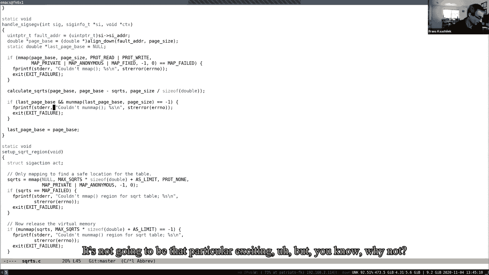
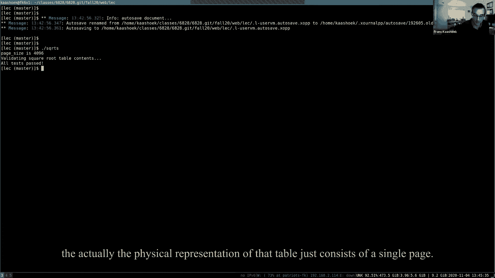

# P16：Lecture 17 - Virtual Memory for Applications 英文版 - MCATIN-麦可汀留学 - BV1rS4y1n7y1

实验室比较说锁定圈，似乎更直截了当一点，好，好，你完成了吗，你跑完了吗，我昨天才开始工作，我走到一半了，哦耶，好的，好，我想这对其他人来说是个好消息，有人完成了吗？我已经完成了。

以及任何令人讨厌的惊喜或合理的工作，嗯，我想它成功了，好的，呃，是啊，是啊，或者比锁圈容易，我想是的，至少，是啊，是啊，嗯，希望这对其他人也是一个案例，嗯是的，是啊，是啊，让我开始吧，呃。

在我今天谈论的主题中，是用户应用程序的虚拟内存，你知道的，在呃，有点，呃，以本文为指导，呃，从91年开始，呃，按上诉人，飞跃，呃，所以出发点基本上是，呃，你很清楚，现在OS内核，使用，你知道。

虚拟内存页表，呃，在创意浪潮中，你已经看到我们有懒惰的分配，搭接，副本和权利，以及你所知道的许多其他功能，执行或执行的各个方面，所以基本上这篇论文提出的论点，这篇论文认为。

您知道用户应用程序实际上应该受益于，还是我们应该拥有你知道的同样的力量，用户，真的，我是说和我在一起，当然这是你的申请表，你在用虚拟内存运行，但我真的是说，呃，vm。

你知道他们希望有与你知道的相同的机制，内核在用户应用程序中的轴，用户模式，比如说，能够记录页面错误，然后你知道，对那些页面错误做出反应，你知道的，呃，所以呃，在论文中论证了这个案例，呃。

通过观察一系列不同的应用程序，嗯，你知道的，像六七种不同类型的应用程序，也许它会问你喜欢，你在论文中遇到的最喜欢的应用程序是什么，你可能想插话然后弹出，它们是，它们可以允许用户应用程序决定页面将是。

我想他们改变了某个特定页面的访问位，是啊，是啊，是啊，是啊，这是机制之一，我只是好奇，比如哪些应用程序，你知道吗，所以他们提出了这个案子，我们有很多不同的应用程序，对吧，就像垃圾收集器。

或经常性垃圾收集器，我还有几个其他的，我只是想知道你觉得哪些最有趣，那么他们还使用了哪些应用程序，还是他们用什么来证明自己的观点，我认为数据压缩应用程序很酷，是啊，是啊，好的。

我认为多个不同系统之间共享的虚拟内存，哇这太酷了，我没有，我想我不完全明白这是怎么回事，它是如何工作的，但是使用保护位的一般思想，以确保不同的机器以正确的方式使用共享内存，保护不变性是有意义的。

原来如此，你知道的，基本上，在那篇论文中，整个领域都发展起来了，最近描述了SVM，在整个研究领域发展起来的，你知道在哪里，人们有各种聪明的把戏试图做到这一点，其实，飞行任何，其他。

因为如果他们去做其他几个应用程序，基本上争辩说你知道，如果你看看所有这些不同的应用程序，就像记忆中的雪福德，数据压缩，垃圾收集器，你知道本质上很不同，但事实证明你知道。

它们实际上都依赖于少量的虚拟内存原语，让它真正发挥作用，所以纸质地址的第一个问题是，好的，什么什么，用户应用程序需要的原语应该是什么，如果他们想实现其中一个应用程序，所以让我先谈谈这个。

你知道什么是原始的，所以他们，呃，他们，你知道的，那些，他们，明显的那个，当然你需要一些原始的东西，这就是我所说的陷阱，基本上是为了允许在内核内部发生页面错误，向上传播到用户空间，然后在你的空间里。

你知道，和处理程序，你知道，然后可以处理它的页面错误，然后，当然啦，以通常的方式返回内核，然后你知道，用这样的原语如此清晰地恢复指令是必要的，因为否则您无法对页面错误做任何响应。

他们谈论这个道具的另一个原始，一个，降低了页面的可访问性--他们谈论了很多可访问性，或者他们所说的可访问性是什么意思，是啊，是啊，所以有不同的方法可以减少可访问性，你知道的。

你从一个可能需要阅读或写作的页面，你去只读，或者你从，你知道的，只读，实际上根本无法访问，嗯，他们还建议基本上每个页面都应该有一个，让我们支持一个，也应该有一个实际上你可以为此做的。

应用程序可以调用页面集合，所以基本上刺激和归结为原则上，你知道的，呼叫戳n次，但是为什么，为什么他们认为你应该有一个专业人士和这个原始的两个版本，嗯，是因为，嗯，实际上这样更有效率。

因为保护结束页的开销并不比保护一个，因为，谈到了像摊销…的工作，是啊，是啊，你有绝对的权利，所以基本上如果你做一个道具，你知道基本上你必须改变页表位做一些工作，然后在那个道具的最后，你知道的。

通常我们想冲洗TOB，你可能还记得X6实现中的这一点，冲洗dob是昂贵的，所以这将是很好的，如果你能把冲水的费用摊销，总体，你知道页表会改变，所以基本上戳和归结为n次n次，更改页表位，加一次汤匙冲水。

如果你骗了一个，您将有一个页表切换加上或一个页表修改，每页加一次浴缸冲水，所以你可以保存T将是同花顺，有道理吗，好的，呃，那你知道我称之为无保护的原始，基本上，这增加了他们所说的可访问性，基本上意思是。

你知道的，如果他们，比如说，现在不是只读访问，我们只是要推广它，让它真正有读写权限，他们提到的另外两个原始人，一个是，你知道的，一个原始的，实际上找出哪些时候报酬太脏，和另一个原始，你知道的，地图二。

它允许i是一个应用程序，可以在同一个地址页中两次映射特定的范围，相同地址空间，但有不同但不同程度的可访问性，我们马上就会看到它出现，嗯，所以你看看这些原始的，你知道吗，实际上六个支持其中任何一个。

对于通常级别的应用程序，否，不开箱即用，但也许我们实现的报警处理程序感觉很接近，好，好的好的，是啊，是啊，让他们记住警报处理程序，这当然感觉很接近，正确到与陷阱相关的，但除此之外，实际上有六个端口。

这些都不对，呃，X是一个非常小的UNIX创新，不支持，呃，任何一种更先进的，呃，虚拟内存原语，即使内核本身内部确实有所有可用的机制，但在形式上没有暴露在用户空间中，系统调用什么，所以真的。

报纸上的争论是任何形式的，你知道好的操作系统应该提供，你知道这些前提或系统调用，以便应用程序可以使用它们，有点自然地与这个问题有关，就像我明白了什么，这群人是什么，你知道今天用UNIX，嗯。

这些是可用的吗？事实证明，基本上你知道，任何你看到的现代UNIX，就像，说Linux啊，你知道这些原始人在那里，也许不是完全一样的味道，正如论文中所论证的那样，但他们在那里，你甚至在报纸上看到了。

就在那里，一些操作系统确实有一些版本有它们的子集，呃，呃，但今天他们基本上你知道的，有点广泛支持，所以如果你今天看UNIX，你知道的，让我们看看它实际上是如何，有实例化，所以。

第一个可能是最重要的一个是刚刚称之为，称为M映射，可以用来取一些物体，并将其映射到颜色的地址空间中，类似的例子，如果要映射文件，那么你知道系统调用我们以下形式的东西，你知道你有张地图。

Mac实际上有很多令人困惑的论点，第一个基本上是说，喜欢什么，您可以指定特定的地址，或者你希望它是地图二，或者您可以让内核决定选择地址，在这种情况下，您指定there's null。

你知道内核会选择一个地址来映射，你知道物体，指定长度，指定保护位，你知道，比如说，小麦很对，然后你知道一些争论，我真的不想谈，但是有一种叫做地图私人的东西，基本上你必须说一些关于如何。

如果你真的写到那个特定的对象会发生什么，但大部分都跳过了，然后你可以把它，我们实际上可以传入文件描述符和偏移量，基本上，这意味着你知道你应该映射，你知道文件对象，呃，由文件描述符指向。

然后获取该对象的文件内容，添加偏移量并映射，基本上是在一个特定的地址在一个特定的地址有那么长，所以这基本上允许你对一个文件进行所谓的内存映射，所以你基本上可以把文件的内容带到你的地址空间。

实际上不得不打电话，读写系统调用，这是一种方便正确的，因为这样你就可以操纵文件，只是你知道，用普通指针，你可以在特定的位置写，然后你知道在某个时候你可以把内容写回磁盘，所以这是一个方便的界面，你知道的。

操纵我们可能存储在其中的数据结构，可能存储在文件中，您将实现，呃，这个特定版本的M地图，或者基于文件的某个版本，并在下一圈映射，所以这基本上集成了，你知道的，XT Six虚拟内存中X的文件系统部分。

你把它们连接起来，通过实际实现一个地图，地图也可以用在其他方面，这样你就可以，你可以用地图，文件，您还可以使用它来映射匿名内存，这基本上是休息的一种选择，你知道基本上你可以问，你知道内核，拜托了。

你知道的，给我一堆记忆，你知道，把它映射到，你知道这个特定的地址，嗯，这是核心系统调用之一，与原语相关，好的，还有几个，你知道的，是，你知道有必要真正支持论文所主张的原语，呃，UNIX有它们。

所以对于今天更多的UNIX，呃，有一个不受保护的系统叫做，所以一旦你把一些东西映射到地址空间，你其实可以，你知道吗，更改权限，所以无论你能做什么，都是公正的，保护特殊的，呃。

所以你在地址空间中映射一些东西，你去保护，从一个例子，对于该部分的子集，或者全部，并将其映射到特定的保护级别，例如，如果你这么做了，你知道基本上你知道，可以执行加载，但是商店会变成一个。

我们变成一个页面错误，同样，如果你想确保，地址空间中的范围完全不可访问，否，你可以和保护没有，你知道基本上，然后两者，你知道，基本上是任何访问，你知道到那个特定的页面，或者要做到这一点，地址范围。

从地址到地址加上链接将导致巡逻，有一个类似的定义，对一个名为unmap的映射有一个相应的调用，它允许您基本上删除映射或移动地址范围，实际上，如果你好奇，你很清楚这些电话是怎么工作的。

您知道您应该查找这些系统调用的手册页，嗯，最后你知道我们真的很整洁的那个，是一个叫做病态行动的系统，基本上这是一个信号处理器，它允许应用程序说，就像你知道的，如果一个特定的信号发生。

然后你知道调用这个特定的函数，所以你可以安装函数f作为特定信号的信号处理器，如果你知道，页面错误，你知道，信号，呃，那就是，呃，在一种叫做病态错误的东西中产生的，通常你可能会看到SEC折叠，你知道的。

是啊，是啊，在用户代码中，通常，在SEC折叠中发生的事情基本上是应用程序停止和崩溃，但是如果应用程序已经安装了，你知道的，SEC故障事件或分段信号，然后应用程序没有被停止，处理程序将由内核调用。

然后应用程序可能会响应，你知道吗，以同样的方式到那个特定的教派断层，在某种意义上，内核响应页面错误，你知道，也许你知道修复页表，这样，呃，你知道行刑可以继续，在这种情况下，也许处理程序会，其实，你知道。

呼叫和保护，或者呃，并更改权限，这样实际上指令就可以恢复并继续，所以在这个，事实上，你知道吗，如果你是，最熟悉的版本，我们是，我们看到的东西，就像六个动作就像生病的警报。

正如我之前在光滑警报实验室提到的阿米尔，您可以安装的地方，你知道，报警程序基本安装完毕，必须在每一个时钟滴答或每一个，你知道的，时间段，嗯，你知道，基本上病态的行为是一种，相当于那个，但是它的一般版本。

它基本上可以对不同类型的信号做出反应，对此有什么问题吗，呃，似乎和保护意味着您可以在单个地址上添加不同的权限级别，而在我们一直在研究的XP6中，只能对整页应用权限，那是A那是区别吗，那是礼物，否。

这不是真正的区别，呃，你知道这在页面级别上工作，粒度，也不会暴露，你知道的，有一个单独的电话来了解页面的页面大小，如果你好奇的话，太谢谢你了，如果你想到，你知道这些，你知道报纸上的原始人。

你知道我们可以正确地绘制它们的地图，就像当前UNIX或UNIX通常提供的，那么陷阱的等效生长，你知道那是，呃，在UNIX中将提供，一种叫做六六行动的东西，大概，你知道，戳进去，戳一个，它的等价物是什么。

好的，所以基本上他们三个都是对的，你知道基本上，也可以使用M Protect实现，和保护，你知道它足够灵活，你可以通过，你知道吗，一页，刚才被问到X的呃，或者你实际上可以，你知道吗。

提供由多个页面组成的内容，然后你可以得到同样的好处，比如一个COB刷新，用于更改一系列页面上的权限，好的，这些调用几乎直接映射到一些原语中，呃，原来你知道，脏实际上有点难做，没有直接的原语或系统调用。

尽管你可以通过一些技巧或多或少地完成它，我稍后会讲到地图二，也没有一种，呃，有办法做到这一点，但不完全是，你知道的，有点像一个叫做，直接映射到地图2上，事实证明，如果你有多个地图。

所以你知道思考这篇论文的一种方式是，你知道内核开发人员，呃，你知道吗，也许并不完全是由这篇论文驱动的，但是内核开发人员，嗯，你知道一半延伸，你知道这些，或者为今天的用户应用程序提供了这些原语，好的。

我想说几句关于，你知道实现，在这个平台上更多，然后谈谈，你知道应用程序，呃他们自己，你知道如何使用这些特殊的原语，好的，所以呃，让我们来谈谈有两个方面有点有趣，一个是实际发生的事情，你知道的。

在虚拟内存系统中实际支持这一点，我只是要勾勒出最重要的部分是什么，事实上，你知道这有点与，呃，即将出现的mmap实验室，因为您将做类似的事情，所以嗯，所以地址空间，典型的呃，今天在单位，由，你知道。

当然啦，硬件页表，但通常，呃，它是，呃，用一组os数据结构来增强，你知道，与任何特定的硬件设计无关，这些叫做，呃，虚拟，基本上是什么，什么V A，你所代表的，准备录一些，呃，有关连续地址范围的信息。

所以如果你考虑一个地址空间，它可能已经，你知道地址空间中的许多部分，你知道每一个都形成了一个连续的范围，基本上每个部分，会有一个v a，v a基本上说，你知道V可能也有所有相同的权限。

因此该范围内的所有页面都具有相同的权限，他们回来了，你知道吗，被同一物体，你知道吗，比如说，你知道吗，如果你在我的地图和M文件中有一头猛犸象，那么呃，该文件将有VMA描述，你知道吗，不管是什么。

文件的权限，你也知道，有关文件本身的信息，你知道文件描述符，例如，与那个特定的，你可以，你知道文件中v a对应的偏移量，事实上，你知道的，在即将到来的实验室中，你知道的，你将实现一个非常简单的版本。

并使用它来实际实现，呃，mmap系统调用文件，其中，基本上你可以在VMA中录制，从字面上看，与该特定和映射调用相对应的偏移量中的文件描述符，或已映射的范围，对此有什么问题吗，好的，那么第二块。

你知道那种重要的，然后我们有一点经验，可能是值得的，你知道吗，呃，经历实际上是陷阱或病态的行动，与处理程序一起，实际的陷阱将如何工作，其实再小心一点，那么如何实现用户级陷阱，你知道接下来是，它跟得很紧。

你知道和生病警报系统呼叫的轮廓是一样的，然后当时钟滴答作响时发生的起床电话，实际上呃超过了时间限制，所以这里的设置不是，你知道时钟滴答作响，但你知道页表。

所以让我们假设有一些ptpte有一个“那”的标记，你知道你是无效的，也可能不是只读，你真的恢复了，所以发生了什么，你知道的，当应用程序，你知道，访问实际上基本上无效的PT，或者它不能产生有效的翻译，嗯。

呃，我们都知道，然后这个CPU，你知道吗，跳转到内核模式，他在一个固定的地址跳入内核，你知道吗，你知道吗，你已经看过蹦床代码了，内核，你知道保存状态，所以说，比如说，安全陷阱，戒指，然后基本上问。

你知道虚拟机系统，VM系统实际上可能会做一些事情，所以说，比如说，在懒惰的实验室里发生了这样的事情，在右边的副本里，你知道你，您知道捕获处理程序代码，排序查看页表数据结构，在这种情况下。

它大概会查看VMAS，你知道看，你知道独家新闻是关于，我们那是处理器折叠的地方，看看需要做什么，例如，如果是SEC错误，并且应用程序已经安装，你知道一个处理它的人，然后基本上那个电话。

或者事件的处理程序将传播到用户空间，所以基本上，假设有一个处理程序安装，然后基本上我们可以接到一个电话，呃进入用户空间，就像在警报圈一样，你知道它会运行你知道用户空间中的处理程序。

你知道的管理员可能会打电话给你知道并保护你知道改变保护，然后处理程序返回给用户，处理程序返回内核代码，有内核，然后内核基本上恢复，你知道，中断的过程，好的，你知道，如果，如果内核恢复时中断进程。

你知道如果，比如说，处理程序修复了用户程序的地址空间排序，然后他们就知道实际上指令可能会正确执行，或者如果你知道，如果出了什么问题，可能会再次被困在内核中，如果你知道，呃。

你知道硬件仍然可以转换特定的虚拟地址，这有意义吗，也许又有记忆了，第二个手臂圈，然后这个应该很熟悉，呃，是啊，是啊，我有个问题，是啊，是啊，什么样的，呃，呃，我觉得。

当我们允许用户在页面上有效地运行处理程序代码时，默认，不是吗？追加，比如可能导致的安全漏洞，所以我想知道你能不能和那个谈谈，是啊，是啊，是啊，是啊，这是个很好的问题，呃顺便说一下，就像每个人都打开相机。

只是为了，如果可能的话，如果你觉得那样做很舒服的话，我真的很感激，我想班上的许多学生也会欣赏的，是啊，是啊，所以你知道，有安全问题吗，在第一个，人们认为你知道什么，这会破坏用户内核吗，或者你知道。

不同过程之间的隔离，所以说，你问问题的另一种方式，生病的闹钟坏了吗？你知道隔离，会不会很好因为他们，嗯，处理程序仍然可以访问相同的代码，我是说，如果进程有不同的虚拟内存，或者每个进程都有不同的虚拟内存。

那么该处理程序就不能查看其他进程的内存，所以应该是可以的，是啊，是啊，当我们正确地向上调用时，我们必须在实际安装处理程序的特定用户空间中进行向上调用，因此处理程序基本上在与运行相同的上下文中运行，与。

安装处理程序的应用程序，所以它唯一能做的就是，你知道影响应用程序，但你知道，应用程序问题不会真正影响任何人，任何其他申请，因为它不是，它没有任何访问权，分页表或可以强制切换到分页表的其他应用程序。

所以事实证明这很好，当然啦，如果处理者不回来或做了坏事，你知道最后，内核就会杀死，它总是可以扼杀这个过程，所以真的没什么，你知道吗，你知道吗，唯一会变坏的是，但它不会伤害任何其他过程，我是说。

这有道理吗，是呀，谢谢。好的，所以现在我想通过几个，示例等，看看如何使用它，我将从一个非常简单的例子开始，让我们自己进入它，然后我们将转移到垃圾收集器，因为很多人问关于垃圾收集器的问题。

所以这似乎是一个很好的潜入，好的，所以第一个例子，我想谈谈，呃关于一个琐碎的想法，呃，但你知道，呃，事实上，报纸上甚至没有提到，呃，但这是一种很酷的方式来说明，你知道吗。

如果应用程序实际上有这些原语可用，它们将获得的能力，基本的想法是建造一个巨大的，记忆磁带基本上是它的作用，它只是记得，你知道一些计算的结果，例如，你可以这样想，假设我们有，这是我们的桌子，你知道。

表淀粉得到任何零做一些n，表存储的是运行一些昂贵函数的结果，对于那个论点，零或任何FN，所以如果你想，你知道如果你，如果这个表是预先计算的，你知道吗，在时间的开始，然后你想抬头就像，你想知道菲的价值。

你只要抬头看看桌子，你知道在槽里，基本上你得到的值是，如果我计算过，所以基本上你把一个昂贵的计算，你知道也许F很贵，基本上是一个表格查找和一个很酷的技巧，你知道基本上。

存储预计算的结果并存储昂贵计算的结果，如果你知道同样的计算被执行了很多很多次，那么你马上就知道预计算了，你知道的，可能是一个优势和明智的做法，这种设置有意义吗，好的，那么问题是，呃你。

当然是桌子还是挑战，现在桌子可能很大，其实可能是，事实上，非常大，它可能比，基本上你的物理记忆，呃，但有它还是很好的，所以解决方案，你知道，一个解决方案，你知道你可以，呃。

用来解决这个问题的基本上是使用虚拟内存原语，如邻居保费所述，这个，嗯，你知道你所做的是，你知道的，首先呢，你分配了一个巨大的范围，但不要真的映射，你知道的，实际上不分配与该范围相对应的任何物理内存。

只要把你的地址空间的很大一部分，然后说，就像我要用我地址空间的那一部分来存储一个表，然后嗯在一个所以页面状态，表中没有内容，你只是地址范围存在，所以如果你真的喜欢一张桌子，查找像一张桌子。

你知道这会导致一页，故障，所以基本计划就在这一页上，故障，你知道你计算，你知道所有的条目，在哪里，你知道吗，所有的，你知道吗，页面基本上涵盖了表中的一堆条目，对于他们中的每一个人，你基本上你知道。

您计算函数fi并将其存储在插槽表中，我然后基本上恢复，你知道应用程序对吧，现在当然还有一张地图，物理页面，你知道，所以基本上你拿着这一页，故障，分配页面，基本上是储存，你知道的，在那一页里。

页面中所有插槽的FI结果，它的优点是正确的，如果你知道几个好处，如果你必须，你知道吗，又是计算Fi，你知道你实际上要做的是查表，你实际上不必做任何昂贵的计算，只是查表，事实上你知道，即使你做桌子。

我再加一个赞，你知道的，会有一堆条目，在那个特定的页面上，他们现在基本上都要，自由，你知道，只是查表，你当然一直这样，那么你将消耗所有的物理内存，所以您知道页面错误处理程序，也是。

你知道必须扔掉一些页面，如果你知道你的内存快用完了，所以如果你知道有很多内存在使用，你可以用其中的一些，为了一些pag，当然还有，那你就得改变，更改保护级别，对呀，你知道确保你知道你将来会得到。

这些条目的页面错误，所以你必须打个电话，你知道的，欺诈；欺诈，减少网页的可访问性，和文件的术语，这作为一个计划有意义吗，哦，对不起，好的，是啊，是啊，你需要绘制它的地图。

它需要从操作系统请求将其映射到特定的地址，对，因为它可以在任何地方，好的，是啊，是啊，也可能在任何地方，只要你知道，操作可以知道它到底在哪里，哦，好的，也许是为了让它更具体一点。

实际上我对这个计划有一点实施，我们可以看看它，什么是，你知道，你到底是怎么做到的，使用现有的，你知道，单位原语，让我，每个人都能看到前缓冲区足够有趣吗，假设这是一个是，当你进入底部时，这是应用程序。

所以这里的main main基本上建立了平方根区域，基本上分配地址空间，但并不真正分配属于它的物理页面，然后它叫做功能障碍，测试平方根区域，基本上以随机的顺序遍历该表，你知道的，基本上检查。

表中该位置的平方根条目是否确实正确，你知道平方根值，只需在那之前按字面意思计算，所以基本上测试方块区域将运行，它可能会产生页面错误，因为到目前为止还没有一张桌子填满，那么你怎么知道。

我们如何得到这些页面错误，嗯，下面是代码片段的种类，您基本上需要为特定事件安装处理程序或信号处理程序，我们在这里基本上是说，呃，安装，你知道六个扎克五事件，处理程序六秒五，所以当六倍发生时。

或者发生页面错误，基本上功能，内核将调用句柄6 SEV，基本上你可以提取，你知道错误的地址，你知道这看起来很像你见过的陷阱代码，以前很多次，基本上计划很简单，我们在该特定地址映射一个页面，你知道。

因为我们这是我们要填写的地址，我们有我们要这么做，我在这里昂贵的功能，或者是昂贵功能的替代品，或者昂贵函数的作用是平方根函数，所以我们想基本上填满，你知道任何值的平方根，它必须在表中的特定位置。

所以我们分配一个页面并将其映射到那里，然后你知道我们为那一页计算，所有的平方根条目，然后我们就完成了，这个应用程序有点极端，我所做的基本上是我运行这个表只分配了一个物理页面，所以不管最后一页是什么。

我们只是通过UNM发布它，解映射它，所以我们有一张巨大的桌子，基本上是用一个物理页面来表示的，我们可以跑，你知道，如果我们想，我们可以运行这个应用程序，不会那么特别，呃，令人兴奋。

我想我已经编译好了，你知道，基本上通过，只是随机地在桌子上弹来弹去，大概你知道会导致很多不同的页面掉落，你知道的所有条目都是有效的，所以即使有一个巨大的平方根页面，桌子或桌子，虚拟平方根表。

表的实际物理表示仅由单个页面组成。

这是一个例子，你知道的，一个非常简单的例子，你可以做的很酷的事情之一，如果你知道，这些虚拟内存支付可供用户应用程序使用，对此有什么问题吗，你能快点过一遍吗，嗯，最后一点，为什么只有一个财政页面。

我想我在想，就像在它，哦，像这样听起来像懒惰的分配，为什么会不一样呢，我想这就回答了我的问题，但我不太明白，为什么我们最终，好的，原因，好的，所以当我们开始的时候，当我们设置它的时候，我们呃。

我们没有页面，像平方根的集合，实际分配地址空间，但随后立即取消映射与该地址关联的所有物理内存，所以启动点，没有分配给这个特定表的物理页，这有道理吗，好的，然后当我们得到一个页面错误时，我们得到它。

这意味着整张桌子里只有一页，我们还没有映射的和我们已经映射的，无页，但我们要翻页错误，现在我们要绘制一页，在那一页里，我们要填写，不管你知道什么，i的平方根i加一，我加上随便什么，只是你知道。

对于特定的页面，然后如果我们有一个页面映射，在这种情况下，我们第一次没有，呃，没有什么可做的，所以现在您知道应用程序运行，你知道，并在平方根表中查找页面中的更多条目，我是说你得到了另一个页表。

呃另一个页面错误，因为它在查找一个实际上不在分配页面上的平方根条目，好的，所以在这一点上，我们得到了另一个页面错误，然后你知道我们分配第二页，我们计算平方根，你知道对于那个特定的页面。

然后我们取消了最后一页的映射，在实践中你永远不会这么做吗，在实践中，你会试着保持一组工作的页面，或者类似的东西，但只是为了表明你可以走得很极端，你可以像这个巨大的页面一样表示，只有一页内存的大表。

这个特定的代码片段，取消最后一页的映射，然后它就一直跑，所以在任何时候，例如：在任何时间点，只有一个物理页面被使用，这回答了你的问题吗，是啊，是啊，我想是的，谢谢。好的，好，就像一个。

更像是这显然不是你在实践中会做的事情，但更像是表演，你知道原始人的力量，你知道你可以用一个物理页面来表示这个巨大的表，任何其他问题，好的，嗯，接下来我想说的是另一个例子，我特别想谈谈垃圾收集器。

因为很多问题都是关于垃圾收集器的，所以你知道，所以这个想法，你知道的，垃圾收集器是一种，基本上适用于编程语言或，基本上，呃，代表程序员进行内存分配和释放，所以程序员不必像C语言那样调用。

你必须打电话给Malloc，然后您必须显式地调用free，释放使用垃圾收集器的内存语言，视觉上，应用程序只有，呃，基本上只能调用malloc，但从来不用担心真正释放内存。

基本上垃圾收集器将做这项工作来确定，如果内存仍在使用中，如果内存不在使用中，那么它实际上会，呃，释放它，所以很好，呃，你知道吗，你知道，有哪些具有垃圾收集器的示例编程语言，爪哇，是啊，是啊，爪哇，蟒蛇。

你知道，去吧，呃，他们中的许多人实际上纠正了，几乎不是铁锈中的C，其他编程语言基本上都有一个垃圾收集器，好的，所以你可以想象，有大量的文献，垃圾收集器设计空间，这篇论文的重点不是向你展示。

他是最好的垃圾收集者，但这里基本上说明了垃圾收集器可以利用，你知道这些用户级别或内存原语，所以像论文讨论的那样的特殊垃圾，是复制垃圾收集器，基本的计划是，你知道的，顶层轮廓如下，呃，你知道。

你基本上有一个记忆，您知道从中分配内存的堆，您将堆中的内存分成两部分，呃，一个是前片，或者报纸上所说的前面的空间，另一个是两个空间，假设我们必须开始，你知道的，与应用是淀粉，所以所有的内存都是免费的。

您基本上开始在from空间中分配内存，假设我们分配一个类似树的数据结构，和所有需要树根的东西，它可能有一个指针，你知道对另一个物体，它可能有一个指向另一个对象的指针，这也是由根指向的，你知道。

一个物体的小循环，它可能是应用程序，我们引入了很多其他的记忆，我也是，呃，但再也没有任何东西指向它了，所以基本上唯一的物体，活动对象是实际上基本上可以从根访问的对象，所以在某个时候，呃。

就像我以前分配了很多内存一样，结果再也没有空间了，其中应用程序要求多一个对象，原来已经没有空间放它了，因为整个太空基本上已经被利用了，所以基本的想法是在这个，呃，复制垃圾收集器是为了，你知道吗。

获取对象并将其复制到用户，到两个空间，你这样做的方式是，你从根部开始，因为那是你知道的，所以每个应用程序都有一组寄存器，你知道这些顶级指针基本上存储在哪里，或者堆栈上的局部变量，基本上有一组根。

为了简单起见，我只是假设有一个根，你基本上从顶层开始跟踪，所以你知道你复制根对象，你知道通过两个空间，你知道的，这是你在这一点上唯一做的事情，然后你知道，当然啦，那就剩下，你知道，指针，你知道。

仍然指向以前那里的任何物体，然后再一次，一旦将对象复制到，你去检查你扫描物体的地方，你知道，当然，语言运行时确切地知道，你知道对象是什么类型，并且知道指针在哪里，看着这些指针说，好的。

也许你知道我应该多复制一些，um指针结束，呃，因为那些实际上是，你知道，实时数据结构的一部分，所以基本上你知道，也许我们会拿顶层指针，看那个物体，你知道的，将该对象复制到，你知道，两个空间更新。

你知道这里的指针，你知道实际上表明实际上，你知道它让我在这里指向现在复制的对象版本，然后当然你知道就在后面，我们需要记住，我们实际上这个物体已经被复制了。

所以我们存储了一点额外的信息记住这个对象现在存储在那里，这个过程，你知道把一个物体从从空间移动到两个空间，并且在from空间中留下一个转发指针称为转发，好的，所以我们现在，所以我们做了这个。

你知道我们做了，呃，修复此指针，我们修好了那个指针，还剩一个，所以我们会抬头看那个物体，我们像以前一样把它复制过来，它仍然有一个指针指向这个对象，所以现在我们看看那个特定的指针，看那个指针，看啊。

你知道吗，实际上已经被复制了，事实上我们知道新的位置是什么，所以我们可以直接更新它，你知道指向正确的地方，好的，所以在这一点上，你知道所有的指针都是，你知道正确更新，你知道整个结构，你知道整个循环。

当我们从空间移动到空间时，基本上是物体，所以在这一点上，我们完成了，呃，的，在这一点上，我们完成了，呃，我们转发了所有的物体，基本上是前面的空间，现在，你知道吗，前面空间的所有物体都要丢弃。

现在是自由空间，这有道理吗，这是副本和垃圾收集器中的基本计划，好的，现在论文中使用的方案，呃，你知道吗，有几个复杂的东西，所以我想谈谈他们，你知道他们实际上，他们被称为，这叫做比尔斯算法。

这是一个古老的算法，你知道它的一个很好的特点是它有时，这就是它最初所说的实时和真实，它的意思是，这是一种，它是一个增量垃圾收集器，所以主要的想法是，这里，如果我们有两个来自太空和穿越太空。

主要的想法是你知道我们又有了根，用我们的根，呃，它有两个指针，它指向后面，呃，主要的想法是，你知道没有必要阻止世界，呃，把所有的东西都复制过来，然后基本上恢复竞争，唯一真正需要的是将copy移动到根上。

基本上你什么都不做，所以基本上你知道在这一点上，你知道根目录被复制了，但你知道这是，你知道指针仍然是点，你知道年份，因为那个物体还没有被扫描过，这不是它的重点，只是还没有更新，基本的想法是，呃。

每当申请，呃打电话给新的，你知道，在每一个新的电话，你再扫描几个物体，或者你转发更多的对象，这是一种很好的正确，因为基本上你传播，你知道成本，其实，你知道复制，呃完成，你知道活跃的。

或以增量步骤从应用程序的活动堆，你知道每一个新的，每次呼叫分配，你知道贡献了一点，你知道实际上完整的复制操作，当然还有应用程序，呃可能也在用，你知道这些指针中的一些，比如说，如果你知道根，呃将取消引用。

你知道就像，说这个，这个，你知道，第二个红色指针，它实际上仍然指向从太空，当然这很危险，因为我们，你知道应该从空间中跟踪指针，嗯，所以基本上这意味着，就像每次你贬低，你f是指针，你需要检查一下。

检查它是否在前面的空间，如果在前面的空间，如果是这样，你知道吗，做转发，因此允许应用程序像指针一样使用，但基本上跑步，你知道吗，的，编译器必须检测，这样你就知道，呃，我们基本上保持两个空间中的任何指针。

你知道指向两个空间中的物体，我们需要确保正确，因为当我们最终结束时，你知道的，我们想把前面的空间去掉，然后呃，这样我们就可以丢弃它，并将其作为自由空间重复使用，好的，对此有什么问题吗，这是基本的设置。

好的，所以如果没有问题，你知道这篇论文提出了两点，你知道这个计划，呃，呃，一个是你知道这很烦人或者太糟糕了，你每次都要这样贬低，所以基本上这意味着加载或存储指令，而不是单一指令，但实际上有一堆说明。

即分支指令，也许在调用函数来实际进行转发时，所以你知道这增加了应用程序的成本，第二件事实际上指出了，呃，这个呃垃圾收集器很像，也许在一个好的环境中，就像你在一台多核机器里运行，你有很多免费的CPU。

基本上我有收藏家，你知道背景很好，你知道遍历对象图，你知道，随着它的继续，不断地复制东西，但如果应用程序同时使用图形，有风险，你知道申请可能是，你知道有一个证明人调查，这些支票中的一张。

它开始复制一个对象，同时收集器也在复制对象，你知道我们不是很小心，我们最终可能会得到，你知道复制了两次的对象，指针没有指向正确的地方，你可以很容易地正确地看到，有一个竞争条件是可能的，种族条件的可能性。

所以，呃，然后本文对该方案进行了基本描述，你知道它说像，如果你有，你知道这些，你知道用户级原语，那么实际上你可以做一些不同的事情，你可以做，呃，你知道一个很酷的把戏，你实际上可以使用VM。

你知道虚拟内存，呃，基本上降低了检查的成本，而且呃几乎得到，你知道免费并发，所以和基本的想法如下，呃，你知道，我们有我们的，相同的设置，你知道的，都是来自，这里有两个，我们要做的是，你知道我们会有。

我们会有一个区域，你知道的，我们实际上可以把两个空间分开，有点虚拟或字面上，当我们在一个未扫描的区域中划分两个空间时，我是说，再清楚一点，我们有一个区域，基本上是很少的地区，在一个不缺乏的地区。

最初基本上你知道整个区域都没有扫描，你知道的，所以当你开始的时候，你知道你从前面翻转到两个空格，呃，还没有扫描到任何东西，因为里面没有物体，所以，但基本上这个计划是以同样的方式开始的，我们复制根对象。

你知道他们曾经在那里，你知道我们复制它，它有一些指针，你知道基本上这些指针仍然指向，嗯，怎么了？哎呀，是啊，是啊，这些指针将从太空指向旧的，就这样了，现在我们基本上是说，我们要做的是对未扫描的区域。

就是在这一点上，我们要绘制的一切，在任务地图上给他们画上没有，也没有，那么这意味着什么呢，这意味着第一次围绕应用程序，你知道，在我们做了翻转之后，垃圾收集起来翻转，应用程序第一次使用根指针，呃。

它会得到一个页面错误的权利，因为您知道地址范围的那一部分实际上是未映射的，所以基本上，这个想法是在错误处理程序中，扫描，你知道的，一页对象，对于需要转发的，所以基本上你知道我们在这个特殊的环境中。

在那里我们只被复制，只是根，到目前为止，你知道我们有，我们要复制路线，我们可以扫描，您知道根指向的对象中的指针，在这种情况下，只有两个，你知道我们在这两个物体上复制，你知道进入不可扫描的空间。

或者让我在这里画一个稍微不同的，只是让它看起来像，我们可以复制我们指向的两个对象，基本上我们更新，你知道，你知道我们移动这条扫描线，你知道从这里到那里，所以这不是SC，所以在我们扫描页面之后。

你知道我们实际上可以增加，你知道，基本上保护或基本上保护，您可以保护页面和保护扫描页面，你知道，然后应用程序，你知道你可以，只是，你知道的，访问特定对象，因为你知道我们把它翻译成。

您知道对象内部的指针可以安全地将其公开给应用程序，如果您可以遍历这些指针，当然啦，如果这些指针仍然指向，到没有扫描过的物体，那我们就，呃，我们又会得到一个页面错误，然后你知道我们再扫描一点。

所以它基本上有好处，你知道这仍然是增量的，我们还可以做一点工作，你知道每次我们也可以这样做，每次都在一个新的，我们实际上可以分配，你知道有些人做一些工作，但它有额外的好处，再也没有指针检查了。

指针检查还在，但它是用页面在硬件上完成的，虚拟机硬件为我们做这件事，这有道理吗，对这个计划有什么问题吗？我有个问题，是的嗯，所以在处理程序中，你是说你扫描一页对象，但是您如何知道根引用的对象将是。

会陷入同样的，你怎么知道真正需要转发的对象，为了不违反，不变量将在同一页中，你会没事的，页面中有一组对象，只要开始，好的，但让我们说，呃，你知道吗，在我们翻转这个空格的开始，两个空间里什么都没有，啊。

我们能做的就是，运行时要做的只是复制，我把它描述为复制一页，但基本上是复制一个前进，一页，你基本上可以复制N个对象，这样他们就填满了一个完整的页面，所以现在我们有n个对象坐在那一页上，全部未扫描。

然后在某个时候，带薪全职，什么时候会发生，然后你知道垃圾收集器或收集器，你知道吗，浏览这一页上的每个对象并查看，你知道它的指针和指针，它复制了那些，你知道吗，呃，呃，的对象，进入两个空间的未扫描部分。

所以如果你认识任何人或者申请人会使用，其中一个未扫描的对象将出现页面错误，那个罐头那些罐头，等，等，这回答了问题吗，是啊，是啊，好，好的，我也有个问题，你做完这个之后，你翻转这两个和前面。

或者你从前面的空间开始，你把它装满，你翻过，您复制到to空间，然后你打一次电话，你完成了扫描，你就完蛋了，这家公司的情况很清楚，你只要，你翻转名字，你开始使用这两个空间来实际分配，直到它满了。

然后你再翻转，谢谢。所以其中一个，你知道的，其中一个，这篇论文还提出了一个论点，那就是你知道，VM系统或使用VM的另一件事，呃简化基本上是并发的，争论是基本上收集器，你知道它可以浏览未扫描的页面。

所以我们有，呃，是啊，是啊，我们可以浏览未扫描的页面，基本上扫描一页，你知道在某个时候，如果保证应用程序没有指针，或者无法访问该页的同时，因为它没有映射，所以呃，你知道的，只要传呼硬件基本上介绍了。

你知道一种明确的同步或对种族的保护，因为只有收集器才能访问该页，而from和应用程序实际上无法访问该页面，所以它得到了一种很好的自动并行性，应用程序可以运行到其业务中的地方，收藏家可以做它的生意，嗯。

他们永远不会踩到对方的脚趾头，呃，因为如果呃，应用程序将接触未扫描页面并查看页面错误，然后嗯，收藏家从不碰，可以页面，所以永远不会干扰应用程序，所以你会得到某种，免费并发，但它实际上有一个棘手的问题。

所以虽然几乎是免费的，你知道吗，实际上你必须安排一件事，也就是，所以如果我们看看你之前给我们的照片，呃，这里是你知道的两个，但这里是使用我们的两个，你知道我们有，你知道这在未扫描和扫描区域是分开的。

未经扫描，它没有，你知道不受保护的不，所以这就提出了一个问题，你知道怎么做收集器，你知道经历它，因为你实际上无法访问这些页面，因为你知道它们没有映射，Gregor用等等来保护，诀窍基本上是这样的。

这就是地图二的作用，我们要做什么，实际上我们要映射同样的物理记忆，我们把它画对了一次，我们绘制了一次地图，用这种方式，我们将在第二次绘制它的地图，在收藏家看来，或者收集者对两个空间的看法。

这是收藏家的观点，这是贴切的观点，在收藏家看来，你知道我还得去哪里，和以前一模一样，试试看，我们必须往返，我们实际上在做什么，你知道吗，这是我们的扫描区域，但在收藏家身上，你知道。

我们实际上绘制了未扫描捐赠的读写地图，这样收集器实际上就可以通过，看扫描的，你知道的对象，前点是必要的，所以这就是需要调用地图的地方，在应用程序的地址空间中，在两个不同的保护级别。

基本上使这样的场景工作，对此有什么问题吗，嗯，我有个问题，你有没有，你会给每个人，比如收集器和应用程序，嗯，不同版本的页表，或者没有，他们有相同的页表正确，映射在两个不同位置的物理内存。

在两个不同地方的地址空间中，在页表中，基本上映射是无效的，在另一个地址范围内，您将映射读取，写，或者试图让我做一个，把这个说清楚一点，嗯，因为有这么多关于它的问题，我实际上是一个微不足道的实现，嗯，呃。

这个基本的ID，论文中描述的想法，只是为了让它更具体一点，嗯，所以让我通过这个问，请随意加入，这基本上是论文中描述的一个玩具实现，我敢肯定它有盒子，我是说，呃，我还没有认真地测试过这个。

但它主要是为了说明，你知道的，让一切都稍微具体一点，所以收集器API，如果您愿意，应用程序使用的是一个新的和重新指针，三分球基本上只是为了检查，前面空间的指针，如果这在太空中，那就需要复制一下，当然。

当我们使用虚拟机技巧时，那么基本上这个弱点会非常便宜，它将基本上返回现有的return参数，如果我们只是为了简单的应用程序，我有一个链表，它有两个根，你知道，一个指向链表的头部。

一个指向链表的最后一个节点，这是一个循环链表，没有什么太令人兴奋的事情发生，应用程序威胁的基本作用是，你知道，五次列清单，列清单，然后检查列表，所以它会产生很多垃圾，就像每次制作清单完成后。

它要做一个新的，所以最后一个列表基本上是垃圾，所以收集者实际上要做一些事情，列出一个列表，你知道基本上是一个有点丑陋的代码，检查右，所以不再正常，当然，这将由编译器生成。

但是我真的没有垃圾收集语言的编译器，而不仅仅是模拟编译器可能生成的内容，基本上你想要，你知道代码的作用是，你知道它通过构建一个至少列表大小的列表，分配新元素，坚持列表开头的前缀，然后更新最后一个指针。

基本上指向列表的开头，所以那个苏拉尔，关于这一小段代码有什么问题吗，所以最有趣的问题是收集器里到底发生了什么，让我们先看看这个案子，没有虚拟内存的地方，我们不使用这些技巧的地方。

所以我们只需要看两个API，呃，一个是新的，读取指针，所以用新的，我忘了互斥，这是针对基于VM的解决方案的，呃基本上是什么，呃，我们忘记了，我们假设我们实际上没有扫描，我们暂时不收钱，我们基本上，呃。

我们检查，如果空闲空间里有足够的空间，如果剩下的自由空间足够，你知道我们只是把指针抬高一点，您知道分配该对象并返回它，如果没有足够的空间，然后我们基本上要翻转，我们得做一个垃圾收集运行。

所以我们要看看翻转，你知道吗，翻转基本上切换了两者，从周围的指针，呃，然后呢，基本上，您知道这个应用程序的两条路线，你知道，呃，从空间到两个空间，所以让我们向前看，所以在这里，看起来如果，你知道为了。

O所指向的对象，看起来如果O真的在前面的空间，如果它在前面的空间，也没有被复制过，然后我们要复制它，然后呃，然后我们就这样做了，我们从，呃，从空间到两个空间，如果我们已经复制了。

然后基本上我们可以替换指针，你知道的，用，新点实际上是指向已移动对象的指针，并返回，好的，所以这就是转发，那么三分球，你知道我们曾经，指针基本上通过，让我们看看垃圾收集器的读取指针，只是用弱指针。

就像在这里，如果我们不使用，呃，如果我们不使用虚拟机，呃，基本上它的作用，呃，它在向前操作中做向前操作，没有检查，如果它在前面的空间，它不在前面的空间，那么呃，什么都不做，如果它在前面的空间。

然后再复印一次，所以我们在这里看到，这是一张昂贵的支票，真的是，你知道，检查物体是否真的位于前面的空间，有什么问题吗？在我进入实际使用虚拟机的版本之前，把戏，好的，让我们看看VM到底有什么诀窍。

所以设置是一点点在这里，嗯，基本上你知道，有一个名为ship mm open的调用，允许您创建一个共享内存对象，它是Linux调用或UNIX调用，它的行为几乎像一个文件，但它不是，你知道吗。

它的行为就像一个文件，但它不是文件，它只是坐在记忆中，没有与之相关的磁盘空间或任何东西，它就像内存中的文件系统，如果你愿意，呃，基本上你知道我们在做什么，就是我们，你知道的。

我们分配其中一个共享内存对象，我们将共享内存对象截断为，从太空中的两个中的一些，所以我们有一个空间，嗯，然后我们把它映射一次，在突变体中，我们将其映射一次，你知道对于收藏家来说，嗯。

所以这基本上是你知道的，这里的这种操作序列，你知道共享地图，打开截断，这两个M地图基本上相当于地图，两个电话，嗯，所以我们看看，你知道的，呃，让我们回到我们的实现，嗯，VM案例中的读指针不做任何事情。

你知道吗，没有任何支票，我们只要直接返回指针，然后你知道，当然啦，如果我们用针尖，我们会像以前一样得到一个页面错误，在SIG根表应用程序中，这是页面错误处理程序，所以如果是一个，如果是一页，实际上让我。

我跑在前面一点，呃，如果你知道，物体被移动到更早的地方，坐在未扫描的区域，我们得到了一个页面错误，基本上扫描页面，你知道的，函数运行，但是你知道扫描页面功能实际上是用，您知道收集器的地址范围。

所以它实际上可以工作，因为否则突变体就会纠正，您知道应用程序不能触摸这些页面，因为这会导致页面错误，一旦你知道我们和未扫描，你知道，一旦我们扫描了所有的页面，那你就知道，呃。

收集器实际上使用户应用程序可以实际访问页面，再看看Flip可能会有帮助，只是想看看会发生什么，好的，所以那个翻转，发生了什么，我们从，所以前面的空间是满的，我们基本上把整个两个空间标记为不可访问。

你知道应用程序，然后我们移动收集器实际上移动根头和根最后，您知道应用程序无法访问的两个空间，或者至少不是直接，你知道，当应用程序访问真的是最后的时候，这个问题就会解决，它实际上会导致页面错误。

然后收集器可以复制东西然后保护一页，有道理吗，处理程序中的注释已更正，这实际上是至关重要的，在你知道之前，首先扫描页面，你做的，您知道应用程序可访问的页面，因为如果你，呃，在扫描之前使其可访问，你知道。

如果有多个应用程序线程，那么我们可能正在研究的那些应用程序，你知道未扫描区域上的物体，当然，我们需要禁止这超出了这个代码，基本上是为了扫描，然后呃，提高保护级别，以便应用程序可以访问页面。

关于收集器和使用虚拟内存的技巧有什么问题吗，嗯，在这种情况下，我想总结几点，我想说明一点，基本上嗯，你知道要问的一个问题，或者您应该为此使用VM，真的是，你知道的，没有回报，和，呃。

因为许多你知道的垃圾收集者，许多垃圾收集者实际上不使用，你知道虚拟内存，呃在所有，但基本上使用仪器，你知道编译器实际上非常清楚生成的代码和工具，你正确地知道代码，并有各种其他技巧来减少性能开销。

所以观察到的是，在大多数情况下，你知道它可能是，呃，大多数情况下可以通过额外的指示来实施，你知道那是，你知道的，如果你基本上是一个编译器或运行时，或者对于编程语言机器，然后也许这并不是那么糟糕。

因为编译器可以进行检测，但是如果你知道没有运行时，就不是编译器应用程序，或者编程语言或设置，然后呃，那可能会很痛苦，所以事实证明，对你来说，其中一些应用程序，好像根本没有编译器，比如说。

就像你知道的检查点，或者你知道为你的记忆共享，你知道那些，其实，你知道的，真的，你知道需要这样的，这些原始人，所以在实践中你知道，如果您了解足够多的应用程序程序员，就会发现这些原语是有价值的。

基本上今天的操作系统支持它们，有人问，或者很多人真的问你知道吗，什么，什么变了，你知道自从，自91年以来发生了什么变化？你知道吗，有一件事改变了，当然啦，就像你知道的，现在大多数联合确实支持原语。

其实有很多变化，你知道从91年开始，是啊，是啊，你知道，也许呃，很难想象，但基本上，虚拟机系统在不断发展，所以如果你看看Linux，你知道Git日志，你会看到的，你知道有。

你知道内核的各个方面都在不断发展，嗯，你知道一些更大的变化，你知道最近有什么大的变化吗，你知道多少年了，有一个，你知道，现在有一个五级页表，你知道要处理很大的事情，呃，你知道更大的地址，呃，有呃。

要处理的地址空间标识符，呃，这将是，不会是同花顺，最近一年前，或者类似的东西，或者其他被称为引入的东西，称为KPTI内核页表隔离，呃，你知道因为熔毁攻击而存在的，我们将在本学期晚些时候讨论，它是。

你知道的，的，虚拟内存系统绝对不是静态系统，几乎在链子的任何内核的任何方面都不是静态的之后，有巨大的变化，就像几乎，你知道的，每隔几个月在内核的不同方面等等系统中，偶尔会完全重写，呃，所以你。

它总是在变化，好的，我就不说了，你知道任何人都有更多的问题，你知道，请随便问他们，或者如果你必须去，请随意去，嗯，我能问一下第一张幻灯片吗，嗯，我想看看，它是VM实现，就像这一张之后的两张幻灯片，是的。

呃，是呀，那个，嗯，你说的连续地址范围到底是什么意思，多好的一年啊，是啊，是啊，连续的虚拟地址范围，所以你知道DMA，你知道DMA涵盖了一千到两千的范围，如果你有另一个地址范围，两千一百之类的。

那将是有自己的VMA，所以每个VA A覆盖一个连续的地址范围，所以上面没有洞，好的，这让它变得更容易，就像你会在嗯看到的那样，正如你将在地图实验室看到的，这将使事情的推理变得容易得多。

V A的少校没有洞，好的，好的，所以这些是为了这个特殊的，地图用例，我想是对的，是啊，是啊，是啊，是啊，好的，我明白了，谢谢。所以基本上你可以考虑一下，就像每一个M地图都有一个VMA，如果地图不重叠。

哦，好的，好的，我想我想我明白，谢谢。问嗯所以嗯嗯，呃，像垃圾收集这样的往返，你什么时候停下来，重新开始，就像我想收集器可以一直运行，如果是复发性的，是啊，是啊，这就像是很酷的事情之一，VN解决方案。

收集器可以一直运行，它可以停一次，基本上它有，呃，没有更多未扫描的物体，好的，所以你有，但你必须经历，这意味着你，所以你会通过所有的东西，就像前面部分的所有物体一样，你要么收集它们，要么复制它们。

你怎么知道你都经历过，在某个时候你知道你，你追踪对象图，正确，在某个时候你不再添加任何对象，因为你过去已经复制了它们，好的，好的，那是有道理的，是啊，是啊，你不再加了。

你知道基本上你未扫描的区域没有增长，所以如果你未扫描的灰色不再生长，你不会没事的，好的，然后当你把它复制过来的时候，你在地图上吗，所以如果有人试图喜欢充当旧指针，这将是无效的，是啊，是啊，对呀，好的。

那是有道理的，谢谢，所有的权利，待会见，是的，谢谢。谢谢。不客气，好的，我觉得。

