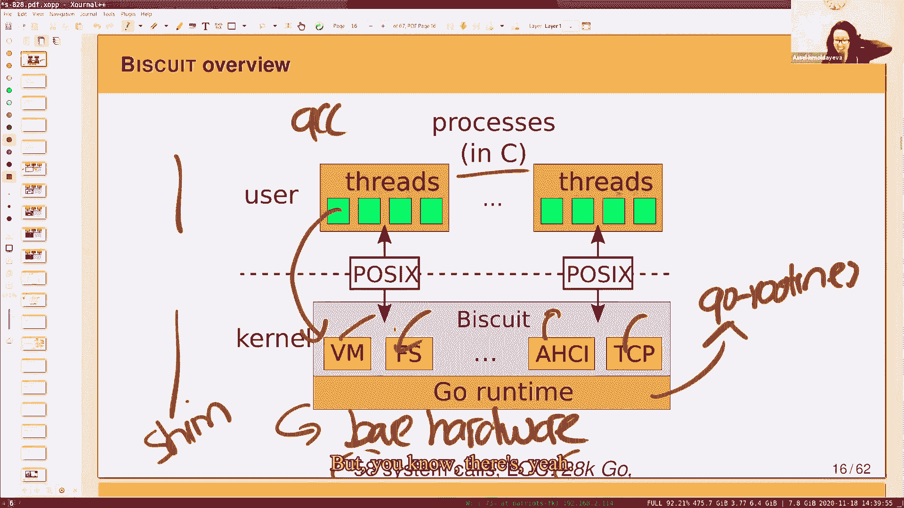

# P19：Lecture 20 - Kernels and High-Level-Languages (HLL) 英文版 - MCATIN-麦可汀留学 - BV1rS4y1n7y1

我知道为什么，我们何不开始呢？呃，你知道的，如果人们想再次打开相机，我愿意那样做，那太好了，尽我们所能创造一种班级氛围，好的，所以我要和某人谈谈这篇论文，您知道编写UNIX内核的好处和成本。

我喜欢这种语言，你知道这基本上是一篇论文，部分是因为，呃，所以八一或八到八，你知道我们写了一篇论文，罗宾和我，但是主要的主要作者是科迪·卡特勒，谁是泰特，这个课很多很多次，嗯，它总是一点点。

你知道我真的不喜欢谈论，你知道的，我们在书架上工作的文件，但你知道你知道这篇论文基本上是这样的哦，八一和八到八，所以这次我要用一些幻灯片，而不是在白板上写，所以这篇论文的来源是这个问题。

您应该用什么语言编写内核，这是一个你知道很多的问题，呃，你们很多人都问，或者你的学生在过去的八到八，八问了很多很多次，部分，因为你知道你的操作系统或内核有漏洞，你就像，哇哦，如果我是用另一种语言写的。

那么你知道也许我不会有那些书，所以这是一个经常出现的问题，事实证明，在整个操作系统社区中，你知道这是一个激烈争论的问题，但没有那么多事实，你知道，这实际上是一种任何知情的讨论。

我们在这节课的最后会看到什么，或者在这个讲座中，当你读论文的时候，你知道我们对这个问题没有一个明确的答案，呃，但我们有一种，呃，你知道的，本文贡献了，你知道一堆你知道的数据，让你可以更深入地讨论。

你知道什么是，什么是好的内核编程语言，这就是这篇论文的起源，这就是我们，呃，你知道这些文件的来源基本上是你们，嗯所以嗯，试着回答这个问题，我们写了一个新的内核，我们用自动内存管理的语言来做。

这意味着关于讲座，所以你实际上不必打电话免费，和书类的航行，所以这是高级语言通常具有的属性之一，所以我们想有一个，我们选择了一种语言，我们基本上遵循传统的单一单位组织，这样我们就可以做一个公平的比较。

事实上在某些方面你可以想象一下我们建造了什么比如XT 6，一个多得多的，呃，更多的功能和更高的性能，我是说，如你所知，实际上有各种各样的旋转算法或线性搜索算法，你知道，你当然知道如果你想写作。

实现高性能，你不能拥有那些，这就是这篇论文在该地区的起源，为什么我们要做饼干，你知道吗，试图回答这个问题，或者至少透露一些信息，所以我首先要谈谈，更一般的背景，我通过电子邮件提出了很多问题。

我们试图获得更多的上下文，然后我会更详细地钻进饼干里，随时跳进去，你知道的，在任何特定的时间点用服装，正如我所说，你知道的，这篇论文的动机是你问的问题，所以你知道，拜托了，请询问，不停地问问题。

就像你知道的那样这张纸的背景是你知道的，很多内核都是用C写的，你知道实际上6是用C写的，你在用c编程，但是你知道的最受欢迎的内核坐在你的桌面上，或者你知道你的手机是用C写的，你知道窗户。

Linux或Linux，所有你知道的各种形式的BD，他们用C写的原因是C为你提供了很多控制，如你所知，在实验室里看到的，呃是的，完全控制内存分配和释放，几乎没有隐式代码。

你知道你几乎可以想象当你读C代码的时候，比如相应的风险是什么，五个指令是，嗯，你有直接记忆，你知道你可以读或写，你知道在Pbits，你知道，或，呃，设备和你知道看到自己，这里有很少的依赖关系。

你知道没有大的运行时，你实际上必须有，你知道能够运行C程序，你已经看到了，就像当x六只靴子，你知道这基本上是新的装配线，然后基本上你在运行C代码嗯，所以C和，你知道我们喜欢C的一个原因吗。

但See也有一些缺点，你知道，在过去的几年里，这已经被证明了，你知道，几十年来，编写安全表代码是困难的，你知道他们的虫子类型，呃你，您经常会在缓冲区溢出的地方被利用，这可能是最著名的一个。

就像你在过去后面写作，数组绑定，或者你在写，你知道吹，您知道您的堆栈在免费bug后的使用，你知道你知道哪里，你自由地回忆，但它仍在使用，所以当有人在上面乱涂乱画的时候。

你知道你可能会在上面潦草地写一些不好的东西，通常你知道当朋友分享记忆时，通常很难决定，你知道一个，实际上内存是可以释放的，这些虫子中的一些，你知道，不要真的出现，呃。

你知道一些bug在XV中显式地表现出来，少一些这样你就知道了，你知道XP6是很少的动态内存分配，你几乎是在预先分配好的，但是缓冲区溢出，通常在三本书之后，你知道不同的确实出现了，嗯，所以事实上。

你知道如果你看简历，你知道这些是，你知道的，有一个网站，那里有一个组织，保持某种控制，检查并保存所有安全漏洞的记录，并调查，你知道你会在2017年发现当我们在写这篇论文的时候，呃。

有40个Linux内核bug实际上可以导致攻击者运行，现在，完全控制机器，很明显，你知道这些是严重的虫子，然后这些bug来自缓冲区溢出，和其他类型的内存保险箱，嗯，所以你知道这有点太糟糕了。

你知道你知道如果你用C写代码，你知道这其实很难，即使我知道，对于这样做的人来说，应该有专业的，为了把这件事做好，然后呢，当然啦，你知道吗，我肯定你最近看过这个，你知道吗，我可能是的。

我当然记得广场上的一些问题，你知道你遇到这个使用的号码，免费bug之后，你特别知道，在抄写圈，他们出现了很多次，高级语言吸引人的一个原因，我们的高级语言，你知道的，提供内存，安全，所以所有这些虫子。

有我在上一张幻灯片上提到的简历功绩，你不会是，你不可能，你知道的，你可不可以，你知道他们做到了，如果他们发生了，他们要么会导致恐慌，你知道，因为你知道运行时我会说像，哦，你骑马经过，你不能那样做的比率。

或者你知道他们只是，他们根本无法表现出来，你知道，因为语言不允许你写那种代码，所以有，当然啦，高级语言的其他好处，也经常被，你知道的，这个班的学生在做实验的时候，除了类型安全。

你知道有自动内存管理的问候收集器，所以自由很容易，你只是不必去想它，开发人员喜欢为你做所有的工作，这对并发性有好处，你知道它有很好的抽象，你知道这是不是像在界面上，或者其他的，你知道上课。

或者其他形式的，你知道，这迫使你或鼓励你真正编写模块化代码，缺点，你可能会想，哦好吧，如果你知道高级语言有这么多好处，你知道为什么不，你知道为什么xpsix没有写在，你知道Java，去蟒蛇什么的。

原因是你知道或者Linux，原因是这是糟糕的性能，你知道这是有代价的，你知道实际上是一种高级语言，你知道吗，有时这被称为高水平的语言税，嗯，你知道这些基本上是你，你知道如果你做一个数组，绑定数组索引。

你知道你必须检查余额，你知道你必须检查没有指针，嗯，你知道在他们有更贵的，ca um，你知道垃圾收集本身也不是免费的，你知道会有一些周期，你知道跟踪哪些对象是免费的，哪些是分配的，你知道这就是代价。

所以那是，你知道吗，从表演现场，我们知道很多论文都集中在这一点上，然后原则上你知道，经常，你知道的，我是说，人们认为它们有些不相容，使用Linux内核编程，你知道的，没有直接内存访问，你知道吗。

因为原则上可以，你知道吗，呃，违反类型安全，呃，无手写程序集，然后在内核中需要一些手写的程序集，你知道吗，而上下文在两者之间切换，或者喜欢在机器启动时离开地面，嗯在，嗯，你知道吗，经常，你知道吗。

语言可能有并发或并行的特定计划，可能不对齐，您知道内核需要并发性和并行性的计划，你知道我们见过，比如说，在日程安排讲座中，你知道一个线程传递给另一个线程很多，在哪里，你知道有一对夫妇。

你知道有一些不寻常的货币管理模式和用户程序，但它们确实出现在内核中，嗯和所以嗯，所以目标，基本上这个，你知道纸张是用来衡量高水平的语言权衡的，你知道的，导出使用高级语言而不是C的总效果。

你知道在安全可编程性方面，呃，也是为了性能成本，和，当然啦，如果你想这么做，你知道这种实验，你知道你，您需要在生产级内核上这样做，你不能在XV6上这么做，因为它太慢了，基本上你可能什么也学不到。

你知道的，如果程序的Keris写得很慢，看看，你知道你注定要慢下来，你知道这并不能告诉你很多关于，你知道预言家会质疑，它只是说像嗯，其实这样一个斜坡，所以你不想在更多的时间里这样做，你知道高性能。

你知道面向内核或者内核是为高性能而设计的，所以你知道一件令人惊讶的事情，因为，就像你们很多人问的那样，或者你的前任问这个，你知道你会想象得很好，这个问题必须在文献中得到回答，你知道这实际上不是。

有相当多的研究调查了，就像在用户程序的上下文中进行高级语言权衡，然后呃，但你知道，正如你所知，内核是，你知道和用户专业有很大的不同，例如，内存管理，仔细的内存管理真的很重要，有不同类型的并发。

你可能略有不同，所以我们想在内核的上下文中做这件事，你知道，我们实际上没有找到任何真正回答这个问题的论文，你就越接近，有没有，你知道有很多内核是用高级语言写的，你知道这样做有很长的历史，你知道吗。

追溯到，甚至对早期的列表机器进行排序，你知道，但是很多，这些内核的最新版本并没有真正编写，以评估这个高级语言税收问题的想法，但实际上是为了探索新的操作系统设计，呃，和或新的操作系统架构。

所以没有一个真正直接测量，你知道吗，有点，呃，做一个头对头的比较，保持结构不变，这样你就可以真正专注于语言的问题，相对于其他一些问题，事实上，我们以前读，我不知道这些文件中的一些实际上在过去。

现在事实证明一个原因可能是你知道没有很多，大量的工作，呃，这实际上回答了，有一吨的论文得到了回答，这个问题是做这件事实际上很棘手，你知道基本上如果你真的做对了，你知道你想把它和还原级C内核进行比较。

这意味着像Linux这样的东西，或者窗户里的东西什么的，但你必须建立一个生产，在内核中创建，你清楚地知道，对于一个小团队来说，这很难做到，你知道有很多很多内核开发人员，呃，他们做了很多很多的改变。

你知道一周又一周，日复一日，所以很难，你知道做同样的事情，建立一个等价物，你知道吗，类型的东西，所以你必须满足于稍微低于，所以我们能做的最好的，或者我们能做的最好的事情是，你知道吗。

构建出现在高级语言中的高级，你知道吗，保持大多数重要方面与Linux相同，优化性能，大致优化性能，直到它与Linux大致相似，你知道的，即使这可能不是完全相同的未来，但你知道它进入了同样的棒球场。

然后你知道衡量了一个高水平的语言权衡，嗯，当然你知道这种方法的风险是，你知道我们构建的内核，你知道实际上与Linux略有不同，你知道它不会完全像Linux，所以你知道你必须。

你知道有一个你必须非常小心当得出任何结论，你知道我们会，这就是你取消并给出一个非常清晰的答案的原因之一，是本文提出的一个问题，但我们可以，希望你知道，得到比，基本上你知道什么都不说。

到目前为止这有意义吗，任何关于上下文的问题，你知道这篇论文吗，你知道我们为什么去，经常这样做，好的，所以说，如果没有这样的问题，多谈谈方法论，所以基本上你知道这种设置是，你知道在左边。

你知道我们有我们的这将是，你知道饼干，是啊，是啊，我们要在我们的特殊情况下，你知道我们为这份报纸写的，我们在Go中写了一个内核，它提供了一个大致相似的，你知道Linux提供的系统调用的子集。

但你知道如何，但有同样的争论，你知道同样的召唤发明，我们在界面上运行基本相同的应用程序，所以你知道其中一个应用程序是NX，也就是网络，Web服务器，所以这个想法是，你知道我们运行相同的。

在饼干和Linux上的应用，您知道应用程序将生成相同的系统，称为trace，具有完全相同的参数，饼干和Linux，你知道的，表演，您知道这些系统调用调用的所有必要操作，然后我们可以，你知道的，看看。

你知道区别，基本上在高级语言内核和Linux之间，然后谈论像，你知道的，有什么权衡，所以这是方法论的核心，再一次你知道，因为Linux和饼干不会完全相同，呃，你知道，会有，你知道有些区别，但你知道我们。

你知道，我们花了很多时间，呃在比萨试图，你知道，使比较尽可能公平，在可能的情况下，我们可以想到让它变得如此多，你知道你会问这个问题关于你使用哪种高级语言，你知道对于这种工作。

你知道我们选择围棋有几个原因，呃，它是一种静态编译语言，所以不像蟒蛇，里面没有翻译，我们喜欢的原因，你知道静态编译，因为我们基本上有编译，实际高性能代码，事实上，特定的Go编译器非常好，嗯。

所以基本上你知道它是一种高性能语言，此外，你知道Go的设计实际上是为了系统编程，你知道，表单辅助编程的内核，所以这需要一个很好的匹配，例如，你知道吗，为什么它对系统编程如此之好。

调用汇编或其他外部代码实际上很容易，它对并发有很好的支持，你知道很灵活，我们想使用它的另一个原因是，因为它有一个垃圾收集器，就像你知道的一样，你认为一门高级语言的一件事是，也是一个高的美德之一。

水平语言是你不必做内存管理，然后垃圾收集器通常在，提供了一种内存管理故事中的中心角色，嗯，当我们开始这篇论文或我们开始这个项目的时候，生锈不是很受欢迎，或者铁锈实际上在那一点上不是很稳定和成熟。

回想起来，你实际上可以在里面写一个真正的内核，不，现在你知道我们会再做一次，你知道你可能会把它写在铁锈里，因为它也是为持久性编程而设计的，它有一个小的运行时，它产生好的代码，虽然有一件事你实际上知道。

可能仍然会让去试一试变得非常有趣，Rusers从一开始就假设你知道，如果您想要高性能的系统程序，那么你不能用垃圾收集器这样做，事实上，循环冲刺式系统是以一种非常聪明的方式设置的，一个非常有趣的方式。

因此实际上不需要垃圾收集器，在某些方面，我们真的很有兴趣回答这个问题，比如在高级语言中垃圾收集的成本是多少，你知道内核编程，你知道真的不可能使用A或者成本是多少，在某些方面，你知道。

有点粗鲁地回避了这个问题，就像我知道的那样，使用我们有垃圾收集的语言，我们必须考虑这个特殊的成本，关于我们决定使用的编程语言，有什么问题吗，有很多关于这个话题的电子邮件问题，所以我猜这是一个理论问题。

可能没有立即的答案，但是如果Linux内核是用锈写的，不去和喜欢优化在相同的容量，它是否能够实现更高的性能，然后像Linux内核一样使用C，我怀疑我们会没事，很难只是猜测，正确。

因为我们还没有做这个实验，我的感官，你知道它的性能不会比c高，呃，但你知道，你知道，可能大致相同，因为我看到如此低级，你可以恢复你在铁锈中会做的任何事情，你也可以做一个座位，这有道理吗，是呀，谢谢。

好的，嗯好吧，所以让我们呃，离开他们，除非对此有任何其他问题，你知道，随时可以打断，你知道有一个基于讨论的讲座，所以你知道这是为了激发智力兴趣，所以你知道，如果你对这个话题有什么想法，你就跳进来。

所以其实之前，你知道的，也许是个问题，我想问，呃，也许我会在讲座结束时再来讨论这个问题，接近讲座结束时，部分你知道，整个推理，我们想使用的高级语言是遵循一定类别的书籍，你应该问自己一个问题，哪里有虫子。

你知道在你的实验室里，这是可以避免的，如果你有高水平的语言，你知道所以你知道，回想一下，你知道我相信你能想出一些错误，这花费了你很多时间和痛苦，你可以问自己这种虫子，你知道如果我们在实验室里写的XP6。

在另一种高级编程语言中完成，会有生命，你知道的，你想让我轻松点吗，你有更多的业余时间做其他事情，所以让我们把这个问题留在你的脑海里，希望在讲座结束时回到这个话题，但如果你马上有意见，那很好，我也是。

好的，让我来谈谈饼干，你知道它是如何工作的，有点惊喜，我们在做饼干的时候遇到的事情，你知道的，我们预料到的事情，还有一些我们实际上没有预料到的事情，嗯，所以用户程序，有一个经典的内核莫娜·利克内尔。

就像Linux或XT Six一样，所以有用户空间，还有内核空间，用户空间程序是，呃，你知道吗，不管你知道什么，您的编译器，gcc，或者在我们的论文中，它主要是一个Web服务器，和其他一些基准。

用户程序实际上都是用C编写的，尽管它可以在任何语言中都是主要的，你知道的，但因为它们只是一个基准，我们拿了C版，大多数程序都是多线程的，不像XT 6，在饼干中，每个用户程序基本上有一个线程。

实际上您支持多个用户级线程，基本上对于每个用户级别的线程，内核中有相应的内核线程，这些内核线程实际上是由Go本身实现的，Go调用，这些围棋套路，呃，但你可以把围棋套路想象成普通的烦恼，你知道。

实际上六个小时，内核有线程，呃，围棋套路有点相似，正确的主要区别是在解剖学中，线程由内核本身实现，在这种情况下，你知道，Go运行时基本上为他们提供了，所以运行时时间表。

他们去跑步他们支持像睡觉和醒来这样的事情，或条件变量，睡眠或醒来略有不同，但是有一些条件变量同步机制，还有一大堆其他的，你知道的事情，原语，Go的运行时间是由Go语言本身提供的，还没有实现。

你知道饼干本身，我们只是从Go运行时获得它们，Go运行时本身直接在裸硬件上运行，我会谈谈这个，在讲座中更多，但就像这样，你想想这个，当机器启动时，它首先启动的是运行时，这会引起一点并发症。

因为Go运行它们通常在用户级程序之后在用户空间运行，并假设内核那里有一个内核，他们可以要求一些服务，例如，它需要分配内存给，呃，因为它的堆，所以有一点点，呃，我会谈一点的，有一点垫片代码。

你知道饼干基本上要欺骗，你知道去运行并相信它运行在操作系统之上，基本上你到了行李箱，然后内核本身，你知道这是一个非常相似的，你只要想想十六，我认为有一个很好的模式，除了你知道它更精细一点，性能更高一点。

你知道有一个伯克利记忆系统，你知道的，例如，实现了一个地图，你知道你这周要做的事，你知道它有一个文件系统，除了有一个更高性能的文件系统，它有几个司机，你知道它有一个磁盘驱动器，它有一个网络驱动程序。

它有一个网络堆栈，所以更完整一点，你可以看到，它有五个八个系统调用，你知道就像，我不记得X6有多少了，但大概在1819年左右，和代码行总数，两万八千，你的XT 6就像不在，我想在一万以下。

所以你知道有更多的功能，关于高级概述的任何问题，哦对不起，我想问一下，接口，所以界面就像X到6，对呀，就像，这个过程是，他们得把一些东西放进收银机里，然后他们打E电话，或者不管是什么，是啊，是啊，是啊。

是啊，是啊，是啊，我会多谈谈这个，但就像，没有区别，好的，我明白了，谢谢。所以你知道的一些功能已经提到了一点，也许它可能更多的是谈论，所以它是一个多核的，您知道，总是很好地支持并发性。

所以你知道饼干是多核的，X6在这个组中至少对多核的支持有限，我们有更多的精细等级，同步或协调比实际x6，它有朋友，你知道通常级别的威胁，呃，在弗雷上校的支持下，也就是x36没有，有一个日记文件系统。

更高的性能，你就像，我想你知道你是，你叫前三报，这有点像，你知道高清免费通用文件系统，它已经，你很清楚，你知道合理复杂的虚拟内存系统，你知道使用VMAS你知道我可以支持和地图之类的东西。

它有一个完整的tcp，我堆栈，你知道我很擅长和别人交谈，你知道互联网上的网络服务器，它有两个驱动器和高性能驱动器，就像隔壁实验室的千兆尼克，你实际上可以为一个非常，非常简单的NAK。

这是一个更高性能和复杂的驱动程序，和一个相当复杂的磁盘驱动器，你知道比虚拟更复杂，i，o，你见过的磁盘驱动器，或者你可能看过，那太好了，我之前提到的用户程序，每个用户程序都有自己的页表运行。

用户内核内存被硬件隔离，所以你用你的内核位，基本上，嗯，每个用户线程都有相应的，内核读取，这样，比如说，当用户朋友进行系统调用并将继续在相应的内核线程上运行时，如果被称为块的系统。

然后另一个用户在同一地址空间读取，用户地址空间实际上可能由内核调度，正如我前面提到的，curl线程由go运行时提供，所以他们只是例行公事，所以如果你是对的，您通常在，呃，去吧，你在用。

Go和你过去常常去调用创建一个读取，你知道那些围棋套路是真正被使用的，在饼干仁旁边，所以说到系统调用，你知道的，在刚才被问到的这个问题中，嗯，所以它的工作原理和，你知道在XP六中，你知道。

用户在寄存器中输入参数，呃，用一点，呃，图书馆，你知道这提供了，呃，系统调用接口，呃，然后用户线程执行系统调用，你知道，这种饼干用的是x86处理器，点头，装配的风险处理器。

实际进入系统内核的说明与风险五略有不同，关于风险五，但你知道，大致相似，类似于风险峰值，然后控件传递给内核线程，正在运行该用户线程，然后内核线程执行一个系统调用，然后把你的简历还给他，所以大概。

类似的事情，你知道吗，有一个轨道框架正在建造，诸如此类的东西，在我深入之前有什么问题吗，更多的那种，你知道意想不到或意料之中的事情，但我们比我想象的更有挑战性或更不同，嗯比在xv6，我有个问题，嗯。

我想我想Go希望你使用渠道而不是相互锁，我想是的，你愿意吗？会不会有，十六中一些东西的设计会不会，就像，可以作为渠道，而不是拿着锁做什么，是啊，是啊，所以很棒，好问题，所以我们，呃。

我会在最后再来讨论它，呃，在更远的地方，我们有一些幻灯片，围棋有什么特点，我们在饼干里用了什么，呃，但你知道在索引中，我们最终没有使用那么多频道，我们主要使用锁和条件变量，所以在某种意义上更接近喜欢。

x6看起来比实际的样子，呃，你赢了你会的，然后你在做频道，我们做了实验，实际上与文件系统的设计，那是更呃，频道很重，但结果并不那么好，我们得到了表演，所以我们换回了更多，你知道，类似风格的同步。

就像x6一样，好的，所以你知道，一对夫妇，呃，小难题或实现挑战，当我们经历一个，你知道所需的，你知道的，我们想在运行时做一个零修改的过程，尽可能少地，这样你就知道，推出运行时的新版本，我们可以用它。

事实上，你知道这些年来，你知道我们在做这个，科迪在哪里工作，我们升级了运行时，你知道有多少次，事实证明这是一件好事，事实证明，要得到它并不太难，呃，你知道的，总的来说，去是非常仔细地设计的。

基本上是不可知论的，因为他们希望能够在迷你操作系统中运行，所以它不依赖于大量的操作系统功能，我们基本上是在模仿真正需要它的功能，最重要的是你知道，这些功能实际上只是离开了去，运行它们开始，一旦开始。

它跑得很开心，我们必须安排围棋程序，运行不同的应用程序，你知道通常在围棋程序中，更正所有一个应用程序，现在我们使用Go例程来运行不同的用户不同的用户应用程序，呃和呃。

但是您知道这些用户应用程序必须使用不同的页表运行，你知道，这里的小皱纹是，你知道我们不能控制，或者饼干不能控制调度器，因为我们使用的是未经修改的Go运行时，所以我们使用Go运行时调度器，因此。

在调度器中，我们可以切换页表，X36和饼干的作用，和x6非常相似，它实际上会切换每个表或从当前空间到用户空间的表，或者反过来，嗯，所以当内核的进入和退出，你知道我们切换页表，这意味着在x 3 6。

然后当您需要将数据从用户空间复制到内核空间时，或者反过来，你必须用那些，我们在xpsix中也有的复制输入和复制输出函数，所以基本上你做页表，走进软件，另一种挑战或一个小挑战是设备中断。

我去运行正常运行在用户模式下，你知道不会受到硬件的干扰，所以我们会被打断，你知道时间时钟中断，来自网络驱动程序的中断，中断，磁盘驱动器，等，你知道从U艺术，所以我们需要处理这个问题，也没有概念和去。

你知道有点，你知道的，关掉中断，就像拿着锁一样，你知道这一点，因为它不会出现在用户应用程序中，所以我们必须小心一点，如何真正写，设备中断，基本上我们做的方式是，我们在设备中断中几乎什么也不做。

我们不拿任何锁，基本上我们不分配任何内存，我们唯一要做的就是在某个地方发送一面旗帜，我没有打断，然后醒来真的很有效，去例行公事来实际处理中断，嗯，那是例行公事，当然啦，你知道吗，可以使用所有的围棋功能。

它曾经，因为它不在中断处理程序的上下文中运行，只是在正常的背景下运行，那么有一件事让人惊讶，呃，更多的是一个惊喜，你知道的，我们应该完全预料到的前三件事，我们在制作饼干时必须处理的问题。

实际上最难的一个，呃，让我们大吃一惊，我们学到了很多，这是堆积如山的疲惫之谜吗，所以我将主要讲一下中暑，你知道是什么，你知道它是怎么来的，你知道我们是怎么解决的，但也许在潜入之前，任何。

到目前为止还有什么问题吗？如此晶莹剔透，好的，所以让我们来谈谈热，精疲力竭，我不打算去充分的深度是在报纸上，但至少让你知道问题出在哪里，所以在一堆疲惫中，呃，你知道的，假设这里的蓝色盒子又是内核。

你知道内核有一堆，嗯，它以x 2 6为单位动态分配内存，我们没有这么多，因为我们在内核中没有内存分配器，你静态分配的一切，但是任何其他内核，我们会有一堆，这样你就知道你可以打电话给Malloc。

你知道的，三个在内核里，你知道实际上分配在堆上的东西是，比如说，您知道套接字对象或文件描述符对象，或处理对象，就像你知道的结构过程，你知道结构FD，我们在xxpsix中静态分配的所有结构，正常核。

他们动态分配它们，因此当您打开新的文件描述符时，它将是一个文件描述符对象，你知道分配在堆里，所以问题是，你知道，如果您正在运行许多应用程序，你知道他们可能会打开很多文件描述符，可能有很多插座。

这种开始慢慢地填满堆，所以，然后问题是在某个时候，比如堆已经满了，你知道已经没有空间分配新对象了，所以当应用程序要求，比如说，打开新的文件描述符，就像没有，你知道一个新的过程，或者我可以这个新的论坛。

上校想在堆里分配卡车程序，通常就像再也没有空间了，嗯，你是怎么做的，你知道吗，什么是，呃，你知道，3。你是怎样处理这种特殊情况的？这通常是你知道的，这可能是常见的情况，不常炫耀，但就像如果你用力推机器。

你可能有，你知道几个运行用户级进程的重型用户进程，你可能会在这种情况下结束，在哪里，基本上你知道所有可用的内存都在使用中，你的堆只是为了，无处理器，叫我他自由了，让你知道，因为他们都在运行。

试图分配更多，你知道的，的资源，他们的特殊工作，所以所有的内核都面临这个问题，不管是C核还是饼干什么的，任何内核都必须解决这个特殊的问题，他们作为一个严重的问题出现在我们面前的原因。

您可以在malloc上返回错误，事实上，X6是正确的，偶尔，但是在Go运行时，当您调用new来分配Go对象时，没有空调，你知道新座位，所以没有办法失败，所以让我们来谈谈，你知道解决这个问题的可能方法吗？

你知道我们在接下来的六个月里看到过一次，比如如果你记得B缓存，如果你知道x6找不到新的块，你知道到一个免费的块来使用，你知道存储和磁盘块，实际上有时你只是惊慌失措，现在。

这显然是一个完全不可取的解决方案，没有真正的解决办法，所以这就是为什么我们称之为强解，另一种草莓解决方案是，呃，当你打电话时，假设您分配了一个新的内存，你知道你去打电话给Alc，你知道新的实际分配它。

你实际上可以，你知道吗，在分配器中等待内存，我会给我一个建议去做这件事，事实证明这不是一个好提议，这不是一个好提议的原因，就是你可能会死锁，你知道吗，假设下面的场景你拿着一些，假设内核有一个大的内核锁。

你打电话给Malloc，你知道你涉水进入记忆鳄鱼，那么基本上没有其他十字架可以运行，现在会有一种死锁类型，您的下一个进程将实际尝试运行，例如三人行记忆，你知道吗，无法运行实际死锁，当然。

如果你有一个书内核，一个大的内核锁，这是一个明显的问题，你知道吗，但即使你有一个很小的，你知道吗，细粒度锁定，跑起来很容易，在这种情况下，基本上等待的人或过程，鳄鱼拿着一把锁，其他人需要释放记忆。

这基本上会让你陷入僵局，嗯，所以让一个强壮的人自由基本上是失败的，或者当你，呃，已经没有记忆了，alec像空指针一样返回，用空指针检查是否没有指针，你失败了，但纾困实际上并不是那么简单。

您知道进程实际上可能已经分配内存了，你得把它处理掉，您可能做了一些部分磁盘合作，就像，比如说，如果执行多步策略操作，也许你做过一些，但不是全部，你必须摆脱它，所以呃，事实证明，它实际上变得非常困难。

很难把它做好，嗯，这有点有趣，呃，你知道，在挖掘这个的时候，呃，试着思考如何解决这个问题，你知道吗，琳达的用途，你知道吗，这两种解决方案，um及以上，我们实际上有麻烦或问题，事实上，你知道。

内核开发人员实际上很难把这一切都搞清楚，如果你对这个很感兴趣，我们想看到一些有趣的讨论，谷歌太小而不能失败，然后你知道有一篇小文章谈到了这些并发症，你知道的，呃，或释放内存或在分配器中等待。

而现在可能导致的问题，对我们来说，你知道如此坚强，这些是你可以想象的解决方案，但对我们来说，正如前面提到的，但是饼干是不可能的，因为新的就是回不来，不能失败它总是成功的。

所以我们必须在一定程度上避免这种情况发生，另外，这两个解决方案实际上都不是特别理想，所以我们想出一些可能更好的东西，到目前为止对设置有什么问题吗，呃，周围堆，精疲力竭，在我谈论像，我说，饼干的方式。

是不是，这个问题有道理吗？会把签约解释为是，并继续前进，但请随时打断，好的，那么饼干溶液是什么，嗯，你知道吗，在高级别，饼干溶液几乎是直截了当的，呃，但是饼干确实喜欢当你执行系统调用时。

比如你在跳前阅读或叉子，实际上进入fork系统调用，就像在fork系统调用的开始，如果你建造，就像在一个叫做调度员的系统中，呃在xv6，然后它做的第一件事，实际上它叫储备。

基本上保留足够的内存来执行系统调用，所以这是你的自由记忆，不管系统调用需要多少内存，保留地会足够大，实际上它会成功，所以一旦系统调用结束成功地保留了内存，它实际上会一直运行，我们永远不会有问题。

不会有足够的内存或堆疲惫，如果在你想背诵的时候没有足够的记忆，然后基本上它就在这里等着，但是在称为系统调用的系统开始时，它不包含任何锁，它还没有任何资源，所以它实际上是完全好的，你知道它在那里等待。

所以没有，否，否，当它等待的时候，你知道它可以，你当然知道做这件事可以叫，呃，内核实际上可以，呃，驱逐现金，你知道试着减少，呃，基本上是免费的，呃，臀部空间，也许呃，正如你所看到的。

这可能会扼杀一个迫使，你知道记忆实际上被释放了，一旦你知道内存可用，内核决定得很好，你知道我可以满足预订，然后它会让系统调用，基本上离开和运行，基本上执行，你知道无论需要做什么，然后在最后你知道。

当系统崩溃时，就像，好的，我受够了，和所有保留的记忆，基本上返回到可用于后续系统调用的池，所以这些特殊的解决方案有几个很好的性质，呃，内核本身没有必要进行检查，就像你永远不用检查，你知道记忆，嗯。

内存分配可能会失败，这在我们的情况下尤其好，因为你知道你去，他们不能失败，没有错误处理代码，根本没有必要，没有陷入僵局的风险，因为你一开始就在逃避，而实际上你没有锁住，你当然知道有很多美好的事情，嗯。

唯一的问题是你怎么知道有一个挑战，当然，你是怎么背诵的？你知道你怎么计算，您知道系统调用可能需要多少内存来执行它，所以这是一个谜题，嗯，你知道这很重要，呃，您保留的金额。

你知道你可以做的一个是你可以预订，就像半个记忆，或者类似的东西，比如每个系统调用都有一些荒谬的内存量，但这意味着您限制了系统调用的数量，您可以并行执行，所以你想把工作做得很好。

并实际计算系统调用可能需要的内存量的界限，嗯，所以呃，我的方式，我们结束了做这个和呃，结果就像是高级语言，呃，帮助我们发现围棋其实很容易静态分析，事实上，Go运行时和Go基础设施生态系统。

附带了一大堆分析Go代码的包，我们用这些包，基本上是为了计算系统调用所需的内存量，所以你可以想想，让我们说，就像你知道你有读系统调用权利，你知道的，你知道我们可以看看系统调用的调用图，你知道调用函数f。

调用函数g，调用函数h或，废话可能会继续一大堆，然后你知道在最后，它只是又一次展开了堆栈，然后返回并返回用户空间，基本上我们可以做的是，你知道，分配，你知道，或者计算出最大深度，你知道从这个。

调用图在任何特定时间，然后基本上为了最大的深度，你知道计算机，你知道你知道多少活的记忆，你知道每一个函数都需要这样，如果此函数调用新的，你知道我会分配一些内存，你知道我们知道有什么样的物体。

这是一种高级语言，所以我们可以计算出那个物体的大小，你知道我们可以把它们加起来，它给了我们一些数字，这就像总的内存量，或者最大内存量，它可以是生活在任何特定的时间点，呃，调用图的原因是。

你知道这有点棘手，事情没这么简单，因为，比如说，函数h，你知道可能会分配一些内存，然后把它传回来，你知道G，所以你知道H完成了，呃，但你知道，g实际，你知道得到呃，分配给h的内存，这叫逃跑。

或者记忆从h到g，结果你知道，有一些标准的算法来做这种逃逸分析，确定哪些变量转义到col，然后呃，在这种情况下，你基本上知道根据年龄分配的记忆，它还活着，我们要把它加进去，你知道G是什么。

所以你知道我们必须加入一个关于这个的快速问题，所以让我们假设我们在某个函数中，比如，取决于函数预期具有的不同工作负载，可能会有不同的记忆，分配的内存量，那么最坏的情况是什么呢，什么内存分配过程，是啊。

是啊，基本上就是这样，这有点像为计划服务，纠正我，你知道我们可以，我们会计算，我们计算，该工具基本上计算了最坏的可能，呃，函数调用深度，嗯，你知道为此，在最坏的情况下，它会分析系统调用可能需要多少内存。

你知道在实践中，这可能意味着系统可能需要更少的，但你知道你知道要保守，你知道我们必须分配，我们对最坏情况的计划，所以这里有几个重要的问题，因为你知道有些系统调用，比如说，执行一个for循环。

它依赖于我们对系统调用的参数，所以你实际上不能静态地计算出边界是多少，所以一些案例，你知道的，我们对代码进行了注释，这是此循环的最大界，你可以假设仅此而已，你用它来计算这个数字，同样，你知道，比如说。

如果你有一个递归函数，你知道谁知道递归有多深是对的，这也可能依赖于动态变量或系统调用的参数，事实上你是知道的，你知道我们，你知道我们在一些地方调整饼干，基本上使函数调用中的光标无效。

所以实际上有可能做到这一点，你知道做这种分析，所以这种分析不是免费的，它不是完全自动的，需要几天的工作，你知道，因为在这种情况下，你知道，科迪通过，你知道的，看看这些循环，呃和呃，并注释。

你知道还有其他几个具体的问题你必须处理切片，你知道它们的大小可能会翻倍，如果向片添加元素，所以我们用一些最大容量来注释切片，呃，但这一切都是可行的，所以几天的工作，你知道使用这个工具。

然后你可以得到一个数字，就计算而言，这是合理的好，呃，以及特定系统调用所需的最大内存量，所以这基本上是你如何知道，我们基本上饼干解决了这个特殊的问题，哦对不起，人们使用这个工具还有什么目的，就像。

他们不是，他们不是在构建内核，他们把它用于静态分析包的目的是什么，是啊，是啊，是啊，是啊，Go编译器内部使用它进行各种优化，你知道在，去去弄清楚，喜欢编译的最佳方式，编译它的最佳方法，我明白了。

我明白了，好的，谢谢。所以这是它最酷的地方之一，就像一个包裹，您知道编译器碰巧使用，你知道吗，但我们也可以用它，你以后会看到的，我们还使用它来实现其他几个功能，好的，它，执行条款，呃，你知道的。

饼干基本上和其他核仁很相似，你知道在x 6，除了你知道，更高性能，你知道我们收养了什么，许多优化都是Linux内核所具有的聪明之处，你知道的，至少对于我们试图实现的系统调用来说，你知道的。

我们使用大页面作为内核文本，以避免，你知道的，TB费用，我们有PERNC传输线索，所以避免同步，我们有一个RU，我们将更多地讨论目录缓存，基本上是无锁或读无锁，学期末的目录缓存。

我们将更详细地讨论RSU，但你知道，呃，饼干也有，你知道，一种通常类型的优化，实际上你需要完成才能获得高性能，我想我们学到的主要教训是，你知道Go并没有阻碍实现这些优化，呃，所以这个。

你知道这种优化可以在C和Linux中实现，你知道我们基本上实现了相同的优化每当你在Go中实现它时，所以极限本身不是障碍或问题，事实上，你知道这完全有利于实际实现这些优化，实现这些优化需要大量的工作。

但你知道这与语言无关，好的，所以这让我想到了评估，这真的是你知道的，整个纸黄蜂的动机，这就像试图掌握高级语言的好处和代价，所以基本上评估分为两部分，首先谈论收益，然后谈论成本，如此自由的问题，你知道的。

首先呢，你知道有一个问题，就像我们是不是作弊了，你知道的，也许我们避免了所有昂贵的，高级语言功能，这是第二个问题吗，当然啦，做高级和简化基本代码，为了防止我之前提到的一些漏洞，在讲座中。

所以首先回到新的高级语言，呃，特征，我们只是想看看我们在其他大型围棋项目上是否有点相似，在语言特征方面，这样你就知道我们可以说，就像所有的内核似乎都在做大致相同的事情，呃，以类似的方式利用相同的特性。

所以我们使用相同的静态分析工具或包，基本上分析了一大堆两大块的幽灵报价，GitHub上的，你知道有数百万行代码，一个是你知道Go运行时本身，所有那些包裹，然后呃。

然后我们基本上只是绘制出许多高级语言功能，千行用了多少次，所以这个图表显示的统计数据通常在x轴上，是语言特征，你知道基本上分配对应于调用新的，有点，这对应于垃圾收集器将动态分配的内存。

你知道午睡就像哈希表，你知道切片或动态数组，你知道这是频道同步，大家可以看到，我们很少使用它们，但Go运行时和电影也是如此，很明显，我们最喜欢的功能，它是多功能返回，因此能够返回多个值，呃，你知道。

我们用闭合，我们没有使用终结器，呃，使用有点不同，你知道有一群你知道，我们创造的套路，我们使用接口，嗯，你知道的，类型断言，以便以类型安全的方式从一种类型转换为另一种类型，并导入许多包。

所以内核本身是由许多包构建的，而不是像一个大的单一程序，所以如果你看看这个，你知道一些功能，你知道吗，呃，饼干比白鲸用得少，有时你知道基本上使用一些功能更多或粗略地，在没有任何明显不同的地方。

不同的方式，所以从这里得到的主要结论是，你知道吗，基本上使用了高级功能，不会在一个，基本上得到好的形式，好的，嗯，我有个问题，是啊，是啊，你怎么，你怎么能把这些都数出来，你用静态分析工具了吗，是啊。

是啊，是啊，是啊，您基本上使用静态包静态分析包，然后编写了一个小程序，使用静态分析包，只要检查这些程序中的每一个语句，看看这是一种什么样的陈述，然后你得到论点看看你的论点是如何被利用的，这让你知道如何。

那我请你数一数这些特征，好的，好的，所以呃，接下来的事情有点主观，呃，高水平和简化的饼干代码，是啊，是啊，我想一般都是这样，呃，也会用一两个例子明确地争论，但没有GC分配实际上是非常好的，也许我可以说。

如果你想想XPSix，或者像你在一个出口的点上做一个出口，有很多数据结构需要释放，或者它们可以返回内核，嗯，以便以后的过程可以使用，呃，使用垃圾讲座真的很容易，你知道的，垃圾收集器处理所有这些。

你知道你真的不必做太多，所以说，如果为地址空间分配您知道的，你知道吗，尽管在地址空间中对应的VMAS，我们将被垃圾收集器自动释放，我也是，所以你知道，只是那很简单，呃，正如你前面提到的。

多返回值真的很好，在编程风格方面，闭包很好，地图很棒，你知道，呃，你不必，你知道，迷你胶带架，x p六，比如说，你知道，以线性的方式查找一些东西，但是如果你有哈希表或地图。

作为编程语言中的第一类对象或抽象，你不会那样做的，是的，你在运行时使用地图会解决这个问题，你知道的，高效地做每件事，所以在，事实上，我想你知道定性，你知道感觉你得到了更简单的代码，但这显然是定性的。

你知道，只是给出一个更具体的例子，在那里我真的，一种高级语言，一个特定的垃圾收集器闪耀的是，你知道的，当两者之间有很多并发时，呃，当有并发时，成为朋友，烦恼实际上共享一个特定的共享数据项，嗯超级温柔。

这里有一种最简单的情况，你知道的，在那里你也可以归结为这个问题，假设你分配了一些，呃，动态地一个对象，就像缓冲器，大戟线，你知道吗，缓冲的过程，还有另一个线程也处理缓冲区，和这个缓冲器的一些东西。

那么当两个线程都完成时，你知道缓冲区需要被释放，这样它们就可以在以后使用，你知道线性内核操作，问题是，谁该这么做，谁负责？有一点困难，呃来协调，呃在看，因为你知道你必须有某种方法来决定。

实际上缓冲区实际上没有被使用，如果使用垃圾收集器，没什么好决定的，你知道吗，基本上两个红色都跑，当他们用完缓冲器，没有弗雷德再指向那个缓冲区了，垃圾收集器，你知道会追踪，你知道从弗雷斯塔克开始。

我们永远不会，你知道也不会考虑在任何弗雷德堆栈中缓冲，因此垃圾收集器将释放，你知道在以后的某个时候，用垃圾收集的语言，你只要，我根本不用考虑这个问题，嗯，所以你知道有一种方法可以在曲线上解决这个问题。

像c，所以你在做，也许可以对对象进行引用计数，你知道引用计数，当然要保护，你知道通过锁，或者通过一些原子操作，然后当引用计数达到零时，然后你你可以，呃，不同的贬低它。

结果你知道在参考计数中行走实际上稍微贵一点，你知道如果你想要高性能，你知道并发和扩展你的大数课程，然后实际上你可能是一个瓶颈，我们稍后会看到的，你知道的，几周后，我们读了一篇论文。

非常明确地谈到了这一点，所以人们倾向于，如果你想做一个高性能的，你和得到很好的并行性，你们这些人往往会避开他们，事实上，尤其是我们试图避免的情况，呃，在读锁中，你想至少让阅读变得自由。

这样你就不用付钱了，例如，这里有一个代码片段可以做到这一点，我们有一个get函数，基本上你知道，到达队列的头部并返回，立方体头部的任何东西，基本上是以无锁的方式进行的。

你知道它使用负载中的原子来读取头部，但实际上并不需要罢工，然后作者，你知道的，确实把锁拿出来了，所以这就像自由行走，但骑手不是无锁的，这是Linux内核中非常常见的样式，所以右边的光，其实。

你知道把锁拿出来，你知道任何看着头的东西，也许呃，这是POP函数，它从队列中弹出了头，然后你知道，原则上你可以重用它，然后在我需要释放头部的时候解锁，你看有点难，你知道的，你什么时候真正解放头部，呃。

因为可能会有其他并发的威胁，你知道的，就在你做这个Mic商店之前，你知道吗，这家伙真的挺过来了，基本上得到了一个指向特定对象的指针，所以一旦你用完这个原子商店，你实际上不能释放指针。

因为你知道可能是另一个朋友实际上必须指向它，如果你在这里释放它，在免费的钱之后，你实际上可以有一个用途，所以呃，所以你知道，我们就，我们走着瞧，呃，在几堂课上，呃，呃。

这股电流对此有一个非常聪明的解决方案，这叫做读，复制，更新或rcu，基本上它的作用是，它推迟释放内存，直到它真正知道它是安全的，它有一个非常聪明的计划来决定如何在安全的时候。

但这个计划确实伴随着各种各样的，有限制，程序员实际上必须遵守一些你必须遵循的规则，RSU关键部分的排序，他们被称为，比如说，你不能打电话，你不能打电话，你不能在RPU关键部分或时间表中睡觉。

所以事实证明你知道，虽然你知道LaKernel使用的是非常成功的，你知道吗，有点容易出错，你知道，它需要仔细的程序才能正确，在垃圾收集器语言的情况下，就像，你知道，去吧，这又是，这就像是一个非问题。

因为垃圾收集器实际上将确定某些东西何时不再使用，然后才能释放它，所以没有什么真的，你知道对程序员没有限制，我刚被垃圾收集器处理过，所以这是一个例子，你知道吗，那里有点，或者是数量上的，或者更多的。

你知道吗，呃露骨，你可以看到一种垃圾收集语言的报复，好的，简历条款，你知道的，我已经提到过了，我们看了所有这些简历，你知道，有点期待他们手动，然后试图决定是否真的去解决问题，如果是十一个。

那你知道我们不知道，你知道我们看了修复，你知道解决这个问题的补丁，如果我们不能真正弄清楚，就像即将到来的围棋想要什么，或者我们将如何显化，或者如何改变，我们可以看到你是如何实现它来修复的。

但我们不能决定是否真的去，会不会避免这个问题，简历中有许多逻辑错误，所以扫帚，你知道去吧，您会产生与C中相同的逻辑错误，你知道结果会是一样的，但你知道大约有40个内存安全漏洞。

你知道在自由冷冻或双重冷冻后使用，或者出界在，你知道吗，八天后你就消失了，因为垃圾收集器会照顾他们，我敢肯定在最后几张幻灯片中描述过，然后对于这两个案例，你知道我们摆脱了由此产生的恐慌，因为你，例如。

将超出数组绑定，当然还有，恐慌是不好的，你知道，内核崩溃，但这可能比安全漏洞要好，所以是的，所以在四个案例中，你知道，基本上高级语言帮助了我们，好的，所以这就是，好处，所以现在我想谈谈，呃，性能成本。

呃，我喜欢语言文本，但在这样做之前，还有什么问题吗？嗯，你知道，我要穿过去，我不确定我们是否，呃，我们会通过所有六个，呃，如果你想预约几分钟，至少在最后，你知道回到，讲座的出发点，关于基本问题。

所以要建立在实验方面，呃，你知道，基本上是在原始硬件上运行的，所以这些实验是在当地的物理机器上进行的，不在KMU之上，有一个四核，两点，英特尔处理器，16GB m，但超残疾，我们使用免费应用程序。

Web服务器，键值存储，和邮件服务器基准测试，这些应用程序都没有对内核造成强烈的压力，所以它们运行执行系统调用，内核不一定要做很多工作，你可以看到，因为这些应用程序的大部分时间都花在内核中。

第一个问题是Linux是均匀的还是饼干，即使在…附近，你知道生产调用内核或工业质量内核，所以我们所做的是比较应用程序，你知道通过饼干和Linux，呃，对于Linux，我们用了四点九。

Linux现在有点过时了，因为报纸，当然又是几岁，但当然当我们Linux，我们必须禁用各种功能，饼干使用或不提供，我是说像页表隔离，补充，各种各样的，你知道一长串交互功能，基本上没有提供任何地方。

x 3 6提供，我们使它们失效，Linux使比较尽可能公平，当然，你知道有些功能很难禁用，你知道我们无法禁用这些，但你知道我们尽量靠近，然后你知道我们基本上测量了吞吐量，你知道，正如你所看到的。

你知道饼干几乎总是慢一点，呃，总是比Linux慢，你知道，对于邮件凳来说，你知道它即将获得NGX的10%，再多一点，你知道红衫军，百分之十到十五，但你应该用这些数字，非常非常谷物盐。

因为你知道他们不一样，这不是苹果对苹果的比较，但我是第一个，大致相同，至少你知道他们不是两个x三个x，四个X或十个X，所以你知道，也许是时候，其实，你知道能做什么，实际上你知道从中得出一些结论。

所以我们看起来像，你知道吗，我们基本上分析了代码，并试图，你知道吗，代码所花费的周期，尤其是我们现在看到的，哪些循环实际上在垃圾收集器中，函数调用的开场白中实际上有哪些循环，呃。

在开场白中实际上在围棋中，有一大堆工作要做，你知道吗，以确保堆栈足够大，这样你就不会跑出堆栈，呃，对呀，屏障循环，这其实是呃，一个在垃圾收集模式下，你知道垃圾收集器打开正确的屏障，嗯，基本上跟踪，呃。

不同的空间，嗯，和安全循环，你知道，也就是安全循环，花在，篮板，支票，诸如此类的事情，没有指针检查，所以如果你看看这些，呃，你知道的应用程序这里是数字，呃，所以3%的执行时间实际上花在了GC循环中。

我会谈谈为什么这很低，嗯嗯，但是您知道这是垃圾收集器运行良好的情况，运行这些应用程序，所以我们不是在测量应用程序的情况下，你知道我们有这么多内存，你知道它可以运行没有，实际上在运行小熊收集器后。

令人惊讶的是，实际上开场白周期是最高的，呃，这基本上就是他们的计划，他们利用这段时间来检查，不管是内核堆栈还是前端的堆栈需要做或去，例行公事是否需要成长，这实际上是。

你知道在那个点之后的想法可能更容易变得更低，在障碍中的时间很少，你知道2%到3%，你知道在安全循环中，所以从某种意义上说，你知道，这是个好消息，你知道不是一个，你知道税收不是，你知道巨大的。

当然这个数字可能会更高，因为这完全取决于，你知道臀部有多大，以及活动数字对象有多大，因为垃圾收集器必须跟踪所有活动对象，来实际确定哪些物体不轻，所以如果你知道有很多活的物体。

您知道垃圾收集器将不得不跟踪更多的对象，所以这与活物体的数量完全成线性关系，所以当你变焦的时候，我们做了一些其他的实验，有一点点，我们基本上分配了大量的光数据，就像一张两百万的IV钞票。

把这当成200万我注意到，然后释放出头部的空间，更改垃圾收集器的净空量，你知道为了自由记忆，然后影响，然后衡量成本，所以这是这里的桌子，我们有六到四十兆字节的光数据，然后我们用不同的内存大小运行它。

这个写着有320兆字节的数据，所以生命与第二阶段的比率，你看，在这种情况下，你知道去，不会邀请西尔斯在头顶上收集垃圾，因为您知道垃圾收集器需要运行很多，因为它没有太多的净空。

但是你知道如果你基本上如果空闲内存是大约两倍，你知道你结合了足够的记忆，空闲内存两次，你知道生命的记忆，那么垃圾收集没有开销实际上并没有那么疯狂，就像在9%的范围内，所以基本上是为了保持GC开销。

大概在10%以下，就物理内存而言，您需要大约三倍的堆大小，对此有什么问题吗，我有一个关于正确障碍的问题，那些是什么你是像你设置了一些权限，好吧不，它不是，呃所以，如果你我不，你还记得刚才的讲座吗。

我们谈论这两者的上诉纸，哦耶，垃圾收集器运行，然后您必须检查from空间中的指针是否，对呀，因为它在太空中，你必须复制它，和基本上不是大堡礁很相似，这是同一种类型的想法，在你知道的地方。

您需要检查每个指针以查看，如果它真的指向你需要收集的空间，那是正确的屏障，对不起，就像自由的记忆，它到底是什么样的，它是如何工作的，生活不仅仅是自由的，你知道，好的，所以你买了一些内存。

我的记忆实际上是这些V节点使用的记忆，然后又有3和20兆字节是免费的，因此，当这个应用程序分配更多，你知道的，你知道的，它们首先从自由记忆中出来，直到自由记忆完全一致，同时垃圾收集器正在运行。

所以我们在免费配置的情况下运行它，在一个配置中，基本上是空闲内存的数量，是生活记忆的两倍，这意味着垃圾收集器有很多，在与应用程序同时运行时，有某种净空来做某种并发的事情。

如果在这种情况下有很大的净空空间来释放内存，那么你就知道垃圾收集的开销并没有那么高，或者他们大约是10%而不是34%，好的，我明白了，我明白了，谢谢。你想一想，就像有一点松弛。

所以垃圾收集器要做它的工作，对呀，我想总共有三百二十个人很困惑，不不不，总数是三到二十加六百四十，最后一行是640加1280，谢谢。嗯，我想跳过这个，嗯，实际上让我停顿一下，你知道这是一个去垃圾收集器。

是并发垃圾收集器，有短暂的停顿，它阻止了世界，呃，极短的时间，基本上是为了使权利障碍，然后基本上你一直运行的应用程序，当垃圾收集器不工作时，而且是递增的，就像我们几周前讨论的那样。

基本上每一个打给新的电话，那是一点垃圾选择工作，所以每次你做一点垃圾收集工作，你知道有些延迟，你知道那是成本对的，所以我们测量了，你知道我们拿了一个应用程序看了一下最长暂停时间，呃。

因此应用程序可以停止的最长时间，因为警卫收集器需要做一些工作，结果是，你知道的，下一个单传，你知道是150微秒，这就是Web服务器的情况，使用TCP堆栈，基本上TCP连接表的很大一部分需要标记。

你知道的，在你知道继续之前，这花了150微秒，单个NGX的最大总暂停时间，一个http请求是多个单次传递的总和，以及单个请求的最大传递量，但是五百八十二微秒，所以基本上当请求进入机器时，你知道吗。

总共延迟了52微秒，实际执行请求，然后呃，就这样发生了，很少，你知道只有你知道，一分，请求时间的3%，实际上有超过100微秒的延迟，嗯，所以你知道，这是不好的，如果你试图实现像SLA或。

我们基本上是最长的退休请求带你这么小，但你知道，如果你看看，你知道谷歌报纸应该在规模上有一条尾巴，就像你知道这个请求需要多长时间，你知道他们在谈论新秩序，你知道的，几十毫秒或毫秒到十毫秒。

所以可能这些特殊的程序实际上有意大利面，以最高价格传递，5。82微秒在预算范围内，我知道这并不理想，但你知道这并不疯狂，所以这基本上说他们实际上是真正的，但这基本上表明他们知道围棋设计师，你知道的。

在实现垃圾收集器方面做得非常好，或者令人印象深刻的好工作，这是我们注意到的事情之一，你知道吗，在做这个项目的时候，就像每次我们升级Go运行时，下一个运行时，它附带了一个更好的垃圾收集器。

实际上这些数字越来越好，好的，到目前为止，我还想了解一个技术细节，你知道的，就像Linux和饼干的第一次比较，你知道这不公平，因为饼干和Linux实现了稍微不同的未来，所以我们又做了一个实验。

我们基本上试图编码两个内核路径，完全相同，都在，呃，Linux和in，呃，比如C和围棋，所以我们看了，并验证，基本上你知道它实现了完全相同的事情，我们看了组装说明，以真正了解，有什么区别，会有一些不同。

因为我们要支付安全检查，但从这个角度来看，呃，基本操作，至少代码路径在功能方面是相同的，我们做了两个代码通行证，你知道这很难做到，这是一项艰苦的工作，我们为两个人做了，或者科迪实际上做了两个。

然后我们比较了它们，这是其中一个的结果，这是一个管道乒乓球，你知道一种测试，你知道你乒乓，你在管道上等待，我们只是查看了内核中的代码路径，以获得，从一端到管道，到管子的另一端，嗯和嗯，你知道的。

Go like中的代码总量，这是C语言的一千行代码，是一分，八千行代码，没有分配，无GC，所以这些东西只是不同，我们还查看了运行时，比如在哪里花费的时间最多，在两条海岸小径上，你知道吗。

同样的十大说明出现了，所以我们有信心代码路径真的更近了，你可以让它们相似，然后我们看了一下你每秒能做的操作量，你看这里，你知道的，基本上你知道Go比C实现慢一点，你知道这个比例大约是一分，五个。

慢15%，而我，这有点，你知道的，如果你看看安全检查的开场白，你知道这些都是C代码不需要执行的指令，你知道他们大概十六岁，更多，装配说明，所以这大致上是有道理的。

所以你知道主要的结论是会慢一点但很有竞争力，你知道，不是不是不是可笑的慢，这似乎，与我们所做的早期结果一致，这个Linux到饼干的直接比较，好的，所以让我再放大一点，让我跳过这个。

因为我想谈谈我们问的这类问题，一开始，你知道哪里应该使用高级内核和新内核，也许你喜欢，我是说，而不是回答，在这张幻灯片上，我对此有一些想法，你知道我们得出的一些结论，你知道这不是一个明确的结论。

还有一些考虑，所以也许后退一步，就像问自己这个问题，就像，你更喜欢什么，你知道，你愿意写吗，你知道WAC中的XT 6，还是更喜欢使用高水平的限制，比如说，喜欢围棋，尤其是在回答这个问题时。

你会避免什么样的虫子，然后呃，你知道的，也许在这节课中你需要一些时间来思考，就像你有什么虫子，我很想听到你知道，你经历了什么你，你是怎么想的，呃，切换到高水平，会改变你的经历。

或者你对这个问题有什么想法，让我，老板你一点点，所以你可以考虑一下，也许插话，我做过几次，我在函数中创建对象的地方，然后我返回一个指向它的指针，然后我用指针做事情，然后我意识到物体不见了，是啊，是啊。

所以这是一个经典的例子，在空闲后使用，正确，是啊，是啊，嗯，第二次我意识到它比第一次快，这绝对是真的，我相信你已经看穿那些虫子好几次了，你会做得更好，对此有什么其他想法吗，你知道的，人们有过的其他经历。

想想你最糟糕的盒子，花了最多时间的盒子，我会让语言会有帮助吗，我想它肯定喜欢，就像有些虫子处理起来绝对很糟糕，但同时，就像在这种情况下，我很感激能和C这样的低级语言一起工作。

因为它帮助我真正获得了一个非常，我对操作系统内部实际发生的事情有深刻的理解，比如它是如何与记忆一起工作的，喜欢它它它，喜欢绝对令人耳目一新，不要把所有这些都抽象掉，看看到底发生了什么，很有道理。

任何其他，其他对此有意见的人，嗯，我想我也，我在很多虫子里，嗯，在字符串末尾或类似的东西后面写，但后来我没有得到任何有用的反馈，然后发生了非常奇怪的事情，我无法解释，有一堆字符串操作。

比如当你解析目录之类的东西时，它会出现在多个，好的，好的，是啊，是啊，否，我并不感到惊讶，好的，这是一个很好的例子，就像，你知道，有真正的字符串对象是非常好的，我这边的一件事是我发现自己缺乏。

每当我需要地图之类的东西，每次我需要在某件事上做一个for循环时，我都畏缩了，然后找到耶，呃，然而，我会说像来自高水平的编程背景，这是我第一次真正接触到像C这样的东西，所以偏离诺亚的观点。

它帮助我真正理解了，我正在写的这段代码实际上是在CPU上运行的，这意味着什么，一切都是从CPU的角度来看的，是啊，是啊，哦，我其实记得，它是专门，复制的区别，安全字符串复制或仅字符串复制。

其中一个正在使用空终止符，那是，是啊，是啊，常见的见，但是好吧，所以你先知道，你所知道的，谢谢你的投入，当然，我们不会改变X6或任何高水平，正是因为你知道的原因，我想你们中的一些人喜欢不。

我是说你真的被提到了，呃走还是隐藏了太多，在这门特殊的课上，整个目的是试图理解一切，一切都在CPU和系统调用接口之间排序，所以，比如说，如果你去，当然是高线，你知道你不想隐藏这一点。

我们想向你们解释烦恼是如何实现的，所以我们不想对你隐瞒这一点，所以未来几年，你知道x 6，否则这个类将继续使用c，但是如果你实现了一个新的内核，你知道目标不是，你知道教育，你知道学生关于内核的。

但你知道目标是定期，就像一个保险箱，你知道高性能腰带，你知道有一种，你知道有些事情，你可以从所做的研究中得出结论，我们做得对，你知道如果记忆或性能真的是最重要的，你知道你不能牺牲百分之五十。

那么您可能应该使用see，如果您真的想最小化内存使用，你可能也应该注意使用C安全是很重要的，没有安全是重要的，可能高级语言是要走的路，在许多情况下，性能可能只是重要的，相对于绝对，你知道的，最重要的。

在很多情况下，我想你知道我输了，高级语言对内核来说是完全合理的，也许我学到了一件事，可能你知道我们是科迪·罗宾，我从整个项目中了解到编程语言是一种编程语言，你可以用它来建造，核仁。

您可以构建用户应用程序，这不是真的站在任何真正的方式，好的，呃，你知道的，2。我想该是有归宿的时候了，但你知道，如果你还有什么问题，你知道，你可以自由地闲逛，问他们，如果你要去别的地方。

祝你完成毫米实验室好运，对于那些必须离开校园去感恩节的人来说，安全旅行，我希望感恩节后在星期一的讲座上见到你，感恩节后，谢谢。我很好奇，你是如何实现的，就像我说的，你只是在硬件上做的。

就像你刚开始的时候，你是怎么开始的，呃，你知道，基本上有一个小垫片代码，这已经设置了足够的硬件，这样当饼干，你知道，要求，或者当GO功能，去跑去要求，堆的内存，我们实际上可以响应。

这是Go运行时实际上依赖的主要东西之一，对呀，我想我就像，你说你没有使用虚拟机，所以说，哦耶，我们做了，当然，你知道我们开发了运动开发，当然最后我们必须在原始硬件上运行，还有很多问题，你知道。

因为引导加载程序是不同的，你知道有一堆引导代码，你实际上需要写，如果你不用写，如果你在KMU之类的东西上运行它，但大部分开发都是在KMU上完成的，事实上，你知道，如果你想真正展示你在曲上运行饼干。

它看起来很像六个，它唯一喜欢的，你知道的，显示提示符，没有窗户系统，没有那样的事，好的，我看得很像，如果你，如果你在两个代码中都犯了错误，它不动，你知道基本上什么都没发生，你知道这完全没什么。

你怎么知道啊，你去，你会知道，因为你知道，呃，好的，会发生的是，你当然看不到打印声明，就像在x36，或者我们打印的第一件事是像，你知道x 3 6你好什么的，或者x36正在启动，你不会看到那样的事情。

所以你什么也看不见，然后你知道你必须找到你猜你知道吗，问题可能是，好的，所以你通过看，好的，一点点，您可以同步写入U艺术，你知道你可以计算，你知道吗，愚蠢的角色，你可以看到把它们放在代码中的随机位置。

希望你能看到一些东西，这很有趣，谢谢。你知道我想问，嗯，当你你，所以说，我知道，就像你实施了围棋，Go运行时会发出的一些调用，嗯，你不能做的，因为您正在实现内核本身，嗯，有没有像。

你刚刚在组装中实现了所有这些吗，还是你说，好的，像这样的一些我们仍然可以做和去，就像我们可以拉近一点，然后只做组装，什么是必要的，你刚才说什么，就像一旦Go运行时结束，就像那是组装。

这就是饼干中1500条生产线的来源，你知道的，这基本上是代码，你知道的，准备好一切，以便能够运行Go运行时，其中一些我们可以在C中实现，但我们不想那样做，因为我们不想用任何C，所以我们在集会。

其中许多实际上需要组装，因为它在引导部分，对呀，但我想有些部分不是靴子，所以我我我，你知道，我知道有些，只是您无法避免一些引导代码和程序集，但你能，呃，你能把一些组件改造成，还是你去了绝对，我们做了。

呃，编写了一大堆代码，基本上运行，你很早就知道，你知道有些口袋妖怪很小心，你知道它不做任何内存分配，那是有道理的，我们会尽可能多地写，我不能喜欢，我必须准确地查看代码，你知道能够具体地回答你的问题。

您可以查看Git回购，但你知道，呃，是啊，是啊，然后我们试着把一切都写下来，然后一个类似于无关的小问题，我有，围棋它的围棋程序是做什么的让它有可能运行数百个，数以千计，因为你不能只旋转10万个P线程。

对呀，是啊，是啊，看情况，呃，好的，所以好吧，如此漫长如此喜欢，主要问题是您知道需要分配一个堆栈，然后呃，运行时，实际递增地分配堆栈，所以当你，呃，跑你的去，呃，例行公事，这就是这个开场白代码的地方。

当您进行函数调用时，你看看是否有足够的空间来进行函数调用，如果没有，它会为你动态增长，通常在P威胁实现中，呃，分配，呃，朋友，更重量级一点，因为，实际上，比如说，在Linux中，你知道。

基本上对应一个相应的内核线程实际上被分配给，他们往往比，让我们看看，是时间表吗？是完全在用户空间中完成的所有例程的调度，还是用一些内核来帮助自己，它主要是在用户空间中完成的，政府分配了一堆内核烦恼。

你知道吗，他们叫他们，我觉得，m线程，最重要的是，它实现了围棋程序，也是，所以它有几个内核线程，它分享到所有的围棋套路，基于哪一个在运行，哦，那是有道理的，是啊，是啊，有像任何C，C加加等价的吗。

就像可以，你可以，你这样做是为了节省一些内存，是啊，是啊，人们都做过，你知道，像高性能一样实现，你知道，所以请参见库或烦恼库，在那里你可以创建，像成千上万熟悉的朋友或数以百万计的烦恼，你知道，呃。

风格相似，好的，呃，你们好好休息吧，头出来，你下周见，哦，两周，好的，对不起，所以我有一个关于垫片的基本问题，我想我也可能是因为我不熟悉，有点特别，什么像运行时，嗯。

我想我的困惑来自于这样一个事实从一个心理模型，xpsix和c的工作原理是c编译，您使用编译语言，所以它直接进入程序集或机器代码，嗯，所以它只是运行在CPU上，所以我想不需要垫片，就像XP 6OS。

但我想我的理解是围棋也是一种编译语言，所以它也像组装一样，那么为什么需要一艘船，在这种情况下，比如为什么会有，也许有XP6的垫片，或者你知道这里有什么不同，比如为什么，为什么有些事情不能在CPU上完成。

是啊，是啊，是啊，是啊，是啊，是啊，大问题，呃，所以我想你问题的答案是，Go运行时提供了各种特性，比如，你知道你没有权利，呃，当你运行c和xp六时运行，所以Go运行时提供了烦恼，Go运行时提供调度器。

运行时，你知道很远的哈希表，to go运行时提供了一个实际上需要在运行时运行的垃圾收集器，对呀，XT 6中没有垃圾收集器，我们实现了线程和示例来支持垃圾讲座，它需要一堆，从哪里分配内存。

所以我问操作系统底层操作系统，否，请给我，你知道一些记忆，或者我可以把它当一堆，基本上垫片层完全实现了，所以Go运行时需要的那种功能，呃在运行时，呃，呃，嗯嗯，嗯，是啊，是啊，我只是有一个。

稍微有点道理，嗯，我想我喜欢一个后续问题是，也许这是一个愚蠢的问题，但就像，就像我们不能把运行时编译到机器上，所以一次编译运行，好的，它就像，您知道运行时本身也是编译的。

但就像你是需要运行的程序的一部分，当你运行时，总是运行Go代码，它必须在那里，即使像C有一个小的运行时，你知道，如果你想想，你知道我们有像printf是c运行时的一部分。

或类似的字符串操作是C运行时的一部分，他们编译，我也是，但你知道有一堆像，C运行时具有的少量函数，但时间太小了，与Go运行时相比，你知道必须支持许多，更多的功能，因为你知道程序去程序，依靠他们。

我明白了我明白了，我想最后一个问题可能是，是不是，在本例中，运行时听起来是这样的，或者像实际上，垫片，在这种情况下，几乎承担了一些通常需要的功能，它几乎就像一辆迷你车，这几乎有点像，就像一个迷你OS层。

就像另一层一样，它正在执行一些低级的系统功能，这是合理的，是啊，是啊，你也可以这样想，也许你知道一种思考的方式是驱魔，它也有一个非常非常小的垫片，你知道也许就像靴子正确的时候，它做的第一件事实际上是。

它分配一些堆栈，这样您就可以调用c main函数，你可以想想，那一小段代码，这只是XT Six的同一层的几个语句，一旦你知道你的食物在夫妇的指示，你实际上是C代码，一切都很好。

你知道运行时的垫片层稍微在那里，因为还有一堆更多的功能需要设置，在他们绕过他们之前，实际上可以愉快地执行，好的，是啊，是啊，那很有帮助，那是有道理的，酷，谢谢。不客气快乐，感恩节，是啊，是啊，你也是。

我有一个关于乒乓球项目的问题，我忘了问，所以我记得我们还在其中一个实验室做了一个乒乓球编程，它不是一百或一千行代码，为什么是因为一个，我想你指的是一号实验室，你用粉红色的乒乓咬碎管子，是啊，是啊，好的。

这是基准测试的用户端，内核侧，正确，是它的另一面，基本上你知道我们所做的是以相同的方式实现内核路径，好的，就像，你知道你实际上在执行启动，系统调用或在堆栈框架中保存变量，你知道打电话到，在管道上查找。

出去然后跑，也许调度器醒来，你知道接收器和整个CO路径，你知道在内核站点上，我们试图在CN中相同地实现它，然后去，好的，但是基准测试与您实现的基准测试基本相同，实际上在一号实验室，它通常水平的一面。

对呀，对呀，好的，这是有道理的，所以这并不意味着像，我是说，我想如果你在X6内做到这一点，它将大大少于一千行代码，如果您愿意，请将所有内核代码，这也是这是成千上万行的组装指令，正确，所以你知道我不知道。

我得看看，但你知道你会，你知道使用陷阱帧代码，您的统计调度，去FD层，更正文件描述符，那么呃，一点点管道代码，然后我应该抄进抄出，然后调度器，然后基本上所有的，然后再次纾困或返回，是啊，是啊，好的。

那是有道理的，你知道，所以说，我不知道怎么顶我的头，标记，代码行，但你知道有权利，是啊，是啊。

