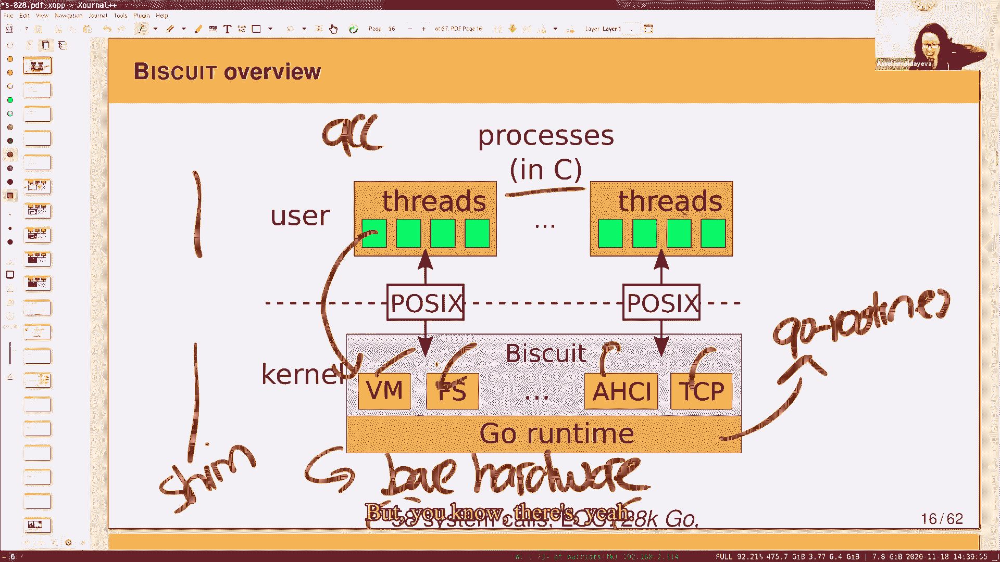

# 课程 P19：第20讲 - 内核与高级语言 (HLL) 🧠💻

在本节课中，我们将探讨一个操作系统领域的核心问题：应该使用何种语言来编写内核？我们将通过分析一篇研究论文，来了解使用高级语言（如Go）编写内核的利弊、性能成本以及安全性考量。

---

## 概述 📋

内核是操作系统的核心，传统上多使用C语言编写，以获得对硬件的直接控制和极致性能。然而，C语言也带来了内存安全漏洞等风险。高级语言（HLL）提供了内存安全、自动内存管理等优势，但通常被认为会带来性能开销。本节课我们将深入分析一篇论文，该论文通过构建一个名为“Biscuit”的Go语言内核，并与Linux进行对比，旨在量化这种权衡。

---

## 背景与动机 🤔

上一节我们介绍了内核编程语言选择这一普遍问题。本节中，我们来看看这篇论文产生的具体背景和动机。

许多流行的内核，如Linux和Windows，都是用C语言编写的。C语言提供了对内存分配、硬件访问的完全控制，并且运行时极小。然而，编写安全的C代码非常困难，常见的漏洞包括缓冲区溢出、释放后使用等。根据CVE记录，仅2017年就有40个Linux内核漏洞可导致攻击者完全控制机器。

高级语言（如Java、Go、Python）的一个主要吸引力在于它们能提供内存安全，从而避免上述大部分漏洞。此外，它们还提供自动内存管理（垃圾回收）、良好的抽象和并发支持等好处。

那么，为什么不用高级语言编写所有内核呢？原因在于性能成本。高级语言通常需要边界检查、垃圾回收等操作，这会带来开销，有时被称为“高级语言税”。此外，内核编程还需要直接内存访问、手写汇编等能力，这可能与高级语言的特性不兼容。

这篇论文的目标就是衡量在内核中使用高级语言而非C语言的整体权衡，包括安全性、可编程性以及性能成本。

---

## 研究方法论 🔬

在了解了问题背景后，我们来看看论文是如何设计实验来回答这个问题的。

核心方法是构建一个名为Biscuit的新内核，它使用具有自动内存管理的高级语言（Go）编写，但遵循传统的单体内核架构。这样做的目的是为了与C语言内核（如Linux）进行公平的比较。

以下是实验设置的关键点：
*   **对比对象**：在左侧是使用Go编写的Biscuit内核；在右侧是作为对比基准的Linux内核。
*   **功能子集**：Biscuit实现了与Linux大致相同的系统调用子集和接口。
*   **相同应用**：在Biscuit和Linux上运行相同的应用程序（如Nginx网络服务器），生成相同的系统调用轨迹。
*   **性能测量**：通过比较两者执行必要操作的表现，来分析高级语言带来的差异。

选择Go语言的原因包括：它是静态编译语言，能生成高性能代码；其设计考虑了系统编程；并且它拥有垃圾回收器，这有助于我们评估自动内存管理的成本。

---

## Biscuit 内核设计与挑战 ⚙️

现在，我们进入Biscuit内核本身，看看它的工作原理以及实现过程中遇到的一些预期之内和意料之外的挑战。

Biscuit采用了与XV6/Linux类似的经典内核模型，包含用户空间和内核空间。用户程序（用C编写）通过系统调用接口与内核交互。Biscuit内核本身则实现了进程、文件系统、网络栈、驱动程序等模块。

### 关键特性与实现细节

*   **多核与并发**：Biscuit是多核的，并利用Go的协程（goroutine）来实现内核线程。每个用户线程对应一个内核协程。
*   **系统调用流程**：与XV6类似，通过陷入指令进入内核，由对应的内核协程处理。
*   **页表切换**：在进入/退出内核时切换页表。由于使用未修改的Go运行时调度器，需要在软件中复制用户/内核空间的数据。
*   **中断处理**：设备中断处理程序几乎不做事，仅设置标志，由专门的Go协程来实际处理中断，以避免在中断上下文中分配内存或持有锁。

### 主要挑战：堆耗尽 (Heap Exhaustion)

最大的挑战之一是处理内核堆内存耗尽的情况。在内核中，像文件描述符、套接字等对象是动态分配的。当堆满时，新的分配请求会失败。

在C语言中，`malloc`可以返回`NULL`来表示失败，但Go语言的`new`操作不会失败。这迫使Biscuit需要一种不同的解决方案。

Biscuit的解决方案是**预留（Reservation）**：
1.  在每个系统调用开始时，先预留足够执行该系统调用所需的最大内存量。
2.  如果内存不足，系统调用会等待（此时未持有任何锁），内核可以尝试回收内存（如刷新缓存）。
3.  一旦预留成功，系统调用保证可以执行完毕，不会中途因内存不足而失败。
4.  系统调用结束后，预留的内存被释放回池中。

关键问题在于如何计算一个系统调用所需的最大内存量。Biscuit利用了Go生态中的静态分析工具，通过分析调用图、对象大小、循环边界等，保守地估算出这个上界。这项工作需要人工介入和注释，但总体上是可行的。

---

## 评估：收益与成本 ⚖️

在了解了Biscuit如何工作之后，本节我们重点分析论文的评估结果，即使用高级语言到底带来了哪些好处，又付出了什么代价。

### 收益分析

首先，论文确认Biscuit确实使用了丰富的高级语言特性（如分配、垃圾回收、映射、闭包、接口等），其使用模式与大型Go项目相似。

在代码简化方面，高级语言带来了显著好处：
*   **自动内存管理**：简化了资源释放。例如，进程退出时，其地址空间等数据结构会被垃圾回收器自动清理。
*   **内置数据结构**：如映射（map），避免了手动实现哈希表的麻烦。
*   **解决并发共享难题**：当多个线程共享一个对象（如缓冲区）时，确定何时释放非常棘手。在C中可能需要复杂的引用计数或RCU机制。而垃圾回收器会自动追踪引用，当没有协程引用该对象时便会释放，对程序员完全透明。

在安全性方面，论文分析了Linux的CVE漏洞。在40个内存安全漏洞中，有29个在Go中会直接避免（如缓冲区溢出会引发panic而非漏洞），11个逻辑错误则无法避免。总体来看，高级语言消除了大部分内存安全漏洞。

### 成本分析（性能）

性能比较是核心。在运行Nginx等应用时，Biscuit的吞吐量比Linux慢大约10-15%。虽然并非苹果对苹果的完全公平比较，但差距并非数量级（如2倍、10倍）那么大。

为了进行更精确的比较，论文实现了一个完全相同的代码路径（管道乒乓测试）在C和Go中。结果显示，Go版本慢了约15%，主要开销来自于堆栈检查、安全指针检查等C中不存在的指令。

垃圾回收（GC）的开销是关注重点。在常规负载下，GC开销仅占执行时间的约3%。然而，GC开销与存活对象数量线性相关。实验表明，要维持GC开销在10%以下，需要空闲内存大约是存活内存的2倍（即总堆大小约为存活内存的3倍）。

垃圾回收导致的停顿时间：最大单次停顿约150微秒，单个HTTP请求可能经历的最大总停顿约582微秒。这对于尾延迟要求（通常在毫秒级）的应用来说，尚在可接受范围内。

---

## 结论与思考 💡

通过整篇论文的分析，我们现在可以回到最初的问题：应该使用什么语言编写内核？

论文并没有给出一个明确的“是或否”的答案，但提供了一些重要的思考维度：

*   **教育与实践的差异**：像XV6这样的教学操作系统使用C语言，是为了让学生透彻理解硬件与软件接口之间的每一层。而生产级内核的选择则需要权衡更多因素。
*   **权衡取舍**：
    *   如果**极致性能和最小内存占用**是首要目标，C语言可能仍是首选。
    *   如果**安全性和开发效率**更为重要，并且可以接受一定的性能开销（例如10-30%），那么高级语言是一个完全合理甚至更优的选择。
*   **关键认知**：高级语言并非内核编程的障碍。论文表明，用Go实现与Linux类似的高性能优化（如大页、无锁读取、目录缓存等）是可行的。主要的挑战在于如何与语言运行时（如垃圾回收器）协作，而非语言本身的能力限制。

最终，编程语言是一种工具。无论是C还是Go，都可以用来构建内核和用户程序。选择取决于项目的具体目标、约束条件和团队偏好。

---

## 总结 🎯

本节课我们一起学习了关于内核编程语言选择的深入探讨。我们通过一篇研究论文，了解了使用Go这样的高级语言编写内核（Biscuit）所带来的优势，如内存安全、代码简化，以及所需面对的性能成本挑战，特别是垃圾回收的开销和堆耗尽问题的创新解决方案。最重要的收获是，这是一个需要根据具体场景进行权衡的工程决策，没有放之四海而皆准的答案。