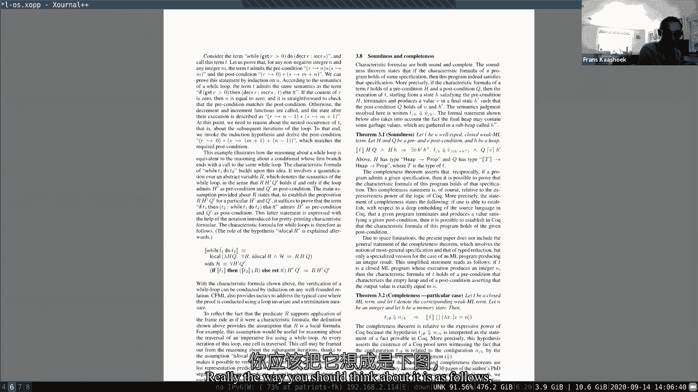

# P2：Lecture 3 - OS Organization and System Calls中文版 - MCATIN-麦可汀留学 - BV1rS4y1n7y1

 [MUSIC]。

 >> All right， live and clear？ >> Yeah， sounds good。 >> Okay， great。 So。

 pretty afternoon or good evening or good morning or good night or wherever you are。

 Let's get started on the， I guess， the third lecture in SOA1。

 which is going to be about OI as an organization。 And the topics for today are four things that I want to touch on。

 One is isolation。 Which you'll see is the driving design goal for OI as an organization。

 I'll talk a little bit about kernel and user mode。

 That's a way of isolating the kernel from or the operating system from user applications。

 Then we'll talk about system calls， which is a way for user applications to basically。

 transition into the kernel so they can ask for services。

 And we'll look at a little bit how this all is instantiated in simple form inside of X86。 So。

 that is the point for today。 And just to sort of remind you where we were after the first lecture。

 the picture sort of in your head， you should have in your head is there are processes like。

 the shell， like echo or whatever。 Find whatever， get some of the utilities that you implement it。

 They're running on top of an operating system。 And the operating system abstracts some of the hardware resources。

 like a disk or a CPU。 And basically the interface between the operating systems and the shell is not difficult to use。

 The system call interface that we've been looking at is the Unix interface。 And here what we see is。

 so that was roughly， you know， actually with that Unix interface。

 you've been playing around in lab one， where in the usual app where you used the system call interface。

 to an X API to actually implement different sets of applications。 And so lab one。

 usually lab is mostly focused on sort of using this part of the design picture here。

 And what we're going to be doing now in this first lecture or this lecture and then you subsequent lectures。

 we're going to really look actually how the interface is actually implemented。 And in fact。

 almost all the semester we'll be spending time on figuring out actually how to implement the interface。

 So this is going to be the first lecture of that kind of style。 And unfortunately， you know。

 a lot of you asked really great questions over email or submitted a great question to the website。

 And we won't be able to go into great amount of detail immediately in this sort of first lecture that types and insides look at the operating system。

 We're going to talk to you a lot about different things。

 but many things will come more clear in subsequent lectures。

 where we're going to explore it in a more depth。 But nevertheless， if there's something unclear。

 feel free to interrupt and ask a question。 And maybe just to start off before actually going any further。

 let me ask you a question and sort of get the question and answering， hopefully， going。

 And ask you like， what is the sort of most interesting thing that you learn from the YouTube lab？

 And I'll start by answering that question myself。 One of the things that actually surprised me after writing or doing the usual lab is that I use XRX a lot more frequently than I used to do。

 I had another way of doing basically the same thing as XRX instead of commands。

 And after actually doing the XRX， well， I was like， oh。

 it's much more convenient actually to use it in that way。 And so since then。

 I mean a much more aggressive user of XRX。 And I'm just wondering what the experience has been for some of you。

 And so maybe I'll call out a few names and maybe you can mute your microphone and answer it。

 just say a little bit about your experience with YouTube lab。 So let me pick some people。 Andrew。

 you。 Andrew， are you online when I'm listening？ The most interesting thing for me was just the pipes。

 How do I write concurrent programs？ I do done any sort of pipe programming before。 No， I haven't。

 I've seen the old concurrent stuff， but I haven't seen OS level pipes before。

 How about Elizabeth Weeks？ Yeah， I'd agree with that。

 I also thought that the OS pipes were super interesting and the primes examples specifically was cool to kind of figure out and realize that I needed to close certain pipes and just how they kind of related to each other。

 Yeah， I don't mean you did find the pipes of the crimes a little bit harder than you might have thought。

 It's a surprise to me every time a little bit tricky to get it right。 Jessica， she。

 I also thought the primes exercise was the most interesting。 Did it take you a lot of time？

 Where was it？ Not too bad。 It took me more time after I realized my initial implementation wasn't actually concurrent。

 so it was interesting to think about like what the differences are there。 How about Robert Murphy？

 Yeah， I think that the， my experience was really just。

 I found it really challenging to program in the original way it was set up。

 So I actually created like a bunch of helper functions that wrapped around things。 So that's。

 I guess what I did。 Okay。 Any idea， I might be also have sort of any piece of wisdom。 Amanda。

 go ahead。 I kind of like to in found it surprising slash cool that。 Yeah， yeah， yeah， yeah， yeah。

 yeah， yeah， and XV six doesn't hide that from you at all。

 At least in the normal C right library does a little bit of wrapped up in a， in an interface。

 but actually six doesn't hide at the old， but in the end it boils down indeed to， you know。

 just file the script or zero and one and to， I guess， we're standard error。 Good。 I'll agenda up。

 I guess one thing I was repressed about was also from the prime problem。

 I had this bug that I spent hours on and the thing was that I didn't realize that actually there were whenever you were。

 Opening a pipe and then for like calling fork then basically there would be four ends to the pipe because that pipe it's kind of goes both to the child process and the process。

 the parent process。 And but I was only closing two of those。 So yeah， that was common。

 common problem。 It made sense， but for some reason。

 because especially textbook says that when you fork all of the open file descriptors get copied。

 but I didn't think about it。 Yeah， no， it's hard to mean there's a lot of details in that interface and。

 you know， the only way to get actually really familiar with it is actually is the program with it and then experience it。

 Well， good。 I hope you enjoyed the lab， and， you know， of course。

 I hope you will enjoy the subsequent labs too。 So the lecture for today in some sense is really partially to help you to get going on the Cisco lab。

 If you have another started。 And so again， you know， to free to interrupt and ask questions。 Okay。

 so the first thing I want to do is talk a little bit about isolation。 And， you know。

 why it's important and why we might care。 And， you know， the basic stories in our reasonable simple。

 you know， we have multiple applications here。 We got the shell， we got echo， we find。

 And then we great， correct that if you had a bug in the shell， or， for example。

 in your crimes program， that actually didn't affect any of the other applications， you know。

 particularly would be bad from simply affected the shell because probably the shell you're using to actually。

 you know， kill the program and something goes back。

 And so you want sort of strong isolation between these different applications。 And similarly。

 you know， the OS is sort of the servant， you know， for all the applications。

 And you would like it to be the case that， you know， if， again， you know。

 you make a bug in the one of your new deal programs that actually the operating system doesn't crash。

 you know， you pass some strange argument to your operating system。 And， you know。

 it should be the case that the operating system handles that well。 And so again。

 you would like to be either sort of strong isolation between the applications and the operating system itself。

 And one way to think about this a little bit is to say， is ask ourselves the question， you know。

 what， what would happen if there's actually no operating system， so like， you know。

 consider some strong and design design。 Where there is no operating system。

 Or you can think about it as the operating system， just being a library， you know。

 sort of thinking of， you know， in terms of Python。

 maybe just import OS and import OS basically loads the whole operating system inside of your application。

 And that's known as the programming interface you use。 So if you think about that。

 sort of way of thinking， so let's say we have to show here， you know， maybe it includes the。

 you know， the library for the OS， and maybe we have some other application echo。 And then basically。

 you know， these these applications， if there's no operating system really， you know。

 directly interact with the hardware。 And so example， you know， they would actually see， you know。

 that's a CPU core， there's another CPU core。 And， you know， maybe there's a disk。

 and then when they're directly with the disk walks， and maybe there is memory。

 and then we're directly interact with the memory of the machine。

 And so there's no layer between no extraction layer between basically the applications in the hardware。

 And it turns out that it's just not such a great design for isolation。

 And you can see how isolation might be broken。 Let's assume， for example， that， you know。

 one of the goals for the operating system is run multiple applications。

 And so it has to be the case that once in a while， you know。

 we'll switch from one application to another application。 Let's say the hardware has only one CPU。

 And so we're running the shells， say， in that one CPU， but periodically， you know。

 other applications would be able to run too。 Well， we have no operating system， you know。

 to do it for us。 Then the shell basically has to sort of give up， you know， the CPU once in a while。

 And sort of be a nice person and say like， well， I can run for a little while。

 you get a chance to run。 And this is something that's called cooperative scheduling。

 But that's not so great for isolation。 You know， for example， what if， you know。

 some function in the shell has an infinite loop， and therefore it will never actually give up the CPU。

 And then no other， you know， applications could run。

 including maybe the application that would like stop or kill the shell。

 And so we basically don't get any sort of form of enforced multiplexing。

 And that's something that we'd like to have where no matter what the application does。

 and it will be forced to give up the CPU once in a while， so that other applications will run。

 And similarly， you know， if you think about the strawman design， you know， we have。

 there's like physical memory， right？ And all I drew the picture here as sort of the application sitting on the top of the hardware。

 But， you know， there's physical memory and basically the text and the code and the data for these applications actually sits in physical memory。

 And here's maybe， you know， the part of physical memory that's used by the shell。

 And here's maybe the part of the physical memory that's used by echo application。

 And so you're going to， you know， and again， what we see here， if you would like simply。

 simplistically like this， there's sort of no boundary between these two guys。 For example， if。

 you know， echo， you know， stores through location， that example belongs， you know。

 to the shell like location of thousands and writes value there， you know， whatever x。

 Then it would just overwrite the physical memory of the shell memory。 And so that， you know。

 be pretty undesirable， right？ Because then a bug， you know。

 an echo could actually percolate into the shell， and， you know。

 it's going to be very tricky to do bug and that kind of stuff。

 So this basically again gives us like no strong isolation。 What we like is to have memory isolation。

 so that one application cannot overwrite the memory of another application。 And so， you know。

 one reason， you know， or maybe a problem， the main reason to actually have an operating system is basically to enforce。

 you know， both the multiplexing， and enforce， you know， strong memory isolation。

 And if you didn't have an operating system and the applications were directly interacting with the hardware。

 that would be very hard to achieve that。 And so this design of basically， you know。

 operating system as a library is not a very common design。

 You may see it in some real time systems where basically applications trust each other。

 But in most other operating systems， you know， there's an operating system that really enforces。

 you know， that kind of isolation。 So we look a little bit now at the Unix interface from this perspective。

 Then we see that the interface actually is carefully designed。

 So they're actually feasible to implement that enforced isolation in terms of multiplexing in terms of physical memory。

 And the way that it's done is that the interface basically extracts the hardware。

 Hardware resources。 In a way that then it makes it easy to actually do or not easier。

 it makes it possible to provide， you know， this strong actual isolation。 And you know。

 maybe you could give some examples。 So processes， we've seen that。

 like the things that are created by fork。 You know， they're not， you know， literally a CPU， right？

 I mean， you know， they sort of， but they correspond to like what a CPU is。 Now。

 it allows you to run computation。 But now because， you know， their。

 the application cannot directly interact with this CPU， but only for this process of traction。

 the kernel， sort of behind the scenes， you know， can switch between processes。 So instead of having。

 you know， direct CPUs to manipulate or given to the application， you know。

 operating system provides processes that extract away or the CPU itself so that actually the operating system can multiplex and one CPU or multiple CPU's among multiple applications。

 Similarly， if you think about exec， exec provides a memory image。 And， uh。

 I'm on the go ahead and ask your question。 So one question about like processes sort of like extracting the CPU。

 Is it that one process uses part of the CPU and another process uses a different。

 like more a different part of that CPU or a different CPU if it's like a multi core or like。

 what do you mean by processes instead of the CPU。 Yeah。 So。

 what do you mean one CPU abstracted away into a process so okay so the way to think about it is the risk five core or risk five processor that we're using in the lab。

 that's actually four cores。 And so you can run four processes concurrently or in parallel， you know。

 one process on each core。 And what the operating system does is let's say you have eight applications or seven applications。

 it will take some core and multiplex it time multiplex it between different processes。

 And we'll run， you know， one app process for a hundred milliseconds， then stop， unload， you know。

 that process out of the CPU or out of the core loading the next application or the next process that runs out for a hundred milliseconds。

 And it just enforces that no application can run or no cross can run longer than a hundred milliseconds。

 And we'll see exactly how this would be done in a couple lectures。

 but that's sort of the basic idea。 Okay， but multiple processes cannot use the same CPU at the same time。

 It's time multiple。 If you run for a while， then you run the next one for a while。 All right。

 thank you。 Okay， so one way to think about exec is that it actually abstracts memory。 So。

 for example， if you think about the x-existent call， you know， it takes a file name， you know。

 in that file is basically the memory image of a program store。 And it's text， you know。

 someone did some global data in an app forms the memory of the application。 Now。

 the application can grow its memory， for example， by calling S break and extend their。

 by extending its data segment。 But it doesn't really have direct aspects to physical memory。

 You know， you can't just ask， "I want， you know， address a physical memory 1K to 2K。"。

 There's no way of getting at that。 And again， the reason there's no way that you can get at that is because the operating system is going to want to provide memory isolation。

 And therefore， once it's being controlled， it would sit intermediate between the applications and the physical hardware。

 And exec is going to sort of a system call that， you know， capture or shows that。

 that there's no direct access to memory。 Another example of this is like files。

 The files basically abstract away disk walks。 So instead of reading and writing the disk walks off the disk that sits attached to your computer。

 that actually does not allow the Unix。 You know， the only way to interact with the storage system is through files。

 And you can read and write files， you provide a convenient abstraction， you can name files， etc。

 But then the operating system in itself connects to decide how to map those files to disk blocks and make sure。

 for example， the disk block only shows up in one file。 And then， you know， user A cannot actually。

 you know， manipulate or read and write the files of user B。 And again， you know， this， you know。

 that sort of interface， that file abstraction allows that sort of strong isolation between even different users and。

 you know， different processes of the same user。 And so you see that， you know， in some ways。

 you know， the system call interface or the Unix interface that you've been programming with。

 you know， in the Utah lab， seems to be sort of careful designed to abstract the data。 So that。

 you know， the operating system， the implementation of the interface can actually multiplex。

 you know， the resources or multiple applications and provide strong strong isolation。

 Any questions about that？ We have a question in the chat that says。

 do more complex kernels try to reschedule processes on the same core to reduce cash misses。 Oh。

 yeah， there's something called cash affinity。 You know。

 the scheduler in modern operating systems are very sophisticated。 And indeed， you know。

 try to avoid cash misses and things like that， you know， to optimize the performance。 And， you know。

 we'll see some of that much later in the semester， you know， what we're going to be talking about。

 how performers networking will show up there。 Another question from chat。

 where in xv6 can we see how the OS multiplex is processes？ We're going to。

 there's a couple of files that are relevant， but prock。c is probably the most relevant one。

 This will be a topic of lecture in like two or three weeks。

 And we're going to go in great amount of detail and show exactly how the multiplexing happens。

 So one way to think about this lecture is a little bit of an introduction to a lot of different pieces。

 and， you know， because we've got to start somewhere。 Okay。 So， so we go back into this， you know。

 picture here that showed a little while ago， we have this， the shell running， the echo running。

 or not that picture， this picture here on this side。 So， we have the operating system。

 we have the applications running， and one thing we should be worried about this worry about the operating system should be。

 oh， I should be defensive。 And this is sort of an important mindset， you know。

 that you have to get used to one of your current development。 The operating system， you know。

 has to ensure that everything， you know， everything works out。 And so。

 it has to set up things up so that， you know， an app cannot crash the operating system。

 It would be too bad， they have an application that either by accident or maliciously passes。

 you know， tricky argument to the operating system， and the option is to be correct。

 That basically means sort of denial of service for every other application。

 So the operating system has to be written in a way that， you know。

 can deal and handle malicious applications。 And particularly another concern is that an application should not be able to not break out of its isolation。

 And the application might be definitely malicious， maybe written by an attacker。

 and attacker probably， you know， would like to break out of the application， for example。

 and take control over the kernel。 And once you have control over the kernel。

 then you can do anything because， you know， the kernel is in control of all the hardware resources。

 And so the operating system has to be written defensively， you know， to avoid those kinds of things。

 And this sort of turns out to be very tricky to actually get right。 In fact， in Linux， you know。

 there are still periodic bugs， you know， kernel bugs are bugs that actually allow an application to exploit or to break out of this isolation domain and take control。

 But it is just continuous concern and we like to do as a good job as possible。

 And this is the mindset you have to have when you're developing a kernel that actually applications are perhaps malicious。

 Now， this means that the means there has to be strong isolation between the apps and the OS。

 And if the OS， you know， needs to be defensive and needs to be in a position that can be defensive。

 there has to be sort of a strong wall between the applications so that the operating system can actually enforce。

 you know， whatever policies that wants to enforce。 And this is typically done。

 The typical approach achieving this strong isolation is using hardware support。

 And we did a little bit of flavor that in this lecture but we'll come back to it in much more detail and subsequent lectures and there's two。

 two parts of these hardware support。 One is something that's called user kernel mode。

 That's kernel mode。 In the risk five is called supervisor mode， but it's the same thing。

 And then page tables of virtual memory。 So all processors。

 sort of all sort of serious processors that are intended to run an operating system and multiple applications have support for either for user kernel mode in virtual memory。

 It might be reinstated were implemented in slightly different ways。

 but basically all processors have it。 And our risk by procedure that we're using in this class has that support too。

 And so let me talk a little bit about user mode and kernel mode first and then I'll talk a little bit about virtual memory。

 Mostly at the highest level possible because there's a lot of important details that I won't be able to cover those in this lecture。

 So let's first talk about user kernel mode。 And basically what it means is that the processor has two modes of operation。

 One is user mode and the other one is kernel mode。 And when you're running in kernel mode。

 the CPU can execute privilege instructions。 I'll come back to you in a second to that。

 When running in user mode， the CPU can only execute in privilege instructions。

 And infrastructure is a structure you're well familiar with。 So when you're running in the server。

 you're going to be able to do a lot of work。 And then you're going to be able to do a lot of work。

 And then you're going to be able to do a lot of work。

 And then you're going to be able to do a lot of work。

 And then you're going to be able to do a lot of work。

 And then you're going to be able to do a lot of work。

 And then you're going to be able to do a lot of work。

 And then you're going to be able to do a lot of work。

 And then you're going to be able to do a lot of work。

 And then you're going to be able to do a lot of work。

 And then you're going to be able to do a lot of work。

 And then you're going to be able to do a lot of work。

 And then you're going to be able to do a lot of work。

 And then you're going to be able to do a lot of work。

 And then you're going to be able to do a lot of work。

 And then you're going to be able to do a lot of work。

 And then you're going to be able to do a lot of work。

 And then you're going to be able to do a lot of work。

 And then you're going to be able to do a lot of work。

 And then you're going to be able to do a lot of work。

 And then you're going to be able to do a lot of work。

 And then you're going to be able to do a lot of work。

 And then you're going to be able to do a lot of work。

 And then you're going to be able to do a lot of work。

 And then you're going to be able to do a lot of work。

 And then you're going to be able to do a lot of work。

 And then you're going to be able to do a lot of work。

 And then you're going to be able to do a lot of work。

 And then you're going to be able to do a lot of work。

 And so when the processor decodes in the instruction， looks at the opcode。

 If the opcode is a privilege instruction and the bid is set to one。

 and will deny executing that instruction。 It's like goodbye by zero。 You're not allowed to do that。

 Okay。 But if that bid has changed， like if some way you were just able to overwrite that bit。

 then that's the only thing controlling。 Yeah。 So what do you think？

 The only instruction that overrides a bid is that a privilege instruction or an。

 unprivileged instruction。 Is that a question？ Clearly， you know。

 the instruction that sets the bid must be a privilege。

 instruction because the user application should not be able to set the bid to kernel， mode， correct？

 And then， you know， be able to actually run all kinds of privilege instructions。

 And so that bid is protected。 Does that make sense？ Okay。 Yeah。 Okay。 Good。

 So let's use a kernel mode or at least， you know， the top view of the kernel mode。

 It turns out the risk five has a number of you asked about to have a third mode， machine mode。

 We're mostly going to ignore that。 And so I'm not going to much say about it。

 Basically is one more level。 You get basically three levels of privilege instead of two level of privilege。

 Let me go ahead。 All right。 So I'm wondering with respect to security。

 if all user code does go through the， kernel， the intent is that things are secure。

 But is there a way for a user of the computer to completely go around the， operating system？ No。

 not really。 At least， you know， don't carefully not。 And if possible， like， you know。

 there might be the case that some programs have， additional privileges that the operating system will respect。

 But those privileges are not given to every user。 You know， it's in the middle of the view。

 The root user has certain privileges that allow you to do security sensitive， operations。

 What about BIOS？ Does BIOS happen before OS or after？ Yeah。 So the BIOS。

 this is the piece of software that basically comes with the computer。 And that's booted first。

 And the BIOS basically boots the operating system。 So the BIOS is a trusted piece of code。

 And better be correct。 And better be not malicious。 Noah， go ahead。 Yeah。

 So you mentioned that the instruction to set the kernel mode bit is a， privileged instruction。

 How would a user program ever then be able to， you know， get， like， you know。

 essentially have the kernel execute any kernel instructions if， like， the very。

 instructions to access kernel mode is itself a privileged instruction。

 I guess it seems like there's immediately a barrier for a user program ever， changing that bit。

 Yeah。 Yeah。 That's correct。 And that's exactly the way we want it， correct？

 So one way to think about it。 And this is not exactly how it works。 So the risk why。

 but like if you execute a privilege instruction in。

 user space would try to execute privilege instruction in user space。 Yeah。 Yeah。 [ Silence ]。

 [ Silence ]， [ Silence ]， [ Silence ]。

 [ Silence ]， [ Silence ]， [ Silence ]， [ Silence ]， [ Silence ]， [ Silence ]， [ Silence ]。

 [ Silence ]， [ Silence ]， [ Silence ]， [ Silence ]， [ Silence ]， [ Silence ]， [ Silence ]。

 [ Silence ]， [ Silence ]， [ Silence ]， [ Silence ]， [ Silence ]， [ Silence ]， [ Silence ]。

 [ Silence ]， [ Silence ]， [ Silence ]， [ Silence ]， [ Silence ]， [ Silence ]， [ Silence ]。

 [ Silence ]， [ Silence ]， [ Silence ]， [ Silence ]， [ Silence ]， [ Silence ]， [ Silence ]。

 [ Silence ]， [ Silence ]， [ Silence ]， [ Silence ]， [ Silence ]， [ Silence ]， [ Silence ]。

 [ Silence ]， [ Silence ]， [ Silence ]， [ Silence ]， [ Silence ]， [ Silence ]， [ Silence ]。

 [ Silence ]， [ Silence ]， [ Silence ]， [ Silence ]。

 [ Silence ]， [ Silence ]， [ Silence ]， [ Silence ]， [ Silence ]， [ Silence ]。

 [ Silence ]， [ Silence ]， [ Silence ]， [ Silence ]， [ Silence ]。

 [ Silence ]， [ Silence ]， [ Silence ]， [ Silence ]， [ Silence ]， [ Silence ]， [ Silence ]。

 [ Silence ]， [ Silence ]， [ Silence ]， [ Silence ]， [ Silence ]。

 [ Silence ]， [ Silence ]， [ Silence ]， [ Silence ]， [ Silence ]， [ Silence ]， [ Silence ]。

 [ Silence ]， [ Silence ]， [ Silence ]， [ Silence ]， [ Silence ]， [ Silence ]， [ Silence ]。

 [ Silence ]， [ Silence ]， [ Silence ]， [ Silence ]， [ Silence ]， [ Silence ]， [ Silence ]。

 [ Silence ]， [ Silence ]， [ Silence ]， [ Silence ]， [ Silence ]， [ Silence ]， [ Silence ]。

 [ Silence ]。

 [ Silence ]。

