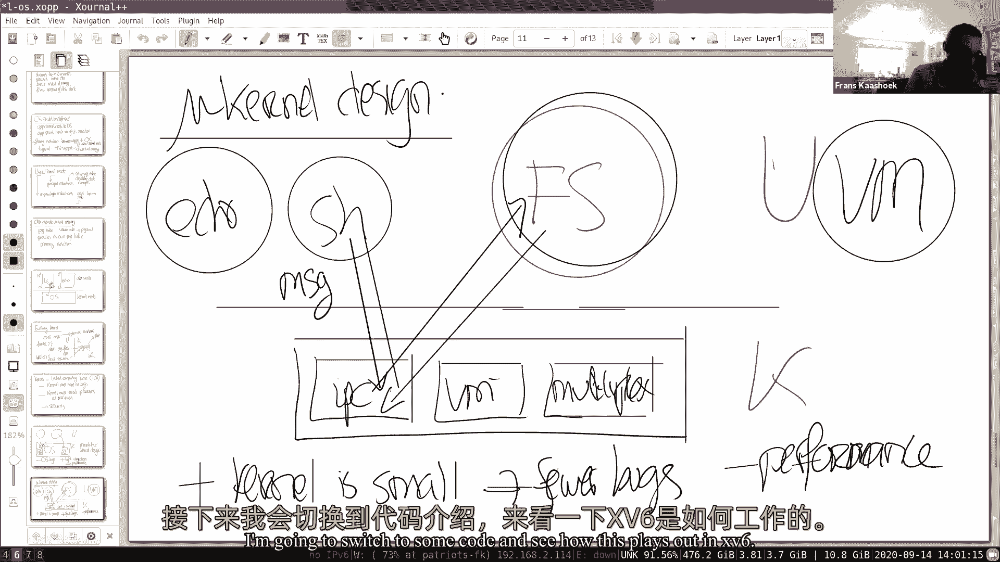
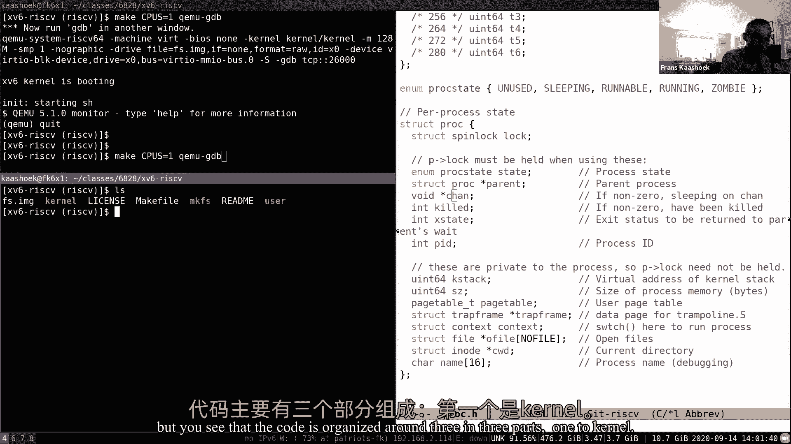
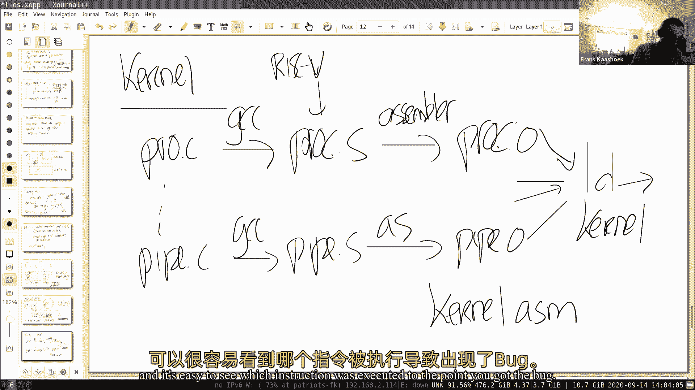
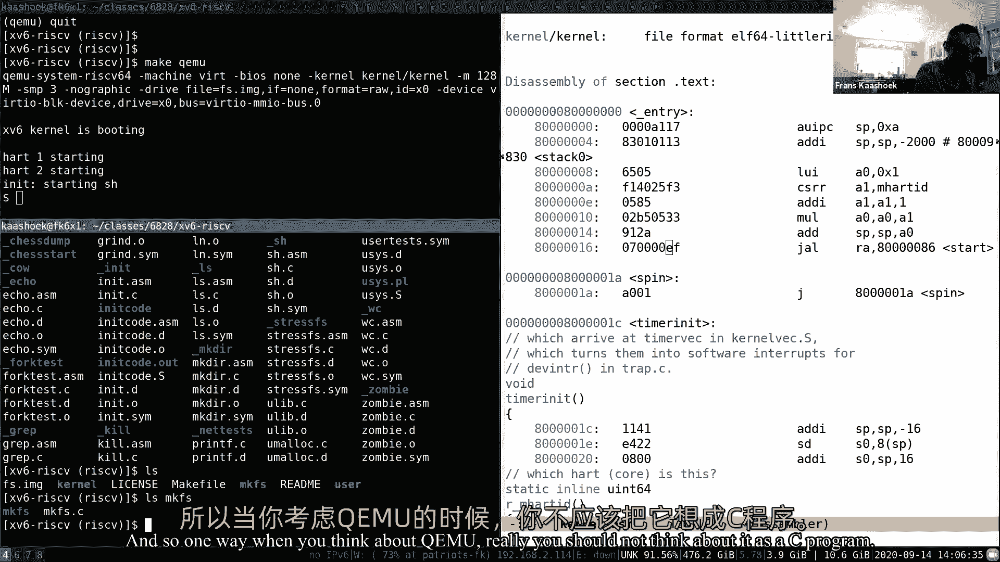
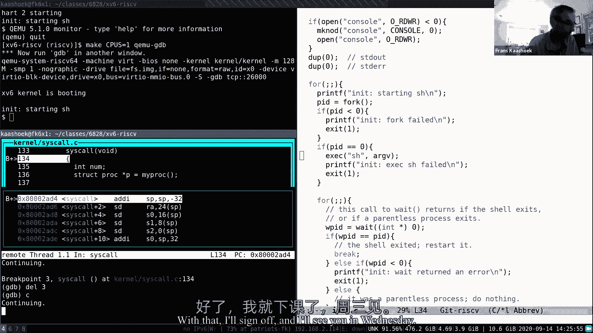
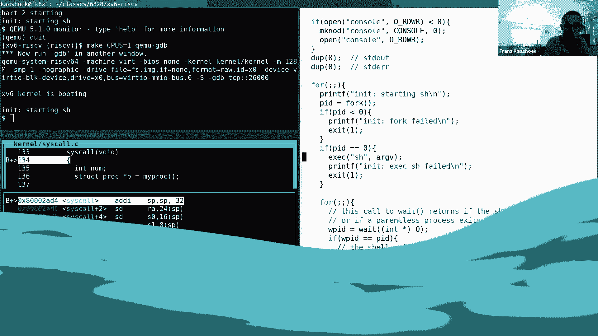

# 操作系统原理 P2：第3讲 - 操作系统组织与系统调用 🖥️🔧

在本节课中，我们将要学习操作系统的核心组织原则，特别是如何通过硬件支持实现应用程序与操作系统之间的强隔离。我们将探讨内核模式与用户模式、系统调用的工作原理，以及这些概念在RISC-V架构中的具体体现。

## 概述 📋

操作系统的主要设计目标之一是实现强隔离。这意味着一个应用程序中的错误或恶意行为不应影响其他应用程序或操作系统本身。为了实现这一点，现代操作系统依赖于硬件提供的两种关键机制：**用户/内核模式**和**虚拟内存（页表）**。本节课将首先探讨为什么隔离如此重要，然后深入讲解这两种机制如何工作，以及应用程序如何通过**系统调用**安全地请求内核服务。

## 隔离：核心设计目标 🛡️

上一节我们概述了课程目标，本节中我们来看看驱动操作系统组织的核心目标：**隔离**。

我们运行多个应用程序，例如Shell、`echo`或`find`。理想情况下，如果Shell中存在一个错误，它不应该影响其他应用程序。同样，应用程序中的错误也不应导致操作系统崩溃。这种强隔离对于系统的稳定性和安全性至关重要。

考虑一个没有操作系统的简单设计（或操作系统仅作为一个库）。应用程序将直接与硬件（CPU、内存、磁盘）交互。这种设计会带来严重的隔离问题：

1.  **协作式调度问题**：如果只有一个CPU，应用程序需要“友好地”定期让出CPU以供其他程序运行（协作式调度）。但如果一个应用程序陷入无限循环，它将永远不会让出CPU，导致整个系统停滞。
2.  **内存隔离问题**：所有应用程序的代码和数据都存放在物理内存中。如果没有边界，一个应用程序可以轻易地读写属于另一个应用程序的内存，导致错误传播和安全漏洞。

因此，操作系统的一个主要存在理由就是**强制执行多路复用和强内存隔离**。Unix系统调用接口（如`fork`、`exec`、文件操作）正是经过精心设计，以抽象硬件资源（CPU、内存、磁盘），使得操作系统能够在幕后实现这种隔离。

*   `fork`和进程抽象了CPU，使得操作系统可以在多个进程之间进行时间片轮转。
*   `exec`和内存管理抽象了物理内存，应用程序无法直接访问特定的物理地址。
*   文件抽象了磁盘块，操作系统控制数据在磁盘上的布局和访问权限。

## 内核模式与用户模式 🏰

为了实现强隔离，操作系统必须能够防御有缺陷或恶意的应用程序。这需要在应用程序和操作系统之间建立一道“坚固的墙”。硬件通过提供**用户模式**和**内核模式**来支持这一点。

处理器有两种操作模式：
*   **内核模式**：在此模式下，CPU可以执行所有指令，包括**特权指令**（例如直接操作硬件设备、修改页表寄存器的指令）。
*   **用户模式**：在此模式下，CPU只能执行非特权指令。如果尝试执行特权指令，处理器将产生一个异常（陷阱），并将控制权交还给操作系统。

CPU内部有一个特殊的寄存器位来标识当前模式。设置该位到内核模式的指令本身就是一个特权指令，这意味着用户程序无法自行切换到内核模式。这确保了用户程序始终被限制在“沙箱”中运行。

## 系统调用：通往内核的桥梁 🌉

既然用户程序无法直接执行特权操作，那么它们如何请求操作系统提供服务（如读写文件、创建进程）呢？答案是通过**系统调用**。

系统调用是用户程序主动进入内核模式的受控方式。其工作流程如下：

1.  用户程序执行一个特殊的指令（在RISC-V中是`ecall`），该指令会触发一个**硬件陷阱**。
2.  硬件自动完成以下动作：
    *   将处理器模式从用户模式切换到内核模式。
    *   保存当前的程序计数器（PC）到**SEPC**寄存器。
    *   将陷阱的原因保存到**SCAUSE**寄存器。
    *   跳转到一个预设的内核地址（**STVEC**寄存器指向的**陷阱向量**）开始执行内核代码。
3.  内核的陷阱处理代码开始运行。它检查陷阱原因（SCAUSE），发现是来自用户空间的系统调用。
4.  内核根据用户程序传递的参数（通常通过寄存器，如RISC-V的a0-a6）来确定是哪个系统调用（如`read`、`write`、`fork`），并执行相应的内核服务。
5.  服务完成后，内核执行**特权指令** `sret`。
6.  硬件恢复现场：
    *   将模式从内核模式切换回用户模式。
    *   从SEPC寄存器恢复PC，程序从`ecall`之后的下一条指令继续执行。

这个过程就像用户程序“敲门”（`ecall`），内核“开门”处理请求，然后“送客”（`sret`）并让用户程序继续。所有特权操作都在内核模式下安全完成。

## RISC-V中的实现示例 💻

让我们在RISC-V和XV6的上下文中具体看看。以下是`write`系统调用在用户空间的简化汇编视图：

```assembly
# 用户程序调用 write(1, “hello\n”, 6)
li a0, 1          # 文件描述符 (stdout)
la a1, hello_str  # 缓冲区地址
li a2, 6          # 字节数
li a7, SYS_write  # 将系统调用编号放入 a7
ecall             # 执行系统调用，陷入内核
# ... ecall 返回后继续执行
```

当执行`ecall`后：
1.  硬件切换到内核模式，跳转到`stvec`指向的内核陷阱处理程序（如`uservec`或`trampoline`代码）。
2.  内核保存用户寄存器状态，然后调用`usertrap()`函数。
3.  `usertrap()`检查`scause`，发现是系统调用，于是调用`syscall()`函数。
4.  `syscall()`根据`a7`中的编号（`SYS_write`）索引系统调用表，找到对应的内核函数`sys_write`并执行。
5.  `sys_write`在内核中完成实际的写操作。
6.  返回路径：`syscall()` -> `usertrap()` -> 恢复用户寄存器 -> 执行`sret`指令返回用户空间。

## 总结 🎯

本节课我们一起学习了操作系统组织的基石。




*   我们首先明确了**强隔离**是操作系统的核心设计目标，它防止应用程序相互干扰或破坏操作系统。
*   为了实现隔离，硬件提供了**用户/内核模式**。用户模式限制应用程序只能执行非特权指令，而内核模式则允许操作系统执行所有必要的特权操作。
*   应用程序通过**系统调用**接口安全地请求内核服务。执行`ecall`指令会触发一个硬件陷阱，使CPU切换到内核模式并跳转到内核的陷阱处理代码。
*   我们以RISC-V架构和XV6操作系统为例，简要追踪了一个`write`系统调用从用户空间到内核空间再返回的完整流程。












理解用户/内核模式的划分以及系统调用的过渡机制，是理解操作系统如何管理和保护资源的关键第一步。在接下来的课程中，我们将深入探讨进程调度、虚拟内存等如何利用这些机制来构建一个完整、安全的多任务系统。