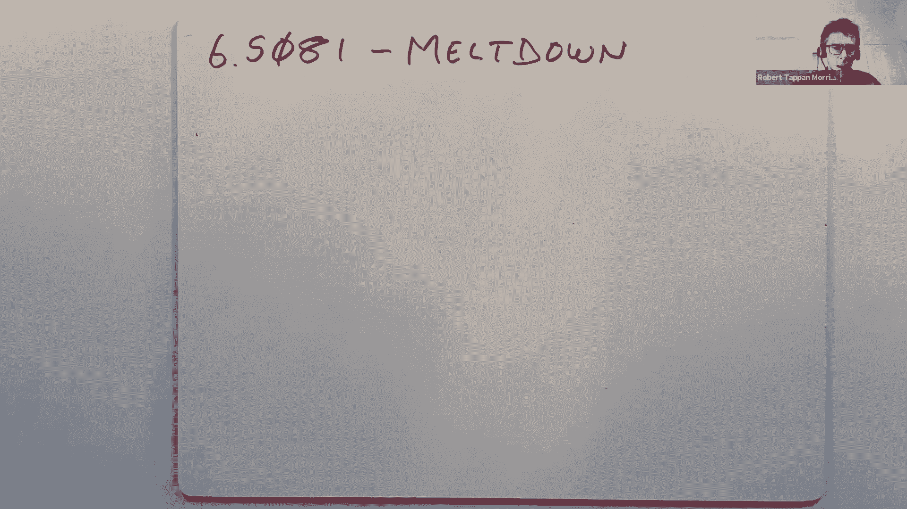

# 课程 P21：第22讲 - Meltdown 攻击详解 🧨



在本节课中，我们将要学习一种名为“熔毁”（Meltdown）的现代处理器安全攻击。这种攻击利用了CPU内部的微架构特性，打破了操作系统内核与用户程序之间的隔离，使得用户程序能够读取内核内存中的敏感数据。我们将从基本概念入手，逐步剖析攻击的原理、依赖的技术以及相应的防御措施。

## 概述：什么是熔毁攻击？

熔毁攻击是一种利用现代CPU推测执行（Speculative Execution）和缓存（Cache）机制的安全漏洞。它允许一个运行在用户空间的恶意程序，绕过硬件和操作系统提供的内存保护，读取内核空间或其他受保护内存区域的数据。这篇论文于2018年初发表，揭示了长期以来被认为是坚不可摧的硬件隔离机制中存在的严重缺陷。

## 核心概念：隔离与微架构

上一节我们介绍了熔毁攻击的基本概念，本节中我们来看看攻击所依赖的两个核心硬件机制：推测执行和CPU缓存。理解这些概念是理解攻击如何工作的关键。

### 推测执行（Speculative Execution）

推测执行是CPU用于提升性能的一种优化技术。CPU会预测程序分支（如if语句）的走向，并提前执行预测路径上的指令，即使它尚未确定该路径是否正确。如果预测正确，则节省了等待时间；如果预测错误，CPU会“撤销”所有推测执行指令的影响，使程序状态恢复到预测前的样子。

以下是一个说明推测执行的简化代码示例：
```c
// 假设 r0 中存储了一个地址
1. load r1, [valid]      // 从内存加载 valid 变量的值
2. if r1 == 0 goto 7     // 如果 valid 为 0，跳转到第7行
3. load r2, [r0]         // 从 r0 指向的地址加载数据
4. add r3, r2, 1         // 将加载的数据加1
5. store [result], r3    // 存储结果
6. ...
7. // 程序继续执行
```
在这个例子中，CPU可能在`valid`的值从内存加载完成之前（第1行），就开始推测性地执行第3行和第4行的指令。如果后来发现`valid`为0，CPU会取消第3、4行指令对寄存器`r2`和`r3`的修改。

### CPU缓存（Cache）

CPU缓存是一种小型、高速的内存，用于存储最近访问过的数据，以减少访问主内存（RAM）的延迟。缓存通常分为多级（如L1、L2、L3）。当CPU需要数据时，首先在最快的L1缓存中查找。如果“命中”，则数据在几个周期内返回；如果“未命中”，则需要访问更慢的下一级缓存或主内存，耗时可能达到数百个周期。

缓存的行为在性能上是“可见”的，因为程序可以通过精确测量内存访问时间来推断特定数据是否在缓存中。这种特性被熔毁攻击所利用。

## 攻击原理：如何绕过内存保护？

上一节我们了解了推测执行和缓存，本节中我们来看看攻击者如何组合这些技术来窃取内核数据。

攻击的核心思想是：**利用一次本应失败的、对内核地址的加载操作，在CPU推测执行阶段，让该操作影响缓存状态，然后通过测量缓存访问时间来推断出被加载的内核数据值。**

以下是论文中攻击代码的简化版本：
```c
// 攻击者用户空间代码
char buffer[256 * 4096]; // 用户缓冲区，大小足够大以确保不同索引位于不同的缓存行
unsigned long kernel_addr = 0xffffffff80000000; // 假设要窃取的内核地址
int bit_value;

// 1. 确保目标用户缓冲区不在缓存中
clflush(&buffer[0]);
clflush(&buffer[1 * 4096]);

// 2. 执行会引发页面错误的指令（访问内核地址）
// 同时安排一个长时间运行的指令，延迟错误的发生和指令的“退休”
asm volatile(
    "mov (%1), %%rax \n"   // 尝试从内核地址加载数据 -> 这将导致页面错误
    "shl $12, %%rax \n"    // 将数据的低位左移12位（乘以4096）
    "mov (%0, %%rax, 1), %%rbx \n" // 以rax为索引访问用户缓冲区 -> 推测性执行
    : 
    : "r" (buffer), "r" (kernel_addr)
    : "rax", "rbx"
);

// 3. 攻击触发页面错误，进程可能崩溃或被异常处理程序捕获
// 4. 在错误处理程序中或重启后，通过“刷新+重载”技术检测缓存状态
time1 = rdtsc();
access1 = buffer[0];
time2 = rdtsc();
access2 = buffer[1 * 4096];
time3 = rdtsc();

// 比较访问时间，时间短的说明对应的缓冲区条目在缓存中
if ((time2 - time1) < (time3 - time2)) {
    bit_value = 0; // buffer[0] 在缓存中，说明内核数据的低位是0
} else {
    bit_value = 1; // buffer[1*4096] 在缓存中，说明内核数据的低位是1
}
```

**攻击步骤分解：**

1.  **刷新缓存**：使用`clflush`指令确保攻击者自己的缓冲区（`buffer`）不在CPU缓存中。
2.  **触发推测性非法访问**：执行一条加载指令，目标是一个用户程序无权限访问的内核虚拟地址。在Intel CPU上，即使该加载操作因权限不足最终会失败（页面错误），在指令“退休”前，CPU的推测执行机制仍会**将内核数据加载到一个临时寄存器中**，并继续执行后续指令。
3.  **将数据值转换为缓存状态**：后续的推测性指令使用这个临时寄存器中的值（即窃取的内核数据位）作为索引，去访问一个巨大的用户缓冲区。访问哪个缓冲区条目（如`buffer[0]`或`buffer[4096]`）取决于内核数据的值。这次访问会将对应的用户缓冲区条目加载到CPU缓存中。
4.  **处理错误**：最初的非法规访问最终“退休”，CPU引发页面错误。攻击程序可以通过注册错误处理程序来捕获此错误并继续执行，或者通过其他方式（如多进程）在错误发生后恢复。
5.  **探测缓存**：通过“刷新+重载”技术，精确测量访问`buffer[0]`和`buffer[4096]`的时间。访问时间明显更短的那个条目，说明它在缓存中，从而反推出内核数据的值。

## 攻击依赖的条件与修复

上一节我们详细分析了攻击流程，本节中我们来看看攻击成功所需的条件以及业界如何修复这个漏洞。

### 攻击依赖的条件

1.  **内核映射存在于用户页表**：攻击需要知道目标内核数据的虚拟地址，并且该地址在进程的页表中有映射（但用户权限位PTE_U被清除）。在论文发表时，许多操作系统（如Linux）为了系统调用性能，会将内核空间映射到每个用户进程的地址空间中。
2.  **CPU的推测执行不提前检查权限**：在推测执行阶段，Intel CPU不会立即检查内存加载操作的权限，而是等到指令退休时才检查。这使得内核数据能被临时加载。
3.  **能够精确测量时间**：攻击需要高精度计时器（如`rdtsc`指令）来区分缓存命中与未命中的微小时间差。
4.  **共享的CPU缓存**：L1缓存通常基于虚拟地址，并且在系统调用不切换页表的情况下，可能同时包含用户和内核数据。

### 主要修复措施

以下是针对熔毁攻击的主要防御方案：

1.  **内核页表隔离（KPTI，原称KAISER）**：
    *   **原理**：不再将内核空间的完整映射放入用户进程的页表中。当运行用户代码时，页表只包含用户空间的映射。进行系统调用时，通过类似蹦床页的机制切换到包含内核映射的独立页表。
    *   **效果**：在用户态执行攻击代码时，内核虚拟地址在当前的页表中没有有效映射，甚至无法进行地址翻译，从而从根本上阻止了攻击。
    *   **代价**：系统调用因需要切换页表和可能刷新TLB/缓存而变慢，但对大多数工作负载影响有限（约5%性能开销）。

2.  **CPU微码更新（硬件修复）**：
    *   **原理**：修改CPU的微码，使得在推测执行阶段进行内存加载时，也进行权限检查。如果权限不足，则不返回数据，后续推测性指令也无法利用该数据。
    *   **效果**：从硬件层面堵住漏洞。据信AMD CPU和一些新版Intel CPU已采用此方式。
    *   **代价**：可能需要增加少量晶体管，但对最终用户透明。

## 总结与思考

本节课中我们一起学习了熔毁攻击。我们从操作系统的基本隔离机制出发，探讨了现代CPU的推测执行和缓存这两个关键的微架构优化。通过分析攻击代码，我们看到了攻击者如何巧妙地组合一次注定失败的内存访问、CPU的推测执行特性以及对缓存状态的侧信道探测，最终实现了对内核内存的窃取。

熔毁攻击及其同类攻击（如Spectre）深刻地提醒我们，计算机系统的安全是一个多层次、不断演化的挑战。长期以来被视为可信基石的硬件隔离机制，也可能因其复杂的性能优化实现而出现裂缝。这促使操作系统开发者、硬件制造商和安全研究人员必须更紧密地合作，在追求极致性能的同时，不断审视和加固整个系统的安全边界。

防御此类攻击不仅需要软件层面的补丁（如KPTI），也需要硬件设计的改进。同时，它也引发了关于在云计算、浏览器沙箱等高度共享环境中，如何保证强隔离性的更深层次思考。安全之路，道阻且长。