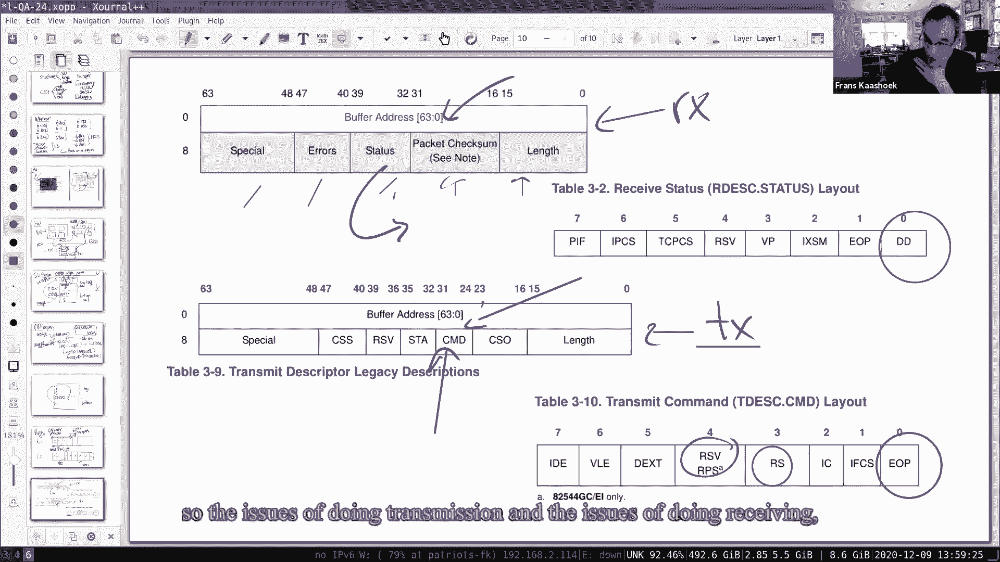
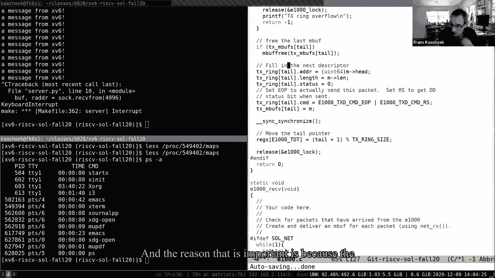
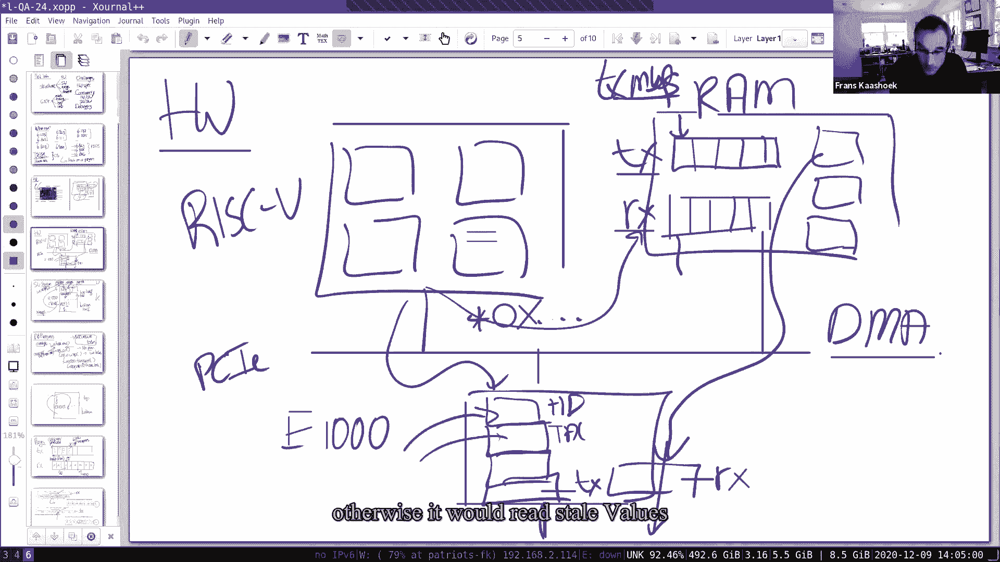
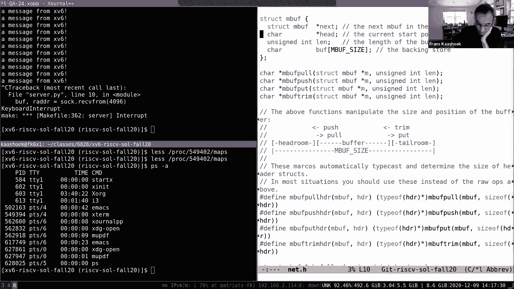
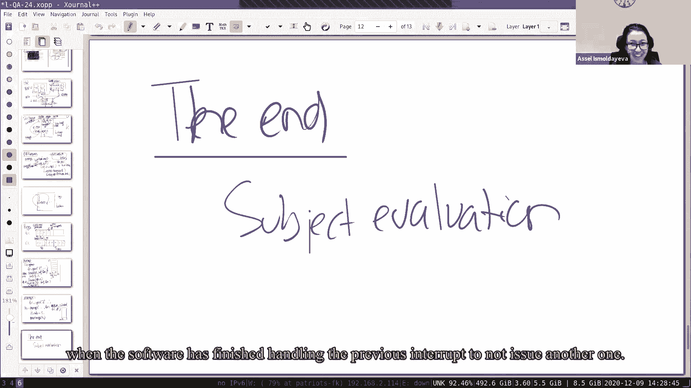
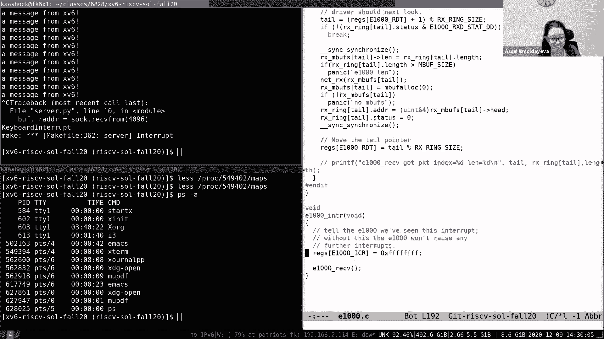

# P23：Lecture 24 -  Final Q&A lecture 英文版 - MCATIN-麦可汀留学 - BV1rS4y1n7y1

好的，下午好，快速声音检查，人们能听到我吗，是呀，好的，所以我猜，呃，今天你知道，到目前为止，这是最后一堂课，或者本学期体重第一，我们真的没有一个正式的话题，你知道有一个Q和一个讲座。

所以随便问任何问题，这是，我想最后一个，呃，你最后的机会，至少这个学期这个班，默认情况下，我的计划是复习几个话题，根据电子邮件一的问题，我想谈谈网络实验室的解决方案，如果可能的话。

还有一点关于垫子实验室的时间，再次谈论解决方案，然后有很多关于课程的问题，事实上，我想我会先讨论这个，呃，但在潜入这三个话题中的任何一个之前，让我提醒你，有一个主题，呃，正在进行，然后呃。

我们将作为一个工作人员，我们很感激，如果你，呃，你知道，给你一个重量的反馈，你知道，希望是积极的，你知道我们明年有机会再教它，也许这也是一个好时机，你知道的，谢谢你参加今天的讲座。

即使没有一种非常正式的程序，但我也很感激当员工们，感激你知道你是，你一直很投入，你知道，尤其是那些不直接送到实验室的论文，你知道的，很明显，你们中的许多人钻研报纸，试图真正理解它们，问了很多很棒的问题。

呃通过电子邮件，所以我们非常感谢你们的订婚，在我复习这组主题之前，有什么问题吗，好的，让我，呃，从电子邮件中可能出现最多的问题开始，接下来呢，你知道有相当多的类是面向系统的，嗯。

我肯定我错过了一些我应该在这里列出的课程，呃，你知道，与操作系统直接相关，你很清楚，你知道，如果你还没有免费拿走这三个，你知道这是一门很好的课，尤其是阅读，阅读或学习如何阅读论文，呃，六八八是原来的。

我们今年提供的唯一一门操作系统课，这是第二年，今年，年份，提供第一年，都是，所以一个是本科生的，s a 2 a是h h 2 8中的s作为grt级别，OS类，嗯，你知道基本上一个方式问题。

你拿了一个或红色的OS，你知道在做项目时，你知道，建造有趣的操作系统文物，从文献中阅读更多的论文，和更多的现代研究文献，那也许你更像西方，你知道的，与硬件有很多接口，更多的是系统的硬件方面。

你知道计算机体系结构课A 2 3，我相信这是献给即将到来的春天的，当然还有六一一，你知道那种，你知道在性能网站上构建一些硬件设备，和编译器端，六一七二六五好位置，我想你们的号码是61，七二与八一平行。

所以说，但如果你没有，例如，三五的编译类，或者动态，你知道编译器类，他们两个都是很棒的班级，系统是一个广泛的主题，呃，就像有关系网一样，有一个完整的类分支，围绕网络的整个类流。

围绕数据库有一个完整的类流，呃这些都很好，嗯和嗯，重要的，你在一个中看到的方面会以更突出的方式出现，在那些课上，嗯，例如，网络显然是一个很好的话题，你知道八到九，所以你会看到，更多关于，呃。

在那里建立联系，比你在八分之一六八三看到的还要多，你知道我们谈过文件系统，你清楚地知道另一种重要的存储系统，在某些方面，对许多应用程序来说，数据库可能更重要，所以水果是一个很好的主题课。

可以学习更多关于数据库的知识，就像类而言，呃，你知道，有时被称为提要做什么类，他们中的许多人一个二四，分布式系统课程将在下学期提供，春季学期和本学期涉及的工作人员人数，在这个与一个将涉及在一个二四。

一共是八，五，八，也就是我们今年春天不提供的计算机安全课，但我们必须在下一学年提供它，有一个二六，也就是计算机系统的原理，因此，许多人询问验证作为系统软件，这是要上的课，如果你对那个话题感兴趣。

更广泛地说，呃，我知道很多人想知道，研究中到底发生了什么，如果你感兴趣的话，你知道系统文献中几乎所有的论文都是公开的，甚至最近的会议，例如，HDI会议发生在几周前，你可以看看它们。

看看涵盖了什么样的主题，读你觉得有趣的报纸，所有的谈话都发表了，其中一个隐蔽时期是所有这些公司都是虚拟的，所以所有的会议，会谈被记录下来，你可以看着他们，看看发生了什么，如果你对，有两部分，你知道。

只是研究部分，然后呢，你当然知道在实践中发生了什么，你知道，如果你有兴趣跟踪，Linux发生了什么，这是怎么回事，呃，它是如何进化的，lwand net实际上以非常有规律的速度发布。

或者围绕Linux内核的主题，呃，最后，你知道吗，呃，如果你只是对跑圈感到兴奋，你知道，只要继续黑客攻击，呃，我想你可以很容易地编造项目，或者通过做广泛的实验室，或者只是自己尝试。

这是一个很好的方式来真正学习和欣赏事情是如何运作的，你可能在实验室里已经很好地感觉到了这一点，你知道我们非常喜欢边干边学，你可以做很多，你可以自己做，有什么问题吗，8点1分后发生什么事？好的，嗯。

让我们来谈谈网络地图，它应该，就像我昨天说的，所以有几件事，所以也许我会启动它，我们会慢慢潜入，从顶部开始，让我用一般的术语来谈谈这一圈，首先有几件事，我想谈谈，只是结构上的东西，这影响了实验室的设计。

或者你知道实验室的编码，这是四个不同的方面，一个是我只想谈谈硬件，你知道这是我们的实验室之一，呃，软件和硬件之间有很多交互，事实上，硬件确定是一个很大的部分，比如，软件的结构，对软件结构略知一二。

回到我们讨论的这个一般性话题，有点像学期中期的某个地方，您知道驱动程序相对于操作系统内核其余部分的组织，然后更具体地谈谈硬件结构，你知道戒指，你知道描述符，你知道的，驱动程序处理的两种主要硬件结构。

或者我必须处理，然后我会讲一点，谈论代码，特别是解决方案，专注于，谈谈收件箱的作用，你知道，在电子邮件中锁定了很多关于，你知道，为什么不锁定接收，接收函数中的接收锁，接收处理程序中更宽的循环，然后呃。

你知道，到底是什么，你知道，他们有，旗帜在命令中的意思是，呃，呃，描述符结构的字段，所以我们会讨论这些问题，如果我们像我们看时间一样，当我们查看代码时，就在我们开车进去之前，好像这可能是值得的。

所以在这里提醒自己，挑战是什么，它们可能还在你的脑海里，但就像从高层，就像，你知道的核心人才挑战是什么，你在这一圈要处理的，如果你加入我可能错过的任何一个，你挣扎着，所以首先，你知道有硬件规格。

这是一个，你知道，这是一个，PDF是一个相当严肃的文档，而这个网络手推车，呃，是啊，是啊，一千，即使这是一个合理的简单，网络艺术仍然是一个非常复杂的硬件，它提供了许多不同的功能和编程方式，你只是在上面。

实际上你知道卡的作用，你如何编程，你知道，只是一种内化，一切都很困难，反对挑战，所以当我想你知道的时候，主要的挑战是事物的并发性，并发有两个部分，这使得这很有挑战性，一个只是硬件和软件之间的并发。

对就像网卡只是在做事情，比如发送数据包，接收数据包，同时，你知道操作系统电流在运行，司机在运行，所以必须有一些协调计划，你知道在硬件和软件之间，确保一切顺利，司机的很大一部分是，你知道处理这个。

你知道协调，呃，你认识那个司机，多个威胁或多个内核威胁可能正在结束或退出，处理程序运行驱动程序的内部，我们必须确保他们不会踩到，彼此的脚趾，那个，如果出了什么事，这很值得喜欢，你知道锁。

即使是这个司机的偶数，你知道事情是合理的，在并发性方面很简单，对于软件并发性，但尽管如此你还是知道一些需要注意和思考的事情，最后我想，因为你可能在你的列表或菜单的顶部是，你知道，只是调试，这有点难。

有时对软件调试更有挑战性，因为你不能设置，你知道网络购物车内的断点，你知道你在程序中，寄存器，然后这会给卡片一个踢腿，说像，你知道吗，请做好你的工作，然后如果车什么也不做。

或者你看不到你的包从另一边出来，你知道在日志里，你知道数据包跟踪，然后你知道你基本上必须挠头，开始思考，就像什么，什么，你什么，可能出了什么问题，或者您可能在硬件规范中遗漏了什么，所以你必须来回盘旋。

没有简单的方法，呃，你知道你不能一步也不能，你知道吗，通过网络购物车，就挑战而言，这有意义吗，你知道吗，这与你自己的经历一致吗，还是我错过了一些，你处理的核心挑战之一，让我们现在谈谈，让我们从硬件开始。

事物的侧面，呃，我想从那里开始的原因，因为呃，你知道的，它很容易保存，或者忘记我们在这里处理的与硬件的交互，你知道的，即使你知道它是虚拟化的，在那里它被qu模仿，你只是运行它。

在你的雅典娜或笔记本电脑上，呃，QU实现的实际东西是硬件，所以这只是再次提醒你，你以前看过这张照片，呃，你知道思考的方式是你知道库拉是一个完整的董事会，是的，所以你知道，众所周知，我以前谈过一点。

喜欢这个过程，实际上就像整块木板上的一小块，你知道它是坐在风扇上的东西，但你知道有一系列设备，你知道那是，你知道连接或可以连接到这个板，然后相互作用，你知道，随着处理器上运行的代码，你知道就像这里。

你知道用这个特殊的实验室，你知道什么是有趣的，实际上是千斤顶的偶数吗，你知道在哪里可以插上你的均匀网线，然后这实际上是网络车，你知道发送它的数据包，嗯现在，PBU并不完全模仿这个板，所以事情略有不同。

但你知道，至少在概念上，这就像你脑子里应该有的画面好吧，所以什么时候和过程，你知道的，书写寄存器，你知道设备驱动程序的成本和一些事情发生，其实最后，一些数据包从电缆中出来，连接到以太网连接器的，嗯。

你知道稍微多一点，呃，你知道吗，在原理图中稍多一点在原理图中，你知道这是同一张照片，基本上在这里你知道我们看到的，这是我们的处理器，有四个核心的板，它有一个L 1和L两个缓存，然后就像一个链接。

你知道去回忆，所以你只需要记忆和坡道，随机存取存储器，我们一会儿就会看到，你知道这实际上起了很大的作用，然后这里就像要链接的部分，你知道对，或者这里实际上它与千兆位相连，呃甚至是控制器，现在有点乱。

你知道，所以考虑到这种细节水平，到底是怎么回事，就像讲座的其余部分一样，更简单一点的图片，和图片的家伙真的，你应该在你的脑海里，你可能发展了，呃，在做实验室的时候是这样的，我们基本上有风险四处理器。

或者课程，这是我们的风险五，有这五个课程和执行指令，你知道你在写，你可以想着他们，他们都和一个老板有联系，有一点简化，但就像它让事情更容易解释一样，就像老板一样，你知道有随机访问，记忆。

你知道的所有数据，内核实际上用作存储，你知道内核税本身恢复了，你知道吗，我们把它看作是大量的细节，在学期开始的时候，然后在这个你知道这个特别的很多，有趣的是在公共汽车上，呃，其实就是，呃，网卡。

你知道你想要你一千，你知道，公羊通常更容易与风险联系在一起，通过一些专用总线和网络直接使用五处理器，这些设备往往位于较慢类型的总线上，尤其是实验室里的设备。

你知道有一个PCIA PCIE总线实际上连接处理器部分，你知道用网卡，嗯，你知道拿网卡做什么，呃，网卡，你知道里面有控制器，你知道这些控制器有寄存器，你可以看到这些寄存器的一个很酷的方面，他们被称为。

让我映射，呃，i o寄存器，所以你可以用，你知道不管哪颗星，你知道O x，不管值是多少，你知道在物理内存空间中，对那个特定的沉默者来说，价值是什么，什么，它可能会有我们的头，我们的尾部寄存器。

你知道我们可以，司机，就可以，你知道通过执行，您知道加载或存储指令，你知道到地址，你知道这对应，你知道在物理地址空间到寄存器的位置，硬件将确保当我们加载商店时，你知道那家店要么，你知道我们会经历。

如果是到其中一个控制寄存器，将转到控制寄存器，如果它去，你知道一个人穿着公羊，我们去公羊那里，所以你可以操纵一个程序，通过加载网卡，你知道吗，读写这些控制器寄存器，基本上。

这些控制器寄存器中的位具有特殊的意义，正如你所看到的，嗯，现在对于这张特殊的卡，你知道，网卡，它需要发送，当然啦，跨网络的数据包，你知道，它需要把包送到某个地方，所以数据包实际上是活的，你知道。

每个人都被分配了，我们将在一秒钟内看到，你知道，只是活在记忆中的某个地方，你知道你听说过，我们所做的是，除了这些包，你知道吗，有两种环结构也存在于记忆中，我们可以，你知道程序，我们可以告诉手推车。

你知道汽车也知道这些环形结构是什么，你知道那是去哪里的地址，你知道的，TX戒指在房子里，我们的X环的地址，你知道五金车，查看这些地址看看哪些数据包需要发送，所以这里我们可能有一个队列，你知道的。

需要传输的数据包，或者需要接收的数据包队列，和，你知道一千个，你知道达斯，你知道吗，如果，比如说，就像，你知道它会起作用的，就像发送的第一个包，你知道它会DNA，基本上你知道那些包，你知道与，的，包号。

直接从RAM到网络，在没有探测器的情况下，所以这些就是所谓的DMA直接内存访问，这有意义吗，一种更抽象的画面，呃，风险组织，五公羊，你对此有一千个问题吗，所以在谈论硬件时，有一点是硬件和硬件，软件并发。

很明显你知道一千个，你知道处理器都在操纵这些传输和接收线索，或者呃，戒指，所以必须有某种协议或某种给定的互让协议，你知道在某个时候，环的特定部分是通过我们拥有的或由网卡操作的。

有些部分可能在软件或操作系统的控制下，或者内核，你知道我们一会儿就会知道这是怎么安排的，呃，但你知道我们又小心了一点，汽车不会翻三倍或绊倒操作系统，或者反过来，一个快速的问题。

闸板里有独立的发射环和接收器吗，然后也在E一百或一千，是啊，是啊，嗯，唯一的方法，好的，所以有两件事发生了，我们一会儿再看代码，传输环和接收环，基本上生活在拉姆，E1000和风险5都操纵，你知道的。

存储在RAM中的环，嗯还有那些，这些是您在硬件文档中看到的环，碰巧x36也有一个，你知道司机保持着一种M迷的戒指，发射环和RX环分开，就像有像TX embo这样的东西，这就是你知道的。

这是一个只有操作系统真正知道的数据结构，你知道网卡并不真的知道这件事，网卡只知道累和我们的RI，因为这些是被编程到寄存器中的值，说像，在这里你可以找到，这是你可以找到发射环的地址。

这是你可以找到接收环的地址，好的，是啊，是啊，那是有道理的，那是有道理的，好的，这就是硬件图片，呃，在更示意图的版本中，呃，下一个，让我们来谈谈软件结构，这实际上有一个很大的困惑，呃，在这个实验室里。

所以说，所以你知道，我们就画，你知道我们最关心的是，当然是你认识司机，这是我们的司机，呃，你想要千司机，你知道，它基本上只有两个功能，它有传输功能，它有接收功能，接收函数响应中断运行，所以中断发生了。

那你就知道，xt六，你知道我们将使用通常的损坏机制，你知道的，陷阱就会发生，陷阱会看起来，你知道看看网卡是否有中断，如果网卡有中断，我们将调用接收函数，正如你所记得的，你知道，我们以前，你知道。

在以前的一个关于设备驱动程序的讲座中，你知道，把设备驱动程序分成两部分通常是有帮助的，你知道在中断处理程序上下文中运行的下半部分，使用了典型的名字，上半部分，通常在…的上下文中运行，你知道一个内核进程。

或者类似于用户级进程，例如，如果我们想到你知道坐在齿轮顶部的东西，有一个网络堆栈，你知道实际实现的代码，你知道叶，udp，所以它在这上面，然后你知道有，你知道我们通常，你知道，有点像。

你知道内核空间打击，用户空间爆炸，这是非常OS的世界观，使用空间不是特别大或重要，然后呃，你知道一个例子我们的T什么网测试，如果用户级程序正确运行用户空间，它进行系统调用，系统目标，转到网络堆栈，呃。

例如，就像如果你打电话，正确的系统调用，我们有一个文件描述符，内核知道，你知道对于那个文件描述符，如果你做得对，那你就知道对了，您转到网络堆栈，网络堆栈建立数据包，然后它调用传输，然后传送。

你知道不管是什么操纵了，呃，传输队列，德克萨斯州，Q或戒指，你知道它实际上得到了包，你知道离开网络，你知道在某个时候，反应可能会回来，回来，你知道这会产生一个中断，然后接收函数将运行并检查。

你知道接收环，所以有几件事你知道你想，我想指出，你知道，就并发性而言，所以首先就像，你知道中断处理程序基本上可以在任何时刻运行对吧，你知道我们可能在用户空间，如果中断进来，你知道中断机制，或将花费。

您知道由于内核模式而要切换的当前程序和用户程序，你知道我们在运行之前看到的陷阱功能代码，它会呼叫接收，所以我们可能正在进行一些通常的过程和繁荣，你知道我们被打断了，突然间我们进入了接收功能。

甚至在内核中，如果我们没有锁住，你知道锁把干扰关掉，但如果我们没有锁住，你知道我们可能会被打断，内核可能，呃改变程序计数器，基本上是在一个吊杆和运行接收功能，所以这段代码运行，你知道下半部分的东西。

你知道的，基本上在上半部分的代码中几乎任何时候都可以立即运行，它实际上代表通常级别的进程或内核线程进行操作，实际上打电话到，呃，上半部分，你很容易就知道，在这种情况下可能是正确的，事实上是这样的。

即使在那次测试中，你知道，我们可能真的有网络，一大堆过程，所以我们在其中一个测试中有很多例子，我们有很多，运行网络测试的多个实例，他们都跳进，你知道网络堆栈，他们都是你认识的，然后呼叫传输，原来如此。

所以我们从并发的角度来看待这个问题，在上下文中，多个齐纳可以很好，可以在上半部分，所以很明显你知道，我们需要一些锁定方案或纪律来，至少你知道，确保不同的寄件人不会互相绊倒，好的，然后在下半部分。

只有一个中断处理程序指令，我们实现的情况永远不会被多个调用，在不同的航向上同时并行运行多个接收，你知道，你知道中断处理程序，当中断发生时，进程被警报，如果将来发生中断，在实际处理当前中断之前。

它们实际上是阻塞的，所以实际上你知道接收函数什么时候运行，实际上只有一个穿红色衣服在跑，在接到电话的时候，所以没有真正的立即并发，呃，在接受本身，虽然，当然传输，你知道。

frets当前可以使用中断处理程序运行，比如说，我们可能有一个核心在摩擦处理器中运行，我们可能又有了另一个核心，它实际上即将传输，这就是，对此有什么问题吗，有一点很重要，要理解这有点回顾。

但你知道这很重要，好的，所以我想我有一个一般性的问题，我们怎么知道什么应该被归类为下半部分和上半部分，所以是的，我觉得，思考的方式是，在中断处理程序上下文中运行的任何内容，那是下半部分，在这种情况下。

它基本上只是接收，以及在常规流程上下文中运行的任何内容，或为它或内核为它，你知道那是上半部分，好的，所以说，如果你再看这张照片，如果因为我们在，让我在这里发表一个高层声明，很多人问你知道为什么吗。

没有行走和接收，哪里需要锁，第一眼，可能没有必要散步是必要的正确，因为只有一个接收运行的实例，因此不会有多个接收实例同时运行，所以这些接收，因为只有一个接收，你知道它不与任何其他接收到的数据结构共享。

因为他们中只有一个是对的，当然也可能是接收方和发送方共享数据结构，但我们一会儿就会看到，事实并非如此，基本上驾驶员的任务部分和驾驶员的接收部分是完全分开的，或接收数据包，所以结果是我们收到的并不是真的。

它实际上不需要块，你知道它真的不与任何其他并发活动共享数据结构，奇怪的是你们中的一些人发现，如果你确实使用了锁，呃，你真的很恐慌，所以让我说一点，因为呃，你知道恐慌发生的原因是，因为有一个这个。

软件结构实际上在E中的X6内核中稍微，呃，比你想象的要复杂一点，原因是基本上接收，呃，中断句柄实际上做了相当多的工作，或者可以做相当多的工作，所以让我来谈谈，在特定的情况下，它实际上做了相当多的工作。

比如说，arp，所以说，rp是数据包类型之一，罗伯特刚才说的，呃，但基本上像中断这样的事情发生了，所以在我们的请求中，你知道为了发现，但即使是网络地址也是IP地址，你知道进来，你知道会打电话的。

你知道的，你不会从接收端归档，你知道我们会叫任何净RX，这样它就会调用到上一张图片上的网络堆栈中，以便接听电话，调用这里的代码，它，你知道它看起来，你可以看到有一个艺术包，基本上它会发回。

你知道地址的偶数，为了这个特殊的，对于x t 6和他这样做的方式，你当然知道发送一个数据包，它就会叫，你知道一千，对，你知道，我们知道这实际上需要获得一把锁，你们中的一个做到了，你知道的。

每当有一千街区，必须步行的原因是可能有多个发送者，你知道发送者不应该被对方绊倒，嗯，所以这就是画面，所以我们基本上根据之前的照片，我们在这里看到的是下半部分，可能最后，你知道的，上半部分的调用代码。

然后通过上半部分回到司机那里，你们中的一些人知道你会遇到麻烦，因为你知道，你知道的，不是百分之百清楚你不需要，呃，在接收部分行走，所以你在一个相当大的房间里遇到了这种特殊的虫子。

在那里你知道你实际上获得了，你知道的一个文件锁，在接收中，这一切都很正确，除了偶尔你会惊慌失措，为什么你会恐慌，希望这张照片很清楚，但是，我是说，不是会是同样的锁吗，一千个传送器将试图收购股票，是啊。

是啊，完全正确，所以即使是在这里找到的，现在也拥有了散步，持有它调用净RX，呼叫网络RR5发送，然后再叫唱诗班，你可能还记得以前的实验室，如果唱诗班被召集并已经举行，那是僵局，对，所以你知道。

实际上六个内核恐慌，一个问题，让我们，让我们假设我们有一个稍微不同的锁的实现，这样这些发现就不是一个关心，它就会这样，让我们假设如果我想获得很多已经持有的东西，什么都没发生，是啊，是啊。

所以这些被称为递归锁，或者reblocking是它们的另一种名称，所以如果你有递归锁或重入锁，那么你知道你可以自由地这样做，就没有问题了，我想你们中的一个通过电子邮件向我提到了。

他们实现了递归锁来实际处理这个特殊的问题，所以他们没有，他们被要求锁定一千接收功能，然后呃，你知道的，基本固定之后，你知道吗，在xt six中获取租约以实际支持递归锁，一种解热剂，简单的。

这是一个很好的解决方案，我们想要的解决方案，员工的解决方案是，基本上它根本不需要散步和例行公事，因为事实证明这是不必要的，你能再说一遍吗，为什么接收中可以有两个线程，只有一个线程接收中断处理程序运行。

在任何核心上，只有一个接收函数在同一时间运行，它实际上调用了，你知道操作系统的上半部分，它又回到了下半部分，或者对不起，不是在下半部分，回调到传输和传输肯定会遇到获取锁。

所以您希望在保持锁定调用的同时接收甚至1000个接收，E一千传输，它试图获取中断处理程序已经持有的相同锁，如果你有，如果锁定接收处理程序，原来如此。原来如此，就像一个中断可能会响起。

然后当它还在运行的时候，另一个中断也可能发生，是不不不不，图片，也许真的回到这张照片上，因此发生中断，调用接收函数，只有一个接收函数在运行，它接收函数调用，你知道的，rx网接到那个电话，接收弧线的RX。

然后弧形函数调用传输，如果您在发送和接收中使用相同的锁，你会陷入僵局，好的，我明白了，谢谢。这就是为什么，好的，所以基本上这两个解决方案，你知道一个是使用递归锁，其他解决方案是没有走进来接收，或。

你知道的，有两把锁，这三个都是完全合理的解决方案，任何关于这个的问题都有理由把它锁起来吗，根本没有收到，在这种特殊情况下，根本没有理由有锁，我们能想到一种情况吗你想要一个接收锁，如果你有两张网卡什么的。

是啊，是啊，或者呃，如果你还记得在UART代码中，好的，所以你可能想要一个锁的一个常见原因是，共享是因为下半部分和上半部分共享数据结构，所以说，比如说，接收方和发送方可能操纵相同的共享数据结构。

在这一点上，你需要一个，你需要一把锁，例如，如果您还记得控制台驱动程序，呃，他们一起排队，因此接收处理程序需要获得一个立方体，需要拿到锁，才能真正访问那个立方体，这回答了你的问题吗？是啊，是啊。

所以这就引出了我想说的第二个观点，呃，让我画一幅新的画，因为它变得有点拥挤，所以我们再想想下半部分，在上半部分，所以这里是底部，有点抽象，但你知道，这可能会有帮助，在更典型的更坚韧的地方。

司机提供下半部分，基本上根本没有进入上半部分，例如，如果你回头看控制台代码，这个序列不可能在那里发生，没有发生的原因是因为下半部分通常做很少的功，你知道它唯一能做的也许是，你知道，拿着包。

你把包放在队列上，然后在后来的某个时候，你知道上半部分，你知道有一个单独的线程，他们在上半部分，它基本上查看队列，然后从队列中抓取数据包，然后继续做现在需要做的事情，为了简单地，呃在这种情况下。

你知道减少代码的数量，这不是这个特定驱动程序遵循的结构，你知道这个司机偶尔会打电话来，打电话，其实，有时这个结构后面跟着驱动程序，但你知道，偶尔，它实际上可以进入上半部分，然后回到下半部分。

对此有什么问题吗，好的，所以这有点，我想软件并发，我们以后会更多地讨论这个问题，如果我们更详细地查看代码，我们来谈谈戒指，所以基本上你知道怎么想，你知道有一个戒指，呃，有两个环，你知道一个用来接收。

一个用来发送，TX RX都住在，你知道他们被你知道的操纵着，在风险五课程上运行的代码，你知道网卡本身，所以在网络购物车和有五个之间必须有一些协议，当然你知道谁能看到什么，这是硬件设备中非常常见的组织。

通常的做法，你知道有点像，让我们看看传输队列，基本上有一个由一些固定大小的结构组成的队列，描述符，等一下看看，这些是描述符，和组织或协调实际上是，呃，发生在司机和网卡之间的事情是在消费者中。

基本上你知道一种思考的方式，你知道有一个，呃，如果这是传输队列，你知道有，也许有一个头部指针，有一个尾部指针，你知道这一点，尾部指针由软件控制，所以软件查看尾部指针，如果它想坐一分钟，发送另一个数据包。

你知道它粘住了它，你知道在拳击台上T加1的位置，然后向上移动，你知道尾巴指向那个方向，头部指针基本上是由硬件控制的，所以一个软件一个硬件地跟踪，然后基本上，你知道的，硬件基本上看头部。

然后这是将要发送的第一个数据包，你知道的，描述符中有一点点信息，描述符中有足够的信息让网卡查看它并说，就像，哦，这是我需要移动到电缆上的字节，一旦完成，你知道它把头部指针朝那个方向移动，你知道的。

一旦它消耗了，你知道传输管里的一个包，一种思考的方式，这里所有的描述符，你知道在尾巴之间，所以所有实际上被填满的东西，就像尾巴向上移动，也许到这里，你知道所有的包实际上是所有的描述符条目。

实际上是填写的，你对他们的看法，它们是由硬件拥有还是由网络车拥有，允许网卡读取它们，你知道和他们一起做事，但是软件和软件是不允许的，你知道用它做任何事情，比如如果你知道软件会在这两个描述符上潦草地写。

而它们实际上是由硬件拥有的，通过我们的网络车，这将改变网卡座位的数据，所以这是很不可取的，所以协议基本上是一旦你知道了更锋利的动作，尾部指针一个向上，你知道这一点，你知道吗，我刚进入网络队列。

传输队列现在由硬件拥有，它就会粘进去，你知道它将由硬件拥有，直到你知道它已经被发送，基本上直到头部指针移动过去，你知道那种特殊的结构，这有道理吗，好的和传输，基本上是同样的故事，你知道有一个。

你知道有一个头部指针，你知道你知道那是，也许我们，那是由硬件控制的，还有一个尾部指针，由软件指针控制，基本上介于两者之间的数据包是实际上，呃，都是，呃，已收到，你知道，通过硬件和，你知道。

通过检查本软件中的尾指针，可以看看是否真的有一个新的包，你知道它已经准备好被消费了，如果它准备好被消费，将指示通过在状态字段中设置DD位，所以当DD位设置好，你知道心脏和软件都很好，你知道这个包。

你知道硬件已经用完了，这样它就可以把它拿出来，把尾部指针向上移动一个，所以两者之间有一种让步，呃，驱动程序和我们的硬件实际上是协调的，它们不会互相绊倒，嗯，这就像，这是一种普遍的实现方式吗，就像休斯。

或者两个有共享记忆的东西之间的任何交流，是啊，是啊，这是一个漂亮的，呃，当然在软件中也是如此，你可以看到这一点，但是很多硬件设备都玩这种把戏，那里有一种消费风格的产品，硬件与软件的协调，所以是的。

这是一个非常常见的结构，给我留一两个问题，呃，我们可以问一下，就像，为什么现在连排队都有，为什么会有一个戒指，好的，有戒指的原因，正确，因为队列包装，呃，Q E环绕使其固定瞄准镜，但你知道为什么。

为什么不呢？你知道，有Q一个条目，一个条目，看起来几乎像UART，如果你还记得UART驱动程序和控制器基本上只有一个寄存器，你知道发送一个字节，还有另一个Redis接收字节。

那么你为什么知道为什么要经历这个复杂的计划，如果你能有一个单一的寄存器，然后你基本上可以说你知道硬件，这个寄存器现在已经准备好了，把它发出去，然后你就等到所有的停止，当出现突发数据包时，是啊，是啊。

是啊，是啊，准确地说，你知道，网络接口或网卡或电缆的性能相当高，事实上它的性能很高，就在每秒千兆位，所以内核或处理器很难跟上它，所以你想给它一大堆包，你知道网络或网卡可以随着，我会把他们高速送出去。

同样，你知道，在接待处，你可能会收到大量的包裹，你知道你想把他们放在队列中，然后你知道操作系统可以启动它们处理队列，所以这是一个常见的，这就是这些线索常见的原因，处理毛刺，如果Q满了会发生什么。

就像在接待处一样，我想文件提到它做了某种形式的下降尾计划，是啊，是啊，是啊，是啊，的，是啊，是啊，基本上包被扔掉了，所以未来任何传入的数据包，如果线索和数据包，再也没有错误的余地了。

网卡不能用它做任何事情正确，所以它唯一的选择是，呃，基本上删除数据包或不将其添加到环中，因此消失了，所以有时数据包丢失的一个原因是操作系统过载，你知道我们的包跟不上，戒指装满了。

然后你知道贝克尔一家被解雇了，现在更高级的软件，当然啦，可能喜欢TCP连接，可能会重传这些数据包，但这是数据包可能被丢弃的原因之一，即使硬件工作得很好，你知道因为这种爆裂，你知道这是可能发生的。

包实际上可能会掉下来，我们有一个非常非常大的爆发，头部和尾部指针的，它们都是软件抽象，球杆的右边，好的，所以这些实际上是那些，呃，这些控制寄存器对，所以有一个硬件的控制器寄存器，呃，头指针是，基本上。

你知道，尾巴指针，硬件和软件之间没有真正的区别，基本上司机知道尾部指针，它知道硬件，知道尾指针，头指针，这些是基本的控制器寄存器，对吧，好的，是啊，是啊，我们将在第二部分的代码中看到，那是怎么出现的。

如果你回到我们的，呃，也许让我们看看这张照片是否还在这里，这是我们看过的早期照片，和，你知道的，年和控制寄存器保存头部和控制寄存器保存尾部，而你，当然啦，一个用于接收，一个用于发送，好的，所以呃。

让我们来谈谈描述符，因此描述符是由硬件定义的，所以硬件上写着，下面是描述符的样子，你这个司机，你知道吗，这些是你可以填写的部分，如果你填写这一点，告诉我以下内容，所以这里是，呃，两个描述符很重要。

你知道的，这是，接收描述符RX，这是德克萨斯，TX描述符之一，呃，所以让我们稍微看一下，至少看一下最重要的部分是这个地址，呃，这就是软件填写的地址，就像他们应该去的地方，把车扔在哪里，你知道包。

你知道拉姆应该在哪里，呃，司机，或者网卡应该把接收到的数据放在哪里，这是地址或接收缓冲区，如果你愿意，然后你知道，可能是最重要的部分，呃在，uh是状态字段，正如你所看到的。

所以当司机基本上还在继续看车尾的时候，看到有一个新的包，呃已经收到，它告诉哪里有新的数据包接收的方式是，DD位正确是由硬件设置的，你知道阴影区域是包的字段，收到的的描述符，硬件实际填写的描述符，白色的。

你知道的，非阴影的是实际上被阴影的字段，都是由软件填写的，在这里我们再次看到了一些东西的明显区别，这些东西是由司机拥有的，有些东西是属于，通过硬件，好的，在这里面有一个类似的，你知道的，呃，描述符。

与看起来非常相似的描述符，这是传输的硬件描述符，它有一个地址，那个地址，当然是需要发送的数据在内存中的地址，然后它有一堆，你知道它有一个命令字段，以下是软件如何告诉司机，告诉网络车。

这是您应该如何处理这个特定的包，或者你知道，这是你应该知道的关于这个特定的包，所以有一件事，是啊，是啊，我们我想我们填两包，我们在AP上填了两件事，在包的末尾写着，这基本上告诉司机。

这是特定数据包的最后一个描述符，现在它可以，你知道的，送别，你知道，这些描述符中的任何数据，嗯，我想我们设置了，答复，你知道，请求的命令位，呃，或者我想这是呃，当你完成时，它基本上告诉网卡，呃。

传送这个东西，你知道吗，呃，设置，说了一点，它实际上已经被传播了，我们一会儿见，那怎么，它是如何出现任何问题的，所以一个一个，有一件事要记住，你知道，用这些结构，这些是由硬件定义的，就像，所以硬件。

软件无法控制它们的结构，你知道吗，它们只是由硬件定义的，通过网卡，好的，让我们看一点代码，呃，解决方案是什么样子的，我们会看几个，呃，我们还没有研究的问题，你知道，末端buff，诸如此类的问题和传播。

以及接收过程中的问题，你们大概都很熟悉。

考虑到你刚做完实验室，好的，所以在这里只是为了去顶部，这是发射环，这基本上是描述符的环，你知道我们在最后一场比赛中打平了，你知道几张幻灯片，有一个单独的，你知道我们简短地谈过这个，有一个单独的。

基本上是M buffs环，但在那个戒指里完全是，你知道一个软件或驱动程序的抽象，硬件这是由这个结构定义的，或由硬件定义，对如果你看，o，你知道，看看定义，但结构是这样的，你知道，tx de，这对应于。

你知道C版本的结构实际上是由硬件定义的，你知道64位地址，你知道长度字段，C所以通过命令，按状态字节，CCS自行车，然后你知道奖励一个特别的，还有一个类似的环，你知道它是由硬件定义的，或类似的描述符。

以接收硬件定义的描述符，我们只有与这些硬件结构相对应的C装饰，所有的权利，让我们来看看传输，所以这是传输的工作人员解决方案，你知道它获得了一把锁，我们之所以。

我们之前说过它需要一个锁是因为多重功能或多重威胁，内核威胁可能同时调用传输，然后它看着尾巴，你知道看看有没有，呃，如果有空间真正发送一个新的包，因为你知道网络艺术背后，所有的描述符实际上都在使用。

所以它检查的方式，呃，描述符实际上在，呃，正在使用的呃，检查DD位是否，呃还没准备好，如果设置好了，然后呢，如果没有设置好，然后它马上就回来了，根本不发送数据包，在另一种情况下会继续下去。

实际上我们会发送收件箱，所以如果这个位置上还有一个M buff，在TX M爱好者中，这意味着这是一个m缓冲区，你知道我们释放了那个M buff，因为我们实际上要插一个新的，m buff到这个描述符中。

我们只需要记住哪一个，你知道的，M箱，我们被困在那个描述符里，我们这样做的方法是把它放在TX M盒子里，然后我们填写描述符，然后呃，我们首先填的是头部然后填上，我们把地址，收件箱中第一个标头的开始。

然后把这个长度，你知道状态是零，通过发送rs和eoop来设置命令字段，就像我们讨论的那样，第二个，然后基本上我们同步，以确保没有重新排序，你知道所有这些指令都是在下一个指令之前执行的。

下一条指令是什么它实际上更新了尾部指针，所以更新，尾部门廊上的尾部指针，是网络购物车中的控制器寄存器，所以基本上当我们更新尾指针时，网约车知道啊，事情变了，它将读到，你知道那里的数据，呃，描述符，嗯。

它基本上会在这些领域阅读，我们就填一下，所以我们必须确保所有这些你知道写的，所有这些存储在网卡实际读取它们之前都在内存中实现，所以这就是同步在那里同步的原因，然后我们释放了很多，这基本上就是我们要做的。

你知道的，传送数据包，你能再解释一下同步吗，就像耶，它主要是一个记忆命令一个技术性的，对呀，就像编译器可以自由地重新排序指令，权限实际上可能位于l 1缓存或l 1 2缓存中，基本上，同步是一种记忆栅栏。

呃，你知道，告诉硬件和编译器，请不要把任何指示越过这道屏障，并确保您所知道的所有数据，在这个屏障之前的所有存储实际上都是在RAM中实现的，重要的原因是因为。

你知道的，我们回到刚才的照片，实际上你们都知道风险五课程在司机代码中，你知道，基本上把值放在RAM中，对呀，但是你知道这些值首先在l 1缓存和l 2缓存中，和内存刷新，这确保了它们实际上出现在公羊中。

这很重要，因为一旦我们更新了尾指针，你1000会在RAM中寻找这两个描述符，我们必须确保所有的字段都设置好了，否则就会达到状态值。

这有道理吗，是的，谢谢。安博斯为什么存在，为什么有这种独立的结构，你知道的，为什么这两个，相应的结构，所以我想部分原因是，一切都很好，如果驱动程序需要与硬件讨论东西在哪里，但在一天结束的时候。

我们确实需要存储数据包以传递给网络堆栈，不知何故，是啊，是啊，你完全知道，所以一种思考的方式是，你知道的，M buff是一个完全，你知道的，OS提取，与…无关，真的是网卡，它就敢，因为就像你知道的。

如果嗯，在某个时候，你知道也许会收到一个包，你知道我们把它交给网络堆栈，在网络堆栈中，否，如果它粘在某个球杆上，以便当稍后用户进程调用read时，你知道实际上可以读它，同时。

我们需要有一些结构来保存我们实际收到的数据，这正是那些收件箱结构，对不起，你能谈谈，呃，像这样的，怎么，如何在代码中使用链表结构，因为我试图理解它并找到它，好像有什么推尾或者推头。

我从来没有在我的代码中调用它，哦，可能是，它可能在网点C文件中，在网络上CSO文件一个我们给你的文件，是啊，是啊，你在想什么，嗯，如果你找像嗯这样的东西，拉拉弹出，我想爸爸，是啊，是啊，所以这是。

这是唯一一个看起来像，它使用上面的链表结构，如果你不调用这个函数或cosh tail，你基本上只是把M buff当成，为什么在上面，因为在这里，当您收到UDP数据包时，所以你要P包从网卡进来。

它进入网络堆栈，然后UDP包，保存UDP包的UDP的M buff，实际上就在这里排队，在接收器的插座上，所以这就是你可以有M buffs线索的原因，它被困在队列中的原因，他们是正确的是因为你知道谁知道。

您知道将读取的用户进程，你知道从这个特别的震惊中，你知道它可能在做其他事情，在以后的某个时候，你知道它会调用read系统调用，然后读系统调用将删除，你知道那个插座的EA。

所以每个套接字的点可以有一个M buff列表，好的，让我们回到司机那里，这样传输，这样就收到了，你知道几乎相似，差别不大，你知道基本上你从网络购物车上读取尾部指针，你看看是否真的有一个包，如果有一包。

然后将设置DD字段，如果未设置DD字段，那我们就知道没有包了，所以我们结束了，呃，如果设置好了，那你知道我们会读的，嗯，并阅读长度，你知道，当我们，然后我们打电话，那个RX，你知道的。

然后向上调用到更高级别的堆栈，嗯，当我们做完，你知道我们基本上有空，你知道那个条目，这样驱动程序就可以使用它来接收更多的数据包，和真实的，你知道，关键操作数据正确，我们撞了起来，基本上就是尾巴。

你知道告诉司机，好的，你知道我们受够了，你可以再用一次，你又知道你的了，那是很多，所以也许最有趣的问题是，你问我们的问题的线索数量，你知道为什么在那里，为什么这是循环的，你没有被打断吗？

然后你知道你拿起一包，然后你就完蛋了，或者像许多人首先忘记了while循环，你知道的，注意到基本上在某个时候，在网络测试期间，您不再接收数据包，是因为你想传输尽可能多的准备好的数据包吗，只有一次中断。

这样你就可以分摊中断的成本，是啊，是啊，这绝对是其中的一部分，你知道你到了，让我们先来谈谈，你知道吗，根本成本，你是对的，如果你们中的一些人知道数据包的爆发，网卡会生成，你知道打断，但更多的包进来了。

所以你知道，把它们放在三个描述符里，对它实际上可以使用，我不能产生更多的中断，因为它已经产生了中断，在某个时候，你知道，你知道的，不管处理器是什么，你知道的，也许你就像。

我们是核心只是在一段代码中关闭中断，因为它在最后做了一些原子的事情，你知道从锁中释放实际上会打开中断，那个时间点，然后基本上你就这么做了，呃接收处理程序是中断，处理程序将运行。

但在第一个数据包进来和被迫接收处理程序运行之间，一大堆其他的包可能是从，它本可以来的，可能会进来，所以我们不在while循环中运行，我们会把这些包裹，我们先抓第一个，我们会抓住另一个。

后面的留在那里排队，他们现在只是坐在拳击台上，如果随后的中断会出现，我们会抓住下一个，但就像测试一样，你知道他们是怎么做的，他们可以运行他们的UB包，你知道，所以他们送了一大堆，就像自从。

像十平并行请求，你知道十个反应是平行的，你知道正确，第一个接收产生中断，其他九个人排队，更高级别的软件，你知道到达了第一个，嗯，然后你知道回报就像它做的那样，在那一点上，什么也没发生。

因为接收者正在等待更多的接收数据包，他们碰巧在那里，他们坐在拳击台上，呃，除了你知道，你知道接收者不是在同时循环中做的，所以它没有把他们捡起来，这有道理吗，所以说，比如说，如果测试程序发送了一个请求。

等待回应，一个请求等待响应，那么你永远不会注意到你需要做而循环，这是因为就像有一个爆发的反应可能会回来，并且只产生一起或一个中断，对此有什么问题吗，关于这个时候我有一个问题，例如，如果不是呃，而一个。

我们会有一个for循环，这只是通过整个可爱，出于同样的原因，这也是错误的，否，只要我们跳过所有没有设置d d的，好的，我们应该，我们只应该，我们应该只看实际上，我们应该只看尾部指针。

但你知道原则上你可以剥整个Q的皮，我想我们会看看DD包，让它看看，如果设置了DD位，这可能会工作，我不知道，我还没试过，好的，但是这个设备不是可以在接收端放更多的buff吗，在我们读了圣之后，是呀。

是啊，是啊，是啊，是啊，是啊，是啊，我们必须，这很危险，喜欢这个提议，有点循环，你知道看到DB是布景，因为它会，你知道我们真正应该做的，我们不应该看真正由驱动程序或硬件控制的缓冲区。

只看我们实际可用的缓冲区，到软件，由DD位指示，基本上通过看尾部指针，因为基本上尾巴和头部之间的任何东西都是由硬件拥有的，回到M buff，就像我们需要M buff的原因，为什么我们需要。

缓冲区里的其他信息，就像呃关心数组，我想这叫后援店，呃，我想它在，呃，净点h，所以我们需要，我们需要buff字段正确，因为它实际上包含了数据，我以为头部有一个指向数据的指针，是啊，是啊，是啊，是啊。

是啊，是啊，好的，但buff实际上是实际分配的空间，你知道要正确地拿着包，然后头部，你知道，指向buff到，基本上是包的开始，好的，好的，这是M buffs，这是一个好的，所以给你更多的上下文。

buff是一种结构，你可以在很多网络堆栈中看到，所以你看看Linux内核，你会看到一个类似于这样的结构，它通常被称为M buffs，所以我们必须，如果我们想的话，我们可以把结构简化一点。

也许随后的几年我们应该，但这是一种标准的方式，其中数据包以操作系统内核表示，好的，对此有什么进一步的问题吗，所以我现在有选择，呃，关于网络驱动程序，我可以说几件事，但那样我就没有时间谈论地图了。

我也可以谈谈地图，在与网络驱动程序交谈方面，停在这里，让我来谈谈地图，因为有一个问题出现过几次，这可能值得解决，呃，这几乎更多的是一个关于，你知道地图为什么存在吗，你知道的，实际上如何实现它。

所以没有真正的反对意见，也就是一些划分，让我更多地谈谈mmap，所以这是你最后一次机会问任何关于网络驱动程序的问题，直到下课。

用这一步，好的，所以这个问题实际上与文件系统API有关，因此文件系统有一个合理的广泛的API，你知道的，支持目录，符号链接，坚硬的小家伙，等等等等，但大概主要的是它的主要部分是文件API。

更正文件API，你知道这是，你现在很熟悉，你可以打开一个文件，你知道的，用，你知道一些权限，一旦你打开文件，你知道你可以从文件中读到，你知道，带着一些数据进入缓冲区，你知道你可以写作，你知道通过文件。

你知道任何文件脚本或以上，你知道的，铺设，假设我们现在可以关闭文件描述符，假设我们想写一个应用程序，你可以想想，你知道的，也许这是一个文件，你知道文件通常以字节数组为单位，但就像这个应用程序。

你知道这是一系列储存在里面的卡车，所以，假设应用程序想要更新结构，所以你知道我们有文件对吧，这是我们的档案，你知道结构你任何零到，你知道的，使用文件长度，你知道我们可能喜欢在中间，你知道吗。

所以让我们有结构，也许16个字节什么的，你知道我们想更新其中一个，或者你想更新第一个，所以我们可以正确地做到这一点，我们阅读并打开文件，我们读到，你知道首先你知道，任何16个字节对应于这个，你知道我们。

你知道的，让我们说更新，你知道卡车第一个字节中的第一个字段或结构，你知道成为一个，然后我们调用write到，基本上写回来，然后我们关闭文件，所以在这个写的时候，它实际上写在哪里。

所以我们已经把上面的这个内存设置为，你先把这个换成一个，如果我们叫对了，所以请记住文件描述符有一个与之关联的偏移量，对呀，你知道的，读，改为，推动偏移量，你知道向前，在这种情况下。

如果我们有红色的16个字节，偏移量从0到16，所以权利在哪里，对呀，正如你所注意到的，在正确的系统调用中没有偏移量参数，那么它在哪里，对呀，伦，你知道的，我们将在文件中写入len字节和偏移量。

大概在16点降落，对呀，是呀，就在这里，所以哪个，所以这个字节将更改为一个正确的，不是我们实际上试图修改的东西，这有道理吗，所以你写这个申请的方式，原来有一个系统调用，我们根本没有谈论太多。

但是每一个操作系统，单元操作系统是一个叫做lseek的系统，我允许你改变偏移量，你知道到某个位置，所以呃，在这个特殊的情况下，我们想做，呃，我们要编写这个结构的一半效果，不是那个。

然后我们会说就像你知道的，lc，你知道零，你知道，基本上把偏移量重置为零，所以这个右边实际上是这样的，现在，偏移量为零，然后这个右边，其实，你知道，实际上会在前16个字节处写入，这有道理吗。

所以这有点不方便，如果你仔细想想，是正确的，就像你看这个界面，你知道实际上发生了很多事情，你知道你得打开，你得读一读，你知道你可以寻找它，然后你就可以写了，所以地图受欢迎的一个原因是。

你可以避免这些并发症，因为如果我们用地图写这个，你知道我们做FD是打开的，我们像以前一样打开文件，然后呃，你知道，我们就叫MF，它会在像，不管我们的结构是什么，假设我们的结构，h，呃，你知道，废话。

废话，废话，你知道，随便啦，文件的一些链接，呃，你知道，改为，然后文件描述符零，然后现在基本上用这个doright我们在映射，你知道位置的文件f，你知道在记忆中，现在我们可以说h。

你知道第一个字节是零还是一，就像我们之前做的那样，然后你知道在某个时候你知道我们可以解开地图，好的，如果我们想一下，当我们看记忆时，我们在看这个，从文件的角度来看，你知道这做对了什么吗。

这段代码实际上是，基本上你有一个指针，你知道到这个，你可以在这里更新，你对那件事了如指掌，所以如果我们需要操纵，你知道吗，文件结构，你知道吗，位于文件内部的数据结构，呃。

这个MMap界面比你想象的要方便得多，之前的界面，你知道我们必须阅读，你知道我们操纵了记忆，你知道我们，你知道寻找回来，然后我们实际上写信息，在这种特殊情况下，你真的可以把文件看作是一个字节数组。

你知道我们可以随心所欲地写作，实际上不必导航或跳来跳去，人们看到M地图界面的优势了吗，对此有什么问题吗，许多大型存储系统都使用这样的方法，我不知道，比如数据库，他们经常用这个吗，或者不是真的。

他们经常用它，是啊，是啊，我想很多应用程序都会使用MMap，因为这是为这类事情准备的，像数据库就方便多了，然后这个这个接口，这个界面很正确，如果需要从标准输入中读取，有一个字节流进来，你刚读到。

你读你读，然后你在其他一些上产生一些输出，呃，溪流，那个接口那个接口很适合这里，你不必更新偏移量，你知道你给你读了一个偏移，立即更新，你又读了一遍，你再读一点，等等，等等，所以它真的很适合小溪或小溪里。

嗯，这真的很好，你知道，如果文件具有数据结构，你想更新一下，你知道文件的零碎部分，你知道任意的位置，让我们看看，嗯，所以我要开始，我是，我是，我快没时间了，嗯，所以让我，呃，所以停在这里。

希望这是一个关于地图的花絮，你知道，呃，对呃有用，知道并告诉你为什么，你知道那是一种流行的计划，嗯，让我们看看，所以我想，其实，你知道我们，基本上我们这节课就结束了，我想结束，六点结束在六点。

但是六点八一，又是这样，你知道，如果您还没有填写，呃，反馈调查，你知道警察啊，这样做，你知道我们真的很感激，如果你填写了主题评估，我想再次感谢你们的关注，这是一个奇怪的学期，我希望我能亲自见到你们。

亲自和你们谈谈，无论是上课还是上课前或课后，不幸的是，没有发生，呃，但我希望你有很多八分之一，当然还有工作人员，谢谢你的订婚，你们这学期表现很好，所以谢谢你，如果你有任何问题，请稍候稍候。

但我相信你们中的一些人有最后期限，我也想代表助教们说，我们真的很享受，嗯，我们在办公时间和你们在一起做检查的所有时间，这是我们第一个学期做检查，我觉得大卫和我都觉得这是一个非常愉快的过程，你知道。

希望我们能帮你们，也有一些很好的对话，所以谢谢你让这个学期变得很棒，并和我们一起快速调整，我们所有的远程学习问题，你知道的，遇到并不得不处理，对这门课来说绝对是一种乐趣，任何进一步的问题，再一次再一次。

感觉你在附近闲逛，哦，嗯，我有个问题，是啊，是啊，所以它是，哦耶，非常感谢你的课，我真的很喜欢这些课，最好的班级学期，嗯，我想问问关于中断的事，接收中断，怎么，硬件怎么知道，当它。

当软件处理完之前的中断后，不再发出另一个中断，一个是，你知道的，如果你在找，呃，你在底部一千，我们启用中断，或者我们告诉手推车，你知道我们已经准备好接受更多的干扰了，哦耶，它会告诉汽车产生中断。

当然在这一点上中断实际上并没有真正打开，我们只是告诉卡你可以再次产生中断，中断被打开，正确，就像你知道的那样，你知道这些功能，你知道中断启用，在这一点上，如果你打开Interrubel，如果这个中断。

如果设置了此字段，另外，当你打开中断启用时，实际上中断可能会再次发生，对呀，我把这个登记簿忘了，非常感谢，是啊，是啊，就像一条指令，谢谢大家，谢谢好的，谢谢。谢谢。

