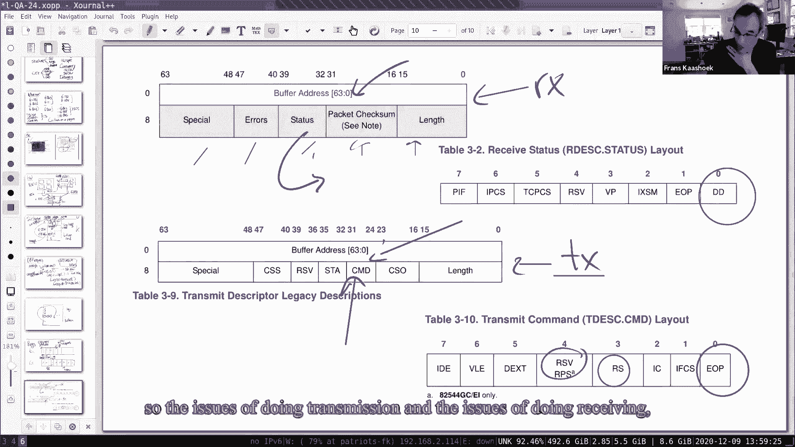
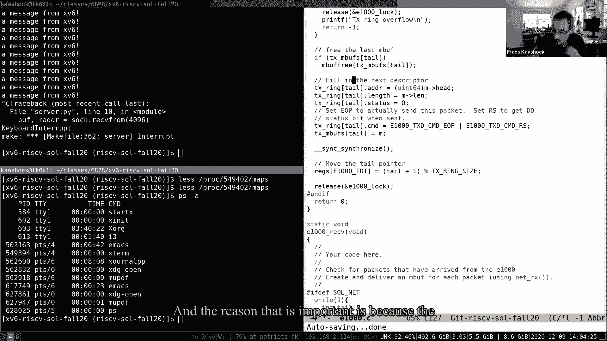
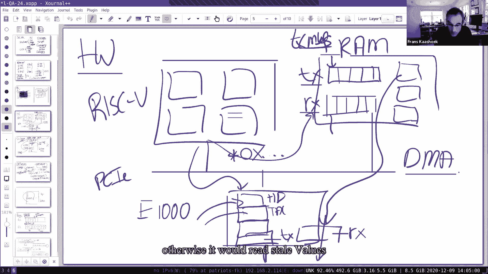
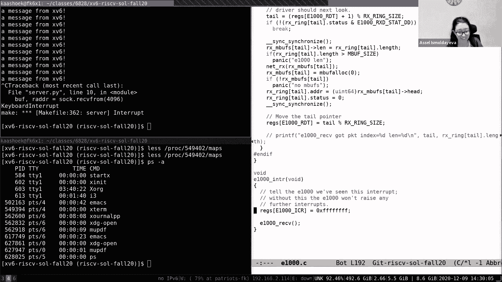

# 课程 P23：Lecture 24 - 最终问答课 🎓

在本节课中，我们将回顾本学期的一些核心主题，并解答关于网络驱动程序和 `mmap` 系统调用的常见问题。我们将重点关注硬件与软件的交互、并发控制以及系统编程中的实用技巧。

***

## 概述 📋

本节课是本学期的最后一堂课，我们将以问答形式进行。主要讨论三个话题：网络驱动程序的解决方案、`mmap` 系统调用的原理，以及一些关于课程结构的常见问题。我们将从硬件结构开始，逐步深入到软件实现，确保初学者能够理解这些核心概念。

***

## 课程相关问题与后续学习路径 🛤️

在深入技术细节之前，我们先来解答一些关于课程本身的问题。许多同学询问了与操作系统相关的后续课程。

以下是MIT提供的一些相关系统课程：
*   **6.828**：操作系统工程课程，侧重于阅读论文和构建操作系统组件。
*   **6.1810**：本科生的操作系统课程，今年是第二年开设。
*   **6.1750**：计算机体系结构课程，侧重于硬件与系统的接口。
*   **6.1910**：计算结构课程，涉及硬件设计和编译器。
*   **6.5840**：分布式系统课程，将在春季学期开设。
*   **6.1600**：计算机系统安全原理课程，将在下一学年开设。

此外，如果你对系统研究感兴趣，可以关注最新的学术会议（如OSDI）和开源项目（如Linux内核）的动态。实践是学习系统知识的最佳方式，可以通过完成实验或自己动手构建项目来加深理解。

***

## 网络驱动程序详解 🔌

上一节我们介绍了课程相关的信息，本节中我们来看看网络驱动程序实验的核心挑战与解决方案。网络驱动的主要挑战在于理解硬件规格、处理并发以及进行有效的调试。

### 硬件结构 🖥️

理解驱动程序，首先要理解其交互的硬件。在我们的实验中，RISC-V处理器通过PCIe总线与E1000网卡相连。

*   **内存映射I/O**：网卡的控制寄存器被映射到处理器的物理内存地址空间。驱动程序通过普通的加载(`load`)/存储(`store`)指令读写这些地址，从而控制硬件。
*   **描述符环**：网卡使用驻留在RAM中的“描述符环”来管理待发送(`TX`)和待接收(`RX`)的数据包。这是一种生产-消费模型。
    *   **发送环**：驱动程序（生产者）将待发送数据包的描述符放入环中，并更新**尾指针**。网卡（消费者）从**头指针**处读取并发送数据包，然后更新头指针。
    *   **接收环**：网卡（生产者）将收到的数据包描述符放入环中，并更新头指针。驱动程序（消费者）从尾指针处读取数据包，然后更新尾指针。
*   **DMA**：网卡通过直接内存访问技术，直接在RAM和网络之间搬运数据包数据，无需CPU介入。

**核心数据结构（描述符）示例：**
```c
// 发送描述符结构 (由硬件定义)
struct tx_desc {
    uint64 addr;   // 数据包在内存中的地址
    uint16 length; // 数据包长度
    uint8 cso;
    uint8 cmd;     // 命令字段 (如 EOP=1 表示包结束)
    uint8 status;  // 状态字段 (如 DD=1 表示描述符已处理完毕)
    uint8 css;
    uint16 special;
};
```

### 软件结构与并发控制 🔒

驱动程序代码分为“上半部分”和“下半部分”。
*   **上半部分**：在进程上下文（如系统调用）中运行，例如处理`send`系统调用的 `e1000_transmit` 函数。
*   **下半部分**：在中断上下文（中断处理程序）中运行，例如响应数据包到达中断的 `e1000_recv` 函数。

并发主要出现在两个场景：
1.  多个CPU核心可能同时调用上半部分的发送函数。
2.  中断处理程序（下半部分）可能在任何时候打断上半部分或用户态代码的执行。

**关键问题：为什么接收函数通常不需要加锁？**
因为中断处理程序在同一时刻只能在一个核心上运行，不会出现多个实例并发执行 `e1000_recv` 的情况。然而，如果接收处理程序需要调用网络栈，而网络栈又可能回调发送函数，且发送和接收共用同一把锁，则可能导致**死锁**。解决方案有：
1.  接收函数完全不加锁（如果它与发送方无共享数据结构）。
2.  为发送和接收使用不同的锁。
3.  使用可重入锁。

### 代码实现要点 💻

以下是解决方案中的关键代码逻辑。



**发送函数 (`e1000_transmit`) 的核心步骤：**
1.  获取发送锁，防止多个发送者冲突。
2.  检查环中是否有空闲描述符（通过比较头尾指针）。
3.  释放旧`mbuf`，将新`mbuf`地址填入描述符。
4.  设置描述符的命令字段（如`EOP`和`RS`）。
5.  使用内存屏障(`__sync_synchronize()`)确保描述符写入内存后，再更新网卡的尾指针寄存器，通知网卡有新包待发送。
6.  释放锁。

**接收函数 (`e1000_recv`) 的核心步骤：**
1.  读取网卡的尾指针，检查环中是否有新包到达（检查描述符的`DD`状态位）。
2.  使用`while`循环处理所有已到达的数据包（而不仅是第一个）。这很重要，因为一次中断可能对应多个数据包的到达，需要全部处理以避免数据包滞留。
3.  将数据包交付给上层网络栈(`net_rx`)。
4.  为描述符分配新的`mbuf`缓冲区，以供网卡下次使用。
5.  更新网卡的尾指针，告知网卡哪些描述符已被驱动程序回收。





***

## `mmap` 系统调用 📄

上一节我们深入探讨了网络驱动，本节中我们来看看另一个有用的系统工具：`mmap`。它提供了另一种访问文件数据的方式。

传统的文件API（`open`, `read`, `write`, `lseek`）是流式的，适用于顺序访问。然而，当需要随机访问或修改文件内部复杂数据结构时，这种接口显得笨拙。

`mmap` 系统调用允许将文件的一部分或全部直接映射到进程的虚拟地址空间。之后，程序可以像访问普通内存一样读写文件内容，无需频繁调用`read`/`write`和`lseek`。


**使用对比：**
*   **传统方式**：打开文件 -> 读取数据到缓冲区 -> 修改缓冲区 -> 定位回文件开头(`lseek`) -> 写回缓冲区。
*   **`mmap`方式**：打开文件 -> 映射文件到内存(`mmap`) -> 直接通过指针修改内存 -> 解除映射(`munmap`)。

这使得 `mmap` 特别适合数据库、编辑器等需要随机、细粒度访问文件内容的应用程序。

***

## 总结 🎯

本节课中我们一起学习了网络驱动程序实验的硬件原理、软件并发模型及关键实现细节，并了解了`mmap`系统调用如何简化对文件数据的随机访问。希望这些内容能帮助你巩固本学期的知识，并为后续的系统编程学习打下坚实的基础。





再次感谢大家本学期的积极参与和投入！