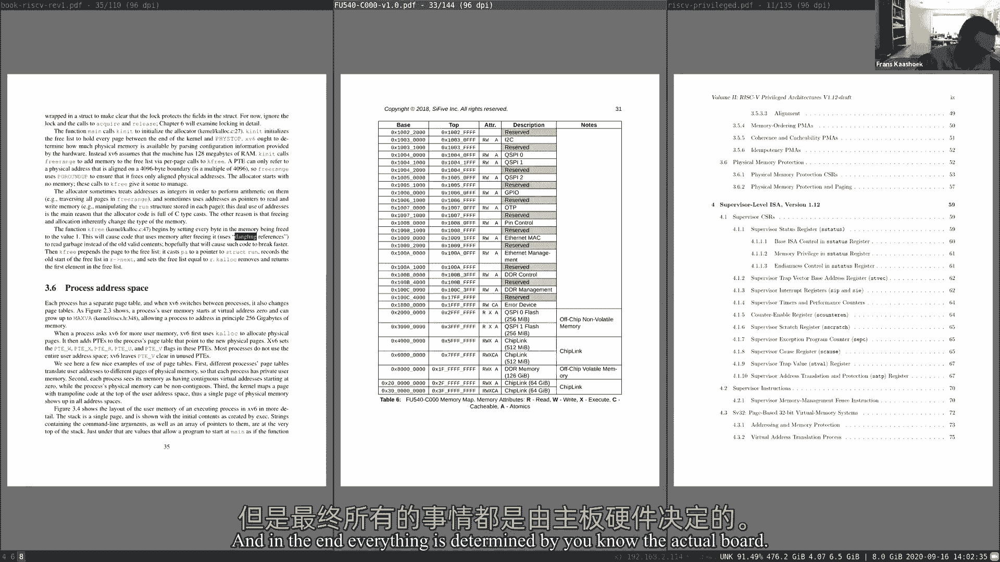
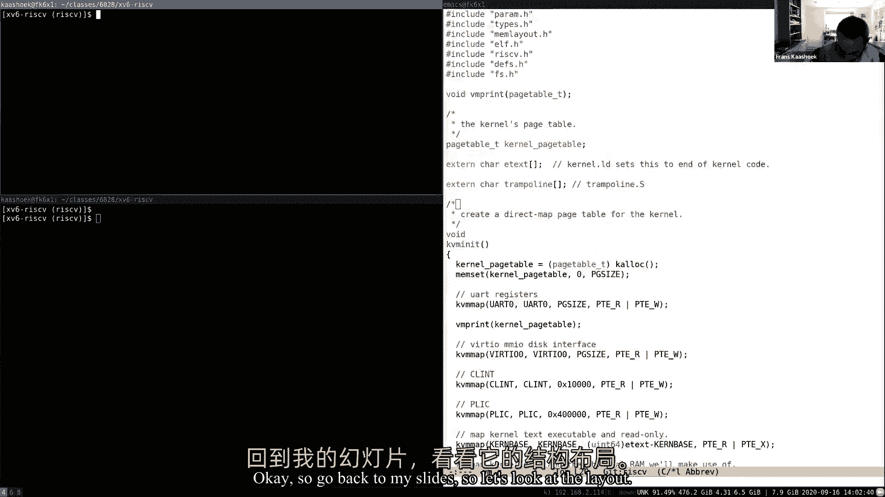
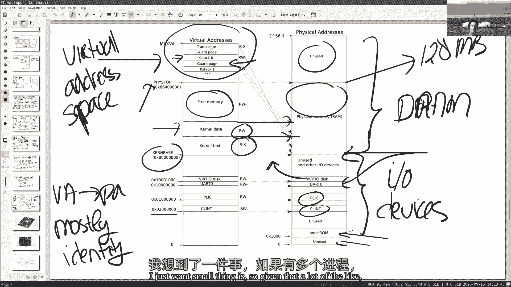
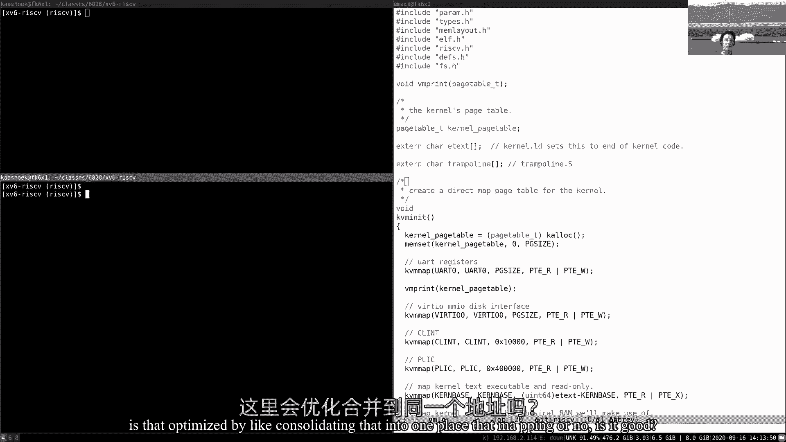
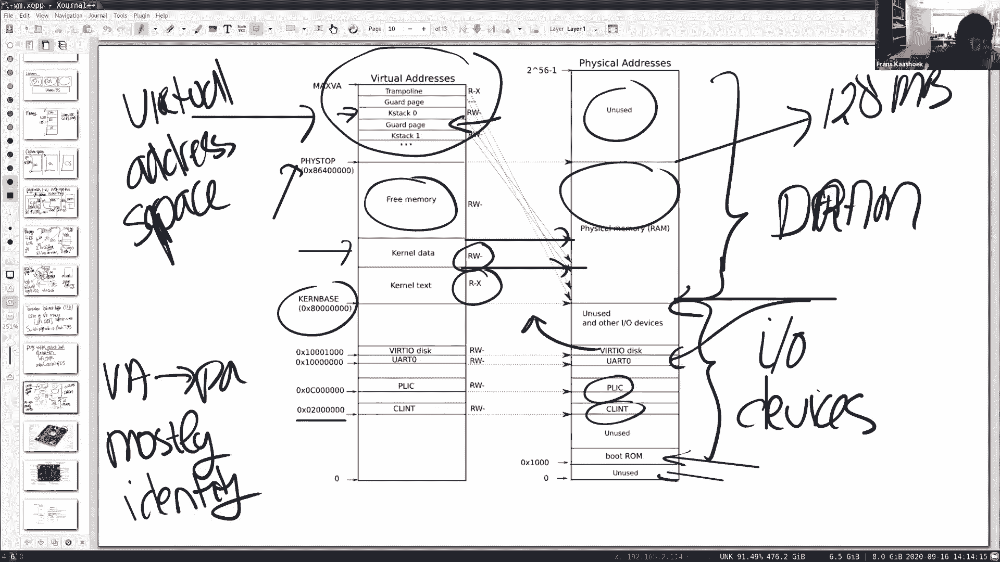
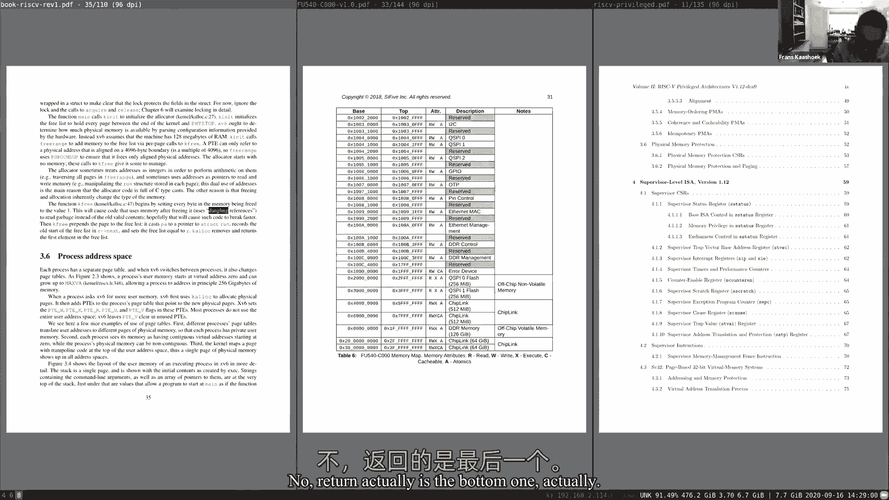
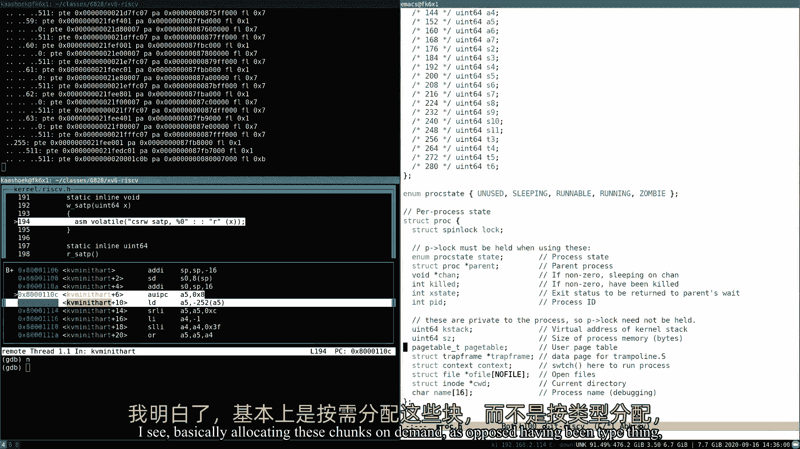

# P3：Lecture 4 - Page Tables中文版 - MCATIN-麦可汀留学 - BV1rS4y1n7y1

 [MUSIC]。

 Soundcheck。 Can everybody hear me？ >> Help。 >> Yeah。 >> Okay。

 So welcome to the next lecture in SOA1， wherever you are。

 particular hope that the folks in the West Coast who are in， Florida and Alabama do okay。

 giving all the terrible circumstances there。 So the topic for today is virtual memory。

 In particular， we're going to talk about page tables。 We'll return to this topic a few times。

 There will be multiple political memory lectures。 And maybe just to start off and get our question and answer going again。

 would I like to ask you a little bit of what do you remember， from virtual memory from 004 maybe？

 >> Yeah。 >> Or， or 6 or 3 if you take that。 I'll tell you my own sort of view on virtual memory。

 which is why I took it or first heard about it or learned about it as a student。

 But it's pretty straightforward。 Hard could it be。

 It's a table that maps virtual dresses to physical dresses。 Maybe a little more complicated。

 but not that complicated。 Only when you start programming with it。

 I should really learn that virtual memory is tricky and fascinating and very powerful。

 And so hopefully in the next couple lectures and the next couple labs。

 you'll appreciate virtual memory from that perspective。 But lastly， a couple of people here online。

 what do you remember about virtual memory from either 004 or 6 or 2， if you could take it。 Again。

 I'm just going to call out some names and share your memories about the Adela Yang。 >> Sorry。

 what was the question？ >> What do you remember about virtual memory from maybe 004 or 6 or 3。

 if you're thinking that？ >> It uses like offset to save on like remembering virtual address to physical address。

 not things。 >> Okay。 How about the Abrams-Kendira？ >> Abrams， are you online？ >> Yeah。

 My memory is that it uses like it's a way of one protecting the physical hardware by kind。

 of use your own representation of it。 And then yeah， you just have like some virtual address。

 things like at least in 004， it's like 12 bits that maps some physical address that usually。

 I think 16 bits is more bit too bad。 >> Okay。 How about the debug dependent？

 >> What I remember was you can have， each process has a separate address space。

 And the memory management unit or I mean some other technique can be used to map the virtual。

 addresses of that rest space of each of the processes to the physical address。

 And the virtual address， the lower bits are kind of the same so that the mapping is in。

 blocks which helps with performance。 >> Wesley Roo。 >> Yeah。 Yeah。

 I guess what I remember most is that virtual addressing allows us to protect the。

 physical addresses from each process。 And we can use some like clever manipulation so that the bits that correspond to the physical。

 address can be used somehow in the virtual addresses as well。 >> And Wilson's Fairman， or Spearman？

 >> Yeah， I remember it's really fundamental to isolation because every process can basically。

 pretend that it has its own set of memory to use。 >> Yeah， good。 Well， so clearly that's awesome。

 The clear two themes here， correct？ One is there's some form of mapping and that mapping is helpful in sort of achieving isolation。

 This is exactly the reason we're talking about virtual memory， isolation。

 So what we'll see is that in the next couple lectures in particular when we start programming。

 the virtual memory， I really get an in-depth understanding of what its power is。

 And so to get a sense of that， this is the first lecture and mostly focusing on the mechanisms。

 for virtual memory。 And then later we can see how we can use these mechanisms to achieve cool tricks。

 So the topic for today or the agenda for today， the plan is sort of pre-fold。 First。

 I'm going to talk about the dress basis。 Some of you mentioned in your just briefly mentioned in the response of this question。

 And I'm going to talk about the paging hardware or paging hardware。 And I'm going to focus。

 of course， on the paging hardware of the base 5。 But basically every processor。

 a modern processor has some form of the paging hardware。 And that's sort of D， if you will。

 the default mechanism for actually supporting virtual memory。

 And then the last part of the lecture is going to walk through some XV6 virtual memory code。

 and lay out of the kernel address space and user address spaces。 So that's the main plan。 OK。

 so I guess just a number of you mentioned in the response to this question， one driving。

 reason to have virtual memory is because you can use it to achieve isolation。

 If you set up the page tables correctly and programmed it correctly， then you can， in principle。

 achieve strong isolation。 And so this is a reminder， again， what we want from isolation。 Let's say。

 you know， our standard picture。 We have some user applications， shell， cat。

 all the util things that you built in live one。 And we have the kernel or the kernel sitting below the operating system。

 We're seeing the kernel space。 And what we like to do is sort of have boxes around these applications so that they can't。

 really affect each other。 And similarly， we want them to be completely independent of the kernel and the operating。

 system so that， like， an application does something either accidentally bad or maliciously。

 bad that it doesn't really affect the operating system。 So that's our goal。

 And the particular aspect of the problem that we want to focus on today is the memory side。

 of things。 So we really want to focus on memory isolation。 And by default， if we don't do anything。

 we don't really have memory isolation， right？ Because if you think about it。

 there's going to be one， you know， the risk-by-board that， should be last week， you know， it has。

 like， a memory， a bunch of DRAM chips。 And in the DRAM chips， you know。

 the code for these applications is stored。 And so somewhere in the memory is the kernel。 You know。

 text and data， stack， everything。 Somewhere in memory is the shell of the shell running。

 Somewhere in memory is the KEP program。 And so there's one sort of physical memory， you know。

 starting from somewhere there's zero， to， you know， so， you know， big address， you know。

 depending on how much memory we have， we really have in our machine。 And in that physical memory。

 all these programs must be present。 You know， otherwise， you know。

 the processor can't even execute their instructions。 And so what the risk， you know， clearly。

 here is that let's say， you know， let's make it， a little bit， you know， simplistic， but let's say。

 you know， the shell， you know， sits for， that even address zero to address 200， which is 1000。

 but 1000 to 2000。 And let's say， you know， the， you know， whatever cat has a program error。

 it loads， you know， in a register a zero， let's say loads a thousand， you know。

 the address basically， of course， fine to the start of the shell。 And then， you know， by accident。

 you know， it executes the instruction， you know， dollar， seven， a zero， right。

 which has the effect of the basically it writes the value seven， to the address， you know， 1000。

 And so， and then it would be scribbling over， you know， the basically the memory image that。

 belongs to the shell。 And so now we're doing， you know， certainly not。

 that certainly would break isolation， and be quite undesirable。 And so， you know。

 we want something that basically really separates these memories from the different。

 programs from each other so that things like that just cannot happen。 So one way， you know。

 to do that is an idea of it's typically called address basis。 And the basic idea is。

 I'm sort of straightforward， what we want to do is basically give every， application。

 including the kernel， its own address base。 And so we can think about this， like， you know。

 we just kept running， you know， it has， an address base starting at zero， you know， to whatever。

 some maximum value， you know， there's a shell run housing address base， its own address base。

 also starting at address， zero， you know， going through some value， you know。

 the kernel has its own address base， oh， s has its own address base。 And so one example， when kept。

 you know， refers to really， we go back to the example。

 of the previous slide where we did whatever store， seven， two， you know， a zero。

 And let's say in a zero， there's the value of 1000， you know， if kept， you know， executes。

 an instruction， it will write to the address 1000， but it's its own address 1000。 It's not。

 you know， the address of the 1000 of the shell。 So basically every program runs with its own address base。

 it's its own value， and those， address base are completely independent。 You know。

 in this notion of different address bases， can't， there's really have an ability。

 to even refer to an address that actually belongs to the shell。

 And so that's sort of the game that were the end goal that we'd like to achieve， because。

 it's going to provide us with strong isolation because， you know， it's just not possible。

 for kept to refer to any other memory that is not， you know， it's own。

 And so our goal now is to basically sort of figure out how to multiplex if you will， all。

 these different address bases on a single physical memory because in the end， we only。

 have what the DRAM chips were， you know， or RAM chips were the memories located。 And so。

 so that's our plan。 Okay， yeah， Amir， you have a question， go ahead。 Yeah。

 so I'm wondering in the configuration of the physical hardware， there's only so much， space。

 And in the virtual memory layout， there's also a max virtual address。

 By design is the virtual address made to be small enough。 No， no， not necessarily， you know。

 the physical memory could be bigger than the virtual address， base。

 And we'll see in a second how it all can happen。 And it's actually one of the， you know。

 cool parts about， as you will see with page tables。 That's extremely flexible。

 So is it possible that like the physical memory gets exhausted because so many processes use。

 up all their virtual space？ Yeah， that's certainly possible。 And we'll see in a second how。

 for example， you know， you have a bunch of big applications。

 that each have big page tables and they allocate a lot of memory， you know， so you can run。

 it out of memory。 I see。 Thanks。 And so where does this show up in XC6？ Anybody？

 You sort of touched on it a little bit in the Cisco lab that you're currently doing。

 Where page is allocated？ Where you did the Cisco lab and you finished it。 You know。

 one part of the fiscal life that is printing how much free memory there is。 K。 Alec？ Yeah， K。 Alec。

 right。 For K。 Alec has a list of free pages。 If that list of free pages is empty or runs out at some point。

 then， you know， K。 Alec， is going to return an old pointer。 And hopefully， you know。

 operations is not something sensible and that basically propagates。

 back to the user application saying like， well， you know， no more memory for you or no more。

 memory in total for nobody。 Okay。 And just a job for DOS to handle those cases， basically。

 where it generally means， you know， propagating an error message to the user application。 Okay。

 good。 So how do we implement these address spaces？ You know。

 how basically multiplex all these address spaces across a single physical memory。

 And the most common approach and the very flexible approach is to use page tables。

 And the ideas in this is a hardware support。 So this is implemented in hardware by the processor or by unit called the memory management。

 unit。 So the picture that you sort of should have in your head is， you know， the CPU that executes。

 instructions， you know， whatever are， you know， our store instruction that was， you know。

 putting $7 into a zero indirect。 So it executes those kind of instructions。 And you know。

 one that executes one of their store instruction， load instruction， whatever。

 anything that actually has an address， you know， that address we're going to think about。

 as a virtual dress。 So it's not a physical dress。 It's a virtual dress。 And so for example。

 the value in a zero that we're using here， say that's 1000， 1000， 1000， that is a virtual dress。

 And a virtual dress is basically routed through something what's called the memory management， unit。

 And the memory management unit translates it into a physical address。 And that physical dress then。

 you know， we've actually used to， you know， index into memory， and load whatever value or store。

 whatever value you need to be written there。 And so the CPU from the CPU point of view。

 it always issues every instruction that it， issues once the MMU is enabled are virtual dresses。

 And to translate these virtual dresses， the physical dresses， basically the MMU has a， table。 And。

 you know， virtual dress in one side， physical dress in one side。 And the other side， for example。

 here is， you know， our entry for 1000 and maybe that， maps to whatever， you know， OX， whatever。

 making something up， like some big value， you， know， somewhere in physical memory。

 So this mapping between virtual and physical is quite flexible。 So in one side。

 we have the virtual dress at the other side of the physical dresses。 Typically， you know。

 this mapping itself is also stored in memory。 And so the CPU has some register that basically points to。

 you know， that contains the physical， address where the page table is stored。

 So somewhere in the basically the page table or this map is somewhere stored in physical， memory。

 Let's say， you know， whatever， you know， address 10 and basically this register， which is called。

 on the risk five， SATP， you know， stores the， the address 10。

 And so that the CPU can tell the memory management units where to find， you know， basically the。

 map to actually translate virtual to physical dresses。

 And then the basic idea is to give every application its own map。 So you know。

 CAD is going to have it's map。 So every map it's own。 Yeah。 Oh， I think I go ahead。

 So the MMU you said it doesn't necessarily store the mapping。 So does it just do the translation？

 Like it will read the memory and do the translation， but not necessarily store the mappings。

 That's exactly the right picture that you should have in your head。 And with every method。

 So the map itself is stored in memory。 The end users basically walks or looks up into the map。

 And we'll see in a second that， you know， this map is slightly more complicated than what。

 you're drawing here。 So every app has its own， its own map。 Right。

 And that map basically defines its address space。 And so when we。

 the CPU or when the operating system switches the CPU from one process or。

 from one application to another application， it also switches the， you know， the content。

 of this SATP register to store the root of the map of the appropriate process。 And so in that way。

 basically， you know， multiple applications can run on the CPU every time。

 we switch between from one application to the next application。

 We also switch the SATP register to point to the appropriate map for that application。

 And in that way， basically the virtual addresses for CAD are translated differently than the。

 virtual addresses for the shell because， you know， each one of them has their own map。

 That makes sense？ Okay。 So the way， this is sort of the basic plan and the way it's drawn or explained it so far。

 is pretty naive and unreasonable。 Yeah， good。 Go ahead。 I'm sorry。

 So you said the SATP register gets modified for the process。

 I am guessing the value of for the SATP register for each process is stored by the kernel。 Yes。 Yes。

 the kernel is writing the SATP register。 In fact， writing or reading or typically writing the SATP register is a privilege instruction。

 So user application cannot just update the page map register and say like， Oh， I want。

 to run the disk page map now because that would violate isolation。

 So it's only the code and kernel load can actually update it。 I see。 Okay， so as I said。

 this picture is pretty naive。 You know， one thing I haven't really said anything about how this actually map works。

 And you know， the way I've sort of drawn out since the indicate， you know， basically for。

 every virtual address， you have an entry in the map。 And if you do that。

 how big would the map be on race five？ Anybody？ How many addresses are there on the risk five in principle or how big how many addresses。

 could a register store？ Which are 64 bit wide。 So how many addresses？ Anybody？

 I know I'm insulting your intelligence by asking these questions。 We have some answers in the chat。

 like two to the 64。 I didn't see the chat。 Sorry。 Yeah， two to the 64。

 Let's see if I can actually pop up the chat so I can see it。 Yeah， two to 64。 Thank you。 All right。

 so this table would be gigantic。 In fact， all memory would be consumed by just having that table。

 So that's reasonable。 And so in fact， you know， that's not how things work。 In fact。

 I'm going to go in two steps to actually how it actually works in the race， five。 So step one is。

 you know， don't play the game per address， but do per page。

 So you translate a page at a time and a page on the risk five is four kilobyte。

 And which is four and four thousand ninety six bytes。 And this is pretty common。

 Almost all processors， you know， use a roughly page size or four kilobyte or support a page。

 size or four kilobyte。 And so now again， translation works slightly differently。

 So here we have our virtual address。 And basically we split it in two pieces。

 an index and an offset。 And so the offset is basically the byte within the page。

 And so when we do when the MMU does the translation， it takes the index indexes into the map that。

 gives you some physical page number， you know， the in memory in that physical page number。

 that points to show， you know， physical page of four thousand ninety six bytes。

 And then the offset part basically indexes into that physical page。 So example， the offset is。

 you know， twelve， then， you know， the， the twelve entry of that， page is actually used。

 A lot of you people and a lot of you answered this in the mentioned it in the response to。

 the question that there's always some scheme of like taking an offset and ending that through。

 the base of the page to obtain the actual memory， physical memory location where a value。

 or storage or where a value will be loaded to。 And one of the interesting things about the risk of this and there's in response to some。

 of the questions that somebody asked her， like the physical or the virtual addresses are， 64 bits。

 which makes me totally sense， correct， because the risk five to 64 bit register。 But in fact。

 on the risk five processor that we're using， not all the 64 bits actually， used。

 namely the top 25 are actually not used at all。 And so that limits the size of a virtual address。

 right， that limits the size of a virtual address， space to two to the power of 39。

 which is roughly five and a twelve gigabyte。 And so of course， you know。

 later version of the processor might support bigger address。

 spaces that is necessary and that could then be done。 And so that for example。

 some of those 25 bits that are basically unused， you know， could。

 be used to build bigger virtual address spaces。 And so in the index， and then， you know。

 with 39 bits left， you know， as the virtual address， 27 bits are indexed。

 And we'll see you in a second why they're 27 are indexed。 And then the 12 are offset。 And， you know。

 they have to be 12， right， because two to the power 12 is， you know， four， five， and ninety six。

 All right。 So that's virtual addresses on the risk five physical addresses。 As you can see here。

 actually 56 bits wide。 So the physical memory， you know。

 can be bigger than the single virtual address space。 But it's limited to two power 56。 You know。

 you know， most boards probably， you know， don't support two to the power 56。

 physical memory because gigantic amount of the physical memory。 But in principle， the board could。

 you know， manufacture it， support two to the power 56， with physical memory。 And so in this scheme。

 then if you 56 bits for the physical address， 44 are basically the， physical page number， the PPN。

 the 12 again are the offset that are inherited directly， from the virtual address。

 Does that make sense？ So， I'm going to stop for a second here。

 You're sure you collect your thoughts。 The other thing important I wanted to make here is that this material is important。

 So just ask questions。 The details matter。 And it will be a large part of， you know。

 you really need to understand all this stuff， to be able to basically do a lap， the next lap。

 the page table lap。 Yeah， I'm here。 Go ahead， please。 You can go back one slide。

 The screen is unclear。 Which one？ The page table slide？ Yeah。 This one？ No。 The most recent one。

 It also doesn't really matter。 Yeah， this is perfect。 Thank you。 I'm wondering this 4096 byte range。

 which we've called a page， is that assigned as a continuous， chunk in memory？ Yes。

 That's a continuous physical， continuous range of 4，596 bytes in memory。 I see。

 And then the granularity of 4，596 bytes。 Okay， and then 12， the offset， like 2 to the 12 is 4096。

 so that's sufficient to cover， each of the chunks。 Yeah， each byte and whiplash。

 And where does the 56 come from in the diagram？ The 56？ I could follow up until then。

 but I didn't get where that came from。 The designers cook it up。

 So the hardware designers decide how big， you know， physical dresses basically for whatever。

 board they want to design。 And so the race five designers decided that 56 big physical dresses were a good idea。

 And presumably the way they come up with these numbers is they look at technology trends and。

 say like， well， we want to be able for the next sort of five years， you know， we don't。

 want to predict that physical memory will be ever bigger than 2 to the power of 56。

 And probably they're thinking it won't be bigger than something much smaller， but then， you know。

 give them some V-way， you know， in case， you know， their prediction is wrong。

 They pick a big slightly bigger number。 Does that make sense？ Yeah， thanks。 Yeah。

 a lot of people ask about this。 Anybody else raised their hand？

 I think there's a bunch of people asking questions and unfortunately my zoom doesn't show。

 if more than two people raised hands， it's just multiple people are raising their hand。

 So please jump in if you have a question。 Okay， if not， I have a question。 Yeah， go ahead。

 So if the virtual memory is up to 2 to the power of 27 and the physical memory is up to。

 the power due to the 56， right？ So we could have like。

 we could have multiple processes that could exhaust all their virtual。

 memories without using up all the physical memory。 Okay， that's correct。 Yeah。

 That's absolutely correct。 Okay， I have a question too。 Yeah， go ahead。

 So this 56 for the physical address， is that the number of possible memory locations？

 I don't think it's the number of bits， right， because this is a 64-bit machine。

 That 56 could go up to 64， but they just chose it to have just 56。 That's correct。 That's correct。

 And one way to think about it， then they only have to run 56 wires on the board， as opposed， to 64。

 I see。 I see。 Okay。 I also have a question。 So kind of， could you go back one slide， baby？ Yep。

 So from the CPU， we go through the MMU and then to the memory。

 But where here is the distinction for different processes？ Because like each process， like process。

 like the shell process has something at address， like 0x10000。

 And then the LS process also has something at address 0x100。

 So we need to translate those to different physical。 So yeah。

 The SATP register contains the address of which map to use。 So LS runs with zone map。

 Can't run with zone map。 Okay。 So each process will have its completely own map。 Yep。 Makes sense。

 Thank you。 And in fact， there's a great leeway to the next point。

 So if every process has its own map， how big is this map that I draw in here？

 Well that map is two to two to power 27 entries， correct？ And that's pretty big。

 And I would feel physical memory， reasonable quickly， if every process exactly had a complete。

 populated map。 And there's gigantic means that every process is very big。 And so in fact。

 this is not the way the hardware actually stores page tables。

 You can think about it conceptually as an array going from 0 to 2 to 2 to power 27， but。

 actually it's not what happens in practice。 In practice， it's a multi-level structure。

 And here is actually the real risk five page table structure and what the hardware implements。

 And so what happens with the 27 bits that we saw earlier， the index， it's actually split。

 in three 9-bit numbers。 And the first， the top 9 bits are used index into the top level page table directory as。

 they are called。 And so in one directory， one of these guys is 496 bytes， 496 bytes。

 just like a page size。 A PTE entry， one of the entries in that thing is 64 bytes， 64 bits， I mean。

 sorry， like， the register， so 8 bytes。 And so there's going to mean that either 496 divided by 8 means that there are 512 entries。

 in one of those directory pages。 So basically what happens is the SATP points to the top root directory。

 We take the top level 9 bits， index into the page directory， and that gives us a new physical。

 page number。 And that physical page number is the page directory for the next level。

 So we then we use the next level index to index into that page directory and then， you， know。

 answer 4， you know， we like the final one， you know， we get the bottom level page。

 directory and that basically gives us the entry that maps the virtual address to a physical。

 address。 So there's some sense， it's very similar to what I showed you in the previous slide。

 except， you know， basically the index happens in three steps instead of one step。

 And this is the advantage， the main advantage of the scheme is that then if large parts。

 of the address days are not being used， you don't have to have any page table entries for， that。

 As an example， let's say you have an address base that has only one page， like the bottom， page。

 you know， so 4， 5， and 96， and no other pages are in the address base。 So only addresses 0 to 4， 0。

 5 and 6 are actually mapped。 How many page table entry or page table directors do you need to map that particular page？

 Well， you need one at the top， correct？ And you need basically value in that entry for zero。

 The top level 9 bits， you know， of zero or zero。 So you need an entry for zero。

 So that means you need one middle level entry， you know， that basically corresponds to the， next。

 you know， 9， 0 bits， and then one entry for the next 9， 0 bits。

 So basically we get away with three page directories。

 And in our previous scheme on the previous slide， correct？ We have two to the power of 27 entries。

 And now we're basically going to have to have three times whatever， 5 from the 12 entries。

 and we're done。 And that's the main reason why， you know， the actual hardware I have。

 this sort of hierarchical， or multi-level tree scheme。 Any questions about this？

 Because it's pretty important。 So me or go ahead。 So my question is。

 since the PPN number from each page table is 44 bits and the second。

 say the middle table resides on the virtual memory， where do we get the missing 12 bits， from？

 The final 12 bits？ Okay， so you're saying in D-44， correct？ Yes。 What is going on with that？ Well。

 all page directories are their page line。 And so basically their physical page number is 44 plus the 12。

 12， 0 bits。 And so what actually happens is if we look at these PTE entries， they all have the same。

 sort of form， right？ If you look at one of these guys， they're 44 bits。 They're 12 bits， 0s。

 So that gives us a 44 plus 12 is 56， so that gives us a physical address， correct？

 And so that means， I mean， there's 64 bits。 There's actually some bits left that are not being used。

 And in fact， the bottom 12 bits will basically， or about 10， definitely， the bottom bits are。

 not used at all。 And in fact， the Paging Hardware stores。

 or stores there are a bunch of flags that control， the translation。

 And we're talking about those flags in a second。 And they're there to control the translation。

 And they're stored basically in the bottom 10 bits。 And it also means， Greg。

 that if you add these two off， that's 54 bits， basically there's， 10 bits left。 They're un-used。

 And those 10 bits are， again， for future growth。 At some point。

 you might have a new type of risk-five processor that will have slightly。

 different structure page tables， and it might actually have bigger than 44 bits for the physical。

 page number。 Okay， thank you。 And in fact， you can see it here。 Like， if you look at a single entry。

 Greg， that's drawn here， you know， they're basically， 10 bits left that are not being used。 Okay。

 so let's look at the flags for a second， because that's sort of important。

 So every translation in the bottom 10 bits that are a bunch of flag stored， and the first。

 flag is valid。 The valid bit is set。 That means this is a valid PQ。

 and you can use it for translation。 And so for a little example that I used here with free page directories。

 when only entry， zero is used， then only entry zero will have the valid bit set。

 and none of the other five， and the left entries will not have the valid bit set。

 And that basically tells the， and the new， well， you know， you don't have to change down， this PQ。

 this PQ just contains no valid information。 Then R means you're allowed to read from the page。

 Right means you're allowed to write to the page。 XQ means you're allowed to execute instruction from it。

 And user means this page is also accessible by a process you're running in user space。

 And then the other bits， you know， not that important， or I'll show up at some point， those。

 are the defined important bits。 Does that make sense？ Yeah。 If you。

 I probably missed that in your name， I apologize。 That's the differentiation。 Thank you。

 I had a quick question about the three page tables。

 So how are the addresses or like the PPM values combined to form the final physical address？ I mean。

 I might have missed that。 I know， I'm not saying that said it very explicitly。 So the first PPM。

 correct in top of the page， the first PPM in the top level of the page。

 directory contains the physical address of the next level down， right？ Okay。

 Now one contains the one next level down。 And then in the final one， we still have our here 44 bits。

 That contains then the actual physical address off the page that we're actually trying to。

 translate to。 Ah， okay。 That makes sense。 Thank you。 Okay。

 And one interesting question just to let us a site note before， let me answer this， my own。

 question before answering the two raised hands here。 I look back at this picture。 Why。

 why are the physical page numbers stored in these page directories？ Why not a virtual address？

 Because we need to look it up in memory， like look up the next directory in memory。 Yeah， right。

 We could not have， you know， our translation scheme depend on yet another translation scheme。

 You know， we could sort of encourage the infant look。 So this doesn't make sense。

 This is exactly the right answer。 It has to be a physical number。 How about the SAP？

 What do you use the SAP？ What does it store？ Does it store a physical address or a virtual address？

 Also physical， assuming that the first page directory is also in memory， right？ Yep。 Yep。 Exactly。

 So it has to be a physical number because we're actually trying to use it for translation。 And so。

 you know， the SAP needs to know what the physical page number is or the root of， the page directory。

 Okay。 There were two other questions or two people raised their hands。

 Could you repeat your question？ Sure。 It hasn't been answered yet。

 So there's a hierarchy of three tables。 Yep。 And each of them is indexed by a part of the virtual address each nine bits long。

 So I'm not sure I understand how chaining between them happens and what it's meant to， accomplish。

 Can it be sufficient to just use those three nine bit addresses to index into each of， them？

 That's correct。 So the first， the top level nine bits are used to the index in the first top page level。

 directory， the second and the next one and the third and the third one。

 And so maybe I'm just not understanding this correctly。

 So when a process requests a certain like virtual address to be looked up， it loads into。

 the SAP register or the CPU does and that gets the corresponding correct highest level， page table。

 And then that page table will。 And will you send the top level nine bits from the 27 induction top page directory。

 And then what is the result of that？ Like if the result is there's nothing there。

 does the MMU create a page table？ No， no， the MMU basically tells the operating system or tells the processor。

 sorry， I couldn't， translate that address。 And basically it turns into a page vault。

 which we'll talk about a little bit later。 But just cannot translate the address so it doesn't translate it。

 It's like， you know， you can't divide by zero。 You know， if you try to do that。

 the process is a refusal to do it。 I see。 Okay。 So I just want to make sure I understand how I think maybe we come up with a bit of it。

 But I want to understand how the kind of intermediate page table， how we calculate the。

 physical address of those。 So is it correct that， say if we were trying to find a second level page table as physical。

 address， we would take the PPN from the first level page table， that's 44 bits。

 And then we add the 12-bit offset from the original virtual address to get the full 56。

 bit physical address。 We don't add the offset from the virtual address。 We just take 12-0 bits。

 So we take the PPN， there's 44 bits。 Oh， okay。 We 12-0 bits in the bottom and that gives us a 56-bit physical address。

 And that's where the next page directory is。 And this requires that basically every page directory is page-aligned。

 Which？ I see。 Okay。 That makes sense。 So if you do all great questions and these are all things you're going to be struggling。

 with in the page table lab。 So it is very good to ask them right now。 Okay。 Let me see。 Yes。 Okay。

 Hold on for a second。 And I collect my thoughts。 Let's see where I am。 Good。 Good。 Good。 Okay。

 One sort of， you know， one other thing that I want to mention， because you will see that。

 is that if you think about this， you know， the scheme that I just showed， right， what really。

 seems to be going on is that when you load or store a value to memory or the processor。

 loads or stores a value to memory， we basically have to do three memory lookups， right？

 One in the top level page directory， one in the intermediate page of that provider， and。

 then one in the bottom level page directory。 It looks like that， you know。

 any memory reference to a virtual address basically requires three， memory reads。

 And so that seems expensive。 And so what happens in practice where almost every process does this。

 it has a cache sitting， on the site that contains recently used translations。

 And this is called the translation， look-asite buffer。 And you will see the term quite often。

 and TLD。 Basically， it's nothing else than the cache of page table entries， PPE entries。

 So when the process has， you know， the first time the process will loosen up a virtual， address。

 you know， walks this， the hardware walks this page， the free level page tables。

 and it will come out with， you know， the final physical page of the final called PPN for that。

 particular virtual address。 And then basically the TOB store dot VN， PAPN or PA mapping on the site。

 And so then on the next time you refer to that particular virtual address， I can just。

 look at the straight up in the TOB and the TOB will respond instead of having to do the。

 page table walk。 Yep， let me hear。 So the TLD map virtual addresses to the physical address of the page that the virtual address。

 along with the offset maps to， right？ Wouldn't it be more efficient to like cache at the page table level？

 Okay， so let me take a step back here。 There's many ways of implementing the TOB。

 The most important thing that you need to know is that there is a TOB。

 And the exact details of actually how the TOB is implemented is sort of， you know， not。

 a topic that we're going to talk about in a greater amount of detail。 In fact， not at all。

 And so this is really something that sits inside of the processor and is mostly hidden。

 from the operating system。 The operating system doesn't really know how the TOB operates。

 The only thing， the reason you need to know that the TOB exists is that if you switch， page tables。

 then typically the operating system needs to tell the processor that it's。

 switching page tables and the TOB needs to be flushed。 Because basically you can't do stale entries。

 right？ If you switch to a new page table， the entries in the TOB may not be valid anymore。

 And so they need to be removed because otherwise， you know， the translation would be incorrect。

 And so the operating system is typically where it's aware that there's a TOB only basically。

 you can tell the hardware once in a while saying like， "Okay， well， don't use them anymore。

 because I'm going to switch page tables。"， In fact， on the RISC-V。

 the instruction to Flux TOB is called S-fence_VMA。 And that will actually flush the TOB。 Get back。

 So I have a question like not regarding TLV， but that brought kind of this question。

 The three level support， the three level paging that we have， is it implemented by the operating。

 system or the hardware itself？ It's implemented by the hardware， so you know。

 there's all happens in hardware。 The MMU is a block of hardware， not in the operating system。

 We'll see in a second， and when we look at XV6， the XV6 has a function that models the。

 page table walk because once in a while， you know， SV6 basically has to do what the hardware， does。

 And so those are the types of functions we could walk。

 That basically does exactly the same thing but in software。 So can I ask a question？

 So where in this scheme does the processor cache fit？

 Does it happen before the address translation or after？ Yeah， okay， let me switch back a little bit。

 Let me see。 Okay， usually， and you will really， the way to think about it is that all this stuff。

 you know， this whole block is inside of the processor silicon。

 So there's a risk-fired chip and inside of it is the CPU。 In fact， there are multiple CPU。

 correct the four cores， and there's an MMU and you know。

 you can think about that either on the CPU site， you know， there's a T will be。 Okay。

 That makes sense。 I guess my question was about like cache in terms of not the TLE but just normal cache。

 Like， because sometimes we don't actually go all the way to access the memory。 Yeah， yeah。

 good point。 So like I showed you like the scheme of last week。

 correct the third one on Monday of the， risk-fired processor and it has an L1 cache。

 it has an L2 cache。 Some caches are indexed by physical address。

 Some caches are indexed by virtual address。 So the caches that are indexed by virtual address sit before the MMU and caches are indexed by。

 physical addresses after the MMU。 Does that make sense？ Can I also ask a question？ Yeah。

 my question is you sent in the TLE it walks。 So like to put stuff into TLE the hardware walks through the page tables。

 Why do we write walk function if hardware can do that？ Very good question。 One reason。

 I guess there are a couple of reasons why we do it or why XV6 needs it。

 One is when it actually sets up the initial page tables。 You know。

 it needs to program the two few levels and so it needs to basically emulate， the three levels。

 Another example that you actually sort of run into or are running into in the CISCO lab is。

 that when you copy， in XV6 the kernel has its own page table and every user address。

 base has its own page table。 But once in a while for example in CIS info。

 the point of the CIS info struct that lives， in user space。

 the kernel needs to be translated to an address that it can use to rewrite it。

 So for example if you're looking copy in or copy out， basically the kernel translates。

 the user virtual address using the user page table to get out a physical address that the。

 kernel then to get an address out that actually then the kernel can use to rewrite that memory。

 So there's a bunch of places where it shows up and I'll talk about it hopefully in whatever。

 10 minutes or 15 minutes。 I have a question。 Why doesn't the hardware like expose that walk function so we don't have to write our。

 own and like potentially have bugs in it？ Why isn't there like a， you know。

 maybe a privilege instruction that you can pass a virtual。

 address and it'll give back the physical address？ Well。

 this is just like just stored to the virtual dressing。 You get back and we'll do it right for you。

 And we'll see later on in the next lap the page table lap。 In fact。

 this is exactly what you will do。 You'll actually set up the page table slightly differently so that you can avoid the walk。

 in copy in and copy in string。 I think this will become clear in a second that we when we talk about the x86。

 Okay。 Okay， good。 One more sort of basically before jumping into the x86。

 I wanted to sort of make one point。 One way to think about， you know， page tables。

 A popular way to freeze this is the page tables provide a level of interaction。 And that。

 and so basically this interaction grid what I'm talking about， you know， this。

 mapping for virtual dress， the physical dress and this mapping is completely under the control。

 of the operating system。 That's what we've seen， you know， in the last。

 in a couple of slides that we talked。 And that means that the operating system。

 because it has so much control over it has， control over the control of that translation。

 It can do all kinds of interesting tricks。 And so for example， like one trick， you know。

 we talked a little bit about this like if a， page。

 a page entry is invalid and will really return a page， you know， the hardware will。

 raise a page fault。 In response to that page fault。

 the operating system could update the page tables and then， maybe a restarking instruction。

 And so there are all kinds of things that they can do at runtime by manipulating the page， tables。

 And we're not going to talk about it today， but in two weeks that we'll have a lecture。

 exactly of sort of about this topic about what cool things can you do once you have page。

 tables and page faults。 But it's important to keep in mind that this is a incredibly powerful mechanism that will。

 provide the operating system with a tremendous amount of flexibility。

 And this is one reason why page tables are so popular。 Okay。

 so what I want to do next is actually talk about XV6 and sort of see how it all， plays out in XV6。

 And so the first thing I'm going to do is I'm going to look at the kernel page layout， if you will。

 And the mapping is in this slide。 So here's the virtual address space of the kernel。

 And here's actually the physical memory。 So this is one basically whatever you can think about。

 This is DRAM。 In fact， it is not， let me take it back immediately。 One part is DRAM。

 And one part is actually I/O devices。 And so maybe I'm going to talk about the physical。

 the right side of the slide a little， bit first and then we'll talk about the left side in a second。

 So the left side of the slide is completely determined by the hardware。

 So the hardware designers basically determine the layout of that fit。

 And if you sell before last week when the kernel starts， it starts at this address OXA80。

 And that is determined by the hardware designers。 And so you're more explicit。

 So if you look at the board， this is the same picture of the board that I showed on Monday。

 but it's hopefully a little bit better picture in the EUTC。 Here's our risk-buy processor。

 And we now know， correct， that in the risk-buy processor， there are four cores， but there's。

 also an MMU and there's also a TOB or multiple TOB。

 Every core has its own MMU and every core has its own TOB。 And here are the G-D-R-N chips。

 And so basically the designers of the board have decided that when， you know， after the。

 translation of a virtual physical address， basically physical addresses that starting， you know。

 at O8， no， no， no， one of the zeros actually go through the D-R-N chips。

 And dresses below O8 may go through different IO devices。

 And so the platform decides basically that the designers of this board have decided exactly。

 that the physical layout。 And the fact you can look that up the physical layout if you want to。

 just let me show you， here's the same manual that I showed you on Monday。 And if you go to。

 actually， you go to page 31， I believe， it's the page。 And if you go down， it says。

 "What's the memory？"， It will spell out what the memory map is of the board。 And it will say， like。

 "At address 00 is reserve。 Nothing is there。"， If you scroll down in this memory map， you know。

 you'll see some information about all， the different things that are mapped， for example。

 the ethernet。 Board is mapped at OX1， you know， OX something。 If you go further down。

 that's too much down。 Here you see the N3 for OX800， correct？ And that actually is DVR memory。

 the off-chip， volatile memory。 And so those are the DRM chips that I just showed you on the previous slide。

 And so it's just good to keep your head correct， even though we're not talking to you and you're。

 all always seeing software。 In the end， everything is determined by， you know， the actual board。

 Okay， so go back to my slides。

 So let's look at the layout。 Yeah， Noah， go ahead。 Yeah。

 when you say that this layout is determined by the hardware， do you specifically mean， like。

 the CPU itself or the board on which the CPU resides？ The board in which the CPU resides， correct？

 Because， you know， the board， you know， the CPU is that gray thing in the middle， that。

 square thing， saying， whatever， wrist-by。 The DRM chips are sitting off the processor， right？

 And it's the board designers who put the chip， the DRM， the mini I/O devices all together。

 Thank you。 And large part of an operating system is actually， you know， the CPU is one part， but。

 the I/O devices are at least as important， correct？ And so when you're writing an operating system。

 you both have to deal with the CPU as well， as， you know， with the I/O devices， you know。

 and you want to send a packet over the internet。 Well， somebody has to tickle， you know。

 the network drive or the NIC cards to actually， do that， and that's the operating system。

 So going back to the right side of this picture， correct， which is the physical address layout。

 you know， we see basically that， you know， the bottom was unused， as I showed you on， that document。

 It turns out that OX100， that physical address does where the boot ROM is。 So when you turn on。

 you know， that board， the first thing that happens is actually coding， the boot ROM runs。

 And when the boot ROM is done， it actually will jump through this OX20000 and it's this。

 job of the operating system to make sure that there's some， you know， some data there。

 And then there's a bunch of other devices that we'll talk about， gives the internet， up controller。

 We'll talk about it next week。 There's a clint， another part of the interrupts story that we'll talk about next week。

 So basically multiple devices can generate interrupts。

 There needs to be a plan to route those interrupts to the 2D appropriate request level， and that's。

 all implemented by those internet controllers。 And let me， let me finish for a second， you know。

 this slide before answering the question。 Then there's a UART， that was the device。

 that was actually the thing that actually， the， device that actually UART device that actually interacts with the console and the display。

 And then there's the， there's the disk。 And that's the device。

 There's where the device sits that actually interacts with the disk。

 So when you write the location to address， let's say， OX200， then that physical address。

 corresponds to the clint。 And so when you do storage， trucking， or load instruction。

 you're reading and writing， to， you know， the chip that implements the clint。

 And we'll see later what that exactly means。 But basically you can think about this as interacting directly with the device and not。

 reading a writing physical memory。 Yeah， there was a question。

 So just trying to make sure the addresses below OX800， they don't really exist in DUM。

 If when we mentioned those addresses， we directly go to the other hardware。 Yeah， yeah。

 So like if you just go back to this picture， anything above OX100， correct？ That's these DUM chips。

 And， you know， I can't draw， yeah， I can't point you to the clint。 But like， for example。

 here's the evenet。 And so that's it's a particular physical address。 And we can write， you know。

 with load and store instructions， this is called memory map。io。

 We can do a load and store instructions。 We can program the evenet controller。

 I also have a question。 Why， why is this big trunk at the top says and used？ Why is it not used？ Oh。

 okay。 So remember not every machine， not every， so there's two to the power 56 bytes of physical。

 address space。 But you don't have to， you know， plug in that much memory into the board if you don't want。

 to。 And so some parts of it may be unused， depending on how much， you know， DUM chips are sitting。

 on the board。 In fact， be like in XV six， we， I think， limit ourselves to 128 megabytes。

 And no more。 So when， when a load or store instruction goes out of the CPU， does that go like。

 where， does it get routed to the correct IO？ Like already from the CPU。

 So kind of like if the CPU before it sends it out， it says， okay， if it's lower than zero。

 X eight and all the zeros， then I'm going to send it to like the correct IO device。

 And then otherwise I'm going to send it to the， to the memory， like the D RAM chip。 Yeah。

 You can think about it as a D multiplexer sitting on the inside of the risk five， you know， blob。

 Oh， so it's inside of that block。 Okay。 There's a memory controller and doesn't arrive。

 It's very important to have that sort of all clear in your head。 Are we okay。

 So now I want to switch to the right side of this picture。

 And this is basically what XV six sets up to the virtual dress base that XV six sets， up。

 Machine boots， there's no table yet。 XV six sets up the first， you know， page， page tables。

 the first virtual dress base， and， that's actually the virtual dress base that the kernel uses。

 And we'll look at it in a second at the code。 But， and this is the layout and it turns out。

 you know， because we want to keep XV six as， simple as possible to easy for you to understand the mapping from virtual to physical is mostly。

 an identity mapping。 So basically what I means is that the virtual dress， Oh， X two， zero。

 maps to physical address， Oh， X two， zero， zero， zero， the kernel will set up the page。

 tables exactly in that way。 And so that means basically that， you know。

 through all virtual dresses below this top， which is the top of physical memory。

 are identical to the physical addresses that are， actually being used on the right side。

 And so this is like why all the arrows are straight because it's an identity mapping。 Okay。

 there's a small changes to this。 The two important things to mention。 I'm here。

 hold on a second while I'll try to first mention the two important things to， mention。 First of all。

 there's some pages， some map is very high up in memory。 Some pages very high up in memory。

 For example， the stack， the kernel stack， actually sits up。 It's also map high up in memory。

 And the reason it's high up in memory is because we have a guard page below it that is not mapped。

 So the PTE entry below the kernel stack of one of the kernel stacks， that does not have。

 its valid bits set。 And so if the kernel runs off its stack and will result in a page fault。

 which is better， than basically scribbling over some other memory that the kernel has。

 you get an immediate， panic and you know that something's bad to stack。

 And of course we don't want to waste physical memory。

 And so when we do that by basically putting the stack high in a guard page， an empty guard。

 PTE entry below it。 The guard page doesn't really consume any physical memory。

 It's sitting high up in the virtual dress phase， so nothing is being consumed。

 But that means that they're showing this case stack page， for example， is mapped twice。

 It's mapped at a high address and it's mapped directly by one of the addresses that below， fist hop。

 And so you can do this as one example of all this sort of cool things you can do with page， tables。

 You can map a physical address twice。 You cannot map a physical dress。 It can be one to one mapping。

 one to many mapping， many to one mapping。 All that kind of stuff is possible。

 XV6 doesn't really use many of them， but they're in a couple of places we use those， tricks。

 And the stack in the guard page is one example of one of the cool tricks that XV6 uses， mostly。

 to track down bugs。 The second thing I wanted to mention is that the permissions。 So for example。

 the kernel text， the pages for the kernel text are mapped read and X， meaning。

 you can read it and execute it。 But you cannot write the kernel text。 And again。

 this is basically the void box so that we kept it early。 Kernel data， of course。

 needs to be able to be written to。 And so it has this map read right。

 but you cannot execute out of kernel data pages instructions。 So the exit data is not set。

 Does it all make sense？ I skipped one or two questions。

 So if you have questions or still not answered， can you please ask them？

 We have a question in the chat。 Do we have multiple kernel stacks for different processes？

 Like will we have N， K stacks for N processes？ And so yes， every process。

 every user process has a corresponding kernel stack。 And we'll see that in a little bit later。 OK。

 OK， so let me， um， uh， some here， go ahead。 So what's the virtual memory of another application mapped to somewhere in the physical memory。

 in the unused space or？ Yes。 Very good point。 So there's a bunch of physical memory， correct？

 Here's three memory。 And that's three memory here too。

 And we use that or actually save using that three memory to basically store pages of page。

 tables of user processes as well as， you know， the text and data of user level processes。

 And if we run many， many， many user level processes， at some point we'll run either。

 three memory and then basically fork or exact will return an error。

 But that means that the virtual space for processes are much smaller than the virtual。

 space for the kernel， right？ Well， the virtual space is the same as the same size in principle。

 but it will be less， populated。 Let me， let's， let's go look at some code and I think now all the stuff becomes a little。

 bit more clear。 Just one small thing is so given that a lot of the。

 like each process has a big part of。

 the memory mapped the same location， is that optimized by like consolidating that into one。

 place， that mapping or no？ You could。 XV6 does not do that。

 But like one of the challenge exercises in the page table app is to directly implement， that。 I see。

 And the real operating system， we do that。 Yeah， that makes sense。 Very good question。

 And I think you get a sense of like what all kinds of things are possible once you have。

 page tables。

 Okay， so let's do the usual thing。 Boot XV6 again and again， you know。

 QM users basically implementing the board。 And， you know， let's， let's。

 The last time we looked at how the gruding happens correct and then we got the main and。

 then basically one of the things that the kernel， when one of the function is called， it's called。

 KVA minute and that actually sets up the address space for the kernel。

 And so we saw in the picture or in the previous slide about that， you know， looks like and。

 you're going to see， you've seen code how it actually is being set up。 And why， hold on。

 something is not going as I wanted to， they might need the right， directories。

 Hold on a second here while I'm trying to sort out my problems。 That is good。

 And in the right directories。 Yeah。 Okay。 GDP。 And then we're going to set the break from the main just to make sure。

 Good。 And then I set a breakpoint at KVM in it。 Actually， I can just tap to it now。 Next。

 console in it， green dive in it。 We saw it before， physical memory allocator。

 And now something happens that I'm not expecting。 What is going on？

 Where I ran this right before lecture。 Oh， here， that's what's going on。 That actually is printing。

 Okay。 Interesting。 One more time。 See if I can get lucky more。 Oops。 Continue。

 Hopefully it will get there。 It's going to wait a little bit。 Okay。 Great。 We're at the KVM in it。

 So basically we're now at this function here。 On the right side in the Emacs buffer， you can see it。

 And I think I've modified the function slightly。 I hope I did。 I think I did。 Well， we'll see。

 And what we're going to do is we're going to walk the step into that function。

 We'll do the layout splits。 It's easier to see。 And that's the first thing that you can see。

 It actually， the kernel actually allocates a physical page for the top level page directory。

 And then it zeroes it out so that all the PT entries are zero。 And then it's zero。

 And then it's zero。 And then it's zero。 So that's zero。

 And then it zeroes it out so that all the PT entries are zero。

 And then basically it starts mapping in every device， IO device one by one。 And so， for example。

 the UR0 basically starts mapping and maps that into the kernel address page。

 And so we can look at a file for MAM layout。 This basically translates a page 31 that I showed you from the document into a bunch of constants that we're using。

 And so， example here it says， what the address of your awake 1 0 0 0 is。 Over to your ideas。 And so。

 you know， we can basically map it into the address space by calling this function KVM map。

 which I will look in in a second。 And then in the first exercise of the page table。

 you are asked to implement a function called VM print。 And I put him implemented it too。

 And I'm going to step over it and we'll see basically the page tables。

 The kernel page table as it is set up after that one call to PVM map。

 So I'm going to do that and boom， it prints out something。

 And so we're going to look at a little bit of the output here。 So here's the page table。

 That is the physical address of the top level。 Page directory。

 so the thing that actually sits in SAP or will sit in SAP。 And then， you know。

 we have entry zero up the top level page。 It has one PQ entry in it。

 And that is the contains the physical address for the middle level page table directory。

 The middle page table directory has one entry， namely 128。

 And that points to the bottom page table directory and the bottom page table directory has the entry then for the physical page。

 And you can see indeed that the physical address， you know。

 for that the bottom level is OX100 correspond to U。S。 zero。 Right。

 So basically virtual address 1000 translates to physical address 11100。

 And we can sort of double check that this is indeed old legit right by let's take that address。

 One that OX100L and we're going to shift to 12。 And that should be， you know。

 that gives us the top level 27 bits shifted nine。 So I'm going to take OX100。

 And we're going to shift it nine and print that。 And that is 0x0。

 And actually we've a print 0x0 as a decimal decimal number。 It's going to be 128。 Okay。

 So we see actually sort of， you know， it all sort of makes sense。 We also see。

 I print out the flags here。 And， you know， the bottom level has read， write and， and that is valid。

 Any questions about this？ Okay。 So， um， the kernel basically proceeds during setting up the whole address phase in this way。

 And so we call this KVM map， you know， for bird IO for the claims or the plague maps the kernel text maps the kernel memory or kernel data。

 and then the trampoline page that we'll talk about that week。 And so in fact， you know。

 we can sort of single step through this and then see what the final page directory looks like。

 So next， next， next， next， basically， you know， we set the trampoline and so now we're going to print the complete page table directory。

 And， you know， we see， you know， basically one of PTE is actually being set up。

 And we're not going to really talk about it in any detail。 But， you know。

 basically it fills out the page directory to actually create that virtual mapping mapping that we basically saw in the previous slide。

 When I expect what I'm going to do next is actually much， much more interesting。 Yeah， I'm going to。

 Yeah， I want to go here actually， I guess I maybe already did this where 21， no， I'm 21。 Okay。

 so single step not。 Okay， that's too bad。 I got past it。 But basically。 Uh， let me restart this。

 And I want to break point at KVM in at heart。 And continue。 And now here at KVM in at heart。

 and you see here basically that we're writing the SATP register。

 So basically the kernel is going to enable the page table or the heart。

 the M and you to basically start using the page table that we're going to use。

 And using the page table that we just set up。 And one interesting question。 Okay。

 let's do a split again。 So somewhere here， correct is going to be near the instruction。

 And so once something really dramatic happens after executing this instruction。 Yeah， let's say。

 you know， I can see the sentence structure， but there are others。 This is this。

 once this is instruction is executed， what will happen with the next address that's being translated。

 Well， at the point that we execute this instruction before the executing this instruction。

 there's no page tables enabled yet。 So no translation happens with the next。

 and then the program counters updated by four。 And then the next instruction is executed。

 and the program counter will be translated using the virtual page， page table memory。

 And so this is a way to think about this。 This is a dramatic moment。

 because basically the whole address translation is starting to enable and every address needs to know maybe potentially something different。

 Right， because before we were running yours， like the physical dresses。

 then the page table and reach it out and whatever is in the mapping now there's now the new meaning of a virtual dress。

 And this is how this works out， you know， the fact that this actually works out as a sort of remarkable because like the next instruction。

 the next value is a virtual dress and not a physical dress。

 Next instruction is going to be this whatever， OX， 1110。 And why does this work out？ Well。

 the reason works out is because the kernel is set up with an identity page mapping。

 So after we enabled the virtual page hardware， we actually， you know。

 this translates will translate again to the same physical address。 And so we indeed， you know。

 will actually end up， you know， executing the right instruction。

 because that's actually exactly the instruction that the memory location that the virtual hardware is programmed for。

 So does this make sense？ Again， one reason why programming。

 we've heard from memory is difficult is because once you execute one of these SAP instructions。

 you know， you load a page table in the SAP register， your world completely changes。

 And every address is now translated with the page table that you set up。

 And so what happens if the page table is set up incorrectly？ What would you， what might happen？

 Anybody who wants to say to answer it or enter it in the chat， either way。

 You could override kernel data。 Yeah， you could override kernel data。 What else could happen？ Yeah。

 page fault， you know， basically the mapping may be incorrect and basically the dress can be translated all。

 And so the kernel can， you know， the project hardware won't do it and use the kernel just stops and panics。

 Does that make sense？ So if you get a bug in your page tables， you know。

 you're going to see bizarre errors or crashes。 And so one reason that the next lab。

 the page table lab that we'll hand out or release tonight is going to be hard is because no kind of bugs will show up。

 And you're not careful enough or you haven't fully internalized some aspect yet。

 And you're basically going to get a kernel crash and you're going to have a hard time when you will take a little bit of time and energy and detective work to basically track down why that happened。

 And that's just the， that's just part of like programming virtual memory。

 Because it's such a powerful primitive， you know， if you get it wrong。

 you're always going to have powerful consequences。

 And then there's a crazy amount of fun so I don't want to end on a negative note。

 But that will give you sort of a real understanding of actually what really virtual memory is and what it could do。

 Okay， I think I'm running out of time so I'm going to stop here。

 So people have time to go through the next class or next activity。

 But if you have any questions left， please hang on and ask them。 And we'll see you on Monday。 So。

 I'm going to go ahead and talk about the first thing that's going to happen。

 And then we'll talk about the first thing that's going to happen。

 And then we'll talk about the first thing that's going to happen。

 And then we'll talk about the first thing that's going to happen。

 And then we'll talk about the first thing that's going to happen。

 And then we'll talk about the first thing that's going to happen。

 And then we'll talk about the first thing that's going to happen。

 And then we'll talk about the first thing that's going to happen。

 And then we'll talk about the first thing that's going to happen。

 And then we'll talk about the first thing that's going to happen。

 So maybe I can draw a picture without itself full。

 Let's see。 So basically we have a page directory。 And this walk code。

 so the page directory has 512 PTEs in it。 And basically what the function does。

 it returns a pointer to one of these PTEs。 And so that's just a virtual address。

 And it just points to that particular PTE。 And the kernel can manipulate that PTE by what I'm writing values to it。

 Like some physical address。 Maybe with some permissions ordered into it for the bottom 10 bits。

 And then the basic updates to page table directory。 And then later on when you load that into SAP P。

 now that effect， that that change will go into effect。 Does that make sense？ Yeah， that makes sense。

 I guess I'll just confuse like why does it do the work of going all the way to the third page table and then only return the first PTE？

 No， it returns actually the bottom one。 But actually， well， let me leave careful。

 If you notice it goes through the end levels。 So it starts with level two and then goes to level one and then again。

 it's to level zero。 If the out of bit is set and level doesn't exist。

 it will create the intermediate page table directory and zero it out and then keep going into look。

 So you always end up on the bottom PTE。 If Alex is not set。

 you stop at the first PTE that doesn't have the value。 Okay， that makes sense。 This is the last one。

 the actual one that you're going to have。 Okay， the physical。 Okay， thank you。 Any other questions？

 So I have a question。 Basically， everything made sense until we mapped the virtual addresses to the kernel to the physical addresses。

 So my understanding is that each process will have its own page table。

 which is also a three level tree， which maps its virtual addresses to physical addresses。

 But then when we map the kernel address， the kernel virtual addresses to physical addresses。

 I don't think we accounted for the actual tree of the virtual addresses of the kernel or where other processes will have their virtual addresses。

 And I'm sorry， virtual addresses， like the patient table trees and whatever the page table tree points at in the physical memory。

 Yeah， so， so， so you're back to this slide with the kernel address based virtual kernel address page。

 And so when the kernel allocates a proc and the page tables for that particular process。

 they're going to be allocated out of memory here。 You know， memory does not being used yet。

 And the kernel is going to program， we'll probably allocate a couple pages for the page table of the usual level process and we'll fill in the PTEs。

 And then some point when the kernel runs that process。

 it will load the root physical address for those pages that it allocated for that page table or basically for the page table that built into the HTTP register。

 And at that point， the processor will run with the virtual dress base that the kernel constructed for that particular process。

 And then the kernel give up some of its memory for processes and then。

 but then the virtual space in theory is as big for the process as the current。 But in reality。

 it's really not。 Yeah， you have to give us a picture with the layout of a virtual dress base of a usual level process。

 And again， it goes from zero to max VA。 And then it goes to the kernel dress base does。

 And then you basically has his own set of page tables to map those turns due to the translation that the kernel set up。

 But we can't actually use all of the max VA virtual。 No， we cannot。 If we run out of memory。

 So many of the processes are much， much smaller， correct， then all of the virtual dress base。

 I see thinking。 I've got a quick question。 Yeah。 Could you go back to the walk code？ Yeah， yeah。

 yeah， absolutely。

 One of my favorite functions。 So I guess。 Yeah。 So， okay， so let's look at whatever the art in it。

 So， just give him some built into the kernel dress base。 The current page table。 Initially。

 the physical， you know， there's an address is translated to a physical address and that's actually written into the S T P register。

 And at that point， you know， we're running with the address base that we constructed。

 like right before here in this KVM in it。 And KVM map is basically nothing else than calling walk for every address or every page in that range。

 And so what was your question？ I guess it's this walk still work the same way if you call it after set P is set。

 Yeah， why？ Why will work out the reason we'll work out is because the kernel set up an identity mapping。

 Okay。 Great。 Very important。 Very good question。 Like a lot of things just happen to work out because actually the identity mapping is set up。

 I see。 Okay。 I think that makes sense。 Yeah。 Thanks。 I have a good question。 Yeah。

 Where the S T P register is stored for all of the processes。 There's only one S T P per point。

 But in every practice structure。 Okay。 In every looking prock that age。 There is a。

 Point to the page table here。 Okay， it makes sense。 Yep。

 And also with regards to the three page tables or like the three tables that can complete the full address and help you get a full address for even something。

 How does how does that better I guess than than having one giant page table。

 I didn't really fully understand。 Okay。 There's a great， great question。

 The reason is is because in the free level page table， you can leave a lot of entries empty。 So。

 for example， if you leave the entry in the top level page table directly empty。

 you don't have to create middle level page tables or bottom level page tables at all for those entries。

 Okay。 And so like this means like a big swab of the whole virtual address page doesn't have to have any mappings at all。

 Okay。 Okay。 Okay。 You don't have to table there。 It just doesn't exist。

 So basically allocating these chunks on demand as opposed to having the entire thing。

 Okay。 That makes sense。 Yeah。 You start on basically with three page three pages。

 namely one for the top level one for the one in the media， the one for a one one one level。

 And then as you go， you create more page table directories。 Okay。 Okay。 Cool。 Thank you so much。

 You're welcome。 Any more questions？ - I'm sorry， I have another one， it's really， really small。

 But in the VEM。C online 43， wait， wait， wait A， sorry 41， 40， yeah。 It says that， no， no， no， no。

 no， no， 43， my bad。

 It says physical stop minus U N64 e-text。 But would not go over the， I guess， the memory。

 that we shouldn't top touch。 I don't know if that way it says， but wouldn't that go。

 I guess I don't understand， wouldn't that go over free memory？ - No， I don't think so。

 So current base is O X 88， 0， 0， 0， 0， right？ So that's the beginning of memory。

 And kernel sits there and basically， this thing is a size， right？

 So e-text is the last address of the kernel， subtract kernel base。

 and this gives you the size of the kernel in bytes。 And you know， I don't know how much it is。

 but it's like 60 or 90 pages or something like that。

 And so this maps is basically the text part of the kernel。 And there's enough space。

 there's enough DRAM to map that。 The kernel text。 I'm not sure I'm answering your question， but。

 - Oh， oh， I think， I think I understand。 I thought that e-text starts somewhere else。 Okay。

 I think I understand。 Thank you。 - Okay， e-text is basically the last instruction。

 the address of the last instruction of the kernel。

 - Okay， okay。 (gentle music)。

 (upbeat music)， (music)。