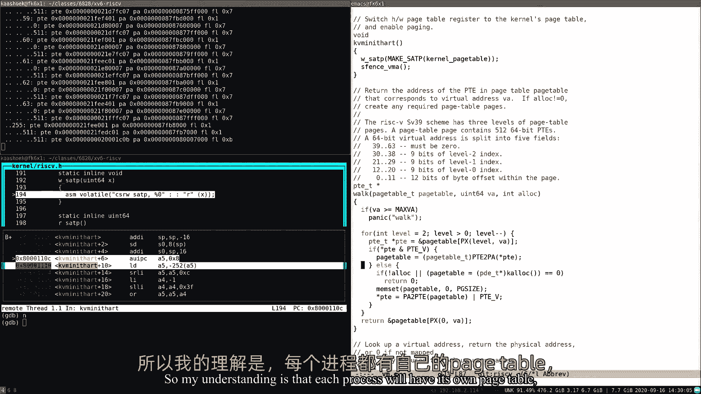

# 🧠 课程 P3：第4讲 - 页表

在本节课中，我们将要学习虚拟内存的核心机制——页表。我们将探讨地址空间的概念、RISC-V架构下的分页硬件如何工作，以及XV6操作系统是如何设置和使用页表的。通过理解这些内容，你将掌握实现内存隔离的关键技术。

---

## 🎯 概述：为什么需要虚拟内存？

虚拟内存的一个主要驱动力是实现隔离。我们希望用户应用程序（如shell、cat等）与操作系统内核之间，以及应用程序彼此之间，能够互不干扰地运行。具体到内存方面，我们需要实现内存隔离。

默认情况下，如果没有采取任何措施，我们就没有内存隔离。所有程序（内核和应用程序）的代码和数据都存储在同一个物理内存（DRAM）中。例如，如果cat程序错误地向地址1000写入数据，而这个地址恰好是shell程序内存的起始位置，那么就会破坏shell的运行，这显然是不可接受的。

我们的目标是让每个应用程序（包括内核）都拥有自己独立的地址空间。这样，当cat程序引用自己的地址1000时，它实际上是在引用自己地址空间内的1000，而不是shell地址空间内的1000。每个程序都在自己的地址空间中运行，无法直接访问其他程序的内存，从而实现了强隔离。

接下来的问题是如何在单一的物理内存上复用所有这些不同的地址空间。最常用且灵活的方法是使用页表。

---

## ⚙️ 分页硬件与地址转换

页表的实现依赖于硬件的支持，具体由处理器中的内存管理单元（MMU）负责。

以下是地址转换的基本流程：
1.  CPU执行指令（如加载或存储）时，使用的地址是虚拟地址。
2.  这个虚拟地址被发送到MMU。
3.  MMU根据一个存储在内存中的映射表（即页表），将虚拟地址转换为物理地址。
4.  转换得到的物理地址被用来访问实际的物理内存。

CPU视角下，所有启用了MMU后发出的地址都是虚拟地址。为了进行转换，MMU需要一个表（页表）。这个映射关系非常灵活：一侧是虚拟地址，另一侧是对应的物理地址。

页表本身也存储在物理内存中。CPU有一个特殊的寄存器（在RISC-V中称为SATP），它存储了当前活动页表根目录的物理地址。操作系统通过切换SATP寄存器的内容，来为不同的进程加载其对应的页表，从而实现地址空间的切换。由于修改SATP是特权指令，只有内核代码才能执行此操作，这保障了隔离性。

---

## 📄 页表的具体结构

如果为每一个可能的虚拟地址都设置一个映射条目，那么页表将变得异常巨大（在64位系统中是2^64个条目），这是不现实的。

因此，实际的实现采用了分页和分级页表的方式。

### 分页
硬件以页为单位进行地址转换。在RISC-V中，一个页的大小是4KB（4096字节）。虚拟地址被拆分为两部分：
*   **页号**：用于在页表中查找对应的物理页帧。
*   **页内偏移**：用于在找到的物理页帧内定位具体的字节。

**公式**：`物理地址 = 物理页帧号 * 页大小 + 页内偏移`

在RISC-V Sv39方案中，只使用64位虚拟地址中的低39位，因此虚拟地址空间最大约为512GB。物理地址则使用56位。

### 多级页表
为了更高效地管理稀疏的地址空间，RISC-V采用了三级页表结构。39位的虚拟地址（除去12位偏移后剩余的27位）被分为三个9位的索引：
1.  **第一级索引**：在根页目录（由SATP指向）中查找，得到一个中间页目录的物理地址。
2.  **第二级索引**：在中间页目录中查找，得到一个页表的物理地址。
3.  **第三级索引**：在页表中查找，最终得到目标物理页帧的地址。

每一级页目录的大小都是一个页（4KB），每个条目（PTE）是8字节，因此一个页目录可以容纳512个条目。

这种分级结构的优势在于，如果地址空间的大部分区域未被使用，相应的中间页目录和页表就无需分配，节省了大量内存。

---

## 🏷️ 页表条目（PTE）与标志位

每个页表条目（PTE）是一个64位的字，其结构如下：
*   **44位**：物理页帧号。
*   **10位**：保留给未来扩展。
*   **10位**：标志位。

重要的标志位包括：
*   **V (Valid)**：该PTE是否有效。
*   **R (Read)**：是否允许读此页。
*   **W (Write)**：是否允许写此页。
*   **X (Execute)**：是否允许从此页执行指令。
*   **U (User)**：用户模式下的程序是否可以访问此页（与内核页区分）。

如果访问一个`V=0`的页，或者以不允许的方式（如写入一个`W=0`的页）访问，硬件会触发一个页错误异常。

---

## 🚀 加速转换：TLB

一次内存访问理论上需要三次内存读取（遍历三级页表），这看起来开销很大。为了解决这个问题，处理器内部有一个称为**转址旁路缓冲器（TLB）**的缓存。

TLB缓存了最近使用过的虚拟地址到物理地址的映射。当CPU需要转换一个虚拟地址时，它首先查找TLB。如果命中，则直接获得物理地址，无需访问内存中的页表；如果未命中，则进行完整的页表遍历，并将结果存入TLB。

当操作系统切换页表（例如进行上下文切换）时，旧的TLB条目可能失效。因此，内核必须通知硬件刷新TLB。在RISC-V中，这条指令是`sfence.vma`。

---

## 🖥️ XV6中的内核地址空间布局

上一节我们介绍了页表的基本硬件机制，本节中我们来看看XV6操作系统是如何具体设置和使用页表的。

XV6为内核设置了一个虚拟地址空间，其到物理地址的映射大部分是**恒等映射**，即虚拟地址和物理地址数值相同。这简化了初始设置。

以下是XV6内核地址空间的关键部分及其映射和权限：
*   **内核文本（代码）**：映射为可读、可执行，但不可写（`R|X`）。防止内核代码被意外修改。
*   **内核数据**：映射为可读、可写（`R|W`）。存储内核的全局变量等。
*   **设备内存**：将物理内存中映射给I/O设备（如UART、磁盘控制器）的区域映射到内核地址空间的高端，以便内核通过加载/存储指令与设备通信。
*   **内核栈**：每个进程都有一个独立的内核栈。为了检测栈溢出错误，XV6在内核栈下方设置了一个**守护页**，该页的PTE无效（`V=0`）。如果内核栈溢出，会立刻触发页错误，而不是破坏其他内存。
*   **蹦床页面**：映射在内核地址空间的最顶端，用于在用户态和内核态之间安全切换。

一个有趣的特点是，通过页表，**同一个物理页可以被映射到多个虚拟地址**。例如，内核栈所在的物理页，既被恒等映射到低地址区域，也被映射到高地址区域（带有守护页）。

---

## 🔍 深入代码：XV6的页表初始化

让我们通过XV6的代码来具体看看页表是如何建立的。

在`main`函数中，`kvminit()`函数负责设置内核的页表。它的主要步骤是：

1.  **分配根页目录**：调用`kalloc()`分配一个物理页作为根页目录，并清零。
2.  **映射各个区域**：通过`kvmmap()`函数，将内核需要访问的各个物理地址区域（如设备I/O、内核文本、内核数据、空闲内存等）逐一映射到内核的虚拟地址空间。
3.  **启用分页**：在`kvminithart()`函数中，将设置好的根页目录的物理地址写入当前CPU核心的`SATP`寄存器，并执行`sfence.vma`刷新TLB。从此以后，CPU发出的所有地址都将通过这个新页表进行转换。

`kvmmap`函数的核心是`walk`函数，它模拟了硬件MMU的页表遍历过程，根据虚拟地址找到或创建对应的PTE，然后由`kvmmap`设置该PTE的物理页帧号和标志位。

**关键点**：在写入`SATP`寄存器启用分页的**瞬间**，CPU对地址的解释方式发生了根本改变。之后执行的指令地址（程序计数器PC）也将作为虚拟地址进行转换。XV6能够平稳过渡，正是因为它预先建立了一个恒等映射的页表，使得启用分页后的第一条指令的虚拟地址能正确转换到其物理地址所在位置。

---

## 📝 总结

本节课中我们一起学习了虚拟内存和页表的核心知识。

我们首先了解了虚拟内存的目标是实现内存隔离，为每个进程提供独立的地址空间。然后，我们深入探讨了RISC-V架构下分页硬件的机制，包括如何通过多级页表将虚拟地址转换为物理地址，以及PTE中标志位的作用。我们还介绍了用于加速地址转换的TLB及其维护要点。

最后，我们分析了XV6操作系统内核地址空间的具体布局和初始化过程，看到了恒等映射、守护页等实际应用，并通过代码理解了页表从建立到启用的完整流程。

理解页表是掌握现代操作系统内存管理的基础，它不仅是实现隔离的基石，也为后续学习页错误处理、内存共享、写时复制等高级技巧提供了强大的支持。