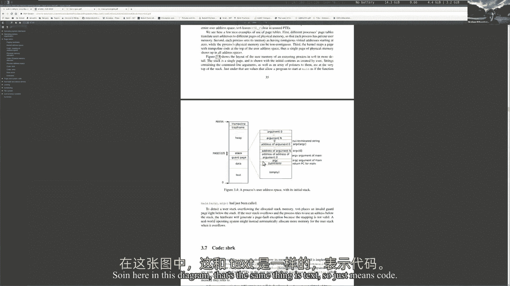
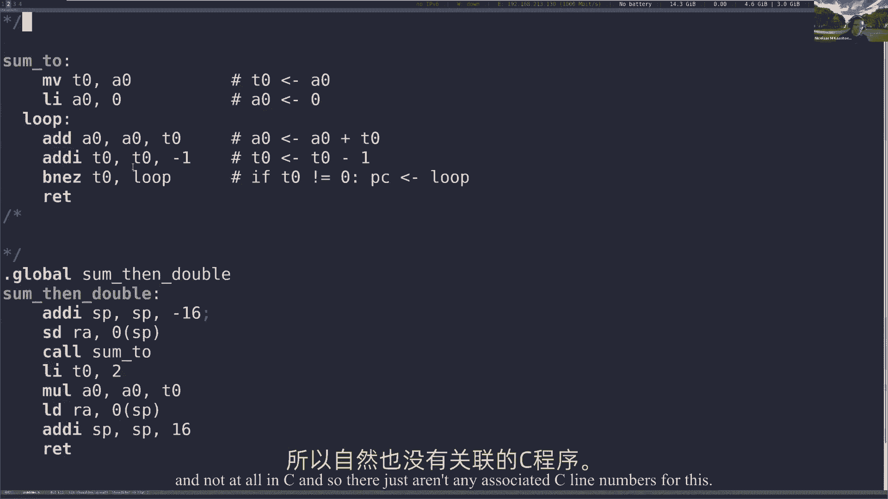
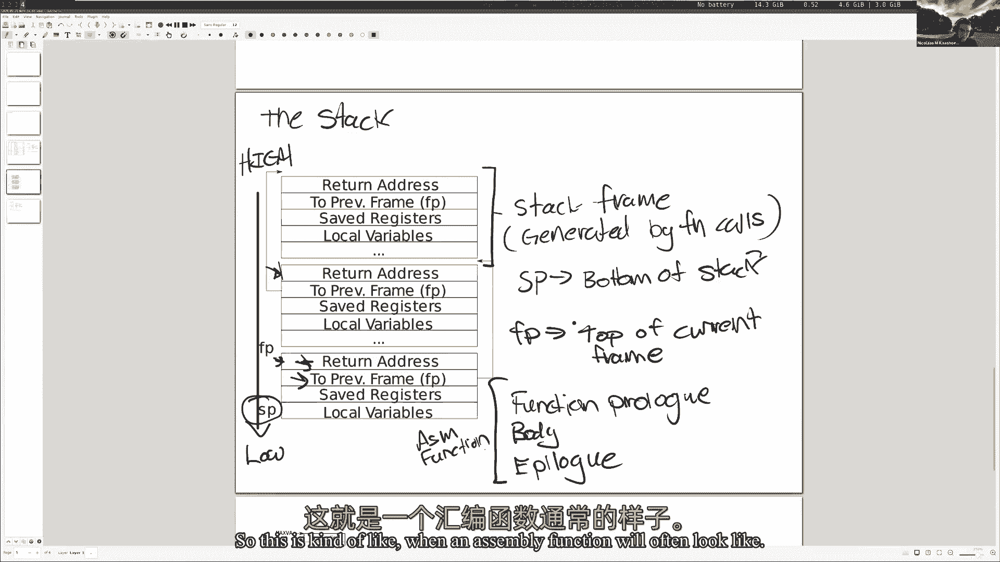
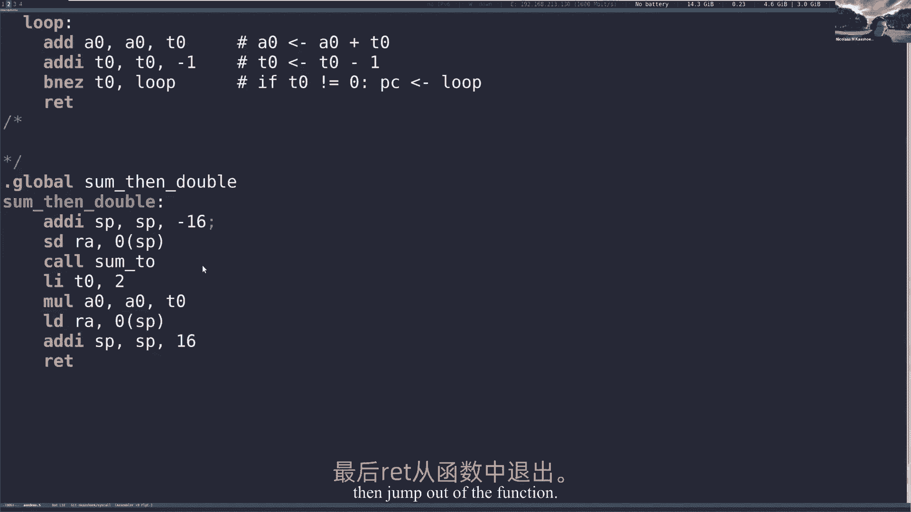
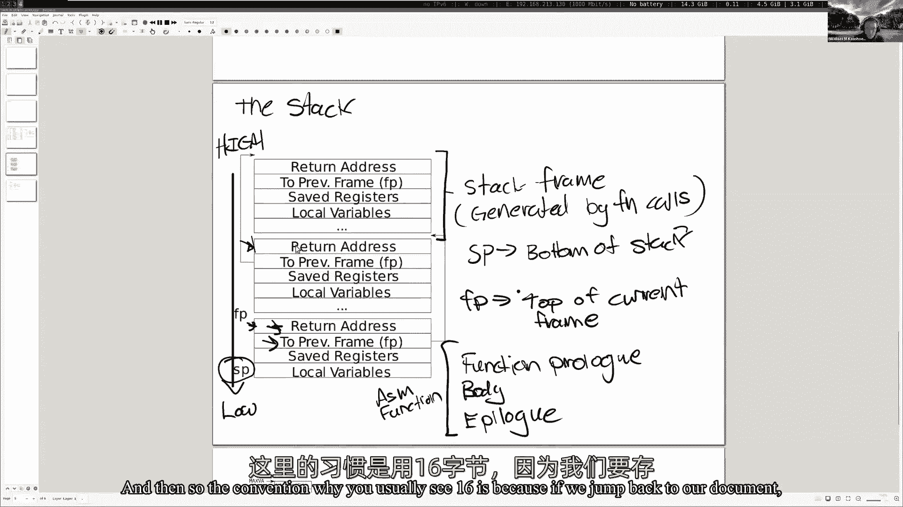
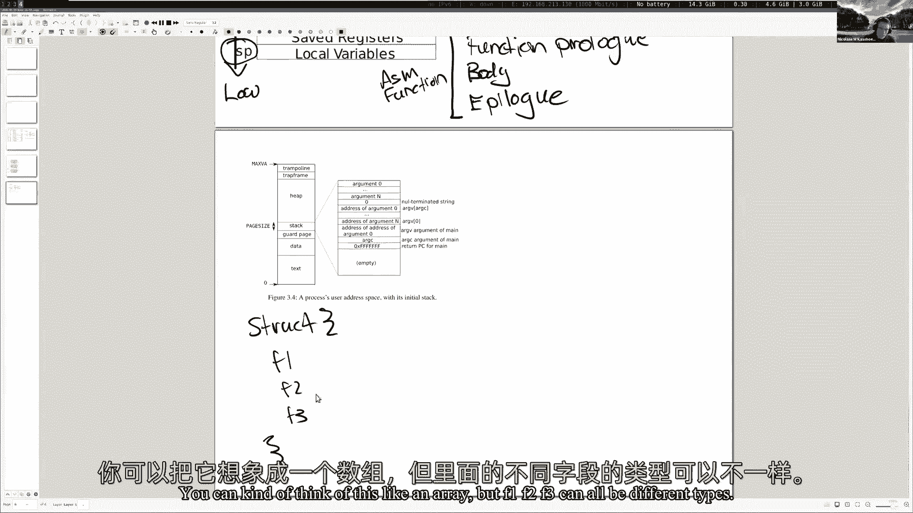

# 课程 P4：第5讲 RISC-V 调用约定与栈帧 🧱

在本节课中，我们将要学习 RISC-V 处理器的汇编语言、调用约定以及栈帧的工作原理。这对于理解操作系统内核中的陷阱处理和调试至关重要。

## 概述 📋

处理器执行的是汇编语言，而不是我们直接编写的 C 语言。C 代码需要被编译成处理器能够理解的汇编指令。RISC-V 是一种精简指令集（RISC）架构，与 x86 等复杂指令集（CISC）架构不同，它的指令集更小、更简单。本节课我们将深入探讨 RISC-V 汇编、函数调用时寄存器的使用规则（调用约定）以及栈帧在内存中的布局。

## 从 C 语言到汇编 🔄


C 语言代码通过编译器转换为汇编语言，最终成为处理器可以执行的二进制机器码。这个过程对于所有编译型语言（如 C++）都是类似的。汇编语言的结构性远不如 C 语言，它由一行行简单的指令（如 `add`, `sub`）和标签组成。

**示例：一个简单的 C 函数及其汇编**
```c
// C 代码：计算从 0 到 n 的累加和
int sum(int n) {
    int acc = 0;
    for (int i = 0; i < n; i++) {
        acc += i;
    }
    return acc;
}
```
对应的 RISC-V 汇编核心逻辑可能类似于：
```assembly
# 假设 n 的值在寄存器 a0 中，结果将放回 a0
mv t0, a0   # 将 n 的值移动到临时寄存器 t0
li a0, 0    # 将累加器 a0 清零
loop:
    beqz t0, end  # 如果 t0 为 0，跳转到结束
    add a0, a0, t0 # 累加
    addi t0, t0, -1 # t0 减 1
    j loop         # 跳回循环开始
end:
    ret            # 返回
```


在汇编文件中，`.global` 指令使得该函数可以被其他文件调用，`.text` 段则用于存放代码。

## RISC-V 架构简介 ⚙️


RISC-V 是一种开源的精简指令集架构。与庞大的 x86-64 指令集相比，RISC-V 的核心指令集更小，文档也更简洁。RISC-V 指令集采用模块化设计，包含一个基础整数指令集（I），并可以选择性地添加其他扩展模块（如 F 用于单精度浮点）。


**关键区别：**
*   **RISC（如 RISC-V, ARM）**：指令数量少，每条指令执行的操作简单、周期短。
*   **CISC（如 x86-64）**：指令数量庞大，包含许多执行复杂操作的指令，强调向后兼容性。




尽管 x86-64 在个人电脑中占主导地位，但 RISC 架构在移动设备（如 ARM 处理器）和嵌入式领域无处不在。RISC-V 作为新兴的开源架构，正获得越来越多的关注和支持。

## 寄存器与调用约定 📊

寄存器是 CPU 上用于存储数据的高速存储单元。汇编指令主要在寄存器上进行操作。RISC-V 有 32 个通用寄存器（x0-x31），每个宽 64 位。

以下是部分重要寄存器及其在调用约定中的用途：





| 寄存器 | ABI 名称 | 描述 | 保存者 |
| :--- | :--- | :--- | :--- |
| x0 | zero | 硬连线为零 | - |
| x1 | ra | **返回地址** | 调用者 |
| x2 | sp | **栈指针** | 被调用者 |
| x3 | gp | 全局指针 | - |
| x4 | tp | 线程指针 | - |
| x5-x7 | t0-t2 | 临时寄存器 | 调用者 |
| x8-x9 | s0-s1 | 保存寄存器 | 被调用者 |
| x10-x17 | **a0-a7** | **函数参数/返回值** | 调用者 |
| x18-x27 | s2-s11 | 保存寄存器 | 被调用者 |
| x28-x31 | t3-t6 | 临时寄存器 | 调用者 |

**调用约定核心规则：**
*   **函数参数**：前 8 个参数使用寄存器 `a0-a7` 传递，更多参数则通过栈传递。
*   **返回值**：使用 `a0` 和 `a1` 寄存器返回。
*   **调用者保存（Caller-saved）**：如 `ra`, `a0-a7`, `t0-t6`。调用函数前，如果调用者希望这些寄存器的值在调用后保持不变，**调用者**需要自行保存它们。
*   **被调用者保存（Callee-saved）**：如 `sp`, `s0-s11`。如果被调用的函数要使用这些寄存器，**被调用者**必须保证在返回前恢复其原始值。


理解“调用者保存”和“被调用者保存”对于编写和调试汇编代码至关重要，可以避免寄存器值被意外覆盖。

## 栈与栈帧 🥞

栈是一种后进先出的内存区域，用于支持函数调用。每次函数调用都会在栈上分配一个**栈帧**，用于存放局部变量、保存的寄存器以及调用信息。

**栈帧典型布局（从高地址向低地址生长）：**

```
高地址
+-------------------+
| 调用者的栈帧       |
| ...               |
+-------------------+
| 参数 n (可选)      | <-- 当寄存器不够时
+-------------------+
| 返回地址 (ra)      |
+-------------------+
| 旧的帧指针 (fp)    |
+-------------------+
| 保存的寄存器 (s0..)|
+-------------------+
| 局部变量           |
+-------------------+
| ...               | <-- 当前栈指针 (sp)
低地址
```

**关键寄存器：**
*   **栈指针 (sp)**：总是指向当前栈帧的底部（最低地址）。
*   **帧指针 (fp/s0)**：通常指向当前栈帧中保存旧 `fp` 的位置，为访问栈帧内容提供稳定的基准点。



函数通常以**序言**开始，分配栈空间并保存 `ra` 和 `fp`；以**尾声**结束，恢复寄存器并释放栈空间。




**示例：一个非叶子函数的汇编序言与尾声**
```assembly
double_and_sum:
    # 序言
    addi sp, sp, -16   # 在栈上分配16字节空间
    sd ra, 8(sp)       # 保存返回地址
    sd fp, 0(sp)       # 保存旧的帧指针
    addi fp, sp, 16    # 设置新的帧指针

    # 函数体...
    call sum           # 调用另一个函数

    # 尾声
    ld ra, 8(sp)       # 恢复返回地址
    ld fp, 0(sp)       # 恢复旧的帧指针
    addi sp, sp, 16    # 释放栈空间
    ret                # 返回
```
如果省略序言（如不保存 `ra`），函数返回时将跳转到错误的地址，导致程序崩溃或进入死循环。

## 使用 GDB 调试汇编 🐛




GDB 是强大的调试工具，可以单步执行汇编指令、检查寄存器和内存状态。

**常用命令：**
*   `layout asm` / `layout src` / `layout reg`：切换显示汇编、源代码或寄存器窗口。
*   `break *address` / `break function`：在地址或函数处设置断点。
*   `stepi (si)` / `nexti (ni)`：单步执行一条汇编指令。
*   `info registers` / `i r`：查看所有寄存器内容。
*   `x/10x address`：以十六进制检查内存地址开始的内容。
*   `backtrace (bt)` / `frame n`：查看调用堆栈和切换栈帧。
*   `watch variable`：设置观察点，当变量改变时暂停。
*   `break ... if condition`：设置条件断点。

通过 GDB，我们可以直观地观察函数调用时栈帧的变化、寄存器的保存与恢复，以及参数和返回值的传递过程。

## 结构体在内存中的布局 🧩

结构体在内存中是一块连续的区域，其字段按照声明的顺序依次存放。结构体通常通过引用（指针）传递给函数。

**示例：检查结构体内容**
```c
struct Person {
    int id;
    int age;
};
```
在 GDB 中，如果 `p` 是一个指向 `Person` 的指针，可以使用 `print *p` 来查看其字段，或使用 `x` 命令检查其内存布局。


## 总结 🎯



本节课我们一起学习了 RISC-V 汇编的基础、调用约定以及栈帧的管理。我们了解到：
1.  C 代码如何被编译成处理器执行的 RISC-V 汇编指令。
2.  RISC-V 寄存器的用途和调用约定中“调用者保存”与“被调用者保存”的关键区别。
3.  栈帧是如何在函数调用过程中被创建和销毁的，以及 `sp` 和 `fp` 寄存器的作用。
4.  如何使用 GDB 调试器来深入观察和分析汇编代码的执行过程、寄存器状态和内存布局。


掌握这些知识对于理解和完成后续关于陷阱（trap）和系统调用的实验至关重要。