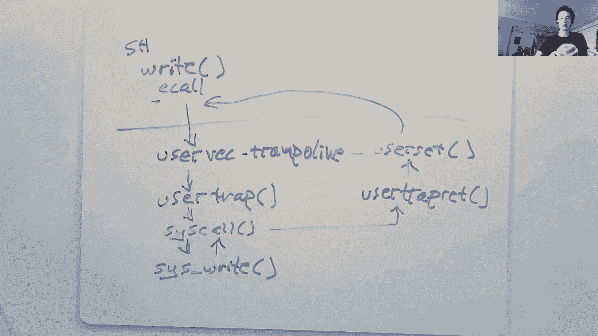
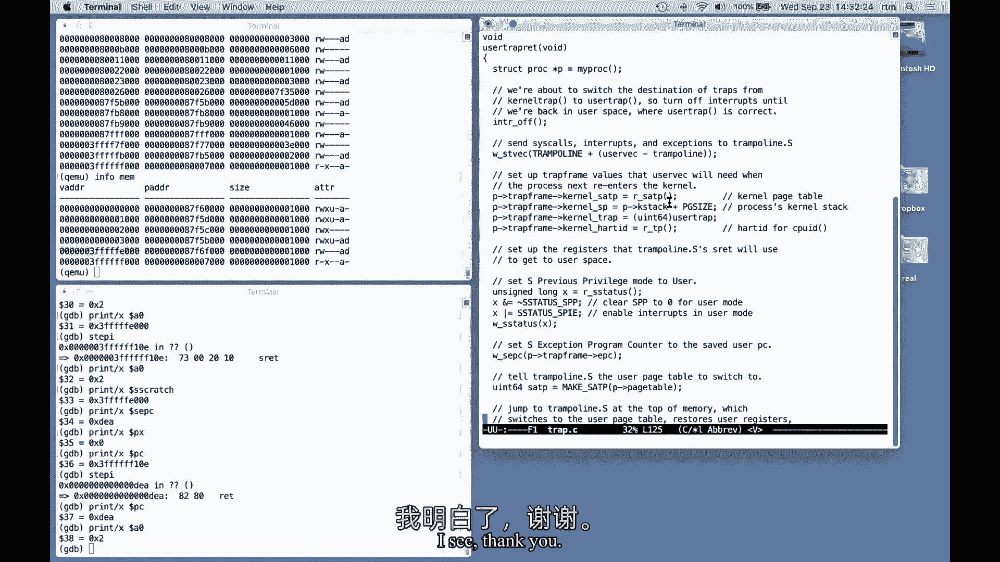

# P5：Lecture 6 -  Isolation & System Call Entry_Exit 中文版 - MCATIN-麦可汀留学 - BV1rS4y1n7y1

我想先开始，能不能呃，有人能听到我吗，是呀，好，非常感谢，今天一切都好，我想谈谈运行和用户代码之间的过渡，在用户代码中运行程序并在内核中执行，这就是每当程序进行系统调用时必须发生的转换。

或者如果它经历了故障，像页面错误或除以零，或者如果一个设备，um决定中断，需要由内核设备驱动程序提供服务，嗯，有很多精心设计和重要的细节，这些从用户到内核的陷阱是如何发生的，细节对于执行隔离非常重要。

安全性和性能，有很多程序转换到内核，由于系统调用或页面错误，陷阱机构尽可能流线型是非常重要的，所有的权利，所以开始的情况很熟悉，或者我们有我们的用户程序，我将以外壳为例，它在用户空间中运行，我们有内核。

shell想要做的是对内核进行系统调用，我将使用write并使用这个shell写它的提示符，启动xpsix后发生的第一次写入，并使用shell尝试写入，以正确的系统调用为例。

所以我们需要弄清楚如何真正让执行转移，在shell中和具有用户权限的用户空间中运行，以主管权限在内核中运行，硬件的状态是，这将是非常重要的，因为我们所做的很多事情都是在改变硬件状态。

从适合运行用户代码的状态到适合运行内核代码的状态，我们关心的状态，现在最大的状态可能是三个两个用户寄存器，当你记得这个的时候，从星期一的讨论中，我们有所有的用户寄存器，像零和一这样的东西。

风险五有很多这三个--总共有两个，我们可以期望用户代码正确地使用所有这些，如果它使用所有这些，它将获得最高的性能，它们中的许多都有特殊的用途，其中一些我们会看到一个特别有趣的是堆栈指针。

实际上是这三个通用寄存器中的一个，好的，我们有这些寄存器，包括堆栈指针，在硬件中有一个单独的程序计数器寄存器，有当前模式，主管或用户，当然是用户模式，当我们在壳里执行任务时，然后有一堆寄存器。

控制CPU工作方式的特殊寄存器，有一个SAT P寄存器，它包含一个指向页表的指针，结果会是，还有其他几个对这次讨论非常重要，有一个STVAC，也就是处理内核中陷阱的指令。

我们会看到另一个叫Scratch的，这也是非常重要的，这是系统调用时正在运行的机器的状态，我们实际上需要改变很多这种状态，或者对国家做事情，作为进入内核的一部分，设置我们自己在内核中运行普通的C函数。

当然是在陷阱的瞬间，CPU的所有状态都设置为运行用户代码，不是不是内核代码，所以需要发生的事情是对，我要说什么，一个是我们需要保存所有三个两个寄存器，因为我们希望透明地恢复用户代码。

尤其是如果有设备中断，用户代码不期望的，我们希望能够让内核为中断服务，然后在没有注意到任何差异的情况下恢复用户代码，这意味着这三个，两个寄存器不能被内核干扰，因为内核需要使用寄存器。

它得先把它们都救在某个地方，这些需要保存，程序计数器也需要保存在某个地方，因为我们需要，你知道，它是一个用户，它几乎就像一个用户注册，所以我们需要继续执行它停止的用户程序，我们需要把模式切换到主管模式。

因为我们需要使用内核中的各种特权，这是一个页表指针当前指向用户页表，它只包含，嗯，只是用户程序需要的映射，加上一两个我们将看到的，但是用户页表不包含大部分内核数据的映射，因此，在运行大多数内核代码之前。

我们需要切换页表，我们需要将堆栈指针切换为指向堆栈，在内核的某个地方，因为我们需要将调用C函数堆叠在，最后我们需要跳入一次，我们设置了所有这些，交换了所有这些，所有这些资源都适合在内核中使用。

我们需要跳转到内核C代码，一旦我们在C代码中，嗯，生活要多得多，一切如常，我们只是在这个内核中运行一个C程序，嗯，所以今天至少我们会，我们稍后会讨论内核在C代码中的作用。

但今天的讨论实际上是如何从用户空间进入内核，我们可以在内核中运行C代码，有几个高层次的目标限制了我们的设计选项，对于这一个是为了安全和隔离，我们真的不想让用户代码干扰。

以一种可能损害安全性的方式进行用户内核转换，所以这意味着陷阱中涉及的硬件和内核机制，真的不能指望用户空间的任何东西，你知道我们不能对这些寄存器做任何假设，它们可能只是充满了可怕的恶意价值观，所以基本上。

xpsix表带处理程序甚至没有真正查看这些寄存器，它只是把他们救了出来，好的，所以我们要小心在这个陷阱机制中保持隔离，针对故意恶意用户代码，另一件重要的事情是，我们希望对用户代码透明。

我们希望能够抓住这个陷阱，在内核中做我们的业务，并在没有用户代码的情况下恢复用户代码，曾经注意到任何有趣的事情发生了，这只是为了更容易地编写用户代码，值得注意的事情，嗯，我们关心隔离和安全。

今天我们要谈谈，涉及进入内核的安全性方面，但当然，称为实现的系统，你知道，内核中实际正确的实现也，内核中的一切都必须小心，还必须写得仔细和安全，所以你知道，即使向内核的转换是完全安全的。

内核的其余部分都必须安全地编写，并注意，用户代码可能试图欺骗它，我想说的特别重要的一点是模式标志控制，此模式是用户或主管，当然，当我们处于用户空间时，它是用户，模式标志设置为监督员。

当我们在内核中执行时，但重要的是要确切地知道我们获得了什么特权，通过将模式从用户改为主管，事实证明，这些额外的掠夺是相当严格的，这就是你在主管模式下可以做的，在用户模式下不能做的不是，也许和，特权。

你可能会这么想，这是主管模式，就像它控制的东西一样，它做的一件事是你现在可以读写控制寄存器，也就是说，如果你处于主管模式，您可以读写SAT P页表指针，这个ST VEC指针，它控制陷阱在内核中的位置。

嗯，在此暂存器中的陷阱期间保存程序计数器的寄存器，加上其他几个，所以主管不能读写这些登记簿，用户代码无法，监管代码唯一能做的就是它可以使用p，嗯，有PTE U旗设置，我不知道你记不记得。

但是在每个页表条目中有一个PU标志要设置或不说，嗯，一面旗帜上有这个对不起，对不起，你可以用p，呃，没有设置PTE U标志的，如果设置了PTE U标志，这意味着用户代码可以使用页表项。

如果页表项中没有设置此标志，意思是只有主管模式才能使用，你知道我们一会儿就会知道这很重要，但是嗯，这些真的是主管模式唯一能做的事情，它不能做其他特别的事情，比如说，嗯，主管模式代码不能只读写任意地址。

嗯，说物理地址，强制执行页表的无主管模式，就像任何其他代码一样，如果页面中没有虚拟地址，它不是在SAT P指向的当前页表中吗，或者如果它设置了PTE U位标志，这意味着它是用户PPE。

那么主管模式代码不能使用该地址，所以我们甚至处于监管模式，被限制在任何虚拟地址，在当前页表中设置了虚拟地址，就是这样，所以我们只被允许做这些事情，所以你知道，我们将看到这是对陷阱代码所能做的重要限制。

当我们进入内核时，什么都不能做，我要预览一下，我将把这堂课的大部分时间花在gdb上，实际上通过执行进入内核的陷阱条目来跟踪，作为回报，会有很多细节，呃，也许能帮你，嗯，预见未来。

我们将追踪shell调用，那个，从外壳的角度来看，只是作为shell一部分的C函数调用，嗯，事实上，赖特，让这个，uh可能通过发出e call指令来发出系统调用，切换到内核和主管模式，它立即去哪里。

这是在内核中执行的第一条指令，在主管模式下是在一个用汇编程序编写的名为user back的函数中，这是蹦床的一部分，在蹦床的内核源代码中，所以执行的第一个代码，这个用户反向汇编程序函数，接下来。

那个汇编器函数跳转到C代码中，特别是trap c中称为user trap的函数，现在我们把它变成C代码，所以事情就容易理解多了，用户陷阱看到，哦，我们正在执行一个系统调用。

它调用一个名为syscall的函数，它在表中查找系统调用号，并在内核中调用特定的函数，实现系统调用的，对我们来说，这将是正确的，做这个生意，碰巧，你知道的，安排写入的任何字节出现在控制台上，当它完成时。

它返回到这个系统调用函数，然后打开系统调用函数，以便返回用户空间，因为我们想在Z呼叫后继续，有一堆东西，我们将看到为了返回用户空间，必须发生这种情况，所以有一个单独的函数叫做user，捕鼠。

它是用c写的，它在C陷阱里，这一部分返回到用户空间，用C代码做很方便，有一些最后的事情真的只能在汇编代码中完成，代码是用汇编程序编写的，它又出现在蹦床页面中，在一个名为user r的函数中，到最后。

一些必须发生的最后组装事情，最后，此汇编函数发出返回用户空间的机器指令，并在E调用后恢复执行，有人想回答吗，问一个关于，我即将切换到用GDB看东西，关于那种高级图片有什么问题吗，我会很抱歉的，我不能。

让我看看RVM是什么模式，在mlc函数中运行的c函数，里面的一切都是内核的一部分，它运行在主管模式下，我有一个，好的，有人问为什么这些函数是这样命名的，命名有点灾难，明年我决心让他们更加理性。

我想命名问题可能更喜欢寄存器的名称，在上一个董事会，除此之外，有五个人选这些名字，嗯，有人问，vm lc函数不直接访问物理内存吗？这是千真万确的，他们被允许那样做的原因是什么，虽然。

内核仔细地在页表中设置直接映射，页表里有很多很多的PDS，这导致每当内核试图读取或写入物理地址时，它实际上是一个虚拟地址，由内核页表翻译，物理地址等于它发出的虚拟地址，所以在内核里超级方便。

一旦您使用内核页表，因为内核有所有这些直接映射，但在我们设置好电流之前，直到陷阱机制切换到内核页表，这些映射都不可用，直到内核陷阱代码切换到内核页表，我们仍然使用用户页表，它没有这些方便的物理地址映射。

嗯，我能问个问题吗？拜托了，嗯所以，嗯，我不知道这可能和刚才说的不太相关，但是嗯。

读写系统调用权利，就像那些很贵，与仅仅是内存存储相比，因为你必须切换模式，来回，当你打开一个文件时，是否可以只喜欢而不是什么时候，而不是取回用系统调用的文件描述符，调用以获取页表映射。

然后你会写信给某个地址，刚刚映射到设备的，你可以设置限制，这样程序只能写给DEA，喜欢文件描述符，它被允许，允许通过虚拟页表映射，而不是跳转到内核再返回，是啊，是啊，这是一个很好的观察，事实上。

许多操作系统都提供了这一点，所谓内存映射文件访问，其中您确实映射了与文件内容相对应的页面，进入，进入您的虚拟，进入用户虚拟地址空间，所以你可以直接通过记忆读写它们，事实上。

您将在mmap实验室中实现它的一个版本，几周后，而且确实，就像你暗示的那样，对许多程序来说，这比调用媒体要快得多，我要切换到GDB世界，在这一点上，每个人都应该，查看我的屏幕共享。

我们将看到一个XV系统调用右边，shell在其初始提示符的右边，通过系统，您可以在h c中看到启动此操作的用户代码，我在展示这里只是在进行正确的系统调用，用这个美元符号提示，让我点燃。

当用户代码时实际会发生什么，当贝壳叫对的时候，对的只是一个，它是一个库函数，是，连接到外壳里的，你可以在udot s中看到它的来源，所以是这几个说明，下面是shell实际调用的正确函数的实现。

这是一个很短的函数，它所做的就是加载到一个7 a数字cis正确，或者只是象征性地定义为十六岁，告诉内核，我想运行第十六个系统调用，这恰好是对的，然后这个小函数使用e call指令。

这实际上是将代码送入内核的原因，内核做这个事情，然后当内核最终完成时，它返回到用户空间执行指令，在E电话之后，也就是返回到外壳，从右边的库函数返回到shell中，为了显示系统调用，我想做的是。

这其中的一部分，我先在e调用指令上加一个断点，我们需要知道它的地址，当然啦，但我们可以通过查看s h a m来发现这一点，xpsix编译过程产生的，和一个X H ASM，有一个带有，外壳的说明。

所以我要在e调用指令上加一个断点，地址是6号，非常好，我实际上要开始X6运行，我希望系统能破壳而出，就在执行调用之前好的，非常好，嗯，我们现在，你可以从GDB看到，我们即将，我正要执行那个e呼叫。

让我们检查一下，我们在我们认为我们在的地方，让我们打印，我们可以打印程序计数器，这是一个零xd6，正是我们所要求的，嗯，我们也可以打印所有三个两个寄存器，其中一些值，我们不知道的一切。

我们不在乎他们是什么，而是一个零，1和2是shell正确传递的三个参数，所以这些参数是文件描述符，零中有两个，我是指针，到shell要写入的字符缓冲区，以及它想用2写的字符数，嗯，我们可以说服自己。

我们正在寻找，呃，我们认为我们正在查看的代码实际上是通过打印出来的，shell要写入的缓冲区中的字节，事实上，它是一个美元符号和一个空间，所以我们在系统调用中，我们希望注意到一件事。

程序计数器和堆栈指针都位于低地址，地址接近于零，这加强了我们的信念，我们仍在执行，在用户和用户地址空间中，所有的地址都很小，一旦我们进入内核，你看，地址实际上是内存中加载得更高的内核。

系统调用的点切换了很多状态，必须改变的最重要的状态之一，在它被切换之前，我们必须接受的是当前的页表，当然我们可以看看SAT P，但我们得到的只是物理内存中的地址，页表实际上并没有告诉我们映射是什么。

页表是什么样子的，嗯幸运的是，QMU中有一种方法可以要求它打印当前页表，如果我打印控件A C，我进入Q MU监视器或控制台，如果我输入信息M，它会打印出完整的页表，这是一个很小的页表，它只包含六个映射。

当然是外壳的页表，shell是一个相当小的程序，这六个映射按照shell指令的顺序，外壳的数据，无效的页面，访问堆栈，保护页，以防shell试图使用太多的堆栈空间，我们可以看到它是无效的。

因为它没有在这里设置U旗，在此属性或标志列中，这些都是PTE下划线标志，rw和x只是控制，是否可以读取、写入或执行页面，下一个专栏是你，这就是PTE U旗是否设置。

用户代码只能获取设置了U标志的PD条目，我不知道下一栏是什么，我不得不承认，下一列是一个页面表条目是否曾经被使用过，及d是否曾发出或书面发出，此地址，好的，所以我们有一个很小的页面，和最后两个页表项。

顺便说一句，在巨大的虚拟地址上，接近非常接近虚拟地址空间顶部的，这就是你在书中读到的这两个，我们将听到更多关于陷阱框架页面的信息，现在蹦床页面，正如你所看到的，他们都没有设置U位。

所以用户代码无法获得这两者中的任何一个，现在不能使用这两个地址中的任何一个，但是一旦我们结束了我们的主管模式，我们可以得到这两页，所有的权利，当他们得知这个页表是，内核中没有任何映射。

你知道没有物理地址映射，没有内核数据或内核指令的映射，或者其他任何东西，除了最后两个，现在是最后两页，这是一个几乎完全专用于用户执行的页表，并且对于执行内核并不直接特别有用，什么是，什么是。

属性上的属性，在顶部列出的页表上，我相信这意味着页表曾经，此页表项曾被代码访问过，那就是它是否曾经发布过引用这个页表项的地址，D是程序是否写过，他们通过这个页表条目做了一个商店。

这些是硬件为了操作系统的方便而维护的位，和比XP更复杂的操作系统，如果物理内存不足，六个可能需要驱逐页面，他们可能需要将一些页内存写入磁盘，嗯，并使页表项无效，以释放物理内存，和许多策略。

你可以想象一个操作系统用来选择哪些页面存在，我们会咨询，一个位，看看这个页表条目是否曾经被使用过，如果没有使用过或最近没有使用过，那么这是驱逐到磁盘的一个很好的候选，它告诉内核，哦。

这一页实际上已经写好了，呃，因为它是从磁盘读取的，xpsix实际上并没有使用这两种方法中的任何一种，其他问题，让我提醒一下我们在哪里，我要打印出右边的内容，我们是对的，中的库函数，呃，在shell中。

程序计数器指向e调用指令，我们即将执行e调用指令，我们还在用户空间，但我们不会太久，嗯，嘣，我执行了e呼叫指令，好的，所以第一个问题是，打完电话后我们在哪里，我们可以看看程序计数器。

我们现在看到的是一个非常低的数字，德六现在是一个非常高的数字，事实上，我们看看程序Counas，虚拟地址，就像所有指示使用的地址一样，我们可以在页表中查看，其实，让我们检查一下页表，以确保。

我再去问Q MU要我的信息，这是相同的页表，所以那里什么都没变，我们将在那里查找新的当前程序计数器，程序计数器在右边，在这个蹦床页的开头，那是很高的地图，在用户内存中，我们正在执行。

我们可以看到那里的说明，我要用，这是说明书，内核开始时在监管模式下执行的第一条指令，在陷阱的开始，通过GDB中的一些怪异，我们实际上已经执行了本页开头的第一条指令，我们即将执行第二条指令。

我们可以看看寄存器，我不知道你是否记得这些寄存器值，但这里什么都没变，这些是用户程序所拥有的完全相同的寄存器内容，所以这些都充满了他们中的许多人或所有人的用户价值，为所有人，我们知道。

它们是唯一存在这些价值的位置，所以我们要非常小心，在这一点上，我们实际上不能使用任何寄存器，不首先将这些寄存器保存在某个地方，这样我们就可以恢复它们，因为如果内核在这一点上使用这些寄存器中的任何一个。

它会覆盖，无论用户价值是什么，然后如果我们试图恢复用户程序，我们将无法用正确的值设置它的寄存器，用户程序会做一些完全错误的事情，问题是的，你能回到你之前的说明面板吗，我想知道C R W，CSR RW。

好的，我们过几分钟再谈这个，但你的问题的答案是指令交换为零，与特殊划痕寄存器的内容，所以在，是啊，是啊，好的，这是非常重要的，基本上回答了这个问题，内核陷阱代码怎么能做任何事情。

如果它不能使用任何寄存器，答案，那个问题是出口吗，真的必须执行这个CSR RW零划痕指令，同时在划痕中保存一个零，碰巧把Scratch加载到零，所以现在内核可以在这个指令之后用0来表示它想要的任何东西。

好的，谢谢，好的，所以我们现在的地址是3 fff f f 0 0 um，最后一页是蹦床页，我们目前正在蹦床页面中执行，其中包含内核陷阱处理代码的第一条指令，Ecall不切换页表，那是打电话很重要的一点。

这意味着，这些最初的指令必须出现在每个用户页表中，因为Z call不会切换页表，我们需要执行内核的第一位，在用户页表的某个地方，是这个蹦床页面，内核仔细地将其映射到每个用户页表中。

这给了内核一个在陷阱开始时执行的位置，当我们还在使用用户页表时，控制的方式，嗯是通过ST VEC寄存器，这是另一个特权寄存器，只能由可写的人读取，由主管，嗯，和内核在进入用户空间之前。

设置tvec以指向内核希望陷阱去的地方，所以你可以看到，内核以前已经将这个ST甲板设置为这个三个FFF，f f f零零零地址，也就是蹦床页的开头，正是这个ST VEC寄存器，它的内容是为什么。

在E电话之后，我们结束了，最后我想提醒你，即使蹦床和陷阱框架页映射到用户页表中，用户地址空间，用户代码无法编写它们，因为P是给他们的，没有PTE U旗，所以它们不受用户代码的影响。

这就是为什么这个把戏是，为什么这个把戏是安全的，我一直在告诉你，假设我们处于主管模式，4。我不知道有什么办法可以直接查出这台机器的运行状态，嗯，但我确实观察到程序计数器当前正在页面中执行。

没有PU旗的蹦床页面，这只能在没有撞车的情况下发生，如果我们是主管模式，所以我从没有撞车推断，和程序计数器的值，我们必须处于监督模式，嗯，我们是怎么到这里的，当然是通过呼叫，真的只是先改变三件事。

从用户到主管的相等呼叫更改模式，第二次，他调用保存程序计数器，在SEC注册，所以我们可以看到打印程序寄存器程序计数器的效果，它肯定不再是用户程序计数器，尽管所有其他寄存器都是，这是从SDC复制的值。

我们也可以打印，呃，被拯救的人，这是主管例外，程序计数器就是它的意思，但这是所有保存用户程序程序计数器的地方，这有熟悉的价值，六，它是e调用指令在用户空间中的地址。

所以我们至少通过E调用保存了一个寄存器，E调用做的最后一件事，它做的第三件事是跳转到stc指向的指令，所以现在需要发生的，他为我们做了一点工作，但事实证明我们离，准备在内核中实际执行普通的C代码。

现在要做的是我们需要保存三个两个用户注册的内容，这样我们以后就可以恢复它们了，当我们现在要恢复用户代码时，我们需要切换到内核页表，因为目前我们使用的是用户页表，我们需要创建一个堆栈或找到一个堆栈。

并将堆栈指针寄存器设置为指向内核堆栈，所以我们可以运行C代码，这需要一个堆栈，然后我们需要跳转到内核中C代码中的某个合理的位置，现在作为一个旁白，你知道的，他的电话对我们没有任何帮助，嗯，你知道的。

但你可以有硬件可以定义e调用来做更多的事情，为我们提供更多这样的步骤，而不是把它们留给软件，我们将看到，在软件中做它们并不特别简单，所以你应该问问自己，为什么E电话不行，更多从用户空间进入内核的工作。

为什么它不保存他们的用户注册，或切换页表查找器以指向内核页表，或者自动将堆栈指针设置为指向内核堆栈，或者直接跳转到内核C代码天哪，而不是要经历所有这些复杂的汇编代码。

实际上已经有机器在硬件上完成了所有这些事情，在系统调用期间，风险五对他们中的任何一个都不起作用，风险五真的，他们采取的态度是，E做了所需的绝对最低限度，它可能做到的事情，把其他一切都留给软件。

原因是因为风险五，设计者希望允许软件有最大的灵活性，操作系统，程序员设计程序操作系统，不管他们喜欢什么，所以你可以想象，xpsix真的没有使用这种自由，但其他操作系统也这样做。

一些软件可以做的事情的例子，因为召唤是如此简单，嗯，也许一些操作系统可以在不切换页表的情况下执行一些系统调用，切换页面页表是昂贵的，如果您调用强制您这样做，嗯，这排除了非常精简的实现的可能性。

对于一些不切换页表的系统调用，嗯，一些操作系统将用户和内核虚拟地址映射到单个页表中，并对用户和内核使用相同的页表，因此，甚至不必切换页表，在用户和内核之间转换时，对他们来说，如果你调用切换页表。

那将是一种浪费，并使事情变慢，也许在某些情况下系统调用，比如说，有些寄存器不必保存，哪些是必须拯救的，这取决于软件，语言和编译器，但通过节省不到三个两个寄存器，可能会节省大量时间。

所以你不想让妮可强迫你，您不一定希望等于强制您保存所有寄存器，最后，对于一些简单的系统调用，可能根本不需要堆栈，对于非常关心性能的操作系统来说，这很好，不会对您强制任何特定的堆栈策略，再说一遍。

有许多聪明的硬件和软件方案非常精简，高性能系统调用和陷阱，因为这些东西的性能非常重要，人们很担心它，回到XP6和风险五，嗯，我们需要做的第一件事是保存一些寄存器，2。我们对五险一金几乎无能为力。

没有几个寄存器，不能使用寄存器，那么，在其他机器上保存用户注册表时，我们有什么选择呢？我们也许可以写出32个寄存器的内容，在物理记忆中方便的地方，我们实际上不能在风险五上做到这一点。

因为监管代码不允许直接访问物理内存，我们只能使用页表中的内容，页表里没有多少，xpsix做不到的另一种可能是简单地设置sat，p到内核页表右，然后我们可以使用所有的内核映射。

也许是为了帮我们保存用户注册，那是合法的，主管当然可以改变那个节拍，然而，在陷阱处理程序中的这一点上，也就是开始，我们甚至不知道内核页表的地址，以及在p处执行更改的指令。

要求加载到SAP中的地址来自寄存器，所以我们甚至执行更改页表的指令，我们需要一些备用的寄存器，以便将新的页表地址放入这些寄存器中，这样我们就可以执行set p修改指令，嗯好吧。

所以我们真的需要保存用户寄存器，解决办法有两部分，关于XV6是如何在风险上做到这一点的，五一是解决方案的一部分，每个用户地址都有xp6吗，每个用户页表映射，这个陷阱框架页，每个进程都是自己的陷阱框架页。

每一页的制作实际上都包含了一些有趣的，一堆不同种类的数据，但在这一点上，它包含的最重要的数据是三个两个插槽，内存中用于保存三个两个寄存器的空插槽，所以现在陷阱处理代码中的好消息是我们有一个映射。

我们保证有一个由内核设置的映射，之前在用户页表中，它指向一个为我们准备的地方，保存此进程，用户注册，它就在这里，是三个，它总是三个f的f f的f e零零虚拟地址，如果你想看看陷阱框架里到底有什么，它是。

XV六在那里的定义是，和结构压裂，就在这里，这样你就可以看到，每个槽里应该放什么，有三个两个插槽，你知道的，名叫拉斯布，gp，随便啦，这些是保存寄存器的地方，开头还有这五件事。

我们会看到它很快就会派上用场，这些是上校以前放置在陷阱框架中这些插槽中的值，就像，比如说，陷阱框架中的第一个插槽包含一个指向内核页表的指针，这将是我们的价值，我们很快就会，陷阱处理代码将加载到SAP中。

好的，所以如何说寄存器的一半答案，内核已经方便地映射了这个陷阱帧，和每个用户页表，另一个是这个指令，我们之前提到的这个划痕寄存器，所以有风险五提供的特殊的刮刮乐登记册，为了确切的目的，我们要用它来。

内核，当它之前进入用户空间时，在那里放一个指针到陷阱框架，基本上就是点，把这个地址输入SAT P，只是为了方便陷阱处理代码，更重要的是，尽管风险五中有指示，它将允许我们交换任何寄存器，那是刮刮乐。

它将保存寄存器，并将s Scratch值加载到我们指定的任何寄存器中，大家可以看到，如果我看蹦床代码，我们就在蹦床代码的开头，它做的第一件事是这个CSR RW，指令，这是这个窗口中的源，在这个窗口中。

我们实际上可以看到GDB在内核中看到了什么，我们实际上刚刚执行了这个交换指令，它将零与Scratch交换，以查看它做了什么，让我们打印一个零一个零，现在这三个f f e，它是一个指针。

它是陷阱帧的虚拟地址，以前是在S Scratch，但我们只是交换了一下，然后我们可以打印出Scratch中的内容，它是2，这是A寄存器的旧值，当然，一个零包含了正确函数的第一个参数，只需文件描述符二。

你知道贝壳通过什么，所以我们节省了零，我们有一个指向陷阱框架的指针，结果发现，现在我们已经在保存寄存器的路上了，事实上，这就是蹦床代码中接下来的三十多个指令所做的，它只是系统地使用这些SD指令。

这些是保存64位存储说明，将每个寄存器存储到陷阱帧中的不同偏移量，交换后现在包含的要召回的零，包含指向陷阱帧的指针，它包含此页的虚拟地址，我们只是在陷阱帧中以不同的偏移量存储每个寄存器，嗯。

所有这些商店都有点无聊，所以我想我要跳过他们，嗯，让我在更远的地方设置一个断点，回答问题，是呀，陷阱框架的地址怎么会出现在Scratch上，当我们把它换成零的时候，好的，在内核之前。

在它之前过渡到用户空间之前，设s划痕等于f的3 f f f e零，零零，陷阱帧的虚拟地址，所以当我们在shell中的用户空间执行时，划痕有这个指向陷阱框架的指针，它跳到蹦床的开始。

蹦床的第一个指令是CSR RW指令，它交换了一个零和划痕，所以现在划痕的旧价值，即陷阱框架的点现在在e零，这回答了你的问题吗？我想我在想我在哪里，c，在进程分配期间是否会发生这种情况，就像你说的哪里。

划痕寄存器实时，这口井在哪里，划痕区域存在于CPU上，它是CPU中的一个特殊寄存器，内核设置它，有点复杂，它的实际设置位置，或者我现在在右边给你看的，下面是内核x的代码。

内核在返回用户空间时执行的最后两条指令，发生的事情是，它在内核恢复所有用户寄存器后做的最后一件事，而且是，你知道的，准备返回用户空间，它实际上做了另一个这样的交换，内核被设置为等于陷阱帧的零。

而s Scratch仍然为保存的用户保留零，所以内核做这个交换，最终划痕有一个指针，那个陷阱架，和一个零，使保存的用户为零，然后返回到用户空间，所以你可能会想，一个零怎么会有，陷阱框架的地址。

这个问题的答案是，我们现在在C陷阱中寻找，最后一个C函数在离开用户空间时运行，c函数做的最后一件事是在这里调用这个函数，不管这个FN是什么，它传递的参数是陷阱框架和用户页表，在C代码中，当你调用函数时。

第一个参数为零，这基本上就是为什么一个零持有指向陷阱帧的指针，这个函数，它的值设置在蹦床页面中，快结束的时候，那个代码，我给你看了，这个代码是一个很好的答案，嗯对不起，我对此也很困惑，我不确定。

当你开始，当您开始您的过程时，它是它是好的和运行，然后在某个时候它不等于，我想在一些或某事，然后你什么时候调用这个返回函数，因为它应该在调用之前调用，但他没有从你那里回来，以前没有回来，我不知道。

我不明白你说的用户陷阱红色是什么，好的，嗯，也许这个问题的一个答案是内核总是，或者机器在内核中启动，所以当机器启动时，它随时都在内核中，进入用户空间的唯一途径，你知道，第一次或从系统调用返回时。

事实上是为了执行这个红色指令，这一行指令是风险的方式，精五定义从主管模式过渡到用户模式，因此，在任何用户代码执行之前，内核执行代码，我给你看这些，这两个编辑器缓冲区设置了各种各样的东西。

就像S刮和ST背，好的，我明白了，谢谢。不客气，我有个问题，我不确定我们是谈到这个还是时间，好的，我错过了，但是当我们在汇编代码中调用e调用指令时，呃，什么触发蹦床代码开始，是嗯的开关吗。

来自主管的CPU模式，用户主管很抱歉，是别的事吗，所以我们正在执行的代码，是这个电话吗？shell在用户空间执行它，E Call做了几件事，E调用指令将模式设置为主管，e调用指令保存程序计数器和epc。

E调用指令将程序计数器设置为，呃，称为ST VAC的控制寄存器，So和TC，是内核在进入用户空间之前设置的许多东西之一，嗯，所以这里回来了，SVEC只是内核--将其设置为蹦床页面的开头，就是这个地址。

这样当E调用发生时，E调用只是将tvec复制到程序计数器并继续，但是现在程序计数器正在蹦床页面中执行这个地址，这澄清了它，谢谢。我也有个问题，为什么保存在陷阱帧中的一些寄存器不应该，嗯。

也是用户程序可以访问的寄存器，呃，为什么，内存中的新区域而不使用程序，嗯好吧，这里可能有两个问题，一个是为什么我们要保存寄存器，内核必须保存寄存器的原因，内核即将运行C代码，它覆盖了这些寄存器。

如果我们想正确地恢复用户代码，我们需要恢复它，它的寄存器具有它们的原始值，你知道当E打电话的时候，让我们执行它，所以我们必须保存陷阱框架中的所有寄存器，这样以后。

我们可以在恢复用户代码之前恢复它们的所有值，也许你问题的另一半是，为什么它们被保存在陷阱帧中，而不是用户堆栈中，答案是我们不确定，用户程序甚至有一个堆栈权，当然有些编程语言没有堆栈。

堆栈指针并不指向任何特定的东西，或者可能为值为零，也有编程语言，他们有一堆，但它就像一种格式，那是，你知道，一些内核不理解的奇怪格式，也许，因为编程语言以堆中的小块为单位分配堆栈。

编程语言运行时理解如何，你知道的，使用这些小内存块作为堆栈，但是内核不知道，所以我们，如果我们想运行任意的用户程序，用许多不同的语言写的，内核不能对用户内存的哪些部分做出任何假设，它被允许存在或有效。

或者可以读可以写，所以，内核在保存和恢复寄存器时必须是自包含的，这就是为什么内核将这些东西保存在自己的内存中，在陷阱帧中而不是在用户内存中，好的，有道理，还有什么，好的，我们还在，嗯，不幸的是。

我们将其称为用户VAC和蹦床代码，我们才刚刚开始执行，我想我刚刚在这个代码中设置了一个断点，在保存了所有寄存器之后，我想我说了一个，此指令的断点，所以我们会继续执行，跳过所有用户寄存器的所有这些保存。

捕鼠器框架，好的，现在我们正在执行这个加载指令，此加载指令加载到堆栈指针寄存器中，加载的是，该值是由零指向的内存块中的第八个插槽，我们记得一个零点，这个陷阱帧到这个虚拟地址，倒数第二页。

以及陷阱页的格式，但是呃，陷阱架，这是陷阱的形式，我们很方便地用字节为单位的偏移量标记了每个字段，这意味着从陷阱帧的第八个字节开始加载，意味着我们正在加载内核堆栈指针。

内核为进入用户空间而设置的东西之一，它将陷阱帧中的这个槽设置为等于这个进程，呃，内核堆栈，这条指令的作用是，初始化堆栈指针以指向此进程的顶部，是内核堆栈，这是您运行用户代码所需做的一部分，所有的权利。

那么剩下的，或者在几个说明中得到这个蹦床代码的结尾，我们加载了堆栈指针，所以也许我可以为你打印堆栈指针，让我们看看，是啊，是啊，这是，所有的权利，嗯，这是果仁，这个过程是内核堆栈，它在高内存中。

因为xv6，治疗内核性，特别是这样您就可以在每个内核堆栈下放置一个保护页，好的，所以这个加载到TP，原来，因为在风险5中没有直接的方法来弄清楚什么核心，您正在运行的多个核心中的哪一个。

xpsix实际上在tp寄存器中保留了称为heart id的核心数，这在内核的许多地方都有使用，比如说，它是内核代码机制的一部分，找出当前在该核心上运行的进程，好吧，如果我们执行这个，希望，呃TP。

我们正在运行核心零，这是有道理的，因为我把qmu配置为只给xvsix一个内核，或者我们确实在核心零上运行，接下来的事情，呃，正在加载的地址，嗯，实际上负载到T零，我们要执行的第一个C函数。

也就是用户陷阱，所以我们在一些指令中使用它来跳跃，用户陷阱，c函数把这个负荷量代入t，呃正在加载呃的地址，内核页表，这样我们就可以打印，所以我们要切换页表，原来呃。

第一个中的这个东西实际上不是内核页表的地址，这是你需要输入SAT P的东西，它是A具有内核页表的地址，但移动了一些额外的标志位，但是一旦CSR W指令执行，我们将把页表从用户页表切换到内核页表。

让我强调一下，通过查看当前页表，现在，我们仍然在用这个非常小的用户页表执行，我要去运行步骤执行负载到卫星p，我们将再次查看内核页面，现在我们在一个完全不同的页表中，对呀，这是内核页表。

你可以看到所有这些不同的内存和设备控制寄存器区域，内核在自己的，呃，大内核页面，我也是，所以我们成功地切换了页表，现在到内核页表，所以我们在这一点上状态很好，因为我们有一堆，嗯，我们有内核页表。

我们可以读写内核数据，我们真的准备好了，嗯，在内核中执行C代码，一个谜题，不过，为什么我们不只是撞车，毕竟，我们在记忆中的某个地方执行，程序计数器保存虚拟地址，如果我们切换页表，那为什么不呢？

只是因为一些随机的垃圾，或者根本没有要映射到脚下的新页表中，我们执行死刑的地方，我们不会在这里坠毁，实际执行指令，他猜到发生了什么，我想是因为，哦对不起，嗯，因为我们还在蹦床代码中。

蹦床映射在同一个虚拟地址，在用户和内核中都是绝对正确的，所以我不知道你是否记得这里的地图，在用户页表中，但是内核页表末尾的这个映射，与，作为用户页表末尾的蹦床映射，所有其他的映射都是不同的。

但是这个映射是一样的，这是保存我们正在执行的指令的映射，因为当我们切换页表时，它没有改变，我们实际上继续执行，我们仍然在执行相同的指令序列，而不是崩溃，这就是蹦床页面的特别之处，它是。

它将用户页表映射到内核页表中，它被称为蹦床页的原因，是因为你在从用户空间到内核空间的路上反弹，随着下一个指令，这个JR，我们即将跳出蹦床进入内核C代码，看看我们要去哪里，JR就像跳到一个子程序。

这艘潜艇是由寄存器T 0指向的，打印T零，看看我们要去哪里，好的，这些是我们将要跳转到的说明，它们在称为用户陷阱的函数的开头，user trap只是在trap c中定义的一个c函数，这里是用户陷阱。

现在我们大概，我们即将从汇编代码跳转到用户陷阱，使用带有内核页表的堆栈，呃，让我实际执行指令，现在我要打开，打开C代码和GDB的显示，现在我们正在执行C代码，好的，所以现在我们在一个更理智的世界里。

我们只是在执行，C代码应该更容易理解一点，还有，你知道的，我们仍然会花一些时间阅读和编写各种有趣的控制寄存器，但希望环境没有陷阱框架中那么神秘，任何功能，任何，在这一点上有什么问题吗，嗯，我有个问题。

我们为什么不和GDB一起看看，嗯，平等是什么，我可能错过了，但我想我们直接跳进了蹦床，开关只是将模式位更改为主管和，equals将程序计数器寄存器设置为等于，无论发生什么。

无论内核碰巧存储在ST VAC内核中，都存储了这个值，我刚打印了三个FFF零零零，也就是蹦床页的开头，内核在进入用户空间之前将此数字存储在TVAC中，所以电话去哪里。

这就是它说程序计数器是tvec的地方，也就是蹦床页的开头，这回答了你的问题，是呀，我想是的，好的，所以现在我们在，呃，当用户陷阱，输入用户陷阱，其实，就像蹦床页一样，然后嗯，就像蹦床页面一样。

对于许多不同种类的陷阱，有系统调用，也有例外，比如除以零或使用未映射的虚拟地址，有一个设备中断，他们都来到这里，所以用户陷阱可以保存和恢复一些硬件状态，但它也需要看看陷阱原因的状态，想出怎么处理它。

所以我们将看到这两件事，因为我们执行，用户陷阱，让我，在用户陷阱中运行东西，让我们看看啊，它在这里做的第一件事是改变stback寄存器，事实证明，XVSix手柄陷阱的方式不同。

取决于它们是来自用户空间还是来自内核，我们只讨论了如果用户空间出现陷阱会发生什么，对于来自内核的陷阱，有一个完全不同的事件序列，在内核中发生的，因为，毕竟，比如说，内核已经在使用内核页表，你知道的。

如果在内核中出现陷阱，您已经有了内核页表，有一大堆事情不一定要发生，如果陷阱发生在内核中，所以在深入内核代码之前，我们更改SD VAC以指向此内核，vac，它是内核陷阱句柄而不是用户陷阱句柄，我们需要。

由于种种原因，我们需要弄清楚我们在运行什么过程，我们通过调用我的proc函数来做到这一点，你记得的心ID，我们把tp，这就是我的产品如何计算出当前正在运行的进程，我们需要保存保存的用户程序计数器。

它还坐在那里，因为，当我们在内核中时可能发生的事情之一，我们可能会切换到另一个过程，另一个进程可能进入该进程用户空间，另一个进程可能会进行系统调用，导致SCPC被覆盖。

我们必须将EPC保存在与此过程相关的一些内存中，这样它就不会被覆盖，它得到了，你知道的，我们用这个陷阱框架来保存EPC，还有很多其他的东西，无论如何，这就是当前代码行的作用，接下来发生的事情。

我们需要弄清楚，我们为什么来这里，原因，风险五的原因登记册有不同的号码，取决于这个陷阱发生的原因，某种异常对系统调用对设备中断值8表示我们在这里，我们中了一个陷阱，因为一个系统调用。

希望这真的叫我们八个，它确实有八个，因为我们在这里，因为一个系统调用，所以我们要执行这个if语句，第一件事就是，如果其他进程终止了此进程，我们不想继续，但我们的外壳不是这样，嗯，原来风险五。

存储在SEC中的程序计数器，是导致陷阱的指令的地址，但当我们继续，我们想在E呼叫后的下一个指令时继续，因此，我们为需要返回的系统调用编写了这段代码，我们向保存的用户程序计数器添加四个。

这样我们就可以继续下一个指令了，不要只是执行调用，好的下一个，事实证明，XV允许中断，当它处理系统调用时，只是为了更快地服务中断，有些系统调用需要很多时间，嗯，中断总是被风险五陷阱硬件关闭。

所以我们必须在这一点上明确地打开它们，接下来发生的事情是我们调用这个syscall函数，系统调用的工作，我就进去，定义在只调用c这里我们是，它所做的是，它查找系统调用号码，在页面顶部的系统调用大表中。

如果您还记得shell写函数，请将寄存器7设置为系统调用号码，也就是十六代表权利，所以Syall所做的是，它找回了在陷阱中被拯救的一个7，因蹦床代码而成名，它用它来索引到这个指针表。

到实现每个系统调用的函数，钓这个数字，我现在要打印NUM，那确实是同一天，十六岁了，贝壳最初放在那里的16个，系统调用代码索引到该syscalls表中，我们可以找出什么函数来。

它通过现在踏入它而脱离了称为表的系统，我们是对的还是对的，所以说，在这个文件中，C这个右边是正确系统调用的内核实现，我不打算谈这个，这就像相当复杂，从现在开始会发生什么，以及本讲座制度的实施要求。

我只对进入和退出内核感兴趣，所以我要，实际实现系统调用一件事，需要注意的一件有趣的事情是，系统调用需要找到它们的参数，所以你知道，记住要写一两个论点，一个缓冲区指针和另外两个。

被称为代码的系统获取它们的方式只是查看这些，嗯，看着陷阱框架，就像我们可以在陷阱框里寻找7，我们可以找一个零，这是第一个论点，我们看一个，那是缓冲点，在那里我们可以看到一个二，这是第二个论点，的数量。

嗯，要写入的字节，好的，所以系统调用完成了它的工作，然后是赖特，终于回来了，嗯，我们要看看会发生什么，在这里分配这个任务的原因，我们在陷阱帧中赋值为零的原因，这个系统调用都有一个返回值，喜欢写返回。

写入的字节数，关于风险五的约定和C代码是返回值放置在，通过调用的任何函数注册一个零，因此模拟返回值，我们只需将返回值粘贴在陷阱帧中的一个零中，当我们回到用户空间时，我们会看到这个。

陷阱帧中的一个零槽被恢复回实际的一个零寄存器，shell将零值视为，作为右边的返回值，如果我们只是执行这个并打印专业陷阱帧零，我们会看到它有第二个值，这意味着权利，返回值为2，说它实际上写了两个字节。

就像指示的那样，好的，在这一点上，我们又回到了，用户陷阱中的陷阱C，就在调用系统调用之后，所以现在有了这个P o，我们正在检查，如果恐惧，如果进程已被终止，因为您不想继续执行，如果它已经被杀死了。

但我们的外壳当然没有被杀死，跳过这个，然后嗯，用户陷阱调用单独的函数，用户陷阱红色，为了设置我之前说过的所有东西，每当我在进入用户空间之前说好的时候，内核确实很糟糕，废话，废话，嗯，它的用户陷阱红色。

负责设置所有这些东西，所以我们可以看看它做的所有不同的事情，它，嗯，它转过来，中断，它们在系统调用期间被打开，他们现在关机了，因为我们要改变ST VEC，而当我们在内核中的时候，它指向内核陷阱处理程序。

所以我们关掉中断，因为一旦我们将tvector点更改为用户陷阱处理程序，我们仍在内核中执行，如果发生中断，然后它将转到用户陷阱处理程序，即使我们在内核中执行，出于各种详细的原因，嗯。

这会导致内核出现故障，所以我们关掉中断，它们是从时间之间停止的，从下一行开始，在那里我们设置了ST VEC指向蹦床，一直通过返回用户空间的最终红色指令，原来蹦床转弯结束时的红色指令，打断了回来。

所以当我们在用户代码中执行时，中断是打开的，尽管我们刚刚把它们关掉了，接下来的几行，填满我们在货舱前看到的那些陷阱框架槽，方便蹦床代码的各种值，所以说，这里的代码隐藏了一个指向内核页表的指针。

在陷阱框架中，它隐藏了一个指向此进程内核堆栈的指针，它藏在陷阱框架里，um指向用户陷阱函数的指针，这就是蹦床代码在最后跳转到的，这样蹦床代码就可以恢复相同的值，因为用户代码可能干扰了它，所有的权利。

问题是的，嗯，我们为什么不保存电脑在蹦床，它本来可以，是啊，是啊，是啊，是啊，我的意思是SCPC可能是蹦床代码，碰巧没有保存它，连同其他寄存器，我们完全可以修改xpsix来保存它。

我是说它实际上被保存的地方，你可能还记得，只是碰巧把它保存在用户陷阱和C代码中，而不是蹦床代码中的装配代码，我不认为这，我想不出这样或那样做的好理由，用户寄存器确实必须保存在程序集代码中。

因为任何C代码都有权为所有人，我们知道，编译器生成代码，修改任何，用户注册，因此，在输入C之前，将这些用户寄存器保存在汇编代码中是非常重要的，但我们本可以早一点或晚一点被拯救的EPC，好的。

所以我们陷入了用户陷阱，红色准备陷阱，我们准备了陷阱框架，里面有所有这些需要的值，下次有一个从用户空间到内核的过渡下一个陷阱，嗯，我们必须在状态控制寄存器中设置一些东西，嗯，原来这个SPP位，状态控制。

是否控制红色返回的模式，通过清理它，我们只是说好，你看，下次我们执行S红色，我们想进入用户模式而不是主管模式，这个馅饼位控制，在我们执行红色后是否会启用中断，你知道，在我们进入用户空间之后。

我们确实希望他们能够，所以设置SPE位，然后我们将把这个新的修改后的状态写入实际的硬件中，国家登记册，嗯，原来Srat是做什么的，你知道的，这是正确的，我们将在蹦床代码的末尾执行。

红色的作用是将程序计数器设置为SEC寄存器，所以我们现在要设置epc寄存器，使保存的用户程序计数器，那个，如果你还记得我们最近在陷阱框架中保存的，这就是这里发生的事情，嗯，你还记得陷阱框架，呃。

包含指向内核页表的指针，因为蹦床需要切换到它，嗯，我们需要制作你需要写到ATP的特殊位模式，这里已经完成了，嗯，我很抱歉，我们现在正在准备一个指向用户页表的指针，我们需要在进入用户空间的路上切换到它。

我们实际上要在汇编代码中进行切换，因为它必须发生在蹦床上，因为只有蹦床中的代码映射在用户和内核空间中，所以说，我们只能真正切换页表，当我们在蹦床上表演的时候，但我们不是在蹦床上执行。

但我们仍然只是在一个普通的C函数中，所以我们准备这个指针，我们将把它作为第二个参数传递给程序集代码，在一个，这条线的作用是计算我们要跳转到的地址，在蹦床代码的末尾，事实证明，我们想要去的地方是用户阅读。

用户写入将带我们回到用户空间的指令地址，这个小公式，地址和虚拟地址，与该用户重新功能相对应的蹦床，好的，所以我们在函数中计算该用户的地址，然后这个烂摊子，下一行调用使用这个fn变量作为函数指针。

并跳转到这个函数，其中有两个参数，分别为零和一，我们现在可以去，在蹦床代码中，有，首先，我们切换到用户页表，所以这意味着实际执行这个，我们可以看到页表的变化只是为了咯咯笑，我们仍然使用巨大的内核页表。

我将重新运行用户陷阱，直到我们到达它跳到蹦床上的地步，所有的权利，我们在蹦床里，这些是即将开始执行蹦床代码的指令，就在这里，我们现在可以再次，让我们打印页表，它仍然是内核页表，这里要发生的第一件事。

虽然，蹦床代码，将把指向用户页表的that指针加载到sat p寄存器中，所以我们切换页表，如果我现在键入信息地图，我们现在有一个小得多的用户页表，但幸运的是仍然有蹦床页面地图。

这样我们就不会在下一个指令上崩溃，接下来发生的事情是这样的，嗯，我刚才向你们展示了这个代码序列所做的倒数第二件事，在通往用户空间的道路上是交换的零划痕，因此，我们需要将保存的用户设置为零。

所以当我们这样做的时候，交换一个零，最终将使保存的用户为零，原来零是指向陷阱帧的指针，因为C代码传递了，作为第一个论点，一个零的十二分之一是保存一个零的地址，在轨道框架中，我们要加载它，然后进入T 0。

然后把它加载到Scratch中，现在，在这一点上，我们仍然运行内核的东西，和所有的寄存器，接下来的三个两个指令，尽管从陷阱框架中加载出来，加载的零点，从陷阱帧中保存的所有用户寄存器，实际登记册。

所以我们真的很接近能够，到我们可以运行用户代码的地步，我将跳过所有这些负荷，在我们之前有什么问题吗，呃接近用户空间，我有一个快速的问题是陷阱框架中的值是零，现在我们所做的系统调用的返回值，是啊，是啊。

是啊，是啊，继电器零点就在陷阱框架下保持这个，但是我们打完井之后，好的，用户当前保存的位置啊，是呀，我称之为用户保存了一个零，但实际上系统调用返回的东西，用返回值覆盖它，我们希望shell为C和零。

所以它的当前位置是零，我们用两个覆盖了，因为返回值是s Scratch，所以我要指出S Scratch，并希望它等于两个，等于2，这回答了你的问题吗，是呀，我想是的，好的，我将跳过所有这些负荷。

将保存的用户值从陷阱帧还原到寄存器中，我现在为什么不把寄存器打印出来呢？我不知道这些看起来是否眼熟，但它们碰巧是同一组用户寄存器，我们在这个练习开始时就看到了，比如说，其中一个堆栈指针保存这个小值。

适用于内存不足的用户堆栈，一个是我们传递来写的缓冲区指针，二是字节数为零，但是是异常没有保存用户值，因为它仍然有指向我们陷阱框架的指针，嗯，但让我们看看，我们即将执行，我们即将执行。

这个CSR我们的W是零擦伤吗，就在蹦床的尽头，就在返回用户空间之前，它会交换一个零和划痕，刮擦确实有，有两个，这将是返回值，零有这个内核指针，它指向，指向陷阱框架。

但是在执行csr rw指令交换它们之后，希望我们会看到一个零保持这个返回值为2，Scratch持有指向陷阱框架的指针，这是内存中倒数第二页，这个值将保持不变，直到用户程序做了另一个陷阱，在这一点上。

我们之前谈到的陷阱处理代码，我们将能够在陷阱框架上使用作为抓取数据，所有的权利，我们还在内核里，但这是我们在内核中的最后一条指令，当我执行，这是真的，它就会切换到用户模式，嗯，在我这么做之前。

让我们来看看，它会切换到用户模式，它会复制秒到电脑上，因为我们仍然，我们还在用PC执行，那是在蹦床里，所以房地产将切换到用户模式，将SCPC复制到PC，然后继续执行，所以我要去运行红色繁荣。

现在我们又回到了，回到地址零x DEA，这是一个低地址，可能是用户内存，这是回首在S H ASM和地址XX药品管理局，确实是右末尾返回函数的地址，零是应该转动的返回值，所以我们又回到了用户空间。

我们可以回到壳里，从正确的系统调用，从进行系统调用的正确库函数，好的，有什么问题吗？呃，对不起，你能再说一遍吗？在s期间中断会发生什么，中断发生了什么，你说我们要把它们关掉。

但后来有别的东西让他们回到了老鼠的身边，什么启用中断，所以这是遗憾，我们在内核中以主管模式执行的最后一条指令，我刚才忘了说，但是除了设置程序计数器，等于SCPC并切换到用户模式，红色将重新启用。

所以我的意思是，你知道的，那是，你知道的，可能运行很长时间的用户程序，如果能接受磁盘中断就好了，什么的，哇哦，用户程序正在运行，我明白了，谢谢。其他问题，好的呃，结束系统调用，有点像函数调用。

就像函数调用一样，但是用户内核转换比函数调用复杂得多，有很多复杂性，由于隔离要求，内核就是不能信任用户空间中的任何东西，以及拥有简单快速的硬件机制的愿望，所以实际上XPSix并不太关心性能，但总的来说。

操作系统设计人员和CPU设计人员，非常感兴趣的是，在这种速度下，你可以做到陷阱的效率，嗯，xp六，是不是，你知道，以一种特殊的方式做所有这些事情，当然还有其他方法，几个问题，几个设计问题。

你可以考虑的替代方案，嗯一个是，你能想出办法让硬件或软件方面重新设计吗，十五六，重新设计风险五，使整个序列更简单，或者你能想办法让整个序列更快，和另一组问题要留在你的脑海里，嗯。

恶意程序是否会滥用这些机制，所有的权利，我要说的就是这些，我很乐意回答问题，对不起，我还有一个问题，我看到有一个嗯U，我注册了还是的，我想登记身份，但我们不用它，我们只使用i e。

并在用户空间中将其设置为false，为什么我们不能用UI UI天哪，答案会是，我不知道，呃，我们是SP，我们设置的是S我们设置的是S P，我是，我们最终可能会设置，我对UIE一无所知，我来猜猜。

让我看看，我猜在这个代码中实际发生了什么，我们在哪里，好的，所以我们在用户陷阱中，对吧，我们正在返回或将SPI E设置为S状态，我相信S红色指令会复制这个S P I E，这是以前的，的名字。

这是主管以前的中断启用，我怀疑SRT复制了咬进，呃，进入用户模式中中断的任何控件，这可能是这种UI E和S状态，你猜得怎么样？我明白了。

