# 📚 课程 P6：Lecture 7 - 实验问答 (Beta版)

在本节课中，我们将回顾并解答关于“页表”实验的常见问题。我们将从实验的整体设置开始，逐步深入到各个部分的具体实现细节，包括内核页表的复制、用户地址空间的映射等核心概念。

---

## 🖼️ 实验设置与背景

上一节我们介绍了课程概述，本节中我们来看看实验的基本环境设置。

我们知道物理内存的一部分用于设备，它们位于地址 `0x0` 之上。QEMU 将内核的文本和数据加载到物理地址 `0x80000000` 之上。CPU 执行指令，其中涉及的程序计数器（PC）等寄存器包含虚拟地址。内存管理单元（MMU）负责将虚拟地址转换为物理地址。控制这个转换过程的是 `satp` 寄存器，它包含了当前运行进程的页表根地址。当处理器启动时，`satp` 没有值，因此虚拟地址直接作为物理地址使用。一旦 `satp` 加载了一个非零值，MMU 就会使用根页表进行地址翻译。

需要记住的关键点是，页表状态本身也存储在内存中。

---

## 📄 第一部分：打印初始进程的页表

上一节我们了解了地址翻译的基础，本节中我们来看看实验的第一部分：打印初始进程（init）的页表。

这部分要求你打印出初始化进程的页表，并参考图3-4进行解释。图3-4展示了用户地址空间的布局。

以下是用户地址空间的关键组成部分：
*   **文本（Text）**：程序指令从地址0开始。
*   **数据（Data）**：全局变量存储在此处。
*   **保护页（Guard Page）**：一个未映射的页面，用于检测栈溢出。
*   **栈（Stack）**：用户程序的栈，向下增长。
*   **堆（Heap）**：用户程序通过 `sbrk` 系统调用动态申请的内存区域。
*   **蹦床页（Trampoline Page）** 和 **陷阱帧页（Trapframe Page）**：位于地址空间顶部的两个特殊页面，用于在用户态和内核态之间切换。

当我们从 init 进程打印页表时，可以观察到以下几点：
1.  底部（低地址）的页面是空闲页面，其物理地址位于内核可分配的空闲内存区域内。
2.  权限标志中设置了 `R`（读）、`W`（写）、`X`（执行）和 `U`（用户）位，这意味着用户程序可以执行指令、写入内存。
3.  第一页（保护页）只设置了 `V`（有效）位，但没有设置 `U` 位。因此，如果用户栈增长并触及此页，会导致页错误或陷入内核。
4.  栈页具有所有权限（`R`, `W`, `X`, `U`）。理论上可以禁用 `X` 位来防止在栈上执行代码。
5.  顶部的条目（索引 511）对应蹦床页和陷阱帧页，它们设置了 `X` 位（可执行）但没有 `U` 位，这意味着只有内核可以访问这些页面。
6.  连续的虚拟地址所映射的物理页面不一定是连续的，这为内核分配内存提供了灵活性。

**关于页表索引 255 与 511 的说明**：我们常说蹦床页在地址空间“顶部”，这对应顶层页目录（Page Directory）的条目 511。但在实验中，我们看到的是条目 255。这是因为 RISC-V 的虚拟地址是 39 位，我们只使用了其中的 38 位。如果使用了第 39 位，则其高位必须全部为 1（符号扩展），为了简化处理，我们选择不使用它，因此最大虚拟地址对应的条目是 255 而非 511。

**关于文本和数据在同一页的说明**：在实际操作系统中，文本（代码）和数据通常位于不同的页面，以便设置更精细的权限（例如，数据页不可执行）。在本实验中，为了简单起见，我们将它们放在连续的页面中。

---

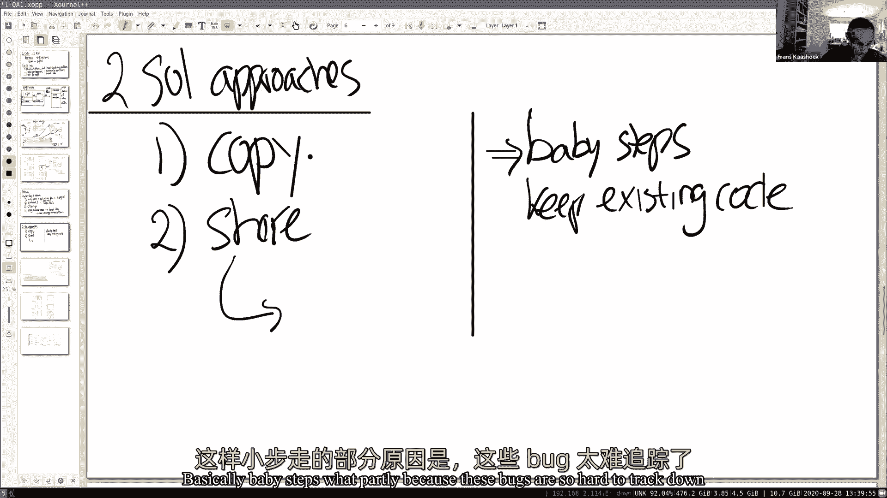

## 🧩 第二部分：为每个进程复制内核页表

上一节我们分析了初始进程的页表布局，本节中我们来看看实验的第二部分：为每个进程创建独立的内核页表副本。

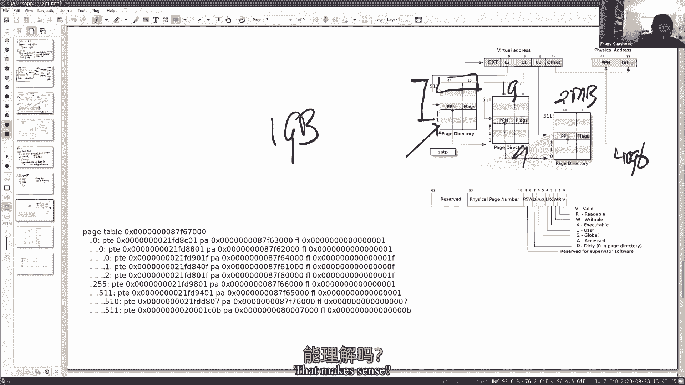

这部分的任务是修改内核，使得每个进程都有自己的内核页表副本，而不是共享一个全局内核页表。

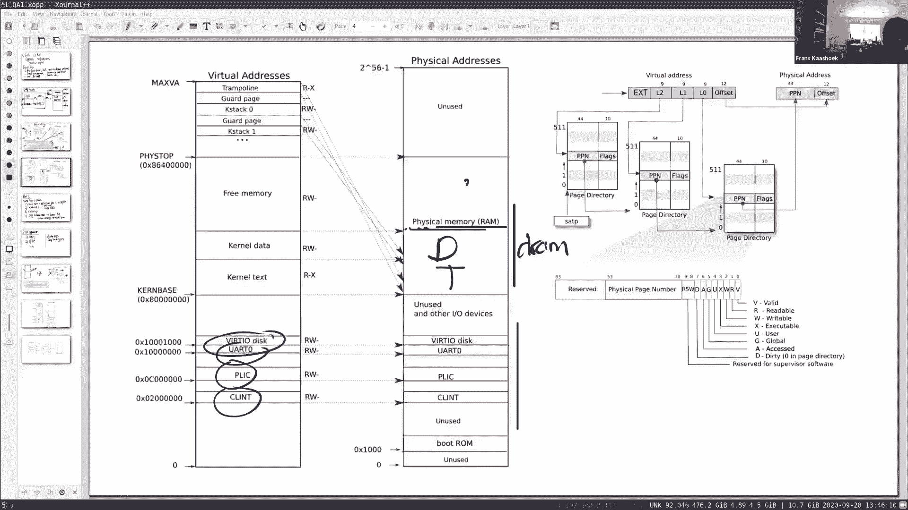

实现此任务主要有两种思路：
1.  **复制方法**：为每个进程分配新的页表页，并将全局内核页表的内容复制过去。
2.  **共享方法**：让进程的内核页表与全局内核页表共享那些不会被修改的条目（例如，映射内核代码和数据的较高地址条目），只独立创建和映射低地址部分（用户地址空间）。

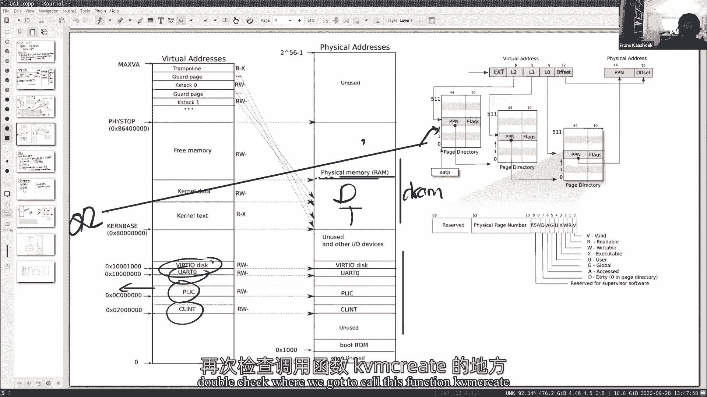

两种方法都是可行的。本教程示例采用**复制方法**，但只复制了全局内核页表中需要独立管理的部分条目（即低地址部分），而较高地址的条目通过复制页表项（PTE）来共享，以避免分配过多的新页面。

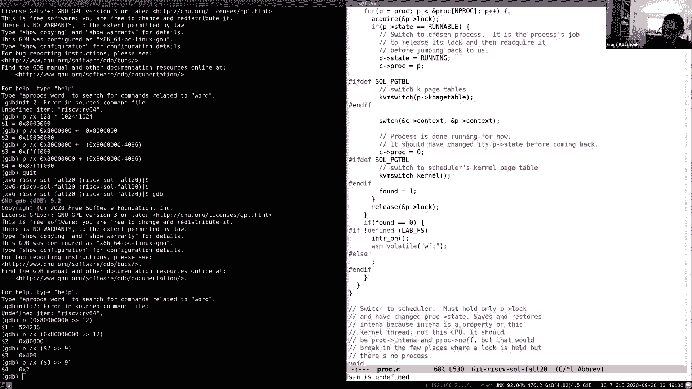

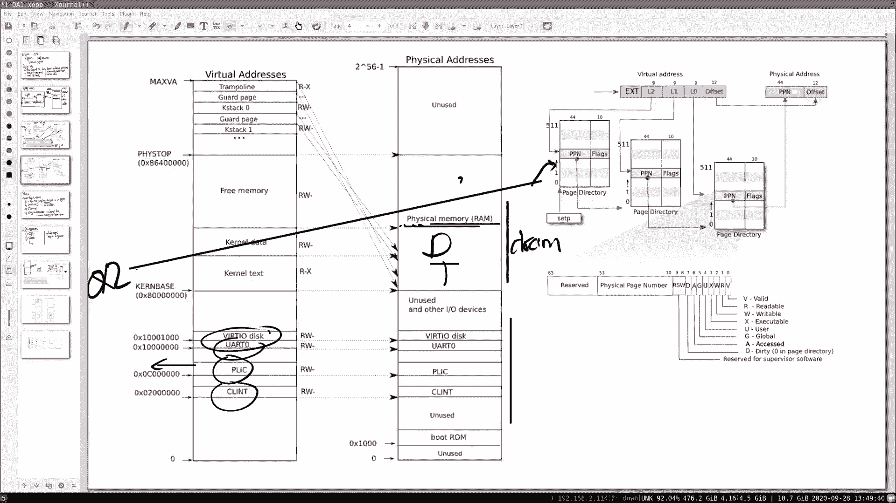

**关键实现步骤与注意事项**：
*   在 `proc` 结构体中添加字段来存储进程的内核页表指针。
*   实现一个函数（例如 `kvminit_new`）来创建进程的内核页表副本。在示例中，我们复制了全局内核页表的前 512 个条目中除 0 以外的条目（因为 0 条目区域将用于映射用户页表），并显式映射了必要的设备（如 UART、CLINT）。
*   在调度器（scheduler）切换进程时，需要将 `satp` 寄存器切换到目标进程的内核页表。当切换回空闲进程或调度器本身时，需要切换回全局内核页表。这是为了确保当一个进程退出并被清理时，其内核页表没有被任何正在运行的进程使用。
*   在用户态陷入内核的路径上（例如 `usertrap`），需要确保内核使用当前进程的内核页表运行。
*   必须小心处理内核页表的释放，确保不会释放仍被其他页表共享的页面。

**调试建议**：内核编程调试环境苛刻。建议采用“小步快跑”的策略，每次只做一两个修改并测试，保留可工作的旧代码以便回滚。页表错误可能导致的内核崩溃往往发生在错误操作很久之后，因此耐心和系统性排查至关重要。

---

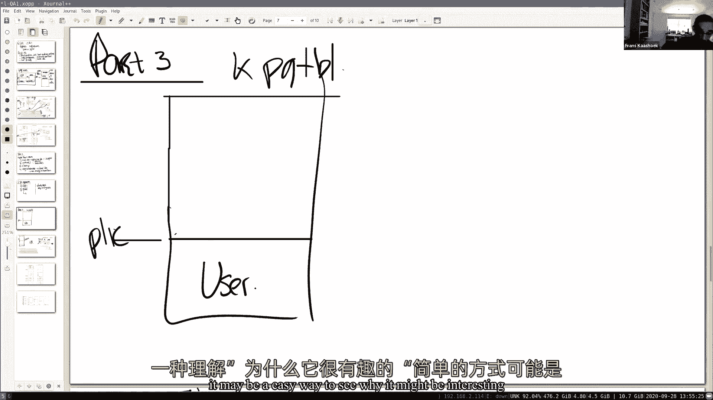

## 🔗 第三部分：将用户页表映射到内核页表

上一节我们探讨了如何为进程创建内核页表副本，本节中我们来看看第三部分：将用户地址空间映射到进程的内核页表中。

这部分的目标是修改内核的 `copyin`/`copyout` 等函数，使其能直接使用用户页表的映射在内核态解引用用户指针，而无需调用 `walk` 函数手动遍历页表进行地址转换。

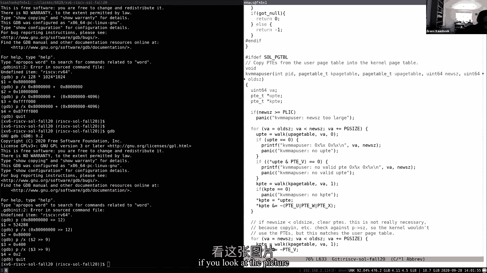

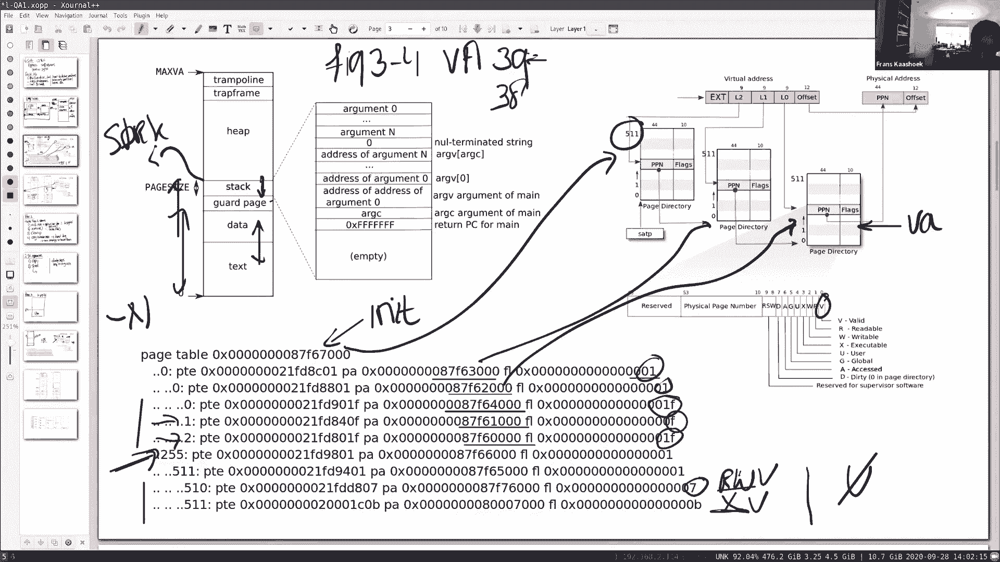

**这样做的好处**：
1.  **简化内核代码**：内核程序员无需关心用户数据的物理布局，硬件 MMU 会自动完成地址转换。
2.  **潜在的性能提升**：对于需要复制大量数据的系统调用（如 `read`/`write`），避免了反复调用软件 `walk` 函数的开销。
3.  **更灵活的数据操作**：如果内核只需要修改用户数据结构中的某个字段，可以直接通过映射后的地址进行读写，而无需完整地复制整个结构。

**实现方法**：
实现一个函数（例如 `kvm_map_user`），其核心逻辑是遍历用户页表，对于每一个有效的用户映射，将其页表项（PTE）复制到进程内核页表的对应位置。

**复制 PTE 时的权限调整**：
*   **U（用户）位**：必须清除。在 RISC-V 的默认配置下，如果内核态访问设置了 U 位的页面，会引发页错误。这主要是一种内核调试辅助机制，用于捕获内核意外访问用户内存的错误。
*   **W（写）位和 X（执行）位**：通常可以清除。因为在内核态执行 `copyin`/`copyout` 时，只是读取或写入用户数据，不需要执行其中的代码。保守起见，可以禁用这些权限。
*   **R（读）位和 V（有效）位**：保留。

**在 `fork` 和 `exec` 中的集成**：
*   在 `fork` 中，创建子进程时，需要将子进程的**用户页表**映射到子进程的**内核页表**中。不能映射父进程的用户页表，因为当父进程退出并清理其页表后，子进程的内核页表中会留下无效的映射。
*   在 `exec` 中，建立新的用户地址空间后，需要立即将其映射到当前进程的内核页表中。

**关于 `sbrk` 和初始进程**：`sbrk` 系统调用在增长或收缩用户堆时，也需要调用 `kvm_map_user` 来更新内核页表中的映射。初始进程（init）的创建也需要特殊处理，确保其第一个页面被映射到其内核页表中。

---

## 💎 总结与常见问题解答

本节课中，我们一起学习了“页表”实验的核心内容，涵盖了从打印页表到实现独立内核页表，再到映射用户空间的完整流程。

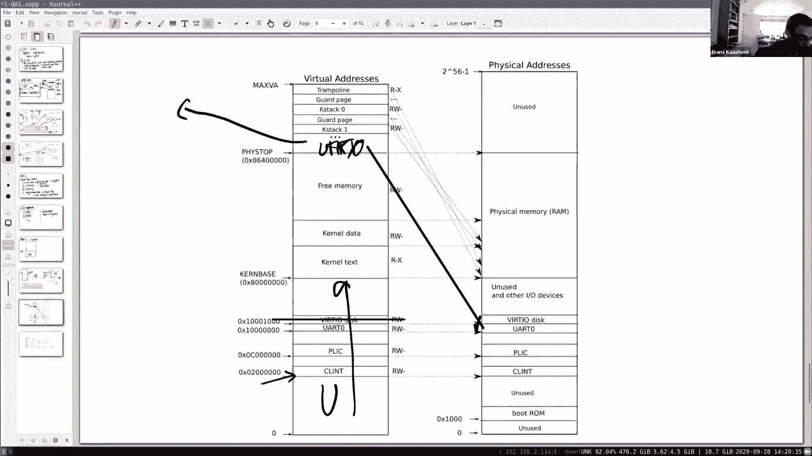

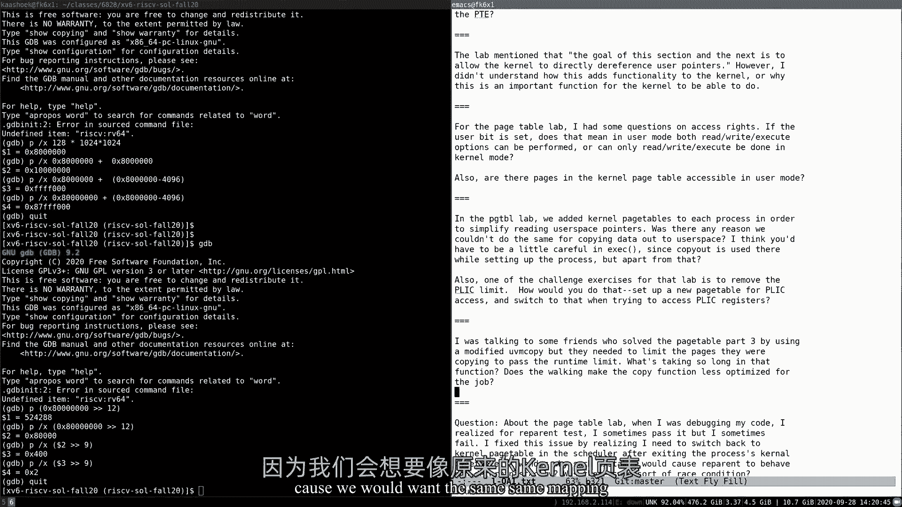

以下是针对一些常见问题的解答：

*   **问：为什么修改后的 `copyin` 不需要 `walk` 了？**
    *   答：因为用户地址空间已经直接映射到了进程的内核页表里。当内核使用用户虚拟地址时，硬件 MMU 会像处理普通内核地址一样，自动使用当前 `satp` 指向的页表（即进程的内核页表）进行翻译，无需软件干预。

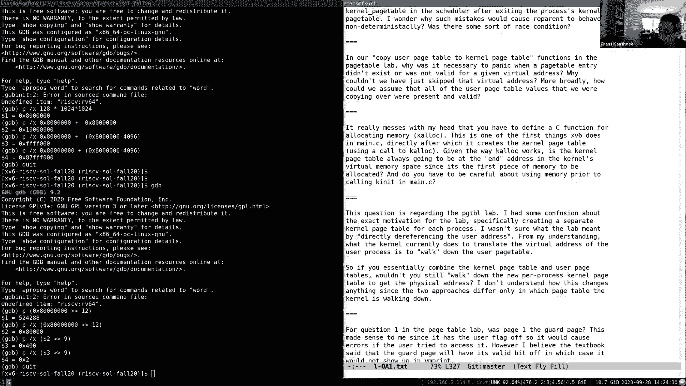

*   **问：如果用户程序比 CLINT 设备地址大怎么办？**
    *   答：实验假设用户程序不会大于 CLINT 的地址。在实际操作系统中，可以重新安排设备映射的位置（例如，映射到内核地址空间更高的未使用区域），从而为用户地址空间腾出更多空间。

*   **问：内核栈为什么映射在地址空间高处？**
    *   答：因为栈是向下增长的。将其放在高处并在其下方放置一个未映射的“保护页”，可以在栈溢出时立即触发页错误，这比破坏其他内核数据结构要好。保护页不消耗物理内存，这是虚拟内存的优势之一。

*   **问：有了独立的内核页表后，陷入/跳出内核时还需要切换页表吗？**
    *   答：是的，仍然需要。因为进程的内核页表只映射了当前进程的用户空间。当从内核返回用户态时，需要切换到该进程的用户页表。当从一个用户进程切换到另一个时，在调度器中需要切换 `satp` 到目标进程的内核页表。

*   **问：管道（pipe）的实现会受此实验影响吗？**
    *   答：会的。管道涉及将数据从用户空间复制到内核缓冲区。本实验的修改简化了这部分复制代码，因为内核可以直接解引用用户指针，无需再调用 `walk`。

希望本次讲解能帮助你更好地理解虚拟内存和页表实验。这些概念和调试经验将对后续涉及虚拟内存的实验大有裨益。